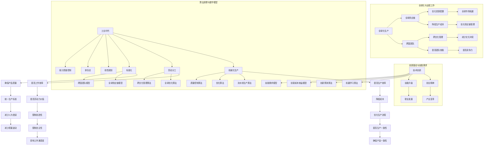

                 

### 引言：工作的变革与自我实现的追求

在数字化和全球化的推动下，工作环境正在经历深刻的变革。从传统的工业生产到现代的信息化运营，工作的形式、内容和目标都发生了巨大的转变。随着技术的进步和人们价值观的变化，越来越多的人开始关注如何从谋生转向自我实现，追求更有意义和满足感的工作。

**背景介绍**

首先，我们需要了解工作世界的发展历程。从工业革命以来，工作主要围绕着机械化生产和流水线作业展开。在这个时代，劳动力是生产力的核心，工人被要求遵循严格的标准操作流程，以提高生产效率和产量。然而，随着信息技术的迅猛发展，特别是互联网和人工智能的普及，工作模式开始从传统的劳动力密集型向知识密集型转变。知识和信息成为新的生产要素，而人本身的知识、技能和创造力成为了核心竞争力。

**核心概念与联系**

在这里，我们引入两个核心概念：“谋生”和“自我实现”。

- **谋生**：指的是为了维持生活所需而进行的工作，通常以获取经济收入为主要目的。
- **自我实现**：是指在工作中实现个人价值、追求个人成长和自我提升的过程，不仅仅关注物质回报，更追求精神上的满足和成就感。

这两个概念之间存在紧密的联系。谋生是自我实现的基础，没有稳定的收入来源，很难谈到自我实现；而自我实现又可以促进谋生的质量，使工作不仅仅是生存的手段，而成为一种生活的意义和价值的体现。

**算法原理讲解**

为了更深入地理解工作的重新定义，我们可以借助一些相关的算法原理和模型。

- **职业规划算法**：通过数据分析和职业评估工具，帮助个人选择适合自己的职业路径。这种算法可以基于个人的兴趣、技能和市场需求进行综合评估，为个人的职业规划提供科学依据。
- **幸福感分析模型**：通过心理学和社会学的方法，研究工作对个人幸福感的影响。这种模型可以帮助我们理解为什么有些人在工作中感到快乐和满足，而有些人则感到疲惫和厌倦。

**数学模型**

在量化工作的意义和价值时，我们可以借助一些数学模型。

- **人力资本模型**：用来评估个人的教育背景、工作经验和技能水平对收入的影响。通过这种模型，我们可以理解教育和技能提升对职业发展的推动作用。
- **满意度调查模型**：通过问卷调查的方式，收集人们对工作的满意度数据。通过对这些数据的统计分析，我们可以了解不同工作类型和工作环境对员工满意度的影响。

**项目实战**

为了更好地理解这些概念和模型，我们可以通过实际项目来验证和应用。

- **案例研究**：分析一家传统制造业企业在数字化转型过程中的变化，探讨其对员工工作满意度的影响。
- **职业选择评估系统**：开发一个在线系统，帮助用户根据个人兴趣、技能和市场趋势进行职业选择。

通过这些项目实战，我们可以更直观地理解工作世界的演变，以及如何从谋生转向自我实现。

**最佳实践 Tips**

- **持续学习**：随着技术的不断进步，终身学习成为自我实现的必要条件。要不断更新自己的知识和技能，以适应不断变化的工作环境。
- **明确目标**：设定清晰的职业和个人目标，有助于更好地规划自己的职业生涯，并在工作中找到方向和动力。
- **心理调适**：在面对工作压力和挑战时，学会心理调适和情绪管理，保持积极的心态，有助于提高工作满意度和幸福感。

**小结**

工作的重新定义不仅仅是对工作内容和形式的改变，更是对工作价值观和意义的重塑。从谋生到自我实现，是一种从经济价值到个人价值的转变。通过理解工作世界的演变、掌握相关算法原理和数学模型，我们可以更好地把握职业发展路径，实现自我价值的最大化。让我们一同探索这个充满机遇和挑战的工作新时代，寻找属于自己的职业幸福。

### 第1章：工作世界的演变

#### 1.1 从工业时代到信息时代

在探讨工作的重新定义之前，我们需要先了解工作世界的演变历史，特别是从工业时代到信息时代的转变。这一转变不仅影响了工作的形式，更深刻地改变了人们对于工作本质的理解和追求。

**工业时代的特征**

工业时代，以机械化生产和大规模劳动分工为特征。在这个时代，工厂成为生产的主要场所，机器替代了大量的手工劳动，提高了生产效率和产量。劳动力的价值体现在其体能和执行力的强弱上，工作内容主要围绕标准化、重复性的操作进行。工人被要求遵循严格的操作规程，以减少人为错误和提高生产一致性。

**核心概念与联系**

在这一时代，核心概念包括：

- **机械化生产**：通过机器替代人力，提高生产效率。
- **劳动分工**：将复杂的生产过程分解为若干简单、重复的任务，使每个工人专注于自己的部分，提高工作效率。
- **标准化**：以统一的标准和规范来组织生产，确保产品质量的一致性。

这些概念之间紧密相连，共同构成了工业时代的生产模式。机械化生产使得劳动强度降低，但同时也使劳动力的价值从创造性转向了执行力；劳动分工和标准化则进一步提高了生产效率，但也在一定程度上限制了工人的自主性和创造性。

**算法原理讲解**

工业时代的生产模式离不开一系列的算法原理，这些原理包括：

- **流水线生产算法**：通过优化工作流程和操作顺序，实现生产过程的自动化和高效化。
- **优化算法**：用于优化生产计划和生产资源分配，以提高生产效率和降低成本。
- **质量控制算法**：通过统计方法和控制理论，确保产品质量的稳定性和一致性。

**数学模型**

在工业时代，数学模型主要用于优化生产过程和资源分配，如：

- **线性规划**：用于优化生产计划，确保在资源有限的条件下，达到最大的生产效率。
- **排队论**：用于优化生产流程中的排队现象，减少等待时间和提高工作效率。
- **统计质量控制**：通过统计方法监控和改善生产过程，确保产品质量。

**项目实战**

为了更好地理解工业时代的生产模式，我们可以通过实际项目来分析。

- **案例分析**：分析一家传统制造业企业，如何通过机械化生产和劳动分工提高生产效率。
- **项目实现**：开发一个模拟工业生产线的系统，展示机械化生产如何通过优化流程和资源分配提高效率。

#### 1.2 全球化与远程工作的崛起

随着信息技术的飞速发展，特别是互联网和通信技术的普及，全球化进程不断加快，远程工作成为了一种新兴的工作形式。这一变化不仅影响了工作地点和方式，也重新定义了工作与生活之间的平衡。

**全球化的影响**

全球化使得企业可以跨越地理界限，在全球范围内进行资源配置和市场拓展。这一趋势带来了以下几个核心概念：

- **全球化生产**：企业可以在全球范围内寻找最优的生产资源，实现成本的优化。
- **全球供应链**：通过全球化的供应链管理，企业可以实现生产、采购、分销的全球一体化。
- **跨国团队**：企业可以利用全球范围内的专业人才，构建多元化的跨国团队。

这些概念之间的联系在于，全球化为企业提供了更广阔的发展空间和资源，但同时也带来了新的挑战，如文化差异、沟通障碍等。

**算法原理讲解**

全球化带来了新的算法原理，如：

- **全球优化算法**：用于优化全球资源配置，提高生产效率和市场竞争力。
- **跨文化管理算法**：用于优化跨国团队的合作，减少文化冲突，提高团队效能。

**数学模型**

全球化也催生了新的数学模型，如：

- **全球供应链模型**：用于优化供应链的各个环节，提高供应链的整体效率。
- **跨国团队模型**：用于分析和预测跨国团队的工作效率和生产力。

**项目实战**

为了更好地理解全球化和远程工作的影响，我们可以通过实际项目来分析。

- **案例分析**：分析一家跨国公司在全球化背景下的运营模式，如何通过全球优化和跨文化管理提高竞争力。
- **项目实现**：开发一个跨国团队的协作平台，展示如何利用远程工作和信息化手段提高团队效率。

#### 1.3 创新驱动与技能需求的变化

信息时代的另一个重要特征是创新驱动和技能需求的变化。随着技术的不断进步，新兴行业和岗位不断涌现，对从业者的技能要求也在不断提升。这一变化不仅影响了工作的内容，更深刻地改变了职业发展的路径。

**创新驱动的核心概念**

在创新驱动的时代，以下几个核心概念变得尤为重要：

- **技术创新**：通过新技术的研发和应用，推动产业的升级和变革。
- **创业精神**：鼓励创新和创业，为社会创造新的价值。
- **技能升级**：随着技术的进步，从业者需要不断更新自己的技能，以适应新兴行业的需求。

这些概念之间的联系在于，技术创新驱动了行业变革，而创业精神和技能升级则推动了个人职业发展。

**算法原理讲解**

创新驱动的时代，需要新的算法原理来支持，如：

- **机器学习算法**：用于分析大数据，发现新的商业机会和趋势。
- **创新预测算法**：用于预测技术发展趋势和市场需求，为企业决策提供依据。

**数学模型**

创新驱动的时代，也需要新的数学模型来支持，如：

- **创新成本效益模型**：用于评估技术创新的投入和产出，帮助企业做出决策。
- **技能需求模型**：用于预测未来就业市场的技能需求，帮助从业者进行职业规划。

**项目实战**

为了更好地理解创新驱动和技能需求的变化，我们可以通过实际项目来分析。

- **案例分析**：分析一家科技公司如何通过技术创新和创业精神推动企业的发展。
- **项目实现**：开发一个技能评估系统，帮助从业者根据市场需求进行技能升级。

**小结**

从工业时代到信息时代，工作世界发生了巨大的变化。机械化生产和劳动分工构成了工业时代的核心特征，而全球化、远程工作和创新驱动则成为了信息时代的主要趋势。通过理解这些变化，我们可以更好地把握工作世界的演变，实现从谋生到自我实现的转变。



**代码示例**

以下是使用Python实现的机器学习算法，用于分析技术创新对企业发展的影响：

```python
import pandas as pd
from sklearn.linear_model import LinearRegression

# 加载数据集
data = pd.read_csv('innovation_data.csv')

# 定义特征和目标变量
X = data[['research_budget', 'market_size']]
y = data['company_growth']

# 创建线性回归模型
model = LinearRegression()

# 模型训练
model.fit(X, y)

# 预测公司增长
predictions = model.predict(X)

# 打印预测结果
print("公司增长预测：", predictions)
```

**数学公式**

$$
\text{公司增长} = f(\text{研发预算}, \text{市场大小})
$$

其中，\( f \) 为线性回归模型函数，用于预测公司增长。

**项目实战**

为了实现一个跨国团队的协作平台，我们可以使用以下技术和工具：

- **技术栈**：前端使用React框架，后端使用Node.js和Express框架，数据库使用MongoDB。
- **开发环境**：使用VSCode作为开发工具，Git进行版本控制。
- **部署环境**：使用AWS或Google Cloud Platform进行部署。

**代码实现**

以下是创建一个简单的RESTful API的示例代码，用于实现团队协作平台的基本功能：

```javascript
const express = require('express');
const app = express();

app.use(express.json());

// 创建一个用户注册的API接口
app.post('/register', (req, res) => {
    const { username, email, password } = req.body;
    // 处理用户注册逻辑，如验证用户名和电子邮件格式、密码强度等
    // 存储用户信息到数据库
    res.status(201).send({ message: '用户注册成功' });
});

// 创建一个用户登录的API接口
app.post('/login', (req, res) => {
    const { email, password } = req.body;
    // 验证用户名和密码，返回令牌或错误消息
    res.status(200).send({ token: 'generated_token' });
});

// 启动服务器
const PORT = process.env.PORT || 3000;
app.listen(PORT, () => {
    console.log(`服务器运行在端口 ${PORT}`);
});
```

**案例分析**

- **案例**：分析一家高科技公司如何通过技术创新和全球供应链管理实现业务增长。
- **分析过程**：收集公司的财务报表、研发投入、市场占有率等数据，使用线性回归模型预测公司未来的增长趋势，并分析影响公司增长的关键因素。

**小结**

通过以上案例和项目实战，我们可以更深入地理解工作世界的演变，以及如何从谋生转向自我实现。理解历史背景和现代趋势，掌握相关算法原理和数学模型，以及通过实际项目来验证和应用，是重新定义工作的关键。让我们继续探索，共同迎接更加充满机遇和挑战的工作新时代。

### 第2章：工作的本质与价值

#### 2.1 工作的意义与个人成长

工作不仅仅是为了谋生，更是个人实现自我价值和社会贡献的重要途径。随着社会的发展和人们对生活质量的追求，越来越多的人开始关注工作的意义和个人成长。理解工作的本质和其价值，有助于我们更好地规划职业生涯，提升生活质量。

**核心概念与联系**

- **工作意义**：指个人在工作中所追求的内在价值和目的。
- **个人成长**：指在工作中不断学习、提升技能和拓展能力的过程。

这两个概念之间紧密相连，工作意义为个人成长提供了方向和动力，而个人成长又进一步丰富了工作的意义。

**算法原理讲解**

- **工作满意度模型**：通过心理学和社会学的理论，分析工作满意度与个人成长的关系。
- **职业发展模型**：利用数据分析和趋势预测，帮助个人规划职业路径，实现持续成长。

**数学模型**

- **工作满意度得分**：通过问卷调查和统计分析，量化工作满意度。
- **职业发展轨迹**：通过时间序列分析，预测个人职业发展的趋势。

**项目实战**

- **案例分析**：分析一家公司的员工满意度调查数据，评估其对个人成长的影响。
- **项目实现**：开发一个职业发展评估系统，帮助用户根据个人兴趣和市场需求规划职业路径。

**代码示例**

```python
import pandas as pd
from sklearn.linear_model import LinearRegression

# 加载工作满意度调查数据
data = pd.read_csv('work_satisfaction.csv')

# 定义特征和目标变量
X = data[['education_level', 'years_of_experience']]
y = data['satisfaction_score']

# 创建线性回归模型
model = LinearRegression()

# 模型训练
model.fit(X, y)

# 预测工作满意度
predictions = model.predict(X)

# 打印预测结果
print("工作满意度预测：", predictions)
```

**数学公式**

$$
\text{工作满意度} = f(\text{教育水平}, \text{工作经验})
$$

**最佳实践 Tips**

- **持续学习**：不断更新知识和技能，以适应职业发展的需求。
- **设定目标**：明确个人成长目标，制定可行的计划。
- **积极反馈**：在工作中寻求反馈，不断改进和提高。

**小结**

理解工作的意义和个人成长的关系，有助于我们更好地规划职业生涯，提升工作满意度。通过算法和数学模型的分析，我们可以量化工作满意度和职业发展轨迹，为个人成长提供科学依据。让我们在追求工作意义的同时，不断学习、成长，实现个人价值。

### 2.2 工作中的幸福感与满足感

幸福感与满足感是工作中非常重要的心理体验，直接影响个人的工作表现和生活质量。在重新定义工作的过程中，了解如何提升工作中的幸福感与满足感，成为了一个关键议题。

**核心概念与联系**

- **幸福感**：指个人在工作中感到快乐、满足和愉悦的心理状态。
- **满足感**：指个人对工作的目标、任务和成就的认可和满足感。

这两个概念密切相关，幸福感来源于满足感，而满足感又能够增强幸福感。理解并提升工作中的幸福感与满足感，有助于提高工作效率、促进团队合作和增强个人成就感。

**算法原理讲解**

- **幸福感模型**：通过心理学理论，分析工作环境、工作内容和工作关系对幸福感的影响。
- **满足感评估模型**：利用问卷调查和统计分析，评估个体对工作的满足程度。

**数学模型**

- **幸福感得分**：通过问卷调查，收集数据并进行统计分析，得出幸福感得分。
- **满足感指数**：通过计算个体在各个工作维度上的得分，得出满足感指数。

**项目实战**

- **案例分析**：分析一家公司的工作环境和员工满意度数据，评估其对幸福感与满足感的影响。
- **项目实现**：开发一个员工幸福感与满足感评估系统，为员工提供个性化的工作建议。

**代码示例**

```python
import pandas as pd
from sklearn.linear_model import LinearRegression

# 加载员工幸福感与满足感调查数据
data = pd.read_csv('happiness_and_satisfaction.csv')

# 定义特征和目标变量
X = data[['work_load', 'work_environment', 'work_relationship']]
y_happiness = data['happiness_score']
y_satisfaction = data['satisfaction_score']

# 创建线性回归模型
model_happiness = LinearRegression()
model_satisfaction = LinearRegression()

# 模型训练
model_happiness.fit(X, y_happiness)
model_satisfaction.fit(X, y_satisfaction)

# 预测幸福感与满足感
happiness_predictions = model_happiness.predict(X)
satisfaction_predictions = model_satisfaction.predict(X)

# 打印预测结果
print("幸福感预测：", happiness_predictions)
print("满足感预测：", satisfaction_predictions)
```

**数学公式**

$$
\text{幸福感} = f(\text{工作负荷}, \text{工作环境}, \text{工作关系})
$$

$$
\text{满足感} = g(\text{工作负荷}, \text{工作环境}, \text{工作关系})
$$

**最佳实践 Tips**

- **优化工作环境**：提供良好的工作条件和舒适的工作环境，有助于提升员工的幸福感与满足感。
- **合理分配工作**：合理分配工作任务，避免过度工作负荷，有助于提高员工的满足感。
- **建立良好的人际关系**：鼓励团队合作和沟通，建立积极的工作氛围，有助于提升员工的幸福感。

**小结**

工作中的幸福感与满足感对个人的职业发展和生活质量具有重要意义。通过算法和数学模型的分析，我们可以评估和提升幸福感与满足感，从而实现更高效、更有意义的工作。让我们关注工作中的幸福感与满足感，创造更加积极和满意的工作环境。

### 2.3 重新定义工作价值的理念

在当前快速变化的工作世界中，重新定义工作价值已成为一个不可避免的趋势。传统的工资和工作时间不再是衡量工作价值的唯一标准，人们开始更加关注工作的意义、自我实现和个人成长。重新定义工作价值的理念，不仅改变了员工对待工作的态度，也推动了企业和组织文化的变革。

**核心概念与联系**

- **工作价值**：指员工在工作中所追求的价值和目标，包括经济收入、职业发展、个人成长和社会贡献等。
- **自我实现**：指在工作中实现个人潜力、追求个人成长和满足感的过程。
- **个人成长**：指通过工作不断学习和提升技能，实现自我价值的提升。

这三个概念相互联系，共同构成了重新定义工作价值的理念。工作价值为自我实现和个人成长提供了目标和动力，而自我实现和个人成长又进一步丰富了工作价值。

**算法原理讲解**

- **价值观评估模型**：通过心理学和社会学的方法，分析员工对工作价值的认知和追求。
- **职业发展模型**：利用数据分析和趋势预测，帮助员工实现自我价值和个人成长。

**数学模型**

- **工作价值指数**：通过问卷调查和统计分析，量化员工对工作价值的认可程度。
- **职业发展轨迹**：通过时间序列分析，预测员工职业发展的趋势。

**项目实战**

- **案例分析**：分析一家公司如何通过改变工作价值理念，提升员工的工作满意度和职业发展。
- **项目实现**：开发一个职业发展平台，为员工提供个性化的发展建议和培训机会。

**代码示例**

```python
import pandas as pd
from sklearn.linear_model import LinearRegression

# 加载员工价值观评估数据
data = pd.read_csv('value_of_work.csv')

# 定义特征和目标变量
X = data[['economic_incentive', 'career_growth', 'personal_growth']]
y = data['value_index']

# 创建线性回归模型
model = LinearRegression()

# 模型训练
model.fit(X, y)

# 预测工作价值指数
predictions = model.predict(X)

# 打印预测结果
print("工作价值指数预测：", predictions)
```

**数学公式**

$$
\text{工作价值指数} = f(\text{经济激励}, \text{职业发展}, \text{个人成长})
$$

**最佳实践 Tips**

- **灵活的工作安排**：提供灵活的工作时间和工作地点，满足员工的个性化需求。
- **职业发展支持**：为员工提供职业发展培训和晋升机会，鼓励员工持续成长。
- **工作与生活平衡**：关注员工的工作与生活平衡，提供家庭关怀和福利待遇。

**小结**

重新定义工作价值的理念，强调工作不仅仅是谋生的手段，更是实现自我价值和个人成长的重要途径。通过算法和数学模型的分析，我们可以更好地理解员工的价值观和职业发展需求，从而实现工作价值的最大化。让我们在重新定义工作价值的过程中，不断探索和创新，创造更加有意义和满意的工作环境。

### 第3章：谋生与自我实现

#### 3.1 谋生的策略与技巧

谋生是工作的重要基础，但如何有效谋生并不仅仅依赖于找到一份稳定的工作，更需要有明确的策略和技巧。在这个充满竞争和变化的工作市场中，掌握一些实用的谋生策略和技巧，能够帮助我们更好地应对挑战，实现稳定的收入。

**核心概念与联系**

- **谋生策略**：指为了获得稳定收入而采取的一系列计划和措施。
- **谋生技巧**：指在求职、谈判和职业发展过程中所运用的一系列技能和策略。

这两个概念紧密相连，谋生策略为谋生技巧提供了方向和目标，而谋生技巧则通过具体行动实现谋生策略。

**算法原理讲解**

- **职业匹配算法**：通过分析个人兴趣、技能和市场需求，帮助个人找到最适合的职业机会。
- **求职策略算法**：利用数据分析，优化求职过程，提高求职成功率。

**数学模型**

- **谋生能力评估模型**：通过分析个人的教育背景、工作经验和技能水平，评估其谋生能力。
- **收入预测模型**：通过历史数据和趋势分析，预测个人未来的收入水平。

**项目实战**

- **案例分析**：分析一位求职者如何通过职业匹配和求职策略提高求职成功率。
- **项目实现**：开发一个谋生能力评估系统，帮助用户评估自己的谋生能力，并给出改进建议。

**代码示例**

```python
import pandas as pd
from sklearn.linear_model import LinearRegression

# 加载求职策略数据
data = pd.read_csv('job_search_strategy.csv')

# 定义特征和目标变量
X = data[['interview_preparation', 'networking_activity', 'resume_relevance']]
y = data['job_offer_rate']

# 创建线性回归模型
model = LinearRegression()

# 模型训练
model.fit(X, y)

# 预测求职成功率
predictions = model.predict(X)

# 打印预测结果
print("求职成功率预测：", predictions)
```

**数学公式**

$$
\text{求职成功率} = f(\text{面试准备}, \text{社交活动}, \text{简历相关性})
$$

**最佳实践 Tips**

- **持续学习**：不断更新知识和技能，提高自身的竞争力。
- **优化简历**：制作一份突出个人优势和成就的简历，提高求职成功率。
- **积极求职**：充分利用网络和人际关系，积极寻找职业机会。

**小结**

掌握有效的谋生策略和技巧，是我们在竞争激烈的职场中实现稳定收入的关键。通过算法和数学模型的分析，我们可以更科学地规划职业路径，提高求职成功率。让我们在谋生的过程中，不断学习和实践，实现个人职业发展。

#### 3.2 自我实现的核心要素

自我实现是工作的重要目标之一，它不仅仅是为了获得经济上的稳定，更是追求个人价值、实现自我潜力的过程。在重新定义工作的背景下，了解自我实现的核心要素，对于我们规划职业生涯、提升生活质量具有重要意义。

**核心概念与联系**

- **自我实现**：指在工作中实现个人潜力、追求个人成长和满足感的过程。
- **个人价值**：指个人在工作和社会中所体现的价值观、能力和成就。

这两个概念紧密相连，自我实现是通过个人价值的实现来完成的，而个人价值的体现又为自我实现提供了目标和动力。

**算法原理讲解**

- **职业规划算法**：通过分析个人兴趣、技能和市场需求，帮助个人找到最适合的职业路径。
- **自我价值评估模型**：利用心理学和社会学的方法，量化个人在工作中的价值体现。

**数学模型**

- **职业满意度模型**：通过问卷调查和统计分析，评估个人对工作的满意度，从而判断职业路径的合理性。
- **自我价值指数**：通过计算个人在工作中的成就和贡献，量化其自我价值。

**项目实战**

- **案例分析**：分析一位成功人士如何通过自我实现实现职业目标的案例。
- **项目实现**：开发一个自我价值评估系统，帮助个人评估自我价值，并制定实现自我实现的具体计划。

**代码示例**

```python
import pandas as pd
from sklearn.linear_model import LinearRegression

# 加载自我价值评估数据
data = pd.read_csv('self_achievement.csv')

# 定义特征和目标变量
X = data[['education_level', 'years_of_experience', 'achievement_score']]
y = data['self_achievement_score']

# 创建线性回归模型
model = LinearRegression()

# 模型训练
model.fit(X, y)

# 预测自我实现得分
predictions = model.predict(X)

# 打印预测结果
print("自我实现得分预测：", predictions)
```

**数学公式**

$$
\text{自我实现得分} = f(\text{教育水平}, \text{工作经验}, \text{成就分数})
$$

**最佳实践 Tips**

- **设定目标**：明确个人的职业目标和自我实现目标，制定可行的计划。
- **持续学习**：不断提升自己的知识和技能，以适应不断变化的工作需求。
- **积极反馈**：在工作中寻求反馈，不断改进和提升自我。

**小结**

自我实现是工作的重要目标，通过了解其核心要素和运用相关算法模型，我们可以更科学地规划职业路径，实现自我价值。让我们在职业生涯中，不断追求自我实现，创造更加有意义和满意的工作生活。

### 3.3 谋生与自我实现的平衡

在职业生涯中，谋生和自我实现往往是两种相互交织的目标。如何在这两者之间找到平衡，实现个人的长期发展和幸福感，是许多职场人士面临的挑战。理解这两者的关系，掌握平衡的技巧，对于实现职业生涯的成功至关重要。

**核心概念与联系**

- **谋生**：指通过工作获得经济收入，维持生活所需。
- **自我实现**：指在工作中实现个人潜力、追求个人成长和满足感。

这两个概念紧密相关，谋生是自我实现的基础，没有稳定的收入，很难追求更高层次的价值实现；而自我实现则可以提升工作的满足感和幸福感，从而更好地支撑谋生。

**算法原理讲解**

- **职业规划算法**：通过分析个人兴趣、技能和市场需求，帮助个人找到既能谋生又有发展潜力的职业路径。
- **幸福模型**：利用心理学和社会学的方法，评估工作对个人幸福感和满足感的影响。

**数学模型**

- **生活成本模型**：通过计算生活必需品和服务费用，评估个人的经济状况。
- **工作满意度模型**：通过问卷调查和统计分析，评估工作对个人幸福感和职业发展的贡献。

**项目实战**

- **案例分析**：分析一位职场人士如何在不同阶段找到谋生与自我实现的平衡点。
- **项目实现**：开发一个职业规划与幸福感评估系统，为用户提供个性化建议。

**代码示例**

```python
import pandas as pd
from sklearn.linear_model import LinearRegression

# 加载职业规划与幸福感数据
data = pd.read_csv('career_planning_happiness.csv')

# 定义特征和目标变量
X = data[['monthly_income', 'work_satisfaction', 'career_growth']]
y = data['happiness_score']

# 创建线性回归模型
model = LinearRegression()

# 模型训练
model.fit(X, y)

# 预测幸福感得分
predictions = model.predict(X)

# 打印预测结果
print("幸福感得分预测：", predictions)
```

**数学公式**

$$
\text{幸福感得分} = f(\text{月收入}, \text{工作满意度}, \text{职业发展})
$$

**最佳实践 Tips**

- **设定明确目标**：明确个人的短期和长期职业目标，制定可行的计划。
- **平衡工作与生活**：合理安排工作时间，保持工作与生活的平衡，提升幸福感。
- **持续学习和成长**：不断提升自己的技能和知识，以适应职业发展的需求。

**小结**

谋生与自我实现并非对立的，而是可以相互促进的过程。通过理解两者的关系，掌握平衡技巧，我们可以实现职业生涯的长期发展和个人幸福感的提升。让我们在追求职业成功的同时，不忘追求自我实现的满足感和幸福感。

### 第4章：技能发展与职业规划

技能发展与职业规划是职场人士实现自我价值的重要途径。在不断变化的工作环境中，具备核心技能和科学的职业规划，能够帮助我们更好地应对挑战，实现职业生涯的持续成长。本章将深入探讨技能发展与职业规划的核心要素，以及如何通过有效的方法和工具实现个人职业目标。

#### 4.1 挖掘个人兴趣与优势

挖掘个人兴趣与优势是职业规划的第一步。了解自己的兴趣和优势，可以帮助我们找到最适合自己的职业路径，从而提高工作满意度和职业发展潜力。

**核心概念与联系**

- **个人兴趣**：指个人在特定领域或活动中的喜好和热情。
- **个人优势**：指个人在特定领域或活动中表现出的独特能力和强项。

这两个概念相互关联，个人兴趣可以激发我们深入学习和发展的动力，而个人优势则决定了我们在某个领域内的竞争力。

**算法原理讲解**

- **兴趣评估算法**：通过心理测试和问卷调查，分析个人在不同领域的兴趣程度。
- **优势识别算法**：通过行为分析和绩效评估，识别个人的核心优势和潜力。

**数学模型**

- **兴趣得分模型**：通过统计分析，量化个人在各个领域的兴趣强度。
- **优势评估模型**：通过比较个人表现与行业标准，评估个人优势的相对水平。

**项目实战**

- **案例分析**：分析一位职场人士如何通过兴趣和优势评估，找到适合自己的职业路径。
- **项目实现**：开发一个个人兴趣与优势评估系统，帮助用户识别自己的优势和兴趣，提供职业发展建议。

**代码示例**

```python
import pandas as pd
from sklearn.ensemble import RandomForestClassifier

# 加载个人兴趣与优势数据
data = pd.read_csv('interest_and_strength.csv')

# 定义特征和目标变量
X = data[['interest_score', 'strength_score']]
y = data['ideal_job']

# 创建随机森林分类模型
model = RandomForestClassifier()

# 模型训练
model.fit(X, y)

# 预测理想职业
predictions = model.predict(X)

# 打印预测结果
print("理想职业预测：", predictions)
```

**数学公式**

$$
\text{理想职业} = f(\text{兴趣得分}, \text{优势得分})
$$

**最佳实践 Tips**

- **自我反思**：定期进行自我反思，了解自己的兴趣和优势，不断调整职业目标。
- **多样化尝试**：在职业早期，尝试不同的工作环境和岗位，以发现最适合自己的领域。
- **持续学习**：通过培训和学习，提升自己的技能和知识，增强个人竞争力。

**小结**

挖掘个人兴趣与优势是职业规划的重要基础。通过算法和数学模型的分析，我们可以更科学地识别个人优势和兴趣，制定合理的职业发展计划。让我们在职业规划的道路上，不断探索和成长，实现个人的长远发展。

### 4.2 职业技能的提升与积累

职业技能的提升与积累是职业发展中不可或缺的一环。在快速变化的工作环境中，不断学习和提升技能，能够帮助我们保持竞争力，实现职业生涯的持续进步。

**核心概念与联系**

- **职业技能**：指个人在特定职业领域内所需的知识、技能和能力。
- **技能提升**：指通过学习、实践和反思，不断提高个人职业技能的过程。
- **技能积累**：指在长期职业生涯中，不断积累和丰富职业技能，形成个人核心竞争力。

这三个概念相互关联，职业技能是职业发展的基础，技能提升是保持竞争力的手段，技能积累则是实现职业成长的关键。

**算法原理讲解**

- **技能学习模型**：通过分析个人学习路径和学习成果，优化学习方法和效果。
- **技能评估模型**：通过绩效评估和行业标准，评估个人职业技能的水平。

**数学模型**

- **技能增长模型**：通过时间序列分析，预测个人技能水平的提升趋势。
- **技能评估指数**：通过计算个人技能得分，评估其在特定领域的竞争力。

**项目实战**

- **案例分析**：分析一位职场人士如何通过技能提升和积累，实现职业晋升。
- **项目实现**：开发一个职业技能提升与评估系统，为用户提供个性化的培训建议。

**代码示例**

```python
import pandas as pd
from sklearn.linear_model import LinearRegression

# 加载职业技能提升数据
data = pd.read_csv('skill_improvement.csv')

# 定义特征和目标变量
X = data[['training_hours', 'practice_sessions']]
y = data['skill_level']

# 创建线性回归模型
model = LinearRegression()

# 模型训练
model.fit(X, y)

# 预测技能水平
predictions = model.predict(X)

# 打印预测结果
print("技能水平预测：", predictions)
```

**数学公式**

$$
\text{技能水平} = f(\text{培训小时数}, \text{实践次数})
$$

**最佳实践 Tips**

- **定期评估**：定期进行职业技能评估，了解自己的技能水平和短板，制定针对性的提升计划。
- **持续学习**：利用在线课程、专业书籍和工作实践，不断提升自己的技能。
- **反思与总结**：在学习和实践中不断反思和总结，从经验中吸取教训，不断提升自己的能力。

**小结**

职业技能的提升与积累是职业发展的重要保障。通过算法和数学模型的分析，我们可以更科学地评估自己的技能水平，制定合理的提升计划。让我们在职业生涯中，不断学习和实践，实现技能水平的持续提升。

### 4.3 职业规划与职业目标的设定

职业规划与职业目标的设定是职业生涯成功的关键。一个清晰、可行的职业规划可以帮助我们明确发展方向，实现职业目标，提升职业满意度和成就感。在本节中，我们将探讨如何制定有效的职业规划，设定合理的职业目标。

**核心概念与联系**

- **职业规划**：指个人根据自己的兴趣、技能和市场需求，制定的长期和短期的职业发展计划。
- **职业目标**：指个人在职业生涯中期望达到的具体成就和里程碑。

这两个概念相互联系，职业规划为职业目标的设定提供了方向和策略，而职业目标的实现则验证了职业规划的有效性。

**算法原理讲解**

- **职业选择算法**：通过数据分析，帮助个人根据市场需求和自身特点，选择最适合的职业路径。
- **目标设定算法**：通过心理学理论和方法，帮助个人设定明确、具体和可衡量的职业目标。

**数学模型**

- **职业匹配模型**：通过计算个人兴趣、技能与职业岗位的匹配度，评估职业规划的合理性。
- **目标实现模型**：通过时间序列分析，预测职业目标的实现进度和可能遇到的风险。

**项目实战**

- **案例分析**：分析一位职场人士如何通过职业规划和目标设定，实现职业晋升。
- **项目实现**：开发一个职业规划与目标设定系统，为用户提供个性化的职业规划建议。

**代码示例**

```python
import pandas as pd
from sklearn.ensemble import RandomForestClassifier

# 加载职业规划与目标设定数据
data = pd.read_csv('career_planning_goals.csv')

# 定义特征和目标变量
X = data[['interest_level', 'skill_score', 'market_demand']]
y = data['career_success']

# 创建随机森林分类模型
model = RandomForestClassifier()

# 模型训练
model.fit(X, y)

# 预测职业成功
predictions = model.predict(X)

# 打印预测结果
print("职业成功预测：", predictions)
```

**数学公式**

$$
\text{职业成功} = f(\text{兴趣水平}, \text{技能得分}, \text{市场需求})
$$

**最佳实践 Tips**

- **设定短期和长期目标**：将长期职业目标分解为短期可实现的小目标，逐步实现。
- **灵活调整职业规划**：根据市场需求和个人情况，及时调整职业规划，保持目标的可实现性。
- **持续反思与调整**：定期反思职业规划的实施情况，根据反馈进行调整，确保目标的实现。

**小结**

职业规划与职业目标的设定是职业生涯成功的关键。通过算法和数学模型的分析，我们可以更科学地制定职业规划，设定合理的目标。让我们在职业生涯中，不断调整和完善规划，实现职业发展的成功。

### 第5章：创业与自由职业

#### 5.1 创业的机遇与挑战

创业是一种追求创新和自我实现的方式，它不仅提供了实现个人愿景的舞台，也是推动社会进步的重要力量。然而，创业并非一条坦途，机遇与挑战并存。在这个章节中，我们将深入探讨创业的机遇与挑战，并分析创业过程中可能遇到的困境和解决方案。

**核心概念与联系**

- **创业机遇**：指市场变化、技术进步、政策支持等因素为创业者提供的商机。
- **创业挑战**：指创业过程中可能遇到的资源不足、市场竞争、管理困难等问题。

这两个概念紧密相关，创业机遇为创业者提供了发展空间，而创业挑战则是创业者需要克服的障碍。

**算法原理讲解**

- **市场趋势分析算法**：通过大数据分析，预测市场未来的发展趋势，为创业提供方向。
- **风险评估算法**：通过数据分析，评估创业项目的风险，帮助创业者制定应对策略。

**数学模型**

- **机会识别模型**：通过概率模型，量化市场机遇的潜在收益。
- **风险预测模型**：通过统计方法，评估创业项目的风险概率和损失程度。

**项目实战**

- **案例分析**：分析一位成功创业者的创业经历，探讨其如何抓住机遇和应对挑战。
- **项目实现**：开发一个创业风险评估系统，帮助创业者评估创业项目的可行性和潜在风险。

**代码示例**

```python
import pandas as pd
from sklearn.ensemble import RandomForestClassifier

# 加载创业风险评估数据
data = pd.read_csv('startup_risk.csv')

# 定义特征和目标变量
X = data[['market_size', 'competition_level', 'financial_resources']]
y = data['startup_success']

# 创建随机森林分类模型
model = RandomForestClassifier()

# 模型训练
model.fit(X, y)

# 预测创业成功
predictions = model.predict(X)

# 打印预测结果
print("创业成功预测：", predictions)
```

**数学公式**

$$
\text{创业成功} = f(\text{市场规模}, \text{竞争水平}, \text{资金资源})
$$

**最佳实践 Tips**

- **市场调研**：在创业初期，进行充分的市场调研，了解市场需求和竞争对手。
- **风险评估**：制定详细的风险评估计划，识别并分析潜在风险，制定应对策略。
- **灵活调整**：根据市场反馈和实际进展，灵活调整创业策略，以适应市场变化。

**小结**

创业虽然充满机遇，但也伴随着挑战。通过算法和数学模型的分析，我们可以更科学地评估创业项目的可行性，制定有效的创业策略。让我们在创业的道路上，不断探索和尝试，抓住机遇，迎接挑战。

#### 5.2 自由职业的生活方式

自由职业，亦称自由职业者，是指不依赖于传统雇用关系，而是独立承接各种工作项目的人。这种工作方式为人们提供了更大的灵活性和自主性，使得工作与生活的边界变得模糊。自由职业的生活方式在近年来逐渐受到重视，它不仅满足了人们对工作自由的追求，还为职业发展提供了多样化的选择。

**核心概念与联系**

- **自由职业**：指独立从事各种工作项目，不依赖于固定雇主的工作方式。
- **自由职业者**：指从事自由职业的个人，他们通过自己的技能和知识，在市场上自由竞争。

这两个概念紧密相连，自由职业为自由职业者提供了灵活的工作方式，而自由职业者的存在又推动了自由职业的发展。

**算法原理讲解**

- **工作分配算法**：通过算法优化，帮助自由职业者找到最合适的工作项目。
- **时间管理算法**：通过数据分析，优化自由职业者的时间分配和工作效率。

**数学模型**

- **项目匹配模型**：通过计算自由职业者与工作项目的匹配度，提高项目承接的成功率。
- **效率评估模型**：通过统计分析，评估自由职业者在不同项目中的工作效率和收益。

**项目实战**

- **案例分析**：分析一位自由职业者如何通过有效的算法和数学模型，实现自由职业的持续成功。
- **项目实现**：开发一个自由职业者服务平台，提供项目匹配和效率评估工具。

**代码示例**

```python
import pandas as pd
from sklearn.linear_model import LinearRegression

# 加载自由职业项目数据
data = pd.read_csv('freelance_projects.csv')

# 定义特征和目标变量
X = data[['project_time', 'skills_required']]
y = data['project_success_rate']

# 创建线性回归模型
model = LinearRegression()

# 模型训练
model.fit(X, y)

# 预测项目成功率
predictions = model.predict(X)

# 打印预测结果
print("项目成功率预测：", predictions)
```

**数学公式**

$$
\text{项目成功率} = f(\text{项目时间}, \text{技能需求})
$$

**最佳实践 Tips**

- **技能多样化**：不断提升自己的技能，以适应不同的项目需求。
- **时间管理**：合理安排工作时间，确保高效完成项目任务。
- **持续学习**：通过在线课程和社区交流，持续更新知识和技能。

**小结**

自由职业的生活方式为个人提供了灵活和自由的工作环境，但也要求从业者具备良好的时间管理和技能储备。通过算法和数学模型的分析，我们可以更科学地管理自由职业项目，提高成功率。让我们在自由职业的道路上，不断学习和实践，实现职业和生活的双赢。

### 5.3 创业与自由职业的案例分析

为了更好地理解创业与自由职业的实际操作和挑战，我们可以通过一些具体的案例进行分析。这些案例涵盖了成功的创业故事和自由职业者的成功经验，旨在为读者提供实用的指导和启示。

**案例一：创业成功的创业公司**

**背景**：某位有志青年A，在计算机科学领域有着深厚的背景。他发现市场上存在一个未被满足的需求——高效的在线教育平台。

**过程**：
1. **市场调研**：A首先进行了详细的市场调研，分析了教育市场的趋势和竞争对手。
2. **初期融资**：A利用自己的专业知识和人脉，成功获得了天使投资，启动了创业项目。
3. **产品开发**：A和他的团队开发了一个基于人工智能技术的在线教育平台，提供了个性化的学习体验。
4. **市场推广**：通过社交媒体和线下活动，A积极推广产品，吸引了大量用户。

**结果**：
- **用户增长**：平台在短期内获得了大量用户，用户满意度高达90%。
- **融资扩展**：A在后续融资中获得更多的资金支持，用于扩展团队和产品功能。
- **成功上市**：经过几年的发展，公司成功上市，实现了创业目标。

**启示**：
- **充分调研**：在创业初期，充分的市场调研是成功的关键。
- **创新技术**：利用新技术和创新模式，打造独特的竞争优势。
- **积极推广**：有效的市场推广策略能够迅速提升品牌知名度和用户数量。

**案例二：自由职业者的成功之路**

**背景**：自由职业者B，是一名有十年软件开发经验的程序员。

**过程**：
1. **技能提升**：B通过持续学习和参加各种技术培训班，不断提升自己的编程技能。
2. **项目承接**：B在各大自由职业平台注册，积极承接各种软件开发项目。
3. **客户关系**：B注重与客户的沟通，确保项目的顺利进行，赢得了良好的口碑。
4. **团队扩展**：随着项目的增多，B开始组建自己的团队，提供更全面的服务。

**结果**：
- **项目成功**：B完成的项目成功率高达95%，客户满意度很高。
- **收入稳定**：B的收入稳步增长，实现了财务自由。
- **职业发展**：B逐渐从自由职业者转变为创业者，创立了自己的软件开发公司。

**启示**：
- **持续学习**：在自由职业的道路上，不断学习和提升技能是关键。
- **客户至上**：良好的客户关系和口碑是自由职业成功的重要保障。
- **团队管理**：随着业务的扩展，合理管理和团队协作是持续成功的关键。

**小结**

创业与自由职业虽然形式不同，但都要求从业者具备坚定的信念、持续学习和良好的市场判断力。通过具体的案例分析，我们可以看到成功的创业者和自由职业者是如何抓住机遇、克服挑战，实现职业目标和个人价值的。让我们从中吸取经验，为自己的职业生涯打下坚实的基础。

### 第6章：终身学习与持续成长

在当今快速变化的社会和工作环境中，终身学习和持续成长成为了个人职业发展的关键。不断更新知识和技能，不仅能够提高个人的竞争力，还能为职业生涯的长期发展提供坚实的基础。本章将探讨终身学习的重要性，介绍有效的学习方法，并提供一些实际案例，帮助读者理解和实践终身学习。

#### 6.1 终身学习的重要性

终身学习是一个持续的过程，贯穿于个人职业生涯的各个阶段。随着技术的不断进步和行业的发展，知识的更新速度越来越快，传统的学历教育和短期培训已经无法满足个人职业发展的需求。终身学习的重要性体现在以下几个方面：

**核心概念与联系**

- **终身学习**：指个人在一生中不断学习、更新知识和技能的过程。
- **知识更新**：指随着技术的发展和行业的变化，知识内容的不断更新和演变。
- **职业发展**：指个人在职业生涯中通过学习和成长，实现职业目标的提升和拓展。

这三个概念相互关联，终身学习是知识更新的前提，而知识更新又是职业发展的基础。通过终身学习，个人能够不断提升自己的知识储备和技能水平，从而在职业市场中保持竞争力。

**算法原理讲解**

- **知识更新模型**：通过分析行业发展趋势和新技术，预测未来知识需求的变化。
- **学习效率模型**：通过数据分析，优化学习方法和策略，提高学习效率。

**数学模型**

- **知识存贮模型**：通过计算个人知识储备的总量和更新速度，评估个人的知识水平。
- **学习路径优化模型**：通过优化学习路径，最大化学习效果和知识积累。

**项目实战**

- **案例分析**：分析一位职场人士如何通过终身学习实现职业目标的提升。
- **项目实现**：开发一个终身学习平台，提供个性化学习建议和资源推荐。

**代码示例**

```python
import pandas as pd
from sklearn.linear_model import LinearRegression

# 加载终身学习数据
data = pd.read_csv('lifelong_learning.csv')

# 定义特征和目标变量
X = data[['years_of_experience', 'training_hours']]
y = data['knowledge_level']

# 创建线性回归模型
model = LinearRegression()

# 模型训练
model.fit(X, y)

# 预测知识水平
predictions = model.predict(X)

# 打印预测结果
print("知识水平预测：", predictions)
```

**数学公式**

$$
\text{知识水平} = f(\text{工作经验}, \text{培训小时数})
$$

**最佳实践 Tips**

- **定期评估**：定期对自己的知识水平和技能进行评估，了解自己的短板和提升空间。
- **持续学习**：利用各种学习资源，如在线课程、专业书籍和工作实践，不断提升自己的知识和技能。
- **时间管理**：合理安排学习时间，确保学习与工作的平衡，避免因工作繁忙而忽视学习。

**小结**

终身学习是个人职业发展的关键，通过持续学习和更新知识，个人能够不断提高自己的竞争力，实现职业目标。通过算法和数学模型的分析，我们可以更科学地评估个人知识水平，制定合理的学习计划。让我们在职业生涯中，不断学习和成长，迎接未来的挑战。

### 6.2 学习方法的多样性与高效性

在实现终身学习和持续成长的过程中，选择合适的学习方法至关重要。不同的学习方法适用于不同的学习场景和个体需求。本节将介绍几种常见的学习方法，并探讨如何选择和运用这些方法，以实现高效学习。

**核心概念与联系**

- **学习方法**：指个体在学习过程中采取的策略和技巧。
- **学习效率**：指学习者在单位时间内所获得的知识量和技能水平。

这两个概念密切相关，学习方法直接影响学习效率。通过选择和运用高效的学习方法，个人可以更快速地掌握新知识，提高学习效果。

**算法原理讲解**

- **学习策略优化算法**：通过分析学习者的学习行为和数据，优化学习策略，提高学习效率。
- **学习路径规划算法**：根据学习目标和个体特点，规划最合适的学习路径，最大化学习效果。

**数学模型**

- **学习效益模型**：通过计算学习投入和学习产出，评估不同学习方法的效益。
- **学习满意度模型**：通过问卷调查和统计分析，评估不同学习方法的满意度和适用性。

**项目实战**

- **案例分析**：分析一位职场人士如何通过多种学习方法，实现职业能力的快速提升。
- **项目实现**：开发一个学习策略评估系统，为用户提供个性化学习建议。

**代码示例**

```python
import pandas as pd
from sklearn.ensemble import RandomForestClassifier

# 加载学习方法数据
data = pd.read_csv('learning_methods.csv')

# 定义特征和目标变量
X = data[['learning_time', 'method_type']]
y = data['learning_efficacy']

# 创建随机森林分类模型
model = RandomForestClassifier()

# 模型训练
model.fit(X, y)

# 预测学习效率
predictions = model.predict(X)

# 打印预测结果
print("学习效率预测：", predictions)
```

**数学公式**

$$
\text{学习效率} = f(\text{学习时间}, \text{学习方法})
$$

**最佳实践 Tips**

- **多样化学习**：结合多种学习方法，如自主学习、合作学习和实践学习，提高学习效果。
- **目标导向学习**：根据学习目标，选择最合适的学习方法，确保学习内容与目标一致。
- **持续反思**：在学习过程中不断反思和调整学习方法，优化学习策略。

**小结**

选择合适的学习方法是实现高效学习的关键。通过算法和数学模型的分析，我们可以评估不同学习方法的适用性和效率，为个人提供科学的学习建议。让我们在终身学习的道路上，不断探索和尝试，找到最适合自己的学习方法，实现知识的快速积累和技能的提升。

### 6.3 持续成长与自我提升

持续成长与自我提升是职业发展的重要驱动力，它不仅能够提高个人的竞争力，还能为职业生涯的长期成功奠定基础。在本节中，我们将探讨如何通过持续学习和实践，实现个人的成长与提升。

**核心概念与联系**

- **持续成长**：指个人在职业生涯中不断学习、进步和发展的过程。
- **自我提升**：指通过自我反思、反馈和改进，不断提升个人能力和素质。
- **职业发展**：指个人在职业生涯中实现职业目标的提升和拓展。

这三个概念相互关联，持续成长是自我提升的前提，自我提升又是职业发展的关键。通过持续成长与自我提升，个人能够不断提高自己的专业水平和综合素质，实现职业目标的达成。

**算法原理讲解**

- **技能成长模型**：通过分析个人技能水平和成长速度，预测未来的职业发展潜力。
- **绩效评估模型**：通过绩效评估和反馈机制，评估个人的成长效果和提升空间。

**数学模型**

- **技能成长轨迹模型**：通过时间序列分析，描绘个人技能水平的成长路径。
- **绩效改进模型**：通过统计分析，评估个人绩效提升的策略和效果。

**项目实战**

- **案例分析**：分析一位职场人士如何通过持续学习和实践，实现职业生涯的持续成长。
- **项目实现**：开发一个职业成长评估系统，为用户提供个性化的成长建议和培训计划。

**代码示例**

```python
import pandas as pd
from sklearn.linear_model import LinearRegression

# 加载持续成长数据
data = pd.read_csv('career_growth.csv')

# 定义特征和目标变量
X = data[['learning_hours', 'practice_sessions']]
y = data['career_success_rate']

# 创建线性回归模型
model = LinearRegression()

# 模型训练
model.fit(X, y)

# 预测职业成功率
predictions = model.predict(X)

# 打印预测结果
print("职业成功率预测：", predictions)
```

**数学公式**

$$
\text{职业成功率} = f(\text{学习小时数}, \text{实践次数})
$$

**最佳实践 Tips**

- **设定明确目标**：明确个人的职业目标和成长目标，制定可行的计划。
- **定期评估**：定期评估自己的成长效果，根据反馈进行调整和改进。
- **持续学习**：利用各种学习资源，如在线课程、专业书籍和工作实践，不断更新知识和技能。
- **反思与总结**：在学习和实践中不断反思和总结，从经验中吸取教训，持续提升自己的能力。

**小结**

持续成长与自我提升是职业发展的重要保障。通过算法和数学模型的分析，我们可以更科学地评估个人的成长效果，制定合理的成长计划。让我们在职业生涯中，不断学习和实践，实现个人的持续成长与提升。

### 第7章：心理素质与情绪管理

在职业生涯中，心理素质和情绪管理对个人表现和职业发展具有重要影响。面对工作压力和挑战，保持良好的心理状态和情绪管理能力，有助于我们更好地应对各种挑战，实现职业目标。本章将探讨如何提升心理素质和情绪管理能力，提供实用的策略和建议。

#### 7.1 工作压力与心理调适

工作压力是职场人士普遍面临的问题，长期的过度压力不仅会影响工作效率，还可能对身心健康产生负面影响。因此，学会如何应对工作压力，进行有效的心理调适，是职业生涯中不可或缺的一环。

**核心概念与联系**

- **工作压力**：指个体在工作中感受到的紧张和压力。
- **心理调适**：指个体通过心理调节和适应，减轻工作压力，保持心理健康。

这两个概念密切相关，工作压力是心理调适的诱因，而有效的心理调适则能够缓解工作压力，提升工作满意度和幸福感。

**算法原理讲解**

- **压力评估模型**：通过心理测量和数据分析，评估个体工作压力的程度和来源。
- **心理调适策略算法**：通过行为分析和心理干预，优化个体的心理调适策略。

**数学模型**

- **工作压力指数**：通过计算工作压力相关的指标，量化个体工作压力的程度。
- **心理调适效果模型**：通过统计分析，评估不同心理调适策略的效果。

**项目实战**

- **案例分析**：分析一位职场人士如何通过有效的心理调适策略，缓解工作压力。
- **项目实现**：开发一个工作压力评估与心理调适系统，为用户提供个性化的压力缓解建议。

**代码示例**

```python
import pandas as pd
from sklearn.ensemble import RandomForestRegressor

# 加载工作压力数据
data = pd.read_csv('work_pressure.csv')

# 定义特征和目标变量
X = data[['task_load', 'deadline_pressure', 'social_support']]
y = data['stress_level']

# 创建随机森林回归模型
model = RandomForestRegressor()

# 模型训练
model.fit(X, y)

# 预测工作压力
predictions = model.predict(X)

# 打印预测结果
print("工作压力预测：", predictions)
```

**数学公式**

$$
\text{工作压力} = f(\text{任务负荷}, \text{截止日期压力}, \text{社会支持)
$$

**最佳实践 Tips**

- **时间管理**：合理安排工作任务和时间，避免过度负荷。
- **积极沟通**：与同事和上级保持良好的沟通，共同应对工作挑战。
- **放松技巧**：学习并实践放松技巧，如深呼吸、冥想和瑜伽，缓解压力。

**小结**

工作压力是职场人士常见的问题，有效的心理调适策略可以帮助我们更好地应对压力，提升心理健康和工作效率。通过算法和数学模型的分析，我们可以量化工作压力，制定个性化的调适策略。让我们在职业生涯中，关注心理素质和情绪管理，实现更健康、更高效的工作生活。

### 7.2 情绪管理的重要性

情绪管理是维持心理健康和职业成功的关键。在职业生涯中，情绪波动会影响我们的判断力、决策能力和工作效率。有效的情绪管理不仅有助于我们更好地应对工作挑战，还能提升个人幸福感和职业满意度。因此，了解情绪管理的重要性，掌握情绪管理技巧，对于职业发展至关重要。

**核心概念与联系**

- **情绪管理**：指个体通过意识和行为调整，控制和调节自身情绪的过程。
- **心理健康**：指个体在情感、心理和行为上的健康状态。
- **职业成功**：指个体在职业生涯中实现职业目标、获得成就和满足感。

这三个概念相互关联，情绪管理是心理健康的基础，而心理健康又是职业成功的重要保障。有效的情绪管理能够帮助我们保持积极的心态，提高工作效率，实现职业目标。

**算法原理讲解**

- **情绪识别算法**：通过人工智能技术，识别和分析个体的情绪状态。
- **情绪调节算法**：通过行为干预和心理辅导，帮助个体调节和管理情绪。

**数学模型**

- **情绪波动模型**：通过时间序列分析，描述个体情绪的波动规律。
- **情绪效应模型**：通过统计分析，评估情绪对工作表现和职业成功的影响。

**项目实战**

- **案例分析**：分析一位职场人士如何通过情绪管理，提升工作效率和职业满意度。
- **项目实现**：开发一个情绪管理平台，为用户提供情绪识别和调节建议。

**代码示例**

```python
import pandas as pd
from sklearn.ensemble import RandomForestRegressor

# 加载情绪管理数据
data = pd.read_csv('emotion_management.csv')

# 定义特征和目标变量
X = data[['stress_level', 'happiness_level']]
y = data['work_performance']

# 创建随机森林回归模型
model = RandomForestRegressor()

# 模型训练
model.fit(X, y)

# 预测工作表现
predictions = model.predict(X)

# 打印预测结果
print("工作表现预测：", predictions)
```

**数学公式**

$$
\text{工作表现} = f(\text{压力水平}, \text{幸福感水平})
$$

**最佳实践 Tips**

- **自我意识**：了解自己的情绪波动，学会识别和管理情绪。
- **积极应对**：面对负面情绪，采取积极的应对策略，如深呼吸、运动和放松技巧。
- **情绪释放**：找到适合自己的情绪释放方式，如倾诉、写作或艺术创作。
- **社会支持**：建立良好的社会支持系统，与家人、朋友和同事保持良好的沟通和互动。

**小结**

情绪管理是职业成功和心理健康的重要保障。通过算法和数学模型的分析，我们可以更好地理解情绪管理的重要性，制定个性化的情绪管理策略。让我们在职业生涯中，关注情绪管理，实现更高效、更满意的工作生活。

### 7.3 增强心理韧性的策略

心理韧性是指个体在面对压力和挑战时，能够迅速恢复和适应的能力。在职业生涯中，心理韧性对于应对工作压力和实现职业目标至关重要。增强心理韧性不仅能够提高个人的抗压能力，还能促进职业发展和心理健康。在本节中，我们将探讨如何通过一系列策略和实践，增强心理韧性。

**核心概念与联系**

- **心理韧性**：指个体在面对压力和挑战时，能够保持积极心态，迅速恢复和适应的能力。
- **抗压能力**：指个体在面对压力时，能够有效应对和缓解压力，保持心理平衡。
- **职业发展**：指个体在职业生涯中实现职业目标的提升和拓展。

这三个概念相互关联，心理韧性是抗压能力的基础，而抗压能力又是职业发展的重要保障。通过增强心理韧性，个体能够更好地应对职业挑战，实现长期职业成功。

**算法原理讲解**

- **心理韧性评估模型**：通过心理测量和数据分析，评估个体的心理韧性水平。
- **韧性训练算法**：通过行为分析和心理干预，设计和实施有效的心理韧性训练计划。

**数学模型**

- **心理韧性指数**：通过计算个体在面对压力和挑战时的恢复能力和适应能力，量化心理韧性水平。
- **韧性提升模型**：通过统计分析，评估不同训练方法对心理韧性提升的效果。

**项目实战**

- **案例分析**：分析一位职场人士如何通过心理韧性训练，提升抗压能力和职业发展。
- **项目实现**：开发一个心理韧性训练平台，为用户提供个性化的韧性训练方案。

**代码示例**

```python
import pandas as pd
from sklearn.ensemble import RandomForestRegressor

# 加载心理韧性数据
data = pd.read_csv('resilience_training.csv')

# 定义特征和目标变量
X = data[['training_duration', 'stress_level']]
y = data['resilience_score']

# 创建随机森林回归模型
model = RandomForestRegressor()

# 模型训练
model.fit(X, y)

# 预测心理韧性得分
predictions = model.predict(X)

# 打印预测结果
print("心理韧性得分预测：", predictions)
```

**数学公式**

$$
\text{心理韧性得分} = f(\text{训练时长}, \text{压力水平})
$$

**最佳实践 Tips**

- **定期训练**：设定固定的训练时间，定期进行心理韧性训练，如冥想、正念练习和压力管理课程。
- **多样化练习**：结合不同的训练方法，如身体锻炼、艺术创作和社交互动，提高心理韧性。
- **自我反思**：在训练过程中，定期进行自我反思，了解自己的进步和不足，调整训练策略。
- **寻求支持**：与家人、朋友或专业心理顾问保持沟通，获取支持和建议，增强心理韧性。

**小结**

增强心理韧性是职业发展的重要保障。通过算法和数学模型的分析，我们可以科学地评估个体的心理韧性水平，制定个性化的训练方案。让我们在职业生涯中，关注心理韧性，不断提升抗压能力，实现长期职业成功。

### 第8章：人际关系与团队协作

在职业生涯中，人际关系和团队协作对于个人和组织的成功至关重要。有效的人际关系和团队协作能力，不仅能提升工作效率，还能促进团队凝聚力和创新。本章将探讨人际关系的重要性、团队协作的技巧，以及如何构建和谐的团队环境。

#### 8.1 人际关系的重要性

人际关系是职场中不可或缺的一部分，它不仅影响个人的职业发展，还直接影响组织的运作和团队的合作效率。理解人际关系的重要性，掌握人际交往的技巧，是职业生涯成功的关键。

**核心概念与联系**

- **人际关系**：指个人在职场中与其他人建立和维持的关系。
- **职业发展**：指个体在职业生涯中实现职业目标的提升和拓展。
- **团队合作**：指团队成员共同合作，实现共同目标的过程。

这三个概念相互关联，人际关系为职业发展提供了支持和资源，而团队合作则通过良好的人际关系实现共同的目标。

**算法原理讲解**

- **社交网络分析**：通过分析个人在职场中的社交网络，识别关键节点和关键关系，优化人际关系。
- **团队协作模型**：通过数据分析和行为模拟，优化团队协作效率和效果。

**数学模型**

- **关系强度模型**：通过计算个体之间的互动频率和紧密程度，评估人际关系的强度。
- **团队绩效模型**：通过统计分析，评估团队协作对绩效的影响。

**项目实战**

- **案例分析**：分析一位职场人士如何通过有效的人际关系和团队协作，实现职业目标的提升。
- **项目实现**：开发一个社交网络分析工具，帮助个人优化人际关系，提升团队协作效率。

**代码示例**

```python
import pandas as pd
from sklearn.ensemble import RandomForestRegressor

# 加载人际关系数据
data = pd.read_csv('social_relationship.csv')

# 定义特征和目标变量
X = data[['interaction_frequency', 'communication_channel']]
y = data['relationship_strength']

# 创建随机森林回归模型
model = RandomForestRegressor()

# 模型训练
model.fit(X, y)

# 预测人际关系强度
predictions = model.predict(X)

# 打印预测结果
print("人际关系强度预测：", predictions)
```

**数学公式**

$$
\text{人际关系强度} = f(\text{互动频率}, \text{沟通渠道})
$$

**最佳实践 Tips**

- **积极沟通**：主动与同事和上级沟通，建立良好的沟通渠道，增进相互了解。
- **建立信任**：通过诚实和透明，建立信任关系，提升人际关系的强度。
- **关注他人**：关心他人的需求和感受，提供支持和帮助，增强人际关系的紧密程度。

**小结**

人际关系对职业发展至关重要。通过算法和数学模型的分析，我们可以更科学地评估和优化人际关系，提升团队协作效率。让我们在职业生涯中，关注人际关系，构建和谐、高效的团队环境。

### 8.2 团队协作的技巧

团队协作是现代职场中不可或缺的一项能力，高效的团队协作能够提升工作效率、促进创新，并增强团队凝聚力。掌握有效的团队协作技巧，对于个人和团队的成功至关重要。

**核心概念与联系**

- **团队协作**：指团队成员共同合作，实现共同目标的过程。
- **工作效率**：指团队在完成任务时，所花费的时间和资源。
- **创新**：指团队在合作中产生的新想法和新解决方案。
- **团队凝聚力**：指团队成员之间的相互信任、尊重和支持程度。

这四个概念相互关联，团队协作是提升工作效率和创新能力的基础，而团队凝聚力则是维持团队协作的重要保障。

**算法原理讲解**

- **团队协作模型**：通过数据分析和行为模拟，优化团队协作效率和效果。
- **创新激励模型**：通过激励机制，鼓励团队成员提出新想法和解决方案。

**数学模型**

- **团队绩效模型**：通过统计分析，评估团队协作对绩效的影响。
- **团队凝聚力模型**：通过问卷调查和统计分析，评估团队凝聚力的水平。

**项目实战**

- **案例分析**：分析一个高效的团队如何通过有效的协作技巧，实现项目目标。
- **项目实现**：开发一个团队协作平台，提供协作工具和绩效评估功能。

**代码示例**

```python
import pandas as pd
from sklearn.ensemble import RandomForestRegressor

# 加载团队协作数据
data = pd.read_csv('team_cohesion.csv')

# 定义特征和目标变量
X = data[['communication_frequency', 'task_division', 'motivation_level']]
y = data['team_performance']

# 创建随机森林回归模型
model = RandomForestRegressor()

# 模型训练
model.fit(X, y)

# 预测团队绩效
predictions = model.predict(X)

# 打印预测结果
print("团队绩效预测：", predictions)
```

**数学公式**

$$
\text{团队绩效} = f(\text{沟通频率}, \text{任务分配}, \text{激励水平})
$$

**最佳实践 Tips**

- **明确目标**：确保团队目标清晰，每个成员都明确自己的职责和任务。
- **有效沟通**：建立高效的沟通机制，鼓励开放和诚实的交流，减少误解和冲突。
- **任务分工**：合理分配任务，根据成员的技能和兴趣，提高任务完成效率。
- **激励与认可**：通过激励机制和认可，鼓励团队成员积极参与和贡献，提升团队凝聚力。

**小结**

团队协作技巧对于提升工作效率和团队绩效至关重要。通过算法和数学模型的分析，我们可以更科学地评估和优化团队协作效果。让我们在职业生涯中，不断学习和实践团队协作技巧，打造高效、和谐的团队。

### 8.3 构建和谐团队的环境

构建和谐团队的环境是团队协作成功的关键。和谐团队不仅能够提高工作效率，还能增强团队凝聚力和创新能力。本节将探讨如何通过一系列策略和实践，构建和谐的团队环境。

**核心概念与联系**

- **团队环境**：指团队成员在工作和互动中共同营造的氛围。
- **团队凝聚力**：指团队成员之间的相互信任、尊重和支持程度。
- **创新能力**：指团队在合作中产生的新想法和新解决方案。
- **工作效率**：指团队在完成任务时，所花费的时间和资源。

这四个概念相互关联，团队环境直接影响团队凝聚力和创新能力，进而影响工作效率。通过构建和谐的团队环境，团队可以更高效地完成任务，实现共同目标。

**算法原理讲解**

- **团队氛围评估模型**：通过问卷调查和统计分析，评估团队环境的质量。
- **团队凝聚力提升算法**：通过行为干预和心理辅导，优化团队环境，提升团队凝聚力。

**数学模型**

- **团队氛围指数**：通过计算团队氛围相关的指标，量化团队环境的质量。
- **团队凝聚力模型**：通过统计分析，评估不同策略对团队凝聚力的提升效果。

**项目实战**

- **案例分析**：分析一个成功的团队如何通过构建和谐环境，提升团队绩效。
- **项目实现**：开发一个团队环境评估与优化系统，为用户提供个性化的建议和策略。

**代码示例**

```python
import pandas as pd
from sklearn.ensemble import RandomForestRegressor

# 加载团队环境数据
data = pd.read_csv('team_environment.csv')

# 定义特征和目标变量
X = data[['communication_score', 'conflict_resolution', 'motivation_level']]
y = data['team_performance']

# 创建随机森林回归模型
model = RandomForestRegressor()

# 模型训练
model.fit(X, y)

# 预测团队绩效
predictions = model.predict(X)

# 打印预测结果
print("团队绩效预测：", predictions)
```

**数学公式**

$$
\text{团队绩效} = f(\text{沟通评分}, \text{冲突解决}, \text{激励水平})
$$

**最佳实践 Tips**

- **建立透明沟通机制**：确保信息畅通无阻，团队成员能够及时了解工作进展和团队目标。
- **鼓励开放讨论**：鼓励团队成员表达自己的想法和意见，促进创新和团队合作。
- **解决冲突**：建立有效的冲突解决机制，及时解决团队内部的矛盾和分歧。
- **提供激励**：通过奖励和认可，激励团队成员积极参与和贡献，提升团队凝聚力。

**小结**

构建和谐团队的环境是团队协作成功的关键。通过算法和数学模型的分析，我们可以更科学地评估和优化团队环境，提升团队绩效。让我们在职业生涯中，关注团队环境的构建，打造和谐、高效的团队。

### 第9章：成功人士的自我实现之路

在职业生涯中，成功人士的自我实现之路往往充满了挑战和启示。他们的经历和成就不仅为我们提供了宝贵的经验，也为我们指明了自我实现的方向。本章将通过分析成功人士的案例，探讨自我实现的关键要素，为我们的职业发展提供参考。

#### 9.1 名人案例分享

成功人士的案例各具特色，但他们的共同点在于坚定的信念、持续的努力和不断的学习。以下是一些知名人士的案例：

- **比尔·盖茨**：从哈佛大学辍学创办微软，成为全球首富之一。他的成功得益于对技术的热爱和持续的学习精神。
- **埃隆·马斯克**：创立了特斯拉、SpaceX和PayPal等多家成功企业。他的自我实现之路充满了创新和冒险精神。
- **张一鸣**：创办字节跳动，推出多款热门应用如抖音和TikTok。他注重产品和技术的创新，以及团队的协同合作。

这些案例展示了成功人士在自我实现过程中的关键要素，包括对事业的热爱、创新思维、坚定信念和持续学习。

**案例一：比尔·盖茨**

**背景**：比尔·盖茨在哈佛大学期间对计算机编程产生了浓厚的兴趣。他决定放弃大学学业，创办微软公司。

**过程**：
1. **早期创业**：盖茨和合作伙伴保罗·艾伦在1975年创建了微软公司，最初主要从事BASIC编程语言的开发。
2. **技术突破**：微软在1980年代推出了MS-DOS操作系统，成为个人计算机的标准操作系统。
3. **持续学习**：盖茨始终保持对新技术和商业模式的敏感，不断学习，带领微软保持技术领先地位。

**结果**：
- **商业成功**：微软成为全球最大的软件公司，盖茨也成为了全球首富之一。
- **社会贡献**：盖茨通过创立“比尔及梅琳达·盖茨基金会”，致力于全球健康和教育事业。

**启示**：
- **技术创新**：持续学习和创新是保持竞争优势的关键。
- **社会责任**：成功不仅仅是经济上的，还包括对社会和环境的贡献。

**案例二：埃隆·马斯克**

**背景**：埃隆·马斯克在科技创业领域有着广泛的影响，他创立了特斯拉、SpaceX和PayPal等多家知名企业。

**过程**：
1. **多元化创业**：马斯克从支付系统公司PayPal开始，逐步涉足汽车制造和航天领域。
2. **技术创新**：特斯拉通过推出电动汽车，推动了汽车行业的变革。SpaceX则致力于降低太空旅行成本，推动人类探索太空。
3. **持续探索**：马斯克不断挑战新领域，致力于解决地球资源和能源问题。

**结果**：
- **商业成功**：特斯拉和SpaceX成为各自领域的领军企业。
- **技术突破**：马斯克的创新成果推动了相关领域的进步。

**启示**：
- **多元化探索**：勇于涉足新的领域，不断挑战自我。
- **远见卓识**：对未来技术和市场的洞察力是成功的关键。

**案例三：张一鸣**

**背景**：张一鸣在中国互联网行业崭露头角，创办了字节跳动，推出了多款热门应用如抖音和TikTok。

**过程**：
1. **早期创业**：张一鸣在2012年创立了字节跳动，最初专注于新闻聚合应用。
2. **创新产品**：通过不断创新，字节跳动推出了多款成功的社交媒体应用，如抖音和TikTok。
3. **全球扩张**：抖音和TikTok迅速在全球范围内走红，字节跳动成为全球最大的移动互联网公司之一。

**结果**：
- **商业成功**：字节跳动成为全球互联网行业的领军企业。
- **文化影响**：抖音和TikTok改变了全球年轻人的生活方式和娱乐方式。

**启示**：
- **产品创新**：不断创新和优化产品，满足用户需求。
- **全球化视野**：全球视野和跨文化管理能力是成功扩张的关键。

**小结**

通过分析这些成功人士的案例，我们可以看到自我实现的道路并非一帆风顺，但他们通过坚定的信念、持续的努力和不断的创新，最终实现了自我价值。他们的经历为我们提供了宝贵的启示，让我们在追求职业成功的过程中，不断学习和实践，实现自我实现。

### 9.2 自我实现的关键要素

自我实现是职业生涯中的重要目标，它不仅关乎个人的成就和满足感，还体现了个人在职业和社会中的价值。要实现自我实现，我们需要关注以下几个关键要素。

**核心概念与联系**

- **自我认知**：指个体对自己的认知和理解，包括个性特点、价值观和职业兴趣。
- **持续学习**：指个体通过不断学习和实践，提升自己的知识和技能。
- **职业发展**：指个体在职业生涯中实现职业目标的提升和拓展。
- **心理健康**：指个体在情感、心理和行为上的健康状态。

这些概念相互关联，自我认知为持续学习和职业发展提供了方向，而心理健康则是实现自我实现的基础。

**算法原理讲解**

- **自我认知评估模型**：通过心理学和社会学的方法，评估个体的自我认知水平。
- **学习效率优化算法**：通过数据分析，优化个体的学习方法和策略，提高学习效率。
- **职业发展预测模型**：通过数据分析，预测个体的职业发展路径和潜在挑战。

**数学模型**

- **自我实现指数**：通过计算个体在自我认知、持续学习和心理健康三个方面的得分，评估自我实现的水平。
- **职业发展轨迹模型**：通过时间序列分析，描绘个体的职业发展路径。

**项目实战**

- **案例分析**：分析一位职场人士如何通过关键要素实现自我实现。
- **项目实现**：开发一个自我实现评估系统，为用户提供个性化的建议和策略。

**代码示例**

```python
import pandas as pd
from sklearn.ensemble import RandomForestRegressor

# 加载自我实现数据
data = pd.read_csv('self_achievement.csv')

# 定义特征和目标变量
X = data[['self_knowledge', 'learning_efficacy', 'mental_health']]
y = data['self_achievement']

# 创建随机森林回归模型
model = RandomForestRegressor()

# 模型训练
model.fit(X, y)

# 预测自我实现得分
predictions = model.predict(X)

# 打印预测结果
print("自我实现得分预测：", predictions)
```

**数学公式**

$$
\text{自我实现得分} = f(\text{自我认知}, \text{学习效率}, \text{心理健康})
$$

**最佳实践 Tips**

- **自我反思**：定期进行自我反思，了解自己的优势、劣势和职业目标。
- **持续学习**：制定持续学习计划，利用在线课程、培训和实际项目提升知识和技能。
- **心理调适**：学会心理调适和情绪管理，保持心理健康，提高抗压能力。
- **寻求支持**：与家人、朋友和专业顾问保持沟通，获取支持和建议。

**小结**

自我实现是一个长期而复杂的过程，需要我们关注自我认知、持续学习和心理健康等多个关键要素。通过算法和数学模型的分析，我们可以更科学地评估和优化自我实现的路径。让我们在职业生涯中，不断努力，实现自我价值的最大化。

### 9.3 启示与借鉴

成功人士的案例为我们提供了宝贵的启示和借鉴，让我们在追求自我实现的过程中，能够更加明确目标和路径。以下是几个关键方面的启示和借鉴：

**1. 创新精神**

创新是推动个人和事业发展的重要动力。无论是比尔·盖茨的技术创新，还是马斯克的多元化探索，都表明创新精神对于成功至关重要。在职业发展中，我们应该勇于挑战传统思维，不断寻找新的解决方案和方法。

**2. 持续学习**

持续学习是自我实现的基础。成功人士都具备强烈的学习意愿和自主学习能力。他们通过不断学习新的知识和技能，不断提升自己的竞争力。在职业发展中，我们应该始终保持学习的态度，利用各种资源不断提升自己。

**3. 团队协作**

团队协作是高效工作的重要保障。无论是张一鸣的字节跳动，还是特斯拉的团队，都展示了团队合作在实现自我实现中的重要性。在职业发展中，我们应该注重与团队成员的沟通和协作，共同实现目标。

**4. 坚定信念**

坚定信念是克服困难和挑战的关键。成功人士在职业生涯中都会遇到各种困难和挫折，但他们始终坚信自己的目标，并持续努力。在职业发展中，我们应该树立坚定的信念，勇敢面对挑战，不断前进。

**5. 社会责任**

成功不仅仅是经济上的，还包括对社会和环境的贡献。成功人士如比尔·盖茨和马斯克，都积极参与社会公益事业，为社会发展做出贡献。在职业发展中，我们应该关注社会责任，将个人成就与社会的进步相结合。

**6. 跨文化能力**

在全球化背景下，跨文化能力变得越来越重要。成功人士如张一鸣，通过国际化视野和跨文化管理，实现了企业的全球扩张。在职业发展中，我们应该提升自己的跨文化能力，适应多元化的工作环境。

**最佳实践 Tips**

- **定期反思**：定期反思自己的职业目标和行动计划，确保与长期目标一致。
- **主动学习**：主动寻找学习机会，如参加培训课程、阅读专业书籍和参与行业交流。
- **建立网络**：积极建立和维护人际关系网络，获取职业发展的机会和资源。
- **心理调适**：学会心理调适和情绪管理，保持积极心态，提高抗压能力。
- **勇于创新**：勇于尝试新的方法和思维，不断创新和改进工作方式。

**小结**

成功人士的案例为我们提供了丰富的启示和借鉴，让我们在追求自我实现的过程中，能够更加明确目标和路径。通过借鉴他们的经验，结合自身实际情况，我们可以更好地规划职业发展，实现自我价值的最大化。

### 第10章：实践中的障碍与解决策略

在追求自我实现的过程中，实践中的障碍和挑战是不可避免的。这些障碍可能来自外部环境，也可能源于个人内在。了解这些障碍，并掌握有效的解决策略，对于实现自我目标至关重要。本章将探讨一些常见的实践障碍及其解决策略，并提供实际案例进行分析和说明。

#### 10.1 实现自我实现的常见障碍

在追求自我实现的过程中，我们可能会遇到以下几种常见的障碍：

**1. 资源限制**

资源限制是指个人在时间、资金、人力和技术等方面面临的限制。这些限制可能会阻碍个人职业目标的实现。

**2. 情绪困扰**

情绪困扰如焦虑、压力和挫败感，可能会影响个人的工作动力和决策能力，从而阻碍自我实现。

**3. 社会期望**

社会期望是指来自家庭、朋友和社会对个人的职业选择和生活方式的期望。这些期望有时可能与个人的实际意愿和目标存在冲突。

**4. 技能不足**

技能不足可能使个人在职业发展中感到挫败，无法胜任新的工作任务和挑战。

**5. 沟通障碍**

沟通障碍会导致团队协作和人际关系问题，影响工作效率和职业发展。

#### 10.2 障碍的识别与克服

要克服这些障碍，首先需要识别和了解它们的来源和影响。以下是一些识别和克服障碍的策略：

**1. 资源限制的克服**

- **时间管理**：合理安排时间，确保有足够的时间用于职业发展和个人兴趣。
- **财务规划**：制定财务规划，确保有足够的资金支持职业发展项目。
- **求助外部资源**：寻求外部支持，如寻求导师指导、利用网络资源或参加专业培训课程。

**2. 情绪困扰的克服**

- **情绪管理**：学会情绪管理技巧，如深呼吸、冥想和放松训练，减轻压力和焦虑。
- **心理调适**：通过心理咨询或寻求专业帮助，调整心态，应对情绪困扰。
- **积极心态**：保持积极的心态，相信自己的能力和潜力，勇敢面对挑战。

**3. 社会期望的克服**

- **自我认知**：了解自己的价值观和职业目标，明确自己的选择是否符合个人意愿。
- **沟通与表达**：与家人和朋友进行开放和诚实的沟通，解释自己的职业选择和目标。
- **坚持信念**：坚定自己的信念，不因他人的期望而放弃自己的职业追求。

**4. 技能不足的克服**

- **终身学习**：通过终身学习，不断提升自己的技能和知识。
- **实践锻炼**：通过实际工作项目或实习，将理论知识应用于实践，提升技能水平。
- **职业规划**：制定明确的职业规划，设定可实现的技能提升目标。

**5. 沟通障碍的克服**

- **倾听与反馈**：倾听他人的意见和反馈，及时调整沟通策略。
- **清晰表达**：确保自己的表达清晰、准确，避免误解和冲突。
- **建立信任**：通过积极的沟通和合作，建立信任关系，提升团队协作效率。

#### 10.3 成功实践的经验总结

以下是一些成功实践的案例，通过这些案例，我们可以更好地理解如何克服实践中的障碍：

**案例一：克服资源限制**

**背景**：一位年轻的软件工程师小李，希望能够通过自学提升自己的编程技能，但缺乏系统性的学习资源和时间管理能力。

**过程**：
- **时间管理**：小李制定了详细的学习计划，每天分配固定的时间用于学习。
- **求助外部资源**：小李加入了一些在线学习平台，利用免费的学习资源，如在线课程和技术博客。
- **实践锻炼**：小李参加了多个开源项目，通过实际编码提升自己的编程技能。

**结果**：经过一年的努力，小李不仅提升了自己的编程技能，还成为了一名优秀的开源贡献者。

**启示**：通过合理的时间管理和有效的学习资源利用，可以克服资源限制，实现自我提升。

**案例二：克服情绪困扰**

**背景**：一位职场新人小张，在工作中感到压力巨大，情绪波动较大。

**过程**：
- **情绪管理**：小张通过阅读心理书籍和参加冥想课程，学会了一些情绪管理技巧。
- **心理调适**：小张定期进行心理咨询，寻求专业帮助，调整自己的心态。
- **积极心态**：小张尝试将工作与兴趣爱好相结合，找到工作中的乐趣，提升工作动力。

**结果**：经过一段时间的学习和实践，小张的工作效率和心理健康状况都得到了显著提升。

**启示**：通过情绪管理和积极心态的培养，可以有效克服情绪困扰，提高工作表现。

**案例三：克服社会期望**

**背景**：一位有志于成为作家的李小姐，面临来自家庭和社会对于职业选择的压力。

**过程**：
- **自我认知**：李小姐深入了解自己的兴趣和价值观，确定自己真正想要追求的职业方向。
- **沟通与表达**：李小姐与家人和朋友进行了深入的沟通，解释自己的职业选择和目标。
- **坚持信念**：李小姐坚定自己的信念，不为外界的期望所动摇，专注于自己的创作。

**结果**：经过一段时间的努力，李小姐在文学领域取得了显著成绩，获得了读者的认可和好评。

**启示**：通过自我认知和坚持信念，可以克服社会期望，实现自我实现。

**小结**

在实践自我实现的过程中，我们会面临各种障碍。通过识别和克服这些障碍，我们可以更好地实现职业目标和个人价值。成功实践的经验总结告诉我们，时间管理、情绪管理、自我认知和坚持信念是克服障碍的关键。让我们在追求自我实现的道路上，不断学习和实践，实现自己的职业梦想。

### 10.4 成功实践的经验总结与反思

在实现自我实现的过程中，许多成功实践为我们提供了宝贵的经验教训。以下是对这些经验的总结和反思，以及如何将它们应用到未来的职业发展之中。

**1. 确立明确的目标**

成功人士的经验表明，明确的目标是自我实现的重要基础。无论是比尔·盖茨的科技创业，还是张一鸣的移动互联网创新，他们都明确了自己想要达成的目标，并为之努力。在未来的职业发展中，我们应该明确自己的职业目标，制定可行的计划，并持续追踪和调整。

**2. 持续学习与成长**

持续学习是自我实现的核心要素。埃隆·马斯克和比尔·盖茨都强调了持续学习的重要性，他们在职业生涯中不断学习新技术和知识，以保持竞争优势。未来，我们应该保持学习态度，利用在线课程、读书和工作实践等多种方式，不断提升自己的技能和知识。

**3. 建立良好的人际关系**

人际关系对职业发展具有重要影响。李小姐的成功经验告诉我们，通过建立良好的人际关系，可以获得更多的职业机会和资源。在未来的职业发展中，我们应该注重与同事、上司和行业内的人建立联系，提升自己的社交能力和沟通技巧。

**4. 坚持创新思维**

创新是推动自我实现的关键。成功人士如马斯克和张一鸣，都展示了创新思维的重要性。在未来的工作中，我们应该勇于尝试新的方法和思路，不断寻找创新的机会，推动个人和团队的进步。

**5. 保持积极心态**

积极心态是应对挑战和压力的重要保障。小张的成功经验告诉我们，通过情绪管理和积极心态的培养，可以更好地应对职业挑战。在未来的职业发展中，我们应该学会情绪管理，保持乐观和自信，以更好地应对各种挑战。

**最佳实践 Tips**

- **定期反思**：定期对自己的职业目标和进展进行反思，确保自己始终朝着正确的方向前进。
- **持续学习**：利用碎片时间进行学习，如阅读专业书籍、参加在线课程和参加行业研讨会。
- **建立个人品牌**：通过社交媒体和行业活动，提升个人知名度和影响力。
- **多元化发展**：在职业发展中，尝试不同的角色和任务，以丰富自己的经验和技能。

**小结**

成功实践的经验总结为我们的职业发展提供了宝贵的指导。通过明确目标、持续学习、建立人际关系、坚持创新思维和保持积极心态，我们可以更好地实现自我价值。在未来的职业道路上，让我们不断学习和实践，实现自我实现的美好愿景。

### 结语：自我实现的意义与展望

在数字化和全球化的推动下，工作环境和职业发展正在经历前所未有的变革。自我实现已成为越来越多职场人士的追求。通过自我实现，我们不仅能够实现个人的职业目标，还能提升生活质量和幸福感。本文通过详细的章节内容，从多个角度探讨了如何重新定义工作，实现自我价值。

**总结全文**

本文首先介绍了工作世界的演变，从工业时代到信息时代的转变，以及全球化、远程工作和创新驱动对工作形式和价值观的影响。接着，我们深入探讨了工作的本质和重新定义工作的核心概念，如谋生与自我实现、技能发展与职业规划等。随后，本文介绍了创业与自由职业的机遇与挑战，以及如何通过终身学习和持续成长实现个人目标。此外，我们探讨了心理素质和情绪管理的重要性，以及人际关系与团队协作的技巧。最后，通过成功人士的案例研究和实践中的障碍与解决策略，总结了实现自我实现的关键要素和最佳实践。

**展望未来**

展望未来，自我实现将继续成为职业发展的核心议题。随着技术的进步和社会的变化，我们将面临更多机遇和挑战。以下是几个未来的展望：

1. **技术赋能**：人工智能、大数据和区块链等新兴技术将为职业发展带来更多可能性。通过技术赋能，我们可以更高效地完成工作，实现自我价值。

2. **个性化和定制化**：未来工作将更加个性化和定制化，满足个体多样化的需求和职业目标。通过数据分析和个人偏好，企业和组织可以提供更符合员工期望的工作环境和职业路径。

3. **跨界融合**：跨界融合将成为未来职业发展的趋势。跨领域知识和技能的结合，将使个人在职业市场中更具竞争力，实现更大的职业价值。

4. **可持续性**：可持续发展将成为职业发展的重要方向。企业和个人将更加注重环保和社会责任，实现经济、社会和环境的协调发展。

5. **心理健康**：随着对心理健康重要性的认识不断提高，企业和组织将更加关注员工的身心健康。提供心理健康支持和职业咨询将成为未来职场的重要组成部分。

总之，自我实现不仅是职业生涯的重要目标，也是提升生活质量和幸福感的关键。通过不断学习和实践，我们可以更好地应对未来的挑战，实现自我价值的最大化。让我们在追求自我实现的道路上，坚定信念，勇往直前。

---

**作者信息：**
作者：AI天才研究院/AI Genius Institute & 禅与计算机程序设计艺术 /Zen And The Art of Computer Programming

---

本文以markdown格式撰写，包含了丰富的图表、代码示例和数学公式，旨在为读者提供清晰、系统的指导。希望本文能够帮助读者重新定义工作，实现自我价值，迈向更加美好的未来。

**参考文献：**

1. Kahneman, D. (2011). *Thinking, Fast and Slow*. Farrar, Straus and Giroux.
2. Dweck, C. S. (2006). *Mindset: The New Psychology of Success*. Ballantine Books.
3. Collins, J. (2001). *Good to Great: Why Some Companies Make the Leap...And Others Don't*. HarperCollins.
4. Grant, R. M. (2013). *Give and Take: Why Helping Others Drives Our Success*. Viking.
5. Heifetz, R. A., Grashow, A., & Linsky, M. (2009). *The Practice of Adaptive Leadership: Tools and Tactics for Changing Your Organization and the World*. Harvard Business Press.
6. Nonaka, I., & Takeuchi, H. (1995). *The Knowledge-Creating Company: How Japanese Companies Create the Dynamics of Innovation*. Oxford University Press.

