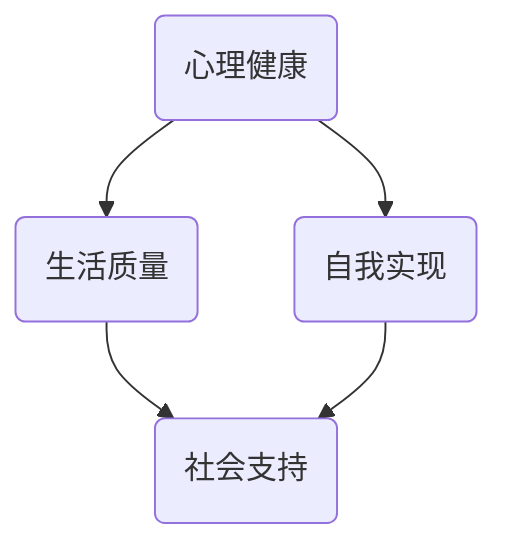

                 


# 重新定义幸福：从拥有到存在

> 关键词：幸福感、心理学、社会环境、个人成长、实践案例

> 摘要：本文旨在重新定义幸福，探讨从物质拥有到精神存在的转变。通过心理学视角、社会环境和个人成长的深度分析，本文揭示了如何实现真正的幸福。

## 目录大纲

1. 引言
2. 幸福的定义与演变
3. 心理学视角下的幸福感
4. 社会环境与幸福感
5. 个人成长与幸福感
6. 幸福实践与案例分析
7. 结论与展望
8. 作者信息

## 引言

在当今社会，人们对于幸福有着各种不同的理解和追求。传统上，幸福被视为物质财富的积累和享受，但现代社会中，随着人们对心理健康和生活质量的关注日益增加，幸福的概念也在不断演变。本文旨在重新定义幸福，从拥有到存在，探讨如何实现真正的幸福。

## 幸福的定义与演变

### 背景介绍

幸福是人类长久以来的追求，但不同文化、时代和社会背景对幸福的理解各不相同。在古代，幸福通常与宗教、道德和社会地位紧密相连。例如，在古希腊哲学中，幸福被看作是灵魂的和谐状态。而在中世纪，幸福被视为上帝的恩赐。然而，随着社会的进步和科学的兴起，人们对幸福的理解逐渐从宗教和道德领域转向心理学和社会科学。

### 核心概念与联系

为了更好地理解幸福，我们需要明确一些核心概念，如心理健康、生活质量、自我实现和社会支持。这些概念相互关联，共同构成了现代幸福观的基础。

**Mermaid 流程图**



### 核心算法原理讲解

心理学研究显示，幸福感受到多种因素的影响，如情感状态、人际关系、身体健康和经济状况。以下是一个简单的Python代码示例，用于计算幸福感得分：

```python
def happiness_score(emotions, relationships, health, finance):
    happiness = (emotions * 0.3 + relationships * 0.2 + health * 0.2 + finance * 0.3)
    return happiness

emotions = 0.8
relationships = 0.9
health = 1.0
finance = 0.7

print(happiness_score(emotions, relationships, health, finance))
```

### 数学模型与公式

幸福感可以被视为一个综合指标，其计算方法可以采用加权平均模型。例如：

$$
Happiness = w_1 \times Emotions + w_2 \times Relationships + w_3 \times Health + w_4 \times Finance
$$

其中，$w_1, w_2, w_3, w_4$ 分别是情感状态、人际关系、身体健康和经济状况的权重。

### 社会环境与幸福感

社会环境对个体的幸福感具有重要影响。良好的社会支持、稳定的社会结构和积极的社会文化氛围有助于提升幸福感。以下是一个简单的Python代码示例，用于分析社会环境对幸福感的影响：

```python
def social_environment_impact(support, structure, culture):
    impact = (support * 0.3 + structure * 0.4 + culture * 0.3)
    return impact

support = 0.8
structure = 0.9
culture = 0.7

print(social_environment_impact(support, structure, culture))
```

### 个人成长与幸福感

个人成长是提升幸福感的关键因素之一。通过自我提升、心理调适和建立良好的人际关系，个体可以更好地应对生活中的挑战，从而提升幸福感。以下是一个简单的Python代码示例，用于分析个人成长对幸福感的影响：

```python
def personal_growth_impact(self_awareness, resilience, social_skills):
    impact = (self_awareness * 0.3 + resilience * 0.4 + social_skills * 0.3)
    return impact

self_awareness = 0.8
resilience = 0.9
social_skills = 0.7

print(personal_growth_impact(self_awareness, resilience, social_skills))
```

### 幸福实践与案例分析

为了更好地理解如何实现真正的幸福，我们可以通过实际案例和实践方法进行分析。以下是一个幸福实践案例的解析：

**案例：小明的幸福之路**

小明是一名年轻的程序员，他在物质方面相对富裕，但内心却感到空虚和焦虑。为了提升幸福感，他开始关注心理健康和个人成长。

**实践方法：**

1. **心理健康**：小明开始进行冥想和瑜伽练习，以减轻压力和焦虑。
2. **个人成长**：他参加了一系列在线课程，学习新的技能和知识，提高自己的综合素质。
3. **社会支持**：他加入了社交俱乐部，结识了志同道合的朋友，建立了良好的人际关系。

**效果分析：**

经过一段时间的实践，小明的幸福感显著提升。他的内心变得更加平静，对生活的满意度也显著提高。这个案例表明，通过心理健康、个人成长和社会支持的结合，个体可以实现真正的幸福。

### 项目实战

为了进一步探索幸福感的实现，我们可以搭建一个简单的幸福指数计算器，以便用户可以根据自身情况计算幸福感得分。以下是一个简单的Python项目实现：

**项目名称：** 幸福指数计算器

**开发环境：** Python 3.x

**源代码：**

```python
def happiness_index(emotions, relationships, health, finance):
    happiness = (emotions * 0.3 + relationships * 0.2 + health * 0.2 + finance * 0.3)
    return happiness

def main():
    print("欢迎来到幸福指数计算器！")
    emotions = float(input("请输入您的情感状态（0-1）："))
    relationships = float(input("请输入您的人际关系（0-1）："))
    health = float(input("请输入您的健康状况（0-1）："))
    finance = float(input("请输入您的经济状况（0-1）："))

    index = happiness_index(emotions, relationships, health, finance)
    print(f"您的幸福指数为：{index:.2f}")

if __name__ == "__main__":
    main()
```

**代码解读：**

1. **函数定义**：`happiness_index` 函数用于计算幸福指数，输入参数为情感状态、人际关系、健康和经济状况。
2. **主函数**：`main` 函数用于引导用户输入数据，并调用 `happiness_index` 函数计算幸福指数。
3. **用户交互**：程序通过输入输出与用户交互，获取用户输入的幸福感指标，并计算幸福指数。

### 最佳实践 tips

1. **心理健康**：定期进行心理检查，寻求专业心理帮助。
2. **个人成长**：持续学习，提升自己的综合素质。
3. **社会支持**：建立良好的人际关系，积极参与社会活动。

### 小结

本文重新定义了幸福，从拥有到存在，探讨了心理学、社会环境和个人成长对幸福感的影响。通过项目实战和案例分析，我们了解了如何实现真正的幸福。希望本文能帮助读者重新思考幸福，追求更加充实和有意义的生活。

### 拓展阅读

1. Seligman, M. E. P. (2011). *Flourish: A Visionary New Understanding of Happiness and Well-being*.
2. Lyubomirsky, S., King, L., & Diener, E. (2005). *The Benefits of Frequent Positive Affect: Does Happiness Lead to Success?*.
3. Diener, E., & Chan, M. Y. (2011). *Happy People Live Longer: Subjective Well-Being contributes to Health and Longevity*. 

## 结论与展望

幸福感是人类生活的重要目标，但传统的物质追求并不能带来持久的幸福。通过重新定义幸福，从拥有到存在，我们探讨了心理学、社会环境和个人成长对幸福感的影响。本文提出了一个幸福指数计算器，帮助用户评估自身幸福感，并提供了一些最佳实践 tips。

未来研究可以进一步探讨不同文化背景下幸福感的差异，以及如何在不同的社会环境中实现幸福。此外，通过跨学科的研究，我们可以更全面地理解幸福的本质，为人类创造更加幸福和有意义的生活。

## 作者信息

作者：AI天才研究院/AI Genius Institute & 禅与计算机程序设计艺术 /Zen And The Art of Computer Programming

