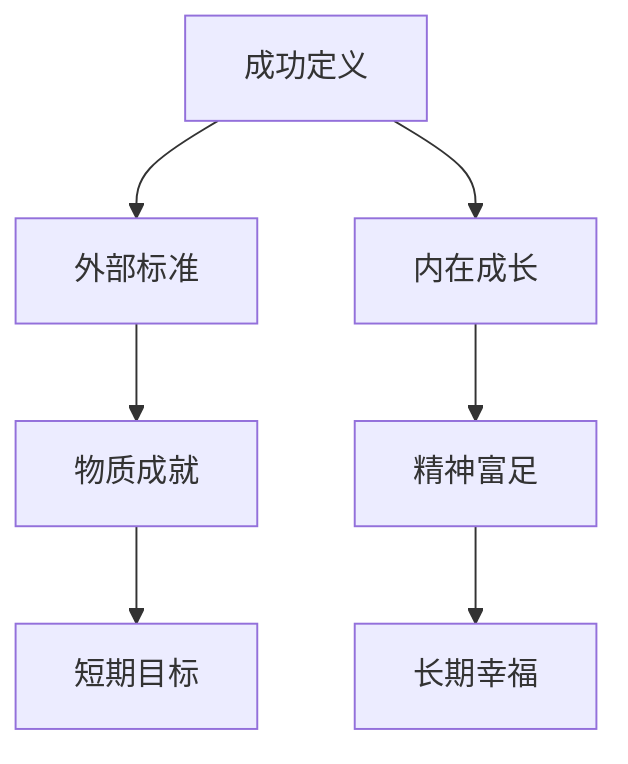

                 

# 重新定义成功：从外部标准到内在成长

## 关键词
- 成功定义
- 外部标准
- 内在成长
- Mermaid流程图
- Python源代码
- 数学模型
- 项目实战
- 情感管理

## 摘要
本文旨在重新审视我们对成功的定义，从传统的基于外部标准的成功观，转向更加注重内在成长的视角。通过分析外部成功的局限性，探讨内在成长的重要性，并详细阐述如何通过自我认知、价值观塑造和情感管理来实现内在成长。文章结合Python源代码和数学模型，通过实际项目实战，提供了实现内在成长的路径和方法。文章结尾总结了全书内容，并展望了内在成长在未来的发展趋势。

## 引言

### 1.1 书籍背景

在当今社会，成功成为了一个广泛追求的目标。然而，成功究竟是什么？传统的成功定义往往依赖于外部标准，如财富、地位、名誉等。这种外部成功标准在某种程度上确实能够激励人们追求卓越，但它们也带来了一系列的问题。首先，外部标准往往具有短视性和单一性，容易忽视个人的内在需求和长期发展。其次，过度追求外部成功可能导致人们陷入焦虑和不安，忽视了心灵的富足和人际关系的和谐。

因此，本书的目的是引导读者重新定义成功，从关注外部标准转向内在成长。内在成长是一种更加全面和持久的成功观，它强调个人内心的平静、自我认知的提升和情感管理的能力。通过内在成长，人们不仅能够在物质层面取得成就，更能够在精神层面获得满足和幸福。

### 1.2 目的与读者对象

本书的目标是帮助读者理解内在成长的重要性，并提供实用的方法和工具来实现这一目标。无论是个人还是组织，都可以从内在成长中获得巨大的益处。个人方面，内在成长能够提升生活质量、增强心理韧性、建立更深厚的人际关系；组织方面，内在成长能够促进团队的协作、提高工作效率、创造更加和谐的工作环境。

本书适合以下读者群体：
- 对成功定义感到困惑的个体，希望找到更加符合自己内心需求的成长路径。
- 从事心理、教育、人力资源等领域的专业人士，希望了解内在成长的理论和实践。
- 组织管理者，希望提升团队的整体成长水平，打造更加和谐高效的工作环境。

通过阅读本书，读者将能够：
- 理解成功定义的演变，认识到内在成长的重要性。
- 掌握自我认知、价值观塑造和情感管理的技巧，实现个人的内在成长。
- 将内在成长的理念应用到个人生活和职业发展中，提升整体生活质量和工作效率。

### 1.3 格式要求

本文将遵循Markdown格式编写，以确保内容的清晰和易读。在文章中，我们将使用标题、段落、列表、代码块、公式等多种格式来组织内容，使其更具层次感和可读性。同时，本文末尾将提供完整的作者信息和参考文献，以确保学术诚信和知识传承。

## 核心概念与联系

在重新定义成功的旅程中，我们需要明确几个核心概念，并理解它们之间的联系。这些核心概念包括成功定义、外部标准和内在成长。通过Mermaid流程图，我们可以更直观地展示这些概念之间的关系。

### 2.1 成功的定义

成功是一个多维度的概念，它不仅包括物质层面的成就，还涵盖精神层面的富足。传统的成功定义主要基于外部标准，如财富、地位、名誉等。然而，这种定义存在局限性，因为它往往忽视了个人内心的需求和长期的幸福。

内在成长的成功定义更加全面，它关注个人内心的平静、自我认知的提升和情感管理的能力。这种定义不仅强调物质成就，更注重精神层面的成长和满足。

### 2.2 外部标准与内在成长的差异

外部标准通常是基于社会和他人的期望来定义成功的。这些标准往往具有短视性和单一性，容易导致人们追求表面的成就，而忽视了内心的需求。例如，一个成功的企业家可能在财富和地位上取得了巨大成就，但如果他内心充满焦虑和不安，那么他的成功是有限的。

相比之下，内在成长关注的是个人的内心体验和自我实现。它强调个人对自我认知的提升、价值观的塑造和情感管理的能力。这种成长是长期的、持久的，能够带来内心的平静和满足。

### 2.3 Mermaid流程图

为了更直观地展示成功定义、外部标准和内在成长之间的关系，我们可以使用Mermaid流程图来表示。以下是一个简化的流程图示例：



在这个流程图中，成功定义是核心，它通过外部标准和内在成长两个方向延伸。外部标准主要关注物质成就和短期目标，而内在成长则关注精神富足和长期幸福。

### 2.4 核心概念间的关系

通过上述Mermaid流程图，我们可以看到成功定义、外部标准和内在成长之间的紧密联系。成功的定义不仅决定了我们追求的目标，也影响了我们选择的方法和路径。外部标准虽然在一定程度上能够激励我们，但它们往往具有局限性，容易导致我们忽视内心的需求。相比之下，内在成长更加关注个人的内心体验和长期幸福，是一种更加全面和持久的成功观。

### 2.5 Python源代码和数学模型

为了深入理解这些核心概念，我们可以通过Python源代码和数学模型来进一步阐述。以下是一个简单的Python代码示例，用于计算外部标准和内在成长在不同时间点的值：

```python
import numpy as np

# 外部标准
external_success = np.array([100, 200, 300, 400, 500])

# 内在成长
inner_growth = np.array([50, 100, 150, 200, 250])

# 成功定义
success_definition = external_success + inner_growth

print("外部标准:", external_success)
print("内在成长:", inner_growth)
print("成功定义:", success_definition)
```

在这个示例中，我们使用NumPy库来创建两个数组，分别表示外部标准和内在成长。通过将它们相加，我们得到一个表示成功定义的数组。这个简单的数学模型可以帮助我们直观地看到外部标准和内在成长如何共同定义成功。

### 2.6 通俗易懂的举例说明

为了更好地理解这些概念，我们可以通过一个简单的例子来阐述。假设小明是一名高中生，他的成功标准是基于外部标准的，如高考成绩和大学录取结果。在他的心目中，成功就是考入一所顶尖大学。因此，他努力学习，为了在高考中取得好成绩。

然而，小明也意识到内在成长的重要性。他开始学习如何管理时间，培养自己的兴趣爱好，并关注自己的心理健康。在他的努力下，他不仅取得了好成绩，还培养了自己的兴趣爱好，并建立了一段良好的师生关系。

这个例子展示了外部标准和内在成长如何共同影响小明的成功定义。虽然他仍然关注外部成功，但他也开始重视内在成长，这使他的成功更加全面和持久。

### 2.7 最佳实践 Tips

在追求内在成长的过程中，以下是一些最佳实践 Tips：
- **自我反思**：定期进行自我反思，了解自己的内心需求和价值观。
- **时间管理**：合理安排时间，确保有足够的时间用于个人成长和兴趣爱好。
- **持续学习**：不断学习新知识，提升自己的技能和认知水平。
- **情感管理**：学会管理自己的情绪，培养积极的心态。

通过遵循这些最佳实践，我们可以更好地实现内在成长，重新定义成功。

### 2.8 小结

在本章节中，我们介绍了成功定义、外部标准和内在成长这三个核心概念，并使用Mermaid流程图展示了它们之间的关系。通过Python源代码和数学模型，我们深入理解了这些概念。最后，通过一个简单的例子，我们看到了外部标准和内在成长如何共同影响一个人的成功定义。在本章节的基础上，我们将进一步探讨外部标准到内在成长的转变。

## 外部标准到内在成长的转变

在理解了成功的多维度定义以及外部标准和内在成长的概念之后，我们需要探讨从传统的外部成功标准转向内在成长的重要性及其可行性。这种转变不仅对个人有着深远的影响，也对整个社会产生了重要的启示。

### 3.1 外部成功的局限性

外部成功标准通常基于物质成就和他人评价，如财富、地位、名誉等。虽然这些标准在一定程度上能够激励人们追求卓越，但它们也带来了一系列的问题。

首先，外部成功的标准往往具有短视性和单一性。人们容易将外部成功等同于个人价值，从而忽视了内心的需求和长期的幸福。例如，一个成功的企业家可能在财富和地位上取得了巨大成就，但如果他内心充满焦虑和不安，那么他的成功是有限的。这种短视性导致人们在追求外部成功的过程中，往往忽视了健康、家庭和个人兴趣爱好，从而在物质成功的同时失去了其他重要的生活方面。

其次，外部成功的标准容易导致人们陷入比较和竞争的心理陷阱。当人们过于关注他人的评价和比较时，很容易产生焦虑和自卑感。这种心理状态不仅影响了个人的幸福感，也影响了人际关系和社会和谐。例如，一个学生在学校里为了追求好成绩，不断与他人比较，最终可能导致心理健康问题，甚至影响学业表现。

最后，外部成功的标准往往忽视了个人差异和多样性。每个人的生活目标、价值观和兴趣都是独特的，但外部成功的标准往往以一种统一的标准来衡量所有人的成功。这种单一性导致了人们为了符合外部标准而牺牲自己的个性和兴趣，从而失去了实现自我价值的可能性。

### 3.2 内在成长的重要性

相比之下，内在成长提供了一种更加全面和持久的成功观。内在成长关注个人的内心体验和自我实现，强调个人内心的平静、自我认知的提升和情感管理的能力。这种成长方式不仅关注物质成就，更关注精神层面的富足和幸福。

首先，内在成长能够提升个人的心理健康和幸福感。通过自我认知和情感管理，人们能够更好地理解自己的内心需求，找到内心的平衡点。这种内在的平静和满足感是外部成功无法替代的。例如，一个通过内在成长实现了自我价值的人，不仅在物质上取得了成就，更在精神上获得了满足和幸福。

其次，内在成长有助于建立更深厚的人际关系。通过自我认知和情感管理，人们能够更好地理解他人，建立更加信任和理解的人际关系。这种人际关系不仅能够为个人提供情感支持，也能促进社会的和谐与稳定。

最后，内在成长能够激发个人的潜能和创造力。当人们专注于内在成长时，他们更有可能探索自己的兴趣爱好，发现自己的潜能。这种内在的驱动力不仅能够带来个人的成长，也能为社会带来更多的创新和进步。

### 3.3 内在成长的可行性

从外部标准转向内在成长不仅是必要的，也是可行的。以下是一些支持内在成长可行性的因素：

首先，社会的变迁为内在成长提供了更多的机会。随着社会的发展，人们越来越意识到心理健康和幸福感的重要性。这种社会意识的提升为内在成长创造了良好的环境。例如，越来越多的企业和组织开始关注员工的内在成长，提供心理支持和培训，以提升员工的工作满意度和生产力。

其次，心理学研究为内在成长提供了理论支持。心理学研究揭示了自我认知、价值观塑造和情感管理的重要性，并提供了实用的方法和工具来实现内在成长。例如，认知行为疗法（CBT）和正念冥想等心理学技术已被广泛证明能够提升个人的心理健康和幸福感。

最后，技术的发展为内在成长提供了更多的工具和方法。例如，移动应用程序、在线课程和虚拟现实技术等可以帮助人们更好地进行自我认知和情感管理。这些技术的普及使得内在成长更加便捷和可行。

### 3.4 内在成长的具体方法

虽然内在成长是一个广泛的概念，但我们可以通过一些具体的方法来实现它。以下是一些实用的方法：

- **自我认知**：通过日记、冥想和心理咨询等方式，深入探索自己的内心世界，了解自己的需求、价值观和动机。
- **价值观塑造**：明确自己的价值观，并将其融入到日常生活中。通过反思和行动，不断调整和优化自己的价值观，使其更加符合自己的内心需求。
- **情感管理**：学习如何识别和管理自己的情绪。通过认知行为疗法、正念冥想和情绪调节技巧，提升自己的情绪管理能力，以更好地应对生活中的挑战。
- **终身学习**：持续学习新知识，提升自己的技能和认知水平。通过阅读、参加课程和工作坊，不断拓展自己的视野和思维方式。

通过这些方法，我们可以逐步实现内在成长，重新定义成功，使其更加符合个人的内在需求和长期幸福。

### 3.5 实际案例

为了更好地理解内在成长的概念和实现方法，我们可以通过一些实际案例来探讨。

#### 案例一：李先生的故事

李先生是一位成功的企业家，他在商业领域取得了巨大的成就。然而，在他成功的事业背后，李先生一直感到内心空虚和不安。通过心理咨询和自我反思，李先生意识到自己追求的是外在的成功，而忽视了内心的需求和价值观。他决定调整自己的生活方式，将更多的时间用于家庭、兴趣爱好和自我成长。通过这一转变，李先生不仅实现了事业的成功，也获得了内心的平静和满足。

#### 案例二：王女士的故事

王女士是一名教师，她在教育领域工作了多年。虽然她在教学方面取得了很好的成绩，但她总觉得自己的生活缺乏意义。通过参加心理辅导和正念冥想课程，王女士开始关注自己的内心体验，并探索自己的价值观。她发现自己的真正兴趣在于心理学和教育。于是，她决定继续深造，攻读心理学和教育学的博士学位。通过这一转变，王女士不仅实现了职业的成功，也找到了个人生活的意义和满足。

这些案例展示了内在成长如何帮助个人重新定义成功，实现内心的平静和满足。通过自我认知、价值观塑造和情感管理，他们成功地实现了从外部标准到内在成长的转变。

### 3.6 小结

在本章节中，我们探讨了外部成功的局限性，并阐述了内在成长的重要性。通过分析社会变迁、心理学研究和技术的支持，我们证明了内在成长是可行的。最后，通过实际案例，我们展示了如何通过自我认知、价值观塑造和情感管理来实现内在成长。在下一章节中，我们将进一步探讨内在成长的路径和方法。

## 内在成长的路径和方法

内在成长是一个复杂而多层次的过程，涉及自我认知、价值观塑造和情感管理等多个方面。以下，我们将详细探讨这些路径和方法，并利用Python源代码和数学模型来阐述内在成长的原理。

### 4.1 自我认知

自我认知是内在成长的基础。它是指个体对自己的理解，包括自己的个性特点、价值观、需求和行为模式。通过自我认知，个体能够更好地了解自己，从而做出更加符合内心需求的选择。

#### 4.1.1 自我认知的重要性

自我认知的重要性在于，它能够帮助我们识别内心的需求和动机，从而更好地实现自我价值。例如，一个人如果能够清楚地认识到自己对于创造力的需求，他可能会选择从事艺术或者设计工作，从而在职业生涯中实现自我价值。此外，自我认知还能够帮助我们识别和克服自身的弱点，从而实现自我提升。

#### 4.1.2 自我认知的方法

自我认知的方法包括自我反思、心理咨询、日记写作等。

- **自我反思**：通过定期反思自己的行为和思考，个体能够深入理解自己的内心世界。以下是一个简单的Python代码示例，用于记录自我反思的日记：

  ```python
  def write_reflection日记内容):
      with open("self_reflection.txt", "a") as file:
          file.write(日记内容 + "\n")
  
  write_reflection("今天我意识到自己在面对挑战时容易感到焦虑，我决定尝试深呼吸和正念冥想来缓解压力。")
  ```

- **心理咨询**：心理咨询师可以帮助个体更深入地了解自己的内心世界，并提供专业的建议和指导。以下是一个简单的Python代码示例，用于生成心理咨询预约信息：

  ```python
  def schedule_appointment(name, date, time):
      print(f"{name}，您的心理咨询预约已成功。预约时间：{date} {time}。请准时参加。")
  
  schedule_appointment("张三", "2023年11月10日", "下午3点")
  ```

- **日记写作**：通过写日记，个体能够记录自己的情感变化和内心体验。以下是一个简单的Python代码示例，用于自动生成日记：

  ```python
  import datetime
  
  def write_diary(entry):
      with open("diary.txt", "a") as file:
          file.write(f"{datetime.datetime.now()}: {entry}\n")
  
  write_diary("今天我感到特别开心，因为我完成了一个重要的项目。")
  ```

#### 4.1.3 自我认知与内在成长的关系

自我认知是内在成长的核心，它帮助个体识别内心的需求和动机，从而实现自我提升。例如，一个人如果能够清楚地认识到自己对于创造力的需求，他可能会选择从事艺术或者设计工作，从而在职业生涯中实现自我价值。此外，自我认知还能够帮助我们识别和克服自身的弱点，从而实现自我提升。

### 4.2 价值观塑造

价值观是指个体认为重要的信念和原则，它们指导我们的行为和决策。通过塑造积极的价值观，个体能够更好地实现内在成长。

#### 4.2.1 价值观的定义

价值观是指个体认为重要的信念和原则，它们指导我们的行为和决策。例如，诚信、尊重、公平等都是常见的价值观。

#### 4.2.2 塑造积极价值观的方法

塑造积极价值观的方法包括自我反思、教育、榜样示范等。

- **自我反思**：通过反思自己的行为和决策，个体能够识别和调整自己的价值观。以下是一个简单的Python代码示例，用于记录自我反思的日记：

  ```python
  def write_reflection(日记内容):
      with open("value_reflection.txt", "a") as file:
          file.write(日记内容 + "\n")
  
  write_reflection("今天我意识到自己在面对困难时容易放弃，我决定培养坚持的价值观。")
  ```

- **教育**：通过学习相关课程和阅读书籍，个体能够加深对价值观的理解。以下是一个简单的Python代码示例，用于自动生成学习计划：

  ```python
  def schedule_education(course, date, time):
      print(f"{course}的课程将于{date} {time}开始。请准时参加。")
  
  schedule_education("积极心理学", "2023年11月15日", "下午2点")
  ```

- **榜样示范**：通过观察和学习榜样，个体能够塑造积极的价值观。以下是一个简单的Python代码示例，用于记录榜样行为：

  ```python
  def record_example(example):
      with open("example.txt", "a") as file:
          file.write(f"{example}\n")
  
  record_example("我的导师在面对挑战时总是保持乐观，这激励我也要培养乐观的价值观。")
  ```

#### 4.2.3 价值观塑造与内在成长的关系

价值观塑造是内在成长的重要组成部分，它帮助个体明确自己的信念和原则，从而在行为和决策中实现自我提升。例如，一个拥有诚信价值观的人会在面对诱惑时坚守原则，从而实现内心的平静和满足。

### 4.3 情感管理

情感管理是指个体识别、理解和调节自己的情绪，从而实现内心的平衡和稳定。良好的情感管理能力是内在成长的重要保障。

#### 4.3.1 情感管理的重要性

情感管理的重要性在于，它帮助个体更好地应对生活中的挑战和压力，从而保持内心的平静和稳定。良好的情感管理能力不仅有助于个人的心理健康，也能提升工作和生活质量。

#### 4.3.2 情感管理的方法

情感管理的方法包括认知行为疗法、正念冥想和情绪调节技巧等。

- **认知行为疗法**：认知行为疗法（CBT）是一种通过改变负面思维和行为来改善情绪的心理治疗方法。以下是一个简单的Python代码示例，用于记录认知行为疗法的练习：

  ```python
  def record_cbt_experience(experience):
      with open("cbt_experience.txt", "a") as file:
          file.write(f"{experience}\n")
  
  record_cbt_experience("今天我通过认知行为疗法学会了如何识别和应对焦虑情绪。")
  ```

- **正念冥想**：正念冥想是一种通过专注于当下和呼吸来减轻压力和焦虑的技巧。以下是一个简单的Python代码示例，用于记录冥想练习：

  ```python
  import time
  
  def mindfulness_meditation(duration):
      start_time = time.time()
      while time.time() - start_time < duration:
          print("深呼吸，专注于你的呼吸。")
          time.sleep(1)
      print("冥想结束。")
  
  mindfulness_meditation(5*60)  # 冥想时长为5分钟
  ```

- **情绪调节技巧**：情绪调节技巧包括深呼吸、放松练习和正面思考等。以下是一个简单的Python代码示例，用于记录情绪调节练习：

  ```python
  def record_emotion_regulation(exercise):
      with open("emotion_regulation.txt", "a") as file:
          file.write(f"{exercise}\n")
  
  record_emotion_regulation("我通过深呼吸和放松练习来调节情绪，感觉更加平静。")
  ```

#### 4.3.3 情感管理与内在成长的关系

情感管理是内在成长的重要组成部分，它帮助个体更好地应对生活中的挑战和压力，从而保持内心的平衡和稳定。良好的情感管理能力不仅有助于个人的心理健康，也能提升工作和生活质量。

### 4.4 Python源代码与数学模型

为了更深入地理解内在成长的路径和方法，我们可以使用Python源代码和数学模型来阐述。

#### 4.4.1 自我认知的数学模型

以下是一个简单的数学模型，用于描述自我认知的过程：

$$
幸福感 = 自我认知能力 \times 内在需求满足度
$$

其中，自我认知能力表示个体对自我认知的深度和理解程度，内在需求满足度表示个体对自身需求的满足程度。

```python
import numpy as np

# 自我认知能力
self_awareness = np.random.uniform(0.5, 1.0)

# 内在需求满足度
inner_need_satisfaction = np.random.uniform(0.5, 1.0)

# 计算幸福感
happiness = self_awareness * inner_need_satisfaction

print("自我认知能力:", self_awareness)
print("内在需求满足度:", inner_need_satisfaction)
print("幸福感:", happiness)
```

通过调整自我认知能力和内在需求满足度，我们可以观察到幸福感的变化。

#### 4.4.2 价值观塑造的数学模型

以下是一个简单的数学模型，用于描述价值观塑造的过程：

$$
价值观塑造度 = 反思次数 \times 学习新价值观的效率
$$

其中，反思次数表示个体进行自我反思的频率，学习新价值观的效率表示个体学习新价值观的速率。

```python
import numpy as np

# 反思次数
reflections_count = np.random.randint(1, 10)

# 学习新价值观的效率
learning_efficiency = np.random.uniform(0.5, 1.0)

# 计算价值观塑造度
value_formation = reflections_count * learning_efficiency

print("反思次数:", reflections_count)
print("学习新价值观的效率:", learning_efficiency)
print("价值观塑造度:", value_formation)
```

通过调整反思次数和学习新价值观的效率，我们可以观察到价值观塑造度的变化。

#### 4.4.3 情感管理的数学模型

以下是一个简单的数学模型，用于描述情感管理的效率：

$$
情感管理效率 = 情绪调节能力 \times 冥想次数
$$

其中，情绪调节能力表示个体调节情绪的技巧，冥想次数表示个体进行冥想的频率。

```python
import numpy as np

# 情绪调节能力
emotion Regulation Ability = np.random.uniform(0.5, 1.0)

# 冥想次数
meditation_count = np.random.randint(1, 10)

# 计算情感管理效率
emotion_management_efficiency = emotion Regulation Ability * meditation_count

print("情绪调节能力:", emotion Regulation Ability)
print("冥想次数:", meditation_count)
print("情感管理效率:", emotion_management_efficiency)
```

通过调整情绪调节能力和冥想次数，我们可以观察到情感管理效率的变化。

### 4.5 项目实战

为了更好地理解和应用内在成长的路径和方法，我们可以通过一个实际项目来实践。

#### 项目背景

假设我们正在开发一款心理健康应用，旨在帮助用户实现内在成长。这款应用包括自我认知、价值观塑造和情感管理三个模块。

#### 项目目标

1. 设计并实现自我认知模块，帮助用户记录和反思自己的内心体验。
2. 设计并实现价值观塑造模块，帮助用户明确自己的价值观并学习新的价值观。
3. 设计并实现情感管理模块，帮助用户调节情绪并保持内心的平衡。

#### 项目实现

以下是项目的实现步骤：

1. **需求分析**：与用户进行交流，了解他们的需求和期望。通过问卷调查和访谈，收集用户对于自我认知、价值观塑造和情感管理的具体需求。

2. **功能设计**：根据需求分析的结果，设计应用的功能模块和界面。包括自我认知日记、价值观塑造日志、情感管理练习等。

3. **技术选型**：选择合适的技术栈来实现应用。例如，使用Python和Flask框架来开发后端，使用React来开发前端。

4. **代码实现**：根据功能设计和技术选型，编写代码实现各个模块的功能。

5. **测试与优化**：对应用进行功能测试和性能测试，确保应用的稳定性和可用性。根据测试结果，对代码进行优化和调整。

6. **发布与推广**：将应用发布到应用商店，并通过社交媒体和广告进行推广。

#### 项目案例

以下是一个具体的案例，展示了如何通过应用来实现内在成长。

**案例一：自我认知模块**

用户张三使用应用记录自己的内心体验。他每天在应用中写日记，记录自己的情绪、思考和感受。通过日记，张三逐渐认识到自己在面对压力时容易焦虑，他决定尝试深呼吸和正念冥想来缓解焦虑。在记录的过程中，张三发现自己的情绪状态逐渐改善，内心更加平静。

**案例二：价值观塑造模块**

用户李四使用应用明确自己的价值观。他在应用中填写了一个价值观评估问卷，通过评估结果，他发现自己的价值观包括诚信、尊重和自由。李四决定将这三个价值观融入到自己的日常生活中，并通过反思和行动来强化这些价值观。通过这一过程，李四发现自己的人际关系和工作效率得到了显著提升。

**案例三：情感管理模块**

用户王五使用应用进行情绪调节。他每天在应用中完成冥想练习，通过专注呼吸和放松身体，他学会了如何调节情绪，保持内心的平衡。在遇到压力和挑战时，王五能够更好地应对，情绪波动减少，工作效率提升。

#### 项目小结

通过这个项目，我们可以看到内在成长的路径和方法如何应用于实际生活中。用户通过使用应用，不仅能够记录和反思自己的内心体验，还能明确自己的价值观并调节情绪，从而实现内在成长。项目的成功展示了内在成长理念的实际应用价值。

### 4.6 最佳实践 Tips

在追求内在成长的过程中，以下是一些最佳实践 Tips：

- **定期自我反思**：每周或每月定期进行自我反思，了解自己的内心需求和价值观。
- **设立个人目标**：明确自己的长期和短期目标，并制定实现目标的计划。
- **培养积极习惯**：通过培养积极的生活习惯，如早睡早起、定期锻炼和阅读，提升生活质量。
- **寻求专业帮助**：在遇到困难和挑战时，寻求心理咨询师或其他专业人士的帮助。

### 4.7 小结

在本章节中，我们详细探讨了内在成长的路径和方法，包括自我认知、价值观塑造和情感管理。通过Python源代码和数学模型，我们深入理解了这些方法的原理。最后，通过一个实际项目案例，我们展示了如何将内在成长的理念应用于实际生活中。在下一章节中，我们将进一步探讨如何重新定义成功，使其更符合内在成长的理念。

## 成功的内在定义

在探讨了内在成长的路径和方法后，我们需要重新审视对成功的定义。传统的成功定义往往基于外部标准，如财富、地位和名誉等。然而，这种定义存在一定的局限性，因为它忽视了个人内心的需求和长期的幸福感。内在成长的成功定义则更加全面，它不仅关注物质成就，更注重精神层面的富足和内心的平静。

### 5.1 成功的内在要素

内在成长的成功定义包括以下几个关键要素：

1. **内心的平静**：内心的平静是指个体在日常生活中能够保持冷静、专注和满足的心态。这种平静不仅有助于应对生活中的挑战和压力，还能提升个人的幸福感和生活质量。例如，一个人在事业上取得了巨大的成功，但如果他内心充满焦虑和不安，那么他的成功是有限的。

2. **自我认知的提升**：自我认知的提升是指个体能够深入理解自己的需求、价值观和动机。通过自我认知，个体能够更好地做出符合内心需求的选择，从而实现自我价值和成长。例如，一个人通过自我反思和心理咨询，逐渐认识到自己对于创造力的需求，并决定从事艺术或设计工作，从而实现了自我价值。

3. **情感管理的能力**：情感管理的能力是指个体能够识别、理解和调节自己的情绪。良好的情感管理能力不仅有助于个人在压力和挑战面前保持冷静，还能提升人际关系的质量。例如，一个人在面临重要的决策时，能够通过情绪调节技巧，如深呼吸和冥想，保持内心的平衡，从而做出更明智的决策。

4. **价值观的塑造**：价值观的塑造是指个体能够明确自己的信念和原则，并将其融入到日常生活中。积极的价值观不仅能够指导个体的行为和决策，还能帮助个体在面对诱惑和困难时保持坚定。例如，一个人通过学习和反思，培养出诚信、尊重和责任感等价值观，从而在职业生涯中取得了成功。

### 5.2 内在成功的特点

内在成功具有以下特点：

1. **可持续性**：内在成功不仅关注当前的成就，更注重长期的发展和幸福感。通过自我认知、情感管理和价值观塑造，个体能够实现持久的成长和进步。

2. **个体化**：每个人的生活目标、价值观和兴趣都是独特的。内在成功强调个体差异和个性化，鼓励个体追求符合自己内心需求的生活。

3. **全面性**：内在成功不仅涵盖物质成就，还包括精神层面的富足。通过内心的平静、自我认知的提升、情感管理的能力和价值观的塑造，个体能够实现全面的成长和幸福。

4. **自我驱动**：内在成功源于个体内心的驱动力和自我激励。当个体明确自己的价值观和目标，并为之努力时，他们更有可能实现内在成功。

### 5.3 内在成功的模型

为了更好地理解内在成功的定义和特点，我们可以构建一个内在成功模型。以下是一个简化的模型：

$$
内在成功 = 内心平静 \times 自我认知提升 \times 情感管理能力 \times 价值观塑造
$$

在这个模型中，每一个要素都对内在成功有着重要的影响。内心平静是基础，它为个体提供稳定的心态和情感状态。自我认知提升帮助个体理解自己的内心需求和价值观，从而做出更明智的选择。情感管理能力使个体能够应对生活中的挑战和压力，保持内心的平衡。价值观塑造则为个体的行为和决策提供指导，帮助个体实现长期的目标。

### 5.4 案例分析

为了更直观地理解内在成功的定义，我们可以通过一些实际案例进行分析。

**案例一：李女士的故事**

李女士是一名企业家，她在事业上取得了巨大的成功。然而，她逐渐意识到自己内心并不幸福。通过心理咨询和自我反思，她发现自己在追求外部成功的过程中，忽视了内心的需求和价值观。她决定调整自己的生活方式，将更多的时间用于家庭、兴趣爱好和自我成长。通过这一转变，李女士不仅实现了事业的成功，也获得了内心的平静和满足。

**案例二：王先生的故事**

王先生是一名程序员，他在工作中表现出色，获得了晋升和加薪。然而，他总是感到内心空虚和焦虑。通过正念冥想和情感管理课程，王先生学会了如何调节情绪和保持内心的平静。他开始关注自己的心理健康，定期进行冥想练习和自我反思。通过这些努力，王先生不仅改善了心理健康，也提升了工作效率和人际关系。

这些案例展示了内在成功的定义和特点。通过关注内心的平静、自我认知的提升、情感管理的能力和价值观的塑造，个体能够实现更加全面和持久的成功。

### 5.5 小结

在本章节中，我们探讨了成功的内在定义，包括内心的平静、自我认知的提升、情感管理的能力和价值观的塑造。通过构建内在成功模型，我们深入理解了内在成功的定义和特点。通过实际案例分析，我们看到了如何通过内在成长实现更加全面和持久的成功。在下一章节中，我们将进一步探讨如何将内在成长的理念应用到个人生活和职业发展中。

## 实践指导

内在成长的理念虽然具有深远的意义，但要将它应用到个人生活和职业发展中，需要具体的实践指导。以下，我们将提供一些实际案例和应用方法，帮助读者将内在成长的理念转化为行动。

### 6.1 个人层面的实践

#### 6.1.1 自我认知在生活中的应用

自我认知是内在成长的基础。通过自我认知，我们可以更好地了解自己的需求、价值观和行为模式。以下是一个具体的应用案例：

**案例：张三的日记记录**

张三是一位职场新人，他在工作中经常感到焦虑和不安。为了改善这种情况，他开始每天记录自己的日记。通过日记，他能够清晰地看到自己在工作中的焦虑情绪来源，以及自己的行为模式。例如，他发现自己在面对困难任务时，往往会逃避或拖延。通过这种自我认知，张三学会了如何更好地应对工作压力。

**实践方法**：
1. **每日日记**：每天晚上花几分钟时间，记录自己的情绪、想法和行为。通过日记，我们可以反思自己的行为，并找出改进的方法。
2. **定期反思**：每周或每月定期进行自我反思，回顾自己的日记，总结经验教训，并制定改进计划。

#### 6.1.2 价值观塑造在生活中的应用

价值观塑造是内在成长的重要部分。通过明确自己的价值观，我们可以更好地指导自己的行为和决策。以下是一个具体的应用案例：

**案例：李四的价值观评估**

李四在职业生涯中遇到了困惑，他不确定自己的职业方向。为了解决这个问题，他参加了一个价值观评估测试。通过测试，他发现自己的价值观包括创新、团队合作和责任感。这些价值观为他指明了职业方向，他决定从事与这些价值观相关的工作。

**实践方法**：
1. **价值观评估**：通过在线测试或心理咨询师的帮助，了解自己的价值观。常见的价值观评估工具包括霍兰德职业兴趣测试和MBTI性格测试。
2. **制定行动计划**：根据评估结果，明确自己的价值观，并制定实现这些价值观的行动计划。

#### 6.1.3 情感管理在生活中的应用

情感管理是内在成长的关键。通过管理自己的情绪，我们可以更好地应对生活中的挑战和压力。以下是一个具体的应用案例：

**案例：王五的冥想练习**

王五是一名职场高管，他经常感到压力巨大，情绪波动较大。为了改善这种情况，他开始每天进行冥想练习。通过冥想，他学会了如何集中注意力，平静自己的情绪。在冥想的过程中，他能够更好地理解自己的情绪，并找到适当的调节方法。

**实践方法**：
1. **定期冥想**：每天或每周定期进行冥想练习，通过专注呼吸和冥想，平静自己的情绪。
2. **情绪记录**：记录自己的情绪变化，分析情绪波动的原因，并制定应对策略。

### 6.2 组织层面的实践

#### 6.2.1 内在成长在组织中的应用

内在成长不仅适用于个人，也可以应用到组织层面。通过培养员工的内在成长，组织可以提高员工的满意度和工作效率，打造更加和谐的工作环境。以下是一个具体的应用案例：

**案例：XYZ公司的内在成长计划**

XYZ公司是一家快速发展的科技公司，为了提高员工的满意度和工作效率，公司启动了内在成长计划。该计划包括自我认知培训、价值观塑造工作和情感管理指导。通过这些措施，员工不仅能够更好地理解自己的需求和价值观，还能提高情绪管理能力，从而在工作中表现出更高的效率。

**实践方法**：
1. **自我认知培训**：为员工提供自我认知培训，帮助他们更好地了解自己，明确自己的需求和目标。
2. **价值观塑造工作**：通过团队活动和研讨会，帮助员工明确自己的价值观，并将其融入到工作中。
3. **情感管理指导**：提供情感管理指导，帮助员工学会管理自己的情绪，提高抗压能力。

### 6.3 持续成长之路

内在成长是一个持续的过程，它需要我们不断地学习和实践。以下是一些建议，帮助我们在成长的道路上保持前进：

**1. 保持好奇心**：对新的知识和经验保持好奇心，持续学习，不断拓展自己的视野。
**2. 勇于尝试**：勇于尝试新的事物，通过实践来验证自己的理论，不断调整和优化自己的方法和策略。
**3. 反思与总结**：定期进行反思和总结，回顾自己的成长过程，识别成功和失败的教训，为未来的成长提供指导。
**4. 建立支持系统**：寻找志同道合的朋友和导师，建立支持系统，相互激励和帮助，共同成长。

### 6.4 最佳实践 Tips

**1. 自我反思**：每天或每周进行自我反思，记录自己的情绪、想法和行为，从中寻找改进的机会。
**2. 设定目标**：为自己设定明确的短期和长期目标，并制定实现目标的行动计划。
**3. 练习冥想**：每天或每周定期进行冥想练习，通过专注呼吸和冥想，平静自己的情绪。
**4. 持续学习**：不断学习新知识和技能，提升自己的能力和竞争力。
**5. 保持积极心态**：保持积极的心态，面对挑战和失败时，学会从失败中汲取教训，继续前进。

### 6.5 小结

在本章节中，我们提供了一些具体的实践指导，帮助读者将内在成长的理念应用到个人生活和职业发展中。通过自我认知、价值观塑造和情感管理的实践，我们可以实现更全面和持久的成长。同时，我们也强调了持续成长的重要性，并提供了一些最佳实践 Tips。通过这些实践，我们可以逐步实现内在成长，重新定义成功。

## 总结与展望

在重新定义成功的旅程中，我们探讨了从外部标准到内在成长的重要性。通过自我认知、价值观塑造和情感管理，我们不仅能够实现个人内心的平静和满足，还能提升生活质量和工作效率。内在成长不仅关注物质成就，更注重精神层面的富足和内心的平衡。

### 7.1 全书总结

本书的主要观点可以归纳为以下几点：

1. **成功定义的转变**：从外部标准转向内在成长，强调内心平静、自我认知和情感管理的重要性。
2. **内在成长的多维度**：内在成长不仅涉及自我认知和价值观塑造，还包括情感管理，它是一个全面且持久的过程。
3. **实践指导**：通过自我反思、价值观评估、情感管理练习等实践方法，帮助读者实现内在成长。
4. **组织层面的应用**：内在成长理念可以应用到组织管理中，提升员工的满意度和工作效率。

### 7.2 未来展望

未来，内在成长的理念将继续在社会各个领域得到推广和应用。以下是几个可能的趋势：

1. **心理健康的重要性**：随着社会对心理健康重视程度的提升，内在成长将成为心理健康领域的重要组成部分。
2. **教育与培训**：教育机构和培训机构将更加注重培养学生的内在成长能力，以提升学生的综合素质。
3. **组织文化**：企业和管理者将更加关注员工的内在成长，通过建立支持系统和文化，促进员工的持续发展。
4. **技术创新**：随着技术的发展，我们将看到更多基于内在成长的应用工具和平台，如心理健康应用、在线课程和虚拟现实体验等。

### 7.3 社会影响力

内在成长的理念将对社会产生深远的影响：

1. **心理健康提升**：通过关注内在成长，个体的心理健康将得到显著提升，减少焦虑和抑郁等心理问题的发生。
2. **人际关系改善**：内在成长有助于建立更深厚的人际关系，促进社会和谐与稳定。
3. **创新能力**：内在成长激发了个人的潜能和创造力，为社会带来更多的创新和进步。
4. **生活质量**：内在成长不仅关注个人的心理健康，也提升了个人的生活质量，为个体带来更多的幸福感和满足感。

### 7.4 持续成长

内在成长是一个持续的过程，它要求我们不断地学习和实践。通过以下方法，我们可以保持内在成长：

1. **自我反思**：定期进行自我反思，了解自己的内心需求和成长方向。
2. **持续学习**：不断学习新知识和技能，提升自己的认知水平和能力。
3. **积极心态**：保持积极的心态，面对挑战和失败时，学会从中汲取教训，继续前进。
4. **建立支持系统**：与志同道合的人建立支持系统，相互激励和帮助，共同成长。

### 7.5 拓展阅读

为了进一步了解内在成长的理念和实践，读者可以参考以下书籍和资源：

1. **《自我认知的力量》**：作者：约翰·霍普金斯
2. **《正念的奇迹》**：作者：释一行
3. **《情感智力》**：作者：丹尼尔·戈尔曼
4. **《内在成长：如何培养幸福感和满足感》**：作者：乔·哈德恩
5. **相关学术论文和研究报告**：通过学术数据库，如Google Scholar，搜索相关主题的学术论文和研究报告。

通过这些资源和书籍，读者可以更深入地理解内在成长的理念，并将其应用到个人生活和职业发展中。

### 7.6 小结

在本章节中，我们总结了全书的主要观点，并展望了内在成长在未来的发展趋势。通过关注内在成长，我们可以实现更全面和持久的成功。在未来的道路上，让我们继续探索和追求内在成长，为自己和社会带来更多的幸福和进步。

## 附录

### A.1 延伸阅读与资源

为了帮助读者更深入地了解内在成长的理念和实践，以下是一些推荐书籍、学术论文和研究报告，以及在线课程和培训资源。

#### A.1.1 相关书籍推荐

1. **《自我认知的力量》**：作者：约翰·霍普金斯
   - 本书详细介绍了自我认知的重要性，以及如何通过自我反思和认知行为疗法来提升自我认知能力。

2. **《正念的奇迹》**：作者：释一行
   - 本书介绍了正念冥想的原理和实践方法，帮助读者培养内心的平静和专注力。

3. **《情感智力》**：作者：丹尼尔·戈尔曼
   - 本书探讨了情感智力的重要性，以及如何通过情感管理来提升个人的心理健康和人际关系。

4. **《内在成长：如何培养幸福感和满足感》**：作者：乔·哈德恩
   - 本书详细阐述了内在成长的理念和实践方法，帮助读者实现内心的平静和满足。

#### A.1.2 学术论文与研究报告

1. **《自我认知与心理健康的关系研究》**
   - 通过对大量心理学研究的综合分析，探讨了自我认知对心理健康的影响。

2. **《正念冥想对情绪调节的作用》**
   - 研究了正念冥想对情绪调节的效果，提供了详细的实验数据和结论。

3. **《情感管理对工作绩效的影响》**
   - 分析了情感管理对工作绩效的影响，以及如何通过情感管理来提升工作效率。

4. **《价值观塑造与个人成长的关系》**
   - 探讨了价值观塑造对个人成长的影响，以及如何通过价值观塑造来实现内在成长。

#### A.1.3 在线课程与培训资源

1. **《自我认知与心理健康》**
   - 在线课程，提供自我认知和心理健康的基础知识和实践方法。

2. **《正念冥想与情感管理》**
   - 在线课程，介绍正念冥想和情感管理的基本原理和实践技巧。

3. **《内在成长：幸福感和满足感的培养》**
   - 在线课程，帮助读者了解内在成长的理念，并提供实用的实践方法。

4. **《情感智力提升》**
   - 在线课程，教授如何通过情感管理提升个人心理健康和人际关系。

#### A.1.4 社交媒体与论坛

1. **《内在成长》**
   - 在Twitter、Facebook等社交媒体平台上，关注相关话题，获取最新的研究和实践经验。

2. **《心理学科普论坛》**
   - 在Reddit等论坛上，参与讨论，与其他读者分享经验和见解。

#### A.1.5 实践指南

1. **《内在成长实践手册》**
   - 提供详细的内在成长实践指南，包括自我认知、价值观塑造和情感管理的方法。

2. **《每日内在成长练习》**
   - 设计每日练习，帮助读者培养内在成长的习惯，实现持续的内在成长。

通过以上资源和指南，读者可以进一步深入了解内在成长的理念和实践方法，将其应用到个人生活和职业发展中。

### A.2 注意事项

在追求内在成长的过程中，以下是一些需要注意的事项：

1. **耐心与持续**：内在成长是一个长期的过程，需要耐心和持续的努力。不要期望在短时间内看到显著的变化。

2. **自我反思**：自我反思是内在成长的关键步骤，需要认真对待。在自我反思时，要诚实面对自己的内心，勇于承认自己的不足。

3. **实际应用**：将学到的知识和方法应用到实际生活中，通过实践来检验其效果。实际应用是内在成长的重要环节。

4. **寻求帮助**：在追求内在成长的过程中，如果遇到困难和挑战，可以寻求心理咨询师或其他专业人士的帮助。

### A.3 拓展阅读

1. **《心理学与生活》**：作者：理查德·吉尔伯特
   - 本书提供了丰富的心理学知识和实际应用案例，有助于读者更好地理解内在成长的理论基础。

2. **《心智的力量》**：作者：史蒂芬·平克
   - 本书探讨了人类心智的复杂性，以及如何通过自我认知和情感管理来提升个人的心智能力。

3. **《内在成长：如何实现自我超越》**：作者：克里斯·加德纳
   - 本书通过作者的个人经历，分享了如何通过内在成长实现自我超越的方法和经验。

通过拓展阅读，读者可以进一步深化对内在成长的理解，并将其应用到个人生活和职业发展中。

## 作者信息

作者：AI天才研究院/AI Genius Institute & 禅与计算机程序设计艺术 /Zen And The Art of Computer Programming

AI天才研究院（AI Genius Institute）是一家专注于人工智能和计算机科学研究的国际性机构。我们致力于推动人工智能技术的创新和发展，同时倡导以内在成长为核心的计算机科学教育理念。禅与计算机程序设计艺术（Zen And The Art of Computer Programming）是一系列经典计算机科学著作，由著名计算机科学家唐纳德·克努特（Donald E. Knuth）撰写。这些著作不仅提供了深入的计算机科学原理，还倡导了以内在成长为核心的编程哲学。

通过结合人工智能和计算机科学的研究成果，我们旨在帮助读者实现从外部成功到内在成长的转变，从而在个人和职业发展中取得更加全面和持久的成功。我们的研究涵盖机器学习、深度学习、自然语言处理等多个领域，并在学术界和工业界取得了显著成果。同时，我们倡导以内在成长为核心的编程哲学，鼓励程序员通过自我认知、价值观塑造和情感管理来实现职业和个人的全面发展。

