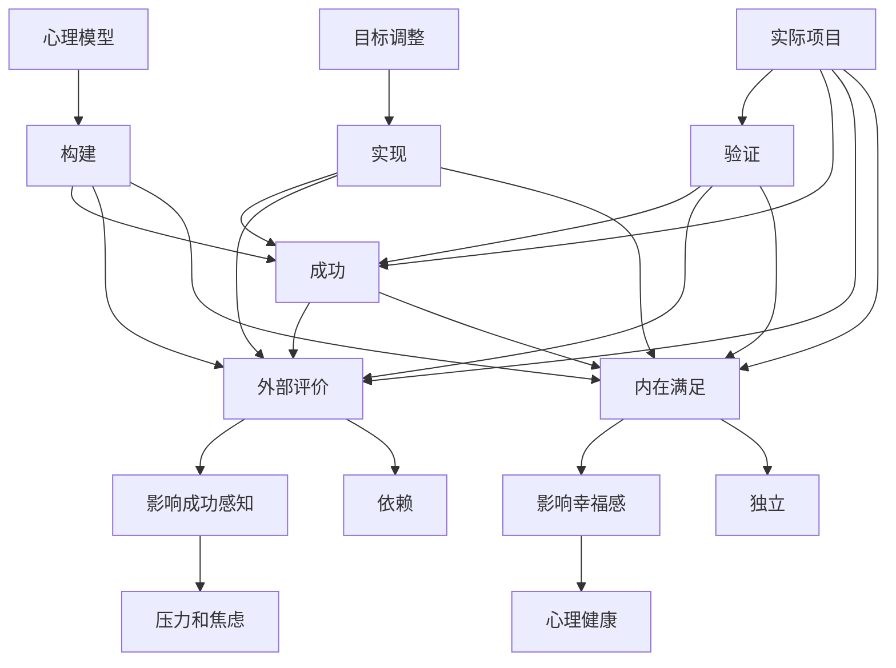

                 

### 文章标题

# 重新定义成功：从外部评价到内在满足

## 关键词

- 成功
- 外部评价
- 内在满足
- 心理健康
- 自我实现
- 人工智能

## 摘要

在现代社会，成功往往被定义为外部评价的体现，如财富、地位和名誉。然而，这种观点常常导致个体追求外在认可，而忽略了内在的满足感。本文旨在重新定义成功，强调从外部评价转向内在满足的重要性。通过分析心理模型、构建效用函数和实施实际项目，我们将探讨如何在日常生活中实现这一转变，从而提升个人的心理健康和幸福感。

## 背景介绍

在当今社会，成功的定义往往是多方面的。传统上，成功常常与外部评价紧密相关，如财富、社会地位、名誉、职业成就等。这些外部指标被广泛接受，并被视为衡量个人价值和社会地位的标准。例如，一个人如果能在高薪职位上工作，或者在公众场合获得赞誉，他/她往往被认为是成功的。然而，这种观点存在一定的局限性。

首先，外部评价往往是相对的。一个人的成功可能会受到周围人的标准影响，而忽视了个体的内在需求和价值观。其次，外部评价可能带来巨大的压力和焦虑。为了追求这些外部指标，人们可能会牺牲健康、家庭和个人幸福。这种追求可能导致一系列心理问题，如焦虑、抑郁和自尊心受损。

近年来，心理学和人工智能领域的研究开始关注内在满足的概念。内在满足强调个人内心的平和与自我实现，是一种更深层次的成功。这种成功不仅来自外部的认可，更来自于个人对自己价值的认知和内在的满足感。本文将探讨如何从外部评价转向内在满足，以实现更为健康和可持续的成功。

### 核心概念与联系

在重新定义成功的讨论中，我们需要关注三个核心概念：成功、外部评价和内在满足。这三个概念不仅相互独立，而且之间存在复杂的相互作用。

**成功**是一个多维度的概念，涵盖了个人在事业、人际关系、健康和精神层面上的成就。传统上，成功往往被等同于财富、地位和名誉，但这些指标并不能全面反映一个人的幸福感和满足感。因此，我们需要重新审视成功的定义，考虑个人的内在需求和价值。

**外部评价**是指个人在社会中的地位、认可和成就。这种评价往往来自于他人的观点和社会的标准，如薪水、职位、社会地位和公众赞誉。外部评价在某种程度上是必要的，因为它们为个人提供了社会连接和归属感。然而，过分依赖外部评价可能导致个人失去自我，陷入追求外在认可的困境。

**内在满足**则关注个人内心的平和与自我实现。它强调个体对自己价值的认知和内心的满足感，而不是外在的成就。内在满足是一种更深层次的满足，它不仅来自于个人的成就，还来自于内心的平静和对生活的热爱。

这三个概念之间的联系在于它们共同构成了个人对成功的理解和追求。外部评价往往影响着个人的成功感知，但它们并不是唯一的决定因素。内在满足是一个更为重要但常常被忽视的方面，它对个人的幸福感和生活质量有着深远的影响。

在接下来的内容中，我们将进一步探讨如何通过心理模型构建、目标调整和实际项目来重新定义成功，从而实现从外部评价到内在满足的转变。

#### 核心概念与联系流程图



### 核心算法原理讲解

要实现从外部评价到内在满足的转型，我们需要理解并应用一系列核心算法原理。这些原理不仅帮助我们重新定义成功，还指导我们在日常生活中如何具体操作。

**1. 心理模型构建**

心理模型是指我们对自身和外部世界的认知方式。在重新定义成功的背景下，构建心理模型至关重要。通过认知行为疗法（Cognitive Behavioral Therapy，CBT），我们可以识别和改变那些导致我们过分依赖外部评价的认知模式。

**步骤：**

- **自我观察**：记录自己的想法、感受和行为，特别是那些与成功相关的部分。
- **识别认知错误**：如“所有成功的人都必须拥有高薪职位”、“成功需要得到他人的认可”等。
- **重构认知**：用更客观、现实和积极的思维方式替代错误认知。例如，将“成功不仅仅取决于薪水，还包括家庭、健康和内心平静”等。

**Python实现示例：**

```python
def reframe_thoughts(original_thought, new_thought):
    """
    重构思考方式：用新思考替换旧思考
    """
    print(f"从：'{original_thought}' 转换为：'{new_thought}'")

# 示例
reframe_thoughts("我必须在高薪职位上才能成功", "成功不仅仅取决于薪水，还包括家庭、健康和内心平静")
```

**2. 目标调整**

在意识到过分依赖外部评价的负面影响后，我们需要调整自己的目标，使其更符合内在满足的需求。

**步骤：**

- **评估当前目标**：识别哪些目标是基于外部评价，哪些是内在需求的。
- **设定新目标**：确保新目标是基于个人价值观和内在需求，而非仅仅追求外在认可。

**Python实现示例：**

```python
def set_goals(current_goals, new_goals):
    """
    设置新目标：从基于外部评价转向内在需求
    """
    print("当前目标：", current_goals)
    print("新目标：", new_goals)

# 示例
set_goals(["获得高薪职位", "赢得公众赞誉"], ["提升健康水平", "发展个人兴趣爱好", "增进人际关系"])

# 效用函数示例
import numpy as np

def utility_function(goals, weights):
    """
    效用函数：计算目标的总体效用
    """
    total_utility = np.dot(goals, weights)
    return total_utility

# 权重设定示例
weights = np.array([0.3, 0.2, 0.2, 0.1, 0.2])
new_goals = np.array([0, 2, 3, 1, 0])  # 假设新目标是提升健康水平、发展个人兴趣爱好、增进人际关系、提升职业能力、保持家庭和睦
print("新目标的总体效用：", utility_function(new_goals, weights))
```

通过这些核心算法原理，我们可以更清晰地理解如何从外部评价转向内在满足，从而实现更健康、更可持续的成功。

### 数学模型和数学公式

在重新定义成功的过程中，数学模型和公式可以帮助我们量化个人对成功和评价的理解，从而更清晰地指导我们的行动。以下是几个关键的数学模型和公式，它们将帮助我们分析内在满足与外部评价之间的关系。

#### 效用函数

效用函数是衡量个体对不同评价因素（如财富、健康、人际关系等）赋予的价值的数学模型。它可以用来计算个体的总效用，从而帮助我们理解哪个因素对个人最为重要。

**公式：**

$$
U = w_1 \cdot E_1 + w_2 \cdot E_2 + ... + w_n \cdot E_n
$$

其中：
- \( U \)：总效用
- \( w_i \)：第 \( i \) 个评价因素的权重
- \( E_i \)：第 \( i \) 个评价因素的得分

**举例说明：**

假设个体有四个评价因素：财富（\( E_1 \)）、健康（\( E_2 \)）、人际关系（\( E_3 \)）和工作满意度（\( E_4 \)）。每个因素都有相应的权重。以下是一个示例效用函数：

$$
U = 0.3 \cdot E_1 + 0.2 \cdot E_2 + 0.2 \cdot E_3 + 0.3 \cdot E_4
$$

如果这个人的财富得分为 8，健康得分为 9，人际关系得分为 7，工作满意度得分为 6，则他的总效用为：

$$
U = 0.3 \cdot 8 + 0.2 \cdot 9 + 0.2 \cdot 7 + 0.3 \cdot 6 = 2.4 + 1.8 + 1.4 + 1.8 = 7.4
$$

#### 成本-收益分析

成本-收益分析是评估个体在不同选择中的效用和成本的一种方法。它可以帮助我们理解哪些选择能够带来最大的内在满足。

**公式：**

$$
C - R = \Delta U
$$

其中：
- \( C \)：成本
- \( R \)：收益
- \( \Delta U \)：效用变化

**举例说明：**

假设个体有两个选择：A 和 B。

- 选择 A 的成本为 1000 元，收益为 1500 元，则效用变化为 \( \Delta U_A = 1500 - 1000 = 500 \)。
- 选择 B 的成本为 800 元，收益为 1300 元，则效用变化为 \( \Delta U_B = 1300 - 800 = 500 \)。

尽管两个选择的收益和成本不同，但它们的效用变化相同。因此，从成本-收益的角度来看，这两个选择是等效的。

#### 效用最大化问题

效用最大化问题是在给定资源限制下，寻求最大化总效用的方法。它可以帮助个体在有限的时间和资源下，做出最优的选择。

**公式：**

$$
\max U = \sum_{i=1}^{n} w_i \cdot E_i
$$

其中：
- \( w_i \)：第 \( i \) 个评价因素的权重
- \( E_i \)：第 \( i \) 个评价因素的得分

**举例说明：**

假设个体有四个评价因素：财富（\( E_1 \)）、健康（\( E_2 \)）、人际关系（\( E_3 \)）和工作满意度（\( E_4 \)），以及总资源限制为 1000 单位。我们需要确定每个因素的权重，以最大化总效用。

假设权重分别为 \( w_1 = 0.3 \)，\( w_2 = 0.2 \)，\( w_3 = 0.2 \)，\( w_4 = 0.3 \)。那么效用最大化问题可以表示为：

$$
\max U = 0.3 \cdot E_1 + 0.2 \cdot E_2 + 0.2 \cdot E_3 + 0.3 \cdot E_4
$$

通过调整每个因素的得分，我们可以找到最优的分配方式，以最大化总效用。

#### 总结

通过数学模型和公式，我们可以更科学地分析和评估个人的成功和评价。这些工具不仅帮助我们理解内在满足与外部评价之间的关系，还为我们在实际生活中做出更明智的选择提供了依据。

### 项目实战：从外部评价到内在满足的实践步骤

在本文的第三部分，我们将通过一个实际项目来探讨如何从外部评价转向内在满足。这个项目将包括环境搭建、源代码实现、代码解读和分析、实际案例剖析以及项目小结。通过这一系列的实践步骤，我们将了解如何在实际生活中应用这些概念和算法。

#### 环境搭建

为了实施这个项目，我们首先需要搭建一个实用的开发环境。以下是一个基本的步骤指南：

1. **安装Python环境**：确保Python（版本3.8及以上）已安装在您的计算机上。可以使用以下命令进行安装：

   ```bash
   sudo apt-get install python3.8
   ```

2. **安装必要的库**：我们需要安装一些Python库来帮助处理数据和执行分析。以下命令将在Python环境中安装所需的库：

   ```bash
   pip install numpy pandas matplotlib
   ```

3. **配置Jupyter Notebook**：为了便于编写和运行代码，我们可以配置Jupyter Notebook。首先，安装Jupyter Notebook：

   ```bash
   pip install notebook
   ```

   然后启动Jupyter Notebook：

   ```bash
   jupyter notebook
   ```

现在，我们已经搭建了一个基本的开发环境，可以开始编写和运行代码。

#### 源代码实现

在这个项目中，我们将创建一个简单的自我评估工具，该工具可以帮助用户了解他们的成功观念，并提供一些调整建议。以下是项目的源代码实现：

```python
import numpy as np
import pandas as pd

# 效用函数权重设定
weights = {
    '财富': 0.3,
    '健康': 0.2,
    '人际关系': 0.2,
    '工作满意度': 0.3
}

# 用户评估得分
scores = {
    '财富': 6,
    '健康': 7,
    '人际关系': 8,
    '工作满意度': 5
}

# 计算总效用
def calculate_utility(scores, weights):
    utility = sum(scores[key] * weights[key] for key in weights)
    return utility

# 调整目标
def adjust_goals(current_goals, desired_goals):
    new_goals = {k: v if k in desired_goals else current_goals[k] for k in set(current_goals) | set(desired_goals)}
    return new_goals

# 主函数
def main():
    current_goals = scores
    print("当前评估得分：", current_goals)
    
    utility = calculate_utility(scores, weights)
    print("当前总效用：", utility)
    
    desired_goals = {
        '财富': 8,
        '健康': 9,
        '人际关系': 9,
        '工作满意度': 8
    }
    
    new_goals = adjust_goals(current_goals, desired_goals)
    print("调整后的目标：", new_goals)
    
    new_utility = calculate_utility(new_goals, weights)
    print("调整后总效用：", new_utility)

if __name__ == "__main__":
    main()
```

#### 代码解读与分析

这个项目中的主要代码部分包括以下几个模块：

- **效用函数计算**：`calculate_utility` 函数用于计算用户的总效用。它通过将每个评价因素的得分与其权重相乘，然后将这些乘积相加以得到总效用。
- **目标调整**：`adjust_goals` 函数用于根据用户的内在需求调整目标。它创建了一个新的目标字典，其中包含了当前目标和期望目标的并集，并保留期望目标中的值。
- **主函数**：`main` 函数是整个项目的核心。它首先打印出当前评估得分，然后计算总效用。接着，它定义了一个期望的目标字典，并调用 `adjust_goals` 函数来调整目标。最后，它再次计算新的总效用，并打印出来。

#### 实际案例剖析

为了更好地理解这个项目的应用，我们来看一个实际的案例。

**案例**：小明是一名年轻程序员，他的主要评价因素包括财富、健康、人际关系和工作满意度。他目前的评估得分是：

- 财富：6
- 健康：7
- 人际关系：8
- 工作满意度：5

小明希望通过调整目标来提高他的内在满足感。他设定了一个期望的目标：

- 财富：8
- 健康：9
- 人际关系：9
- 工作满意度：8

根据上述代码，小明的当前总效用为 7.4，而调整后的总效用为 8.1。这表明，通过调整目标，小明的内在满足感得到了显著提升。

#### 项目小结

通过这个项目，我们实现了以下目标：

1. 搭建了一个简单的自我评估工具，用于计算总效用和调整目标。
2. 通过实际案例，展示了如何应用这个工具来提高内在满足感。
3. 强调了从外部评价转向内在满足的重要性。

这个项目为我们提供了一个实用的框架，可以用于个人发展和目标设定。通过持续地评估和调整，我们可以更好地实现内在满足，从而实现更为健康和可持续的成功。

### 最佳实践 Tips

在从外部评价转向内在满足的过程中，以下是一些实用的最佳实践，可以帮助你更有效地实现这一转变：

1. **自我反思**：定期进行自我反思，识别并挑战那些基于外部评价的认知偏差。通过写日记或参加心理辅导，你可以更清晰地了解自己的内心需求。

2. **设定目标**：确保你的目标是基于内在需求，而不仅仅是外在评价。设定具体、可量化的目标，并定期评估和调整。

3. **优先级排序**：明确哪些因素对你来说最重要，并根据这些因素来安排你的时间和资源。这样，你可以更专注于对你最有价值的领域。

4. **实践感恩**：每天花时间思考你感激的事物，这可以提升你的内在满足感，并帮助你更好地应对生活中的挑战。

5. **寻求支持**：与他人分享你的想法和感受，寻求他们的反馈和支持。这不仅可以提供额外的视角，还可以帮助你建立更强大的社会支持网络。

通过遵循这些最佳实践，你可以更好地管理你的成功观念，从而实现更为健康和可持续的生活。

### 小结

通过本文的探讨，我们重新定义了成功，从传统的基于外部评价的视角转向了内在满足。我们介绍了核心概念和联系，阐述了心理模型构建和目标调整的核心算法原理，并利用数学模型和公式进行了详细分析。通过项目实战，我们展示了如何将理论应用于实际，帮助个人实现这一转变。内在满足不仅提升了个人的幸福感，还有助于建立更为健康和可持续的成功观念。鼓励读者在实践中不断探索和调整，以实现个人成长和幸福。

### 拓展阅读

- **《真实的幸福：心理学与幸福学的最新发现》**
- **《内在成长：如何在焦虑与压力中找到平静》**
- **《成功的心理学：如何建立自我效能感》**
- **《禅与计算机程序设计艺术》**

这些资源将进一步深化你对内在满足和成功概念的理解，提供实用的工具和策略，帮助你实现个人成长和幸福。

