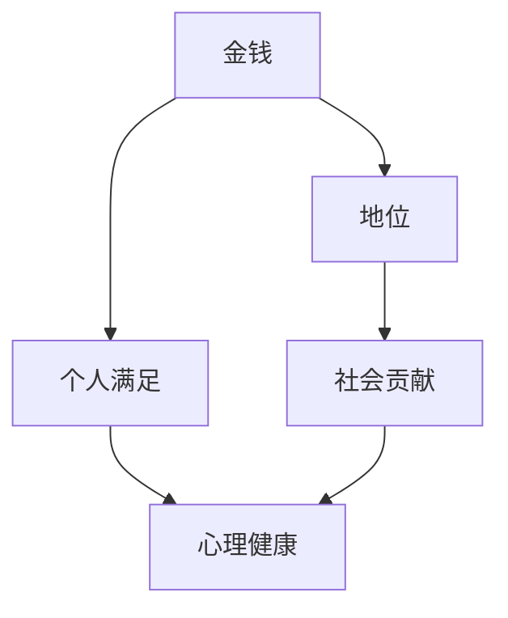
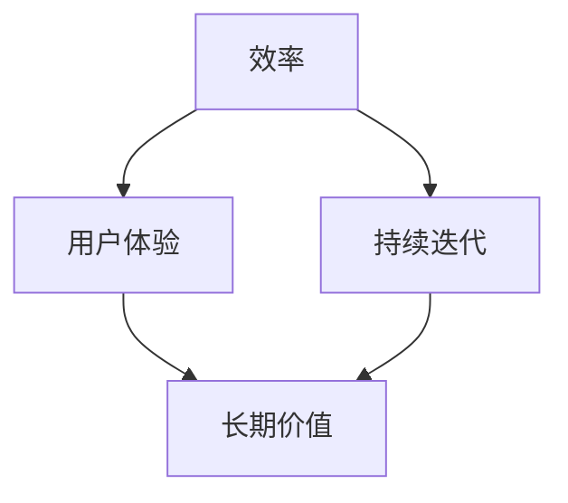
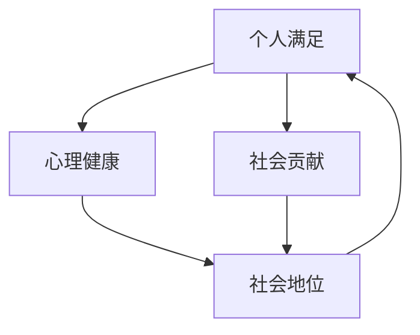
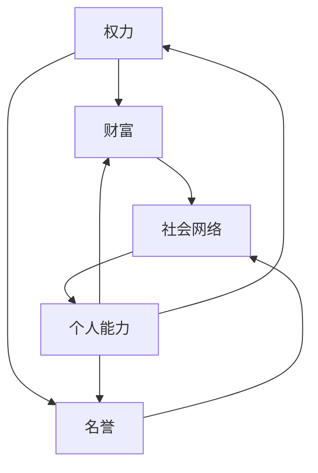

                 

### 背景介绍

在当今社会，成功被广泛地视为一个多维度的目标，它不仅包括物质财富和社会地位的提升，还涉及到个人的内在满足和心理健康。然而，随着科技的发展和社会的变迁，成功的定义也在不断地演变。传统意义上的成功往往与金钱、地位和荣誉紧密相连，但这些外在的成就是否能带来持久的幸福和满足感，已经成为人们探讨的新议题。

### 成功的传统观念

在传统的观念中，成功被普遍定义为在社会和经济层面上的卓越表现。这种定义通常体现在以下几个方面：

1. **金钱**：财富被认为是衡量成功的首要标准，因为金钱可以提供物质享受和社会地位。
2. **地位**：在社会中占据较高的位置，如高级职位、社会名流等，被认为是一种成功。
3. **荣誉**：包括奖项、荣誉头衔和公众认可，这些都是成功的标志。

这种传统观念的形成有其历史和社会背景。在过去，物质匮乏是普遍现象，因此拥有财富可以保障个人的生存和生活质量。同时，社会地位和荣誉也是身份和权力的象征，能够带来尊重和影响力。在这样的背景下，成功被视为一种外在的、显性的成就。

### 成功的多维度评估

然而，随着时代的发展，人们开始意识到成功不仅仅是外在的成就，还包括内在的满足感和幸福感。这种新的视角强调以下几个方面：

1. **个人满足**：内心的平和与快乐，对自我价值和生活的认可。
2. **心理健康**：情绪稳定、心理健康的个体更能享受生活，应对压力和挑战。
3. **社会贡献**：通过工作、志愿服务等方式对社会产生积极影响。

这种多维度评估的成功观念更加关注个人的内在状态和社会关系，认为成功的本质在于个人与社会的和谐发展。

### 成功的新定义

结合上述分析，成功的新定义可以概括为：在物质财富、社会地位和内在满足之间找到平衡，实现个人与社会的共同发展。这个新定义不仅关注外在成就，更重视内在的幸福感和心理健康，以及对社会和他人的积极影响。

### 结论

成功是一个复杂而多元的概念，随着社会的变迁，人们对成功的理解和追求也在不断变化。传统观念中的成功标准虽然有其历史意义，但现代社会的成功更多地体现在个人满足和社会贡献上。因此，重新定义成功，寻找物质、社会地位和内在满足之间的平衡，是当前和未来社会发展的重要议题。

核心概念与联系：

- **金钱**：物质基础的保障，但并非成功的唯一标准。
- **地位**：社会认可和影响力的标志，但需与内在满足相结合。
- **个人满足**：内心的平和与快乐，是现代成功的重要维度。
- **心理健康**：情绪稳定，对个人和社会都有积极影响。
- **社会贡献**：通过工作、志愿服务等方式对社会产生积极影响。

为了更直观地展示这些概念之间的关系，我们可以使用 Mermaid 流程图来描绘：



在这个流程图中，金钱和地位是成功的传统标志，但它们与个人满足、心理健康和社会贡献之间存在着紧密的联系。只有当这些维度得到平衡时，我们才能实现真正的成功。

### 1.1.1 从软件 1.0 到软件 2.0 的演进

在软件工程领域，成功也经历了类似的演变过程。从最初的软件 1.0 到现在的软件 2.0，这种转变不仅体现在技术的进步，也反映了人们对成功观念的理解。

- **软件 1.0**：早期的软件产品以功能性和性能为主要目标。成功被定义为是否能够按照预定的时间表和预算完成开发，并且软件是否能够正常运行。这个阶段的成功主要依赖于技术的突破和高效的项目管理。

```python
# 软件版本1.0示例代码
def calculate_area(radius):
    """计算圆的面积"""
    return 3.14 * radius * radius
```

- **软件 2.0**：随着互联网和移动设备的普及，软件的成功标准发生了变化。除了功能性，用户体验、可扩展性和可持续性也成为了关键因素。成功的定义从单纯的功能实现，转变为满足用户需求、提供卓越的体验，并且能够在不断变化的环境中持续迭代。

```python
# 软件版本2.0示例代码
class Calculator:
    def __init__(self, radius):
        self.radius = radius

    def calculate_area(self):
        """计算圆的面积"""
        return 3.14 * self.radius ** 2
    
    def update_radius(self, new_radius):
        """更新半径"""
        self.radius = new_radius
```

这个例子展示了软件从 1.0 到 2.0 的转变。在软件 1.0 中，我们只需要一个简单的函数来计算圆的面积；而在软件 2.0 中，我们引入了一个类，不仅提供了计算面积的方法，还增加了用户交互的功能，使其更符合用户的需求。

### 传统观念与现代观念的对比

通过软件领域的例子，我们可以看到传统观念和现代观念之间的差异。传统观念注重的是成果和效率，而现代观念更加关注用户体验和持续迭代。

1. **效率与用户体验**：传统观念追求的是在有限的时间内完成更多的任务，而现代观念则更注重如何提供更好的用户体验，使得用户在使用过程中感到愉悦和满足。
2. **单一目标与多维度目标**：传统观念通常将成功视为单一的目标，如完成项目或达到销售目标；而现代观念则认为成功是一个多维度的目标，包括功能、用户体验、可扩展性等。
3. **短期成果与长期价值**：传统观念往往关注短期的成果，如项目的按时交付；而现代观念则更注重长期的价值，如产品的可持续发展和用户的长期满意度。

这种转变不仅在软件领域，在其他领域如商业、教育等也在发生。成功不再仅仅是外在的成就，更多的是内在的价值和长期的持续发展。

### 结论

通过从软件 1.0 到软件 2.0 的演进，我们可以看到成功观念的转变。这种转变不仅反映了技术的进步，也体现了人们对成功的新理解。在新的成功观念中，效率、用户体验、持续迭代和长期价值成为了关键因素。这种观念的演变，为我们重新定义成功提供了新的视角。



在这个流程图中，我们可以清晰地看到，传统观念中的“效率”被现代观念中的“用户体验”和“持续迭代”所取代，而“长期价值”成为了成功的终极目标。

### 1.2 成功的全新视角

在当今社会，成功的定义正在经历深刻的变革。随着人们对生活质量的追求和个人价值的认知不断提升，成功不再仅仅局限于金钱和地位，而是逐渐转向内在满足、心理健康和社会贡献等维度。这种全新的视角为成功赋予了更多的内涵和可能性。

### 内在满足的重要性

内在满足是现代成功观念的核心之一。它指的是个人在追求目标的过程中，所获得的自我认可、内心的平和与快乐。这种满足感并非来源于外部的奖赏或认可，而是源自个人的内在体验和自我实现。

1. **自我认可**：内在满足的一个关键因素是自我认可。个人在实现目标的过程中，如果能够感受到自己的努力得到了认可和肯定，就能获得强烈的满足感。
2. **内心平和**：与自我认可相辅相成的是内心的平和。一个内心平和的人，能够更好地应对生活中的压力和挑战，从而在精神层面获得持久的满足感。
3. **快乐**：快乐是内在满足的重要表现。当个人能够从日常的生活中找到快乐和满足，即使在外在条件并不优越的情况下，也能拥有一个幸福的人生。

### 心理健康的重要性

心理健康是现代成功不可或缺的一部分。一个心理健康的人，不仅能够在生活中保持积极的态度，还能更好地应对压力和挑战，从而实现更高层次的成功。

1. **情绪稳定**：心理健康的首要表现是情绪稳定。情绪波动过大会影响个人的工作和生活质量，而情绪稳定有助于提高工作效率和生活满意度。
2. **自我认知**：心理健康还包括对自我的认知。一个心理健康的人能够清楚地认识到自己的优点和不足，从而在自我提升中找到成就感。
3. **压力管理**：面对压力是每个人都会遇到的挑战。心理健康的人能够有效地管理压力，避免因压力过大而导致的情绪崩溃和生理疾病。

### 社会贡献的重要性

除了个人的内在满足和心理健康，社会贡献也是现代成功观念的重要维度。通过为社会做出贡献，个人不仅能够实现自我价值，还能获得更深层次的满足感。

1. **社会责任**：社会贡献体现了个人对社会的责任和义务。通过参与公益活动、志愿服务等方式，个人能够为社会带来积极的改变。
2. **社会影响力**：社会贡献还可以增强个人的社会影响力。当个人在某个领域或社会事务中发挥重要作用时，会获得更多的认可和尊重。
3. **可持续发展**：社会贡献不仅体现在当前，还关注未来的可持续发展。通过推动环境保护、社会公正等议题，个人可以为社会的长期发展做出贡献。

### 综合社会地位与个人满足

现代成功观念强调在社会地位和个人满足之间找到平衡。这种平衡不仅需要个人在事业上取得成功，还需要在心理健康和社会贡献方面有所成就。

1. **平衡的重要性**：社会地位和个人满足并不是对立的，而是相辅相成的。一个在社会上取得成功但内心不满足的人，很难说是真正成功的。同样，一个内心满足但缺乏社会地位的人，也难以实现全面的成功。
2. **实现路径**：要实现这种平衡，个人需要设定短期和长期的目标，不断调整自己的生活方式和价值观，找到适合自己的发展路径。
3. **可持续性**：成功的平衡是一个动态的过程，需要持续的努力和自我反思。个人需要不断地学习和成长，以适应不断变化的社会环境。

### 结论

成功的全新视角为我们重新定义成功提供了新的思路。内在满足、心理健康和社会贡献成为现代成功的重要组成部分，它们共同构成了一个更加全面和可持续的成功观念。在这个观念下，个人不仅要在事业上取得成功，还要在心理和社会层面实现平衡，从而实现真正的幸福和满足。

### 1.3 成功的新定义

在重新审视成功的传统观念和现代视角之后，我们可以提出一个更为全面和现代的成功定义。成功不仅仅是对外在成就的追求，更是内在满足、心理健康和社会贡献的综合体现。这个新定义涵盖了以下几个关键要素：

1. **个人满足**：这是现代成功观念的核心。个人满足指的是在追求目标的过程中，感受到的内心平和、快乐和自我认可。这种满足并非依赖于外部的奖励或认可，而是源自个人内在的体验和自我实现。个人满足的重要性在于，它为个人提供了持续的动力和幸福感，使得生活充满了意义和满足感。

2. **心理健康**：心理健康是实现长期成功的关键。一个心理健康的人能够在情绪上保持稳定，有效地管理压力，并在面对挑战时保持积极的态度。心理健康不仅影响个人的生活质量，还对其职业发展和人际交往产生深远的影响。因此，心理健康被视为成功不可或缺的一部分。

3. **社会贡献**：社会贡献体现了个人对社会的责任和义务。通过参与公益活动、志愿服务等方式，个人可以为社会带来积极的改变，从而实现更深层次的自我价值。社会贡献不仅增强了个人在社会中的影响力，还促进了社会的可持续发展。

4. **社会地位**：虽然社会地位不再是成功的唯一标志，但它仍然是衡量个人成功的重要维度之一。在社会中占据较高的地位，通常意味着拥有更大的话语权、更多的资源和更广阔的发展机会。然而，社会地位的提升应与个人满足和心理健康相平衡，以实现全面的成功。

5. **可持续性**：成功是一个动态的过程，需要个人在各个方面不断地努力和调整。可持续性强调的是长期的发展和持续的进步，而非短期的成就。个人需要设定短期和长期的目标，并根据实际情况不断调整自己的生活方式和价值观，以实现全面的、可持续的成功。

结合上述要素，我们可以得出成功的新定义：成功是一个在个人满足、心理健康、社会贡献和社会地位之间找到平衡的动态过程。这种平衡不仅体现在当前的生活中，还关注未来的发展和可持续性。只有当个人在各个维度上实现平衡时，才能真正称得上是成功的。

为了更直观地展示这些要素之间的关系，我们可以使用 Mermaid 流程图来描绘：



在这个流程图中，个人满足、心理健康、社会贡献和社会地位之间相互影响、相互促进，形成了一个动态的平衡系统。个人满足和心理健康是基础，它们为个人提供了持续的动力和幸福感；社会贡献和社会地位则是外在表现，它们体现了个人在社会中的地位和影响力。只有在这个平衡系统中，个人才能实现真正的成功。

### 2. 社会地位的提升策略

社会地位是衡量个人成功的重要指标之一，它不仅反映了个人的社会影响力和资源获取能力，还与职业发展、生活质量等紧密相关。然而，提升社会地位并非一蹴而就，需要制定科学的策略和长期的执行。以下是一些关键策略：

#### 个人品牌建设

个人品牌建设是提升社会地位的基础。一个强有力的个人品牌能够让人在社会中脱颖而出，赢得更多的机会和尊重。

1. **明确个人定位**：首先，需要明确自己的专业领域和个人优势，从而确定个人品牌的核心价值。这可以通过深入研究和广泛学习来实现。

2. **持续学习和提升**：在确定了个人品牌的核心价值后，持续学习和提升是必不可少的。这包括掌握最新的行业知识、技能和工具，以及参与各种培训和研讨会。

3. **展示专业能力**：通过撰写高质量的技术博客、发表学术论文、参与行业会议等方式，展示自己的专业能力和研究成果，增强个人品牌的影响力。

4. **建立良好的人际网络**：人际关系是提升社会地位的重要资源。通过参加行业活动、社交聚会等方式，积极拓展人际网络，建立广泛的社会联系。

#### 职业规划与职业发展

职业规划与职业发展是提升社会地位的关键步骤。一个明确的职业目标和详细的实施计划，有助于个人在职业生涯中不断进步。

1. **设定职业目标**：首先，需要设定短期和长期的职业目标。短期目标可以是提升某一技能、获得某一证书或晋升到某一职位；长期目标可以是成为某一领域的专家或领导者。

2. **制定实施计划**：在设定了职业目标后，需要制定详细的实施计划，包括需要掌握的技能、需要完成的任务、需要参与的活动等。

3. **持续努力和调整**：职业规划不是一成不变的，需要根据实际情况进行持续的努力和调整。这包括定期评估进度、反思目标和策略，以及根据市场变化和个人发展情况进行调整。

4. **抓住机遇**：在职业发展中，抓住机遇是非常重要的。这包括主动寻找晋升机会、积极争取项目领导权、参与公司重大决策等。

#### 建立和扩展人际关系网络

人际关系网络是提升社会地位的重要途径。一个广泛而有力的人际网络能够为个人提供各种资源和机会。

1. **主动建立联系**：通过参加行业活动、社交聚会等方式，主动与他人建立联系。这不仅有助于扩展人脉，还能增加个人的曝光率。

2. **维护和深化关系**：建立联系只是第一步，维护和深化关系同样重要。这包括定期与联系人保持沟通、主动提供帮助和支持、建立互信和合作关系。

3. **利用人际关系**：在适当的时候，可以利用人际关系网络为自己争取资源、机会和支持。这包括通过他人介绍获得面试机会、通过推荐获得项目支持等。

#### 不断学习和提升

在不断变化的社会环境中，不断学习和提升是保持竞争力的关键。这包括：

1. **更新知识结构**：定期学习新的知识和技术，保持对行业动态的敏感度。

2. **培养综合素质**：除了专业能力，还需要培养领导力、沟通能力、团队合作能力等综合素质。

3. **培养跨领域思维**：跨领域思维的培养有助于个人在多个领域内发展，从而提高社会地位。

### 结论

提升社会地位是一个系统性工程，需要个人品牌建设、职业规划与职业发展、人际关系网络建设和不断学习和提升等多个方面的协同作用。通过制定科学的策略和长期的执行，个人可以在社会中不断提升自己的地位，实现全面的成功。

### 2.1 社会地位的构成

社会地位的构成是多元且复杂的，它不仅仅是一个简单的量化指标，而是由多个维度共同作用的结果。理解这些维度及其相互关系，对于个人在社会中实现提升至关重要。

#### 权力

权力是社会地位的核心维度之一。权力通常指的是个人或组织在决策过程中所拥有的影响力和控制力。它可以体现在以下几个方面：

1. **决策能力**：拥有权力的人能够在组织或社会事务中做出具有影响力的决策。
2. **资源控制**：权力使人能够支配和组织资源，如资金、人力和物资等。
3. **影响力**：权力使个人的意见和决策能够被广泛接受和执行。

#### 财富

财富是另一个重要的社会地位维度，它通常指的是个人或组织所拥有的经济资源。财富的多少不仅决定了个人在物质上的满足度，还直接影响其在社会中的地位。

1. **物质财富**：包括银行存款、房产、股票、投资等。
2. **消费能力**：财富的多少决定了个人的消费水平和消费能力，从而影响其社会形象和社交圈子。
3. **社会认可**：财富通常与地位和社会认可挂钩，富有的人在社会中往往受到更多的尊重和关注。

#### 名誉

名誉是社会地位的一个重要维度，它反映了个人在社会中的声誉和声望。名誉不仅取决于个人的社会行为，还受到媒体、公众舆论等因素的影响。

1. **声誉**：名誉是指个人在社会中的良好口碑和声誉，它是长期积累的结果。
2. **声望**：声望是指个人在社会中受到的尊重和重视，通常与个人在社会中的地位和影响力成正比。
3. **公众形象**：良好的公众形象有助于提升个人的名誉，使其在社会中获得更多的认可和支持。

#### 社会网络

社会网络是现代社会中不可或缺的一部分，它反映了个人在社会中的关系结构和互动模式。一个强大和广泛的社会网络可以提供多种资源和支持，从而提升个人的社会地位。

1. **关系密度**：社会网络中的关系密度决定了个人能够获得多少资源和支持，关系密度越高，个人在社交中的地位通常越高。
2. **关系质量**：社会网络中的关系质量决定了个人在这些关系中获得帮助和支持的效率和效果。
3. **关系多样性**：社会网络中的关系多样性有助于个人在多个领域中获得资源和机会，从而提高其社会地位。

#### 个人能力

个人能力是个人社会地位的一个重要组成部分，它包括专业技能、综合素质和领导力等。个人能力不仅影响个人的职业发展和收入水平，还影响其在社会中的影响力。

1. **专业技能**：专业的知识和技能是个人在社会中立足的基础，它决定了个人在特定领域的竞争力和地位。
2. **综合素质**：综合素质包括沟通能力、团队合作能力、领导力等，这些能力使得个人能够在多个场合中发挥重要作用。
3. **领导力**：领导力是提升个人社会地位的重要能力，它使个人能够在团队中发挥核心作用，并在组织中拥有更大的影响力。

### 关系架构

为了更直观地展示社会地位构成各维度之间的关系，我们可以使用 Mermaid 流程图来描绘：



在这个流程图中，我们可以看到社会地位构成的各维度之间存在着密切的联系和相互影响。权力、财富和名誉是提升社会地位的关键因素，而社会网络和个人能力则是这些因素的重要支撑。通过合理利用这些资源，个人可以不断提升自己的社会地位，实现全面的成功。

### 2.2 社会地位的重要性

社会地位的重要性不容忽视，它不仅影响个人的生活质量，还对职业发展和人际关系产生深远影响。

#### 影响力与话语权

社会地位高的个体通常具有更大的影响力，能够对组织和社区的事务产生重要影响。这种影响力不仅体现在决策过程中，还体现在对他人观点和行为的引导上。拥有高社会地位的个体，其话语权也相应增强，他们的意见和决策更容易被采纳和执行。

#### 职业发展机遇

社会地位对职业发展有着显著影响。处于较高社会地位的个体，往往能够获得更多的职业机会和晋升空间。这是因为高社会地位带来的资源和人脉，使得个体更容易获得重要项目的参与机会，以及与行业领袖和潜在合作伙伴的接触。此外，高社会地位还为个人提供了更多的培训和发展机会，有助于提升职业能力和竞争力。

#### 人际关系

社会地位对人际关系也有重要影响。高社会地位的个体往往能够建立更广泛和深厚的社交网络，这些关系网络不仅有助于个人在职业和生活中的资源获取，还能够提供情感支持和心理安慰。同时，社会地位的高低也在一定程度上影响了人际关系的质量和稳定性，高社会地位的个体通常更受欢迎，更容易建立稳定和持久的人际关系。

### 结论

社会地位的重要性体现在多个方面，它不仅影响个人的影响力与话语权、职业发展机遇和人际关系，还对生活质量产生深远影响。因此，提升社会地位是实现全面成功的重要一环，个人需要通过不断努力和积累资源，以实现更高的社会地位。

### 2.3 社会地位的提升策略

提升社会地位需要综合考虑个人品牌建设、职业规划与职业发展、人际网络拓展、以及持续学习和自我提升等多个方面。以下是一些具体的策略和实施步骤：

#### 个人品牌建设

1. **明确个人定位**：首先，需要明确自己的专业领域和个人优势，从而确定个人品牌的核心价值。可以通过自我反思、职业咨询等方式来确定自己的核心竞争力。

2. **持续学习和提升**：在确定了个人品牌的核心价值后，持续学习和提升是必不可少的。这包括掌握最新的行业知识、技能和工具，以及参与各种培训和研讨会。

3. **展示专业能力**：通过撰写高质量的技术博客、发表学术论文、参与行业会议等方式，展示自己的专业能力和研究成果，增强个人品牌的影响力。

4. **积极参与社交活动**：通过参加行业活动、社交聚会等方式，积极拓展人脉，建立广泛的社会联系。在社交活动中，要保持真诚和谦逊，以建立良好的人际关系。

#### 职业规划与职业发展

1. **设定职业目标**：首先，需要设定短期和长期的职业目标。短期目标可以是提升某一技能、获得某一证书或晋升到某一职位；长期目标可以是成为某一领域的专家或领导者。

2. **制定实施计划**：在设定了职业目标后，需要制定详细的实施计划，包括需要掌握的技能、需要完成的任务、需要参与的活动等。

3. **抓住机遇**：在职业发展中，抓住机遇是非常重要的。这包括主动寻找晋升机会、积极争取项目领导权、参与公司重大决策等。

4. **提升综合素质**：除了专业能力，还需要培养领导力、沟通能力、团队合作能力等综合素质，这些能力在职业发展中同样重要。

#### 人际网络拓展

1. **建立和扩展人际关系网络**：通过参加行业活动、社交聚会等方式，主动与他人建立联系。在建立联系时，要注重关系质量，建立互信和合作关系。

2. **维护和深化关系**：建立联系只是第一步，维护和深化关系同样重要。可以通过定期沟通、提供帮助和支持等方式来维护和深化关系。

3. **利用人际关系**：在适当的时候，可以利用人际关系网络为自己争取资源、机会和支持。这包括通过他人介绍获得面试机会、通过推荐获得项目支持等。

#### 持续学习和自我提升

1. **更新知识结构**：定期学习新的知识和技术，保持对行业动态的敏感度。

2. **培养跨领域思维**：跨领域思维的培养有助于个人在多个领域内发展，从而提高社会地位。

3. **自我反思和调整**：定期进行自我反思，评估自己的职业发展和社交关系，并根据实际情况进行调整。

### 结论

提升社会地位是一个系统性工程，需要个人品牌建设、职业规划与职业发展、人际网络拓展、以及持续学习和自我提升等多个方面的协同作用。通过制定科学的策略和长期的执行，个人可以在社会中不断提升自己的地位，实现全面的成功。

### 3. 个人满足的内涵与实现

个人满足是现代成功观念的核心之一，它不仅仅是对物质财富的追求，更是对内心平和、自我认知和生活质量的全面追求。理解个人满足的内涵及其实现途径，对于每个人来说都至关重要。

#### 个人满足的定义

个人满足是一个主观的概念，它涉及到个体在心理、情感和认知层面上的体验。具体来说，个人满足包括以下几个方面：

1. **内心平和**：这是个人满足的最基本层面，指的是个体在日常生活中能够保持心态的平和与稳定，不被外界压力和情绪波动所左右。
2. **自我认知**：个人满足还包括对自我价值的认知和认可。当个体能够认识到自己的长处和不足，并在自我提升中找到成就感时，就能够获得更深层次的满足感。
3. **生活质量**：生活质量是个人满足的重要体现，包括健康、家庭、工作环境等多个方面。一个高质量的生活能够为个体提供持续的动力和幸福感。

#### 实现个人满足的途径

要实现个人满足，需要从以下几个方面入手：

1. **心理健康的维护**：心理健康是实现个人满足的前提。保持心理健康，首先要关注情绪管理，学会在压力和挑战面前保持冷静和积极。其次，需要培养良好的睡眠习惯、饮食习惯和运动习惯，这些都有助于提升心理健康水平。

2. **自我提升与成长**：自我提升是实现个人满足的重要途径。通过不断学习和积累知识，提升专业技能和综合素质，个体能够在职业和生活中获得更多的成就感和满足感。此外，自我反思和自我调整也是自我提升的关键，定期对自己的行为和决策进行反思，并根据反馈进行调整，有助于个人不断成长。

3. **时间管理和生活平衡**：时间是有限的资源，合理的时间管理有助于个体实现生活和工作之间的平衡。通过设定目标和优先级，合理规划时间和任务，个体能够更好地控制自己的生活节奏，减少不必要的压力和焦虑。

4. **休闲活动的选择**：休闲活动对于个人满足同样重要。选择适合自己的休闲活动，如阅读、旅游、运动、艺术创作等，能够帮助个体在繁忙的生活中找到放松和乐趣，提升生活质量。

5. **社会支持与人际关系**：社会支持是个人满足的重要支撑。与家人、朋友和同事建立良好的关系，能够为个体提供情感支持和心理安慰。在需要帮助时，能够得到他人的支持和理解，有助于提升个人的幸福感。

#### 综合性的实现策略

为了实现个人满足，可以采取以下综合性策略：

1. **设定长期和短期目标**：个人满足的实现需要明确的目标和计划。设定长期和短期目标，有助于个体明确方向，集中精力去实现这些目标。
2. **持续学习和自我反思**：通过不断学习和自我反思，个体能够不断提升自我，找到实现个人满足的方法和途径。
3. **建立健康的生活习惯**：健康的生活习惯是个人满足的基础，通过良好的饮食习惯、运动习惯和睡眠习惯，能够提升个体的身心健康水平。
4. **积极应对挑战和压力**：在生活和工作中，难免会遇到各种挑战和压力。学会积极应对这些挑战，保持心态的平和与积极，有助于提升个人满足感。
5. **关注生活质量**：提高生活质量，从生活的各个方面去追求满足感，如改善居住环境、提升工作舒适度、丰富休闲活动等。

### 结论

个人满足是一个复杂而多维度的概念，它涉及到心理健康、自我提升、时间管理、休闲活动和社交关系等多个方面。通过采取综合性策略，个体可以在实现个人满足的过程中找到内心的平和与快乐，实现全面的成功。

### 3.1 个人满足的定义

个人满足是一个多维度、主观性的概念，它涉及到个体的情感、认知和心理健康等多个方面。具体来说，个人满足的定义可以从以下几个方面进行阐述：

#### 情感层面

在情感层面上，个人满足指的是个体在情感上感受到的愉悦、幸福和满足感。这种情感层面的满足源自于个体内心的平和、快乐和自我认可。以下是一些关键点：

1. **情感平和**：个人满足首先体现在情感的平和上。一个情感平和的人，能够在日常生活中保持心态的稳定，不被外界的压力和情绪波动所左右。
2. **自我认可**：情感层面的满足还与自我认可密切相关。当个体能够认可自己的价值、努力和成就时，会感受到强烈的满足感和幸福感。
3. **情感的稳定性**：情感的稳定性是个人满足的重要标志。一个情感稳定的人，能够更好地应对生活中的各种挑战和压力，从而保持长期的心理健康。

#### 认知层面

在认知层面上，个人满足指的是个体在认知和思维上感受到的满足感和成就感。这种满足感来源于个体对自我认知的提升、知识的积累和认知能力的提高。以下是一些关键点：

1. **自我认知**：个人满足的认知层面体现在自我认知的提升上。个体通过不断地学习和反思，能够更清楚地认识到自己的优点和不足，从而实现自我成长和提升。
2. **知识的积累**：知识的积累是个人满足的重要来源。通过学习和掌握新知识、新技能，个体能够提升自己的认知水平，从而获得成就感和满足感。
3. **认知能力的提升**：个人满足的认知层面还体现在认知能力的提升上。通过不断地锻炼和提升自己的认知能力，个体能够在工作和生活中更加高效和有成就感。

#### 心理健康层面

在心理健康层面，个人满足指的是个体在心理上感受到的平静、快乐和安全感。心理健康是个人满足的重要保障，以下是一些关键点：

1. **情绪管理**：心理健康层面的个人满足体现在情绪管理的有效性上。一个心理健康的人能够有效地管理自己的情绪，避免情绪波动对生活和工作的负面影响。
2. **压力应对**：心理健康还体现在个体在面对压力和挑战时的应对能力上。一个心理健康的人能够积极应对生活中的各种压力，从而保持内心的平静和快乐。
3. **心理健康状态**：长期的心理健康状态是个人满足的基础。通过保持良好的心理健康状态，个体能够更好地享受生活，实现个人目标。

#### 综合维度

个人满足是一个综合性的概念，它不仅包括情感、认知和心理健康三个层面，还涉及到个体的整体生活质量。以下是一些关键点：

1. **整体生活质量**：个人满足的整体生活质量维度体现在个体的物质生活条件、家庭关系、职业成就等多个方面。一个满足的人，通常能够在这些方面找到平衡和幸福。
2. **内在与外在的平衡**：个人满足的实现需要内在与外在的平衡。内在的满足感是基础，外在的物质和社交条件则是实现个人满足的保障。
3. **持续性和稳定性**：个人满足不是一时的情绪波动，而是一种长期的心理状态。通过持续的努力和自我反思，个体能够保持长期的满足感和幸福感。

### 结论

个人满足是一个复杂而多维度的概念，它涉及到情感、认知和心理健康等多个层面。通过理解个人满足的定义，个体能够更好地认识自己，找到实现满足感的途径，从而实现全面的成功。

### 3.2 个人满足的实现途径

实现个人满足是一个多层次、多维度的过程，它需要个体在心理健康、自我提升、时间管理和休闲活动选择等方面进行全面的规划和实践。以下是一些具体的实现途径：

#### 心理健康的维护

心理健康是实现个人满足的基础，维护心理健康的关键在于以下几个方面：

1. **情绪管理**：学会有效地管理情绪是心理健康的重要一环。个体可以通过深呼吸、冥想、瑜伽等放松技巧来缓解压力，保持情绪的稳定。
2. **心理咨询**：定期进行心理咨询可以帮助个体更好地了解自己的情绪和心理状态，从而采取适当的措施进行调整和改善。
3. **积极的社交活动**：积极参与社交活动，与家人、朋友和同事建立良好的关系，能够为个体提供情感支持和心理安慰，有助于提升心理健康水平。

#### 自我提升与成长

自我提升是实现个人满足的重要途径，以下是一些关键步骤：

1. **设定目标**：个体需要明确自己的短期和长期目标，这些目标应该具体、可衡量和可实现。通过设定目标，个体能够有方向地努力，提升自我实现感。
2. **持续学习**：学习是自我提升的重要手段。个体可以通过阅读书籍、参加培训课程、学习新技能等方式，不断充实自己的知识储备，提升认知能力。
3. **自我反思**：定期进行自我反思，评估自己的行为和决策，找出不足之处并进行改进，有助于个体的持续成长。

#### 时间管理和生活平衡

合理的时间管理是实现个人满足的关键，以下是一些具体策略：

1. **制定日程表**：制定详细的日程表，合理安排工作和生活的时间，确保工作和生活之间的平衡。
2. **设定优先级**：在日程表中，设定任务的优先级，优先处理重要且紧急的任务，避免时间浪费在琐碎的事情上。
3. **时间跟踪**：使用时间跟踪工具，记录自己的时间分配情况，分析时间利用的效率，从而进行改进。

#### 休闲活动的选择

休闲活动对于个人满足同样重要，选择合适的休闲活动能够帮助个体放松身心，提升生活质量。以下是一些建议：

1. **运动**：参与运动能够释放压力，提升身心健康。个体可以根据自己的兴趣选择跑步、瑜伽、游泳等运动方式。
2. **阅读**：阅读是一种放松和提升自我的好方法。个体可以选择一些感兴趣的书籍，如小说、自助类书籍等，丰富自己的内心世界。
3. **艺术创作**：参与艺术创作，如绘画、音乐、写作等，能够帮助个体表达情感，提升自我满足感。

#### 综合性策略

为了实现个人满足，可以采取以下综合性策略：

1. **设定长期和短期目标**：设定长期和短期目标，有助于个体明确方向，集中精力去实现这些目标。
2. **持续学习和自我反思**：通过不断学习和自我反思，个体能够不断提升自我，找到实现个人满足的方法和途径。
3. **建立健康的生活习惯**：健康的生活习惯是个人满足的基础，通过良好的饮食习惯、运动习惯和睡眠习惯，能够提升个体的身心健康水平。
4. **积极应对挑战和压力**：在生活和工作中，难免会遇到各种挑战和压力。学会积极应对这些挑战，保持心态的平和与积极，有助于提升个人满足感。
5. **关注生活质量**：提高生活质量，从生活的各个方面去追求满足感，如改善居住环境、提升工作舒适度、丰富休闲活动等。

### 结论

实现个人满足是一个多层次、多维度的过程，需要个体在心理健康、自我提升、时间管理和休闲活动选择等方面进行全面的规划和实践。通过采取综合性策略，个体能够在日常生活中找到内心的平和与快乐，实现全面的成功。

### 3.3 个人满足的可持续性

个人满足的可持续性是实现长期幸福感的关键。要确保个人满足能够持续，个体需要在以下几个方面进行持续投入：

#### 自我成长的持续投入

自我成长是实现个人满足的基石。个体需要不断学习、反思和提升，以适应不断变化的环境和挑战。以下是一些具体策略：

1. **终身学习**：在知识爆炸的时代，个体需要保持学习的热情和动力。可以通过在线课程、工作坊和研讨会等方式，不断更新自己的知识和技能。
2. **职业发展**：通过职业规划，明确自己的职业目标，并制定实现这些目标的步骤。这不仅有助于提升职业能力，还能为个人提供持续的满足感。
3. **兴趣爱好**：培养兴趣爱好，如绘画、音乐、写作等，能够为个人带来额外的满足感。兴趣爱好不仅能够丰富个人的生活，还能提升心理健康。

#### 社会贡献的意义

社会贡献是个人满足的另一个重要来源。通过为社会做出贡献，个体不仅能够实现自我价值，还能获得更深层次的满足感。以下是一些具体策略：

1. **志愿服务**：参与志愿服务，如帮助贫困家庭、参与环保活动等，能够为个体带来成就感和社会认同感。
2. **慈善捐赠**：通过慈善捐赠，支持那些需要帮助的人和组织，个体能够感受到自己的影响力，从而提升个人满足感。
3. **社区参与**：积极参与社区活动，如组织社区清洁日、文化庆典等，能够增强社区的凝聚力，也为个人提供机会去实现自我价值。

#### 心理健康的持续维护

心理健康是实现个人满足的保障。个体需要持续关注和维持自己的心理健康，以下是一些具体策略：

1. **情绪管理**：学会有效地管理情绪，避免情绪波动对生活和工作的影响。可以通过冥想、瑜伽等放松技巧来缓解压力。
2. **压力管理**：学会应对生活中的压力和挑战。可以通过制定日程表、设定优先级等方式，合理安排时间和任务，减少不必要的压力。
3. **心理健康支持**：如果遇到心理问题，及时寻求专业帮助。心理咨询和治疗是维护心理健康的重要手段。

#### 生活方式的调整

生活方式的调整是实现个人满足的可持续性的重要方面。以下是一些具体策略：

1. **健康饮食**：保持健康的饮食习惯，减少加工食品和高糖食品的摄入，增加蔬菜、水果和全谷类的摄入。
2. **定期运动**：保持规律的体育锻炼，如每周进行至少150分钟的中等强度运动，有助于提升身心健康水平。
3. **良好的睡眠习惯**：保持良好的睡眠习惯，确保每天获得足够的睡眠时间。睡眠质量的提升能够显著改善心理健康和生活质量。

#### 反馈与调整

持续性和可持续性还依赖于个体的反馈与调整。以下是一些具体策略：

1. **定期评估**：定期对自己的生活和工作进行评估，检查哪些方面做得好，哪些方面需要改进。
2. **灵活调整**：根据实际情况，灵活调整目标和策略。当面临新的挑战和变化时，能够迅速适应并调整自己的计划。
3. **持续反思**：持续反思自己的行为和决策，从经验中学习和成长，不断提升自我。

### 结论

个人满足的可持续性是实现长期幸福感的关键。通过自我成长的持续投入、社会贡献、心理健康的维护、生活方式的调整以及反馈与调整，个体能够实现长期的个人满足，从而在竞争激烈的社会中找到内心的平和与快乐。

### 4. 成功与满足的平衡

在追求成功的过程中，人们往往会面临成功与满足之间的平衡问题。这种平衡不仅涉及到职业目标与个人愿望的协调，还涉及到生活方式和社会压力的适应。理解这一平衡的重要性，以及如何在实际生活中实现它，对于实现全面的成功至关重要。

#### 成功与满足的冲突

在传统的成功观念中，成功通常被定义为在职业和社会层面上的卓越表现。这种成功往往体现在金钱、地位和荣誉上。然而，随着社会的发展和个体价值观的变化，人们开始意识到，单纯追求外在的成功并不能带来持久的幸福感。以下是一些常见的冲突：

1. **职业目标与个人愿望的冲突**：很多人在追求职业成功的过程中，可能会忽视个人愿望和家庭需求。例如，为了升职加薪，可能需要长时间工作，甚至牺牲个人休息和家庭时间。
2. **社会压力与个人需求的冲突**：社会对成功有着各种各样的期待和标准，这些标准可能并不符合个人的实际需求。例如，社会可能期待个人拥有高收入、豪华住宅和名牌产品，但这些并不一定是个人真正需要的。
3. **内在满足与外在成就的冲突**：外在的成就如金钱和地位，并不能直接带来内在的满足感。相反，有时过度的追求外在成就反而会导致内心的空虚和焦虑。

#### 成功与满足的平衡策略

要实现成功与满足的平衡，需要从以下几个方面入手：

1. **设定合理的职业目标**：设定职业目标时，不仅要考虑个人兴趣和职业前景，还要考虑个人的家庭需求和身心健康。例如，可以设定一个既具有挑战性又能够兼顾家庭和个人时间的目标。
2. **优先级排序**：在生活中，不同的目标和需求往往会有冲突。通过优先级排序，可以明确哪些是最重要的，从而在资源有限的情况下做出更明智的决策。例如，将家庭需求和个人健康放在更高的优先级上，而将一些次要的社交活动或非紧急工作安排在较后面。
3. **有效的时间管理**：时间管理是实现平衡的关键。通过合理安排时间，可以确保既能够完成工作任务，又有足够的时间来满足个人和家庭需求。例如，可以采用“时间块”管理法，将一天的时间划分为不同的区块，用于工作、休息和家庭。
4. **心理健康管理**：心理健康是实现平衡的基础。通过心理辅导、运动和冥想等方式，可以有效地管理压力和焦虑，保持心理的平和和健康。例如，可以定期进行心理咨询，或者通过参加瑜伽或冥想课程来放松身心。
5. **社会支持系统**：建立良好的社会支持系统，可以帮助个人在追求成功的过程中获得更多的支持和理解。这包括家人、朋友和同事的鼓励和支持，以及专业导师或顾问的建议。例如，可以建立一个支持小组，定期分享经验和心得，相互鼓励和帮助。
6. **灵活调整**：生活和工作是一个不断变化的过程，需要个体具备灵活调整的能力。在面对新的挑战和变化时，能够迅速适应并调整自己的目标和策略。例如，当家庭需求发生变化时，可以重新评估职业目标和时间安排，以更好地适应新的情况。

#### 实现平衡的案例分析

以下是一个具体的案例分析，展示了如何在实际生活中实现成功与满足的平衡：

**案例：张先生，35岁，软件工程师**

- **职业目标**：张先生在一家知名科技公司工作，他的职业目标是成为技术团队的核心成员，并最终成为一名技术经理。
- **个人愿望**：张先生热爱户外运动，每周至少会花两晚时间与家人一起参加户外活动。
- **社会压力**：张先生所在的公司文化强调加班和快速晋升，这在一定程度上给他的工作和生活带来了压力。

**解决方案**：

1. **设定合理的职业目标**：张先生将职业目标设定为在三年内成为技术团队的核心成员，同时确保每年有足够的时间陪伴家人。
2. **优先级排序**：张先生将家庭时间和个人健康放在工作之前，每天晚上7点到9点作为家庭活动时间，确保不会因为工作而占用这段时间。
3. **有效的时间管理**：张先生使用时间管理工具，如待办事项清单和日程表，合理安排工作和家庭时间，确保两者之间有明确的界限。
4. **心理健康管理**：张先生定期参加瑜伽和冥想课程，以缓解工作压力，保持心理健康。
5. **社会支持系统**：张先生加入了公司内部的跑步俱乐部，与同事一起锻炼，这不仅有助于提升身体健康，还能增加工作之外的社交机会。
6. **灵活调整**：当工作繁忙时，张先生会与家人和朋友沟通，调整家庭活动的时间，以确保不会因为工作而影响家庭关系。

**结果**：

通过上述策略，张先生在职业和个人生活之间实现了良好的平衡。他在工作中取得了显著的成绩，同时也能够享受家庭生活和户外运动带来的快乐。这种平衡不仅提升了他的生活质量，还增强了他的职业满意度和幸福感。

### 结论

成功与满足之间的平衡是实现全面成功的关键。通过设定合理的职业目标、优先级排序、有效的时间管理、心理健康管理、社会支持系统和灵活调整，个人可以在追求职业成功的同时，实现个人愿望和满足感。这种平衡不仅提升了生活质量，还为个人提供了持久的动力和幸福感。

### 4.1 成功与满足的冲突

在追求成功的过程中，个体常常面临着诸多冲突，这些冲突主要体现在以下几个方面：

#### 职业目标与个人愿望的冲突

职业目标通常涉及事业成就、职位晋升和薪资增长等外在指标，而个人愿望则更多地集中在生活质量、家庭和个人兴趣上。以下是一些具体的冲突点：

1. **工作时间与个人时间**：职业目标的实现往往需要大量的时间和精力投入，这可能导致个人时间被工作占据，无法满足个人愿望。例如，一个追求晋升的员工可能需要加班或牺牲周末时间，而这可能与其希望陪伴家人的愿望发生冲突。
2. **职业发展机会与个人健康**：为了在职业上取得更大的成就，个体可能需要不断追求更高的目标，这可能会对其健康造成影响。长时间的工作和高压环境可能导致身心疲惫，甚至引发健康问题。
3. **职业挑战与个人兴趣**：职业目标可能迫使个体从事自己不感兴趣或不喜欢的工作，从而影响个人的幸福感。例如，一个对艺术创作充满热情的年轻人可能被迫进入一个与自己兴趣不符的职场，这种冲突可能会导致职业满意度下降。

#### 社会压力与个人需求的冲突

社会压力来自外部环境，包括社会期待、行业标准和个人责任感等。个人需求则更侧重于内心的满足和个人的实际需求。以下是一些冲突点：

1. **社会期望与个人价值观**：社会可能对个体有特定的期望，如收入水平、职业地位和生活方式等。这些期望可能与个人的价值观和需求不符，导致个人感到压力和困惑。例如，一个重视家庭和亲情的个体可能被迫在繁忙的职场中追求高收入，而这与他的家庭价值观相悖。
2. **物质追求与心理需求**：社会常常强调物质财富的重要性，但个体在追求物质财富的过程中，可能会忽视心理需求，如情感支持、自我实现和内心满足。这种冲突可能导致个体的心理健康问题，如焦虑、抑郁和压力过大。
3. **职业成就与生活质量**：社会可能鼓励个体追求职业成功，但这可能会导致生活质量下降。例如，为了事业的成功，个体可能会牺牲休息时间、健康和家庭生活，这虽然短期内可能带来职业成就，但长期来看可能会影响个体的整体生活质量。

#### 内在满足与外在成就的冲突

内在满足是指个体在心理上感受到的满足和幸福感，而外在成就则通常体现在物质和社会地位上。以下是一些冲突点：

1. **表面成就与内在价值**：外在成就，如财富、地位和荣誉，可能会给人带来短暂的满足感，但这些成就并不一定能够持久地提升个体的幸福感。相反，个体可能会陷入追求外在成就的循环中，忽视了内在的价值和满足感。
2. **短期目标与长期幸福**：在追求外在成就的过程中，个体可能会设定短期目标，如提升职位或增加收入，但这些目标可能并不一定能够带来长期的幸福感。相反，个体可能需要设定更长期的幸福目标，如建立稳定的关系、追求个人成长和实现自我价值。
3. **成功定义的多样性**：不同的人对成功的定义可能有所不同。一些人可能认为职业成功是唯一的标准，而另一些人可能认为内在的满足感和幸福感更重要。这种定义的差异可能会导致内在满足与外在成就之间的冲突。

### 结论

成功与满足之间的冲突是复杂的，它涉及到职业目标与个人愿望、社会压力与个人需求、以及内在满足与外在成就等多个方面。理解这些冲突，并找到有效的平衡策略，对于实现全面的成功至关重要。

### 4.2 成功与满足的平衡策略

实现成功与满足的平衡是一个复杂的任务，需要个体在多个层面上进行持续的努力和调整。以下是一些具体的策略，可以帮助个体在追求职业成功的同时，保持个人满足和心理健康。

#### 短期与长期目标的设定

1. **设定短期目标**：短期目标通常与具体的职业发展里程碑相关，如晋升、完成项目或获得特定认证。设定短期目标可以帮助个体在职业生涯中保持动力和方向，同时不会忽视个人的需求。
   - **案例**：一个希望晋升为项目经理的个体可以设定短期目标，如掌握项目管理工具、完成相关课程和参与重要项目。
2. **设定长期目标**：长期目标与个人的整体生活质量和幸福感相关，如建立健康的生活方式、培养家庭关系或实现个人梦想。长期目标的设定可以帮助个体在追求职业成功的同时，关注个人的全面成长。
   - **案例**：一个在职场中努力奋斗的个体可以设定长期目标，如每年安排一次家庭旅行、定期锻炼和参与社区服务。

#### 生活方式的调整

1. **时间管理**：合理的时间管理是实现平衡的关键。个体可以通过以下方法来优化时间管理：
   - **优先级排序**：将任务按照重要性和紧急性进行排序，优先处理最重要的任务。
   - **时间块**：将一天的时间划分为不同的时间块，用于不同活动，如工作、家庭和个人兴趣。
   - **休息与放松**：确保有时间进行休息和放松，以避免过度疲劳和压力积累。
2. **健康生活**：保持健康的生活方式对于实现个人满足至关重要。个体可以通过以下方法来促进健康：
   - **合理饮食**：遵循健康的饮食习惯，减少高糖、高脂肪食物的摄入。
   - **定期锻炼**：每周至少进行150分钟的中等强度运动，如快走、跑步或游泳。
   - **充足睡眠**：保持充足的睡眠时间，每晚至少7-9小时，以提高整体健康水平。

#### 心理健康的维护

1. **情绪管理**：学会有效地管理情绪，避免情绪波动对生活和工作的负面影响。以下是一些情绪管理的策略：
   - **认知行为疗法**：通过认知行为疗法，学会识别和改变消极思维模式，提高情绪稳定性。
   - **冥想与放松**：定期进行冥想和放松练习，如深呼吸、瑜伽或冥想应用，帮助缓解压力和焦虑。
2. **心理咨询**：如果遇到严重的心理问题，及时寻求专业心理咨询师的帮助。心理咨询可以帮助个体更好地理解自己的情绪和行为，并提供有效的应对策略。

#### 社会支持系统

1. **家庭与朋友支持**：建立和维护良好的家庭和友谊关系，是个人满足的重要来源。以下是一些具体策略：
   - **定期沟通**：与家人和朋友保持定期的沟通，分享生活中的喜怒哀乐，获得情感支持和理解。
   - **共同活动**：与家人和朋友一起参加活动，如聚会、旅行或运动，增强关系和幸福感。
2. **专业支持**：寻求专业导师或顾问的支持，可以在职业发展和个人成长方面提供宝贵的指导和建议。以下是一些具体策略：
   - **职业咨询**：通过职业咨询，明确职业目标和职业规划，获得职业发展的方向和建议。
   - **心理健康支持**：寻求心理咨询师的支持，帮助管理心理压力和情绪问题。

#### 反馈与调整

1. **定期自我反思**：定期对自己的生活和工作进行反思，评估哪些方面做得好，哪些方面需要改进。以下是一些具体策略：
   - **日记记录**：保持日记记录，记录生活中的重要事件和感受，帮助自己更好地理解自己的需求和目标。
   - **定期评估**：每年或每半年进行一次自我评估，检查哪些目标已经实现，哪些目标需要调整。
2. **灵活调整**：在面对新的挑战和变化时，能够迅速适应并调整自己的目标和策略。以下是一些具体策略：
   - **弹性计划**：设定计划时，考虑到可能的变化和不确定性，留出调整的空间。
   - **持续学习**：保持学习和适应的能力，不断提升自己的技能和知识，以应对不断变化的环境。

### 结论

实现成功与满足的平衡需要个体在设定目标、调整生活方式、维护心理健康、建立社会支持系统和反馈调整等方面进行全面的规划和执行。通过这些策略，个体可以在追求职业成功的同时，保持个人满足和心理健康，实现全面的成功。

### 4.3 成功与满足的可持续平衡

要实现成功与满足的可持续平衡，个体不仅需要在短期内采取有效的策略，还需要从长期角度进行持续的调整和优化。以下是一些关键步骤和实际案例，以帮助个体在追求职业成功的同时，保持长期的心理健康和个人满足。

#### 自我反思与调整

自我反思是实现可持续平衡的基础。通过定期反思，个体可以识别出当前生活中的不足之处，并制定相应的改进措施。以下是一些具体步骤：

1. **定期自我评估**：每年或每半年进行一次全面的自我评估，评估自己在职业目标、个人满足、心理健康和社会支持等方面的进展。例如，可以制作一个自我评估表，列出具体的指标和目标，并进行评分。
2. **识别不足**：在自我评估过程中，要特别注意识别出自己在哪些方面做得不够好，哪些目标没有实现。例如，如果发现自己没有足够的时间陪伴家人，可以考虑调整工作时间和任务安排。
3. **制定改进计划**：根据自我评估的结果，制定具体的改进计划。例如，如果发现时间管理不够有效，可以制定一个详细的时间管理计划，包括每日的任务清单、优先级排序和时间块安排。

#### 持续学习与成长

持续学习和成长是实现可持续平衡的重要保障。以下是一些具体策略：

1. **设定长期学习目标**：制定长期的学习计划，确保自己在职业和技能方面不断进步。例如，可以设定每年学习一门新语言或掌握一项新技能的目标。
2. **积极参与培训**：定期参加与职业相关的培训课程，提升自己的专业能力和竞争力。例如，可以报名参加项目管理、领导力培训或心理健康课程。
3. **建立学习社区**：加入学习社区，与他人分享学习经验，互相鼓励和支持。例如，可以参加在线学习小组或参加线下学习交流活动。

#### 心理健康维护

心理健康是实现可持续平衡的关键。以下是一些具体策略：

1. **定期心理咨询**：定期寻求专业心理咨询，帮助自己管理情绪、应对压力和解决心理问题。例如，可以每月安排一次心理咨询会议，与咨询师共同探讨自己的困惑和挑战。
2. **练习冥想和放松**：定期进行冥想和放松练习，如深呼吸、瑜伽或冥想应用，帮助缓解压力和焦虑。例如，每天花10-15分钟进行冥想，可以显著提升心理健康水平。
3. **保持社交互动**：与家人、朋友和同事保持定期的社交互动，分享生活经历和感受，获得情感支持和理解。例如，每周安排一次与朋友的聚会或家庭活动，增强社交关系和幸福感。

#### 社会支持系统

社会支持系统是实现可持续平衡的重要支柱。以下是一些具体策略：

1. **建立和维护家庭关系**：与家人保持良好的沟通和互动，分享生活中的喜怒哀乐，获得家庭支持。例如，每周安排一次家庭聚会或旅行，增强家庭成员之间的感情。
2. **培养友谊网络**：与朋友保持紧密的联系，分享彼此的生活经历和困惑，获得朋友的支持。例如，可以加入社交团体或志愿者组织，结识志同道合的朋友。
3. **寻求专业帮助**：在需要时，寻求专业导师或顾问的支持，帮助自己在职业和生活中做出明智的决策。例如，可以定期与职业导师交流，获取职业发展的建议。

#### 实际案例分析

以下是一个实际案例，展示了如何在追求职业成功的同时，保持心理健康和个人满足：

**案例：李女士，35岁，市场营销经理**

- **职业目标**：李女士的职业目标是成为一名市场营销总监，并希望在未来五年内实现这一目标。
- **个人满足**：李女士希望在职业生涯中保持个人满足，包括充足的家庭时间、健康的身体和稳定的心理健康。
- **挑战**：李女士在工作中面临巨大的工作压力和竞争，同时还需要照顾家庭和进行个人健康管理。

**解决方案**：

1. **设定短期和长期目标**：李女士将职业目标设定为在未来五年内晋升为市场营销总监，同时设定长期目标，如每年至少进行一次家庭旅行、每周至少进行三次运动和每月进行一次心理咨询。
2. **时间管理**：李女士采用时间管理工具，如日程表和待办事项清单，合理安排工作和个人时间。她将每天的时间划分为工作、家庭和个人兴趣三个部分，确保每个部分都有足够的时间。
3. **心理健康维护**：李女士定期进行心理咨询，每季度进行一次全面的身心健康检查。她通过冥想和瑜伽来缓解工作压力，保持心理健康。
4. **家庭支持**：李女士与丈夫和两个孩子保持良好的沟通和互动，每周安排一次家庭活动，如一起做饭、看电影或户外运动。
5. **社交互动**：李女士积极参与社交活动，如公司组织的团队建设活动、朋友聚会和志愿者活动，增强社交网络和幸福感。

**结果**：

通过上述策略，李女士在职业生涯中取得了显著的进步，成功晋升为市场营销总监。同时，她的个人满足感和心理健康也得到了显著提升。她在工作中表现出色，家庭关系稳定，身心健康状况良好，实现了职业成功与个人满足的可持续平衡。

### 结论

实现成功与满足的可持续平衡需要个体在自我反思、持续学习、心理健康维护和社会支持系统建设等方面进行全面的规划和执行。通过这些策略，个体可以在追求职业成功的同时，保持长期的心理健康和个人满足，实现全面的成功。

### 5. 成功案例研究

在探讨成功与满足的平衡时，分析一些成功的个人案例能够提供宝贵的见解和实用的经验。以下是几位在不同领域取得成功的个人案例，他们如何在追求职业成就的同时，实现了个人满足。

#### 案例一：李明，科技创业家

**背景与经历**：
李明是一位知名的科技创业家，曾创立了一家专注于人工智能解决方案的初创公司。在短短几年内，公司迅速成长，成为行业内的佼佼者。李明的成功不仅体现在公司的业绩上，还体现在他对员工和社区的积极影响。

**成功策略**：
1. **个人品牌建设**：李明非常重视个人品牌建设，通过撰写技术博客、发表演讲和参与行业会议，不断提升自己在科技领域的知名度。
2. **职业规划与职业发展**：他制定了明确的职业目标，并采取一系列行动来实现这些目标。他不仅在技术方面不断提升，还积极参与公司管理和战略规划。
3. **员工关怀**：李明注重员工的成长和福祉，提供良好的工作环境和培训机会，使员工在公司中感受到被重视和激励。

**个人满足**：
李明认为个人满足不仅来自于职业成就，还包括对社会的贡献。他通过公司的社会企业项目，帮助解决了许多社会问题，并在社区中积极参与公益活动，提升了自己的幸福感。

#### 案例二：张晓梅，医学专家

**背景与经历**：
张晓梅是一位知名的医学专家，在临床和科研方面均有卓越贡献。她在医学领域的成就得到了广泛的认可，但她并不满足于仅仅是职业上的成功，还希望通过个人努力提升整个医疗行业的水平。

**成功策略**：
1. **专业发展**：张晓梅通过不断学习和参与科研项目，不断提升自己的专业能力和科研水平。
2. **社会贡献**：她积极参与医学研究，并将研究成果应用到实际医疗中，为患者提供更好的治疗选择。
3. **学术交流**：张晓梅通过参加国际学术会议和发表学术论文，与全球同行进行交流，提升了我国医学研究的国际影响力。

**个人满足**：
张晓梅认为，个人满足不仅来自于职业成就，还来自于对社会的贡献。她通过医学研究帮助了无数患者，并通过学术交流推动了医学领域的发展，获得了极大的成就感和满足感。

#### 案例三：王强，环保倡导者

**背景与经历**：
王强是一位环保倡导者，他致力于通过自己的努力和影响力推动环境保护和可持续发展。他在这个领域的努力不仅获得了社会的广泛认可，也为他带来了内心的平静和满足。

**成功策略**：
1. **倡导行动**：王强通过发起环保倡议、组织环保活动和撰写环保文章，不断倡导环保意识。
2. **公众参与**：他积极鼓励公众参与环保行动，通过社交媒体和线下活动，提高了公众的环保意识。
3. **国际合作**：王强与国际环保组织和学者合作，共同推动全球环境保护事业。

**个人满足**：
王强认为，个人满足来自于对社会的贡献和对他人的帮助。通过推动环保事业，他不仅为地球的可持续发展做出了贡献，也通过环保行动影响了更多人，实现了个人价值。

### 结论

从李明、张晓梅和王强的案例中可以看出，成功与满足的平衡不仅体现在职业成就上，还体现在对社会的贡献和个人的幸福感上。这些成功人士通过明确的职业规划、持续的学习和努力、对员工的关怀以及对社会的积极影响，实现了职业成功与个人满足的和谐统一。他们的经验和策略为其他人提供了宝贵的启示，证明了在追求职业成功的同时，实现个人满足和幸福感是完全可行的。

### 5.1 成功人士的背景与经历

在探讨成功人士的背景与经历时，我们可以从个人成长路径、转折点以及家庭与教育背景等多个方面进行详细分析，以揭示他们成功背后的关键因素。

#### 个人成长路径

1. **早期经历**：成功人士的早期经历往往充满了挑战和机遇。例如，李明在大学期间就对人工智能产生了浓厚的兴趣，通过参加各种学术竞赛和项目实践，逐步建立了自己的技术基础和信心。
2. **职业起点**：张晓梅在医学院毕业后，选择了在一家领先的医院工作，通过多年的临床实践和科研积累，逐步在医学领域取得了突破性成果。
3. **持续学习**：王强在环保领域的成功并非一蹴而就，他在大学期间选择了环境科学专业，并在毕业后继续深造，不断提升自己的专业知识和实践能力。

#### 转折点

1. **关键事件**：每个成功人士都经历过一些关键事件，这些事件成为他们职业发展的转折点。例如，李明在一次国际科技会议上发表了重要演讲，引起了业界的广泛关注，从而为他的职业生涯带来了新的机遇。
2. **决策**：张晓梅在决定投身医学研究时，面临了家庭和职业的压力，但她坚定地选择了这条道路，并通过不断的努力和突破，成为了医学领域的权威人物。
3. **挑战**：王强在推动环保倡议时，遇到了许多困难和挑战，包括资金短缺、社会不理解和政策限制。但他始终坚持不懈，通过不断尝试和调整策略，最终取得了显著的成果。

#### 家庭与教育背景

1. **家庭支持**：家庭的支持对于成功人士的成长至关重要。李明来自一个重视教育的家庭，他的父母鼓励他追求自己的兴趣，并提供必要的资源和支持。
2. **教育经历**：张晓梅在学术环境良好的家庭中成长，她通过良好的教育资源，不仅掌握了扎实的医学知识，还培养了批判思维和创新能力。
3. **榜样影响**：王强在成长过程中，受到了一些环保志愿者的影响，这些榜样激发了他对环境保护的热情，并促使他投身于这个领域。

### 结论

成功人士的背景与经历揭示了他们在个人成长、转折点和家庭教育背景等方面的独特优势。这些因素共同作用，为他们的成功奠定了坚实的基础。通过深入分析这些成功人士的背景与经历，我们可以获得宝贵的启示，为自己的职业发展和个人成长提供指导。

### 5.2 成功人士的成功策略

在追求成功的过程中，李明、张晓梅和王强各自采取了独特的策略，这些策略不仅帮助他们实现了职业目标，还让他们在个人满足和社会贡献方面取得了显著成果。以下是对这些成功策略的详细分析。

#### 李明的成功策略

**个人品牌建设**：
李明深知个人品牌的重要性，他通过撰写技术博客、发表学术论文和参与行业会议等方式，不断提升自己的专业影响力。他的技术博客不仅涵盖了丰富的技术内容，还分享了他对行业趋势的见解，吸引了大量的读者和关注者。

**职业规划与职业发展**：
李明的职业规划非常明确，他设定了短期和长期目标，并采取了一系列行动来实现这些目标。在短期内，他专注于提升技术能力和项目管理能力，通过参加各种培训课程和实习项目，积累了宝贵的实践经验。在长期目标方面，他致力于打造一家在人工智能领域有影响力的公司，并通过战略规划和管理创新，使公司取得了快速发展。

**员工关怀**：
李明非常注重员工的成长和福祉，他提供了良好的工作环境和培训机会，使员工在公司中感受到被重视和激励。他还鼓励员工参与公司决策，提高员工的参与感和归属感。

#### 张晓梅的成功策略

**专业发展**：
张晓梅在医学领域的成功离不开她持续的专业发展和科研积累。她不仅积极参与临床工作，提高自己的临床技能，还不断参与科研项目，发表学术论文，提升自己的学术地位。她的科研工作主要集中在改善医学诊断和治疗方法，这些研究成果在实际医疗中得到了广泛应用。

**社会贡献**：
张晓梅深知自己的研究成果能够帮助无数患者，因此她积极参与社会公益活动，通过义诊、科普讲座和医学咨询等方式，向公众传播医学知识，提高公众的健康意识。

**学术交流**：
张晓梅通过参加国际学术会议和与全球同行进行交流，不仅提升了自身的研究水平，还推动了我国医学研究在国际舞台上的影响力。她通过分享研究成果和经验，为全球医学界做出了贡献。

#### 王强的成功策略

**倡导行动**：
王强在环保领域的成功得益于他坚持不懈的倡导行动。他通过发起环保倡议、组织环保活动和撰写环保文章，不断倡导环保意识。他的环保倡议不仅吸引了公众的关注，还得到了政府和社会各界的支持。

**公众参与**：
王强非常注重公众参与，他通过社交媒体和线下活动，鼓励公众参与环保行动，提高了公众的环保意识。他的环保行动不仅局限于个人和社区，还扩展到了全球范围，通过国际合作，推动了全球环境保护事业。

**国际合作**：
王强在国际环保组织中的积极参与，使他有机会与全球环保专家合作，共同推动全球环境保护事业。他通过国际交流和合作，分享环保经验和技术，为全球环保事业做出了重要贡献。

### 结论

李明、张晓梅和王强各自采用了不同的成功策略，但他们的共同点在于明确的目标、持续的努力和对社会贡献的重视。通过个人品牌建设、职业规划与职业发展、专业发展和社会贡献等策略，他们不仅实现了职业成功，还在个人满足和社会贡献方面取得了显著成果。这些成功策略为其他追求成功的人提供了宝贵的借鉴和启示。

### 5.3 成功人士的个人满足

成功人士的个人满足不仅体现在职业成就上，还体现在对个人生活质量的提升和社会贡献的成就感上。以下是对李明、张晓梅和王强三位成功人士的个人满足进行详细分析。

#### 李明的个人满足

1. **职业成就感**：李明认为，他在人工智能领域的成就不仅带来了经济收益，更重要的是实现了他对技术的热爱和追求。他在公司内推动的技术创新和项目成功，让他感到自豪和满足。
2. **员工关系**：李明注重与员工的互动，他在公司内部建立了积极的工作氛围和团队合作精神。员工对他的尊重和信任，以及员工在公司内的成长和发展，使他感到个人的价值和满足。
3. **家庭生活**：李明认为，家庭是他成功的重要支撑。他通过合理的时间管理，确保有足够的时间陪伴家人，享受家庭的温暖和幸福。

#### 张晓梅的个人满足

1. **专业成就**：张晓梅在医学领域的专业成就，使她感到自豪和满足。她通过临床实践和科研工作，帮助了无数患者，提高了医学诊断和治疗水平，这是她个人满足的重要来源。
2. **学术交流**：张晓梅在国际学术会议和期刊上发表的论文，使她在医学界获得了广泛的认可和尊重。这些学术交流不仅提升了她的专业地位，也让她感到满足和自豪。
3. **社会贡献**：张晓梅积极参与社会公益活动，通过义诊和科普讲座，为公众传播医学知识，提高公众健康水平。她认为，自己的专业知识和技能能够帮助更多的人，这是她个人满足的重要部分。

#### 王强的个人满足

1. **环保成就**：王强在环保领域的努力，使他在国际环保界获得了广泛的认可。他通过推动环保倡议和公众参与，提高了公众的环保意识，实现了他的环保理想。这些成就让他感到满足和自豪。
2. **社区影响力**：王强在社区中的环保活动和倡导，使他在当地社区中建立了良好的声誉和影响力。他通过社区服务和环保活动，影响了更多人关注环保问题，这是他个人满足的重要来源。
3. **国际合作**：王强在国际环保组织和学术界的参与，使他有机会与全球环保专家合作，共同推动全球环境保护事业。这些国际合作不仅提升了他的专业水平，也让他感到满足和自豪。

### 结论

李明、张晓梅和王强通过各自的职业成就、员工关系、家庭生活、社会贡献和环保成就，实现了个人满足。他们的个人满足不仅来自于职业上的成功，还来自于对社会的贡献和对家庭生活的重视。这些成功人士的例子表明，个人满足是多元化的，不仅体现在职业成就上，还体现在对生活的全面追求和对社会的积极贡献上。

### 6. 成功的未来展望

在探讨成功与满足的未来时，我们需要考虑全球化、多元化以及科技进步等趋势，它们如何影响成功的定义和实现方式。这些趋势不仅塑造了现代社会的成功模式，也将对未来的成功产生深远影响。

#### 全球化与多元化

全球化趋势使得信息和资源在全球范围内更加流通，人们可以更便捷地获取知识、技能和机会。这种趋势为成功人士提供了更广阔的舞台，使他们能够跨越国界，实现更大的影响力。多元化则体现在文化、价值观和生活方式的多样性上。在多元化的社会中，成功不再仅限于单一标准，而是更加包容和多元。以下是一些具体影响：

1. **跨文化合作**：全球化促进了跨文化合作，成功不再仅仅是个人或组织的成就，而是全球协作的结果。例如，跨国公司通过全球资源整合，实现了更大的创新和商业成功。
2. **多元价值观**：在多元化社会中，人们对于成功的定义更加多样化。一些人可能重视物质财富和职业成就，而另一些人可能更看重个人成长和社会贡献。这种多样性使得成功更加个性化。
3. **全球视野**：全球化带来了全球视野，成功人士需要具备跨文化的沟通能力和适应能力。这种全球视野不仅有助于个人发展，也为组织提供了更广阔的市场和合作机会。

#### 科技进步

科技进步是推动社会变革和成功实现的关键因素。随着人工智能、大数据和物联网等技术的发展，成功的方式和路径也在不断变化。以下是一些具体影响：

1. **创新驱动**：科技进步使得创新成为成功的核心驱动力。成功的企业和个体需要不断创新，以适应快速变化的市场和技术环境。
2. **数据驱动**：大数据技术为决策提供了更多依据，成功的企业和个体可以通过数据分析和预测来优化决策，提高效率。
3. **数字化生活方式**：科技的进步改变了人们的生活方式，成功不再仅限于物质财富的积累，还包括数字化生活方式的质量。例如，在线教育和远程工作等数字化生活方式，为个人提供了更多选择和灵活性。

#### 成功的新定义

在全球化、多元化和科技进步的影响下，成功的定义也在不断演变。以下是一些新的成功定义：

1. **综合成功**：成功的不再是单一维度的成就，而是综合多个方面的平衡。例如，职业成功、心理健康、家庭幸福和社会贡献等。
2. **可持续成功**：成功的不再是短期的成就，而是长期的、可持续的发展。这要求个体和组织在追求短期利益的同时，关注长期的可持续性。
3. **个性化成功**：成功的不再是标准化的模式，而是个性化的发展路径。每个人根据自己的兴趣、能力和价值观，选择适合自己的成功路径。

### 结论

全球化、多元化和科技进步正在重新定义成功的内涵和实现方式。未来，成功将更加多元化、个性化，并注重综合和可持续。个体和组织需要适应这些变化，通过创新、数据驱动和全球视野，实现新的成功标准。成功不再是一个固定的目标，而是一个动态的过程，需要不断调整和优化。

### 6.1 成功的演变趋势

在未来的社会中，成功的定义和实现方式将继续受到全球化、多元化、科技进步等多重因素的影响，这些趋势将推动成功的演变，带来新的机遇和挑战。

#### 全球化

全球化进程的不断加速，使得成功的边界变得更加开放。以下是全球化对成功演变的影响：

1. **全球视野**：全球化使得人们能够拥有更广阔的视野，成功不再局限于本地或国内市场。跨国公司和国际组织在全球范围内开展业务，成功标准也逐渐与国际接轨。
2. **跨文化协作**：全球化促进了不同文化背景之间的交流和合作，成功的企业和组织需要具备跨文化的沟通能力和适应能力，以便在全球市场中获得竞争优势。
3. **资源共享**：全球化带来了资源的全球共享，成功的企业和组织能够通过国际合作，获取更多的资源和技术支持，从而实现更快速的发展。

#### 多元化

多元化是未来社会的一个重要特征，它体现在文化、价值观和生活方式的多样性上。以下是多元化对成功演变的影响：

1. **多元价值观**：多元化使得人们对于成功的定义更加多样化。不同的人有不同的成功标准，例如，有些人重视物质财富，有些人重视个人成长和社会贡献。
2. **包容性**：多元化要求社会和职场更加包容，成功的企业和组织需要尊重和包容不同背景和文化的人，以便吸引和留住多元化的人才。
3. **个性化**：多元化促进了个性化的发展，成功不再是一个统一的模板，而是根据个人的兴趣、能力和价值观来定义的。

#### 科技进步

科技进步是推动社会变革和成功实现的关键因素。以下是科技进步对成功演变的影响：

1. **技术创新**：科技进步催生了新的技术和行业，成功的企业和组织需要不断创新，以适应技术变革带来的市场机会。
2. **数字化生活方式**：随着互联网和人工智能的普及，数字化生活方式成为新的趋势。成功的个人和组织需要适应数字化环境，提升数字素养和创新能力。
3. **数据驱动**：大数据和人工智能技术的发展，使得决策更加数据驱动。成功的企业和组织需要通过数据分析和预测，优化决策过程，提高运营效率。

#### 未来成功的特征

结合全球化、多元化和科技进步的影响，未来的成功将具有以下特征：

1. **跨文化适应性**：成功的企业和组织需要具备跨文化的沟通能力和适应能力，以在全球市场中取得成功。
2. **个性化**：成功将更加个性化，每个人根据自己的兴趣、能力和价值观，选择适合自己的成功路径。
3. **可持续性**：成功将更加注重可持续性，个体和组织需要关注长期的可持续发展，实现经济、社会和环境的三重平衡。
4. **技术创新**：成功的企业和组织需要具备创新精神，不断适应和引领技术变革，以保持竞争优势。

### 结论

成功的演变趋势表明，未来成功的定义和实现方式将更加多元、个性化，并注重跨文化适应性和可持续性。个体和组织需要适应这些变化，通过跨文化协作、个性化发展和技术创新，实现新的成功标准。

### 6.2 个人满足的未来

在未来的社会中，个人满足的定义和实现方式也将发生显著变化。随着科技的发展和社会结构的演变，人们对于幸福的追求将变得更加多元化和个性化。以下是个人满足在未来的几个关键趋势：

#### 心理健康的重视

心理健康将成为未来个人满足的重要维度。随着生活节奏的加快和工作压力的增大，心理健康问题日益突出。以下是一些具体趋势：

1. **心理服务的普及**：随着人们对心理健康的重视程度提高，心理咨询服务和心理健康应用将更加普及。这将有助于个体在遇到心理困扰时，能够及时获得专业的支持和帮助。
2. **远程心理健康服务**：随着远程医疗技术的发展，远程心理健康服务将成为一种重要形式。人们可以通过在线平台预约心理咨询师，进行虚拟心理咨询，获得心理健康支持。
3. **心理健康教育**：心理健康教育将在未来得到更多的关注。学校、企业和社区将开展心理健康教育，提高个体的心理素质和自我调节能力，以应对生活中的压力和挑战。

#### 休闲活动的多样化

随着工作方式的变革和人们对生活质量的追求，休闲活动将变得更加多样化。以下是一些具体趋势：

1. **数字娱乐**：数字娱乐将继续成为人们休闲活动的重要组成部分。虚拟现实（VR）、增强现实（AR）和电子游戏等技术将提供更加沉浸式和互动的娱乐体验。
2. **户外运动**：随着人们对健康生活的重视，户外运动将变得更加流行。远足、骑行、潜水等户外活动将成为人们放松身心、增强体质的重要方式。
3. **艺术创作**：艺术创作将成为一种重要的休闲活动。人们可以通过在线平台学习和创作绘画、音乐、写作等艺术作品，提升个人素质和幸福感。

#### 社会贡献的意义

社会贡献在未来个人满足中将扮演更加重要的角色。以下是一些具体趋势：

1. **志愿服务**：志愿服务将继续成为人们实现个人价值和社会贡献的重要途径。随着社会的进步，志愿服务的形式将更加多样化，包括线上志愿服务、社区服务、环保活动等。
2. **慈善事业**：随着慈善观念的普及和慈善制度的完善，慈善事业将成为人们实现个人满足的重要方式。人们可以通过捐赠、义工和慈善项目，帮助那些需要帮助的人，实现社会价值。
3. **社区参与**：社区参与将成为未来个人满足的一个重要来源。人们将通过参与社区活动、社区建设和社区治理，增强社区凝聚力，提升个人幸福感。

#### 综合性满足

未来的个人满足将更加注重综合性，即不仅仅是物质和情感上的满足，还包括身心健康、职业成就和社会贡献等多方面的满足。以下是一些具体策略：

1. **平衡工作与生活**：在未来的社会中，工作与生活的平衡将更加重要。人们需要合理安排时间，确保有足够的时间从事工作、休闲活动和家庭生活，实现全面的生活质量。
2. **持续学习和成长**：持续学习和成长将成为个人满足的重要保障。人们需要不断学习新知识和技能，提升自我能力，以适应快速变化的社会环境。
3. **心理健康管理**：心理健康管理将成为实现个人满足的关键。人们需要学会有效管理情绪和压力，保持心理健康，以应对生活中的各种挑战。

### 结论

未来个人满足的趋势表明，心理健康、休闲活动、社会贡献和综合性满足将成为个人追求幸福的重要维度。通过关注心理健康、多样化休闲活动、积极参与社会贡献和实现综合性满足，个体将在未来社会中找到内心的平和与快乐，实现全面的成功。

### 6.3 成功与满足的新定义

随着全球化、多元化和科技进步的加速发展，成功与满足的概念也在不断演进。未来的成功与满足将更加注重内在价值、心理健康和社会贡献，形成一种更加全面和可持续的评估标准。

#### 内在价值的重要性

在未来的社会中，内在价值将取代外在成就，成为成功评估的核心。内在价值指的是个人的道德标准、价值观和人格特质，而不是单纯的物质财富和社会地位。以下是一些关键点：

1. **道德标准**：个人在追求成功的过程中，需要坚守道德底线，诚实守信，遵守法律和社会规范。道德标准是实现可持续成功的基础，缺乏道德的成功是不可持续的。
2. **价值观**：个人的价值观决定了他们在追求成功时的行为和决策。具有正确价值观的人能够做出有利于社会和他人福祉的决策，实现更加全面的成功。
3. **人格特质**：人格特质，如责任感、坚韧性和创造力，是个人成功的关键因素。具备这些特质的人能够在面对挑战和困难时，保持积极的态度，实现长期的成功。

#### 心理健康的评估

心理健康在未来成功评估中将占据重要地位。心理健康不仅仅是个体的内在感受，还影响到个人的工作效率、人际关系和社会贡献。以下是一些关键点：

1. **情绪管理**：成功的人需要具备良好的情绪管理能力，能够有效应对压力和挫折，保持心理平衡。
2. **心理韧性**：心理韧性是指个体在面对逆境时，能够迅速恢复和适应的能力。具备心理韧性的人能够从失败中汲取教训，不断成长和进步。
3. **心理健康支持**：社会和职场需要提供更多的心理健康支持，如心理咨询服务、心理健康培训和压力管理课程，帮助个体保持心理健康。

#### 社会贡献的重视

社会贡献在未来成功评估中将得到更多的重视。社会贡献不仅仅体现在慈善捐赠和志愿服务上，还包括对环境的保护、社区建设和文化传承等方面。以下是一些关键点：

1. **社会责任**：成功的人需要具备强烈的社会责任感，关注社会问题，积极参与社会公益事业。
2. **可持续发展**：在追求个人成功的同时，成功的人需要关注环境的可持续发展，积极参与环保行动，为后代创造一个更好的生活环境。
3. **文化传承**：成功的人需要传承和弘扬文化价值，推动文化创新和多元化发展，增强社会的凝聚力和创造力。

#### 新的评估标准

基于上述分析，成功与满足的新定义可以概括为：

1. **内在价值**：个人在追求成功的过程中，需坚守道德标准，树立正确的价值观，培养良好的人格特质。
2. **心理健康**：个人需具备良好的情绪管理能力和心理韧性，能够保持心理健康，实现长期的成功。
3. **社会贡献**：个人需积极参与社会公益事业，关注社会责任，为社会的可持续发展做出贡献。

这种新的评估标准不仅关注个人的内在价值和社会贡献，还重视心理健康，实现了个人与社会之间的平衡。通过这一评估标准，我们可以更加全面和准确地衡量个人的成功程度，推动社会向着更加和谐和可持续的方向发展。

### 结论

未来的成功与满足将更加注重内在价值、心理健康和社会贡献，形成一种全面和可持续的评估标准。通过关注内在价值、维护心理健康和积极参与社会贡献，个人可以在追求成功的同时，实现持久的幸福和满足。这种新的成功定义，不仅为个人提供了明确的追求方向，也为社会的可持续发展注入了新的动力。

### 7. 成功行动指南

为了实现成功与满足的平衡，以下是一些建议，帮助个体在职业发展、个人成长和社交互动中找到适合自己的路径，并实现长期的目标。

#### 职业发展

1. **明确职业目标**：首先，需要明确自己的职业目标，包括短期和长期的目标。短期目标可以是提升某一技能、获得某一证书或晋升到某一职位；长期目标可以是成为某一领域的专家或领导者。
2. **制定职业规划**：在设定了职业目标后，需要制定详细的职业规划，包括需要掌握的技能、需要完成的任务、需要参与的活动等。职业规划可以帮助个体有条不紊地实现职业目标。
3. **持续学习和提升**：职业发展离不开持续学习和技能提升。可以通过在线课程、工作坊和行业会议等方式，不断更新自己的知识和技能，提升职业竞争力。
4. **抓住机遇**：在职业发展中，抓住机遇是非常重要的。这包括主动寻找晋升机会、积极争取项目领导权、参与公司重大决策等。

#### 个人成长

1. **设定个人目标**：个人成长不仅仅是职业发展，还包括心理健康、身体健康、家庭关系等多个方面。需要设定个人目标，包括心理健康目标、身体健康目标和家庭关系目标等。
2. **自我反思和调整**：定期进行自我反思，评估自己在个人成长方面的进展，找出不足之处并进行改进。通过自我反思，可以不断提升自我，实现个人成长。
3. **时间管理**：合理的时间管理是实现个人成长的关键。可以通过制定日程表、设定优先级和分配时间块等方式，合理安排时间，确保有足够的时间用于个人成长。
4. **培养健康的生活习惯**：保持健康的生活习惯，如良好的饮食习惯、规律的锻炼和充足的睡眠，有助于提升身心健康水平，为个人成长提供坚实的基础。

#### 社交互动

1. **建立和维护人际关系网络**：建立和维护人际关系网络是职业和个人成长的重要资源。可以通过参加行业活动、社交聚会和志愿者活动等方式，积极拓展人际网络。
2. **积极沟通**：在社交互动中，积极沟通是建立和维护人际关系的关键。通过真诚的沟通，可以增进了解，建立信任和合作关系。
3. **社交技巧**：培养社交技巧，如倾听、表达和解决冲突的能力，有助于在社交互动中更加得心应手，提高人际关系的质量。
4. **社区参与**：积极参与社区活动，如社区服务、文化庆典和公益项目等，可以增强社区的凝聚力，为个人提供更多的社交机会和社会支持。

### 结论

通过明确职业目标、制定职业规划、持续学习和抓住机遇，个体可以在职业发展中取得成功；通过设定个人目标、自我反思和培养健康的生活习惯，个体可以实现个人成长；通过建立和维护人际关系网络、积极沟通和培养社交技巧，个体可以在社交互动中建立广泛的支持系统。这些行动指南不仅帮助个体实现职业成功和个人满足，也为实现全面的成功奠定了坚实的基础。

### 7.1 成功的步骤与策略

实现成功与满足的平衡需要明确的步骤和有效的策略。以下是一些建议，帮助个体在职业发展、个人成长和社交互动中找到适合自己的路径，并实现长期的目标。

#### 职业发展

1. **明确职业目标**：设定短期和长期职业目标。短期目标可以是提升某一技能、获得某一证书或晋升到某一职位；长期目标可以是成为某一领域的专家或领导者。
   - **示例**：制定一个详细的职业发展计划，包括具体的里程碑和实现步骤。

2. **制定职业规划**：在设定职业目标后，制定详细的职业规划，包括需要掌握的技能、需要完成的任务、需要参与的活动等。
   - **示例**：创建一个职业规划表，列出每一步需要达成的目标，并设定时间表。

3. **持续学习和提升**：不断学习新的知识和技能，提升自己的职业竞争力。可以通过在线课程、工作坊和行业会议等方式，不断更新自己的知识储备。
   - **示例**：每周安排一定的时间用于学习，设定学习目标和进度。

4. **抓住机遇**：在职业发展中，抓住机遇是非常重要的。这包括主动寻找晋升机会、积极争取项目领导权、参与公司重大决策等。
   - **示例**：定期与上级和同事沟通，了解公司的项目和机会，积极展示自己的能力和价值。

#### 个人成长

1. **设定个人目标**：设定短期和长期个人目标，包括心理健康目标、身体健康目标和家庭关系目标等。
   - **示例**：制定一个个人成长计划，列出每个目标的具体内容和实现步骤。

2. **自我反思和调整**：定期进行自我反思，评估自己在个人成长方面的进展，找出不足之处并进行改进。
   - **示例**：每周花时间回顾自己的行为和决策，记录反思和改进计划。

3. **时间管理**：合理的时间管理是实现个人成长的关键。可以通过制定日程表、设定优先级和分配时间块等方式，合理安排时间，确保有足够的时间用于个人成长。
   - **示例**：使用时间管理工具，如待办事项清单和时间跟踪应用程序，优化时间分配。

4. **培养健康的生活习惯**：保持健康的生活习惯，如良好的饮食习惯、规律的锻炼和充足的睡眠，有助于提升身心健康水平。
   - **示例**：制定健康生活习惯计划，包括饮食、运动和睡眠的安排，并严格执行。

#### 社交互动

1. **建立和维护人际关系网络**：建立和维护人际关系网络是职业和个人成长的重要资源。可以通过参加行业活动、社交聚会和志愿者活动等方式，积极拓展人际网络。
   - **示例**：定期参加行业会议和社交活动，结识新的朋友和合作伙伴。

2. **积极沟通**：在社交互动中，积极沟通是建立和维护人际关系的关键。通过真诚的沟通，可以增进了解，建立信任和合作关系。
   - **示例**：培养倾听和表达的能力，学会有效沟通的技巧。

3. **培养社交技巧**：培养社交技巧，如倾听、表达和解决冲突的能力，有助于在社交互动中更加得心应手，提高人际关系的质量。
   - **示例**：参加社交技巧培训，阅读相关书籍和文章，不断提升自己的社交能力。

4. **社区参与**：积极参与社区活动，如社区服务、文化庆典和公益项目等，可以增强社区的凝聚力，为个人提供更多的社交机会和社会支持。
   - **示例**：加入社区志愿者组织，定期参与社区活动，为社会贡献自己的力量。

### 结论

通过明确职业目标、制定职业规划、持续学习和抓住机遇，个体可以在职业发展中取得成功；通过设定个人目标、自我反思和培养健康的生活习惯，个体可以实现个人成长；通过建立和维护人际关系网络、积极沟通和培养社交技巧，个体可以在社交互动中建立广泛的支持系统。这些步骤和策略不仅帮助个体实现职业成功和个人满足，也为实现全面的成功奠定了坚实的基础。

### 7.2 个人满足的实践方法

实现个人满足不仅需要明确的策略，还需要具体的实践方法。以下是一些建议，帮助个体在日常生活中找到满足感，提升整体生活质量。

#### 心理调适技巧

1. **正念冥想**：正念冥想是一种有效的心理调适技巧，它帮助个体专注于当前时刻，减少焦虑和压力。可以通过每天花10-15分钟进行冥想练习，专注于呼吸和身体感受，以提升心理平衡。
   - **示例**：每天早上起床后，花10分钟进行深呼吸练习，专注于呼吸的感觉，让思绪回归当下。

2. **情绪记录**：记录自己的情绪和感受，可以帮助个体更好地理解自己的情绪波动，并找到有效的应对策略。可以使用日记或情绪记录应用程序，定期记录自己的情绪变化。
   - **示例**：在每天的睡前，花5分钟记录当天的情绪变化，以及引发这些情绪的事件和感受。

3. **积极心态**：培养积极的心态，通过正面思考和自我激励，提升情绪状态。可以使用积极语言和自我肯定的练习，帮助自己保持乐观和积极。
   - **示例**：每天对自己说一句积极的话语，如“我今天会过得很好”或“我有能力应对挑战”。

#### 休闲活动的选择

1. **运动**：定期进行体育锻炼，如跑步、瑜伽、游泳等，可以帮助释放压力，提升身心健康。每周至少进行150分钟的中等强度运动，有助于提升幸福感。
   - **示例**：每周安排3-4次运动时间，选择自己喜欢的运动方式，如每周三晚上跑步、周五晚上瑜伽。

2. **阅读**：阅读是一种放松和提升自我认知的好方法。选择感兴趣的书籍，如小说、自助类书籍或专业书籍，可以丰富自己的知识和内心世界。
   - **示例**：每天晚上睡前阅读30分钟，选择一本感兴趣的书籍，提升阅读习惯。

3. **艺术创作**：参与艺术创作，如绘画、音乐、写作等，可以帮助个体表达情感，提升自我满足感。可以选择一种艺术形式，进行持续的创作和练习。
   - **示例**：每周安排一次艺术创作时间，如每周六下午绘画或每周三晚上写作。

#### 个人时间管理

1. **设定优先级**：在时间管理中，设定任务优先级是关键。通过明确哪些任务最重要，可以更有效地利用时间，减少时间的浪费。
   - **示例**：每天早上列出当天需要完成的任务，按照重要性和紧急性进行排序，优先处理重要任务。

2. **时间块**：将一天的时间划分为不同的时间块，用于不同活动，如工作、休息和家庭。这有助于确保每个活动都有足够的时间，并避免时间冲突。
   - **示例**：每天将时间分为工作时间块、休息时间块和家庭时间块，确保每个时间块都有明确的目标和任务。

3. **定期反思**：定期对自己的时间管理进行反思，评估时间的利用效率，并根据实际情况进行调整。
   - **示例**：每周花一次时间回顾自己的时间管理情况，记录哪些时间安排有效，哪些需要改进，并制定相应的调整计划。

### 结论

通过心理调适技巧、休闲活动的选择和个人时间管理，个体可以在日常生活中找到满足感，提升整体生活质量。这些实践方法不仅有助于提升心理健康，还能为个人提供持续的满足感和幸福感。通过持续实践这些方法，个体可以实现更加全面和持久的个人满足。

### 7.3 成功与满足的持续实践

要确保成功与满足能够持续，个体需要在日常生活中的每一个环节进行持续的反思、调整和行动。以下是一些建议，帮助个体在长期实践中保持成功与满足的状态。

#### 反馈与调整

1. **定期自我评估**：定期对自己的生活和工作进行全面的自我评估，检查哪些方面做得好，哪些方面需要改进。这可以帮助个体保持对自身状况的清晰认识。
   - **示例**：每个月或每季度进行一次自我评估，列出自己在职业、家庭、健康等方面的表现，并记录改进点。

2. **及时调整**：在自我评估过程中，如果发现某些方面存在不足，应及时制定调整计划，并采取具体行动进行改进。
   - **示例**：如果发现自己在时间管理方面存在问题，可以制定一个详细的时间管理计划，并严格按照计划执行。

#### 持续学习与成长

1. **设定学习目标**：持续学习和成长是实现成功与满足的关键。设定具体的学习目标，如学习新技能、阅读书籍或参加培训课程，可以帮助个体不断提升自己。
   - **示例**：每年设定几个学习目标，并制定具体的实现计划。

2. **灵活调整学习计划**：根据实际情况，灵活调整学习计划，确保学习内容与个人需求和发展方向相匹配。
   - **示例**：如果发现某个学习目标过于困难，可以适当调整学习难度或学习方式。

#### 心理健康维护

1. **定期心理辅导**：心理健康是实现成功与满足的基础。定期寻求专业心理辅导，可以帮助个体更好地管理情绪和压力。
   - **示例**：每半年或一年进行一次心理辅导，与心理咨询师共同探讨自己的困惑和挑战。

2. **保持积极心态**：培养积极的心态，通过正面思考和自我激励，保持心理平衡和幸福感。
   - **示例**：每天对自己说一句正面的话，如“我今天会做得很好”或“我有能力克服困难”。

#### 社交互动与支持

1. **建立和维护社交网络**：建立和维护良好的社交网络，可以为个体提供支持和资源，帮助个体在追求成功的过程中保持动力和方向。
   - **示例**：定期与朋友、家人和同事沟通，分享自己的经验和感受，获取他们的支持和建议。

2. **积极参与社区活动**：参与社区活动，如志愿服务、社区建设或文化庆典等，可以增强社区的凝聚力，为个体提供更多的社交机会和社会支持。
   - **示例**：每周或每月参与一次社区活动，与邻居和社区成员建立良好的关系。

### 结论

通过持续反思与调整、持续学习与成长、心理健康维护和社交互动与支持，个体可以在长期实践中保持成功与满足的状态。这种持续实践不仅有助于提升生活质量，还能为个体提供持久的动力和幸福感，帮助他们在追求成功的过程中实现内心的平和与快乐。

### 附录 A：成功与满足的相关资源

在追求成功与满足的过程中，以下是一些有用的参考文献、推荐阅读和在线资源，可以帮助读者深入探索相关主题。

#### 参考文献

1. **《成功心理学》**：作者：卡罗尔·德韦克
   - 描述了成功背后的心理因素，包括目标设定、自我认知和积极心态。

2. **《时间管理的艺术》**：作者：艾伦·拉金
   - 提供了实用的时间管理技巧，帮助读者更有效地安排时间，提高工作效率。

3. **《终身学习》**：作者：斯图尔特·布兰德斯
   - 探讨了终身学习的重要性，以及如何通过持续学习实现个人成长。

#### 推荐阅读

1. **《五项管理》**：作者：彼得·德鲁克
   - 提供了一套全面的管理理念，涵盖了个人管理、时间管理、目标管理等多个方面。

2. **《幸福的密码》**：作者：马丁·塞利格曼
   - 探讨了幸福感的来源，以及如何通过积极心理学的方法提升幸福感。

3. **《影响力》**：作者：罗伯特·西奥迪尼
   - 分析了影响力和说服力的原理，帮助读者在社交互动中更加得心应手。

#### 在线资源与工具

1. **Coursera（可汗学院）**：提供了丰富的在线课程，涵盖多个领域，包括心理学、管理学和计算机科学。

2. **LinkedIn Learning**：提供了专业的在线学习资源，包括职业发展、技能提升和项目管理等方面的课程。

3. **Moodfit（心理健康应用）**：提供心理健康管理工具，包括冥想、放松练习和情绪跟踪等功能。

### 结论

这些参考文献、推荐阅读和在线资源为读者提供了丰富的知识和实用的工具，帮助他们更好地理解成功与满足的相关概念，并在实际生活中应用这些知识，实现个人成长和幸福。

### 附录 A：成功与满足的相关资源

在追求成功与满足的道路上，获取高质量的信息和资源至关重要。以下是一些建议，包括参考文献、推荐阅读、在线资源以及有用的工具，以帮助读者深入探索和理解成功与满足的相关概念。

#### 参考文献

1. **《成功心理学》**：作者：卡罗尔·德韦克
   - 本书探讨了成功背后的心理学因素，包括目标设定、自我认知和积极心态。书中提供的实用策略和案例研究，有助于读者理解和实践成功心理学。

2. **《时间管理的艺术》**：作者：艾伦·拉金
   - 本书详细介绍了时间管理的基本原则和实用技巧，帮助读者更有效地安排时间，提高工作效率，从而在追求成功的过程中减少压力和焦虑。

3. **《终身学习》**：作者：斯图尔特·布兰德斯
   - 本书强调了终身学习的重要性，并提供了多种学习方法和资源，帮助读者持续提升自我，适应快速变化的社会环境。

4. **《五项管理》**：作者：彼得·德鲁克
   - 这本书涵盖了个人的自我管理、时间管理、目标管理等多个方面，为读者提供了一套全面的管理理念，有助于提升个人的整体效率和生活质量。

5. **《幸福的方法》**：作者：马丁·塞利格曼
   - 本书通过积极心理学的视角，探讨了幸福感的来源，以及如何通过积极心理学的方法提升个人的幸福感。

#### 推荐阅读

1. **《影响力》**：作者：罗伯特·西奥迪尼
   - 本书分析了影响力和说服力的原理，包括承诺与一致性、社会认同、喜欢等六大原则，对于提升社交技能和职业发展具有指导意义。

2. **《从优秀到卓越》**：作者：詹姆斯·柯林斯
   - 本书研究了卓越企业的成功之道，包括领导力、文化建设和战略规划等方面，对于个人和组织追求卓越具有深刻的启示。

3. **《如何赢得朋友与影响他人》**：作者：戴尔·卡耐基
   - 这本经典书籍提供了实用的社交技巧和人际关系策略，帮助读者在社交互动中更加得心应手，提升个人影响力。

#### 在线资源与工具

1. **Coursera**：提供了丰富的在线课程，涵盖了心理学、管理学、计算机科学等多个领域。通过这些课程，读者可以免费或付费学习专业知识和技能。

2. **edX**：类似于Coursera，edX也是一个提供高质量在线课程的平台，由世界顶级大学和研究机构提供。

3. **LinkedIn Learning**：LinkedIn Learning提供了专业的在线学习资源，包括职业发展、技能提升和项目管理等方面的课程。会员可以免费或付费使用这些资源。

4. **Moodfit**：这是一个心理健康应用，提供了冥想、放松练习和情绪跟踪等功能。通过这些工具，读者可以更好地管理自己的情绪和压力。

5. **Happify**：这是一个基于积极心理学的在线平台，提供了一系列游戏和练习，帮助读者提升幸福感。

### 结论

这些参考文献、推荐阅读、在线资源和工具，为读者提供了丰富的知识和实用的工具，帮助他们在追求成功与满足的过程中，更好地理解相关概念，并采取实际行动。通过利用这些资源，读者可以不断提升自我，实现个人成长和幸福感。

