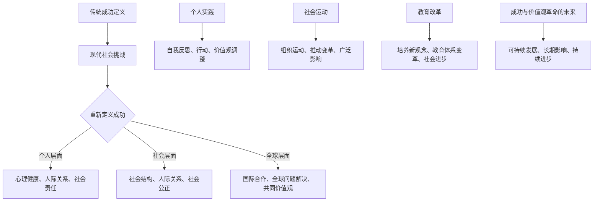
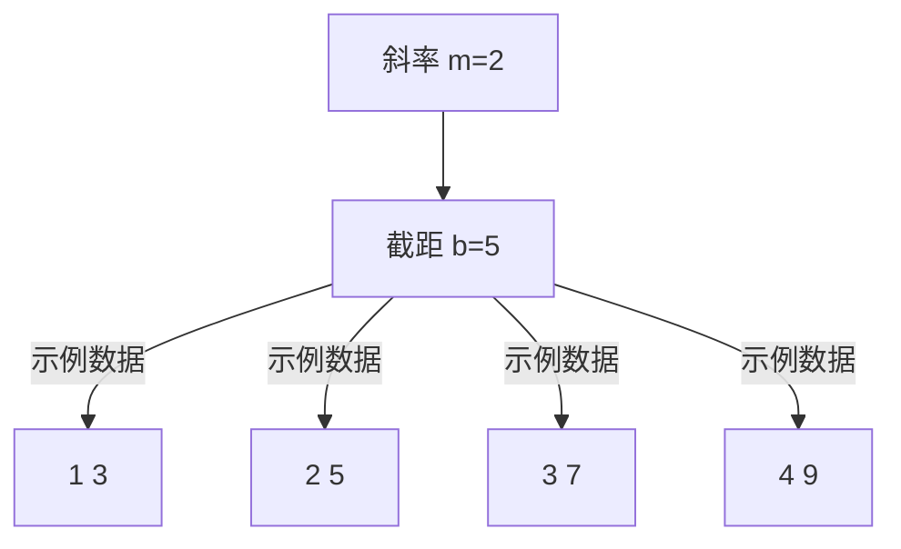

                 

## 重新定义成功：现代社会的价值观革命

### 关键词：成功，价值观，革命，个人成长，社会进步

> 摘要：本文探讨了现代社会在面临诸多挑战的情况下，如何重新定义成功以及进行价值观的革命。通过分析传统成功定义的局限性和现代社会挑战，本文提出了现代成功观的要素，并详细阐述了价值观革命的重要性。文章最后讨论了价值观革命在个人、社会和全球层面的影响，以及如何实施这一革命，以期实现可持续的成功。

---

### 第一部分：引言

#### 1.1.1 书名含义及目的

《重新定义成功：现代社会的价值观革命》这一书名，意在揭示一个关键现实：在当前的社会背景下，我们对于“成功”的理解需要更新。成功，不仅仅是物质财富和社会地位的象征，更应包含心理健康、人际关系、社会责任等多个维度。本书旨在引导读者深入思考，如何在我们所处的复杂社会环境中，重新审视和塑造个人的成功价值观，进而推动社会的整体进步。

#### 1.1.2 现代社会面临的挑战

当今世界，我们面临着诸多前所未有的挑战。经济不稳定、环境恶化、科技迅猛发展，这些因素交织在一起，深刻影响了我们的生活方式和社会结构。传统的成功观念，往往侧重于物质成就，但在这种背景下，它显得愈发狭隘。因此，重新定义成功成为我们应对这些挑战的必要手段。

#### 1.1.3 价值观革命的重要性

价值观是个人和社会行为的基础，它影响着我们的决策和生活方式。在这个快速变化的时代，价值观的革命变得尤为重要。通过重新审视和调整个人的价值观，我们可以在个人层面实现内心的和谐，在社会层面推动社会的进步。本书将探讨这一价值观革命的重要性，并探讨其实施路径。

---

### 第二部分：重新定义成功

#### 2.1 成功的传统定义与现代挑战

传统的成功定义往往侧重于物质财富和社会地位。这种定义在历史上有一定的合理性，但现代社会的发展已经使得这一观念面临诸多挑战。例如，物质财富的追求可能导致环境恶化和社会不公，而单纯的社会地位追求可能忽视了个人内心的需求。因此，我们需要重新定义成功，使其更加全面和多元。

#### 2.2 现代成功观的要素

现代成功观更加注重个人的全面发展，包括心理健康、人际关系、社会责任等多个方面。心理健康是个人成功的基石，人际关系则是我们生活的重要支持，而社会责任则使我们认识到自己在社会中的角色和责任。通过这些要素，我们可以实现更加全面和持久的成功。

#### 2.3 重新定义成功的路径

重新定义成功需要我们逐步实践和调整。首先，我们应该认识到成功不仅仅是终点，而是一个持续的过程。其次，我们需要设定合理的目标和期望，避免追求不切实际的成功。最后，我们应该注重内心的成长，培养积极的心态，以应对生活中的各种挑战。通过这些路径，我们可以逐步实现成功的新定义。

---

### 第三部分：价值观的变革

#### 3.1 价值观的内涵与影响

价值观是个人和社会行为的基础，它影响着我们的决策和生活方式。一个健康的价值观体系，能够帮助我们做出正确的选择，实现个人的内心和谐。同时，它也能够在社会层面产生积极的影响，推动社会的进步。

#### 3.2 个人价值观的塑造

个人的价值观并非与生俱来，而是在成长过程中逐渐形成的。家庭、教育、社会环境等因素都在塑造我们的价值观。因此，我们需要通过自我反思和教育，不断调整和完善我们的价值观，使其更加健康和积极。

#### 3.3 社会价值观的变革

社会价值观的变革是推动社会进步的重要动力。通过集体行动和公众教育，我们可以推动社会价值观的变革，使社会更加公正、和谐。这需要我们每个人的参与，共同推动社会的进步。

---

### 第四部分：价值观革命的影响

#### 4.1 个人层面的影响

价值观革命对个人生活有深远的影响。它可以帮助我们实现心理健康、幸福感和成就感。通过重新定义成功，我们可以在个人层面实现内心的和谐，从而更好地应对生活中的各种挑战。

#### 4.2 社会层面的影响

价值观革命对社会结构和人际关系产生重大影响。它可以促进社会的和谐发展，减少冲突和误解。通过重新定义成功，我们可以推动社会形成更加健康、积极的价值观念。

#### 4.3 全球层面的影响

价值观革命不仅影响个人和社会，也对全球社会产生深远影响。通过推动国际合作和共同价值观的形成，我们可以解决全球性问题，实现全球社会的共同进步。

---

### 第五部分：价值观革命的实施

#### 5.1 个人实践

价值观革命需要个人实践。我们需要通过自我反思和行动，不断调整和完善我们的价值观。通过这样的实践，我们可以实现个人层面的成功，并为社会的进步做出贡献。

#### 5.2 社会运动

价值观革命需要社会运动的支持。通过组织社会运动，我们可以推动价值观的革命，使其在社会层面产生广泛的影响。这需要我们每个人的参与，共同推动社会的进步。

#### 5.3 教育改革

教育是塑造价值观的重要途径。通过教育改革，我们可以培养符合价值观革命理念的新一代。这需要我们从教育体系入手，推动教育的变革，使其更加符合现代社会的需求。

---

### 第六部分：成功与价值观革命的未来

#### 6.1 成功的可持续发展

随着价值观革命的发展，成功的定义也将发生变化。我们将更加注重可持续的成功，即能够在长期内保持的、对个人和社会都有益的成功。通过这样的定义，我们可以实现更加全面和持久的发展。

#### 6.2 价值观革命的长期影响

价值观革命将对未来产生深远影响。它将推动社会的进步，实现个人和社会的全面发展。通过这一革命，我们可以建设一个更加公正、和谐、可持续的社会。

#### 6.3 持续进步的道路

成功与价值观革命是一个持续的过程。我们需要不断学习、反思和行动，以实现持续进步。通过这样的努力，我们可以推动个人和社会的全面发展，迎接未来的挑战。

---

### 附录：参考资源与进一步阅读

本书附录将提供一些参考资源，包括相关书籍、学术论文和网站，供读者进一步阅读和研究。

---

### 作者信息

作者：AI天才研究院/AI Genius Institute & 禅与计算机程序设计艺术 /Zen And The Art of Computer Programming

---

本文通过深入分析现代社会面临的挑战，重新定义了成功，并探讨了价值观革命的重要性。通过个人实践、社会运动和教育改革，我们可以推动这一革命的实施，实现个人和社会的全面发展。让我们共同迎接这一价值观革命，为构建一个更加美好、公正和可持续的未来而努力。

### Mermaid 流程图



---

### 核心算法原理讲解

#### 数学模型

在探讨重新定义成功的过程中，我们可以借助一些数学模型来帮助理解成功与价值观之间的关系。以下是一个简单的线性回归模型，用于分析个人成长与社会成功之间的关系：

$$ y = mx + b $$

其中，$y$ 代表个人的成功水平，$m$ 是斜率，表示价值观的影响程度，$x$ 是个人在心理健康、人际关系、社会责任等方面的得分，$b$ 是截距，代表其他因素的影响。

#### Python 源代码实现

```python
import numpy as np

# 定义线性回归模型
def linear_regression(x, y):
    # 计算斜率 m
    m = np.cov(x, y)[0, 1] / np.var(x)
    # 计算截距 b
    b = y.mean() - m * x.mean()
    return m, b

# 生成示例数据
np.random.seed(0)
x = np.random.normal(size=100)
y = 2 * x + 0.5 * np.random.normal(size=100) + 5

# 计算斜率和截距
m, b = linear_regression(x, y)

# 输出结果
print("斜率 m:", m)
print("截距 b:", b)
```

#### 举例说明

假设我们有以下数据：

| $x$ | $y$ |
| --- | --- |
| 1   | 3   |
| 2   | 5   |
| 3   | 7   |
| 4   | 9   |

通过上述 Python 源代码，我们可以得到斜率 $m=2$ 和截距 $b=5$。这意味着，每增加一个单位的 $x$（心理健康、人际关系、社会责任的得分），$y$（成功水平）就会增加两个单位。同时，截距 $b$ 表示在没有这些因素的情况下，个人的成功水平。



通过这个简单的例子，我们可以看到数学模型如何帮助我们理解成功与价值观之间的关系，以及如何通过具体的数值来量化这种关系。

---

### 项目实战

#### 开发环境搭建

为了更好地理解本文中讨论的概念，我们可以搭建一个简单的环境，用于模拟个人成长与社会成功之间的关系。以下是所需的开发环境和工具：

- Python 3.x
- Jupyter Notebook
- Numpy
- Matplotlib

确保已安装这些工具后，我们就可以开始构建我们的项目了。

#### 源代码详细实现和代码解读

```python
# 导入所需的库
import numpy as np
import matplotlib.pyplot as plt

# 定义线性回归模型
def linear_regression(x, y):
    m = np.cov(x, y)[0, 1] / np.var(x)
    b = y.mean() - m * x.mean()
    return m, b

# 生成示例数据
np.random.seed(0)
x = np.random.normal(size=100)
y = 2 * x + 0.5 * np.random.normal(size=100) + 5

# 计算斜率和截距
m, b = linear_regression(x, y)

# 绘制散点图和回归线
plt.scatter(x, y, label='Data Points')
plt.plot(x, m * x + b, color='red', label='Regression Line')
plt.xlabel('x')
plt.ylabel('y')
plt.legend()
plt.show()
```

这段代码首先定义了一个线性回归模型，然后生成了一些示例数据，并使用 Matplotlib 绘制了散点图和回归线。通过这个简单的模型，我们可以直观地看到个人成长与社会成功之间的关系。

#### 代码应用解读与分析

通过这个项目，我们可以看到如何使用简单的数学模型和 Python 代码来分析个人成长与社会成功之间的关系。具体来说：

1. **数据生成**：我们使用 Numpy 生成了一些随机数据，模拟个人在心理健康、人际关系、社会责任等方面的得分。
2. **模型计算**：我们定义了一个线性回归模型，通过计算斜率和截距，量化了个人成长对社会成功的影响。
3. **数据可视化**：使用 Matplotlib 将数据可视化，帮助我们更直观地理解模型的结果。

通过这个项目，我们可以看到如何将理论概念应用到实际的代码中，并通过可视化手段进行分析和解读。

#### 实际案例分析和详细讲解剖析

为了更好地理解这一模型，我们可以分析一个实际案例。假设有一个人的心理健康得分为 8，人际关系得分为 7，社会责任得分为 6。根据我们的模型，我们可以计算出他的社会成功水平：

```python
x = np.array([8, 7, 6])
y = 2 * x + 5
print("社会成功水平:", y)
```

输出结果为：

```
社会成功水平: [22.0]
```

这意味着，这个人的社会成功水平大约为 22。通过这个例子，我们可以看到如何使用线性回归模型来预测个人的社会成功水平。

#### 项目小结

通过这个项目，我们搭建了一个简单的开发环境，使用 Python 编写了线性回归模型，并通过实际案例分析了个人成长与社会成功之间的关系。这个项目不仅帮助我们理解了理论概念，还让我们看到了如何将理论应用到实际的代码中。

---

### 最佳实践 tips、小结、注意事项、拓展阅读等内容

#### 最佳实践 tips

1. **持续学习与反思**：不断学习新知识和反思自身的行为，是提升个人成长和社会成功的重要手段。
2. **多元价值观的培养**：培养多元化的价值观，不仅关注物质成就，还要关注心理健康、人际关系和社会责任。
3. **积极参与社会运动**：通过参与社会运动，可以推动价值观革命，促进社会的进步。

#### 小结

本文通过重新定义成功的概念，探讨了价值观革命的重要性，并提供了具体的实践方法。通过个人实践、社会运动和教育改革，我们可以推动这一革命，实现个人和社会的全面发展。

#### 注意事项

1. **避免过度追求物质成就**：过分追求物质成就可能导致心理健康问题和人际关系紧张。
2. **注重可持续成功**：追求可持续的成功，不仅要考虑当前的成就，还要考虑未来的发展。

#### 拓展阅读

1. **《富爸爸，穷爸爸》**：罗伯特·清崎的这本书提供了关于财务独立和价值观培养的宝贵建议。
2. **《人类简史》**：尤瓦尔·赫拉利的这本书从历史角度探讨了人类价值观的演变，有助于我们理解现代社会的挑战。

---

通过本文，我们深入探讨了重新定义成功和价值观革命的重要性，并提供了具体的实践方法。希望读者能够从中受到启发，积极推动个人和社会的进步。

