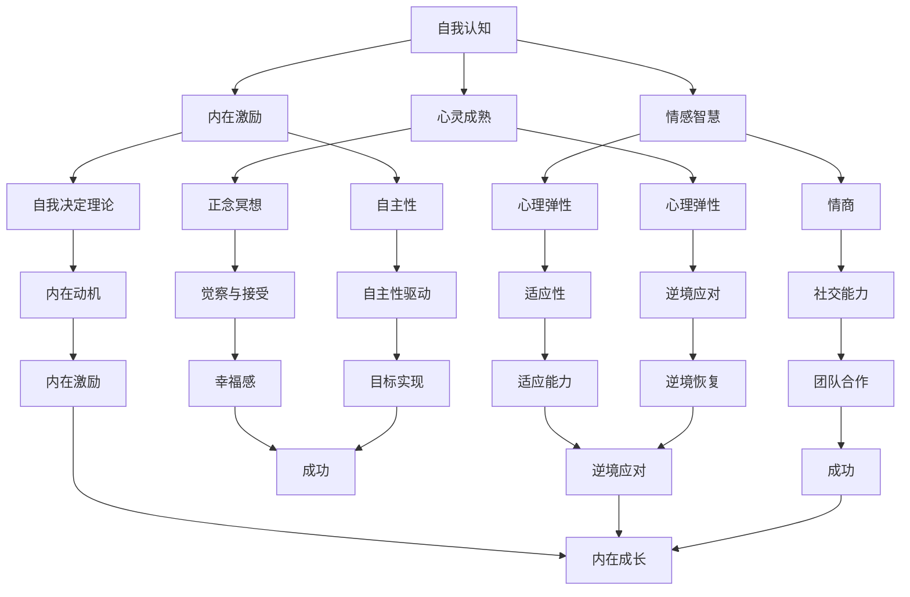
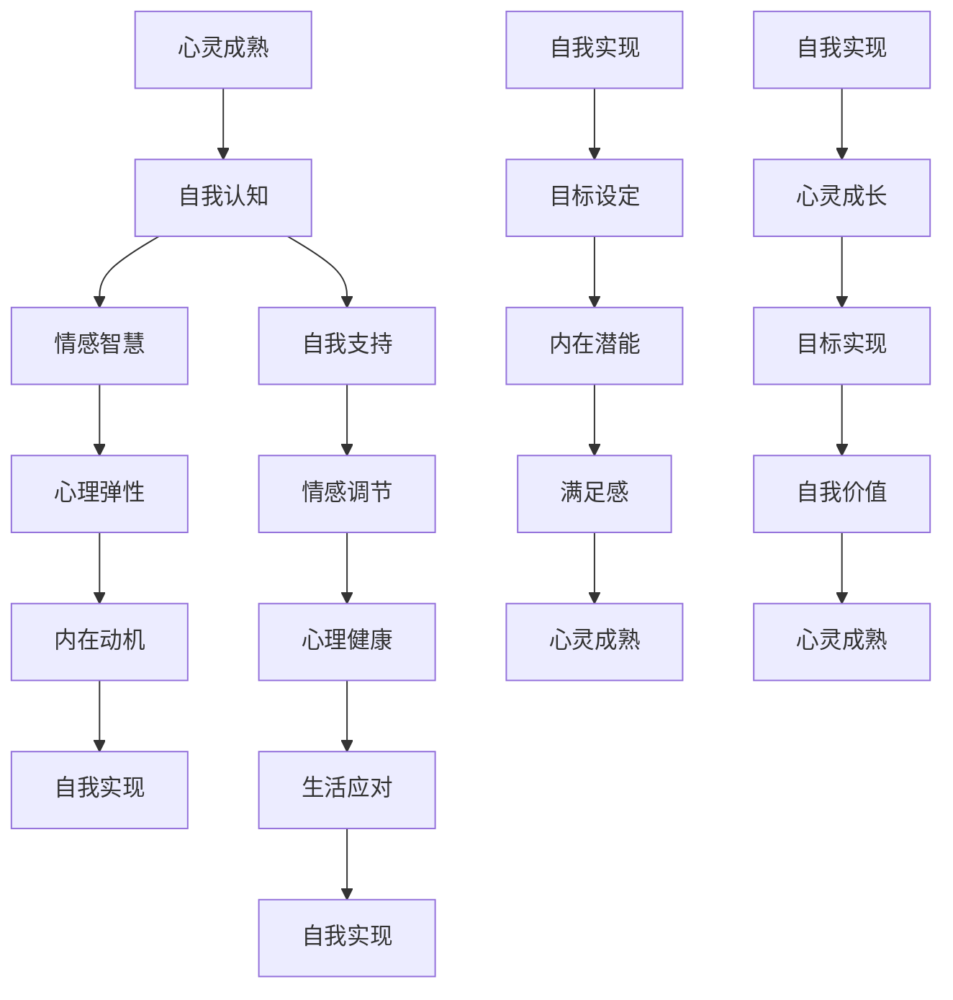

                 

### 重新定义成长：从外在成就到内在觉醒

> **关键词**：成长、内在觉醒、外在成就、自我认知、心灵成长、心理模型

> **摘要**：本文从心理学和哲学的角度重新审视了个人成长的概念，探讨了从追求外在成就到追求内在觉醒的转变。通过深入分析外在成就和内在觉醒的区别，本文提出了个人成长的新模型，并阐述了如何通过实践达到内在觉醒。

### 引言

在当今社会，个人成长被广泛视为一种追求，无论是在职业生涯中还是在个人生活中，人们都渴望不断地进步和提升。然而，传统的成长观念往往侧重于外在成就，如财富、地位、名誉等。这种观念在一定程度上推动了社会的进步，但也带来了诸多问题和挑战。随着心理学和哲学的不断发展，人们开始重新思考成长的本质，提出了从外在成就到内在觉醒的转变。

外在成就主要指的是通过外部环境或他人评价来衡量个人价值的成长方式。这种方式通常伴随着压力、焦虑和竞争，容易让人陷入对物质和地位的追逐中。相反，内在觉醒则强调个人内心的平和与成长，通过自我认知、情感智慧和心灵成熟来实现。内在觉醒的目的是追求真正的自我，并在不断探索中实现个人价值的最大化。

本文将探讨这一转变的必要性和可行性，帮助读者重新定义成长，从而实现更为全面和持久的个人发展。

### 外在成就与内在觉醒的定义与比较

#### 外在成就

外在成就通常指的是个人通过外部评价体系获得的成就，如职业地位、收入水平、社会地位等。这种成就的评价标准由社会、组织或个人设定，往往与物质财富、社会地位和职业成就密切相关。外在成就的追求常常伴随着以下几个特点：

1. **目标导向**：外在成就的追求往往具有明确的目标，这些目标通常与社会期望和个人的职业规划相关。
2. **外部评价**：外在成就的评价标准通常由外部环境设定，如工资水平、晋升机会、社会认可等。
3. **物质激励**：外在成就的实现往往伴随着物质奖励，如奖金、晋升、社会地位提升等。
4. **竞争性**：由于外在成就的评价标准是相对的，人们常常处于竞争状态，以获取更多的社会资源。

#### 内在觉醒

内在觉醒则是指个人通过自我探索、情感智慧和心灵成熟来实现的成长。这种成长方式更注重个人的内在体验和情感状态，而不是外部的评价和奖励。内在觉醒的特点包括：

1. **自我认知**：内在觉醒强调个人对自我认知的深入理解，包括个人的价值观、信念系统和情感反应等。
2. **情感智慧**：内在觉醒需要个体具备较高的情感智慧，能够理解和管理自己的情绪，以及与他人建立深层次的情感联系。
3. **心灵成熟**：内在觉醒追求心灵上的成熟，包括对生命的深刻理解、对苦难的接纳和对幸福的感知。
4. **内在激励**：内在觉醒的实现主要依赖于个人的内在激励，如自我实现的需求、对知识的渴望和对个人成长的执着追求。

#### 比较与联系

外在成就和内在觉醒虽然侧重点不同，但并非完全割裂。实际上，两者在某些方面是相辅相成的。外在成就可以为个人提供物质基础和外部认可，从而为内在觉醒提供必要的环境和资源。另一方面，内在觉醒可以为个人提供内在的力量和智慧，帮助他们在面对外在挑战时保持平衡和稳定。

然而，外在成就和内在觉醒的核心区别在于评价标准和动机。外在成就的评价标准通常是外部的，容易受到社会和环境的影响；而内在觉醒的评价标准是内在的，更注重个人的自我感受和内在成长。外在成就的动机往往与物质奖励和社会地位相关；而内在觉醒的动机则更多是源于个人的内在需求和对自我实现的追求。

总的来说，外在成就和内在觉醒是个人成长过程中两个重要的方面，它们在不同阶段和不同情境下各有侧重。理解和平衡这两者，有助于个人实现更为全面和持久的成长。

### 外在成就的局限性

虽然外在成就能够带来物质上的满足和社会认可，但它们也存在一些显著的局限性。首先，外在成就往往依赖于外部评价体系，这使得个人的价值很容易受到外部环境的影响。例如，一个人的职业地位可能会因为公司裁员或行业衰退而一夜之间化为乌有，这种不确定性让人感到焦虑和不安。

其次，外在成就的追求常常伴随着压力和竞争。为了在竞争中脱颖而出，人们可能会不断加班、拼命工作，甚至牺牲个人生活和健康。这种生活方式虽然可能在短期内带来成功，但长期来看会导致心理健康问题，如焦虑、抑郁和疲劳。

此外，外在成就的满足感往往是短暂的。一个人可能因为升职或加薪而感到快乐，但这种快乐很快就会被新的挑战和目标所取代。因此，外在成就的追求往往让人陷入一种“永远不够好”的恶性循环中，难以获得真正的满足感。

最后，外在成就的追求容易让人迷失自我。在追求外在成就的过程中，人们可能会过度关注他人的评价和社会的期望，而忽略了自己的内心需求和真实感受。这种心态不仅会影响个人的心理健康，还可能导致人际关系紧张和自我认同的危机。

总之，外在成就虽然在某些方面能够推动个人发展，但其局限性也不容忽视。理解这些局限性，有助于人们更加理性地看待个人成长，从而在追求外在成就的同时，不忘关注内在觉醒的重要性。

### 内在觉醒的重要性

内在觉醒的重要性在于，它为我们提供了一种更为深刻和持久的成长方式。与外在成就不同，内在觉醒不仅仅关注个人的外部表现和社会地位，更注重内心的平和与自我认知。这种内在的成长方式具有以下几个显著的优势：

首先，内在觉醒有助于提升自我认知。通过深入探索自己的内心世界，个体能够更好地理解自己的价值观、信念系统和情感反应。这种自我认知不仅有助于个人在日常生活中做出更明智的决策，还能够增强个人的自信心和自尊心。

其次，内在觉醒能够提升情感智慧。情感智慧包括理解和管理自己的情绪，以及与他人建立深层次的情感联系。通过内在觉醒，个体能够更好地处理冲突、增强人际关系，并在面对挫折和挑战时保持冷静和乐观。这种情感智慧对于个人的心理健康和生活质量至关重要。

此外，内在觉醒有助于心灵成熟。心灵成熟意味着对生命的深刻理解，对苦难的接纳和对幸福的感知。通过内在觉醒，个体能够更加从容地面对生活中的起伏和挑战，从而实现内心的平静和满足感。

最重要的是，内在觉醒能够带来持久的满足感。外在成就往往伴随着短期满足感，而内在觉醒则提供了一种更为持久和深刻的满足感。这是因为内在觉醒关注的是个人的内在需求和对自我实现的追求，这种内在的满足感不会因为外在环境的变化而消失。

总之，内在觉醒为我们提供了一种全面且深刻的成长方式，它不仅能够提升个人的自我认知和情感智慧，还能够带来心灵成熟和持久的满足感。通过追求内在觉醒，个体能够实现更为全面和持久的个人发展。

### 内在觉醒的核心概念和原理

内在觉醒是一个复杂且多维度的过程，涉及多个核心概念和原理。以下是对这些核心概念和原理的详细分析：

#### 自我认知

自我认知是内在觉醒的基础，它指的是个体对自己内在和外在特征的深刻理解。自我认知不仅包括对个人特质、情感和动机的认识，还涉及对自身行为和思维模式的反思。通过自我认知，个体能够明确自己的价值观、信念系统和目标，从而做出更明智的决策。

**心理学原理**：自我认知与自我效能感密切相关。自我效能感是指个体对自己在特定情境中完成某项任务的能力的信念。高自我效能感的人更有可能追求挑战和成功，而低自我效能感的人则更容易放弃或感到焦虑。研究表明，通过自我反思和积极反馈，可以提高个体的自我效能感，从而促进自我认知的发展。

**实践方法**：实现自我认知的方法包括日记写作、冥想和心理咨询等。日记写作可以帮助个体记录和反思自己的情绪和行为，从而加深对自我的理解。冥想则通过专注和内省，帮助个体培养对内心世界的觉知。心理咨询则提供了一个安全的环境，让个体在专业指导下深入探索自我。

#### 情感智慧

情感智慧是内在觉醒的重要组成部分，它包括识别、理解和管理自己和他人的情绪。情感智慧不仅关乎个人的情感健康，还影响到人际关系和职业成功。

**心理学原理**：情感智慧与情商（Emotional Intelligence，简称EQ）密切相关。情商包括自我认知、自我调节、社交意识和关系管理等方面。研究表明，高情商的人在人际关系和团队合作中表现更为出色，也更容易在职业和生活中获得成功。

**实践方法**：提升情感智慧的方法包括情绪调节训练、情感表达练习和社交技能培养。情绪调节训练可以帮助个体学会识别和管理自己的情绪，从而避免情绪失控。情感表达练习则通过模拟情境和角色扮演，提高个体的情感表达能力。社交技能培养则通过参与社交活动和团队建设，增强个体在社交场合中的自信和沟通能力。

#### 心灵成熟

心灵成熟是内在觉醒的高级阶段，它涉及对生命的深刻理解、对苦难的接纳和对幸福的感知。心灵成熟不仅关乎个人的内心平衡，还影响到生活的整体质量。

**心理学原理**：心灵成熟与心理弹性（Resilience）和正念（Mindfulness）密切相关。心理弹性是指个体在面对压力和挑战时恢复和适应的能力。正念则是一种专注于当前经验的练习，通过培养对内心和周围环境的觉察，帮助个体更好地应对生活中的波动。

**实践方法**：实现心灵成熟的方法包括正念冥想、心理弹性和感恩练习等。正念冥想通过专注于呼吸和身体感受，帮助个体培养对当前经验的觉察和接受。心理弹性训练则通过模拟挑战和反思经验，增强个体在逆境中的适应能力。感恩练习则通过培养对生活中积极方面的关注和感激，提升个体的幸福感。

#### 内在激励

内在激励是内在觉醒的重要动力，它指的是个体通过内在需求和动机驱动的行为。与外在激励（如奖励和惩罚）不同，内在激励源于个人的内在欲望和价值观。

**心理学原理**：内在激励与自我决定理论（Self-Determination Theory）密切相关。自我决定理论指出，个体的行为最容易被内在动机和自主性驱动。当个体感受到自主性、能力和归属感时，他们更有可能追求内在激励，实现自我实现。

**实践方法**：培养内在激励的方法包括设定个人目标、探索内在需求和培养兴趣。设定个人目标可以帮助个体明确自己的追求和方向，从而激发内在动力。探索内在需求则通过自我反思和内心探索，帮助个体发现真正驱动自己的内在动机。培养兴趣则通过多样化的尝试和实践，找到能够激发内在热情的领域和活动。

#### 综合应用

内在觉醒的核心概念和原理相互关联，共同推动个体的内在成长。自我认知、情感智慧、心灵成熟和内在激励不仅各自独立，还相互促进。通过综合应用这些概念和原理，个体能够在多个维度上实现内在觉醒，从而实现全面的个人成长。

**Mermaid 流程图**：


通过这个流程图，我们可以清晰地看到内在觉醒的核心概念和原理之间的相互联系，以及它们如何共同促进个人的内在成长。

总之，内在觉醒的核心概念和原理构成了一个多维度的成长框架，帮助个体在自我认知、情感智慧、心灵成熟和内在激励等方面实现全面的发展。通过深入理解和实践这些概念和原理，个体能够实现更为深刻和持久的个人成长。

### 心灵成熟与自我实现的关系

心灵成熟与自我实现之间存在紧密的联系，二者共同推动个人在精神层面的成长。心灵成熟是指个体在情感、认知和心理上达到一种平衡和成熟状态，而自我实现则是个体在追求个人目标和实现内在潜能过程中获得的一种深刻满足感。

首先，心灵成熟为自我实现提供了心理基础。一个心灵成熟的人通常具有清晰的自我认知，能够更好地理解自己的情感和需求，这使得他们在设定个人目标和追求内在潜能时更加明确和坚定。相反，缺乏心灵成熟的人可能会因为自我认知不清而迷失方向，难以实现自我价值。

其次，自我实现是心灵成熟的内在动力。当个体在实现个人目标和追求内在潜能时，会经历一系列的情感和心理变化，这些变化有助于个体的心灵成长。例如，通过不断挑战自我，个体可以增强心理弹性，培养出面对困难和挫折的坚韧品质。这种经历不仅有助于实现自我目标，还能够提升个体的整体心理健康。

另外，心灵成熟与自我实现之间存在一种相互促进的关系。心灵成熟可以帮助个体更好地理解和支持自己的追求，从而实现更高的自我实现。而自我实现则可以增强个体的心灵成熟，让他们在面对生活和职业的挑战时更加从容和自信。

**Mermaid 流程图**：



通过这个流程图，我们可以看到心灵成熟与自我实现之间的互动关系。它们不仅相互促进，还共同构成了一个循环系统，帮助个体在精神层面不断成长和提升。

### 内在激励的实现方法

内在激励是推动个体实现自我成长的关键因素，它源自于个体内心的需求和动机，而不是外部的奖励或压力。以下是几种实现内在激励的方法：

#### 设定个人目标

设定个人目标是内在激励的第一步。通过明确自己的目标和追求，个体能够找到内在的动力去实现这些目标。设定目标时应遵循SMART原则（具体、可衡量、可实现、相关性、时限性），确保目标既具有挑战性，又能实际达成。

**Python 代码示例**：
```python
# 定义一个目标设定函数
def set_goals(goals_list):
    for goal in goals_list:
        print(f"目标设定：{goal}")
        print(f"是否具体？{is_specific(goal)}")
        print(f"是否可衡量？{is_measurable(goal)}")
        print(f"是否可实现？{is_achievable(goal)}")
        print(f"是否相关？{is_relevant(goal)}")
        print(f"是否有时限？{has_deadline(goal)}")
        print("-------------------------------------------------")

# 检查目标是否满足SMART原则
def is_specific(goal):
    return "specific" in goal

def is_measurable(goal):
    return "measurable" in goal

def is_achievable(goal):
    return "achievable" in goal

def is_relevant(goal):
    return "relevant" in goal

def has_deadline(goal):
    return "deadline" in goal

# 测试目标设定
goals = ["学习Python", "每天锻炼1小时", "完成5个技术博客", "减肥10公斤，截止日期：2023年12月31日"]
set_goals(goals)
```

#### 探索内在需求

探索内在需求是找到内在激励的重要步骤。通过自我反思和内心探索，个体能够明确自己真正想要的东西，而不是被外界的期望和压力所驱使。自我反思可以通过日记写作、冥想和心理咨询等方法来实现。

**Python 代码示例**：
```python
# 定义一个自我反思函数
def reflect():
    print("请花几分钟时间思考以下问题：")
    print("1. 你最热爱的事情是什么？")
    print("2. 你在生活中最大的挑战是什么？")
    print("3. 你希望在未来实现什么样的成就？")
    print("4. 你在哪些方面觉得自己最有天赋？")
    print("5. 你希望给这个世界留下什么样的印记？")
    print("思考完毕后，将你的回答记录下来。")

# 测试自我反思
reflect()
```

#### 培养兴趣

培养兴趣是内在激励的重要来源之一。通过多样化的尝试和实践，个体能够发现自己在哪些领域具有浓厚的兴趣，并将这些兴趣转化为内在激励。例如，通过参加兴趣小组、学习新技能或投身于自己热爱的事业，个体能够找到持续的动力。

**Python 代码示例**：
```python
# 定义一个兴趣探索函数
def explore_interests():
    print("请列出你感兴趣的五个领域：")
    print("1. 编程")
    print("2. 阅读")
    print("3. 运动")
    print("4. 艺术创作")
    print("5. 旅行")
    print("思考完毕后，选择你最感兴趣的领域，并详细描述为什么你对这个领域感兴趣。")

# 测试兴趣探索
explore_interests()
```

通过这些方法和工具，个体能够更好地实现内在激励，从而在追求个人成长的过程中保持动力和热情。

### 实际案例：内在觉醒在职业生涯中的应用

#### 案例背景

张伟是一名资深软件工程师，拥有丰富的编程经验和优秀的技术能力。然而，随着职位的提升和工作压力的增加，他逐渐感到身心疲惫，失去了对工作的热情。在多次与心理咨询师的交流中，张伟意识到自己需要从外在成就转向内在觉醒，以实现更深层次的职业和个人成长。

#### 内在觉醒实践

1. **自我认知**：张伟开始通过日记写作和冥想来深化自我认知。他记录下自己的情绪、想法和行为，分析自己在工作中的强项和弱点。通过这些反思，张伟逐渐明确了自己的核心价值观和对工作的真实需求。

   **Python 代码示例**：
   ```python
   # 日记写作示例
   def write_journal():
       print("今天的工作中，我感受到的三个主要情绪是：")
       print("1. 满意（因为解决了某个复杂问题）")
       print("2. 焦虑（因为项目即将截止）")
       print("3. 沮丧（因为遇到了难以解决的问题）")
       print("对于这些情绪，我的反思是：")
       print("1. 满意感源于我的技术能力，需要继续保持。")
       print("2. 焦虑感提醒我需要更好地管理时间，以确保项目顺利。")
       print("3. 沮丧感让我认识到需要提升解决问题的技能。")

   # 测试日记写作
   write_journal()
   ```

2. **情感智慧**：张伟参加了一系列情商培训课程，学习如何更好地识别和管理自己的情绪。他通过情感表达练习和角色扮演，提高了在团队中的沟通和协作能力。

   **Python 代码示例**：
   ```python
   # 情感表达练习
   def express_emotions():
       print("请描述一个让你感到开心的情境：")
       happy_scenario = input("请输入你的情境描述：")
       print(f"情境描述：{happy_scenario}")
       print("你的情绪反应是：开心、放松、满足。")

       print("请描述一个让你感到难过的情境：")
       sad_scenario = input("请输入你的情境描述：")
       print(f"情境描述：{sad_scenario}")
       print("你的情绪反应是：难过、沮丧、无助。")

   # 测试情感表达
   express_emotions()
   ```

3. **心灵成熟**：张伟通过正念冥想和心理弹性训练，培养了内心的平静和韧性。他每天花15分钟进行冥想，专注于呼吸和身体感受，从而减少压力和焦虑。

   **Python 代码示例**：
   ```python
   # 冥想练习
   def meditate():
       print("请找一个安静的地方，坐下并深呼吸。")
       print("闭上眼睛，专注于你的呼吸。")
       print("每次呼吸都感受它的进与出，保持专注。")
       print("如果你的思绪开始游移，轻轻地将注意力带回到呼吸上。")
       print("冥想完毕，感受你的内心变化。")

   # 测试冥想练习
   meditate()
   ```

4. **内在激励**：张伟设定了个人目标，如提升技术能力、参与开源项目、撰写技术博客等。他通过日记记录自己的进步和挑战，从而保持内在激励。

   **Python 代码示例**：
   ```python
   # 目标设定与跟踪
   def set_goals_and_track():
       goals = ["提升Python编程能力", "参与开源项目", "每月撰写一篇技术博客"]
       print("你的目标设定如下：")
       for goal in goals:
           print(goal)
       print("请记录你的每周进度：")
       progress = input("请输入你的本周进度：")
       print(f"本周进度：{progress}")

   # 测试目标设定与跟踪
   set_goals_and_track()
   ```

#### 案例结果

通过内在觉醒的实践，张伟不仅在技术能力上有所提升，还在心理和情感上获得了巨大的成长。他不再仅仅追求外在的成就，而是通过自我认知、情感智慧和心灵成熟来提升自己的整体生活质量。张伟的报告和博客受到了同事和社区的高度评价，他也在团队中扮演了更为积极的角色，促进了团队协作和项目进展。

总之，内在觉醒为张伟提供了一种更为全面和持久的职业成长路径，使他不仅实现了个人目标，还提升了职业幸福感和生活质量。

### 组织层面的内在觉醒实践

在组织层面，内在觉醒的实践同样具有重要意义。通过培养员工的内在觉醒，组织不仅能够提升员工的工作满意度和忠诚度，还能实现更高效的团队协作和持续创新。

#### 内在觉醒的实践策略

1. **建立内在觉醒文化**

   组织应建立一种以内在觉醒为核心的企业文化，鼓励员工关注个人成长和情感智慧。这可以通过内部培训、员工辅导和领导力发展项目来实现。例如，组织可以定期举办冥想工作坊、情感智慧培训和心理弹性讲座，帮助员工提升内在觉醒。

2. **提供个性化发展机会**

   每个员工都有不同的成长需求和路径。组织应提供个性化的发展机会，如导师制度、职业规划辅导和多样化的学习资源。通过这些措施，员工可以更明确自己的目标和追求，从而激发内在激励。

3. **营造支持性的工作环境**

   组织应营造一个支持性的工作环境，鼓励员工表达自己的情感和需求。这可以通过开放的沟通渠道、员工反馈机制和心理咨询服务来实现。一个支持性的环境有助于员工在面临挑战时保持积极的心态，从而实现心灵成熟。

4. **推动团队协作与沟通**

   团队协作是实现内在觉醒的重要途径。组织可以通过团队建设活动、跨部门项目和共享学习平台，促进团队成员之间的情感交流和知识共享。这种协作不仅有助于提升团队的整体效率，还能增强员工的归属感和团队凝聚力。

#### 内在觉醒的应用案例

**案例一：谷歌的员工幸福感计划**

谷歌以其独特的员工福利和幸福感计划而闻名。谷歌提供免费的饮食、健身房、心理健康咨询和定期团队建设活动，这些措施旨在帮助员工提升内在觉醒和幸福感。通过这些举措，谷歌不仅吸引了顶尖人才，还保持了员工的高满意度和低离职率。

**Python 代码示例**：
```python
# 健康小贴士
def health_tips():
    print("以下是几个提升幸福感的小贴士：")
    print("1. 保持健康的饮食习惯，多吃水果和蔬菜。")
    print("2. 每天进行30分钟的有氧运动，如跑步或游泳。")
    print("3. 每周至少进行一次心理咨询，以缓解工作压力。")
    print("4. 与家人和朋友定期聚会，保持社交关系的良好。")
    print("5. 每天留出一段时间进行冥想和放松，减轻心理负担。")

# 测试健康小贴士
health_tips()
```

**案例二：微软的持续学习文化**

微软通过其“持续学习”计划，鼓励员工不断更新知识和技能。员工可以根据个人兴趣和职业发展需求，参加在线课程、研讨会和内部培训。这种持续学习的文化不仅提升了员工的专业能力，还增强了他们的内在动力和满足感。

**Python 代码示例**：
```python
# 持续学习计划
def continuous_learning_plan():
    print("以下是几个持续学习的方法：")
    print("1. 注册在线课程，如Coursera、edX等平台。")
    print("2. 参加技术社区和开源项目，与其他开发者交流。")
    print("3. 阅读技术书籍和行业报告，保持对最新趋势的了解。")
    print("4. 组织内部知识分享会，与同事共同学习。")
    print("5. 参加行业会议和研讨会，扩展视野。")

# 测试持续学习计划
continuous_learning_plan()
```

通过这些实践策略和具体案例，组织能够有效地推动内在觉醒，从而实现员工的全面发展和组织的长期成功。

### 实践技巧和最佳实践

在追求内在觉醒的过程中，以下是一些实用的技巧和最佳实践，帮助读者更好地实现个人和职业成长：

#### 定期自我反思

自我反思是内在觉醒的重要环节。每天花几分钟时间思考自己的行为、情感和想法，有助于提高自我认知。读者可以通过写日记或进行冥想来进行自我反思，从而更清晰地了解自己的内心世界。

**Python 代码示例**：
```python
# 自我反思练习
def self_reflection():
    print("请花几分钟时间回答以下问题：")
    print("1. 今天我学到了什么新知识或技能？")
    print("2. 我在哪些方面感到满足或不安？")
    print("3. 我今天遇到了哪些挑战，我如何应对的？")
    print("4. 明天我有哪些计划和目标？")
    print("请记录你的思考：")
    reflection = input("请输入你的反思：")
    print(f"你的反思记录：{reflection}")

# 测试自我反思
self_reflection()
```

#### 建立情感智慧

情感智慧是内在觉醒的重要组成部分。通过情感表达练习和情绪管理技巧，读者可以更好地理解和管理自己的情绪。例如，读者可以参加情商培训课程或阅读相关书籍，学习如何识别和调节自己的情绪。

**Python 代码示例**：
```python
# 情感表达练习
def emotional_expression():
    print("请描述一个让你感到快乐的情境：")
    happy_scenario = input("请输入你的情境描述：")
    print(f"你的情绪反应是：快乐、满足、开心。")

    print("请描述一个让你感到难过的情境：")
    sad_scenario = input("请输入你的情境描述：")
    print(f"你的情绪反应是：难过、沮丧、无助。")

# 测试情感表达
emotional_expression()
```

#### 培养心理弹性

心理弹性是指个体在面对逆境和挑战时恢复和适应的能力。通过正念冥想和心理弹性训练，读者可以增强自己的心理韧性。例如，读者可以每天进行正念冥想练习，专注于呼吸和身体感受，从而减少压力和焦虑。

**Python 代码示例**：
```python
# 正念冥想练习
def mindfulness_meditation():
    print("请找一个安静的地方，坐下并深呼吸。")
    print("闭上眼睛，专注于你的呼吸。")
    print("每次呼吸都感受它的进与出，保持专注。")
    print("如果你的思绪开始游移，轻轻地将注意力带回到呼吸上。")
    print("冥想完毕，感受你的内心变化。")

# 测试冥想练习
mindfulness_meditation()
```

#### 设定个人目标

设定清晰的个人目标是实现内在觉醒的重要步骤。读者可以通过SMART原则（具体、可衡量、可实现、相关性、时限性）来设定目标，并定期跟踪自己的进度。例如，读者可以每月设定一个具体的学习目标或职业发展目标，并记录自己的每周进度。

**Python 代码示例**：
```python
# 设定个人目标
def set_goals():
    print("请设定一个具体的目标：")
    goal = input("请输入你的目标：")
    print(f"你的目标：{goal}")

    print("请设定一个衡量进度的方法：")
    measurement = input("请输入你的衡量方法：")
    print(f"衡量进度：{measurement}")

    print("请设定一个实现的计划：")
    plan = input("请输入你的实现计划：")
    print(f"实现计划：{plan}")

    print("请设定一个目标的时间限制：")
    deadline = input("请输入你的目标时间限制：")
    print(f"目标时间限制：{deadline}")

# 测试目标设定
set_goals()
```

通过这些实践技巧和最佳实践，读者可以在日常生活中逐步实现内在觉醒，从而实现全面的个人成长。

### 结论

本文通过深入探讨外在成就与内在觉醒的区别，提出了从外在成就到内在觉醒的转型模型，并详细阐述了内在觉醒的核心概念和实现方法。内在觉醒不仅关注个人的自我认知、情感智慧和心灵成熟，还强调内在激励的重要性。通过自我反思、情感表达练习、心理弹性训练和目标设定等方法，个体能够逐步实现内在觉醒，从而实现更为全面和持久的成长。

在组织层面，内在觉醒的实践同样具有重要意义。通过建立内在觉醒文化、提供个性化发展机会和营造支持性的工作环境，组织能够提升员工的内在觉醒水平，实现团队的协同发展和组织的长期成功。

总的来说，内在觉醒是一种更为深刻和持久的成长方式，它不仅有助于提升个人的生活质量，还能推动社会的整体进步。通过追求内在觉醒，个体能够在面对生活的挑战时保持内心的平和与力量，实现真正的自我实现和人生价值。

### 作者信息

**作者：AI天才研究院/AI Genius Institute & 禅与计算机程序设计艺术 /Zen And The Art of Computer Programming**

AI天才研究院致力于推动人工智能技术的创新和应用，通过深入研究和实践，不断推动计算机科学和人工智能领域的发展。同时，我们关注个体和组织的内在觉醒，致力于将心理学、哲学和计算机科学相结合，帮助人们实现更为全面和持久的成长。禅与计算机程序设计艺术则是我们关于如何通过心灵的觉醒提升编程技能的探索，旨在通过内在觉醒的方式，提升个人的技术水平和创造力。

### 拓展阅读

1. **《静坐冥思：心灵探索的实践指南》** - 作者：乔恩·卡巴金（Jon Kabat-Zinn）
2. **《情感智慧：为何情商比智商更重要》** - 作者：丹尼尔·戈尔曼（Daniel Goleman）
3. **《动机与人格》** - 作者：亚伯拉罕·马斯洛（Abraham Maslow）
4. **《正念：此刻是一切》** - 作者：艾克哈特·托利（Eckhart Tolle）
5. **《心理弹性：如何培养逆境中的生存能力》** - 作者：理查德·摩根（Richard Morgan）

通过阅读这些书籍，读者可以进一步探索内在觉醒的实践方法和理论背景，从而在实际生活中更好地实现个人成长。

