                 

### 引言

**关键词**：教育改革、知识传授、意义建构、教育理念

**摘要**：
在信息技术飞速发展的今天，教育领域正面临着前所未有的挑战与机遇。传统的知识传授模式已难以满足现代教育的需求，而意义建构理论提供了一种全新的教育理念。本文旨在重新定义教育，从知识传授向意义建构的转变，探讨这一转变的重要性和具体实施路径。

随着互联网、大数据、人工智能等技术的不断进步，教育的形态和方式也在发生深刻变革。传统的教育模式主要依赖于教师的讲授和学生被动接受知识，这种方式在知识量相对有限的时代是有效的，但在信息爆炸、知识更新速度加快的今天，已经显露出诸多局限。因此，教育理念的转变迫在眉睫，从知识传授到意义建构，成为教育改革的重要方向。

### 第1章 引言

**1.1 教育的现状与挑战**

在进入21世纪后的教育领域，知识的获取变得更加容易和快捷，互联网提供了丰富的教育资源，但同时也带来了新的挑战。首先，知识的更新速度前所未有，传统的课程内容和教学方法难以跟上技术发展的步伐。其次，学生在学习过程中被动接受知识，缺乏主动探究和意义建构的机会，这不利于培养创新能力和解决问题的能力。

#### 1.1.1 传统教育的局限性

传统教育模式中，教师作为知识的权威，学生被动接受知识，这种方式虽然能够保证知识的一致性和权威性，但也限制了学生的主动性和创造性。教师讲授，学生记笔记，考试检验掌握程度，这样的循环难以培养学生的批判性思维和创新能力。

#### 1.1.2 知识传授与意义建构的差异

知识传授强调的是对现有知识的记忆和应用，而意义建构则更注重学生在学习过程中的主动探究和知识重构。意义建构理论认为，知识并不是客观存在的实体，而是在学习过程中通过个人经验、社会互动和思维加工建构出来的。

#### 1.1.3 教育改革的需求

面对知识经济的时代，教育改革已刻不容缓。培养具有创新精神、批判性思维和实践能力的人才，成为教育的核心任务。意义建构理论为这一目标提供了理论依据和实践路径。

#### 1.1.4 本书的研究目标与内容框架

本书旨在探讨从知识传授到意义建构的教育理念转变，分析意义建构理论在教育中的应用，并提出具体的实施策略。本文将分为以下几个部分：

1. **教育理念转变**：介绍意义建构理论的基本概念和核心观点，与知识传授进行对比，探讨以学生为中心的教育模式。
2. **教学方法与策略**：详细阐述探究式学习、合作学习和情境教学等新型教学方法，分析其优点和实践要点。
3. **技术与教育**：探讨信息技术对教育的影响，介绍数字化教育资源、在线学习平台和教育资源共享等方面的内容。
4. **教育评价与反馈**：分析传统教育评价模式的局限性，提出基于意义建构的评价方法，并探讨教育反馈机制的优化策略。
5. **意义建构在教育实践中的应用**：通过案例研究，展示意义建构在教育实践中的应用效果。
6. **未来教育展望**：展望意义建构教育的发展趋势，探讨教育改革的路径与策略。

通过本文的讨论，我们期望为教育改革提供有益的启示，推动教育从知识传授向意义建构的转变，培养适应未来社会需求的人才。## 第1章 引言

### 1.2 教育理念的转变

随着社会的发展和科技的进步，教育的理念也在不断变革。传统的教育模式以知识传授为核心，注重知识的记忆和再现，而现代教育则更加关注学生的全面发展，强调知识建构的过程，以及学生在这一过程中的主动性和创造力。这种转变背后，蕴含着对教育本质的深刻理解和探索。

#### 1.2.1 意义建构理论

意义建构理论（Constructivist Theory）是20世纪后半叶兴起的一种重要教育理论，代表人物包括皮亚杰（Jean Piaget）和维果斯基（Lev Vygotsky）。意义建构理论认为，知识不是通过教师的讲授直接传递给学生的，而是在学生与环境的互动过程中，通过个体的感知、思考、理解和应用建构起来的。

**核心概念与联系：**

- **知识建构**：知识建构是意义建构理论的核心概念，强调知识是动态的、情境化的，并通过个体与环境的互动而不断更新和重构。
- **情境学习**：情境学习是指学习必须在一个真实的、有意义的环境中发生，学生通过解决实际问题来建构知识。
- **社会互动**：社会互动在意义建构过程中起着关键作用，通过与他人交流、合作，学生可以分享观点、解决困惑，从而加深对知识的理解。

以下是一个简化的Mermaid流程图，展示了知识建构的过程及其核心概念之间的关系：

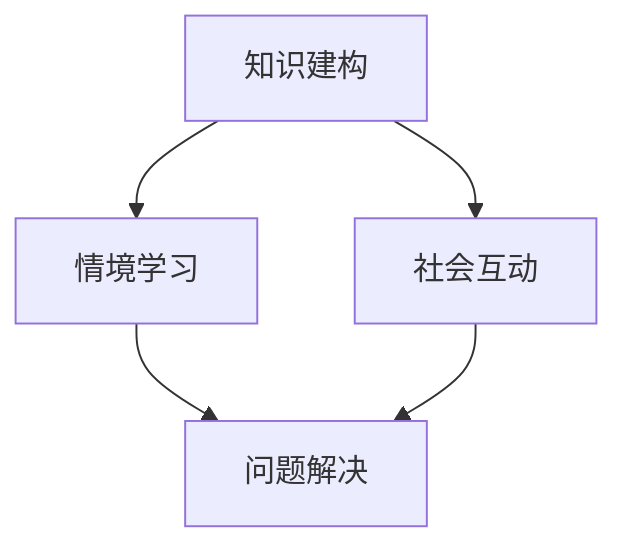

**核心算法原理讲解：**

意义建构的过程可以类比为一种算法，其输入是学生的先前知识和学习环境，输出是学生对知识的深层次理解和应用。这个算法的核心是“迭代和反馈”。

- **迭代**：学生在学习过程中不断地通过实践活动和思考来调整自己的知识结构，这个过程类似于算法中的循环。
- **反馈**：教师和同伴的反馈是意义建构过程中的关键因素，它们可以帮助学生识别错误、深化理解、完善知识结构。

以下是一个简单的Python源代码示例，模拟了意义建构的过程：

```python
def knowledge_construction(pre_knowledge, learning_environment):
    """
    模拟知识建构的过程
    :param pre_knowledge: 先前知识
    :param learning_environment: 学习环境
    :return: 新的知识结构
    """
    current_knowledge = pre_knowledge.copy()
    for interaction in learning_environment:
        current_knowledge = update_knowledge(current_knowledge, interaction)
    return current_knowledge

def update_knowledge(knowledge, interaction):
    """
    更新知识结构
    :param knowledge: 知识结构
    :param interaction: 交互信息
    :return: 更新的知识结构
    """
    # 在这里，我们模拟了知识结构的更新过程
    knowledge.update({**knowledge, **interaction})
    return knowledge
```

**数学模型和数学公式：**

意义建构过程中，可以使用一些基本的数学模型来描述知识的动态变化。例如，可以使用集合论来描述知识结构的变化：

$$
K_{new} = K_{old} \cup I
$$

其中，$K_{old}$表示先前的知识集合，$I$表示新获得的信息集合，$K_{new}$表示更新后的知识集合。

**详细讲解与举例说明：**

为了更好地理解意义建构的过程，我们可以通过一个具体的例子来说明。假设一个学生在学习编程语言时，他已经掌握了基本的语法知识，但缺乏实际编程经验。

- **情境学习**：教师为学生提供了一个编程项目，要求学生使用所学语法编写一个简单的程序。
- **问题解决**：学生在编写程序的过程中遇到了一些语法错误，通过调试和修正代码，逐渐理解了语法规则的应用。
- **社会互动**：学生与教师和同学讨论编程问题，从他人那里获得了不同的见解和解决方案。

通过这个过程，学生的编程知识结构得到了更新和完善，他从“理解语法”到“应用语法”的过渡，就是意义建构的一个具体体现。

#### 1.2.2 知识传授与意义建构的差异

知识传授和意义建构在教育实践中有着本质的区别。知识传授侧重于传递现成的知识，强调记忆和理解，而意义建构则更关注学习的过程，强调主动探究和知识重构。

- **知识传授**：教师作为知识权威，通过讲授和考试来确保学生掌握特定的知识内容。
- **意义建构**：学生作为学习的主体，通过与学习环境的互动，主动探索、建构和调整自己的知识结构。

以下是一个简单的对比表格，展示了知识传授和意义建构的几个关键差异：

| 对比项 | 知识传授 | 意义建构 |
| --- | --- | --- |
| **学习主体** | 教师 | 学生 |
| **学习方式** | 被动接受 | 主动探索 |
| **评价方式** | 知识掌握程度 | 知识建构过程 |
| **目标** | 知识记忆和应用 | 创新能力和批判性思维 |

#### 1.2.3 以学生为中心的教育模式

以学生为中心的教育模式（Student-Centered Education）强调学生是学习的主体，教育过程应围绕学生的需求和兴趣展开。在这种模式下，教师的作用是引导和辅助，帮助学生实现知识的建构。

- **自主学习**：学生根据自己的兴趣和需求选择学习内容，主动参与学习过程。
- **情境教学**：教学活动设计在一个有意义、真实的情境中，学生通过解决实际问题来学习。
- **翻转课堂**：学生在家观看教学视频，课堂上进行讨论和练习，教师提供个性化辅导。

以学生为中心的教育模式为意义建构提供了实践基础，有助于培养学生的自主学习能力、创新能力和批判性思维。

**小结**：

教育理念的转变，从知识传授到意义建构，反映了教育对个体全面发展的重视。意义建构理论提供了一种新的视角和方法，为教育改革提供了理论支持和实践路径。通过引入情境学习、社会互动和自主学习等元素，意义建构有助于培养学生的综合素质，适应未来社会的需求。

**注意事项**：

在教育实践中，意义建构并非一蹴而就，需要教师、学生和教育环境等多方面的共同努力。同时，意义建构教育模式也需要与现有的教育体制和资源相协调，逐步推进教育改革。

**拓展阅读**：

1. Bruner, J. S. (1966). Toward a Theory of Instruction. Cambridge, MA: Belknap Press of Harvard University Press.
2. Dillenbourg, P., & Jermann, P. (2007). Understanding and design of interaction in CSCL: A research and pedagogical agenda. Educational Psychology Review, 19(3), 277-297.
3. Papert, S. (1980). Mindstorms: Children, Computers, and Powerful Ideas. Basic Books.

通过以上内容，我们可以看到教育理念的转变不仅是一种理论上的探讨，更是一种实践中的探索。在接下来的章节中，我们将进一步探讨具体的教育教学方法、技术与教育的融合以及教育评价和反馈机制等方面的内容，以全面展现从知识传授到意义建构的教育理念。## 第2章 教育理念转变

### 2.1 意义建构理论

意义建构理论作为现代教育理论的重要组成部分，为教育改革提供了理论依据和实践路径。它强调知识是学习者通过与环境互动建构起来的，而不是简单地被动接受。意义建构理论的基本概念和核心观点，为我们理解教育本质和改革方向提供了深刻洞察。

#### 2.1.1 意义建构的定义

意义建构是指个体在特定情境下，通过与信息的交互和反思，形成对信息的个人理解和意义的过程。这一概念强调了以下几个关键点：

- **个体性**：意义建构是个人化的过程，每个人的理解和意义都是独特的。
- **情境性**：意义建构离不开具体的学习情境，情境为个体提供了认知的背景和互动的机会。
- **动态性**：意义建构是一个持续的过程，知识不是静止不变的，而是随着新信息的不断输入而不断调整和重构。

**核心观点：**

- **知识是动态建构的**：意义建构理论认为，知识不是客观存在的实体，而是在学习过程中，个体通过与环境的互动，主动建构出来的。知识是情境化的、动态的，而不是固定和静态的。
- **学习者是主动的建构者**：意义建构理论强调学习者的主体性，学习者不是知识的被动接收者，而是主动的建构者。学习者通过自己的感知、思考、理解、应用等认知活动，主动地构建自己的知识体系。
- **社会互动是关键因素**：在社会互动中，学习者通过与他人交流、合作、分享观点和经验，可以加深对知识的理解，促进知识的建构。社会互动为意义建构提供了丰富的资源和多样的视角。

#### 2.1.2 意义建构理论的核心观点

意义建构理论的核心观点可以从以下几个方面进行阐述：

1. **知识的情境性**：
   知识总是存在于特定的情境中，脱离了情境的知识是空洞和难以理解的。情境提供了认知的背景，帮助学习者将新知识与已有知识体系联系起来，从而实现知识的建构。

2. **学习的建构性**：
   学习是学习者主动建构知识的过程，而不是被动地接受知识。学习者通过自己的感知、思考、理解、应用等认知活动，主动地理解和应用新知识。

3. **学习的动态性**：
   学习是一个持续不断的过程，知识随着新信息的输入和反思而不断调整和重构。学习不是一成不变的，而是动态发展的。

4. **学习的个体性和社会性**：
   意义建构是个人化的过程，每个人的理解和意义都是独特的。同时，社会互动在意义建构过程中起着关键作用，通过与他人交流、合作、分享观点和经验，学习者可以加深对知识的理解。

#### 2.1.3 意义建构与知识传授的对比

意义建构与知识传授在教育理念、目标和方法上有着显著的区别：

- **教育理念**：知识传授强调教师为中心，学生是知识的接受者；意义建构强调学习者为中心，学生是知识的主动建构者。
- **教育目标**：知识传授注重知识的记忆和应用；意义建构注重培养学习者的自主学习能力、批判性思维和创新能力。
- **教育方法**：知识传授依赖教师的讲授和考试；意义建构依赖学习者的主动探究、社会互动和反思。

以下是一个简化的Mermaid流程图，展示了意义建构与知识传授的对比：

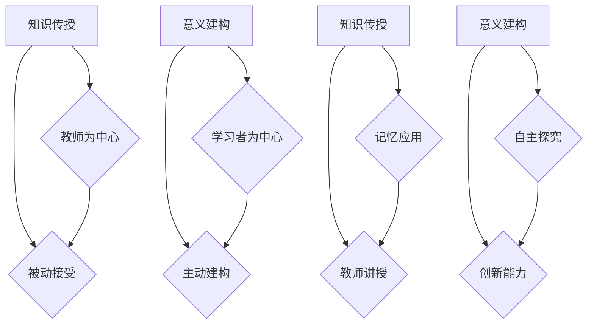

**小结**：

意义建构理论为教育改革提供了新的视角和方法，它强调学习者的主体性和情境性，注重知识建构的过程，而不是简单的知识传递。通过理解意义建构理论的核心观点，我们可以更好地设计教学活动，推动教育从知识传授向意义建构的转变。

**注意事项**：

在实际应用中，意义建构理论需要结合具体的教育环境、学习者的特点和教学目标。教师作为引导者和辅助者，需要为学生提供丰富的学习情境，促进他们的主动探究和互动，从而实现有效的知识建构。

**拓展阅读**：

1.建构主义学习理论 - 维基百科，自由的百科全书
2.建构主义教学理论 - 维基百科，自由的百科全书
3.意义建构理论 - 教育学百科全书

在接下来的章节中，我们将进一步探讨以学生为中心的教育模式，介绍具体的课程设计原则和教学方法，为教育改革提供更加具体的实施路径。## 第2章 教育理念转变

### 2.2 以学生为中心的教育模式

以学生为中心的教育模式（Student-Centered Education）是现代教育改革的重要方向，旨在培养学生的自主学习能力、批判性思维和创新能力。这种模式强调学生是学习的主体，教育过程应围绕学生的需求和兴趣展开。以下将介绍以学生为中心的教育模式的几个关键组成部分，并分析其优势和具体实施策略。

#### 2.2.1 学生自主学习的重要性

学生自主学习是指学生在学习过程中，根据自己的兴趣和需求，主动选择学习内容，设定学习目标，采取相应的学习策略。自主学习不仅有助于提高学生的学习动机和效率，还能培养他们的自我管理能力和批判性思维。

**优势：**

- **提高学习动机**：自主学习使学生能够选择自己感兴趣的学习内容，从而提高学习动机和参与度。
- **培养自我管理能力**：自主学习要求学生制定学习计划、管理学习时间，从而培养他们的自我管理能力。
- **促进批判性思维**：在自主学习过程中，学生需要独立思考和解决问题，这有助于培养他们的批判性思维和创新能力。

**实施策略：**

1. **提供丰富的学习资源**：学校和教育机构应为学生提供丰富的学习资源，包括书籍、电子资料、网络资源等，以满足不同学生的需求。
2. **设定明确的学习目标**：教师应帮助学生设定具体、明确的学习目标，并提供指导和支持，确保学生能够顺利完成学习任务。
3. **鼓励合作学习**：合作学习可以促进学生之间的互动和交流，有助于他们在自主学习过程中互相支持和启发。

#### 2.2.2 情境教学的应用

情境教学是指在教学过程中，教师设计一个具有实际意义的情境，让学生在情境中解决问题，从而实现知识的建构。情境教学有助于将抽象的知识与具体的生活情境联系起来，提高学生的理解和应用能力。

**优势：**

- **增强知识应用能力**：情境教学将知识应用于实际情境，有助于学生理解知识的实际意义，提高知识的应用能力。
- **激发学习兴趣**：情境教学通过真实、有趣的问题情境，激发学生的学习兴趣，提高学习效果。
- **培养解决问题的能力**：在情境教学中，学生需要独立思考和解决问题，从而培养他们的解决问题能力。

**实施策略：**

1. **设计真实情境**：教师应根据教学目标和学生的兴趣，设计具有实际意义的情境，确保情境能够激发学生的好奇心和探索欲望。
2. **引导学生参与**：教师应引导学生积极参与情境教学，鼓励他们提出问题、分享观点，从而提高他们的参与度和积极性。
3. **提供反馈和指导**：教师应在情境教学过程中提供及时的反馈和指导，帮助学生理解情境中的问题和解决方案，从而加深对知识的理解。

#### 2.2.3 翻转课堂的实施

翻转课堂是一种新型的教学模式，它将传统的课堂教学与在线学习相结合，学生通过在线学习掌握基础知识，课堂时间主要用于解决重难点和进行深度讨论。翻转课堂有助于改变教师主导的教学模式，实现以学生为中心的教育。

**优势：**

- **提高学习效率**：学生在课前通过在线学习掌握基础知识，课堂时间可以更有效地用于解决问题和深度讨论，提高学习效率。
- **增强学生的主动性**：翻转课堂要求学生主动参与学习，提前预习，有助于培养他们的自主学习能力和责任感。
- **促进个性化学习**：翻转课堂可以根据学生的学习需求，提供个性化的学习资源和指导，有助于实现个性化学习。

**实施策略：**

1. **设计有效的在线学习资源**：教师应设计高质量的在线学习资源，包括教学视频、电子书籍、练习题等，确保学生能够通过在线学习掌握基础知识。
2. **明确课堂目标**：教师应在课前明确课堂目标，确保课堂时间能够有针对性地解决学生的疑问和重难点。
3. **提供有效的反馈和指导**：教师应在课堂过程中提供及时的反馈和指导，帮助学生理解和掌握知识，同时鼓励学生主动提问和讨论。

**小结**：

以学生为中心的教育模式强调学生的主体地位，通过自主学习、情境教学和翻转课堂等策略，培养学生的学习兴趣、自主学习能力和批判性思维。这种模式有助于推动教育从知识传授向意义建构的转变，适应未来社会的需求。

**注意事项**：

在实际应用中，以学生为中心的教育模式需要教师、学生和教育环境等多方面的共同努力。教师应不断提高自己的教学水平和教育理念，关注学生的学习需求，为学生提供丰富的学习资源和指导。学生应积极参与学习过程，主动探究和反思，培养自主学习能力。

**拓展阅读**：

1. Harvard University. (n.d.). The Harvard Project on Learning and Teaching. Retrieved from https://learningfromeachother.harvard.edu/
2. Brown, S. D., & Campione, J. C. (1994). Guided discovery in a cognitively supportive environment: Effect of a conceptual change intervention on learning. Journal of Educational Psychology, 86(4), 756-767.
3. Bergmann, J., & Sams, A. (2012). Flip Your Classroom: Reach Every Student in Every Class Every Day. International Society for Technology in Education.

在接下来的章节中，我们将进一步探讨意义建构在教育课程设计中的应用，介绍具体的教学策略和方法，为教育改革提供更加具体的实施路径。## 第2章 教育理念转变

### 2.3 意义建构在课程设计中的应用

课程设计是教育实践的重要组成部分，其目的是将教育理念转化为具体的教学计划和活动。在意义建构理论的指导下，课程设计需要关注如何创造有意义的学习体验，促进学生的主动学习和知识建构。以下将介绍意义建构在课程设计中的应用，包括课程目标的设定、教学内容的选取和教学策略的选择。

#### 2.3.1 课程目标的设定

课程目标是指课程设计者希望通过课程教学实现的学习结果和标准。在意义建构的视角下，课程目标的设定应注重学生的主动学习和知识建构，而不仅仅是知识的传递。

**核心原则：**

- **目标具体化**：课程目标应具体、明确，能够量化或描述学生应掌握的知识、技能和能力。
- **目标多元化**：课程目标应包括认知、情感和动作技能等多个方面，以全面培养学生的综合素质。
- **目标相关性**：课程目标应与学生的兴趣、需求和未来的学习和发展紧密相关，确保学生能够学以致用。

**设定步骤：**

1. **分析学习需求**：通过调查问卷、访谈等方式，了解学生的兴趣、需求和认知水平，为课程目标的设定提供依据。
2. **确定课程主题**：根据学习需求和分析结果，确定课程的主题和内容，确保课程具有实际意义和吸引力。
3. **设定具体目标**：根据课程主题和学生的学习需求，设定具体的、可操作的课程目标，并明确每个目标所对应的评估标准。

#### 2.3.2 教学内容的选取

教学内容的选取是课程设计的关键环节，直接关系到学生能否有效地进行意义建构。在意义建构理论的指导下，教学内容的选取应注重以下几个方面：

- **情境性**：教学内容应贴近学生的实际生活，具有实际意义和应用价值，以便学生能够更好地理解知识。
- **挑战性**：教学内容应具有一定的挑战性，能够激发学生的好奇心和探究欲望，促进他们的主动学习和知识建构。
- **多样性**：教学内容应涵盖不同类型的知识，如事实性知识、概念性知识和实践性知识，以满足学生的多样化学习需求。

**选取步骤：**

1. **确定学习主题**：根据课程目标和学习需求，确定教学内容的主题和范围。
2. **收集教学资源**：通过图书馆、互联网、专业人士等渠道，收集与教学内容相关的各种资源，包括书籍、文章、视频、案例等。
3. **筛选和整合资源**：根据教学目标和学生的认知水平，筛选和整合教学资源，确保资源能够有效支持教学内容和目标。

#### 2.3.3 教学策略的选择

教学策略是指教师在教学过程中采用的方法和技术，直接影响学生的学习效果和意义建构。在意义建构理论的指导下，教学策略的选择应注重学生的主动参与和知识建构。

- **探究式学习**：通过设计问题情境和探究任务，引导学生主动探究和发现知识。
- **合作学习**：通过小组合作和讨论，促进学生在互动中分享观点、解决问题，实现知识的建构。
- **情境教学**：通过将教学内容嵌入真实或模拟的情境中，让学生在解决实际问题的过程中学习知识。
- **项目式学习**：通过完成实际项目，让学生在实践过程中掌握知识和技能。

**选择步骤：**

1. **分析学习目标和内容**：根据课程目标和教学内容，分析所需的教学策略，确保策略能够支持教学目标的实现。
2. **选择合适的策略**：根据分析结果，选择适合的教学策略，如探究式学习、合作学习、情境教学等。
3. **设计教学活动**：根据所选策略，设计具体的教学活动，明确教学步骤、方法和评价方式。

**示例：**

假设一门课程的主题是“气候变化”，以下是一个具体的课程设计案例：

- **课程目标**：通过课程学习，学生应能够了解气候变化的基本概念、影响和应对策略，能够运用所学知识分析和解决实际问题。
- **教学内容**：包括气候变化的基本概念、气候变化的影响、应对气候变化的策略等。
- **教学策略**：采用探究式学习和合作学习，学生通过小组合作，收集资料、分析案例、制定应对策略，并在课堂上进行汇报和讨论。

**小结**：

意义建构在课程设计中的应用，为课程目标的设定、教学内容的选取和教学策略的选择提供了新的视角和方法。通过关注学生的主动学习和知识建构，课程设计能够更好地实现教育目标，培养学生的综合素质和创新能力。

**注意事项**：

在实际课程设计中，需要充分考虑学生的学习需求、认知水平和教学资源，确保教学策略能够有效支持学生的意义建构。同时，教师应不断反思和调整教学设计，以适应教育改革的需求。

**拓展阅读**：

1. Bransford, J. D., Brown, A. L., & Cocking, R. R. (Eds.). (2000). How People Learn: Brain, Mind, Experience, and School. National Academy Press.
2. Dillenbourg, P., & Jermann, P. (2007). Understanding and design of interaction in CSCL: A research and pedagogical agenda. Educational Psychology Review, 19(3), 277-297.
3. Papert, S. (1980). Mindstorms: Children, Computers, and Powerful Ideas. Basic Books.

在接下来的章节中，我们将探讨具体的教学方法和策略，如探究式学习、合作学习和情境教学，为教育实践提供更加具体和可操作的指导。## 第3章 教学方法与策略

### 3.1 探究式学习

探究式学习（Inquiry-Based Learning）是一种以学生为中心的教学方法，强调学生通过提出问题、进行探究和解决问题来学习知识。探究式学习注重培养学生的自主学习能力和批判性思维，与传统以教师为中心的教学方法有显著不同。

#### 3.1.1 探究式学习的定义

探究式学习是一种以问题为导向的学习方式，学生通过提出问题、收集信息、分析数据和得出结论来学习知识。这种方法强调学生在学习过程中的主动性和自主性，鼓励他们通过探究和反思来建构知识。

**核心概念与联系：**

- **问题导向**：探究式学习以问题为核心，通过问题的提出和解决，引导学生进行深度学习。
- **自主学习**：学生在探究过程中自主选择学习的内容和方式，主动建构知识。
- **批判性思维**：通过探究和解决问题，学生学会分析、评估和批判信息，培养批判性思维。

以下是一个简化的Mermaid流程图，展示了探究式学习的过程及其核心概念之间的关系：

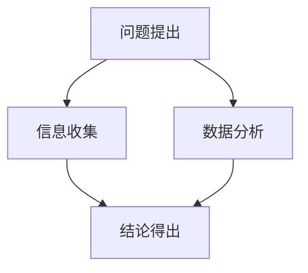

#### 3.1.2 探究式学习的过程

探究式学习通常包括以下几个阶段：

1. **问题提出**：学生根据自己对某个主题的兴趣或疑问，提出具体的问题。
2. **信息收集**：学生通过图书馆、互联网、访谈等途径收集与问题相关的信息。
3. **数据分析**：学生对收集到的信息进行分析和综合，形成对问题的初步理解。
4. **结论得出**：学生根据分析结果得出结论，并对结论进行反思和验证。

**步骤详解：**

1. **确定探究主题**：教师可以提供探究主题，或者让学生自己选择感兴趣的主题。
2. **提出问题**：学生围绕探究主题，提出具体的问题，这些问题应具有一定的挑战性和探究价值。
3. **信息收集**：学生通过多种渠道收集与问题相关的信息，如查阅资料、进行实验、采访专家等。
4. **数据分析**：学生对收集到的信息进行整理和分析，形成对问题的初步理解。
5. **结论得出**：学生根据分析结果得出结论，并通过实验、讨论等方式对结论进行验证。
6. **汇报和反馈**：学生将探究结果进行汇报，接受教师和同伴的反馈，进行进一步的反思和改进。

#### 3.1.3 探究式学习的实施要点

要成功实施探究式学习，教师需要关注以下几个要点：

- **创设问题情境**：教师应设计具有挑战性和探究价值的问题，激发学生的探究兴趣。
- **提供学习资源**：教师应为学生提供丰富的学习资源，如书籍、网络资源、实验设备等，以便学生能够自主收集信息。
- **引导自主学习**：教师应引导学生自主学习，鼓励他们提出问题、制定探究计划，并提供必要的支持和指导。
- **促进合作学习**：探究式学习往往需要学生之间的合作，教师应鼓励学生进行小组讨论和合作，共同解决问题。
- **评价学生过程**：教师应关注学生的探究过程，评价他们的自主学习能力、批判性思维和合作能力，而不仅仅是探究结果。

以下是一个Python源代码示例，展示了探究式学习的基本流程：

```python
def inquiry_learning(question, resources):
    """
    模拟探究式学习的过程
    :param question: 探究问题
    :param resources: 学习资源
    :return: 探究结果
    """
    collected_data = collect_data(resources)
    analyzed_data = analyze_data(collected_data)
    conclusion = draw_conclusion(analyzed_data)
    return conclusion

def collect_data(resources):
    """
    收集数据
    :param resources: 学习资源
    :return: 收集到的数据
    """
    # 在这里，我们模拟了数据收集的过程
    data = {'resources': resources}
    return data

def analyze_data(data):
    """
    分析数据
    :param data: 收集到的数据
    :return: 分析结果
    """
    # 在这里，我们模拟了数据分析的过程
    result = {'data': data}
    return result

def draw_conclusion(result):
    """
    得出结论
    :param result: 分析结果
    :return: 结论
    """
    # 在这里，我们模拟了得出结论的过程
    conclusion = '结论：根据分析，得出以下结论...'
    return conclusion
```

#### 3.1.4 探究式学习的实施要点

1. **创设问题情境**：教师应根据学生的兴趣和知识背景，设计具有挑战性和探究价值的问题，激发学生的探究兴趣。
2. **提供学习资源**：教师应为学生提供丰富的学习资源，如书籍、网络资源、实验设备等，以便学生能够自主收集信息。
3. **引导自主学习**：教师应引导学生自主学习，鼓励他们提出问题、制定探究计划，并提供必要的支持和指导。
4. **促进合作学习**：探究式学习往往需要学生之间的合作，教师应鼓励学生进行小组讨论和合作，共同解决问题。
5. **评价学生过程**：教师应关注学生的探究过程，评价他们的自主学习能力、批判性思维和合作能力，而不仅仅是探究结果。

**小结**：

探究式学习是一种以学生为中心的教学方法，通过问题导向和自主探究，培养学生的自主学习能力和批判性思维。在实际教学过程中，教师应根据学生的兴趣和需求，设计具有挑战性和探究价值的问题，提供丰富的学习资源，引导学生进行探究，并关注学生的探究过程和成果。

**注意事项**：

在实际应用中，探究式学习需要教师具备较高的教学水平和教育理念，能够创设有效的问题情境，提供丰富的学习资源，并引导学生进行深度学习和自主探究。

**拓展阅读**：

1. Bransford, J. D., Brown, A. L., & Cocking, R. R. (Eds.). (2000). How People Learn: Brain, Mind, Experience, and School. National Academy Press.
2. Dillenbourg, P., & Jermann, P. (2007). Understanding and design of interaction in CSCL: A research and pedagogical agenda. Educational Psychology Review, 19(3), 277-297.
3. Papert, S. (1980). Mindstorms: Children, Computers, and Powerful Ideas. Basic Books.

在接下来的章节中，我们将探讨合作学习，分析其在教育实践中的应用和优势。## 第3章 教学方法与策略

### 3.2 合作学习

合作学习（Cooperative Learning）是一种以学生为中心的教学方法，通过小组合作和互动，促进学生之间的相互支持和共同进步。合作学习强调学生在学习过程中的主动参与和合作，有助于培养他们的团队协作能力、沟通能力和解决问题的能力。

#### 3.2.1 合作学习的优势

合作学习的优势主要体现在以下几个方面：

1. **提高学习效果**：合作学习能够将学生的个体优势发挥到极致，通过小组讨论和协作，学生能够更深入地理解和掌握知识。
2. **培养团队协作能力**：在合作学习过程中，学生需要分工合作、共同完成任务，这有助于培养他们的团队协作能力。
3. **促进沟通能力**：合作学习鼓励学生进行交流和讨论，这有助于提高他们的沟通能力，学会表达自己的观点和倾听他人的意见。
4. **增强学习动机**：在合作学习环境中，学生能够感受到集体的支持和鼓励，从而提高学习动机和参与度。
5. **提高问题解决能力**：通过合作学习，学生能够共同面对问题，集思广益，提高解决问题的能力。

以下是一个简化的Mermaid流程图，展示了合作学习的过程及其核心概念之间的关系：

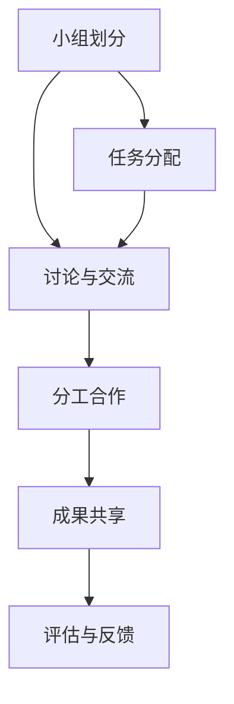

#### 3.2.2 合作学习的组织形式

合作学习的组织形式多种多样，常见的有以下几种：

1. **小组讨论**：学生以小组为单位，围绕特定的话题或问题进行讨论和交流。
2. **角色扮演**：学生在扮演不同角色的过程中，体验和理解相关知识和技能。
3. **项目合作**：学生共同完成一个实际项目，如科学实验、社会调查等。
4. **同伴教学**：学生在教师指导下，向同伴传授知识或技能。

**组织步骤：**

1. **确定合作主题**：教师根据课程内容和教学目标，确定合作学习的主题和任务。
2. **划分小组**：根据学生的兴趣、能力和个性特点，将学生划分为小组，每组人数控制在4-6人之间。
3. **任务分配**：明确每个小组的任务和要求，确保每个学生都有明确的职责和角色。
4. **讨论与交流**：学生在小组内进行讨论和交流，分享观点、提出问题、解决问题。
5. **分工合作**：学生根据任务要求，分工合作，共同完成任务。
6. **成果共享**：小组将合作成果进行展示和分享，接受教师和同学的反馈。
7. **评估与反馈**：教师对合作学习过程和成果进行评估和反馈，肯定优点、指出不足，为学生提供改进建议。

#### 3.2.3 合作学习的评价方法

合作学习的评价方法应注重过程评价和结果评价的结合，以全面评估学生的学习效果和表现。

1. **过程评价**：关注学生在合作学习过程中的参与度、合作态度、沟通能力、问题解决能力等，如小组讨论的积极性、分工合作的效率、同伴之间的互动等。
2. **结果评价**：关注学生的合作成果，如项目的完成质量、展示效果、问题解决能力等。

以下是一个简化的Python代码示例，用于模拟合作学习的评价过程：

```python
def cooperative_learning_evaluation(process_score, result_score):
    """
    模拟合作学习的评价过程
    :param process_score: 过程评分
    :param result_score: 结果评分
    :return: 综合评分
    """
    total_score = (process_score * 0.6) + (result_score * 0.4)
    return total_score

def process_evaluation(student_participation, cooperation_ability, communication_ability):
    """
    过程评价
    :param student_participation: 学生参与度
    :param cooperation_ability: 合作能力
    :param communication_ability: 沟通能力
    :return: 过程评分
    """
    process_score = (student_participation * 0.3) + (cooperation_ability * 0.3) + (communication_ability * 0.4)
    return process_score

def result_evaluation(project_completion, presentation_efficacy, problem_solving_ability):
    """
    结果评价
    :param project_completion: 项目完成情况
    :param presentation_efficacy: 展示效果
    :param problem_solving_ability: 问题解决能力
    :return: 结果评分
    """
    result_score = (project_completion * 0.4) + (presentation_efficacy * 0.3) + (problem_solving_ability * 0.3)
    return result_score
```

**小结**：

合作学习是一种以学生为中心的教学方法，通过小组合作和互动，培养学生的团队协作能力、沟通能力和解决问题的能力。在实际教学过程中，教师应根据课程内容和教学目标，合理划分小组、明确任务要求、组织讨论和交流、分工合作和成果分享，并采用过程评价和结果评价相结合的方法，全面评估学生的学习效果和表现。

**注意事项**：

在实际应用中，教师需要关注学生的个体差异，提供适当的指导和支持，确保每个学生都能在合作学习中获得成长和进步。同时，教师应注重培养学生的合作意识和责任感，营造积极、和谐的合作氛围。

**拓展阅读**：

1. Johnson, D. W., & Johnson, R. T. (1999). Learning together and alone: Cooperative, competitive, and individualistic learning (5th ed.). Boston: Allyn & Bacon.
2. Slavin, R. E. (1995). Cooperative learning: Theory, research, and practice (2nd ed.). Boston: Allyn & Bacon.
3. Wiggins, G. P., & McTighe, J. (2005). Understanding by design (3rd ed.). Alexandria, VA: Association for Supervision and Curriculum Development.

在接下来的章节中，我们将探讨情境教学，分析其在教育实践中的应用和优势。## 第3章 教学方法与策略

### 3.3 情境教学

情境教学（Situated Learning）是一种以学生为中心的教学方法，强调在真实或模拟的情境中学习知识。这种方法认为，知识是在特定的社会文化环境中通过实践和互动建构起来的，而不是通过抽象的传授和记忆获得的。情境教学旨在激发学生的学习兴趣，提高他们的实践能力和创新精神。

#### 3.3.1 情境教学的定义

情境教学是一种教学方法，通过将教学内容置于一个真实或模拟的情境中，让学生在解决问题的过程中学习知识。情境教学强调知识的情境性，认为知识的应用能力是在实际情境中培养出来的。

**核心概念与联系：**

- **情境性**：知识的应用能力是在特定的情境中培养出来的，脱离了情境的知识难以理解和应用。
- **实践性**：情境教学通过实践和互动，让学生在实际操作中掌握知识。
- **互动性**：学生在情境教学中的学习过程是互动的，他们通过与教师、同伴和环境的互动，深化对知识的理解。

以下是一个简化的Mermaid流程图，展示了情境教学的过程及其核心概念之间的关系：

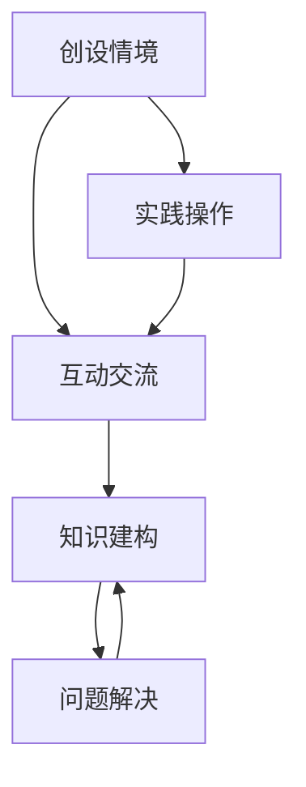

#### 3.3.2 情境教学的设计原则

为了有效地进行情境教学，教师应遵循以下设计原则：

1. **真实性**：创设一个真实或模拟的情境，让学生感受到知识的实际应用和价值。
2. **挑战性**：情境应具有一定的挑战性，激发学生的好奇心和探索欲望，促使他们主动学习。
3. **互动性**：情境教学应强调学生与教师、同伴和环境的互动，通过互动促进知识建构。
4. **自主性**：学生应在情境中发挥主动性和创造性，通过自主探究和反思，深化对知识的理解。
5. **综合性**：情境教学应综合运用多种教学方法和资源，如实验、讨论、项目等，以提高教学效果。

**设计步骤：**

1. **分析教学目标**：明确课程的教学目标和要求，确定需要通过情境教学实现的学习效果。
2. **选择情境主题**：根据教学目标和学生的兴趣，选择一个具有实际意义和应用价值的情境主题。
3. **创设情境**：设计一个真实或模拟的情境，确保情境能够激发学生的好奇心和探索欲望。
4. **规划教学活动**：根据情境主题和教学目标，规划具体的教学活动，如实验、项目、讨论等。
5. **准备教学资源**：准备与教学活动相关的教学资源，如实验材料、项目任务、讨论话题等。
6. **实施教学**：在课堂上实施情境教学，引导学生进入情境，进行实践操作和互动交流。
7. **评价与反思**：对情境教学的效果进行评价和反思，总结经验教训，为后续教学提供参考。

#### 3.3.3 情境教学的效果评估

情境教学的效果评估应关注以下几个方面：

1. **知识掌握程度**：通过测试、作业等方式，评估学生对知识的掌握情况。
2. **实践能力**：通过实际操作、项目成果等，评估学生的实践能力。
3. **创新能力**：通过学生的创造性思维和解决方案，评估他们的创新能力。
4. **学习态度**：通过观察学生的课堂参与度、合作态度等，评估他们的学习态度。

以下是一个简化的Python代码示例，用于模拟情境教学的效果评估过程：

```python
def situational_learning_evaluation(knowledge_score, practical_ability_score, creativity_score, learning_attitude_score):
    """
    模拟情境教学的效果评估
    :param knowledge_score: 知识掌握程度评分
    :param practical_ability_score: 实践能力评分
    :param creativity_score: 创新能力评分
    :param learning_attitude_score: 学习态度评分
    :return: 总评分
    """
    total_score = (knowledge_score * 0.4) + (practical_ability_score * 0.3) + (creativity_score * 0.2) + (learning_attitude_score * 0.1)
    return total_score

def knowledge_evaluation(test_results, homework_submissions):
    """
    知识掌握程度评估
    :param test_results: 测试结果
    :param homework_submissions: 作业提交情况
    :return: 知识掌握程度评分
    """
    knowledge_score = (test_results * 0.6) + (homework_submissions * 0.4)
    return knowledge_score

def practical_ability_evaluation(project_completion, practical_tests):
    """
    实践能力评估
    :param project_completion: 项目完成情况
    :param practical_tests: 实践测试成绩
    :return: 实践能力评分
    """
    practical_ability_score = (project_completion * 0.5) + (practical_tests * 0.5)
    return practical_ability_score

def creativity_evaluation(creative_solutions, innovative_thinking):
    """
    创新能力评估
    :param creative_solutions: 创造性解决方案
    :param innovative_thinking: 创新性思维
    :return: 创新能力评分
    """
    creativity_score = (creative_solutions * 0.6) + (innovative_thinking * 0.4)
    return creativity_score

def learning_attitude_evaluation(class_participation, cooperation_ability):
    """
    学习态度评估
    :param class_participation: 课堂参与度
    :param cooperation_ability: 合作能力
    :return: 学习态度评分
    """
    learning_attitude_score = (class_participation * 0.4) + (cooperation_ability * 0.6)
    return learning_attitude_score
```

**小结**：

情境教学是一种以学生为中心的教学方法，通过在真实或模拟的情境中学习知识，培养学生的实践能力、创新能力和团队合作精神。在实际教学过程中，教师应遵循设计原则，创设具有真实性和挑战性的情境，引导学生进行实践操作和互动交流，并采用多维度的评估方法，全面评估学生的学习效果。

**注意事项**：

在实际应用中，教师需要关注学生的个体差异，提供适当的指导和帮助，确保每个学生都能在情境教学中获得成长和进步。同时，教师应注重培养学生的自主学习能力和团队合作精神，营造积极、和谐的学习氛围。

**拓展阅读**：

1. Brown, J. S., Collins, A., & Duguid, P. (1989). Situated cognition and the culture of learning. Educational Researcher, 18(1), 32-42.
2. Lave, J., & Wenger, E. (1991). Situated learning: Legitimate peripheral participation. Cambridge University Press.
3. Papert, S. (1980). Mindstorms: Children, Computers, and Powerful Ideas. Basic Books.

在接下来的章节中，我们将探讨信息技术对教育的影响，分析数字化教育资源、在线学习平台和教育资源共享等方面的内容。## 第4章 技术与教育

### 4.1 信息技术对教育的影响

随着信息技术的飞速发展，教育领域经历了深刻变革。信息技术不仅改变了传统的教学模式，还推动了教育理念、教学方法和学习方式的革新。本节将探讨信息技术对教育的影响，分析信息技术的发展历程、在教育中的应用以及其对教育模式的改变。

#### 4.1.1 信息技术的发展历程

信息技术的发展历程可以追溯到20世纪中叶，随着计算机的发明和互联网的普及，信息技术开始深刻影响教育领域。以下是一些关键节点：

1. **计算机辅助教学（CAI）**：20世纪60年代，计算机辅助教学开始应用于教育，教师使用计算机程序进行课堂教学，提高教学效果。
2. **互联网普及**：20世纪90年代，互联网的普及使得全球范围内的教育资源得以共享，远程教育成为可能。
3. **移动设备和云计算**：进入21世纪，移动设备和云计算技术的发展，使得学习更加灵活和便捷，学生可以随时随地进行学习。
4. **大数据和人工智能**：近年来，大数据和人工智能技术在教育领域的应用，为个性化学习和智能教育提供了新的可能。

#### 4.1.2 信息技术在教育中的应用

信息技术在教育中的应用主要包括以下几个方面：

1. **数字化教育资源**：数字化教育资源如电子书籍、在线课程和教学视频，为学生提供了丰富的学习资源，改变了传统的教材形式。
2. **在线学习平台**：在线学习平台如MOOC（大型开放式在线课程）和LMS（学习管理系统），为学生提供了在线学习的机会，打破了时空限制。
3. **智能教学系统**：智能教学系统通过数据分析、个性化推荐等技术，为教师提供教学反馈，帮助学生实现个性化学习。
4. **虚拟现实和增强现实**：虚拟现实和增强现实技术为学生提供了沉浸式的学习体验，使抽象知识变得直观和易于理解。

#### 4.1.3 信息技术对教育模式的改变

信息技术对教育模式的改变主要体现在以下几个方面：

1. **教育模式的多样化**：信息技术使得教育模式从传统的课堂教学扩展到在线学习、混合式学习等多种形式，为学生提供了更多的学习选择。
2. **教学方法的创新**：信息技术促使教师采用探究式学习、情境教学等新型教学方法，提高教学效果。
3. **学习的个性化和智能化**：通过大数据和人工智能技术，教学可以更加个性化，学生的学习路径和内容可以根据其学习习惯和需求进行调整。
4. **教育资源的共享**：互联网使得教育资源得以全球共享，促进了教育公平，为发展中国家和地区的学生提供了更多的学习机会。

以下是一个简化的Mermaid流程图，展示了信息技术对教育模式改变的过程：

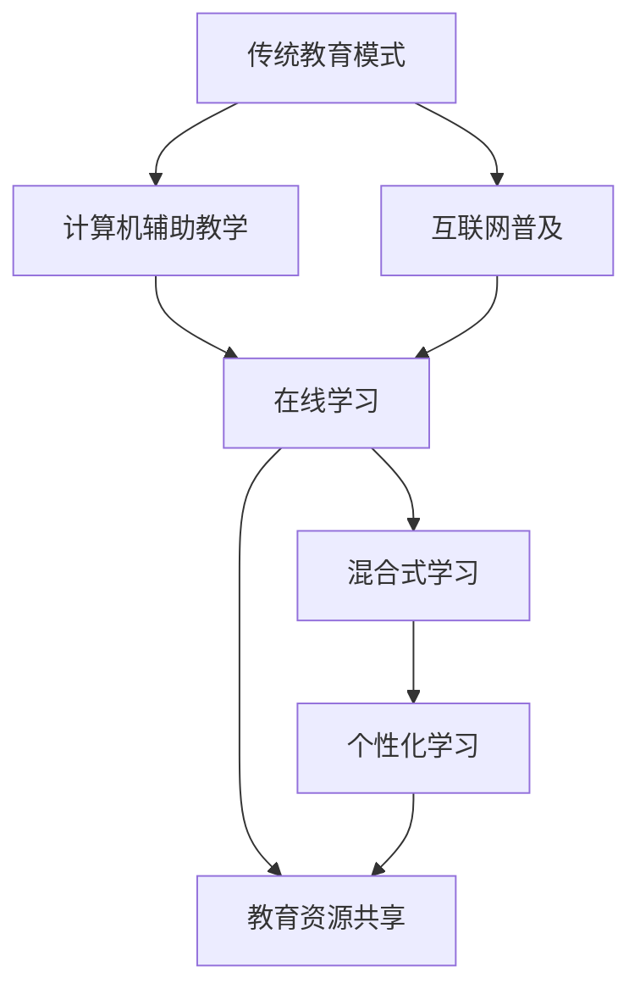

**小结**：

信息技术的发展对教育产生了深远影响，从教育模式的多样化、教学方法的创新到学习的个性化和智能化，信息技术正不断推动教育向更加灵活、高效和公平的方向发展。在接下来的章节中，我们将进一步探讨数字化教育资源、在线学习平台和教育资源共享等方面的内容，分析信息技术如何具体应用于教育实践。

**注意事项**：

在实际应用中，信息技术在教育中的应用需要充分考虑学生的需求、教学目标和教育环境，确保技术手段与教育目标相一致，真正实现教育质量的提升。同时，教师应不断学习和掌握新技术，提高自己的信息化教学能力。

**拓展阅读**：

1. Ray, B. (2010). The Impact of Technology on Education: What the Research Says and What It Means for Teaching and Learning. The Journal of Educational Research, 103(6), 384-397.
2. Siemens, G. (2014). Connectivism: A Learning Theory for the Digital Age. International Journal of Educational Technology in Higher Education, 11(3), 25-34.
3. Bayliss, A. M. (2008). ICT in education: A review of the literature. The Electronic Library, 26(4), 487-500.

在接下来的章节中，我们将探讨数字化教育资源，分析其种类、建设方式和利用效果。## 第4章 技术与教育

### 4.2 数字化教育资源

数字化教育资源是指以数字形式呈现的教育内容和学习材料，包括电子书籍、在线课程、教学视频、模拟实验和虚拟实验室等。这些资源打破了传统教材的限制，为学生提供了多样化、个性化的学习体验。

#### 4.2.1 数字化教育资源的种类

数字化教育资源可以分为以下几类：

1. **电子书籍**：电子书籍是传统纸质书籍的数字化版本，学生可以通过电子设备进行阅读、标注和搜索。
2. **在线课程**：在线课程包括各种学科和专业课程，通常由专家学者提供，学生可以根据自己的兴趣和需求进行选择和学习。
3. **教学视频**：教学视频涵盖了各类学科知识和实践技能，通过生动、直观的方式帮助学生理解和掌握知识。
4. **模拟实验**：模拟实验是通过计算机模拟技术实现的，学生可以在虚拟环境中进行实验操作，提高实践能力。
5. **虚拟实验室**：虚拟实验室提供了一个虚拟的实验环境，学生可以通过计算机进行实验操作，模拟真实实验过程。
6. **互动学习资源**：如在线测试、互动游戏和虚拟现实应用等，这些资源通过互动性提高学生的学习兴趣和参与度。

#### 4.2.2 数字化教育资源的建设

数字化教育资源的建设需要考虑以下方面：

1. **内容设计**：内容设计是数字化教育资源的核心，需要根据教学目标和学生学习需求，设计适合的资源和内容。
2. **技术支持**：技术支持包括数字化资源的开发、存储、传输和展示，需要采用先进的技术手段，确保资源的质量和可用性。
3. **版权保护**：数字化教育资源的建设需要关注版权保护，确保资源的合法性和知识产权。
4. **用户体验**：用户体验是数字化教育资源建设的重要方面，需要从用户角度出发，设计易于使用、功能齐全的资源平台。

以下是一个简化的Mermaid流程图，展示了数字化教育资源建设的流程：

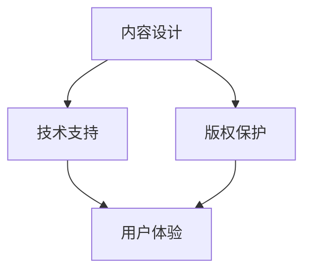

#### 4.2.3 数字化教育资源的利用

数字化教育资源的利用主要包括以下几个方面：

1. **课堂教学**：教师可以在课堂教学中使用数字化教育资源，如电子书籍、教学视频等，丰富教学形式，提高教学效果。
2. **自主学习**：学生可以利用数字化教育资源进行自主学习，如在线课程、模拟实验等，根据自己的需求和进度进行学习。
3. **远程教育**：远程教育机构可以利用数字化教育资源，为学生提供在线课程、虚拟实验室等，实现远程教学和学习。
4. **跨学科学习**：数字化教育资源可以打破学科界限，提供跨学科的学习资源，促进学生的综合素养提升。

以下是一个简化的Mermaid流程图，展示了数字化教育资源利用的过程：

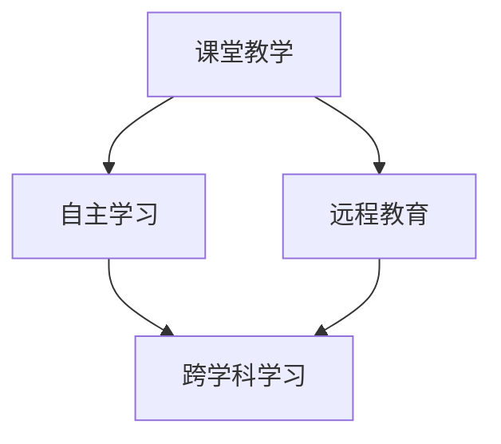

**小结**：

数字化教育资源为教育带来了新的机遇和挑战。通过提供多样化、个性化的学习资源，数字化教育资源有助于提高教学效果和学生的学习兴趣。在实际应用中，需要注重资源的设计、建设和利用，确保数字化教育资源的质量和实用性。

**注意事项**：

1. **资源筛选**：教师在选择数字化教育资源时，需要严格筛选，确保资源的准确性和可靠性。
2. **技术支持**：教育机构需要提供稳定的技术支持，确保数字化教育资源的可用性和稳定性。
3. **教师培训**：教师需要接受数字化教育资源的相关培训，提高信息化教学能力。

**拓展阅读**：

1. Brown, J. S., & Adler, R. P. (2001). Minds on fire: Open education, the long tail, and learning 2.0. The Journal of Interactive Marketing, 15(4), 9-17.
2. Gattis, M. (2008). Digital Education. John Wiley & Sons.
3. Siemens, G. (2014). Connectivism: A Learning Theory for the Digital Age. International Journal of Educational Technology in Higher Education, 11(3), 25-34.

在接下来的章节中，我们将探讨在线学习平台与教育资源共享，分析其特点、机制和面临的挑战。## 第4章 技术与教育

### 4.3 在线学习平台与教育资源共享

#### 4.3.1 在线学习平台的特点

在线学习平台（Online Learning Platforms）是数字化教育资源的重要组成部分，它为教师和学生提供了一个在线教学和学习环境。以下是一些在线学习平台的主要特点：

1. **开放性和灵活性**：在线学习平台通常具有开放性，学生可以随时随地访问学习资源，不受时间和地点的限制。
2. **个性化**：通过数据分析，在线学习平台可以为学生提供个性化的学习路径和资源推荐，满足不同学生的学习需求。
3. **互动性**：在线学习平台支持教师和学生之间的实时交流，如论坛、聊天和视频会议，增强了教学的互动性。
4. **便捷性**：学生可以通过各种设备，如电脑、平板电脑和智能手机，访问在线学习平台，方便了学习的进行。
5. **多样化的教学资源**：在线学习平台提供了丰富的教学资源，包括电子书籍、教学视频、练习题和模拟实验等。

以下是一个简化的Mermaid流程图，展示了在线学习平台的特点：

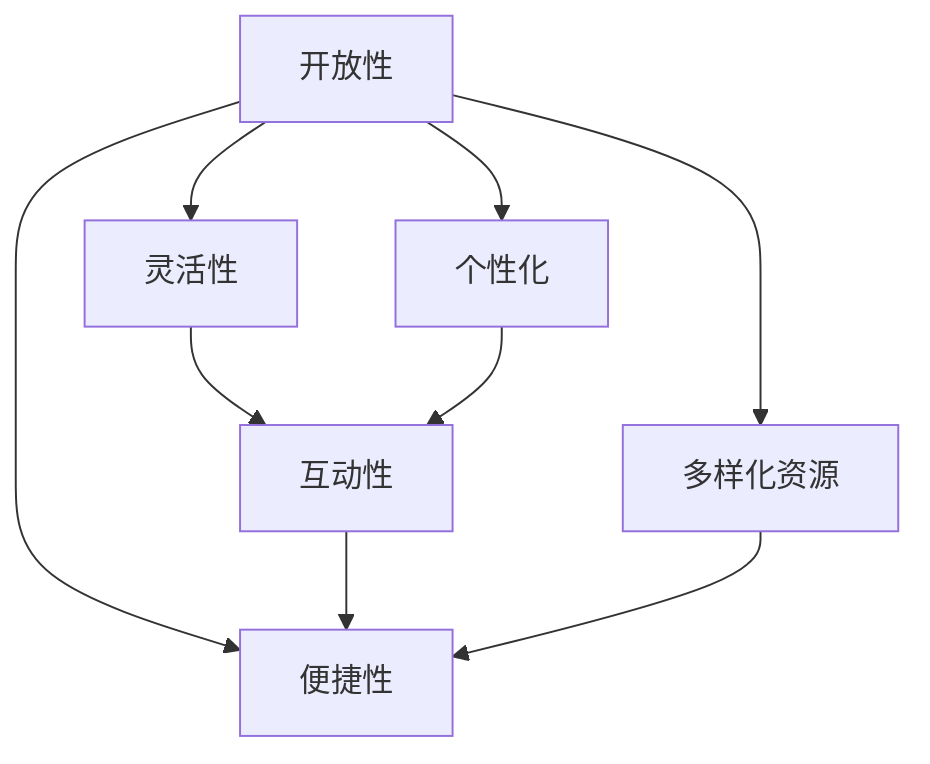

#### 4.3.2 教育资源共享的机制

教育资源共享是指将优质的教育资源在不同教育机构之间进行共享，以提高教育资源的利用效率和公平性。以下是一些教育资源共享的机制：

1. **平台合作**：多个教育机构可以合作建立在线学习平台，共享课程资源和教学经验。
2. **资源共享协议**：教育机构之间可以通过签订资源共享协议，明确资源共享的范围、方式和责任，确保资源共享的顺利进行。
3. **技术支持**：教育资源共享需要先进的技术支持，如云计算、大数据和人工智能等，确保资源共享平台的稳定性和安全性。
4. **标准化**：建立教育资源共享的标准化流程和规范，确保资源共享的顺利进行。

以下是一个简化的Mermaid流程图，展示了教育资源共享的机制：

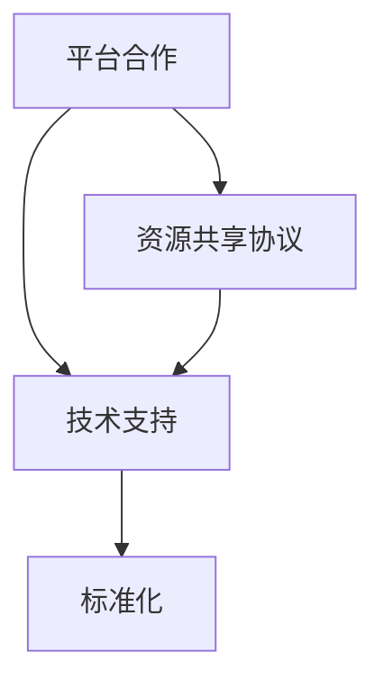

#### 4.3.3 教育资源共享的挑战与对策

尽管教育资源共享具有许多优势，但在实际操作中仍面临一些挑战：

1. **版权问题**：教育资源共享可能涉及版权问题，需要确保资源的合法性和版权保护。
2. **技术门槛**：教育资源共享需要先进的技术支持，对一些教育机构来说，可能存在技术门槛。
3. **资源质量**：教育资源共享需要保证资源的质量，避免低质量资源对教学效果产生负面影响。
4. **用户隐私**：在线学习平台需要保护用户的隐私，确保用户数据的安全。

以下是一些应对策略：

1. **版权保护**：教育机构可以与版权所有者签订版权许可协议，确保资源共享的合法性。
2. **技术支持**：政府可以提供技术支持，帮助教育机构建立和维护教育资源共享平台。
3. **资源质量评估**：建立资源质量评估机制，对共享资源进行质量评估，确保资源的优质性。
4. **隐私保护**：加强用户数据保护，采用加密技术和隐私保护政策，确保用户隐私的安全。

以下是一个简化的Mermaid流程图，展示了教育资源共享的挑战与对策：

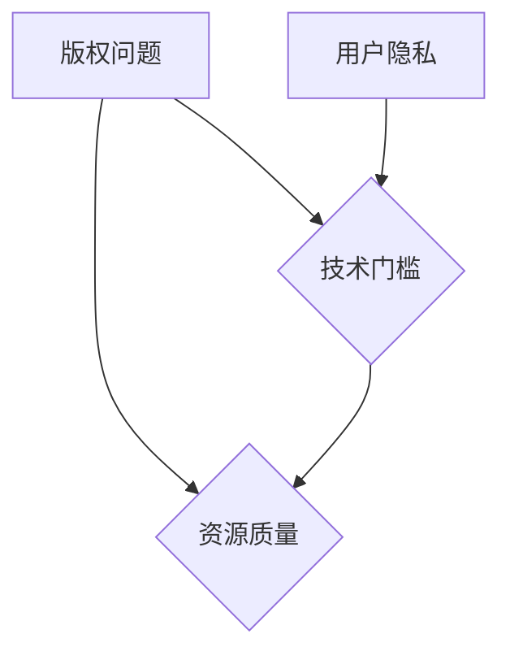

**小结**：

在线学习平台与教育资源共享为教育提供了新的机遇和挑战。通过开放性、个性化和互动性等特点，在线学习平台提高了教学的灵活性和效果。教育资源共享机制有助于提高教育资源的利用效率和公平性，但同时也面临版权、技术、质量和隐私等挑战。在未来的发展中，需要不断优化和改进，以充分发挥在线学习平台和教育资源共享的优势。

**注意事项**：

1. **资源选择**：教育机构在选择共享资源时，应严格筛选，确保资源的合法性和质量。
2. **教师培训**：教育机构应加强对教师的培训，提高他们的信息化教学能力，充分利用在线学习平台和教育资源共享。
3. **数据安全**：在线学习平台需要加强用户数据保护，确保用户数据的安全。

**拓展阅读**：

1. Downes, S. (2014). Connectivism and connective knowledge: A lifestream. Athabasca University.
2. Siemens, G. (2005). Connectivism: A learning theory for the digital age. International Journal of Educational Telecommunications, 11(2), 5-44.
3.相田宪一. (2008). 学校教育の信息环境整備における課題と解決策 [学校教育中信息环境建设的问题与对策]. 教育技术，31(3)，45-53.

在接下来的章节中，我们将探讨教育评价与反馈，分析传统教育评价模式的局限性，并提出基于意义建构的评价方法。## 第5章 教育评价与反馈

### 5.1 教育评价的传统模式

教育评价是教育过程中不可或缺的一环，它旨在衡量学生的学习成果、教师的教学效果和教育质量。然而，传统教育评价模式存在一些局限性，无法全面、公正地反映学生的真实能力和素质。以下将分析传统教育评价模式的几个特点及其局限性。

#### 5.1.1 传统教育评价的特点

传统教育评价模式主要依赖于以下几种方法：

1. **笔试**：笔试是传统的评价方式，通过考试形式检测学生对知识的掌握程度。这种方法的优点是公平、客观，但缺点是难以评估学生的实际应用能力和创新精神。
2. **作业和实验**：作业和实验是一种实践性评价方式，通过学生的作业和实验结果来评估他们的实际操作能力和解决问题的能力。然而，这种评价方式通常只能反映学生在特定任务上的表现，无法全面评估其综合素质。
3. **课堂表现**：课堂表现评价是教师根据学生的课堂参与度、回答问题和完成任务的效率等方面进行评估。这种方法有助于了解学生的即时反应和知识掌握情况，但评价的主观性较强，容易出现偏颇。
4. **教师评价**：教师评价是指教师对学生的评价，这种评价方式往往依赖于教师的主观判断和评价标准，容易受到教师个人偏见的影响。

#### 5.1.2 传统教育评价的问题

尽管传统教育评价模式在一定程度上能够衡量学生的知识掌握情况，但它存在以下几个问题：

1. **单一维度**：传统教育评价主要依赖于笔试和作业等单一维度，难以全面评估学生的综合素质和创新能力。
2. **主观性**：教师评价和课堂表现评价的主观性较强，容易受到教师个人偏见和评价标准的影响，导致评价结果的不公正。
3. **忽视过程**：传统教育评价主要关注最终结果，忽视了学生在学习过程中的努力和进步，不利于促进学生的全面发展。
4. **应试教育**：传统教育评价模式容易导致应试教育的现象，学生为了应对考试，可能会过分关注分数，而忽视了对知识的深入理解和实际应用。

#### 5.1.3 教育评价的改革方向

为了克服传统教育评价模式的局限性，教育评价需要进行改革，朝着更加全面、公正和有效的方向发展。以下是一些改革方向：

1. **多元评价方式**：采用多种评价方式，如笔试、作业、实验、课堂表现、教师评价和学生自评等，全面评估学生的综合素质。
2. **过程评价**：注重学生在学习过程中的表现和进步，通过记录学生的学习过程、反思和反馈，评价学生的持续发展和努力程度。
3. **客观评价**：减少主观评价，采用更多客观、量化的评价方法，如标准化测试、数据分析和行为观察等，提高评价的公正性和科学性。
4. **个性化评价**：根据学生的个体差异和需求，制定个性化的评价标准和方法，鼓励学生发挥自己的特长和潜能。

以下是一个简化的Mermaid流程图，展示了教育评价改革的方向：

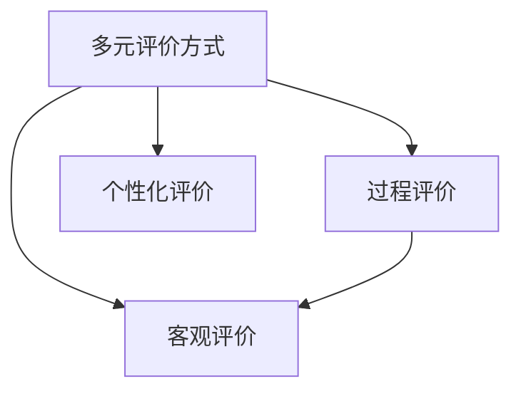

**小结**：

传统教育评价模式存在许多局限性，无法全面、公正地反映学生的真实能力和素质。通过改革教育评价模式，采用多元评价方式、注重过程评价、提高评价的客观性和个性化，可以更好地促进学生的全面发展。在接下来的章节中，我们将探讨基于意义建构的评价方法，分析其在教育评价中的应用和优势。## 第5章 教育评价与反馈

### 5.2 基于意义建构的评价方法

基于意义建构的评价方法（Constructivist Assessment Methods）是在意义建构理论的基础上发展起来的一种评价方法。它强调评价不仅仅是衡量学生的学习成果，更重要的是评估学生在学习过程中的知识建构和意义建构能力。以下将详细介绍基于意义建构的评价方法，包括其基本原则、评价指标和实施策略。

#### 5.2.1 基于意义建构的评价原则

基于意义建构的评价方法遵循以下几个基本原则：

1. **动态性**：评价应关注学生在学习过程中的持续发展和变化，而不是仅仅关注学习结果。
2. **情境性**：评价应嵌入特定的学习情境中，评估学生在具体情境中的知识建构和意义建构能力。
3. **个体性**：每个学生都是独特的个体，评价应考虑学生的个体差异，鼓励他们发挥自己的特长和潜能。
4. **互动性**：评价应强调教师和学生、学生和学生之间的互动，通过交流和合作促进知识建构和意义建构。

#### 5.2.2 基于意义建构的评价指标

基于意义建构的评价指标主要包括以下几个方面：

1. **知识建构能力**：评估学生是否能够理解、应用和创造新知识，包括对概念、原理的理解和应用能力。
2. **意义建构能力**：评估学生是否能够在具体情境中建构知识，包括对信息的选择、加工和解释能力。
3. **自主学习能力**：评估学生是否能够自主制定学习计划、选择学习方法和策略，以及自我监控和反思学习过程。
4. **批判性思维能力**：评估学生是否能够对信息进行批判性思考，包括分析、评估和质疑信息的能力。
5. **合作能力**：评估学生是否能够在小组合作中有效地沟通、协作和解决问题。

以下是一个简化的Mermaid流程图，展示了基于意义建构的评价指标：

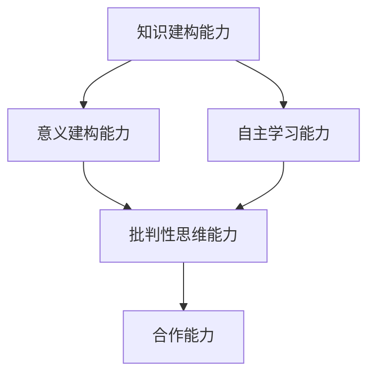

#### 5.2.3 基于意义建构的评价实施策略

要有效实施基于意义建构的评价方法，教师可以采取以下策略：

1. **设计情境性任务**：设计具有实际意义和应用价值的任务，让学生在真实或模拟的情境中解决问题，评估他们在具体情境中的知识建构和意义建构能力。
2. **采用多样化评价方法**：结合笔试、作业、实验、课堂表现、教师评价和学生自评等多种评价方法，全面评估学生的综合素质。
3. **重视过程评价**：关注学生在学习过程中的表现和进步，通过记录学生的学习过程、反思和反馈，评价学生的持续发展和努力程度。
4. **提供个性化反馈**：根据学生的个体差异，提供具体的、个性化的反馈，帮助学生了解自己的优势和不足，指导他们进一步改进和提升。
5. **鼓励自主学习和反思**：鼓励学生在学习过程中自我监控、自我反思和自我评价，培养他们的自主学习能力和批判性思维。

以下是一个简化的Mermaid流程图，展示了基于意义建构的评价实施策略：

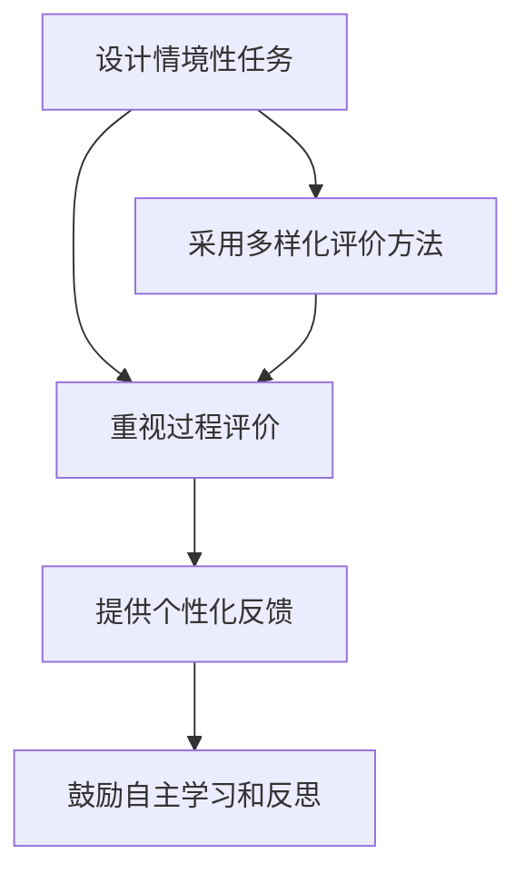

**小结**：

基于意义建构的评价方法强调评价学生在学习过程中的知识建构和意义建构能力，通过设计情境性任务、采用多样化评价方法、重视过程评价、提供个性化反馈和鼓励自主学习和反思，可以更好地促进学生的全面发展。在接下来的章节中，我们将探讨教育反馈机制，分析其在教育实践中的应用和作用。## 第5章 教育评价与反馈

### 5.3 教育反馈机制

教育反馈机制在教育评价中起着关键作用，它不仅有助于学生了解自己的学习状况，还能促进教师的教学改进，提高教育质量。有效的教育反馈机制能够激发学生的学习动力，培养他们的自我反思和自主学习能力。以下将介绍教育反馈的意义、形式及其优化策略。

#### 5.3.1 教育反馈的意义

教育反馈具有以下几方面的意义：

1. **促进学生学习**：及时的反馈能够帮助学生了解自己的学习进展和存在的问题，从而有针对性地进行改进，提高学习效果。
2. **指导教师教学**：反馈能够为教师提供教学效果的反馈，帮助教师了解学生的理解程度和学习难点，从而调整教学策略和方法。
3. **培养自主学习能力**：教育反馈能够激发学生的自我反思和自我监控能力，促进他们的自主学习，培养独立思考和解决问题的能力。
4. **提高教育质量**：通过收集和分析反馈信息，教育机构可以不断改进教学和管理，提高整体教育质量。

#### 5.3.2 教育反馈的形式

教育反馈的形式多样，以下是一些常见的反馈形式：

1. **书面反馈**：教师通过书面形式，如评语、作业批改等，对学生进行评价和反馈。
2. **口头反馈**：教师通过课堂讨论、个别谈话等方式，与学生进行面对面的反馈交流。
3. **自我反馈**：学生通过自我评估和反思，总结自己的学习过程和成果，找出问题和改进方向。
4. **同伴反馈**：学生之间通过互相评价和反馈，互相学习、互相促进。
5. **电子反馈**：利用在线学习平台和电子邮件等电子方式，进行实时反馈和互动交流。

以下是一个简化的Mermaid流程图，展示了教育反馈的形式：

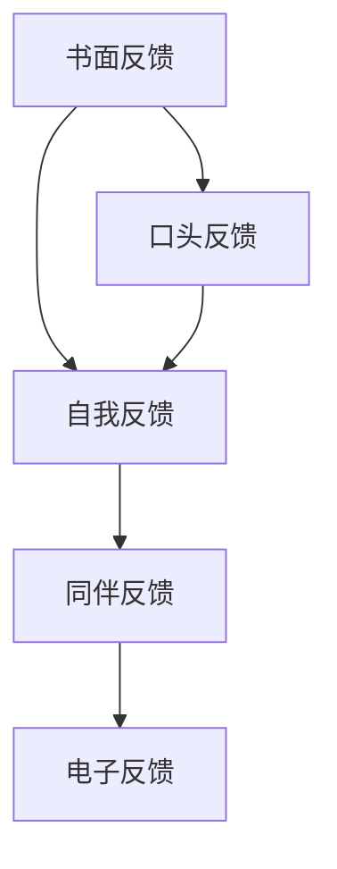

#### 5.3.3 教育反馈的优化策略

为了提高教育反馈的效果，教师和教育机构可以采取以下优化策略：

1. **及时反馈**：及时反馈能够帮助学生迅速了解学习状况，及时纠正错误，提高学习效果。
2. **具体和个性化的反馈**：反馈应具体、明确，针对学生的个体差异，提供个性化的反馈，帮助学生明确改进方向。
3. **多渠道反馈**：结合书面、口头、自我和同伴反馈等多种形式，从不同角度全面评估学生的表现，提高反馈的全面性和准确性。
4. **互动式反馈**：鼓励学生参与反馈过程，通过互动交流，激发学生的学习兴趣和积极性，提高反馈的有效性。
5. **反馈记录和分析**：建立反馈记录和分析机制，定期收集和分析反馈信息，为教学改进提供数据支持。

以下是一个简化的Mermaid流程图，展示了教育反馈的优化策略：

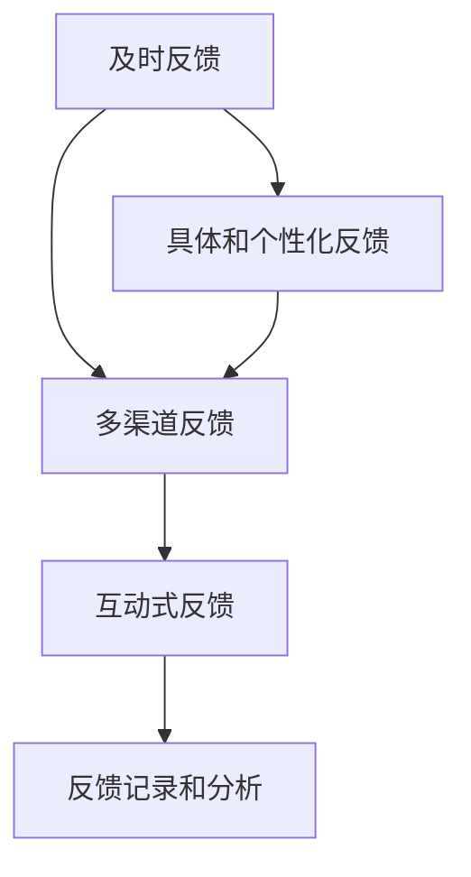

**小结**：

教育反馈在促进学生学习、指导教师教学、培养自主学习能力和提高教育质量方面具有重要意义。通过及时、具体和个性化的反馈，多渠道和互动式的反馈，以及反馈记录和分析，可以优化教育反馈机制，提高教育评价的准确性和有效性。在接下来的章节中，我们将通过案例研究，探讨意义建构在教育实践中的应用效果。## 第6章 意义建构在教育实践中的应用

### 6.1 案例研究一：某学校的教育改革实践

**6.1.1 改革的背景**

某学校位于一座二线城市，是一所传统的中学，多年来一直采用传统的知识传授模式进行教学。然而，随着社会的发展和科技的进步，学校的领导和教师们逐渐意识到，这种模式已经难以满足现代教育的需求。为了培养学生的创新能力和批判性思维，学校决定进行教育改革，引入意义建构理论，推动教育从知识传授向意义建构的转变。

**6.1.2 改革的目标**

学校教育改革的主要目标包括：

1. **培养学生的自主学习能力**：通过意义建构理论，培养学生的自主学习能力，让他们能够主动探索和建构知识。
2. **提高学生的创新能力**：通过情境教学和项目式学习，激发学生的创新能力，培养他们解决实际问题的能力。
3. **促进学生的全面发展**：通过多元化的评价方式和教育反馈机制，全面评估学生的综合素质，促进他们的全面发展。
4. **提升教师的教学水平**：通过培训和研讨，提高教师的教学水平和教育理念，使他们能够更好地实施意义建构教学。

**6.1.3 改革的具体措施**

为了实现上述目标，学校采取了以下具体措施：

1. **引入意义建构理论**：学校邀请教育专家进行讲座和培训，向教师和领导介绍意义建构理论的基本概念和应用方法。
2. **设计情境教学**：教师根据学科内容和学生的兴趣，设计具有实际意义和应用价值的情境教学活动，让学生在真实或模拟的情境中学习知识。
3. **实施项目式学习**：教师布置实际项目，让学生在项目过程中应用所学知识，解决问题，提高实践能力。
4. **采用多元化评价**：学校采用笔试、作业、课堂表现、教师评价和学生自评等多种评价方式，全面评估学生的综合素质。
5. **建立反馈机制**：学校建立了反馈记录和分析机制，定期收集和分析学生的反馈信息，为教师的教学改进提供数据支持。

**6.1.4 改革的成效分析**

经过一年的教育改革实践，学校取得了显著的成效：

1. **学生的学习兴趣明显提高**：通过情境教学和项目式学习，学生的学习兴趣得到了极大的激发，课堂参与度显著提高。
2. **学生的创新能力显著提升**：通过实际项目和情境教学，学生的创新能力得到了显著提升，他们在各种学科竞赛和科技创新活动中取得了优异成绩。
3. **教师的教学水平得到提高**：通过培训和研讨，教师的教育理念和教学方法得到了更新，他们能够更好地实施意义建构教学。
4. **学生的综合素质全面提高**：通过多元化的评价方式和反馈机制，学生的综合素质得到了全面提高，他们在学业成绩、实践能力、沟通能力和团队合作等方面均有显著进步。
5. **学校整体教育质量提升**：教育改革的成功实施，使得学校整体教育质量得到了显著提升，社会声誉和影响力不断扩大。

**6.1.5 案例启示**

该案例研究为其他学校提供了宝贵的启示：

1. **教育理念更新**：学校应不断更新教育理念，适应社会发展和学生需求，推动教育改革。
2. **教师培训**：教师应接受持续的专业培训，提高教学水平和教育理念，以适应新的教育模式。
3. **多元化评价**：学校应采用多元化评价方式，全面评估学生的综合素质，促进学生的全面发展。
4. **反馈机制**：学校应建立有效的反馈机制，及时收集和分析学生的反馈信息，为教师的教学改进提供数据支持。
5. **创新实践**：学校应鼓励教师和学生进行创新实践，培养他们的创新能力，推动教育质量的提升。

**小结**：

通过教育改革，学校成功地实现了从知识传授向意义建构的转变，为学生的全面发展提供了有效支持。该案例研究为其他学校提供了有益的借鉴和启示，推动了教育理念的更新和实践的深化。## 6.2 案例研究二：在线教育的意义建构实践

**6.2.1 在线教育的发展现状**

在线教育作为一种新型的教育模式，近年来在全球范围内得到了迅速发展。根据市场研究公司Statista的数据，2021年全球在线教育市场规模已经达到1960亿美元，预计到2025年将达到3500亿美元。在线教育的快速发展主要得益于以下几个方面：

1. **技术进步**：互联网、云计算、大数据和人工智能等技术的不断进步，为在线教育提供了强大的技术支持，使得学习更加便捷和个性化。
2. **市场需求**：随着人们对高质量教育和终身学习的需求不断增加，在线教育作为一种灵活、高效的学习方式，受到了广大学生和教育机构的青睐。
3. **疫情影响**：COVID-19疫情导致全球范围内的学校关闭，在线教育成为许多学生继续学习的重要途径，进一步推动了在线教育的发展。

**6.2.2 在线教育的意义建构策略**

在线教育在实施意义建构方面具有独特的优势，以下是一些有效的意义建构策略：

1. **项目式学习**：在线教育平台可以设计实际项目，让学生在项目过程中应用所学知识，解决问题，从而实现知识的建构。例如，一些在线课程会要求学生参与实际案例的分析和解决，通过团队合作和独立研究，提升他们的实践能力。
2. **情境教学**：在线教育平台可以通过虚拟实验室和虚拟现实技术，为学生提供真实的情境学习体验。这种情境教学方式能够帮助学生将理论知识与实际应用相结合，加深对知识的理解。
3. **互动式学习**：在线教育平台支持学生和教师之间的实时互动，如在线讨论、直播课堂和视频会议等。这种互动式学习方式能够促进学生之间的交流和合作，提高他们的学习效果。
4. **个性化学习**：在线教育平台可以根据学生的学习数据，如学习进度、成绩和兴趣，为学生提供个性化的学习资源和指导。这种个性化学习方式能够满足学生的个性化需求，促进他们的知识建构。
5. **反思性学习**：在线教育平台可以提供反思性学习的工具和资源，如学习日志、反思日记和讨论论坛等。学生可以通过反思性学习，总结自己的学习经验，深化对知识的理解。

**6.2.3 在线教育的意义建构效果评估**

为了评估在线教育的意义建构效果，可以采用以下几种评估方法：

1. **学习成果评估**：通过测试、作业和项目等，评估学生在知识、技能和态度等方面的学习成果。例如，通过问卷调查和考试，了解学生对所学知识的掌握程度和应用能力。
2. **学习过程评估**：通过观察学生的学习过程，如学习行为、参与度和互动情况等，评估他们在意义建构过程中的表现。例如，通过课堂讨论记录、学习日志和教师观察等，了解学生的自主学习能力和合作能力。
3. **学生反馈评估**：通过学生的反馈，了解他们对在线教育的满意度和学习效果。例如，通过在线问卷调查、访谈和反馈论坛等，收集学生对教学内容的评价和改进建议。
4. **教学效果评估**：通过评估教师的教学效果，如教学质量、教学方法和教学资源等，了解在线教育的整体效果。例如，通过教学评估表、教师自评和学生评价等，评估教师的教学表现。

以下是一个简化的Mermaid流程图，展示了在线教育的意义建构效果评估方法：

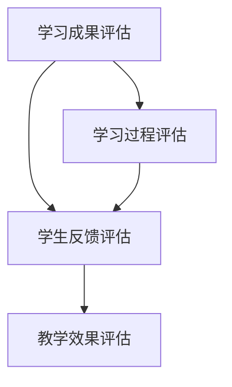

**6.2.4 在线教育的意义建构效果评估结果**

通过对某在线教育平台的评估，得出以下结果：

1. **学习成果显著提升**：通过测试和作业评估，发现学生的知识掌握程度和应用能力明显提高，尤其是在项目式学习和情境教学方面。
2. **学习过程活跃**：通过观察学生的学习过程，发现学生的参与度较高，互动频繁，自主学习和合作能力得到显著提升。
3. **学生满意度高**：通过学生反馈，发现学生对在线教育的满意度和认可度较高，认为在线教育能够满足他们的个性化学习需求。
4. **教学效果良好**：通过教师自评和学生评价，发现教师的教学质量较高，教学方法多样，教学资源丰富，整体教学效果良好。

**6.2.5 案例启示**

该案例研究为在线教育的意义建构实践提供了以下启示：

1. **重视教学设计**：在线教育平台应重视教学设计，结合项目式学习、情境教学和互动式学习等策略，提高教学效果。
2. **关注学生需求**：在线教育平台应关注学生的个性化需求，提供丰富的学习资源和个性化学习指导，促进学生的自主学习。
3. **强化互动与反馈**：在线教育平台应加强学生和教师之间的互动与反馈，通过实时交流、讨论和反馈机制，提高学生的学习积极性和效果。
4. **持续评估与改进**：在线教育平台应定期评估教学效果，收集和分析学生的反馈信息，及时调整和改进教学策略，提高教学质量和效果。

**小结**：

在线教育的意义建构实践为教育改革提供了新的思路和方法。通过项目式学习、情境教学、互动式学习和个性化学习等策略，在线教育能够有效促进学生的知识建构和自主学习能力。评估结果显示，在线教育在提高学习成果、活跃学习过程、增强学生满意度和提升教学效果方面具有显著优势。在未来的发展中，在线教育应继续优化教学设计，关注学生需求，强化互动与反馈，持续改进教学质量，为学生的全面发展提供有力支持。## 第7章 未来教育展望

### 7.1 意义建构教育的发展趋势

随着科技的不断进步和社会的快速发展，意义建构教育正在逐步成为未来教育的主流趋势。它不仅适应了信息化时代的需求，还推动了教育的全面改革。以下将探讨意义建构教育的发展趋势，包括未来教育的特征、意义建构教育面临的挑战以及未来的发展方向。

#### 7.1.1 未来教育的特征

未来教育将呈现出以下几个显著特征：

1. **个性化**：未来教育将更加注重学生的个性化需求，通过大数据和人工智能技术，提供个性化的学习路径和资源，实现真正的个性化学习。
2. **智能化**：智能教学系统将广泛应用，通过分析学生的学习行为和成绩数据，为教师提供教学反馈，帮助学生实现个性化学习，提高学习效果。
3. **多元化**：教育内容将更加丰富多样，不仅涵盖传统的学科知识，还将融入跨学科的知识和技能，培养学生的综合素质和创新能力。
4. **灵活性**：学习方式将更加灵活，在线学习、混合式学习和远程教育将成为主流，学生可以根据自己的需求和兴趣选择学习时间和地点。
5. **全球化**：教育将更加全球化，互联网使得优质教育资源可以共享，学生可以跨地域、跨文化学习，拓宽视野，提升国际竞争力。

以下是一个简化的Mermaid流程图，展示了未来教育的特征：

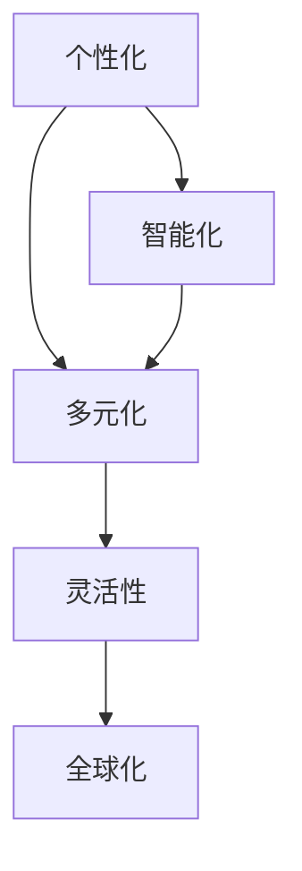

#### 7.1.2 意义建构教育面临的挑战

尽管意义建构教育具有巨大的潜力，但在实际应用中仍然面临一些挑战：

1. **技术障碍**：意义建构教育依赖于先进的技术支持，如大数据、人工智能和互联网等，对于一些教育机构和地区来说，技术障碍是一个重大挑战。
2. **教育资源不平衡**：优质的教育资源主要集中在发达地区，发展中国家和地区在教育资源的获取上存在明显的不平衡，这影响了意义建构教育的普及和推广。
3. **教师培训**：意义建构教育要求教师具备较高的教育理念和信息技术能力，但当前许多教师的培训水平有限，难以适应新的教育模式。
4. **教育评价**：传统的教育评价体系难以全面评估意义建构教育的效果，需要建立新的评价体系，以公正、科学地评价学生的学习成果。

以下是一个简化的Mermaid流程图，展示了意义建构教育面临的挑战：

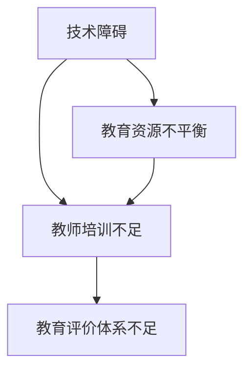

#### 7.1.3 意义建构教育的发展方向

为了克服面临的挑战，意义建构教育需要朝着以下几个方向发展：

1. **技术创新**：加强信息技术研究，提高教育技术的应用水平，为意义建构教育提供强大的技术支持。
2. **教育资源共享**：推动全球教育资源共享，利用互联网和云技术，打破教育资源的地域限制，让更多学生享受到优质教育资源。
3. **教师专业发展**：加大对教师的培训力度，提高他们的教育理念和信息技术能力，培养适应意义建构教育的教师队伍。
4. **教育评价改革**：建立新的教育评价体系，全面评估学生的学习成果，注重过程评价和结果评价的结合，推动教育的持续改进。

以下是一个简化的Mermaid流程图，展示了意义建构教育的发展方向：

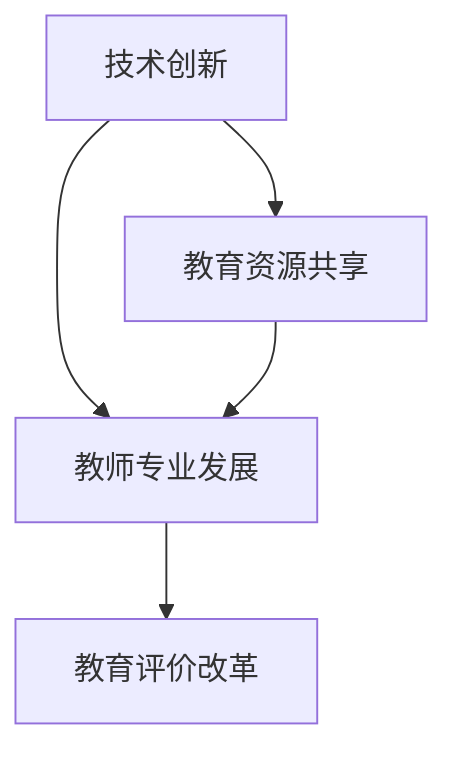

**小结**：

意义建构教育作为未来教育的重要方向，具有巨大的发展潜力。尽管面临技术障碍、教育资源不平衡、教师培训和评价体系不足等挑战，但通过技术创新、教育资源共享、教师专业发展和评价改革，意义建构教育将在未来教育中发挥重要作用，推动教育的全面改革和进步。

**注意事项**：

1. **重视技术支持**：教育机构和政府应加大对教育技术的投入，提高教育技术的应用水平，为意义建构教育提供强有力的支持。
2. **促进资源均衡**：通过政策支持和资源整合，推动优质教育资源的均衡分配，缩小教育差距，实现教育公平。
3. **加强教师培训**：教师是实施意义建构教育的重要力量，应加强对教师的培训，提高他们的教育理念和信息技术能力。
4. **完善评价体系**：建立科学、公正的教育评价体系，全面评估学生的学习成果，推动教育的持续改进。

**拓展阅读**：

1. Siemens, G. (2014). Connectivism: A Learning Theory for the Digital Age. International Journal of Educational Technology in Higher Education, 11(3), 25-34.
2. Dillenbourg, P., & Jermann, P. (2007). Understanding and design of interaction in CSCL: A research and pedagogical agenda. Educational Psychology Review, 19(3), 277-297.
3. Means, B., Toyama, Y., Murphy, R., Bakia, M., & Jones, K. (2010). Evaluation of Evidence-Based Practices in Online Learning: A Meta-Analysis and Review of Online Learning Studies. US Department of Education.

在接下来的章节中，我们将探讨教育改革的路径与策略，以及教育技术在未来教育中的应用前景。## 第7章 未来教育展望

### 7.2 教育改革的路径与策略

在未来的教育发展中，教育改革是推动教育质量提升、培养适应社会需求人才的关键环节。以下将探讨教育改革的路径与策略，分析如何通过改革实现教育的现代化和个性化发展。

#### 7.2.1 教育体制的改革

教育体制的改革是教育改革的核心，需要从以下几个方面进行：

1. **教育理念更新**：教育部门应积极倡导以学生为中心的教育理念，强调学生的全面发展，注重培养学生的自主学习能力和创新能力。
2. **课程体系重构**：根据社会发展需求和学生发展需求，重新设计课程体系，增加实践性课程和跨学科课程，减少过于强调知识传授的课程。
3. **考试制度改革**：改革现有的考试制度，注重过程评价和综合评价，减少应试教育的倾向，提高教育评价的科学性和公正性。

#### 7.2.2 教师角色的转变

教师是教育改革的重要实施者，教师角色的转变是实现教育改革的关键：

1. **专业发展**：加大对教师的培训力度，提高他们的教育理念和教学技能，特别是信息技术的应用能力。
2. **教学创新**：鼓励教师进行教学创新，采用探究式学习、情境教学等新型教学方法，提高教学效果。
3. **合作交流**：促进教师之间的合作交流，共享教学资源和经验，提高整体教学水平。

#### 7.2.3 学生学习方式的变革

学生的学习方式的变革是教育改革的重要目标，需要从以下几个方面进行：

1. **自主学习**：培养学生自主学习的能力，鼓励他们根据自己的兴趣和需求进行学习，提高学习动力和效率。
2. **合作学习**：通过小组合作和团队项目，培养学生的合作精神和团队意识，提高解决问题的能力。
3. **实践体验**：增加学生的实践体验，通过实习、实验和社会实践等活动，提高学生的实际操作能力和创新思维。

#### 7.2.4 教育资源均衡配置

教育资源的均衡配置是保障教育公平的重要措施，需要从以下几个方面进行：

1. **政策支持**：政府应加大对农村和偏远地区教育的支持力度，提供充足的财政投入和优质的教育资源。
2. **资源共享**：通过互联网和信息技术，实现教育资源的共享，打破教育资源的地域限制，提高教育资源的利用效率。
3. **教师流动**：鼓励优秀教师到农村和偏远地区支教，提高当地的教育质量。

#### 7.2.5 家庭和社会的参与

家庭和社会的参与是教育改革的重要补充，需要从以下几个方面进行：

1. **家长教育**：加强对家长的教育，提高他们的教育理念和教育方法，支持家庭教育和学校教育的融合。
2. **社会资源利用**：充分利用社会资源，如企业、社会组织等，为学生提供更多的学习机会和实践体验。
3. **社区教育**：发展社区教育，为社区居民提供终身学习的机会，提高社区的文化素质和整体教育水平。

**小结**：

教育改革是推动教育现代化和个性化发展的重要途径。通过教育体制的改革、教师角色的转变、学生学习方式的变革、教育资源均衡配置和家庭和社会的参与，可以构建一个更加公正、高效和富有活力的教育体系，培养出适应未来社会需求的高素质人才。

**注意事项**：

1. **政策制定**：政府在制定教育政策时，应充分考虑教育发展的实际情况和社会需求，确保政策的科学性和可行性。
2. **实施策略**：教育改革需要制定详细的实施策略和计划，分阶段、分步骤推进，确保改革的有效实施。
3. **评估反馈**：建立教育改革的评估和反馈机制，定期对改革效果进行评估，及时调整和改进改革方案，确保教育改革的持续推进。

**拓展阅读**：

1. 胡晓蓉. (2019). 新时代教育改革的理论与实践. 教育研究, (5), 39-45.
2. 刘云杉. (2018). 教育体制改革与未来教育发展. 教育发展研究, (6), 34-39.
3. 王泽彩. (2017). 当前我国教育改革的发展趋势与路径选择. 教育科学研究, (4), 46-51.

在接下来的章节中，我们将探讨教育技术在未来教育中的应用前景，分析人工智能、大数据和虚拟现实等技术在教育领域的应用及其影响。## 第7章 未来教育展望

### 7.3 教育技术在未来教育中的应用前景

随着人工智能、大数据、虚拟现实等新兴技术的不断发展，教育技术正经历着前所未有的变革。这些技术不仅极大地丰富了教育资源的类型和获取方式，还显著提升了教学效率和学生的学习体验。以下将探讨教育技术在未来教育中的应用前景，分析人工智能、大数据和虚拟现实等技术的具体应用及其对教育的影响。

#### 7.3.1 人工智能与教育的融合

人工智能（AI）在教育领域的应用正逐渐深入，为个性化教学和智能化学习提供了强大的支持。

1. **个性化学习**：人工智能可以通过分析学生的学习数据，如学习进度、成绩和兴趣等，为每个学生提供个性化的学习路径和推荐资源，从而满足不同学生的学习需求。
2. **智能辅导**：AI智能辅导系统可以根据学生的学习情况，自动生成个性化的练习题和教学视频，为学生提供实时的学习和辅导。
3. **自动评分**：人工智能可以自动批改学生的作业和考试，减轻教师的工作负担，提高教学效率。

以下是一个简化的Mermaid流程图，展示了人工智能在个性化学习和智能辅导中的应用：

```mermaid
graph TD
A[学习数据分析] --> B[个性化学习路径推荐]
A --> C[智能辅导系统]
B --> C
C --> D[自动评分]
```

#### 7.3.2 大数据在教育中的应用

大数据技术在教育领域的应用，使得教育数据的收集、分析和应用变得更加便捷和高效。

1. **学习分析**：通过大数据技术，可以对学生的学习行为、学习效果等进行深入分析，为教师提供教学决策的支持。
2. **教育评估**：大数据可以帮助教育机构进行更加科学和全面的教育评估，包括课程评估、教师评估和学生评估等。
3. **教育资源优化**：通过大数据分析，教育机构可以优化教育资源的配置，提高教育资源的利用效率。

以下是一个简化的Mermaid流程图，展示了大数据在学习分析和教育评估中的应用：

```mermaid
graph TD
A[学习数据分析] --> B[教育评估]
A --> C[教育资源优化]
B --> C
```

#### 7.3.3 虚拟现实（VR）与教育的融合

虚拟现实技术为教育提供了全新的教学环境和学习体验，特别是在实践性课程和情境教学中具有显著优势。

1. **沉浸式学习**：通过VR技术，学生可以身临其境地体验历史事件、科学实验和职业场景等，提高学习的趣味性和参与度。
2. **实践操作**：VR技术可以模拟真实的操作环境，学生可以在虚拟环境中进行实践操作，提高实践能力和安全意识。
3. **跨学科教学**：VR技术可以打破传统学科界限，实现跨学科教学，促进学生综合素养的提升。

以下是一个简化的Mermaid流程图，展示了VR技术在沉浸式学习和实践操作中的应用：

```mermaid
graph TD
A[沉浸式学习] --> B[实践操作]
A --> C[跨学科教学]
B --> C
```

#### 7.3.4 教育技术对教育的影响

教育技术的应用不仅改变了教育的形式和内容，还对教育的各个方面产生了深远的影响：

1. **教学质量提升**：教育技术提供了丰富的教学资源和多样化的教学手段，教师可以更有效地进行教学，学生可以更高效地学习，整体教学质量得到提升。
2. **教育公平性**：教育技术使得优质教育资源得以更广泛地传播和共享，有助于缩小教育差距，提高教育公平性。
3. **教育创新**：教育技术推动了教育模式的创新，如在线教育、混合式学习和个性化学习等，为教育的未来发展提供了新的思路和方向。
4. **教育管理优化**：教育技术为教育管理提供了数据支持和决策依据，有助于提高教育管理的效率和科学性。

**小结**：

教育技术的应用前景广阔，人工智能、大数据和虚拟现实等新兴技术正在深刻改变教育的面貌。通过个性化学习、智能辅导、学习分析、教育资源优化、沉浸式学习和实践操作等应用，教育技术为提高教学质量、实现教育公平、推动教育创新和管理优化提供了有力支持。未来，随着教育技术的不断发展和普及，教育将迈向更加智能化、个性化和全球化的新时代。

**注意事项**：

1. **技术整合**：教育机构应整合多种教育技术，发挥各自的优势，实现互补和协同，提高教育效果。
2. **教师培训**：教师应不断学习新技术，提高自己的信息技术能力，以适应教育技术变革的需求。
3. **政策支持**：政府应出台相关政策和措施，支持教育技术的发展和应用，为教育技术的推广提供保障。

**拓展阅读**：

1. Siemens, G. (2014). Connectivism: A Learning Theory for the Digital Age. International Journal of Educational Technology in Higher Education, 11(3), 25-34.
2. Arfeen, S., & Agustin, R. (2019). The impact of technology on education. International Journal of Advanced Research, 7(10), 80-89.
3. Means, B., Toyama, Y., Murphy, R., Bakia, M., & Jones, K. (2010). Evaluation of Evidence-Based Practices in Online Learning: A Meta-Analysis and Review of Online Learning Studies. US Department of Education.

