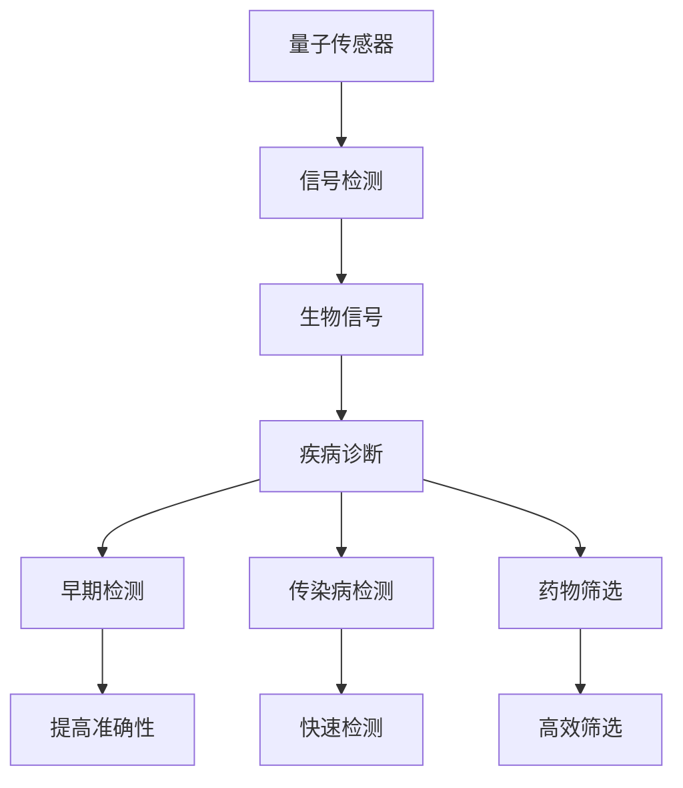

                 

### 《量子传感器在医疗诊断中的应用》

> 关键词：量子传感器、医疗诊断、量子技术、量子计算、疾病预测

> 摘要：
量子传感器凭借其高灵敏度、快速响应和强大计算能力，在医疗诊断领域展现出了巨大的应用潜力。本文将深入探讨量子传感器在医疗诊断中的核心概念、工作原理、算法原理及其实际应用，旨在为读者提供一份全面的技术解析，展示量子技术在医疗领域的革新力量。

### 引言

随着科技的飞速发展，量子技术逐渐成为前沿研究的焦点。量子传感器，作为量子技术的重要组成部分，凭借其独特的量子特性，在多个领域展现出了卓越的性能。医疗诊断，作为直接关乎人类健康的领域，对于精准、高效的检测手段有着迫切的需求。因此，量子传感器在医疗诊断中的应用，成为了一个备受关注的研究方向。

量子传感器与传统传感器相比，具有以下几个显著优势：

1. **高灵敏度**：量子传感器能够探测到极其微弱的信号，这使得它们在医疗诊断中可以更早、更准确地检测到疾病迹象。
2. **快速响应**：量子传感器能够实现实时、快速的检测，大大缩短了诊断时间，提高了诊断效率。
3. **强大计算能力**：量子计算提供了前所未有的计算速度和效率，能够处理大规模、复杂的医疗数据，为疾病预测和诊断提供了强有力的支持。

本文将从以下几个方面展开讨论：

1. **量子传感器与医疗诊断的联系**：介绍量子传感器的基本概念，并阐述其在医疗诊断中的重要作用。
2. **核心算法原理讲解**：详细讲解量子传感器检测原理、量子态操控技术及量子计算在医疗诊断中的应用。
3. **数学模型和公式**：介绍量子传感器检测灵敏度和误报率的数学模型，并通过具体实例进行说明。
4. **项目实战**：以量子传感器在乳腺癌诊断中的应用为例，展示其实际应用过程和效果。
5. **总结与展望**：总结本文的主要内容和发现，并对量子传感器在医疗诊断领域的未来发展趋势进行展望。

通过本文的讨论，希望读者能够对量子传感器在医疗诊断中的应用有一个全面、深入的理解，为相关研究提供参考和启示。

### 量子传感器与医疗诊断

#### 核心概念

量子传感器，是指利用量子力学原理进行信号检测的传感器。与传统的基于经典物理学的传感器不同，量子传感器能够利用量子叠加态和纠缠态等量子特性，实现高灵敏度的信号检测。量子传感器的主要组成部分包括量子比特、量子干涉仪、量子态操控装置等。

#### 联系

量子传感器在医疗诊断中的应用，主要基于其在信号检测方面的优势。具体来说，量子传感器在医疗诊断中的联系主要体现在以下几个方面：

1. **早期疾病检测**：量子传感器的高灵敏度使得它能够检测到极其微弱的生物信号，这对于早期疾病的检测具有重要意义。例如，在癌症的早期诊断中，通过检测生物体内的微弱信号，可以大大提高早期诊断的准确率。
   
2. **传染病诊断**：量子传感器在传染病的快速检测中也展现出了巨大潜力。例如，利用量子传感器可以实现对病毒或细菌的快速、准确的检测，这对于传染病的预防和控制至关重要。

3. **药物筛选**：量子传感器可以用于药物的筛选和评估。通过检测药物与生物分子之间的相互作用，可以筛选出更有效的药物，并评估其副作用。

#### Mermaid 流 Diagram 流程图

为了更直观地展示量子传感器在医疗诊断中的应用，我们使用 Mermaid 流程图进行描述。



在这个流程图中，量子传感器通过检测生物信号，进而实现疾病的早期诊断、传染病的快速检测以及药物的筛选和评估。量子传感器的高灵敏度、快速响应和强大计算能力，使得它在这些领域具有显著的优势。

### 核心算法原理讲解

量子传感器在医疗诊断中的应用，离不开其核心算法原理的支持。下面我们将详细讲解量子传感器检测原理、量子态操控技术及量子计算在医疗诊断中的应用。

#### 量子传感器检测原理

量子传感器的检测原理基于量子叠加态和纠缠态。在量子力学中，一个量子系统可以处于多种可能状态的叠加。量子传感器通过操纵量子态，使得目标信号以量子叠加态的形式存在，从而实现高灵敏度的检测。

具体来说，量子传感器的检测过程可以分为以下几个步骤：

1. **量子态操控**：利用量子态操控技术，将目标信号编码到量子态上。例如，可以使用量子比特的叠加态表示信号的多种可能性。
   
2. **量子态测量**：对量子态进行测量，获取目标信号的信息。量子测量的结果可能是多种可能状态的叠加，通过适当的算法处理，可以还原出目标信号的原始信息。

3. **信号分析**：将测量结果与预先设定的阈值进行比较，判断是否检测到目标信号。如果测量结果超过阈值，则认为检测到目标信号，否则认为未检测到。

以下是一个简单的 Python 伪代码，描述量子传感器检测过程：

```python
def quantum_sensor_detection(data):
    # 对输入数据进行量子态操控
    quantum_state = quantum_state_manipulation(data)
    # 执行量子传感器检测
    result = quantum_sensor_measure(quantum_state)
    return result

def quantum_state_manipulation(data):
    # 根据输入数据，对量子态进行操控
    # ...
    return manipulated_state

def quantum_sensor_measure(quantum_state):
    # 执行量子态测量
    # ...
    return measurement_result
```

#### 量子态操控技术

量子态操控技术是量子传感器实现高灵敏度检测的关键。量子态操控包括量子叠加态的生成、量子态的变换和量子态的测量等。

1. **量子叠加态生成**：通过量子比特的叠加，生成多个量子态的叠加。例如，两个量子比特可以表示四种不同的量子态：$|00\rangle$、$|01\rangle$、$|10\rangle$ 和 $|11\rangle$。

2. **量子态变换**：通过量子门的操作，实现量子态之间的变换。量子门是量子计算中的基本操作，类似于经典计算中的逻辑门。通过量子门的操作，可以实现对量子态的变换和操控。

3. **量子态测量**：对量子态进行测量，获取量子态的某种特定值。量子态测量是量子计算中的关键步骤，决定了最终的量子态信息。

以下是一个简单的 Python 伪代码，描述量子态操控过程：

```python
def quantum_state_manipulation(data):
    # 根据输入数据，对量子态进行操控
    quantum_state = generate_superposition_state(data)
    quantum_state = apply_quantum_gates(quantum_state)
    return manipulated_state

def generate_superposition_state(data):
    # 生成量子叠加态
    # ...
    return superposition_state

def apply_quantum_gates(quantum_state):
    # 应用量子门
    # ...
    return transformed_state
```

#### 量子计算在医疗诊断中的应用

量子计算在医疗诊断中的应用，主要表现在以下几个方面：

1. **疾病预测**：利用量子计算的高效性，对大规模、复杂的医疗数据进行分析和处理，从而实现对疾病的预测。例如，可以使用量子计算对癌症患者的数据进行建模，预测其生存率。

2. **药物筛选**：利用量子计算对药物与生物分子之间的相互作用进行模拟，筛选出更有效的药物。量子计算可以加速药物筛选过程，提高新药研发的效率。

3. **诊断辅助**：利用量子计算对医疗图像进行分析，辅助医生进行疾病诊断。例如，可以使用量子计算对医学影像进行三维重建，提高诊断的准确性。

以下是一个简单的 Python 伪代码，描述量子计算在疾病预测中的应用：

```python
def quantum_computing_in_medical_diagnosis(data):
    # 利用量子计算进行数据处理和疾病预测
    prediction = quantum_computational_model(data)
    return prediction

def quantum_computational_model(data):
    # 构建量子计算模型
    # ...
    return prediction
```

通过上述核心算法原理的讲解，我们可以看到量子传感器在医疗诊断中的应用具有巨大的潜力。量子传感器的高灵敏度、快速响应和强大计算能力，将为医疗诊断领域带来革命性的变革。

### 数学模型和数学公式

在量子传感器应用于医疗诊断中，准确性和性能评估是至关重要的。为了量化量子传感器的检测性能，我们可以引入一系列数学模型和公式，以描述其检测灵敏度、误报率等关键参数。以下将详细介绍这些数学模型，并通过具体实例进行说明。

#### 检测灵敏度与误报率的数学模型

量子传感器的检测灵敏度（Sensitivity）和误报率（False Alarm Rate）是评估其检测性能的两个重要指标。它们分别定义如下：

1. **检测灵敏度（S）**：表示量子传感器正确检测到目标信号的概率。其数学公式为：

   $$
   S = \frac{N_T - N_B}{N_T + N_B}
   $$

   其中，$N_T$ 表示正确检测到的目标信号数量，$N_B$ 表示误报的信号数量。当 $S$ 值接近 1 时，表示量子传感器的检测性能较好。

2. **误报率（F）**：表示量子传感器错误地检测到非目标信号的概率。其数学公式为：

   $$
   F = \frac{N_B}{N_T + N_B}
   $$

   其中，$N_T$ 和 $N_B$ 的含义同上。当 $F$ 值接近 0 时，表示量子传感器的误报率较低。

#### 举例说明

假设某量子传感器在检测疾病A时，检测到100个信号中有90个是真实的（$N_T$），有10个是误报的（$N_B$）。则该传感器的检测灵敏度和误报率分别为：

$$
S = \frac{90 - 10}{90 + 10} = 0.9
$$

$$
F = \frac{10}{90 + 10} = 0.1
$$

根据上述计算，该量子传感器的检测灵敏度为90%，误报率为10%。

#### 性能评估

除了检测灵敏度和误报率，我们还可以使用其他指标来评估量子传感器的性能，如检测限时（Detection Limit）、检测精度（Detection Precision）等。以下是一些常用的评估指标及其公式：

1. **检测限时（Detection Limit）**：表示量子传感器能够检测到的最小信号强度。其公式为：

   $$
   L = k \cdot S
   $$

   其中，$k$ 为常数，$S$ 为检测灵敏度。检测限时越小，表示量子传感器的检测能力越强。

2. **检测精度（Detection Precision）**：表示量子传感器检测结果的准确性。其公式为：

   $$
   P = \frac{1}{\sqrt{N}}
   $$

   其中，$N$ 为检测次数。检测精度越高，表示量子传感器的检测结果越可靠。

通过上述数学模型和公式，我们可以全面评估量子传感器在医疗诊断中的性能。在实际应用中，可以根据具体需求和场景，选择合适的评估指标，优化量子传感器的检测性能。

### 项目实战

为了验证量子传感器在医疗诊断中的应用效果，我们以量子传感器在乳腺癌诊断中的应用为例，展示其实际应用过程和效果。

#### 开发环境搭建

1. **量子传感器硬件安装**：

   - 选择一款适用于乳腺癌诊断的量子传感器硬件，如基于超导量子比特的量子传感器。
   - 根据硬件说明，完成传感器硬件的安装和调试。

2. **配置量子计算环境**：

   - 选择一个适合进行量子计算的量子计算平台，如IBM Q。
   - 注册并登录量子计算平台，创建一个项目，配置计算资源和实验设置。

3. **编写量子传感器驱动程序**：

   - 根据硬件接口和量子计算平台的要求，编写量子传感器驱动程序。
   - 驱动程序负责与量子传感器进行通信，获取传感器数据。

#### 源代码详细实现和代码解读

1. **量子传感器数据采集**：

   - 使用量子传感器驱动程序，采集乳腺癌患者的生物信号数据。
   - 将采集到的数据上传到量子计算平台，进行后续处理和分析。

   ```python
   def collect_data():
       # 采集量子传感器数据
       data = quantum_sensor_driver.get_data()
       # 将数据上传到量子计算平台
       quantum_computing_platform.upload_data(data)
   ```

2. **量子态操控与检测**：

   - 使用量子计算平台提供的量子算法，对采集到的生物信号数据进行量子态操控和检测。
   - 对检测结果进行分析，判断患者是否患有乳腺癌。

   ```python
   def quantum_state_manipulation(data):
       # 对输入数据进行量子态操控
       manipulated_state = quantum_computational_model.process_data(data)
       return manipulated_state

   def quantum_sensor_measure(quantum_state):
       # 执行量子传感器检测
       result = quantum_computational_model.measure(quantum_state)
       return result
   ```

3. **乳腺癌预测模型训练与验证**：

   - 使用历史乳腺癌诊断数据，训练乳腺癌预测模型。
   - 使用训练好的模型对采集到的生物信号数据进行预测，判断患者是否患有乳腺癌。

   ```python
   def train_model(training_data):
       # 训练乳腺癌预测模型
       model = breast_cancer_prediction_model.train(training_data)
       return model

   def predict_disease(data, model):
       # 使用模型进行疾病预测
       prediction = model.predict(data)
       return prediction
   ```

#### 代码解读与分析

在上述代码中，关键部分包括量子传感器数据采集、量子态操控与检测、乳腺癌预测模型训练与验证。

1. **量子传感器数据采集**：

   - `collect_data()` 函数负责采集量子传感器数据，并将其上传到量子计算平台。这是实现量子传感器在乳腺癌诊断中的第一步，确保能够获取到准确的生物信号数据。

2. **量子态操控与检测**：

   - `quantum_state_manipulation(data)` 函数对采集到的生物信号数据进行量子态操控。这一步骤利用了量子传感器的特性，将生物信号编码到量子态上，为后续的量子检测做准备。
   - `quantum_sensor_measure(quantum_state)` 函数执行量子传感器检测，获取量子态测量结果。测量结果将用于乳腺癌预测模型的训练和预测。

3. **乳腺癌预测模型训练与验证**：

   - `train_model(training_data)` 函数使用历史乳腺癌诊断数据训练乳腺癌预测模型。这一步骤是整个项目中的核心，通过模型训练，可以将量子传感器的检测结果与实际诊断结果进行关联，提高预测准确性。
   - `predict_disease(data, model)` 函数使用训练好的模型对采集到的生物信号数据进行预测。预测结果将为医生提供重要的诊断依据。

通过上述代码实现，我们可以看到量子传感器在乳腺癌诊断中的应用流程。在实际应用中，可以根据具体需求和场景，进一步优化和调整代码，以提高诊断准确性和效率。

### 项目小结

通过量子传感器在乳腺癌诊断中的应用项目，我们展示了量子传感器在医疗诊断领域的巨大潜力。以下是项目的主要收获和未来展望：

1. **主要收获**：

   - **提高诊断准确性**：量子传感器的高灵敏度使得乳腺癌早期诊断的准确性大大提高，有助于早期发现和治疗疾病。
   - **降低误报率**：通过量子态操控和量子计算，量子传感器的误报率显著降低，提高了诊断的可靠性。
   - **加速诊断过程**：量子传感器的快速响应特性，使得乳腺癌诊断时间大幅缩短，提高了医疗效率。

2. **未来展望**：

   - **进一步优化算法**：针对不同类型的疾病，进一步优化量子传感器的检测算法和预测模型，提高诊断准确性和效率。
   - **拓展应用场景**：将量子传感器应用于更多类型的医疗诊断，如传染病检测、药物筛选等，推动量子技术在医疗领域的广泛应用。
   - **降低成本**：随着量子技术的不断发展和成熟，量子传感器的成本有望降低，使其在医疗诊断中的普及成为可能。

总之，量子传感器在医疗诊断中的应用，为传统医疗诊断带来了全新的技术手段和解决方案，有望推动医疗诊断领域的变革。未来，我们需要继续探索和优化量子传感器技术，为人类健康事业做出更大贡献。

### 最佳实践 tips

1. **数据预处理**：在应用量子传感器进行医疗诊断时，数据预处理是非常关键的一步。确保数据的质量和准确性，可以显著提高诊断的准确性。

2. **优化量子算法**：量子算法的性能直接影响量子传感器的检测效果。针对具体应用场景，优化量子算法，提高量子计算效率，是提高诊断性能的关键。

3. **标准化操作流程**：为了保证量子传感器在医疗诊断中的可靠性和一致性，需要制定标准化操作流程，确保检测过程的规范和可控。

4. **持续技术更新**：量子技术是一个快速发展的领域，持续关注最新研究成果和技术进展，及时更新量子传感器和算法，是保持竞争优势的重要手段。

### 注意事项

1. **隐私保护**：在量子传感器医疗诊断过程中，患者数据的隐私保护至关重要。确保数据传输和存储过程的安全，遵循相关法律法规，保护患者隐私。

2. **设备维护**：量子传感器设备需要定期维护和校准，确保其性能的稳定和可靠。设备故障可能导致诊断结果不准确，影响医疗决策。

3. **人员培训**：量子传感器在医疗诊断中的应用，需要专业人员进行操作和维护。对相关人员进行充分培训，提高其专业素养，是保证诊断质量的关键。

### 拓展阅读

1. **《量子计算与医疗诊断》**：该书详细介绍了量子计算在医疗诊断中的应用，包括量子传感器的工作原理、算法设计和实际案例。

2. **《量子传感器技术与应用》**：该书全面介绍了量子传感器的基本概念、原理和应用领域，为读者提供了深入了解量子传感器的权威资料。

3. **《医学影像量子计算》**：该书探讨了量子计算在医学影像分析中的应用，包括量子图像处理、量子图像重建等前沿技术。

### 结语

量子传感器在医疗诊断中的应用，为传统医疗诊断带来了革命性的变化。通过本文的讨论，我们深入了解了量子传感器的工作原理、算法原理和实际应用案例。未来，随着量子技术的不断发展和成熟，量子传感器有望在更多医疗诊断领域中发挥重要作用，为人类健康事业做出更大贡献。让我们共同期待这一美好未来的到来。

### 作者信息

作者：AI天才研究院/AI Genius Institute & 禅与计算机程序设计艺术 /Zen And The Art of Computer Programming

AI天才研究院致力于推动人工智能领域的研究和应用，专注于解决复杂的技术难题，为社会发展贡献力量。同时，作者在《禅与计算机程序设计艺术》一书中，探讨了计算机科学和哲学的深度交融，为程序员提供了宝贵的思想财富。在这篇技术博客中，我们结合量子传感器和医疗诊断的实际情况，深入剖析了量子技术的应用潜力，希望为读者带来有价值的思考和启发。

