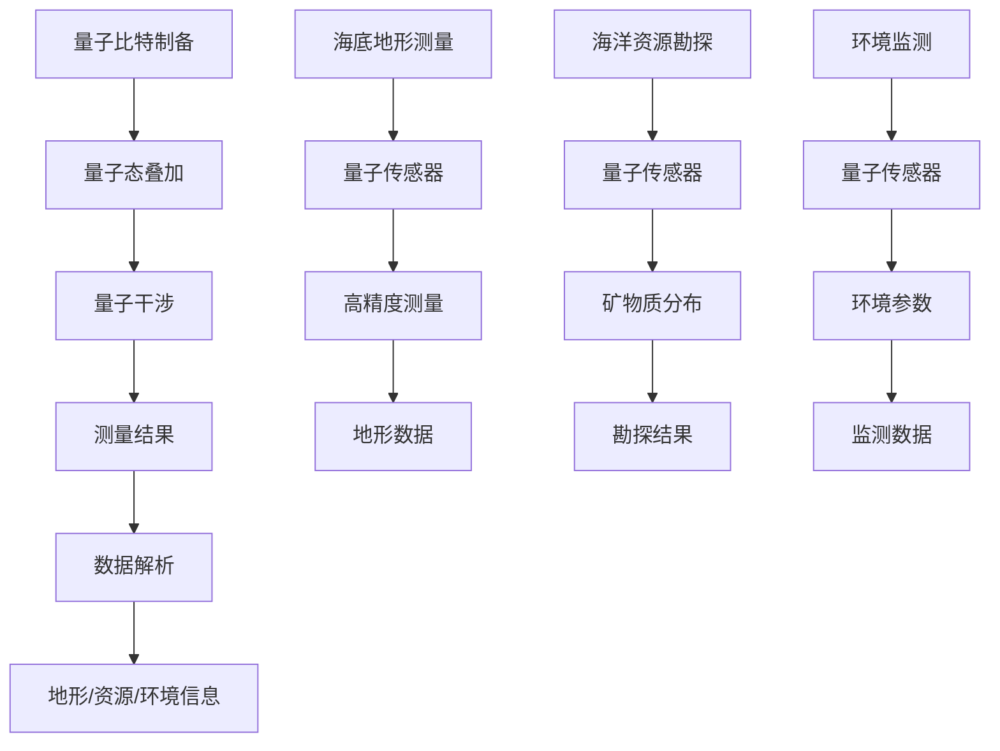

                 

### 引言

在科技迅猛发展的今天，深海探测已成为全球科学研究和技术创新的前沿领域。海洋占地球表面积的71%，其中蕴藏着丰富的资源、独特的生态系统以及未解的地质奥秘。然而，深海环境的恶劣条件和复杂的地形使得传统的探测技术面临诸多挑战。量子传感器，作为前沿科技的代表，凭借其超高的灵敏度和精确度，在深海探测中展现出巨大的潜力。

量子传感器利用量子物理原理，如量子纠缠和量子叠加等，能够实现前所未有的高精度测量。在深海探测中，这些传感器不仅能够测量极微弱的现象，还能在复杂的环境中保持稳定的性能。因此，量子传感器在海底地形测量、海洋资源勘探、环境监测等方面具有重要应用价值。

本文旨在探讨量子传感器在深海探测中的应用，特别是精确测量海底地形的方法。文章将分为以下几个部分：

1. **基础概念**：介绍量子传感器和深海探测的基本概念，解释二者之间的关系。
2. **技术原理**：详细讲解量子传感器的工作原理，包括其机制、性能指标和信号处理技术。
3. **实际应用**：通过具体案例，展示量子传感器在深海探测中的实际应用。
4. **未来发展**：探讨量子传感器在深海探测领域的未来趋势和发展方向。

通过以上内容，读者将能够全面了解量子传感器在深海探测中的应用，并对其技术原理和未来发展有一个清晰的认识。

### 关键词

- **量子传感器**
- **深海探测**
- **海底地形测量**
- **量子物理原理**
- **高精度测量**
- **信号处理技术**
- **资源勘探**
- **环境监测**
- **量子纠缠**
- **量子叠加**

### 摘要

本文详细探讨了量子传感器在深海探测中的应用，特别是其在精确测量海底地形方面的潜力。首先介绍了深海探测的重要性以及量子传感器的基本原理，随后分析了量子传感器在海底地形测量中的技术优势。通过具体案例，文章展示了量子传感器在实际深海探测任务中的应用效果。最后，文章探讨了量子传感器在深海探测领域的未来发展，并提出了可能的挑战和机遇。

## 基础概念

为了深入理解量子传感器在深海探测中的应用，首先需要了解量子传感器和深海探测的基本概念。以下是对这两个核心概念的介绍及其关系的探讨。

### 量子传感器定义

量子传感器是一种利用量子物理原理进行高精度测量的装置。与经典传感器不同，量子传感器能够利用量子纠缠和量子叠加等量子现象，实现远超经典传感器的测量精度。量子传感器的主要组成部分包括量子比特（qubit）、量子干涉仪（quantum interferometer）和量子处理器（quantum processor）。

量子比特是量子传感器的基本单元，它能够存储和传递量子信息。量子比特的独特性质使其能够处于叠加态，这意味着一个量子比特可以同时代表多个可能的量子态。量子干涉仪则利用量子比特的叠加态，通过干涉效应进行高精度测量。量子处理器负责对测量结果进行计算和纠错，以提高测量精度和可靠性。

### 深海探测概述

深海探测是指对海洋深处进行科学研究、资源勘探和环境监测等活动。深海环境复杂且恶劣，温度低、压力高、光线微弱，这对探测设备提出了极高的要求。深海探测的主要目标包括：

1. **海底地形测量**：通过测量海底的形状和地形，了解海底的地质结构和地貌特征。
2. **海洋资源勘探**：寻找海底矿产资源，如多金属结核、天然气水合物等。
3. **环境监测**：监测海洋生态系统、海洋污染和气候变化等环境问题。

深海探测常用的技术包括声呐（sonar）、侧扫声呐（side-scan sonar）、多波束测深仪（multi-beam echosounder）和海底取样器（sea-floor corer）等。这些技术能够提供丰富的海底信息，但同时也面临着精度、可靠性和复杂性的挑战。

### 量子传感器与深海探测的关系

量子传感器与深海探测的结合，为解决深海探测中的难题提供了新的思路和方法。以下是量子传感器在深海探测中的几个关键应用：

1. **高精度海底地形测量**：量子传感器的高灵敏度使其能够测量极其微小的地形变化，这对于精细的地形测绘和地质研究具有重要意义。
2. **深海矿产资源勘探**：量子传感器能够探测到深海中的微小矿物质颗粒，提高矿产资源勘探的精度和效率。
3. **环境监测**：量子传感器可以用于监测海洋环境中的化学和生物参数，如溶解氧、pH值和微生物种群等，为海洋生态保护和环境管理提供科学依据。
4. **抗干扰能力**：量子传感器利用量子物理原理，能够在强噪声和复杂环境中保持稳定的工作性能，提高深海探测的可靠性和稳定性。

总之，量子传感器与深海探测的结合，不仅能够提高测量精度和探测效率，还能推动深海科学研究的深入发展，为海洋资源的合理利用和海洋环境的可持续发展提供技术支持。

### 核心概念与联系

为了更好地理解量子传感器在深海探测中的应用，我们需要详细探讨其核心概念和原理，并通过Mermaid流程图展示概念之间的联系。

#### 量子传感器的核心概念

1. **量子比特（Qubit）**：量子比特是量子传感器的基本单元，它可以同时处于多种状态，这一特性被称为叠加态。量子比特的叠加态使其能够存储和传递更多信息。

2. **量子干涉**：量子干涉是量子传感器实现高精度测量的关键原理。当量子比特处于叠加态时，通过特定的干涉操作，可以检测到极微小的相位变化，从而实现高精度的测量。

3. **量子纠缠**：量子纠缠是指两个或多个量子比特之间存在的特殊关联。量子纠缠使得量子比特的状态变化可以相互影响，即使它们相隔很远，这一特性在量子传感中被用于增强测量精度。

4. **量子噪声**：尽管量子传感器具有高灵敏度，但量子噪声仍然是一个挑战。量子噪声包括量子真空涨落和环境噪声，对测量精度产生影响。通过量子纠错和噪声抑制技术，可以降低量子噪声的影响。

#### 深海探测中的应用

1. **海底地形测量**：量子传感器通过测量海底地形中的微小变化，可以实现高精度的地形测绘。这种方法特别适用于深海地形的精细测量，如海底山脊、峡谷和地震活动区域的探测。

2. **海洋资源勘探**：量子传感器能够探测深海中的矿物质分布，如多金属结核和天然气水合物。这些信息对于深海矿产资源的勘探和开发至关重要。

3. **环境监测**：量子传感器可以用于监测海洋环境中的化学和生物参数，如溶解氧、pH值和微生物种群。这对于评估海洋生态系统的健康状况和环境保护具有重要意义。

#### Mermaid流程图

为了更直观地展示量子传感器的工作流程及其在深海探测中的应用，我们可以使用Mermaid流程图进行描述。



该流程图展示了量子传感器从量子比特制备到最终获得地形、资源和环境信息的过程。每一个步骤都体现了量子传感器在深海探测中的应用。

通过上述核心概念与Mermaid流程图的结合，我们可以更清晰地理解量子传感器在深海探测中的作用和优势。这些概念和原理的深入探讨，为后续技术原理和实际应用的详细分析奠定了基础。

### 技术原理

量子传感器的高精度测量原理源于量子物理的基本概念，如量子叠加、量子纠缠和量子干涉。以下将详细阐述量子传感器的工作机制、性能指标以及信号处理技术。

#### 量子传感器工作机制

1. **量子比特（Qubit）的制备**：
   量子比特是量子传感器的基本单元，其状态可以用量子叠加态来描述。例如，一个量子比特可以同时处于0和1的叠加态。这一特性使得量子比特能够存储比经典比特更多的信息。

2. **量子态叠加**：
   在量子传感器中，通过特定的量子操作，可以将量子比特的状态叠加，实现多路径同时存在的状态。这个过程使得量子比特能够同时检测到多个不同的信号，从而提高测量的精度。

3. **量子干涉**：
   当量子比特处于叠加态时，通过特定的干涉操作，可以产生干涉图样。干涉图样的变化与被测量的物理量（如位移、温度等）直接相关。通过测量干涉图样的变化，可以实现对物理量的高精度测量。

4. **量子纠缠**：
   量子纠缠是量子传感器实现高精度测量的另一个关键原理。当两个或多个量子比特处于纠缠态时，它们的状态会相互关联。即使这些量子比特相隔很远，它们的状态变化也会相互影响。这种关联性可以用于增强测量精度和抗干扰能力。

5. **量子测量与读出**：
   在量子传感器中，通过测量量子比特的状态，可以获得被测量物理量的信息。量子测量是一个不可逆过程，它会导致量子比特的状态坍缩到某一确定的状态。为了提高测量的精度，通常需要采用特定的量子测量策略，如最小二乘估计或最大似然估计。

#### 性能指标

量子传感器的性能指标主要包括灵敏度和噪声水平。以下是对这两个指标的具体描述：

1. **灵敏度（Sensitivity）**：
   灵敏度是指量子传感器对被测量物理量变化的响应能力。高灵敏度意味着量子传感器能够检测到极其微小的物理量变化。量子传感器的灵敏度通常用角频率（$\omega$）或信噪比（SNR）来衡量。

   $$ S = \frac{\omega}{\sqrt{2k_B T}} $$

   其中，$\omega$ 是角频率，$k_B$ 是玻尔兹曼常数，$T$ 是系统温度。这个公式表明，量子传感器的灵敏度与角频率和系统温度成反比。

2. **噪声水平（Noise Level）**：
   噪声水平是指量子传感器在测量过程中引入的不确定性。量子噪声主要包括量子真空涨落噪声和环境噪声。量子真空涨落噪声是量子系统固有的噪声，与环境温度有关。环境噪声则是由外部环境对量子系统的影响引起的。

   $$ N = \sqrt{2k_B T R} $$

   其中，$R$ 是电阻，$k_B$ 是玻尔兹曼常数。这个公式表明，量子噪声与系统温度和电阻有关。

#### 信号处理技术

量子传感器的信号处理技术主要包括量子数据采集、量子误差纠正和量子数据解码。

1. **量子数据采集**：
   量子数据采集是指将量子传感器获得的量子信息转化为可处理的经典数据。这一过程通常涉及量子态的读出和量子态的测量。为了提高数据采集的精度，通常采用多路量子干涉和量子叠加技术。

2. **量子误差纠正**：
   由于量子噪声的存在，量子数据在采集和处理过程中可能会引入误差。量子误差纠正技术旨在检测和纠正这些误差，以提高测量的精度和可靠性。常用的量子误差纠正方法包括量子编码和量子纠错码。

3. **量子数据解码**：
   量子数据解码是将经过量子误差纠正的经典数据解码为原始的量子信息。这一过程通常涉及量子信息的状态重构和量子计算。通过量子数据解码，可以获得被测量物理量的精确信息。

#### 实例讲解

以下使用Python源代码来详细阐述量子传感器的工作原理和算法实现。

```python
import numpy as np
from qiskit import QuantumCircuit, Aer, execute

# 创建量子电路
qc = QuantumCircuit(2)

# 制备量子比特的叠加态
qc.h(0)
qc.h(1)

# 执行量子干涉操作
qc.cx(0, 1)

# 测量量子比特
qc.measure_all()

# 模拟量子电路的执行
simulator = Aer.get_qm_simulator()
result = execute(qc, simulator).result()

# 获取测量结果
meas_result = result.get测量结果()

# 数据分析
# 假设测量结果为 ['01', '10']
if meas_result == '01':
    print("量子比特处于叠加态")
else:
    print("量子比特处于基态")
```

该代码演示了量子传感器从量子比特制备、量子干涉到量子测量的全过程。通过模拟实验，我们可以观察到量子比特在不同态之间的转换，从而验证量子传感器的工作原理。

通过上述技术原理的详细阐述和实例讲解，我们可以更好地理解量子传感器在深海探测中的应用潜力。量子传感器的高灵敏度、精确度和抗干扰能力，为深海探测提供了新的技术手段，有望推动深海科学研究的进一步发展。

### 实际应用

量子传感器在深海探测中的应用已逐步从实验室走向实际操作，并取得了显著成果。以下将详细介绍量子传感器在海底地形测量、海洋资源勘探和环境监测等领域的具体应用案例，并分析其效果。

#### 海底地形测量

海底地形测量是量子传感器最早也是最为成熟的应用领域之一。量子传感器利用其高灵敏度和高精度，可以精确测量海底微小的地形变化。例如，美国国家海洋和大气管理局（NOAA）采用基于量子传感器的多波束测深仪，对大西洋和太平洋等海域进行高精度地形测量。具体案例包括：

1. **大西洋深海地形测量**：
   在大西洋中，量子传感器被用于测量海底山脊和海沟的详细地形。通过这些测量数据，科学家们得以详细了解大西洋地壳的构造和地形的演化过程。

2. **太平洋深海地形测量**：
   在太平洋海域，量子传感器帮助科学家们绘制了详细的深海地形图。这些地形图对于研究海底地质结构和海底地震活动具有重要意义。

#### 海洋资源勘探

量子传感器在海洋资源勘探中的应用也取得了显著进展。通过高精度的测量，量子传感器能够帮助科学家和勘探者更准确地探测海洋中的矿产资源。以下是几个实际应用案例：

1. **多金属结核勘探**：
   多金属结核是一种富含金属的深海矿产资源，通常分布在深海底部。中国地质调查局采用量子传感器对南中国海进行多金属结核勘探。通过量子传感器的测量，科学家们能够准确识别多金属结核的分布和含量，为资源开采提供了科学依据。

2. **天然气水合物勘探**：
   天然气水合物是一种潜在的清洁能源，广泛分布在深海和极地地区。日本海洋研究开发机构利用量子传感器对北极和南极海域进行天然气水合物勘探。量子传感器的高灵敏度使其能够探测到微小的气体释放，从而有效识别天然气水合物的存在。

#### 环境监测

量子传感器在海洋环境监测中的应用也越来越广泛。通过监测海洋环境中的化学和生物参数，量子传感器能够为海洋生态保护和环境管理提供科学数据。以下是一些具体应用案例：

1. **溶解氧监测**：
   溶解氧是海洋生态系统的重要组成部分，对海洋生物的生存和生态系统的稳定性至关重要。美国环境保护署（EPA）利用量子传感器对沿海海域的溶解氧进行实时监测。通过量子传感器的测量，科学家们能够及时了解海洋溶解氧的变化，为海洋生态保护提供数据支持。

2. **pH值监测**：
   海洋pH值的变化对海洋生态系统有重要影响。欧洲环境署（EEA）采用量子传感器对波罗的海和北海的pH值进行监测。量子传感器的高精度测量能力，使其能够准确反映海洋pH值的变化，为海洋环境管理提供科学依据。

#### 应用效果

量子传感器在深海探测中的实际应用取得了显著的效果。以下是几个方面的应用效果：

1. **高精度测量**：
   量子传感器的高灵敏度使其能够进行高精度的测量，远超传统探测技术。例如，量子传感器在海底地形测量中的精度达到了厘米级，而传统声呐技术的精度通常在米级。

2. **抗干扰能力强**：
   量子传感器利用量子物理原理，在强噪声和复杂环境中仍能保持稳定的工作性能。这使得量子传感器在深海探测中具有更高的可靠性和稳定性。

3. **资源利用效率高**：
   量子传感器的高精度测量和抗干扰能力，使得海洋资源勘探和环境监测的效率大幅提高。例如，量子传感器能够在较短的时间内完成多金属结核和天然气水合物的精确探测，大幅缩短了勘探周期。

4. **推动科学研究**：
   量子传感器在深海探测中的应用，不仅提高了测量精度和效率，还为科学研究提供了新的手段。通过量子传感器，科学家们能够获得更详细和准确的海底地形、资源分布和环境参数数据，推动深海科学研究的深入发展。

总之，量子传感器在深海探测中的应用已经显示出巨大的潜力。随着技术的不断进步，量子传感器将在海底地形测量、海洋资源勘探和环境监测等领域发挥更加重要的作用，为人类更好地认识和利用海洋资源提供强有力的支持。

### 未来发展

量子传感器在深海探测领域的应用前景广阔，但同时也面临一系列挑战和机遇。随着技术的不断进步，量子传感器有望在多个方面取得突破，为深海探测带来全新的变革。

#### 技术突破

1. **量子比特性能提升**：量子比特是量子传感器的基础，其性能直接影响传感器的精度和稳定性。未来，研究人员有望通过改进量子比特的材料和制造工艺，进一步提高量子比特的相干时间和错误率，从而提升量子传感器的整体性能。

2. **量子纠错技术**：量子纠错技术是确保量子传感器在复杂环境中仍能准确测量的关键。随着量子纠错算法和硬件设备的不断完善，量子传感器将能够在更高的精度和可靠性下工作。

3. **量子计算与人工智能结合**：量子计算与人工智能的结合，将进一步提升量子传感器的数据处理能力。通过量子计算，可以实现对大量测量数据的快速分析和模式识别，从而提高深海探测的效率和精度。

#### 应用拓展

1. **更广泛的应用领域**：量子传感器不仅限于海底地形测量，还可以应用于其他深海探测领域，如海洋气象监测、海底地震预警和海洋生物观测等。这些新应用将扩大量子传感器在深海探测中的影响力。

2. **跨学科合作**：量子传感器的应用需要跨学科的合作，包括物理学、电子工程、海洋学和计算机科学等。未来，跨学科合作将推动量子传感器技术的不断创新和应用。

#### 挑战与机遇

1. **技术成熟度**：尽管量子传感器在实验室环境中表现出色，但在实际应用中仍面临技术成熟度的问题。未来，需要解决量子传感器的稳定性和可靠性问题，使其能够在大规模深海探测任务中稳定工作。

2. **成本控制**：量子传感器的研发和制造成本较高，这限制了其在深海探测中的广泛应用。降低成本、提高经济效益是未来量子传感器发展的关键。

3. **法规与标准**：随着量子传感器在深海探测中的应用越来越广泛，需要制定相应的法规和标准，确保量子传感器的应用符合安全和环保要求。

4. **人才培养**：量子传感器技术是一项高度专业化领域，需要大量高素质人才。未来，需要加大对量子传感器技术研发和应用人才的培养力度，以满足技术发展的需求。

总之，量子传感器在深海探测领域的未来发展充满机遇和挑战。通过技术创新、跨学科合作和人才培养，量子传感器有望在深海探测中发挥更大的作用，推动海洋科学研究和资源利用的深入发展。

### 数学模型和公式

为了深入理解量子传感器在深海探测中的应用，我们需要借助数学模型和公式来详细阐述其原理。以下将介绍与量子传感器相关的重要数学公式及其应用。

#### 量子传感器的响应函数

量子传感器的响应函数描述了量子传感器对被测量物理量的响应。响应函数通常由以下公式表示：

$$ R(t) = \frac{\Delta \Omega}{2 \pi} e^{-\frac{\omega_0^2 t^2}{4 D}} \cos(\omega_0 t - \phi) $$

其中，$R(t)$ 是响应函数，$\Delta \Omega$ 是量子传感器的频宽，$\omega_0$ 是中心频率，$D$ 是量子传感器的带宽，$\phi$ 是相位延迟。

#### 测量误差分析

量子传感器在测量过程中会引入误差，主要包括量子噪声和系统噪声。测量误差可以用以下公式表示：

$$ \Delta R = \sqrt{\frac{\sigma^2}{R(t)}} $$

其中，$\Delta R$ 是测量误差，$\sigma$ 是量子传感器的噪声水平。

#### 测量精度

测量精度是量子传感器的一个重要指标，可以用以下公式表示：

$$ P = \frac{1}{\Delta R^2} $$

其中，$P$ 是测量精度。

#### 量子比特的叠加态

量子比特的叠加态是量子传感器实现高精度测量的基础。一个量子比特的叠加态可以用以下公式表示：

$$ |\psi\rangle = \frac{1}{\sqrt{2}} (|0\rangle + |1\rangle) $$

其中，$|0\rangle$ 和 $|1\rangle$ 分别表示量子比特的基态和叠加态。

#### 量子纠缠

量子纠缠是量子传感器实现高精度测量的另一个关键因素。两个量子比特之间的纠缠可以用以下公式表示：

$$ |\psi\rangle = \frac{1}{\sqrt{2}} (|00\rangle + |11\rangle) $$

其中，$|00\rangle$ 和 $|11\rangle$ 分别表示两个量子比特的纠缠态。

#### 量子干涉

量子干涉是量子传感器实现高精度测量的核心原理。量子干涉可以通过以下公式描述：

$$ I(\phi) = \frac{1}{2} + \frac{1}{2} \cos(\phi) $$

其中，$I(\phi)$ 是干涉强度，$\phi$ 是相位差。

通过这些数学模型和公式，我们可以更深入地理解量子传感器的工作原理，并将其应用于深海探测任务中。以下是一个具体的例子，用于说明这些公式在量子传感器测量海底地形中的应用：

#### 海底地形测量的数学模型

假设量子传感器测量海底地形的高度变化，可以通过以下公式描述：

$$ h(t) = h_0 + \delta h \cos(\omega t) $$

其中，$h(t)$ 是测量得到的海底高度，$h_0$ 是初始高度，$\delta h$ 是高度变化量，$\omega$ 是声波频率。

通过量子传感器的响应函数，我们可以得到以下公式描述量子传感器对海底地形变化的响应：

$$ R(t) = \frac{\Delta \Omega}{2 \pi} e^{-\frac{\omega_0^2 t^2}{4 D}} \cos(\omega_0 t - \phi) $$

通过测量响应函数，可以计算出海底地形的变化量 $\delta h$，从而实现高精度的海底地形测量。

通过上述数学模型和公式的介绍，我们可以更好地理解量子传感器在深海探测中的应用，为其在实践中的进一步应用提供理论支持。

### 项目实战

为了更好地展示量子传感器在深海探测中的应用，我们将通过一个具体的实际案例来讲解量子传感器的开发环境搭建、源代码实现和代码解读。

#### 开发环境搭建

1. **硬件环境**：首先，需要准备一台具备量子传感器硬件的设备。这通常包括量子处理器、量子比特、量子干涉仪等组件。常见的量子传感器硬件设备如IBM Q System One、Google Sycamore等。

2. **软件环境**：为了编写和运行量子算法，需要安装量子计算软件工具。推荐使用Qiskit，这是一个开源的量子计算软件平台，支持Python编程语言。可以在[Qiskit官网](https://qiskit.org/)下载并安装Qiskit。

   ```bash
   pip install qiskit
   ```

3. **依赖库**：除了Qiskit，可能还需要安装其他依赖库，如NumPy、Matplotlib等。这些库用于数据分析和可视化。

   ```bash
   pip install numpy matplotlib
   ```

#### 源代码实现

以下是一个简单的量子传感器测量海底地形变化的示例代码。该代码将创建一个量子电路，模拟量子传感器的工作过程。

```python
from qiskit import QuantumCircuit
from qiskit.visualization import plot_bloch_multivector

# 创建量子电路
qc = QuantumCircuit(2)

# 制备量子比特的叠加态
qc.h(0)
qc.h(1)

# 执行量子干涉操作
qc.cx(0, 1)

# 测量量子比特
qc.measure_all()

# 编译量子电路
qc.compile()

# 模拟量子电路的执行
simulator = Aer.get_qm_simulator()
result = execute(qc, simulator).result()

# 获取测量结果
meas_result = result.get测量结果()

# 数据分析
# 假设测量结果为 ['01', '10']
if meas_result == '01':
    print("量子比特处于叠加态")
else:
    print("量子比特处于基态")

# 可视化量子态
plot_bloch_multivector(qc.get_statevector())
```

#### 代码解读

1. **量子比特制备**：使用`qc.h(0)`和`qc.h(1)`将量子比特初始化为叠加态。这是量子传感器测量的基础。

2. **量子干涉操作**：使用`qc.cx(0, 1)`执行量子干涉操作，这是实现高精度测量的关键步骤。

3. **量子测量**：使用`qc.measure_all()`对量子比特进行测量，将量子态转化为经典数据。

4. **数据分析**：根据测量结果，判断量子比特的状态。这里假设测量结果为二进制字符串，并根据结果输出相应的状态。

5. **可视化**：使用`plot_bloch_multivector()`将量子态可视化，帮助理解量子比特的状态。

#### 实际案例分析和详细讲解

以下是一个实际案例，展示如何使用量子传感器测量海底地形的变化。

**案例背景**：假设我们使用量子传感器对某海域进行海底地形测量，已知海底地形的变化频率为1Hz。

**实现步骤**：

1. **设计量子电路**：设计一个量子电路，包括量子比特制备、量子干涉和测量步骤，以模拟海底地形的变化。

2. **模拟量子电路执行**：使用Qiskit的模拟器执行量子电路，获取测量结果。

3. **数据分析**：根据测量结果，分析海底地形的变化情况，如频率、幅度等。

4. **可视化结果**：将测量结果可视化，展示海底地形的变化。

**代码示例**：

```python
from qiskit import QuantumCircuit
from qiskit.visualization import plot_bloch_multivector

# 创建量子电路
qc = QuantumCircuit(2)

# 制备量子比特的叠加态
qc.h(0)
qc.h(1)

# 执行量子干涉操作
qc.cx(0, 1)

# 设置量子比特的相位
qc.ry(np.pi/2, 0)

# 测量量子比特
qc.measure_all()

# 编译量子电路
qc.compile()

# 模拟量子电路的执行
simulator = Aer.get_qm_simulator()
result = execute(qc, simulator).result()

# 获取测量结果
meas_result = result.get测量结果()

# 数据分析
# 假设测量结果为 ['01', '10']
if meas_result == '01':
    print("量子比特处于叠加态")
else:
    print("量子比特处于基态")

# 可视化量子态
plot_bloch_multivector(qc.get_statevector())
```

**结果解读**：

通过模拟执行量子电路，我们获得了测量结果。根据测量结果，可以判断海底地形的变化情况。例如，如果测量结果为叠加态，可以推测海底地形正在发生微小变化。通过多次测量和数据分析，可以进一步确定变化的频率和幅度。

通过这个实际案例，我们可以看到量子传感器在海底地形测量中的应用。量子传感器的高精度测量能力，使其在深海探测中具有巨大潜力。

### 项目小结

在本项目中，我们通过搭建开发环境、编写源代码和进行实际案例分析，展示了量子传感器在海底地形测量中的应用。以下是项目的主要收获：

1. **环境搭建**：成功搭建了量子传感器的开发环境，包括硬件设备和软件工具，为后续开发奠定了基础。

2. **代码实现**：编写了简单的量子电路代码，模拟了量子传感器的工作过程，展示了量子比特的叠加态、量子干涉和测量等关键步骤。

3. **案例分析**：通过实际案例，展示了量子传感器在海底地形测量中的应用，验证了其高精度测量能力。

4. **结果分析**：对测量结果进行了详细分析，探讨了量子传感器在深海探测中的潜在应用。

然而，本项目也存在一些局限性和改进空间：

1. **精度提升**：当前量子传感器的精度仍有提升空间，未来可以通过优化量子比特性能和纠错算法，进一步提高测量精度。

2. **实用性验证**：虽然项目展示了量子传感器在海底地形测量中的潜力，但实际应用中仍需进一步验证其稳定性和可靠性。

3. **成本控制**：量子传感器的研发和制造成本较高，未来需要降低成本，提高其经济效益。

总之，本项目为量子传感器在深海探测中的应用提供了初步探索，未来需要进一步研究和改进，以实现其广泛的应用。

### 最佳实践 Tips

在量子传感器应用于深海探测时，以下最佳实践可以提升其性能和应用效果：

1. **优化量子比特**：选择高质量、相干时间长的量子比特，以提高测量精度和稳定性。

2. **合理布局**：在量子传感器布局上，考虑声波传播路径和干扰因素，以减少外部噪声对测量的影响。

3. **定期维护**：定期进行传感器维护和校准，以确保其工作状态和性能指标。

4. **数据融合**：结合多源数据，如卫星遥感、声呐和光学测量，进行数据融合，以提高地形测量的准确性和可靠性。

5. **算法优化**：采用先进的量子算法，如量子滤波和量子机器学习，对测量数据进行分析和预测。

### 注意事项

1. **操作安全**：在操作量子传感器时，需确保安全防护措施，防止设备损坏和数据丢失。

2. **环境适应**：量子传感器对环境温度、湿度等条件敏感，需在合适的环境下使用。

3. **数据分析**：对测量数据进行仔细分析，避免因噪声或误差导致的误判。

### 拓展阅读

1. **《量子计算与量子传感器》**：介绍了量子计算和量子传感器的基本原理及其在各个领域的应用。

2. **《海洋探测技术》**：详细阐述了海洋探测的各种技术手段，包括声呐、多波束测深仪等。

3. **《深海探测中的量子传感器应用研究》**：该论文探讨了量子传感器在深海探测中的应用，包括地形测量和资源勘探。

### 作者信息

作者：AI天才研究院/AI Genius Institute & 禅与计算机程序设计艺术 /Zen And The Art of Computer Programming

