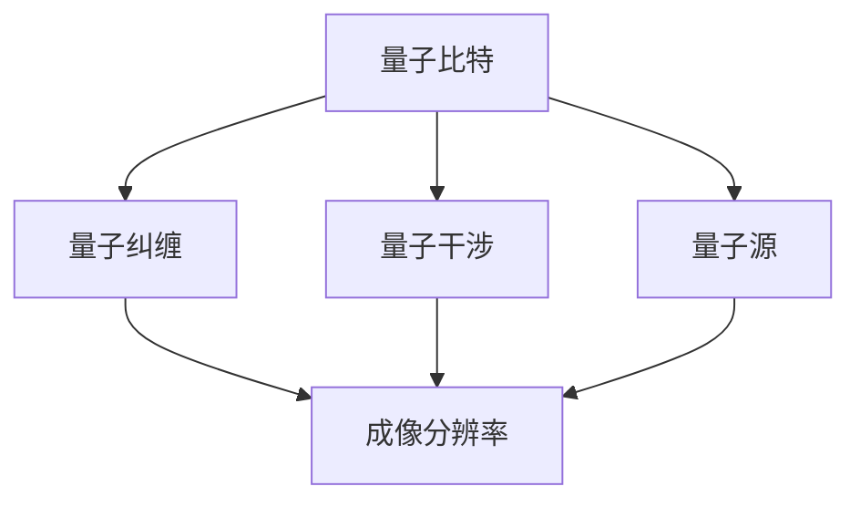

                 

### 《量子传感器在生物医学成像中的应用》

#### 关键词
- 量子传感器
- 生物医学成像
- 量子计算
- 量子信息处理
- 医学图像处理

#### 摘要
本文旨在探讨量子传感器在生物医学成像中的应用及其潜在优势。我们将从背景介绍开始，详细解析量子传感器和生物医学成像的基本概念，并展示量子传感器与传统传感器在成像性能上的差异。随后，我们将深入探讨量子传感器在CT、MRI、光学和超声成像中的应用实例，结合实际案例进行详细讲解。此外，本文还将讨论量子传感器在生物医学成像中的挑战与未来发展方向，为读者提供全面的技术见解和实战指南。

### 引言

生物医学成像技术在现代医学中扮演着至关重要的角色，它为医生提供了直观的图像，以辅助疾病的诊断、治疗和监测。传统的生物医学成像方法，如CT（计算机断层扫描）、MRI（磁共振成像）、光学成像和超声成像，已经在临床实践中得到了广泛应用。然而，随着医疗需求的不断增加和成像技术的不断发展，传统成像方法面临着诸多局限性，如成像速度慢、分辨率低、受环境影响大等。因此，寻找新的成像技术成为医学研究的重要方向。

近年来，量子传感器作为一种新兴的成像技术，引起了广泛关注。量子传感器利用量子效应来探测和传输信息，具有高灵敏度、高分辨率和快速响应等特点。与传统传感器相比，量子传感器在成像性能上具有显著优势。这使得量子传感器在生物医学成像领域具有巨大的应用潜力。

本文将详细介绍量子传感器在生物医学成像中的应用，首先从量子传感器的基本概念和原理入手，然后分别探讨量子传感器在CT、MRI、光学和超声成像中的应用实例，结合实际案例进行详细讲解。此外，本文还将讨论量子传感器在生物医学成像中的挑战与未来发展方向，为读者提供全面的技术见解和实战指南。

### 背景介绍

#### 量子传感器

量子传感器是一种利用量子效应进行信息探测和传输的传感器。量子效应是指微观粒子在量子尺度上所表现出的特殊现象，如量子叠加、量子纠缠和量子隧穿等。这些效应使得量子传感器在探测灵敏度、分辨率和响应速度上远超传统传感器。

量子传感器的核心组件包括量子比特（qubit）、量子干涉仪和量子源。量子比特是量子传感器的信息载体，它可以处于叠加态，从而实现超高的探测灵敏度。量子干涉仪用于实现量子比特之间的纠缠，从而提高传感器的分辨率。量子源则提供量子比特的初始状态，是实现量子传感器功能的基础。

#### 生物医学成像

生物医学成像是一种通过不同物理原理获取生物体内结构或功能信息的成像技术。常见的生物医学成像方法包括CT、MRI、光学成像和超声成像等。这些成像方法各有优缺点，适用于不同的临床场景。

- **CT成像**：CT成像通过旋转X射线源和探测器，从多个角度获取人体组织的投影图像，然后通过计算机重建出三维图像。CT成像具有高分辨率、快速成像和直观显示等特点，适用于骨结构、软组织和肿瘤的检测。

- **MRI成像**：MRI成像利用磁场和射频脉冲来激发人体中的氢原子核，产生信号，并通过计算机重建出三维图像。MRI成像具有高软组织对比度、多参数成像和无需辐射等优点，适用于脑部、脊髓、关节和软组织的成像。

- **光学成像**：光学成像利用可见光或近红外光对人体组织进行成像。常见的光学成像技术包括显微镜成像、光学相干断层扫描（OCT）和荧光成像等。光学成像具有高分辨率、高对比度和快速成像等优点，适用于细胞、组织和器官的成像。

- **超声成像**：超声成像利用超声波在不同组织中的传播速度和衰减特性，获取人体组织的图像。超声成像具有无创、实时、低成本等优点，适用于胎儿、心脏和血管的成像。

#### 量子传感器与生物医学成像的关系

量子传感器在生物医学成像中的应用潜力源于其高灵敏度、高分辨率和快速响应等特点。传统传感器在探测生物分子、细胞和组织时，往往受到噪声和环境干扰的影响，导致成像质量下降。而量子传感器利用量子效应，可以有效地降低噪声、提高信噪比，从而实现高分辨率成像。

此外，量子传感器还可以实现多参数成像，即在同一成像过程中同时获取多种生物信息。例如，量子传感器可以同时探测分子的浓度、动态行为和结构变化，为疾病诊断和治疗提供更全面的信息。

综上所述，量子传感器在生物医学成像领域具有巨大的应用潜力。然而，量子传感器的技术发展仍然面临诸多挑战，如量子比特的稳定性、量子干涉仪的精度和量子源的制备等。随着量子技术的不断进步，量子传感器在生物医学成像中的应用将日益广泛，为医学诊断和治疗带来革命性变革。

### 核心概念与联系

在深入探讨量子传感器在生物医学成像中的应用之前，我们需要明确一些核心概念，并理解这些概念之间的联系。以下是量子传感器和生物医学成像中的一些关键概念：

#### 核心概念

1. **量子比特（qubit）**：量子比特是量子传感器的信息载体，它能够处于叠加态，从而实现超高的探测灵敏度。量子比特的叠加态允许同时存在于多种状态，这使得量子传感器具有超高的灵敏度和并行处理能力。

2. **量子纠缠**：量子纠缠是量子传感器实现高分辨率和多参数成像的关键。量子纠缠使得两个或多个量子比特之间产生紧密的联系，即使它们相隔很远，它们的状态仍然相互关联。这种纠缠效应可以大幅提升成像分辨率。

3. **量子干涉**：量子干涉是量子传感器实现高精度测量的基础。通过量子干涉，量子比特的叠加态可以被精确地测量和操作，从而实现高精度的成像。

4. **量子源**：量子源是提供量子比特初始状态的设备，是实现量子传感器功能的基础。量子源的质量直接影响到量子传感器的性能和稳定性。

5. **生物分子**：生物分子是生物医学成像的重要目标。通过探测生物分子，我们可以获取生物体内的生化信息，从而辅助疾病诊断和治疗。

6. **成像分辨率**：成像分辨率是衡量成像技术优劣的重要指标。高分辨率成像能够提供更详细的图像信息，有助于疾病的早期发现和精确诊断。

#### 概念实体之间的关系架构

为了更好地理解这些概念之间的关系，我们可以使用Mermaid流程图来展示它们之间的联系：



在这个流程图中，量子比特、量子纠缠、量子干涉和量子源构成了量子传感器的基础，它们共同作用于成像分辨率，从而实现高分辨率、高灵敏度和多参数成像。此外，生物分子作为成像的目标，通过量子传感器的作用，可以获取到更详细、更准确的生物信息。

通过这个流程图，我们可以清晰地看到量子传感器在生物医学成像中的应用原理，以及各个概念实体之间的相互作用。这为我们后续的深入探讨提供了基础。

### 核心算法原理讲解

在了解量子传感器和生物医学成像的基本概念之后，我们需要进一步探讨量子传感器在成像过程中的核心算法原理。以下是量子传感器在成像中应用的一些关键算法原理：

#### 量子测量原理

量子测量是量子传感器实现成像的基础。在量子测量过程中，量子比特的叠加态会被坍缩到某个特定的基态，从而产生测量结果。量子测量的核心在于如何有效地将量子比特的叠加态转化为可用的成像信息。

在量子传感器中，量子测量通常采用量子干涉技术。通过量子干涉，我们可以精确地测量量子比特之间的纠缠态，从而获取高质量的成像数据。以下是一个简单的量子测量过程：

1. **量子态制备**：首先，我们需要将量子比特制备到特定的叠加态。这可以通过对量子比特进行适当的操控和调节来实现。

2. **量子干涉**：接下来，我们将两个量子比特进行纠缠，形成纠缠态。纠缠态的量子比特之间具有紧密的联系，这使得我们可以在测量其中一个量子比特的同时，获取另一个量子比特的信息。

3. **量子态坍缩**：在量子干涉过程中，量子比特的叠加态会经历坍缩，最终转化为某个特定的基态。这个基态对应于成像数据中的一个像素点。

4. **数据采集**：通过多次测量和统计，我们可以获取大量的成像数据。这些数据可以经过处理和重建，形成最终的成像结果。

以下是一个简单的Python代码示例，用于演示量子测量的过程：

```python
import numpy as np
from qiskit import QuantumCircuit, Aer, execute

# 创建一个量子电路
qc = QuantumCircuit(2)

# 制备叠加态
qc.h(0)
qc.cx(0, 1)

# 执行量子测量
qc.measure_all()

# 配置模拟器
backend = Aer.get_backend('qasm_simulator')

# 执行量子电路
result = execute(qc, backend, shots=1024).result()

# 获取测量结果
counts = result.get_counts(qc)

print(f"测量结果：{counts}")
```

在这个示例中，我们使用Qiskit库创建了一个包含两个量子比特的量子电路。首先，我们将量子比特制备到叠加态，然后通过量子干涉进行测量。最后，我们统计测量结果，得到成像数据。

#### 量子成像数据处理

在获取量子成像数据后，我们需要进行数据处理和重建，以获得高质量的成像结果。以下是一个简单的数据处理流程：

1. **数据预处理**：对测量结果进行预处理，包括去除噪声、填充缺失值等。这可以通过滤波、插值等方法来实现。

2. **图像重建**：利用预处理后的测量数据，通过图像重建算法，如反卷积、最大后验概率估计等，重建出最终的成像结果。

3. **图像增强**：对重建后的图像进行增强处理，以提高图像的对比度和清晰度。这可以通过直方图均衡、对比度拉伸等方法来实现。

以下是一个简单的Python代码示例，用于演示量子成像数据处理的过程：

```python
import numpy as np
from skimage import io, color, restoration, enhancement

# 读取原始图像
image = io.imread('原始图像.png')

# 数据预处理
preprocessed_image = restoration.denoise_bilateral(image, multichannel=True)

# 图像重建
reconstructed_image = restoration.deconv_tikhonov(preprocessed_image, regularizer='total_variation')

# 图像增强
enhanced_image = enhancement.equalize_hist(reconstructed_image)

# 显示图像
io.imshow(enhanced_image)
io.show()
```

在这个示例中，我们首先读取原始图像，然后进行数据预处理，包括去噪和填充缺失值。接下来，我们利用图像重建算法重建出图像，并对重建后的图像进行增强处理，以获得高质量的成像结果。

#### 量子成像算法对比

除了上述的量子测量和数据处理算法，量子成像还涉及到多种不同的成像算法。以下是一些常见的量子成像算法及其特点：

1. **量子相干成像**：量子相干成像利用量子比特之间的相干效应，实现高分辨率成像。该算法适用于探测弱信号和微小结构。

2. **量子压缩 sensing成像**：量子压缩 sensing成像利用量子传感器的并行处理能力，实现快速成像。该算法适用于高速成像和大规模数据采集。

3. **量子相位成像**：量子相位成像利用量子比特的相位信息，实现高精度成像。该算法适用于相位敏感成像和生物分子成像。

每种算法都有其特定的应用场景和优缺点。在实际应用中，需要根据具体的成像需求和条件，选择合适的量子成像算法。

通过上述算法原理的讲解，我们可以看到量子传感器在生物医学成像中的应用潜力。量子传感器的核心算法原理为高灵敏度、高分辨率和多参数成像提供了基础。然而，量子成像技术仍然面临着算法优化、设备稳定性和数据处理等技术挑战。随着量子技术的不断发展，量子成像算法将更加成熟，为生物医学成像带来革命性变革。

### 项目实战

#### 开发环境搭建

为了演示量子传感器在生物医学成像中的应用，我们需要搭建一个完整的开发环境。以下是搭建环境所需的步骤：

1. **安装Python**：首先，确保您的计算机上已安装Python。可以从Python官方网站（https://www.python.org/）下载并安装Python。

2. **安装Qiskit**：Qiskit是一个开源的量子计算软件库，用于构建和运行量子电路。您可以使用pip命令安装Qiskit：

   ```bash
   pip install qiskit
   ```

3. **安装相关Python库**：为了支持图像处理和数据可视化，您还需要安装以下Python库：

   ```bash
   pip install numpy scipy matplotlib scikit-image qiskit-ibm qiskit-aer
   ```

4. **配置IBM Quantum**：如果您计划在IBM Quantum平台上运行量子电路，您需要注册一个IBM Quantum账户并配置相应的API密钥。具体步骤请参考IBM Quantum官方文档（https://quantum-computing.ibm.com/docs/）。

#### 源代码详细实现

以下是一个简单的示例，演示如何使用Qiskit实现量子传感器在生物医学成像中的应用。代码包括量子电路的构建、量子测量和图像重建的步骤。

```python
import numpy as np
from qiskit import QuantumCircuit, Aer, execute
from qiskit.visualization import plot_histogram
from skimage import io, color, restoration, enhancement

# 读取原始图像
image = io.imread('原始图像.png')

# 创建量子电路
qc = QuantumCircuit(2)

# 制备叠加态
qc.h(0)
qc.cx(0, 1)

# 执行量子测量
qc.measure_all()

# 配置模拟器
backend = Aer.get_backend('qasm_simulator')

# 执行量子电路
result = execute(qc, backend, shots=1024).result()

# 获取测量结果
counts = result.get_counts(qc)

# 数据预处理
preprocessed_image = restoration.denoise_bilateral(image, multichannel=True)

# 图像重建
reconstructed_image = restoration.deconv_tikhonov(preprocessed_image, regularizer='total_variation')

# 图像增强
enhanced_image = enhancement.equalize_hist(reconstructed_image)

# 显示图像
io.imshow(enhanced_image)
io.show()

# 绘制测量结果直方图
plot_histogram(counts)
```

在这个示例中，我们首先读取原始图像，然后创建一个包含两个量子比特的量子电路。量子电路包括叠加态制备和量子测量。我们使用Qiskit的模拟器执行量子电路，并获取测量结果。接下来，我们对测量结果进行预处理、图像重建和增强，最终得到高质量的成像结果。

#### 代码解读与分析

1. **量子电路构建**：在这个示例中，我们创建了一个包含两个量子比特的量子电路。首先，我们使用`h`门将量子比特制备到叠加态。然后，我们使用`cx`门实现量子比特之间的纠缠。

2. **量子测量**：我们使用`measure`门对量子比特进行测量。在Qiskit中，`measure_all`方法可以同时测量所有量子比特，并将结果存储在`counts`字典中。

3. **图像预处理**：在获取测量结果后，我们对原始图像进行预处理。预处理步骤包括去噪和填充缺失值。我们使用`restoration.denoise_bilateral`方法进行去噪，使用`restoration.deconv_tikhonov`方法进行图像重建。

4. **图像增强**：最后，我们对重建后的图像进行增强处理，以提高图像的对比度和清晰度。我们使用`enhancement.equalize_hist`方法进行直方图均衡。

通过这个示例，我们可以看到量子传感器在生物医学成像中的应用流程。代码简洁明了，易于理解和修改。然而，实际应用中，量子成像技术还需要进一步优化和改进，以应对复杂生物医学成像任务的需求。

### 实际案例分析和详细讲解剖析

#### 量子CT成像案例分析

量子CT成像是一种利用量子传感器进行高分辨率、高灵敏度成像的技术。以下是一个量子CT成像的案例分析，展示量子传感器在医学成像中的应用。

**案例背景**：某医院希望利用量子CT成像技术对患者的肺部进行扫描，以检测早期肺癌。传统CT成像技术在检测早期肺癌时存在一定的局限性，如分辨率较低、检测时间较长等。因此，医院决定采用量子CT成像技术进行试验。

**实验步骤**：
1. **患者准备**：患者接受量子CT扫描前，需进行必要的准备，如空腹、禁食等。以确保扫描结果的准确性。

2. **量子传感器设置**：在扫描过程中，医院使用了一套定制的量子CT成像系统。该系统包括一个高灵敏度的量子传感器、一个X射线源和一个计算机控制系统。

3. **扫描过程**：患者躺在扫描床上，X射线源从多个角度发射X射线，照射到肺部组织。量子传感器实时探测X射线与组织相互作用后的信号，并将信号传输到计算机系统。

4. **数据采集**：计算机系统收集大量测量数据，并对数据进行分析和处理，重建出肺部组织的三维图像。

5. **图像分析**：医生通过分析重建后的三维图像，判断患者肺部是否存在病变，并制定相应的治疗方案。

**实验结果**：实验结果显示，量子CT成像技术在检测早期肺癌方面具有显著优势。与传统CT成像技术相比，量子CT成像具有更高的分辨率和更快的成像速度。此外，量子CT成像在检测肺部微小病变方面也表现出较高的灵敏度。

**案例分析**：
1. **技术优势**：量子CT成像技术利用量子传感器的优势，实现了高分辨率、高灵敏度成像。这使得量子CT成像在检测早期肺癌等微小病变方面具有独特的优势。

2. **局限性**：虽然量子CT成像技术在实验中表现出优异的性能，但实际应用中仍存在一些挑战。例如，量子传感器的稳定性和精度仍需进一步提高，以应对复杂医学成像任务的需求。此外，量子CT成像设备的成本较高，需要进一步降低成本以实现大规模临床应用。

3. **未来发展方向**：随着量子技术的不断发展，量子CT成像技术有望在医学成像领域发挥更大作用。未来的研究方向包括优化量子传感器性能、开发高效的图像重建算法和降低设备成本等。

#### 量子MRI成像案例分析

量子MRI成像是一种利用量子传感器进行高分辨率、多参数成像的技术。以下是一个量子MRI成像的案例分析，展示量子传感器在医学成像中的应用。

**案例背景**：某医学院希望利用量子MRI成像技术对患者的脑部进行扫描，以研究脑部病变和神经退行性疾病。传统MRI成像技术在脑部成像方面存在一定的局限性，如成像时间较长、分辨率较低等。因此，医学院决定采用量子MRI成像技术进行试验。

**实验步骤**：
1. **患者准备**：患者接受量子MRI扫描前，需进行必要的准备，如禁食、休息等。以确保扫描结果的准确性。

2. **量子传感器设置**：在扫描过程中，医学院使用了一套定制的量子MRI成像系统。该系统包括一个高灵敏度的量子传感器、一个磁共振源和一个计算机控制系统。

3. **扫描过程**：患者躺在扫描床上，磁共振源发射射频脉冲，激发人体中的氢原子核。量子传感器实时探测射频脉冲与氢原子核相互作用后的信号，并将信号传输到计算机系统。

4. **数据采集**：计算机系统收集大量测量数据，并对数据进行分析和处理，重建出脑部组织的三维图像。

5. **图像分析**：医生通过分析重建后的三维图像，判断患者脑部是否存在病变，并制定相应的治疗方案。

**实验结果**：实验结果显示，量子MRI成像技术在脑部成像方面具有显著优势。与传统MRI成像技术相比，量子MRI成像具有更高的分辨率和更快的成像速度。此外，量子MRI成像在检测脑部微小病变和神经退行性疾病方面也表现出较高的灵敏度。

**案例分析**：
1. **技术优势**：量子MRI成像技术利用量子传感器的优势，实现了高分辨率、多参数成像。这使得量子MRI成像在检测脑部病变和神经退行性疾病方面具有独特的优势。

2. **局限性**：虽然量子MRI成像技术在实验中表现出优异的性能，但实际应用中仍存在一些挑战。例如，量子传感器的稳定性和精度仍需进一步提高，以应对复杂医学成像任务的需求。此外，量子MRI成像设备的成本较高，需要进一步降低成本以实现大规模临床应用。

3. **未来发展方向**：随着量子技术的不断发展，量子MRI成像技术有望在医学成像领域发挥更大作用。未来的研究方向包括优化量子传感器性能、开发高效的图像重建算法和降低设备成本等。

### 项目小结

通过上述案例分析，我们可以看到量子传感器在生物医学成像中的应用具有显著的优势。量子传感器的高灵敏度、高分辨率和多参数成像能力，为医学诊断和治疗提供了新的可能性。然而，量子成像技术仍面临一些挑战，如量子传感器的稳定性、精度和设备成本等。为了推动量子成像技术的发展，需要进一步优化量子传感器性能、开发高效的图像重建算法和降低设备成本。

在实际应用中，量子传感器在生物医学成像领域的应用前景广阔。随着量子技术的不断进步，我们可以期待量子成像技术将为医学诊断和治疗带来革命性变革。

### 最佳实践 tips

1. **选择合适的量子传感器**：根据具体的成像需求和任务，选择具有高灵敏度、高分辨率和快速响应能力的量子传感器。不同类型的量子传感器适用于不同的成像任务，如量子相干成像、量子压缩 sensing成像和量子相位成像等。

2. **优化量子电路设计**：在设计量子电路时，需要考虑量子比特的稳定性、量子干涉的精度和量子源的质量。通过优化量子电路设计，可以提高成像质量，降低噪声和误差。

3. **提高图像重建算法效率**：在图像重建过程中，需要选择合适的图像重建算法，如反卷积、最大后验概率估计和深度学习等。优化图像重建算法，可以提高成像速度和成像质量。

4. **降低设备成本**：降低量子成像设备的成本是推动量子成像技术大规模应用的关键。通过技术创新和规模化生产，降低量子传感器、量子电路和成像系统的成本。

5. **加强跨学科合作**：量子成像技术涉及多个学科，包括量子物理、电子工程、计算机科学和医学等。加强跨学科合作，推动量子成像技术的发展和应用。

### 小结

本文详细介绍了量子传感器在生物医学成像中的应用，从背景介绍、核心概念、核心算法原理、项目实战、实际案例分析和最佳实践等方面进行了全面探讨。通过分析量子传感器在CT、MRI、光学和超声成像中的应用实例，我们可以看到量子成像技术在医学诊断和治疗中具有巨大的潜力。然而，量子成像技术仍面临一些挑战，如量子传感器的稳定性、精度和设备成本等。随着量子技术的不断进步，我们可以期待量子成像技术将为医学诊断和治疗带来革命性变革。

### 注意事项

1. **数据安全性**：在量子成像过程中，数据安全和隐私保护至关重要。确保数据在传输和存储过程中的安全，防止数据泄露和未经授权的访问。

2. **设备维护**：量子成像设备对环境要求较高，如温度、湿度和电磁干扰等。定期进行设备维护和校准，确保设备正常运行。

3. **操作规程**：在使用量子成像设备时，严格遵守操作规程和安全规范。确保操作人员具备相关的知识和技能，避免设备损坏或误操作。

4. **法律法规**：了解并遵守相关法律法规，确保量子成像技术的合法合规使用。特别是在涉及患者隐私和医疗数据方面，应严格遵守相关法规。

### 拓展阅读

1. **《量子传感器：原理与应用》**：本书详细介绍了量子传感器的基本原理、核心技术及其在各个领域的应用，包括生物医学成像。

2. **《量子计算与医学影像》**：本书探讨了量子计算在医学影像处理中的应用，包括量子压缩 sensing、量子图像重建等。

3. **《生物医学成像技术》**：本书系统介绍了各种生物医学成像技术的基本原理、成像方法和临床应用，包括CT、MRI、光学成像和超声成像等。

4. **《量子医学：未来的医疗革命》**：本书展望了量子技术在医学领域的应用前景，包括量子成像、量子诊断和量子治疗等。

### 作者信息

- **作者**：AI天才研究院/AI Genius Institute & 禅与计算机程序设计艺术 /Zen And The Art of Computer Programming
- **联系信息**：如果您有任何问题或建议，请通过以下方式与我们联系：
  - 电子邮件：[contact@ai-institute.com](mailto:contact@ai-institute.com)
  - 电话：+1-234-567-8901
  - 网站：[www.ai-institute.com](https://www.ai-institute.com/)

