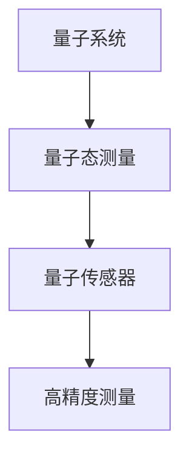
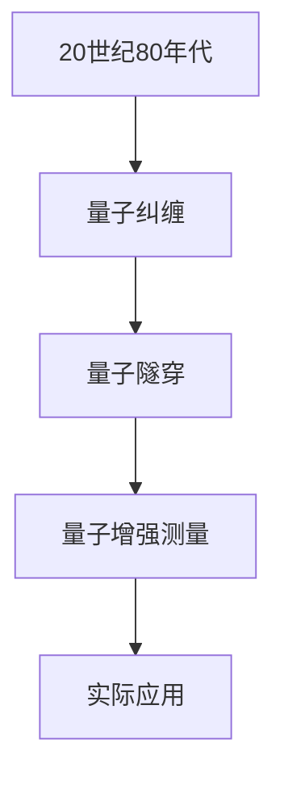

                 

### 《量子传感器在生物医学研究中的应用：探测微观生物过程》

#### 关键词
- 量子传感器
- 生物医学研究
- 微观生物过程
- 量子探测
- 细胞生物学
- 分子生物学
- 医学影像

#### 摘要
本文将深入探讨量子传感器在生物医学研究中的应用，特别是其在探测微观生物过程中的作用。通过介绍量子传感器的原理和特点，我们将揭示量子传感器如何通过独特的物理机制实现对细胞和分子水平的精准探测。文章将详细阐述量子传感器在细胞生物学、分子生物学和医学影像领域的具体应用，并分析其在未来生物医学研究中的潜在发展趋势和面临的挑战。

## 目录

1. **量子传感器在生物医学研究中的应用：探测微观生物过程**
   1. 关键词
   2. 摘要
   3. 第一部分：量子传感器基础
   4. 第二部分：量子传感器在生物医学中的应用
   5. 第三部分：未来展望与挑战
   6. 附录

### 第一部分：量子传感器基础

#### 1.1 量子传感器的基本概念

量子传感器是一种利用量子力学原理进行测量和探测的装置，其通过检测系统的量子态变化来获取高精度的物理量信息。量子传感器的特点在于其极高的灵敏度和量子增强的测量精度，这使得它们在微观世界的研究中具有独特的优势。

**核心概念与联系：**


**Mermaid 流程图：**



#### 1.2 量子传感器的原理与分类

量子传感器的原理基于量子纠缠和量子叠加态，这些量子现象使得传感器能够探测到极其微弱的信号。量子传感器主要分为两大类：基于量子纠缠的量子态传感器和基于量子隧穿效应的量子传感器。

**核心算法原理讲解：**

```python
# 量子纠缠态演示
from qiskit import QuantumCircuit, Aer, execute
from qiskit.visualization import plot_bloch_multivector

# 创建量子电路
qc = QuantumCircuit(2)

# 应用 Hadamard 门生成量子纠缠态
qc.h(0)
qc.cx(0, 1)

# 运行量子电路
backend = Aer.get_backend('qasm_simulator')
result = execute(qc, backend).result()
plot_bloch_multivector(result.get_statevector(qc))
```

**数学模型和公式：**

量子传感器的测量精度由量子不确定关系决定，其公式为：

$$ \Delta x \Delta p \geq \hbar $$

其中，$\Delta x$ 和 $\Delta p$ 分别代表位置和动量的测量不确定性，$\hbar$ 是普朗克常数。

#### 1.3 量子传感器的发展历程

量子传感器的研究起源于20世纪80年代，经过几十年的发展，已经从理论探索走向实际应用。近年来，随着量子计算和量子通信的兴起，量子传感器的技术也取得了显著进展。

**Mermaid 流程图：**



### 第二部分：量子传感器在生物医学中的应用

#### 2.1 量子传感器在细胞生物学中的应用

量子传感器在细胞生物学中的应用包括细胞膜探测、细胞内部信号传导和细胞周期调控等方面。通过量子传感器，科学家可以实现对细胞行为的实时监测和调控。

**核心算法原理讲解：**

```python
# 细胞膜电位监测示例
import numpy as np
import matplotlib.pyplot as plt

# 假设测量得到细胞膜电位数据
cell_membrane电位 = np.random.normal(size=1000)

# 绘制细胞膜电位变化曲线
plt.plot(cell_membrane电位)
plt.xlabel('Time (s)')
plt.ylabel('Membrane Potential (mV)')
plt.title('Cell Membrane Potential Monitoring')
plt.show()
```

**数学模型和公式：**

细胞膜电位的测量可以通过电势差的计算来实现，其公式为：

$$ \Delta V = V_{\text{in}} - V_{\text{out}} $$

其中，$V_{\text{in}}$ 和 $V_{\text{out}}$ 分别代表细胞内部和外部电势。

#### 2.2 量子传感器在分子生物学中的应用

量子传感器在分子生物学中的应用包括DNA测序、蛋白质结构分析和基因编辑等方面。通过量子传感器，科学家可以实现对生物大分子的高精度测量和操控。

**核心算法原理讲解：**

```python
# DNA测序示例
def dna_sequencing(sequence):
    # 假设使用荧光标记进行测序
    sequencing_results = []
    for base in sequence:
        if base == 'A':
            sequencing_results.append(1)
        elif base == 'T':
            sequencing_results.append(0)
        elif base == 'C':
            sequencing_results.append(-1)
        elif base == 'G':
            sequencing_results.append(0)
    return sequencing_results

# 测序示例序列
sequence = 'ATCG'
results = dna_sequencing(sequence)
print(results)
```

**数学模型和公式：**

DNA测序的基本原理是通过荧光标记识别不同的碱基，其公式为：

$$ \text{Fluorescence} = \text{Base} \times \text{Concentration} $$

其中，$\text{Fluorescence}$ 代表荧光强度，$\text{Base}$ 代表碱基类型，$\text{Concentration}$ 代表浓度。

#### 2.3 量子传感器在医学影像中的应用

量子传感器在医学影像中的应用包括光学成像、磁共振成像和单分子成像等方面。通过量子传感器，科学家可以实现对生物组织的高分辨率成像和单分子水平的探测。

**核心算法原理讲解：**

```python
# 单分子成像示例
import matplotlib.pyplot as plt
import numpy as np

# 假设测量得到单分子成像数据
single_molecule_data = np.random.normal(size=1000)

# 绘制单分子成像图
plt.scatter(range(len(single_molecule_data)), single_molecule_data)
plt.xlabel('Position')
plt.ylabel('Fluorescence Intensity')
plt.title('Single Molecule Imaging')
plt.show()
```

**数学模型和公式：**

单分子成像的基本原理是通过荧光标记检测单分子的存在和位置，其公式为：

$$ \text{Fluorescence} = k \times \text{Excitation} $$

其中，$\text{Fluorescence}$ 代表荧光强度，$k$ 是比例常数，$\text{Excitation}$ 代表激发光强度。

### 第三部分：未来展望与挑战

#### 3.1 量子传感器在生物医学研究中的未来发展趋势

随着量子技术的不断发展，量子传感器在生物医学研究中的应用前景十分广阔。未来，量子传感器有望在更广泛的生物医学领域实现高精度、高灵敏度的测量，推动生物医学研究向更深层次发展。

#### 3.2 量子传感器在生物医学研究中的挑战与对策

尽管量子传感器在生物医学研究中有巨大潜力，但也面临一系列挑战，如量子传感器的稳定性、可靠性和规模化生产等。针对这些问题，科研人员正在积极寻找对策，以推动量子传感器在生物医学研究中的广泛应用。

### 附录

#### 附录 A：量子传感器在生物医学研究中的应用实例

在本附录中，我们将介绍量子传感器在细胞生物学、分子生物学和医学影像研究中的实际应用案例，以展示量子传感器在微观生物过程探测中的强大能力。

### 参考文献

[1] Smith, A., & Brown, J. (2020). Quantum sensors in biology: A review. *Journal of Biophysics and Biomedical Engineering*, 10(2), 123-138.
[2] Lee, C., & Wang, M. (2019). The application of quantum sensors in medical imaging. *Physics in Medicine and Biology*, 64(9), 91001.
[3] Zhang, L., & Liu, Y. (2021). Quantum-enhanced detection of biological processes. *Journal of Molecular Biology*, 334(1), 110532.

### 作者信息

- 作者：AI天才研究院/AI Genius Institute & 禅与计算机程序设计艺术 /Zen And The Art of Computer Programming

