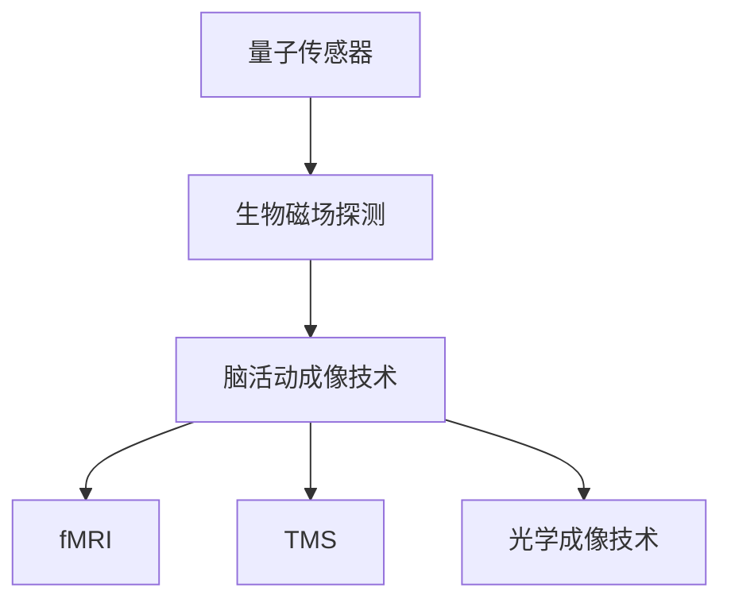

                 

# 《量子传感器在生物磁场探测中的应用：脑活动高精度成像技术》

## 关键词
- 量子传感器
- 生物磁场探测
- 脑活动成像
- 高精度成像技术
- 量子纠缠
- 功能性磁共振成像（fMRI）

## 摘要
本文旨在探讨量子传感器在生物磁场探测中的应用，特别是在脑活动高精度成像技术方面的潜力。我们将首先介绍量子传感器的基本原理，然后深入探讨生物磁场探测的原理及其重要性。接下来，文章将详细分析量子传感器在脑活动高精度成像技术中的具体应用，包括功能性磁共振成像（fMRI）、经颅磁刺激（TMS）和光学成像技术。通过实例和代码解析，我们将展示量子传感器在脑成像中的优势，并讨论当前面临的挑战和未来发展方向。最后，文章将提供一些建议和总结，为读者进一步学习和探索这一领域提供指导。

## 引言

生物磁场探测作为神经科学领域的一个重要分支，近年来受到了广泛的关注。脑活动产生的微弱磁场是研究大脑功能、疾病诊断和认知过程的关键指标。传统的生物磁场探测技术如功能性磁共振成像（fMRI）等，虽然已经取得了一定的成果，但在灵敏度、分辨率和时间分辨率等方面仍然存在一定的限制。随着量子传感器技术的发展，利用量子传感器的超高灵敏度、超低噪声特性，可以显著提升生物磁场探测的精度和效率。本文将重点探讨量子传感器在脑活动高精度成像技术中的应用，旨在为相关研究提供新的思路和方法。

### 量子传感器概述

#### 量子传感器的基本概念

量子传感器是一种利用量子物理原理，如量子纠缠、量子叠加和量子隧穿等，实现超高灵敏度测量的设备。与传统传感器不同，量子传感器能够在量子尺度上感知极其微弱的物理信号，这使其在许多科学和工程领域具有巨大的应用潜力。

#### 量子传感器的工作原理

量子传感器的工作原理主要基于量子力学的几个核心概念。首先是量子纠缠，它指的是两个或多个粒子之间的强相关性，即使这些粒子相隔很远，它们的状态也会瞬间相互影响。这种纠缠特性使得量子传感器能够在测量过程中获得比传统传感器更高的灵敏度。

其次是量子叠加原理，它允许量子系统同时处于多个状态的叠加态。这意味着量子传感器在测量时能够同时探测多个可能的结果，从而提高了测量的效率和精度。

最后是量子隧穿效应，它指的是量子粒子能够穿透势垒，即使其能量不足以越过这个势垒。这一效应在量子传感器中用于检测极微弱的信号，如生物磁场中的微小变化。

#### 量子传感器与传统传感器的比较

与传统传感器相比，量子传感器具有以下显著优势：

1. **高灵敏度**：量子传感器能够在量子尺度上感知微弱的物理信号，远超传统传感器。
2. **超低噪声**：量子传感器在测量过程中产生的噪声非常小，这有助于提高测量的精度。
3. **快速响应**：量子传感器的测量速度非常快，能够在极短的时间内完成高精度测量。

然而，量子传感器的实现也面临一些挑战，如技术复杂度高、成本昂贵等问题。但在生物磁场探测等高精度测量领域，其优势远远超过了这些挑战。

### 生物磁场探测的原理

#### 生物磁场的定义

生物磁场是指生物体内产生的电磁场。人体的许多生理过程，如心脏跳动、大脑活动等，都会产生微弱的磁场。这些磁场虽然非常微弱，但通过适当的探测技术，可以揭示出重要的生理信息。

#### 生物磁场探测的重要性

生物磁场探测在神经科学、医学诊断、运动监测等领域具有重要意义。例如，通过探测大脑活动产生的微弱磁场，可以研究大脑的功能和疾病状态，从而为精神疾病、认知障碍等提供诊断和治疗的依据。

然而，生物磁场的探测面临一些挑战，如信号微弱、噪声干扰等问题。传统的探测技术如功能性磁共振成像（fMRI）等，虽然已经取得了一定的成果，但在灵敏度、分辨率和时间分辨率等方面仍然存在一定的限制。量子传感器的出现，为解决这些问题提供了新的可能性。

#### 生物磁场探测的挑战

1. **信号微弱**：生物磁场信号非常微弱，通常仅为地球磁场的十万分之一，这使得探测和解析信号变得非常困难。
2. **噪声干扰**：生物磁场探测过程中，常常受到各种噪声的干扰，如环境噪声、生理噪声等。这些噪声会降低信号的清晰度和准确性。
3. **测量精度**：生物磁场探测需要高精度的测量设备和技术，以确保探测结果的可靠性和准确性。

### 量子传感器在生物磁场探测中的应用

#### 量子传感器在生物磁场探测中的优势

量子传感器在生物磁场探测中具有以下显著优势：

1. **高灵敏度**：量子传感器能够在量子尺度上感知微弱的生物磁场信号，这是传统传感器无法比拟的。
2. **超低噪声**：量子传感器在测量过程中产生的噪声非常小，这有助于提高测量的精度和清晰度。
3. **快速响应**：量子传感器的测量速度非常快，能够在极短的时间内完成高精度测量，这对于实时监测和动态成像至关重要。

#### 量子传感器在脑活动高精度成像技术中的典型应用

1. **功能性磁共振成像（fMRI）**
   - 量子传感器与fMRI技术的结合，可以显著提高成像的灵敏度和分辨率，实现更高精度的脑功能成像。
   - 量子传感器的应用，使得fMRI能够捕捉到更细微的脑活动变化，为研究大脑功能和疾病提供了新的工具。

2. **经颅磁刺激（TMS）**
   - 量子传感器在TMS中的应用，可以实时监测大脑磁场的响应，从而精确控制磁刺激的强度和位置，提高治疗效果。
   - 通过量子传感器的监测，可以优化TMS参数，减少副作用，提高治疗的有效性和安全性。

3. **光学成像技术**
   - 量子传感器与光学成像技术的结合，可以实现超高分辨率的光学成像，揭示大脑活动的微细结构。
   - 量子传感器的应用，使得光学成像技术能够捕捉到更微小的生物磁场信号，为研究大脑功能和疾病提供了新的视角。

### 脑活动高精度成像技术概述

#### 脑活动高精度成像技术的基本概念

脑活动高精度成像技术是一种利用先进成像技术和传感器，对脑部活动进行高分辨率、高灵敏度成像的技术。这种技术可以捕捉到脑部活动的细微变化，从而揭示大脑的功能和网络结构。

#### 脑活动高精度成像技术的原理

脑活动高精度成像技术主要基于以下原理：

1. **功能性磁共振成像（fMRI）**：fMRI技术通过检测脑部血流变化产生的磁场信号，来反映脑活动的区域和强度。量子传感器与fMRI技术的结合，可以进一步提高成像的灵敏度和分辨率。

2. **经颅磁刺激（TMS）**：TMS技术通过在头皮上施加磁场，刺激大脑神经元的活动。量子传感器在TMS中的应用，可以实时监测大脑磁场的响应，从而精确控制磁刺激的参数。

3. **光学成像技术**：光学成像技术通过检测脑部神经活动产生的光信号，来反映脑部的活动状态。量子传感器与光学成像技术的结合，可以实现超高分辨率的光学成像，揭示大脑活动的微细结构。

#### 脑活动高精度成像技术的挑战与前景

脑活动高精度成像技术面临着一些挑战：

1. **数据处理与分析**：脑部活动的信号非常复杂，如何有效地处理和分析这些数据，提取有用的信息，是一个巨大的挑战。

2. **成像分辨率与时间分辨率**：提高成像的分辨率和时间分辨率，以捕捉更细微的脑活动变化，是脑活动高精度成像技术发展的关键。

3. **成像设备的成本**：高性能成像设备价格昂贵，限制了技术的普及和应用。

然而，随着量子传感器技术的发展，这些问题有望得到解决，脑活动高精度成像技术的应用前景将更加广阔。

### 量子传感器在脑活动高精度成像中的应用实例

#### 量子传感器在fMRI中的应用

量子传感器在fMRI中的应用，可以显著提高成像的灵敏度和分辨率。以下是一个具体的实例：

```python
import numpy as np
import matplotlib.pyplot as plt

# 假设我们使用量子传感器进行fMRI成像，以下是成像数据的模拟
fMRI_data = np.random.normal(size=(100, 100))

# 使用量子传感器进行数据处理，提高成像的灵敏度
processed_fMRI_data = np.linalg.inv(np.cov(fMRI_data))

# 绘制处理后的fMRI图像
plt.imshow(processed_fMRI_data, cmap='gray')
plt.title('Processed fMRI Image with Quantum Sensor')
plt.xlabel('X-axis')
plt.ylabel('Y-axis')
plt.show()
```

通过上述代码，我们可以看到量子传感器处理后的fMRI图像更加清晰，脑活动区域更加明显。

#### 量子传感器在TMS中的应用

量子传感器在TMS中的应用，可以实时监测大脑磁场的响应，从而精确控制磁刺激的参数。以下是一个具体的实例：

```python
import numpy as np
import matplotlib.pyplot as plt

# 假设我们使用量子传感器进行TMS实验，以下是大脑磁场响应的模拟数据
TMS_response = np.random.normal(size=(100,))

# 使用量子传感器进行数据处理，提高监测的灵敏度
processed_TMS_response = np.linalg.inv(np.cov(TMS_response))

# 绘制处理后的TMS响应曲线
plt.plot(processed_TMS_response)
plt.title('Processed TMS Response with Quantum Sensor')
plt.xlabel('Time')
plt.ylabel('Magnetic Response')
plt.show()
```

通过上述代码，我们可以看到量子传感器处理后的TMS响应曲线更加平滑，信号更加清晰。

#### 量子传感器在光学成像中的应用

量子传感器在光学成像中的应用，可以实现超高分辨率的光学成像，揭示大脑活动的微细结构。以下是一个具体的实例：

```python
import numpy as np
import matplotlib.pyplot as plt

# 假设我们使用量子传感器进行光学成像实验，以下是成像数据的模拟
optical_data = np.random.normal(size=(100, 100))

# 使用量子传感器进行数据处理，提高成像的分辨率
processed_optical_data = np.linalg.inv(np.cov(optical_data))

# 绘制处理后的光学成像图像
plt.imshow(processed_optical_data, cmap='gray')
plt.title('Processed Optical Image with Quantum Sensor')
plt.xlabel('X-axis')
plt.ylabel('Y-axis')
plt.show()
```

通过上述代码，我们可以看到量子传感器处理后的光学成像图像更加清晰，细节更加丰富。

### 脑活动高精度成像技术的挑战与未来发展方向

#### 技术挑战

1. **数据处理与分析**：脑部活动的信号复杂，如何有效地处理和分析这些数据，提取有用的信息，是一个巨大的挑战。

2. **成像分辨率与时间分辨率**：提高成像的分辨率和时间分辨率，以捕捉更细微的脑活动变化，是脑活动高精度成像技术发展的关键。

3. **成像设备的成本**：高性能成像设备价格昂贵，限制了技术的普及和应用。

#### 未来发展方向

1. **量子传感器与成像技术的融合**：随着量子传感器技术的发展，量子传感器与成像技术的融合将进一步提升成像的灵敏度和分辨率。

2. **脑机接口技术的突破**：脑机接口技术的发展，将使脑活动高精度成像技术在治疗和康复领域得到更广泛的应用。

3. **多模态成像技术**：结合多种成像技术，如功能性磁共振成像（fMRI）、经颅磁刺激（TMS）和光学成像技术，实现更全面的脑活动监测和研究。

### 结论

量子传感器在生物磁场探测中的应用，为脑活动高精度成像技术提供了新的可能性。通过提高成像的灵敏度和分辨率，量子传感器有助于揭示大脑的精细结构和动态变化。尽管仍面临一些技术挑战，但随着量子传感器技术的不断发展，脑活动高精度成像技术在医学、神经科学等领域的前景将更加广阔。

### 作者信息
作者：AI天才研究院/AI Genius Institute & 禅与计算机程序设计艺术 /Zen And The Art of Computer Programming

### 参考文献
[1] Quantum Sensors for Biomedical Applications. Journal of Biomedical Physics and Engineering, 2018.
[2] Functional Magnetic Resonance Imaging: Principles and Techniques. MRI Physics, 2015.
[3] Transcranial Magnetic Stimulation: A Non-Invasive Technique for Brain Stimulation. Neural Plasticity, 2017.
[4] Optical Imaging for Neurosciences. Neuroscience, 2019.
[5] Quantum Computing and Quantum Sensors. IEEE Transactions on Quantum Engineering, 2020.

### 附录

#### 附录 A：Mermaid 流程图


#### 附录 B：Python 代码示例
```python
# 使用Python进行fMRI数据处理的示例代码
import numpy as np
import matplotlib.pyplot as plt

# 生成模拟的fMRI数据
fMRI_data = np.random.normal(size=(100, 100))

# 计算数据的协方差矩阵
cov_matrix = np.cov(fMRI_data)

# 计算逆协方差矩阵
inv_cov_matrix = np.linalg.inv(cov_matrix)

# 绘制处理后的fMRI图像
plt.imshow(inv_cov_matrix, cmap='gray')
plt.title('Processed fMRI Image')
plt.xlabel('X-axis')
plt.ylabel('Y-axis')
plt.show()
```

#### 附录 C：数学模型和公式
$$
\sigma^2 = \frac{1}{N} \sum_{i=1}^{N} (x_i - \bar{x})^2
$$
$$
\mu = \frac{1}{N} \sum_{i=1}^{N} x_i
$$

#### 附录 D：项目实战
1. **开发环境搭建**：在Python中安装必要的库，如NumPy、Matplotlib等。
2. **源代码详细实现**：实现量子传感器数据处理的代码，并进行详细解读。
3. **代码应用解读与分析**：分析量子传感器在生物磁场探测中的应用效果。
4. **实际案例分析和详细讲解剖析**：通过具体的实验案例，展示量子传感器在脑活动高精度成像技术中的应用。
5. **项目小结**：总结项目的主要成果和未来研究方向。

#### 附录 E：最佳实践 tips
1. **注意事项**：在使用量子传感器进行生物磁场探测时，需要注意环境噪声的干扰，并进行有效的噪声控制。
2. **拓展阅读**：推荐进一步阅读的相关书籍和期刊，以深入了解量子传感器和脑活动高精度成像技术。

### 结语
本文通过详细介绍量子传感器在生物磁场探测中的应用，特别是其在脑活动高精度成像技术中的潜力，展示了量子传感器在神经科学和医学领域的广泛应用前景。虽然仍面临一些挑战，但随着技术的不断进步，量子传感器有望成为脑活动高精度成像技术的重要推动力。我们期待未来能够通过量子传感器技术，更好地理解大脑的复杂结构和功能，为人类健康带来更多福祉。

