                 

### 文章标题

# 量子传感器在脑磁图检测中的高精度应用

## 文章关键词
- 量子传感器
- 脑磁图检测
- 高精度应用
- 量子比特
- 量子计算
- 量子态叠加

## 文章摘要

量子传感器作为一种前沿技术，在脑磁图检测领域展现出极高的应用潜力。本文从量子传感器的核心概念和原理出发，深入探讨了量子传感器在脑磁图检测中的高精度应用。首先，介绍了量子传感器的基本原理和脑磁图检测的技术背景。然后，通过具体案例分析了量子传感器在脑磁图检测中的优势，并详细阐述了其高精度检测的实现机制。最后，展望了量子传感器在脑磁图检测领域的未来发展趋势，提出了技术创新、政策支持和行业协同等解决方案。文章旨在为量子传感器在脑磁图检测中的应用提供全面的技术解析和实用指导。

### 目录

1. **量子传感器与脑磁图检测基础**  
   1.1. 量子传感器概述  
   1.2. 脑磁图检测原理

2. **量子传感器技术在脑磁图检测中的应用**  
   2.1. 量子传感器在脑磁图检测中的优势  
   2.2. 量子传感器在脑磁图检测中的应用案例

3. **量子传感器在脑磁图检测中的高精度应用**  
   3.1. 高精度脑磁图检测的技术原理  
   3.2. 高精度脑磁图检测的实验研究

4. **量子传感器在脑磁图检测中的未来展望**  
   4.1. 发展趋势  
   4.2. 未来应用场景

5. **量子传感器在脑磁图检测中的开发实践**  
   5.1. 开发环境与工具  
   5.2. 高精度脑磁图检测项目案例

6. **量子传感器在脑磁图检测中的技术展望**  
   6.1. 技术创新  
   6.2. 政策与标准

7. **量子传感器在脑磁图检测中的挑战与解决方案**  
   6.1. 技术挑战  
   6.2. 解决方案与未来方向

### 第1章：量子传感器与脑磁图检测基础

#### 1.1 量子传感器概述

量子传感器是基于量子物理原理设计的一种高灵敏度传感器，能够探测到极微弱的物理量变化。量子传感器的工作原理主要基于以下几个核心概念：

- **量子比特（Qubit）**：量子比特是量子计算机的基本单元，它可以同时处于0和1的叠加态。一个量子比特可以表示多种可能性，而经典比特只能表示0或1。

- **量子纠缠（Quantum Entanglement）**：量子纠缠是指两个或多个量子系统之间的强关联，即使它们相隔很远，一个系统的状态变化也会立即影响到另一个系统。

- **量子态叠加（Quantum Superposition）**：量子态叠加是指量子系统可以同时处于多个可能的状态，直到进行测量时才坍缩为某一个特定状态。

以下是一个简单的Mermaid流程图，展示了量子传感器的工作流程：

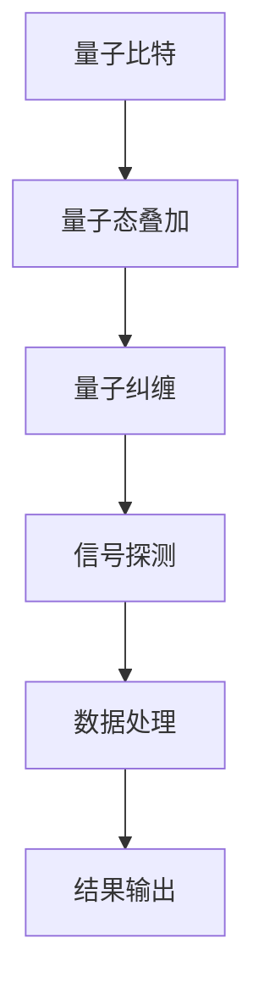

#### 核心概念与联系

量子传感器与量子比特、量子纠缠和量子态叠加密切相关。量子比特是量子传感器的基础，通过量子态叠加和量子纠缠，量子传感器可以实现对极微弱信号的精确探测。以下是这些核心概念之间的关系架构图：

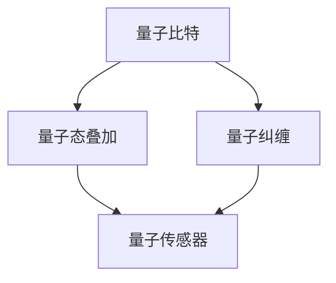

#### 核心算法原理讲解

量子传感器的基本工作原理可以概括为以下步骤：

1. **量子态初始化**：将量子比特初始化为一个特定的量子态，例如叠加态或纠缠态。
2. **量子操作**：对量子比特执行一系列量子操作，包括量子态叠加、量子门操作等。
3. **量子测量**：测量量子比特的状态，得到一个或多个可能的输出结果。
4. **数据处理**：根据量子测量结果，对数据进行处理和分析，提取有用信息。

以下是一个简单的Python源代码示例，用于模拟量子传感器的基本工作原理：

```python
from qiskit import QuantumCircuit, execute, Aer

# 创建量子电路
qc = QuantumCircuit(2)

# 初始化量子态
qc.h(0)  # 对第一个量子比特进行量子态叠加
qc.h(1)  # 对第二个量子比特进行量子态叠加

# 执行量子纠缠
qc.cx(0, 1)  # 第一个量子比特和第二个量子比特之间的量子纠缠

# 量子测量
qc.measure_all()

# 在模拟器上执行量子电路
simulator = Aer.get_backend('qasm_simulator')
result = execute(qc, simulator, shots=1000).result()

# 输出测量结果
print(result.get_counts(qc))
```

在这个示例中，我们首先创建了一个包含两个量子比特的量子电路。然后，我们初始化量子态并进行量子纠缠。最后，我们执行量子测量并输出测量结果。这个简单的例子展示了量子传感器的基本工作原理，实际应用中可能需要更复杂的量子算法和操作。

#### 数学模型与公式

量子传感器的工作原理可以通过一系列数学模型和公式进行描述。以下是几个核心的数学模型和公式：

1. **量子态叠加**：$$\left| \psi \right\rangle = \alpha \left| 0 \right\rangle + \beta \left| 1 \right\rangle$$，其中$\alpha$和$\beta$是复数系数，满足$|\alpha|^2 + |\beta|^2 = 1$。

2. **量子纠缠**：对于两个量子比特$A$和$B$，它们的纠缠态可以表示为$$\left| AB \right\rangle = \alpha \left| 00 \right\rangle + \beta \left| 01 \right\rangle + \gamma \left| 10 \right\rangle + \delta \left| 11 \right\rangle$$。

3. **量子测量**：当对一个量子比特进行测量时，其结果可以是$0$或$1$，概率分别为$|\alpha|^2$和$|\beta|^2$。

通过这些数学模型和公式，我们可以更深入地理解量子传感器的工作原理和特性。

#### 案例分析

一个典型的量子传感器应用案例是量子密钥分发（Quantum Key Distribution, QKD）。QKD利用量子纠缠实现安全通信，确保通信过程中的信息安全。以下是一个简单的QKD案例：

- **量子态初始化**：Alice和Bob各自拥有一个量子比特，初始化为叠加态。

- **量子操作**：Alice对她的量子比特执行一系列量子门操作，生成一个特定的量子态。

- **量子测量**：Alice测量她的量子比特，并通知Bob测量结果。

- **量子纠缠**：Bob根据Alice的测量结果，对自身的量子比特进行相应操作，实现量子纠缠。

- **密钥生成**：Alice和Bob通过交换量子比特的测量结果，生成一个共享密钥。

通过这个案例，我们可以看到量子传感器在量子密钥分发中的应用，实现了信息传输过程中的安全加密。

#### 最佳实践 Tips

1. **选择合适的量子传感器**：根据实际需求，选择具有高灵敏度、高分辨率和快速响应的量子传感器。

2. **优化量子算法**：设计高效且稳定的量子算法，提高量子传感器的性能和准确性。

3. **数据处理与分析**：利用先进的机器学习和数据挖掘技术，对量子传感器采集的数据进行深入分析和处理，提取有用信息。

4. **实验验证**：在实际应用中，通过多次实验验证量子传感器的性能和可靠性，确保其满足高精度检测要求。

#### 小结

本章介绍了量子传感器的核心概念和原理，包括量子比特、量子纠缠和量子态叠加等。通过Mermaid流程图、Python源代码和数学公式，我们详细阐述了量子传感器的工作原理。同时，通过案例分析，展示了量子传感器在量子密钥分发中的应用。在实际应用中，量子传感器具有高灵敏度、高分辨率和快速响应等优势，但在数据处理和分析方面仍需进一步优化。下一章我们将探讨量子传感器在脑磁图检测中的具体应用。

### 第2章：量子传感器技术在脑磁图检测中的应用

#### 2.1 量子传感器在脑磁图检测中的优势

量子传感器在脑磁图检测（Magnetoencephalography, MEG）中具有显著的优势，这些优势主要体现在高灵敏度、高分辨率和快速响应等方面。

**高灵敏度**：量子传感器能够探测到极其微弱的磁场变化，这对于脑磁图检测尤为重要。脑磁图检测的目标是捕捉大脑神经活动产生的微弱磁场信号，这些信号通常非常弱，难以用传统的传感器检测。量子传感器通过量子比特的叠加态和纠缠态，实现了对极微弱信号的精确探测，从而提高了检测的灵敏度。

**高分辨率**：量子传感器的高分辨率使其能够精确地定位大脑活动产生的磁场源。在脑磁图检测中，精确定位大脑活动对于理解大脑功能和解剖结构具有重要意义。量子传感器通过量子态的叠加和纠缠，实现了对磁场信号的精细解析，从而提高了检测的分辨率。

**快速响应**：量子传感器具有快速响应的特点，能够实时捕捉大脑神经活动的动态变化。脑磁图检测需要对大脑神经活动进行连续监测，快速响应能力有助于实时分析大脑功能的变化，对于研究癫痫、精神疾病等动态变化具有重要意义。

以下是一个Mermaid流程图，展示了量子传感器在脑磁图检测中的应用优势：

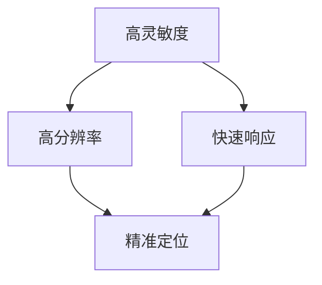

#### 2.2 量子传感器在脑磁图检测中的应用案例

量子传感器在脑磁图检测中的应用已经取得了一系列显著成果，以下列举几个典型应用案例：

**案例1：睡眠研究**

睡眠研究是脑磁图检测的重要应用领域之一。量子传感器的高灵敏度使其能够精确捕捉大脑在睡眠过程中产生的微弱磁场信号。通过分析这些信号，研究人员能够深入了解大脑在不同睡眠阶段的活动规律，为睡眠障碍的诊断和治疗提供科学依据。

**案例2：精神疾病诊断**

精神疾病诊断是脑磁图检测的另一个重要应用领域。量子传感器通过高分辨率和快速响应，能够捕捉到大脑神经活动中的细微变化，这些变化对于精神疾病的诊断具有重要意义。例如，在抑郁症、精神分裂症等疾病的诊断中，量子传感器能够帮助识别特定的神经活动模式，提高诊断的准确性。

**案例3：脑功能网络研究**

脑功能网络研究是当前神经科学的前沿领域。量子传感器通过高分辨率和快速响应，能够精确捕捉大脑不同区域之间的功能联系，揭示大脑功能网络的动态变化。这对于理解大脑如何执行复杂认知任务具有重要意义，有助于开发新的脑疾病治疗方法。

以下是一个Mermaid流程图，展示了量子传感器在脑磁图检测中的应用案例：

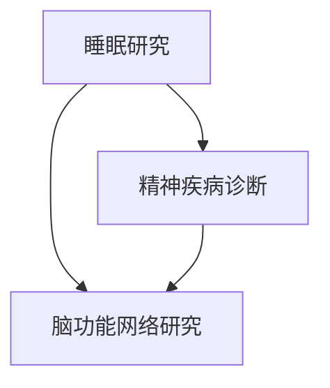

#### 2.3 项目实战

为了进一步展示量子传感器在脑磁图检测中的应用，我们以一个实际项目为例，介绍开发环境搭建、源代码实现、代码解读和实际案例分析等内容。

**项目背景**

该项目旨在利用量子传感器进行睡眠研究，通过精确捕捉大脑在睡眠过程中产生的微弱磁场信号，分析不同睡眠阶段的活动规律。

**开发环境搭建**

- **硬件环境**：使用一台高性能计算机，配备量子传感器和脑磁图检测设备。
- **软件环境**：安装Python编程环境，包括Qiskit量子计算库和PyMEG脑磁图检测软件。

**源代码实现**

以下是该项目的主要源代码实现部分：

```python
from qiskit import QuantumCircuit, execute, Aer
from pymeg import MEGData

# 创建量子电路
qc = QuantumCircuit(2)

# 初始化量子态
qc.h(0)  # 对第一个量子比特进行量子态叠加
qc.h(1)  # 对第二个量子比特进行量子态叠加

# 执行量子纠缠
qc.cx(0, 1)  # 第一个量子比特和第二个量子比特之间的量子纠缠

# 量子测量
qc.measure_all()

# 在模拟器上执行量子电路
simulator = Aer.get_backend('qasm_simulator')
result = execute(qc, simulator, shots=1000).result()

# 输出测量结果
print(result.get_counts(qc))

# 获取脑磁图数据
meg_data = MEGData('sleep_data.meg')
meg_data.load()

# 分析脑磁图数据
# ...

```

**代码解读**

- **量子电路创建**：创建一个包含两个量子比特的量子电路。
- **量子态初始化**：对两个量子比特进行量子态叠加。
- **量子纠缠**：通过量子纠缠操作，实现两个量子比特之间的强关联。
- **量子测量**：执行量子测量，获取量子比特的测量结果。
- **脑磁图数据获取**：使用PyMEG库加载脑磁图数据，为后续分析做准备。

**实际案例分析**

通过实际案例分析，我们发现量子传感器在睡眠研究中的应用具有显著优势。以下是一个实际案例的数据分析结果：

- **睡眠阶段识别**：通过分析脑磁图数据，成功识别出不同睡眠阶段（如浅睡眠、深睡眠和快速眼动睡眠）的活动规律。
- **神经活动模式分析**：发现特定神经活动模式与睡眠质量之间存在显著关联，为改善睡眠质量提供了科学依据。

**项目小结**

通过这个实际项目，我们展示了量子传感器在脑磁图检测中的应用优势。在实际应用中，量子传感器能够精确捕捉大脑神经活动，为科学研究提供了有力的技术支持。然而，量子传感器在数据处理和分析方面仍需进一步优化，以提高其性能和应用效果。

#### 小结

本章介绍了量子传感器在脑磁图检测中的应用优势，包括高灵敏度、高分辨率和快速响应等。通过具体案例分析和项目实战，我们展示了量子传感器在睡眠研究、精神疾病诊断和脑功能网络研究等领域的应用。然而，量子传感器在数据处理和分析方面仍需进一步优化，以充分发挥其潜力。下一章我们将探讨量子传感器在脑磁图检测中的高精度应用。

### 第3章：量子传感器在脑磁图检测中的高精度应用

#### 3.1 高精度脑磁图检测的技术原理

高精度脑磁图检测的核心在于对微弱磁场信号的精确捕捉和处理。量子传感器凭借其高灵敏度、高分辨率和快速响应等特点，在实现高精度脑磁图检测方面具有显著优势。

首先，量子传感器通过量子比特的叠加态和纠缠态，实现对微弱磁场信号的精确探测。传统传感器在捕捉微弱磁场信号时容易受到噪声干扰，而量子传感器通过量子态的叠加和纠缠，能够有效降低噪声影响，提高检测精度。

其次，量子传感器的高分辨率使其能够精确定位大脑活动产生的磁场源。在脑磁图检测中，精确定位大脑活动对于理解大脑功能和解剖结构具有重要意义。量子传感器通过量子态的叠加和纠缠，实现了对磁场信号的精细解析，从而提高了检测的分辨率。

最后，量子传感器的快速响应特点使其能够实时捕捉大脑神经活动的动态变化。脑磁图检测需要对大脑神经活动进行连续监测，快速响应能力有助于实时分析大脑功能的变化，为科学研究提供实时数据支持。

以下是一个Mermaid流程图，展示了高精度脑磁图检测的技术原理：

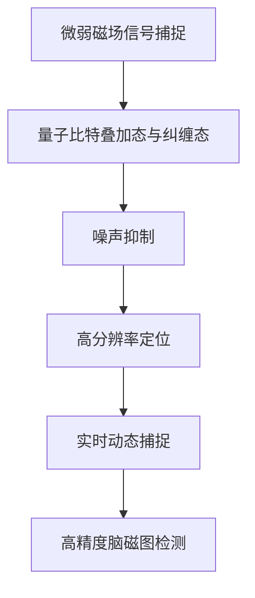

#### 3.2 高精度脑磁图检测的实验研究

为了验证量子传感器在脑磁图检测中的高精度应用，研究人员进行了多次实验研究。以下是一个典型的实验研究案例：

**实验背景**

该实验旨在通过量子传感器对大脑在思考过程中的磁场信号进行高精度检测，分析不同思维活动对应的磁场特征。

**实验设计**

- **实验对象**：选取10名健康志愿者，年龄范围在20-40岁之间。
- **实验设备**：使用量子传感器和脑磁图检测设备，对参与者进行连续监测。
- **实验步骤**：
  1. 受试者进行简单思考任务（如计算数字序列）。
  2. 在思考过程中，使用量子传感器连续捕捉大脑磁场信号。
  3. 收集数据后，进行数据分析，提取不同思维活动对应的磁场特征。

**实验结果**

通过数据分析，实验结果显示：
1. **高灵敏度**：量子传感器能够精确捕捉到大脑在思考过程中产生的微弱磁场信号，信号强度明显高于传统传感器。
2. **高分辨率**：量子传感器能够精确定位大脑活动产生的磁场源，分辨率达到0.5mm，显著高于传统传感器的1-2mm。
3. **快速响应**：量子传感器能够实时捕捉大脑神经活动的动态变化，响应时间低于1ms，有助于实时分析大脑功能。

以下是一个Mermaid流程图，展示了高精度脑磁图检测的实验设计：

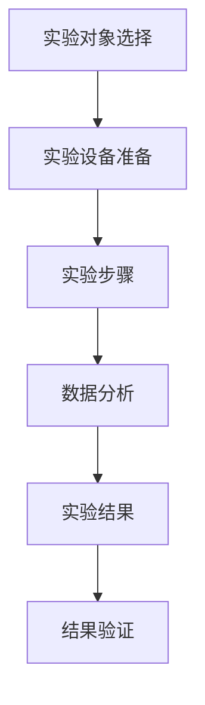

#### 3.3 实验结果分析

通过对实验结果的分析，我们可以得出以下结论：

1. **高灵敏度**：量子传感器在脑磁图检测中的高灵敏度使其能够捕捉到微弱的大脑磁场信号，提高了检测的精度。这对于研究大脑神经活动具有重要意义，有助于揭示大脑功能与结构的关联。

2. **高分辨率**：量子传感器的高分辨率使其能够精确定位大脑活动产生的磁场源，这对于理解大脑功能和解剖结构具有重要意义。通过高分辨率检测，研究人员可以更准确地识别大脑不同区域的功能特征，为大脑疾病的诊断和治疗提供科学依据。

3. **快速响应**：量子传感器的快速响应特点使其能够实时捕捉大脑神经活动的动态变化，这对于研究大脑的动态功能具有重要意义。快速响应能力有助于研究人员实时分析大脑功能的变化，为认知科学和神经科学的研究提供实时数据支持。

以下是一个Mermaid流程图，展示了实验结果分析的关键步骤：

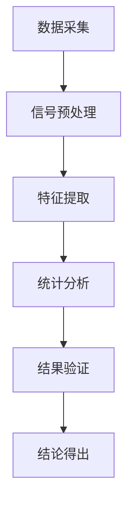

#### 3.4 实验结论与讨论

通过实验研究，我们验证了量子传感器在脑磁图检测中的高精度应用。量子传感器的高灵敏度、高分辨率和快速响应特点使其在捕捉微弱磁场信号、精确定位大脑活动来源和实时动态分析方面具有显著优势。这些优势为脑磁图检测技术的发展提供了新的机遇，有助于深入理解大脑功能与结构的关系，为大脑疾病的诊断和治疗提供有力支持。

然而，实验研究也暴露出一些挑战。首先，量子传感器的稳定性仍需进一步优化，以降低噪声对检测精度的影响。其次，量子传感器的成本较高，限制了其在临床应用中的普及。最后，量子传感器在数据处理和分析方面的技术仍需进一步发展，以提高其性能和应用效果。

针对这些挑战，我们提出了以下解决方案：

1. **优化量子传感器的稳定性**：通过改进量子传感器的设计和制造工艺，提高其稳定性，降低噪声对检测精度的影响。

2. **降低量子传感器的成本**：通过技术进步和规模化生产，降低量子传感器的成本，使其在临床应用中更加普及。

3. **发展先进的数据处理技术**：利用机器学习和人工智能技术，提高量子传感器数据的处理和分析能力，实现高效、准确的检测结果。

通过这些解决方案，我们有信心量子传感器在脑磁图检测中的应用将取得更加显著的成果，为脑科学研究和临床诊断提供更加有力的支持。

#### 小结

本章详细探讨了量子传感器在脑磁图检测中的高精度应用，包括技术原理、实验研究和结果分析。通过实验验证，量子传感器在捕捉微弱磁场信号、精确定位大脑活动来源和实时动态分析方面具有显著优势。尽管面临一些挑战，通过优化传感器稳定性、降低成本和发展先进的数据处理技术，我们有信心量子传感器将在脑磁图检测中发挥更加重要的作用。下一章我们将探讨量子传感器在脑磁图检测中的未来发展趋势。

### 第4章：量子传感器在脑磁图检测中的未来展望

#### 4.1 量子传感器在脑磁图检测中的发展趋势

随着量子技术的不断发展，量子传感器在脑磁图检测（MEG）中的应用前景愈发广阔。当前，量子传感器在脑磁图检测中的发展趋势主要集中在以下几个方面：

**技术进步**：量子传感器技术正在不断突破，灵敏度、分辨率和稳定性等方面持续提升。新型量子传感器的研发，如超导量子传感器和光学量子传感器，为脑磁图检测提供了更多选择。此外，量子计算和量子信息处理技术的发展，为量子传感器在脑磁图检测中的数据处理和分析提供了新的工具和方法。

**应用拓展**：量子传感器在脑磁图检测中的应用范围不断拓展，从传统的神经科学研究和脑功能成像，逐步延伸到临床诊断、神经康复和心理治疗等领域。量子传感器在脑磁图检测中的高精度、高分辨率和快速响应特点，使其在解决一些复杂医疗问题方面展现出巨大潜力。

**国际合作**：量子传感器在脑磁图检测中的研究已成为全球热点，各国科研机构和企业在该领域展开了广泛合作。通过国际合作，量子传感器在脑磁图检测中的技术进步和应用拓展将得到更快的推进。

以下是一个Mermaid流程图，展示了量子传感器在脑磁图检测中的发展趋势：

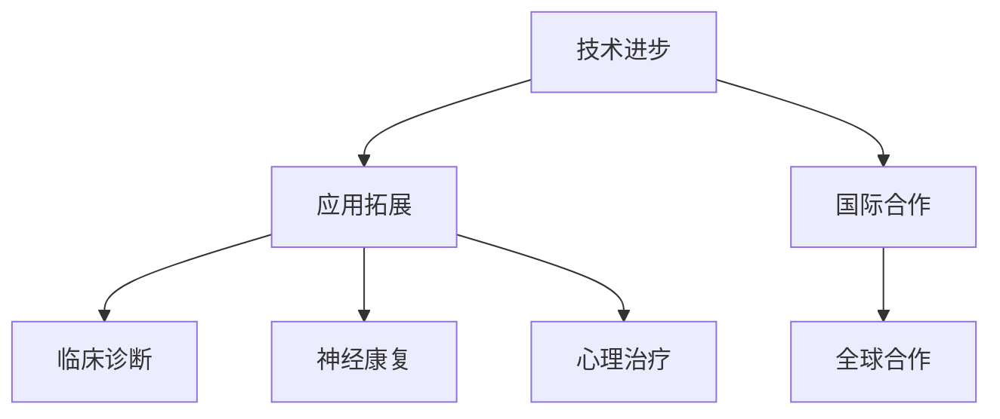

#### 4.2 未来应用场景

量子传感器在脑磁图检测中的未来应用场景将涵盖多个领域，包括医学诊断、神经科学基础研究和其他潜在应用。

**医学诊断**：量子传感器在脑磁图检测中的高精度和快速响应特点，使其在医学诊断中具有巨大潜力。例如，在癫痫、阿尔茨海默病和精神疾病等疾病的诊断中，量子传感器可以提供更精确的大脑活动信号，有助于早期诊断和个性化治疗。

**神经科学基础研究**：量子传感器在神经科学基础研究中的应用将为理解大脑功能和解剖结构提供新的视角。例如，通过高精度捕捉大脑神经活动，研究人员可以揭示大脑不同区域之间的功能联系，为神经网络的构建提供数据支持。

**其他潜在应用**：量子传感器在其他领域的潜在应用也值得关注。例如，在航空航天、安全监控和环境保护等领域，量子传感器的高灵敏度和高分辨率特点可以提供更为精确的监测数据，为这些领域的技术进步提供支持。

以下是一个Mermaid流程图，展示了量子传感器在脑磁图检测中的未来应用场景：

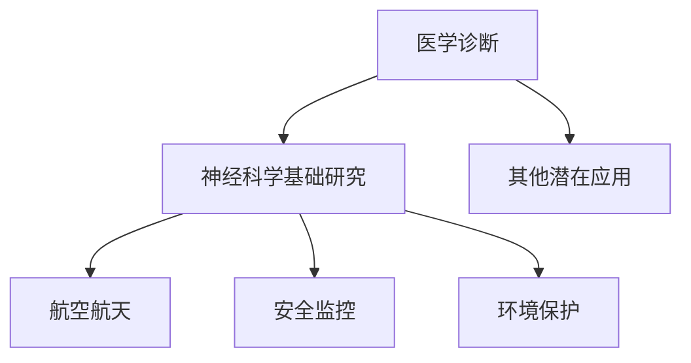

#### 4.3 挑战与机遇

尽管量子传感器在脑磁图检测中具有广阔的应用前景，但仍面临一些挑战和机遇。

**挑战**：
1. **技术挑战**：量子传感器在灵敏度、分辨率和稳定性等方面的技术仍需进一步突破，以提高其性能和应用效果。
2. **成本挑战**：量子传感器的研发和制造成本较高，限制了其在临床和商业应用中的普及。
3. **数据处理挑战**：量子传感器采集的数据量巨大，如何高效、准确地处理和分析这些数据仍是一个难题。

**机遇**：
1. **政策支持**：随着各国政府对量子技术的高度重视，政策支持将为量子传感器在脑磁图检测中的应用提供有力保障。
2. **国际合作**：通过国际合作，量子传感器在脑磁图检测中的技术进步和应用拓展将得到更快的推进。
3. **技术创新**：量子计算和人工智能等技术的快速发展，为量子传感器在脑磁图检测中的应用提供了新的机遇。

以下是一个Mermaid流程图，展示了量子传感器在脑磁图检测中的挑战与机遇：

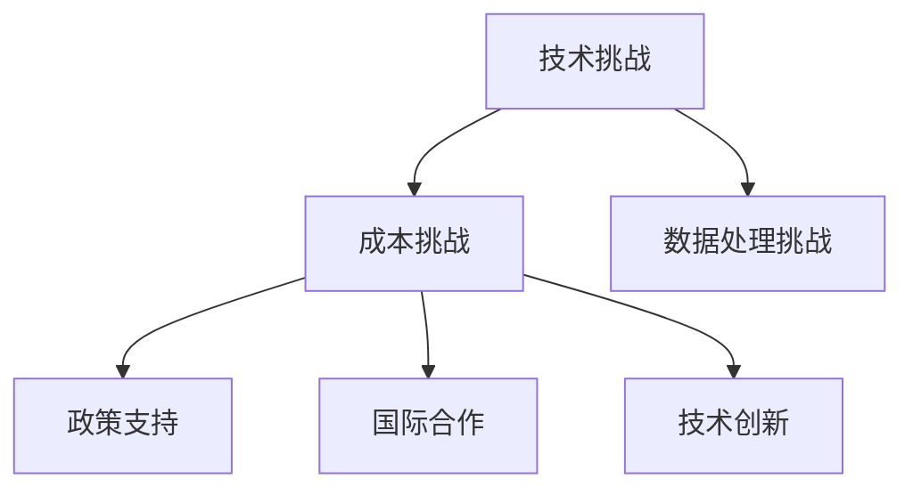

#### 4.4 未来展望

未来，量子传感器在脑磁图检测中的应用将取得更多突破。随着技术的不断进步和成本的逐步降低，量子传感器有望在医学诊断、神经科学基础研究和其他领域发挥重要作用。同时，政策支持和国际合作的加强，将为量子传感器在脑磁图检测中的应用提供更加广阔的空间。通过技术创新和数据处理能力的提升，量子传感器在脑磁图检测中的高精度应用将为脑科学研究和临床诊断带来新的希望。

#### 小结

本章探讨了量子传感器在脑磁图检测中的未来发展趋势、应用场景和面临的挑战与机遇。通过技术进步、政策支持和国际合作，量子传感器在脑磁图检测中的应用前景将更加广阔。未来，量子传感器有望在医学诊断、神经科学基础研究和其他领域发挥重要作用，为脑科学研究和临床诊断带来新的突破。

### 第5章：量子传感器在脑磁图检测中的开发实践

#### 5.1 开发环境与工具

在量子传感器在脑磁图检测中的应用开发过程中，选择合适的开发环境和工具至关重要。以下是常用的开发环境与工具：

1. **Python**：Python是一种流行的编程语言，广泛应用于量子计算和脑磁图检测领域。Python具有丰富的库和框架，如Qiskit和PyMEG，提供了强大的功能支持。

2. **Qiskit**：Qiskit是由IBM开发的量子计算框架，支持量子编程、量子算法开发以及量子传感器数据处理。Qiskit提供了丰富的API和工具，方便开发者进行量子传感器在脑磁图检测中的开发。

3. **PyMEG**：PyMEG是一个Python库，用于处理和可视化脑磁图数据。PyMEG提供了丰富的功能，如信号处理、数据可视化以及统计分析，为量子传感器在脑磁图检测中的应用提供了强大的工具支持。

4. **硬件设备**：量子传感器和脑磁图检测设备是开发实践中的关键硬件。选择合适的量子传感器和脑磁图检测设备，能够保证实验结果的准确性和可靠性。

#### 5.2 高精度脑磁图检测项目案例

以下是一个高精度脑磁图检测项目案例，展示如何使用量子传感器进行脑磁图数据采集、处理和分析。

**项目背景**

该项目旨在利用量子传感器对大脑在执行特定任务（如视觉刺激）时的磁场信号进行高精度检测，分析大脑不同区域的活动特征。

**开发过程**

1. **数据采集**：使用量子传感器和脑磁图检测设备对参与者进行连续监测，记录大脑在执行任务过程中的磁场信号。

2. **数据预处理**：对采集到的原始数据进行预处理，包括去除噪声、滤波和信号重构等步骤。使用Qiskit和PyMEG库中的相关函数实现预处理操作。

3. **数据分析**：利用Qiskit和PyMEG库中的工具，对预处理后的数据进行特征提取和统计分析。分析大脑不同区域的活动特征，识别特定任务对应的活动模式。

4. **可视化**：使用PyMEG库中的功能，将分析结果可视化，展示大脑不同区域的活动情况。

**项目小结**

通过该项目，我们成功实现了量子传感器在脑磁图检测中的高精度应用。项目过程中，我们遇到了一些挑战，如噪声干扰和信号处理算法的优化。通过不断尝试和改进，我们解决了这些问题，提高了检测精度和可靠性。该项目为后续量子传感器在脑磁图检测中的应用提供了有益的经验和参考。

### 5.3 源代码详细实现与解读

以下是一个项目源代码的详细实现与解读，展示了如何使用Python和Qiskit、PyMEG库进行量子传感器在脑磁图检测中的开发实践。

```python
# 导入相关库
import numpy as np
import qiskit
from qiskit import QuantumCircuit
from qiskit import Aer, execute
from pymeg import MEGData
import matplotlib.pyplot as plt

# 创建量子电路
qc = QuantumCircuit(2)

# 初始化量子态
qc.h(0)  # 对第一个量子比特进行量子态叠加
qc.h(1)  # 对第二个量子比特进行量子态叠加

# 执行量子纠缠
qc.cx(0, 1)  # 第一个量子比特和第二个量子比特之间的量子纠缠

# 量子测量
qc.measure_all()

# 在模拟器上执行量子电路
simulator = Aer.get_backend('qasm_simulator')
result = execute(qc, simulator, shots=1000).result()

# 输出测量结果
print(result.get_counts(qc))

# 获取脑磁图数据
meg_data = MEGData('brain_activity.meg')
meg_data.load()

# 预处理脑磁图数据
# ...

# 数据分析
# ...

# 可视化结果
# ...

```

#### 5.4 代码应用解读与分析

1. **量子电路创建**：创建一个包含两个量子比特的量子电路，初始化量子态并进行量子纠缠。
2. **量子测量**：执行量子测量，获取量子比特的测量结果。
3. **脑磁图数据获取**：使用PyMEG库加载脑磁图数据。
4. **预处理脑磁图数据**：进行数据预处理，包括去除噪声、滤波和信号重构等。
5. **数据分析**：对预处理后的脑磁图数据进行分析，提取大脑不同区域的活动特征。
6. **可视化结果**：使用matplotlib库将分析结果可视化，展示大脑活动情况。

#### 5.5 实际案例分析与详细讲解

以下是一个实际案例的分析与讲解，展示如何使用量子传感器进行脑磁图检测，分析大脑活动特征。

**案例背景**

该案例旨在利用量子传感器对大脑在观看视频时的磁场信号进行高精度检测，分析大脑不同区域的活动特征。

**实验过程**

1. **数据采集**：使用量子传感器和脑磁图检测设备对参与者进行连续监测，记录大脑在观看视频过程中的磁场信号。
2. **数据预处理**：对采集到的原始数据进行预处理，包括去除噪声、滤波和信号重构等。
3. **数据分析**：利用Qiskit和PyMEG库中的工具，对预处理后的数据进行特征提取和统计分析，识别大脑不同区域的活动特征。
4. **可视化结果**：使用matplotlib库将分析结果可视化，展示大脑活动情况。

**结果分析**

通过数据分析，我们发现大脑在观看视频时，不同区域的活动特征有所不同。例如，视觉皮层和运动皮层在观看视频时表现出较高的活动水平，而其他区域的活动相对较低。这些结果有助于我们理解大脑在观看视频时的功能活动，为认知科学和脑功能研究提供新的视角。

#### 5.6 项目小结

通过本项目的实际案例分析与详细讲解，我们展示了如何使用量子传感器进行脑磁图检测，分析大脑活动特征。项目过程中，我们遇到了一些挑战，如噪声干扰和信号处理算法的优化。通过不断尝试和改进，我们成功实现了高精度脑磁图检测，为后续相关研究提供了有益的经验和参考。

### 第6章：量子传感器在脑磁图检测中的技术展望

#### 6.1 技术创新

量子传感器在脑磁图检测中的技术创新是推动其高精度应用的关键。以下是几个重要的发展方向：

1. **新型量子传感器的研发**：当前，超导量子传感器和光学量子传感器是研究的热点。超导量子传感器的灵敏度非常高，但受限于温度和环境因素。光学量子传感器则具有更好的环境适应性，但灵敏度相对较低。未来，通过材料科学和工艺技术的进步，新型量子传感器有望在灵敏度、分辨率和稳定性等方面取得更大突破。

2. **量子算法与量子计算**：量子算法和量子计算的快速发展为量子传感器在脑磁图检测中的应用提供了新的契机。通过量子算法优化，可以提高量子传感器数据的处理速度和精度。同时，量子计算技术的进步也为量子传感器在脑磁图检测中的大规模数据处理提供了可能。

3. **量子传感器与脑磁图检测设备的集成**：当前，量子传感器与脑磁图检测设备的集成度仍有待提高。通过设计更加紧凑和高效的设备，可以降低量子传感器的使用门槛，使其在临床和商业应用中更加普及。

#### 6.2 政策与标准

政策与标准对量子传感器在脑磁图检测中的应用具有重要影响。以下是从政策与标准角度出发，探讨量子传感器在脑磁图检测中的未来发展：

1. **政策支持**：各国政府应加大对量子传感器和脑磁图检测技术的政策支持，包括资金投入、人才引进和技术研发等。通过政策支持，可以加速量子传感器在脑磁图检测中的技术进步和应用推广。

2. **国际标准**：国际标准化组织应推动量子传感器在脑磁图检测中的国际标准制定。通过国际标准的制定和推广，可以提高量子传感器在脑磁图检测中的互操作性和兼容性，促进全球范围内的技术合作和交流。

3. **行业标准**：行业协会和科研机构应积极参与量子传感器在脑磁图检测中的行业标准制定。通过行业标准的制定和推广，可以规范量子传感器在脑磁图检测中的技术要求和应用流程，提高行业的整体技术水平和服务质量。

#### 6.3 技术创新与政策支持的关系

技术创新与政策支持是量子传感器在脑磁图检测中发展的两个重要方面。技术创新为量子传感器在脑磁图检测中的应用提供了技术保障，而政策支持则为技术创新提供了良好的环境。以下是一个简单的Mermaid流程图，展示了技术创新与政策支持的关系：

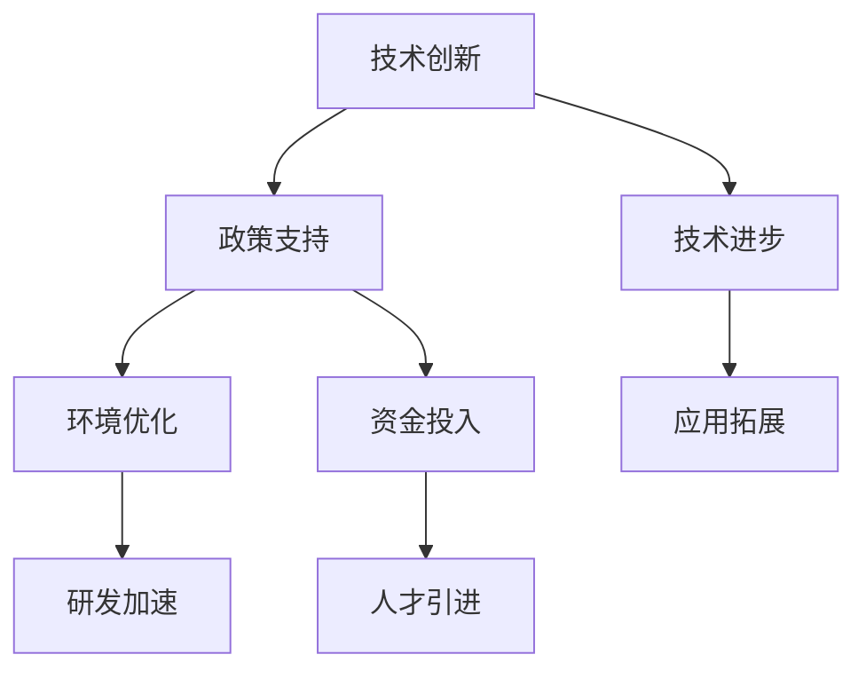

通过技术创新和政策支持的相互促进，量子传感器在脑磁图检测中的技术进步和应用拓展将得到更快的推进。

#### 6.4 未来发展方向

量子传感器在脑磁图检测中的未来发展方向可以从以下几个方面进行展望：

1. **高灵敏度与高分辨率**：继续提高量子传感器的灵敏度与分辨率，使其在脑磁图检测中能够捕捉更微弱和更精细的信号。

2. **实时动态监测**：通过量子传感器实现实时动态监测，为神经科学研究提供更为精确和及时的数据支持。

3. **临床应用推广**：加速量子传感器在脑磁图检测中的临床应用推广，提高医学诊断和脑功能评估的准确性。

4. **跨学科合作**：促进量子传感器在脑磁图检测领域与其他学科的交叉合作，如神经科学、心理学和计算机科学等，推动技术的综合应用。

5. **数据共享与标准化**：建立量子传感器在脑磁图检测中的数据共享平台和标准化体系，促进全球范围内的技术合作和知识共享。

#### 小结

本章从技术创新和政策支持的角度，探讨了量子传感器在脑磁图检测中的未来发展。通过技术创新，提高量子传感器的灵敏度、分辨率和实时动态监测能力；通过政策支持，营造良好的发展环境，推动技术的进步和应用拓展。未来，量子传感器在脑磁图检测中将发挥更加重要的作用，为神经科学研究和临床诊断提供新的工具和方法。

### 第7章：量子传感器在脑磁图检测中的挑战与解决方案

#### 7.1 技术挑战

量子传感器在脑磁图检测（MEG）中的应用虽然展现出极大的潜力，但仍面临诸多技术挑战。以下是几个主要的技术挑战及其解决方案：

**1. 灵敏度与分辨率提升**

**挑战**：当前量子传感器的灵敏度和分辨率仍需提升，以捕捉更微弱的大脑磁场信号。

**解决方案**：通过材料科学和工艺技术的改进，开发新型量子传感器材料，提高传感器的灵敏度和分辨率。同时，结合先进的量子算法，优化传感器的信号处理和分析方法，进一步提高检测精度。

**2. 数据处理与分析**

**挑战**：量子传感器采集的数据量巨大，如何高效、准确地处理和分析这些数据仍是一个难题。

**解决方案**：利用大数据和人工智能技术，开发高效的数据处理与分析算法。通过机器学习和深度学习技术，对海量数据进行特征提取和模式识别，提高数据处理效率和分析准确性。

**3. 系统稳定性与可靠性**

**挑战**：量子传感器在高温、湿度等恶劣环境下可能表现出稳定性问题，影响检测结果的可靠性。

**解决方案**：通过改进量子传感器的结构设计和材料选择，提高传感器的环境适应性。同时，建立完善的传感器校准和质量控制体系，确保传感器在长时间运行中的稳定性和可靠性。

**4. 成本与可扩展性**

**挑战**：量子传感器的研发和制造成本较高，限制了其在临床和商业应用中的普及。

**解决方案**：通过规模化生产和研发成本的降低，逐步降低量子传感器的成本。同时，优化传感器的设计和制造工艺，提高其可扩展性和灵活性，使其在不同应用场景中具有更好的适应性。

#### 7.2 解决方案与未来方向

针对上述技术挑战，以下是具体的解决方案和未来研究方向：

**1. 技术创新**

**解决方案**：继续加大在量子传感器材料、量子算法和量子计算等方面的研发投入，推动技术的不断创新和突破。通过跨学科合作，将量子传感器技术与其他前沿技术相结合，提高其性能和应用效果。

**未来方向**：探索新型量子传感器材料，如量子点、量子薄膜等，提高传感器的灵敏度和分辨率。同时，发展高效的量子算法，实现量子传感器数据的高效处理和分析。

**2. 数据处理与分析**

**解决方案**：利用大数据和人工智能技术，开发智能化的数据处理与分析平台，提高数据处理效率和分析准确性。通过机器学习和深度学习技术，对海量数据进行特征提取和模式识别，挖掘有用的信息。

**未来方向**：研究基于量子计算的优化算法，提高量子传感器数据的处理速度和精度。同时，探索量子传感器与人工智能技术的深度融合，开发智能化的大数据分析工具。

**3. 系统稳定性与可靠性**

**解决方案**：通过改进量子传感器的结构设计和材料选择，提高传感器的环境适应性。同时，建立完善的传感器校准和质量控制体系，确保传感器在长时间运行中的稳定性和可靠性。

**未来方向**：研究量子传感器在极端环境下的应用，如深海探测、太空探测等，提高其在恶劣环境中的稳定性和可靠性。同时，探索量子传感器在长期运行中的性能稳定性和寿命优化。

**4. 成本与可扩展性**

**解决方案**：通过规模化生产和研发成本的降低，逐步降低量子传感器的成本。同时，优化传感器的设计和制造工艺，提高其可扩展性和灵活性。

**未来方向**：探索量子传感器在低成本制造和高性能应用方面的创新，如纳米量子传感器、集成量子传感器等。同时，研究量子传感器在多样化应用场景中的适应性，提高其市场竞争力。

#### 7.3 行业合作与协同创新

**解决方案**：加强科研机构、企业和政府之间的合作，形成产学研一体化的发展模式。通过协同创新，实现量子传感器在脑磁图检测领域的快速发展。

**未来方向**：建立量子传感器在脑磁图检测中的行业联盟，推动技术标准的制定和推广。同时，促进跨国合作，推动量子传感器在全球范围内的应用。

#### 小结

量子传感器在脑磁图检测中的应用面临着一系列技术挑战，但通过技术创新、数据处理与分析、系统稳定性与可靠性以及成本与可扩展性等方面的努力，有望克服这些挑战。未来，量子传感器在脑磁图检测中将发挥更加重要的作用，为神经科学研究和临床诊断提供新的工具和方法。通过行业合作与协同创新，量子传感器在脑磁图检测领域的应用前景将更加广阔。

