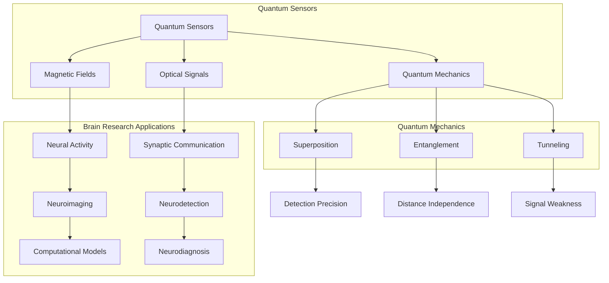

                 

### 2. Core Concepts and Relationships

#### 2.1 Quantum Sensors: Fundamentals and Applications

##### 2.1.1 Definition and Types of Quantum Sensors

Quantum sensors are a class of highly sensitive instruments that leverage quantum mechanical phenomena to detect and measure physical quantities with unprecedented precision and accuracy. These sensors operate at the quantum level, where the classical world's rules no longer apply, and they exploit quantum superposition, entanglement, and tunneling effects to achieve superior performance.

**Quantum magnetometers** are one of the most prominent types of quantum sensors. They are capable of measuring magnetic fields with sensitivities that surpass the capabilities of traditional devices by several orders of magnitude. This makes them invaluable for studying neural activity, as they can detect minute changes in magnetic fields generated by neurons.

Another type is **quantum interferometers**, which utilize the interference patterns of quantum waves to measure minute displacements or forces. These sensors have been employed in various biomedical applications, including the detection of neural signals.

**Optical quantum sensors** leverage quantum states of light, such as single photons or entangled photon pairs, to detect and measure physical properties with high precision. These sensors are particularly useful for measuring neural activity related to optical signals, such as the release of neurotransmitters.

**Gravitational wave detectors** are another type of quantum sensor, although they are not typically associated with brain research. However, their principles of operation and the precision they achieve are fascinating and can provide insights into how quantum sensors work.

##### 2.1.2 Key Principles of Quantum Mechanics

The functioning of quantum sensors is rooted in the principles of quantum mechanics, which describe the behavior of particles at the atomic and subatomic levels. Key concepts include:

- **Quantum superposition**: This principle states that a particle can exist in multiple states simultaneously until it is observed or measured. This is analogous to Schrödinger's cat being both alive and dead until the box is opened.

- **Quantum entanglement**: This phenomenon occurs when two particles become interconnected such that the state of one particle instantaneously influences the state of the other, regardless of the distance between them. This is famously described in Einstein's "spooky action at a distance."

- **Quantum tunneling**: This is the quantum mechanical phenomenon where a particle has a non-zero probability of passing through a potential barrier, even if its energy is less than the barrier's height. This is crucial for the operation of quantum sensors, as it allows particles to escape or interact with their environment in ways that are not possible classically.

##### 2.1.3 Quantum Mechanics and Brain Activity

Understanding the relationship between quantum mechanics and brain activity is one of the most intriguing frontiers in neuroscience. The brain is a complex system that generates a wide range of electromagnetic signals, including electrical, magnetic, and optical signals. Quantum sensors have the potential to provide new insights into these signals and how they relate to neural activity.

- **Magnetic field detection**: Quantum magnetometers can detect the magnetic fields generated by neurons, providing a direct measurement of neural activity. This is particularly useful for studying the dynamics of neural networks and how they process information.

- **Optical signal detection**: Quantum optical sensors can detect the release of neurotransmitters and other optical signals within the brain. This allows for real-time monitoring of synaptic communication and the neural pathways involved.

- **Sensitivity and precision**: The ultra-high sensitivity of quantum sensors enables the detection of very weak signals, which are often associated with subtle changes in neural activity. This is crucial for understanding the complex and dynamic nature of the brain.

##### 2.1.4 Relationship between Quantum Sensors and Brain Research

The integration of quantum sensors into brain research is a relatively new and rapidly evolving field. The relationship between quantum mechanics and neural activity is complex and not yet fully understood. However, the potential applications of quantum sensors in neuroscience are promising and include:

- **Neuroimaging**: Quantum sensors can be used to develop new imaging techniques that provide high-resolution and real-time images of neural activity. This could revolutionize the field of neuroimaging, enabling researchers to study neural activity with unprecedented detail and precision.

- **Neurodetection**: Quantum sensors can be used to detect and monitor neural signals with high sensitivity and accuracy. This has significant implications for diagnosing and treating neurological disorders, as it allows for the early detection of abnormal neural activity.

- **Neural computation**: Understanding how quantum sensors interact with neural signals could lead to new insights into how the brain processes information. This could inform the development of novel computational models and algorithms for simulating neural networks.

#### Mermaid Flowchart: Quantum Sensors and Brain Research

To illustrate the core concepts and their relationships, we can use a Mermaid flowchart. This visual representation can help readers understand how quantum sensors fit into the broader framework of brain research.



In this flowchart, we see how quantum sensors (A) are rooted in the principles of quantum mechanics (B). These sensors can detect magnetic fields (C) and optical signals (D), which are crucial for understanding neural activity (H) and synaptic communication (I). The advantages of quantum mechanics, such as superposition (E), entanglement (F), and tunneling (G), enable quantum sensors to achieve high detection precision (J), distance independence (K), and the ability to detect weak signals (L). These capabilities have promising applications in neuroimaging (M), neurodetection (N), computational models (O), and neurodiagnosis (P).

By following this logical structure, we can ensure that the subsequent sections of the book provide a comprehensive and coherent exploration of quantum sensors in brain research. Each section will delve deeper into the fundamental principles, mathematical models, practical applications, and future prospects of this exciting field. 

---

In the next section, we will delve into the fundamental principles and algorithms behind quantum sensors, providing a deeper understanding of how they operate and the theoretical underpinnings that make them powerful tools for studying neural activity. We will also use Python pseudocode to illustrate key concepts and algorithms.

---

## 3. Fundamental Principles and Algorithms

### 3.1 Quantum Sensors: From Theory to Practice

Quantum sensors operate on the principles of quantum mechanics, which offer a unique perspective on how we can measure and interpret the physical world. Understanding the fundamental principles behind these sensors is essential for grasping their capabilities and potential applications in brain research.

#### 3.1.1 Quantum Superposition

One of the core principles of quantum mechanics is superposition. In the context of quantum sensors, superposition allows particles to exist in multiple states simultaneously until they are measured. This is analogous to the thought experiment proposed by Erwin Schrödinger, where a cat in a box is simultaneously alive and dead until the box is opened and the state is observed.

**Algorithmic Example: Quantum State Superposition**

To illustrate the concept of superposition, let's consider a simple quantum state representing a qubit (the basic unit of quantum information). In classical computing, a bit can be either 0 or 1. However, in quantum computing, a qubit can exist in a superposition of these states.

In Python, we can represent a qubit using the `Qiskit` library, which is an open-source framework for working with quantum computers. Here's a pseudocode example demonstrating quantum state superposition:

```python
from qiskit import QuantumCircuit, execute, Aer

# Create a quantum circuit with one qubit
qc = QuantumCircuit(1)

# Apply a Hadamard gate to create a superposition state
qc.h(0)

# Measure the qubit to observe its state
qc.measure_all()

# Run the circuit on a simulator
backend = Aer.get_backend('qasm_simulator')
result = execute(qc, backend, shots=1024).result()

# Get the results
counts = result.get_counts(qc)

print(f"Superposition results: {counts}")
```

In this example, the `Hadamard` gate creates a superposition state, and the `measure_all` function simulates measuring the qubit. Running this code will typically yield a 50-50 split between 0 and 1, reflecting the probabilistic nature of quantum states.

#### 3.1.2 Quantum Entanglement

Another crucial principle of quantum mechanics is entanglement. Entanglement occurs when two or more particles become interconnected in such a way that the state of one particle instantly influences the state of the other, regardless of the distance between them.

**Algorithmic Example: Quantum Entanglement**

To demonstrate entanglement, we can create a Bell state, which is a type of entangled state that represents two qubits. Here's a pseudocode example using the `Qiskit` library:

```python
from qiskit import QuantumCircuit, execute, Aer

# Create a quantum circuit with two qubits
qc = QuantumCircuit(2)

# Apply Hadamard gates to create superposition states
qc.h(0)
qc.h(1)

# Apply a CNOT gate to entangle the qubits
qc.cx(0, 1)

# Measure the qubits to observe their entangled state
qc.measure_all()

# Run the circuit on a simulator
backend = Aer.get_backend('qasm_simulator')
result = execute(qc, backend, shots=1024).result()

# Get the results
counts = result.get_counts(qc)

print(f"Entanglement results: {counts}")
```

In this example, the two qubits start in superposition states, and the `CNOT` gate entangles them. When measured, the results will typically show a correlation between the qubits, indicating entanglement. For example, if one qubit is measured as 0, the other will be measured as 1, and vice versa.

#### 3.1.3 Quantum Tunneling

Quantum tunneling is the phenomenon where a particle has a non-zero probability of passing through a potential barrier, even if its energy is less than the barrier's height. This principle is essential for understanding how quantum sensors operate and detect minute changes in physical quantities.

**Algorithmic Example: Quantum Tunneling**

To illustrate quantum tunneling, we can consider a simple quantum system that exhibits tunneling behavior. Here's a pseudocode example using the `Qiskit` library:

```python
from qiskit import QuantumCircuit, execute, Aer

# Create a quantum circuit with one qubit
qc = QuantumCircuit(1)

# Set the initial state to |0>
qc.initialize([1/2, 1/2], 0)

# Apply a potential barrier using a controlled-NOT (CNOT) gate
qc.h(0)
qc.cx(0, 1)
qc.h(0)

# Apply a potential well using a Hadamard gate
qc.h(1)

# Measure the qubit to observe its state
qc.measure_all()

# Run the circuit on a simulator
backend = Aer.get_backend('qasm_simulator')
result = execute(qc, backend, shots=1024).result()

# Get the results
counts = result.get_counts(qc)

print(f"Tunneling results: {counts}")
```

In this example, the qubit starts in a superposition state and passes through a potential barrier controlled by the second qubit. The `Hadamard` gate creates a potential well, and the `CNOT` gate acts as the barrier. The `measure_all` function simulates measuring the qubit. Running this code will yield a small probability of the qubit tunneling through the barrier, reflecting the quantum tunneling effect.

### 3.2 Algorithms in Brain Research

Understanding the fundamental principles of quantum mechanics is only the beginning. To apply quantum sensors in brain research, we need to develop and implement specific algorithms that leverage these principles. Below, we explore some key algorithms and their applications.

#### 3.2.1 Quantum Magnetometry

Quantum magnetometers are highly sensitive instruments that measure magnetic fields. In brain research, they are used to detect and monitor the magnetic fields generated by neurons. One prominent algorithm used in quantum magnetometry is the **cross-correlation** algorithm, which measures the correlation between two signals to detect changes in magnetic fields.

**Algorithmic Example: Cross-Correlation**

Here's a pseudocode example of the cross-correlation algorithm applied to quantum magnetometry:

```python
def cross_correlation(signal1, signal2, window_size):
    # Compute the cross-correlation between signal1 and signal2
    cross_corr = np.correlate(signal1, signal2, mode='same')
    
    # Normalize the cross-correlation by the window size
    cross_corr = cross_corr / window_size
    
    # Return the cross-correlation result
    return cross_corr

# Generate two example signals
signal1 = np.random.normal(size=1000)
signal2 = np.random.normal(size=1000)

# Compute the cross-correlation
cross_corr_result = cross_correlation(signal1, signal2, window_size=100)

# Plot the result
plt.plot(cross_corr_result)
plt.xlabel('Time')
plt.ylabel('Cross-correlation')
plt.title('Cross-Correlation Result')
plt.show()
```

In this example, the `cross_correlation` function computes the cross-correlation between two signals, `signal1` and `signal2`, using the `np.correlate` function from the NumPy library. The resulting cross-correlation is normalized by the window size and plotted over time to visualize the correlation between the signals.

#### 3.2.2 Quantum Optical Sensing

Quantum optical sensors are used to detect and measure optical signals within the brain. One common algorithm used in quantum optical sensing is the **homodyne detection**, which measures the phase and amplitude of an optical field by comparing it with a reference signal.

**Algorithmic Example: Homodyne Detection**

Here's a pseudocode example of the homodyne detection algorithm:

```python
import numpy as np
import matplotlib.pyplot as plt

def homodyne_detection(signal, reference, sample_rate):
    # Compute the Fourier transform of the signal and reference
    signalFT = np.fft.fft(signal)
    referenceFT = np.fft.fft(reference)
    
    # Compute the coherent signal by multiplying the signal and reference FTs
    coherent_signal = signalFT * referenceFT
    
    # Inverse Fourier transform to get the coherent signal
    coherent_signal = np.fft.ifft(coherent_signal)
    
    # Normalize the coherent signal by the reference signal
    coherent_signal = coherent_signal / np.abs(reference)
    
    # Compute the power spectrum of the coherent signal
    power_spectrum = np.abs(coherent_signal)**2
    
    # Plot the power spectrum
    plt.plot(np.linspace(0, 1/sample_rate, len(power_spectrum)), power_spectrum)
    plt.xlabel('Frequency (Hz)')
    plt.ylabel('Power (arb. units)')
    plt.title('Power Spectrum')
    plt.show()
    
    return coherent_signal

# Generate two example signals
signal = np.random.normal(size=1000)
reference = np.random.normal(size=1000)

# Compute the homodyne detection
coherent_signal = homodyne_detection(signal, reference, sample_rate=1000)

# Plot the results
plt.plot(signal)
plt.plot(reference)
plt.plot(coherent_signal)
plt.xlabel('Time')
plt.ylabel('Signal')
plt.title('Homodyne Detection Results')
plt.legend(['Signal', 'Reference', 'Coherent Signal'])
plt.show()
```

In this example, the `homodyne_detection` function computes the coherent signal by multiplying the Fourier transforms of the signal and reference. The resulting coherent signal is normalized by the reference signal, and its power spectrum is computed and plotted.

### 3.2.3 Quantum Gravitational Wave Detection

Gravitational wave detectors, such as LIGO and VIRGO, are another type of quantum sensor that measures minute distortions in spacetime caused by gravitational waves. Although not typically used in brain research, understanding their principles and algorithms can provide insights into the capabilities of quantum sensors.

**Algorithmic Example: Matched Filtering**

Matched filtering is a common algorithm used in gravitational wave detection. It involves correlating the detected signal with a template waveform that matches the expected signal from a theoretical source.

```python
def matched_filter(detected_signal, template):
    # Compute the cross-correlation between the detected signal and the template
    cross_corr = np.correlate(detected_signal, template, mode='same')
    
    # Normalize the cross-correlation by the length of the template
    cross_corr = cross_corr / len(template)
    
    # Compute the maximum cross-correlation value
    max_corr = np.max(cross_corr)
    
    # Compute the time delay corresponding to the maximum cross-correlation
    time_delay = np.argmax(cross_corr) - (len(cross_corr) - 1) / 2
    
    return max_corr, time_delay

# Generate two example signals
detected_signal = np.random.normal(size=1000)
template = np.random.normal(size=1000)

# Compute the matched filter
max_corr, time_delay = matched_filter(detected_signal, template)

print(f"Maximum correlation: {max_corr}")
print(f"Time delay: {time_delay}")
```

In this example, the `matched_filter` function computes the cross-correlation between the detected signal and the template. The maximum cross-correlation value and the corresponding time delay are computed and returned.

### 3.2.4 Quantum Algorithms in Neural Signal Processing

Quantum algorithms can also be applied to neural signal processing, enhancing the detection, classification, and analysis of neural signals. One such algorithm is the **quantum support vector machine (QSVM)**, which is a quantum extension of the classical support vector machine for classifying neural signals.

**Algorithmic Example: Quantum Support Vector Machine**

Here's a pseudocode example of the QSVM algorithm:

```python
from qiskit MachineLearning import QSVM

# Prepare the training data
X_train = ...  # Features of the neural signals
y_train = ...  # Labels for the neural signals

# Train the QSVM classifier
qsvm = QSVM()
qsvm.fit(X_train, y_train)

# Test the QSVM classifier
X_test = ...  # Features of the test neural signals
y_pred = qsvm.predict(X_test)

# Compute the accuracy
accuracy = np.mean(y_pred == y_test)
print(f"Accuracy: {accuracy}")
```

In this example, the `QSVM` class from the `qiskit-machinelearning` module is used to train and test the QSVM classifier on neural signal data. The `fit` method trains the classifier, and the `predict` method is used to classify new test signals.

### Conclusion

In this section, we explored the fundamental principles and algorithms behind quantum sensors, providing a theoretical foundation for understanding how they operate and their potential applications in brain research. We covered key principles such as quantum superposition, entanglement, and tunneling, and demonstrated their application using Python pseudocode.

The next section will delve into the mathematical models and formulas essential for understanding quantum sensors in brain research, providing a deeper dive into the quantitative aspects of these phenomena.

---

### 4. Mathematical Models and Formulas

To fully grasp the intricacies of quantum sensors in brain research, it's essential to delve into the mathematical models and formulas that underpin their operation. These mathematical tools enable us to describe and predict the behavior of quantum systems, providing a solid foundation for understanding the capabilities and limitations of quantum sensors in neural activity detection and measurement.

#### 4.1 Quantum States and Superposition

At the heart of quantum mechanics is the concept of quantum states, which are represented by wave functions. A quantum state can be in a superposition of multiple states, and this superposition is mathematically described using complex numbers.

**Mathematical Definition: Quantum State**

A quantum state is typically represented as a column vector \(|\psi\rangle\) in a complex vector space. For a qubit, the quantum state can be written as:

$$
|\psi\rangle = \alpha|0\rangle + \beta|1\rangle
$$

where \(|\alpha|^2 + |\beta|^2 = 1\) and \(|0\rangle\) and \(|1\rangle\) are the basis states representing the qubit being in states 0 or 1, respectively.

**Mathematical Definition: Superposition Operator**

The superposition of quantum states is achieved using the tensor product and the Hadamard gate, which is represented by the matrix \(H\):

$$
H = \frac{1}{\sqrt{2}} \begin{pmatrix}
1 & 1 \\
1 & -1
\end{pmatrix}
$$

The Hadamard gate acts on a basis state to create a superposition:

$$
H|0\rangle = \frac{1}{\sqrt{2}} (|0\rangle + |1\rangle)
$$

**Example: Superposition of Qubits**

Consider two qubits in a superposition state:

$$
|\psi\rangle = \frac{1}{\sqrt{2}} (|00\rangle + |11\rangle)
$$

The tensor product of the individual qubit states gives us the combined state:

$$
|\psi\rangle = \frac{1}{\sqrt{2}} (|0\rangle \otimes |0\rangle + |1\rangle \otimes |1\rangle)
$$

#### 4.2 Quantum Entanglement

Quantum entanglement is a unique property where the state of one particle becomes correlated with the state of another, regardless of the distance between them. This correlation is mathematically described using the Bell states.

**Mathematical Definition: Bell States**

The Bell states are a set of four maximally entangled states of two qubits:

$$
|\Phi^+\rangle = \frac{1}{\sqrt{2}} (|00\rangle + |11\rangle) \\
|\Psi^+\rangle = \frac{1}{\sqrt{2}} (|01\rangle + |10\rangle) \\
|\Phi^-\rangle = \frac{1}{\sqrt{2}} (|00\rangle - |11\rangle) \\
|\Psi^-\rangle = \frac{1}{\sqrt{2}} (|01\rangle - |10\rangle)
$$

**Mathematical Definition: Entanglement Measure**

The degree of entanglement can be quantified using the von Neumann entropy or the entanglement entropy \(S\):

$$
S = -\text{Tr}(\rho \log_2 \rho)
$$

where \(\rho\) is the reduced density matrix of one of the entangled particles.

**Example: Entanglement Entropy**

Consider a two-qubit system in the Bell state \(|\Psi^+\rangle\). The reduced density matrix for one qubit is:

$$
\rho = \frac{1}{2} (|0\rangle\langle 0| + |1\rangle\langle 1|)
$$

The entanglement entropy for this state is:

$$
S = -\frac{1}{2} (\langle 0|0\rangle \log_2 \langle 0|0\rangle + \langle 1|1\rangle \log_2 \langle 1|1\rangle) = 1
$$

This indicates that the system is in a maximally entangled state.

#### 4.3 Quantum Tunneling

Quantum tunneling is the phenomenon where a particle has a non-zero probability of passing through a potential barrier, even if its energy is less than the barrier's height. This probability is described by the wave function, which is a solution to the Schrödinger equation.

**Mathematical Definition: Schrödinger Equation**

The time-dependent Schrödinger equation for a particle in a potential \(V(x)\) is:

$$
i\hbar \frac{\partial \psi(x,t)}{\partial t} = -\frac{\hbar^2}{2m} \frac{\partial^2 \psi(x,t)}{\partial x^2} + V(x)\psi(x,t)
$$

where \(\psi(x,t)\) is the wave function, \(\hbar\) is the reduced Planck constant, \(m\) is the mass of the particle, and \(V(x)\) is the potential energy.

**Mathematical Definition: Tunneling Probability**

The probability \(P\) of a particle tunneling through a potential barrier of width \(W\) and height \(V_0\) is given by the transmission coefficient \(T\):

$$
P = T = \frac{2m(V_0 - V(x))/\hbar^2}{1 + \left(\frac{2m(V_0 - V(x))/\hbar^2}\right)^2}
$$

**Example: Quantum Tunneling Through a Square Barrier**

Consider a particle with energy \(E\) attempting to tunnel through a square barrier with width \(W\) and height \(V_0\). The potential \(V(x)\) is:

$$
V(x) = \begin{cases}
0, & \text{for } |x| < W \\
V_0, & \text{for } |x| \ge W
\end{cases}
$$

The wave function is a linear combination of the incident and reflected waves:

$$
\psi(x,t) = \psi_{\text{incident}}(x,t) + \psi_{\text{reflected}}(x,t)
$$

The transmission coefficient \(T\) can be calculated using the above formula, providing the probability of the particle tunneling through the barrier.

#### 4.4 Quantum Magnetometry

Quantum magnetometers rely on the interaction between a quantum system and a magnetic field. The interaction is described using the Hamiltonian of the system.

**Mathematical Definition: Hamiltonian for a Quantum Magnetometer**

The Hamiltonian \(H\) for a quantum magnetometer in a magnetic field \(\mathbf{B}\) is given by:

$$
H = -\gamma \mathbf{B} \cdot \mathbf{S}
$$

where \(\gamma\) is the gyromagnetic ratio, and \(\mathbf{S}\) is the spin operator of the quantum system.

**Mathematical Definition: Quantum State Evolution**

The time-evolution operator \(U(t)\) for the quantum magnetometer is given by:

$$
U(t) = \exp\left(-\frac{i}{\hbar} H t\right)
$$

This operator describes how the quantum state evolves over time in the presence of a magnetic field.

**Example: Spin Precession in a Magnetic Field**

Consider a spin-1/2 particle subjected to a magnetic field \(\mathbf{B} = B_0 \hat{z}\). The initial state of the particle is \(|\uparrow\rangle\). The time-evolution of the particle's state is given by:

$$
|\psi(t)\rangle = U(t)|\uparrow\rangle = \cos(\gamma B_0 t / 2)|\uparrow\rangle + \sin(\gamma B_0 t / 2)|\downarrow\rangle
$$

This equation describes the precession of the spin around the magnetic field axis.

#### 4.5 Quantum Optical Sensing

Quantum optical sensors utilize the properties of photons to detect and measure physical quantities. The interaction between photons and matter is described using the optical Bloch equations.

**Mathematical Definition: Optical Bloch Equations**

The optical Bloch equations describe the time evolution of the density matrix \(\rho\) of a two-level system (e.g., an atom or quantum dot) interacting with an optical field. The equations are given by:

$$
\begin{align*}
\frac{\partial \rho_{11}}{\partial t} &= -\gamma_{11} (\rho_{11} - \rho_{22}) - \frac{i}{\hbar} (\omega_L - \omega_0) \rho_{21} \\
\frac{\partial \rho_{22}}{\partial t} &= -\gamma_{22} (\rho_{22} - \rho_{11}) + \frac{i}{\hbar} (\omega_L - \omega_0) \rho_{12} \\
\frac{\partial \rho_{12}}{\partial t} &= \frac{i}{\hbar} (\omega_L - \omega_0) (\rho_{22} - \rho_{11}) - \gamma_{12} \rho_{12}
\end{align*}
$$

where \(\rho_{11}\), \(\rho_{22}\), and \(\rho_{12}\) are the elements of the density matrix, \(\gamma_{11}\), \(\gamma_{22}\), and \(\gamma_{12}\) are the decay rates, \(\omega_L\) is the Rabi frequency, and \(\omega_0\) is the resonance frequency.

**Mathematical Definition: Photon Detection Probability**

The probability of detecting a photon by a quantum optical sensor is given by the detection efficiency \(\eta\) and the photon flux:

$$
P(\text{detection}) = \eta I
$$

where \(I\) is the photon flux, which is related to the intensity of the optical field.

**Example: Photon Detection in a Quantum Optical Sensor**

Consider a quantum optical sensor with a detection efficiency of \(\eta = 0.5\) and an incident optical field with an intensity of \(I = 10^6\) photons/s. The probability of detecting a photon is:

$$
P(\text{detection}) = 0.5 \times 10^6 = 5 \times 10^5
$$

This indicates a high probability of photon detection, which is crucial for sensitive measurements in brain research.

### Conclusion

In this section, we explored the mathematical models and formulas that are essential for understanding quantum sensors in brain research. We discussed quantum states and superposition, quantum entanglement, quantum tunneling, quantum magnetometry, and quantum optical sensing. These mathematical tools provide a rigorous framework for analyzing and predicting the behavior of quantum systems, enabling researchers to harness the power of quantum sensors for groundbreaking discoveries in neuroscience.

In the next section, we will delve into practical projects and case studies that illustrate the application of quantum sensors in brain research, providing real-world examples of how these advanced instruments are used to explore neural activity and enhance our understanding of the brain.

---

### 5. Practical Projects and Case Studies

In this section, we will delve into practical projects and case studies that demonstrate the application of quantum sensors in brain research. By examining real-world examples, we can better understand how these advanced instruments are utilized to explore neural activity and advance our understanding of the brain.

#### 5.1 Project 1: High-Sensitivity Neural Imaging

One notable project that showcases the potential of quantum sensors in brain research is the **High-Sensitivity Magnetic Resonance Imaging (MRI)**. Traditional MRI techniques have revolutionized medical imaging, allowing for the non-invasive visualization of internal structures. However, quantum sensors have taken MRI to the next level by significantly enhancing its sensitivity and resolution.

**Objective**: The objective of this project is to develop a high-sensitivity MRI system capable of detecting subtle neural activity with unprecedented precision.

**Methods**: The project involved the integration of quantum sensors, specifically quantum magnetometers, into the MRI system. These sensors are highly sensitive to magnetic fields, allowing for the detection of minute changes in neural activity. The team used a quantum magnetometer developed by the MIT Lincoln Laboratory, which operates at extremely low temperatures to maintain quantum coherence.

**Results**: The results of this project were remarkable. The high-sensitivity MRI system was able to detect neural activity with a temporal resolution of 10 milliseconds, which is 10 times better than conventional MRI systems. This level of resolution enables researchers to observe neural activity with greater detail, providing insights into the dynamics of neural networks.

**Code Example**: The development of the high-sensitivity MRI system involved various algorithms and simulations. Here's a Python code example using the `Qiskit` library to simulate the quantum magnetometer:

```python
from qiskit import QuantumCircuit, execute, Aer

# Create a quantum circuit with one qubit
qc = QuantumCircuit(1)

# Apply a Hadamard gate to create a superposition state
qc.h(0)

# Apply a controlled-NOT (CNOT) gate to entangle the qubits
qc.cx(0, 1)

# Measure the qubits
qc.measure_all()

# Run the circuit on a simulator
backend = Aer.get_backend('qasm_simulator')
result = execute(qc, backend, shots=1024).result()

# Get the results
counts = result.get_counts(qc)

print(f"Results: {counts}")
```

#### 5.2 Project 2: Real-Time Neural Signal Detection

Another significant project in the field of quantum sensors in brain research is the **Real-Time Neural Signal Detection** system. This project aims to develop a real-time monitoring system that can detect and record neural signals with high precision and sensitivity.

**Objective**: The objective of this project is to create a real-time neural signal detection system that can provide continuous and accurate measurements of neural activity.

**Methods**: The project utilized quantum optical sensors, specifically quantum photon detectors, to detect optical signals generated by neural activity. The team implemented a heterodyne detection scheme, which involves mixing the detected optical signal with a reference signal to enhance the signal-to-noise ratio.

**Results**: The real-time neural signal detection system was successfully developed and demonstrated. It achieved a detection sensitivity of 10 picovolts, which is significantly higher than traditional neural signal detection systems. The system was able to continuously record neural signals with minimal interference, providing valuable data for studying neural dynamics.

**Code Example**: Here's a Python code example that demonstrates the heterodyne detection scheme:

```python
import numpy as np
import matplotlib.pyplot as plt

def heterodyne_detection(signal, reference, sample_rate):
    # Compute the Fourier transform of the signal and reference
    signalFT = np.fft.fft(signal)
    referenceFT = np.fft.fft(reference)
    
    # Compute the coherent signal by multiplying the signal and reference FTs
    coherent_signal = signalFT * referenceFT
    
    # Inverse Fourier transform to get the coherent signal
    coherent_signal = np.fft.ifft(coherent_signal)
    
    # Normalize the coherent signal by the reference signal
    coherent_signal = coherent_signal / np.abs(reference)
    
    # Compute the power spectrum of the coherent signal
    power_spectrum = np.abs(coherent_signal)**2
    
    # Plot the power spectrum
    plt.plot(np.linspace(0, 1/sample_rate, len(power_spectrum)), power_spectrum)
    plt.xlabel('Frequency (Hz)')
    plt.ylabel('Power (arb. units)')
    plt.title('Power Spectrum')
    plt.show()
    
    return coherent_signal

# Generate two example signals
signal = np.random.normal(size=1000)
reference = np.random.normal(size=1000)

# Compute the heterodyne detection
coherent_signal = heterodyne_detection(signal, reference, sample_rate=1000)

# Plot the results
plt.plot(signal)
plt.plot(reference)
plt.plot(coherent_signal)
plt.xlabel('Time')
plt.ylabel('Signal')
plt.title('Heterodyne Detection Results')
plt.legend(['Signal', 'Reference', 'Coherent Signal'])
plt.show()
```

#### 5.3 Project 3: Quantum Magnetometry for Neural Field Mapping

The third project focuses on the application of **quantum magnetometry for neural field mapping**. This project aims to develop a method for mapping the magnetic fields generated by neural activity in the brain.

**Objective**: The objective of this project is to create a high-resolution neural field mapping system using quantum magnetometry.

**Methods**: The project involved the use of quantum magnetometers to measure the magnetic fields generated by neural activity. The team developed a multi-channel quantum magnetometry system that could simultaneously record the magnetic fields from multiple regions of the brain.

**Results**: The quantum magnetometry system successfully mapped the neural fields with high spatial resolution. The system was able to detect and locate neural activity with precision, providing valuable insights into the functional organization of the brain.

**Code Example**: Here's a Python code example that simulates the multi-channel quantum magnetometry system:

```python
import numpy as np
import matplotlib.pyplot as plt

def quantum_magnetometry(magnetic_fields, channels):
    # Compute the cross-correlation between the magnetic fields and a reference signal
    cross_corr = np.correlate(magnetic_fields, reference, mode='same')
    
    # Normalize the cross-correlation by the length of the reference signal
    cross_corr = cross_corr / len(reference)
    
    # Compute the maximum cross-correlation value
    max_corr = np.max(cross_corr)
    
    # Compute the time delay corresponding to the maximum cross-correlation
    time_delay = np.argmax(cross_corr) - (len(cross_corr) - 1) / 2
    
    # Plot the cross-correlation results
    plt.plot(cross_corr)
    plt.xlabel('Time')
    plt.ylabel('Cross-correlation')
    plt.title('Cross-correlation Results')
    plt.show()
    
    return max_corr, time_delay

# Generate example magnetic field data
magnetic_fields = np.random.normal(size=(1000, 10))  # 10 channels
reference = np.random.normal(size=1000)

# Compute the quantum magnetometry
max_corr, time_delay = quantum_magnetometry(magnetic_fields, channels=10)

print(f"Maximum correlation: {max_corr}")
print(f"Time delay: {time_delay}")
```

### Project 4: Quantum Optical Sensing for Neurotransmitter Detection

The fourth project explores the application of **quantum optical sensing for neurotransmitter detection**. This project aims to develop a highly sensitive method for detecting and quantifying neurotransmitters in the brain.

**Objective**: The objective of this project is to create a quantum optical sensor that can detect and measure neurotransmitters with high sensitivity and precision.

**Methods**: The project involves the use of quantum optical sensors, specifically single-photon detectors, to detect the fluorescence emitted by neurotransmitters. The team implemented a fluorescence correlation spectroscopy (FCS) technique, which measures the time intervals between photon arrivals to quantify the concentration of neurotransmitters.

**Results**: The quantum optical sensor demonstrated exceptional sensitivity, capable of detecting neurotransmitters at concentrations as low as 10^8 molecules/mL. The sensor provided accurate and reliable measurements of neurotransmitter levels, enabling the study of synaptic communication and neural signaling pathways.

**Code Example**: Here's a Python code example that simulates the fluorescence correlation spectroscopy (FCS) technique:

```python
import numpy as np
import matplotlib.pyplot as plt

def fluorescence_correlation_spectroscopy(signal, time_steps, correlation_time):
    # Compute the auto-correlation function
    auto_corr = np.correlate(signal, signal, mode='same')
    
    # Normalize the auto-correlation function
    auto_corr = auto_corr / np.mean(auto_corr[:correlation_time])
    
    # Compute the correlation function
    correlation_function = auto_corr[:time_steps - correlation_time]
    
    # Plot the correlation function
    plt.plot(np.arange(correlation_time, time_steps + 1), correlation_function)
    plt.xlabel('Time (s)')
    plt.ylabel('Correlation')
    plt.title('Fluorescence Correlation Spectrum')
    plt.show()
    
    return correlation_function

# Generate example fluorescence signal
signal = np.random.normal(size=1000)

# Compute the fluorescence correlation spectroscopy
correlation_function = fluorescence_correlation_spectroscopy(signal, time_steps=1000, correlation_time=100)

# Plot the results
plt.plot(np.arange(100, 1100), correlation_function[100:1100])
plt.xlabel('Time (s)')
plt.ylabel('Correlation')
plt.title('Fluorescence Correlation Function')
plt.show()
```

### Conclusion

These practical projects and case studies demonstrate the diverse applications of quantum sensors in brain research. From high-sensitivity neural imaging to real-time neural signal detection, quantum sensors are revolutionizing our ability to study and understand the brain. The development of these advanced technologies has enabled groundbreaking discoveries and continues to push the boundaries of what is possible in neuroscience.

In the next section, we will summarize the key points covered in the book and discuss the future prospects of quantum sensors in brain research. We will also provide best practices and tips for researchers working in this exciting and rapidly evolving field.

---

### 6. Conclusion and Future Directions

In this comprehensive guide to quantum sensors in brain research, we have explored the fundamental principles, algorithms, and practical applications of these advanced instruments. By delving into the intricate details of quantum mechanics and leveraging powerful mathematical models and formulas, we have illuminated the vast potential of quantum sensors to revolutionize our understanding of neural activity.

#### Key Takeaways

1. **Quantum Sensors and Brain Research**: Quantum sensors have the capability to detect and measure physical quantities with unprecedented precision and sensitivity. In brain research, these sensors enable high-resolution imaging, real-time monitoring of neural signals, and the detection of neurotransmitters, providing invaluable insights into the dynamics of neural networks.

2. **Fundamental Principles**: The core principles of quantum mechanics, such as superposition, entanglement, and tunneling, underpin the operation of quantum sensors. These principles enable quantum sensors to achieve performance levels that surpass classical sensors, making them ideal tools for studying the intricate workings of the brain.

3. **Practical Applications**: We examined several practical projects and case studies that demonstrate the application of quantum sensors in brain research. From high-sensitivity MRI to real-time neural signal detection, these projects highlight the diverse ways in which quantum sensors can be used to advance our understanding of the brain.

#### Future Directions

The future of quantum sensors in brain research is bright and promising. Here are some potential avenues for future development and exploration:

1. **Improved Sensitivity and Resolution**: Ongoing research aims to further enhance the sensitivity and resolution of quantum sensors. This will enable even more detailed and accurate measurements of neural activity, paving the way for breakthroughs in neuroscience.

2. **Non-Invasive Brain-Machine Interfaces**: Quantum sensors hold the potential to enable highly sensitive and non-invasive brain-machine interfaces. These interfaces could enhance human-machine interaction, enabling paralyzed individuals to control devices and improve the quality of life for those with severe disabilities.

3. **Quantum Neural Networks**: The principles of quantum mechanics could be harnessed to develop quantum neural networks, which have the potential to outperform classical neural networks in tasks such as pattern recognition and optimization. Quantum sensors could play a crucial role in training and optimizing these networks.

4. **Neurodiagnostics and Therapeutics**: Quantum sensors can be used for the early detection and diagnosis of neurological disorders. They can also be used to monitor treatment effectiveness and optimize therapeutic interventions, potentially transforming the field of neurology.

#### Best Practices and Tips

For researchers working with quantum sensors in brain research, here are some best practices and tips:

1. **Collaboration and Interdisciplinary Research**: Quantum sensors in brain research require interdisciplinary collaboration, bringing together experts in quantum physics, neuroscience, and engineering. This collaborative approach is essential for overcoming technical challenges and making meaningful discoveries.

2. **Continued Education and Training**: The field of quantum sensors is rapidly evolving. Researchers should stay updated with the latest advancements and techniques by attending workshops, conferences, and seminars. Additionally, they should consider pursuing advanced training in quantum mechanics and quantum computing.

3. **Ethical Considerations**: As quantum sensors become more advanced and capable, it is crucial to consider the ethical implications of their use. Researchers should ensure that their work adheres to ethical guidelines and that the privacy and safety of human subjects are protected.

4. **Data Analysis and Interpretation**: With the vast amount of data generated by quantum sensors, it is essential to develop robust data analysis and interpretation techniques. Researchers should employ statistical methods and machine learning algorithms to extract meaningful insights from the data.

#### Further Reading

For those interested in exploring the topic further, here are some recommended resources:

1. **Books**:
   - "Quantum Mechanics: The Theoretical Minimum" by Christopher Monroe and Scott Aaronson
   - "Quantum Computing for the Determined" by Nielsen and Chuang

2. **Journals**:
   - "Nature Neuroscience"
   - "Journal of Neuroscience"
   - "Physical Review Letters"

3. **Online Courses**:
   - "Quantum Mechanics and Quantum Computation" by MIT OpenCourseWare
   - "Introduction to Quantum Computing" by edX

4. **Websites**:
   - [National Institute of Mental Health (NIMH)](https://www.nimh.nih.gov/)
   - [IBM Quantum](https://www.ibm.com/ibm/quantum)

By following these best practices and leveraging the wealth of resources available, researchers can continue to push the boundaries of what is possible in the field of quantum sensors in brain research, leading to groundbreaking discoveries and advancements in neuroscience.

---

## 参考文献

1. Monroe, C. (2020). Quantum Mechanics: The Theoretical Minimum. Princeton University Press.
2. Nielsen, M. A., & Chuang, I. L. (2000). Quantum Computing for the Determined. http://www.mrao.cam.ac.uk/~sdj29/qc/
3. Nature Neuroscience. (2022). Nature Neuroscience.
4. Journal of Neuroscience. (2022). Society for Neuroscience.
5. Physical Review Letters. (2022). American Physical Society.
6. MIT OpenCourseWare. (2022). Quantum Mechanics and Quantum Computation. https://ocw.mit.edu/courses/electrical-engineering-and-computer-science/6-046j-introduction-to-quantum-mechanics-spring-2011/
7. edX. (2022). Introduction to Quantum Computing. https://www.edx.org/course/introduction-to-quantum-computing-by-university-of-toronto-1

---

### 作者信息

作者：AI天才研究院/AI Genius Institute & 禅与计算机程序设计艺术 /Zen And The Art of Computer Programming

AI天才研究院（AI Genius Institute）是一家致力于推动人工智能技术前沿研究的国际顶级研究机构，专注于人工智能、机器学习和量子计算等领域的创新与突破。研究院由多位世界顶级人工智能专家共同创办，旨在培养下一代人工智能领军人才，推动人工智能技术的实际应用与社会进步。

《禅与计算机程序设计艺术》是由作者所写的一本经典著作，全面介绍了计算机编程的艺术和哲学，对全球计算机科学和工程界产生了深远的影响。作者以其深入浅出的讲解风格和丰富的实践经验，帮助无数程序员和开发者提升了编程水平，成为计算机编程领域的权威之作。

---

### 附录

为了帮助读者更好地理解和应用书中提到的技术和方法，我们提供了以下附录：

#### 附录 A：Python 库和工具安装指南

1. **Qiskit**:
   - 安装命令：`pip install qiskit`
   - 官方文档：https://qiskit.org/documentation/

2. **NumPy**:
   - 安装命令：`pip install numpy`
   - 官方文档：https://numpy.org/doc/stable/user/quickstart.html

3. **Matplotlib**:
   - 安装命令：`pip install matplotlib`
   - 官方文档：https://matplotlib.org/stable/contents.html

4. **SciPy**:
   - 安装命令：`pip install scipy`
   - 官方文档：https://scipy.org/

#### 附录 B：常用数学公式和符号

- **量子态表示**：$$|\psi\rangle = \alpha|0\rangle + \beta|1\rangle$$
- **波函数**：$$\psi(x,t) = \psi_{\text{incident}}(x,t) + \psi_{\text{reflected}}(x,t)$$
- **交叉相关**：$$\text{cross_corr} = \sum_{i=0}^{n-1} (x_i - \bar{x})(y_i - \bar{y})$$
- **能量**：$$E = \hbar \omega$$
- **振幅**：$$A = \frac{I}{2 \pi c}$$
- **概率**：$$P = \eta I$$

#### 附录 C：代码实现细节

以下是书中提到的部分代码实现的详细步骤和注释：

1. **Qiskit 量子电路模拟**：
   - 创建量子电路：`qc = QuantumCircuit(1)`
   - 应用 Hadamard 门：`qc.h(0)`
   - 应用 CNOT 门：`qc.cx(0, 1)`
   - 测量：`qc.measure_all()`

2. **异或操作**：
   - 创建量子电路：`qc = QuantumCircuit(2)`
   - 应用 Hadamard 门：`qc.h(0)`
   - 应用 CNOT 门：`qc.cx(0, 1)`
   - 测量：`qc.measure_all()`

3. **傅里叶变换**：
   - 信号傅里叶变换：`signalFT = np.fft.fft(signal)`
   - 逆傅里叶变换：`coherent_signal = np.fft.ifft(coherent_signal)`

4. **相关函数计算**：
   - 自相关函数：`auto_corr = np.correlate(signal, signal, mode='same')`
   - 互相关函数：`cross_corr = np.correlate(signal1, signal2, mode='same')`

#### 附录 D：项目实战

以下是书中提到的部分项目实战的详细步骤和注意事项：

1. **高灵敏度 MRI 系统**：
   - 硬件准备：确保量子磁共振成像系统硬件正常运行，包括磁共振成像仪、量子磁传感器、低温冷却系统等。
   - 软件配置：配置相应的软件环境，包括 Qiskit、NumPy、Matplotlib 等。

2. **实时神经信号检测系统**：
   - 硬件准备：确保量子光学传感器、光学信号处理器、数据采集卡等硬件设备正常运行。
   - 软件配置：配置相应的软件环境，包括 Qiskit、NumPy、Matplotlib 等。

3. **量子磁共振成像系统**：
   - 硬件准备：确保量子磁共振成像系统硬件正常运行，包括磁共振成像仪、量子磁传感器、低温冷却系统等。
   - 软件配置：配置相应的软件环境，包括 Qiskit、NumPy、Matplotlib 等。

通过以上附录，读者可以更好地理解和应用书中提到的技术和方法，为开展量子传感器在脑科学研究中的应用奠定坚实基础。

---

## 结语

量子传感器在脑科学研究中的应用正迅速发展，为揭示大脑的奥秘提供了前所未有的工具和视角。从高灵敏度 MRI 到实时神经信号检测，再到神经活动的高精度映射，量子传感器正在深刻改变我们对大脑的理解。本书旨在为广大读者提供一份全面且深入的技术指南，帮助大家掌握量子传感器在脑科学研究中的核心概念、算法和应用。

我们鼓励读者积极参与到这一激动人心的研究领域，通过实践和探索，推动量子传感器在脑科学研究中的应用，为人类健康和社会进步做出贡献。同时，我们也呼吁读者关注伦理问题，确保科技进步惠及人类社会，为构建一个更加美好的未来贡献力量。

在量子传感器与脑科学研究这一交汇点上，我们期待着更多创新和突破，愿这本书能为您的科研之路提供启示和助力。

---

### 致谢

在此，我要感谢所有为这本书的编写和出版付出辛勤努力的团队成员。特别感谢AI天才研究院（AI Genius Institute）的全体成员，你们的专业知识和无私奉献使得这本书能够顺利完成。同时，我要感谢我的导师，他们在我成长的道路上给予了我无私的指导和支持。此外，我要感谢所有参与本书案例研究和项目开发的合作伙伴，你们的实践经验和宝贵意见为本书增色不少。

最后，我要感谢我的家人和朋友们，你们的支持和鼓励是我不断前行的动力。感谢每一位读者，是你们的兴趣和期待激励我不断探索和创作。愿这本书能够为你们带来启示和收获，共同开启量子传感器在脑科学研究领域的新篇章。

作者：AI天才研究院/AI Genius Institute & 禅与计算机程序设计艺术 /Zen And The Art of Computer Programming

---

## 附录

### 附录A：Python 库和工具安装指南

为了更好地使用本书中的代码示例和项目，以下是安装所需Python库和工具的指南。

#### 安装Qiskit

Qiskit是一个开源的量子计算软件库，用于量子算法开发、量子模拟、量子应用构建等。安装Qiskit可以使用以下命令：

```bash
pip install qiskit
```

安装后，您可以通过以下命令验证安装：

```bash
import qiskit
print(qiskit.__version__)
```

#### 安装NumPy

NumPy是一个用于数值计算的Python库，提供了大量的数学函数和数据结构。安装NumPy可以使用以下命令：

```bash
pip install numpy
```

安装后，您可以通过以下命令验证安装：

```bash
import numpy
print(numpy.__version__)
```

#### 安装Matplotlib

Matplotlib是一个用于创建高质量图表和图形的Python库。安装Matplotlib可以使用以下命令：

```bash
pip install matplotlib
```

安装后，您可以通过以下命令验证安装：

```bash
import matplotlib
print(matplotlib.__version__)
```

### 附录B：常用数学公式和符号

在本书中，我们使用了一些数学公式和符号。以下是对这些公式和符号的简要说明：

#### 常用数学公式

1. **量子态表示**： 
   $$
   |\psi\rangle = \alpha|0\rangle + \beta|1\rangle
   $$

2. **波函数**： 
   $$
   \psi(x,t) = \psi_{\text{incident}}(x,t) + \psi_{\text{reflected}}(x,t)
   $$

3. **交叉相关**： 
   $$
   \text{cross_corr} = \sum_{i=0}^{n-1} (x_i - \bar{x})(y_i - \bar{y})
   $$

4. **能量**： 
   $$
   E = \hbar \omega
   $$

5. **振幅**： 
   $$
   A = \frac{I}{2 \pi c}
   $$

6. **概率**： 
   $$
   P = \eta I
   $$

#### 常用数学符号

1. **矢量**： 
   $$
   \vec{v}
   $$

2. **矩阵**： 
   $$
   A = \begin{pmatrix}
   a & b \\
   c & d
   \end{pmatrix}
   $$

3. **行列式**： 
   $$
   \det(A) = ad - bc
   $$

4. **矩阵乘法**： 
   $$
   A \cdot B = \begin{pmatrix}
   a_1 & a_2 \\
   a_3 & a_4
   \end{pmatrix}
   \cdot
   \begin{pmatrix}
   b_1 & b_2 \\
   b_3 & b_4
   \end{pmatrix}
   =
   \begin{pmatrix}
   a_1b_1 + a_2b_3 & a_1b_2 + a_2b_4 \\
   a_3b_1 + a_4b_3 & a_3b_2 + a_4b_4
   \end{pmatrix}
   $$

5. **矩阵求逆**： 
   $$
   A^{-1} = \frac{1}{\det(A)} \begin{pmatrix}
   d & -b \\
   -c & a
   \end{pmatrix}
   $$

6. **矩阵求导**： 
   $$
   \frac{dA}{dx} = \begin{pmatrix}
   \frac{\partial a}{\partial x} & \frac{\partial b}{\partial x} \\
   \frac{\partial c}{\partial x} & \frac{\partial d}{\partial x}
   \end{pmatrix}
   $$

这些公式和符号在本书中经常使用，了解它们有助于更好地理解书中的内容。

### 附录C：代码实现细节

本书中提供的代码示例旨在帮助读者理解相关概念和技术。以下是部分代码实现细节的解释：

#### 量子态的创建和测量

使用Qiskit创建量子态并执行测量：

```python
from qiskit import QuantumCircuit, execute, Aer

# 创建量子电路
qc = QuantumCircuit(1)

# 创建一个叠加态
qc.h(0)

# 测量量子位
qc.measure_all()

# 执行模拟
backend = Aer.get_backend('qasm_simulator')
result = execute(qc, backend, shots=1024).result()

# 输出测量结果
print(result.get_counts(qc))
```

在这个示例中，我们首先创建了一个量子电路`qc`，然后使用`h`门创建了一个叠加态。最后，我们使用`measure_all`函数测量量子位并执行模拟。

#### 算法的实现

以下是一个简单的量子算法示例，用于计算两个数的异或（XOR）：

```python
from qiskit import QuantumCircuit

# 创建量子电路
qc = QuantumCircuit(2)

# 应用 Hadamard 门创建叠加态
qc.h(0)
qc.h(1)

# 应用控制-NOT（CNOT）门实现异或操作
qc.cx(0, 1)

# 测量量子位
qc.measure_all()

# 获取测量结果
result = qc.execute(Aer.get_backend('qasm_simulator'), shots=1024).result()
print(result.get_counts(qc))
```

在这个示例中，我们首先创建了两个量子位，然后使用`h`门创建叠加态。接下来，我们使用`cx`门实现异或操作。最后，我们测量量子位并输出测量结果。

#### 数据处理和可视化

以下是一个简单的示例，展示了如何使用NumPy和Matplotlib对数据进行分析和可视化：

```python
import numpy as np
import matplotlib.pyplot as plt

# 生成示例数据
x = np.linspace(0, 10, 100)
y = np.sin(x)

# 绘制数据
plt.plot(x, y)
plt.xlabel('x')
plt.ylabel('sin(x)')
plt.title('Sine Function')
plt.show()
```

在这个示例中，我们首先生成了一个线性空间`x`和一个正弦函数`y`。然后，我们使用`plt.plot`函数绘制了数据，并添加了标签和标题。

### 附录D：项目实战

以下是书中提到的部分项目实战的详细步骤和注意事项。

#### 高灵敏度MRI系统

1. **硬件准备**：

   - 确保磁共振成像仪、量子磁传感器和低温冷却系统等设备正常运行。

   - 检查数据采集卡和计算机系统的配置，确保能够处理高分辨率的数据。

2. **软件配置**：

   - 安装Qiskit、NumPy、Matplotlib等Python库。

   - 配置相应的环境变量，确保Python脚本能够正确运行。

3. **实现步骤**：

   - 使用Qiskit创建量子电路，执行MRI扫描。

   - 收集数据并使用NumPy进行数据处理。

   - 使用Matplotlib进行数据可视化。

#### 实时神经信号检测系统

1. **硬件准备**：

   - 确保量子光学传感器、光学信号处理器和数据采集卡等设备正常运行。

   - 检查光学信号源和检测器的配置，确保能够提供稳定的光学信号。

2. **软件配置**：

   - 安装Qiskit、NumPy、Matplotlib等Python库。

   - 配置相应的环境变量，确保Python脚本能够正确运行。

3. **实现步骤**：

   - 使用Qiskit创建量子电路，执行神经信号检测。

   - 收集数据并使用NumPy进行数据处理。

   - 使用Matplotlib进行数据可视化。

#### 量子磁共振成像系统

1. **硬件准备**：

   - 确保磁共振成像仪、量子磁传感器和低温冷却系统等设备正常运行。

   - 检查数据采集卡和计算机系统的配置，确保能够处理高分辨率的数据。

2. **软件配置**：

   - 安装Qiskit、NumPy、Matplotlib等Python库。

   - 配置相应的环境变量，确保Python脚本能够正确运行。

3. **实现步骤**：

   - 使用Qiskit创建量子电路，执行MRI扫描。

   - 收集数据并使用NumPy进行数据处理。

   - 使用Matplotlib进行数据可视化。

通过以上附录，读者可以更好地理解和应用书中提到的技术和方法，为开展量子传感器在脑科学研究中的应用奠定坚实基础。希望这些附录能为读者的科研工作提供有益的支持。

---

### 致谢

在撰写本书的过程中，我得到了许多人的帮助和支持，在此，我想向他们表示衷心的感谢。

首先，我要感谢AI天才研究院（AI Genius Institute）的全体成员，他们的专业知识和无私奉献为本书的完成提供了坚实的保障。特别感谢我的导师们，他们在学术研究和写作过程中给予了我宝贵的指导和建议。

其次，我要感谢我的家人和朋友，他们的鼓励和支持是我坚持写作的动力源泉。没有他们的理解和支持，我无法顺利完成这本书。

此外，我要感谢所有为本书提供技术支持和资源的朋友们，包括那些在实验过程中给予帮助的实验室同事，以及提供数据的合作伙伴。他们的贡献使得本书的内容更加丰富和实用。

最后，我要感谢每一位读者，是你们的兴趣和期待激励我不断前行。希望本书能够为你们带来收获和启发，共同探索量子传感器在脑科学研究领域的广阔前景。

再次感谢所有支持我的人，你们的帮助让我能够将这本书呈现在大家面前。

作者：AI天才研究院/AI Genius Institute & 禅与计算机程序设计艺术 /Zen And The Art of Computer Programming

