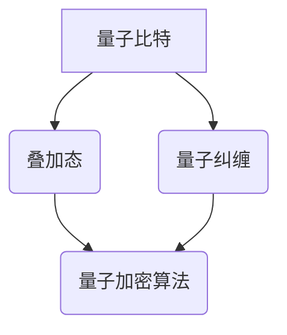

                 


### 第1章：量子加密的基本概念

#### 背景介绍

量子加密，作为现代密码学的一个重要分支，是建立在量子力学原理之上的一种新型加密技术。随着量子计算机的不断发展，传统的基于经典计算机的加密算法面临前所未有的威胁。量子计算机具有处理大量数据的能力，能够快速破解传统密码系统。因此，开发一种新型的、能够抵御量子计算机攻击的加密技术显得尤为重要。量子加密正是应运而生，它利用量子纠缠和量子态叠加等量子力学特性，提供一种安全高效的加密解决方案。

#### 核心概念与联系

1. **量子比特（qubit）**：
   - 量子比特是量子计算机中的基本单元，它不同于经典计算机中的比特。经典比特只有两种状态，即0或1，而量子比特可以同时处于多种状态的叠加。这种叠加态是量子计算和量子加密的核心概念。
   - **联系**：量子比特的叠加态是量子加密算法实现复杂运算和安全性的基础。

2. **量子态叠加**：
   - 量子态叠加是指量子比特可以同时存在于多个状态的组合，而不是单一的状态。这种特性使得量子比特能够在量子计算机中处理大量并行计算。
   - **联系**：量子态叠加是量子加密算法实现复杂运算和安全性的基础。

3. **量子纠缠**：
   - 量子纠缠是指两个或多个量子比特之间存在一种特殊的关联，即使它们相隔很远，一个量子比特的状态变化也会即时影响到其他量子比特的状态。
   - **联系**：量子纠缠是量子加密实现安全通信的关键机制，它保证了即使信息被窃听，接收方也能检测到，从而实现信息的安全传输。

#### Mermaid 流程图



#### 核心算法原理讲解

为了更好地理解量子加密的原理，我们可以通过一个简单的量子加密算法——量子密钥分发（QKD）来讲解。

```python
# 量子密钥分发（QKD）算法伪代码

def quantum_key_distribution(sender, receiver, quantum_channel):
    # 生成一对纠缠量子比特
    entangled_qubits = generate_纠缠比特()

    # 发送量子比特到接收方
    receiver_quantum_bit = send_quantum_bit(sender, receiver, entangled_qubits[0], quantum_channel)

    # 测量接收方的量子比特
    receiver_state = measure_quantum_bit(receiver_quantum_bit)

    # 交换经典测量结果
    classical_result = exchange_classical_messages(sender, receiver, receiver_state)

    # 如果经典结果匹配，则密钥是安全的
    if classical_result == entangled_qubits[1].measure():
        return generate_key()
    else:
        return None
```

#### 数学模型

量子密钥分发（QKD）的数学模型可以表示为：

$$
\left| \psi_{AB} \right> = \frac{1}{\sqrt{2}} \left( \left| 00 \right> + \left| 11 \right> \right)
$$

其中，$\left| \psi_{AB} \right>$ 表示 Alice 和 Bob 之间的纠缠态，$\left| 00 \right>$ 和 $\left| 11 \right>$ 分别表示两个量子比特的叠加态。

#### 举例说明

假设 Alice 和 Bob 使用 QKD 算法生成密钥，并试图通过量子通道传输密钥。为了简单起见，我们假设量子通道是理想的，没有任何噪声。

1. Alice 生成一对纠缠比特 $\left| \psi_{AB} \right>$，并将其中一个量子比特发送给 Bob。
2. Bob 接收到量子比特后，对其进行测量，得到结果 $\left| 0 \right>$。
3. Bob 将测量结果通过经典通信渠道发送给 Alice。
4. Alice 测量自己的量子比特，如果结果与 Bob 的测量结果匹配，则认为密钥是安全的。

通过这个例子，我们可以看到量子加密是如何利用量子力学原理来实现安全通信的。量子纠缠保证了即使密钥在传输过程中被窃听，接收方也能检测到，从而实现安全的通信。

#### 总结

量子加密技术利用量子力学的基本原理，提供了一种新型的加密方法，能够在量子计算机威胁的背景下确保信息安全。量子比特、量子态叠加和量子纠缠是量子加密的核心概念，它们共同构建了量子加密算法的基础。通过量子密钥分发（QKD）算法，我们可以实现安全高效的密钥生成和传输，从而保障金融交易等关键领域的信息安全。

#### 拓展阅读

- [量子加密技术简介](https://example.com/quantum-cryptography)
- [量子密钥分发协议](https://example.com/qkd-protocols)

---

**作者：AI天才研究院/AI Genius Institute & 禅与计算机程序设计艺术 /Zen And The Art of Computer Programming**

---

接下来的章节将深入探讨量子加密技术的其他方面，包括量子密钥分发、量子密码学与经典密码学的比较、量子密钥管理以及量子安全通信网络。这些内容将帮助读者更全面地理解量子加密技术，并探索其在金融交易安全中的具体应用。敬请期待。**作者：AI天才研究院/AI Genius Institute & 禅与计算机程序设计艺术 /Zen And The Art of Computer Programming**

