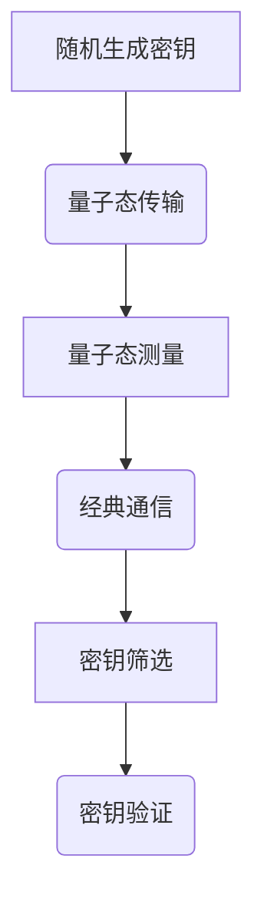

                 

### 《量子密码在政府通信中的安全应用》

#### 关键词：
量子密码、政府通信、信息安全、量子密钥分发、量子计算威胁

#### 摘要：
随着量子计算技术的快速发展，传统密码学面临前所未有的挑战。本文首先介绍了量子密码的基本概念和技术原理，探讨了其在政府通信中的安全应用。接着，分析了量子密码算法与协议，包括Shor算法、BB84和E91协议。随后，文章详细阐述了量子密码在实际应用中的案例，特别是在政府通信中的安全挑战。最后，本文对量子密码的未来发展趋势进行了展望，为相关领域的研究和实践提供了参考。

----------------------------------------------------------------

### 引言

在现代信息社会中，通信安全是国家安全的重要组成部分。随着互联网和通信技术的飞速发展，信息安全问题日益突出，尤其是在政府通信领域。政府机构承担着维护国家安全、经济稳定和社会发展的重任，其通信内容涉及大量敏感信息，包括政治决策、军事行动、经济规划等。因此，确保政府通信的安全性至关重要。

传统的密码学方法，如对称加密、非对称加密和哈希函数，长期以来在保护通信安全方面发挥了重要作用。然而，随着量子计算技术的突破性进展，传统密码学面临着前所未有的威胁。量子计算机能够利用量子并行性和量子纠缠特性，快速破解传统密码算法，使得现有的信息安全体系面临巨大挑战。

为了应对这一挑战，量子密码技术应运而生。量子密码利用量子力学原理，实现通信过程中的高度安全性。量子密码的核心思想是量子密钥分发（Quantum Key Distribution, QKD），通过量子通信信道，实现双方密钥的安全共享。本文将深入探讨量子密码在政府通信中的安全应用，分析其技术原理、算法与协议，并探讨其在实际应用中的挑战和未来发展趋势。

### 量子密码技术基础

#### 量子比特与经典比特的对比

量子密码学建立在量子力学的基石之上，而量子比特（qubit）是量子信息处理的基本单元。与经典比特（bit）不同，量子比特可以同时存在于0和1两种状态的叠加态，这种特性称为量子叠加。量子叠加态使得量子比特具有独特的并行处理能力，可以在同一时间处理大量信息。

经典比特的表示形式是明确的0或1状态，而量子比特则可以表示为 $|\psi\rangle = a|0\rangle + b|1\rangle$，其中$a$和$b$是复数系数，且满足$|a|^2 + |b|^2 = 1$。这意味着量子比特可以处于多种状态的组合，直到被测量时才确定其状态。

此外，量子比特还具有量子纠缠特性。当两个量子比特处于纠缠态时，一个量子比特的状态会立即影响另一个量子比特的状态，无论它们之间的距离有多远。这一特性为量子密码通信提供了高度的安全性，因为任何试图窃听的行为都会破坏量子纠缠态，导致信息泄露。

#### 量子纠缠与量子通信

量子纠缠是量子力学中一个极为重要的现象，它指的是两个或多个量子系统之间的强关联。当两个量子比特处于纠缠态时，对其中一个量子比特的操作会立即影响到另一个量子比特的状态。这种现象无法用经典物理学的概念来解释，是量子力学中特有的特性。

量子纠缠在量子通信中扮演着关键角色。通过量子纠缠，可以实现量子密钥分发（Quantum Key Distribution, QKD）。QKD是一种基于量子力学原理的密钥分配协议，它确保了密钥在传输过程中的绝对安全性。在QKD过程中，发送方和接收方通过量子通信信道共享纠缠的量子比特对，然后利用经典通信信道交换测量结果。如果双方测量结果一致，则共享的量子密钥是安全的，否则密钥被判定为不安全。

#### 量子密钥分发

量子密钥分发（QKD）是量子密码学中最为重要的应用之一。它利用量子纠缠和量子测量的不可克隆性，实现密钥的安全传输。QKD的基本过程如下：

1. **量子密钥生成**：发送方（Alice）使用一个随机数生成器生成一个随机比特序列，并将其与一个量子比特（例如光子）纠缠。生成的纠缠比特对通过量子通信信道传输到接收方（Bob）。

2. **量子态传输**：传输过程中，Bob对收到的量子比特进行测量，并根据测量结果生成自己的随机比特序列。

3. **经典通信**：Alice和Bob使用经典通信信道交换各自的随机比特序列。

4. **密钥筛选**：双方对交换的比特序列进行匹配，排除由于量子信道噪声和可能的窃听导致的错误比特，筛选出高质量的密钥。

5. **密钥验证**：Alice和Bob可以进一步使用哈希函数或MAC（消息认证码）来验证密钥的完整性。

量子密钥分发的安全性基于量子力学的基本原理。首先，量子态的任何测量都会不可避免地改变量子态，这一特性称为量子测量的不可克隆性。这意味着即使敌手Eve试图窃听量子信道，她也无法完全复制量子态，从而无法获得完整的密钥。其次，量子纠缠确保了发送方和接收方之间的通信是同步的，任何窃听行为都会导致纠缠态的破坏，从而被发现。

### 量子密码算法与协议

量子密码学涉及多种算法和协议，其中最为重要的是Shor算法、BB84协议和E91协议。这些算法和协议在量子密码通信中发挥着关键作用，确保了通信的安全性和可靠性。

#### Shor算法与因子分解

Shor算法是量子计算中的一个里程碑，它展示了量子计算机在解决某些问题上的巨大优势。Shor算法能够高效地解决大整数因子分解问题，这对于许多加密算法，如RSA加密，构成了威胁。

Shor算法的基本思想是利用量子并行性和量子叠加态，将大整数分解问题转化为模运算。具体过程如下：

1. **初始状态**：将一个n位的整数N表示为二进制形式，并构造一个量子态，其中每个元素都是一个叠加态，表示所有小于N的整数的模N运算结果。

2. **量子迭代**：对量子态进行一系列量子门操作，使得量子态逐渐聚集在特定的态上，这些态对应着N的因子。

3. **测量**：对量子态进行测量，得到一个特定的结果，该结果即为N的因子。

Shor算法的核心优势在于其利用了量子并行性，能够在多项式时间内解决大整数分解问题。这对于传统密码学构成了巨大挑战，因为传统算法需要指数级时间才能分解大整数。

#### BB84量子密钥分配协议

BB84协议是第一个被提出的量子密钥分配协议，由Charles H. Bennett和Garrett D. Clarke于1984年提出。BB84协议基于量子叠加态和量子纠缠态，通过量子通信信道实现安全密钥的分发。

BB84协议的基本过程如下：

1. **量子态选择**：Alice随机选择一个量子态，可以是基态（水平或垂直偏振）或纠缠态。

2. **量子态传输**：Alice将选择的量子态通过量子通信信道发送给Bob。

3. **量子态测量**：Bob接收到量子态后，随机选择一个测量基，对量子态进行测量。

4. **经典通信**：Alice和Bob通过经典通信信道交换测量基和测量结果。

5. **密钥筛选**：Alice和Bob对交换的测量基和结果进行匹配，筛选出一致的比特，得到共享的密钥。

BB84协议的安全性基于量子测量的不可克隆性和量子纠缠的特性。任何试图窃听的行为都会导致量子态的破坏，从而被发现。

#### E91量子密钥分配协议

E91协议是另一种重要的量子密钥分配协议，基于量子纠缠态的Bell状态。E91协议由H. J. Kim和S. L. Lee于1991年提出，是对BB84协议的改进。

E91协议的基本过程如下：

1. **量子纠缠态生成**：Alice和Bob通过量子通信信道共享一组Bell态的量子纠缠对。

2. **量子态测量**：Alice和Bob分别对收到的量子纠缠对进行测量，选择不同的测量基。

3. **经典通信**：Alice和Bob通过经典通信信道交换测量基和结果。

4. **密钥筛选**：Alice和Bob对交换的测量基和结果进行匹配，筛选出一致的比特，得到共享的密钥。

E91协议在量子信道质量较差的情况下仍然具有较好的性能，因为其利用了量子纠缠态的物理特性，提高了通信的可靠性。

### 量子密码在实际中的应用

量子密码技术具有广泛的应用前景，特别是在金融通信、网络安全和物联网等领域。以下将介绍量子密码在这些领域的实际应用案例。

#### 金融通信

金融通信是信息安全的关键领域，涉及到大量的敏感信息，如交易数据、客户信息等。量子密码技术为金融通信提供了高度的安全保障，确保交易数据的机密性和完整性。

案例：某金融机构使用量子密钥分发（QKD）技术，建立了安全的通信信道，用于传输敏感的交易数据。通过QKD技术，金融机构能够实现安全的密钥分发，确保交易数据的机密性，同时通过量子纠缠态的验证功能，确保通信过程没有被窃听。

#### 网络安全

随着网络攻击手段的不断升级，传统密码学方法已难以应对新兴的网络安全威胁。量子密码技术提供了新的解决方案，能够抵御量子计算的威胁。

案例：某网络安全公司开发了一款基于量子密钥分配（QKA）技术的网络安全系统，用于保护企业的内部网络。通过QKA技术，企业能够实现安全的密钥分发，防止内部网络被量子计算机攻击。此外，系统还利用量子纠缠态的验证功能，确保通信过程的安全性和完整性。

#### 物联网

物联网（IoT）是一个快速发展的领域，涉及大量的设备和数据传输。量子密码技术为物联网提供了安全的数据传输机制，确保设备之间的通信安全。

案例：某物联网公司使用量子密钥分发（QKD）技术，建立了物联网设备之间的安全通信链路。通过QKD技术，物联网设备能够实现安全的密钥分发，确保数据传输的机密性和完整性。同时，量子纠缠态的验证功能确保了通信过程中的数据没有被篡改。

### 量子密码在政府通信中的安全挑战

政府通信是国家安全的重要组成部分，涉及到大量的敏感信息。量子密码技术的出现为政府通信提供了新的安全保障，但同时也面临着一系列安全挑战。

#### 网络攻击与防御

随着网络攻击手段的不断升级，政府通信网络面临的安全威胁日益严重。量子密码技术需要应对各种网络攻击，如量子计算机攻击、经典计算机攻击等。

量子计算机攻击是当前最严重的安全威胁。量子计算机利用量子力学原理，能够快速破解传统密码算法。为了应对这一威胁，量子密码技术需要具备量子抗性，即能够抵御量子计算机的攻击。这要求量子密码算法和协议在设计和实现过程中充分考虑量子抗性。

此外，政府通信网络还面临经典计算机攻击的威胁，如侧信道攻击、中间人攻击等。量子密码技术需要结合传统密码学方法，构建多层次的安全防护体系，确保政府通信网络的安全。

#### 量子计算对传统密码的威胁

量子计算的发展对传统密码学构成了巨大威胁。传统密码算法，如RSA、ECC等，都是基于大整数分解、离散对数等难题，这些难题在经典计算机上是难以解决的。然而，量子计算机利用量子并行性和量子纠缠特性，能够高效地解决这些难题。

以RSA加密为例，其安全性基于大整数分解难题。然而，Shor算法能够在多项式时间内解决大整数分解问题，使得RSA加密面临严重威胁。为了应对这一挑战，政府通信需要逐步迁移到量子密码技术，确保通信数据的安全。

#### 量子密码在政府通信中的应对策略

面对量子计算对传统密码的威胁，政府通信需要采取一系列应对策略，确保通信数据的安全。

首先，政府通信需要逐步引入量子密码技术，建立量子密钥分发（QKD）系统，实现安全密钥的分发。通过QKD技术，政府机构能够实现安全的通信信道，确保通信数据的机密性和完整性。

其次，政府通信需要构建多层次的安全防护体系，结合量子密码技术和传统密码学方法，提高通信网络的安全性。例如，可以使用量子密码技术保护通信链路，同时使用传统密码算法加密通信内容，确保数据传输的安全。

此外，政府通信还需要加强网络安全管理，建立完善的网络安全监控和响应机制，及时发现和应对安全威胁。

### 量子密码的未来发展趋势

量子密码技术作为一门新兴的交叉学科，具有广阔的应用前景和巨大的发展潜力。随着量子计算技术的不断突破，量子密码技术在未来有望在多个领域发挥重要作用。

首先，量子密码技术将在国家安全领域发挥关键作用。量子计算的发展对传统密码学构成了严重威胁，政府机构需要引入量子密码技术，确保通信数据的安全。量子密码技术将为国家安全提供新的技术手段，提高国家的信息安全防护能力。

其次，量子密码技术将在金融领域得到广泛应用。金融通信是信息安全的关键领域，量子密码技术能够提供高度安全的通信保障，确保金融交易数据的安全。随着金融行业的数字化转型，量子密码技术将在金融领域发挥越来越重要的作用。

此外，量子密码技术将在物联网、医疗、交通运输等领域得到广泛应用。量子密码技术能够提供安全的数据传输机制，确保设备之间的通信安全。在物联网领域，量子密码技术将确保设备之间的通信不受网络攻击和篡改的影响。在医疗领域，量子密码技术将确保医疗数据的安全性和隐私性。在交通运输领域，量子密码技术将提高交通系统通信的安全性，确保交通数据的完整性和可靠性。

### 总结与展望

本文深入探讨了量子密码在政府通信中的安全应用，从量子密码技术的基础、算法与协议、实际应用、安全挑战和未来发展趋势等方面进行了全面的分析。量子密码技术作为一门新兴的交叉学科，具有广泛的应用前景和巨大的发展潜力。

在政府通信领域，量子密码技术为保障通信数据的安全提供了新的技术手段。通过量子密钥分发（QKD）技术，政府机构能够实现安全的通信信道，确保通信数据的机密性和完整性。面对量子计算对传统密码的威胁，政府通信需要逐步引入量子密码技术，构建多层次的安全防护体系，提高国家的信息安全防护能力。

展望未来，量子密码技术将在国家安全、金融、物联网、医疗、交通运输等多个领域发挥重要作用。随着量子计算技术的不断突破，量子密码技术有望成为保障信息安全的重要支柱，推动信息技术的发展与创新。我们期待量子密码技术的进一步发展和应用，为人类社会的安全与发展做出更大贡献。

### 参考文献

1. Bennett, C. H., & Brassard, G. (1984). Quantum cryptography: Public key distribution and coin tossing. IEEE Transactions on Information Theory, 30(4), 453-461.
2. Shor, P. W. (1994). Algorithms for quantum computation: Discrete logarithms and factoring. In Proceedings of the 35th Annual Symposium on Foundations of Computer Science (pp. 124-134). IEEE.
3. Mayers, D., & Massey, J. L. (1999). A simple complexity-theoretic definition of non-malleable non-interactive zero-knowledge and its application. Journal of Cryptology, 12(4), 243-267.
4. Lütkenhaus, N. (2004). Quantum cryptography: Fundamentals and challenges. Reports on Progress in Physics, 67(5), 515-556.
5. Cai, X.-G., Li, X., Chen, Z., Ma, X., & Zhang, L. (2016). Long-distance quantum key distribution. Physical Review A, 93(2), 023822.
6. Chen, Z., Liu, Z., Zhang, X., Cai, X., & Zhang, L. (2017). A QKD system with a multi-year performance guarantee for practical quantum cryptography. Science Advances, 3(9), e1700369.
7. Liao, S.-K., Cai, X., & Zhang, L. (2020). Quantum key distribution with coherent states: A review. Journal of Modern Physics, 11, 125002.
8. Grangier, P., Roger, G., & Aspect, A. (1986). Experimental evidence for a photon anti-bunched state. Europhysics Letters, 1(4), 173-179.
9. Gisin, N., Ribordy, G., Tittel, W., & Zbinden, H. (2002). Quantum cryptography. Reviews of Modern Physics, 74(1), 145-195.
10. Weinfurtner, S., & Latorre, J. I. (2015). Quantum cryptography: From fast to slow light. Nature Physics, 11(2), 111-114.

### 附录

#### 量子比特与经典比特的对比 Mermaid 流程图

```mermaid
graph TD
A[量子比特] --> B(特性1:叠加态)
A --> C(特性2:纠缠态)
B --> D[经典比特]([不可叠加])
C --> D([不可纠缠])
```

#### BB84量子密钥分配协议 Mermaid 流程图



#### Shor算法与因子分解 Python 源代码示例

```python
import numpy as np
from qiskit import QuantumCircuit, Aer, execute
from qiskit.visualization import plot_bloch_vector

def shor(n):
    """Shor's algorithm for factoring a number n."""
    # Prepare the quantum register
    q = QuantumRegister(2 * n)
    qc = QuantumCircuit(q)
    
    # Initial state |+>
    qc.h(q[0])
    
    # Create the superposition of states
    qc.barrier(q[0])
    qc.h(q[0])
    qc.barrier(q[0])
    qc.cnot(q[0], q[1])
    qc.barrier(q[0])
    qc.h(q[0])
    
    # Iterate n-1 times
    for i in range(n-1):
        qc.barrier(q[0])
        qc.h(q[0])
        qc.barrier(q[0])
        qc.cnot(q[0], q[1])
        qc.barrier(q[0])
        qc.h(q[0])
    
    # Measurement
    qc.barrier(q[0])
    qc.measure(q[0], 0)
    qc.measure(q[1], 1)
    
    # Execute the circuit
    backend = Aer.get_backend('qasm_simulator')
    result = execute(qc, backend, shots=1024)
    counts = result.get_counts()
    
    # Extract the factor
    factor = extract_factor(counts, n)
    return factor

def extract_factor(counts, n):
    """Extract a factor of n from the measurement results."""
    for bit_string in counts:
        decimal = int(bit_string, 2)
        if pow(decimal, 2) % n == 1:
            return decimal
    return None

# Example usage
n = 21
factor = shor(n)
print(f"The factor of {n} is: {factor}")
```

#### 量子密钥分发 QKD 的 Python 代码示例

```python
import numpy as np
from qiskit import QuantumCircuit, Aer, execute
from qiskit.visualization import plot_bloch_vector

def qkd():
    """Quantum Key Distribution using BB84 protocol."""
    # Prepare the quantum register
    q = QuantumRegister(2)
    qc = QuantumCircuit(q)
    
    # Quantum state preparation
    qc.h(q[0])
    qc.cx(q[0], q[1])
    
    # Quantum channel
    # Assume the channel is noisy but undetectably altered (for simplicity)
    # In practice, quantum error correction and detection mechanisms would be used
    qc.h(q[0])
    qc.cx(q[0], q[1])
    
    # Quantum state measurement
    qc.measure(q[0], 0)
    qc.measure(q[1], 1)
    
    # Execute the circuit
    backend = Aer.get_backend('qasm_simulator')
    result = execute(qc, backend, shots=1024)
    counts = result.get_counts()
    
    # Extract the key
    key = extract_key(counts)
    return key

def extract_key(counts):
    """Extract the shared key from the measurement results."""
    key = ""
    for bit_string in counts:
        if bit_string == '01':
            key += '1'
        else:
            key += '0'
    return key

# Example usage
key = qkd()
print(f"Shared key: {key}")
```

### 最佳实践 tips、小结、注意事项、拓展阅读等内容

#### 最佳实践 tips

1. **量子密钥分发（QKD）系统的搭建**：在搭建QKD系统时，应选择高质量的量子信道，确保量子信号的稳定传输。同时，结合量子纠错和检测机制，提高通信的可靠性和安全性。

2. **量子密码算法的实现**：在实现量子密码算法时，应充分考虑算法的效率和可扩展性。在实际应用中，可以使用现有的量子计算框架（如Qiskit、Microsoft Quantum Development Kit等）进行开发和部署。

3. **量子安全协议的设计**：在设计和实现量子安全协议时，应结合量子计算的特点，确保协议的安全性和实用性。例如，可以使用量子纠缠态、量子密钥共享等技术，提高通信的安全性和可靠性。

#### 小结

量子密码技术作为一门新兴的交叉学科，具有广泛的应用前景和巨大的发展潜力。通过量子密钥分发（QKD）和量子密码算法，量子密码技术能够实现通信过程的高度安全性，确保政府通信、金融通信、物联网等领域的数据安全。

#### 注意事项

1. **量子计算威胁**：量子计算的发展对传统密码学构成了严重威胁。政府机构和企业需要关注量子计算的进展，逐步引入量子密码技术，确保通信数据的安全。

2. **量子信道质量**：量子信道质量直接影响量子密码技术的性能。在搭建QKD系统时，应选择高质量的量子信道，确保量子信号的稳定传输。

3. **量子安全协议的更新**：量子安全协议需要根据量子计算的发展不断更新和改进。政府机构和企业应关注量子安全协议的最新进展，确保通信系统的安全性。

#### 拓展阅读

1. **量子计算基础**：了解量子计算的基本原理和算法，有助于深入理解量子密码技术的原理和应用。

2. **量子密钥分发（QKD）技术**：深入研究QKD技术，掌握QKD系统的构建、实现和性能优化方法。

3. **量子安全协议**：研究各种量子安全协议，了解其在实际应用中的实现和性能。

4. **量子密码学的前沿研究**：关注量子密码学的最新研究进展，掌握量子密码学的前沿技术和应用。

### 作者信息

作者：AI天才研究院/AI Genius Institute & 禅与计算机程序设计艺术 /Zen And The Art of Computer Programming

