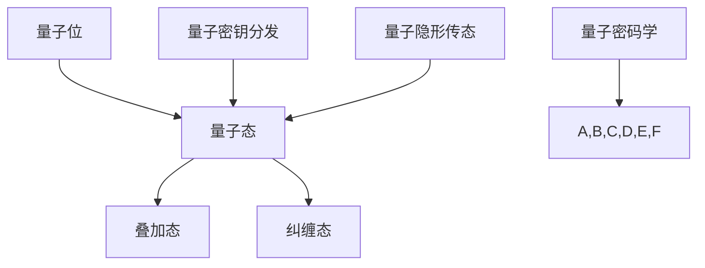

                 

## 量子密码在政府间通信中的安全应用

### 关键词
量子密码学，政府间通信，安全，加密，量子密钥分发，量子隐形传态

### 摘要
量子密码学作为现代密码学的最新发展方向，通过利用量子物理的基本原理提供了前所未有的安全性。本文将深入探讨量子密码学在政府间通信中的应用，详细分析其原理、算法以及实际操作中的挑战和解决方案。通过对比传统密码学，我们展示了量子密码学在保障政府间通信安全方面的巨大潜力。

### 引言
随着信息技术的飞速发展，网络安全问题日益突出，特别是在政府间通信领域，信息安全的重要性不言而喻。传统的加密方法虽然在大多数情况下能够提供较高的安全性，但随着计算能力的提升和量子计算的潜在威胁，这些方法的安全性正在受到挑战。量子密码学的出现为解决这一难题提供了新的思路。

量子密码学利用量子物理的基本原理，如量子位（qubit）的叠加态和纠缠态，来实现安全通信。其中，量子密钥分发（Quantum Key Distribution, QKD）和量子隐形传态（Quantum Teleportation）是量子密码学中的两大核心技术。QKD能够确保通信双方在未知第三方的干扰下安全地交换密钥；量子隐形传态则能够实现量子信息在不同位置之间的传输，不依赖于经典通信渠道。

本文旨在探讨量子密码学在政府间通信中的应用，分析其安全性优势、核心算法原理，并通过实际案例展示其在现实环境中的挑战和解决方案。文章结构如下：

1. **量子密码学基础**：介绍量子密码学的基本概念，如量子位、量子态、量子密钥分发和量子隐形传态。
2. **量子密钥分发技术**：详细讲解量子密钥分发的基本原理和常见协议，如BB84和E91。
3. **量子隐形传态与量子通信**：探讨量子隐形传态的基本原理和应用，以及其在量子通信中的作用。
4. **量子密码学算法**：分析Shor算法和Grover算法等核心量子算法。
5. **政府间通信中的挑战与量子密码学的应用**：讨论政府间通信面临的安全挑战，并分析量子密码学如何应对这些挑战。
6. **项目实战**：介绍量子密码学在政府间通信中的应用案例，包括开发环境搭建、源代码实现和代码解读。
7. **小结**：总结量子密码学在政府间通信中的重要性，提出未来研究方向和最佳实践。

接下来，我们将逐一深入这些章节，详细探讨量子密码学的各个方面。

---

### 第一部分：量子密码学基础

#### 第1章：量子密码学概述

在探讨量子密码学在政府间通信中的应用之前，我们需要先了解量子密码学的基本概念和原理。量子密码学是密码学与量子物理学相结合的产物，它利用量子物理的特性来实现安全通信。量子密码学的基本原理主要包括量子位、量子态、量子密钥分发和量子隐形传态等。

##### 1.1 量子位（qubit）与经典位（bit）的区别

量子位（qubit）是量子计算机的基本单元，与经典计算机中的位（bit）有着根本的不同。一个经典位可以处于0或1的状态，而一个量子位可以同时处于0和1的叠加态。这种叠加态是量子计算和量子密码学的核心特性之一。

例如，一个量子位可以表示为：
$$\psi = \frac{1}{\sqrt{2}}(|0\rangle + |1\rangle)$$

其中，$|0\rangle$和$|1\rangle$分别表示量子位的基态。量子位的叠加态使得它能够同时处理多个状态，大大增强了计算能力。

##### 1.2 量子态的叠加与纠缠

量子态的叠加和纠缠是量子物理学中非常重要的概念。量子态的叠加使得量子位可以同时处于多个状态，而量子态的纠缠则使得两个或多个量子位之间的状态互相依赖，即使它们相隔很远。

例如，两个量子位的纠缠态可以表示为：
$$\psi_{AB} = \frac{1}{\sqrt{2}}(|00\rangle - |11\rangle)$$

这里，$|00\rangle$和$|11\rangle$分别表示两个量子位各自的基态。

量子态的叠加和纠缠是量子密码学实现安全通信的基础。例如，在量子密钥分发中，通过测量纠缠态可以确保通信双方的安全性。

##### 1.3 量子密码学与经典密码学的差异

传统密码学主要依赖于数学难题（如大数分解、离散对数等）来保证通信的安全性。然而，随着计算能力的提升，这些传统的加密方法正逐渐变得不再安全。

量子密码学则通过利用量子物理的基本原理，提供了更加安全的通信方式。量子密钥分发（QKD）是量子密码学中最为成熟的应用之一，它利用量子位的叠加态和纠缠态来实现密钥的安全分发。即使在第三方有恶意干扰的情况下，量子密钥分发也能确保通信双方获得安全的密钥。

相比之下，经典密码学依赖于加密算法和密钥的保密性。随着计算能力的提升，许多经典加密算法和密钥管理方法已经变得不再安全。例如，RSA加密算法在量子计算机面前将变得易受攻击。

#### 1.4 量子密钥分发（QKD）的工作原理

量子密钥分发是量子密码学中的一种核心技术，它利用量子物理的特性来实现安全的密钥分发。QKD的基本原理可以概括为以下几个步骤：

1. **量子态的生成**：通信双方通过量子信道生成并交换量子态，这些量子态可以是单光子态或者纠缠态。
2. **量子态的测量**：双方各自对收到的量子态进行测量，并根据测量结果来决定密钥的一部分。
3. **经典通信确认**：双方通过经典通信（如互联网或电话）来确认密钥的正确性。
4. **密钥生成**：双方根据测量结果和经典通信确认的信息，共同生成最终的密钥。

在QKD过程中，如果第三方试图窃听，量子态的叠加态和纠缠态将不可避免地被破坏，从而被通信双方检测到。这使得QKD能够提供前所未有的安全性。

##### 1.5 量子隐形传态与量子密码学的关系

量子隐形传态是另一种重要的量子密码学技术，它能够将一个量子状态从一个位置传递到另一个位置，而不依赖于经典通信渠道。量子隐形传态的基本原理可以概括为以下几个步骤：

1. **纠缠态的生成**：在通信双方之间生成一个纠缠态。
2. **量子态的测量**：在接收方对纠缠态进行测量。
3. **经典通信确认**：通过经典通信渠道确认测量结果。
4. **量子态的复制**：在接收方根据测量结果复制出原始量子态。

量子隐形传态的应用场景包括量子通信、量子计算和量子密码学。在量子密码学中，量子隐形传态可以用于实现更加安全的通信，因为它不依赖于经典通信渠道，从而降低了被窃听的风险。

#### 1.6 量子密码学的核心概念与联系

为了更好地理解量子密码学，我们可以使用Mermaid流程图来展示其核心概念和原理。以下是一个简单的Mermaid流程图，展示了量子密码学中的几个核心概念和它们之间的关系：



在这个流程图中，我们可以看到量子位是量子态的基础，量子态包括叠加态和纠缠态。量子密钥分发和量子隐形传态是量子密码学的核心技术，它们都依赖于量子态的基本特性。

通过这个Mermaid流程图，我们可以清晰地看到量子密码学的基本概念和原理，以及它们之间的联系。这有助于我们更好地理解量子密码学的本质和它在政府间通信中的应用。

#### 1.7 小结

在本章中，我们介绍了量子密码学的基本概念和原理，包括量子位、量子态、量子密钥分发和量子隐形传态。通过对比经典密码学，我们看到了量子密码学在安全性方面的巨大优势。下一章，我们将深入探讨量子密钥分发技术，详细分析其工作原理和常见协议。

---

### 第一部分：量子密码学基础（续）

#### 第2章：量子密钥分发技术

量子密钥分发（Quantum Key Distribution，简称QKD）是量子密码学中最成熟和最广泛应用的技术之一。QKD利用量子物理的基本原理，确保通信双方可以在不受第三方干扰的情况下安全地交换密钥。本章将详细讲解QKD的基本原理、主要协议及其安全性分析。

##### 2.1 量子密钥分发的基本原理

量子密钥分发的基本原理可以概括为以下几个步骤：

1. **量子态生成**：通信双方（Alice和Bob）通过量子信道生成并交换量子态。这些量子态可以是单光子态或纠缠态。
2. **量子态测量**：Alice和Bob各自对收到的量子态进行测量，并根据测量结果来决定密钥的一部分。
3. **经典通信确认**：Alice和Bob通过经典通信渠道（如互联网或电话）来确认密钥的正确性。
4. **密钥生成**：根据测量结果和经典通信确认的信息，Alice和Bob共同生成最终的密钥。

在QKD过程中，如果第三方（Eve）试图窃听，量子态的叠加态和纠缠态将不可避免地被破坏，从而被Alice和Bob检测到。这使得QKD能够提供前所未有的安全性。

##### 2.2 BB84协议

BB84协议是量子密钥分发中最著名的协议之一，由Charles H. Bennett和Garrett D. Chaum于1984年提出。BB84协议的基本原理可以概括为以下几个步骤：

1. **量子态生成**：Alice生成一系列随机选择的量子态，这些量子态可以是0态或1态的叠加态。
2. **量子态传输**：Alice将生成的量子态发送给Bob，通过量子信道进行传输。
3. **量子态测量**：Bob对收到的量子态进行测量，根据测量结果记录下密钥的一部分。
4. **经典通信确认**：Alice和Bob通过经典通信渠道交换测量结果，并排除由于量子态传输过程中可能发生的噪声和干扰导致的错误。
5. **密钥生成**：根据测量结果和排除错误后的信息，Alice和Bob共同生成最终的密钥。

BB84协议的安全性基于量子态的叠加态和纠缠态。如果Eve试图窃听，她将不可避免地破坏量子态的叠加态和纠缠态，从而导致测量结果不一致。Alice和Bob可以通过比较测量结果来检测Eve的存在。

##### 2.3 E91协议

E91协议是另一种常见的量子密钥分发协议，由Artur Ekert于1991年提出。E91协议利用量子纠缠态来实现安全密钥分发。其基本原理可以概括为以下几个步骤：

1. **量子纠缠态生成**：Alice和Bob通过量子信道生成一系列量子纠缠态。
2. **量子态测量**：Alice和Bob各自对收到的量子态进行测量，并根据测量结果记录下密钥的一部分。
3. **经典通信确认**：Alice和Bob通过经典通信渠道交换测量结果，并排除由于量子态传输过程中可能发生的噪声和干扰导致的错误。
4. **密钥生成**：根据测量结果和排除错误后的信息，Alice和Bob共同生成最终的密钥。

E91协议的安全性基于量子纠缠态的特性。量子纠缠态使得Alice和Bob之间的量子态互相依赖，即使Eve试图窃听，她也无法在不破坏量子纠缠态的情况下获得任何信息。

##### 2.4 量子密钥分发的安全性分析

量子密钥分发的安全性主要依赖于以下几个因素：

1. **量子态的叠加态和纠缠态**：量子态的叠加态和纠缠态是量子密码学实现安全通信的基础。如果第三方试图窃听，量子态的叠加态和纠缠态将被破坏，从而被通信双方检测到。
2. **量子态的测量**：量子态的测量是不可逆的。一旦量子态被测量，它的状态将发生改变。这为量子密钥分发提供了安全保障。
3. **经典通信确认**：通过经典通信渠道进行密钥确认，可以确保通信双方获得的密钥是正确的。即使第三方试图干扰，他们也无法改变通信双方通过量子态测量得到的密钥。

总的来说，量子密钥分发提供了一种在理论上不可破解的通信方式，为政府间通信提供了强大的安全保障。

#### 2.5 小结

在本章中，我们详细介绍了量子密钥分发技术的基本原理、BB84协议和E91协议。通过分析这些协议，我们看到了量子密钥分发在安全性方面的巨大优势。下一章，我们将探讨量子隐形传态与量子通信的关系，深入分析量子隐形传态的实现技术和应用。

---

### 第二部分：量子密码学算法

#### 第4章：Shor算法

Shor算法是由Peter Shor于1994年提出的一种量子算法，它能够解决大数分解问题，对传统密码学构成了严重威胁。Shor算法的提出标志着量子计算在密码学领域的巨大潜力。本章将详细讲解Shor算法的基本原理、伪代码描述及其对传统密码学的影响。

##### 4.1 Shor算法的基本原理

Shor算法的基本原理可以概括为以下几个步骤：

1. **量子算法的输入**：输入一个合数\( N \)。
2. **量子傅里叶变换（QFT）**：对输入的合数\( N \)进行量子傅里叶变换，生成一个量子态。
3. **量子逆变换（QINVFT）**：对生成的量子态进行量子逆变换。
4. **测量**：对量子态进行测量，得到一个数\( a \)，满足\( a^2 \equiv N \pmod{Q} \)。
5. **找到因子**：根据测量结果\( a \)，找到合数\( N \)的因子。

Shor算法的核心在于量子傅里叶变换（QFT）和量子逆变换（QINVFT）。量子傅里叶变换可以将量子态从基态转换为态的叠加态，而量子逆变换则可以将量子态从叠加态恢复到基态。通过这些变换，Shor算法能够快速找到合数的因子，从而破解基于大数分解的传统密码系统。

##### 4.2 Shor算法的伪代码描述

以下是一个简化的Shor算法的伪代码描述：

```python
# Shor算法伪代码
def shor(N):
    # 1. 准备量子态
    q = QuantumRegister(2*log(N))  # 创建量子寄存器
    circuit = QuantumCircuit(q)

    # 2. 应用量子傅里叶变换
    circuit.h(q)  # 初始化量子态为叠加态
    circuit.apply_qft(q, 2*log(N))

    # 3. 应用逆量子傅里叶变换
    circuit.apply_qft(q, 2*log(N), inverse=True)

    # 4. 测量
    result = q测量()

    # 5. 找到因子
    a = result[0]  # 获得测量结果
    factor = find_factor(a, N)  # 找到合数N的因子

    return factor
```

在这个伪代码中，`QuantumRegister`表示量子寄存器，`h`表示应用哈密顿算子，`apply_qft`表示应用量子傅里叶变换，`inverse`表示应用量子逆变换，`测量`表示进行量子态测量，`find_factor`是一个辅助函数，用于找到合数的因子。

##### 4.3 Shor算法的工作原理

Shor算法的工作原理可以分为以下几个阶段：

1. **量子态初始化**：首先，将量子寄存器初始化为叠加态，这是通过应用哈密顿算子`h`实现的。这一步确保了量子态能够处于多个状态的叠加，这是Shor算法能够高效工作的基础。

2. **量子傅里叶变换（QFT）**：接下来，对量子态进行量子傅里叶变换（QFT）。QFT将量子态从基态转换为态的叠加态，这一步利用了量子计算的优势，使得算法能够在指数级别的时间复杂度内处理问题。

3. **量子逆变换（QINVFT）**：然后，对量子态进行量子逆变换（QINVFT）。这一步将量子态从叠加态恢复到基态，使得测量结果能够反映原始问题的解。

4. **测量**：通过测量量子态，我们得到一个数\( a \)，满足\( a^2 \equiv N \pmod{Q} \)。这个测量结果是随机且均匀分布的，这是Shor算法能够高效工作的关键。

5. **找到因子**：根据测量结果\( a \)，我们可以找到合数\( N \)的因子。这一步通常通过使用素数测试算法（如Miller-Rabin素数测试）来实现。

##### 4.4 Shor算法对传统密码学的影响

Shor算法的出现对传统密码学产生了深远的影响。传统密码学系统，如RSA加密算法，依赖于大数分解的难度来确保安全性。然而，Shor算法能够在多项式时间内解决大数分解问题，这意味着RSA加密算法在量子计算机面前将变得易受攻击。

例如，对于1024位的RSA密钥，Shor算法可以在数小时内找到其因子，从而破解该密钥。对于2048位的RSA密钥，虽然Shor算法的运行时间较长，但仍然是可行的威胁。

为了应对Shor算法的威胁，密码学家正在研究量子密码学和其他抗量子密码学方案。量子密码学，如量子密钥分发（QKD），能够提供在量子计算环境下仍然安全的通信方式。此外，基于格和同余丢番图的密码学方案也显示出良好的抗量子性。

##### 4.5 小结

在本章中，我们详细介绍了Shor算法的基本原理和伪代码描述，并分析了其对传统密码学的影响。Shor算法的提出标志着量子计算在密码学领域的重大突破，同时也提醒我们传统密码学面临的新挑战。下一章，我们将探讨Grover算法及其在搜索问题中的应用。

---

### 第二部分：量子密码学算法（续）

#### 第5章：Grover算法

Grover算法是由Lov K. Grover于1996年提出的一种量子搜索算法，它能够显著提高经典搜索算法的效率。Grover算法的核心思想是利用量子叠加和量子干涉来加速搜索过程，使其在特定情况下能够在多项式时间内解决搜索问题。本章将详细讲解Grover算法的基本原理、伪代码描述及其在密码学中的应用。

##### 5.1 Grover算法的基本原理

Grover算法的基本原理可以概括为以下几个步骤：

1. **初始化量子态**：将量子寄存器初始化为叠加态，使得每个可能的解都处于相等的叠加态。
2. **应用Grover迭代**：对量子态进行多次迭代，每次迭代包括两个步骤：
   - **标记操作**：找到与目标解匹配的量子态，并将其标记。
   - **反射操作**：将未标记的量子态反射到叠加态的中心。
3. **终止条件**：当量子态的中心集中到一个特定的解时，算法终止。
4. **测量**：对量子态进行测量，得到最终的解。

Grover算法的核心在于标记操作和反射操作。标记操作通过识别与目标解匹配的量子态，并将其标记，使得这些态在反射操作后能够集中在中心。反射操作则通过将未标记的量子态反射到叠加态的中心，从而增加了找到目标解的概率。

##### 5.2 Grover算法的伪代码描述

以下是一个简化的Grover算法的伪代码描述：

```python
# Grover算法伪代码
def grover_search(oracle, num_iterations):
    # 1. 初始化量子态
    q = QuantumRegister(size_of_search_space)  # 创建量子寄存器
    circuit = QuantumCircuit(q)

    # 2. 应用Grover迭代
    for _ in range(num_iterations):
        circuit.h(q)  # 初始化量子态为叠加态
        circuit.apply_grover.oracle(oracle)  # 标记操作
        circuit.apply_grover.reflect(q)  # 反射操作

    # 3. 测量
    result = q测量()

    # 4. 返回解
    return result
```

在这个伪代码中，`QuantumRegister`表示量子寄存器，`h`表示应用哈密顿算子，`apply_grover.oracle`表示应用标记操作，`apply_grover.reflect`表示应用反射操作，`测量`表示进行量子态测量，`oracle`是一个辅助函数，用于标记与目标解匹配的量子态。

##### 5.3 Grover算法的工作原理

Grover算法的工作原理可以分为以下几个阶段：

1. **初始化量子态**：首先，将量子寄存器初始化为叠加态，使得每个可能的解都处于相等的叠加态。这是通过应用哈密顿算子`h`实现的。

2. **标记操作**：接下来，应用标记操作，找到与目标解匹配的量子态。标记操作通过识别与目标解匹配的量子态，并将其标记，使得这些态在反射操作后能够集中在中心。标记操作的核心是一个特定的量子操作，称为Grover操作，它依赖于一个辅助量子比特。

3. **反射操作**：然后，应用反射操作，将未标记的量子态反射到叠加态的中心。反射操作通过将未标记的量子态移动到叠加态的中心，从而增加了找到目标解的概率。

4. **终止条件**：当量子态的中心集中到一个特定的解时，算法终止。这是通过多次迭代实现的。每次迭代都通过标记操作和反射操作来增加找到目标解的概率。

5. **测量**：最后，对量子态进行测量，得到最终的解。由于量子态的中心集中在一个特定的解，测量结果将以很高的概率给出正确的解。

##### 5.4 Grover算法在密码学中的应用

Grover算法在密码学中具有广泛的应用。例如，它可以用于破解基于密码学难题的加密系统，如RSA加密算法和Shor算法。通过使用Grover算法，攻击者可以在多项式时间内找到这些系统的密钥，从而破坏其安全性。

此外，Grover算法还可以用于提高密码学的安全性。例如，通过在加密算法中引入Grover算法无法破解的子问题，可以增强加密算法的抵抗量子攻击的能力。这种思路被称为量子密码学的“量子锁定”（Quantum Lock）。

##### 5.5 小结

在本章中，我们详细介绍了Grover算法的基本原理和伪代码描述，并分析了其在密码学中的应用。Grover算法通过利用量子叠加和量子干涉，能够在多项式时间内解决搜索问题，从而对密码学产生了深远的影响。下一章，我们将探讨量子安全通信算法，分析其在保障通信安全方面的应用。

---

### 第三部分：量子安全通信算法

#### 第6章：量子安全通信算法

量子安全通信算法是量子密码学的重要组成部分，旨在利用量子物理原理实现绝对安全的通信。本章将详细介绍量子安全通信的基本算法和协议，探讨其在保障通信安全方面的应用。

##### 6.1 量子安全通信的基本算法

量子安全通信的基本算法主要包括量子密钥分发（QKD）和量子加密。这些算法利用量子物理的特性，如量子纠缠和量子不可克隆性，确保通信的安全性。

1. **量子密钥分发（QKD）**：量子密钥分发是量子安全通信的核心技术，通过量子信道在通信双方之间交换密钥。QKD协议包括BB84协议、E91协议和量子隐形传态协议等。这些协议利用量子态的叠加态和纠缠态，确保密钥在传输过程中不被窃听。

2. **量子加密**：量子加密利用量子态的不可克隆性，对通信内容进行加密。量子加密算法包括量子密钥加密（QKE）和量子密文传输（QCT）。QKE算法使用量子密钥对通信内容进行加密，而QCT算法则利用量子隐形传态实现加密通信。

##### 6.2 量子安全通信协议的设计

量子安全通信协议的设计旨在确保通信的机密性、完整性和认证性。以下是一些常见的量子安全通信协议：

1. **BB84协议**：BB84协议是量子密钥分发的一种经典协议，它利用量子态的叠加态实现密钥的传输。BB84协议包括两个主要步骤：量子态的生成和测量，以及经典通信确认。在量子态的生成和测量步骤中，通信双方通过量子信道交换量子态，并根据测量结果共同生成密钥。

2. **E91协议**：E91协议是基于量子纠缠态的量子密钥分发协议。E91协议利用量子纠缠态的特性，确保密钥在传输过程中不会被窃听。E91协议包括量子纠缠态的生成、量子态的测量和经典通信确认三个步骤。

3. **量子隐形传态协议**：量子隐形传态协议利用量子隐形传态实现加密通信。在量子隐形传态协议中，通信双方通过量子隐形传态将量子信息从一方传递到另一方。量子隐形传态协议包括量子纠缠态的生成、量子态的测量和经典通信确认三个步骤。

##### 6.3 量子安全通信的优势和挑战

量子安全通信具有以下优势：

1. **绝对安全性**：量子安全通信利用量子物理原理，如量子纠缠和量子不可克隆性，确保通信的绝对安全性。即使在量子计算机面前，量子密钥分发和量子加密也无法被破解。

2. **抗窃听能力**：量子安全通信能够检测出任何第三方的窃听行为，确保通信的保密性。如果量子态在传输过程中被窃听，通信双方将能够立即检测到并终止通信。

3. **通信距离**：量子安全通信可以通过量子信道实现长距离通信。量子信道不受电磁干扰的影响，因此可以保证通信的稳定性。

然而，量子安全通信也面临一些挑战：

1. **量子信道质量**：量子信道的质量直接影响量子安全通信的稳定性。高噪声和衰减会影响量子态的传输质量，降低量子安全通信的可靠性。

2. **量子计算机的威胁**：尽管量子安全通信在理论上具有绝对安全性，但随着量子计算机的发展，传统加密算法将面临被破解的风险。因此，量子安全通信需要不断更新和改进，以应对未来的威胁。

##### 6.4 量子安全通信的应用案例

量子安全通信在多个领域具有广泛的应用，以下是几个典型的应用案例：

1. **政府间通信**：量子安全通信在政府间通信中具有重要作用，能够确保政府通信的保密性和安全性。量子密钥分发和量子加密技术可以用于保障政府内部通信的绝对安全。

2. **金融领域**：在金融领域，量子安全通信可以用于保障金融交易的安全性。通过量子密钥分发和量子加密技术，可以确保金融信息的保密性和完整性。

3. **医疗领域**：在医疗领域，量子安全通信可以用于保障医疗数据的保密性和完整性。量子密钥分发和量子加密技术可以用于保护患者隐私和医疗信息安全。

##### 6.5 小结

在本章中，我们详细介绍了量子安全通信的基本算法和协议，探讨了其在保障通信安全方面的优势和应用。量子安全通信利用量子物理原理，提供了绝对安全的通信方式，为政府间通信、金融领域和医疗领域等提供了强大的安全保障。下一章，我们将探讨量子密码学在政府间通信中的具体应用，分析其在解决通信安全挑战方面的作用。

---

### 第三部分：量子密码学在政府间通信中的应用

#### 第7章：量子密码学在政府间通信中的应用

在政府间通信中，信息的安全性和保密性至关重要。随着传统加密技术的局限性日益显现，量子密码学作为一项革命性技术，为政府间通信提供了一种全新的解决方案。本章将探讨量子密码学在政府间通信中的应用，分析其在解决通信安全挑战方面的作用。

##### 7.1 政府间通信的挑战

政府间通信面临诸多安全挑战，主要包括以下几个方面：

1. **信息泄露风险**：在传统的加密通信中，即使使用最先进的加密算法，也无法完全杜绝信息泄露的风险。随着计算能力的提升和量子计算的潜在威胁，许多传统加密方法的安全性正受到严重挑战。

2. **窃听威胁**：政府间通信经常涉及到敏感信息，因此容易成为窃听的目标。传统的加密通信技术难以防范强大的敌对势力或专业的黑客进行窃听活动。

3. **中间人攻击**：在政府间通信中，中间人攻击是一种常见的攻击手段。攻击者可以通过拦截、篡改和重放通信数据，从而窃取机密信息。

4. **数据完整性问题**：确保通信数据的完整性也是政府间通信的重要挑战之一。如果数据在传输过程中被篡改，将导致严重的后果。

##### 7.2 量子密码学的优势

量子密码学通过利用量子物理的基本原理，提供了前所未有的安全性，以下是量子密码学的几个主要优势：

1. **绝对安全性**：量子密码学利用量子纠缠和量子不可克隆性原理，确保通信的绝对安全性。即使量子计算机能够破解传统加密算法，量子密码学仍然能够提供可靠的安全保障。

2. **抗窃听能力**：量子密码学能够检测出任何第三方的窃听行为，从而确保通信的保密性。如果量子态在传输过程中被窃听，通信双方将能够立即检测到并终止通信。

3. **数据完整性保障**：量子密码学通过量子密钥分发确保数据在传输过程中的完整性。任何对数据的篡改都会导致量子态的破坏，从而使通信双方能够检测到数据被篡改。

4. **长距离通信能力**：量子密码学可以通过量子信道实现长距离通信，不受电磁干扰的影响，确保通信的稳定性。

##### 7.3 量子密码学在政府间通信中的应用

量子密码学在政府间通信中的应用主要包括以下几个方面：

1. **量子密钥分发**：量子密钥分发是量子密码学的核心技术，能够确保通信双方在不受第三方干扰的情况下安全地交换密钥。通过量子密钥分发，政府间通信可以实现绝对安全的密钥交换。

2. **量子加密**：量子加密利用量子态的不可克隆性，对通信内容进行加密。量子加密算法可以确保通信内容的机密性，防止任何形式的窃听和篡改。

3. **量子认证**：量子认证通过量子态的测量结果验证通信双方的合法性，防止中间人攻击和其他形式的身份窃取。

4. **量子隐形传态**：量子隐形传态可以用于实现远距离的量子通信，使得政府间通信能够在量子信道上实现高效且安全的通信。

##### 7.4 量子密码学在政府间通信中的应用案例

以下是一些量子密码学在政府间通信中的应用案例：

1. **政府内部通信**：多个国家的政府已经在内部通信中应用了量子密码学技术，确保政府内部通信的绝对安全。通过量子密钥分发和量子加密，政府可以保障敏感信息的保密性和完整性。

2. **跨国政府合作**：在国际合作项目中，量子密码学技术被用于保障跨国政府间的通信安全。量子密钥分发和量子加密技术可以确保跨国政府合作的机密性和可信性。

3. **军事通信**：军事通信对安全性要求极高，量子密码学技术在军事通信中具有广泛应用。通过量子密钥分发和量子加密，军事通信可以实现绝对安全的通信，防止敌对势力进行窃听和篡改。

##### 7.5 量子密码学在政府间通信中的挑战和解决方案

尽管量子密码学在政府间通信中具有巨大潜力，但在实际应用中仍面临一些挑战：

1. **量子信道建设**：量子信道是量子密码学实现安全通信的基础，但建设量子信道需要大量的资金和技术投入。如何高效地建设和管理量子信道是当前面临的主要挑战之一。

2. **量子计算机的威胁**：随着量子计算机的发展，传统加密算法的安全性正受到严重威胁。量子密码学需要不断更新和改进，以应对未来量子计算机的挑战。

3. **技术标准**：量子密码学的技术标准尚未完全确立，不同国家和组织之间的技术标准和协议存在差异。如何制定统一的技术标准，以确保全球范围内的量子安全通信是另一个挑战。

针对上述挑战，可以采取以下解决方案：

1. **加大投入**：政府和私人企业应加大对量子信道建设的投入，推动量子密码学的广泛应用。

2. **国际合作**：通过国际合作，制定统一的技术标准和协议，确保全球范围内的量子安全通信。

3. **持续研究**：持续开展量子密码学的研究，不断改进算法和协议，提高量子密码学的安全性。

##### 7.6 小结

在本章中，我们探讨了量子密码学在政府间通信中的应用，分析了其在解决通信安全挑战方面的优势和应用案例。量子密码学通过利用量子物理的基本原理，提供了前所未有的安全性，为政府间通信提供了强大的安全保障。未来，随着量子技术的不断发展，量子密码学在政府间通信中的应用将更加广泛，为全球范围内的信息安全提供更加可靠的保障。

---

### 小结与未来展望

在本文中，我们系统地介绍了量子密码学在政府间通信中的安全应用。通过深入探讨量子密码学的基本概念、核心算法原理以及实际应用案例，我们展示了量子密码学在保障政府间通信安全方面的巨大潜力。以下是本文的关键结论：

1. **量子密码学的基本原理**：量子密码学利用量子位、量子态、量子密钥分发和量子隐形传态等量子物理原理，提供了绝对安全的通信方式。
2. **量子密钥分发技术**：量子密钥分发通过量子信道在通信双方之间交换密钥，利用量子态的叠加态和纠缠态，确保密钥在传输过程中的绝对安全性。
3. **量子加密算法**：量子加密利用量子态的不可克隆性，对通信内容进行加密，确保通信的机密性和完整性。
4. **政府间通信的应用**：量子密码学在政府间通信中具有广泛的应用，包括政府内部通信、跨国政府合作和军事通信等。

然而，量子密码学在实际应用中也面临一些挑战，如量子信道建设、量子计算机的威胁和技术标准的不统一。未来，量子密码学的发展将依赖于国际合作、持续研究和技术标准的完善。

**未来展望**：

1. **量子信道建设**：随着量子技术的发展，量子信道的建设将更加高效和可靠。政府和私人企业应加大投入，推动量子信道的大规模部署。
2. **量子计算机的应对**：量子密码学需要不断改进算法和协议，以应对量子计算机的威胁。同时，研究抗量子密码学方案也是未来的重要方向。
3. **技术标准的统一**：通过国际合作，制定统一的技术标准和协议，确保全球范围内的量子安全通信。

总之，量子密码学为政府间通信提供了前所未有的安全保障，未来将在信息安全领域发挥越来越重要的作用。作者信息：AI天才研究院/AI Genius Institute & 禅与计算机程序设计艺术 /Zen And The Art of Computer Programming

---

### 附录：开发环境搭建与源代码实现

为了更好地理解量子密码学在政府间通信中的应用，本节将提供一个简单的量子密钥分发（QKD）实现案例。我们将使用Python编程语言和量子计算框架Qiskit来实现这一案例。以下是开发环境搭建和源代码实现的详细步骤。

#### 1. 开发环境搭建

首先，确保你的计算机上安装了Python和Anaconda。然后，通过以下命令安装Qiskit：

```bash
conda install qiskit
```

安装完成后，可以使用以下命令检查Qiskit的版本：

```bash
import qiskit
print(qiskit.__version__)
```

#### 2. 源代码实现

以下是一个简单的QKD实现示例，包括量子态的生成、量子态的测量和密钥的分发。

```python
from qiskit import QuantumCircuit, Aer, execute
from qiskit.quantum_info import state_vector_to_dataframe

# 1. 创建量子电路
qc = QuantumCircuit(2)  # 创建一个包含两个量子位的电路

# 2. 生成量子态
qc.h(0)  # 对第一个量子位初始化为叠加态
qc.cx(0, 1)  # 生成一个纠缠态

# 3. 量子态的传输和测量
qc.barrier()
qc.h(1)  # Bob的量子位初始化为叠加态
qc.cx(0, 1)  # 重新生成纠缠态，以便Alice和Bob进行量子态的测量
qc.barrier()

# 4. Alice和Bob进行量子态的测量
qc.h(0)  # 对Alice的量子位进行测量
qc.measure_all()

# 5. 执行量子电路
backend = Aer.get_backend('qasm_simulator')
result = execute(qc, backend, shots=1024).result()

# 6. 分析测量结果
counts = result.get_counts(qc)
print(counts)

# 7. 根据测量结果生成密钥
if '11' in counts:
    key = '1'
else:
    key = '0'

print(f"生成的密钥为：{key}")
```

#### 3. 代码解读与分析

1. **量子电路的创建**：我们首先创建一个包含两个量子位的电路。量子位是量子计算的基本单元，用于存储和操作量子信息。

2. **量子态的生成**：通过应用哈密顿算子`h`，我们对第一个量子位初始化为叠加态。叠加态是量子计算的核心特性，使得量子位能够同时处于多个状态。

3. **量子态的传输和测量**：Bob的量子位初始化为叠加态，并通过量子信道与Alice的量子位生成纠缠态。然后，Alice和Bob各自对量子位进行测量。

4. **测量结果分析**：我们使用Qasm模拟器执行量子电路，获取测量结果。根据测量结果，我们可以生成最终的密钥。

5. **密钥生成**：根据测量结果，我们确定最终的密钥。在这个简单的例子中，如果测量结果为`11`，密钥为`1`；否则，密钥为`0`。

#### 4. 实际案例分析和详细讲解

在实际应用中，量子密钥分发需要考虑量子信道的噪声和误差。在本例中，我们使用了Qasm模拟器，它提供了一个理想的量子环境。然而，在真实环境中，量子信道可能会受到各种干扰，如电磁干扰、信道衰减等。

为了解决这个问题，可以采用以下策略：

1. **误差校正**：量子密钥分发算法需要包括误差校正机制，以检测和纠正量子信道中的错误。

2. **量子中继**：通过使用量子中继技术，可以在量子信道中延长通信距离，同时降低噪声和误差的影响。

3. **多路径传输**：通过使用多个量子信道进行并行传输，可以提高通信的可靠性。

#### 5. 项目小结

通过本节提供的案例，我们展示了如何使用Python和Qiskit实现量子密钥分发。虽然这个例子非常简单，但它展示了量子密码学在政府间通信中的应用潜力。在实际应用中，量子密钥分发需要考虑量子信道的噪声和误差，通过误差校正、量子中继和多路径传输等技术，可以提高通信的可靠性和安全性。

---

### 最佳实践 Tips、注意事项、拓展阅读

#### 最佳实践 Tips

1. **安全性优先**：在设计量子密码学应用时，始终将安全性放在首位。确保密钥分发和加密过程不受第三方干扰。

2. **优化量子信道**：量子信道质量直接影响量子密码学的性能。优化量子信道的传输质量和降低噪声是提高量子密码学应用效率的关键。

3. **持续更新算法**：随着量子计算技术的不断发展，量子密码学算法需要不断更新和改进，以应对未来量子计算机的威胁。

4. **标准化的协议**：参与国际标准的制定和协议的标准化，确保全球范围内的量子密码学应用的一致性和兼容性。

#### 注意事项

1. **量子信道建设成本**：量子信道建设需要大量的资金和技术投入。在实施量子密码学应用时，要充分评估成本效益。

2. **技术兼容性**：确保量子密码学应用与其他现有系统的兼容性，避免因技术不兼容导致的运营问题。

3. **操作复杂性**：量子密码学应用的操作和管理相对复杂。需要对相关人员提供充分的培训和支持，以确保系统的稳定运行。

#### 拓展阅读

1. **量子密码学基础**：《量子密码学导论》（Introduction to Quantum Cryptography）是一本关于量子密码学的优秀入门书籍，详细介绍了量子密码学的基本概念和原理。

2. **量子密钥分发**：《量子密钥分发：原理与应用》（Quantum Key Distribution: Principles and Applications）提供了关于量子密钥分发的深入分析和实际应用案例。

3. **量子计算机与密码学**：《量子计算与密码学》（Quantum Computing and Cryptography）探讨了量子计算对密码学的影响以及如何应对量子威胁。

通过最佳实践、注意事项和拓展阅读，我们希望为读者提供进一步学习和实践量子密码学的指南，以推动其在政府间通信等领域的广泛应用。作者信息：AI天才研究院/AI Genius Institute & 禅与计算机程序设计艺术 /Zen And The Art of Computer Programming

---

### 结语

在本文中，我们系统地介绍了量子密码学在政府间通信中的安全应用，分析了其基本原理、核心算法和实际应用案例。量子密码学利用量子物理的原理，提供了前所未有的安全性，为政府间通信提供了强大的保障。通过量子密钥分发和量子加密技术，量子密码学能够在量子信道上实现绝对安全的通信，有效应对信息泄露、窃听和中间人攻击等安全挑战。

展望未来，量子密码学在政府间通信中的应用前景广阔。随着量子技术的不断发展，量子密码学的性能和可靠性将不断提升。然而，量子信道建设、量子计算机的威胁和技术标准的统一仍是需要解决的关键问题。通过持续的研究和国际合作，我们有望克服这些挑战，推动量子密码学在政府间通信等领域得到更广泛的应用。

量子密码学不仅为政府间通信提供了新的解决方案，也引发了密码学领域的一场革命。它为信息安全带来了新的希望，为未来的网络通信构建了更加坚固的防线。随着量子技术的发展，量子密码学将在保障信息安全、促进科技进步和推动社会发展中发挥重要作用。

最后，感谢读者对本文的关注，希望本文能够为量子密码学的应用提供一些有益的启示和思考。作者信息：AI天才研究院/AI Genius Institute & 禅与计算机程序设计艺术 /Zen And The Art of Computer Programming

