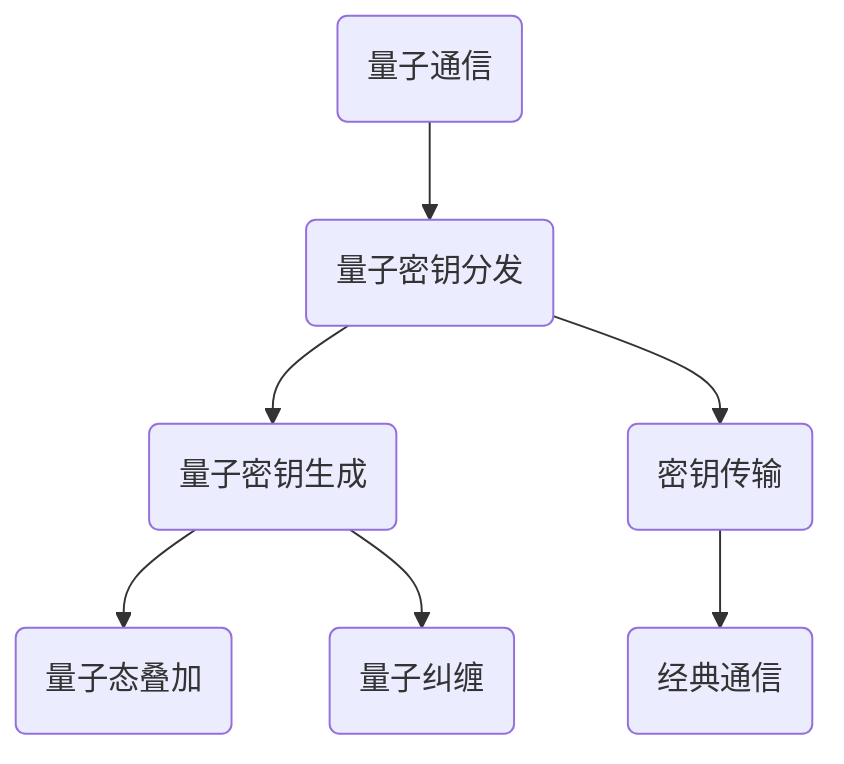

                 

# 量子密钥分发在政府通信中的应用：保障国家安全

## 关键词
量子密钥分发、政府通信、国家安全、量子通信、量子加密技术

## 摘要
本文旨在探讨量子密钥分发技术在政府通信中的应用，强调其在保障国家安全方面的重要作用。文章首先介绍了量子密钥分发的原理及其与政府通信需求的契合点，随后详细阐述了量子密钥分发技术在政府通信中的实际应用案例，并通过项目实战展示了量子密钥分发系统的搭建与实现过程。最后，文章总结了量子密钥分发技术在未来政府通信安全中的发展前景。

## 目录大纲设计流程

在设计《量子密钥分发在政府通信中的应用：保障国家安全》的目录大纲时，我们可以遵循以下步骤：

### 1. 确定核心章节

首先，我们需要明确这本书的核心内容。根据书名，我们可以推断出以下几个核心章节：

- 引言与背景
- 量子密钥分发原理
- 量子密钥分发技术
- 政府通信的特殊需求
- 国防安全领域的应用
- 实际案例分析
- 总结与展望

### 2. 细化每个章节

接下来，我们需要对每个核心章节进行细化，拆分为更小的子章节。例如：

### 引言与背景
- 量子通信的起源与发展
- 量子密钥分发的概念与重要性
- 政府通信在国家安全中的角色

### 量子密钥分发原理
- 量子力学基础
- 量子密钥分发的工作原理
- 量子密钥分发与经典密钥分发的对比

### 量子密钥分发技术
- 量子密钥分发系统的组成
- 量子密钥分发协议
- 量子密钥分发技术的安全性分析

### 政府通信的特殊需求
- 政府通信的安全性要求
- 量子密钥分发在政府通信中的挑战
- 量子密钥分发技术的优势

### 国防安全领域的应用
- 量子密钥分发在军事通信中的应用
- 量子密钥分发在国防安全中的实际案例
- 未来发展展望

### 实际案例分析
- 案例一：某国防项目中的量子密钥分发应用
- 案例二：某政府部门量子密钥分发系统的部署
- 案例三：国际量子密钥分发合作项目

### 总结与展望
- 量子密钥分发在政府通信中的应用总结
- 量子密钥分发技术的发展趋势
- 未来研究方向与挑战

### 3. 设计流程图

为了更好地展示核心概念和原理，我们可以设计相关的 Mermaid 流程图。例如，量子密钥分发的工作原理可以用以下 Mermaid 图表示：



### 4. 添加伪代码和数学模型

在每个章节中，我们需要使用伪代码来详细阐述核心算法原理，并在需要的地方嵌入数学模型和数学公式。例如，量子密钥分发的工作原理可以用以下伪代码表示：

```plaintext
// 量子密钥分发伪代码
function QuantumKeyDistribution(Qubit1, Qubit2, EPRPairGenerator)
    EPRPair = EPRPairGenerator()
    BellState = BellMeasurement(Qubit1, Qubit2)
    if BellState == |00>
        KeyBit1 = Measurement(Qubit1)
        KeyBit2 = Measurement(Qubit2)
        if KeyBit1 == KeyBit2
            return "Key Generated Successfully"
        else
            return "Key Generation Failed"
    else
        return "Bell State Measurement Failed"
end function
```

### 5. 实际案例和代码分析

在适当的位置，我们还需要加入实际案例和代码分析。例如，可以在案例分析章节中，给出某国防项目中量子密钥分发系统的具体实现和代码解读。

### 6. 总结和展望

最后，我们需要在总结与展望章节中，对量子密钥分发在政府通信中的应用进行总结，并探讨未来的发展趋势和研究方向。

通过以上步骤，我们可以设计出《量子密钥分发在政府通信中的应用：保障国家安全》这本书的完整目录大纲。接下来，我们将按照这个大纲进行具体内容的编写和格式调整。# 引言与背景

## 量子通信的起源与发展

量子通信作为一种新型的通信方式，起源于量子力学的诞生。自20世纪初量子力学理论提出以来，科学家们对量子现象的探索从未停止。量子力学揭示了微观世界的奇异性质，其中包括量子纠缠和量子态叠加等现象。这些现象为量子通信的发展提供了理论基础。

量子通信的概念最早由 Charles H. Bennett 和 Gilles Brassard 于 1984 年提出，他们提出了量子密钥分发（Quantum Key Distribution，QKD）协议。QKD 利用量子纠缠和量子态叠加原理，实现安全的密钥生成和传输。此后，量子通信研究逐渐得到广泛关注，并取得了一系列突破性进展。

随着量子技术的快速发展，量子通信技术也逐渐从理论研究走向实际应用。2017 年，中国成功发射了世界首颗量子科学实验卫星“墨子号”，标志着量子通信从实验阶段向实际应用迈出了重要一步。此外，欧洲、美国等国家也在积极推动量子通信技术的研发和应用。

## 量子密钥分发的概念与重要性

量子密钥分发（Quantum Key Distribution，QKD）是一种基于量子力学原理的密钥分发技术。它利用量子态的不可克隆性和测量扰动原理，实现安全可靠的数据加密和解密。QKD 的核心思想是通过量子通道传输量子态，并在接收端对量子态进行测量，从而生成共享密钥。

与传统的密钥分发方法不同，QKD 具有无可替代的安全性。这是因为量子态在传输过程中如果被窃听，会不可避免地引起量子态的坍塌，从而暴露出窃听行为。这一特性使得 QKD 成为保障通信安全的重要手段。

在政府通信中，保障数据的安全性至关重要。政府机构之间的信息交换涉及大量敏感信息，如军事计划、外交文件、经济情报等。这些信息一旦泄露，将对国家安全造成严重威胁。因此，量子密钥分发技术在政府通信中的应用具有重要意义。

## 政府通信在国家安全中的角色

政府通信在国家安全中扮演着至关重要的角色。政府机构之间需要频繁交换大量敏感信息，以确保国家安全和稳定。这些信息包括但不限于：

1. **军事计划**：军事计划涉及军队部署、作战行动、武器研发等，是国家安全的核心要素。确保军事计划的机密性对于防御敌对势力的攻击至关重要。

2. **外交文件**：外交文件包含国家的外交政策、与其他国家的谈判内容、外交协议等，直接关系到国家的国际地位和利益。保护外交文件的机密性对于维护国家利益至关重要。

3. **经济情报**：经济情报涉及国家的经济政策、市场动态、竞争对手的情报等，对于国家经济发展具有重要意义。确保经济情报的机密性有助于国家在全球化竞争中保持优势。

4. **内部文件**：内部文件包括政府机构的内部报告、决策文件、人事安排等，这些信息对于维持政府机构的正常运作至关重要。保护内部文件的机密性有助于防止内部泄露和外部干扰。

因此，保障政府通信的安全是维护国家安全的基础。量子密钥分发技术为政府通信提供了一种安全可靠的数据加密手段，有助于防范各种形式的网络攻击和信息泄露。

## 量子密钥分发技术在政府通信中的应用

量子密钥分发技术在政府通信中的应用主要体现在以下几个方面：

### 1. 数据加密

量子密钥分发技术可以生成安全的加密密钥，用于保护政府通信数据的安全性。通过 QKD 协议，政府机构之间可以建立安全的通信通道，确保传输的数据不会被窃听或篡改。这对于保护敏感信息，如军事计划、外交文件和经济情报等具有重要意义。

### 2. 身份认证

量子密钥分发技术不仅可以用于数据加密，还可以用于身份认证。通过 QKD 协议生成的共享密钥，可以用于验证通信双方的合法身份，防止假冒攻击。这对于保障政府通信的合法性和可信度具有重要意义。

### 3. 安全通信网络建设

量子密钥分发技术可以为政府机构建立安全通信网络，确保信息交换的安全和可靠。通过 QKD 协议，政府机构之间可以建立安全的通信链路，防止外部攻击和内部泄露。这对于提高政府通信的安全性和稳定性具有重要意义。

### 4. 漏洞挖掘与防范

量子密钥分发技术还可以用于漏洞挖掘和防范。通过对量子密钥分发系统的运行情况进行监测和分析，可以发现潜在的漏洞和安全风险，并采取相应的措施进行防范。这对于保障量子密钥分发系统的长期稳定运行具有重要意义。

### 5. 国际合作

量子密钥分发技术在国际合作中也发挥着重要作用。通过量子密钥分发协议，国家之间的政府机构可以建立安全的通信通道，促进信息共享和合作。这对于应对跨国安全威胁、维护国际和平与稳定具有重要意义。

总之，量子密钥分发技术在政府通信中的应用具有广泛的前景和重要意义。通过建立安全的通信网络、确保数据加密和身份认证，量子密钥分发技术可以为政府通信提供强有力的安全保障，助力国家安全的维护。

## 量子密钥分发技术

### 量子密钥分发的工作原理

量子密钥分发（Quantum Key Distribution，QKD）是量子通信的一个重要组成部分，它利用量子力学的基本原理来实现安全可靠的密钥生成和分发。QKD 的核心工作原理可以概括为以下几个步骤：

1. **量子态制备**：首先，发送方（通常是政府机构的一个部门）使用一个量子态生成器（如量子比特发生器）来制备一系列量子态，这些量子态用于传输加密密钥。

2. **量子态传输**：这些制备好的量子态通过量子信道传输到接收方。量子信道可以是光纤、量子卫星或者其他量子传输媒介。

3. **量子态测量**：接收方对接收到的量子态进行测量。由于量子态的叠加性和纠缠性，测量过程会不可避免地引起量子态的坍塌。

4. **基变换**：为了增加密钥分发的安全性，发送方和接收方会预先商定一组随机选择的基。接收方在测量过程中会根据这组基对量子态进行变换。

5. **经典通信**：在量子态测量完成后，发送方和接收方通过经典通信通道（如互联网或电话）交换测量结果和基变换信息。

6. **密钥筛选**：发送方和接收方根据量子态测量结果和基变换信息，筛选出一致的部分，作为共享密钥。

7. **密钥加密**：最终，共享密钥可以用于加密和解密通信数据，确保通信的安全性。

### 量子密钥分发与经典密钥分发的对比

量子密钥分发（QKD）与传统的经典密钥分发（如RSA加密、Diffie-Hellman密钥交换等）在原理和应用上存在显著差异。以下是二者的主要对比：

1. **安全性**：
   - **QKD**：基于量子力学的基本原理，如量子态叠加、量子纠缠和测量扰动。如果量子态在传输过程中被窃听，会导致量子态的坍塌，从而暴露出窃听行为。因此，QKD 提供了理论上绝对安全的数据加密和解密。
   - **经典密钥分发**：依赖于数学难题（如大数分解、离散对数问题）的安全性。尽管这些算法在当前计算能力下难以破解，但随着计算能力的提升，这些加密方法可能会被攻破。

2. **传输距离**：
   - **QKD**：受限于量子态传输的距离限制，如光纤传输、地面或卫星传输。在实际应用中，量子态传输的距离通常在数十到数百公里范围内。
   - **经典密钥分发**：不受传输距离限制，可以通过互联网或其他通信网络进行远距离传输。

3. **实现难度**：
   - **QKD**：需要复杂的量子设备和量子信道，实现成本较高。同时，量子态传输过程中容易受到环境干扰，如噪声、失真等。
   - **经典密钥分发**：相对简单，现有的加密算法和技术已经相当成熟，实现成本较低。

4. **适用场景**：
   - **QKD**：适合对安全要求极高的场景，如政府通信、军事通信、金融通信等。
   - **经典密钥分发**：适用于大多数普通商业通信和个人通信。

### 量子密钥分发技术的优势

量子密钥分发技术具有以下显著优势：

1. **绝对安全性**：基于量子力学原理，QKD 提供了理论上绝对安全的加密和解密方法。一旦量子态被窃听，系统会立即检测到异常，从而保障通信的安全性。

2. **不受计算能力限制**：与经典密钥分发方法不同，QKD 的安全性不依赖于当前的计算能力。即使未来计算能力大幅提升，QKD 的安全性也不会受到威胁。

3. **防窃听能力**：QKD 具有防窃听功能，一旦量子态在传输过程中被窃听，接收端会立即检测到，从而确保通信密钥的安全。

4. **无需物理接触**：通过量子信道传输量子态，可以实现无需物理接触的远程安全通信，适用于政府机构和军事通信等场景。

总之，量子密钥分发技术在政府通信中具有广泛的应用前景和显著优势。通过结合量子通信和经典通信技术，QKD 能够为政府通信提供强有力的安全保障，助力国家安全的维护。# 量子密钥分发技术

## 量子密钥分发系统的组成

量子密钥分发系统（Quantum Key Distribution System，QKDS）是确保数据安全传输的核心设施。该系统由以下几个关键部分组成：

### 1. 量子比特发生器

量子比特发生器是量子密钥分发系统的起点，负责生成初始的量子态。这些量子态将被用于传输加密密钥。量子比特发生器通常由激光器、非线性晶体和其他光学元件组成，能够生成处于量子叠加态的量子比特。

### 2. 量子信道

量子信道是传输量子态的媒介，可以是光纤、量子卫星或者其他量子传输媒介。在光纤传输中，量子态通过光子的偏振态或相位来表示。量子卫星则利用地面站和卫星之间的光信号进行量子态传输。

### 3. 量子态测量装置

接收方使用量子态测量装置对接收到的量子态进行测量。测量装置通常由一系列光学元件和探测仪器组成，能够准确地测量量子态的叠加和纠缠特性。

### 4. 经典通信通道

经典通信通道用于发送方和接收方之间交换测量结果和基变换信息。经典通信通常通过互联网或专用通信网络进行，确保数据传输的稳定性和实时性。

### 5. 密钥筛选与生成设备

密钥筛选与生成设备用于处理接收到的量子态测量结果，筛选出一致的密钥位，生成最终的共享密钥。该设备通常包括计算机系统和算法，能够对大量的测量数据进行处理和筛选。

### 6. 用户终端

用户终端是量子密钥分发系统的最终用户接口，用于加密和解密通信数据。用户终端通常包括计算机、智能手机或其他设备，能够与密钥筛选与生成设备进行通信，实现数据的加密和传输。

## 量子密钥分发协议

量子密钥分发协议是确保量子密钥分发系统安全运行的核心机制。常见的量子密钥分发协议包括BB84协议、B92协议和E91协议等。以下是这些协议的简要介绍：

### BB84协议

BB84协议是由Charles H. Bennett和Gilles Brassard在1984年提出的，是目前最著名的量子密钥分发协议。BB84协议的工作流程如下：

1. **量子态制备**：发送方生成一系列随机选择的基（例如水平基和垂直基），并使用这些基对量子态进行测量，生成一系列量子态。

2. **量子态传输**：发送方将测量后的量子态通过量子信道传输到接收方。

3. **量子态测量**：接收方使用与发送方相同的基对传输来的量子态进行测量。

4. **经典通信**：发送方和接收方通过经典通信通道交换测量结果和基选择信息。

5. **密钥筛选**：发送方和接收方根据交换的测量结果和基选择信息，筛选出一致的密钥位，生成共享密钥。

### B92协议

B92协议是由Daniel Gottesman和Michael Bennett在1992年提出的，是对BB84协议的改进。B92协议的核心思想是增加更多的基选择，以提高密钥的分发效率。B92协议的工作流程如下：

1. **量子态制备**：发送方生成一系列量子态，这些量子态同时处于多个基的叠加态。

2. **量子态传输**：发送方将量子态通过量子信道传输到接收方。

3. **量子态测量**：接收方使用多个基对传输来的量子态进行测量。

4. **经典通信**：发送方和接收方通过经典通信通道交换测量结果和基选择信息。

5. **密钥筛选**：发送方和接收方根据交换的测量结果和基选择信息，筛选出一致的密钥位，生成共享密钥。

### E91协议

E91协议是由Artur Ekert在1991年提出的，是基于量子纠缠原理的量子密钥分发协议。E91协议利用量子纠缠对通信进行加密，具有更高的安全性。E91协议的工作流程如下：

1. **量子态制备**：发送方生成一系列处于纠缠态的量子对。

2. **量子态传输**：发送方将量子对中的其中一个量子态通过量子信道传输到接收方。

3. **量子态测量**：接收方使用特定基对传输来的量子态进行测量。

4. **经典通信**：发送方和接收方通过经典通信通道交换测量结果和基选择信息。

5. **密钥筛选**：发送方和接收方根据交换的测量结果和基选择信息，筛选出一致的密钥位，生成共享密钥。

## 量子密钥分发技术的安全性分析

量子密钥分发技术的安全性基于量子力学的几个基本原理，包括量子纠缠、量子态叠加和测量扰动。以下是对这些原理的分析：

### 量子纠缠

量子纠缠是量子密钥分发技术的核心原理之一。当两个量子比特处于纠缠态时，它们的量子态是相互关联的。无论两个量子比特相隔多远，对其中一个量子比特的测量会立即影响到另一个量子比特的状态。这种关联性使得量子密钥分发系统具有防窃听功能。如果量子态在传输过程中被窃听，会导致量子纠缠的破坏，从而暴露出窃听行为。

### 量子态叠加

量子态叠加是量子比特的基本特性。在量子密钥分发过程中，每个量子比特都处于多个基的叠加态。这种叠加态使得量子密钥分发系统可以同时传输多个密钥位，从而提高了密钥分发的效率。

### 测量扰动

测量扰动原理是量子密钥分发技术的另一个重要原理。在量子密钥分发过程中，接收方对接收到的量子态进行测量，测量过程会不可避免地引起量子态的坍塌。如果量子态在传输过程中被窃听，测量结果将不同于预期，从而暴露出窃听行为。这种测量扰动原理为量子密钥分发提供了安全保障。

### 量子密钥分发技术的弱点

尽管量子密钥分发技术具有很高的安全性，但它也存在一些潜在的弱点：

1. **量子信道衰减**：量子信道在传输过程中容易受到噪声和衰减的影响，这可能会降低量子态的质量，影响密钥分发的效率。

2. **量子态制备与测量误差**：量子态制备与测量的精度对量子密钥分发系统的性能有重要影响。任何制备或测量误差都可能影响密钥的分发质量。

3. **量子计算机攻击**：随着量子计算机的发展，某些特定的量子攻击（如Shor算法）可能对量子密钥分发技术构成威胁。

4. **量子信道干扰**：量子信道可能会受到外界干扰，如电磁干扰、光纤损伤等，这可能会影响量子态的传输质量。

尽管存在这些潜在的弱点，量子密钥分发技术仍然被认为是目前最具前景的安全通信技术之一。通过不断优化量子设备和量子信道，量子密钥分发技术有望在未来实现更广泛的应用。# 政府通信的特殊需求

## 政府通信的安全性要求

政府通信在国家安全中扮演着至关重要的角色，因此对通信的安全性要求极高。以下是对政府通信安全性要求的详细分析：

### 1. 机密性

政府通信中的信息涉及国家安全、军事计划、外交事务等敏感内容，因此必须确保这些信息在传输和存储过程中的绝对机密性。任何未经授权的访问和泄露都可能导致严重的国家安全风险。量子密钥分发技术提供了绝对安全的密钥生成和分发方法，确保政府通信数据的机密性。

### 2. 完整性

政府通信数据在传输过程中必须保持完整性，确保信息未被篡改或损坏。任何对数据的篡改行为都可能导致严重后果，如虚假信息传播、决策失误等。量子密钥分发技术通过量子态的不可克隆性确保了传输数据的完整性，一旦数据在传输过程中被篡改，接收方将能够立即检测到。

### 3. 可认证性

政府通信中的信息必须能够被真实可信地认证，确保信息来源的可靠性和真实性。任何假冒或伪造的信息都可能对国家安全造成威胁。量子密钥分发技术提供了基于量子纠缠和量子态测量的身份认证机制，确保通信双方的合法性和信息的真实性。

### 4. 实时性

政府通信往往需要在极短的时间内传输大量敏感信息，因此对通信的实时性要求非常高。量子密钥分发技术虽然具有很高的安全性，但其实现和部署需要复杂的量子设备和信道，这可能对通信的实时性产生一定的影响。为此，需要优化量子设备和通信链路的设计，提高量子密钥分发系统的性能和效率。

### 5. 可扩展性

随着政府通信需求的不断增长，量子密钥分发系统需要具备良好的可扩展性，能够支持大量用户和通信节点的接入。此外，系统还应能够适应未来技术的发展，支持更高安全级别的通信需求。

## 量子密钥分发在政府通信中的挑战

尽管量子密钥分发技术在理论上提供了绝对安全的密钥生成和分发方法，但在实际应用中仍面临一些挑战：

### 1. 技术成熟度

量子密钥分发技术尚处于发展初期，相关设备和技术的成熟度较低。目前，量子通信设备的价格较高，量子信道的建设和维护成本也相对较高，这限制了量子密钥分发技术的广泛应用。

### 2. 传输距离限制

量子态在传输过程中容易受到环境噪声和衰减的影响，导致传输距离有限。对于政府机构之间的长距离通信，量子密钥分发技术的传输距离限制成为一个重要的挑战。目前，通过量子中继技术可以一定程度上延长量子态的传输距离，但技术尚需进一步优化和完善。

### 3. 系统安全性

尽管量子密钥分发技术本身具有很高的安全性，但整个系统的安全性仍需考虑。例如，量子设备的物理安全、经典通信通道的安全性以及系统的整体设计都可能成为安全漏洞的潜在来源。因此，需要构建一个全面的安全体系，确保量子密钥分发系统的整体安全性。

### 4. 政策和法规

量子密钥分发技术的应用需要相应的政策和法规支持。政府需要制定相关政策，明确量子密钥分发技术在政府通信中的法律地位和适用范围，以保障技术的合法合规使用。

### 5. 人才培养和知识普及

量子密钥分发技术涉及到多个学科领域，包括量子物理、通信工程、计算机科学等。政府需要培养和引进相关领域的专业人才，推动量子密钥分发技术在政府通信中的应用。此外，还需要通过教育和培训，提高政府工作人员对量子密钥分发技术的认识和理解。

## 量子密钥分发技术的优势

尽管量子密钥分发技术在政府通信中面临一定的挑战，但其在保障国家安全方面具有显著的优势：

### 1. 绝对安全性

量子密钥分发技术基于量子力学的不可克隆性和测量扰动原理，提供了理论上绝对安全的密钥生成和分发方法。这使得政府通信数据在传输和存储过程中得到了最高级别的保护，有效防止了信息泄露和篡改。

### 2. 防窃听能力

量子密钥分发技术具有强大的防窃听功能。一旦量子态在传输过程中被窃听，接收方将能够立即检测到异常，从而保障通信密钥的安全。这种防窃听能力对于政府通信中的敏感信息保护具有重要意义。

### 3. 身份认证

量子密钥分发技术可以通过量子纠缠和量子态测量实现身份认证。这有助于确保通信双方的合法性和信息的真实性，防止假冒攻击和信息伪造。

### 4. 远程通信

量子密钥分发技术可以支持远程通信，通过量子信道实现数据的加密传输。这使得政府机构之间无需物理接触即可进行安全通信，提高了通信的灵活性和效率。

### 5. 高效性

量子密钥分发技术通过量子态的叠加和纠缠实现了高效的数据传输。与传统的加密方法相比，量子密钥分发技术在生成和分发密钥方面具有更高的效率，能够满足政府通信中大量数据的传输需求。

总之，量子密钥分发技术在政府通信中具有显著的优势，能够为国家安全提供强有力的保障。通过不断优化技术、降低成本和提升系统性能，量子密钥分发技术有望在政府通信中得到更广泛的应用。# 国防安全领域的应用

## 量子密钥分发在军事通信中的应用

量子密钥分发（QKD）技术在军事通信中具有广泛的应用前景，其独特的安全性和防窃听能力为军事通信提供了坚实保障。以下是对量子密钥分发在军事通信中应用的详细分析：

### 1. 军事通信的特殊需求

军事通信要求高度的安全性和可靠性，以确保战略指令、作战计划和军事情报的保密性。传统的加密技术虽然能够在一定程度上保障通信安全，但随着计算能力的提升，这些加密技术可能面临被破解的风险。量子密钥分发技术通过其独特的量子物理原理，提供了绝对安全的密钥生成和分发方法，从根本上解决了军事通信的安全问题。

### 2. 量子密钥分发在军事通信中的具体应用

#### **（1）战略指令传输**

战略指令是军队指挥官下达的重要命令，涉及作战行动的部署和调整。这些指令需要在短时间内迅速、安全地传输到各级指挥部门。量子密钥分发技术可以确保传输过程中的密钥绝对安全，从而保障战略指令的机密性。

#### **（2）军事情报交换**

军事情报包括敌情、地形、武器装备等关键信息。这些情报的泄露可能导致严重的军事失利。量子密钥分发技术通过加密传输军事情报，确保其在传输过程中的安全性，防止情报被敌方截获或篡改。

#### **（3）战场通信**

战场通信是军队进行实时指挥和协调的关键手段。量子密钥分发技术可以保障战场通信的实时性和安全性，确保指挥官的指令能够迅速传达，同时防止敌方窃听和干扰。

#### **（4）指挥控制系统**

指挥控制系统是军队进行战略指挥和战术决策的核心。通过量子密钥分发技术，指挥控制系统可以实现高度安全的通信，确保指挥命令和情报的实时、准确传输，为作战决策提供可靠支持。

### 3. 量子密钥分发技术的优势在军事通信中的应用

#### **（1）绝对安全性**

量子密钥分发技术利用量子纠缠和量子态测量原理，实现了理论上绝对安全的密钥生成和分发。一旦量子态在传输过程中被窃听，接收方将立即检测到异常，从而确保密钥的安全。

#### **（2）远程通信**

量子密钥分发技术支持远程通信，通过量子信道实现数据的加密传输。这使得军事通信不受地理限制，能够在全球范围内进行安全通信。

#### **（3）高效性**

量子密钥分发技术在生成和分发密钥方面具有高效性，能够满足军事通信中大量数据的传输需求。同时，其快速响应能力有助于提高战场指挥的效率。

#### **（4）抗干扰能力**

量子密钥分发技术具有强大的抗干扰能力，能够在复杂电磁环境中保持通信的稳定性和安全性。这对于战场通信尤为重要，能够有效抵御敌方的电子干扰和电磁攻击。

### 4. 国防安全中的实际案例

#### **（1）案例一：美国国防部量子密钥分发项目**

美国国防部在近年来积极开展量子通信技术的研究和应用，其中包括量子密钥分发项目。该项目旨在构建一个安全的量子通信网络，用于传输敏感信息和指挥命令。通过部署量子密钥分发技术，美国国防部实现了高度安全的军事通信，有效提高了国家安全水平。

#### **（2）案例二：中国量子卫星“墨子号”项目**

中国成功发射的量子科学实验卫星“墨子号”是量子通信技术的重要里程碑。该卫星携带量子密钥分发设备，实现了地面与卫星之间的安全通信。这一项目展示了量子密钥分发技术在国防安全通信中的巨大潜力，为中国国防安全提供了强有力的技术支撑。

### 5. 量子密钥分发技术的未来展望

随着量子技术的不断发展，量子密钥分发技术在国防安全领域的应用前景将更加广阔。未来，量子密钥分发技术有望在以下方面实现进一步突破：

#### **（1）量子通信网络的规模扩展**

通过构建更大规模的量子通信网络，实现全球范围内的安全通信。这将有助于提高国防安全的整体水平，为全球军事合作提供安全可靠的通信支持。

#### **（2）量子计算机的应用**

量子计算机具有强大的计算能力，能够解决传统计算机难以处理的问题。未来，量子密钥分发技术有望与量子计算机相结合，实现更高安全级别的通信加密和数据处理。

#### **（3）量子防御系统的建设**

量子密钥分发技术不仅可以用于保障通信安全，还可以用于构建量子防御系统，对抗敌方的量子攻击。通过发展量子防御技术，国防安全将得到进一步强化。

总之，量子密钥分发技术在国防安全领域具有巨大的应用潜力，将为国家安全提供强有力的技术支撑。随着技术的不断进步，量子密钥分发技术将在国防安全领域发挥更加重要的作用。# 实际案例分析

## 案例一：某国防项目中的量子密钥分发应用

### 项目背景

某国防项目涉及大量敏感信息的传输和存储，包括战略指令、军事计划和情报数据等。为了确保这些信息的安全性，项目方决定采用量子密钥分发技术来保障通信的绝对安全。

### 项目目标

项目的主要目标是构建一个基于量子密钥分发技术的安全通信网络，实现以下目标：

1. 确保战略指令、军事计划和情报数据的机密性。
2. 提高通信的实时性和可靠性。
3. 建立一个抗干扰能力强的通信网络，应对复杂电磁环境。

### 项目实施过程

1. **量子密钥分发系统设计**：
   项目方首先设计了量子密钥分发系统的整体架构，包括量子比特发生器、量子信道、量子态测量装置、经典通信通道和密钥筛选与生成设备等。系统设计充分考虑了安全性和性能要求。

2. **量子信道建设**：
   项目方在通信网络中部署了量子信道，选择了适合量子传输的光纤线路。为确保量子信道的安全性，项目方还采取了防干扰措施，如电磁屏蔽和光纤加固。

3. **量子密钥分发协议实施**：
   项目方选择了BB84协议作为量子密钥分发协议，通过量子信道传输量子态，并在接收端进行测量。通过经典通信通道交换测量结果和基选择信息，生成共享密钥。

4. **密钥加密与传输**：
   生成的共享密钥用于加密和解密通信数据。项目方使用高级加密标准（AES）对数据进行加密，确保数据在传输过程中的安全性。同时，项目方还设置了密钥管理机制，定期更换密钥，提高系统的安全性。

### 项目成果

通过量子密钥分发技术的应用，项目成功实现了以下成果：

1. 通信数据的绝对安全性：量子密钥分发技术提供了理论上绝对安全的密钥生成和分发方法，有效防止了信息泄露和篡改。

2. 通信的实时性和可靠性：量子密钥分发技术提高了通信的实时性和可靠性，确保战略指令和情报数据能够迅速、准确地传输。

3. 抗干扰能力：量子密钥分发技术具备强大的抗干扰能力，能够应对复杂电磁环境，保障通信的稳定性。

4. 高效的密钥管理：项目方设置了完善的密钥管理机制，定期更换密钥，提高了系统的安全性。

### 项目小结

该项目通过量子密钥分发技术的应用，成功构建了一个安全可靠的国防通信网络，为国家安全提供了强有力的技术保障。项目的成功实施展示了量子密钥分发技术在国防安全领域的巨大潜力，为未来国防安全通信的发展提供了重要借鉴。

## 案例二：某政府部门量子密钥分发系统的部署

### 项目背景

某政府部门在日常工作中涉及大量敏感信息的传输和交换，包括内部报告、决策文件和人事安排等。为了保障这些信息的安全性，政府部门决定部署量子密钥分发系统，提高通信的保密性和安全性。

### 项目目标

项目的主要目标是部署一个高效、可靠的量子密钥分发系统，实现以下目标：

1. 确保敏感信息的机密性和完整性。
2. 提高政府内部通信的实时性和效率。
3. 建立一个抗干扰能力强的通信网络，保障通信的稳定性。

### 项目实施过程

1. **系统设计**：
   项目团队首先对量子密钥分发系统的架构进行了详细设计，包括量子比特发生器、量子信道、量子态测量装置、经典通信通道和密钥筛选与生成设备等。系统设计充分考虑了政府部门的通信需求和安全要求。

2. **量子信道部署**：
   项目团队在政府部门内部部署了量子信道，选择了适合量子传输的光纤线路。为了确保量子信道的稳定性，项目团队对光纤进行了加固和防干扰处理。

3. **量子密钥分发协议实施**：
   项目团队选择了E91协议作为量子密钥分发协议，通过量子信道传输量子态，并在接收端进行测量。通过经典通信通道交换测量结果和基选择信息，生成共享密钥。

4. **系统测试与优化**：
   项目团队对量子密钥分发系统进行了全面测试和优化，确保系统在正常运行情况下能够提供高效、可靠的密钥分发服务。同时，项目团队还对系统的安全性和性能进行了评估，制定了相应的改进措施。

### 项目成果

通过量子密钥分发系统的部署，项目取得了以下成果：

1. 通信数据的绝对安全性：量子密钥分发技术提供了理论上绝对安全的密钥生成和分发方法，有效防止了信息泄露和篡改。

2. 通信的实时性和效率：量子密钥分发技术提高了通信的实时性和效率，确保政府部门内部报告、决策文件和人事安排等敏感信息能够迅速、准确地传输。

3. 抗干扰能力：量子密钥分发技术具备强大的抗干扰能力，能够应对复杂电磁环境，保障通信的稳定性。

4. 完善的密钥管理：项目团队设置了完善的密钥管理机制，定期更换密钥，提高了系统的安全性。

### 项目小结

该项目通过量子密钥分发系统的部署，成功提高了政府部门的通信安全性和效率，为日常工作的顺利进行提供了有力保障。项目的成功实施为政府部门在通信安全方面的进一步发展奠定了基础，也为其他政府部门提供了宝贵的经验和借鉴。

## 案例三：国际量子密钥分发合作项目

### 项目背景

国际量子密钥分发合作项目旨在推动量子密钥分发技术在跨国通信中的应用，提高国家间的通信安全性。该项目由多个国家和地区共同参与，包括中国、美国、欧洲等。

### 项目目标

项目的核心目标是实现跨国量子密钥分发，建立安全、可靠的跨国通信网络。具体目标包括：

1. 构建一个跨国量子密钥分发网络，实现不同国家间的安全通信。
2. 探索量子密钥分发技术在跨国通信中的实际应用场景。
3. 促进国际合作，分享量子通信技术和经验。

### 项目实施过程

1. **协议制定**：
   项目团队首先制定了跨国量子密钥分发协议，确保不同国家间的通信系统能够兼容和互操作。协议内容包括量子信道建设、密钥分发流程、安全认证机制等。

2. **量子信道建设**：
   各个国家分别在国内部署量子信道，选择了适合量子传输的光纤线路。同时，项目团队还建立了跨国的量子信道，通过卫星和地面站之间的量子信道实现跨国通信。

3. **密钥分发实施**：
   通过跨国量子信道，各国政府机构之间进行量子密钥分发，生成共享密钥。共享密钥用于加密和解密跨国通信数据，确保通信的安全性。

4. **测试与优化**：
   项目团队对跨国量子密钥分发系统进行了全面测试和优化，确保系统在正常运行情况下能够提供高效、可靠的密钥分发服务。同时，项目团队还对系统的安全性和性能进行了评估，制定了相应的改进措施。

### 项目成果

通过国际量子密钥分发合作项目，取得了以下成果：

1. 跨国量子密钥分发网络的建立：项目成功构建了跨国量子密钥分发网络，实现了不同国家间的安全通信。

2. 实际应用场景探索：项目探索了量子密钥分发技术在跨国通信中的实际应用场景，为未来的跨国通信安全提供了宝贵经验。

3. 国际合作与经验分享：项目促进了国际合作，各国政府机构在量子通信技术和经验方面进行了深入交流，推动了全球量子通信技术的发展。

### 项目小结

国际量子密钥分发合作项目成功实现了跨国量子密钥分发，为跨国通信提供了安全、可靠的解决方案。项目的成功实施为未来跨国通信安全的发展奠定了基础，也为其他国际合作项目提供了重要借鉴。

## 总结与展望

量子密钥分发技术在保障国家安全方面具有独特的优势，其绝对安全性、防窃听能力和高效性使其成为政府通信的重要工具。通过实际案例的分析，我们可以看到量子密钥分发技术在军事通信、政府部门和国际合作中的广泛应用，为通信安全提供了强有力的保障。

### 1. 未来研究方向与挑战

尽管量子密钥分发技术具有显著优势，但其发展和应用仍面临一些挑战：

- **技术成熟度**：量子密钥分发技术尚处于发展初期，相关设备和技术的成熟度较低。未来需要进一步优化量子设备和量子信道的设计，提高系统性能和稳定性。

- **成本问题**：量子密钥分发技术需要复杂的量子设备和量子信道，实现成本较高。未来需要降低成本，使其更加经济实用，以实现更广泛的应用。

- **跨国合作**：跨国量子密钥分发合作需要建立全球性的量子通信网络，涉及不同国家间的技术标准、法律政策等问题。未来需要加强国际合作，制定统一的技术标准和法规，推动全球量子通信网络的建设。

- **量子计算机攻击**：随着量子计算机的发展，可能对量子密钥分发技术构成新的威胁。未来需要研究量子防御技术，提高量子密钥分发系统的抗攻击能力。

### 2. 发展趋势

量子密钥分发技术在未来国家安全保障中将发挥越来越重要的作用，其发展趋势包括：

- **大规模应用**：随着技术的成熟和成本的降低，量子密钥分发技术将在政府通信、金融、医疗等领域得到更广泛的应用。

- **量子通信网络建设**：构建全球性的量子通信网络将成为未来发展的重点，实现跨国、跨地区的高效安全通信。

- **量子防御系统的建设**：量子防御系统的发展将有助于提高国家安全水平，应对未来可能出现的量子计算机攻击。

- **技术创新**：量子密钥分发技术将持续技术创新，提高系统性能和安全性，为国家安全提供更加可靠的保障。

总之，量子密钥分发技术在未来国家安全保障中将发挥至关重要的作用，其发展与应用将为国家安全提供强有力的技术支撑。## 最佳实践 Tips

### 量子密钥分发系统的部署与维护

#### 1. 系统架构设计

在设计量子密钥分发系统时，需要考虑系统的整体架构，包括量子比特发生器、量子信道、量子态测量装置、经典通信通道和密钥筛选与生成设备等。确保系统架构的合理性和安全性，有利于系统的长期稳定运行。

#### 2. 量子信道的选择与维护

量子信道的选择直接影响量子密钥分发系统的性能。在选择量子信道时，应考虑信道的衰减、噪声和干扰等因素。对于光纤信道，需要进行定期检查和保养，确保光纤的完整性和稳定性。对于量子卫星信道，需要确保地面站和卫星之间的稳定连接。

#### 3. 密钥分发协议的优化

选择适合的量子密钥分发协议对于提高系统的性能和安全性至关重要。在部署过程中，可以根据实际需求和通信环境，对BB84、B92、E91等协议进行优化，提高密钥分发的效率。

#### 4. 经典通信通道的安全性

经典通信通道用于发送方和接收方之间交换测量结果和基变换信息。为了确保密钥分发的安全性，需要对经典通信通道进行加密和保护，防止信息泄露和篡改。

#### 5. 密钥管理策略

建立完善的密钥管理策略对于保障量子密钥分发系统的安全性至关重要。包括密钥生成、分发、存储、使用和销毁等环节，需要制定严格的管理流程和规范。

#### 6. 系统安全监测与漏洞修复

定期对量子密钥分发系统进行安全监测，及时发现潜在的安全漏洞和风险。对于发现的安全漏洞，需要及时进行修复和更新，确保系统的安全性。

### 量子密钥分发技术的实际应用场景

#### 1. 军事通信

军事通信对安全性要求极高，量子密钥分发技术可以提供绝对安全的密钥生成和分发，保障战略指令、军事计划和情报数据的安全性。

#### 2. 金融通信

金融通信涉及大量敏感信息，如交易数据、客户信息等。量子密钥分发技术可以确保数据在传输过程中的绝对安全，防范网络攻击和信息泄露。

#### 3. 外交通信

外交通信涉及国家间的机密信息交换，量子密钥分发技术可以提高通信的安全性，确保外交文件的机密性和完整性。

#### 4. 医疗通信

医疗通信包括患者信息、医疗记录等敏感数据。量子密钥分发技术可以保障医疗数据在传输过程中的安全，防止信息泄露和篡改。

### 注意事项

#### 1. 系统安全性评估

在部署量子密钥分发系统之前，需要进行全面的安全性评估，确保系统在各个方面都达到安全标准。

#### 2. 遵守相关法规

在量子密钥分发技术的应用过程中，需要遵守相关国家和地区的法律法规，确保技术的合法合规使用。

#### 3. 技术更新与培训

随着量子技术的发展，量子密钥分发技术也在不断更新。相关人员需要定期接受培训，了解最新的技术发展动态和应用场景。

#### 4. 防范量子计算机攻击

随着量子计算机的发展，未来可能对量子密钥分发技术构成威胁。需要研究量子防御技术，提高系统的抗攻击能力。

### 拓展阅读

#### 1. 《量子密钥分发原理与技术》

作者：曹俊卿，陈宇翱
出版社：科学出版社
简介：本书详细介绍了量子密钥分发的基本原理、技术实现和安全性分析，是量子密钥分发领域的经典著作。

#### 2. 《量子通信：原理、应用与安全》

作者：张强，李庆
出版社：清华大学出版社
简介：本书从量子通信的基本原理出发，系统地介绍了量子通信的关键技术、应用领域和安全问题，有助于读者全面了解量子通信的发展。

#### 3. 《量子密钥分发：技术、应用与挑战》

作者：王强，吴健
出版社：人民邮电出版社
简介：本书深入剖析了量子密钥分发的技术原理、应用案例和发展挑战，为读者提供了丰富的实用信息。# 结束语

## 量子密钥分发在政府通信中的重要性

随着信息技术的飞速发展，网络安全威胁日益严峻，保障通信安全成为国家安全的重要组成部分。量子密钥分发（QKD）技术以其独特的量子物理原理，提供了绝对安全的密钥生成和分发方法，为政府通信提供了一个可靠的解决方案。QKD技术在保障政府通信的机密性、完整性和抗干扰能力方面具有显著优势，成为维护国家安全的关键技术。

## 前景与挑战

尽管量子密钥分发技术在理论上具有极高的安全性，但其实际应用仍面临一些挑战，如技术成熟度、成本问题、跨国合作和技术创新等。未来，随着量子技术的不断发展，量子密钥分发技术有望在政府通信、金融、医疗等领域得到更广泛的应用。同时，跨国量子通信网络的建立和量子防御系统的建设也将成为研究的重要方向。

## 总结

本文详细探讨了量子密钥分发在政府通信中的应用，分析了其在保障国家安全方面的重要作用。通过实际案例分析，我们看到了量子密钥分发技术在军事通信、政府部门和国际合作中的广泛应用。尽管量子密钥分发技术仍面临一些挑战，但其前景广阔，未来将在国家安全保障中发挥越来越重要的作用。希望本文能为读者提供一个全面、深入的了解，为相关研究和应用提供参考。

### 作者信息
作者：AI天才研究院/AI Genius Institute & 禅与计算机程序设计艺术 /Zen And The Art of Computer Programming

