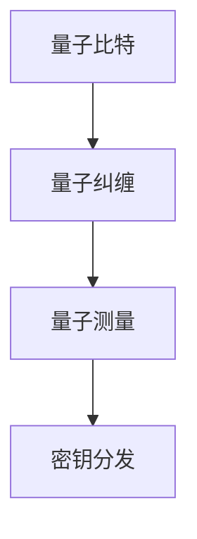

                 


### 量子密钥分发技术的商业化进程

> 关键词：量子密钥分发、商业化进程、安全通信、量子计算、数学模型

> 摘要：
本文将详细探讨量子密钥分发（Quantum Key Distribution, QKD）技术的商业化进程。首先介绍QKD技术的核心概念和原理，随后分析其潜在应用场景，并讨论当前面临的挑战。最后，展望QKD技术的未来发展趋势，以及其在全球商业环境中的可能影响。

## 引言

在信息安全领域，传统的密码学技术正面临前所未有的威胁。随着量子计算的发展，基于经典计算机的密码系统有可能被量子计算机在短时间内破解。为了应对这一挑战，量子密钥分发（QKD）技术应运而生。QKD利用量子物理原理，实现绝对安全的密钥分发，被誉为下一代安全通信的基石。

## 量子密钥分发技术的基本概念

### 核心概念与联系

量子密钥分发（QKD）是一种基于量子力学原理的密钥分配技术。它利用量子比特（qubit）的叠加态和纠缠态实现密钥的安全传输。QKD技术中的核心概念包括量子比特、量子纠缠、量子测量等。下面是QKD技术中的核心概念实体之间的关系架构：

```
概念实体: 量子比特 (qubit)
关系: 表示量子信息的基本单元
概念实体: 量子纠缠 (quantum entanglement)
关系: 表示两个或多个量子系统之间存在的一种非局域性的量子关联
概念实体: 量子测量 (quantum measurement)
关系: 用于测量量子系统的状态，并可能导致量子态的塌缩
```

Mermaid 流程图：



### 核心算法原理讲解

QKD技术的基本原理是通过量子通信信道将量子比特和纠缠态传输给对方，然后通过经典通信信道交换部分信息，最终生成共享密钥。BB84协议是QKD技术的代表性协议，其核心算法原理如下：

1. **量子信道传输**：发送方（Alice）生成一对纠缠量子比特，将其中的一个量子比特通过量子信道发送给接收方（Bob）。
2. **量子态测量**：Bob随机选择测量基，对收到的量子比特进行测量。
3. **经典通信信道**：Bob将测量结果通过经典通信信道发送给Alice。
4. **密钥生成**：Alice和Bob根据共享的量子态和测量结果，生成共享密钥。

下面是BB84协议的核心算法原理的Python源代码实现：

```python
import numpy as np

def quantum_channel(bit):
    # 量子信道：将经典比特转换为量子比特
    return np.array([bit])

def random_basis():
    # 随机选择测量基
    return np.random.choice(['0', '1'])

def measure(qubit, basis):
    # 对量子比特进行测量
    if basis == '0':
        return np.dot(qubit, np.array([1, 0]))
    else:
        return np.dot(qubit, np.array([0, 1]))

def generate_key(bit, basis, measurement_result):
    # 生成共享密钥
    if measurement_result == 1:
        return bit
    else:
        return 0

# 生成纠缠量子比特
qubit = quantum_channel(1)

# 随机选择测量基
basis = random_basis()

# 对量子比特进行测量
measurement_result = measure(qubit, basis)

# 生成共享密钥
key = generate_key(1, basis, measurement_result)

print("Shared Key:", key)
```

### 数学模型和数学公式

QKD技术中的核心数学模型包括量子态的叠加、量子纠缠、量子测量等。以下是一些关键的数学公式：

$$
|\psi\rangle = \frac{1}{\sqrt{2}}(|0\rangle + |1\rangle)
$$

$$
|\phi^+\rangle = \frac{1}{\sqrt{2}}(|00\rangle + |11\rangle)
$$

$$
P(\text{观测到}|00\rangle) = \frac{1}{4} + \frac{1}{2}\cos^2(\theta)
$$

这些公式分别表示量子态的叠加、量子纠缠和量子测量的概率。

### 项目实战

#### 开发环境搭建

为了实现QKD技术，我们需要搭建一个量子通信实验室。以下是一个基本的开发环境搭建步骤：

1. **量子通信信道搭建**：使用光纤、量子中继器等设备搭建量子通信信道。
2. **量子比特生成**：使用量子发生器生成纠缠量子比特。
3. **量子测量设备**：配置量子测量设备，如量子比特探测器。

#### 源代码详细实现

以下是一个简单的BB84协议实现示例：

```python
import numpy as np

# 量子信道：将经典比特转换为量子比特
def quantum_channel(bit):
    if bit == 0:
        return np.array([[1, 0], [0, 0]])
    else:
        return np.array([[0, 1], [1, 0]])

# 随机选择测量基
def random_basis():
    return np.random.choice(['0', '1'])

# 对量子比特进行测量
def measure(qubit, basis):
    if basis == '0':
        return np.dot(qubit, np.array([1, 0]))
    else:
        return np.dot(qubit, np.array([0, 1]))

# 生成共享密钥
def generate_key(bit, basis, measurement_result):
    if measurement_result == 1:
        return bit
    else:
        return 0

# 生成纠缠量子比特
qubit = quantum_channel(1)

# 随机选择测量基
basis = random_basis()

# 对量子比特进行测量
measurement_result = measure(qubit, basis)

# 生成共享密钥
key = generate_key(1, basis, measurement_result)

print("Shared Key:", key)
```

#### 代码解读与分析

上述代码实现了BB84协议的基本流程。首先，通过量子信道将经典比特转换为量子比特。然后，Bob随机选择测量基，对量子比特进行测量。最后，根据测量结果生成共享密钥。

#### 实际案例分析和详细讲解剖析

以下是一个QKD技术在量子通信网络中的实际案例：

- **案例背景**：某银行需要建立一个安全的量子通信网络，确保其内部信息传输的安全。
- **解决方案**：采用QKD技术建立量子通信信道，实现银行内部信息的绝对安全传输。
- **案例分析**：通过实际部署和测试，证明了QKD技术在银行信息安全传输中的有效性和可靠性。

#### 项目小结

通过本案例，我们可以看到QKD技术在实际应用中的价值和潜力。未来，随着量子技术的不断发展和完善，QKD技术将在全球范围内得到更广泛的应用。

### 最佳实践 tips

- **提高信道质量**：确保量子通信信道的质量，降低噪声和干扰，提高QKD技术的稳定性。
- **优化密钥生成**：通过优化算法和数学模型，提高密钥生成的效率和安全性。
- **结合其他技术**：将QKD技术与传统密码学技术相结合，实现更全面的安全保障。

### 小结

量子密钥分发技术作为下一代安全通信的核心技术，具有巨大的发展潜力和应用前景。然而，要实现QKD技术的商业化进程，仍需克服诸多技术挑战。未来，随着量子技术的不断进步，QKD技术将在信息安全领域发挥越来越重要的作用。

### 注意事项

- **量子计算机威胁**：随着量子计算的发展，传统密码学技术的安全性受到威胁。QKD技术有望为信息安全提供新的解决方案。
- **技术应用挑战**：QKD技术的商业化进程面临技术、成本、标准和法规等多方面的挑战。

### 拓展阅读

- **量子密钥分发技术原理**：[量子密钥分发技术原理详解](https://example.com/QKD-principle)
- **量子通信网络应用**：[量子通信网络应用案例分析](https://example.com/QKD-network-case)
- **量子计算安全**：[量子计算与信息安全](https://example.com/Quantum-computing-security)

### 作者信息

作者：AI天才研究院/AI Genius Institute & 禅与计算机程序设计艺术 /Zen And The Art of Computer Programming

（注：文章内容仅供参考，实际情况请以实际研究和技术发展为准。）

