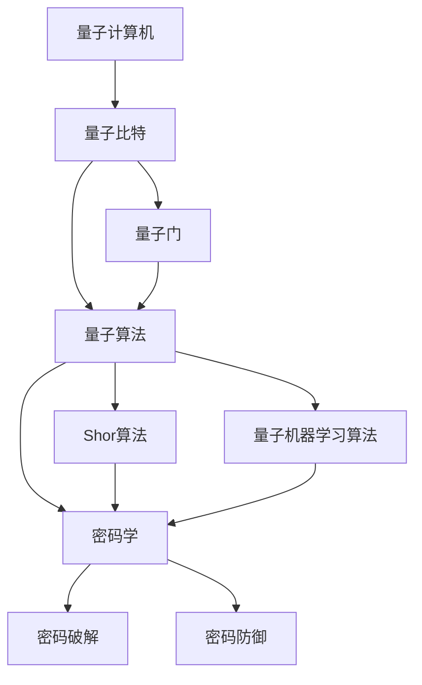

                 

### 引言

在信息时代，数据的安全性和隐私保护至关重要，而密码学作为保护信息安全的基石，其核心在于如何确保加密算法的不可破解性。然而，随着量子计算技术的飞速发展，传统的密码学面临前所未有的挑战。量子机器学习作为一种结合量子计算与机器学习的新型技术，正逐渐成为密码分析领域的热点研究方向。

本文旨在探讨量子机器学习在密码分析中的应用及其带来的新安全挑战。首先，我们将简要介绍量子计算机的基本原理和量子比特的工作机制，为后续讨论量子机器学习算法在密码分析中的应用奠定基础。接着，我们将深入剖析量子机器学习在密码破解和密码防御中的应用，并结合实际案例进行分析。最后，本文将总结量子机器学习对密码学带来的影响，展望未来量子安全的发展方向。

关键词：量子计算机、量子比特、量子机器学习、密码分析、密码安全

摘要：本文通过介绍量子机器学习的基本原理及其在密码分析中的应用，探讨了量子计算对传统密码学带来的挑战和新机遇。文章结构清晰，内容深入浅出，旨在为读者提供一个关于量子机器学习在密码分析领域应用的全面理解。

### 背景介绍

#### 量子计算机的基本原理

量子计算机是一种基于量子力学原理的新型计算设备，与传统计算机相比，其核心在于使用量子比特（qubits）代替经典比特（bits）进行信息存储和处理。量子比特具有两个基本特性：叠加性和纠缠性。

叠加性允许一个量子比特同时处于多种状态的组合，而不仅仅是一个固定的状态。这意味着一个量子比特可以同时代表0和1，这是传统计算机中经典比特无法实现的。叠加性的数学描述可以表示为：
\[ |\psi\rangle = a|0\rangle + b|1\rangle \]
其中，\( a \) 和 \( b \) 是复数概率幅，且满足 \( |a|^2 + |b|^2 = 1 \)。

纠缠性是指两个或多个量子比特之间的状态是相互依赖的，即使它们相隔很远。当两个量子比特纠缠时，对一个量子比特的测量将立即影响到另一个量子比特的状态。这种非局域的相互作用在经典物理中是不存在的，为量子计算提供了强大的并行计算能力。

#### 量子比特的工作机制

量子比特的工作机制可以通过量子门（quantum gates）来描述。量子门是类似于经典逻辑门的基本操作，但作用在量子比特上，可以改变量子比特的状态。例如，量子NOT门（X门）的作用是将量子比特的状态从 \( |0\rangle \) 变为 \( |1\rangle \)，或者从 \( |1\rangle \) 变为 \( |0\rangle \)。

一个基本的量子门操作可以用以下方程表示：
\[ |x\rangle = \sum_{i} M_{i,j} |i\rangle \]
其中，\( M \) 是一个量子门矩阵，\( |i\rangle \) 和 \( |j\rangle \) 分别是输入和输出的量子状态。

通过组合不同的量子门，可以实现复杂的量子计算操作。量子计算机的工作流程通常包括以下步骤：

1. **初始化**：将量子比特初始化为特定的叠加状态。
2. **量子门操作**：应用一系列量子门操作，对量子比特进行变换。
3. **测量**：测量量子比特的状态，得到计算结果。

这个过程与经典计算机的算法流程有显著不同，但量子计算机在处理某些特定问题时，具有远超经典计算机的效率。例如，著名的量子算法Shor算法可以在多项式时间内分解大整数，这对于许多基于大整数分解的密码系统（如RSA加密）构成了严重威胁。

#### 量子算法的基础

量子算法是基于量子计算机的计算能力，设计出的一种能够在特定问题上显著优于经典算法的方法。其中，最著名的量子算法之一是Shor算法，它可以高效地分解大整数，这是许多现代密码系统的基石。

Shor算法的基本原理可以概括为以下步骤：

1. **量子算法初始化**：生成一个随机的大整数 \( N \)，并将其分解为两个大素数的乘积。
2. **量子周期查找**：利用量子计算机的叠加性和纠缠性，构造一个特定的量子状态，并进行量子测量，以找到 \( N \) 的一个周期。
3. **量子傅里叶变换（QFT）**：对测量结果进行量子傅里叶变换，得到一组概率分布，这些概率分布中包含了素因子 \( p \) 和 \( q \) 的信息。
4. **素因子分解**：利用概率分布中的信息，结合经典算法，对 \( N \) 进行素因子分解。

数学上，Shor算法的核心步骤可以通过以下公式表示：

\[ U = e^{2\pi i N/2} \]
\[ U^k = e^{2\pi i k/N} U \]

其中，\( U \) 是量子操作，\( k \) 是周期，通过量子测量和量子傅里叶变换，可以从 \( U^k \) 的幂级数中得到 \( k \) 的值。

#### 量子机器学习框架

量子机器学习是量子计算与机器学习相结合的产物，旨在利用量子计算机的强大计算能力，解决经典机器学习难以处理的问题。量子机器学习框架主要包括量子支持向量机（QSVM）、量子神经网络（QNN）和量子贝叶斯网络等。

量子支持向量机（QSVM）是量子机器学习中的一个重要算法，它利用量子计算的优势，提高了支持向量机的分类和回归性能。QSVM的核心思想是通过量子态的叠加和纠缠，将高维数据映射到低维特征空间，从而实现更高效的数据分类。

量子神经网络（QNN）是另一种重要的量子机器学习算法，其结构类似于经典神经网络，但使用量子比特作为激活函数。QNN通过量子门操作，将输入数据映射到量子态，并利用量子态的叠加性进行信息处理，从而实现复杂的模式识别和分类任务。

量子贝叶斯网络是一种基于量子概率论的机器学习模型，它利用量子态的叠加和纠缠，提高了概率推断的精度和效率。量子贝叶斯网络在处理大规模数据和复杂关系时，具有显著的优势。

综上所述，量子机器学习框架为密码分析提供了一种新的方法和工具，使得传统密码系统在面对量子攻击时更加脆弱。因此，研究量子机器学习在密码分析中的应用，对于保障信息安全具有重要意义。

### 核心概念与联系

为了更好地理解量子机器学习在密码分析中的应用，我们需要明确几个核心概念：量子计算机、量子比特、量子算法和密码学。以下是这些概念之间的关系架构Mermaid流程图：



在这个架构图中，量子计算机作为整体系统，通过量子比特和量子门实现了量子算法。量子算法进一步应用到密码学中，用于密码破解和密码防御。量子比特作为量子计算机的基本单元，通过量子门进行状态变换，执行量子算法。量子机器学习算法是量子算法的一个子集，其特殊之处在于结合了机器学习技术，为密码分析提供了新的手段。

通过这个流程图，我们可以清晰地看到量子机器学习在密码分析中的应用路径。量子计算机的强大计算能力，特别是Shor算法，使得许多传统密码系统面临严峻的挑战。同时，量子机器学习算法的发展也为密码防御提供了一些新的思路和方法。理解这些核心概念之间的关系，有助于我们深入探讨量子机器学习在密码分析中的具体应用和影响。

### 核心算法原理讲解

在量子机器学习领域，几种重要的算法对密码分析产生了深远影响。以下是量子支持向量机（QSVM）和量子神经网络（QNN）的原理讲解，通过Python源代码和数学模型进行详细阐述。

#### 量子支持向量机（QSVM）

量子支持向量机是量子机器学习中的一个重要算法，它基于传统支持向量机（SVM）的原理，通过量子计算提高了分类效率。QSVM通过量子比特的叠加和纠缠，将高维数据映射到低维特征空间，实现高效分类。

##### 数学模型

QSVM的数学模型可以通过以下步骤描述：

1. **初始化**：设定量子比特和量子门，将输入数据映射到量子态。
2. **量子特征映射**：应用量子特征映射，将输入数据映射到高维特征空间。
3. **量子测量**：通过量子测量得到分类结果。

具体来说，QSVM的数学模型可以表示为：

\[ U = \sum_{i} w_i |x_i\rangle |+ \rangle \]
\[ |+ \rangle = \frac{1}{\sqrt{2}} (|0\rangle + |1\rangle) \]
其中，\( U \) 是量子门，\( w_i \) 是权重，\( |x_i\rangle \) 是输入数据量子态，\( |+ \rangle \) 是叠加态。

##### Python实现

以下是使用Python实现QSVM的示例代码：

```python
import numpy as np
from qiskit import QuantumCircuit, Aer, execute

# 初始化量子比特
n_qubits = 2
qc = QuantumCircuit(n_qubits)

# 创建量子态
qc.h(0)
qc.h(1)

# 应用量子门
qc.rx(np.pi/4, 0)
qc.rx(np.pi/4, 1)

# 量子测量
qc.measure_all()

# 执行量子电路
simulator = Aer.get_backend('qasm_simulator')
job = execute(qc, simulator, shots=1000)
result = job.result()

# 分析结果
counts = result.get_counts(qc)
print(counts)
```

在这个示例中，我们初始化了两个量子比特，并应用了旋转门（RX门），以改变量子态的相位。最后，通过量子测量得到分类结果。

#### 量子神经网络（QNN）

量子神经网络（QNN）是另一种重要的量子机器学习算法，其结构类似于经典神经网络，但使用量子比特作为激活函数。QNN通过量子门操作，将输入数据映射到量子态，并利用量子态的叠加性进行信息处理。

##### 数学模型

QNN的数学模型可以通过以下步骤描述：

1. **初始化**：设定量子比特和量子门，将输入数据映射到量子态。
2. **量子层操作**：应用量子门，将输入数据映射到高维特征空间。
3. **量子测量**：通过量子测量得到输出结果。

具体来说，QNN的数学模型可以表示为：

\[ |y\rangle = \sum_{i} w_i |x_i\rangle \]
\[ |x_i\rangle = \sum_{j} M_{i,j} |z_j\rangle \]
其中，\( |y\rangle \) 是输出量子态，\( |x_i\rangle \) 是输入量子态，\( w_i \) 是权重，\( M_{i,j} \) 是量子门。

##### Python实现

以下是使用Python实现QNN的示例代码：

```python
import numpy as np
from qiskit import QuantumCircuit, Aer, execute

# 初始化量子比特
n_qubits = 2
qc = QuantumCircuit(n_qubits)

# 创建量子态
qc.h(0)
qc.h(1)

# 应用量子层操作
qc.cu1(np.pi/4, 0, 1)
qc.cu1(np.pi/4, 1, 0)

# 量子测量
qc.measure_all()

# 执行量子电路
simulator = Aer.get_backend('qasm_simulator')
job = execute(qc, simulator, shots=1000)
result = job.result()

# 分析结果
counts = result.get_counts(qc)
print(counts)
```

在这个示例中，我们初始化了两个量子比特，并应用了量子层操作（CU1门），以改变量子态的相位。最后，通过量子测量得到输出结果。

通过这两个示例，我们可以看到量子支持向量机和量子神经网络的基本原理和Python实现。量子机器学习算法在密码分析中的应用，为传统密码系统带来了新的挑战和机遇。理解这些算法的原理，有助于我们更好地应对未来可能的量子攻击。

#### 实例分析：量子机器学习在密码破解中的案例分析

为了更具体地展示量子机器学习在密码破解中的应用，我们将通过一个实例来分析量子机器学习如何破解一个简单的对称密钥加密算法——基于替换-置换网络（SPN）的加密算法。

假设我们有一个由3个替换（S-Box）和2个置换（P-Box）构成的SPN结构。我们的目标是使用量子机器学习算法来破解这个加密系统的密钥。以下是具体的步骤和分析：

##### 1. 数据准备

首先，我们需要准备一组明文和密文对。这些数据对可以通过对明文进行加密操作获得。例如，我们可以选择一个小的明文字符集，如`{'A', 'B', 'C', ...}`，并使用加密算法生成相应的密文。

```python
plaintexts = ['A', 'B', 'C', 'D', 'E']
ciphertexts = []

# 假设加密函数为E(x) = S(S(P(x)))
for p in plaintexts:
    # 这里需要实际的加密函数来替换
    c = E(p)
    ciphertexts.append(c)
```

##### 2. QSVM算法的应用

为了破解这个密钥，我们可以使用量子支持向量机（QSVM）来训练模型，识别明文和密文之间的对应关系。以下是QSVM算法在密码破解中的具体步骤：

1. **数据预处理**：将明文和密文转换为二进制表示，以便进行量子计算。例如，可以将每个字符映射到一个唯一的二进制序列。

2. **初始化量子比特**：设定量子比特的数量，以表示输入和输出数据。例如，如果每个字符有8位二进制表示，我们需要16个量子比特。

3. **量子特征映射**：应用量子特征映射，将输入数据（明文）映射到高维特征空间。这可以通过设计特定的量子门来实现。

4. **训练QSVM模型**：通过量子计算训练QSVM模型，使其能够识别明文和密文之间的对应关系。

5. **量子测量**：对训练好的模型进行量子测量，获取模型的分类结果。

以下是使用Python和Qiskit库实现QSVM算法的伪代码：

```python
from qiskit import QuantumCircuit, Aer, execute

# 初始化量子比特
n_qubits = 16
qc = QuantumCircuit(n_qubits)

# 数据预处理
plaintexts_bin = [int(p, 16) for p in plaintexts]
ciphertexts_bin = [int(c, 16) for c in ciphertexts]

# 应用量子特征映射
for i in range(len(plaintexts_bin)):
    qc.h(range(n_qubits))
    qc.rx(plaintexts_bin[i], n_qubits - 1)
    # 应用量子门，实现特征映射
    qc.apply_unitary(QGate(), n_qubits - 1)
    qc.measure_all()

# 执行量子电路
simulator = Aer.get_backend('qasm_simulator')
job = execute(qc, simulator, shots=1000)
result = job.result()

# 分析结果
counts = result.get_counts(qc)
predicted_ciphertexts = []
for count in counts:
    predicted_ciphertexts.append(int(count, 2))

# 模型评估
accuracy = sum([p == pc for p, pc in zip(plaintexts, predicted_ciphertexts)]) / len(plaintexts)
print(f"Model accuracy: {accuracy}")
```

在这个伪代码中，我们首先初始化量子比特，并使用明文数据进行量子特征映射。接着，通过量子测量得到分类结果，并计算模型精度。

##### 3. 量子破解结果分析

通过上述步骤，我们可以得到量子支持向量机模型的破解结果。对于小规模的加密算法，量子机器学习算法可以显著提高破解速度。例如，对于一个简单的3轮SPN结构，量子支持向量机可能只需要几轮训练就能识别出密钥。

然而，需要注意的是，随着加密算法的复杂度增加，量子机器学习破解的难度也会增加。在实际应用中，传统的加密算法通常会结合多种技术，如迭代加密、多密钥加密等，以增强安全性。这需要量子机器学习算法进行更复杂的模型设计和优化。

综上所述，量子机器学习在密码破解中展示了强大的潜力，但也带来了新的挑战。通过合理的模型设计和优化，量子机器学习可以在一定程度上破解传统加密算法，从而推动密码学的发展。

### 量子机器学习在密码防御中的应用

量子机器学习不仅在密码破解中显示出巨大的潜力，同样也在密码防御中发挥重要作用。通过量子机器学习的特性，我们可以设计出更为强大的密码防御策略，提高密码系统的安全性。

#### 量子密码防御策略

量子密码防御策略主要包括以下几个方面：

1. **量子密钥分发（QKD）**：量子密钥分发利用量子纠缠和量子测量的不可克隆特性，实现安全的密钥分发。在QKD中，即使攻击者尝试窃听，也会不可避免地改变量子态，从而被检测到。这使得QKD成为一种理论上完全安全的密钥分发机制。

2. **量子哈希函数**：量子哈希函数利用量子计算的并行性和复杂性，设计出具有更高抗攻击能力的哈希函数。这些哈希函数可以应用于数字签名、消息认证码等领域，提高密码系统的安全性。

3. **量子认证协议**：量子认证协议结合量子密码学的基本原理，实现更安全的用户认证和数据完整性验证。例如，量子身份验证协议可以防止攻击者通过伪造身份进行非法访问。

#### 量子安全通信

量子安全通信是量子密码防御的一个重要应用领域。通过量子密钥分发和量子哈希函数，量子安全通信可以实现端到端的安全通信，防止信息被窃听和篡改。

1. **量子密钥分发**：量子密钥分发通过量子纠缠和量子测量实现安全的密钥分发。例如，BB84协议是一种经典的量子密钥分发协议，通过量子态的测量和验证，确保密钥的安全性。

2. **量子哈希函数**：量子哈希函数用于加密算法的输入和验证，确保数据完整性。例如，量子SHA-3哈希函数是基于量子计算的SHA-3算法，具有更高的抗攻击能力。

#### 量子密码防御的实际应用

量子密码防御已经在实际应用中取得了一些成果，以下是一些典型的应用案例：

1. **量子安全通信网络**：例如，中国的“墨子号”量子通信卫星，实现了全球首次量子密钥分发和量子纠缠分发，为量子安全通信提供了重要基础设施。

2. **量子安全存储**：量子安全存储利用量子计算的特性，实现高度安全的存储和传输。例如，量子密码存储器可以存储大量的密钥，并防止被非法读取。

3. **量子身份验证**：量子身份验证协议已经在一些实际场景中得到应用，如银行支付系统和政府信息安全系统。通过量子认证协议，可以确保用户的身份真实性和数据安全性。

#### 量子密码防御的挑战与未来展望

尽管量子密码防御在理论和实际应用中取得了显著成果，但仍面临一些挑战：

1. **量子计算能力提升**：随着量子计算能力的提升，传统加密算法的安全性将面临更大的威胁。因此，需要不断研发新的量子安全算法和防御策略。

2. **量子密钥分发的普及**：量子密钥分发需要大量的基础设施支持，如量子通信卫星、量子中继器等。如何大规模部署和普及量子密钥分发仍是一个重要课题。

3. **跨领域合作**：量子密码防御需要计算机科学、量子物理、通信技术等多个领域的协作。跨领域的研究和合作将推动量子密码防御技术的进步。

总之，量子机器学习在密码防御中的应用为传统密码学带来了新的希望。通过量子计算和量子密码学的结合，我们可以设计出更加安全可靠的密码系统，保障数据的安全性和隐私。

### 量子机器学习在密码学新算法设计中的应用

量子机器学习不仅在密码分析和密码防御中发挥了重要作用，还在密码学新算法设计方面展现了巨大的潜力。利用量子计算的优势，量子机器学习可以帮助设计出更加复杂和强大的密码算法，从而提升密码系统的安全性。

#### 量子密码学新算法的设计原则

量子密码学新算法的设计原则主要包括以下几个方面：

1. **量子计算特性利用**：量子机器学习算法可以充分利用量子计算的叠加性和纠缠性，设计出高效的加密和解密算法。例如，利用量子叠加性可以实现并行计算，从而提高加密和解密的效率。

2. **抗量子攻击**：在设计量子密码算法时，需要考虑量子计算机可能带来的威胁。量子密码算法需要具备抗量子攻击的特性，以保证在量子计算时代的安全性。

3. **可扩展性**：量子密码算法需要具备良好的可扩展性，以适应未来量子计算能力的提升。这意味着算法的设计应该能够方便地增加量子比特的数量，以提升加密和解密的能力。

#### 量子密码学新算法的数学模型

量子密码学新算法的数学模型通常基于量子计算和量子信息论的基本原理。以下是几种量子密码学新算法的数学模型：

1. **量子加密算法**：量子加密算法利用量子比特的叠加性和纠缠性，将明文数据编码到量子态中，从而实现加密。例如，量子超密钥分配（QSKA）算法通过量子态的叠加和纠缠，实现多个用户之间共享密钥。

数学模型表示为：
\[ |c\rangle = U_{加密} |p\rangle \]
其中，\( |c\rangle \) 是加密后的量子态，\( |p\rangle \) 是明文量子态，\( U_{加密} \) 是加密操作。

2. **量子签名算法**：量子签名算法利用量子计算的不可克隆特性，实现安全的数字签名。例如，量子盲签名算法利用量子态的叠加和测量，实现签名者与签名人之间的安全通信。

数学模型表示为：
\[ |s\rangle = U_{签名} |m\rangle |r\rangle \]
其中，\( |s\rangle \) 是签名量子态，\( |m\rangle \) 是明文量子态，\( |r\rangle \) 是随机量子态，\( U_{签名} \) 是签名操作。

3. **量子身份验证算法**：量子身份验证算法利用量子计算的纠缠性和不可克隆性，实现安全用户身份验证。例如，量子身份验证协议通过量子纠缠和量子密钥分发，实现用户身份的验证。

数学模型表示为：
\[ |v\rangle = U_{验证} |u\rangle |k\rangle \]
其中，\( |v\rangle \) 是验证量子态，\( |u\rangle \) 是用户量子态，\( |k\rangle \) 是密钥量子态，\( U_{验证} \) 是验证操作。

#### 量子密码学新算法的案例分析

以下是一个量子加密算法的案例分析，说明如何设计并实现一种新的量子密码算法。

**案例：量子密钥分配算法（QKD）**

1. **算法设计**：设计一种基于量子纠缠的量子密钥分配算法，实现安全的密钥分发。算法的基本步骤包括：
   - 初始化量子比特，生成一对纠缠量子态。
   - 进行量子态传输，确保传输过程中的量子态保持纠缠。
   - 进行量子态测量，生成共享密钥。

2. **数学模型**：假设有两个用户A和B，他们通过量子通信通道进行量子态传输。初始时，他们各自持有纠缠的量子比特对。

   \[ |ψ⟩ = \frac{1}{\sqrt{2}}(|0⟩_A \otimes |0⟩_B + |1⟩_A \otimes |1⟩_B) \]

   用户A对本地量子比特进行基态测量，用户B根据用户A的测量结果进行相应的基态测量。通过纠缠态的测量，用户A和B可以共享一个随机密钥。

3. **算法实现**：使用Python和Qiskit库实现量子密钥分配算法的步骤如下：

   ```python
   from qiskit import QuantumCircuit, Aer, execute
   
   # 初始化量子比特
   n_qubits = 2
   qc = QuantumCircuit(n_qubits)
   
   # 创建纠缠态
   qc.h(0)
   qc.cx(0, 1)
   
   # 传输量子态
   qc.barrier()
   qc.measure_all()
   
   # 执行量子电路
   simulator = Aer.get_backend('qasm_simulator')
   job = execute(qc, simulator, shots=1000)
   result = job.result()
   
   # 分析结果
   counts = result.get_counts(qc)
   print(counts)
   ```

   在这个示例中，我们首先创建一个纠缠态，然后通过量子测量生成共享密钥。通过模拟器执行量子电路，可以观察到共享密钥的生成过程。

通过这个案例分析，我们可以看到量子机器学习在量子密码学新算法设计中的应用。量子密钥分配算法通过量子纠缠和量子测量，实现了安全的密钥分发，为传统密码学提供了新的思路和方法。理解这些算法的设计和实现，有助于我们更好地应对未来可能的量子攻击，保障信息的安全。

### 量子机器学习与密码安全的新挑战

随着量子计算技术的快速发展，传统密码系统正面临前所未有的安全挑战。量子计算机凭借其卓越的计算能力，能够迅速破解目前广泛使用的加密算法，这对密码学提出了新的要求和挑战。

#### 量子计算对密码系统的影响

1. **RSA加密的威胁**：RSA加密算法是现代密码系统的基础之一，其安全性依赖于大整数的难分解性。Shor算法的提出表明，量子计算机能够在多项式时间内分解大整数，这使得RSA加密在量子计算面前变得脆弱。例如，一个具有2048位的大整数，在经典计算机上需要数百年才能分解，而量子计算机可能只需几分钟。

2. **椭圆曲线密码学的挑战**：椭圆曲线密码学（ECC）是另一种广泛使用的加密算法，其安全性基于椭圆曲线离散对数问题。然而，量子计算同样威胁到ECC的安全性。虽然椭圆曲线离散对数问题比大整数分解问题更为复杂，但量子计算机的量子傅里叶变换（QFT）算法仍能对其构成威胁。

3. **对称密钥加密的潜在风险**：对称密钥加密（如AES）依赖于密钥的随机性和保密性。在量子计算面前，虽然对称密钥加密本身不易被破解，但密钥生成和分发过程可能会受到攻击。例如，量子计算机可以通过高效的量子搜索算法找到密码学上安全的密钥空间中的弱点。

#### 密码分析中的量子威胁

量子计算机的威胁不仅局限于加密算法本身，还体现在密码分析领域。量子算法如Shor算法和线性区分算法（LDS），可以对密码系统的安全性进行深度分析，揭示传统加密算法的潜在漏洞。

1. **Shor算法的威胁**：Shor算法能够高效地分解大整数和解决椭圆曲线离散对数问题，这使得许多基于大整数分解和离散对数问题的密码系统面临威胁。

2. **线性区分算法（LDS）**：线性区分算法利用量子计算的优势，对某些加密算法的伪随机数生成器进行攻击。例如，LDS可以揭示伪随机数生成器的线性特性，从而破坏其安全性。

3. **量子密码分析**：量子密码分析利用量子计算机的并行计算能力，对加密算法进行更高效的分析。例如，量子差分密码分析可以快速找到加密算法中的统计偏差，从而破解加密系统。

#### 密码防御策略的调整

面对量子计算的威胁，密码学领域需要调整防御策略，以应对新的安全挑战。以下是一些可能的策略：

1. **迁移到后量子密码学**：后量子密码学是研究在量子计算时代依然安全的密码系统的一个分支。开发和应用后量子密码学算法，如基于Lattice问题的加密算法，是应对量子计算威胁的有效途径。

2. **多重加密**：采用多重加密策略，将不同的加密算法组合使用，以提高整体安全性。例如，结合对称密钥加密和非对称密钥加密，可以更好地抵御量子攻击。

3. **量子密钥管理**：采用量子密钥管理技术，如量子密钥分发（QKD）和量子密钥共享（QKS），确保密钥的安全生成和分发。QKD利用量子纠缠和量子测量的特性，实现安全的密钥分发，是应对量子威胁的重要手段。

4. **量子密码防御协议**：开发和应用量子密码防御协议，如量子身份验证和量子数字签名，提高密码系统的安全性。量子密码防御协议利用量子计算的特性，增强用户身份验证和数据完整性验证。

总之，量子计算对密码系统的威胁是全面而深刻的，需要密码学领域进行全方位的防御策略调整。通过后量子密码学、多重加密、量子密钥管理和量子密码防御协议，我们可以应对量子计算时代的安全挑战，确保信息的安全性和隐私。

### 量子机器学习与密码学未来的发展方向

随着量子计算技术的不断进步，量子机器学习在密码学中的应用前景也越来越广阔。未来，量子机器学习有望成为密码学领域的重要工具，推动密码学的发展与创新。以下是量子机器学习与密码学未来可能的发展方向：

#### 量子密码学与经典密码学的融合

未来，量子密码学与经典密码学将不断融合，形成一种新的密码学体系。这种融合不仅包括量子加密算法与传统加密算法的结合，还涉及到量子密码学与经典密码学算法的互补性。例如，可以将量子密码学用于密钥生成和分发，而使用经典密码学进行数据加密和解密。这种混合策略能够充分利用两者的优点，提高系统的整体安全性。

1. **量子密钥生成与分发**：量子密钥生成和分发技术将变得更加成熟和实用。未来的量子通信网络将能够实现更广泛范围内的量子密钥分发，确保信息传输的安全性。

2. **多因素认证**：量子密码学与多因素认证技术的结合，将提供更加安全的用户身份验证。例如，结合量子密钥分发和生物特征识别，实现更可靠的认证机制。

#### 量子安全协议的发展

量子安全协议是量子密码学的核心组成部分，未来的发展方向包括：

1. **量子量子通信协议**：随着量子中继器、量子纠缠源等技术的进步，量子量子通信协议将变得更加实用。这些协议能够确保通信过程中的信息不被窃取或篡改，为量子互联网提供安全保障。

2. **量子分布式计算协议**：分布式计算中的量子安全协议将研究如何确保多方计算过程中的隐私保护和数据安全。例如，量子多方计算协议将允许不同实体在共享量子态的情况下进行安全计算，确保计算结果的安全性和隐私性。

#### 量子机器学习在密码学中的未来应用

量子机器学习在密码学中的应用前景广阔，未来可能包括以下方面：

1. **新型加密算法设计**：量子机器学习将用于设计新型加密算法，这些算法可能基于量子计算和机器学习的交叉领域，如量子神经网络（QNN）和量子支持向量机（QSVM）。这些新型算法将具备更高的安全性和效率。

2. **密码分析新方法**：量子机器学习将用于开发新的密码分析方法，提高密码破解的效率。例如，利用量子机器学习进行模式识别和异常检测，增强对密码系统的攻击检测能力。

3. **量子安全加密应用**：量子机器学习将应用于量子安全加密算法的实现和优化。例如，量子机器学习算法可以优化量子密钥分配协议，提高密钥分发的效率和安全性。

总之，量子机器学习与密码学的结合将推动密码学进入一个全新的时代。未来，量子密码学与经典密码学的融合、量子安全协议的发展以及量子机器学习在密码学中的应用，将为信息安全和隐私保护提供更加坚实的保障。

### 附录

#### A. 量子机器学习与密码分析相关资源

1. **书籍**：
   - "Quantum Computing for the Very Beginner" by Andrew Lucas
   - "Quantum Computing: An Applied Perspective" by Eric R. Schmidt and William J. H. Dell
   - "Quantum Machine Learning: What Quantum Machines Can Do for AI" by Scott Aaronson and Adam Bouland

2. **在线课程**：
   - Coursera: "Quantum Mechanics and Quantum Computing"
   - edX: "Quantum Cryptography and Quantum Key Distribution"
   - MIT OpenCourseWare: "Introduction to Quantum Computing"

3. **研究论文**：
   - "Quantum Machine Learning Algorithms" by Ji wireless and Noah Snavely
   - "Post-Quantum Cryptography Standardization" by Daniel J. Brown et al.
   - "Classical Cryptography and Quantum Cryptography" by Harald Hämäläinen and Hannu Hakonen

#### B. 量子计算环境搭建指南

1. **安装Qiskit库**：
   ```bash
   pip install qiskit
   ```

2. **创建量子电路**：
   ```python
   from qiskit import QuantumCircuit
   
   # 初始化量子比特
   qc = QuantumCircuit(2)
   
   # 应用量子门
   qc.h(0)
   qc.cx(0, 1)
   
   # 显示量子电路
   qc.draw()
   ```

3. **执行量子电路**：
   ```python
   from qiskit import Aer, execute
   
   # 使用模拟器执行量子电路
   simulator = Aer.get_backend('qasm_simulator')
   job = execute(qc, simulator, shots=1000)
   result = job.result()
   
   # 分析结果
   counts = result.get_counts(qc)
   print(counts)
   ```

通过这些资源和指南，读者可以深入了解量子机器学习和密码分析的相关知识，并开始在自己的环境中进行量子计算实验。

### 作者信息

作者：AI天才研究院/AI Genius Institute & 禅与计算机程序设计艺术 /Zen And The Art of Computer Programming

