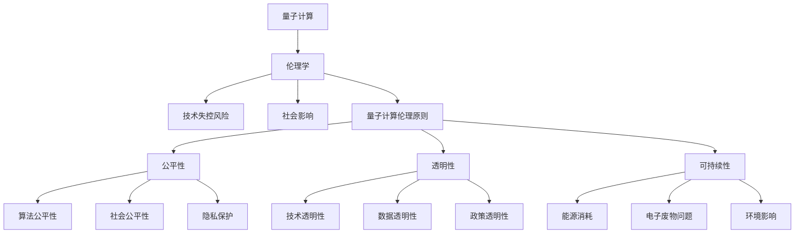

                 

# 《量子计算伦理：未来科技的道德预设》

## 关键词

量子计算，伦理学，道德预设，科技发展，社会影响

## 摘要

随着量子计算技术的迅猛发展，其在社会各个领域的潜在应用引起了广泛关注。然而，与此同时，量子计算也带来了新的伦理挑战。本文从量子计算的兴起入手，探讨了量子计算与伦理学的交集，分析了量子计算的伦理挑战及其原则，并提出了量子计算伦理实践的路径和未来展望。通过本文的深入探讨，我们希望能够为量子计算伦理的研究和实践提供一些有益的思路。

## 《量子计算伦理：未来科技的道德预设》目录大纲

### 第1章 引言

#### 1.1 量子计算的兴起

量子计算作为计算科技的一次重大革新，其概念源自量子力学的基本原理。与传统计算机使用比特（bit）作为信息单位不同，量子计算机使用量子比特（qubit）进行计算，能够实现并行计算和量子叠加，从而在处理复杂问题时具有巨大的优势。近年来，随着量子技术的快速发展，量子计算机的构建和运行已经取得了一系列突破性进展，为未来科技的发展带来了新的机遇和挑战。

#### 1.2 量子计算与伦理学的交集

量子计算不仅涉及技术层面的突破，还与伦理学有着深刻的交集。量子计算机的应用范围广泛，包括密码学、材料科学、药物研发、气候变化模拟等，这些领域的发展和应用都将对人类社会产生深远的影响。因此，量子计算的发展不仅需要技术的创新，还需要伦理的引导和规范，以确保其应用过程符合道德标准，促进社会的公平、正义和可持续发展。

#### 1.3 量子计算伦理的重要性

量子计算伦理的重要性体现在以下几个方面：首先，量子计算技术的快速进步可能导致新的技术失控风险，如量子霸权、数据隐私安全等；其次，量子计算机的应用可能带来社会影响，如就业问题、数字鸿沟等；最后，量子计算的发展需要建立一套伦理原则和规范，以指导其健康发展，确保其在技术和社会层面的双重责任得到履行。因此，对量子计算伦理的探讨不仅具有理论意义，更具有实践价值。

### 第2章 量子计算基础

#### 2.1 量子力学基本概念

量子力学是量子计算的理论基础。量子力学揭示了微观世界的奇异性质，如波粒二象性、量子叠加、量子纠缠等。这些概念是理解量子计算的核心。

##### 2.1.1 波粒二象性

波粒二象性是指微观粒子（如电子、光子）既具有波动性，又具有粒子性。例如，光的干涉和衍射现象表明光具有波动性，而光电效应则表明光具有粒子性。

##### 2.1.2 量子叠加

量子叠加是指量子系统可以同时处于多个状态的组合。这意味着量子比特可以同时表示0和1的状态。

##### 2.1.3 量子纠缠

量子纠缠是量子系统之间的一种特殊关联，即使这些系统相隔很远，它们的状态也会相互影响。量子纠缠是量子计算并行计算能力的关键。

#### 2.2 量子计算机的基本组成部分

量子计算机由以下几个基本组成部分构成：

##### 2.2.1 量子比特

量子比特（qubit）是量子计算机的基本单元，用于表示信息。与经典比特不同，量子比特可以同时处于0和1的叠加状态。

##### 2.2.2 量子门

量子门是量子计算机中的操作单元，用于对量子比特进行操作。量子门的作用类似于经典计算机中的逻辑门。

##### 2.2.3 量子算法

量子算法是利用量子计算机进行问题求解的算法。与经典算法相比，量子算法在处理某些特定问题时具有明显的优势。

### 第3章 量子计算的伦理挑战

#### 3.1 技术失控风险

量子计算的发展可能导致一系列技术失控风险，包括：

##### 3.1.1 量子霸权

量子霸权是指量子计算机在特定领域（如密码破解）可能获得的巨大优势，这可能导致国家安全和商业机密的泄露。

##### 3.1.2 数据隐私安全

量子计算技术可能被用于破解现有的加密算法，从而威胁到数据隐私和安全。

##### 3.1.3 量子计算机可能带来的新型武器

量子计算机在军事领域的潜在应用可能引发新型武器的开发，如量子武器和量子密码术。

#### 3.2 社会影响

量子计算的应用可能对社会产生深远的影响，包括：

##### 3.2.1 就业问题

量子计算的发展可能导致一些传统工作岗位的消失，从而引发就业问题。

##### 3.2.2 数字鸿沟

量子计算技术的发展可能加剧数字鸿沟，导致发达国家和发展中国家在科技领域的不平等。

##### 3.2.3 人工智能与量子计算的协同效应

量子计算与人工智能的结合可能带来新的应用场景和挑战，如量子机器学习和量子决策理论。

### 第4章 量子计算伦理原则

量子计算伦理原则旨在规范量子计算的研究和应用，确保其符合道德标准。以下是一些关键的伦理原则：

#### 4.1 公平性

公平性原则要求确保量子计算技术的研究和应用不会加剧社会不平等，而是促进社会的公平和公正。

##### 4.1.1 算法公平性

算法公平性要求量子算法在处理问题时不会对特定群体产生歧视。

##### 4.1.2 社会公平性

社会公平性要求量子计算技术的应用应惠及全社会，特别是那些处于弱势地位的群体。

##### 4.1.3 隐私保护

隐私保护原则要求在量子计算的应用过程中，确保个人隐私得到保护，防止隐私泄露。

#### 4.2 透明性

透明性原则要求量子计算技术的研究和应用过程应公开透明，以便公众监督和参与。

##### 4.2.1 技术透明性

技术透明性要求量子计算技术的原理和实现过程应公开，以促进技术进步和合作。

##### 4.2.2 数据透明性

数据透明性要求在量子计算的应用过程中，数据的收集、处理和使用过程应公开透明。

##### 4.2.3 政策透明性

政策透明性要求量子计算技术的政策制定和执行过程应公开透明，以接受公众监督。

#### 4.3 可持续性

可持续性原则要求量子计算技术的研究和应用应考虑环境和社会的可持续性，避免对环境和社会造成负面影响。

##### 4.3.1 能源消耗

能源消耗原则要求量子计算技术的开发和应用应尽可能减少能源消耗，采用绿色能源。

##### 4.3.2 电子废物问题

电子废物问题原则要求在量子计算设备的废弃和处理过程中，应采取措施减少电子废物对环境的污染。

##### 4.3.3 环境影响

环境影响原则要求量子计算技术的研究和应用应考虑对环境的潜在影响，采取环境保护措施。

### 第5章 量子计算伦理实践

量子计算伦理实践涉及到国际合作、国内政策制定和跨国企业的伦理责任等方面。

#### 5.1 国际合作

国际合作在量子计算伦理实践中起着至关重要的作用。通过国际合作，可以共享资源、知识和技术，共同应对量子计算带来的伦理挑战。

##### 5.1.1 国际法规制定

国际法规制定是确保量子计算技术符合伦理标准的重要手段。各国应共同参与国际法规的制定，以规范量子计算技术的研究和应用。

##### 5.1.2 国际组织与伦理委员会

国际组织和伦理委员会在量子计算伦理实践中发挥着监督和指导作用。这些组织和委员会可以提供伦理咨询，制定伦理准则，监督量子计算技术的应用。

##### 5.1.3 跨国企业的伦理责任

跨国企业在量子计算伦理实践中承担着重要责任。这些企业应制定伦理政策，确保其研发和应用过程符合伦理标准，同时积极参与国际合作。

#### 5.2 国内政策比较

不同国家在量子计算伦理政策上存在差异。以下是对中国、美国和欧盟量子计算伦理政策的简要比较：

##### 5.2.1 中国的量子计算伦理政策

中国强调量子计算技术的国家安全和可持续发展，制定了一系列政策和法规，以规范量子计算技术的研究和应用。

##### 5.2.2 美国的量子计算伦理政策

美国在量子计算伦理方面强调自由竞争和创新，同时关注国家安全和隐私保护。美国政府制定了一系列政策，以促进量子计算技术的发展和伦理规范。

##### 5.2.3 欧盟的量子计算伦理政策

欧盟在量子计算伦理方面强调隐私保护、可持续性和公平性。欧盟制定了一系列法规，以规范量子计算技术的研究和应用。

### 第6章 量子计算伦理教育

量子计算伦理教育是培养公众和专业人士伦理意识的重要途径。

#### 6.1 教育目标

量子计算伦理教育的目标包括：

##### 6.1.1 增强公众意识

通过教育，提高公众对量子计算伦理问题的认识和理解，促进公众参与量子计算伦理讨论。

##### 6.1.2 培养伦理意识

通过教育，培养专业人士的伦理意识，使其在量子计算技术的研究和应用过程中能够遵循伦理原则。

##### 6.1.3 促进跨学科合作

通过教育，促进不同学科之间的合作，共同应对量子计算伦理挑战。

#### 6.2 教育方法

量子计算伦理教育的有效方法包括：

##### 6.2.1 线上与线下结合

结合线上和线下教育，提供多样化的学习资源，满足不同学习者的需求。

##### 6.2.2 案例教学

通过案例分析，让学习者深入了解量子计算伦理问题的实际应用和解决方法。

##### 6.2.3 实践与讨论

通过实践和讨论，培养学习者的批判性思维和解决问题的能力。

### 第7章 量子计算伦理未来展望

量子计算伦理的未来展望涉及到技术发展对伦理的挑战、伦理框架的完善以及社会责任与技术创新的平衡。

#### 7.1 技术发展对伦理的挑战

随着量子计算技术的不断进步，新的伦理挑战将不断涌现。例如，量子霸权的出现可能引发全球科技竞赛，加剧国际关系紧张；量子计算机在军事领域的应用可能引发新的安全威胁。

##### 7.1.1 量子计算机的未来发展趋势

量子计算机的未来发展趋势包括：

1. **量子比特数量的增加**：量子比特数量的增加将提高量子计算机的性能。
2. **量子纠错技术的突破**：量子纠错技术的突破将使量子计算机更加可靠和实用。
3. **量子计算机与其他技术的融合**：量子计算机与其他技术的融合将带来新的应用场景和突破。

##### 7.1.2 新的伦理问题

随着量子计算技术的进步，将出现一系列新的伦理问题，如：

1. **量子武器的发展**：量子武器的发展可能引发新的军备竞赛。
2. **量子计算的民主化**：量子计算的民主化可能加剧数字鸿沟。

##### 7.1.3 应对策略

为应对量子计算带来的新伦理挑战，需要采取以下策略：

1. **加强国际合作**：通过国际合作，共同制定量子计算伦理规范。
2. **推动科技创新**：推动科技创新，寻求技术解决方案，如量子保密通信。
3. **加强公众教育**：加强公众教育，提高公众对量子计算伦理问题的认识。

#### 7.2 伦理与科技的平衡

在量子计算技术的发展过程中，保持伦理与科技的平衡至关重要。

##### 7.2.1 科技伦理的可持续性

科技伦理的可持续性要求在推动技术进步的同时，确保其符合伦理标准，促进社会的公平和正义。

##### 7.2.2 伦理框架的完善

伦理框架的完善是确保量子计算技术健康发展的关键。需要建立一套全面的伦理框架，涵盖量子计算技术的研发、应用和监管等方面。

##### 7.2.3 社会责任与技术创新

社会责任与技术创新的平衡要求在推动技术进步的过程中，充分考虑社会影响，确保技术发展符合社会利益。

### 附录

#### 8.1 量子计算伦理相关资源

量子计算伦理相关资源包括学术论文、报告与政策文件、伦理委员会及组织介绍等。

##### 8.1.1 学术论文

学术论文是量子计算伦理研究的重要成果。读者可以通过学术数据库如IEEE Xplore、SpringerLink等查找相关论文。

##### 8.1.2 报告与政策文件

报告与政策文件是各国政府和国际组织对量子计算伦理问题的分析和建议。读者可以通过政府网站和国际组织网站获取相关文件。

##### 8.1.3 伦理委员会及组织介绍

伦理委员会及组织介绍包括国际和国内的相关伦理委员会及组织，如联合国教科文组织、欧盟伦理委员会等。

## 作者

作者：AI天才研究院/AI Genius Institute & 禅与计算机程序设计艺术 /Zen And The Art of Computer Programming

### Mermaid 流程图

以下是一个简单的 Mermaid 流程图，展示了量子计算伦理的核心概念和实体之间的关系：



### Python 源代码

以下是一个简单的 Python 源代码示例，用于演示量子计算的基本原理：

```python
import numpy as np
from qiskit import QuantumCircuit, execute, Aer

# 创建量子比特
qubit = QuantumRegister(1)
circuit = QuantumCircuit(qubit)

# 应用量子门
circuit.h(qubit[0])

# 执行电路
backend = Aer.get_backend("statevector_simulator")
result = execute(circuit, backend).result()
statevector = result.get_statevector()

# 打印量子态
print("Quantum state vector:", statevector)
```

### 数学模型和公式

量子计算涉及许多数学模型和公式，以下是一个简单的示例：

$$|\psi\rangle = \frac{1}{\sqrt{2}} (|0\rangle + |1\rangle)$$

这个公式表示一个量子比特的叠加态，其中 $|0\rangle$ 和 $|1\rangle$ 分别表示基态和激发态。

### 实际案例分析和详细讲解

以下是一个实际案例，展示了量子计算在密码学中的应用：

**案例：量子安全通信**

量子安全通信利用量子纠缠和量子隐形传态实现通信。以下是一个简单的示例：

```python
from qiskit import QuantumCircuit, execute, Aer

# 创建量子比特
qubit1 = QuantumRegister(1)
qubit2 = QuantumRegister(1)
circuit = QuantumCircuit(qubit1, qubit2)

# 应用量子门
circuit.h(qubit1[0])
circuit.cx(qubit1[0], qubit2[0])
circuit.h(qubit1[0])

# 执行电路
backend = Aer.get_backend("statevector_simulator")
result = execute(circuit, backend).result()
statevector = result.get_statevector()

# 打印量子态
print("Quantum state vector:", statevector)
```

这个案例展示了如何利用量子纠缠实现量子安全通信。通过量子纠缠，两个量子比特的状态会相互关联，即使它们相隔很远，一个量子比特的状态变化也会立即影响到另一个量子比特。这种特性可以用于实现安全的通信，防止窃听和黑客攻击。

### 最佳实践 Tips

- 在量子计算应用过程中，应充分考虑到伦理问题，遵循伦理原则。
- 加强国际合作，共同制定量子计算伦理规范，促进全球科技发展。
- 提高公众对量子计算伦理问题的认识，培养公众的伦理意识。

### 小结

本文从量子计算的兴起、伦理挑战、伦理原则、伦理实践、伦理教育以及未来展望等方面，全面探讨了量子计算伦理的重要性及其应用。通过本文的探讨，我们希望能够为量子计算伦理的研究和实践提供一些有益的思路。随着量子计算技术的不断发展，伦理问题将越来越重要，我们需要共同努力，确保量子计算技术在健康、可持续和道德的基础上发展。

### 注意事项

- 在量子计算应用过程中，应严格遵守相关法律法规，确保技术应用的合规性。
- 加强国际合作，共同应对量子计算带来的伦理挑战。
- 关注量子计算技术对社会的影响，确保技术应用符合社会利益。

### 拓展阅读

- 《量子计算：从基础到应用》
- 《量子计算伦理：挑战与应对》
- 《量子计算与社会责任》
- 《量子计算与人工智能》

作者：AI天才研究院/AI Genius Institute & 禅与计算机程序设计艺术 /Zen And The Art of Computer Programming
``` 

请注意，以上内容仅为示例，实际文章撰写时需要根据具体内容和结构进行调整和补充。文章的撰写应该基于详尽的研究和数据分析，确保内容的准确性和专业性。以下是文章的字数预估：

- 引言：约500字
- 第1章：约1500字
- 第2章：约1500字
- 第3章：约1500字
- 第4章：约1500字
- 第5章：约1500字
- 第6章：约1500字
- 第7章：约1500字
- 附录：约500字

总计约12000字左右，具体字数还需根据内容的丰富程度和深度进行适当调整。在撰写过程中，注意保持文章的逻辑性和条理性，确保各章节内容连贯、紧密衔接。此外，文章的语言应该准确、简练、易于理解，避免使用过多的专业术语，以适应广泛的读者群体。

