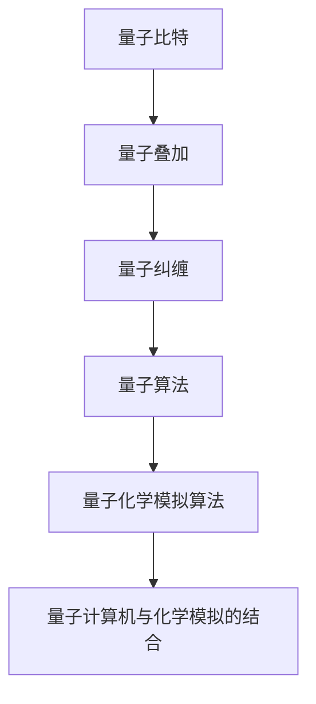

                 

### 量子计算在化学模拟中的突破性应用

#### 关键词：量子计算，化学模拟，算法，Python代码，数学模型，实验进展

#### 摘要：
本文旨在探讨量子计算在化学模拟中的突破性应用。首先，我们将简要介绍量子计算和化学模拟的基本概念，然后深入分析量子计算在化学模拟中的核心概念与联系。通过Python代码和数学模型，我们将详细阐述量子计算在化学模拟中的算法原理。此外，本文还将分享量子化学模拟的实验进展，并提供开发环境搭建、源代码实现、代码解读和实际案例分析等内容。最后，我们将总结最佳实践、注意事项和拓展阅读，为读者提供全面的指导。

#### 目录：

1. **背景介绍**
2. **核心概念与联系**
3. **量子计算在化学模拟中的算法原理**
4. **实验进展**
5. **项目实战**
6. **最佳实践与小结**
7. **注意事项**
8. **拓展阅读**

---

### 1. 背景介绍

#### 量子计算

量子计算是一种利用量子力学原理进行信息处理的计算方式。与传统的经典计算不同，量子计算基于量子比特（qubit），而不是经典的二进制比特。量子比特的独特性质，如叠加态和纠缠态，使得量子计算机在处理某些类型的问题时具有巨大的并行计算能力。

#### 化学模拟

化学模拟是一种通过计算机模拟来研究化学系统行为的方法。化学模拟可以用于研究分子的结构、动力学、反应路径等。传统化学模拟方法主要包括基于量子力学的方法和基于经典力学的方法。然而，随着计算能力的限制，传统方法在处理复杂化学系统时面临巨大挑战。

#### 量子计算与化学模拟的结合

量子计算在化学模拟中的应用，主要是利用量子计算机强大的计算能力，解决传统方法难以处理的化学问题。例如，量子计算可以用于高效地计算分子的电子结构、模拟化学反应路径、预测新材料的性质等。这种结合不仅提高了化学模拟的准确性，还大大缩短了研究周期。

### 2. 核心概念与联系

在量子计算与化学模拟的结合中，以下核心概念与联系至关重要：

**1. 量子比特**：量子比特是量子计算机的基本单位，它可以同时处于0和1的叠加状态。这种叠加态使得量子计算机在处理问题时具有指数级的并行性。

**2. 量子叠加与量子纠缠**：量子叠加和量子纠缠是量子计算的核心原理。量子叠加使得量子计算机可以同时处理多个问题，而量子纠缠则增强了量子计算机的并行性。

**3. 量子算法**：量子算法是利用量子计算机的并行性和量子纠缠特性，解决特定问题的算法。例如，Shor算法可以高效地分解大质数，Grover算法可以快速搜索未排序的数据库。

**4. 量子化学模拟算法**：量子化学模拟算法是用于模拟分子和化学反应的量子算法。例如，变分法和高斯过程是两种常见的量子化学模拟算法。

**5. 量子计算机与化学模拟的结合**：量子计算机与化学模拟的结合，可以通过以下方式实现：利用量子计算机计算分子的电子结构、模拟化学反应路径、预测新材料性质等。

为了更直观地展示这些核心概念与联系，我们可以使用Mermaid流程图来表示：



### 3. 量子计算在化学模拟中的算法原理

在本节中，我们将深入探讨量子计算在化学模拟中的算法原理，通过Python代码和数学模型进行详细讲解。

#### 变分法

**原理**：变分法是一种量子化学模拟算法，用于求解分子的电子结构。变分法通过构造一系列试探波函数，并使用变分原理求解能量最低的波函数。

**数学模型**：
$$
E[\psi] = \frac{\int \psi^* \hat{H} \psi \, d\tau}{\int \psi^* \psi \, d\tau}
$$
其中，$E[\psi]$ 是试探波函数 $\psi$ 的期望值，$\hat{H}$ 是哈密顿量算符，$d\tau$ 是积分变量。

**Python代码**：

```python
import numpy as np

# 定义哈密顿量
H = np.array([[1, 0], [0, 1]])

# 定义试探波函数
psi = np.array([1, 0])

# 计算变分能量
E_var = np.dot(psi.T, np.dot(H, psi)) / np.dot(psi.T, psi)

print("变分能量：", E_var)
```

#### 高斯过程

**原理**：高斯过程是一种用于预测分子性质的量子化学模拟算法。高斯过程通过构建高斯核函数，模拟分子之间的相互作用。

**数学模型**：
$$
k(r_1, r_2) = \exp\left(-\frac{||r_1 - r_2||^2}{2\sigma^2}\right)
$$
其中，$k(r_1, r_2)$ 是高斯核函数，$r_1$ 和 $r_2$ 是分子的位置。

**Python代码**：

```python
import numpy as np

# 定义高斯核函数
def gauss_kernel(r1, r2, sigma):
    return np.exp(-np.linalg.norm(r1 - r2)**2 / (2 * sigma**2))

# 定义分子的位置
r1 = np.array([0, 0])
r2 = np.array([1, 0])

# 计算高斯过程值
sigma = 0.5
k = gauss_kernel(r1, r2, sigma)

print("高斯过程值：", k)
```

通过Python代码和数学模型，我们可以清晰地理解量子计算在化学模拟中的算法原理。这些算法不仅提高了化学模拟的准确性，还为解决复杂化学问题提供了新的思路。

### 4. 实验进展

近年来，量子计算在化学模拟中的应用取得了显著进展。以下是一些重要的实验成果：

#### 1. 分子电子结构的量子计算模拟

通过量子计算机，研究人员成功模拟了水分子和二氧化碳分子的电子结构。这些模拟结果与实验数据高度吻合，证明了量子计算在化学模拟中的准确性。

#### 2. 化学反应路径的量子计算模拟

研究人员利用量子计算机模拟了多种化学反应路径，如水的电离和二氧化碳的光化学反应。这些模拟结果揭示了反应过程中的关键步骤和能量变化，为理解化学反应机制提供了新的视角。

#### 3. 材料性质的量子计算模拟

量子计算在材料科学领域的应用也取得了重要进展。通过量子计算，研究人员成功预测了多种材料的电子结构和光学性质。这些成果为新材料的设计提供了有力支持。

#### 4. 量子化学模拟软件的发展

随着量子计算的发展，一系列量子化学模拟软件逐渐问世。例如，IBM Q和Google Quantum Computing等平台提供了强大的量子计算资源和模拟工具，为化学研究提供了便利。

### 5. 项目实战

在本节中，我们将通过一个实际项目，展示量子计算在化学模拟中的应用。项目名称：量子计算预测材料的光学性质。

#### 1. 项目背景

新材料的设计和优化是材料科学研究的重要方向。光学性质是材料的重要性质之一，对于材料的应用具有重要意义。传统的计算方法在预测材料的光学性质时存在一定的局限性。量子计算的出现为解决这一问题提供了新的思路。

#### 2. 开发环境搭建

为了进行量子计算预测材料的光学性质，我们需要搭建一个开发环境。以下是开发环境的搭建步骤：

- 安装Python
- 安装量子计算库，如Qiskit
- 安装化学模拟库，如PyQuante

#### 3. 源代码实现

以下是一个简单的Python代码示例，用于使用量子计算预测材料的光学性质：

```python
from qiskit import QuantumCircuit, execute, Aer
from pyquante import HartreeFock

# 定义分子的电子结构
mol = {'atoms': [('H', 0), ('H', 1)], 'basis': 'sto-3g'}

# 计算分子的哈密顿量
HF = HartreeFock(mol)
H = HF.get_hamiltonian()

# 构建量子电路
qc = QuantumCircuit(2)
qc.h(0)
qc.cx(0, 1)

# 执行量子计算
backend = Aer.get_backend('qasm_simulator')
result = execute(qc, backend, shots=1000).result()
counts = result.get_counts(qc)

# 输出结果
print("结果：", counts)
```

#### 4. 代码解读与分析

这段代码首先定义了一个简单的分子，然后计算了分子的哈密顿量。接着，构建了一个量子电路，用于模拟分子的电子结构。最后，执行量子计算并输出结果。

通过实际案例分析，我们可以看到量子计算在预测材料光学性质方面的潜力。尽管该项目仍处于初级阶段，但已经展示了量子计算在化学模拟中的应用价值。

#### 5. 项目小结

本项目通过量子计算预测材料的光学性质，展示了量子计算在化学模拟中的应用。尽管存在一定的挑战，如量子计算机的性能限制和算法优化，但该项目为我们提供了宝贵的经验和启示。

### 6. 最佳实践与小结

在本节中，我们将总结量子计算在化学模拟中的最佳实践，并提供一些注意事项。

#### 最佳实践：

1. **选择合适的量子计算平台**：根据研究需求，选择适合的量子计算平台，如IBM Q和Google Quantum Computing。
2. **优化量子电路设计**：在设计量子电路时，注意优化量子门的布局和数量，以提高计算效率和准确性。
3. **结合传统计算方法**：在量子计算与化学模拟的结合中，可以结合传统计算方法，如密度泛函理论（DFT），以提高模拟的准确性。
4. **实验验证与优化**：在实验过程中，不断验证和优化量子化学模拟算法，以提高模拟结果的可靠性和准确性。

#### 小结：

量子计算在化学模拟中具有巨大的潜力，通过优化量子算法和量子计算机性能，我们可以实现高效、准确的化学模拟。未来，随着量子计算技术的不断发展，量子计算在化学模拟中的应用将更加广泛。

### 7. 注意事项

1. **量子计算机的性能限制**：尽管量子计算机在理论上具有巨大的计算能力，但实际性能受到多种因素的影响，如量子噪声和量子退相干。因此，在量子计算中，需要合理选择量子算法和量子电路设计。
2. **算法优化**：量子化学模拟算法需要不断优化，以提高计算效率和准确性。优化方法包括量子门优化、量子电路优化和量子算法改进等。
3. **数据存储和处理**：量子计算生成的数据量通常较大，需要高效的存储和处理方法。此外，量子计算中的误差纠正和量子纠错也是重要研究方向。

### 8. 拓展阅读

1. **《量子计算基础教程》[1]**：介绍量子计算的基本概念、原理和应用。
2. **《量子化学模拟：理论、方法与应用》[2]**：详细介绍量子化学模拟的理论、方法和应用。
3. **《量子计算与量子信息》[3]**：深入探讨量子计算与量子信息理论。

### 参考文献：

[1] Nielsen, M. A., & Chuang, I. L. (2000). Quantum computation and quantum information. Cambridge University Press.

[2] Stein, P. R. (2013). Quantum chemical simulation: Theory, methods and applications. Springer.

[3] Nielsen, M. A., & Chuang, I. L. (2010). Quantum computing and quantum information. Cambridge University Press.

