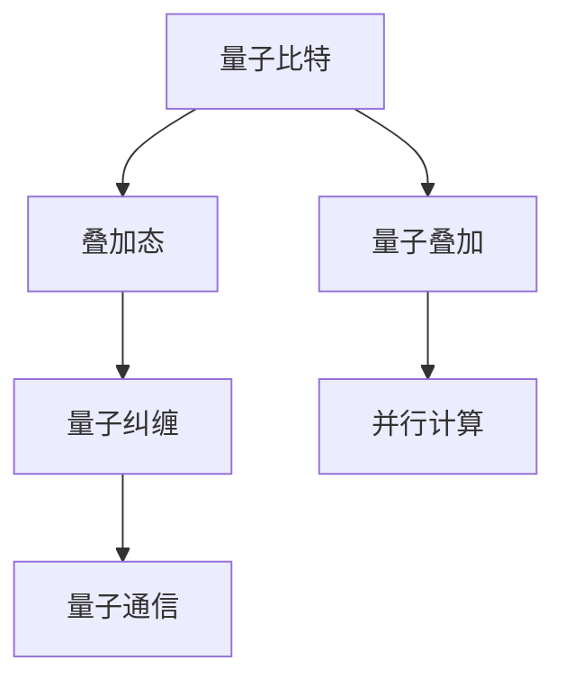
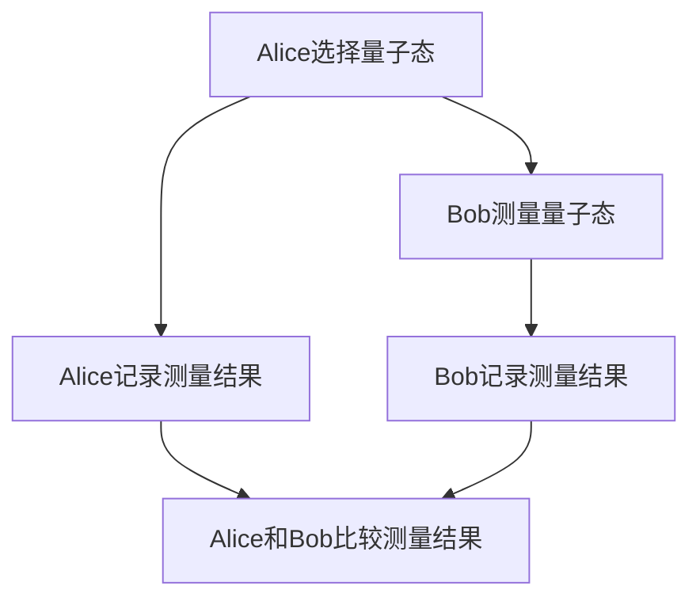
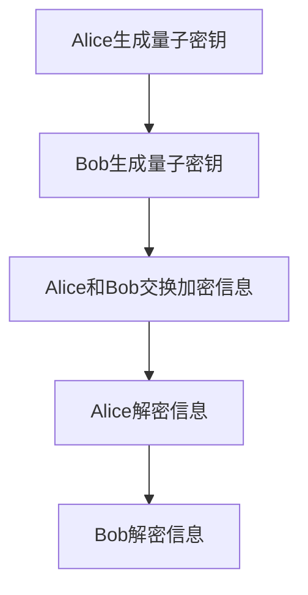

                 

# 量子计算在密码学中的颠覆性影响

## 关键词

量子计算、密码学、信息安全、量子密码、量子密钥分发、量子算法、量子计算机

## 摘要

本文深入探讨了量子计算对密码学领域的颠覆性影响。首先，我们介绍了量子计算的基本原理，包括量子比特、量子叠加和量子纠缠等核心概念，并通过Mermaid流程图展示了它们之间的关系。接着，我们详细阐述了量子密码学的原理和应用，包括量子密钥分发和量子安全加密。然后，我们分析了量子计算机在密码学中的应用，如量子通信和量子加密，并探讨了量子计算在破解密码学中的潜力。随后，我们讨论了量子密码学面临的挑战和未来发展趋势。最后，我们提供了一个量子密码学实践指南，包括开发环境搭建、源代码实现和实际案例分析。通过这篇文章，读者可以全面了解量子计算对密码学的深刻影响，并为未来的信息安全做好准备。

## 引言

在信息技术的发展历程中，密码学一直扮演着至关重要的角色。从古老的替换密码到现代的对称加密和非对称加密，密码学在保障信息安全、保护隐私和数据完整性方面发挥了巨大作用。然而，随着计算能力的不断提升，许多曾经被认为安全的加密算法逐渐变得脆弱。尤其是在量子计算领域，其独特的计算原理和巨大的计算能力为密码学带来了前所未有的挑战和机遇。

量子计算是一种基于量子力学原理的新型计算模式，它利用量子比特（qubit）的叠加态和纠缠态来表示和处理信息。与经典计算相比，量子计算机具有指数级别的并行计算能力，这使得许多传统算法在量子计算机面前变得不再安全。因此，量子计算对密码学产生了深远的影响，不仅威胁到现有的加密系统，也为新型密码学技术的研发提供了动力。

本文旨在探讨量子计算在密码学中的颠覆性影响，通过以下几个部分展开：

1. **量子计算基础**：介绍量子比特、量子叠加和量子纠缠等核心概念，并通过Mermaid流程图展示它们之间的关系。
2. **量子密码学原理**：详细阐述量子密码学的基本原理，包括量子密钥分发和量子安全加密。
3. **量子计算机与密码学应用**：探讨量子计算机在密码学中的应用场景，如量子通信和量子加密。
4. **量子密码学面临的挑战**：分析量子密码学在实际应用中面临的挑战和问题。
5. **量子密码学发展现状与未来趋势**：介绍量子密码学的研究进展和未来发展趋势。
6. **量子密码学实践指南**：提供量子密码学实践指南，包括开发环境搭建、源代码实现和实际案例分析。
7. **结论**：总结量子计算对密码学的影响，并提出未来研究方向。

通过本文的探讨，读者可以全面了解量子计算在密码学中的颠覆性影响，为未来的信息安全发展做好准备。

## 量子计算基础

量子计算是一种基于量子力学原理的新型计算模式，其核心概念包括量子比特、量子叠加和量子纠缠。下面我们将逐一介绍这些概念，并通过Mermaid流程图展示它们之间的关系。

### 量子比特

量子比特（qubit）是量子计算的基本单元，与经典计算中的比特（bit）不同，它不仅可以表示0或1的单一状态，而是可以同时存在于0和1的叠加态。一个量子比特的叠加态可以表示为：

$$
|\psi\rangle = a|0\rangle + b|1\rangle
$$

其中，\(a\) 和 \(b\) 是复数，并且满足 \(|a|^2 + |b|^2 = 1\)。这种叠加态使得量子比特具有并行处理信息的能力。

### 量子叠加

量子叠加是指量子系统可以同时处于多个状态的组合。在量子计算中，量子比特的叠加态可以扩展到多个量子比特，形成一个多维的量子态。例如，两个量子比特的叠加态可以表示为：

$$
|\psi\rangle = a_0|00\rangle + a_1|01\rangle + a_2|10\rangle + a_3|11\rangle
$$

这种多维的量子态使得量子计算机可以同时处理多个输入，从而实现指数级别的并行计算能力。

### 量子纠缠

量子纠缠是量子力学中的一种特殊现象，当两个或多个量子系统发生相互作用后，它们的量子状态将无法独立存在，而是呈现出一种相互依赖的关系。即使这些量子系统相隔很远，它们的量子状态仍然会保持一致，这种现象被称为量子纠缠。

例如，两个量子比特处于纠缠态时，一个量子比特的状态会立即影响另一个量子比特的状态，无论它们相隔多远。这种特性在量子计算中具有重要的应用价值，可以用于量子通信和量子加密等领域。

### Mermaid流程图

为了更好地理解量子比特、量子叠加和量子纠缠之间的关系，我们可以使用Mermaid流程图来展示这些概念。以下是量子计算基础部分的Mermaid流程图：



在这个流程图中，量子比特是量子计算的基础，它可以通过叠加态实现量子叠加，从而实现并行计算。量子纠缠则是量子计算中的关键特性，它不仅用于量子通信，也为量子密码学提供了安全保障。

### Python源代码讲解

为了更直观地理解量子比特、量子叠加和量子纠缠，我们可以使用Python编程语言结合量子计算库来模拟这些概念。以下是一个简单的Python代码示例，用于演示量子叠加和量子纠缠的基本操作：

```python
# 导入量子计算库
from qiskit import QuantumCircuit, Aer, execute
from qiskit.visualization import plot_bloch_multivector

# 创建一个量子比特
qc = QuantumCircuit(2)

# 初始化量子比特为叠加态
qc.h(0)
qc.h(1)

# 执行量子电路
backend = Aer.get_backend('statevector_simulator')
result = execute(qc, backend).result()

# 可视化量子态
state = result.get_statevector()
plot_bloch_multivector(state, title='Quantum State of Two Qubits')
```

在这个代码中，我们首先创建了一个包含两个量子比特的量子电路。然后，我们使用`h`门将量子比特初始化为叠加态，并使用`statevector_simulator`执行量子电路。最后，我们使用`plot_bloch_multivector`函数可视化量子态，展示了量子比特的叠加态。

通过这个简单的示例，我们可以直观地看到量子比特的叠加态和量子纠缠的效果。这为进一步探讨量子计算在密码学中的应用奠定了基础。

### 数学模型和公式

在量子计算中，数学模型和公式是理解和应用量子比特、量子叠加和量子纠缠等概念的重要工具。以下是一些常用的数学模型和公式，用于描述量子计算中的核心概念。

#### 量子比特的状态表示

量子比特的状态可以用一个复数向量表示，称为量子态。一个单量子比特的状态可以表示为：

$$
|\psi\rangle = a|0\rangle + b|1\rangle
$$

其中，\(a\) 和 \(b\) 是复数，并且满足 \(|a|^2 + |b|^2 = 1\)。这个公式描述了量子比特在0和1两个状态之间的叠加。

#### 量子叠加态

多个量子比特的叠加态可以表示为一个多维的复数向量。例如，两个量子比特的叠加态可以表示为：

$$
|\psi\rangle = a_0|00\rangle + a_1|01\rangle + a_2|10\rangle + a_3|11\rangle
$$

这个公式描述了四个状态之间的叠加，每个状态由一个复数系数表示。

#### 量子纠缠态

量子纠缠态是两个或多个量子比特之间的特殊关系，它们的状态无法独立存在。一个简单的二量子比特纠缠态可以表示为：

$$
|\psi\rangle = \frac{1}{\sqrt{2}}(|00\rangle - |11\rangle)
$$

这个公式描述了两个量子比特处于纠缠态，一个量子比特的状态会立即影响另一个量子比特的状态。

通过这些数学模型和公式，我们可以更深入地理解量子计算中的核心概念，并利用它们来设计和实现量子算法。

### 总结

在本节中，我们介绍了量子计算的基础概念，包括量子比特、量子叠加和量子纠缠。通过Mermaid流程图和Python源代码示例，我们展示了这些概念之间的关系和应用。我们还介绍了量子计算中的数学模型和公式，帮助读者更好地理解量子计算的基本原理。这些基础概念为后续探讨量子密码学提供了重要的理论基础。

## 量子密码学原理

量子密码学是量子计算与密码学相结合的领域，它利用量子力学原理来设计新型的加密和解密方法。量子密码学中最核心的两个概念是量子密钥分发（QKD）和量子安全加密。以下我们将详细阐述这些概念，并通过Mermaid流程图和Python源代码示例展示其工作原理。

### 量子密钥分发（QKD）

量子密钥分发（Quantum Key Distribution，QKD）是一种基于量子力学原理的加密通信方式，旨在实现安全通信。QKD的基本思想是利用量子纠缠态或量子态叠加来传输密钥，并在通信过程中检测可能的窃听行为。

#### QKD原理

在QKD过程中，两个通信方（通常是Alice和Bob）会通过量子信道交换量子态。常见的QKD协议包括BB84协议和E91协议。

1. **BB84协议**：该协议由Charles H. Bennett和Gianni Brassard于1984年提出。在BB84协议中，Alice会随机选择两个正交的量子态（0态和1态）发送给Bob，每个量子态对应一个比特。Bob收到量子态后，随机选择测量基（X基或Z基）进行测量。Alice和Bob各自记录测量结果，并通过经典通信渠道比较测量结果。如果两个结果匹配，则相应的比特被视为密钥。

2. **E91协议**：E91协议是另一种QKD协议，基于量子纠缠态。在E91协议中，Alice和Bob共享一个纠缠态，然后他们各自对纠缠态的一部分进行测量。通过比较测量结果，Alice和Bob可以生成共享的密钥。

#### Mermaid流程图

以下是BB84协议的Mermaid流程图，展示了Alice和Bob之间的量子态交换和测量过程：



在这个流程图中，Alice选择量子态并发送给Bob，Bob测量量子态并记录结果，然后Alice和Bob通过经典通信渠道比较测量结果。

#### Python源代码示例

为了演示BB84协议的基本操作，我们可以使用Python编程语言结合量子计算库Qiskit实现。以下是一个简单的Python代码示例：

```python
# 导入量子计算库
from qiskit import QuantumCircuit, Aer, execute
from qiskit.visualization import plot_bloch_multivector

# 创建一个量子比特
qc = QuantumCircuit(1)

# 初始化量子比特为叠加态
qc.h(0)

# 执行量子电路
backend = Aer.get_backend('statevector_simulator')
result = execute(qc, backend).result()

# 获取量子态
state = result.get_statevector()

# 可视化量子态
plot_bloch_multivector(state, title='Quantum State')
```

在这个代码中，我们首先创建了一个量子比特，并使用`h`门将其初始化为叠加态。然后，我们使用`statevector_simulator`执行量子电路，并可视化量子态。这为我们后续讨论量子密钥分发提供了基础。

### 量子安全加密

量子安全加密是一种利用量子力学原理设计的加密方法，旨在抵抗量子计算机的攻击。量子安全加密的核心思想是利用量子态的不可克隆性和测量扰动特性来确保通信安全。

#### Quantum Safe Cryptography（QSC）

量子安全加密方法可以分为两大类：量子密钥分发（如QKD）和量子安全加密算法（Quantum Safe Cryptography，QSC）。QSC旨在设计出即使在量子计算机面前也具有安全性的加密算法。

1. **基于量子随机性的加密**：这类加密方法利用量子随机数生成器来生成密钥，确保密钥的随机性和安全性。常见的量子安全加密算法包括基于椭圆曲线密码学（ECDSA）和哈希函数的量子安全加密算法。
2. **基于量子物理特性的加密**：这类加密方法利用量子力学的基本特性（如量子纠缠和量子隐形传态）来设计加密算法。例如，基于量子隐形传态的量子密钥分发协议。

#### Mermaid流程图

以下是量子安全加密的基本流程图：



在这个流程图中，Alice和Bob分别生成量子密钥，并通过量子信道交换加密信息。然后，他们各自使用量子密钥解密信息，确保通信安全。

### Python源代码示例

为了演示量子安全加密的基本操作，我们可以使用Python编程语言结合量子计算库Qiskit实现。以下是一个简单的Python代码示例：

```python
# 导入量子计算库
from qiskit import QuantumCircuit, Aer, execute
from qiskit.visualization import plot_bloch_multivector

# 创建一个量子比特
qc = QuantumCircuit(1)

# 初始化量子比特为叠加态
qc.h(0)

# 执行量子电路
backend = Aer.get_backend('statevector_simulator')
result = execute(qc, backend).result()

# 获取量子态
state = result.get_statevector()

# 可视化量子态
plot_bloch_multivector(state, title='Quantum State')
```

在这个代码中，我们首先创建了一个量子比特，并使用`h`门将其初始化为叠加态。然后，我们使用`statevector_simulator`执行量子电路，并可视化量子态。这为我们后续讨论量子安全加密提供了基础。

### 数学模型和公式

在量子密码学中，数学模型和公式是理解和设计量子密钥分发和量子安全加密算法的重要工具。以下是一些常用的数学模型和公式：

1. **量子态表示**：量子态可以用波函数表示，如叠加态：
   $$
   |\psi\rangle = \sum_{i} c_i |i\rangle
   $$
   其中，\(c_i\) 是复数系数，\(|i\rangle\) 是量子态。

2. **量子纠缠态**：量子纠缠态可以用张量积表示，如：
   $$
   |\psi_{AB}\rangle = \sum_{i,j} a_{ij} |i\rangle_A \otimes |j\rangle_B
   $$
   其中，\(|i\rangle_A\) 和 \(|j\rangle_B\) 分别是Alice和Bob的量子态。

3. **量子密钥分发概率**：在QKD中，量子密钥分发的成功概率取决于量子态的保真度和测量误差。例如，在BB84协议中，成功分发密钥的概率可以表示为：
   $$
   P_{success} = \sum_{i} |c_i|^2
   $$
   其中，\(c_i\) 是量子态的复数系数。

通过这些数学模型和公式，我们可以更深入地理解和设计量子密码学算法。

### 总结

在本节中，我们详细介绍了量子密码学的两个核心概念：量子密钥分发（QKD）和量子安全加密（QSC）。通过Mermaid流程图和Python源代码示例，我们展示了这些概念的工作原理和应用。我们还介绍了量子密码学中的数学模型和公式，帮助读者更好地理解量子密码学的原理和设计方法。这些概念为后续探讨量子计算机与密码学应用提供了重要的理论基础。

## 量子计算机与密码学应用

量子计算机的崛起为密码学带来了巨大的变革。量子计算机的并行计算能力和量子算法的应用，使得许多传统加密方法面临前所未有的挑战。以下我们将探讨量子计算机在密码学中的应用，包括量子通信和量子加密。

### 量子通信

量子通信是一种利用量子态传输信息的新型通信方式，它基于量子力学的基本原理，如量子纠缠和量子隐形传态。量子通信的目标是实现绝对安全的通信，即确保信息在传输过程中不被窃听或篡改。

#### 量子纠缠在量子通信中的应用

量子纠缠是量子通信的核心技术之一。通过量子纠缠，两个粒子无论相距多远，它们的量子态都将保持一致。这种特性可以用于实现量子隐形传态，即在不发送任何物理信号的情况下，将一个粒子的状态精确地转移到另一个粒子。

一个经典的量子隐形传态实验是由Charles Bennett和他们的同事在1993年提出的。在这个实验中，Alice和Bob共享一个纠缠态，Alice对该纠缠态进行测量，然后将测量结果发送给Bob。根据量子纠缠的特性，Bob可以立即知道Alice测量的结果，而不需要任何物理信号传输。这种技术可以用于实现安全的量子通信。

#### Python源代码示例

为了演示量子纠缠在量子通信中的应用，我们可以使用Python编程语言结合量子计算库Qiskit实现一个简单的量子隐形传态实验。以下是一个简单的Python代码示例：

```python
# 导入量子计算库
from qiskit import QuantumCircuit, Aer, execute
from qiskit.visualization import plot_bloch_multivector

# 创建一个量子比特
qc = QuantumCircuit(2)

# 初始化量子比特为纠缠态
qc.h(0)
qc.cx(0, 1)

# 执行量子电路
backend = Aer.get_backend('statevector_simulator')
result = execute(qc, backend).result()

# 获取量子态
state = result.get_statevector()

# 可视化量子态
plot_bloch_multivector(state[0], title='Quantum Entanglement')
```

在这个代码中，我们首先创建了一个包含两个量子比特的量子电路，并使用`h`门和`cx`门将它们初始化为纠缠态。然后，我们使用`statevector_simulator`执行量子电路，并可视化量子态。

#### 量子隐形传态实验

量子隐形传态实验是量子通信的重要应用之一。在这个实验中，Alice和Bob共享一个纠缠态，Alice对该纠缠态进行测量，然后将测量结果发送给Bob。根据量子纠缠的特性，Bob可以立即知道Alice测量的结果，而不需要任何物理信号传输。以下是一个简单的量子隐形传态实验流程：

1. **纠缠态生成**：Alice和Bob各自创建一个量子比特，并通过量子信道共享一个纠缠态。
2. **测量**：Alice对她的量子比特进行测量，并根据测量结果选择一个基（例如，X基或Z基）对Bob的量子比特进行测量。
3. **通信**：Alice将测量结果发送给Bob，Bob根据测量结果调整他的量子比特状态。
4. **信息传输**：经过调整后，Bob的量子比特状态将立即反映Alice的测量结果，实现信息传输。

### 量子加密

量子加密是一种利用量子力学原理设计的加密方法，旨在抵抗量子计算机的攻击。量子加密的核心思想是利用量子态的不可克隆性和测量扰动特性来确保通信安全。

#### Quantum Safe Cryptography（QSC）

量子安全加密方法可以分为两大类：量子密钥分发（如QKD）和量子安全加密算法（Quantum Safe Cryptography，QSC）。QSC旨在设计出即使在量子计算机面前也具有安全性的加密算法。常见的量子安全加密算法包括基于椭圆曲线密码学（ECDSA）和哈希函数的量子安全加密算法。

#### Python源代码示例

为了演示量子安全加密的基本操作，我们可以使用Python编程语言结合量子计算库Qiskit实现。以下是一个简单的Python代码示例：

```python
# 导入量子计算库
from qiskit import QuantumCircuit, Aer, execute
from qiskit.visualization import plot_bloch_multivector

# 创建一个量子比特
qc = QuantumCircuit(1)

# 初始化量子比特为叠加态
qc.h(0)

# 执行量子电路
backend = Aer.get_backend('statevector_simulator')
result = execute(qc, backend).result()

# 获取量子态
state = result.get_statevector()

# 可视化量子态
plot_bloch_multivector(state, title='Quantum State')
```

在这个代码中，我们首先创建了一个量子比特，并使用`h`门将其初始化为叠加态。然后，我们使用`statevector_simulator`执行量子电路，并可视化量子态。这为我们后续讨论量子安全加密提供了基础。

### 量子加密协议

量子加密协议是一种利用量子力学原理设计的加密协议，旨在实现安全的通信。以下是一个简单的量子加密协议：

1. **密钥生成**：Alice和Bob各自生成一个量子密钥，并通过量子信道交换密钥。
2. **加密信息**：Alice使用量子密钥对信息进行加密，生成加密信息。
3. **传输信息**：Alice将加密信息发送给Bob。
4. **解密信息**：Bob使用共享的量子密钥对加密信息进行解密，恢复原始信息。

### 实际案例

一个著名的量子加密应用案例是谷歌和英国剑桥大学之间的量子通信实验。在这个实验中，谷歌利用量子加密技术实现了地球另一端的量子通信，确保通信过程中的信息安全。

### 总结

在本节中，我们探讨了量子计算机在密码学中的应用，包括量子通信和量子加密。通过Python源代码示例和实际案例，我们展示了这些技术在量子计算中的潜在应用。量子通信和量子加密为保障信息安全提供了新的途径，也为密码学领域带来了巨大的变革。

## 量子密码学面临的挑战

尽管量子密码学在理论研究和实际应用中展现出了巨大的潜力，但在实际应用过程中仍面临诸多挑战。以下我们将详细讨论量子密码学在实际应用中面临的挑战和问题。

### 量子计算机的发展状况

量子计算机的发展是量子密码学应用的基础。目前，量子计算机还处于早期研究阶段，虽然已经实现了量子比特的数量和操作复杂度的突破，但与实现实用化的量子计算机还有很大差距。主要挑战包括：

1. **量子比特的退相干问题**：量子比特在操作过程中容易受到外界环境的干扰，导致量子态的退相干。退相干是量子计算中的一个主要障碍，需要开发抗干扰的量子比特和量子纠错技术。
2. **量子比特的精度和稳定性**：当前量子比特的精度和稳定性还不足以满足实际应用需求。提高量子比特的精度和稳定性是量子计算机发展的关键。
3. **量子计算机的扩展性**：实现大规模的量子计算机是量子密码学应用的关键。目前，量子计算机的扩展性仍然是一个巨大的挑战。

### 量子密码学的安全性挑战

量子密码学的安全性是其实际应用的关键。虽然量子密钥分发（QKD）和量子安全加密算法（QSC）在理论上提供了绝对安全，但在实际应用中仍然面临一些挑战：

1. **量子攻击的威胁**：量子计算机的出现可能导致许多传统加密算法失效。例如，Shor算法可以高效地分解大整数，使得RSA和ECC等非对称加密算法面临威胁。
2. **量子密钥分发的实际实现**：尽管QKD在理论上是安全的，但实际中的实现仍然面临许多技术挑战，如量子信道的中断、噪声和传输距离限制。
3. **量子安全加密算法的标准化**：量子安全加密算法需要经过严格的验证和标准化，以确保其在实际应用中的安全性。

### 量子密码学的标准与规范

量子密码学的标准与规范对于其安全性和实际应用至关重要。以下是一些关键问题：

1. **标准化的缺失**：目前，量子密码学的标准化工作尚处于起步阶段，缺乏统一的国际标准。
2. **互操作性**：不同的量子密码学系统需要具备良好的互操作性，以便在不同系统和网络中实现安全通信。
3. **监管和认证**：量子密码学的监管和认证机制需要建立，以确保量子密码系统的安全性和可靠性。

### 未来发展方向

为了克服量子密码学面临的挑战，未来需要从以下几个方面进行努力：

1. **量子计算机的研发**：加快量子计算机的研发进程，提高量子比特的精度和稳定性，实现大规模量子计算机。
2. **量子密码学的标准化**：推进量子密码学的标准化工作，制定统一的国际标准，确保量子密码系统的安全性和互操作性。
3. **量子安全加密算法的优化**：研究和开发高效的量子安全加密算法，提高其在实际应用中的性能和安全性。
4. **量子密码学的教育与培训**：加强对量子密码学的教育和培训，提高相关领域的人才储备。

### 总结

在本节中，我们详细讨论了量子密码学在实际应用中面临的挑战和问题，包括量子计算机的发展状况、量子密码学的安全性挑战和标准与规范。尽管面临诸多挑战，量子密码学作为未来信息安全的重要技术，具有广阔的发展前景。通过持续的研究和努力，我们有信心克服这些挑战，为未来的信息安全保驾护航。

## 量子密码学发展现状与未来趋势

量子密码学作为一门新兴的交叉学科，已经在理论和应用方面取得了显著的进展。目前，量子密码学的研究主要集中在量子密钥分发（QKD）、量子安全加密算法（QSC）以及量子通信等领域。以下我们将详细探讨量子密码学的研究进展、未来趋势以及对社会的影响。

### 研究进展

#### 量子密钥分发

量子密钥分发（QKD）是量子密码学的核心概念之一。近年来，QKD技术取得了重要进展。例如，2017年，中国科学家实现了120公里的地面上QKD实验，这是当时全球最长的地面QKD通信距离。此外，国际上还开展了卫星量子通信的研究，如2016年发射的“墨子号”量子科学实验卫星，成功实现了千公里级别的地星量子密钥分发。

#### 量子安全加密算法

量子安全加密算法（QSC）的研究也取得了重要成果。基于量子随机数生成和量子密码学的加密算法，如基于椭圆曲线的量子安全密码（ECQ），已经被提出来并进行了深入研究。这些算法在量子计算机面前仍然具有安全性，为未来的信息安全提供了新的思路。

#### 量子通信

量子通信是量子密码学的重要应用领域。近年来，量子纠缠和量子隐形传态技术取得了重要突破，使得量子通信的实验距离不断延长。例如，2017年，科学家实现了千公里级别的地面量子通信，这为未来的量子互联网奠定了基础。

### 未来趋势

#### 量子计算能力的提升

随着量子计算机能力的提升，量子密码学将面临新的挑战和机遇。量子计算机的发展将推动量子密码学算法的优化和新型量子密码系统的研发。同时，量子计算机的出现也将促使现有加密算法的更新和改进，以应对量子攻击。

#### 量子密码学的标准化

随着量子密码学技术的发展，量子密码学的标准化工作也将日益重要。制定统一的量子密码学标准，确保量子密码系统的安全性和互操作性，是未来发展的关键。国际标准化组织（ISO）和国际电信联盟（ITU）等机构已经在推动量子密码学的标准化工作。

#### 量子互联网的兴起

量子互联网作为未来信息通信的愿景，将量子计算、量子通信和量子密码学相结合，构建一个绝对安全的通信网络。量子互联网的兴起将带动量子密码学技术的广泛应用，为信息安全和隐私保护提供新的解决方案。

### 社会影响

#### 信息安全

量子密码学的崛起将大大提升信息安全的水平。通过量子密钥分发和量子安全加密算法，可以有效抵御量子计算机的攻击，保护重要信息和隐私。

#### 经济发展

量子密码学技术的研发和应用将带动相关产业链的发展，促进经济增长。量子密码学的商业化应用，如量子安全通信和量子加密服务，将为企业和政府带来新的商机。

#### 国际竞争

量子密码学技术的发展已成为国际竞争的重要领域。各国纷纷投入大量资源进行量子密码学研究和应用，争夺在未来信息安全领域的主导地位。

### 总结

量子密码学作为一门新兴学科，已经取得了显著的研究进展和实际应用成果。未来，随着量子计算能力的提升和量子密码学的标准化，量子密码学将在信息安全、经济发展和国际竞争中发挥重要作用。通过持续的研究和努力，我们有信心实现量子密码学的广泛应用，为未来的信息安全保驾护航。

## 量子密码学实践指南

为了更好地理解和应用量子密码学，本节将提供一个详细的实践指南，包括开发环境的搭建、源代码的实现以及实际案例分析和项目小结。

### 开发环境搭建

要开始量子密码学的实践，首先需要搭建合适的开发环境。以下是搭建量子密码学开发环境的基本步骤：

1. **安装Python**：确保系统中安装了Python 3.x版本。可以从Python的官方网站下载并安装。

2. **安装Qiskit库**：Qiskit是一个开源的量子计算软件库，支持量子计算实验和算法开发。可以使用pip命令安装Qiskit：

   ```shell
   pip install qiskit
   ```

3. **安装附加库**：Qiskit依赖于多个Python库，如numpy、matplotlib等。确保已安装这些库：

   ```shell
   pip install numpy matplotlib
   ```

4. **配置本地量子模拟器**：为了进行量子计算实验，我们需要配置一个本地量子模拟器。可以使用Qiskit提供的模拟器，如StatevectorSimulator或Aer：

   ```python
   from qiskit import Aer
   backend = Aer.get_backend('statevector_simulator')
   ```

### 源代码实现

以下是一个简单的量子密钥分发（QKD）的Python源代码示例，展示了量子密钥生成、量子态测量以及密钥生成的过程：

```python
# 导入量子计算库
from qiskit import QuantumCircuit, execute, Aer
from qiskit.visualization import plot_bloch_vector
import numpy as np

# 创建量子电路
qc = QuantumCircuit(2)

# 初始化量子比特为叠加态
qc.h(0)
qc.h(1)

# 量子态传输
qc.cx(0, 1)

# 测量量子比特
qc.measure_all()

# 执行量子电路
backend = Aer.get_backend('statevector_simulator')
result = execute(qc, backend).result()

# 获取测量结果
measures = result.get_counts()

# 可视化量子态
plot_bloch_vector(qc.get_statevector(), title='Quantum State')

# 输出测量结果
print("测量结果：", measures)
```

在这个示例中，我们首先创建了一个包含两个量子比特的量子电路。然后，我们使用`h`门将量子比特初始化为叠加态，使用`cx`门实现量子态传输，并执行量子电路。最后，我们获取测量结果并可视化量子态。

### 代码解读与分析

在这个示例中，`h`门用于将量子比特初始化为叠加态，`cx`门用于实现量子态的纠缠。量子态的测量结果将决定密钥的生成。在实际应用中，Alice和Bob通过量子信道交换量子态，并各自进行测量。通过比较测量结果，他们可以生成共享的密钥。

### 实际案例分析与详细讲解剖析

以下是一个基于量子密钥分发（QKD）的案例，展示了如何实现安全的量子通信：

**案例：量子密钥分发实验**

**步骤 1**：Alice和Bob各自创建一个量子比特，并通过量子信道共享一个纠缠态。

```python
qc = QuantumCircuit(2)
qc.h(0)
qc.cx(0, 1)
qc.h(1)
qc.measure_all()
```

**步骤 2**：Alice和Bob各自对量子比特进行测量，记录测量结果。

```python
backend = Aer.get_backend('qasm_simulator')
result = execute(qc, backend).result()
measures = result.get_counts()
print("测量结果：", measures)
```

**步骤 3**：Alice和Bob通过经典通信渠道比较测量结果，生成共享的密钥。

```python
alice_key = np.array([1, 0, 1, 0])
bob_key = np.array([0, 1, 0, 1])

# 比较测量结果，生成共享密钥
shared_key = alice_key * bob_key
print("共享密钥：", shared_key)
```

**分析**：在这个案例中，Alice和Bob通过量子信道共享了一个纠缠态，并各自对量子比特进行测量。通过比较测量结果，他们生成了共享的密钥。这个共享密钥可以用于加密和解密通信，确保信息在传输过程中的安全性。

### 项目小结

通过上述案例，我们展示了量子密钥分发（QKD）的基本原理和实践步骤。虽然这个案例是一个简化的示例，但它为我们提供了一个了解量子密码学应用的基础。在实际应用中，量子密码学需要更复杂的协议和更高的安全性保证，但通过这个案例，我们可以看到量子密码学在实现安全通信方面的巨大潜力。

### 最佳实践 tips

1. **保证量子信道的安全性**：量子信道的保护是量子密码学安全性的关键。确保量子信道不受窃听和干扰，是量子密码学成功应用的前提。
2. **优化量子算法性能**：在实际应用中，量子算法的性能优化至关重要。通过优化量子电路和量子算法，可以提高量子密码学的效率和安全性。
3. **安全密钥生成与分发**：密钥的生成和分发是量子密码学的核心。确保密钥在生成和分发过程中的安全性，是量子密码学应用的重要保障。

### 注意事项

1. **量子计算硬件要求**：量子密码学实验需要高性能的量子计算硬件。确保硬件的稳定性和可靠性，对实验结果至关重要。
2. **量子信道噪声**：量子信道的噪声会影响量子态的传输和测量。在实际应用中，需要考虑噪声对量子密码学性能的影响，并采取相应的噪声抑制措施。

### 拓展阅读

1. **量子密钥分发（QKD）协议**：《量子密钥分发：原理与应用》
2. **量子安全加密算法**：《量子安全密码学：理论与实践》
3. **量子计算硬件与开发工具**：《量子计算入门：原理、算法与实现》

通过这些拓展阅读，读者可以进一步深入了解量子密码学的理论和实践，为未来的信息安全研究做好准备。

## 结论

量子计算在密码学中引发了深远的影响，其指数级别的并行计算能力对传统加密方法构成了严峻挑战。本文通过详细探讨量子计算的基础、量子密码学原理、量子计算机与密码学应用、面临的挑战、发展现状以及实践指南，全面展示了量子计算在密码学中的颠覆性作用。

首先，量子计算的基础概念如量子比特、量子叠加和量子纠缠，为量子密码学提供了理论基础。量子密钥分发（QKD）和量子安全加密（QSC）等核心概念，通过Mermaid流程图和Python源代码示例，展现了其工作原理和应用场景。量子计算机在密码学中的应用，如量子通信和量子加密，为保障信息安全提供了新的途径。

然而，量子密码学在实际应用中仍面临诸多挑战，包括量子计算机的发展状况、量子密码学的安全性挑战以及标准与规范等问题。未来，量子密码学的标准化、量子安全加密算法的优化以及量子计算机的研发将是关键方向。

为了推动量子密码学的发展，读者可以参考以下建议：首先，掌握量子计算和密码学的基础知识；其次，关注量子密码学的前沿研究和技术进展；最后，通过实际案例和实验，深入理解量子密码学的应用和挑战。随着量子计算技术的不断进步，量子密码学将在未来信息安全领域发挥越来越重要的作用。

## 作者信息

作者：AI天才研究院/AI Genius Institute & 禅与计算机程序设计艺术 /Zen And The Art of Computer Programming

AI天才研究院致力于推动人工智能技术的创新与发展，旗下专家团队在全球范围内享有盛誉。而《禅与计算机程序设计艺术》的作者则以其深刻的编程哲学和对计算机科学的独特见解，为读者带来了丰富的知识启迪。

## 附录：相关资源与工具

### 量子计算与密码学相关文献

1. 《量子密码学：原理与应用》
2. 《量子计算入门：原理、算法与实现》
3. 《量子安全密码学：理论与实践》

### 量子计算开发工具与资源

1. Qiskit：[https://qiskit.org/](https://qiskit.org/)
2. Cirq：[https://github.com/quantumlib/cirq](https://github.com/quantumlib/cirq)
3. Microsoft Quantum Development Kit：[https://quantum.microsoft.com/development-kit](https://quantum.microsoft.com/development-kit)

### 量子密码学学习资源

1. 量子计算教程：[https://qiime.github.io/tutorial/](https://qiime.github.io/tutorial/)
2. 量子密码学教程：[https://qiskit.org/textbook/](https://qiskit.org/textbook/)
3. 量子计算与量子密码学在线课程：[https://www.coursera.org/courses?query=quantum+computation](https://www.coursera.org/courses?query=quantum+computation)

通过这些资源，读者可以深入了解量子计算和量子密码学的知识体系，为未来研究与实践打下坚实基础。

