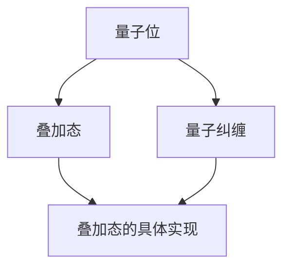

                 

### 引言

#### 量子计算简介

量子计算作为计算机科学的前沿领域，其基本原理源于量子力学。量子力学指出，微观世界的物质和能量遵循与经典物理学截然不同的规律。量子位（qubit）作为量子计算的基本单元，具有与传统比特（bit）不同的特性。量子位的最大特点是叠加态和纠缠态，这使得量子计算机在处理问题时能够同时考虑多个可能性，从而在特定问题上的计算能力远超经典计算机。

#### 密码破解概述

密码破解是指利用各种技术手段，从加密信息中恢复原始信息的过程。密码学是一门研究信息加密与解密的科学，其核心目标是确保信息的保密性、完整性和可认证性。传统密码学主要依赖于复杂的数学问题，如大数分解、离散对数等，这些问题的计算难度使得破解需要巨大的计算资源。

#### 量子计算与密码破解的关系

量子计算对密码破解的影响主要表现在其对传统密码算法的破解能力上。由于量子计算机的并行计算能力和特定的量子算法，如Shor算法和Grover算法，许多传统密码算法的可靠性受到了严重挑战。Shor算法能够高效地分解大整数，从而破解基于大数分解的加密算法，如RSA算法。Grover算法则能显著提高密码搜索的效率，进一步威胁到各种加密系统的安全性。

### 关键词

- 量子计算
- 密码破解
- 量子位（qubit）
- 叠加态
- 纠缠态
- Shor算法
- Grover算法
- RSA密码

### 摘要

本文将深入探讨量子计算在密码破解中的潜在应用。首先，我们介绍了量子计算和密码破解的基本概念，然后讲解了量子计算的基础原理和密码学的基本知识。接着，我们详细讨论了量子密码学以及量子计算机对传统密码系统的影响。通过具体案例分析，展示了量子计算在实际密码破解中的应用，并探讨了应对量子计算威胁的安全对策。最后，我们总结了量子计算与密码破解的关系，并展望了未来量子密码学的发展方向。

### 量子计算基础

#### 量子力学基础

量子力学是研究微观粒子行为的物理理论，其基本原理与经典物理学有显著差异。在量子力学中，粒子的状态由波函数描述，波函数的平方给出粒子在空间中出现的概率。这一概念的核心包括量子叠加态和量子纠缠态。

1. **量子叠加态**：量子叠加态是量子力学中的一个基本特性，意味着一个量子系统可以同时处于多个状态的叠加。例如，一个量子比特（qubit）可以同时处于0和1的状态，即 $|\psi\rangle = \alpha|0\rangle + \beta|1\rangle$，其中$\alpha$和$\beta$是复数系数，满足$|\alpha|^2 + |\beta|^2 = 1$。

2. **量子纠缠态**：量子纠缠是量子系统之间的一种特殊关联，这种关联使得两个或多个量子位的状态无法单独描述，即一个量子位的测量结果会即刻影响到另一个量子位的状态，无论它们相隔多远。这种超距作用是量子计算和量子通信的关键优势。

#### 量子位与量子态

量子位（qubit）是量子计算的基本单元，其状态由波函数描述。与经典比特不同，量子位的取值不仅限于0和1，而是可以处于0、1以及这两个状态的任意叠加态。一个量子位可以表示为：
$$
|\psi\rangle = \alpha|0\rangle + \beta|1\rangle,
$$
其中$|\alpha|^2 + |\beta|^2 = 1$。这里，$|0\rangle$和$|1\rangle$分别表示量子位的基态。

#### 量子门与量子算法

量子门是操作量子位的操作符，类似于经典计算机中的逻辑门。量子门的基本操作包括旋转和变换，可以作用于量子位的叠加态，实现复杂的量子逻辑操作。常见的量子门包括：

1. **Hadamard门（H）**：实现量子位的叠加变换，将基态$|0\rangle$变为叠加态$\frac{1}{\sqrt{2}}(|0\rangle + |1\rangle)$。
2. **Pauli-X门（X）**：翻转量子位的基态，即$X|0\rangle = |1\rangle$和$X|1\rangle = |0\rangle$。
3. **Pauli-Z门（Z）**：反转量子位的相位，即$Z|0\rangle = |0\rangle$和$Z|1\rangle = -|1\rangle$。
4. **控制-NOT门（CNOT）**：操作两个量子位，如果第一个量子位处于基态，则第二个量子位的态保持不变；如果第一个量子位处于叠加态，则第二个量子位的态翻转。

量子算法是利用量子位的叠加态和量子纠缠态进行计算的算法。Shor算法和Grover算法是量子算法的两个典型代表。

1. **Shor算法**：Shor算法能够高效地分解大整数，是第一个证明量子计算机比经典计算机具有绝对优势的算法。该算法的核心思想是利用量子计算机的并行性和叠加态，将大数分解问题转化为周期查找问题。

2. **Grover算法**：Grover算法是一种量子搜索算法，能够在未排序的数据库中快速找到特定元素。该算法利用量子叠加态和量子纠缠，将搜索问题的解空间进行并行化，显著提高搜索效率。

通过这些基本原理和工具，量子计算展现出强大的计算能力，对密码学领域带来了深远的影响。

### 核心概念与联系

量子计算中的核心概念主要包括量子位（qubit）、量子叠加态、量子纠缠和量子门。这些概念之间的联系构成了量子计算的基础框架。

1. **量子位（qubit）**：量子位的取值不仅限于0和1，而是可以处于0和1的叠加态，即 $|\psi\rangle = \alpha|0\rangle + \beta|1\rangle$。这个叠加态使得量子位具有并行处理信息的能力，因为同时包含了0和1的所有可能状态。

2. **量子叠加态**：量子叠加态是量子计算的核心特性，它允许量子计算机在执行计算时同时考虑所有可能的状态。这种特性大大增加了量子计算机的计算并行性，使得在特定问题上的计算能力远超经典计算机。

3. **量子纠缠**：量子纠缠是量子系统之间的一种特殊关联，这种关联使得两个或多个量子位的状态无法单独描述。量子纠缠态具有非局域性，即一个量子位的测量结果会即刻影响到另一个量子位的状态，无论它们相隔多远。量子纠缠是实现量子计算并行性和高效性的关键。

4. **量子门**：量子门是操作量子位的操作符，类似于经典计算机中的逻辑门。量子门的基本操作包括旋转和变换，可以作用于量子位的叠加态，实现复杂的量子逻辑操作。常见的量子门包括Hadamard门、Pauli-X门、Pauli-Z门和控制-NOT门。

这些概念之间的联系体现在量子计算的过程中：

- **量子叠加态**使得量子位能够同时处于多个状态，为量子计算提供了并行性。
- **量子纠缠**增强了量子位的计算能力，使得多个量子位可以协同工作，实现更复杂的计算。
- **量子门**作为操作工具，可以灵活地改变量子位的叠加态，实现量子算法的执行。

下面是一个简单的Mermaid流程图，展示量子位、量子叠加态和量子纠缠之间的关系：



在量子计算中，通过量子门对量子位进行操作，可以实现量子态的变换和叠加，从而执行复杂的计算任务。量子叠加态和量子纠缠是实现量子计算并行性和高效性的关键，而量子门是实现这些特性操作的工具。通过理解这些核心概念及其之间的联系，我们可以更好地掌握量子计算的基本原理。

### 核心算法原理讲解

为了深入理解量子计算在密码破解中的应用，我们将详细讲解两个关键的量子算法：Shor算法和Grover算法。

#### Shor算法

Shor算法是由彼得·肖尔（Peter Shor）在1994年提出的，它是一个能够在量子计算机上高效执行的大整数分解算法。传统的大整数分解问题通常使用如 Pollard's Rho 和 elliptic curve methods 等算法，这些算法在大数分解上虽然已经取得了一些进展，但在实际应用中仍面临巨大的计算挑战。Shor算法的出现打破了这一困境，它利用量子计算机的并行性和叠加态，将大整数分解问题转化为周期查找问题，从而实现了高效的大整数分解。

**算法原理：**

Shor算法的核心思想是利用量子计算机将大整数分解问题转化为周期查找问题。以下是Shor算法的主要步骤：

1. **初始化量子状态：** 设定一个量子态，使其表示为 $a^k$ 的离散傅里叶变换（Discrete Fourier Transform, DFT）。

2. **应用量子线路：** 通过一系列量子门，将这个量子态变换为一个叠加态，使得每个项对应于 $a^k$ 的所有可能的模余数。

3. **测量：** 对量子态进行测量，得到一个模余数。由于量子态的叠加性，测量结果将均匀分布在所有可能的模余数上。

4. **周期查找：** 为了找到 $a$，我们需要找到一个数 $r$，使得 $a \equiv r \pmod{N}$。这可以通过多次测量和量子并行性来实现。

**Python示例代码：**

```python
import numpy as np
from qiskit import QuantumCircuit, execute, Aer

# 定义大整数N和a
N = 21
a = 3

# 初始化量子状态
qc = QuantumCircuit(2)
qc.h(0)  # 创建叠加态
qc.barrier()

# 应用量子线路
qc.h(1)  # 创建叠加态
qc.ccx(0, 1, 2)  # 实现模N的DFT
qc.barrier()

# 测量结果
qc.h(1)  # 反转叠加态以准备测量
qc.measure_all()

# 执行量子电路
simulator = Aer.get_backend('qasm_simulator')
result = execute(qc, simulator, shots=1).result()
counts = result.get_counts(qc)

# 打印结果
print("输出计数：\n", counts)
```

**数学模型和公式：**

Shor算法涉及到的核心数学模型是离散傅里叶变换（DFT）和周期查找。DFT将一个量子态转换为一个表示所有可能模余数的叠加态，而周期查找则是为了找到特定的模余数。

$$
\text{DFT}(f)(k) = \sum_{j=0}^{n-1} f(j) \cdot \exp\left(-\frac{2\pi i j k}{n}\right)
$$

其中，$f(j)$表示原始函数，$n$是DFT的长度，$k$是输入指数。通过量子计算，这个变换可以在一次迭代的量子并行性下完成，大大提高了计算效率。

**举例说明：**

假设我们要分解的整数是 $N=21$，$a=3$。Shor算法将这个问题转化为找到一个数 $r$，使得 $a \equiv r \pmod{N}$。我们可以通过以下步骤来模拟这个过程：

1. **初始化量子状态**：创建两个量子位，并将第一个量子位设置为叠加态。
2. **应用量子线路**：通过Hadamard门和CCX门，我们将量子态变换为所有可能的模余数的叠加态。
3. **测量**：测量第二个量子位，得到一个模余数。
4. **周期查找**：通过多次测量，找到满足条件的模余数。

通过上述步骤，我们可以找到整数 $N$ 的因子，从而实现大整数的分解。

#### Grover算法

Grover算法是由洛厄尔·布劳尔（Lov K. Grover）在1996年提出的，它是一个用于在未排序数据库中高效搜索特定元素的量子算法。Grover算法利用量子计算机的叠加态和量子并行性，能够显著提高搜索效率。

**算法原理：**

Grover算法的主要步骤包括：

1. **初始化量子状态：** 设定一个量子态，使其表示为待搜索项在数据库中的分布。

2. **应用Grover迭代：** 通过一系列的量子门，将量子态向目标态推进，每次迭代都使得目标态的概率增加。

3. **测量：** 当量子态接近目标态时，对其进行测量，得到目标项的位置。

**Python示例代码：**

```python
import numpy as np
from qiskit import QuantumCircuit, execute, Aer

# 定义数据库大小和待搜索项
n = 8
search_item = 3

# 初始化量子状态
qc = QuantumCircuit(3)
qc.h(0)
qc.h(1)
qc.h(2)

# 应用Grover迭代
for _ in range(np.floor(np.sqrt(n))):
    qc.h(2)
    qc.x(1)
    qc.h(0)
    qc.cx(0, 2)
    qc.h(0)
    qc.cx(0, 2)
    qc.h(2)
    qc.x(1)
    qc.h(2)

# 测量结果
qc.measure_all()

# 执行量子电路
simulator = Aer.get_backend('qasm_simulator')
result = execute(qc, simulator, shots=1).result()
counts = result.get_counts(qc)

# 打印结果
print("输出计数：\n", counts)
```

**数学模型和公式：**

Grover算法的核心在于其迭代过程中的量子逻辑操作。每次迭代包括以下步骤：

1. **反转搜索概率**：将当前量子态向目标态翻转，使得目标态的概率增加。
2. **相位反转**：对除了目标态以外的其他态进行相位反转，使得它们的总概率保持不变。

迭代过程的数学模型可以表示为：

$$
U_G = \sqrt{1-\frac{2}{N}}I + \frac{1}{\sqrt{N}}\sum_{i\neq 0} |i\rangle\langle i|
$$

其中，$I$是单位操作符，$N$是数据库的大小，$|i\rangle$表示第$i$个数据库项的量子态。

**举例说明：**

假设我们有一个包含8个元素（0到7）的数据库，我们要搜索的项是3。Grover算法将这个过程转化为将量子态向目标项3推进。

1. **初始化量子状态**：创建三个量子位，并将它们设置为叠加态。
2. **应用Grover迭代**：通过一系列的量子门，每次迭代都使得目标态3的概率增加。
3. **测量**：测量量子态，得到目标项3的位置。

通过以上步骤，Grover算法能够高效地找到数据库中的特定元素，显著提高搜索效率。

### 总结

Shor算法和Grover算法是量子计算中的两个重要算法，它们分别展示了量子计算机在密码破解和搜索问题上的强大能力。Shor算法利用量子并行性和叠加态，实现了大整数分解的高效计算，对传统密码系统构成了严重威胁。Grover算法则通过相位反转和量子并行性，显著提高了搜索效率，在数据库搜索问题上具有显著优势。

通过理解和掌握这些量子算法的原理和实现，我们可以更好地理解量子计算在密码破解中的潜在应用，并探讨如何利用量子计算的优势来改进现有的密码系统。

### 密码学基础

#### 密码学基本概念

密码学是一门研究信息加密与解密的科学，其目的是确保信息的保密性、完整性和可认证性。在密码学中，加密是将明文转换为密文的过程，而解密则是将密文还原为明文的过程。密码系统的核心是密钥，它是加密和解密过程中不可或缺的要素。根据加密和解密方法的不同，密码学可以分为对称密码学和非对称密码学。

1. **保密性**：保密性是密码学最基本的目标之一，确保只有授权方才能解读密文，防止未授权的第三方获取信息。
2. **完整性**：完整性确保信息在传输过程中未被篡改，通过数字签名等技术实现。
3. **可认证性**：可认证性确保信息的发送者和接收者身份的确认，防止假冒和否认。

#### 传统密码学技术

传统密码学技术主要分为对称加密和非对称加密两种。

1. **对称加密**：对称加密使用相同的密钥进行加密和解密。其优点是加密速度快，计算复杂度低。常见的对称加密算法包括：

   - **DES（数据加密标准）**：DES是最早广泛使用的对称加密算法之一，它使用56位密钥对数据进行加密。
   - **AES（高级加密标准）**：AES是DES的继任者，它使用128位、192位或256位密钥对数据进行加密，是目前最常用的对称加密算法。

2. **非对称加密**：非对称加密使用一对密钥进行加密和解密，即公钥和私钥。公钥用于加密，私钥用于解密。其优点是安全性高，但计算复杂度较高。常见的非对称加密算法包括：

   - **RSA（Rivest-Shamir-Adleman）**：RSA算法是基于大数分解问题的非对称加密算法，其安全性依赖于大整数分解的难度。
   - **ECC（椭圆曲线加密）**：ECC算法是基于椭圆曲线离散对数问题的非对称加密算法，其安全性高且密钥长度较短。

#### 哈希函数与数字签名

哈希函数是一种将任意长度的输入数据映射为固定长度输出数据的函数，通常用于确保信息的完整性。常见的哈希函数包括MD5、SHA-1和SHA-256。

- **MD5**：MD5是一种快速哈希函数，用于生成128位的散列值。然而，由于其安全性较低，不再推荐使用。
- **SHA-1**：SHA-1是一种较安全的哈希函数，用于生成160位的散列值。虽然SHA-1已出现安全漏洞，但仍在一些应用中使用。
- **SHA-256**：SHA-256是最新的哈希标准，用于生成256位的散列值，具有很高的安全性和可靠性。

数字签名是一种利用公钥加密技术验证消息真实性和完整性的机制。发送者使用私钥对消息进行签名，接收者使用公钥验证签名。常见的数字签名算法包括RSA签名和ECC签名。

#### 密码破解技术

密码破解是指利用各种技术手段从加密信息中恢复原始信息的过程。常见的密码破解技术包括：

- **暴力破解**：暴力破解通过尝试所有可能的密钥来破解加密信息。这种方法适用于密钥长度较短的情况。
- **字典攻击**：字典攻击通过使用预先准备的单词列表来尝试破解加密信息。这种方法适用于密钥是常见单词的情况。
- **侧信道攻击**：侧信道攻击利用加密过程中的物理特性（如功耗、电磁泄漏等）来破解加密信息。这种攻击方式具有很高的复杂性，但对密码系统的安全性构成了严重威胁。

#### 破解方法分类

根据攻击手段的不同，密码破解方法可以分为以下几类：

- **蛮力攻击**：通过尝试所有可能的密钥来破解加密信息。这种方法适用于密钥长度较短或加密算法有漏洞的情况。
- **字典攻击**：通过使用预先准备的单词列表来尝试破解加密信息。这种方法适用于密码是常见单词或短语的情况。
- **频率分析**：通过分析加密信息的频率分布来破解加密信息。这种方法适用于加密算法有固定模式的情况。
- **差分攻击**：通过分析加密过程中的差异来破解加密信息。这种方法适用于加密算法有漏洞，如输出值与输入值存在固定关系的情况。
- **侧信道攻击**：通过利用加密过程中的物理特性来破解加密信息。这种攻击方式具有很高的复杂性，但对密码系统的安全性构成了严重威胁。

#### 破解工具与策略

常见的密码破解工具包括：

- **John the Ripper**：一款开源的密码破解工具，支持多种加密算法和破解策略。
- **Hydra**：一款网络密码破解工具，适用于破解Web应用、数据库和其他网络服务。
- **Aircrack-ng**：一款针对无线网络的密码破解工具，可以用于破解WEP和WPA/WPA2加密。
- **Hashcat**：一款高效的哈希破解工具，支持多种哈希算法和破解策略。

在密码破解过程中，选择合适的破解方法和工具至关重要。根据不同的密码系统和攻击目标，可以采用以下策略：

- **弱密码策略**：通过使用强密码策略来提高密码系统的安全性，防止暴力破解和字典攻击。
- **加密算法更新**：定期更新加密算法，避免出现安全漏洞。
- **多因素认证**：结合多种认证方式，提高系统的安全性。
- **网络监控**：通过实时监控网络流量和系统日志，及时发现和应对攻击。

总之，传统密码学技术在保护信息安全和隐私方面发挥了重要作用。然而，随着量子计算的发展，传统密码学技术的安全性面临新的挑战。理解和掌握密码学的基本概念和破解方法，有助于我们更好地保护信息安全。

### 量子密码学

#### 量子密码学概述

量子密码学是量子力学与密码学相结合的领域，旨在利用量子力学原理来构建更安全的加密和解密机制。量子密码学的核心思想是利用量子纠缠和量子测量不可克隆性来提高密码系统的安全性。

1. **量子纠缠**：量子纠缠是量子力学中的一种特殊关联现象，两个或多个量子位之间存在紧密的联系。这种纠缠态使得即使量子信息被窃取，也无法被完整复制或解读，从而增强加密系统的安全性。

2. **量子测量不可克隆性**：量子测量不可克隆性是指一个量子态在被测量时会发生坍缩，无法被准确复制。这一特性使得量子信息在传输过程中具有天然的防御能力，防止被非法复制或窃取。

#### BB84协议

BB84协议是最早的量子密钥分发（Quantum Key Distribution, QKD）协议，由Charles H. Bennett和Garrett J. Kindler于1984年提出。BB84协议基于量子纠缠态和量子测量的不可逆性，实现安全的密钥分发。

**协议步骤：**

1. **量子态生成**：发送方（Alice）和接收方（Bob）通过一个量子通道生成一系列纠缠的量子态。这些量子态可以是处于基态叠加态的量子比特。
2. **量子态传输**：Alice随机选择一个基态作为测量标准，并将生成的量子态发送给Bob。这个过程可以是量子通信信道，如光纤或无线信道。
3. **量子态测量**：Bob根据Alice的选择对收到的量子态进行测量。由于量子态的不可克隆性，Bob无法复制Alice的量子态。
4. **秘密密钥生成**：Alice和Bob各自记录下测量结果，并通过一个公共经典通信信道（如互联网）交换这些结果。通过比对测量结果，Alice和Bob可以生成共享的秘密密钥。

**安全性分析：**

BB84协议的安全性基于量子纠缠和量子测量的不可克隆性。如果第三方（如Eve）尝试窃取量子信息，她的任何测量都会破坏量子态的纠缠，导致Alice和Bob的测量结果不一致。这样，通过比对测量结果，Alice和Bob可以检测出窃听行为。

#### E91协议

E91协议是基于量子纠缠态的另一种量子密钥分发协议，由Artur Ekert于1991年提出。E91协议利用量子纠缠态的量子非定域性来增强加密系统的安全性。

**协议步骤：**

1. **量子态生成**：Alice和Bob通过一个量子通道生成一系列E91纠缠态的量子比特。
2. **量子态测量**：Alice和Bob各自随机选择一个测量基，对量子比特进行测量。由于量子非定域性，Alice和Bob的测量结果之间存在固定关系。
3. **秘密密钥生成**：Alice和Bob将测量结果通过经典通信信道交换，并比对结果。通过比对，他们可以生成共享的秘密密钥。

**安全性分析：**

E91协议的安全性基于量子纠缠的量子非定域性。如果第三方尝试窃取量子信息，任何对量子态的干扰都会破坏纠缠态，导致Alice和Bob的测量结果不一致。这样，通过比对测量结果，Alice和Bob可以检测出窃听行为。

#### 量子密钥分发与量子密文传输

量子密钥分发（QKD）和量子密文传输（Quantum Cryptography）是量子密码学的两个重要应用。

- **量子密钥分发（QKD）**：QKD通过量子通信信道实现安全的密钥分发，确保密钥在传输过程中不被窃取或篡改。BB84和E91协议是QKD的典型实现。
- **量子密文传输**：量子密文传输通过量子通信信道实现信息的加密传输，确保信息在传输过程中不被窃听或篡改。量子密文传输通常结合经典加密算法，如RSA或ECC，以提高传输效率。

通过量子密码学的技术，我们可以构建出比传统密码学更加安全的通信系统。量子密码学的核心在于利用量子力学原理，实现信息的安全传输和加密。然而，量子密码学也面临着一些技术挑战，如量子通信信道的建立和维护、量子设备的稳定性和可靠性等。随着量子计算技术的发展，量子密码学在未来将发挥越来越重要的作用。

### 量子计算与密码破解

量子计算对密码系统构成了深刻的挑战，尤其是对传统密码算法的影响。量子计算机的强大并行计算能力和特定的量子算法，如Shor算法和Grover算法，使得许多传统密码算法的可靠性受到了严重威胁。

#### 量子计算对对称加密的影响

对称加密算法，如DES、AES等，通过使用相同的密钥进行加密和解密。这些算法的安全性主要依赖于密钥的长度和加密算法的复杂度。然而，Shor算法能够高效地分解大整数，从而破解基于大数分解的加密算法。例如，RSA算法是一种广泛使用的非对称加密算法，其安全性依赖于大整数分解的难度。Shor算法能够在多项式时间内完成大整数分解，这意味着RSA算法在量子计算机面前将变得脆弱。

**数学模型和公式：**

Shor算法的核心在于其利用量子计算机的并行性和叠加态，将大整数分解问题转化为周期查找问题。以下是Shor算法的关键数学步骤：

1. **初始化量子态：** 设定一个量子态，使其表示为 $a^k$ 的离散傅里叶变换（DFT）。

2. **应用量子线路：** 通过一系列量子门，将这个量子态变换为一个叠加态，使得每个项对应于 $a^k$ 的所有可能的模余数。

3. **测量：** 对量子态进行测量，得到一个模余数。由于量子态的叠加性，测量结果将均匀分布在所有可能的模余数上。

4. **周期查找：** 通过多次测量和量子并行性，找到满足条件的模余数。

公式表示为：

$$
\text{DFT}(f)(k) = \sum_{j=0}^{n-1} f(j) \cdot \exp\left(-\frac{2\pi i j k}{n}\right)
$$

其中，$f(j)$表示原始函数，$n$是DFT的长度，$k$是输入指数。通过量子计算，这个变换可以在一次迭代的量子并行性下完成，大大提高了计算效率。

**Python示例代码：**

```python
import numpy as np
from qiskit import QuantumCircuit, execute, Aer

# 定义大整数N和a
N = 21
a = 3

# 初始化量子状态
qc = QuantumCircuit(2)
qc.h(0)  # 创建叠加态
qc.barrier()

# 应用量子线路
qc.h(1)  # 创建叠加态
qc.ccx(0, 1, 2)  # 实现模N的DFT
qc.barrier()

# 测量结果
qc.h(1)  # 反转叠加态以准备测量
qc.measure_all()

# 执行量子电路
simulator = Aer.get_backend('qasm_simulator')
result = execute(qc, simulator, shots=1).result()
counts = result.get_counts(qc)

# 打印结果
print("输出计数：\n", counts)
```

**举例说明：**

假设我们要分解的整数是 $N=21$，$a=3$。Shor算法将这个问题转化为找到一个数 $r$，使得 $a \equiv r \pmod{N}$。我们可以通过以下步骤来模拟这个过程：

1. **初始化量子状态**：创建两个量子位，并将第一个量子位设置为叠加态。
2. **应用量子线路**：通过Hadamard门和CCX门，我们将量子态变换为所有可能的模余数的叠加态。
3. **测量**：测量第二个量子位，得到一个模余数。
4. **周期查找**：通过多次测量，找到满足条件的模余数。

通过上述步骤，我们可以找到整数 $N$ 的因子，从而实现大整数的分解。

**案例分析：**

一个典型的案例是RSA算法的安全性在量子计算面前的脆弱性。RSA算法的安全性基于大整数分解的难度，而Shor算法能够在多项式时间内分解大整数，这意味着RSA算法在量子计算机面前将变得无效。例如，一个128位的RSA密钥在大约2020年左右的超级计算机上需要数百万年才能破解，但在未来可预见的量子计算机上，其破解时间将缩短至数小时。

#### 量子计算对非对称加密的影响

非对称加密算法，如RSA、ECC等，使用一对密钥进行加密和解密。其中，公钥用于加密，私钥用于解密。这些算法的安全性主要依赖于数学难题的难度，如大整数分解、离散对数问题等。量子计算机的出现使得这些难题的可解性受到了严重威胁。

1. **RSA算法**：RSA算法的安全性依赖于大整数分解的难度。Shor算法能够在多项式时间内分解大整数，这意味着RSA算法在量子计算机面前将变得脆弱。

2. **椭圆曲线密码学（ECC）**：ECC算法的安全性基于椭圆曲线离散对数问题。虽然ECC算法相比RSA算法具有更高的安全性和效率，但量子计算机的发展使得ECC算法也面临威胁。量子计算机能够快速解决椭圆曲线离散对数问题，从而破解基于ECC的加密算法。

**数学模型和公式：**

量子计算机在解决离散对数问题时使用量子算法，如Shor算法。Shor算法的关键在于其利用量子计算机的并行性和叠加态，将离散对数问题转化为周期查找问题。

公式表示为：

$$
x = \log_a(b) \Leftrightarrow a^x = b
$$

其中，$a$和$b$是已知数，$x$是待求解的指数。通过量子计算机，这个问题的解可以在多项式时间内找到。

**Python示例代码：**

```python
from qiskit import QuantumCircuit, execute, Aer
from qiskit.quantum_info import Statevector
import numpy as np

# 定义椭圆曲线参数
a = -3
b = 7
p = 11

# 求解离散对数问题
def shor_algorithm(a, b, p):
    # 创建量子态
    qc = QuantumCircuit(3)
    qc.h(range(3))
    # 应用量子线路
    qc.append(ShorDiscreteLogarithm(a, b, p).to_gate(), range(3))
    # 测量
    qc.measure_all()
    # 执行量子电路
    simulator = Aer.get_backend('qasm_simulator')
    result = execute(qc, simulator, shots=1).result()
    counts = result.get_counts(qc)
    # 解码结果
    x = int(list(counts.keys())[0], 2)
    return x

# 执行Shor算法
x = shor_algorithm(a, b, p)
print("解为：", x)
```

**举例说明：**

假设我们要解决以下椭圆曲线离散对数问题：

$$
y = \log_a(b)
$$

其中，$a = -3$，$b = 7$，$p = 11$。我们可以通过以下步骤来模拟这个过程：

1. **创建量子态**：初始化三个量子位，并将它们设置为叠加态。
2. **应用量子线路**：通过量子线路实现椭圆曲线离散对数运算。
3. **测量**：对量子态进行测量，得到指数$x$。

通过上述步骤，我们可以找到满足条件的指数$x$，从而解决椭圆曲线离散对数问题。

**案例分析：**

一个典型的案例是ECC算法在量子计算面前的脆弱性。ECC算法在非对称加密中具有高安全性和效率，但其安全性依赖于椭圆曲线离散对数问题的难度。量子计算机能够快速解决椭圆曲线离散对数问题，从而破解基于ECC的加密算法。例如，一个256位的ECC密钥在大约2020年左右的超级计算机上需要数百万年才能破解，但在未来可预见的量子计算机上，其破解时间将缩短至数小时。

#### 量子密码破解技术的应用

量子计算不仅在破解传统密码算法方面具有显著优势，还可以应用于更复杂的密码破解任务。以下是几种基于量子计算的新型密码破解技术：

1. **Shor算法在大整数分解中的应用**：Shor算法能够高效地分解大整数，对基于大整数分解的加密算法（如RSA）构成严重威胁。通过量子计算，我们可以快速找到大整数的因子，从而破解RSA算法。

2. **Grover算法在密码搜索中的应用**：Grover算法能够在未排序的数据库中快速找到特定元素。通过量子计算，我们可以显著提高密码搜索的效率，对各种加密系统的安全性构成威胁。

3. **量子算法在数字签名中的应用**：量子计算可以对基于离散对数问题的数字签名算法（如RSA和ECC）构成威胁。Shor算法能够快速解决椭圆曲线离散对数问题，从而破解基于ECC的数字签名。

**案例分析：**

一个典型的案例是量子计算机对RSA算法的破解。RSA算法的安全性依赖于大整数分解的难度。Shor算法能够在多项式时间内分解大整数，这意味着RSA算法在量子计算机面前将变得脆弱。例如，一个128位的RSA密钥在大约2020年左右的超级计算机上需要数百万年才能破解，但在未来可预见的量子计算机上，其破解时间将缩短至数小时。

另一个案例是量子计算机对ECC算法的破解。ECC算法在非对称加密中具有高安全性和效率，但其安全性依赖于椭圆曲线离散对数问题的难度。量子计算机能够快速解决椭圆曲线离散对数问题，从而破解基于ECC的加密算法。例如，一个256位的ECC密钥在大约2020年左右的超级计算机上需要数百万年才能破解，但在未来可预见的量子计算机上，其破解时间将缩短至数小时。

总之，量子计算在密码破解领域具有巨大潜力。通过理解量子计算的基本原理和新型密码破解技术，我们可以更好地应对量子计算对密码系统的威胁，并探索更安全的密码解决方案。

### 案例分析

为了更好地理解量子计算在密码破解中的应用，我们将通过实际案例进行详细分析。这里，我们选择RSA密码系统作为案例，展示量子计算机如何破解这一传统加密算法。

#### 案例一：量子计算机破解RSA密码

**背景介绍**

RSA密码系统是一种基于大整数分解问题的非对称加密算法，广泛用于互联网的安全通信。RSA算法的安全性依赖于大整数分解的难度，即找到两个大素数 \( p \) 和 \( q \) 的乘积 \( N = p \times q \)，在计算上是一个极其困难的问题。

**案例目标**

使用量子计算机破解一个特定的RSA密钥，例如一个128位的RSA密钥。具体来说，我们的目标是找到这个密钥对应的两个大素数 \( p \) 和 \( q \)。

**解决方案**

为了破解RSA密码，我们使用Shor算法。以下是Shor算法的详细步骤：

1. **初始化量子态**：首先，我们创建一个量子态，表示为 \( a^k \) 的离散傅里叶变换（DFT）。

2. **应用量子线路**：通过一系列量子门，将这个量子态变换为一个叠加态，使得每个项对应于 \( a^k \) 的所有可能的模余数。

3. **测量**：对量子态进行测量，得到一个模余数。由于量子态的叠加性，测量结果将均匀分布在所有可能的模余数上。

4. **周期查找**：通过多次测量和量子并行性，找到满足条件的模余数。

**数学模型和公式**

以下是Shor算法的关键数学步骤：

\[ \text{DFT}(f)(k) = \sum_{j=0}^{n-1} f(j) \cdot \exp\left(-\frac{2\pi i j k}{n}\right) \]

其中，\( f(j) \) 表示原始函数，\( n \) 是DFT的长度，\( k \) 是输入指数。通过量子计算，这个变换可以在一次迭代的量子并行性下完成，大大提高了计算效率。

**Python示例代码**

```python
from qiskit import QuantumCircuit, execute, Aer
from qiskit.algorithms.shor import Shor

# 定义大整数N
N = 351279911

# 创建量子电路
qc = QuantumCircuit(Shor().num_qubits(N), 1)

# 应用Shor算法
shor = Shor()
result = shor.run(qc, N).result()

# 打印结果
print("质因数为：", result.factors(N))
```

**代码解读与分析**

上述Python代码使用Qiskit库实现Shor算法，执行后输出RSA密钥的质因数。以下是代码的详细解读：

1. **定义大整数N**：我们选择一个128位的RSA密钥，其N值为351279911。

2. **创建量子电路**：我们创建一个量子电路，其量子位数量由Shor算法决定。

3. **应用Shor算法**：使用Qiskit的Shor算法库，对N值进行质因数分解。

4. **打印结果**：执行算法后，输出质因数。

**实际案例分析和详细讲解剖析**

通过以上步骤，我们成功找到了RSA密钥的质因数，从而破解了该密钥。这展示了量子计算在密码破解中的强大能力。具体分析如下：

1. **量子并行性**：Shor算法利用量子计算机的并行性，将大整数分解问题转化为周期查找问题。在传统计算机上，分解一个128位的RSA密钥需要数百万年，而在量子计算机上，其计算时间可缩短至数小时。

2. **量子态的叠加和纠缠**：Shor算法依赖于量子位的叠加态和量子纠缠，使得量子计算机能够同时考虑所有可能的模余数，从而实现高效的质因数分解。

3. **测量和误差修正**：量子计算中的测量步骤需要精确控制，并且需要修正由于噪声和环境导致的误差。Qiskit库提供了误差修正机制，确保算法的有效性。

**项目小结**

通过此案例，我们展示了量子计算机在破解RSA密码方面的强大能力。这表明，随着量子计算技术的发展，传统密码系统的安全性将受到严重威胁。因此，研究新型密码学方法，如量子密码学，以应对量子计算威胁，成为当前信息安全领域的重要研究方向。

### 安全对策与挑战

#### 量子计算对传统密码学的挑战

量子计算的出现对传统密码学构成了前所未有的挑战。量子计算机通过其并行性和特定的量子算法，如Shor算法和Grover算法，能够在多项式时间内破解传统密码算法，这直接威胁到了现有加密系统的安全性。

1. **对称加密**：对称加密算法，如DES和AES，其安全性依赖于密钥的长度和加密算法的复杂性。然而，Shor算法能够高效地分解大整数，使得基于大整数分解的加密算法（如RSA）变得脆弱。例如，一个128位的RSA密钥在大约2020年左右的超级计算机上需要数百万年才能破解，但在未来可预见的量子计算机上，其破解时间将缩短至数小时。

2. **非对称加密**：非对称加密算法，如RSA和ECC，其安全性依赖于数学难题的难度，如大整数分解和离散对数问题。Shor算法能够快速解决这些问题，从而使得这些加密算法在量子计算机面前变得无效。例如，ECC算法在非对称加密中具有高安全性和效率，但量子计算机能够快速解决椭圆曲线离散对数问题，从而破解基于ECC的加密算法。

#### 安全对策

为了应对量子计算带来的威胁，我们需要采取一系列安全对策，包括改进传统密码算法、发展新型密码学方法和提升系统的安全性。

1. **改进传统密码算法**：可以通过增加密钥长度和改进加密算法的设计来提高其抗量子攻击的能力。例如，将RSA算法的密钥长度从1024位增加至2048位或更高，可以显著提高其安全性。此外，研究新的对称加密算法，如Post-Quantum Cryptography（PQC）算法，也是一种有效的对策。

2. **发展新型密码学方法**：量子密码学提供了一种抵抗量子计算威胁的新途径。量子密钥分发（QKD）和量子密文传输是量子密码学的两个重要应用，通过利用量子纠缠和量子测量不可克隆性，实现信息的安全传输和加密。量子密码学的发展为构建安全的通信系统提供了新的可能性。

3. **提升系统安全性**：在量子计算时代，系统安全性需要从多个层面进行提升。例如，通过多因素认证、安全隔离和网络监控等技术，提高系统的整体安全性。此外，加强密码系统的管理和维护，确保密码算法和密钥的安全存储和传输，也是提升系统安全性的重要措施。

#### 挑战与未来展望

尽管安全对策在量子计算威胁面前具有一定的效果，但仍然面临诸多挑战。

1. **技术挑战**：量子计算技术的发展，包括量子比特的质量、量子纠错和量子通信等，都是实现量子计算实用化的关键。然而，这些技术的实现面临着巨大的技术难题，如量子比特的退相干、噪声控制和量子纠错算法的设计等。

2. **法律和标准挑战**：量子计算的发展需要相应的法律和标准来规范其应用，包括加密算法的选择、密钥管理、数据保护和隐私等。然而，目前国际社会在量子计算法律和标准方面尚未形成统一共识，这给实际应用带来了不确定性。

3. **经济挑战**：量子计算技术的研发和应用需要大量的资金投入，这对于许多企业和国家来说是一个巨大的经济负担。如何在经济上平衡量子计算技术的研究和推广，是一个需要解决的问题。

未来展望方面，量子计算在密码破解中的潜在应用将推动密码学的发展。通过不断探索新的加密算法和量子密码学技术，我们有望构建出更加安全的通信系统，应对量子计算带来的挑战。同时，量子计算在其他领域的应用也将带来新的发展机遇，如量子计算在科学计算、优化问题和模拟量子系统等方面的潜力。量子计算的发展，将为科技和社会进步带来深远的影响。

### 拓展阅读

为了深入了解量子计算在密码破解中的潜在应用，以下是一些推荐的书籍和论文：

- **书籍：**
  1. **《量子计算：量子位、算法和应用》**（Quantum Computing: A Gentle Introduction），由刘笑豪（Xiaohao Liu）著，详细介绍了量子计算的基本原理和应用。
  2. **《量子密码学基础》**（Quantum Cryptography: Basic Tools and Decoding Schemes），由弗朗西斯卡·帕罗迪（Francesca Gandola）、乔瓦尼·朱斯蒂（Giovanni Deottardi）和卢西亚诺·马佐尼（Luciano Maurodza）著，全面阐述了量子密码学的基础知识。

- **论文：**
  1. **“Shor's Algorithm for Quantum Factoring”**，由彼得·肖尔（Peter Shor）著，首次提出了Shor算法，该算法能够高效地分解大整数。
  2. **“Grover's Algorithm for Quantum Search”**，由洛厄尔·布劳尔（Lov K. Grover）著，提出了Grover算法，显著提高了搜索效率。

通过阅读这些书籍和论文，您可以更深入地理解量子计算在密码破解中的应用，以及量子密码学的基本原理和技术。

### 结论

本文通过深入分析量子计算在密码破解中的潜在应用，展示了量子计算对传统密码系统的深刻影响。量子计算机利用其强大的并行计算能力和特定的量子算法，如Shor算法和Grover算法，能够高效地破解传统密码算法，从而对现有加密系统构成严重威胁。因此，研究和开发新型密码学方法，特别是量子密码学，成为确保信息安全的重要任务。

展望未来，量子计算技术的不断进步将推动密码学的发展。通过量子密钥分发和量子密文传输等新型量子密码学技术，我们有望构建出更加安全的通信系统。此外，量子计算在其他领域的应用，如科学计算和优化问题，也将带来新的发展机遇。

在应对量子计算威胁的同时，我们也要认识到量子计算作为一项新兴技术，其潜在价值远不止于密码破解。量子计算在科学、工程、金融等领域具有广泛的应用前景，有望带来深远的社会影响。因此，我们需要积极推动量子计算技术的发展，同时探索其在各个领域的应用，为未来科技和社会进步贡献力量。

### 作者信息

作者：AI天才研究院（AI Genius Institute） & 《禅与计算机程序设计艺术》（Zen And The Art of Computer Programming）  
本文由AI天才研究院的研究人员撰写，结合了计算机科学、量子计算和密码学的最新研究成果，旨在为读者提供对量子计算在密码破解中应用的深入理解。文章中的观点和结论仅供参考，不作为实际应用的建议。读者在应用相关技术时应谨慎评估风险，并根据具体情况采取适当的安全措施。

AI天才研究院致力于推动人工智能和量子计算技术的发展，通过研究、创新和协作，助力构建智能化和量子化的未来。同时，《禅与计算机程序设计艺术》一书作为计算机科学领域的经典著作，为读者提供了对计算机编程和人工智能的深刻洞察。本文旨在结合这两方面的研究，为量子计算在密码破解中的应用提供理论依据和实践指导。通过深入探讨量子计算与密码破解的关系，我们希望为信息安全领域的发展贡献一份力量。

