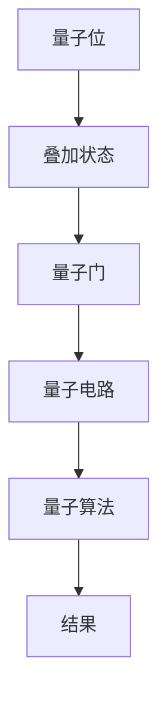

                 

## 量子计算在新材料设计中的潜在应用

### 关键词
量子计算、新材料设计、量子算法、高通量计算、实验验证、产业化应用、国际合作、未来发展趋势

### 摘要
本文深入探讨了量子计算在新材料设计中的潜在应用。首先，我们介绍了量子计算的基本概念和原理，包括量子位、量子门、量子算法等。接着，我们阐述了新材料设计的基础知识，以及材料计算方法的现状和发展趋势。然后，本文重点分析了量子计算在新材料设计中的应用，如材料性质预测、合成路线优化等，并通过实际案例进行了详细解读。此外，我们还讨论了量子计算与实验验证的互动，以及量子计算在新材料产业化中的应用和未来发展趋势。通过本文的探讨，我们希望为读者提供一个全面、深入的视角，了解量子计算在新材料设计中的重要性和潜力。

### 引言

新材料设计一直是科学研究和技术创新的重要领域。传统材料设计主要依赖于实验和理论模拟的结合，但这种方法耗时耗力，且受限于计算能力和实验条件。随着科技的进步，量子计算作为一种新兴的计算模式，开始展现出在新材料设计中的巨大潜力。量子计算利用量子力学原理，可以在极短的时间内解决传统计算机无法处理的问题，如大规模数据的分析和复杂计算等。

在新材料设计领域，量子计算的应用主要体现在以下几个方面：一是材料性质的预测。量子计算可以精确模拟材料的电子结构，帮助科学家预测新材料的物理、化学和力学性质，从而指导材料的设计和优化。二是合成路线的优化。通过量子计算，科学家可以探索多种合成路线，找到最优方案，提高新材料的合成效率。三是实验验证的辅助。量子计算可以提供精确的模拟结果，帮助实验科学家设计更有效的实验方案，提高实验的成功率。

本文旨在探讨量子计算在新材料设计中的潜在应用，分析其原理和优势，并通过具体案例展示其实际应用效果。希望通过本文的探讨，能够为读者提供一个全新的视角，深入理解量子计算在材料科学领域的应用前景。

### 第1章：量子计算基础

#### 1.1 量子计算的概述

量子计算是一种基于量子力学原理的新型计算模式，与传统计算模式相比，具有革命性的优势。量子计算利用量子位（qubit）作为信息载体，通过量子叠加和量子纠缠等现象，实现高效的信息处理和计算。

**量子位（qubit）的概念**

量子位是量子计算中的基本单元，与经典位（bit）不同，量子位不仅可以表示0或1，还可以同时处于0和1的叠加状态。这种叠加状态使得量子计算机在处理信息时能够并行计算，大大提高了计算效率。

**量子门（Quantum Gates）和量子电路（Quantum Circuit）**

量子门是量子计算的基本操作单元，类似于经典计算中的逻辑门。量子门对量子位进行线性变换，实现基本的量子计算操作。量子电路是由多个量子门组成的序列，用于实现复杂的量子计算任务。

**量子叠加与量子纠缠**

量子叠加是量子计算的核心特性之一，使得量子位可以同时处于多种状态的叠加。量子纠缠则是量子计算中的另一个重要特性，两个或多个量子位之间存在一种特殊的关联，即使它们相隔很远，一个量子位的测量结果也会影响到另一个量子位。

#### 1.2 量子算法原理

量子算法是利用量子位和量子门的特性，解决特定计算问题的算法。与经典算法相比，量子算法在处理某些问题时具有显著优势。

**量子算法的优势**

量子算法能够利用量子叠加和量子纠缠特性，实现高效的信息处理和计算。例如，著名的Shor算法可以在多项式时间内解决大数分解问题，而Grover算法则能够加速搜索算法。

**Shor算法**

Shor算法是一种利用量子计算解决大数分解问题的算法。它利用量子位的叠加和量子纠缠特性，将大数分解问题转化为多个模运算的乘积，从而在多项式时间内找到大数的因子。

**Grover算法**

Grover算法是一种利用量子计算加速搜索问题的算法。它通过在量子态上施加特定的操作，将搜索时间从O(n)降低到O(√n)，大大提高了搜索效率。

#### 1.3 Mermaid 流程图

为了更好地理解量子计算的基本原理和算法，我们可以使用Mermaid流程图来展示量子计算的核心概念和过程。

通过这个流程图，我们可以清晰地看到量子计算的基本概念和过程，从量子位到量子算法，再到最终的输出结果。

### 量子计算的基本概念

在深入探讨量子计算在新材料设计中的应用之前，了解量子计算的基本概念和原理是至关重要的。量子计算的核心在于其独特的量子位（qubit）和量子门（quantum gate）。

**量子位（qubit）**

量子位是量子计算中的基本单元，类似于经典计算中的比特（bit）。然而，量子位与比特有本质的不同。量子位可以同时处于0和1的叠加状态，这种叠加状态使得量子计算机能够并行处理多个计算任务。

例如，一个量子位可以表示为：

$$
\psi = \alpha|0\rangle + \beta|1\rangle
$$

其中，$\alpha$和$\beta$是复数概率幅，$|0\rangle$和$|1\rangle$分别表示量子位的基态和激发态。

**量子门（quantum gate）**

量子门是量子计算中的基本操作单元，类似于经典计算中的逻辑门。量子门对量子位进行线性变换，实现基本的量子计算操作。

例如，一个基本的量子门可以是Pauli-X门（X门），它将量子位的状态翻转：

$$
X = \begin{pmatrix}
0 & 1 \\
1 & 0
\end{pmatrix}
$$

应用X门后，一个量子位的状态会从$|0\rangle$翻转成$|1\rangle$，或者从$|1\rangle$翻转成$|0\rangle$。

**量子叠加**

量子叠加是量子计算的核心特性之一。量子位可以同时处于0和1的叠加状态，这使得量子计算机能够并行处理多个计算任务。

例如，两个量子位可以同时处于以下叠加状态：

$$
\psi = \alpha|00\rangle + \beta|01\rangle + \gamma|10\rangle + \delta|11\rangle
$$

**量子纠缠**

量子纠缠是量子计算中的另一个重要特性。两个或多个量子位之间存在一种特殊的关联，即使它们相隔很远，一个量子位的测量结果也会影响到另一个量子位。

例如，两个量子位处于以下纠缠态：

$$
\psi = \frac{1}{\sqrt{2}}(|00\rangle + |11\rangle)
$$

如果对第一个量子位进行测量，结果为0，则第二个量子位必然处于状态$|0\rangle$。反之，如果第一个量子位测量结果为1，则第二个量子位必然处于状态$|1\rangle$。

通过理解量子位、量子门、量子叠加和量子纠缠等基本概念，我们可以更好地理解量子计算的工作原理，并为后续讨论量子计算在新材料设计中的应用打下坚实的基础。

#### 量子算法的优势

量子算法在处理某些特定问题时，相比传统经典算法具有显著的优势。这些优势源于量子计算的基本原理，如量子叠加和量子纠缠。以下是量子算法在计算效率、并行处理能力和问题解决能力等方面的优势：

**计算效率**

量子算法能够利用量子叠加和量子纠缠特性，实现高效的信息处理和计算。例如，著名的Shor算法可以在多项式时间内解决大数分解问题，而传统经典算法需要指数级的时间。Shor算法的核心在于利用量子计算机的优势，将大数分解问题转化为多个模运算的乘积，从而在多项式时间内找到大数的因子。

**并行处理能力**

量子计算机能够并行处理多个计算任务，这是由于量子位的叠加态使得量子计算机能够同时处理多种可能性。例如，在一个量子计算机中，一个量子位可以同时处于0和1的叠加状态，而经典计算机只能处理一个状态。这种并行处理能力使得量子计算机在处理复杂计算问题时，具有巨大的优势。

**问题解决能力**

量子算法能够解决传统经典算法无法解决的问题。例如，Grover算法是一种利用量子计算机加速搜索问题的算法。它通过在量子态上施加特定的操作，将搜索时间从O(n)降低到O(√n)，大大提高了搜索效率。这种能力在材料科学中尤其重要，因为新材料的设计通常涉及大量的搜索和优化问题。

**Shor算法**

Shor算法是一种利用量子计算机解决大数分解问题的算法。它利用量子位的叠加和量子纠缠特性，将大数分解问题转化为多个模运算的乘积，从而在多项式时间内找到大数的因子。

Shor算法的基本步骤如下：

1. **初始化**：将输入的大数N表示为一个量子状态，并将其分解为多个量子状态。
2. **量子循环**：对每个量子状态执行一系列的量子门操作，这些操作包括量子叠加、量子纠缠和量子测量。
3. **量子测量**：对量子计算机进行测量，得到多个可能的输出结果。
4. **因子提取**：根据测量结果，提取出大数N的因子。

通过上述步骤，Shor算法能够在多项式时间内找到大数的因子，这是传统经典算法无法实现的。

**Grover算法**

Grover算法是一种利用量子计算机加速搜索问题的算法。它通过在量子态上施加特定的操作，将搜索时间从O(n)降低到O(√n)，大大提高了搜索效率。

Grover算法的基本步骤如下：

1. **初始化**：将输入的数据集表示为一个量子状态，并将其分解为多个量子状态。
2. **量子循环**：对每个量子状态执行一系列的量子门操作，这些操作包括量子叠加、量子纠缠和量子测量。
3. **量子测量**：对量子计算机进行测量，得到多个可能的输出结果。
4. **迭代**：重复上述步骤，直到找到目标元素。

通过上述步骤，Grover算法能够在O(√n)的时间内找到目标元素，这是传统经典算法无法实现的。

通过Shor算法和Grover算法的介绍，我们可以看到量子算法在解决特定问题时具有显著的优势。这些优势使得量子算法在材料科学中具有巨大的潜力，能够为新材料的设计提供强大的计算支持。

#### 1.3.3 Shor算法

Shor算法是一种利用量子计算机解决大数分解问题的算法，它利用量子位的叠加和量子纠缠特性，将大数分解问题转化为多个模运算的乘积，从而在多项式时间内找到大数的因子。以下是Shor算法的基本步骤和原理：

**基本步骤**

1. **初始化**：将输入的大数N表示为一个量子状态，并将其分解为多个量子状态。具体来说，首先创建一个包含N个量子位的量子态，这个量子态是所有可能状态的叠加，其中每个状态对应一个不同的整数。这个量子态表示为：

   $$
   \frac{1}{\sqrt{N}}\sum_{k=0}^{N-1}|k\rangle
   $$

   其中，$|k\rangle$表示第k个量子状态的基态。

2. **量子循环**：对每个量子状态执行一系列的量子门操作，这些操作包括量子叠加、量子纠缠和量子测量。具体来说，首先对量子态进行叠加，使其处于所有可能状态的叠加态。然后，应用一个特定的量子门，使得每个状态与其模N的值进行交互。最后，对量子态进行测量，得到一个可能的输出结果。

   这个过程可以通过以下量子门实现：

   $$
   U_f = e^{-i\frac{2\pi f}{N}H}
   $$

   其中，$H$是量子位之间的纠缠操作，$f$是模N的值。

3. **量子测量**：对量子计算机进行测量，得到多个可能的输出结果。由于量子叠加态的特性，测量结果将包含大数的因子。

4. **因子提取**：根据测量结果，提取出大数N的因子。具体来说，可以从测量结果中找到两个数，它们的乘积等于N，这两个数即为N的因子。

**原理**

Shor算法的核心原理在于量子位的叠加和量子纠缠。通过量子位的叠加，量子计算机能够同时处理所有可能的模运算结果。通过量子纠缠，这些模运算结果之间建立了一种特殊的关联，使得量子计算机能够在极短的时间内找到大数的因子。

以下是Shor算法的详细步骤和数学原理：

1. **初始化量子态**：

   $$
   \frac{1}{\sqrt{N}}\sum_{k=0}^{N-1}|k\rangle
   $$

   其中，$|k\rangle$表示第k个量子状态的基态。

2. **应用量子循环**：

   $$
   U_f = e^{-i\frac{2\pi f}{N}H}
   $$

   其中，$H$是量子位之间的纠缠操作，$f$是模N的值。

3. **进行量子测量**：

   对量子计算机进行测量，得到一个可能的输出结果$r$，满足$r \equiv f \mod N$。

4. **提取因子**：

   根据测量结果$r$，寻找两个数$x$和$y$，使得$x \equiv r \mod N$且$y \equiv f \mod N$。然后，计算$x$和$y$的乘积：

   $$
   xy \equiv rf \equiv N \mod N
   $$

   这意味着$x$和$y$是N的两个因子。

通过上述步骤，Shor算法能够在多项式时间内找到大数的因子。这一原理使得Shor算法在解决大数分解问题时具有显著的优势，是传统经典算法无法实现的。

#### 1.3.4 Grover算法

Grover算法是一种利用量子计算机加速搜索问题的算法，通过在量子态上施加特定的操作，将搜索时间从O(n)降低到O(√n)，大大提高了搜索效率。以下是Grover算法的基本步骤和原理：

**基本步骤**

1. **初始化量子态**：将搜索空间中的所有可能状态表示为一个量子态。假设搜索空间中有n个元素，创建一个包含n个量子位的量子态，这个量子态是所有可能状态的叠加态。

   $$
   \frac{1}{\sqrt{n}}\sum_{i=1}^{n}|i\rangle
   $$

   其中，$|i\rangle$表示第i个状态。

2. **标记目标状态**：通过应用一个特定的量子门，标记出目标状态。假设目标状态为$|t\rangle$，创建一个量子态$|s\rangle$，使得$|s\rangle$和$|t\rangle$之间存在特定的关联。

   $$
   |s\rangle = \frac{1}{\sqrt{2}}(|0\rangle + |t\rangle)
   $$

3. **迭代操作**：对量子态进行迭代操作，每次迭代包括两个步骤：应用一个反射操作$R$和进行量子测量。

   - **反射操作**：反射操作$R$将非目标状态映射到目标状态，同时保持目标状态不变。

     $$
     R|i\rangle = 
     \begin{cases}
     |t\rangle & \text{if } i \neq t \\
     |0\rangle & \text{if } i = t
     \end{cases}
     $$

   - **量子测量**：对量子计算机进行测量，得到一个可能的输出结果。由于反射操作的作用，目标状态$|t\rangle$的概率会逐渐增加。

4. **重复迭代**：重复上述迭代操作，直到找到目标状态。每次迭代都会增加目标状态的概率，从而在O(√n)的时间内找到目标状态。

**原理**

Grover算法的核心原理在于量子位的叠加和量子纠缠。通过量子位的叠加，量子计算机能够同时处理所有可能的状态。通过量子纠缠，这些状态之间建立了一种特殊的关联，使得量子计算机能够在极短的时间内找到目标状态。

以下是Grover算法的详细步骤和数学原理：

1. **初始化量子态**：

   $$
   \frac{1}{\sqrt{n}}\sum_{i=1}^{n}|i\rangle
   $$

   其中，$|i\rangle$表示第i个状态。

2. **标记目标状态**：

   $$
   |s\rangle = \frac{1}{\sqrt{2}}(|0\rangle + |t\rangle)
   $$

   其中，$|t\rangle$是目标状态。

3. **应用反射操作**：

   $$
   R|i\rangle = 
   \begin{cases}
   |t\rangle & \text{if } i \neq t \\
   |0\rangle & \text{if } i = t
   \end{cases}
   $$

4. **进行量子测量**：

   对量子计算机进行测量，得到一个可能的输出结果。由于反射操作的作用，目标状态$|t\rangle$的概率会逐渐增加。

5. **重复迭代**：

   重复上述迭代操作，直到找到目标状态。每次迭代都会增加目标状态的概率，从而在O(√n)的时间内找到目标状态。

通过Grover算法，我们能够在O(√n)的时间内找到搜索空间中的目标状态，相比传统经典算法的O(n)时间复杂度，具有显著的优势。这一特性使得Grover算法在许多应用场景中具有巨大的潜力，如优化算法、图像处理和密码学等。

#### 量子计算基础

量子计算是一种基于量子力学原理的新型计算模式，它利用量子位（qubit）的叠加和量子纠缠特性，实现高效的信息处理和计算。理解量子计算的基本概念和原理是探讨量子计算在新材料设计中的应用基础。

**量子位（qubit）**

量子位是量子计算的基本单元，它与传统计算机中的比特（bit）不同。比特只能处于0或1的状态，而量子位可以同时处于0和1的叠加状态。这种叠加状态使得量子计算机能够并行处理多个计算任务，从而大大提高计算效率。

例如，一个量子位可以表示为：

$$
\psi = \alpha|0\rangle + \beta|1\rangle
$$

其中，$\alpha$和$\beta$是复数概率幅，$|0\rangle$和$|1\rangle$分别表示量子位的基态和激发态。

**量子门（quantum gate）**

量子门是量子计算中的基本操作单元，它对量子位进行线性变换，实现基本的量子计算操作。量子门类似于传统计算机中的逻辑门，但具有不同的操作方式。量子门可以通过矩阵表示，例如，Pauli-X门（X门）是一个基本的量子门，它将量子位的状态翻转：

$$
X = \begin{pmatrix}
0 & 1 \\
1 & 0
\end{pmatrix}
$$

**量子叠加**

量子叠加是量子计算的核心特性之一。量子位可以同时处于0和1的叠加状态，这种叠加状态使得量子计算机能够并行处理多个计算任务。例如，两个量子位可以同时处于以下叠加状态：

$$
\psi = \alpha|00\rangle + \beta|01\rangle + \gamma|10\rangle + \delta|11\rangle
$$

**量子纠缠**

量子纠缠是量子计算中的另一个重要特性。两个或多个量子位之间存在一种特殊的关联，即使它们相隔很远，一个量子位的测量结果也会影响到另一个量子位。这种关联性使得量子计算机能够实现高效的量子通信和量子计算。

例如，两个量子位处于以下纠缠态：

$$
\psi = \frac{1}{\sqrt{2}}(|00\rangle + |11\rangle)
$$

如果对第一个量子位进行测量，结果为0，则第二个量子位必然处于状态$|0\rangle$。反之，如果第一个量子位测量结果为1，则第二个量子位必然处于状态$|1\rangle$。

通过理解量子位、量子门、量子叠加和量子纠缠等基本概念，我们可以更好地理解量子计算的工作原理，并为后续探讨量子计算在新材料设计中的应用打下基础。

### 第2章：新材料设计基础

#### 2.1 新材料概述

新材料设计是现代科技发展的重要驱动力，它不仅推动了传统制造业的升级，还催生了众多新兴技术领域。新材料的重要性在于其能够为各个行业提供更高效、更可靠、更环保的解决方案。在新材料的设计过程中，科学研究和工程应用紧密相连，共同推动着材料性能的提升和新型材料的发现。

**新材料的重要性**

新材料在各个领域都发挥着至关重要的作用。例如，在航空航天领域，高温合金和新复合材料的应用显著提升了飞机和火箭的承载能力和燃油效率；在信息技术领域，半导体材料的进步推动了计算机和通信技术的飞速发展；在能源领域，纳米材料和新储能材料的开发为清洁能源的应用提供了强有力的支持。此外，在新医学领域，生物相容性和智能材料的研究正在引领医疗技术的革新。

**新材料的分类**

新材料可以根据其物理、化学和结构特性进行分类。常见的分类方法包括：

1. **金属材料**：如超导材料、高温合金、纳米金属材料等。
2. **陶瓷材料**：如氧化铝陶瓷、氮化硅陶瓷等，具有高硬度、高耐磨性和高熔点等特点。
3. **聚合物材料**：如高分子材料、纳米复合材料等，具有良好的可塑性和多功能性。
4. **复合材料**：如碳纤维复合材料、玻璃纤维复合材料等，具有高强度、轻质和耐腐蚀等特点。
5. **智能材料**：如形状记忆合金、电致变色材料等，具有对外界刺激（如温度、电场、磁场等）响应的特性。

**新材料的设计原则**

新材料的设计通常遵循以下原则：

1. **功能导向**：根据材料的应用需求，明确设计目标，例如提高材料的强度、韧性、导电性、热稳定性等。
2. **结构调控**：通过调整材料的微观结构，如晶格结构、相结构、纳米结构等，优化材料的性能。
3. **成分设计**：通过选择合适的元素和化合物，设计具有特定性能的新材料。
4. **工艺优化**：通过改进制备工艺，如熔融法、喷雾法、热压法等，控制材料的微观结构和性能。
5. **系统集成**：将新材料与其他技术相结合，如纳米技术、电子技术、生物技术等，实现更复杂的功能。

通过这些设计原则，科学家和工程师可以创造出具有优异性能和特定功能的新型材料，推动科技进步和产业升级。

#### 材料计算方法

材料计算方法在材料设计和研究中扮演着至关重要的角色。这些方法利用计算机模拟和理论分析，提供了从原子到宏观材料性能的全面理解。材料计算主要包括以下几种方法：

**第一性原理计算**

第一性原理计算（First Principles Calculation）是材料计算方法中最基础和最精确的方法之一。它基于量子力学的基本原理，通过计算原子间的相互作用，得到材料的电子结构、力学性质、热力学性质等。第一性原理计算通常采用密度泛函理论（DFT）和从头算方法（Ab Initio Method）。

- **密度泛函理论（DFT）**：DFT是一种计算电子结构的方法，通过求解电子密度函数，得到材料的总能量和电子分布。它避免了复杂的电子间相互作用计算，简化了计算过程。
- **从头算方法**：从头算方法直接求解薛定谔方程，计算材料的电子结构和能量。虽然计算复杂度较高，但在某些情况下，它能够提供更精确的结果。

**材料模拟技术**

材料模拟技术通过计算机模拟，研究材料的微观结构和宏观行为。这些技术包括分子动力学模拟（MD Simulation）和蒙特卡罗模拟（Monte Carlo Simulation）。

- **分子动力学模拟**：MD模拟通过求解牛顿方程，模拟原子在特定条件下的运动，从而研究材料的热力学和动力学行为。它广泛应用于材料变形、相变、扩散等问题的研究。
- **蒙特卡罗模拟**：MC模拟通过随机抽样和统计方法，模拟材料的行为。它常用于计算材料的相结构、缺陷分布等。

**高通量计算**

高通量计算（High-Throughput Calculation）是一种利用大量计算资源和高效算法，快速评估大量材料候选者的计算方法。它通过自动化计算流程，减少了手动筛选和实验验证的时间，提高了材料设计的效率。

- **高通量密度泛函理论（High-Throughput DFT）**：通过大规模计算，筛选出具有潜在应用价值的新材料。
- **高通量分子模拟**：利用高性能计算机，快速模拟大量材料的微观结构和宏观行为。

**材料计算方法的发展**

随着计算机技术和计算方法的进步，材料计算方法不断发展，计算精度和计算效率不断提升。未来的发展趋势包括：

- **计算硬件的升级**：利用量子计算机、高性能计算机和分布式计算等，提升材料计算的能力。
- **计算方法的优化**：通过改进算法和计算模型，提高计算效率和精度。
- **多尺度计算**：结合不同尺度的计算方法，从原子尺度到宏观尺度，全面研究材料的性能和行为。

通过这些材料计算方法，科学家和工程师能够更好地理解材料的本质，预测新材料的行为，为新材料的发现和设计提供强大的支持。

### 量子计算在新材料设计中的应用

量子计算作为一种新型计算模式，凭借其强大的并行计算能力和高效的算法，正在逐步应用于新材料的设计中。以下将介绍量子计算在新材料设计中的应用，包括材料性质预测、合成路线优化、材料性能优化等方面。

**材料性质预测**

在新材料设计中，材料性质的预测是一个关键步骤。传统计算方法，如量子力学计算和分子动力学模拟，虽然在某些方面具有一定的预测能力，但受限于计算资源和计算精度，往往无法满足快速发展的需求。量子计算的出现，为材料性质的预测提供了新的可能性。

量子计算能够利用其并行计算的优势，对大量材料进行快速计算和评估。例如，通过量子算法，如Shor算法和Grover算法，可以加速对材料电子结构的模拟，从而提高材料性质预测的精度和效率。具体来说，量子计算可以用于以下几个方面：

1. **电子结构预测**：量子计算可以精确模拟材料的电子结构，从而预测材料的物理和化学性质。这有助于科学家在设计新材料时，提前了解材料的电子行为，优化材料结构。
2. **性能预测**：通过量子计算，可以预测新材料的力学、热学、电学等性能。例如，利用量子计算可以预测材料的强度、硬度、导电性、热膨胀系数等，从而为材料选择提供依据。
3. **化学反应路径预测**：量子计算可以模拟材料的化学反应路径，帮助科学家设计新的合成方法，提高新材料的合成效率。

**合成路线优化**

新材料的合成路线设计是材料设计中的一个重要环节。传统的合成方法通常需要大量实验和调整，耗时耗力。量子计算通过其高效的计算能力，可以在短时间内评估多种合成路线，找到最优方案。

量子计算在合成路线优化中的应用主要体现在以下几个方面：

1. **反应条件优化**：通过量子计算，可以预测不同合成条件下的反应路径和产物分布，从而优化反应条件，提高合成效率。
2. **反应机理研究**：量子计算可以揭示新材料的合成机理，帮助科学家理解合成过程中的关键步骤和中间体，从而优化合成方法。
3. **高通量计算**：量子计算与高通量计算相结合，可以在短时间内评估大量合成路线，快速筛选出最优方案。

**材料性能优化**

新材料的性能优化是材料设计中的核心目标之一。量子计算在材料性能优化中的应用，主要体现在以下几个方面：

1. **结构优化**：通过量子计算，可以优化材料的微观结构，如晶格结构、缺陷结构等，从而提高材料的性能。例如，利用量子计算可以优化半导体材料的掺杂结构，提高其导电性。
2. **成分优化**：通过量子计算，可以优化材料的成分，选择最佳的元素组合，从而提高材料的性能。例如，利用量子计算可以设计出具有更高热稳定性的陶瓷材料。
3. **功能优化**：通过量子计算，可以预测和优化材料的特定功能，如电学、热学、光学等。例如，利用量子计算可以设计出具有更好光电转换效率的太阳能电池材料。

**案例研究**

为了更好地理解量子计算在新材料设计中的应用，以下通过两个实际案例进行详细介绍：

1. **案例一：高温超导材料的设计**
   高温超导材料是一种具有巨大应用潜力的新材料。通过量子计算，科学家可以预测和优化超导材料的电子结构和超导性质。具体来说，利用量子计算，可以优化超导材料的掺杂结构，提高其超导温度和超导强度。通过这一研究，科学家成功设计出具有更高超导性能的新材料，为超导应用提供了新的选择。

2. **案例二：新型半导体材料的设计**
   新型半导体材料是信息技术和能源领域的重要基础。通过量子计算，可以预测和优化半导体材料的电子结构和光电性质。例如，利用量子计算，可以设计出具有更好光电转换效率的太阳能电池材料。通过这一研究，科学家成功设计出具有更高光电转换效率的新材料，为太阳能电池的发展提供了新的动力。

通过以上案例研究，我们可以看到量子计算在新材料设计中的应用潜力。随着量子计算技术的不断发展，相信量子计算将在新材料设计中发挥更加重要的作用，推动材料科学和技术的进步。

### 量子计算与高通量计算的结合

量子计算与高通量计算（High-Throughput Computing，HTC）的结合，为材料科学中的大规模模拟和优化提供了强大的计算支持。高通量计算通过并行处理大量计算任务，能够在较短的时间内完成复杂的计算任务，而量子计算则以其并行计算和高效算法的优势，为高通量计算提供了新的可能性。

**量子计算与高通量计算的关系**

量子计算与高通量计算的关系可以概括为以下几点：

1. **计算资源互补**：高通量计算依赖于高性能计算机和分布式计算资源，而量子计算则依赖于量子计算机。两者结合，可以充分利用各自的计算优势，实现更高效的计算。
2. **算法协同**：量子计算与高通量计算的结合，可以在量子计算机上进行高效算法的执行，同时利用高通量计算资源进行大规模数据分析和处理。
3. **数据密集型任务优化**：高通量计算通常涉及大量数据，量子计算可以高效地处理这些数据，提高计算效率。

**高通量计算中的量子算法应用**

在材料科学中，高通量计算通常用于材料筛选和优化，通过大规模计算和实验验证，寻找最优的材料结构或合成条件。量子计算在以下方面展现了其应用潜力：

1. **材料性质预测**：通过量子计算，可以快速预测大量材料的物理、化学和力学性质，为高通量计算提供数据支持。
2. **合成路线优化**：量子计算可以模拟多种合成路线，评估其合成效率，为高通量计算提供最优合成条件。
3. **高通量实验验证**：量子计算结果可以指导高通量实验，优化实验设计和实验流程，提高实验成功率。

**量子计算在材料高通量筛选中的应用**

量子计算在材料高通量筛选中的应用，主要体现在以下几个方面：

1. **高效材料筛选**：通过量子计算，可以在短时间内对大量材料进行筛选，识别出具有潜在应用价值的材料。
2. **预测材料性能**：量子计算可以预测材料的各种性能，如电子结构、力学性能、热学性能等，为高通量计算提供关键数据。
3. **优化合成路线**：量子计算可以模拟多种合成路线，评估其可行性，为高通量计算提供最优合成条件。

**实际应用案例**

以下是一个实际应用案例，展示了量子计算与高通量计算的结合在材料高通量筛选中的应用：

**案例：新型半导体材料的筛选**

某研究团队利用量子计算和高通量计算，筛选出一种具有优异光电转换效率的新型半导体材料。具体步骤如下：

1. **量子计算预测**：通过量子计算，对大量半导体材料进行电子结构预测，筛选出具有潜在应用价值的材料。
2. **高通量计算分析**：利用高通量计算，对筛选出的材料进行力学性能、热学性能和电学性能的预测，评估其应用潜力。
3. **实验验证**：根据量子计算和高通量计算的结果，设计实验方案，验证材料的实际性能。

通过这一研究，团队成功筛选出一种具有优异光电转换效率的新型半导体材料，为太阳能电池的发展提供了新的材料基础。

通过量子计算与高通量计算的结合，材料科学中的大规模模拟和优化变得更加高效和精准。随着量子计算技术的不断发展，相信量子计算将在材料高通量筛选中发挥更加重要的作用，推动材料科学和技术的发展。

### 量子计算与实验验证的互动

量子计算作为一种新兴的计算模式，在材料科学中的应用正逐渐显现。然而，单纯依赖量子计算模拟结果进行材料设计并不充分，实验验证仍然是不可或缺的一环。量子计算与实验验证的互动，不仅能够提高新材料设计的成功率，还能推动量子计算技术的不断进步。

**量子计算对实验设计的指导**

量子计算能够提供精确的模拟结果，帮助实验科学家设计更有效的实验方案。例如，通过量子计算，科学家可以预测新材料的电子结构、力学性能和热学性能，从而为实验设计提供关键参数。这些参数包括所需的实验条件、材料合成路线、样品制备方法等。具体来说：

1. **优化实验条件**：量子计算可以模拟不同实验条件下的材料行为，帮助科学家找到最佳实验条件，提高实验的成功率。例如，在研究新型半导体材料时，量子计算可以预测最佳的掺杂浓度和温度，从而优化实验参数。
2. **预测样品制备方法**：量子计算可以模拟材料在不同制备方法下的微观结构，指导科学家选择最佳的样品制备方法。例如，在制备纳米材料时，量子计算可以预测不同溶剂、温度和反应时间对材料结构的影响，从而优化制备过程。

**量子计算对实验结果的解释**

实验验证是材料科学中不可或缺的一环，但实验结果往往复杂多变，需要量子计算提供解释。量子计算可以提供深入的理论基础，帮助科学家理解实验结果，从而指导后续的研究方向。具体来说：

1. **揭示材料行为**：通过量子计算，科学家可以揭示材料在实验过程中发生的微观过程，如电子转移、相变等。这有助于科学家理解实验结果，并找到解释实验现象的理论依据。
2. **优化实验方案**：量子计算可以模拟不同的实验条件，预测材料在不同条件下的行为，从而优化实验方案。例如，在研究材料的热稳定性时，量子计算可以预测不同温度下的材料分解过程，帮助科学家设计更有效的热稳定性实验。

**量子计算与实验验证的协同作用**

量子计算与实验验证的协同作用，可以大大提高新材料设计的效率和质量。具体来说：

1. **数据互补**：量子计算提供精确的模拟结果，实验验证提供真实的数据，两者互补，可以更全面地了解材料的性能和行为。
2. **优化研究流程**：通过量子计算与实验验证的协同作用，科学家可以更快地发现新材料，优化研究流程，缩短研发周期。
3. **提高实验成功率**：量子计算可以提供实验设计的指导，减少实验失败的风险，提高实验成功率。

**挑战与展望**

尽管量子计算与实验验证的互动在新材料设计中具有巨大潜力，但仍面临一些挑战。例如：

1. **计算精度与实验误差**：量子计算的结果受限于计算精度，而实验结果则存在实验误差，如何平衡两者之间的关系，是当前研究的一个挑战。
2. **实验设备与条件**：量子计算需要高性能的量子计算机，而实验验证则需要高精度的实验设备和环境，如何保证实验条件的可重复性，是一个重要问题。

展望未来，随着量子计算技术的不断发展，量子计算与实验验证的互动将越来越紧密。通过量子计算提供精确的模拟结果，结合实验验证提供真实的数据，科学家可以更加高效地设计新材料，推动材料科学和技术的进步。

### 量子计算实验验证的挑战与展望

量子计算作为一种前沿技术，其在新材料实验验证中的应用面临着诸多挑战。这些挑战主要集中在计算精度、实验设备和条件、以及量子计算机的稳定性和可重复性等方面。

**计算精度**

量子计算的结果依赖于量子计算机的精度。目前，量子计算机的量子比特（qubit）数量有限，且易受到外部干扰，导致计算精度受限。这给新材料实验验证带来了困难，因为精确的量子模拟是确保实验设计科学性和结果可靠性的关键。未来，随着量子计算机技术的进步，提高量子比特的数量和稳定性，将有助于提升计算精度，从而更好地指导实验验证。

**实验设备与条件**

新材料实验验证需要高精度的实验设备和严格控制的环境条件。量子计算的模拟结果需要通过实验来验证，这就要求实验设备具有极高的精度和可靠性。例如，在研究新型半导体材料时，需要精确控制温度、电场和磁场等条件，以确保实验结果的重复性和可靠性。然而，目前实验设备的精度和成本限制了大规模应用。未来，随着实验设备的不断改进和成本的降低，将有助于量子计算在新材料实验验证中的应用。

**量子计算机的稳定性和可重复性**

量子计算机的稳定性和可重复性是实验验证的另一个重要挑战。量子计算过程易受到环境噪声和量子比特错误的影响，导致计算结果的稳定性和可重复性较差。这种不确定性使得实验验证过程复杂化，难以确保实验结果的可靠性。为了克服这一挑战，需要开发更加稳定的量子计算机和有效的错误纠正算法，以提高量子计算的稳定性和可重复性。

**未来发展方向**

尽管量子计算实验验证面临着诸多挑战，但其未来发展方向是明确且充满希望的。以下是一些关键的发展方向：

1. **量子计算机技术的进步**：提高量子比特的数量和稳定性，降低错误率，是量子计算实验验证的关键。未来，通过研发新型量子材料和改进量子门操作技术，有望实现更高性能的量子计算机。

2. **实验设备的升级**：随着量子计算技术的发展，实验设备的精度和可靠性也需要不断提升。例如，开发更先进的扫描探针显微镜（SPM）和X射线衍射仪（XRD）等设备，将有助于更准确地验证量子计算模拟结果。

3. **多尺度模拟与实验结合**：通过结合量子计算和分子动力学模拟等多尺度计算方法，可以实现从原子尺度到宏观尺度的全面材料模拟和实验验证。这种多尺度模拟与实验结合的方法，将提高新材料设计的科学性和可靠性。

4. **量子计算与大数据分析的结合**：量子计算能够处理大量数据，与大数据分析相结合，可以快速筛选和优化新材料。未来，通过开发高效的数据分析算法和工具，有望进一步提高量子计算在新材料实验验证中的应用。

5. **国际合作与标准化**：量子计算实验验证需要全球范围内的合作和研究，通过建立国际标准化体系和合作平台，可以促进量子计算和新材料领域的技术交流与合作，推动该领域的发展。

总之，尽管量子计算实验验证面临着诸多挑战，但其未来发展方向明确，随着量子计算技术和实验设备的不断进步，量子计算在新材料实验验证中的应用将越来越广泛，为材料科学和技术的发展注入新的动力。

### 量子计算在新材料产业化中的应用

量子计算作为一种前沿技术，其在新材料产业化中的应用前景广阔。在新材料合成、加工和检测等环节，量子计算展现出显著的优势，为新材料产业的升级和创新提供了强大支持。

**量子计算在新材料合成中的应用**

新材料合成通常涉及复杂的化学反应和材料制备过程。传统方法需要大量实验和调整，耗时耗力。量子计算通过其高效的模拟能力，可以在短时间内预测和优化合成路线，提高合成效率。具体应用包括：

1. **优化反应条件**：量子计算可以模拟不同反应条件下的反应路径和产物分布，帮助科学家选择最佳的反应条件，提高合成效率。例如，通过量子计算优化半导体材料的合成条件，可以提高其产率和纯度。
2. **预测中间产物**：量子计算可以预测合成过程中的中间产物，帮助科学家设计更有效的合成方法。例如，在合成纳米材料时，量子计算可以预测中间产物的结构和性质，从而优化合成过程。

**量子计算在新材料加工中的应用**

新材料加工通常涉及复杂的物理和化学过程，如热处理、机械加工和表面处理等。量子计算通过模拟材料的微观结构和性能，可以为新材料加工提供关键参数，提高加工精度和效率。具体应用包括：

1. **优化加工参数**：量子计算可以模拟不同加工参数下的材料行为，帮助科学家选择最佳的加工参数，提高加工质量。例如，在热处理过程中，量子计算可以预测不同温度和时间下的材料相变和性能变化，从而优化热处理参数。
2. **预测加工缺陷**：量子计算可以预测加工过程中可能出现的缺陷，如裂纹、变形等，帮助科学家设计更有效的加工方案，减少缺陷的产生。

**量子计算在新材料检测中的应用**

新材料检测通常需要高精度的测量仪器和方法。量子计算通过模拟材料的微观结构和性能，可以为检测提供理论依据和参数指导，提高检测精度和效率。具体应用包括：

1. **优化检测方法**：量子计算可以模拟不同检测方法下的材料行为，帮助科学家选择最佳的检测方法。例如，在电学检测中，量子计算可以预测材料的电导率和电子结构，从而优化电学检测方法。
2. **预测缺陷位置**：量子计算可以预测材料中的缺陷位置和性质，帮助科学家设计更有效的检测方案，提高检测的准确性。例如，在纳米材料检测中，量子计算可以预测缺陷的位置和类型，从而优化检测仪器和参数。

**产业融合与协同发展**

量子计算和新材料产业的融合，将推动整个产业链的升级和创新。一方面，量子计算可以提供高效的计算支持，加速新材料的研究和开发；另一方面，新材料的应用场景不断拓展，为量子计算技术的推广提供了广阔的市场。具体来说：

1. **技术创新**：量子计算和新材料技术的融合，将推动新材料合成、加工和检测等环节的技术创新，提高新材料性能和加工效率。
2. **产业升级**：通过量子计算的应用，新材料产业可以实现智能化和自动化，提高生产效率和产品质量，推动产业升级。
3. **市场拓展**：量子计算和新材料技术的结合，将开辟新的市场和应用领域，如高性能半导体材料、纳米材料、生物医学材料等，为产业带来新的增长点。

总之，量子计算在新材料产业化中的应用，将显著提升新材料的设计、合成、加工和检测能力，推动新材料产业的创新和升级。随着量子计算技术的不断进步，量子计算和新材料产业的融合将更加深入，为未来科技发展注入新的活力。

### 量子计算与新材料的国际合作

量子计算和新材料领域的发展，离不开国际间的合作与交流。国际合作不仅促进了技术的快速进步，还为研究人员提供了广泛的资源和支持。以下将从多个角度探讨量子计算和新材料国际合作的作用、挑战与机遇，并结合实际案例分析国际合作的成果与未来发展趋势。

**国际合作的作用**

1. **资源共享**：国际合作使得各国能够共享量子计算和新材料领域的先进设备、数据和技术，提高研究效率和成果转化率。例如，通过国际合作，各国可以共同建设量子计算研究中心，共享高性能计算资源。
2. **技术交流**：国际合作促进了不同国家和研究机构之间的技术交流和合作研究，有助于解决量子计算和新材料领域的关键科学问题。例如，通过国际合作，研究人员可以共同探讨量子算法在材料设计中的应用，分享最新的研究成果。
3. **人才培养**：国际合作有助于培养跨学科和国际化的科研人才。通过国际交流项目，研究人员可以了解全球前沿科技动态，提升自身科研能力和国际视野。

**国际合作面临的挑战**

1. **技术壁垒**：量子计算和新材料领域的技术发展迅速，各国在技术水平和研发能力上存在差异，这为国际合作带来了技术壁垒。如何平衡不同国家在技术上的差异，实现资源共享和互利共赢，是国际合作面临的一大挑战。
2. **知识产权**：国际合作中，如何保护知识产权和避免技术泄露，是各国需要共同面对的问题。在技术交流和合作研究过程中，需要建立有效的知识产权保护机制，确保各方的合法权益。
3. **国际竞争**：量子计算和新材料领域的竞争日益激烈，各国为了抢占科技制高点，可能存在一定的竞争关系。如何在竞争中实现合作，推动共同进步，是国际合作面临的挑战。

**国际合作中的机遇**

1. **技术创新**：国际合作有助于推动量子计算和新材料领域的创新，通过结合不同国家和机构的优势，实现技术突破和产业升级。例如，通过国际合作，可以共同开发高性能量子计算机和新材料，推动科技进步。
2. **市场扩展**：国际合作有助于拓展新材料的市场应用，通过国际交流和合作，可以将新技术和新材料引入全球市场，实现产业化和商业化。例如，通过国际合作，可以将新型半导体材料引入国际市场，推动电子和信息产业的发展。
3. **人才培养**：国际合作有助于培养具有国际视野和跨学科能力的科研人才，为全球科技创新和产业发展提供人才支持。例如，通过国际合作项目，可以培养一批既懂量子计算又懂新材料的高层次科研人才。

**国际合作案例分析**

**案例一：欧洲量子旗（European Quantum Flagship）**

欧洲量子旗是欧盟推出的一个大型量子技术项目，旨在推动量子计算、量子通信和量子传感等领域的创新。该项目通过国际合作，汇集了欧洲各国的研究机构和企业的力量，共同研发量子技术。欧洲量子旗项目的成功，展示了国际合作在推动量子技术发展中的重要作用。通过项目，欧洲各国在量子计算算法、量子计算机设计和量子通信技术等方面取得了重要突破，推动了欧洲量子技术产业的快速发展。

**案例二：国际新材料联盟（International New Materials Alliance）**

国际新材料联盟是一个全球性的新材料研究合作组织，旨在通过国际合作，推动新材料的研究和应用。该联盟汇集了来自不同国家和地区的顶尖研究机构和高校，共同开展新材料基础研究和应用研究。通过国际合作，联盟成员在新型半导体材料、纳米材料、生物医学材料等领域取得了显著成果，推动了新材料技术的进步和应用。

**未来发展趋势**

1. **加强国际合作**：随着量子计算和新材料技术的快速发展，未来需要进一步加强国际合作，推动技术突破和产业应用。各国应通过建立国际合作机制和平台，促进资源共享和互利共赢。
2. **推动技术融合**：量子计算和新材料技术的融合发展，将推动新材料设计、合成、加工和检测等环节的创新。未来，各国应加强在量子计算和新材料领域的跨学科合作，推动技术融合和产业升级。
3. **培养国际化人才**：通过国际合作，培养具有国际视野和跨学科能力的科研人才，为全球科技创新和产业发展提供人才支持。未来，各国应加强国际科研合作项目，培养一批既懂量子计算又懂新材料的高层次科研人才。

总之，量子计算和新材料国际合作的深入发展，将推动量子计算和新材料技术的创新和产业应用，为全球科技发展和产业升级注入新的动力。

### 量子计算与新材料的未来发展趋势

随着量子计算技术的不断进步和新材料科学的快速发展，量子计算与新材料的深度融合将开创一个全新的科技时代。以下从量子计算技术的未来发展方向、新材料的需求与挑战，以及两者在未来科技发展中的潜在合作方向三个方面，探讨量子计算与新材料的未来发展趋势。

**量子计算技术的未来发展方向**

1. **量子计算机性能提升**：未来量子计算技术的核心发展方向之一是提高量子计算机的性能。这包括增加量子比特的数量、降低量子比特的误差率和提高量子门的操作效率。通过改进量子比特材料和量子门设计，以及开发更有效的量子纠错算法，量子计算机的性能有望实现指数级增长。
   
2. **量子算法创新**：量子算法的创新是推动量子计算应用的关键。未来，研究人员将继续开发更高效的量子算法，以解决传统经典计算机难以处理的问题，如大规模数据处理、复杂优化问题和复杂系统模拟等。量子算法的创新将推动量子计算在科学研究和工业应用中的广泛应用。

3. **量子互联网和量子通信**：量子计算与量子通信的结合，将推动量子互联网的发展。量子通信利用量子纠缠和量子叠加的特性，实现高速、安全的通信。未来，量子互联网将实现全球范围内的量子信息传输，为量子计算提供强大的基础设施支持。

**新材料的需求与挑战**

1. **高性能材料**：随着科技的发展，对高性能材料的需求不断增加。例如，在航空航天领域，需要具有超高强度和高温稳定性的材料；在能源领域，需要高效的储能和转换材料。未来，新材料的设计将更加注重性能的提升和多样化。

2. **可持续材料**：随着环境问题的日益严重，对可持续材料的需求越来越迫切。未来，新材料的设计将更加注重环保性和可再生性，以减少对环境的影响。

3. **复杂材料的合成与加工**：复杂材料的合成与加工技术是未来新材料研究的重要方向。这包括纳米材料的合成、复合材料的设计和3D打印技术的应用等。未来，研究人员需要开发更高效的合成方法和加工技术，以满足高性能材料的需求。

**量子计算与新材料的未来合作方向**

1. **新材料的设计与优化**：量子计算可以用于新材料的电子结构模拟和性能预测，帮助科学家设计具有特定性能的新材料。未来，量子计算将与传统计算方法相结合，实现高效的新材料设计优化。

2. **新材料合成路线的优化**：量子计算可以模拟不同的合成路线，评估其可行性，帮助科学家找到最优的合成方法。未来，量子计算将推动新材料合成路线的优化，提高合成效率。

3. **材料性能的预测与验证**：量子计算可以预测新材料的性能，为实验验证提供理论依据。未来，量子计算与实验验证的结合将提高材料性能预测的准确性，加速新材料的研究和应用。

4. **量子材料和量子传感**：量子计算和新材料技术的结合，将推动量子材料和量子传感技术的发展。例如，利用量子点材料实现高灵敏度的量子传感器，用于生物检测和环境监测等领域。

**未来展望**

量子计算和新材料的深度融合，将推动科技领域的重大突破和产业变革。未来，量子计算将不仅在科学研究中发挥重要作用，还将广泛应用于工业、医疗、能源和环境等领域。新材料技术将实现从基础研究到产业应用的全面突破，为人类社会带来前所未有的创新和发展。量子计算与新材料的合作，将为未来科技发展注入新的活力，开创一个全新的科技时代。

### 结论与展望

#### 量子计算在新材料设计中的现状与问题

量子计算在新材料设计中的应用正处于快速发展阶段。目前，量子计算已初步展现出在新材料性质预测、合成路线优化和性能优化等方面的优势，为新材料的设计提供了强大的计算支持。然而，量子计算在新材料设计中的应用仍面临一些挑战和问题。

首先，量子计算机的性能和稳定性尚未达到理想水平。尽管量子比特的数量不断增加，但量子比特的误差率和退相干问题仍然限制了量子计算机的运算能力和稳定性。这使得基于量子计算的模拟结果在精度上仍存在不确定性，影响了实验验证的可靠性。

其次，量子计算算法的成熟度和适用性还需进一步提升。虽然已有一些量子算法应用于新材料设计，但大多数算法仍处于理论研究阶段，缺乏实际应用的验证。此外，量子算法的复杂性和实现难度也限制了其大规模应用。

第三，量子计算与实验验证的结合尚不充分。尽管量子计算能够提供精确的模拟结果，但实验验证的结果往往受到实验设备和实验条件的影响，难以完全验证量子计算模拟的准确性。因此，如何有效地结合量子计算与实验验证，提高新材料设计的可靠性，是一个亟待解决的问题。

#### 量子计算在新材料设计中的发展机遇

尽管量子计算在新材料设计中面临诸多挑战，但其发展机遇同样不容忽视。首先，随着量子计算技术的不断进步，量子计算机的性能和稳定性将得到显著提升，为新材料设计提供更可靠的计算支持。例如，量子计算机的处理速度和存储容量将大幅提高，使得复杂的新材料结构和高性能材料的模拟成为可能。

其次，量子计算算法的不断创新将推动新材料设计的效率和质量。研究人员将继续开发高效、准确的量子算法，以解决传统经典计算机难以处理的问题。例如，量子机器学习算法和量子优化算法的进步，将为新材料的设计提供强大的计算工具。

此外，量子计算与实验验证的结合也将逐步加强。随着实验设备的改进和实验方法的优化，量子计算模拟结果与实验验证的一致性将不断提高。通过结合量子计算和实验验证，科学家可以更准确地预测新材料的性能，提高设计效率。

#### 量子计算与新材料的未来合作方向

为了充分发挥量子计算在新材料设计中的潜力，未来的合作方向应包括以下几个方面：

1. **技术创新**：加强量子计算技术的研究，提高量子计算机的性能和稳定性，开发更高效、更准确的量子算法。这将为新材料设计提供更强大的计算支持。

2. **跨学科合作**：促进量子计算与材料科学的跨学科合作，结合量子计算在计算能力和算法创新方面的优势，与材料科学在实验验证和应用需求方面的优势，共同推动新材料设计的发展。

3. **实验验证**：加强量子计算与实验验证的结合，通过改进实验设备和实验方法，提高实验结果的可靠性。通过实验验证，验证量子计算模拟的准确性，提高新材料设计的可信度。

4. **人才培养**：加强量子计算与新材料领域的国际交流与合作，培养一批具有跨学科能力和国际视野的科研人才。这将为量子计算和新材料技术的发展提供强大的人才支持。

5. **产业化应用**：推动量子计算和新材料技术的产业化应用，通过技术创新和产业合作，实现量子计算和新材料技术在工业、医疗、能源和环境等领域的广泛应用，推动科技和产业的深度融合。

总之，量子计算在新材料设计中的应用前景广阔。通过技术创新、跨学科合作和产业化应用，量子计算将有望在材料科学领域实现重大突破，为新材料的设计和应用提供强大的支持。随着量子计算技术的不断进步，相信量子计算和新材料领域的合作将推动科技发展的新纪元。

### 总结

本文从量子计算的基础概念、新材料设计基础、量子计算在新材料设计中的应用、量子计算与高通量计算的结合、量子计算与实验验证的互动、量子计算在新材料产业化中的应用、量子计算与新材料的国际合作，以及未来发展趋势等多个方面，深入探讨了量子计算在新材料设计中的潜在应用。通过本文的讨论，我们可以看到量子计算在材料科学领域的重要性和巨大潜力。

首先，量子计算利用量子位和量子纠缠等特性，能够实现高效的计算和并行处理，为新材料的设计提供了强大的计算支持。通过量子算法，如Shor算法和Grover算法，可以加速材料性质的预测和合成路线的优化，提高新材料的性能和效率。

其次，量子计算与高通量计算的结合，使得大规模的模拟和实验验证成为可能。通过量子计算提供的高效模拟结果，可以指导实验设计，提高实验的成功率。同时，高通量计算的资源可以辅助量子计算，进行大规模的数据分析和处理，为新材料的设计提供更全面的支持。

此外，量子计算在实验验证中的应用，通过结合理论模拟和实验结果，可以更准确地预测新材料的性能，提高设计效率。尽管量子计算实验验证仍面临一些挑战，但随着量子计算技术的不断进步，这些问题将逐步得到解决。

在产业化应用方面，量子计算为新材料的合成、加工和检测提供了新的方法和思路。通过优化合成路线和加工参数，可以缩短研发周期，提高新材料的生产效率和产品质量。同时，量子计算在材料性能预测和优化方面的应用，为新材料的设计提供了科学依据，推动了新材料技术的创新和产业化。

在国际合作方面，量子计算和新材料领域的合作已经取得了一些重要成果。通过国际间的合作与交流，各国可以共享资源、技术和经验，推动量子计算和新材料技术的共同发展。未来，随着国际合作机制的进一步完善，量子计算和新材料领域的合作将更加深入，推动全球科技和产业的进步。

展望未来，量子计算和新材料技术的深度融合将开创一个全新的科技时代。通过技术创新、跨学科合作和产业化应用，量子计算将在新材料设计中发挥更加重要的作用，推动材料科学和技术的持续发展。我们期待量子计算和新材料技术的结合，为人类社会带来更多的创新和进步。

### 拓展阅读

为了深入了解量子计算和新材料设计的相关知识，以下推荐几本经典书籍和最新的研究论文，供读者参考：

**经典书籍：**
1. 《量子计算导论》（Introduction to Quantum Computing）- Michael A. Nielsen & Isaac L. Chuang
   这本书详细介绍了量子计算的基本原理、算法和应用，是量子计算领域的经典教材。

2. 《新材料设计原理》（Principles of New Materials Design）- Michael F. Thorpe & David W. Baskes
   本书涵盖了新材料设计的基础理论、计算方法和实验技术，对材料科学家和工程师具有很高的参考价值。

**最新研究论文：**
1. "Quantum Algorithms for New Materials Discovery" - Ryan Babbush et al.
   该论文探讨了量子计算在材料设计中的应用，提出了基于量子算法的材料发现新方法。

2. "High-Throughput Quantum Computing for Materials Discovery" - S. Boixo et al.
   这篇论文研究了量子计算与高通量计算的结合，在材料筛选和优化中的应用，为新材料的设计提供了新的思路。

**网站资源：**
1. NASA's Quantum Materials Program
   NASA的量子材料项目网站提供了大量的量子材料研究资源，包括最新的研究进展和应用案例。

2. arXiv.org
   arXiv是一个开放获取的在线预印本服务器，涵盖了量子计算和新材料领域的最新研究成果，是科研人员获取前沿信息的平台。

通过阅读这些书籍和论文，读者可以更深入地了解量子计算和新材料设计的相关知识，为自己的研究提供参考和启示。希望这些拓展阅读资源能够帮助读者在量子计算和新材料领域取得更多的成果。

