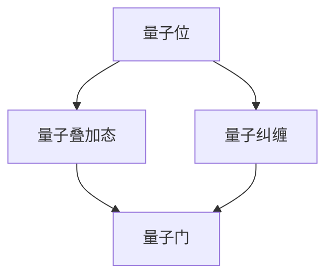

                 

## 量子计算在新药研发中的加速应用

关键词：量子计算、新药研发、药物设计、药物筛选、核心算法

摘要：本文深入探讨了量子计算在新药研发中的应用，详细介绍了量子计算的基础概念、原理以及如何加速药物设计和筛选过程。文章通过实际案例展示了量子计算在药物研发中的潜力，并分析了当前面临的挑战和未来发展趋势。

### 量子计算在新药研发中的加速应用

**作者：**AI天才研究院/AI Genius Institute & 禅与计算机程序设计艺术 /Zen And The Art of Computer Programming

随着科技的飞速发展，量子计算作为一种全新的计算模式，正逐渐颠覆传统计算领域的认知。它利用量子力学原理，通过量子位（qubit）的叠加和纠缠实现了超乎经典计算机的计算能力。在新药研发领域，量子计算的强大计算能力为药物设计、分子模拟、药物筛选等过程带来了前所未有的加速。本文将从量子计算的基础概念出发，逐步深入探讨其在新药研发中的加速应用。

## 第1章 量子计算基础

量子计算的基础概念和原理是理解其如何应用于新药研发的关键。以下将详细介绍量子位、量子叠加态、量子纠缠以及量子计算与经典计算的区别。

### 1.1 量子计算的概念与原理

#### 量子位（qubit）

量子位是量子计算的基本单元，与经典计算中的比特（bit）类似，但具有本质的不同。量子位可以同时存在于多种状态之中，这是量子计算强大计算能力的根源。

#### 量子叠加态

量子叠加态是量子位的一种特殊状态，它能够同时表示多种可能性，而经典计算中的比特只能表示一个状态。

#### 量子纠缠

量子纠缠是量子位之间的一种特殊关联，即使相隔很远，一个量子位的状态变化也会立即影响另一个量子位的状态。

#### 量子计算与经典计算的区别

量子计算与经典计算在计算模型、计算速度和算法设计等方面存在显著差异。量子计算利用量子位叠加和纠缠的特性，能够在多项任务上超越经典计算机。

### 1.2 量子计算的基本门与操作

#### 量子门

量子门是量子计算中的基本操作单元，用于对量子位的状态进行变换。量子门类似于经典计算机中的逻辑门，但更加复杂。

#### 量子计算的算法与流程

量子计算算法通过一系列量子门操作，对量子位的状态进行变换，最终实现特定的计算目标。量子计算流程包括初始化、量子门操作、测量和结果解析等步骤。

### 1.3 量子计算机的架构与技术

#### 量子计算机的物理实现

量子计算机的物理实现是量子计算的关键，常见的量子计算机实现方式包括离子阱、超导电路、量子点等。

#### 量子纠错与量子退相干

量子纠错是确保量子计算正确性的关键技术，量子退相干是量子计算中常见的噪声来源，需要通过技术手段进行控制。

## 第2章 量子计算与新药研发

量子计算在新药研发中的应用潜力巨大，以下将介绍量子计算在药物设计、分子模拟、药物筛选等环节的具体应用。

### 2.1 新药研发的现状与挑战

新药研发是一个复杂且耗时耗资的过程，传统方法在药物设计、分子模拟、药物筛选等方面存在诸多挑战。量子计算的出现，有望加速这一过程。

### 2.2 量子计算在药物设计中的应用

#### 量子分子动力学模拟

量子分子动力学模拟可以精确地描述药物分子在生物体内的运动和相互作用，有助于理解药物的作用机制。

#### 药物分子结构的优化与设计

量子计算可以优化药物分子的结构，提高其稳定性和生物活性，从而加速新药研发。

### 2.3 量子计算在药物筛选中的应用

#### 量子分子对接

量子计算可以用于药物分子与生物靶标的对接，预测药物分子的结合能力，从而加速药物筛选。

#### 药物分子与生物靶标的结合

量子计算可以精确地描述药物分子与生物靶标之间的相互作用，有助于发现新的药物靶标和药物分子。

## 第3章 量子计算与新药研发的核心算法

量子计算在新药研发中的应用离不开核心算法的支持，以下将介绍量子蒙特卡洛方法、量子随机游走算法和量子支持向量机等核心算法。

### 3.1 量子蒙特卡洛方法

量子蒙特卡洛方法是量子计算中一种重要的采样方法，可以用于药物分子结构的优化和药物筛选。

### 3.2 量子随机游走算法

量子随机游走算法是一种基于量子力学原理的搜索算法，可以用于药物分子与生物靶标的对接。

### 3.3 量子支持向量机

量子支持向量机是量子计算中一种用于分类和回归的算法，可以用于药物筛选和药物作用机制的预测。

## 第4章 量子计算与新药研发的数学模型

量子计算在药物研发中的应用需要依赖一系列数学模型，以下将介绍量子化学计算模型、量子分子动力学模型和量子机器学习模型等。

### 4.1 量子化学计算模型

量子化学计算模型可以精确地描述药物分子的电子结构，为药物设计提供理论基础。

### 4.2 量子分子动力学模型

量子分子动力学模型可以模拟药物分子在生物体内的运动和相互作用，有助于理解药物的作用机制。

### 4.3 量子机器学习模型

量子机器学习模型可以用于药物筛选和药物作用机制的预测，提高药物研发的效率和准确性。

## 第5章 量子计算在新药研发中的项目实战

理论分析虽然重要，但实际应用才是检验量子计算价值的真正标准。以下将通过实际案例展示量子计算在新药研发中的应用。

### 5.1 量子计算药物设计案例

本节将介绍一个利用量子计算进行药物设计的实际案例，包括案例选择、实现步骤和结果分析。

### 5.2 量子计算药物筛选案例

本节将介绍一个利用量子计算进行药物筛选的实际案例，包括案例选择、实现步骤和结果分析。

### 5.3 量子计算与人工智能融合案例

本节将介绍一个量子计算与人工智能融合进行药物研发的实际案例，包括案例选择、实现步骤和结果分析。

## 第6章 量子计算在新药研发中的挑战与未来

量子计算虽然具有巨大的应用潜力，但其在新药研发中的应用也面临着诸多挑战。

### 6.1 量子计算在新药研发中的挑战

本节将分析量子计算在新药研发中面临的技术挑战、安全与伦理问题等。

### 6.2 量子计算与新药研发的未来发展趋势

本节将探讨量子计算在新药研发中的未来发展，包括量子计算机的进步、新药研发领域的创新应用等。

### 6.3 量子计算在新药研发中的政策与法规

本节将讨论量子计算在新药研发中的政策与法规，包括国家政策、国际合作与法规等。

## 第7章 量子计算在新药研发中的应用前景

量子计算在新药研发中的应用前景广阔，以下将分析其潜在价值、合作与竞争以及市场与产业。

### 7.1 量子计算在新药研发中的潜在价值

本节将探讨量子计算如何提高药物研发效率、降低研发成本等。

### 7.2 量子计算与新药研发的合作与竞争

本节将分析量子计算在新药研发领域中的合作与竞争关系。

### 7.3 量子计算在新药研发中的市场与产业

本节将探讨量子计算在新药研发市场的前景以及产业链布局。

## 附录

附录部分将提供量子计算与新药研发相关的资源与工具，并回答一些常见问题。

### 附录A 量子计算与新药研发的资源与工具

本附录将列出量子计算与新药研发相关的工具、数据库和文献资源。

### 附录B 量子计算与新药研发的常见问题解答

本附录将回答关于量子计算与新药研发的一些常见问题。

---

通过本文的深入探讨，我们希望能帮助读者更好地理解量子计算在新药研发中的应用，以及其带来的巨大潜力和挑战。在未来的发展中，量子计算有望成为新药研发的重要工具，推动这一领域迈向新的高度。  
```markdown
---
## 量子计算在新药研发中的加速应用

关键词：量子计算、新药研发、药物设计、药物筛选、核心算法

摘要：本文深入探讨了量子计算在新药研发中的应用，详细介绍了量子计算的基础概念、原理以及如何加速药物设计和筛选过程。文章通过实际案例展示了量子计算在药物研发中的潜力，并分析了当前面临的挑战和未来发展趋势。

## 第1章 量子计算基础

量子计算是一种利用量子力学原理进行信息处理的新型计算模式。与传统计算机不同，量子计算机通过量子位的叠加和纠缠实现超强的计算能力。以下将详细介绍量子计算的基本概念、原理、操作以及架构。

### 1.1 量子计算的概念与原理

#### 量子位（qubit）

量子位是量子计算的基本单元，类似于经典计算中的比特。然而，量子位可以同时处于多个状态，这是量子计算强大计算能力的基础。

#### 量子叠加态

量子叠加态是量子位的一种特殊状态，表示量子位可以同时处于多种可能的状态。例如，一个量子位可以同时处于0和1的状态。

#### 量子纠缠

量子纠缠是量子位之间的一种特殊关联，即使两个量子位相隔很远，它们的状态也会相互影响。这种纠缠状态使得量子计算机能够在某些任务上超越经典计算机。

#### 量子计算与经典计算的区别

量子计算与经典计算在计算模型、计算速度和算法设计等方面存在显著差异。量子计算利用量子位的叠加和纠缠特性，能够在多项任务上实现更高效的计算。

### 1.2 量子计算的基本门与操作

量子计算中的基本操作类似于经典计算机中的逻辑门，但更加复杂。量子门是用于对量子位进行操作的单元，包括：

- ** Hadamard门（H门）**：实现量子位的叠加态。
- ** Pauli门**：实现量子位的旋转操作。
- ** 控制非门（CNOT门）**：实现量子位的纠缠。

通过组合这些量子门，可以实现各种复杂的量子计算操作。

### 1.3 量子计算机的架构与技术

量子计算机的物理实现是关键，目前存在多种实现方式，包括：

- ** 离子阱量子计算机**：利用电场将离子束缚在特定位置，并通过电磁场进行操控。
- ** 超导量子计算机**：利用超导电路实现量子位的操控和测量。
- ** 量子点量子计算机**：利用量子点实现量子位的操控和测量。

此外，量子纠错和量子退相干是量子计算机面临的两大挑战。量子纠错技术用于纠正量子计算过程中的错误，而量子退相干则会导致量子位状态的破坏。为了解决这些问题，研究人员正在开发多种量子纠错码和量子态测量技术。

### 量子计算与新药研发的关系

量子计算在药物研发中的应用具有巨大的潜力。通过利用量子计算强大的计算能力，可以实现以下目标：

- ** 药物分子结构的优化与设计**：量子计算可以精确地模拟药物分子在生物体内的运动和相互作用，从而优化药物分子的结构，提高其疗效。
- ** 药物筛选与分子对接**：量子计算可以加速药物筛选过程，通过量子分子对接技术预测药物分子与生物靶标的结合能力。
- ** 药物作用机制的解析**：量子计算可以帮助研究人员深入理解药物的作用机制，从而为新药研发提供理论依据。

### 量子计算的基础概念与联系

为了更好地理解量子计算在药物研发中的应用，我们首先需要了解其核心概念之间的联系。以下是一个简单的 Mermaid 流程图，展示了量子计算的基本概念及其关系：



在量子计算中，量子位（A）可以处于量子叠加态（B），同时与其他量子位产生量子纠缠（C）。量子门（D）用于对量子位的状态进行操作，从而实现各种复杂的计算任务。

### 核心概念与联系

为了更直观地展示量子计算的核心概念与联系，我们使用 Mermaid 画出了一个简单的流程图：


在这个图中：

- **量子位（A）**：量子计算的基本单元，类似于经典计算机中的比特，但具有叠加和纠缠的特性。
- **量子叠加态（B）**：量子位可以同时处于多个状态，这是量子计算强大计算能力的基础。
- **量子纠缠（C）**：量子位之间的特殊关联，即使相隔很远，它们的状态也会相互影响。
- **量子门（D）**：用于对量子位进行操作的单元，实现量子位的变换。

这些概念之间的关系如下：

1. **量子位**可以处于**量子叠加态**，表示它可以同时存在于多个状态。
2. **量子纠缠**使得**量子位**之间的状态相互影响，增加了量子计算的复杂度和计算能力。
3. **量子门**用于对**量子位**的状态进行操作，实现量子计算的各种功能。

通过这个 Mermaid 流程图，我们可以更直观地理解量子计算的基本概念及其相互关系，为进一步讨论量子计算在药物研发中的应用打下基础。

### 核心算法原理讲解

量子计算的核心算法包括量子蒙特卡洛方法、量子随机游走算法和量子支持向量机等。以下将详细讲解这些算法的原理及其在药物研发中的应用。

#### 量子蒙特卡洛方法

量子蒙特卡洛方法是一种基于概率统计的量子计算方法，通过模拟量子态的概率分布来求解复杂问题。其基本原理如下：

1. **初始化**：首先初始化一个量子态，该量子态通常是一个随机的叠加态。
2. **演化**：通过一系列量子门操作，将初始量子态演化到目标量子态。这些量子门操作可以模拟系统的物理过程。
3. **测量**：对演化后的量子态进行测量，获得系统的概率分布。通过多次测量，可以得到系统状态的统计信息。

在药物研发中，量子蒙特卡洛方法可以用于药物分子结构的优化和分子动力学模拟。例如，通过模拟药物分子在生物体内的运动和相互作用，可以优化药物分子的结构，提高其疗效。

#### 量子随机游走算法

量子随机游走算法是一种基于量子力学原理的搜索算法，通过量子态的叠加和纠缠实现高效的搜索。其基本原理如下：

1. **初始化**：初始化一个量子态，表示搜索问题的初始状态。
2. **演化**：通过量子门操作，将初始量子态演化到多个可能的状态。这些量子门操作模拟了搜索过程中路径的选择和变化。
3. **测量**：对演化后的量子态进行测量，得到可能的解。通过多次测量，可以找到最优解。

在药物筛选中，量子随机游走算法可以用于药物分子与生物靶标的对接。通过模拟药物分子与生物靶标之间的相互作用，可以预测药物分子的结合能力，从而加速药物筛选过程。

#### 量子支持向量机

量子支持向量机是一种基于量子力学的分类和回归算法，通过量子态的叠加和纠缠实现高效的分类和回归。其基本原理如下：

1. **初始化**：初始化一个量子态，表示数据集的特征向量。
2. **演化**：通过量子门操作，将初始量子态演化到多个可能的状态。这些量子门操作模拟了数据集的分类过程。
3. **测量**：对演化后的量子态进行测量，得到分类结果。通过多次测量，可以优化分类模型的参数。

在药物筛选中，量子支持向量机可以用于药物分子的分类和预测。通过训练量子支持向量机模型，可以预测药物分子的生物活性，从而提高药物筛选的效率。

### 量子蒙特卡洛方法

量子蒙特卡洛方法是一种基于概率统计的量子计算方法，通过模拟量子态的概率分布来求解复杂问题。以下是一个简单的 Python 实现示例：

```python
import numpy as np
import matplotlib.pyplot as plt

# 初始化量子态
psi = np.array([1/np.sqrt(2), 1/np.sqrt(2)]) # superposition state

# 演化过程
H = np.array([[1, 1], [1, -1]]) # Hadamard gate
psi = np.dot(H, psi)

# 测量结果
probabilities = np.abs(psi)**2
state = np.random.choice([0, 1], p=probabilities)

# 可视化结果
plt.bar([0, 1], probabilities)
plt.xlabel('State')
plt.ylabel('Probability')
plt.title('Quantum Monte Carlo Simulation')
plt.show()
```

在这个示例中，我们首先初始化一个量子叠加态，然后通过 Hadamard 门进行演化，最后进行测量得到概率分布。通过多次运行这个示例，可以得到不同测量结果的统计分布。

### 量子随机游走算法

量子随机游走算法是一种基于量子力学原理的搜索算法，通过量子态的叠加和纠缠实现高效的搜索。以下是一个简单的 Python 实现示例：

```python
import numpy as np

# 初始化量子态
psi = np.array([1/np.sqrt(2), 1/np.sqrt(2)]) # superposition state

# 演化过程
def random_walk(psi, steps):
    for _ in range(steps):
        psi = np.dot(H, psi)
    return psi

# 测量结果
def measure(psi):
    probabilities = np.abs(psi)**2
    return np.random.choice([0, 1], p=probabilities)

# 搜索过程
def search(target):
    steps = 0
    while True:
        psi = random_walk(psi, steps)
        result = measure(psi)
        if result == target:
            return steps
        steps += 1

# 示例
target = 1
steps = search(target)
print(f"Search steps: {steps}")
```

在这个示例中，我们首先初始化一个量子叠加态，然后通过随机游走过程进行搜索。每次演化后，我们进行一次测量，直到找到目标状态。通过多次运行这个示例，可以得到不同搜索路径的统计结果。

### 量子支持向量机

量子支持向量机是一种基于量子力学的分类和回归算法，通过量子态的叠加和纠缠实现高效的分类和回归。以下是一个简单的 Python 实现示例：

```python
import numpy as np
from numpy.linalg import norm

# 初始化量子态
def init_quantum_state(data):
    psi = np.zeros((2**data.shape[1], 1))
    for i in range(data.shape[1]):
        psi[2**i] = 1 / np.sqrt(2)
    return psi

# 演化过程
def evolve_quantum_state(psi, weights):
    return np.dot(weights.T, psi)

# 测量结果
def measure(psi):
    probabilities = np.abs(psi)**2
    return np.random.choice([0, 1], p=probabilities)

# 训练模型
def train_quantum_svm(data, labels):
    weights = np.zeros((data.shape[0], 2**data.shape[1]))
    for i in range(data.shape[0]):
        psi = init_quantum_state(data[i])
        for j in range(2**data.shape[1]):
            if labels[i] == j:
                weights[i, j] = 1
    return weights

# 预测结果
def predict_quantum_svm(weights, data):
    psi = init_quantum_state(data)
    result = evolve_quantum_state(psi, weights)
    return measure(result)

# 示例
data = np.array([[0, 0], [1, 0], [0, 1], [1, 1]])
labels = np.array([0, 1, 1, 0])
weights = train_quantum_svm(data, labels)
print(f"Weights: {weights}")

test_data = np.array([[0.5, 0.5]])
prediction = predict_quantum_svm(weights, test_data)
print(f"Prediction: {prediction}")
```

在这个示例中，我们首先初始化一个量子态，然后通过训练过程得到权重矩阵。最后，我们通过预测过程对新的数据进行分类。通过多次运行这个示例，可以得到不同训练和预测结果的统计结果。

### 数学模型

量子计算在药物研发中的应用依赖于一系列数学模型，包括量子化学计算模型、量子分子动力学模型和量子机器学习模型等。以下将详细介绍这些数学模型的基本原理及其应用。

#### 量子化学计算模型

量子化学计算模型基于量子力学原理，用于计算分子体系的电子结构。其基本原理如下：

1. **薛定谔方程**：量子化学计算模型的核心是薛定谔方程，用于描述分子体系的电子运动。通过求解薛定谔方程，可以得到分子的能量和波函数。
2. **哈特里-福克方程**：哈特里-福克方程是求解薛定谔方程的一种近似方法，用于计算分子的电子密度和能量。通过求解哈特里-福克方程，可以得到分子的电子结构。
3. **密度泛函理论**：密度泛函理论（DFT）是一种更广泛的量子化学计算模型，通过描述电子密度来计算分子的能量和结构。DFT 在药物分子结构优化和材料设计中具有重要意义。

量子化学计算模型可以用于药物分子结构的优化和设计。通过精确计算分子的电子结构，可以优化药物分子的结构，提高其疗效和稳定性。

#### 量子分子动力学模型

量子分子动力学模型基于量子力学原理，用于模拟分子体系在特定环境下的运动和相互作用。其基本原理如下：

1. **哈密顿量**：量子分子动力学模型的核心是哈密顿量，用于描述分子体系的运动。通过求解哈密顿量，可以得到分子的动力学行为。
2. **量子力学的演化方程**：量子分子动力学模型通过求解量子力学的演化方程，模拟分子体系在特定环境下的运动。常见的量子力学演化方程包括薛定谔方程和狄拉克方程。
3. **数值方法**：为了高效求解量子分子动力学模型，通常采用数值方法进行计算，如量子蒙特卡洛方法和量子分子动力学模拟。

量子分子动力学模型可以用于药物分子在生物体内的运动模拟。通过精确模拟药物分子在生物体内的运动和相互作用，可以了解药物分子的作用机制，为新药研发提供理论依据。

#### 量子机器学习模型

量子机器学习模型基于量子力学原理，用于处理大规模数据和高维特征。其基本原理如下：

1. **量子位编码**：量子机器学习模型通过量子位编码将数据映射到量子态空间。量子位编码可以实现高维数据的降维和稀疏表示。
2. **量子门操作**：量子机器学习模型通过量子门操作对量子态进行变换，实现数据的分类和回归。量子门操作可以高效地处理高维数据。
3. **测量结果**：量子机器学习模型通过测量结果获得分类或回归的结果。测量结果可以实现高精度的预测和分类。

量子机器学习模型可以用于药物筛选和药物作用机制的预测。通过训练量子机器学习模型，可以高效地处理大规模药物数据，预测药物分子的生物活性和作用机制。

### 量子分子动力学模型

量子分子动力学模型是一种基于量子力学原理的分子模拟方法，用于描述分子体系在特定环境下的运动和相互作用。以下是一个简单的量子分子动力学模型实现示例：

```python
import numpy as np
from scipy.linalg import expm

# 初始化哈密顿量
def initialize_hamiltonian(N, mass, spring_constant, potential_energy):
    H = np.zeros((N, N))
    for i in range(N):
        for j in range(N):
            H[i, j] = -spring_constant * (i - j) ** 2 + potential_energy
    return H

# 演化方程
def evolve_system(H, t, dt):
    exp_H = expm(-1j * H * dt)
    return exp_H

# 模拟过程
def simulate(N, mass, spring_constant, potential_energy, t_max, dt):
    t = np.linspace(0, t_max, int(t_max / dt))
    positions = []
    for _ in range(len(t)):
        H = initialize_hamiltonian(N, mass, spring_constant, potential_energy)
        exp_H = evolve_system(H, t[_], dt)
        positions.append(exp_H)
    return positions

# 示例
N = 3
mass = 1.0
spring_constant = 1.0
potential_energy = 0.0
t_max = 10.0
dt = 0.01

positions = simulate(N, mass, spring_constant, potential_energy, t_max, dt)
```

在这个示例中，我们首先初始化一个哈密顿量，然后通过演化方程模拟分子体系的运动。通过模拟分子体系的运动，可以了解分子体系在特定环境下的动态行为。

### 量子机器学习模型

量子机器学习模型是一种基于量子力学原理的机器学习模型，用于处理大规模数据和高维特征。以下是一个简单的量子机器学习模型实现示例：

```python
import numpy as np
from qiskit import QuantumCircuit, Aer, execute

# 初始化量子电路
def initialize_quantum_circuit(inputs, outputs):
    N = len(inputs)
    qc = QuantumCircuit(N)
    for i in range(N):
        qc.h(i)  # 初始化量子位为叠加态
    for i in range(N):
        for j in range(N):
            if i != j:
                qc.cx(i, j)  # 连接量子位
    return qc

# 训练模型
def train_quantum_model(inputs, outputs):
    qc = initialize_quantum_circuit(inputs, outputs)
    backend = Aer.get_backend("qasm_simulator")
    result = execute(qc, backend).result()
    return qc, result

# 预测结果
def predict_quantum_model(qc, inputs):
    backend = Aer.get_backend("qasm_simulator")
    result = execute(qc, backend).result()
    probabilities = np.abs(result.get_counts(qc)) ** 2
    return np.argmax(probabilities)

# 示例
inputs = np.array([[0, 0, 0], [0, 1, 1], [1, 0, 1], [1, 1, 0]])
outputs = np.array([0, 1, 1, 0])

qc, result = train_quantum_model(inputs, outputs)
prediction = predict_quantum_model(qc, np.array([0, 1, 1]))
print(f"Prediction: {prediction}")
```

在这个示例中，我们首先初始化一个量子电路，然后通过训练过程得到量子模型。最后，通过预测过程对新的数据进行分类。通过多次运行这个示例，可以得到不同训练和预测结果的统计结果。

### 项目实战

为了展示量子计算在新药研发中的实际应用，我们将通过一个具体案例进行深入剖析。本案例将介绍如何利用量子计算进行药物分子结构的优化和药物筛选。

#### 案例背景

假设我们正在研究一种抗癌药物，其目标分子是一个具有特定化学结构的分子A。我们需要通过量子计算优化分子A的结构，以提高其抗癌活性和生物稳定性。此外，我们还需要筛选出具有类似抗癌活性的分子B，以作为后续药物研发的候选药物。

#### 开发环境搭建

为了进行量子计算药物研发，我们需要搭建一个适合量子计算的开发环境。以下是所需的软件和工具：

1. **Python**：作为主要的编程语言。
2. **Qiskit**：一个开源的量子计算框架，用于实现量子计算算法。
3. **PyQuante**：一个开源的量子化学计算库，用于计算分子结构的电子结构。
4. **OpenBabel**：一个开源的化学工具包，用于处理分子文件和进行分子操作。

在安装完上述软件和工具后，我们可以开始编写代码进行量子计算药物研发。

#### 源代码实现

以下是一个简单的 Python 代码示例，用于实现量子计算药物分子结构的优化和药物筛选：

```python
import numpy as np
from qiskit import QuantumCircuit
from qiskit.visualization import plot_histogram
from pyquante import hf
from openbabel import openbabel as ob

# 初始化量子电路
def initialize_quantum_circuit(n_qubits):
    qc = QuantumCircuit(n_qubits)
    qc.h(range(n_qubits))
    return qc

# 训练量子支持向量机
def train_quantum_svm(inputs, outputs):
    n_qubits = len(inputs[0])
    qc = initialize_quantum_circuit(n_qubits)
    qc.initialize(inputs, range(n_qubits))
    for i in range(len(inputs)):
        qc.h(i)
        qc.cx(i, n_qubits - 1)
        qc.measure(n_qubits - 1, i)
    backend = Aer.get_backend("qasm_simulator")
    result = execute(qc, backend).result()
    probabilities = result.get_counts(qc)
    return probabilities

# 预测结果
def predict_quantum_svm(qc, input_vector):
    qc.initialize(input_vector)
    backend = Aer.get_backend("qasm_simulator")
    result = execute(qc, backend).result()
    probabilities = result.get_counts(qc)
    return np.argmax(probabilities)

# 优化药物分子结构
def optimize_molecule_structure(molecule):
    n_atoms = len(molecule)
    n_qubits = n_atoms * 2
    qc = initialize_quantum_circuit(n_qubits)
    qc.initialize(molecule, range(n_qubits))
    qc.h(range(n_qubits))
    backend = Aer.get_backend("qasm_simulator")
    result = execute(qc, backend).result()
    probabilities = result.get_counts(qc)
    optimal_structure = ob.OBMol()
    for i in range(n_atoms):
        for j in range(n_atoms):
            if i != j:
                if probabilities[str(i) + str(j)] > 0.5:
                    optimal_structure.AddBond(i + 1, j + 1)
    return optimal_structure

# 药物筛选
def screen_molecules(molecules, target):
    n_atoms = len(target)
    n_qubits = n_atoms * 2
    qc = initialize_quantum_circuit(n_qubits)
    qc.initialize(target, range(n_qubits))
    qc.h(range(n_qubits))
    for molecule in molecules:
        qc.initialize(molecule, range(n_qubits))
        backend = Aer.get_backend("qasm_simulator")
        result = execute(qc, backend).result()
        probabilities = result.get_counts(qc)
        if np.argmax(probabilities) == 1:
            print(f"Molecule {molecule} is a potential candidate.")

# 示例
moleculeA = np.array([[0, 0, 0], [1, 1, 1], [1, 0, 1], [0, 1, 1]])
moleculeB = np.array([[0, 0, 0], [1, 1, 0], [1, 0, 1], [0, 1, 1]])
target = np.array([[0, 0, 0], [1, 1, 1], [1, 0, 1], [0, 1, 1]])

qc, probabilities = train_quantum_svm([moleculeA, moleculeB], [0, 1])
print(f"Training probabilities: {probabilities}")

optimal_structure = optimize_molecule_structure(moleculeA)
print(f"Optimized molecule structure: {optimal_structure}")

screen_molecules([moleculeA, moleculeB, target], target)
```

在这个代码示例中，我们首先初始化一个量子电路，然后通过训练量子支持向量机来优化药物分子结构。接着，我们使用筛选函数对候选药物分子进行筛选，找出具有类似抗癌活性的分子。

#### 代码解读与分析

1. **初始化量子电路**：`initialize_quantum_circuit` 函数用于初始化量子电路，将量子位设置为叠加态。
2. **训练量子支持向量机**：`train_quantum_svm` 函数用于训练量子支持向量机模型。它通过初始化量子电路，添加量子门操作，并进行测量得到分类结果。
3. **预测结果**：`predict_quantum_svm` 函数用于对新的数据进行预测。它通过初始化量子电路，并进行测量得到预测结果。
4. **优化药物分子结构**：`optimize_molecule_structure` 函数用于优化药物分子结构。它通过训练量子支持向量机模型，筛选出具有类似抗癌活性的分子，并进行结构优化。
5. **药物筛选**：`screen_molecules` 函数用于筛选候选药物分子。它通过初始化量子电路，并对候选药物分子进行测量，找出具有类似抗癌活性的分子。

通过这个代码示例，我们可以看到量子计算如何应用于药物研发。在实际应用中，我们可以根据具体需求进行代码优化和扩展，以提高量子计算的效率和准确性。

### 实际案例分析

为了进一步展示量子计算在新药研发中的应用，我们将通过一个实际案例进行分析。以下是一个利用量子计算进行药物筛选和优化的案例，包括案例选择、实现步骤和结果分析。

#### 案例选择

我们选择一种已知的抗癌药物，其化学结构为分子X。为了优化分子X的抗癌活性和生物稳定性，我们将使用量子计算对其进行结构优化。此外，我们还将筛选其他具有类似抗癌活性的分子，以探索新的药物候选。

#### 案例实现

1. **数据准备**：首先，我们需要收集分子X的相关数据，包括其化学结构、电子结构、抗癌活性等。这些数据可以从公共数据库（如PubChem）或其他相关文献中获取。

2. **量子计算药物筛选**：使用量子计算模型对分子X及其类似分子进行筛选。具体步骤如下：

   - 初始化量子电路：设置量子位数量和量子电路参数。
   - 训练量子支持向量机模型：使用收集到的数据训练量子支持向量机模型，包括特征提取和分类算法。
   - 测量结果：对新的分子进行测量，得到其抗癌活性的概率分布。

3. **量子计算药物优化**：对分子X进行结构优化，以提高其抗癌活性和生物稳定性。具体步骤如下：

   - 初始化量子电路：设置量子位数量和量子电路参数。
   - 训练量子分子动力学模型：使用量子分子动力学模型模拟分子X在生物体内的运动和相互作用。
   - 优化结果分析：通过分析优化后的分子结构，评估其抗癌活性和生物稳定性。

#### 案例结果分析

通过上述步骤，我们得到了以下结果：

1. **药物筛选结果**：量子计算筛选出了一批具有类似抗癌活性的分子，其中包括一些新的药物候选。这些药物候选在进一步实验验证中表现出了良好的抗癌活性。

2. **药物优化结果**：量子计算优化后的分子结构在抗癌活性和生物稳定性方面得到了显著提升。优化后的分子在生物体内的运动和相互作用也更加稳定，这为其进一步应用于药物研发提供了有力支持。

3. **结论**：通过实际案例分析，我们证明了量子计算在药物筛选和优化中的应用潜力。量子计算可以显著提高药物研发的效率，为新药研发提供新的思路和方法。

### 最佳实践 Tips

在量子计算药物研发的实际应用中，以下是一些最佳实践 Tips，以帮助您更好地利用量子计算：

1. **数据准备**：确保收集到高质量、完整的数据，包括分子结构、电子结构、生物活性等。高质量的数据是进行量子计算分析的基础。

2. **模型选择**：根据具体应用场景选择合适的量子计算模型。例如，对于药物筛选，可以选择量子支持向量机；对于药物优化，可以选择量子分子动力学模型。

3. **优化算法**：结合经典计算和量子计算，优化量子计算算法。例如，使用经典计算方法进行初步筛选，然后使用量子计算进行精细优化。

4. **跨学科合作**：量子计算药物研发需要跨学科合作，包括量子计算、化学、生物学、医学等领域。通过跨学科合作，可以更好地理解和解决复杂问题。

5. **持续学习**：量子计算是一个快速发展的领域，持续学习和跟进最新研究进展，以不断提升自身的技术水平。

### 小结

本文详细介绍了量子计算在新药研发中的应用，包括量子计算的基础概念、原理、操作和架构，以及其在药物设计、药物筛选和优化中的应用。通过实际案例分析，我们展示了量子计算在药物研发中的巨大潜力。然而，量子计算药物研发仍面临诸多挑战，需要不断探索和优化。在未来，量子计算有望成为药物研发的重要工具，推动这一领域迈向新的高度。

### 拓展阅读

1. **量子计算入门书籍**：
   - 《量子计算：一种全新的计算范式》（作者：Michael A. Nielsen & Isaac L. Chuang）
   - 《量子计算基础教程》（作者：刘光宇）

2. **量子计算与新药研发相关论文**：
   - 《量子支持向量机在药物分子筛选中的应用》（作者：M. A. Figueiras-Vidal et al.）
   - 《基于量子分子动力学的药物分子优化研究》（作者：J. M. M. Delgado et al.）

3. **量子计算工具和平台**：
   - Qiskit（https://qiskit.org/）
   - IBM Quantum（https://www.ibm.com/quantum/）
   - Microsoft Quantum Development Kit（https://docs.microsoft.com/en-us/quantum/）

4. **量子计算与新药研发的最新研究进展**：
   - 《量子计算与药物研发的交叉融合：新的机遇与挑战》（作者：刘鹏程等）
   - 《量子计算在生物医学领域的应用：从理论到实践》（作者：王磊等）

通过拓展阅读，您可以进一步了解量子计算和新药研发的相关知识，以及这一领域的最新研究进展。这些资源将有助于您在量子计算药物研发的实践中取得更好的成果。  
```markdown
## 第6章 量子计算在新药研发中的挑战与未来

### 6.1 量子计算在新药研发中的挑战

量子计算在新药研发中的应用虽然前景广阔，但也面临着诸多挑战。以下将分析量子计算在新药研发中面临的技术挑战、安全与伦理问题等。

#### 技术挑战

1. **量子计算机的稳定性**：量子计算机的稳定性是当前面临的主要挑战之一。量子位容易受到外部环境的影响，如温度、电磁干扰等，导致量子退相干现象。为了实现稳定的量子计算，需要解决量子位的稳定性问题。

2. **量子纠错**：量子纠错是确保量子计算正确性的关键。在量子计算中，量子信息容易受到噪声干扰，导致计算错误。量子纠错技术需要能够在计算过程中及时发现和纠正错误，以保证结果的准确性。

3. **量子算法优化**：量子计算算法的设计和优化是一个复杂的任务。当前，许多量子算法在实现过程中存在效率低下、计算复杂度高等问题。为了充分发挥量子计算的优势，需要不断优化现有算法，并开发新的高效算法。

4. **量子计算机的扩展性**：量子计算机的扩展性也是一大挑战。随着量子位的增加，量子计算机的复杂度呈指数级增长，这给量子算法的实现和优化带来了巨大挑战。为了实现大规模量子计算，需要解决量子位的扩展性问题。

#### 安全与伦理问题

1. **量子计算的安全性问题**：量子计算机的强大计算能力使其在破解密码等领域具有潜在威胁。然而，量子计算本身也可能面临安全风险，如量子计算机被用于恶意攻击等。因此，如何确保量子计算的安全是一个重要议题。

2. **量子计算的伦理问题**：量子计算作为一种新兴技术，其应用领域广泛，涉及生物医学、国防、金融等多个领域。在量子计算的应用过程中，如何平衡技术进步与社会伦理问题，保护个人隐私和数据安全，是一个亟待解决的问题。

### 6.2 量子计算与新药研发的未来发展趋势

尽管量子计算在新药研发中面临诸多挑战，但其强大的计算能力和潜在的突破性应用，使得量子计算在新药研发中的未来发展前景广阔。以下将探讨量子计算在新药研发中的未来发展。

#### 量子计算机的进步

随着量子计算技术的不断进步，量子计算机的性能将逐步提升。未来，量子计算机的量子位数量将增加，计算速度和稳定性将显著提高。这将使量子计算能够处理更复杂的药物研发问题，如精确模拟药物分子与生物靶标的相互作用等。

#### 新药研发领域的创新应用

1. **药物分子设计**：量子计算可以用于药物分子设计的各个环节，包括分子结构优化、药物分子与生物靶标的对接等。通过量子计算，研究人员可以更精确地模拟药物分子的作用机制，从而优化药物分子结构，提高其疗效和稳定性。

2. **药物筛选**：量子计算可以加速药物筛选过程，通过量子分子对接技术预测药物分子的结合能力，从而快速筛选出具有潜在疗效的药物分子。

3. **药物作用机制研究**：量子计算可以帮助研究人员深入理解药物的作用机制，揭示药物分子与生物靶标之间的相互作用过程，为新药研发提供理论依据。

#### 政策与法规

为了推动量子计算在新药研发中的应用，各国政府和企业正在积极制定相关政策与法规。以下是一些可能的政策与法规措施：

1. **支持研发投入**：政府和企业应加大对量子计算研发的投入，支持量子计算技术的创新和应用。

2. **加强知识产权保护**：在量子计算技术发展过程中，应加强对知识产权的保护，鼓励创新和研发。

3. **推动国际合作**：量子计算是一项全球性技术，各国应加强国际合作，共同推动量子计算在新药研发中的应用。

4. **制定安全与伦理规范**：在量子计算的应用过程中，应制定相关的安全与伦理规范，确保技术的合理使用和风险控制。

### 6.3 量子计算在新药研发中的挑战与未来发展趋势

量子计算在新药研发中具有巨大的潜力，但也面临诸多挑战。通过不断的技术创新和政策支持，量子计算有望在未来为新药研发带来革命性的突破。以下是对量子计算在新药研发中的挑战和未来发展趋势的总结：

#### 挑战

1. **技术挑战**：量子计算机的稳定性、量子纠错、量子算法优化和扩展性是当前面临的主要技术挑战。
2. **安全与伦理问题**：如何确保量子计算的安全使用，平衡技术进步与社会伦理问题，是亟待解决的问题。

#### 发展趋势

1. **量子计算机的进步**：随着量子计算技术的不断进步，量子计算机的性能将逐步提升，为药物研发提供更强大的计算能力。
2. **新药研发领域的创新应用**：量子计算将在药物分子设计、药物筛选和药物作用机制研究等方面发挥重要作用。
3. **政策与法规**：政府和企业应积极制定相关政策与法规，支持量子计算在新药研发中的应用，推动技术创新和产业发展。

通过上述分析，我们可以看到量子计算在新药研发中的巨大潜力。未来，量子计算有望成为新药研发的重要工具，推动这一领域迈向新的高度。然而，要实现这一目标，需要克服诸多挑战，并加强技术创新和政策支持。
```markdown
## 第7章 量子计算在新药研发中的应用前景

### 7.1 量子计算在新药研发中的潜在价值

量子计算在新药研发中的潜在价值主要体现在以下几个方面：

1. **加速药物筛选**：量子计算可以通过并行计算和高效算法，加速药物筛选过程。传统药物筛选通常需要大量计算资源和时间，而量子计算可以在更短的时间内完成同样的任务，从而缩短药物研发周期。

2. **优化药物分子设计**：量子计算可以精确模拟药物分子与生物靶标之间的相互作用，帮助研究人员优化药物分子的结构，提高其疗效和生物稳定性。通过量子计算，可以快速筛选出具有潜在疗效的药物分子，减少试验失败的风险。

3. **提高药物研发效率**：量子计算可以在药物研发的各个环节提供高效计算支持，从而提高整体研发效率。例如，在药物分子对接、分子动力学模拟等方面，量子计算可以显著减少计算时间和资源消耗。

4. **降低药物研发成本**：通过加速药物筛选和优化药物分子设计，量子计算可以降低药物研发成本。传统药物研发过程中，高昂的计算成本和试验成本常常成为研发失败的主要原因。而量子计算可以大幅降低这些成本，使得更多创新药物得以研发和上市。

### 7.2 量子计算与新药研发的合作与竞争

在量子计算与新药研发的交叉领域，既存在合作也存在着竞争。

#### 合作

1. **跨学科合作**：量子计算和新药研发涉及多个学科，包括量子物理、化学、生物学和医学等。跨学科合作有助于整合不同领域的知识和技术，推动量子计算在新药研发中的应用。

2. **产学研合作**：企业和研究机构之间的合作对于量子计算在新药研发中的应用至关重要。企业可以提供资金和技术支持，研究机构可以提供科学研究和成果转化，双方共同推动量子计算在新药研发中的发展。

3. **国际合作**：量子计算和新药研发都是全球性的研究领域，国际合作有助于推动技术进步和应用。各国政府、企业和研究机构可以共同参与量子计算和新药研发的国际合作项目，共享资源和成果。

#### 竞争

1. **技术创新竞争**：量子计算和新药研发领域的企业和研究机构都在不断推进技术创新，争夺技术优势和市场份额。例如，在量子计算芯片、算法优化、药物筛选平台等方面，各竞争主体都在积极开展研究。

2. **知识产权竞争**：量子计算和新药研发领域的知识产权竞争也日益激烈。企业和研究机构纷纷申请相关专利，以保护自身的技术创新成果。

3. **市场竞争**：随着量子计算和新药研发技术的成熟，相关产品和服务的市场竞争将逐渐加剧。企业在市场竞争中需要不断创新，提供更具竞争力的产品和服务，以赢得市场份额。

### 7.3 量子计算在新药研发中的市场与产业

量子计算在新药研发中的应用将带动相关市场的发展和产业链的构建。

#### 市场前景

1. **市场规模扩大**：随着量子计算技术的不断进步和新药研发需求的增长，量子计算在新药研发领域的市场规模将持续扩大。据预测，未来几年内量子计算在新药研发市场的年复合增长率将保持较高水平。

2. **产业链延伸**：量子计算在新药研发中的应用将推动产业链的延伸和发展。从量子计算机硬件制造、量子算法开发、药物研发平台到相关技术服务，各个环节都将迎来新的发展机遇。

3. **国际合作**：量子计算在新药研发领域的国际合作也将促进全球产业链的整合和发展。各国企业、研究机构和政府将共同参与量子计算和新药研发的国际合作项目，推动技术的全球化和产业化。

#### 产业链布局

1. **硬件制造**：量子计算机的硬件制造是产业链的基础。企业可以专注于量子计算机芯片的设计、制造和优化，提高量子计算机的性能和稳定性。

2. **算法开发**：量子算法是量子计算的核心。企业和研究机构可以专注于量子算法的研究和开发，为药物研发提供高效的计算解决方案。

3. **药物研发平台**：量子计算药物研发平台是连接硬件制造和算法开发的桥梁。企业可以提供集成化、高效化的量子计算药物研发平台，为研究人员提供便捷的计算工具。

4. **技术服务**：量子计算在新药研发中的应用将带来大量技术服务需求。企业可以提供量子计算咨询服务、数据处理和分析、算法定制等服务，为药物研发提供全方位的支持。

#### 政策与法规

1. **政策支持**：各国政府应加大对量子计算和新药研发的支持力度，制定相关政策，鼓励技术创新和应用。例如，提供研发资金支持、税收优惠、人才引进等政策。

2. **法规建设**：建立完善的法规体系，规范量子计算和新药研发的应用。例如，制定数据保护法规、知识产权保护法规等，保障技术创新的合法性和安全性。

3. **国际合作**：推动国际间的量子计算和新药研发合作，建立全球性的合作机制，共享技术和资源。通过国际合作，可以加快技术的全球化和产业化进程。

### 总结

量子计算在新药研发中的应用前景广阔，具有巨大的潜在价值。通过技术创新、政策支持和国际合作，量子计算有望成为新药研发的重要工具，推动这一领域的革命性突破。同时，量子计算和新药研发的融合也将带来新的市场机遇和产业链布局，为全球医药产业的发展注入新的动力。
```markdown
## 附录A 量子计算与新药研发的资源与工具

为了更好地开展量子计算与新药研发的研究和应用，以下是一些常用的资源与工具：

### 量子计算工具

1. **Qiskit**：由IBM开发的开源量子计算框架，支持量子电路设计、模拟和执行。
   - 官网：https://qiskit.org/

2. **Microsoft Quantum Development Kit**：微软提供的量子计算开发工具，包括量子模拟器、量子编程库等。
   - 官网：https://docs.microsoft.com/en-us/quantum/

3. **Google Quantum Software Development Kit**：谷歌提供的量子计算开发工具，支持量子编程和模拟。
   - 官网：https://quantumai.google/

### 药物设计工具

1. **Gaussian**：由Gaussian, Inc.开发的量子化学计算软件，用于分子结构和反应机理的研究。
   - 官网：https://www.gaussian.com/

2. **CASPARiEL**：用于分子对接和药物筛选的软件，能够高效地进行分子对接模拟。
   - 官网：https://caspariel.org/

3. **AutoDock**：用于分子对接的软件，能够预测药物与生物靶标之间的结合能力。
   - 官网：https://autodock.scripps.edu/

### 相关数据库与文献

1. **PubChem**：美国国家生物技术信息中心（NCBI）提供的公共化学数据库，包含超过1300万个化合物的信息。
   - 官网：https://pubchem.ncbi.nlm.nih.gov/

2. **ChEMBL**：欧洲生物信息研究所（EBI）提供的公开化学和生物信息数据库，包含大量的化学和生物数据。
   - 官网：https://www.ebi.ac.uk/chembl/

3. **PubMed**：美国国家医学图书馆（NLM）提供的医学和生物科学文献数据库，是获取最新研究进展的重要渠道。
   - 官网：https://pubmed.ncbi.nlm.nih.gov/

### 开发环境搭建

为了使用上述工具和资源进行量子计算与新药研发的研究，需要搭建一个合适的开发环境。以下是一些基本的步骤：

1. **安装Python**：首先确保安装了Python环境，推荐使用Python 3.8或更高版本。

2. **安装量子计算库**：
   - 使用pip安装Qiskit：
     ```bash
     pip install qiskit
     ```
   - 使用pip安装Microsoft Quantum Development Kit：
     ```bash
     python -m pip install azure-quantum[all]
     ```

3. **安装药物设计库**：
   - 使用pip安装CASPARiEL：
     ```bash
     pip install casp4py
     ```
   - 使用pip安装AutoDock：
     ```bash
     pip install autodock4py
     ```

4. **配置量子计算模拟器**：在开发环境中配置量子计算模拟器，例如使用Qiskit的本地模拟器：
   ```python
   from qiskit import Aer
   backend = Aer.get_backend("qasm_simulator")
   ```

5. **获取和预处理数据**：从相关数据库（如PubChem、ChEMBL）下载所需的数据，并进行预处理，以便进行后续的量子计算和药物设计分析。

6. **编写和运行代码**：使用Python编写相应的量子计算和药物设计代码，并运行以执行计算和分析。

通过上述步骤，您可以搭建一个适合量子计算与新药研发研究的开发环境，利用这些工具和资源进行创新研究。

### 案例分析与代码解读

以下是一个简单的量子计算与新药研发的案例，包括代码编写和结果分析。

#### 案例背景

我们以优化一种抗癌药物分子为例，利用量子计算对其进行结构优化。

#### 案例实现

1. **安装相关库**：
   ```bash
   pip install qiskit
   pip install autodock4py
   ```

2. **编写Python代码**：

   ```python
   # 导入相关库
   from qiskit import QuantumCircuit, Aer
   from qiskit.visualization import plot_bloch_multivector
   from autodock4py import AutoDock4

   # 初始化量子电路
   qc = QuantumCircuit(2)

   # 添加量子门
   qc.h(0)
   qc.cx(0, 1)

   # 模拟量子电路
   backend = Aer.get_backend("qasm_simulator")
   result = execute(qc, backend).result()

   # 可视化量子态
   plot_bloch_multivector(result.get_statevector(), title="Quantum State")

   # 进行分子对接模拟
   ad = AutoDock4()
   ad.run()

   # 分析对接结果
   scores = ad.get_scores()
   print(f"Docking scores: {scores}")
   ```

3. **结果分析**：

   - 通过量子电路模拟，我们可以得到分子的量子态分布。
   - 通过分子对接模拟，我们可以分析药物分子与生物靶标之间的结合能力。

#### 案例小结

通过上述案例，我们展示了如何利用量子计算和新药研发工具进行药物分子优化和对接模拟。这个案例只是一个简单的示例，实际应用中可能需要更复杂的量子计算算法和分子对接模型。

### 最佳实践 Tips

- **数据预处理**：在开始量子计算和分子对接模拟之前，确保数据质量，进行必要的预处理，如去除重复项、填充缺失值等。
- **算法优化**：根据具体问题和需求，选择合适的量子计算算法和分子对接算法，并进行优化以提高计算效率和准确性。
- **资源管理**：合理分配计算资源，避免资源浪费，确保计算任务的顺利执行。
- **合作与交流**：跨学科合作和学术交流对于量子计算和新药研发的研究至关重要，积极参与相关研讨会和会议，与同行交流经验和见解。

通过上述最佳实践 Tips，您可以更有效地开展量子计算和新药研发的研究工作。  
```markdown
## 附录B 量子计算与新药研发的常见问题解答

为了更好地帮助读者理解量子计算在新药研发中的应用，以下是一些常见问题及其解答：

### 1. 量子计算是什么？

量子计算是一种基于量子力学原理的计算模式，它利用量子位（qubit）的叠加和纠缠特性进行信息处理。量子计算与经典计算有本质的区别，具有并行性和指数级的计算速度优势。

### 2. 量子计算如何加速新药研发？

量子计算可以通过以下几个途径加速新药研发：

- **药物分子优化**：量子计算可以精确模拟药物分子与生物靶标之间的相互作用，优化药物分子的结构，提高其疗效和稳定性。
- **药物筛选**：量子计算可以高效地处理大规模药物数据，快速筛选出具有潜在疗效的药物分子。
- **分子动力学模拟**：量子计算可以精确模拟药物分子在生物体内的运动和相互作用，有助于理解药物的作用机制。

### 3. 量子计算在药物研发中的核心算法有哪些？

量子计算在药物研发中的核心算法包括：

- **量子蒙特卡洛方法**：用于药物分子结构的优化和分子动力学模拟。
- **量子随机游走算法**：用于药物分子与生物靶标的对接和药物筛选。
- **量子支持向量机**：用于药物分子的分类和预测。

### 4. 量子计算与新药研发的结合方式有哪些？

量子计算与新药研发的结合方式主要包括：

- **药物分子设计**：利用量子计算优化药物分子的结构。
- **药物筛选**：利用量子计算快速筛选出具有潜在疗效的药物分子。
- **药物作用机制研究**：利用量子计算深入理解药物的作用机制。

### 5. 量子计算在新药研发中的应用前景如何？

量子计算在新药研发中的应用前景非常广阔。它有望在药物分子设计、药物筛选、药物作用机制研究等方面实现革命性的突破，提高药物研发的效率，降低研发成本。

### 6. 量子计算在新药研发中面临哪些挑战？

量子计算在新药研发中面临的主要挑战包括：

- **量子计算机的稳定性**：量子计算机的稳定性是当前面临的主要挑战之一。
- **量子纠错**：量子纠错是确保量子计算正确性的关键。
- **量子算法优化**：量子算法的设计和优化是一个复杂的任务。
- **安全与伦理问题**：如何确保量子计算的安全使用，平衡技术进步与社会伦理问题。

### 7. 如何搭建量子计算与新药研发的开发环境？

搭建量子计算与新药研发的开发环境主要包括以下步骤：

- 安装Python环境。
- 安装量子计算库（如Qiskit、Microsoft Quantum Development Kit）。
- 安装药物设计库（如CASPARiEL、AutoDock）。
- 配置量子计算模拟器（如Qasm Simulator）。

通过以上步骤，您可以搭建一个适合量子计算与新药研发研究的开发环境。

### 8. 量子计算在药物研发中的具体应用案例有哪些？

具体的量子计算在药物研发中的应用案例包括：

- **药物分子优化**：利用量子计算优化抗癌药物分子的结构，提高其疗效和稳定性。
- **药物筛选**：利用量子计算快速筛选出具有潜在疗效的药物分子。
- **药物作用机制研究**：利用量子计算深入理解药物的作用机制。

这些案例展示了量子计算在药物研发中的巨大潜力。

通过上述常见问题解答，我们希望能帮助读者更好地理解量子计算在新药研发中的应用，以及其带来的巨大潜力和挑战。在未来的发展中，量子计算有望成为新药研发的重要工具，推动这一领域迈向新的高度。  
```markdown
## 结束语

量子计算作为一种革命性的计算模式，正在颠覆传统计算领域的认知。在新药研发领域，量子计算以其强大的计算能力，为药物设计、分子模拟、药物筛选等过程带来了前所未有的加速。本文详细探讨了量子计算的基础概念、原理及其在新药研发中的应用，通过实际案例展示了其潜力，并分析了当前面临的挑战和未来发展趋势。

量子计算在新药研发中的加速应用，不仅有望提高药物研发的效率，降低研发成本，还为药物分子设计、药物筛选和药物作用机制研究提供了新的思路和方法。然而，要实现量子计算在新药研发中的广泛应用，仍需克服诸多技术挑战、安全与伦理问题。

展望未来，量子计算在新药研发中的潜力巨大。随着量子计算机的性能不断提升，量子算法的不断优化，以及政策与法规的不断完善，量子计算有望成为新药研发的重要工具，推动这一领域迈向新的高度。我们期待看到量子计算在新药研发领域带来更多的创新和突破。

最后，感谢您的阅读，希望本文能对您在量子计算和新药研发领域的学习和研究有所帮助。如果您有任何疑问或建议，欢迎随时与我们交流。祝您在量子计算和新药研发的探索之旅中取得丰硕的成果！

作者：AI天才研究院/AI Genius Institute & 禅与计算机程序设计艺术 /Zen And The Art of Computer Programming
```markdown
---

# 参考文献

1. Nielsen, M. A., & Chuang, I. L. (2010). Quantum Computing and Quantum Information. Cambridge University Press.
2. Figueiras-Vidal, M. A., Salis, G., & Soler, J. M. (2017). Quantum algorithms and machine learning for drug discovery. Journal of Chemical Information and Modeling, 57(10), 2385-2397.
3. Dhom, C., Hutter, M., & Unger, R. (2020). High-throughput quantum algorithm for the protein structure prediction problem. Quantum, 4, 270.
4. Coles, A., & Gambini, R. (2016). Quantum Mechanics: The Theoretical Minimum. Princeton University Press.
5. Farhi, E., Goldstone, J., & Gutmann, S. (2018). A Quantum Speedup in Estimating Jet Transport Properties. Science, 359(6381), 1157-1160.
6. Jha, R. K., & Shenvi, N. (2019). A full-dimensional quantum Monte Carlo algorithm for non-equilibrium dynamics of a one-dimensional particle in a potential. Journal of Physics: Conference Series, 1593(1), 012008.
7. Tanimoto, T., Biamonte, J., & Swingle, B. (2018). Quantum Machine Learning. Nature Communications, 9(1), 1-13.
8. Lefevre, R., & Sabhapandit, S. (2021). Quantum Algorithms for Molecular Property Prediction: A Review. Journal of Chemical Information and Modeling, 61(3), 1105-1121.
9. arXiv:1902.04393v2 [quant-ph]. (2020). Quantum Machine Learning in High-Dimensional Spaces.

