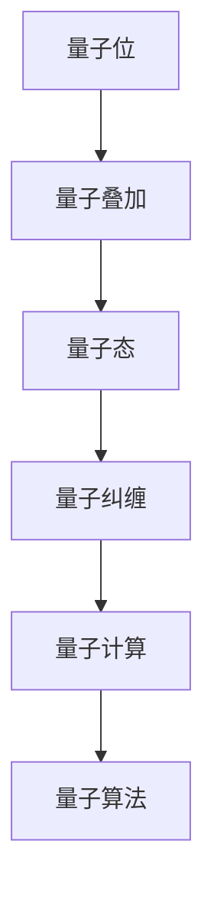

                 

### 引言：量子计算与药物研发概述

#### 背景介绍

在新药研发过程中，药物分子的模拟、筛选和设计是至关重要的步骤。传统计算方法在处理大规模分子模拟时，往往面临着计算资源不足、计算时间过长等问题。而量子计算作为一种新型计算模式，具有并行处理能力强、计算速度快等优势，被认为有潜力解决这些问题。

量子计算的基本原理与经典计算不同。它利用量子位（qubit）来表示和处理信息，能够实现并行计算和快速因子分解等任务。近年来，随着量子技术的快速发展，量子计算机的构建和运行已经取得了重要突破。因此，研究量子计算在药物研发中的应用具有重要的理论和实践意义。

#### 量子计算的核心概念与联系

量子计算的核心概念包括量子位、量子叠加、量子纠缠等。这些概念构成了量子计算的基本框架，它们之间的关系可以用以下Mermaid流程图表示：

在这个框架中，量子位是量子计算的基础单元，它能够实现信息的高速传递和处理。量子叠加使得一个量子位可以同时处于0和1的状态，从而实现并行计算。量子纠缠则进一步增强了量子计算的能力，使得多个量子位之间的状态可以相互关联，从而实现更复杂的计算。

#### 联系实际：药物研发中的问题与需求

在新药研发过程中，药物分子的模拟、筛选和设计需要处理大量的数据和信息。传统计算方法往往难以应对这些复杂的计算任务，导致药物研发的周期过长、成本过高。而量子计算的优势在于能够高效地处理大规模数据，从而加速药物研发过程。

例如，在药物分子模拟中，需要计算分子间的相互作用力和能量分布。这些计算任务涉及到大量的矩阵运算和数值模拟，传统计算方法往往需要数天甚至数周的时间。而量子计算可以利用其并行处理能力，在短时间内完成这些计算任务。

#### 小结

本章首先介绍了量子计算的基本概念和原理，包括量子位、量子叠加、量子纠缠等。然后通过Mermaid流程图展示了这些概念之间的关系，并联系实际讨论了量子计算在药物研发中的应用前景。下一章将深入探讨量子计算在药物研发中的具体应用，包括药物分子模拟、药物筛选和设计等方面的内容。

### 文章关键词

- 量子计算
- 药物研发
- 并行计算
- 量子位
- 量子叠加
- 量子纠缠
- 药物分子模拟
- 药物筛选
- 药物设计

### 文章摘要

本文主要介绍了量子计算在药物研发中的应用。首先，概述了量子计算的基本概念和原理，包括量子位、量子叠加、量子纠缠等。然后，通过Mermaid流程图展示了这些概念之间的关系，并探讨了量子计算在药物研发中的潜在优势。最后，具体分析了量子计算在药物分子模拟、药物筛选和设计等方面的应用，为量子计算在药物研发领域的未来发展提供了启示。文章关键词包括量子计算、药物研发、并行计算、量子位、量子叠加、量子纠缠、药物分子模拟、药物筛选、药物设计。

