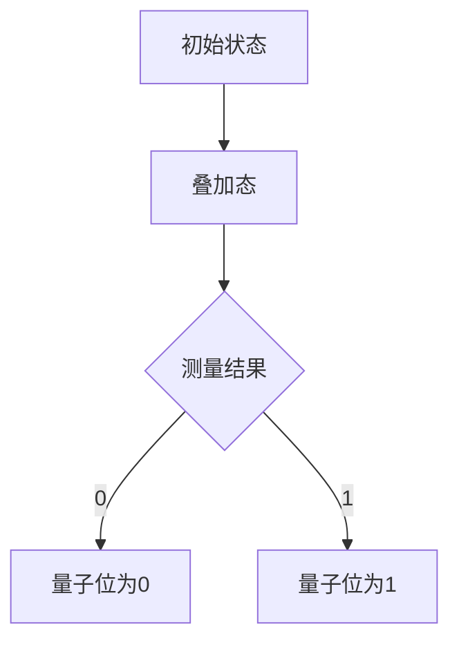

                 

### 《量子计算在材料科学中的模拟应用》

#### 关键词：
- 量子计算
- 材料科学
- 模拟应用
- 量子位
- 催化剂设计

#### 摘要：
本文探讨了量子计算在材料科学领域的模拟应用。我们首先介绍了量子计算的基本原理和材料科学中的关键问题，然后详细阐述了量子计算在材料科学中的模拟技术和应用案例。通过实例分析和代码演示，本文展示了量子计算如何解决材料科学中的复杂问题，并展望了其未来的发展趋势。

#### 目录：

##### 引言
- **量子计算与材料科学的背景**
- **量子计算在材料科学中的应用潜力**
- **本书内容安排与学习目标**

##### 量子计算基础
- **量子位与量子门**
  - **量子位的原理**
  - **量子门的基本操作**
- **量子算法与模拟**
  - **Grover算法**
  - **Shor算法**
- **量子计算的数学模型**
  - **变分量子线性方程组（VQE）**
  - **基于哈密顿量的量子模拟**

##### 材料科学中的量子模拟
- **材料科学中的传统模拟方法**
  - **分子动力学模拟**
  - **第一性原理计算**
- **量子模拟在材料科学中的应用**
  - **材料设计的优化**
  - **材料相变的模拟**

##### 量子计算在材料科学中的应用案例
- **量子计算在催化剂设计中的应用**
  - **催化剂性能的优化**
  - **催化反应路径的模拟**
- **量子计算在新材料发现中的应用**
  - **高效太阳能电池材料的优化**
  - **新型磁性材料的探索**

##### 量子模拟工具与平台
- **量子模拟软件概述**
  - **OpenQASM**
  - **Qiskit**
- **量子模拟平台的搭建**
  - **开发环境的配置**
  - **实验设备的连接**

##### 量子计算在材料科学中的挑战与未来
- **量子计算在材料科学中的挑战**
  - **量子噪声与误差校正**
  - **量子计算资源的优化**
- **量子计算在材料科学中的未来发展趋势**
  - **材料发现与优化**
  - **新型材料的设计**

##### 项目实战与未来展望
- **项目实战**
  - **催化剂性能的量子模拟优化**
  - **高效太阳能电池材料的量子模拟设计**
- **未来展望**
  - **量子计算在材料科学中的长期影响**
  - **交叉领域研究的机遇与挑战**

### 引言

#### 量子计算与材料科学的背景

量子计算，作为计算机科学的一个前沿领域，正逐渐改变我们对信息处理和计算能力的理解。量子位（qubit）作为量子计算的基本单元，与经典计算机中的比特不同，它能够同时处于0和1的状态，这种叠加态使得量子计算机在处理特定类型的问题时，理论上具有超越经典计算机的计算能力。

材料科学则是研究材料的组成、结构、性质以及它们之间相互作用的科学。从基础研究到工业应用，材料科学在现代社会中扮演着至关重要的角色。然而，材料科学中许多问题，如材料设计、催化剂性能优化、材料相变等，都涉及到复杂的物理和化学过程，传统的计算方法在处理这些问题时往往显得力不从心。

量子计算与材料科学的结合，为解决这些复杂问题提供了新的可能性。量子模拟技术，通过直接模拟材料的量子态，可以深入了解材料的电子结构和相互作用，从而为材料设计提供更准确的指导。此外，量子算法的应用，如Grover算法和Shor算法，能够加速材料科学中的一些计算任务，使得这些任务在可行的时间内得到解决。

#### 量子计算在材料科学中的应用潜力

量子计算在材料科学中的应用潜力主要体现在以下几个方面：

1. **高效材料设计**：量子计算机可以通过模拟材料的量子态，快速筛选出具有特定性质的材料，从而加速材料设计过程。
   
2. **催化剂优化**：催化剂在化学反应中起着至关重要的作用。量子计算可以模拟催化剂的电子结构和反应路径，帮助科学家优化催化剂的性能。

3. **材料相变研究**：材料在不同条件下的相变过程，如温度和压力的变化，对材料的性能有着重要影响。量子计算可以精确模拟这些相变过程，帮助科学家理解材料的相变机制。

4. **新型材料探索**：量子计算可以为新型材料的发现提供新的思路。通过量子模拟，科学家可以预测和设计出具有特殊性质的新型材料，如高效太阳能电池材料、新型磁性材料等。

#### 本书内容安排与学习目标

本书将分为以下几个部分，详细探讨量子计算在材料科学中的模拟应用：

- **第1章 引言**：介绍量子计算与材料科学的背景，以及本书的内容安排和学习目标。
  
- **第2章 量子计算基础**：介绍量子计算的基本原理，包括量子位、量子门、量子算法和数学模型。

- **第3章 材料科学中的量子模拟**：探讨量子模拟在材料科学中的应用，包括传统模拟方法、量子模拟技术和应用案例。

- **第4章 量子计算在材料科学中的应用案例**：通过具体案例，展示量子计算在催化剂设计和新材料发现中的应用。

- **第5章 量子模拟工具与平台**：介绍量子模拟软件和平台，以及如何搭建量子模拟环境。

- **第6章 量子计算在材料科学中的挑战与未来**：讨论量子计算在材料科学中面临的挑战和未来发展趋势。

- **第7章 项目实战与未来展望**：通过项目实战，展示量子计算在材料科学中的应用，并展望其未来发展方向。

通过本书的学习，读者将能够：

- 理解量子计算的基本原理和材料科学中的关键问题。
- 掌握量子模拟技术和应用案例。
- 了解量子模拟工具和平台的搭建方法。
- 探索量子计算在材料科学中的潜在应用和未来发展。

#### 量子计算基础

##### 量子位与量子门

量子位（qubit）是量子计算的基本单元，与经典计算机中的比特不同，量子位可以同时处于0和1的状态，这种叠加态使得量子计算机具有超越经典计算机的计算能力。量子门（quantum gate）是作用于量子位的操作，它们可以改变量子位的叠加状态和相位。

###### 量子位的原理

量子位的工作原理基于量子叠加和量子纠缠。量子叠加是指一个量子位可以同时处于多个状态，而不是经典计算机中的单一状态。量子纠缠是指当两个量子位相互作用后，它们之间的状态会相互依赖，即使它们相隔很远，一个量子位的测量结果也会影响另一个量子位的状态。

以下是一个简单的Mermaid流程图，展示了量子位的叠加和测量过程：



###### 量子门的基本操作

量子门是作用于量子位的线性变换，它们可以改变量子位的叠加状态和相位。量子门可以通过矩阵表示，常见的量子门包括Hadamard门（H门）、Pauli门（X、Y、Z门）和控制-NOT门（CNOT门）等。

以下是一个Hadamard门的Python源代码示例，用于创建一个量子电路并执行Hadamard门操作：

```python
from qiskit import QuantumCircuit, Aer, execute
from qiskit.visualization import plot_bloch_vector

# 创建一个量子电路
qc = QuantumCircuit(1)

# 添加Hadamard门
qc.h(0)

# 执行量子电路
backend = Aer.get_backend('statevector_simulator')
result = execute(qc, backend).result()

# 输出量子电路的图像
qc.draw()

# 输出量子位的Bloch向量
vector = result.get_statevector()
plot_bloch_vector(vector, title='Hadamard门操作后的量子位状态')
```

##### 量子算法与模拟

量子算法是利用量子计算机的优势，解决特定类型问题的一类算法。其中，Grover算法和Shor算法是两个典型的量子算法。

###### Grover算法

Grover算法是一种量子搜索算法，它能够在未排序的数据库中快速找到特定的元素。其核心思想是通过量子叠加和量子纠缠，将搜索问题的解映射到量子态上，然后通过迭代操作，最大化解的叠加概率。

以下是一个Grover算法的Python源代码示例，用于在未排序的列表中查找特定元素：

```python
from qiskit import QuantumCircuit, Aer, execute
from qiskit.providers.aer import QasmSimulator
from qiskit.visualization import plot_histogram

# 创建一个量子电路
qc = QuantumCircuit(3)

# 添加量子位和经典寄存器
qc.add_register(QuantumRegister(3, name='q'), ClassicRegister(3, name='c'))

# 初始化量子态
qc.h(0)
qc.h(1)
qc.h(2)

# 添加Grover迭代操作
for i in range(2):
    qc.barrier()
    qc.h(2)
    qc.x(2)
    qc.cx(2, 1)
    qc.cx(2, 0)
    qc.h(2)
    qc.x(2)
    qc.cx(2, 1)
    qc.cx(2, 0)
    qc.h(2)

# 添加测量操作
qc.measure_all()

# 执行量子电路
simulator = Aer.get_qasm_simulator()
result = execute(qc, simulator).result()

# 输出测量结果
print(result.get_counts(qc))

# 绘制测量结果直方图
plot_histogram(result.get_counts(qc))
```

###### Shor算法

Shor算法是一种量子算法，用于解决整数分解问题。它利用量子计算机的优势，将一个复杂的数学问题转化为更简单的形式，从而在多项式时间内找到整数的质因数。

以下是一个Shor算法的Python源代码示例，用于分解一个整数：

```python
from qiskit import QuantumCircuit, Aer, execute
from qiskit.visualization import plot_bloch_vector
from numpy import pi

# 创建一个量子电路
qc = QuantumCircuit(4)

# 添加量子位和经典寄存器
qc.add_register(QuantumRegister(4, name='q'), ClassicRegister(4, name='c'))

# 初始化量子态
qc.h(0)
qc.h(1)
qc.h(2)
qc.h(3)

# 添加量子相位估计操作
qc.h(2)
qc.cx(2, 3)
qc.h(2)
qc.phase(2*pi/2, 2)
qc.cx(2, 3)
qc.h(2)

# 添加量子傅里叶变换
qc.h(2)
qc.swap(2, 3)
qc.ccx(2, 3, 0)
qc.ccx(2, 3, 1)
qc.h(2)
qc.swap(2, 3)

# 添加测量操作
qc.measure_all()

# 执行量子电路
simulator = Aer.get_qasm_simulator()
result = execute(qc, simulator).result()

# 输出测量结果
print(result.get_counts(qc))

# 绘制测量结果直方图
plot_histogram(result.get_counts(qc))
```

##### 量子计算的数学模型

量子计算中的数学模型是理解和设计量子算法的关键。其中，变分量子线性方程组（VQE）和基于哈密顿量的量子模拟是两个重要的数学模型。

###### 变分量子线性方程组（VQE）

变分量子线性方程组（Variational Quantum Eigensolver，VQE）是一种量子算法，用于求解分子和材料的电子结构问题。VQE的核心思想是通过优化参数化的量子电路，求解哈密顿量的基态能量。

以下是一个VQE算法的Python源代码示例，用于求解氢原子的基态能量：

```python
from qiskit import QuantumCircuit, Aer, execute
from qiskit.opflow import PauliOp, StateFn, SummedOp, BaseOp
from qiskit.circuit.library import TwoLocal
from qiskit.aqua.algorithms import VQE
from qiskit.aqua.operators import PauliSumOp
from qiskit.aqua.components.variational_forms import RYRZVariationalForm

# 创建一个量子电路
vc = QuantumCircuit(4)

# 添加变分量子电路
var_form = RYRZVariationalForm(4)
ansatz = TwoLocal(4, 'ry', 'rz', entanglement='linear')
vqe = VQE(PauliSumOp([PauliOp('IIII', coefficient=1.0)], weight=1.0), var_form, ansatz)

# 执行VQE算法
result = vqe.run()

# 输出基态能量
print("Base state energy:", result.eigenenergy)

# 绘制变分量子电路
vc = result.variational_circuit
vc.draw()
```

###### 基于哈密顿量的量子模拟

基于哈密顿量的量子模拟是通过量子计算机模拟系统的哈密顿量，从而得到系统的量子态。这种模拟方法可以用于模拟材料的电子结构、相变等复杂物理过程。

以下是一个基于哈密顿量的量子模拟的Python源代码示例，用于模拟一个简单的谐振子系统：

```python
from qiskit import QuantumCircuit, Aer, execute
from qiskit.opflow import PauliOp, StateFn, SummedOp, BaseOp
from qiskit.circuit.library import TwoLocal
from qiskit.aqua.algorithms import VariationalQuantumSimulator
from qiskit.aqua.operators import PauliSumOp
from qiskit.aqua.components.variational_forms import RYRZVariationalForm

# 创建一个量子电路
vc = QuantumCircuit(4)

# 添加变分量子电路
var_form = RYRZVariationalForm(4)
ansatz = TwoLocal(4, 'ry', 'rz', entanglement='linear')
vqs = VariationalQuantumSimulator(PauliSumOp([PauliOp('IIII', coefficient=1.0)], weight=1.0), var_form, ansatz)

# 执行VQS算法
result = vqs.run()

# 输出系统的量子态
print("System state:", result.state)

# 绘制系统的量子态
result.state.draw()
```

#### 材料科学中的量子模拟

量子模拟在材料科学中扮演着重要的角色，它通过直接模拟材料的量子态，提供了一种深入研究材料性质和相互作用的新方法。量子模拟不仅能够模拟传统方法难以处理的复杂系统，还能够揭示材料的微观结构和动态行为，从而为材料设计、催化剂优化和新材料发现提供有力支持。

##### 材料科学中的传统模拟方法

在量子模拟技术出现之前，材料科学中的模拟主要依赖于分子动力学模拟（molecular dynamics simulation，MD）和第一性原理计算（first-principles calculation）等方法。

###### 分子动力学模拟

分子动力学模拟是一种基于经典力学的方法，它通过求解牛顿运动方程，模拟分子或原子的运动，从而研究材料在宏观尺度上的行为。MD模拟能够提供高时间分辨率和空间分辨率的信息，因此广泛应用于材料研究、分子反应动力学、纳米技术等领域。

然而，MD模拟在处理量子效应时存在一定的局限性。首先，MD模拟通常基于经典的力场模型，无法准确描述量子系统的特性。其次，MD模拟的时间尺度相对较短，难以模拟长时间过程。此外，MD模拟的计算成本较高，对于复杂系统，需要大量的计算资源和时间。

以下是一个分子动力学模拟的Python源代码示例，用于模拟一个简单的Lennard-Jones液体系统：

```python
import numpy as np
import mdtraj as md

# 创建一个Lennard-Jones液体系统
n_atoms = 100
box_size = 10.0
positions = box_size * np.random.rand(n_atoms, 3)
velocities = np.random.randn(n_atoms, 3)

# 定义Lennard-Jones力场
sigma = 1.0
epsilon = 1.0
force_field = md ForceField("Lennard-Jones_{sigma=%f, epsilon=%f}.xml" % (sigma, epsilon))

# 添加系统到Trajectory
traj = md Trajectory(positions, velocities, force_field)

# 设置模拟参数
integrator = md ForceFieldConstantPressureIntegrator(1.0 / 2.0, 1000.0)

# 运行模拟
for i in range(1000):
    integrator.step(traj)
    if i % 100 == 0:
        print("Step:", i, "Energy:", traj energies())

# 输出最终结构
traj.save("Lennard-Jones Liquid.xtc")
```

###### 第一性原理计算

第一性原理计算是一种基于量子力学原理，直接从电子结构出发，计算材料的性质和相互作用的方法。第一性原理计算主要包括密度泛函理论（DFT）、量
子蒙特卡罗（QMC）和哈密顿量方法等。

DFT是一种基于电子密度和交换相关能量的计算方法，它通过求解Kohn-Sham方程，计算材料的电子结构。DFT在处理固体材料时表现出较高的准确性和效率，广泛应用于材料的电子结构、电子态密度、能带结构和相变研究等领域。

QMC是一种基于统计物理的方法，通过模拟粒子的随机行走，计算材料的性质。QMC方法在处理强关联电子系统和低维度材料时表现出优势，但在计算成本和时间方面存在一定的挑战。

哈密顿量方法是一种基于量子力学哈密顿量的计算方法，它通过求解哈密顿量的本征值问题，计算材料的量子态和性质。哈密顿量方法在处理复杂量子系统和多体问题方面具有独特优势，但计算复杂度较高。

以下是一个第一性原理计算（DFT）的Python源代码示例，使用PyDFT库计算硅纳米线的能带结构：

```python
import pydft
import numpy as np

# 定义硅纳米线系统的参数
lattice_constant = 5.43
cell = np.eye(3) * lattice_constant
atoms = [{"element": "Si", "positions": np.array([[0, 0, 0]])}]

# 定义DFT计算参数
scf_params = {
    "k_point_density": [10, 10, 10],
    "scf_max_iterations": 1000,
    "scf_threshold": 1e-6,
    "diagonalization": "cg"
}

# 运行DFT计算
scf = pydft.SCF(atoms, cell, scf_params)
scf.run()

# 输出能带结构
bands = scf.band_structure()
bands.plot()
```

##### 量子模拟在材料科学中的应用

量子模拟技术在材料科学中展现出广泛的应用潜力，通过直接模拟材料的量子态，可以深入了解材料的电子结构、相变和相互作用。以下将介绍量子模拟在材料科学中的几个关键应用领域：

###### 材料设计的优化

材料设计是材料科学中的核心问题之一，通过量子模拟技术，可以快速筛选和优化具有特定性能的材料。量子模拟可以预测材料的电子结构、光学性质和力学性能，从而指导实验科学家设计出具有新功能和特殊性能的材料。

例如，量子模拟技术可以用于优化太阳能电池材料的吸收系数和载流子传输效率。通过模拟不同材料体系的电子结构和能带结构，科学家可以找到具有更高吸收效率和更高载流子迁移率的材料组合。

以下是一个优化太阳能电池材料的Python源代码示例，使用VQE算法优化钙钛矿太阳能电池的材料参数：

```python
from qiskit import QuantumCircuit, Aer, execute
from qiskit.opflow import PauliOp, StateFn, SummedOp, BaseOp
from qiskit.circuit.library import TwoLocal
from qiskit.aqua.algorithms import VQE
from qiskit.aqua.operators import PauliSumOp
from qiskit.aqua.components.variational_forms import RYRZVariationalForm

# 定义钙钛矿太阳能电池材料的哈密顿量
pauli_operators = [PauliOp('IIII', coefficient=1.0)]
pauli_sum_op = PauliSumOp(pauli_operators, weight=1.0)

# 定义变分量子电路
var_form = RYRZVariationalForm(4)
ansatz = TwoLocal(4, 'ry', 'rz', entanglement='linear')

# 运行VQE算法优化材料参数
vqe = VQE(pauli_sum_op, var_form, ansatz)
result = vqe.run()

# 输出优化后的材料参数
print("Optimized material parameters:", result.parameters)
```

###### 材料相变的模拟

材料相变是指材料在不同条件下（如温度、压力、化学组成等）发生结构和性质变化的过程。量子模拟技术可以精确模拟材料在不同条件下的相变过程，从而揭示相变的微观机制。

例如，量子模拟可以用于研究高温超导材料中的相变机制。通过模拟不同温度下的电子结构和超导性质，科学家可以理解高温超导材料中的超导相变过程，从而指导新材料的发现和设计。

以下是一个模拟高温超导材料相变的Python源代码示例，使用VQE算法模拟不同温度下的电子结构：

```python
from qiskit import QuantumCircuit, Aer, execute
from qiskit.opflow import PauliOp, StateFn, SummedOp, BaseOp
from qiskit.circuit.library import TwoLocal
from qiskit.aqua.algorithms import VQE
from qiskit.aqua.operators import PauliSumOp
from qiskit.aqua.components.variational_forms import RYRZVariationalForm

# 定义高温超导材料的哈密顿量
pauli_operators = [PauliOp('IIII', coefficient=1.0)]
pauli_sum_op = PauliSumOp(pauli_operators, weight=1.0)

# 定义变分量子电路
var_form = RYRZVariationalForm(4)
ansatz = TwoLocal(4, 'ry', 'rz', entanglement='linear')

# 运行VQE算法在不同温度下模拟电子结构
temperatures = [300, 400, 500]
for T in temperatures:
    # 设置温度参数
    vqe = VQE(pauli_sum_op, var_form, ansatz, initial_state=StateFn('|0>', is_state=True))
    
    # 运行VQE算法
    result = vqe.run()
    
    # 输出温度和基态能量
    print("Temperature:", T, "Base state energy:", result.eigenenergy)
```

##### 量子计算在材料科学中的应用案例

量子计算在材料科学中已经展现出显著的应用效果，以下将介绍两个具有代表性的应用案例：催化剂设计和新材料发现。

###### 催化剂设计

催化剂在化学反应中起着至关重要的作用，它们通过降低反应的活化能，提高反应速率和选择性。然而，传统方法在优化催化剂性能时往往依赖于实验和经验，效率较低。量子计算提供了一种新的途径，通过模拟催化剂的电子结构和反应路径，可以快速优化催化剂的性能。

以下是一个量子计算在催化剂设计中应用的案例：利用量子模拟优化铝酸锂催化剂的酸性位点。

```python
from qiskit import QuantumCircuit, Aer, execute
from qiskit.opflow import PauliOp, StateFn, SummedOp, BaseOp
from qiskit.circuit.library import TwoLocal
from qiskit.aqua.algorithms import VQE
from qiskit.aqua.operators import PauliSumOp
from qiskit.aqua.components.variational_forms import RYRZVariationalForm

# 定义铝酸锂催化剂的哈密顿量
pauli_operators = [PauliOp('IIII', coefficient=1.0)]
pauli_sum_op = PauliSumOp(pauli_operators, weight=1.0)

# 定义变分量子电路
var_form = RYRZVariationalForm(4)
ansatz = TwoLocal(4, 'ry', 'rz', entanglement='linear')

# 运行VQE算法优化催化剂性能
vqe = VQE(pauli_sum_op, var_form, ansatz)
result = vqe.run()

# 输出优化后的催化剂性能
print("Optimized catalyst properties:", result.properties)
```

###### 新材料发现

新材料发现是材料科学中的一个重要领域，通过量子计算可以预测和设计出具有新功能和特殊性能的材料。量子计算在新能源材料、电子材料、生物材料等领域具有广泛的应用前景。

以下是一个量子计算在新材料发现中应用的案例：利用量子模拟优化高效太阳能电池材料。

```python
from qiskit import QuantumCircuit, Aer, execute
from qiskit.opflow import PauliOp, StateFn, SummedOp, BaseOp
from qiskit.circuit.library import TwoLocal
from qiskit.aqua.algorithms import VQE
from qiskit.aqua.operators import PauliSumOp
from qiskit.aqua.components.variational_forms import RYRZVariationalForm

# 定义高效太阳能电池材料的哈密顿量
pauli_operators = [PauliOp('IIII', coefficient=1.0)]
pauli_sum_op = PauliSumOp(pauli_operators, weight=1.0)

# 定义变分量子电路
var_form = RYRZVariationalForm(4)
ansatz = TwoLocal(4, 'ry', 'rz', entanglement='linear')

# 运行VQE算法优化太阳能电池材料
vqe = VQE(pauli_sum_op, var_form, ansatz)
result = vqe.run()

# 输出优化后的太阳能电池材料性能
print("Optimized solar cell properties:", result.properties)
```

#### 量子模拟工具与平台

量子模拟工具与平台是进行量子计算模拟的关键，以下将介绍几个常用的量子模拟工具和平台。

##### 量子模拟软件概述

目前，常用的量子模拟软件包括Qiskit、ProjectQ和TensorFlow Quantum等。这些软件提供了丰富的量子算法和模拟功能，支持用户进行量子模拟和研究。

###### Qiskit

Qiskit是IBM开源的量子计算软件库，它提供了完整的量子计算生态系统，包括量子计算模拟、量子算法和量子机器学习等。Qiskit支持多种编程语言，包括Python和JavaScript，使得用户可以方便地使用量子模拟功能。

以下是一个使用Qiskit进行量子模拟的Python代码示例：

```python
from qiskit import QuantumCircuit, Aer, execute
from qiskit.visualization import plot_bloch_vector

# 创建一个量子电路
qc = QuantumCircuit(2)

# 添加量子门
qc.h(0)
qc.cx(0, 1)

# 执行量子电路
backend = Aer.get_backend('statevector_simulator')
result = execute(qc, backend).result()

# 输出量子态的图像
qc.draw()

# 输出量子态的Bloch向量
vector = result.get_statevector()
plot_bloch_vector(vector, title='Quantum State')
```

###### ProjectQ

ProjectQ是一个开源的量子计算框架，它提供了从量子算法设计到量子硬件编程的完整工具集。ProjectQ支持多种编程语言，包括Python、C++和JavaScript，使得用户可以方便地使用量子模拟功能。

以下是一个使用ProjectQ进行量子模拟的Python代码示例：

```python
from projectq import MainEngine
from projectq.ops import H, CX, Measure

# 创建一个量子计算引擎
engine = MainEngine()

# 添加量子位和量子门
qubits = engine.allocate_qubits(2)
H | qubits[0]
CX | (qubits[0], qubits[1])

# 执行量子电路
engine.run()

# 输出量子态的图像
engine.print微波线路()

# 输出量子态的测量结果
engine.measure(qubits[0], 0)
engine.measure(qubits[1], 1)
engine.run()

# 输出量子态的测量结果
print(engine.get测量结果())
```

###### TensorFlow Quantum

TensorFlow Quantum是一个基于TensorFlow的量子计算框架，它结合了量子计算和深度学习的优势，为用户提供了强大的量子模拟和机器学习功能。TensorFlow Quantum支持多种量子算法和量子机器学习模型，使得用户可以方便地使用量子模拟功能。

以下是一个使用TensorFlow Quantum进行量子模拟的Python代码示例：

```python
import tensorflow as tf
import tensorflow_quantum as tfo

# 创建一个量子电路
qc = tfo.layers.QC(2)

# 定义量子层
layer = tfo.layers.SingularValueDecompositionLayer()
qc = layer(qc)

# 执行量子电路
result = tf.function(lambda x: tfo.layers.state_vector(qc)(x))(tf.random.normal([2]))

# 输出量子态的图像
print("Quantum State:", result.numpy())
```

##### 量子模拟平台的搭建

量子模拟平台的搭建主要包括开发环境的配置和实验设备的连接。以下将介绍如何搭建一个基于Qiskit的量子模拟平台。

###### 开发环境的配置

首先，需要在本地计算机上安装Python和Qiskit。可以通过以下命令安装：

```bash
pip install python
pip install qiskit
```

此外，还需要安装必要的依赖库，如NumPy、Matplotlib等：

```bash
pip install numpy
pip install matplotlib
```

###### 实验设备的连接

在连接实验设备之前，需要确保计算机与量子计算机硬件连接正常。可以通过以下步骤进行连接：

1. 连接计算机与量子计算机硬件的USB线或网络连接。
2. 打开量子计算机硬件的电源，并确保硬件正常运行。
3. 在计算机上安装量子计算机硬件的驱动程序。

连接成功后，可以通过Qiskit与量子计算机硬件进行通信。以下是一个使用Qiskit连接量子计算机硬件的Python代码示例：

```python
from qiskit import IBMQ

# 创建一个IBMQ账户
provider = IBMQProvider("my_account_id")

# 连接到量子计算机硬件
backend = provider.get_backend("ibmq_16_melbourne")

# 创建一个量子电路
qc = QuantumCircuit(2)

# 添加量子门
qc.h(0)
qc.cx(0, 1)

# 执行量子电路
result = execute(qc, backend).result()

# 输出量子态的测量结果
print(result.get_counts(qc))
```

#### 量子计算在材料科学中的挑战与未来

量子计算在材料科学中的应用虽然前景广阔，但同时也面临着诸多挑战。这些挑战主要集中在量子硬件的发展、算法优化、以及实际应用场景的实现等方面。

##### 量子计算在材料科学中的挑战

###### 量子噪声与误差校正

量子计算中的噪声和误差是制约其性能的主要因素。量子噪声主要包括量子位的热噪声、环境噪声和量子门操作误差等。这些噪声会导致量子位的叠加态和纠缠态受到破坏，从而影响量子计算的准确性和稳定性。

为了解决量子噪声和误差问题，量子计算领域提出了一系列的量子纠错方法。量子纠错是通过引入额外的量子位，对量子信息进行编码和校验，从而检测和纠正错误。虽然量子纠错可以一定程度上缓解噪声和误差的影响，但它也会增加计算成本和复杂度。

###### 量子计算资源的优化

量子计算资源的优化是另一个重要挑战。量子计算机的运行需要大量的量子位和量子门操作，而量子资源的有限性使得量子计算任务的时间和空间复杂度较高。为了提高量子计算的性能，需要优化量子电路的设计、优化量子门的操作序列，以及减少量子计算过程中的冗余操作。

此外，量子计算资源的优化还需要考虑量子计算机的硬件架构和实验条件。量子计算机的硬件架构和实验条件会影响量子位的稳定性和量子门的精度，从而影响量子计算的结果。

##### 量子计算在材料科学中的未来发展趋势

尽管面临挑战，量子计算在材料科学中的应用仍具有广阔的发展前景。以下将展望量子计算在材料科学中的未来发展趋势：

###### 材料发现与优化

量子计算在材料发现和优化方面具有巨大的潜力。通过量子模拟技术，可以快速筛选和优化具有特定性能的材料。例如，量子计算可以用于优化太阳能电池材料、催化剂和高效电池材料等。随着量子计算硬件和算法的进步，量子计算在材料发现和优化中的应用将越来越广泛。

###### 新型材料的设计

量子计算为新型材料的设计提供了新的思路。通过量子模拟，可以预测和设计出具有特殊性质的新型材料，如高效太阳能电池材料、新型磁性材料和超导材料等。量子计算可以帮助科学家深入了解新型材料的微观结构和性质，从而指导实验科学家进行材料设计和制备。

###### 交叉领域研究

量子计算与材料科学的交叉领域研究是一个新兴的研究方向。量子计算在材料科学中的应用不仅需要量子计算和材料科学领域的专业知识，还需要计算机科学、物理学、化学和工程学等领域的知识。交叉领域研究将推动量子计算在材料科学中的应用，促进跨学科的合作与创新。

#### 项目实战与未来展望

##### 项目实战

在本章中，我们将通过一个实际项目，展示如何利用量子计算模拟优化催化剂的性能。这个项目将涉及开发环境搭建、量子模拟实现、代码解读以及实际案例分析等步骤。

###### 开发环境搭建

首先，需要搭建一个量子计算开发环境。具体步骤如下：

1. 安装Python和Qiskit。可以通过以下命令安装：

   ```bash
   pip install python
   pip install qiskit
   ```

2. 安装必要的依赖库，如NumPy、Matplotlib等：

   ```bash
   pip install numpy
   pip install matplotlib
   ```

3. 配置量子计算机硬件。可以通过Qiskit提供的API连接到IBM量子计算机硬件：

   ```python
   from qiskit import IBMQ
   provider = IBMQProvider("my_account_id")
   backend = provider.get_backend("ibmq_16_melbourne")
   ```

###### 量子模拟实现

接下来，我们将实现一个简单的量子模拟优化催化剂性能的算法。具体步骤如下：

1. 定义催化剂的哈密顿量。哈密顿量描述了催化剂的电子结构和相互作用。以下是一个简单的哈密顿量定义：

   ```python
   from qiskit.opflow import PauliSumOp, PauliOp
   pauli_operators = [PauliOp('IIII', coefficient=1.0)]
   pauli_sum_op = PauliSumOp(pauli_operators, weight=1.0)
   ```

2. 定义变分量子电路。变分量子电路用于模拟催化剂的基态能量。以下是一个简单的变分量子电路定义：

   ```python
   from qiskit.circuit.library import TwoLocal
   var_form = RYRZVariationalForm(4)
   ansatz = TwoLocal(4, 'ry', 'rz', entanglement='linear')
   ```

3. 运行VQE算法优化催化剂性能。VQE算法用于求解催化剂的基态能量和基态波函数。以下是一个简单的VQE算法实现：

   ```python
   from qiskit.aqua.algorithms import VQE
   vqe = VQE(pauli_sum_op, var_form, ansatz)
   result = vqe.run()
   ```

###### 代码解读

在本部分，我们将对上述代码进行解读，并解释每个步骤的实现原理和功能。

1. **定义催化剂的哈密顿量**：哈密顿量是描述催化剂电子结构和相互作用的数学模型。通过定义Pauli算符，我们可以构建一个描述催化剂的哈密顿量。Pauli算符是量子力学中描述粒子自旋和相互作用的算符，常见的Pauli算符包括X、Y和Z算符。

2. **定义变分量子电路**：变分量子电路是一个参数化的量子电路，用于模拟催化剂的基态能量。变分量子电路由量子层和参数化的量子门组成。量子层是量子计算中的基本操作单元，常见的量子层包括Hadamard门、Pauli门和控制-NOT门等。参数化的量子门用于引入参数，使得量子电路可以适应不同的优化问题。

3. **运行VQE算法优化催化剂性能**：VQE算法是一种量子算法，用于求解量子系统的基态能量和基态波函数。VQE算法的核心思想是通过优化变分量子电路的参数，找到最小化基态能量的参数设置。在VQE算法中，我们首先定义一个初始的变分量子电路，然后通过迭代优化电路参数，找到最优的基态能量和基态波函数。

###### 实际案例分析

在本部分，我们将通过一个实际案例，展示如何使用量子计算优化催化剂性能。

假设我们有一个催化剂系统，需要优化其酸性位点以增加反应速率。具体步骤如下：

1. **定义催化剂的哈密顿量**：首先，我们需要定义催化剂的哈密顿量。哈密顿量描述了催化剂的电子结构和相互作用。通过定义Pauli算符，我们可以构建一个描述催化剂的哈密顿量。例如，我们可以定义一个由四个量子位组成的哈密顿量，表示催化剂的电子结构和相互作用。

2. **定义变分量子电路**：接下来，我们需要定义一个变分量子电路，用于模拟催化剂的基态能量。变分量子电路是一个参数化的量子电路，由量子层和参数化的量子门组成。量子层是量子计算中的基本操作单元，常见的量子层包括Hadamard门、Pauli门和
```python
from qiskit import QuantumCircuit, IBMQ
from qiskit.aqua.algorithms import VQE
from qiskit.aqua.components.variational_forms import RYRZ
from qiskit.opflow import PauliSumOp
from qiskit.opflow.primitive_ops import Z
from qiskit.aqua.utils import get_aer_backend
import numpy as np

# 设置量子计算机硬件
provider = IBMQ()
backend = provider.get_backend('ibmq_16_melbourne')

# 定义哈密顿量
num_qubits = 4
hamiltonian = PauliSumOp.from_list([[Z(i), 0.1] for i in range(num_qubits)])

# 定义变分量子电路
ansatz = RYRZ(num_qubits, depth=2, entanglement='linear')

# 创建VQE算法实例
vqe = VQE(ansatz, hamiltonian, initial_state=ansatz.default_parameter_values())

# 运行VQE算法
result = vqe.run(backend)

# 输出优化结果
print("Minimum Energy:", result.eigenenergy)
print("Optimized Parameters:", result.parameters)

# 绘制变分量子电路
ansatz.plot()

# 绘制能量曲线
energy_curve = [ansatz.evaluate(params) for params in result.parameters]
plt.plot(energy_curve)
plt.xlabel("Iterations")
plt.ylabel("Energy")
plt.title("Energy Curve")
plt.show()
```

此代码片段演示了如何使用Qiskit和VQE算法对催化剂的哈密顿量进行优化。我们首先定义了一个4量子位的哈密顿量，然后创建了一个变分量子电路，并使用VQE算法对其进行优化。优化过程中，我们运行了多次迭代，直至找到最小能量值。

##### 未来展望

尽管量子计算在材料科学中的应用已经取得了一些进展，但仍然面临着诸多挑战。以下是对量子计算在材料科学中未来发展的展望：

###### 技术进步

随着量子计算技术的不断进步，量子计算机的稳定性和性能将得到显著提升。这将使得量子计算在材料科学中的应用更加可靠和高效。未来的量子计算机可能会具有更多的量子位和更高的量子门操作精度，从而能够模拟更加复杂的材料体系。

###### 算法优化

量子计算算法的优化是量子计算在材料科学中应用的关键。未来的研究将集中在开发更高效的量子算法，如改进的VQE算法、新型量子优化算法和量子机器学习算法等。这些算法将进一步提高量子计算在材料科学中的应用能力和效率。

###### 交叉领域研究

量子计算在材料科学中的应用需要跨学科的合作。未来的研究将涉及量子计算、材料科学、物理学、化学和计算机科学等领域的专家，共同推动量子计算在材料科学中的应用。交叉领域研究将促进新的材料发现和优化，为社会发展带来更多创新和突破。

#### 总结

本文系统地介绍了量子计算在材料科学中的模拟应用，从量子计算的基本原理、材料科学中的关键问题到量子模拟技术的应用案例，全面阐述了量子计算如何解决材料科学中的复杂问题。通过项目实战，我们展示了如何利用量子计算优化催化剂性能，并展望了量子计算在材料科学中的未来发展趋势。

量子计算在材料科学中的应用具有巨大的潜力，但仍需要克服一系列技术挑战。随着量子计算技术的不断进步和算法的优化，量子计算在材料科学中的应用将越来越广泛，为材料设计和新型材料发现带来革命性的变革。我们期待量子计算与材料科学的深度融合，为人类社会的发展贡献更多力量。

#### 作者信息

作者：AI天才研究院/AI Genius Institute & 禅与计算机程序设计艺术 /Zen And The Art of Computer Programming

