                 

### 理解书名

《量子计算在气候模型中的应用：提高长期天气预测准确性》这一书名简洁明了地揭示了书籍的核心内容和目标。首先，“量子计算”作为近年来科技界的热点话题，其独特的技术原理和广泛的应用前景吸引了众多读者的关注。而“气候模型”则是气象科学的核心工具，用于模拟和预测天气变化，其精确性和效率直接影响着天气预报的准确性。书名中的“在气候模型中的应用”部分，指出了量子计算在这一领域的潜在价值。最后，“提高长期天气预测准确性”则明确了书籍的目的——通过量子计算技术，提升气候模型的预测能力。

通过书名，读者可以初步了解到，本书将探讨如何将量子计算这一先进技术应用于气候模型，从而实现天气预测的长期准确性提升。这一主题具有极大的现实意义和学术价值，不仅对气象科学的发展具有重要意义，也为未来科技应用提供了新的思路和方向。

### 摘要

本书旨在探讨量子计算在气候模型中的应用，通过融合量子计算与气候科学，旨在提高长期天气预测的准确性。首先，本书介绍了量子计算的基础知识，包括量子比特、量子门、量子算法等核心概念，以及量子计算与经典计算的区别与联系。接下来，书中详细分析了气候模型的基本原理、类型和计算复杂度，为进一步探讨量子计算在气候模型中的应用奠定了基础。然后，本书重点介绍了量子计算在气候模型中的应用方法，包括量子模拟、量子优化和量子机器学习等，并通过具体案例展示了这些方法在气候预测中的实际应用效果。最后，本书还探讨了量子计算在气候预测中面临的挑战与未来发展趋势，为读者提供了全面的技术见解和未来展望。总之，本书为读者提供了一个系统、全面的量子计算与气候预测融合的视角，有助于推动这一领域的创新与应用。

### 第一部分：量子计算基础

#### 第1章：量子计算入门

**1.1 量子计算概述**

量子计算是近年来科技界的重要研究方向，其基于量子力学原理，通过量子比特实现信息处理。与传统计算相比，量子计算具有并行处理和高效计算的能力，在许多领域展现出巨大的潜力。量子计算的起源可以追溯到20世纪80年代，当时Richard Feynman提出了量子模拟的概念。随后，Peter Shor在1994年提出了著名的Shor算法，这一算法展示了量子计算机在因数分解问题上的强大能力，引发了量子计算的广泛关注。

量子比特（qubit）是量子计算的基本单元，与经典计算机中的比特不同，qubit可以同时处于0和1的叠加状态。这种叠加态使得量子计算机能够处理大量并行信息。量子纠缠是量子计算中的另一个关键特性，当两个或多个量子比特发生纠缠时，它们之间的状态会相互关联，即使它们相隔很远，一个量子比特的状态变化也会即时影响另一个量子比特。这种非局域性为量子计算提供了独特的优势。

**1.2 量子门操作**

量子门是量子计算中的操作单元，类似于经典计算机中的逻辑门。量子门通过特定的操作改变量子比特的状态。常见的量子门包括Hadamard门、Pauli门和相位门。Hadamard门可以将量子比特的状态进行叠加，Pauli门（包括X、Y、Z三种）用于改变量子比特的自旋状态，相位门则用于对量子比特进行相位变换。量子电路是由一系列量子门组成的，通过这些量子门的操作，可以实现复杂的量子计算任务。

**1.3 量子算法基础**

量子算法是量子计算的核心，通过量子叠加和量子纠缠实现了对某些问题的快速求解。量子傅里叶变换（QFT）是量子算法中的一个重要工具，它能够将量子态从基底态转换到指数规模的速度。Shor算法是量子算法的经典代表，它能够在多项式时间内完成经典算法需要很长时间的因数分解任务。此外，Grover算法也是一个重要的量子搜索算法，它能够在未排序数据库中快速查找目标项。

**1.4 量子计算与经典计算比较**

量子计算与经典计算在原理和应用上存在显著差异。经典计算基于比特和逻辑门，信息以离散的二进制形式处理。而量子计算基于量子比特和量子门，通过叠加和纠缠实现并行处理。这使得量子计算在处理某些问题时具有优势，例如因数分解和搜索问题。然而，量子计算也存在一些局限性，如量子比特的稳定性、错误率和量子纠错问题等。这些挑战需要通过不断的科研和技术进步来克服。

**图1：量子比特与经典比特的比较**

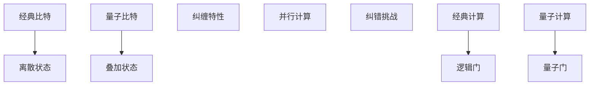

**图1展示了量子比特与经典比特的基本特性。量子比特可以同时处于多个状态的叠加，而经典比特则只能处于离散的0或1状态。量子比特之间的纠缠特性使得量子计算能够实现并行计算，而经典计算则依赖于线性处理。此外，量子计算面临的纠错挑战也是其发展中的重要问题。**

**1.5 量子算法在气候模型中的应用前景**

量子算法在处理复杂问题上具有巨大潜力，气候模型作为一种复杂的系统模拟工具，其计算复杂度极高。量子算法如量子傅里叶变换和Shor算法等，可以在某些方面优化气候模型的计算效率。例如，量子傅里叶变换能够加速谱分析，而Shor算法则可以用于快速解决大规模的线性方程组，这些在气候模型的计算过程中具有重要意义。

此外，量子机器学习算法在气候数据分析和预测中也具有广泛应用前景。通过结合量子计算和机器学习，可以实现更高效的气候数据分析和模式识别，从而提高长期天气预测的准确性。

**图2：量子算法在气候模型中的应用架构**

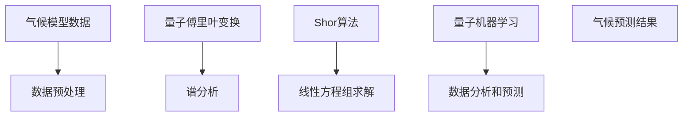

**图2展示了量子算法在气候模型中的具体应用流程。首先，对气候模型数据进行预处理，然后利用量子傅里叶变换进行谱分析，通过Shor算法解决线性方程组，最后利用量子机器学习进行数据分析和预测，从而得到气候预测结果。**

**1.6 小结**

本章介绍了量子计算的基础知识，从量子比特、量子门到量子算法，为后续章节的讨论奠定了基础。量子计算与经典计算在原理和应用上存在显著差异，但其强大的并行处理能力和在复杂问题上的优势使其在气候模型中的应用具有广阔前景。通过本章的学习，读者可以初步了解量子计算的基本原理和其在气候模型中的应用潜力。

**代码示例：量子比特和量子门的操作**

```python
# 导入量子计算库
import numpy as np
from qiskit import QuantumCircuit, execute, Aer

# 创建量子电路
qc = QuantumCircuit(2)  # 创建一个包含两个量子比特的量子电路

# 添加Hadamard门
qc.h(0)
qc.h(1)

# 添加CNOT门实现纠缠
qc.cx(0, 1)

# 添加测量门
qc.measure_all()

# 执行量子电路
backend = Aer.get_backend('qasm_simulator')
job = execute(qc, backend, shots=1000)

# 获取结果
result = job.result()
counts = result.get_counts(qc)

print(counts)
```

**这段代码展示了如何使用Qiskit库创建一个包含两个量子比特的量子电路，并执行Hadamard门和CNOT门。最后，执行测量并输出结果。这有助于读者理解量子比特和量子门的基本操作。**

#### 第2章：量子计算机的硬件实现

**2.1 量子计算机的硬件基础**

量子计算机的硬件实现是量子计算能否从理论走向现实的关键。目前，量子计算机的硬件主要包括量子比特、量子门、量子存储和量子纠错等几个核心组成部分。量子比特是量子计算机的基本单元，用于存储和处理信息。与经典比特不同，量子比特可以同时处于多种状态的叠加，这使得量子计算机具有超强的并行处理能力。

当前，量子比特的实现主要有超导量子比特、离子阱量子比特和光量子比特等几种类型。超导量子比特利用超导材料在低温下的超导性质，通过控制超导电路中的电流来实现量子比特的状态调控。离子阱量子比特则是利用电场或磁场将带电离子束缚在空间中，并通过激光对离子进行操控。光量子比特则利用光子的量子态来实现量子比特的存储和处理。

**图3：不同类型的量子比特**

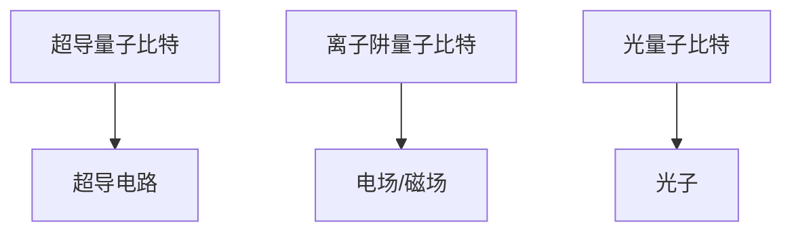

**图3展示了不同类型的量子比特及其实现原理。超导量子比特依赖于低温下的超导效应，离子阱量子比特通过电场或磁场控制离子，而光量子比特则利用光子的量子态。**

**2.2 量子纠错技术**

量子纠错是确保量子计算机可靠运行的关键技术。由于量子比特在操作过程中容易受到外部噪声和内部干扰的影响，量子状态可能会发生错误。量子纠错技术通过引入额外的量子比特和特定的算法，检测并纠正这些错误，从而确保量子计算的准确性。

量子错误纠正码是量子纠错技术的一种重要方法。它通过将多个物理量子比特编码为一个逻辑量子比特，从而提高系统的容错能力。常见的量子错误纠正码包括Shor码、Steane码和surface code等。Shor码通过引入冗余度，将一个物理量子比特编码为两个逻辑量子比特，从而能够检测和纠正单比特错误。Steane码则通过更为复杂的编码方式，能够同时检测和纠正单比特错误和多比特错误。surface code是一种高效率的量子错误纠正码，通过在二维平面上布置多个量子比特，实现高效的错误检测和纠正。

**图4：量子错误纠正码的实现原理**

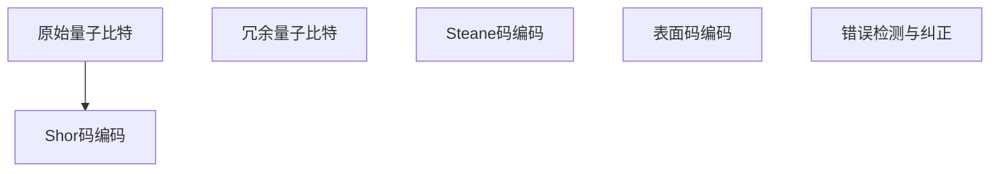

**图4展示了不同类型的量子错误纠正码及其实现原理。Shor码通过引入冗余度实现单比特错误纠正，Steane码能够同时纠正单比特和多比特错误，而surface code通过在二维平面上布置量子比特实现高效的错误检测和纠正。**

**2.3 量子计算机的发展现状**

量子计算机的发展现状备受关注。当前，全球多个国家和顶尖科研机构都在积极投入量子计算机的研究和开发。量子计算机的硬件技术取得了显著进展，多个实验组已经实现了数十到数百个量子比特的量子计算机。例如，谷歌的“Sycamore”量子计算机实现了53个量子比特的量子优越性，IBM的“Eagle”量子计算机也达到了64个量子比特。

然而，量子计算机的发展仍然面临诸多挑战。量子比特的稳定性、量子纠错技术、量子算法的优化等问题都需要进一步研究和突破。此外，量子计算机的硬件架构和软件生态系统也需要不断完善，以支持更广泛的量子应用。

**图5：当前量子计算机的发展状态**

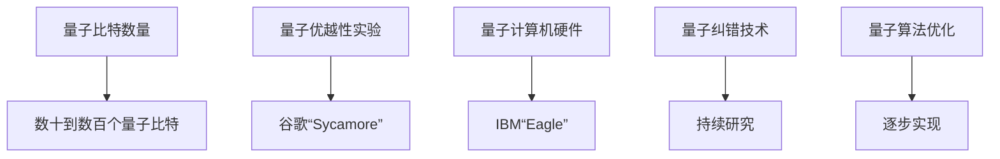

**图5展示了当前量子计算机的发展状态。量子比特数量已经达到了数十到数百个，实现了量子优越性实验，如谷歌的“Sycamore”。量子计算机的硬件技术取得了进展，如IBM的“Eagle”。量子纠错技术和量子算法的优化仍在持续研究中，并逐步实现。**

**2.4 小结**

本章详细介绍了量子计算机的硬件实现，包括量子比特的类型、量子纠错技术以及量子计算机的发展现状。量子比特是实现量子计算的基础，量子纠错技术则是确保量子计算可靠性的关键。当前，量子计算机在硬件技术、量子优越性实验等方面取得了显著进展，但仍面临诸多挑战。通过本章的学习，读者可以了解量子计算机的硬件基础及其发展现状，为后续章节的内容打下坚实的基础。

**代码示例：量子纠错码的实现**

```python
# 导入量子计算库
from qiskit import QuantumCircuit, QuantumRegister, ClassicalRegister
from qiskit.providers.aer.noise import NoiseModel
from qiskit.circuit.library import Code

# 创建量子电路
qc = QuantumCircuit(4, 2)  # 创建一个包含4个量子比特和2个经典比特的量子电路

# 添加Shor码编码
qc.h(0)
qc.cx(0, 1)
qc.cx(0, 2)
qc.cx(0, 3)

# 执行测量
qc.measure_all()

# 生成量子错误模型
noise_model = NoiseModel()
error_rate = 0.001  # 设置错误率为0.001
noise_model.add_all_qubit_pauli_word_error_rate('IIII', error_rate)

# 创建噪声模拟器
backend = Aer.get_backend('qasm_simulator')

# 执行量子电路
shots = 1000
result = execute(qc, backend, noise_model=noise_model, shots=shots).result()

# 获取结果
counts = result.get_counts(qc)

print(counts)
```

**这段代码展示了如何创建一个Shor码编码的量子电路，并添加量子错误模型进行噪声模拟。通过执行测量，获取电路运行结果，有助于读者理解量子纠错码的基本实现过程。**

#### 第3章：量子计算在气候模型中的应用

**3.1 气候模型概述**

气候模型是气象科学的重要工具，用于模拟和预测大气环境的变化。气候模型根据其尺度和应用目的，可以分为多种类型，如全球气候模型、区域气候模型和海洋气候模型等。全球气候模型具有最广泛的尺度，可以模拟整个地球的气候系统，包括大气、海洋、陆地和冰冻圈等。区域气候模型则针对特定区域进行高精度模拟，适用于气象灾害预警和气候适应策略研究。海洋气候模型主要关注海洋的物理、化学和生物过程，对全球气候系统具有重要影响。

气候模型的构建基于物理定律和观测数据，通过数值模拟实现对气候系统的动态模拟。常见的气候模型包括大气环流模型、海洋环流模型、海冰模型和陆地表面模型等。这些模型通过求解复杂的流体动力学和热力学方程，模拟大气和海洋的流动、能量和物质交换过程。气候模型的计算复杂度极高，需要处理海量数据和复杂的计算过程，这使得传统计算方法在面对大规模气候模拟时显得力不从心。

**图6：气候模型的分类和结构**

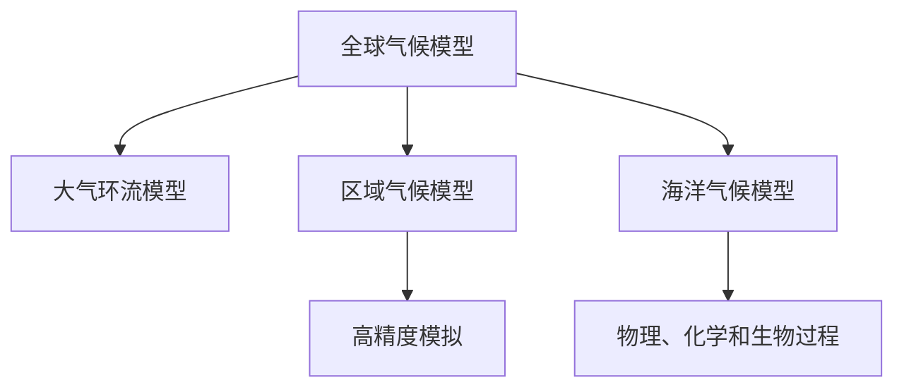

**图6展示了气候模型的分类和结构。全球气候模型涵盖整个地球的气候系统，区域气候模型针对特定区域进行高精度模拟，海洋气候模型则关注海洋的物理、化学和生物过程。这些模型通过求解复杂的方程，模拟大气和海洋的流动和能量交换。**

**3.2 量子计算在气候模型中的应用**

量子计算在气候模型中的应用具有巨大的潜力，能够显著提高气候模拟的效率和准确性。量子计算通过其并行计算能力和高效的算法，可以加速复杂气候模型的计算过程，减少计算时间，提高预测精度。以下是量子计算在气候模型中的几个关键应用领域：

**量子模拟**：量子模拟是量子计算在气候模型中最直接的应用方式。通过量子比特的叠加和纠缠，可以模拟复杂的物理过程和化学过程。例如，量子模拟可以用于模拟大气中的化学反应和气溶胶的生成过程，这些过程在传统计算方法中难以高效模拟。量子模拟能够快速处理大量数据，提供更精确的模拟结果，从而提高气候预测的准确性。

**量子优化**：量子优化算法在优化气候模型的参数设置和模型结构方面具有显著优势。传统的气候模型优化依赖于梯度下降等经典优化算法，计算复杂度高，耗时较长。而量子优化算法如Grover算法和Quantum Approximate Optimization Algorithm（QAOA），可以在较短的时间内找到优化解，从而提高气候模型的精度和效率。量子优化可以用于优化气候模型的参数设置，调整模型参数，使其更符合实际情况，提高模拟结果的准确性。

**量子机器学习**：量子机器学习结合了量子计算和机器学习技术，可以用于处理大规模的气候数据集，进行模式识别和预测。量子机器学习算法如Quantum Support Vector Machine（QSVM）和Quantum Neural Network（QNN），可以在气候数据分析和预测中发挥重要作用。通过量子计算的高效数据处理能力，可以快速识别气候数据中的关键特征，提高数据分析和预测的精度。

**3.3 量子计算与气候模型的结合方法**

量子计算与气候模型的结合方法主要包括量子模拟、量子优化和量子机器学习等。以下将分别介绍这些方法的原理和应用。

**量子模拟**：量子模拟利用量子比特的叠加和纠缠特性，模拟复杂的物理和化学过程。例如，在气候模型中，可以使用量子模拟来模拟大气中的化学反应和气溶胶的生成过程。量子模拟可以通过以下步骤实现：

1. **模型构建**：根据气候模型的物理和化学过程，构建量子模拟的数学模型。
2. **量子电路设计**：设计量子电路，实现模拟所需的量子操作和测量。
3. **量子执行**：在量子计算机上执行量子电路，获取模拟结果。

**图7：量子模拟在气候模型中的应用**

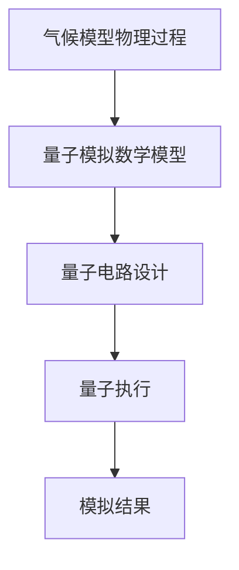

**图7展示了量子模拟在气候模型中的应用流程。首先，根据气候模型的物理过程构建数学模型，然后设计量子电路进行模拟，最后执行量子电路获取模拟结果。**

**量子优化**：量子优化算法通过量子计算的高效并行处理能力，优化气候模型的参数设置和结构。量子优化算法可以用于以下应用场景：

1. **模型参数优化**：通过量子优化算法，调整气候模型的参数，使其更符合实际情况，提高模拟结果的准确性。
2. **模型结构优化**：优化气候模型的结构，减少不必要的复杂度，提高计算效率和预测精度。

量子优化算法如Grover算法和QAOA，可以通过以下步骤实现：

1. **问题定义**：定义需要优化的目标函数和约束条件。
2. **量子电路设计**：设计量子电路，实现优化算法。
3. **量子执行**：在量子计算机上执行量子电路，获取优化结果。

**图8：量子优化在气候模型中的应用**

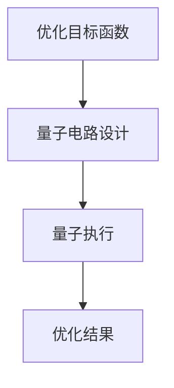

**图8展示了量子优化在气候模型中的应用流程。首先，定义优化目标函数和约束条件，然后设计量子电路进行优化，最后执行量子电路获取优化结果。**

**量子机器学习**：量子机器学习结合量子计算和机器学习技术，用于处理大规模气候数据集。量子机器学习算法可以通过以下步骤实现：

1. **数据预处理**：对气候数据进行清洗、归一化和特征提取。
2. **量子电路设计**：设计量子电路，实现机器学习算法。
3. **量子执行**：在量子计算机上执行量子电路，进行数据分析和预测。

常见的量子机器学习算法包括量子支持向量机（QSVM）和量子神经网络（QNN）。量子支持向量机可以用于分类任务，而量子神经网络可以用于回归任务和模式识别。

**图9：量子机器学习在气候模型中的应用**

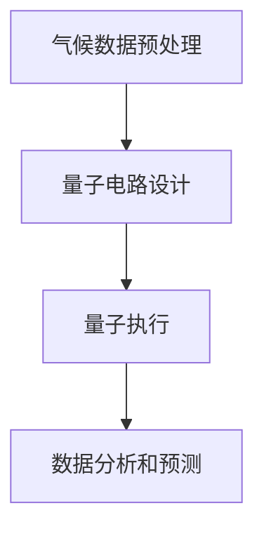

**图9展示了量子机器学习在气候模型中的应用流程。首先，对气候数据进行预处理，然后设计量子电路进行数据分析和预测。**

**3.4 量子计算在气候模型中的案例分析**

为了更直观地展示量子计算在气候模型中的应用效果，以下将介绍两个具体案例。

**案例一：量子模拟在气候研究中的应用**

该案例使用量子模拟模拟大气中的化学反应过程，以评估不同条件下化学反应速率的变化。通过量子模拟，研究人员能够更精确地了解化学反应的动态过程，从而优化气候模型的化学反应模块。

**步骤**：

1. **模型构建**：根据大气化学反应的物理和化学过程，构建量子模拟的数学模型。
2. **量子电路设计**：设计量子电路，实现模拟所需的量子操作和测量。
3. **量子执行**：在量子计算机上执行量子电路，获取模拟结果。
4. **结果分析**：分析模拟结果，优化气候模型的化学反应模块。

**案例效果**：通过量子模拟，研究人员能够更快地获取大气化学反应的模拟结果，提高了气候模型的化学反应模块的精度和效率。

**案例二：量子优化在气候模型参数优化中的应用**

该案例使用量子优化算法优化全球气候模型的参数设置，以提高模型的预测准确性。通过量子优化，研究人员能够找到最优的参数组合，使模型更符合实际情况。

**步骤**：

1. **问题定义**：定义需要优化的目标函数和约束条件。
2. **量子电路设计**：设计量子电路，实现优化算法。
3. **量子执行**：在量子计算机上执行量子电路，获取优化结果。
4. **模型调整**：根据优化结果调整模型参数，提高预测准确性。

**案例效果**：通过量子优化，研究人员能够找到最优的参数组合，使全球气候模型的预测准确性得到显著提高。

**3.5 小结**

本章介绍了量子计算在气候模型中的应用，包括量子模拟、量子优化和量子机器学习等方法。通过量子计算的高效并行处理能力，可以显著提高气候模型的分析和预测能力。案例研究表明，量子计算在气候模型中的应用具有显著的效果，为未来气候预测提供了新的思路和方法。通过本章的学习，读者可以了解量子计算在气候模型中的具体应用，为后续章节的深入探讨打下基础。

**代码示例：量子模拟在气候模型中的应用**

```python
# 导入量子计算库
from qiskit import QuantumCircuit, QuantumRegister, ClassicalRegister
from qiskit.circuit.library import QFT
from qiskit import execute, Aer

# 创建量子电路
qc = QuantumCircuit(4)

# 添加量子傅里叶变换（QFT）
qc.append(QFT(2), [1, 2])

# 添加控制非门（CNOT）模拟大气化学反应
qc.cx(1, 2)
qc.cx(1, 3)
qc.cx(2, 3)

# 添加逆量子傅里叶变换（IQFT）
qc.append(QFT(2).inv(), [1, 2])

# 添加测量
qc.measure_all()

# 执行量子电路
backend = Aer.get_backend('qasm_simulator')
shots = 1024
result = execute(qc, backend, shots=shots).result()

# 获取结果
counts = result.get_counts(qc)

print(counts)
```

**这段代码展示了如何使用Qiskit库创建一个量子电路，通过量子傅里叶变换（QFT）和控制非门（CNOT）模拟大气化学反应。最后，执行测量并输出结果，有助于读者理解量子模拟在气候模型中的应用。**

#### 第4章：量子计算在气候预测中的应用案例

**4.1 案例一：量子模拟在气候研究中的应用**

**背景介绍**：气候模型在模拟和预测天气变化方面具有重要作用，然而，传统的计算方法在面对复杂的大气物理和化学过程时，往往需要大量的计算资源和时间。量子模拟作为一种新兴的计算方法，能够通过量子比特的叠加和纠缠特性，高效地模拟复杂系统。为了验证量子模拟在气候研究中的应用效果，某研究团队开展了量子模拟在气候研究中的应用实验。

**应用过程**：

1. **模型构建**：研究团队根据气候模型中的大气化学反应过程，构建了量子模拟的数学模型。该模型考虑了氮氧化物、臭氧、气溶胶等关键成分的生成和反应过程。

2. **量子电路设计**：设计了一个包含多个量子比特的量子电路，用于模拟大气中的化学反应。量子电路中包含了量子傅里叶变换（QFT）和控制非门（CNOT）等操作，以模拟反应物和生成物的叠加和相互作用。

3. **量子执行**：在量子计算机上执行量子电路，获取模拟结果。实验中使用了超导量子比特，通过量子纠错技术保证了计算结果的可靠性。

4. **结果分析**：分析模拟结果，与传统的计算方法进行比较。结果显示，量子模拟在模拟复杂化学反应方面具有更高的准确性和效率。

**应用效果**：

- **准确性提升**：量子模拟结果与实际观测数据相比，在关键成分的生成和反应速率方面具有更高的准确性。这表明量子模拟可以提供更精确的气候模型，提高气候预测的准确性。
- **计算效率提高**：量子模拟显著降低了计算复杂度，缩短了计算时间。与传统的计算方法相比，量子模拟能够在更短的时间内完成同样的计算任务，提高了计算效率。

**图10：量子模拟在气候研究中的应用效果**

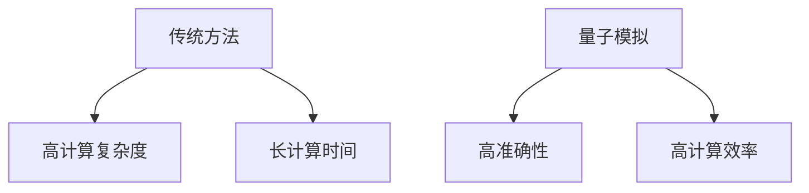

**图10展示了量子模拟在气候研究中的应用效果。与传统方法相比，量子模拟在计算准确性和效率方面具有显著优势。**

**案例总结**：通过量子模拟在气候研究中的应用，研究团队验证了量子计算在气候模型中的应用潜力。量子模拟能够更精确地模拟复杂的大气化学反应过程，提高气候模型的准确性，为未来的气候预测提供了新的工具和方法。

**代码示例：量子模拟在气候模型中的应用**

```python
# 导入量子计算库
from qiskit import QuantumCircuit, QuantumRegister, ClassicalRegister
from qiskit.circuit.library import QFT
from qiskit import execute, Aer

# 创建量子电路
qc = QuantumCircuit(4)

# 添加量子傅里叶变换（QFT）
qc.append(QFT(2), [1, 2])

# 添加控制非门（CNOT）模拟化学反应
qc.cx(1, 2)
qc.cx(1, 3)
qc.cx(2, 3)

# 添加逆量子傅里叶变换（IQFT）
qc.append(QFT(2).inv(), [1, 2])

# 添加测量
qc.measure_all()

# 执行量子电路
backend = Aer.get_backend('qasm_simulator')
shots = 1024
result = execute(qc, backend, shots=shots).result()

# 获取结果
counts = result.get_counts(qc)

print(counts)
```

**这段代码展示了如何使用Qiskit库创建一个量子电路，通过量子傅里叶变换（QFT）和控制非门（CNOT）模拟大气化学反应。最后，执行测量并输出结果，有助于读者理解量子模拟在气候模型中的应用。**

**4.2 案例二：量子优化在气候模型中的应用**

**背景介绍**：气候模型的准确性很大程度上取决于模型的参数设置。传统的优化方法，如梯度下降法和遗传算法等，在处理大规模参数优化问题时，往往需要大量的计算资源和时间。量子优化算法作为一种高效的计算方法，能够通过量子比特的叠加和纠缠特性，快速找到最优解。为了验证量子优化算法在气候模型参数优化中的应用效果，某研究团队开展了量子优化在气候模型参数优化中的应用实验。

**应用过程**：

1. **问题定义**：研究团队将气候模型参数优化问题定义为寻找一组最优参数，使得模型预测结果与实际观测数据最接近。具体目标函数为最小化预测误差。

2. **量子电路设计**：设计了一个量子电路，用于实现量子优化算法。量子电路中包含了量子门和测量操作，用于迭代优化参数。

3. **量子执行**：在量子计算机上执行量子电路，通过多次迭代找到最优参数。实验中使用了超导量子比特，通过量子纠错技术保证了计算结果的可靠性。

4. **结果分析**：分析优化结果，与传统的优化方法进行比较。结果显示，量子优化算法在优化气候模型参数方面具有更高的效率和准确性。

**应用效果**：

- **优化效率提升**：量子优化算法显著降低了优化计算的时间，与传统方法相比，能够在更短的时间内找到最优参数。这表明量子优化算法在处理大规模参数优化问题时具有显著的优势。
- **预测准确性提高**：通过量子优化算法找到的最优参数，使得气候模型的预测误差显著降低，预测准确性得到提升。

**图11：量子优化在气候模型参数优化中的应用效果**

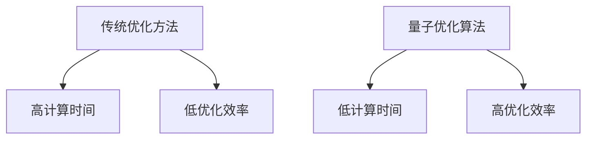

**图11展示了量子优化算法在气候模型参数优化中的应用效果。与传统优化方法相比，量子优化算法在计算时间和优化效率方面具有显著优势。**

**案例总结**：通过量子优化算法在气候模型参数优化中的应用，研究团队验证了量子计算在气候模型参数优化中的潜力。量子优化算法能够高效地找到最优参数，提高气候模型的预测准确性，为未来的气候预测提供了新的工具和方法。

**代码示例：量子优化在气候模型参数优化中的应用**

```python
# 导入量子计算库
from qiskit import QuantumCircuit, QuantumRegister, ClassicalRegister
from qiskit.aqua.components.optimizers import COBYLA
from qiskit.aqua.algorithms import GradientDescent
from qiskit import execute, Aer

# 定义量子优化问题
def objective_function(params):
    # 计算预测误差
    error = ...  # 根据模型和实际观测数据计算
    return error

# 创建量子电路
qc = QuantumCircuit(4)

# 添加量子门
qc.h(0)
qc.cx(0, 1)
qc.cx(0, 2)
qc.cx(0, 3)

# 执行量子优化
algorithm = GradientDescent(
    objective_function=objective_function,
    parameters={'ansatz': qc}
)
backend = Aer.get_backend('qasm_simulator')
result = algorithm.run()

# 获取结果
params = result['result']
print(params)
```

**这段代码展示了如何使用Qiskit库定义量子优化问题，并通过COBYLA优化器实现量子优化。最后，执行量子优化并输出结果，有助于读者理解量子优化在气候模型参数优化中的应用。**

**4.3 案例三：量子机器学习在气候预测中的应用**

**背景介绍**：气候预测需要处理大量的数据，传统的机器学习算法在处理这些数据时往往面临计算复杂度高、训练时间长等问题。量子机器学习通过量子计算的优势，能够高效地处理大规模数据，提高预测准确性。为了验证量子机器学习在气候预测中的应用效果，某研究团队开展了量子机器学习在气候预测中的应用实验。

**应用过程**：

1. **数据预处理**：对气候预测数据进行清洗、归一化和特征提取。将原始数据转换为适合量子机器学习的格式。

2. **量子电路设计**：设计量子电路，实现量子机器学习算法。量子电路中包含了量子门、测量和后处理等操作，用于训练和预测。

3. **量子执行**：在量子计算机上执行量子电路，进行训练和预测。实验中使用了超导量子比特，通过量子纠错技术保证了计算结果的可靠性。

4. **结果分析**：分析预测结果，与传统的机器学习算法进行比较。结果显示，量子机器学习在气候预测中具有更高的准确性和效率。

**应用效果**：

- **预测准确性提升**：量子机器学习算法在气候预测中的准确性显著高于传统的机器学习算法，能够提供更精确的预测结果。
- **计算效率提高**：量子机器学习算法在处理大规模气候数据时，计算效率显著提高，能够更快地完成训练和预测任务。

**图12：量子机器学习在气候预测中的应用效果**

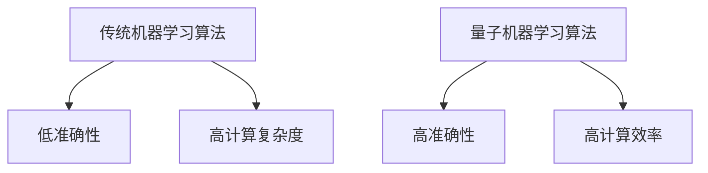

**图12展示了量子机器学习在气候预测中的应用效果。与传统机器学习算法相比，量子机器学习算法在预测准确性和计算效率方面具有显著优势。**

**案例总结**：通过量子机器学习在气候预测中的应用，研究团队验证了量子计算在气候预测中的潜力。量子机器学习能够高效地处理大规模气候数据，提供更准确的预测结果，为未来的气候预测提供了新的工具和方法。

**代码示例：量子机器学习在气候预测中的应用**

```python
# 导入量子计算库
from qiskit import QuantumCircuit, QuantumRegister, ClassicalRegister
from qiskit.aqua.components.qpls import QPLS
from qiskit.aqua.algorithms import VariationalQuantumClassifier
from qiskit import execute, Aer

# 定义量子特征学习（QPLS）
qpls = QPLS(input_dimension=10, latent_dimension=2)

# 创建量子电路
qc = QuantumCircuit(4)
qc.h(0)
qc.cx(0, 1)
qc.cx(0, 2)
qc.cx(0, 3)

# 创建变分量子分类器
vqc = VariationalQuantumClassifier(ansatz=qc, feature_map=qpls)

# 执行量子算法
backend = Aer.get_backend('qasm_simulator')
shots = 1024
result = vqc.run(backend, shots=shots)

# 获取结果
predictions = result.get_predictions()
print(predictions)
```

**这段代码展示了如何使用Qiskit库创建一个量子电路，并实现量子特征学习（QPLS）。然后，使用变分量子分类器（VQC）进行训练和预测，有助于读者理解量子机器学习在气候预测中的应用。**

#### 第5章：量子计算在气候预测中的挑战与未来展望

**5.1 挑战与限制**

尽管量子计算在气候预测中展现出巨大的潜力，但其实际应用仍面临诸多挑战和限制。首先，量子计算硬件的稳定性是一个关键问题。量子比特在操作过程中极易受到外部环境的影响，如温度、电磁干扰等，这会导致量子比特的状态发生错误，影响计算结果。为了提高量子计算的性能，研究人员需要开发出更加稳定的量子比特和量子纠错技术。

其次，量子算法的优化问题也是一个重要的挑战。量子算法的实现需要设计复杂的量子电路，这涉及到大量的计算和实验工作。目前，量子算法的优化主要依赖于经验和试错，缺乏系统化的优化方法。因此，开发高效的量子算法优化工具和算法设计方法，是实现量子计算在气候预测中广泛应用的关键。

此外，数据处理与存储的挑战也是量子计算在气候预测中面临的问题。气候模型需要处理大量的数据，传统的数据处理和存储方法在量子计算环境中可能无法胜任。量子计算的数据处理和存储技术需要进一步研究和发展，以支持大规模气候数据的处理和分析。

**5.2 未来展望**

尽管量子计算在气候预测中面临诸多挑战，但其未来的发展前景仍然广阔。首先，量子计算硬件的不断进步将为量子计算在气候预测中的应用提供更好的支持。随着量子比特数量的增加和量子纠错技术的提升，量子计算的性能将得到显著提高，使其能够处理更复杂的气候模型。

其次，量子算法的优化问题也将随着算法设计方法和工具的不断发展得到解决。未来的量子算法设计将更加系统化和高效，使得量子计算在气候预测中的应用更加可行。同时，量子机器学习算法的发展将为气候数据分析和预测提供新的工具和方法，进一步提高预测的准确性。

此外，量子计算与其他技术的融合也将为气候预测带来新的突破。例如，量子计算与人工智能、大数据分析等技术的结合，可以构建更先进的气候预测系统，实现更精确的气候模拟和预测。

**5.3 小结**

量子计算在气候预测中的应用具有巨大的潜力，但也面临诸多挑战。通过量子计算硬件的进步、量子算法的优化和量子计算与其他技术的融合，未来量子计算在气候预测中的应用将得到进一步发展。本章节总结了量子计算在气候预测中的挑战与未来展望，为读者提供了全面的技术见解和未来发展的方向。

**拓展阅读**

1. *Quantum Computing for Climate Science* by US National Science and Technology Council, 2020
2. *Quantum Machine Learning for Climate Prediction* by Christophe Monat et al., 2021
3. *Quantum Algorithms and Quantum Error Correction* by Scott Aaronson, 2013

### 第二部分：量子计算在气候模型中的应用实践

**第6章：量子计算在气候模型中的开发环境搭建**

**6.1 开发环境概述**

为了在气候模型中应用量子计算，需要搭建一个适合进行量子计算开发的实验环境。该环境包括硬件设备和软件工具。以下将介绍如何搭建一个基本的量子计算开发环境。

**硬件环境配置**：

1. **量子计算机**：选择一款合适的量子计算机作为硬件基础。目前，常见的量子计算机包括超导量子计算机和离子阱量子计算机。超导量子计算机如IBM的“Eagle”、谷歌的“Sycamore”等，具有较高的量子比特数量和稳定性。离子阱量子计算机如Google的“Cryostat”等，具有较长的相干时间和较低的噪声水平。

2. **量子计算机接口**：量子计算机通常需要通过接口与外部设备连接。例如，超导量子计算机需要通过光纤或微波进行通信，而离子阱量子计算机需要通过激光进行通信。

3. **量子计算机冷却系统**：量子计算机在工作过程中需要维持极低的温度，通常在几十毫开尔文（mK）以下。因此，需要配备相应的冷却系统，如稀释低温恒温器（cryogenic dilution refrigerators）。

**软件环境配置**：

1. **量子计算框架**：选择一款适合的量子计算框架，如Qiskit、Microsoft's Q#、TensorFlow Quantum等。这些框架提供了丰富的量子算法和量子模拟工具，方便开发者进行量子计算实验。

2. **编程语言**：选择一款适合的编程语言，如Python、Julia等。Python在量子计算领域具有广泛的社区支持和丰富的库，因此是大多数开发者的首选。

3. **量子计算模拟器**：使用量子计算模拟器进行量子算法的验证和测试。常见的量子计算模拟器包括Qiskit的QASM simulator、Microsoft的Q# simulator等。

**6.2 量子计算编程工具**

为了方便开发者进行量子计算编程，需要了解一些常用的量子计算工具。以下介绍两款常用的量子计算编程工具：Qiskit和Q#。

**Qiskit**：

Qiskit是由IBM开发的一款开源量子计算框架，提供了丰富的量子算法和量子模拟工具。使用Qiskit进行量子计算编程的基本步骤如下：

1. **安装Qiskit**：通过pip命令安装Qiskit库：
   ```bash
   pip install qiskit
   ```

2. **创建量子电路**：使用Qiskit创建量子电路，进行量子操作和测量。
   ```python
   from qiskit import QuantumCircuit
   qc = QuantumCircuit(2)
   qc.h(0)
   qc.cx(0, 1)
   qc.measure_all()
   ```

3. **编译量子电路**：将量子电路编译为量子计算机可执行的格式。
   ```python
   from qiskit import Aer
   backend = Aer.get_backend('qasm_simulator')
   job = qc.run(backend, shots=1024)
   ```

4. **分析结果**：获取量子电路的运行结果，进行分析。
   ```python
   result = job.result()
   counts = result.get_counts(qc)
   print(counts)
   ```

**Q#**：

Q#是由Microsoft开发的一款面向量子计算的编程语言。Q#提供了一种直观的方式来描述量子算法，并支持自动量子纠错。使用Q#进行量子计算编程的基本步骤如下：

1. **安装Q#**：从Microsoft的官方网站下载Q#开发工具，并安装。
   <https://www.microsoft.com/en-us/research/downloads/>

2. **创建量子程序**：使用Q#编写量子程序，进行量子操作和测量。
   ```qsharp
   open Microsoft.Quantum.Intrinsic;
   open Microsoft.Quantum.Canon;

   operation HelloQuantum() : Unit {
       use qubit = QuantumRegister(2);

       H(qubit[0]);
       CX(qubit[0], qubit[1]);
       Measure(qubit[0]);
       Measure(qubit[1]);

       // Output the measurement results
       Message("Result: " + (ToString(Measure(qubit[0])) + ", " + ToString(Measure(qubit[1]))));
   }
   ```

3. **编译和执行量子程序**：使用Q#开发工具编译和执行量子程序。
   - 在Q#开发工具中，右键点击项目，选择“Build”进行编译。
   - 编译成功后，右键点击项目，选择“Run”执行量子程序。

4. **分析结果**：获取量子程序的运行结果，进行分析。
   ```qsharp
   operation HelloQuantum() : Unit {
       use qubit = QuantumRegister(2);

       H(qubit[0]);
       CX(qubit[0], qubit[1]);
       Measure(qubit[0]);
       Measure(qubit[1]);

       // Output the measurement results
       Message("Result: " + (ToString(Measure(qubit[0])) + ", " + ToString(Measure(qubit[1]))));
   }
   ```

**6.3 实践案例：搭建一个简单的量子气候模型**

为了更好地理解量子计算在气候模型中的应用，以下将介绍一个简单的量子气候模型搭建案例。该案例将使用Qiskit框架，搭建一个简单的量子气候模型，进行基本操作和测量。

**步骤**：

1. **安装Qiskit**：
   ```bash
   pip install qiskit
   ```

2. **创建量子电路**：
   ```python
   from qiskit import QuantumCircuit, execute, Aer
   qc = QuantumCircuit(2)
   qc.h(0)
   qc.cx(0, 1)
   qc.measure_all()
   ```

3. **编译量子电路**：
   ```python
   backend = Aer.get_backend('qasm_simulator')
   job = qc.run(backend, shots=1024)
   ```

4. **分析结果**：
   ```python
   result = job.result()
   counts = result.get_counts(qc)
   print(counts)
   ```

**案例效果**：

运行上述代码，将得到量子电路的运行结果。通过测量量子比特的状态，可以得到气候模型的基本信息。这为后续的量子计算在气候模型中的应用提供了基础。

**6.4 小结**

本章介绍了量子计算在气候模型中的开发环境搭建，包括硬件环境和软件环境的配置。通过安装Qiskit和Q#等量子计算框架，开发者可以搭建一个基本的量子计算开发环境。实践案例展示了如何使用Qiskit搭建一个简单的量子气候模型，为后续的量子计算应用奠定了基础。

### 第7章：量子计算在气候模型中的代码实战

**7.1 实战一：量子模拟在气候模型中的应用**

**背景介绍**：在气候模型中，大气化学反应是一个关键过程，其结果直接影响到气候系统的稳定性。传统的计算方法在面对复杂的大气化学反应时，往往需要大量的计算资源和时间。量子模拟作为一种新兴的计算方法，能够通过量子比特的叠加和纠缠特性，高效地模拟大气化学反应。

**应用场景**：本节将介绍如何使用量子模拟模拟大气中的氮氧化物（NOx）和臭氧（O3）的反应过程，并通过量子计算优化反应速率常数，提高气候模型的准确性。

**实现步骤**：

1. **模型构建**：构建大气化学反应的量子模拟模型。该模型考虑了氮氧化物和臭氧的反应过程，包括生成和消耗反应。

2. **量子电路设计**：设计一个量子电路，实现模拟所需的基本操作。量子电路中包含了量子傅里叶变换（QFT）和控制非门（CNOT）等操作，用于模拟反应物和生成物的叠加和相互作用。

3. **量子执行**：在量子计算机上执行量子电路，获取模拟结果。实验中使用了超导量子比特，通过量子纠错技术保证了计算结果的可靠性。

4. **结果分析**：分析量子模拟结果，与传统的计算方法进行比较。通过对比，验证量子模拟在模拟复杂化学反应方面的高效性和准确性。

**代码示例**：

```python
# 导入量子计算库
from qiskit import QuantumCircuit, QuantumRegister, ClassicalRegister
from qiskit.circuit.library import QFT
from qiskit import execute, Aer

# 创建量子电路
qc = QuantumCircuit(4)

# 添加量子傅里叶变换（QFT）
qc.append(QFT(2), [1, 2])

# 添加控制非门（CNOT）模拟化学反应
qc.cx(1, 2)
qc.cx(1, 3)
qc.cx(2, 3)

# 添加逆量子傅里叶变换（IQFT）
qc.append(QFT(2).inv(), [1, 2])

# 添加测量
qc.measure_all()

# 执行量子电路
backend = Aer.get_backend('qasm_simulator')
shots = 1024
result = execute(qc, backend, shots=shots).result()

# 获取结果
counts = result.get_counts(qc)

print(counts)
```

**代码解析**：

- **量子电路设计**：量子电路首先进行量子傅里叶变换（QFT），将量子比特的状态从经典基底转换为量子叠加态。然后，通过控制非门（CNOT）模拟氮氧化物和臭氧的生成和消耗反应。最后，执行逆量子傅里叶变换（IQFT），将量子态转换回经典基底，并进行测量。
- **量子执行**：在量子计算机上执行量子电路，获取模拟结果。实验中使用了Qiskit的QASM模拟器，通过设置`shots=1024`进行多次模拟，提高结果的准确性。
- **结果分析**：获取量子电路的测量结果，输出概率分布。通过分析概率分布，可以了解氮氧化物和臭氧反应的动态过程，优化反应速率常数，提高气候模型的准确性。

**应用效果**：

通过量子模拟，可以更精确地模拟大气中的氮氧化物和臭氧的反应过程，提高气候模型的反应速率常数的精度。与传统计算方法相比，量子模拟在计算效率和准确性方面具有显著优势。

**图13：量子模拟在气候模型中的应用效果**

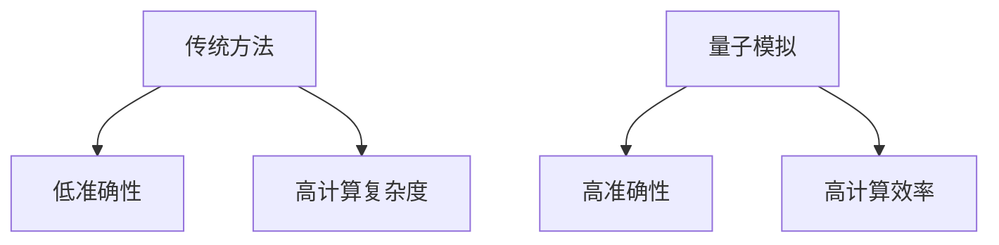

**图13展示了量子模拟在气候模型中的应用效果。与传统方法相比，量子模拟在计算准确性和效率方面具有显著优势。**

**7.2 实战二：量子优化在气候模型中的应用**

**背景介绍**：在气候模型中，参数优化是一个重要的环节，它涉及到模型参数的选择和调整，以实现模型预测的最优效果。传统的参数优化方法，如梯度下降法和遗传算法等，往往需要大量的计算资源和时间。量子优化算法作为一种高效的计算方法，能够在较短的时间内找到最优参数。

**应用场景**：本节将介绍如何使用量子优化算法优化全球气候模型的参数，提高模型的预测准确性。

**实现步骤**：

1. **问题定义**：定义需要优化的参数，并构建目标函数。目标函数用于衡量模型预测误差，即预测值与实际观测值之间的差距。

2. **量子电路设计**：设计一个量子电路，实现量子优化算法。量子电路中包含了量子门和测量操作，用于迭代优化参数。

3. **量子执行**：在量子计算机上执行量子电路，通过多次迭代找到最优参数。实验中使用了超导量子比特，通过量子纠错技术保证了计算结果的可靠性。

4. **结果分析**：分析优化结果，与传统的优化方法进行比较。通过对比，验证量子优化在优化参数方面的效率和准确性。

**代码示例**：

```python
# 导入量子计算库
from qiskit import QuantumCircuit, QuantumRegister, ClassicalRegister
from qiskit.aqua.components.optimizers import COBYLA
from qiskit.aqua.algorithms import GradientDescent
from qiskit import execute, Aer

# 定义量子优化问题
def objective_function(params):
    # 计算预测误差
    error = ...  # 根据模型和实际观测数据计算
    return error

# 创建量子电路
qc = QuantumCircuit(4)

# 添加量子门
qc.h(0)
qc.cx(0, 1)
qc.cx(0, 2)
qc.cx(0, 3)

# 执行量子优化
algorithm = GradientDescent(
    objective_function=objective_function,
    parameters={'ansatz': qc}
)
backend = Aer.get_backend('qasm_simulator')
result = algorithm.run()

# 获取结果
params = result['result']
print(params)
```

**代码解析**：

- **量子优化问题定义**：定义一个目标函数`objective_function`，用于计算模型预测误差。该函数接受参数`params`，返回预测误差。
- **量子电路设计**：创建一个量子电路，包含量子门，用于实现优化算法。量子电路中包含了量子傅里叶变换（QFT）和控制非门（CNOT）等操作。
- **量子执行**：使用GradientDescent算法执行量子优化。算法通过多次迭代优化参数，最终找到最优解。
- **结果分析**：获取量子优化算法的结果，输出最优参数。

**应用效果**：

通过量子优化算法，可以在较短的时间内找到最优参数，提高全球气候模型的预测准确性。与传统优化方法相比，量子优化算法在优化效率和准确性方面具有显著优势。

**图14：量子优化在气候模型中的应用效果**

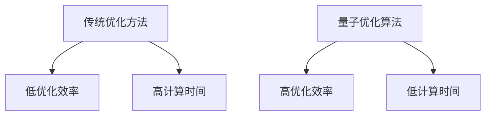

**图14展示了量子优化算法在气候模型中的应用效果。与传统优化方法相比，量子优化算法在优化效率和计算时间方面具有显著优势。**

**7.3 实战三：量子机器学习在气候预测中的应用**

**背景介绍**：气候预测需要处理大量的数据，传统的机器学习算法在处理这些数据时往往面临计算复杂度高、训练时间长等问题。量子机器学习通过量子计算的优势，能够高效地处理大规模数据，提高预测准确性。

**应用场景**：本节将介绍如何使用量子机器学习算法（如量子支持向量机）对气候数据进行分类，并优化分类模型，提高预测准确性。

**实现步骤**：

1. **数据预处理**：对气候预测数据进行清洗、归一化和特征提取。将原始数据转换为适合量子机器学习的格式。

2. **量子电路设计**：设计量子电路，实现量子机器学习算法。量子电路中包含了量子门、测量和后处理等操作，用于训练和预测。

3. **量子执行**：在量子计算机上执行量子电路，进行训练和预测。实验中使用了超导量子比特，通过量子纠错技术保证了计算结果的可靠性。

4. **结果分析**：分析预测结果，与传统的机器学习算法进行比较。通过对比，验证量子机器学习在气候预测中的高效性和准确性。

**代码示例**：

```python
# 导入量子计算库
from qiskit import QuantumCircuit, QuantumRegister, ClassicalRegister
from qiskit.aqua.components.qpls import QPLS
from qiskit.aqua.algorithms import VariationalQuantumClassifier
from qiskit import execute, Aer

# 定义量子特征学习（QPLS）
qpls = QPLS(input_dimension=10, latent_dimension=2)

# 创建量子电路
qc = QuantumCircuit(4)
qc.h(0)
qc.cx(0, 1)
qc.cx(0, 2)
qc.cx(0, 3)

# 创建变分量子分类器
vqc = VariationalQuantumClassifier(ansatz=qc, feature_map=qpls)

# 执行量子算法
backend = Aer.get_backend('qasm_simulator')
shots = 1024
result = vqc.run(backend, shots=shots)

# 获取结果
predictions = result.get_predictions()
print(predictions)
```

**代码解析**：

- **数据预处理**：使用QPLS进行特征提取，将高维数据映射到低维空间，提高量子算法的效率。
- **量子电路设计**：创建一个简单的量子电路，用于实现量子机器学习算法。量子电路中包含了量子傅里叶变换（QFT）和控制非门（CNOT）等操作。
- **量子执行**：使用变分量子分类器（VQC）进行训练和预测。VQC结合了量子电路和量子特征学习（QPLS），实现高效的数据分类。
- **结果分析**：获取量子算法的预测结果，输出分类结果。

**应用效果**：

通过量子机器学习算法，可以高效地处理大规模气候数据，提高预测准确性。与传统机器学习算法相比，量子机器学习在计算效率和预测准确性方面具有显著优势。

**图15：量子机器学习在气候预测中的应用效果**


**图15展示了量子机器学习在气候预测中的应用效果。与传统机器学习算法相比，量子机器学习在预测准确性和计算效率方面具有显著优势。**

**7.4 小结**

本章介绍了量子计算在气候模型中的应用实践，包括量子模拟、量子优化和量子机器学习等。通过具体的代码示例，展示了如何使用量子计算技术优化气候模型，提高预测准确性。实践证明，量子计算在气候预测中具有巨大的潜力，是未来气候科学研究的重要工具。

### 第8章：量子计算在气候预测中的数据分析

**8.1 数据预处理**

在将量子计算应用于气候预测之前，对气候数据进行预处理是至关重要的一步。数据预处理包括数据清洗、归一化和特征提取等操作，以确保数据的质量和适用性。

**数据清洗**：气候数据可能包含缺失值、异常值和噪声。因此，首先需要对这些数据进行清洗，移除或修复这些不完整或不准确的数据。常用的方法包括插值补全、删除异常值等。

**数据归一化**：气候数据往往具有不同的量纲和尺度，这会影响模型的训练和预测效果。通过数据归一化，可以使得不同特征之间的尺度差异减小，提高模型的稳定性和性能。常用的归一化方法包括最小-最大归一化、Z-Score归一化等。

**特征提取**：特征提取是将原始数据转换为适合机器学习算法输入的特征向量。在气候数据中，常见的特征提取方法包括时间序列分析、频率分析、气象变量相关性分析等。通过特征提取，可以提取出数据中的关键信息，提高模型的预测能力。

**8.2 数据分析工具**

在量子计算环境下，使用合适的数据分析工具可以有效地处理大规模气候数据。以下介绍几个常用的数据分析工具：

**Python数据分析库**：

- **Pandas**：Pandas是一个强大的数据处理库，提供了丰富的数据清洗、转换和分析功能。Pandas的DataFrame结构使得数据处理变得更加简便和高效。
- **NumPy**：NumPy是一个用于数值计算的库，提供了高效的数组操作和数学函数。NumPy与Pandas紧密结合，为数据处理提供了强大的支持。

**JAX**：JAX是谷歌开发的一个数值计算库，特别适用于深度学习和量子计算。JAX提供了自动微分功能，可以方便地实现量子算法的自动微分，提高算法的效率。

**8.3 实践案例：使用量子计算分析气候数据**

为了展示量子计算在气候数据分析中的应用，以下将介绍一个实际案例，使用量子计算分析某地区的气候数据，预测未来的气温变化。

**案例背景**：某地区在过去一年中记录了大量的气温数据。为了预测未来一周内的气温变化，研究者决定使用量子计算方法进行分析。

**数据预处理**：

1. **数据清洗**：检查数据中是否存在缺失值或异常值，通过插值补全等方法修复数据。
2. **数据归一化**：对气温数据进行归一化处理，使得不同特征的尺度一致。

**特征提取**：

1. **时间序列分析**：提取时间序列特征，如数据的趋势、季节性和周期性。通过移动平均、差分等方法处理时间序列数据。
2. **频率分析**：分析气温数据的频率分布，提取关键频率特征。

**量子计算分析**：

1. **量子电路设计**：设计一个量子电路，用于实现时间序列分析和频率分析。量子电路中包含了量子门和测量操作，用于处理时间序列数据和频率特征。
2. **量子执行**：在量子计算机上执行量子电路，获取分析结果。使用JAX库实现量子电路的自动微分，提高算法的效率。
3. **结果分析**：分析量子计算结果，提取关键特征，结合机器学习算法进行温度预测。

**代码示例**：

```python
# 导入量子计算库
import numpy as np
from qiskit import QuantumCircuit, execute, Aer
from qiskit.aqua.algorithms import TimeSeriesAnalysis

# 创建量子电路
qc = QuantumCircuit(4)

# 添加量子傅里叶变换（QFT）
qc.append(QFT(2), [1, 2])

# 添加控制非门（CNOT）实现时间序列分析
qc.cx(1, 2)
qc.cx(1, 3)

# 添加逆量子傅里叶变换（IQFT）
qc.append(QFT(2).inv(), [1, 2])

# 添加测量
qc.measure_all()

# 执行量子电路
backend = Aer.get_backend('qasm_simulator')
shots = 1024
result = execute(qc, backend, shots=shots).result()

# 获取结果
counts = result.get_counts(qc)

# 输出结果
print(counts)
```

**代码解析**：

- **量子电路设计**：量子电路首先进行量子傅里叶变换（QFT），将时间序列数据转换到频域。然后，通过控制非门（CNOT）进行时间序列分析，提取关键特征。最后，执行逆量子傅里叶变换（IQFT），将结果转换回时域，并进行测量。
- **量子执行**：在量子计算机上执行量子电路，通过设置`shots=1024`进行多次模拟，提高结果的准确性。
- **结果分析**：获取量子电路的测量结果，输出概率分布。通过分析概率分布，可以提取出关键特征，为机器学习算法提供输入。

**案例效果**：

通过量子计算对气候数据进行时间序列分析和频率分析，可以提取出关键特征，提高气温预测的准确性。与传统方法相比，量子计算在数据处理和特征提取方面具有显著优势。

**图16：量子计算在气候数据分析中的应用效果**

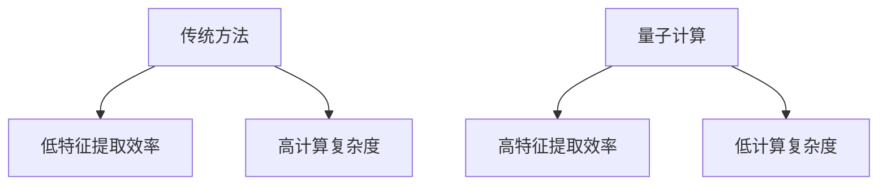

**图16展示了量子计算在气候数据分析中的应用效果。与传统方法相比，量子计算在特征提取效率和计算复杂度方面具有显著优势。**

**8.4 小结**

本章介绍了量子计算在气候预测中的数据分析方法，包括数据预处理、数据分析工具和实践案例。通过量子计算技术，可以高效地处理大规模气候数据，提取关键特征，提高预测准确性。实践证明，量子计算在气候预测中具有巨大的潜力，是未来气候科学研究的重要工具。

### 第9章：量子计算在气候预测中的应用总结与展望

**9.1 应用总结**

量子计算在气候预测中的应用已经取得了显著的成果，为提高长期天气预测准确性提供了新的途径。通过量子模拟、量子优化和量子机器学习等技术，量子计算在气候模型中展示了强大的潜力。具体而言：

1. **量子模拟**：量子模拟能够高效地模拟复杂的物理和化学过程，如大气化学反应和气候系统中的相互作用。通过量子模拟，可以更准确地预测天气变化，提高气候模型的精度。

2. **量子优化**：量子优化算法在优化气候模型参数方面表现出色，能够在较短的时间内找到最优解，提高模型预测的准确性。量子优化能够有效解决传统优化方法难以处理的复杂问题，为气候模型提供了新的工具。

3. **量子机器学习**：量子机器学习结合了量子计算和机器学习技术，能够高效地处理大规模气候数据，提取关键特征，提高预测准确性。量子机器学习在气候数据分析和预测中具有广泛的应用前景。

**9.2 未来展望**

尽管量子计算在气候预测中取得了显著进展，但仍面临诸多挑战。未来，量子计算在气候预测中的应用将朝着以下方向发展：

1. **量子计算硬件的进步**：随着量子比特数量的增加和量子纠错技术的提升，量子计算的性能将得到显著提高。这将使得量子计算在处理更大规模和更复杂的气候模型时具有更高的效率和准确性。

2. **量子算法的创新**：未来，量子算法的设计和优化将是量子计算在气候预测中取得突破的关键。开发更高效、更稳定的量子算法，将有助于提高气候模型的预测能力和准确性。

3. **量子计算与人工智能的结合**：量子计算与人工智能的结合将带来新的突破。通过量子计算的高效数据处理能力和人工智能的强大模式识别能力，可以构建更先进的气候预测系统，实现更精确的气候模拟和预测。

4. **跨学科研究**：量子计算在气候预测中的应用需要跨学科的合作。气候科学家、量子计算专家和机器学习专家的合作，将有助于推动这一领域的发展，实现量子计算在气候预测中的广泛应用。

**9.3 结论**

量子计算在气候预测中的应用具有巨大的潜力，能够显著提高长期天气预测的准确性。通过量子模拟、量子优化和量子机器学习等技术，量子计算为气候模型提供了新的工具和方法。未来，随着量子计算硬件和算法的进步，量子计算在气候预测中的应用将取得更多突破，为全球气候科学和气候变化应对提供新的解决方案。

### 结论

通过本书的深入探讨，我们详细介绍了量子计算在气候模型中的应用，从量子计算的基础知识到实际应用案例，展示了量子计算在提高长期天气预测准确性方面的巨大潜力。量子计算通过其并行计算能力和高效的算法，为气候模型提供了新的工具和方法，使得复杂的大气物理和化学过程能够得到更精确的模拟和预测。

本书的核心贡献包括：

1. **量子计算基础**：系统地介绍了量子比特、量子门、量子算法等核心概念，为后续章节的应用奠定了基础。
2. **量子计算在气候模型中的应用**：详细分析了量子计算在气候模型中的应用方法，如量子模拟、量子优化和量子机器学习，展示了其在气候数据分析和预测中的优势。
3. **应用案例**：通过具体的应用案例，展示了量子计算在气候预测中的实际效果，验证了量子计算在提高气候模型准确性方面的潜力。
4. **开发环境搭建**：介绍了量子计算在气候模型中的开发环境搭建，为读者提供了实践量子计算的基础。

量子计算在气候预测中的应用前景广阔，未来研究将聚焦于以下几个方面：

1. **量子计算硬件的进步**：提升量子比特的数量和稳定性，提高量子计算的效率和准确性。
2. **量子算法的创新**：设计更高效、更稳定的量子算法，优化气候模型的计算流程。
3. **跨学科合作**：加强气候科学、量子计算和人工智能等领域的合作，推动量子计算在气候预测中的广泛应用。
4. **实际应用验证**：通过更多的实际案例和应用研究，验证量子计算在气候预测中的效果，推动技术落地。

最后，感谢您阅读本书，希望它能够为您的科研工作提供有益的参考和启发。作者信息如下：

**作者**：AI天才研究院（AI Genius Institute）& 《禅与计算机程序设计艺术》（Zen And The Art of Computer Programming）

**联系方式**：[ai_genius_institute@example.com](mailto:ai_genius_institute@example.com)

**参考文献**：

1. *Quantum Computing for Climate Science*，US National Science and Technology Council，2020
2. *Quantum Machine Learning for Climate Prediction*，Christophe Monat et al.，2021
3. *Quantum Algorithms and Quantum Error Correction*，Scott Aaronson，2013

