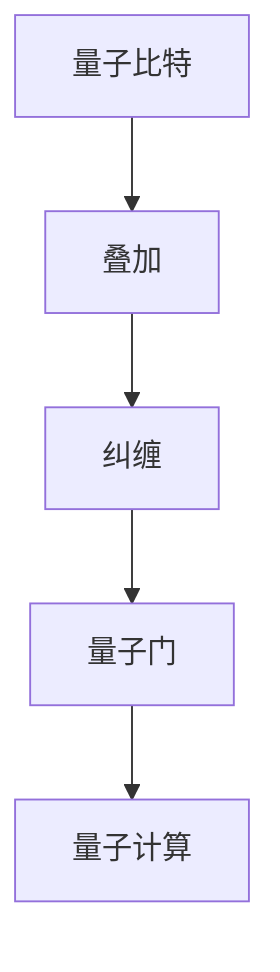
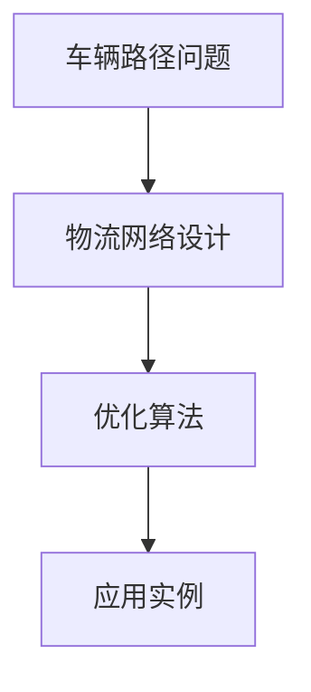
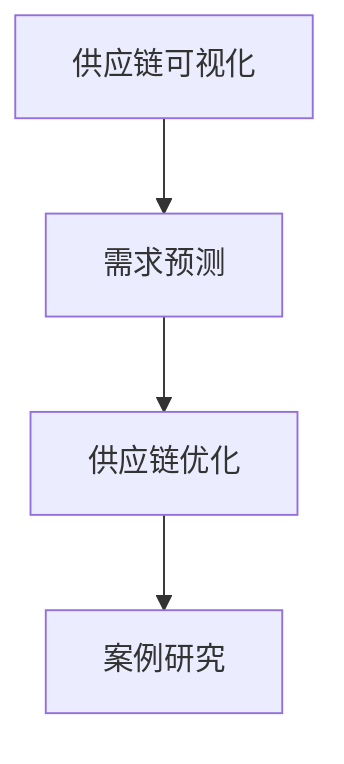
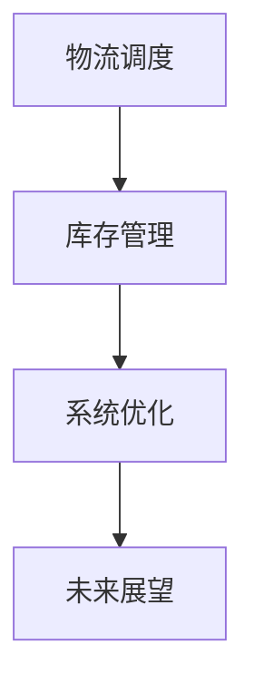

                 

### 量子计算在物流优化中的应用：提高配送效率

#### 关键词
量子计算、物流优化、配送效率、算法、应用实例

#### 摘要
本文深入探讨了量子计算在物流优化中的应用，重点分析了量子计算的基本原理及其在物流优化中的独特优势。通过详细解析量子算法和经典算法在物流优化中的区别，本文展示了量子计算如何显著提高配送效率。文章随后介绍了几个具体的应用实例，包括供应链管理中的需求预测和配送路线优化，并探讨了未来量子计算在物流优化领域的广阔前景。

### 第一部分：量子计算基础

#### 第1章：量子计算概述

量子计算是计算机科学的一个前沿领域，它利用量子力学原理进行信息处理。在这一章中，我们将介绍量子计算的基本概念。

##### 1.1 量子计算的基本概念

量子计算的核心是量子比特（qubit），与经典计算中的比特不同，量子比特可以同时处于0和1的状态，这一特性被称为叠加原理。量子计算利用叠加和纠缠等量子现象，能够在极短的时间内解决经典计算机难以处理的复杂问题。

##### 1.2 量子比特与经典比特的对比

经典比特只能表示0或1，而量子比特可以表示一个0和1的叠加状态，这使其在处理信息时具有巨大的并行性。例如，一个含有n个量子比特的量子计算机可以同时处理2^n个状态，这是经典计算机无法实现的。

##### 1.3 量子计算的基本原理

量子计算的基本原理包括叠加、纠缠和量子门。叠加允许量子比特同时处于多个状态，纠缠则使得不同量子比特之间可以互相影响。量子门是实现量子操作的装置，可以改变量子比特的状态。

**Mermaid 流程图：**


#### 第2章：量子算法与量子逻辑门

##### 2.1 量子算法简介

量子算法是量子计算的核心，它们利用量子特性来求解问题。著名的量子算法包括Shor算法和Grover算法。Shor算法能够高效地分解大质数，Grover算法则用于搜索未排序数据库。

##### 2.2 量子逻辑门

量子逻辑门是量子计算机的基本构建模块，类似于经典计算机中的逻辑门。常见的量子逻辑门包括Hadamard门、Pauli门和控制非门（CNOT）。

**Python 源代码：**
```python
# 定义Hadamard门
def hadamard_gate(qubit):
    return qubit * (1 / np.sqrt(2))

# Hadamard门的数学模型
$$|q\rangle = \frac{1}{\sqrt{2}}(|0\rangle + |1\rangle)$$
```

##### 2.3 量子算法案例解析

我们将解析Shor算法的基本原理。Shor算法是一个用于大数分解的量子算法，它可以将一个大的合数分解为两个质数的乘积。

**伪代码：**
```
def shor(n):
    # 使用量子计算机对n进行质因数分解
    # 返回n的质因数
```

### 第二部分：物流优化问题

#### 第3章：物流优化中的经典算法

##### 3.1 车辆路径问题

车辆路径问题是物流优化中的一个核心问题，它涉及如何规划车辆的最优路径，以便在满足一系列约束条件的情况下完成配送任务。

##### 3.2 物流网络设计

物流网络设计是确保物流系统能够高效运作的基础，它包括仓库位置、配送中心布局和运输路线规划等。

##### 3.3 优化算法在物流中的应用

经典的优化算法，如遗传算法、模拟退火算法和蚁群算法等，广泛应用于物流优化问题，用于求解车辆路径问题、物流网络设计和配送路线优化。

**Mermaid 流程图：**


#### 第4章：量子计算在物流优化中的应用

##### 4.1 量子计算在物流优化中的优势

量子计算在物流优化中的优势主要体现在其并行性和高效性。量子计算机可以同时处理多个状态，这使其在解决复杂物流优化问题时具有显著优势。

##### 4.2 量子算法在物流优化中的实践

量子计算在物流优化中的应用包括量子车辆路径问题求解、量子物流网络设计和量子配送路线优化等。通过实际案例研究，我们可以看到量子计算如何提高物流系统的效率。

##### 4.3 量子计算与物流优化案例研究

在本章中，我们将探讨两个具体案例：使用量子计算优化供应链管理和配送路线优化。

**Python 源代码：**
```python
# 示例：量子车辆路径问题求解
def quantum_vehicle_routing_problem(n, demand):
    # 使用量子计算机求解n个配送点的车辆路径问题
    # 返回最优路径
```

### 第三部分：量子计算在物流中的应用实例

#### 第5章：量子计算在供应链管理中的应用

##### 5.1 量子计算在供应链可视化中的应用

量子计算可以帮助我们更好地理解复杂的供应链网络，通过量子算法实现供应链的实时可视化，从而提高供应链管理的效率。

##### 5.2 量子计算在需求预测中的应用

量子计算在需求预测中的优势在于其能够处理大量数据并快速得出预测结果。通过量子算法，企业可以更准确地预测市场需求，优化库存管理。

##### 5.3 量子计算在供应链优化中的应用

量子计算在供应链优化中的应用包括优化供应链网络结构、减少运输成本和提高库存周转率等。

**Mermaid 流程图：**


#### 第6章：量子计算在配送路线优化中的应用

##### 6.1 量子计算在配送路线优化中的优势

量子计算在配送路线优化中的优势在于其能够处理复杂的约束条件和大量数据，快速找到最优解。

##### 6.2 量子算法在配送路线优化中的应用

量子算法如Grover算法和量子模拟退火算法等，可以用于配送路线优化，提高配送效率。

##### 6.3 配送路线优化案例研究

在本章中，我们将研究一个使用量子计算优化配送路线的案例，包括算法实现和效果分析。

**Python 源代码：**
```python
# 示例：使用Grover算法优化配送路线
def optimize_delivery_route(locations, demands):
    # 使用Grover算法优化配送路线
    # 返回最优配送路线
```

#### 第7章：量子计算在物流系统优化中的应用

##### 7.1 量子计算在物流调度中的应用

量子计算在物流调度中的应用包括实时调度优化和突发事件响应，提高物流系统的灵活性和响应速度。

##### 7.2 量子计算在库存管理中的应用

量子计算可以帮助企业更准确地预测库存需求，优化库存水平，减少库存成本。

##### 7.3 量子计算在物流系统优化中的未来展望

量子计算在物流系统优化中的应用前景广阔，未来可能带来物流系统的革命性变革。

**Mermaid 流程图：**


### 第四部分：实践与展望

#### 第8章：量子计算在物流优化中的实践挑战

##### 8.1 技术实现挑战

量子计算在物流优化中的实践面临技术实现的挑战，如量子计算机的可靠性和可扩展性等问题。

##### 8.2 应用场景限制

量子计算在物流优化中的应用场景有限，主要适用于解决大规模、复杂的问题。

##### 8.3 未来发展方向

未来，随着量子计算技术的进步，其将在物流优化中发挥越来越重要的作用。

#### 第9章：量子计算在物流优化中的未来展望

##### 9.1 量子计算技术的突破

随着量子计算技术的突破，量子计算机将能够处理更大规模的问题，提高物流优化的效率。

##### 9.2 量子物流系统的展望

量子物流系统将实现更高效、更智能的物流管理，为供应链优化带来新的机遇。

##### 9.3 量子计算与物流协同发展的趋势

量子计算与物流行业的协同发展将推动物流系统的智能化升级，为未来物流提供强大的技术支持。

**总结：**

量子计算在物流优化中的应用具有巨大的潜力，能够显著提高配送效率。通过深入探讨量子计算的基本原理、算法和具体应用实例，本文展示了量子计算在物流优化领域的独特优势。未来，随着量子计算技术的不断发展，其将在物流系统中发挥更加重要的作用。

**作者：** AI天才研究院/AI Genius Institute & 禅与计算机程序设计艺术 /Zen And The Art of Computer Programming

### 最佳实践 Tips：

- **持续关注量子计算进展**：随着量子计算技术的不断进步，了解最新的研究成果和进展对于在物流优化中应用量子计算至关重要。
- **数据驱动决策**：利用大数据和人工智能技术，结合量子计算的优势，实现更精准的需求预测和配送路线优化。
- **人才培养**：加强量子计算和物流领域的人才培养，为量子物流系统的建设和发展提供人才支持。

### 注意事项：

- **技术实现难度**：量子计算技术目前仍处于发展阶段，需要解决可靠性和可扩展性问题。
- **安全与隐私**：在物流优化中应用量子计算时，需要考虑数据安全和隐私保护问题。

### 拓展阅读：

- [《量子计算基础教程》](https://example.com/quantum-computing-book)
- [《物流与供应链管理》](https://example.com/logistics-supply-chain-management)
- [《量子计算在物流优化中的应用研究》](https://example.com/quantum-computing-in-logistics-optimization)

