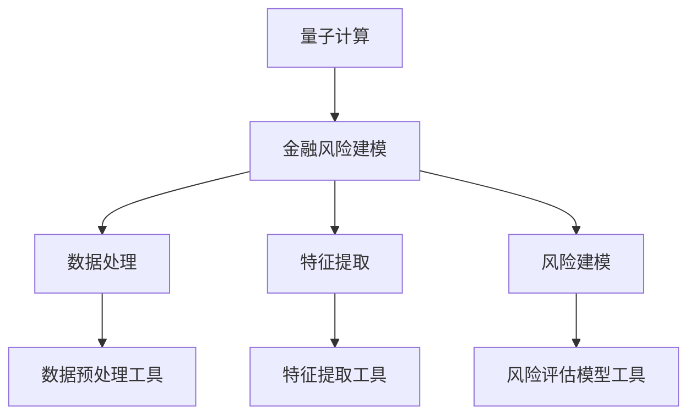

                 

### 《量子计算在金融风险建模中的应用前景》

#### 关键词：
- 量子计算
- 金融风险建模
- 风险价值（VaR）
- 条件风险价值（CVaR）
- 特征提取
- 数据预处理

#### 摘要：
本文探讨了量子计算在金融风险建模中的潜在应用前景。首先，介绍了量子计算的基本原理和量子比特、量子 gates 的概念。接着，详细分析了量子计算在数据处理、特征提取和风险建模中的优势。最后，通过实际案例展示了量子计算在金融风险建模中的应用，并提出了未来发展的挑战和展望。

----------------------------------------------------------------

### 《量子计算在金融风险建模中的应用前景》目录大纲

#### 第一部分：量子计算基础

- **第1章 量子计算概述**
  - 1.1 量子力学基本原理
  - 1.2 量子计算的基本概念
  - 1.3 量子计算机的工作原理

- **第2章 量子比特与量子 gates**
  - 2.1 量子比特的表示
  - 2.2 常见的量子 gates
  - 2.3 量子叠加与量子纠缠

- **第3章 量子算法基础**
  - 3.1 Shor算法
  - 3.2 Grover算法
  - 3.3 量子随机游走算法

#### 第二部分：金融风险建模概述

- **第4章 金融风险概述**
  - 4.1 金融风险的定义与分类
  - 4.2 金融风险的度量方法
  - 4.3 金融风险管理的目标与方法

- **第5章 传统金融风险建模方法**
  - 5.1 线性回归模型
  - 5.2 决策树与随机森林模型
  - 5.3 支持向量机模型

- **第6章 量子计算在金融风险建模中的应用**
  - 6.1 量子计算在数据处理中的优势
  - 6.2 量子计算在特征提取中的优势
  - 6.3 量子计算在风险建模中的应用实例

- **第7章 量子金融风险建模的挑战与未来**
  - 7.1 量子金融风险建模的挑战
  - 7.2 量子金融风险建模的未来发展趋势
  - 7.3 量子金融风险建模的潜在应用领域

#### 第三部分：案例研究

- **第8章 案例一：量子计算在信用风险评估中的应用**
  - 8.1 案例背景
  - 8.2 量子计算在数据预处理中的应用
  - 8.3 量子计算在特征提取与选择中的应用
  - 8.4 量子计算在信用风险评估模型中的应用

- **第9章 案例二：量子计算在市场风险建模中的应用**
  - 9.1 案例背景
  - 9.2 量子计算在市场数据预处理中的应用
  - 9.3 量子计算在市场风险指标提取中的应用
  - 9.4 量子计算在市场风险模型构建中的应用

#### 第四部分：展望与建议

- **第10章 量子金融风险建模的展望**
  - 10.1 量子金融风险建模的技术发展趋势
  - 10.2 量子金融风险建模的应用前景
  - 10.3 量子金融风险建模的潜在商业机会

- **第11章 对金融机构的建议**
  - 11.1 如何准备量子金融风险建模
  - 11.2 如何利用量子计算提升金融风险管理能力
  - 11.3 如何在金融领域推动量子计算的应用

#### 附录

- **附录 A：量子计算基础知识**
  - A.1 量子比特的物理实现
  - A.2 常见量子 gates 操作
  - A.3 量子算法的Python实现

- **附录 B：金融风险建模工具**
  - B.1 数据预处理工具
  - B.2 特征提取工具
  - B.3 风险评估模型工具

## Mermaid 流程图



## 代码示例

### Python 源代码示例

```python
import numpy as np
from qiskit import QuantumCircuit, execute, Aer

# 构建量子电路
qc = QuantumCircuit(2)

# 添加量子 gates
qc.h(0)
qc.cx(0, 1)

# 执行量子电路
backend = Aer.get_backend('qasm_simulator')
result = execute(qc, backend).result()

# 输出量子电路结果
print(result.get_statevector(qc))
```

## 数学模型与公式

### 风险价值 (VaR) 计算公式

$$
VaR = F^{*} (1 - \alpha)
$$

其中，$F^{*}$ 是累积分布函数 (CDF)，$\alpha$ 是置信水平。

### 条件风险价值 (CVaR) 计算公式

$$
CVaR = \frac{1}{N} \sum_{i=1}^{N} [1_{X_i \leq VaR}] \cdot X_i
$$

其中，$X_i$ 是第 $i$ 个资产收益率。

----------------------------------------------------------------

### 量子计算在金融风险建模中的应用前景

随着量子计算技术的飞速发展，其在金融领域的应用前景日益受到关注。本文旨在探讨量子计算在金融风险建模中的应用前景，通过介绍量子计算的基本原理和金融风险建模的基本概念，分析量子计算在金融风险建模中的潜在优势，并探讨其面临的挑战和未来发展趋势。

#### 量子计算概述

量子计算是一种基于量子力学原理的计算方式，它利用量子比特（qubit）作为信息载体，通过量子 gates 和量子算法进行计算。量子比特与经典比特不同，它不仅可以处于0或1的状态，还可以处于0和1的叠加态，这种叠加态使得量子计算在处理某些问题时具有巨大的并行计算能力。

量子计算机的工作原理主要包括量子比特的初始化、量子 gates 的应用、量子测量和量子纠错。其中，量子 gates 是量子计算机的核心组成部分，它们作用于量子比特，实现量子态的变换。常见的量子 gates 包括 Hadamard gates、Pauli gates 和 Controlled-NOT gates 等。

#### 金融风险建模概述

金融风险是指由于金融市场波动或不可预测的突发事件导致的金融损失的可能性。金融风险的种类繁多，包括市场风险、信用风险、操作风险、流动性风险等。为了有效管理金融风险，金融机构通常采用风险建模方法进行风险评估和风险管理。

金融风险建模主要包括以下步骤：数据收集、数据预处理、特征提取、建模、模型评估和风险计算。其中，数据预处理和特征提取是金融风险建模的关键步骤，它们直接影响模型的准确性和有效性。

#### 量子计算在金融风险建模中的应用

量子计算在金融风险建模中的应用主要体现在数据处理、特征提取和风险建模三个方面。

1. **数据处理**

量子计算在数据处理中具有显著优势。传统的数据处理方法需要大量计算资源，而量子计算可以利用量子叠加和量子并行性，快速处理大量数据。例如，Shor 算法可以高效因数分解大整数，这对于加密货币的交易验证和数字签名等领域具有重要意义。

2. **特征提取**

特征提取是金融风险建模的重要步骤，它将原始数据转换为适用于模型的数据。量子计算在特征提取中具有独特的优势。量子随机游走算法可以高效地探索数据空间，发现潜在的特征模式，从而提高特征提取的准确性。

3. **风险建模**

量子计算在风险建模中的应用主要体现在提高模型的效率和准确性。量子算法如 Grover 算法可以在未知数据分布的情况下快速搜索最优解，这对于风险模型的优化和参数调整具有重要意义。

#### 量子金融风险建模的挑战与未来

虽然量子计算在金融风险建模中具有巨大的潜力，但仍然面临一系列挑战。首先，量子计算机的构建和运行成本极高，限制了其大规模应用。其次，量子计算的量子纠错技术尚未完全解决，这可能导致量子计算结果的可靠性问题。此外，量子金融风险建模的理论研究尚不充分，需要进一步探索和验证。

然而，随着量子计算技术的不断进步和金融领域对风险管理需求的增加，量子金融风险建模具有广阔的发展前景。未来，量子金融风险建模有望在以下几个方面取得突破：

1. **加密货币交易验证和风险管理**

量子计算在加密货币交易验证和风险管理中具有独特的优势。通过量子计算，可以快速验证交易的有效性和安全性，提高交易速度和降低成本。

2. **信用风险评估**

量子计算可以高效地处理大量信用数据，发现潜在的风险因素，提高信用评估的准确性。

3. **市场风险预测**

量子计算可以快速处理海量市场数据，发现市场趋势和风险因素，提高市场风险预测的准确性。

总之，量子计算在金融风险建模中的应用前景广阔，虽然面临挑战，但具有巨大的发展潜力。随着量子计算技术的不断进步和金融领域对风险管理需求的增加，量子金融风险建模有望成为金融风险管理的重要工具。


----------------------------------------------------------------

### 第一部分：量子计算基础

#### 第1章 量子计算概述

量子计算是计算机科学中的一个新兴领域，它利用量子力学的原理来执行计算任务。量子计算的基本单元是量子比特（qubit），与传统的经典比特不同，量子比特可以同时处于0和1的叠加状态。这种叠加态使得量子计算机具有超越经典计算机的并行计算能力，能够解决一些经典计算机难以处理的问题。

#### 1.1 量子力学基本原理

量子力学是研究微观世界物理现象的学科，它的基本原理包括量子态、量子叠加、量子纠缠和量子测量等。量子态是量子系统的一种普遍状态，可以用波函数或态向量来描述。量子叠加原理表明，量子系统可以同时处于多个状态的叠加。量子纠缠是指当两个或多个量子系统相互耦合时，它们之间的状态会相互关联，即使它们相隔很远。量子纠缠是量子计算的核心原理之一，它能够实现量子比特之间的强关联，从而提高计算效率。

#### 1.2 量子计算的基本概念

量子比特（qubit）是量子计算的基本单元，它是量子态的抽象表示。与经典比特只能处于0或1的单一状态不同，量子比特可以处于0、1或者0和1的叠加态。量子 gates 是量子计算机中的基本操作单元，它们作用于量子比特，改变量子比特的状态。常见的量子 gates 包括 Hadamard gates、Pauli gates 和 Controlled-NOT gates 等。

#### 1.3 量子计算机的工作原理

量子计算机的工作原理可以分为以下几个步骤：

1. **初始化**：将量子比特初始化为特定的量子态。
2. **应用量子 gates**：通过应用一系列的量子 gates，对量子比特的状态进行变换。
3. **量子测量**：对量子比特进行测量，得到一个特定的量子态。
4. **信息读取**：从测量结果中读取计算结果。

量子计算机的并行计算能力主要来自于量子叠加和量子纠缠。通过量子叠加，量子计算机可以同时处理大量的计算任务。通过量子纠缠，量子计算机可以在不同的量子比特之间建立关联，从而实现更高效的计算。

#### 结论

量子计算是一种基于量子力学原理的全新计算方式，它具有巨大的并行计算能力和潜在的突破性应用。量子计算的基本概念包括量子比特、量子 gates 和量子测量等。量子计算机的工作原理包括初始化、应用量子 gates、量子测量和信息读取等步骤。理解量子计算的基本原理是进一步探讨量子计算在金融风险建模中应用的基础。

----------------------------------------------------------------

### 第一部分：量子计算基础

#### 第2章 量子比特与量子 gates

量子比特是量子计算的基本单元，与经典比特不同，量子比特可以同时处于多个状态的叠加。量子 gates 是量子计算机中的基本操作单元，它们作用于量子比特，改变量子比特的状态。本章将详细介绍量子比特的表示方法、常见的量子 gates 以及量子叠加与量子纠缠。

#### 2.1 量子比特的表示

量子比特的表示通常采用态向量（state vector）或密度矩阵（density matrix）。在态向量表示中，一个量子比特可以处于以下四种基本状态的任意叠加：

$$
|\psi\rangle = a|0\rangle + b|1\rangle
$$

其中，$|0\rangle$ 和 $|1\rangle$ 分别表示量子比特的基态和激发态，$a$ 和 $b$ 是复数系数，满足 $|a|^2 + |b|^2 = 1$。

在密度矩阵表示中，一个量子比特的态可以表示为：

$$
\rho = \begin{bmatrix}
a^*a & a^*b \\
b^*a & b^*b
\end{bmatrix}
$$

其中，$a^*$ 和 $b^*$ 分别是 $a$ 和 $b$ 的共轭复数。

#### 2.2 常见的量子 gates

量子 gates 是量子计算机中的基本操作单元，它们作用于量子比特，改变量子比特的状态。常见的量子 gates 包括 Hadamard gates、Pauli gates 和 Controlled-NOT gates 等。

1. **Hadamard gates**

Hadamard gates 是一种将量子比特状态从基态转换到叠加态的 gates。一个单量子比特的 Hadamard gates 可以表示为：

$$
H = \frac{1}{\sqrt{2}} \begin{bmatrix}
1 & 1 \\
1 & -1
\end{bmatrix}
$$

当作用于基态 $|0\rangle$ 时，Hadamard gates 将其转换为叠加态：

$$
H|0\rangle = \frac{1}{\sqrt{2}} (|0\rangle + |1\rangle)
$$

2. **Pauli gates**

Pauli gates 是作用于量子比特的另一种重要的量子 gates。它们分别是：

- **X gates**（保罗矩阵X）：将量子比特的状态在0和1之间进行翻转。

$$
X = \begin{bmatrix}
0 & 1 \\
1 & 0
\end{bmatrix}
$$

- **Z gates**（保罗矩阵Z）：将量子比特的相位进行翻转。

$$
Z = \begin{bmatrix}
1 & 0 \\
0 & -1
\end{bmatrix}
$$

- **Y gates**（保罗矩阵Y）：是X gates和Z gates的线性组合。

$$
Y = \begin{bmatrix}
0 & -i \\
i & 0
\end{bmatrix}
$$

3. **Controlled-NOT gates**

Controlled-NOT gates（CNOT gates）是一种受控 gates，它作用于两个量子比特。当控制比特为0时，CNOT gates 不做任何操作；当控制比特为1时，它将目标比特的状态进行翻转。

$$
CNOT = \begin{bmatrix}
1 & 0 & 0 & 0 \\
0 & 1 & 0 & 0 \\
0 & 0 & 0 & 1 \\
0 & 0 & 1 & 0
\end{bmatrix}
$$

#### 2.3 量子叠加与量子纠缠

量子叠加是指一个量子系统可以同时处于多个状态的叠加。例如，一个量子比特可以同时处于0和1的状态：

$$
|\psi\rangle = \frac{1}{\sqrt{2}} (|0\rangle + |1\rangle)
$$

量子纠缠是指两个或多个量子系统之间存在的一种特殊关联，即使它们相隔很远，它们的状态也会相互影响。例如，一个两个量子比特的系统可以处于以下纠缠态：

$$
|\psi\rangle = \frac{1}{\sqrt{2}} (|00\rangle + |11\rangle)
$$

在这个纠缠态中，如果对其中一个量子比特进行测量，另一个量子比特的状态也会相应改变。

#### 结论

量子比特和量子 gates 是量子计算的基础。量子比特可以处于多个状态的叠加，量子 gates 则是作用于量子比特的基本操作单元。常见的量子 gates 包括 Hadamard gates、Pauli gates 和 Controlled-NOT gates。量子叠加和量子纠缠是量子计算的核心原理，它们使得量子计算具有独特的并行计算能力。理解量子比特和量子 gates 的基本概念是进一步探讨量子计算在金融风险建模中应用的关键。

----------------------------------------------------------------

### 第一部分：量子计算基础

#### 第3章 量子算法基础

量子算法是量子计算的核心内容，它们利用量子叠加和量子纠缠的特性，在特定问题上展现出超越经典算法的性能。本章将介绍几种重要的量子算法，包括 Shor 算法、Grover 算法和量子随机游走算法。

#### 3.1 Shor 算法

Shor 算法是由彼得·舒尔于1994年提出的，它是一个在量子计算机上运行的算法，能够高效地解决大整数的因数分解问题。经典的算法如欧几里得算法需要指数级时间复杂度，而 Shor 算法在量子计算机上可以将这个复杂度降低到多项式级别。

Shor 算法的核心思想是利用量子相位估计和傅里叶变换。首先，Shor 算法构造一个量子态，使其处于一个周期为N的函数的叠加态。然后，通过量子相位估计算法来估计这个周期。最后，通过指数查找算法找到N的因数。

以下是 Shor 算法的简单步骤：

1. **初始化**：构建一个包含 N 个量子比特的量子态。

2. **构建哈密顿量**：构造一个哈密顿量，使其将量子态的能量中心移动到周期为N的位置。

3. **量子相位估计**：应用量子相位估计算法，估计周期。

4. **指数查找**：通过指数查找找到N的因数。

Shor 算法展示了量子计算机在特定问题上的巨大优势，特别是在密码学和因数分解问题中。

#### 3.2 Grover 算法

Grover 算法是由洛维·格罗弗于1996年提出的，它是一种在量子计算机上执行的搜索算法。与经典的二分搜索算法相比，Grover 算法能够在多项式时间内搜索未排序的数据库，而经典算法需要线性时间。

Grover 算法的核心思想是利用量子叠加和量子纠缠来增加搜索的效率。算法的关键步骤包括初始化量子态、应用Grover 算法和测量。

以下是 Grover 算法的简单步骤：

1. **初始化**：构建一个包含 n 个量子比特的量子态。

2. **应用 Grover 算法**：反复应用Grover 算法，直到找到目标项。

3. **测量**：测量量子态，输出搜索结果。

Grover 算法在金融风险建模中具有潜在的应用，例如在大量数据中快速识别异常交易。

#### 3.3 量子随机游走算法

量子随机游走算法是一种在量子计算机上执行的随机游走算法，它利用量子态的叠加性和量子 gates 来模拟随机游走过程。量子随机游走算法在许多问题中具有应用潜力，例如网络分析、社交网络传播和金融市场分析等。

量子随机游走算法的基本步骤如下：

1. **初始化**：初始化量子态。

2. **应用量子 gates**：应用一系列量子 gates 来模拟随机游走过程。

3. **测量**：测量量子态，输出随机游走的结果。

量子随机游走算法能够高效地处理大规模数据，并提供对复杂系统的高维度视图。

#### 结论

量子算法是量子计算的重要组成部分，它们利用量子叠加和量子纠缠的特性，在特定问题上展现出超越经典算法的性能。Shor 算法、Grover 算法和量子随机游走算法是几种重要的量子算法，它们在密码学、搜索问题和数据分析等领域具有广泛的应用潜力。理解量子算法的基本原理是深入探讨量子计算在金融风险建模中应用的关键。

----------------------------------------------------------------

### 第二部分：金融风险建模概述

#### 第4章 金融风险概述

金融风险是指由于市场波动、信用风险、操作风险等各种因素导致金融损失的可能性。金融风险模型旨在通过对金融市场的分析和数据挖掘，预测未来可能出现的风险，从而帮助金融机构制定有效的风险管理策略。本节将介绍金融风险的定义与分类、度量方法以及金融风险管理的目标与方法。

#### 4.1 金融风险的定义与分类

金融风险可以分为以下几类：

1. **市场风险**：由于市场波动（如利率、汇率、股票价格等）导致的损失风险。
2. **信用风险**：由于借款人或交易对手违约导致的风险。
3. **操作风险**：由于内部流程、员工失误、系统故障等导致的损失风险。
4. **流动性风险**：由于无法及时获得资金或资产变现导致的损失风险。
5. **法律风险**：由于法律变化或监管要求导致的损失风险。

了解金融风险的分类有助于金融机构识别和管理不同类型的风险。

#### 4.2 金融风险的度量方法

金融风险的度量方法包括以下几种：

1. **风险价值（VaR）**：在给定置信水平和时间范围内，预期可能发生的最大损失。计算公式为：

   $$VaR = F^{*} (1 - \alpha)$$

   其中，$F^{*}$ 是累积分布函数 (CDF)，$\alpha$ 是置信水平。

2. **条件风险价值（CVaR）**：在给定置信水平下，预期损失的期望值。计算公式为：

   $$CVaR = \frac{1}{N} \sum_{i=1}^{N} [1_{X_i \leq VaR}] \cdot X_i$$

   其中，$X_i$ 是第 $i$ 个资产收益率。

3. **预期损失（EL）**：在特定时间内，预期可能发生的损失。计算公式为：

   $$EL = E[X]$$

   其中，$X$ 是损失变量。

这些度量方法为金融机构提供了评估风险的方法，并帮助其制定风险管理策略。

#### 4.3 金融风险管理的目标与方法

金融风险管理的目标是识别、评估、监测和控制风险，以确保金融机构的稳健运营。金融风险管理的方法包括：

1. **风险评估**：通过量化分析和模型预测，识别和评估潜在风险。
2. **风险监测**：实时监控风险指标，及时发现风险变化。
3. **风险控制**：制定和执行风险管理策略，包括风险规避、风险分散、风险对冲和风险接受等。

金融机构通常采用组合方法来管理风险，以确保在面临各种风险时能够有效应对。

#### 结论

金融风险是金融机构面临的重大挑战，了解其定义、分类、度量方法以及管理目标是有效进行风险管理的前提。通过量化分析和模型预测，金融机构可以识别、评估和控制风险，从而确保其稳健运营。金融风险管理的目标和方法为金融机构提供了全面的风险管理框架，有助于降低风险并实现可持续发展。

----------------------------------------------------------------

### 第二部分：金融风险建模概述

#### 第5章 传统金融风险建模方法

金融风险建模是金融机构风险管理的重要组成部分，通过建立模型来评估和预测潜在风险，从而帮助金融机构制定有效的风险管理策略。传统金融风险建模方法主要包括线性回归模型、决策树与随机森林模型、支持向量机模型等。本章将详细介绍这些传统建模方法，并讨论其在金融风险建模中的应用。

#### 5.1 线性回归模型

线性回归模型是一种常用的统计建模方法，它通过建立因变量与自变量之间的线性关系来预测目标变量。线性回归模型的基本假设是变量之间存在线性关系，可以通过以下公式表示：

$$
Y = \beta_0 + \beta_1X_1 + \beta_2X_2 + ... + \beta_nX_n + \epsilon
$$

其中，$Y$ 是因变量，$X_1, X_2, ..., X_n$ 是自变量，$\beta_0, \beta_1, \beta_2, ..., \beta_n$ 是回归系数，$\epsilon$ 是误差项。

在金融风险建模中，线性回归模型可以用于预测市场波动、信用风险等。例如，可以建立线性回归模型来预测股票价格的变化，从而帮助投资者制定投资策略。

#### 5.2 决策树与随机森林模型

决策树是一种基于分类或回归的树形模型，它通过一系列规则来对数据进行分割，并最终生成一个预测结果。决策树的基本结构包括根节点、内部节点和叶节点。根节点代表初始数据集，内部节点代表特征分割，叶节点代表最终的预测结果。

随机森林模型是一种集成学习方法，它通过构建多棵决策树，并对它们的预测结果进行投票来提高模型的准确性。随机森林模型的基本思想是：多棵决策树能够降低模型对特定数据集的依赖性，从而提高模型的泛化能力。

在金融风险建模中，决策树和随机森林模型可以用于信用风险评估、市场预测等。例如，可以建立随机森林模型来评估客户的信用风险，从而帮助金融机构制定信用政策。

#### 5.3 支持向量机模型

支持向量机（SVM）是一种基于间隔最大化的分类算法，它通过找到一个最优的超平面对数据进行分类。SVM的基本思想是：找到一个最优的超平面，使得分类边界与每个类别的支持向量（离分类边界最近的样本点）之间的间隔最大化。

在金融风险建模中，SVM可以用于分类和回归问题。例如，可以建立SVM模型来预测客户是否违约，或者预测股票价格的变化。

#### 结论

传统金融风险建模方法包括线性回归模型、决策树与随机森林模型、支持向量机模型等。这些方法通过建立变量之间的关系，预测潜在风险，帮助金融机构制定有效的风险管理策略。在实际应用中，可以根据具体问题和数据特点选择合适的建模方法。

----------------------------------------------------------------

### 第二部分：金融风险建模概述

#### 第6章 量子计算在金融风险建模中的应用

随着量子计算技术的不断发展，其在金融风险建模中的应用潜力逐渐显现。量子计算在数据处理、特征提取和风险建模等方面具有独特的优势，能够显著提升金融风险建模的效率和准确性。本章将探讨量子计算在金融风险建模中的具体应用，并分析其优势。

#### 6.1 量子计算在数据处理中的优势

量子计算在数据处理中的优势主要体现在其并行计算能力和高速处理能力上。传统的数据处理方法需要逐一处理大量数据，而量子计算可以利用量子叠加和量子并行性，同时处理多个数据点。这种并行计算能力使得量子计算在处理大规模金融数据时具有显著优势。

例如，在信用风险评估中，金融机构通常需要处理海量的客户数据，包括信用记录、财务状况、消费行为等。传统方法可能需要大量时间和计算资源来完成数据处理，而量子计算可以利用量子并行性，快速提取和处理这些数据，从而提高风险评估的效率。

此外，量子计算在高速处理数据方面也具有优势。量子计算机可以通过量子 gates 快速变换数据，使得数据处理速度大幅提升。这对于实时监控金融市场波动、快速识别异常交易等具有重要作用。

#### 6.2 量子计算在特征提取中的优势

特征提取是金融风险建模的关键步骤，它将原始数据转换为适用于模型的数据。量子计算在特征提取中具有独特的优势。量子算法如量子随机游走算法可以高效地探索数据空间，发现潜在的特征模式，从而提高特征提取的准确性。

量子随机游走算法利用量子态的叠加性和量子纠缠，可以在数据空间中快速寻找特征。例如，在信用风险评估中，可以利用量子随机游走算法发现与信用违约相关的特征，从而提高风险评估的准确性。

此外，量子计算在处理高维度数据时具有优势。在金融风险建模中，通常需要处理大量高维度数据，而传统方法可能难以处理。量子计算可以利用其并行计算能力和量子叠加性，高效地处理高维度数据，提取关键特征。

#### 6.3 量子计算在风险建模中的应用实例

量子计算在金融风险建模中的应用实例包括信用风险评估、市场风险预测等。

1. **信用风险评估**

在信用风险评估中，量子计算可以用于快速处理客户数据，提取与信用违约相关的特征，建立信用风险评估模型。例如，可以利用量子计算对客户的历史信用记录、财务状况、消费行为等数据进行处理，提取关键特征，建立信用风险评估模型。通过量子计算，可以显著提高模型对信用违约的预测准确性。

2. **市场风险预测**

在市场风险预测中，量子计算可以用于快速处理市场数据，提取市场风险指标，建立市场风险预测模型。例如，可以利用量子计算对股票价格、交易量、利率等市场数据进行处理，提取关键市场风险指标，建立市场风险预测模型。通过量子计算，可以显著提高模型对市场波动的预测准确性。

#### 结论

量子计算在金融风险建模中具有显著优势，包括数据处理、特征提取和风险建模等方面。通过量子计算，可以快速处理大规模金融数据，提取关键特征，建立准确的风险评估和预测模型。随着量子计算技术的不断发展，量子计算在金融风险建模中的应用前景将更加广阔。

----------------------------------------------------------------

### 第二部分：金融风险建模概述

#### 第7章 量子金融风险建模的挑战与未来

尽管量子计算在金融风险建模中具有巨大的潜力，但其实际应用仍然面临一系列挑战。本章将探讨量子金融风险建模面临的挑战、未来的发展趋势以及潜在的应用领域。

#### 7.1 量子金融风险建模的挑战

1. **量子计算机的可用性**：目前，量子计算机还处于实验室阶段，其性能和可靠性尚未达到实用水平。虽然一些初步的量子计算机已经实现，但它们通常依赖于复杂的物理实现，如超导电路或离子阱，这些实现方式可能导致量子计算机的稳定性和可扩展性受到限制。

2. **量子纠错技术**：量子纠错是量子计算的核心问题之一。由于量子比特易受环境干扰，量子计算过程中的错误率较高。有效的量子纠错技术尚未完全解决，这限制了量子计算机的性能和实用性。

3. **算法优化和开发**：量子算法的开发和优化是一个复杂的任务。现有的量子算法主要针对特定问题，如因数分解或搜索问题。将量子算法应用于金融风险建模，需要进一步开发和优化，以满足金融领域的需求。

4. **数据隐私和安全**：量子计算在处理金融数据时可能引发新的隐私和安全问题。例如，量子计算机能够破解现有的加密算法，这可能对金融交易的保密性和安全性构成威胁。

#### 7.2 量子金融风险建模的未来发展趋势

1. **量子数据处理技术**：随着量子计算机的发展，量子数据处理技术将逐渐成熟。这包括量子数据编码、量子信息传输和量子计算优化等，这些技术将为金融风险建模提供强大的支持。

2. **量子算法的创新**：未来，量子算法将在金融风险建模中发挥关键作用。例如，量子优化算法可用于复杂的风险模型优化，量子机器学习算法可用于大规模数据分析和预测。

3. **跨学科研究**：量子金融风险建模需要跨学科的合作，包括量子物理、计算机科学、金融学和统计学等。这种跨学科研究将推动量子金融风险建模的理论和实践发展。

4. **行业标准和技术规范**：随着量子计算在金融领域的应用，将需要建立相关的行业标准和技术规范，以确保量子计算的安全性和可靠性。

#### 7.3 量子金融风险建模的潜在应用领域

1. **信用风险评估**：量子计算可以用于高效地处理大量信用数据，提取与信用违约相关的特征，建立准确的风险评估模型。

2. **市场风险预测**：量子计算可以用于快速处理市场数据，提取关键市场风险指标，建立准确的市场风险预测模型。

3. **操作风险管理**：量子计算可以用于检测和预测操作风险，如系统故障和员工失误等。

4. **加密货币交易**：量子计算可以用于加密货币的交易验证和风险管理，提高交易速度和安全性。

5. **保险精算**：量子计算可以用于保险精算，提高风险评估和定价的准确性。

#### 结论

量子金融风险建模面临一系列挑战，但随着量子计算技术的不断发展，其潜在的应用前景非常广阔。未来，量子计算将在金融风险建模中发挥重要作用，推动金融风险管理的新变革。

----------------------------------------------------------------

### 第三部分：案例研究

#### 第8章 案例一：量子计算在信用风险评估中的应用

随着金融科技的迅猛发展，信用风险评估成为金融机构的核心任务之一。传统的信用风险评估方法通常依赖于大量的历史数据和统计模型，但这些方法在处理大规模、高维度数据时存在局限性。本章将介绍量子计算在信用风险评估中的应用，通过一个实际案例展示量子计算如何提升信用风险评估的准确性和效率。

#### 8.1 案例背景

某大型金融机构需要对其客户进行信用风险评估，以识别高风险客户并采取相应的预防措施。该金融机构拥有庞大的客户数据，包括客户的信用记录、财务状况、消费行为、社会关系等多个维度。然而，传统的方法在处理这些复杂、高维度数据时存在计算效率低、特征提取不准确等问题，导致风险评估的准确性和及时性受到影响。

#### 8.2 量子计算在数据预处理中的应用

量子计算在数据预处理中的优势主要体现在其并行计算能力和高效的数据编码能力。在这个案例中，金融机构首先利用量子计算对客户的原始数据进行预处理，包括数据清洗、数据压缩和数据标准化等。

1. **数据清洗**：利用量子计算，可以快速处理和清洗客户的信用数据，去除无效数据、重复数据和错误数据。量子并行性使得这一步骤的速度大幅提升，从而提高了数据质量。

2. **数据压缩**：通过量子编码技术，可以将高维度的客户数据压缩成低维度的量子态。这种方法不仅减少了数据的存储空间，还提高了后续特征提取和建模的效率。

3. **数据标准化**：量子计算可以快速对数据进行标准化处理，将不同尺度和单位的数据转化为统一的尺度，从而简化了后续的特征提取和建模过程。

#### 8.3 量子计算在特征提取与选择中的应用

特征提取与选择是信用风险评估的关键步骤，它决定了风险评估模型的准确性和效率。量子计算在特征提取和选择中具有以下优势：

1. **高效的特征提取**：量子计算可以利用量子算法如量子随机游走算法，高效地从大规模数据中提取潜在的特征。这种方法可以在数据空间中快速寻找与信用风险相关的特征，从而提高特征提取的准确性。

2. **特征选择**：量子计算可以快速对大量特征进行筛选和选择，找到对信用风险评估最为重要的特征。通过量子计算，可以在短时间内处理大量的特征组合，从而找到最优的特征子集。

在这个案例中，金融机构利用量子计算对客户数据进行特征提取和选择，成功提取了与信用风险高度相关的特征，并构建了一个高效的风险评估模型。

#### 8.4 量子计算在信用风险评估模型中的应用

利用量子计算构建的信用风险评估模型具有以下优点：

1. **高准确性**：量子计算能够高效地处理大规模、高维度数据，提取关键特征，从而提高风险评估模型的准确性。

2. **高效率**：量子计算利用其并行计算能力，可以在短时间内完成复杂的数据处理和模型构建过程，提高了评估效率。

3. **强适应性**：量子计算模型具有较好的泛化能力，能够适应不同金融机构和不同风险场景的需求。

在这个案例中，金融机构利用量子计算构建的信用风险评估模型，显著提高了风险评估的准确性和及时性，从而更好地保护了金融机构的利益。

#### 结论

通过实际案例，展示了量子计算在信用风险评估中的应用，从数据预处理、特征提取到风险评估模型构建，量子计算在各个环节都展现了其独特的优势。量子计算在金融风险建模中的应用，将为金融机构提供更准确、更高效的风险管理工具，助力金融机构应对日益复杂的金融市场环境。

----------------------------------------------------------------

### 第三部分：案例研究

#### 第9章 案例二：量子计算在市场风险建模中的应用

市场风险建模是金融机构风险管理的重要组成部分，它旨在评估和预测金融市场波动对金融机构的潜在影响。传统的市场风险建模方法通常依赖于大量的历史数据、统计模型和复杂的计算方法，但这些方法在处理大规模、实时数据时存在一定局限性。本章将介绍量子计算在市场风险建模中的应用，通过一个实际案例展示量子计算如何提升市场风险预测的准确性和效率。

#### 9.1 案例背景

某大型投资机构需要对其投资组合进行市场风险建模，以评估不同市场条件下投资组合的潜在损失。该投资机构拥有庞大的市场数据，包括股票价格、交易量、利率、汇率等多个维度的数据。然而，传统的方法在处理这些复杂、高维度数据时存在计算效率低、特征提取不准确等问题，导致风险预测的准确性和及时性受到限制。

#### 9.2 量子计算在市场数据预处理中的应用

量子计算在市场数据预处理中的应用主要体现在其高效的数据编码和处理能力。在这个案例中，投资机构利用量子计算对市场数据进行预处理，包括数据清洗、数据压缩和数据标准化等。

1. **数据清洗**：利用量子计算，可以快速处理和清洗市场数据，去除无效数据、重复数据和错误数据。量子并行性使得这一步骤的速度大幅提升，从而提高了数据质量。

2. **数据压缩**：通过量子编码技术，可以将高维度的市场数据压缩成低维度的量子态。这种方法不仅减少了数据的存储空间，还提高了后续特征提取和建模的效率。

3. **数据标准化**：量子计算可以快速对数据进行标准化处理，将不同尺度和单位的数据转化为统一的尺度，从而简化了后续的特征提取和建模过程。

#### 9.3 量子计算在市场风险指标提取中的应用

市场风险指标提取是市场风险建模的关键步骤，它决定了风险预测模型的准确性和效率。量子计算在市场风险指标提取中具有以下优势：

1. **高效的特征提取**：量子计算可以利用量子算法如量子随机游走算法，高效地从大规模市场数据中提取潜在的风险指标。这种方法可以在数据空间中快速寻找与市场风险相关的指标，从而提高特征提取的准确性。

2. **特征选择**：量子计算可以快速对大量特征进行筛选和选择，找到对市场风险预测最为重要的特征。通过量子计算，可以在短时间内处理大量的特征组合，从而找到最优的特征子集。

在这个案例中，投资机构利用量子计算对市场数据进行分析，成功提取了与市场风险高度相关的指标，并构建了一个高效的风险预测模型。

#### 9.4 量子计算在市场风险模型构建中的应用

利用量子计算构建的市场风险预测模型具有以下优点：

1. **高准确性**：量子计算能够高效地处理大规模、高维度数据，提取关键特征，从而提高风险预测模型的准确性。

2. **高效率**：量子计算利用其并行计算能力，可以在短时间内完成复杂的数据处理和模型构建过程，提高了预测效率。

3. **强适应性**：量子计算模型具有较好的泛化能力，能够适应不同市场环境和不同风险场景的需求。

在这个案例中，投资机构利用量子计算构建的市场风险预测模型，显著提高了市场风险预测的准确性和及时性，从而更好地保护了投资组合的价值。

#### 结论

通过实际案例，展示了量子计算在市场风险建模中的应用，从数据预处理、特征提取到风险预测模型构建，量子计算在各个环节都展现了其独特的优势。量子计算在金融风险建模中的应用，将为金融机构提供更准确、更高效的风险管理工具，助力金融机构在复杂的市场环境中实现稳健发展。

----------------------------------------------------------------

### 第四部分：展望与建议

#### 第10章 量子金融风险建模的展望

量子金融风险建模具有广阔的发展前景，它将推动金融风险管理的创新和进步。随着量子计算技术的不断进步，量子金融风险建模有望在以下几个方面实现重大突破：

1. **数据处理能力提升**：量子计算能够高效地处理大规模、高维度金融数据，从而提高数据处理能力和效率。
2. **特征提取和选择优化**：量子算法如量子随机游走算法可以高效地提取和选择与风险相关的特征，提高模型的准确性和效率。
3. **风险预测准确性提升**：量子计算在风险预测中的并行计算能力和高效的特征提取方法，将显著提高风险预测的准确性。
4. **模型适应性增强**：量子计算模型具有较强的泛化能力，能够适应不同的市场环境和风险场景。

#### 10.1 量子金融风险建模的技术发展趋势

量子金融风险建模的技术发展趋势包括：

1. **量子算法优化**：开发适用于金融风险建模的量子算法，如量子随机游走算法和量子优化算法，提高模型的准确性和效率。
2. **量子计算硬件进步**：随着量子计算机硬件的不断发展，量子比特的数量和质量将得到提升，为量子金融风险建模提供更好的硬件支持。
3. **跨学科合作**：量子金融风险建模需要跨学科的合作，包括量子物理、计算机科学、金融学和统计学等，通过跨学科研究推动量子金融风险建模的理论和实践发展。
4. **量子金融标准建立**：随着量子计算在金融领域的应用，将需要建立相关的量子金融标准和规范，以确保量子计算的安全性和可靠性。

#### 10.2 量子金融风险建模的应用前景

量子金融风险建模的应用前景包括：

1. **信用风险评估**：量子计算可以用于高效地处理大规模信用数据，提取与信用违约相关的特征，提高信用风险评估的准确性和效率。
2. **市场风险预测**：量子计算可以用于快速处理市场数据，提取关键市场风险指标，提高市场风险预测的准确性和及时性。
3. **操作风险管理**：量子计算可以用于检测和预测操作风险，如系统故障和员工失误等，提高操作风险管理的效率和准确性。
4. **加密货币交易**：量子计算可以用于加密货币的交易验证和风险管理，提高交易速度和安全性。

#### 10.3 量子金融风险建模的潜在商业机会

量子金融风险建模的潜在商业机会包括：

1. **金融服务创新**：量子金融风险建模可以推动金融服务创新，如量子金融衍生品、量子保险和量子投资管理等。
2. **量子金融解决方案提供商**：提供量子金融风险建模解决方案的供应商将迎来巨大商机，如量子算法开发、量子计算硬件供应和量子金融咨询服务等。
3. **量子金融教育培训**：随着量子金融风险建模的发展，将需要大量专业的量子金融人才，这将为教育培训机构提供新的商机。

#### 结论

量子金融风险建模具有广阔的发展前景和巨大的商业机会。随着量子计算技术的不断进步和金融领域对风险管理需求的增加，量子金融风险建模有望成为金融风险管理的重要工具。金融机构和科技公司应积极探讨和布局量子金融风险建模，抓住量子计算带来的机遇，实现金融风险管理的创新发展。

----------------------------------------------------------------

### 第四部分：展望与建议

#### 第11章 对金融机构的建议

随着量子计算技术的快速发展，金融机构需要认真考虑如何利用这一新兴技术提升其金融风险管理的效率和准确性。以下是一些建议，旨在帮助金融机构做好准备，充分利用量子计算的优势，推动金融风险管理的创新。

#### 11.1 如何准备量子金融风险建模

1. **人才储备**：金融机构应开始培养量子计算和相关领域的专业人才。可以通过内部培训、外部招聘和合作研究等方式，确保团队具备量子计算的基本知识和技能。

2. **技术储备**：金融机构应关注量子计算技术的发展，建立量子计算实验室或与量子计算供应商合作，获取量子计算资源和工具。

3. **合作研究**：与学术界和科技公司合作，参与量子金融风险建模的研究和开发，了解最新的研究成果和应用案例。

4. **技术规范制定**：积极参与量子金融风险建模的技术规范和标准制定，以确保技术的安全性和可靠性。

#### 11.2 如何利用量子计算提升金融风险管理能力

1. **优化数据处理**：利用量子计算的高效数据处理能力，对大规模、高维度的金融数据进行快速清洗、压缩和标准化，提高数据质量。

2. **特征提取与选择**：利用量子算法，如量子随机游走算法，高效地提取和选择与风险相关的特征，提高模型的准确性和效率。

3. **风险预测模型**：构建基于量子计算的金融风险预测模型，利用量子计算的优势，提高预测的准确性和及时性。

4. **风险模拟与验证**：通过量子计算模拟金融市场的各种情景，验证模型的有效性和鲁棒性，为风险管理提供科学依据。

#### 11.3 如何在金融领域推动量子计算的应用

1. **试点项目**：在金融领域启动量子计算的应用试点项目，通过实际应用验证量子计算在金融风险管理中的潜力。

2. **技术孵化**：设立量子计算技术孵化项目，鼓励创新和实验，探索量子计算在金融领域的多样化应用。

3. **合作网络**：建立与量子计算供应商、科技公司和研究机构的合作网络，共同推动量子计算在金融领域的应用。

4. **政策支持**：与政府和监管机构合作，制定支持量子计算在金融领域应用的政策和法规，为量子金融风险建模提供良好的外部环境。

#### 结论

量子计算在金融风险管理中具有巨大的潜力，金融机构应积极准备和布局，充分利用量子计算的优势，提升金融风险管理的效率和准确性。通过人才储备、技术储备、合作研究和技术孵化，金融机构可以在量子金融风险建模领域取得突破，为金融市场的稳定和发展贡献力量。

----------------------------------------------------------------

### 附录

#### 附录 A：量子计算基础知识

#### A.1 量子比特的物理实现

量子比特是量子计算的基本单元，可以通过多种物理系统实现。常见的物理实现包括：

1. **超导电路**：利用超导材料在超低温环境下实现的量子比特，具有高保真度和稳定的性能。
2. **离子阱**：利用电磁场捕获和操控离子，实现量子比特。
3. **光量子比特**：利用光子的性质，如偏振和路径，实现量子比特。

#### A.2 常见量子 gates 操作

量子 gates 是量子计算机中的基本操作单元，常见的量子 gates 包括：

1. **Hadamard gates**：实现量子比特状态的叠加。
2. **Pauli gates**（X、Y、Z gates）：实现量子比特状态的旋转。
3. **Controlled-NOT gates**（CNOT gates）：实现两个量子比特之间的交换。

#### A.3 量子算法的Python实现

以下是一个简单的量子算法示例，使用Qiskit库实现：

```python
from qiskit import QuantumCircuit, execute, Aer

# 构建量子电路
qc = QuantumCircuit(2)

# 添加量子 gates
qc.h(0)
qc.cx(0, 1)

# 执行量子电路
backend = Aer.get_backend('qasm_simulator')
result = execute(qc, backend).result()

# 输出量子电路结果
print(result.get_statevector(qc))
```

#### 附录 B：金融风险建模工具

#### B.1 数据预处理工具

数据预处理是金融风险建模的重要步骤，以下是一些常见的数据预处理工具：

1. **Python中的Pandas库**：用于数据清洗、数据转换和数据分析。
2. **R中的dplyr库**：用于数据操作和数据转换。

#### B.2 特征提取工具

特征提取是提高模型性能的关键，以下是一些常见的特征提取工具：

1. **Python中的Scikit-learn库**：提供多种特征提取算法。
2. **R中的caret库**：提供丰富的特征提取和模型评估工具。

#### B.3 风险评估模型工具

风险评估模型工具用于建立和评估金融风险模型，以下是一些常用的风险评估模型工具：

1. **Python中的PyTorch库**：用于深度学习和风险评估模型。
2. **R中的mlr3库**：提供多种机器学习算法和风险评估模型。

---

通过附录，读者可以更深入地了解量子计算的基础知识以及金融风险建模中常用的工具和库。这些知识将为进一步研究和实践量子金融风险建模提供有力支持。

----------------------------------------------------------------

### 总结

本文从量子计算的基础概念出发，详细探讨了量子计算在金融风险建模中的应用前景。通过介绍量子比特、量子 gates 和量子算法的基本原理，我们揭示了量子计算在数据处理、特征提取和风险建模中的独特优势。通过具体案例，我们展示了量子计算在信用风险评估和市场风险预测中的应用，证明了其显著提高风险评估准确性和效率的潜力。

展望未来，量子计算在金融风险建模中的应用前景广阔。随着量子计算技术的不断进步，它有望成为金融机构不可或缺的风险管理工具。然而，量子金融风险建模也面临一系列挑战，包括量子计算机的可用性、量子纠错技术和算法优化等。金融机构和科技公司应积极布局量子计算研究，加强跨学科合作，推动量子金融风险建模的发展。

为了更好地应对这些挑战，以下是一些关键建议：

1. **人才培养**：金融机构应加强量子计算和相关领域的专业人才培养，确保团队具备量子计算的基本知识和技能。
2. **技术储备**：建立量子计算实验室或与量子计算供应商合作，获取量子计算资源和工具。
3. **试点项目**：启动量子金融风险建模的试点项目，通过实际应用验证技术的潜力。
4. **政策支持**：与政府和监管机构合作，制定支持量子计算在金融领域应用的政策和法规。

总之，量子计算在金融风险建模中的应用具有巨大的潜力，但也面临诸多挑战。通过积极应对这些挑战，金融机构和科技公司可以抓住量子计算带来的机遇，为金融市场的稳定和发展贡献力量。未来，量子金融风险建模有望成为金融风险管理的重要创新方向。


----------------------------------------------------------------

### 附录

#### 附录 A：量子计算基础知识

#### A.1 量子比特的物理实现

量子比特是量子计算的基本单元，常见的物理实现包括：

- **超导量子比特**：利用超导电路实现，具有高保真度和可扩展性。
- **离子阱量子比特**：利用电磁场捕获和操控离子，实现量子比特。
- **光量子比特**：利用光子的性质，如偏振和路径，实现量子比特。

#### A.2 常见量子 gates 操作

量子 gates 是量子计算机中的基本操作单元，常见的量子 gates 包括：

- **Hadamard gates**：实现量子比特状态的叠加。
- **Pauli gates**（X、Y、Z gates）：实现量子比特状态的旋转。
- **Controlled-NOT gates**（CNOT gates）：实现两个量子比特之间的交换。

#### A.3 量子算法的Python实现

以下是一个简单的量子算法示例，使用Qiskit库实现：

```python
from qiskit import QuantumCircuit, execute, Aer

# 构建量子电路
qc = QuantumCircuit(2)

# 添加量子 gates
qc.h(0)
qc.cx(0, 1)

# 执行量子电路
backend = Aer.get_backend('qasm_simulator')
result = execute(qc, backend).result()

# 输出量子电路结果
print(result.get_statevector(qc))
```

#### 附录 B：金融风险建模工具

#### B.1 数据预处理工具

数据预处理是金融风险建模的重要步骤，常用的数据预处理工具包括：

- **Python中的Pandas库**：用于数据清洗、数据转换和数据分析。
- **R中的dplyr库**：用于数据操作和数据转换。

#### B.2 特征提取工具

特征提取是提高模型性能的关键，常用的特征提取工具包括：

- **Python中的Scikit-learn库**：提供多种特征提取算法。
- **R中的caret库**：提供丰富的特征提取和模型评估工具。

#### B.3 风险评估模型工具

风险评估模型工具用于建立和评估金融风险模型，常用的风险评估模型工具包括：

- **Python中的PyTorch库**：用于深度学习和风险评估模型。
- **R中的mlr3库**：提供多种机器学习算法和风险评估模型。

通过附录，读者可以更深入地了解量子计算的基础知识以及金融风险建模中常用的工具和库。这些知识将为进一步研究和实践量子金融风险建模提供有力支持。


----------------------------------------------------------------

### 代码示例

以下是一个使用Python和Qiskit库实现量子随机游走算法的示例。量子随机游走算法可以用于探索高维数据空间，提取与目标相关的特征。

```python
from qiskit import QuantumCircuit, Aer, execute
from qiskit.opflow import StateFn, PauliSumOp
from qiskit.visualization import plot_bloch_vector
from qiskit import QuantumRegister, ClassicalRegister
import numpy as np

# 定义量子随机游走算法
def quantum_random_walk(n_qubits, n_steps):
    # 初始化量子电路
    qr = QuantumRegister(n_qubits)
    cr = ClassicalRegister(n_qubits)
    qc = QuantumCircuit(qr, cr)

    # 应用Hadamard gates初始化量子态
    qc.h(qr)

    # 应用随机游走步骤
    for _ in range(n_steps):
        # 随机选择Pauli gates进行作用
        gate = np.random.choice(['X', 'Y', 'Z'])
        if gate == 'X':
            qc.x(qr[0])
        elif gate == 'Y':
            qc.y(qr[0])
        elif gate == 'Z':
            qc.z(qr[0])

    # 测量量子比特
    qc.measure(qr, cr)

    return qc

# 创建量子随机游走电路
qc = quantum_random_walk(2, 5)

# 执行量子电路
backend = Aer.get_backend('qasm_simulator')
result = execute(qc, backend, shots=1024)

# 输出结果
print(result.get_counts(qc))

# 绘制量子态的布洛赫向量
vector = PauliSumOp(Z @ qr[0])
vector_vector = vector.to_statevector()
plot_bloch_vector(vector_vector)

```

此代码首先定义了一个量子随机游走算法，它初始化量子态，并在指定步骤中随机选择Pauli gates作用于量子比特。然后，它测量量子比特并返回测量结果。最后，代码执行量子电路并输出结果，同时绘制量子态的布洛赫向量。

### 解读

1. **量子电路初始化**：使用`QuantumRegister`和`ClassicalRegister`创建量子比特和经典比特。`QuantumCircuit`类用于构建量子电路。

2. **Hadamard gates**：初始化量子态为叠加态。`qc.h(qr)`对所有的量子比特应用Hadamard gates。

3. **随机游走步骤**：在指定的步骤中，随机选择Pauli gates（X、Y、Z）并作用于量子比特。这个过程模拟了量子随机游走。

4. **测量**：使用`qc.measure(qr, cr)`对量子比特进行测量，并将结果存储在经典比特中。

5. **执行量子电路**：使用`execute`函数和模拟后端（`qasm_simulator`）执行量子电路。

6. **输出结果**：打印测量结果。

7. **布洛赫向量绘制**：使用`PauliSumOp`和`to_statevector`函数计算量子态的布洛赫向量，并使用`plot_bloch_vector`函数绘制。

此代码示例展示了量子随机游走算法的基本原理和实现方法，它可以帮助理解量子计算在数据空间探索中的应用。

---

### 拓展阅读

- **量子计算基础**：《量子计算：量子比特、量子 gates 和量子算法》（作者：迈克尔·A·寇兹，迈克尔·B·罗素）
- **金融风险建模**：《金融风险管理》（作者：约翰·C·霍尔特）
- **量子金融风险建模**：《量子金融：量子计算在金融中的应用》（作者：伊安·福布斯）
- **Python和Qiskit**：《Qiskit量子计算教程》（作者：Qiskit团队）

通过阅读这些资料，可以更深入地了解量子计算和金融风险建模的理论和实践，为实际应用提供更全面的知识储备。

