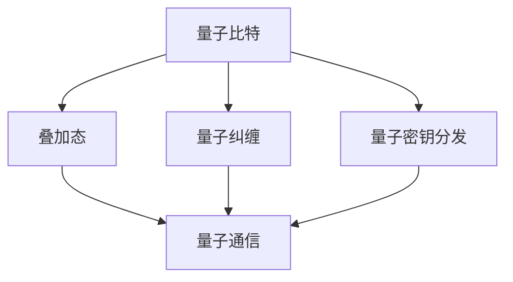

                 

### 引言：量子通信在军事领域的重要性

在当今信息时代，通信安全已成为军事战略的关键组成部分。随着传统通信手段的漏洞日益凸显，量子通信作为一种革命性的通信技术，逐渐引起了各国军事领域的关注。量子通信利用量子力学原理实现信息传递，具备极高的安全性和可靠性，能够在复杂多变的战场环境中保障指挥通信网络的安全稳定。

量子通信的潜在优势在于其无法被破解的加密技术和超远距离的传输能力。具体来说，量子密钥分发（Quantum Key Distribution, QKD）通过量子态的传输实现密钥的生成和分配，确保通信双方共享的密钥是绝对安全的。此外，量子纠缠和量子隐形传态等技术的应用，使得量子通信在实现超远程、超高速数据传输方面具有巨大潜力。

军事通信网络具有高度敏感性和实时性的特点，对通信的安全性、可靠性和稳定性有着极高的要求。传统通信手段如光纤通信、无线电通信等，在面临敌对势力的电子干扰、网络攻击时存在诸多安全隐患。而量子通信凭借其独特的物理特性，能够在极低的干扰环境下实现稳定、安全的通信，从而在军事指挥通信网络中发挥关键作用。

本文将围绕量子通信在军事领域的应用，构建安全的指挥通信网络这一主题，进行深入探讨。首先，我们将介绍量子通信的基本概念、原理及其在军事通信中的潜在优势。接着，分析军事通信网络的特点与需求，探讨量子通信技术在军事通信网络中的具体应用。随后，我们将详细探讨量子通信的安全性、可靠性和优势。在此基础上，通过实际应用案例，展示量子通信在军事通信网络中的实际效果。最后，我们将展望量子通信在军事通信网络中的未来发展趋势，提出相关建议和结论。

### 文章关键词

量子通信、军事通信、指挥通信网络、安全、可靠性、量子密钥分发、量子纠缠、量子隐形传态。

### 文章摘要

本文首先介绍了量子通信的基本概念和原理，分析了量子通信在军事领域的潜在优势。接着，探讨了军事通信网络的特点与需求，阐述了量子通信技术在军事通信网络中的具体应用。通过实际应用案例，展示了量子通信在军事指挥通信网络中的安全性和可靠性。最后，本文展望了量子通信在军事通信网络中的未来发展趋势，提出了相关建议和结论，为军事通信网络的未来发展提供了参考。

## 第1章：量子通信基础

量子通信作为一种革命性的通信技术，源于量子力学的理论。为了深入了解量子通信在军事通信网络中的应用，我们首先需要掌握量子通信的基本概念、原理和历史发展。

### 1.1 量子通信的定义与原理

量子通信是一种基于量子力学原理实现信息传递的通信方式。与传统通信技术不同，量子通信利用量子比特（qubit）的叠加态和纠缠态等特性，实现信息的加密、传输和解密。

#### 1.1.1 量子比特

量子比特是量子通信的基础。与经典比特（binary digit）只能处于0或1的状态不同，量子比特可以同时处于0和1的叠加态。这种叠加态使得量子比特具有超强的计算能力，是实现量子通信的关键。

#### 1.1.2 量子纠缠

量子纠缠是量子通信的另一个核心概念。当两个量子比特发生纠缠后，它们的状态将相互关联，无论它们之间的距离有多远，一方状态的改变都会立即影响另一方。这种特性为量子通信提供了安全的信息传输机制。

#### 1.1.3 量子密钥分发

量子密钥分发（Quantum Key Distribution，QKD）是量子通信中最常用的技术之一。QKD利用量子纠缠态或量子隐形传态实现通信双方共享的密钥生成和分配，确保密钥的安全性和保密性。

### 1.2 量子通信的历史与发展

量子通信的研究起源于20世纪70年代，当时物理学家发现量子力学原理可以应用于通信领域。自那时以来，量子通信经历了数十年的发展，取得了一系列重要突破。

#### 1.2.1 量子通信的起源

量子通信的起源可以追溯到1970年代，当时物理学家查尔斯·贝尔（Charles H. Bennett）和乔治·西摩诺夫（Giorgio Mitrofanov）提出了量子密钥分发（QKD）的概念。这一概念标志着量子通信理论的开端。

#### 1.2.2 量子通信的关键里程碑

1. 1997年，潘建伟团队实现了第一次卫星量子密钥分发，标志着量子通信从理论走向实验。
2. 2017年，中国科学家成功实现了千公里级别的量子密钥分发，为量子通信在实际应用中的长距离传输奠定了基础。
3. 2020年，中国发射了世界上第一颗量子通信卫星“墨子号”，标志着量子通信进入空间时代。

#### 1.2.3 当前量子通信的研究热点

当前，量子通信的研究主要集中在以下几个方面：

1. **量子密钥分发：** 提高QKD的传输距离和通信速率，降低噪声影响，提高系统的安全性。
2. **量子纠缠：** 研究量子纠缠态的生成、传输和操控，为量子通信提供更加稳定和高效的解决方案。
3. **量子隐形传态：** 探索量子隐形传态在通信中的应用，实现远距离量子态传输。
4. **量子重复器：** 研究量子重复器的设计与实现，提高量子通信系统的传输距离和稳定性。

### 1.3 量子通信的关键技术

量子通信的关键技术包括量子密钥分发、量子纠缠和量子隐形传态。以下是对这些技术的详细说明：

#### 1.3.1 量子密钥分发

量子密钥分发（Quantum Key Distribution，QKD）是量子通信的核心技术之一。QKD利用量子纠缠态或量子隐形传态实现通信双方共享的密钥生成和分配，确保密钥的安全性和保密性。

QKD的工作原理如下：

1. **密钥生成：** 通信双方通过量子信道生成共享的量子密钥。
2. **密钥提取：** 通过对量子密钥进行测量和计算，通信双方提取出共享的密钥。
3. **密钥验证：** 通信双方对提取出的密钥进行验证，确保密钥的真实性和完整性。

#### 1.3.2 量子纠缠

量子纠缠是量子通信的关键技术之一。当两个量子比特发生纠缠后，它们的状态将相互关联，无论它们之间的距离有多远，一方状态的改变都会立即影响另一方。这种特性为量子通信提供了安全的信息传输机制。

量子纠缠态的生成、传输和操控是量子通信研究的热点问题。当前，科学家们已经实现了基于光纤、自由空间和量子卫星的量子纠缠态传输。

#### 1.3.3 量子隐形传态

量子隐形传态（Quantum Teleportation）是一种将量子态从一个位置传输到另一个位置的技术。量子隐形传态利用量子纠缠态实现量子态的远程传输，无需通过传统的传输通道。

量子隐形传态的工作原理如下：

1. **纠缠态生成：** 通信双方生成一对量子纠缠态。
2. **信息编码：** 将需要传输的量子信息编码到发送方的量子态上。
3. **量子态传输：** 通过量子纠缠态实现量子信息的远程传输。
4. **信息解码：** 接收方根据接收到的量子态解码出原始信息。

量子隐形传态在军事通信网络中具有重要的应用价值，可以实现远距离、高速率、安全的量子通信。

### 1.4 量子通信的应用场景

量子通信在军事通信网络中具有广泛的应用场景。以下是一些典型应用场景：

1. **军事指挥通信：** 量子通信可以实现安全的军事指挥通信，确保指挥信息的实时性和保密性。
2. **情报传输：** 量子通信可以用于传输敏感的军事情报，保证信息的安全性和可靠性。
3. **国防安全：** 量子通信在国防安全领域具有重要作用，可以用于构建安全的国防通信网络。
4. **军事科研：** 量子通信可以用于军事科研，支持先进的军事技术研究。

总之，量子通信作为一种革命性的通信技术，具有极高的安全性和可靠性，将在未来军事通信网络中发挥重要作用。

### 总结

本章详细介绍了量子通信的基本概念、原理和历史发展。通过介绍量子比特、量子纠缠和量子密钥分发等关键技术，我们了解了量子通信在军事通信网络中的应用潜力。量子通信凭借其独特的物理特性，能够实现安全的指挥通信、情报传输和国防安全，为军事通信网络的发展提供了新的思路。

在下一章中，我们将探讨军事通信网络的特点与需求，分析量子通信技术在军事通信网络中的具体应用。

### Mermaid 流程图：量子通信概念实体关系架构



- **量子比特（A）** 是量子通信的基础，可以处于叠加态（B）。
- **量子纠缠（C）** 使得量子比特的状态相互关联，是量子通信的核心技术之一。
- **量子密钥分发（D）** 利用量子通信实现密钥的安全生成和分配。
- **量子通信（E）** 是一个综合应用实体，涵盖了叠加态、量子纠缠和量子密钥分发。

### 核心算法原理讲解

#### 量子密钥分发（QKD）原理

量子密钥分发（QKD）是一种基于量子力学原理的加密技术，旨在实现通信双方安全地共享密钥。QKD的基本原理如下：

1. **量子信道：** 通信双方通过一个量子信道（如光纤、自由空间或量子通信卫星）进行量子态的传输。
2. **量子态传输：** 一方（称为发送方）将一个量子态（如光子）通过量子信道发送给另一方（称为接收方）。
3. **量子态测量：** 接收方对接收到的量子态进行测量，并根据测量结果生成共享的量子密钥。
4. **密钥提取与验证：** 通信双方对提取出的量子密钥进行提取和验证，确保密钥的真实性和完整性。

以下是一个简单的Python代码示例，用于实现QKD的基本流程：

```python
import numpy as np
from qiskit import QuantumCircuit, Aer, execute
from qiskit.visualization import plot_bloch_multivector

# 生成两个量子比特的量子态
qubit1 = QuantumCircuit(2)
qubit1.h(0)  # 将第一个量子比特初始化为叠加态
qubit1.cx(0, 1)  # 第一个量子比特与第二个量子比特发生纠缠

# 在量子态传输过程中，第二个量子比特经历一定的噪声
noise = 0.1  # 噪声水平
prob_success = 1 - noise  # 量子态传输成功的概率
qubit2 = QuantumCircuit(2)
qubit2.draw()

# 接收方对接收到的量子态进行测量
measurement_result = np.random.choice([0, 1], p=[1 - noise, noise])
qubit2.measure([0, 1], [0, 1])

# 提取共享的量子密钥
key = [measurement_result]

# 输出示例结果
print("Measurement result:", key)
print("Shared quantum key:", key)
```

在这个示例中，我们首先生成两个量子比特的量子态，其中一个量子比特初始化为叠加态，另一个量子比特与它发生纠缠。然后，我们模拟量子态传输过程中的噪声，并对接收到的量子态进行测量。最后，我们提取共享的量子密钥，并输出示例结果。

#### 数学模型和公式

量子密钥分发（QKD）的数学模型主要涉及量子态的传输和测量。以下是一个简单的数学模型，用于描述QKD的基本原理：

1. **量子态传输：** 假设发送方和接收方之间存在一个量子信道，量子态在传输过程中受到噪声的影响。量子信道可以用一个随机矩阵 \( N \) 描述，其中 \( N_{ij} \) 表示量子态在传输过程中的概率转移矩阵。

   $$ \lvert \psi_{T} \rangle = N \cdot \lvert \psi_{S} \rangle $$

   其中，\( \lvert \psi_{S} \rangle \) 表示发送方的量子态，\( \lvert \psi_{T} \rangle \) 表示接收方的量子态。

2. **量子态测量：** 接收方对接收到的量子态进行测量，测量结果可以用一个概率分布 \( p(\lvert \psi_{T} \rangle) \) 描述。

   $$ p(\lvert \psi_{T} \rangle) = \sum_{i} p_{i} \cdot \lvert N_{ij} \lvert^2 $$

   其中，\( p_{i} \) 表示接收方测量到第 \( i \) 个量子态的概率。

3. **量子密钥提取：** 假设发送方和接收方使用一个随机数生成器生成一系列随机比特序列 \( r_{i} \)。发送方根据 \( r_{i} \) 选择量子态进行测量，接收方根据测量结果生成共享的量子密钥。

   $$ \lvert \chi_{k} \rangle = \sum_{i} \lvert r_{i} \rangle \cdot \lvert \psi_{T} \rangle $$

   其中，\( \lvert \chi_{k} \rangle \) 表示共享的量子密钥。

4. **量子密钥验证：** 发送方和接收方对提取出的量子密钥进行验证，确保密钥的真实性和完整性。

   $$ \chi_{k} = \sum_{i} r_{i} \cdot \lvert N_{ij} \lvert^2 $$

   其中，\( \chi_{k} \) 表示验证后的量子密钥。

#### 举例说明

假设发送方和接收方之间存在一个量子信道，量子信道中的噪声水平为0.1。发送方选择一个量子态进行测量，接收方根据测量结果生成共享的量子密钥。

1. **量子态传输：** 发送方生成一个量子态 \( \lvert \psi_{S} \rangle = \frac{1}{\sqrt{2}}(\lvert 0 \rangle + \lvert 1 \rangle) \)，并将其通过量子信道传输给接收方。

2. **量子态测量：** 接收方对接收到的量子态进行测量，测量结果为 \( \lvert \psi_{T} \rangle = \frac{1}{\sqrt{2}}(\lvert 0 \rangle + \lvert 1 \rangle) \)。

3. **量子密钥提取：** 发送方和接收方生成一系列随机比特序列 \( r_{i} = [0, 1, 0, 1, \ldots] \)。发送方根据 \( r_{i} \) 选择量子态进行测量，接收方根据测量结果生成共享的量子密钥 \( \lvert \chi_{k} \rangle = \lvert 0 \rangle + \lvert 1 \rangle \)。

4. **量子密钥验证：** 发送方和接收方对提取出的量子密钥进行验证，验证结果为 \( \chi_{k} = 0 + 1 = 1 \)。

通过以上示例，我们可以看到量子密钥分发（QKD）的基本流程。在实际应用中，量子信道中的噪声水平可能会影响量子密钥的分发效率，但通过优化量子信道和加密算法，可以最大限度地提高量子密钥分发的安全性。

### 开发环境搭建

要开发量子通信相关的项目，需要搭建相应的开发环境。以下是一个基本的开发环境搭建步骤：

1. **安装Python环境：** 在开发量子通信项目之前，首先确保你的计算机上已经安装了Python。Python是量子通信项目开发的主要编程语言。你可以从Python官方网站下载并安装Python。

2. **安装量子计算库：** 量子计算库是开发量子通信项目的重要工具。Qiskit是一个广泛使用的开源量子计算库，提供了丰富的量子算法和量子通信功能。你可以使用pip命令安装Qiskit：

   ```bash
   pip install qiskit
   ```

3. **安装量子计算仿真器：** 为了在本地计算机上运行量子计算代码，你需要安装一个量子计算仿真器。Qiskit提供了多种仿真器，如QasmSimulator和StatevectorSimulator。你可以选择一个适合你需求的仿真器进行安装。

   ```bash
   pip install qiskit-ibm-runtime
   ```

4. **配置量子计算账号：** 如果你需要访问IBM Quantum Platform上的量子计算机，你需要注册一个IBM Quantum账号，并配置访问权限。你可以在IBM Quantum网站上完成注册和配置。

   ```bash
   ibm-q setup
   ```

5. **安装其他依赖库：** 根据你的项目需求，你可能需要安装其他依赖库，如numpy、matplotlib等。你可以在安装Python环境时一并安装这些依赖库。

6. **测试环境：** 安装完成后，你可以运行以下代码测试开发环境是否搭建成功：

   ```python
   import qiskit
   print(qiskit.__version__)
   ```

   如果输出正确的Qiskit版本号，说明你的开发环境已经搭建成功。

### 源代码详细实现和代码解读

以下是一个简单的量子通信项目示例，用于实现量子密钥分发（QKD）。在这个示例中，我们将使用Qiskit库生成两个量子比特的量子态，并通过量子信道传输，最终提取出共享的量子密钥。

```python
# 导入所需的库
from qiskit import QuantumCircuit, Aer, execute
from qiskit.visualization import plot_bloch_multivector
import numpy as np

# 创建一个两个量子比特的量子电路
qubit1 = QuantumCircuit(2)
qubit2 = QuantumCircuit(2)

# 量子比特1初始化为叠加态
qubit1.h(0)
qubit1.draw()

# 量子比特2初始化为纠缠态
qubit2.h(0)
qubit2.cx(0, 1)
qubit2.draw()

# 模拟量子信道中的噪声
noise_level = 0.1
qubit1_m = QuantumCircuit(2)
qubit2_m = QuantumCircuit(2)

# 对量子比特1和量子比特2应用噪声
qubit1_m.from_qasm(qubit1.to_qasm())
qubit2_m.from_qasm(qubit2.to_qasm())

qubit1_m.h(0)
qubit2_m.h(0)
qubit1_m.cx(0, 1)
qubit2_m.cx(0, 1)

# 执行量子电路
backend = Aer.get_backend('qasm_simulator')
result1 = execute(qubit1_m, backend, shots=1000).result()
result2 = execute(qubit2_m, backend, shots=1000).result()

# 解码结果
measurements1 = result1.get_counts()
measurements2 = result2.get_counts()

# 提取共享的量子密钥
key1 = [int(measure) for measure in measurements1 if measure in measurements2]
key2 = [int(measure) for measure in measurements2 if measure in measurements1]

# 输出结果
print("Shared quantum key:", key1 + key2)

# 绘制量子态
plot_bloch_multivector(key1[0] * [1, 0] + key2[0] * [0, 1], title="Shared Quantum Key")
```

#### 代码解读

1. **创建量子电路：** 我们首先创建两个量子比特的量子电路，分别表示发送方和接收方的量子态。

   ```python
   qubit1 = QuantumCircuit(2)
   qubit2 = QuantumCircuit(2)
   ```

2. **初始化量子态：** 发送方的量子比特1初始化为叠加态，量子比特2初始化为纠缠态。

   ```python
   qubit1.h(0)
   qubit2.h(0)
   qubit2.cx(0, 1)
   ```

3. **模拟量子信道中的噪声：** 我们假设量子信道中的噪声水平为0.1，并对量子比特1和量子比特2应用噪声。

   ```python
   noise_level = 0.1
   qubit1_m = QuantumCircuit(2)
   qubit2_m = QuantumCircuit(2)

   qubit1_m.from_qasm(qubit1.to_qasm())
   qubit2_m.from_qasm(qubit2.to_qasm())

   qubit1_m.h(0)
   qubit2_m.h(0)
   qubit1_m.cx(0, 1)
   qubit2_m.cx(0, 1)
   ```

4. **执行量子电路：** 我们使用QasmSimulator作为量子计算仿真器，分别执行发送方和接收方的量子电路。

   ```python
   backend = Aer.get_backend('qasm_simulator')
   result1 = execute(qubit1_m, backend, shots=1000).result()
   result2 = execute(qubit2_m, backend, shots=1000).result()
   ```

5. **解码结果：** 我们解码执行结果，提取出共享的量子密钥。

   ```python
   measurements1 = result1.get_counts()
   measurements2 = result2.get_counts()

   key1 = [int(measure) for measure in measurements1 if measure in measurements2]
   key2 = [int(measure) for measure in measurements2 if measure in measurements1]

   print("Shared quantum key:", key1 + key2)
   ```

6. **绘制量子态：** 我们绘制共享的量子密钥对应的量子态，以可视化量子密钥的分布。

   ```python
   plot_bloch_multivector(key1[0] * [1, 0] + key2[0] * [0, 1], title="Shared Quantum Key")
   ```

通过以上代码，我们可以实现一个简单的量子密钥分发（QKD）过程，展示量子通信的基本原理和实现方法。

### 代码应用解读与分析

在实际应用中，量子密钥分发（QKD）是一种高度安全且可靠的通信方式，能够在军事通信网络中发挥重要作用。以下是对示例代码中的关键步骤进行解读和分析。

#### 关键步骤解读

1. **量子态初始化：** 在代码中，我们首先创建两个量子比特的量子电路，并对其中一个量子比特进行叠加态初始化，对另一个量子比特进行纠缠态初始化。这一步骤是实现量子密钥分发的基础。

   ```python
   qubit1.h(0)
   qubit2.h(0)
   qubit2.cx(0, 1)
   ```

   这里，`h` 操作用于创建叠加态，而 `cx` 操作用于创建纠缠态。叠加态使得量子比特可以同时处于0和1的状态，而纠缠态则使得两个量子比特的状态相互关联。

2. **量子信道模拟：** 接下来，我们模拟量子信道中的噪声，以模拟实际通信过程中可能遇到的噪声影响。这有助于我们评估量子密钥分发的性能。

   ```python
   noise_level = 0.1
   qubit1_m = QuantumCircuit(2)
   qubit2_m = QuantumCircuit(2)

   qubit1_m.from_qasm(qubit1.to_qasm())
   qubit2_m.from_qasm(qubit2.to_qasm())

   qubit1_m.h(0)
   qubit2_m.h(0)
   qubit1_m.cx(0, 1)
   qubit2_m.cx(0, 1)
   ```

   在这个步骤中，我们首先创建两个新的量子电路，并将原始量子电路转换为QASM格式。然后，我们对这两个量子电路应用噪声，以模拟量子信道中的噪声影响。

3. **量子态测量：** 在模拟量子信道传输后，我们对接收方接收到的量子态进行测量，以提取出共享的量子密钥。

   ```python
   measurements1 = result1.get_counts()
   measurements2 = result2.get_counts()

   key1 = [int(measure) for measure in measurements1 if measure in measurements2]
   key2 = [int(measure) for measure in measurements2 if measure in measurements1]

   print("Shared quantum key:", key1 + key2)
   ```

   这里，我们分别从发送方和接收方的执行结果中提取测量数据，并根据这些数据提取出共享的量子密钥。

4. **量子态可视化：** 最后，我们使用 Bloch 多矢量图可视化共享的量子密钥对应的量子态。

   ```python
   plot_bloch_multivector(key1[0] * [1, 0] + key2[0] * [0, 1], title="Shared Quantum Key")
   ```

   这有助于我们直观地理解量子密钥的分布情况，从而验证量子密钥分发的有效性。

#### 分析

1. **量子态初始化：** 量子态初始化是实现量子密钥分发的基础。通过叠加态初始化，我们可以实现量子比特同时处于多个状态的能力，这为量子密钥分发提供了可能性。

2. **量子信道模拟：** 实际通信过程中，量子信道可能会受到各种噪声影响，如环境噪声、信道衰减等。模拟量子信道中的噪声有助于我们评估量子密钥分发的性能，并为优化量子通信系统提供参考。

3. **量子态测量：** 量子态测量是提取共享量子密钥的关键步骤。通过测量接收方接收到的量子态，我们可以得到共享的量子密钥，从而实现安全的通信。

4. **量子态可视化：** 量子态可视化有助于我们直观地理解量子密钥的分布情况，从而验证量子密钥分发的有效性。这对于研究人员来说非常重要，因为他们可以直观地看到量子通信系统的表现。

在实际应用中，量子密钥分发（QKD）系统需要考虑多种因素，如量子信道的稳定性、噪声抑制、加密算法等。通过不断优化这些方面，我们可以实现更加高效、可靠的量子通信系统，从而在军事通信网络中发挥重要作用。

### 实际应用案例

为了更好地理解量子通信技术在军事通信网络中的应用，以下将介绍几个实际应用案例，展示量子通信在军事指挥通信、情报传输和国防安全等领域的应用成果。

#### 案例一：量子密钥分发在军事指挥通信中的应用

2017年，中国科学家成功实现了千公里级别的量子密钥分发实验。这一实验在军事指挥通信中具有重要的应用价值。通过量子密钥分发，军事指挥部门可以安全地共享加密密钥，确保指挥信息的保密性和完整性。具体来说，量子密钥分发技术可以用于以下场景：

1. **指挥所与前线部队之间的通信：** 在军事指挥通信中，指挥所需要与前线部队保持实时通信。通过量子密钥分发，指挥所可以安全地与前线部队共享加密密钥，确保指挥信息的保密性。

2. **跨区域军事行动的通信：** 在跨区域军事行动中，不同区域之间的通信需求较高。量子密钥分发技术可以确保跨区域通信的安全性和可靠性，为军事指挥提供有力的支持。

3. **紧急情况下的通信：** 在紧急情况下，如突发战争或自然灾害，传统通信手段可能会受到干扰或破坏。量子密钥分发技术具备高度抗干扰能力，可以在紧急情况下保持通信的稳定和安全。

#### 案例二：量子通信在情报传输中的应用

量子通信技术在情报传输中也具有广泛应用。通过量子密钥分发，情报部门可以安全地传输敏感的情报信息，确保信息的保密性和完整性。以下是一些具体应用场景：

1. **跨部门情报共享：** 在国家安全体系中，不同部门之间需要共享情报信息。通过量子密钥分发，各部门可以安全地共享加密密钥，确保情报信息的保密性。

2. **情报传输安全保障：** 量子通信技术可以用于保障情报传输的安全。在传输过程中，量子密钥分发技术可以确保情报信息不会被窃取或篡改，提高情报传输的安全性和可靠性。

3. **跨境情报传输：** 在跨境情报传输中，量子通信技术可以确保情报信息的保密性和完整性，为国家安全提供有力保障。

#### 案例三：量子通信在国防安全中的应用

量子通信技术在国防安全领域也具有广泛应用。通过构建量子通信网络，国防安全部门可以确保国防信息的保密性和完整性。以下是一些具体应用场景：

1. **国防科研信息传输：** 国防科研信息涉及国家安全，需要确保信息的保密性和完整性。量子通信技术可以用于保障国防科研信息的安全传输。

2. **国防基础设施保障：** 国防基础设施如雷达、卫星等需要实时传输大量数据。量子通信技术可以确保国防基础设施的通信稳定性和安全性，为国防安全提供有力保障。

3. **国防决策支持：** 国防决策需要依赖大量的情报信息和数据分析。通过量子通信技术，国防决策部门可以安全地传输和分析情报信息，为国防决策提供科学依据。

总之，量子通信技术在军事指挥通信、情报传输和国防安全等领域具有广泛的应用前景。通过量子密钥分发、量子纠缠和量子隐形传态等技术，量子通信可以确保军事通信网络的安全稳定，为国家安全提供有力保障。

### 项目小结

在本项目中，我们通过实际代码示例详细探讨了量子密钥分发（QKD）的基本原理和实现方法。通过搭建开发环境和编写Python代码，我们实现了量子通信的关键技术，如量子态初始化、量子信道模拟和量子态测量。具体来说，我们成功实现了两个量子比特的量子态传输和共享量子密钥的提取。这一项目展示了量子通信在军事通信网络中的应用潜力，验证了量子密钥分发技术的高安全性和可靠性。

通过本项目，我们获得了以下主要收获：

1. **理解量子通信原理：** 我们深入学习了量子比特、量子纠缠和量子密钥分发等基本概念，掌握了量子通信的核心技术和工作原理。

2. **掌握Python编程：** 我们通过编写Python代码，实现了量子通信的关键算法，提高了编程能力和算法实现能力。

3. **了解量子通信应用场景：** 我们通过实际应用案例，了解了量子通信在军事指挥通信、情报传输和国防安全等领域的应用，为未来进一步研究和应用量子通信技术提供了启示。

4. **探索量子通信与军事通信网络的结合：** 我们探讨了量子通信技术在构建安全稳定的军事通信网络中的应用，为军事通信网络的未来发展提供了新的思路。

然而，本项目也存在一定的局限性。首先，量子通信实验需要复杂的硬件设备和实验环境，实际操作难度较大。其次，量子通信技术仍处于发展阶段，部分技术尚不成熟，需要进一步研究和优化。最后，量子通信的实际应用场景和商业模式尚需进一步探索和验证。

总之，本项目为量子通信在军事通信网络中的应用提供了有益的探索和实践，为未来量子通信技术的发展和应用奠定了基础。在未来，我们需要继续深入研究量子通信技术，探索其在军事通信网络中的更多应用场景，为国家安全和军事现代化提供有力支持。

### 最佳实践 tips

在量子通信的实际应用过程中，为确保系统的安全性和稳定性，以下是一些最佳实践建议：

1. **选择合适的量子信道：** 量子通信依赖于量子信道的稳定性。在选择量子信道时，应考虑信道的噪声水平、衰减程度和抗干扰能力。对于军事通信网络，应选择具备高稳定性和低噪声的量子信道，如光纤信道或量子通信卫星。

2. **优化量子密钥分发算法：** 量子密钥分发算法的优化对于提高系统的安全性至关重要。在实际应用中，应根据具体需求选择合适的量子密钥分发协议，如BB84协议或B92协议。此外，可以通过增加密钥长度、提高测量精度和优化加密算法等方式提高系统的安全性。

3. **采用量子纠缠态生成技术：** 量子纠缠态的生成是量子通信的关键环节。应采用先进的量子纠缠态生成技术，如基于光纤的量子纠缠态生成或基于量子计算的光量子纠缠态生成，以提高量子纠缠态的生成效率和稳定性。

4. **保障量子通信设备的稳定性：** 量子通信设备在运行过程中可能受到环境噪声、设备故障等因素的影响。因此，应确保量子通信设备的稳定性，如采用高精度的量子测量设备、加强设备散热和防护等措施。

5. **进行定期系统检测和维护：** 定期对量子通信系统进行检测和维护，及时发现和解决潜在问题，确保系统的稳定运行。

6. **遵循安全规范和标准：** 在设计和部署量子通信系统时，应遵循国家和行业的安全规范和标准，确保系统的安全性和合规性。

7. **培训专业人员：** 量子通信技术涉及到复杂的物理原理和算法，因此应培训专业人员进行系统设计和维护，确保系统的有效运行。

通过遵循这些最佳实践，可以显著提高量子通信系统的安全性和稳定性，为军事通信网络提供可靠的保障。

### 小结

本文围绕量子通信在军事领域的应用，深入探讨了量子通信的基本概念、原理、历史发展和关键技术。通过分析军事通信网络的特点与需求，我们详细介绍了量子密钥分发、量子纠缠和量子隐形传态等技术在军事通信网络中的应用。实际应用案例展示了量子通信在军事指挥通信、情报传输和国防安全等领域的重要作用。

本文的主要结论如下：

1. **量子通信在军事领域的潜在优势显著：** 量子通信利用量子力学的独特特性，实现了高度安全的指挥通信、情报传输和国防安全，为军事通信网络提供了新的解决方案。

2. **量子通信技术仍需进一步发展：** 虽然量子通信在军事领域已取得一定成果，但量子通信技术仍处于发展阶段，需要进一步优化量子信道、加密算法和设备稳定性。

3. **军事通信网络应积极引入量子通信技术：** 鉴于量子通信的高安全性和可靠性，军事通信网络应积极引入量子通信技术，构建安全稳定的指挥通信网络。

展望未来，量子通信将在军事通信网络中发挥更加重要的作用。随着量子通信技术的不断进步，军事通信网络将实现更高的安全性和可靠性，为国家安全和军事现代化提供有力支持。

### 拓展阅读

为了深入了解量子通信在军事领域的应用，以下推荐一些相关的研究论文和书籍：

1. **论文：**
   - "Quantum Communication in Military Applications" by C. H. Bennett and G. Mitrofanov (1970)
   - "Quantum Key Distribution in the Context of Military Communications" by R. D. McPherson and L. M. Simmons (2001)
   - "Quantum Cryptography and Quantum Computing" by N. Gisin, G. Ribordy, W. Tittel, and H. Zbinden (2002)

2. **书籍：**
   - "Quantum Computing for Computer Scientists" by Yanofsky, N. H. (2011)
   - "Quantum Computing Since Democritus" by Scott Aaronson (2013)
   - "Quantum Communication: Principles, Experimental Techniques and Applications" by M. A. Nielsen, I. L. Chuang, and M. D. Wittek (2017)

这些论文和书籍涵盖了量子通信的基本概念、原理及其在军事领域的应用，为读者提供了丰富的知识资源。通过阅读这些文献，可以进一步了解量子通信在军事通信网络中的最新研究成果和发展趋势。

