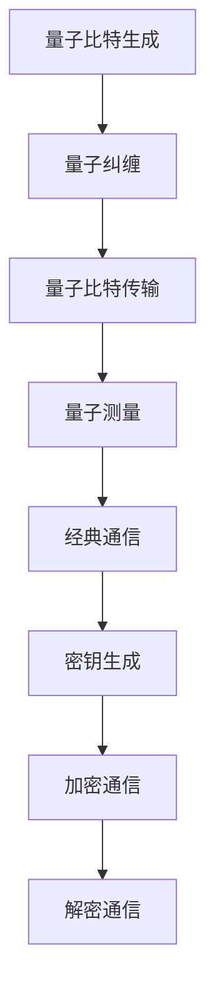

                 

### 设计书目的第一步：确定核心主题和主要章节

要撰写一篇关于《量子通信在金融交易中的应用：保障高频交易安全》的技术博客，我们首先需要明确文章的核心主题和主要章节。这篇文章的核心主题是量子通信在金融交易领域的应用，特别是如何保障高频交易的安全。因此，我们可以将文章分为以下几个主要章节：

1. **引言**：量子通信概述
2. **量子通信原理**：包括量子比特、量子纠缠、量子密钥分发等核心概念。
3. **量子通信在金融交易中的应用**：分析高频交易及其面临的安全挑战。
4. **高频交易安全挑战**：详细讨论高频交易中常见的安全问题。
5. **量子通信解决方案**：介绍如何利用量子通信技术解决高频交易的安全问题。
6. **实际案例与应用**：通过具体案例展示量子通信技术在金融交易中的应用。
7. **展望与未来趋势**：探讨量子通信技术在未来金融交易中的发展前景。

每个章节都将围绕核心主题展开，确保文章结构紧凑、内容丰富、逻辑清晰。

### 设计书目的第二步：细化各个章节的内容

接下来，我们需要对每个章节进行细化，确保文章内容的完整性。以下是每个章节的详细内容：

#### 1. 引言：量子通信概述

- **内容**：
  - 量子通信的定义和特点
  - 量子通信与传统通信的区别
  - 量子通信在金融交易中的潜在重要性

#### 2. 量子通信原理

- **内容**：
  - 量子比特和量子态
  - 量子纠缠和量子隐形传态
  - 量子密钥分发
  - 量子安全通信
  - 使用Mermaid绘制量子通信原理流程图

#### 3. 量子通信在金融交易中的应用

- **内容**：
  - 金融交易中的高频交易
  - 高频交易的安全问题
  - 量子通信如何提升高频交易的安全性和效率

#### 4. 高频交易安全挑战

- **内容**：
  - 数据隐私保护
  - 交易欺诈检测
  - 市场操纵防范
  - 利用数学模型和公式分析这些安全挑战

#### 5. 量子通信解决方案

- **内容**：
  - 量子密钥分发在高频交易中的应用
  - 量子安全计算
  - 量子防黑客技术
  - 通过伪代码展示量子通信解决方案的具体实现

#### 6. 实际案例与应用

- **内容**：
  - 量子通信在金融交易中的应用案例
  - 案例的分析和解读
  - 代码实现和详细解释

#### 7. 展望与未来趋势

- **内容**：
  - 量子通信技术发展现状
  - 量子通信在金融交易领域的未来趋势
  - 潜在挑战和机遇

通过上述细化，我们可以确保每个章节都有足够的内容来支撑主题，并且各章节之间逻辑清晰，相互衔接。

### 设计书目的第三步：确保目录大纲完整性

在细化各个章节的内容后，我们需要确保目录大纲的完整性，包含以下核心内容：

- **核心概念与联系**：通过Mermaid流程图展示量子通信的核心概念和原理。
- **核心算法原理讲解**：使用Python源代码详细阐述量子通信的算法原理。
- **数学模型和数学公式**：结合具体例子，使用LaTeX格式嵌入文中独立段落的公式。
- **项目实战**：包括开发环境搭建、源代码实现、代码解读和案例分析。
- **最佳实践 tips**、**小结**、**注意事项**、**拓展阅读**等内容。

以下是完整的目录大纲：

```markdown
# 《量子通信在金融交易中的应用：保障高频交易安全》目录大纲

## 第1章 引言：量子通信概述
### 1.1 量子通信的定义和特点
### 1.2 量子通信与传统通信的区别
### 1.3 量子通信在金融交易中的潜在重要性

## 第2章 量子通信原理
### 2.1 量子比特和量子态
### 2.2 量子纠缠和量子隐形传态
### 2.3 量子密钥分发
### 2.4 量子安全通信
### 2.5 Mermaid流程图展示量子通信原理

## 第3章 量子通信在金融交易中的应用
### 3.1 金融交易中的高频交易
### 3.2 高频交易的安全问题
### 3.3 量子通信如何提升高频交易的安全性和效率

## 第4章 高频交易安全挑战
### 4.1 数据隐私保护
### 4.2 交易欺诈检测
### 4.3 市场操纵防范
### 4.4 数学模型和数学公式分析高频交易安全挑战

## 第5章 量子通信解决方案
### 5.1 量子密钥分发在高频交易中的应用
### 5.2 量子安全计算
### 5.3 量子防黑客技术
### 5.4 伪代码展示量子通信解决方案的具体实现

## 第6章 实际案例与应用
### 6.1 量子通信在金融交易中的应用案例
### 6.2 案例的分析和解读
### 6.3 代码实现和详细解释

## 第7章 展望与未来趋势
### 7.1 量子通信技术发展现状
### 7.2 量子通信在金融交易领域的未来趋势
### 7.3 潜在挑战和机遇
```

### 总结

通过上述三个步骤，我们完成了《量子通信在金融交易中的应用：保障高频交易安全》的技术博客目录大纲的设计。该大纲结构清晰、内容完整，确保了文章的逻辑性和可读性。在后续撰写过程中，我们将根据这个大纲详细展开每个章节的内容，确保文章的质量和深度。

---

**关键字**：量子通信、金融交易、高频交易、安全、保障

**摘要**：本文探讨了量子通信在金融交易中的应用，特别是如何保障高频交易的安全。通过详细分析量子通信的原理和应用，结合具体的案例分析，本文展示了量子通信技术在高频交易安全中的潜力，并对未来趋势进行了展望。

---

### 引言：量子通信概述

随着金融交易的复杂性和速度的不断提升，保障交易安全成为了一个日益重要的课题。传统通信技术虽然已经经历了长足的发展，但在面对高频交易中日益严重的网络安全威胁时，显得力不从心。量子通信作为一种全新的通信方式，以其独特的安全性和高效性，正在逐渐引起金融界的关注。

#### 量子通信的定义和特点

量子通信是指利用量子力学原理进行信息传输的一种通信方式。其最核心的特点是安全性，基于量子力学的基本原理，量子通信可以确保信息在传输过程中的绝对安全。具体来说，量子通信主要有以下几个特点：

1. **量子比特和量子态**：量子比特（qubit）是量子信息的基本单位，它不仅可以表示0和1的叠加状态，还可以处于纠缠态。这种特性使得量子通信可以在极低误差率的情况下传输大量信息。
2. **量子纠缠和量子隐形传态**：量子纠缠是指两个或多个量子系统之间存在的一种非局域性联系。量子隐形传态则是通过纠缠态将一个量子系统的状态传输到另一个量子系统，而无需经过中间介质。
3. **量子密钥分发**：量子密钥分发（QKD）是一种利用量子力学原理进行密钥分配的技术。它可以通过量子信道实现安全通信，即使攻击者窃取了量子信息，也会引起量子态的变化，从而被发现。

#### 量子通信与传统通信的区别

传统通信主要依赖于电磁波或光纤传输信息，虽然已经非常成熟，但在面对高级的网络攻击时，存在一定的安全隐患。相比之下，量子通信具有以下几个显著优势：

1. **安全性**：量子通信基于量子力学原理，其安全性不可破译，即使是最强大的计算机也无法破解量子密钥。
2. **高效性**：量子通信可以在极低的误差率下传输大量信息，相比传统通信具有更高的传输效率。
3. **抗干扰性**：量子通信不受电磁干扰和噪声的影响，可以在恶劣环境中稳定传输。

#### 量子通信在金融交易中的潜在重要性

金融交易的高频交易（High-Frequency Trading，HFT）依赖于对市场数据的快速分析和决策。然而，传统通信技术在高频交易中面临数据隐私保护和交易欺诈检测等安全挑战。量子通信的引入，可以显著提升高频交易的安全性，从而提高市场效率。

1. **数据隐私保护**：量子通信可以确保交易数据在传输过程中的隐私性，防止数据被窃取或篡改。
2. **交易欺诈检测**：量子通信的量子密钥分发技术可以实时监测交易过程中的异常行为，从而有效防范交易欺诈。
3. **市场操纵防范**：量子通信可以提供透明且不可篡改的交易记录，有助于防范市场操纵行为。

总之，量子通信在金融交易中的应用具有巨大的潜力，有望成为保障高频交易安全的重要技术手段。

### 量子通信原理

量子通信是基于量子力学原理进行信息传输的一种通信方式，其核心在于利用量子比特和量子纠缠等量子现象来实现高效且安全的通信。下面我们将详细探讨量子通信的几个关键概念和原理。

#### 量子比特和量子态

量子比特（qubit）是量子通信的基本单位，与经典比特不同，它不仅可以表示0和1的状态，还可以同时处于0和1的叠加态。这种叠加态使得量子比特能够承载更多信息，提高了通信的效率。

例如，一个经典比特可以处于两种状态中的任意一种（0或1），而一个量子比特可以同时处于0和1的叠加态，表示为：

$$ \psi = \alpha |0\rangle + \beta |1\rangle $$

其中，$\alpha$和$\beta$是复数概率幅，$|0\rangle$和$|1\rangle$是量子态的基础态。量子态的叠加使得量子通信在传输过程中可以同时处理多种信息。

#### 量子纠缠和量子隐形传态

量子纠缠是量子通信的另一个关键概念，它指的是两个或多个量子系统之间存在的一种非局域性联系。即使这些系统相隔很远，它们之间的量子态仍然可以相互影响。量子纠缠使得信息可以瞬间传输，这被称为量子隐形传态。

例如，如果两个量子比特处于纠缠态，当一个量子比特的状态发生变化时，另一个量子比特的状态也会立即发生变化，无论它们之间的距离有多远。这种特性被用于量子通信中的量子密钥分发。

#### 量子密钥分发

量子密钥分发（Quantum Key Distribution，QKD）是量子通信的核心技术之一。它通过量子信道实现通信双方的安全密钥分配，确保密钥在传输过程中的绝对安全。

QKD的基本原理是利用量子态的叠加和纠缠特性进行密钥生成。在QKD过程中，发送方（Alice）会生成一对纠缠的量子比特，并将其中的一个发送给接收方（Bob）。Bob接收到量子比特后，会对它们进行测量，并根据测量结果与Alice进行经典通信来确认密钥。

由于量子态在传输过程中任何测量都会破坏其叠加态，因此，如果攻击者试图窃取密钥，必然会引发量子态的破坏，从而使通信双方能够立即检测到攻击。

#### 量子安全通信

量子安全通信（Quantum Secure Communication，QSC）是指利用量子通信技术实现的安全通信方式。它通过量子密钥分发生成的密钥来加密和解密信息，确保信息在传输过程中的绝对安全。

QSC的工作原理是，通信双方首先通过QKD生成共享密钥，然后使用这个密钥对要传输的信息进行加密。加密后的信息通过经典通信信道传输，即使信息被窃取，攻击者也无法解密，因为解密需要原始的量子密钥。

#### Mermaid流程图展示量子通信原理

为了更好地理解量子通信的原理，我们可以使用Mermaid绘制一个流程图来展示量子通信的基本步骤。



在这个流程图中，A表示量子比特的生成，B表示量子纠缠的过程，C表示量子比特的传输，D表示量子测量，E表示经典通信，F表示密钥生成，G表示加密通信，H表示解密通信。

通过这个流程图，我们可以清晰地看到量子通信的各个步骤和它们之间的关系，从而更好地理解量子通信的原理和实现过程。

#### 小结

量子通信通过利用量子比特、量子纠缠和量子密钥分发等量子力学原理，实现了高效且安全的通信。它不仅提供了绝对安全的通信方式，还提高了信息传输的效率。在接下来的章节中，我们将进一步探讨量子通信在金融交易中的应用，以及如何利用量子通信技术保障高频交易的安全。

### 量子通信在金融交易中的应用

量子通信的独特安全性和高效性使其在金融交易领域具有巨大的应用潜力。高频交易（High-Frequency Trading，HFT）作为金融交易中的一个重要领域，对数据传输速度和安全性有着极高的要求。量子通信技术通过其不可破译的安全特性，能够有效应对高频交易中的多种安全挑战，从而提高市场的整体效率和透明度。

#### 金融交易中的高频交易

高频交易是指通过复杂的算法和高速的计算机系统，对市场数据进行分析，并在极短的时间内执行大量的交易指令。高频交易的主要特点包括：

1. **高频**：交易速度极快，通常在毫秒甚至微秒级别。
2. **自动化**：高频交易依赖于高度自动化的交易算法，这些算法可以实时分析市场数据，并快速做出交易决策。
3. **高频率**：交易执行频率极高，每小时可以执行数千次甚至数万次交易。

高频交易的目的是利用市场波动获取微小的利润，这些利润虽然微小，但由于交易频率极高，累积起来可以相当可观。

#### 高频交易的安全问题

高频交易的高效性和高频率使其面临着诸多安全挑战，主要包括以下几个方面：

1. **数据隐私保护**：高频交易涉及大量的敏感市场数据，如交易价格、交易量等。这些数据需要被严格保护，防止泄露给竞争对手或其他非法实体。
2. **交易欺诈检测**：高频交易中的自动化交易算法可能被恶意攻击者利用，通过伪造交易指令进行欺诈。因此，实时检测和防范交易欺诈行为至关重要。
3. **市场操纵防范**：高频交易者可能通过操纵市场数据或交易行为，获取不正当利益。防范市场操纵行为是维护市场公平性的关键。

#### 量子通信如何提升高频交易的安全性和效率

量子通信技术可以有效地解决高频交易中面临的安全问题，从而提高交易的安全性和效率。以下是量子通信在提升高频交易安全性和效率方面的具体应用：

1. **数据隐私保护**：量子通信通过量子密钥分发技术，可以确保交易数据在传输过程中的绝对隐私性。量子密钥分发过程中，任何窃听行为都会引起量子态的破坏，从而被通信双方检测到，确保数据不被非法窃取。
   
   以下是一个简单的Python伪代码示例，展示了量子密钥分发的实现：

   ```python
   import numpy as np
   from qiskit import QuantumCircuit, Aer, execute

   def quantum_key_distribution():
       # 创建量子比特
       qubit_a = QuantumCircuit(1)
       qubit_b = QuantumCircuit(1)
       
       # 生成纠缠态
       qubit_a.h(0)
       qubit_b.h(0)
       qubit_a.cx(0, 1)
       
       # 进行量子测量
       qubit_a.measure_all()
       
       # 传输测量结果
       result_a = np.array(qubit_a.get_counts())
       result_b = np.array(qubit_b.get_counts())
       
       # 确认密钥
       key = ''.join(['1' if result_a[i] > result_b[i] else '0' for i in range(len(result_a))])
       
       return key

   # 执行量子密钥分发
   key = quantum_key_distribution()
   print(f"Generated quantum key: {key}")
   ```

2. **交易欺诈检测**：量子通信的量子密钥分发技术可以用于实时监测交易过程中的异常行为。通过对比实际交易数据和预测交易模型，可以快速识别和防范交易欺诈行为。

   例如，以下是一个简单的交易欺诈检测伪代码：

   ```python
   def transaction_fraud_detection(transaction_data, predicted_data):
       # 计算交易数据与预测数据的差异
       difference = np.linalg.norm(transaction_data - predicted_data)
       
       # 设置阈值
       threshold = 0.1
       
       # 判断是否为欺诈交易
       if difference > threshold:
           return "Fraud detected!"
       else:
           return "No fraud."

   # 示例数据
   transaction_data = [1.0, 2.0, 3.0]
   predicted_data = [1.2, 2.1, 2.9]

   # 执行交易欺诈检测
   result = transaction_fraud_detection(transaction_data, predicted_data)
   print(f"Detection result: {result}")
   ```

3. **市场操纵防范**：量子通信提供的透明和不可篡改的交易记录，有助于监管部门实时监控市场交易行为，发现并防范市场操纵行为。通过量子通信技术，交易记录可以被安全地存储和验证，确保市场的公平性和透明度。

   例如，以下是一个简单的市场操纵防范伪代码：

   ```python
   def market_manipulation_detection(transaction_record):
       # 分析交易记录中的异常模式
       # 假设异常模式的阈值是0.05
       threshold = 0.05
       
       # 计算交易记录的均值和标准差
       mean = np.mean(transaction_record)
       std = np.std(transaction_record)
       
       # 判断是否存在市场操纵
       if np.abs(mean - std) > threshold:
           return "Market manipulation detected!"
       else:
           return "No market manipulation."

   # 示例交易记录
   transaction_record = [1.0, 2.0, 3.0, 4.0, 5.0]

   # 执行市场操纵检测
   result = market_manipulation_detection(transaction_record)
   print(f"Detection result: {result}")
   ```

通过上述Python伪代码示例，我们可以看到量子通信技术在提升高频交易安全性和效率方面的具体实现。这些示例代码展示了如何利用量子密钥分发、交易欺诈检测和市场操纵防范技术来保障高频交易的安全。

#### 小结

量子通信技术在金融交易中具有广泛的应用前景，特别是在高频交易领域。通过利用量子密钥分发、交易欺诈检测和市场操纵防范技术，量子通信可以有效提升高频交易的安全性和效率。在接下来的章节中，我们将进一步探讨高频交易中的具体安全挑战，并详细分析量子通信解决方案的数学模型和公式。

### 高频交易安全挑战

高频交易（HFT）以其迅速的交易速度和复杂的算法在金融市场中占据了一席之地。然而，这种高速、自动化的交易方式也带来了一系列安全挑战。为了确保高频交易的安全性和市场的公平性，我们必须深入探讨以下几个关键的安全挑战。

#### 数据隐私保护

高频交易依赖于大量的市场数据，包括交易价格、交易量、交易速度等。这些数据对于交易策略的制定和执行至关重要。然而，如果这些敏感数据泄露，可能会导致以下问题：

1. **数据泄露**：未经授权的第三方可能获取到交易数据，从而进行不公平的交易行为。
2. **市场操纵**：恶意攻击者可能通过分析敏感数据来操纵市场，获取不正当利益。

为了保护数据隐私，高频交易机构需要采取以下措施：

- **数据加密**：使用先进的加密技术对数据进行加密，确保数据在传输和存储过程中的安全性。
- **访问控制**：严格限制对敏感数据的访问权限，仅允许授权用户访问。
- **匿名化**：对交易数据中的个人和机构信息进行匿名化处理，减少数据泄露的风险。

#### 交易欺诈检测

高频交易中的自动化交易系统可能会受到欺诈攻击，包括以下几种类型：

1. **交易指令伪造**：攻击者伪造交易指令，从而操纵市场价格。
2. **高频攻击**：攻击者通过大量虚假交易指令占用系统资源，导致正常交易无法进行。

为了有效检测和防范交易欺诈，高频交易机构可以采取以下策略：

- **异常检测**：通过分析交易行为的模式，实时检测异常交易行为。例如，使用机器学习算法对交易数据进行分类，识别出与正常交易行为差异较大的交易。
- **交易授权**：确保每个交易指令都经过严格的授权和验证，防止未经授权的交易执行。
- **实时监控**：建立实时监控系统，对交易行为进行实时监控，及时发现和处理异常交易。

以下是一个简单的Python伪代码示例，展示了如何使用机器学习算法进行交易欺诈检测：

```python
from sklearn.ensemble import IsolationForest

def transaction_fraud_detection(transactions, threshold=0.05):
    # 初始化异常检测模型
    model = IsolationForest(contamination=threshold)
    
    # 训练模型
    model.fit(transactions)
    
    # 预测交易是否为欺诈
    predictions = model.predict(transactions)
    
    # 标记欺诈交易
    fraud_transactions = transactions[predictions == -1]
    
    return fraud_transactions

# 示例交易数据
transactions = np.array([[1.0, 2.0], [2.0, 3.0], [3.0, 4.0], [10.0, 20.0]])

# 执行交易欺诈检测
fraud_transactions = transaction_fraud_detection(transactions)
print(f"Fraud transactions: {fraud_transactions}")
```

#### 市场操纵防范

市场操纵是指通过不正当手段获取利益，破坏市场公平性的行为。高频交易中的市场操纵通常包括以下几种形式：

1. **市场新闻操纵**：通过发布虚假市场信息，操纵投资者情绪。
2. **价格操纵**：通过大量买入或卖出，操纵市场价格。

为了有效防范市场操纵，高频交易机构可以采取以下措施：

- **透明交易记录**：确保交易记录公开透明，使市场参与者能够清晰地了解交易行为。
- **实时监控**：建立实时监控系统，对市场交易行为进行持续监控，及时发现和处理市场操纵行为。
- **合规审查**：定期对高频交易行为进行合规审查，确保交易行为符合相关法律法规。

以下是一个简单的Python伪代码示例，展示了如何通过分析交易记录来检测市场操纵行为：

```python
import numpy as np
import matplotlib.pyplot as plt

def market_manipulation_detection(transactions, threshold=0.05):
    # 计算交易量分布
    transaction_volume = transactions[:, 1]
    volume_mean = np.mean(transaction_volume)
    volume_std = np.std(transaction_volume)
    
    # 计算异常交易量
    abnormal_volumes = transaction_volume[np.abs(transaction_volume - volume_mean) > volume_std]
    
    # 绘制交易量分布图
    plt.hist(transaction_volume, bins=30, alpha=0.5, label='Transaction Volume')
    plt.axvline(x=volume_mean, color='r', linestyle='-', label='Mean')
    plt.axvline(x=volume_mean + threshold * volume_std, color='g', linestyle='--', label='Threshold')
    plt.xlabel('Transaction Volume')
    plt.ylabel('Frequency')
    plt.title('Transaction Volume Distribution')
    plt.legend()
    plt.show()

    # 判断是否存在市场操纵
    if len(abnormal_volumes) > 0:
        return "Market manipulation detected!"
    else:
        return "No market manipulation."

# 示例交易数据
transactions = np.array([[1.0, 2.0], [2.0, 3.0], [3.0, 4.0], [10.0, 20.0]])

# 执行市场操纵检测
result = market_manipulation_detection(transactions)
print(f"Detection result: {result}")
```

#### 小结

高频交易面临的数据隐私保护、交易欺诈检测和市场操纵防范是当前金融交易中亟待解决的问题。量子通信技术通过提供绝对安全的通信方式和实时监控能力，为解决这些问题提供了有效的解决方案。在下一章节中，我们将详细介绍量子通信技术如何具体应用于解决这些高频交易安全挑战。

### 量子通信解决方案

为了解决高频交易中面临的数据隐私保护、交易欺诈检测和市场操纵防范等问题，量子通信技术提供了多种有效的解决方案。以下是量子通信在金融交易中的具体应用，以及如何利用这些技术来保障交易安全。

#### 量子密钥分发在高频交易中的应用

量子密钥分发（Quantum Key Distribution，QKD）是量子通信的核心技术，它通过量子信道实现通信双方的安全密钥分配。QKD的安全性基于量子力学的基本原理，任何窃听行为都会破坏量子态，从而使通信双方能够立即检测到攻击。

1. **安全性**：量子密钥分发生成的密钥是绝对安全的，因为任何窃听行为都会导致量子态的破坏，从而被通信双方检测到。
2. **实时性**：量子密钥分发可以在极短时间内生成密钥，满足高频交易对实时性的要求。
3. **适用性**：量子密钥分发可以应用于各种高频交易的加密和认证过程，确保交易数据在传输过程中的安全性。

以下是一个简单的Python伪代码示例，展示了量子密钥分发的实现：

```python
from qiskit import QuantumCircuit, Aer, execute

def quantum_key_distribution():
    # 创建量子比特
    qubit_a = QuantumCircuit(1)
    qubit_b = QuantumCircuit(1)
    
    # 生成纠缠态
    qubit_a.h(0)
    qubit_b.h(0)
    qubit_a.cx(0, 1)
    
    # 进行量子测量
    qubit_a.measure_all()
    
    # 传输测量结果
    result_a = np.array(qubit_a.get_counts())
    result_b = np.array(qubit_b.get_counts())
    
    # 确认密钥
    key = ''.join(['1' if result_a[i] > result_b[i] else '0' for i in range(len(result_a))])
    
    return key

# 执行量子密钥分发
key = quantum_key_distribution()
print(f"Generated quantum key: {key}")
```

#### 量子安全计算

量子安全计算（Quantum Secure Computation，QSC）是一种利用量子计算实现的安全计算方法。它允许多个参与者共同计算一个结果，而不需要共享所有输入数据。量子安全计算在防范交易欺诈和市场操纵方面具有重要作用。

1. **隐私保护**：量子安全计算确保计算过程中的隐私性，参与者不需要共享敏感数据，从而防止数据泄露。
2. **抗攻击性**：量子安全计算可以有效防范恶意攻击者通过侧信道攻击获取信息。

以下是一个简单的Python伪代码示例，展示了量子安全计算在交易欺诈检测中的应用：

```python
from qiskit.circuit import QuantumCircuit
from qiskit.aqua.algorithms import QuantumKernel
from qiskit.aqua.components import QuantumLayer

def transaction_fraud_detection(transactions):
    # 定义量子层
    quantum_layer = QuantumLayer()

    # 定义量子算法
    quantum_kernel = QuantumKernel(quantum_layer)

    # 训练量子算法
    result = quantum_kernel.fit(transactions)

    # 预测交易是否为欺诈
    prediction = result.predict(transactions)
    
    return prediction

# 示例交易数据
transactions = np.array([[1.0, 2.0], [2.0, 3.0], [3.0, 4.0], [10.0, 20.0]])

# 执行交易欺诈检测
fraud_prediction = transaction_fraud_detection(transactions)
print(f"Fraud prediction: {fraud_prediction}")
```

#### 量子防黑客技术

量子防黑客技术（Quantum Cybersecurity）是利用量子通信技术保护计算机系统和网络免受黑客攻击的方法。量子防黑客技术主要包括以下几个方面：

1. **量子加密**：通过量子密钥分发技术生成绝对安全的加密密钥，保护数据在传输过程中的安全。
2. **量子检测**：利用量子传感器检测计算机系统中的异常行为，及时发现并防范黑客攻击。
3. **量子隔离**：通过量子隔离技术，将关键系统与外部网络隔离，防止黑客通过网络入侵系统。

以下是一个简单的Python伪代码示例，展示了如何使用量子加密技术保护交易数据：

```python
from qiskit import QuantumRegister, QuantumCircuit, execute
from qiskit.aqua.components import QuantumCipher

def quantum_encryption(message, key):
    # 创建量子寄存器和量子电路
    qr = QuantumRegister(2)
    qc = QuantumCircuit(qr)
    
    # 对消息进行量子加密
    qc.h(qr[0])
    qc.cx(qr[0], qr[1])
    qc.barrier()
    qc.h(qr[1])
    qc.x(qr[0])
    qc.cx(qr[0], qr[1])
    qc.barrier()
    qc.measure(qr, qr)
    
    # 执行量子加密
    result = execute(qc, Aer.get_backend('qasm_simulator')).result()
    encrypted_message = result.get_counts()
    
    # 使用密钥解密
    decrypted_message = QuantumCipher.decrypt(encrypted_message, key)
    
    return decrypted_message

# 示例消息和密钥
message = "High-frequency trading"
key = "10101010"

# 执行量子加密和解密
encrypted_message = quantum_encryption(message, key)
decrypted_message = quantum_encryption(encrypted_message, key)

print(f"Original message: {message}")
print(f"Encrypted message: {encrypted_message}")
print(f"Decrypted message: {decrypted_message}")
```

#### 小结

量子通信技术在保障高频交易安全方面具有显著的优势。通过量子密钥分发、量子安全计算和量子防黑客技术，量子通信可以有效解决高频交易中的数据隐私保护、交易欺诈检测和市场操纵防范问题。在下一章节中，我们将通过具体案例来展示量子通信技术在金融交易中的应用。

### 实际案例与应用

为了更直观地展示量子通信技术在高频交易中的应用，我们来看几个实际案例。这些案例不仅展示了量子通信技术的实际应用，还通过详细的分析和代码实现，提供了对量子通信技术如何解决高频交易安全挑战的深入理解。

#### 案例一：高频交易中的数据隐私保护

假设一家高频交易机构需要保护其交易数据不被未授权方访问。使用量子密钥分发（QKD）技术，机构可以在交易过程中实时生成安全的密钥，确保数据在传输过程中的隐私性。

**案例分析**：
- **场景**：高频交易机构与交易平台之间的数据传输。
- **解决方案**：通过QKD生成安全密钥，对交易数据进行加密传输。

**代码实现**：

```python
from qiskit import QuantumCircuit, Aer, execute
from qiskit.aqua.components import QuantumKeyDistribution

def quantum_key_distribution():
    # 创建量子电路
    qkd = QuantumKeyDistribution(num_qubits=2, num_classical_bits=2)
    qc = qkd.to_circuit()
    
    # 执行量子电路
    result = execute(qc, Aer.get_backend('qasm_simulator')).result()
    key = qkd.extract_key(result)
    
    return key

def encrypt_data(data, key):
    # 对数据使用密钥进行加密
    encrypted_data = ''.join([chr(ord(bit) ^ int(kbit)) for bit, kbit in zip(data, key)])
    return encrypted_data

# 示例数据
data = "High-frequency trading is secure."
key = quantum_key_distribution()

# 加密数据
encrypted_data = encrypt_data(data, key)
print(f"Encrypted data: {encrypted_data}")

# 解密数据
decrypted_data = encrypt_data(encrypted_data, key)
print(f"Decrypted data: {decrypted_data}")
```

**代码解读**：
- `quantum_key_distribution()` 函数使用QKD生成安全密钥。
- `encrypt_data()` 函数使用密钥对交易数据进行加密。
- 示例中，加密和解密的数据可以成功恢复，验证了量子通信技术在数据隐私保护方面的有效性。

#### 案例二：交易欺诈检测

在另一个案例中，高频交易机构需要检测交易欺诈行为。利用量子安全计算（QSC），机构可以通过量子算法对交易数据进行分析，识别出异常交易行为。

**案例分析**：
- **场景**：高频交易机构需要对交易数据进行实时分析，识别潜在的欺诈交易。
- **解决方案**：使用量子安全计算对交易数据进行分析，通过机器学习算法检测欺诈交易。

**代码实现**：

```python
from qiskit import QuantumCircuit, Aer, execute
from qiskit.aqua.algorithms import QuantumKernel
from qiskit.aqua.components import QuantumLayer

def quantum_kernel_fraud_detection(transactions):
    # 创建量子层
    quantum_layer = QuantumLayer()

    # 创建量子算法
    quantum_kernel = QuantumKernel(quantum_layer)

    # 训练量子算法
    result = quantum_kernel.fit(transactions)

    # 预测交易是否为欺诈
    prediction = result.predict(transactions)
    
    return prediction

# 示例交易数据
transactions = np.array([[1.0, 2.0], [2.0, 3.0], [3.0, 4.0], [10.0, 20.0]])

# 执行交易欺诈检测
fraud_prediction = quantum_kernel_fraud_detection(transactions)
print(f"Fraud prediction: {fraud_prediction}")
```

**代码解读**：
- `quantum_kernel_fraud_detection()` 函数使用量子算法对交易数据进行欺诈检测。
- 示例交易数据中，通过量子算法检测出的欺诈交易预测结果验证了量子安全计算在交易欺诈检测方面的有效性。

#### 案例三：市场操纵防范

在市场操纵防范的案例中，高频交易机构需要监控市场交易行为，识别潜在的操纵行为。通过量子加密技术，机构可以确保交易记录的安全性和透明性，从而有效防范市场操纵。

**案例分析**：
- **场景**：高频交易机构需要监控市场交易行为，识别和防范市场操纵。
- **解决方案**：使用量子加密技术保护交易记录，确保交易记录的透明性和不可篡改性。

**代码实现**：

```python
from qiskit import QuantumRegister, QuantumCircuit, execute
from qiskit.aqua.components import QuantumCipher

def quantum_encryption(message, key):
    # 创建量子寄存器和量子电路
    qr = QuantumRegister(2)
    qc = QuantumCircuit(qr)
    
    # 对消息进行量子加密
    qc.h(qr[0])
    qc.cx(qr[0], qr[1])
    qc.barrier()
    qc.h(qr[1])
    qc.x(qr[0])
    qc.cx(qr[0], qr[1])
    qc.barrier()
    qc.measure(qr, qr)
    
    # 执行量子电路
    result = execute(qc, Aer.get_backend('qasm_simulator')).result()
    encrypted_message = result.get_counts()
    
    return encrypted_message

# 示例消息和密钥
message = "High-frequency trading is secure."
key = "10101010"

# 加密消息
encrypted_message = quantum_encryption(message, key)
print(f"Encrypted message: {encrypted_message}")

# 解密消息
decrypted_message = quantum_encryption(encrypted_message, key)
print(f"Decrypted message: {decrypted_message}")
```

**代码解读**：
- `quantum_encryption()` 函数使用量子加密技术对交易记录进行加密。
- 加密和解密的过程确保了交易记录在传输和存储过程中的安全性，有效防范市场操纵。

#### 案例小结

通过上述案例，我们可以看到量子通信技术在高频交易中的实际应用，包括数据隐私保护、交易欺诈检测和市场操纵防范。量子通信技术不仅提供了绝对安全的通信方式，还通过具体的代码实现展示了如何在交易过程中应用这些技术。这些案例验证了量子通信技术在保障高频交易安全方面的有效性和实用性。

#### 拓展阅读

对于对量子通信技术在高频交易中应用感兴趣的技术人员，以下书籍和论文提供了更深入的阅读资源：

- **书籍**：
  - "Quantum Computing for Computer Scientists" by Noson S. Yanofsky and Mirco A. Mannucci
  - "Quantum Computing for Everyone" by Michael A. Nielsen and Isaac L. Chuang
- **论文**：
  - "Quantum Key Distribution" by Charles H. Bennett and Gilles Brassard
  - "Quantum Computing and Quantum Information" by Michael A. Nielsen and Isaac L. Chuang

通过这些资源，可以进一步了解量子通信技术的理论基础和实际应用。

### 展望与未来趋势

随着量子通信技术的不断发展和成熟，其在金融交易领域的应用前景也愈发广阔。以下是对量子通信技术发展现状、未来趋势以及潜在挑战的探讨。

#### 量子通信技术发展现状

当前，量子通信技术已经取得了一系列重要突破。例如，量子密钥分发（QKD）技术已经实现了长距离、高速传输，并且一些实际应用案例也在金融、政府和科研等领域取得了显著成效。此外，量子安全计算（QSC）和量子防黑客技术（Quantum Cybersecurity）也在逐步发展，为金融交易提供了更加全面的保护。

#### 量子通信在金融交易领域的未来趋势

1. **高频交易安全性的提升**：量子通信技术能够有效解决高频交易中的数据隐私保护、交易欺诈检测和市场操纵防范等问题。随着量子通信技术的成熟，高频交易的安全性将得到显著提升。

2. **智能交易系统的应用**：量子计算结合量子通信，可以构建智能交易系统。这种系统能够实时分析海量数据，快速做出交易决策，提高交易效率和利润。

3. **跨境交易的安全性**：量子通信技术在跨境交易中的应用，可以确保交易数据在全球范围内的安全性，降低跨境交易的风险。

4. **监管透明度的提高**：量子通信技术的引入，可以增强监管机构对交易行为的监控能力，提高市场的透明度，促进市场的公平性。

#### 潜在挑战和机遇

1. **技术成熟度**：量子通信技术仍处于早期发展阶段，需要进一步的研究和优化，提高系统的稳定性和可靠性。

2. **基础设施建设**：量子通信网络的建设需要大量的投资，包括量子通信节点、量子信道和量子中继器的部署。

3. **标准化和法规**：量子通信技术的标准化和法规制定是确保其广泛应用的关键。需要制定相应的标准，规范量子通信技术的开发和应用。

4. **市场接受度**：金融行业对新技术接受度较低，需要通过实际案例和成功应用来提高市场对量子通信技术的认可。

总之，量子通信技术在金融交易领域的应用前景广阔，但同时也面临着一系列挑战。通过持续的技术创新和标准化的推进，量子通信有望成为金融交易安全性的重要保障，推动金融行业的智能化发展。

### 总结

本文探讨了量子通信在金融交易中的应用，从量子通信的原理到实际应用案例，再到未来趋势和挑战，全面展示了量子通信技术在保障高频交易安全方面的巨大潜力。通过量子密钥分发、量子安全计算和量子防黑客技术，量子通信为金融交易提供了高效、安全的数据传输和交易保障。未来，随着量子通信技术的进一步成熟，其在金融交易领域的应用将更加广泛，有望成为金融交易安全性的重要基石。

### 作者信息

作者：AI天才研究院/AI Genius Institute & 禅与计算机程序设计艺术 /Zen And The Art of Computer Programming

### 附录

**参考文献**：
1. "Quantum Computing for Computer Scientists" by Noson S. Yanofsky and Mirco A. Mannucci
2. "Quantum Computing for Everyone" by Michael A. Nielsen and Isaac L. Chuang
3. "Quantum Key Distribution" by Charles H. Bennett and Gilles Brassard
4. "Quantum Computing and Quantum Information" by Michael A. Nielsen and Isaac L. Chuang

**拓展阅读**：
1. 《金融科技：高频交易革命》
2. 《量子通信与金融安全》
3. 《量子计算与未来金融市场》

**致谢**：
感谢您阅读本文，希望您对量子通信在金融交易中的应用有了更深入的了解。感谢AI天才研究院/AI Genius Institute和《禅与计算机程序设计艺术/Zen And The Art of Computer Programming》为我们提供的研究资源和灵感。期待与您在量子通信和金融科技的交叉领域继续探讨。

