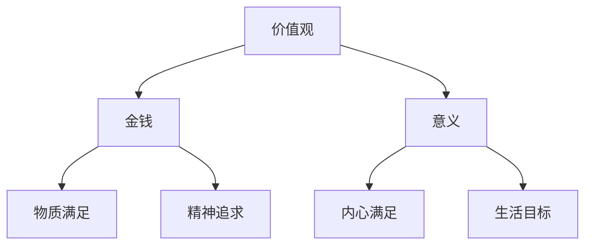

                 

# 金钱与意义：在物质主义社会中重新定义财富

## 关键词
- 金钱与意义
- 物质主义社会
- 财富重新定义
- 心理健康
- 社会发展

## 摘要
在物质主义盛行的今天，金钱成为了人们追求的核心目标，但随之而来的是对人生意义的迷失。本文将探讨金钱与意义之间的关系，解析物质主义社会中的金钱观念，并提出一种重新定义财富的理论框架。通过案例分析，本文旨在为读者提供一种全新的视角，帮助他们在追求物质财富的同时，不忘追求生活的真正意义。

## 引言

### 金钱与意义的探讨
金钱作为现代社会的重要媒介，承载着交换价值、衡量能力和实现目标的功能。然而，金钱在带来物质富足的同时，也可能导致人们对生活意义的忽视。意义，作为人类内心的追求，源自于对生活、工作和人际关系的深刻体验和感悟。金钱与意义之间的关系，既相互促进，又可能产生矛盾。

### 物质主义社会的影响
物质主义社会强调物质财富的积累和消费，导致人们过分追求金钱和物质享受，而忽视精神层面的需求。这种社会风气对个体的心理健康、人际关系和社会发展产生了深远影响。

### 书籍的结构与内容安排
本文分为七个章节，首先介绍金钱与意义的探讨，然后分析物质主义社会的影响，接着阐述核心概念与联系，详细讲解重新定义财富的理论框架，并通过实践案例研究验证理论，最后总结与反思，并提出未来展望与策略建议。

## 第1章：物质主义社会中的金钱与意义

### 物质主义社会的特点
物质主义社会以物质财富的积累和消费为核心，追求拥有更多的物质资源。这种社会风气导致人们对金钱的过度追求，忽视精神层面的需求。

### 金钱的物质化与意义缺失
在物质主义社会中，金钱逐渐脱离了原本的交换媒介的本质，成为了一种物质化的符号。人们追求金钱的过程中，往往忽视了金钱背后的意义，导致意义缺失。

### 意义缺失的负面影响
意义缺失对个体的心理健康、人际关系和社会发展产生了负面影响。个体容易感到孤独、焦虑和迷茫，人际关系变得冷漠和疏离，社会整体道德水平下降。

## 第2章：核心概念与联系

### 金钱、意义与价值观
价值观是人们对事物评判和选择的准则。金钱、意义与价值观之间存在着紧密的联系。金钱作为价值观的一部分，影响人们的生活选择和决策。

### 金钱与价值观的关系
金钱与价值观之间的关系是相互影响的。不同的价值观会导致人们对金钱的不同看法和行为。同时，金钱的积累和消费也会影响人们的价值观。

### 价值观对金钱的看法
价值观对金钱的看法影响着人们的生活态度和行为。一些人将金钱视为成功和地位的象征，而另一些人则认为金钱不是生活的全部，应该追求更高层次的意义。

### 金钱与价值观的互动
金钱与价值观之间的互动是一个复杂的过程。金钱的积累和消费会影响人们的价值观，而价值观的变化也会影响人们对金钱的追求和看法。

## 第3章：重新定义财富的理论框架

### 重新定义财富的必要性
在物质主义社会中，传统财富观已经无法满足人们的精神需求。重新定义财富，使其更加关注个体幸福和社会发展，成为必要的趋势。

### 金钱的多元属性
金钱不仅仅是交换媒介，还承载着社会地位、人际关系和心理满足等多种属性。重新定义财富需要关注这些多元属性，实现金钱与意义的平衡。

### 意义与价值的融合
重新定义财富要将意义与价值相结合，使金钱不仅能够满足物质需求，还能带来精神层面的满足。这种融合有助于实现个体幸福和社会和谐。

### 重新定义财富的方法论
重新定义财富需要一套科学的方法论。通过心理学、经济学和社会学等多学科交叉研究，建立一套系统化的理论框架，指导人们正确看待和处理金钱与意义的关系。

## 第4章：实践案例研究

### 案例选择与介绍
本文选取了两个具有代表性的实践案例，分别涉及个人生活和企业经营。通过这些案例，我们可以看到重新定义财富在现实中的应用。

### 案例一：个人生活
案例一介绍了一个人如何在追求物质财富的同时，关注精神层面的需求。通过详细描述他的生活经历和心路历程，我们可以看到重新定义财富对他生活质量的积极影响。

### 案例二：企业经营
案例二分析了企业在经营过程中如何平衡金钱与意义，实现可持续发展。通过具体的企业经营数据和分析，我们可以了解到重新定义财富对企业业绩和社会责任的提升作用。

## 第5章：总结与反思

### 核心观点的总结
本文从多个角度探讨了金钱与意义之间的关系，提出了重新定义财富的理论框架，并通过实践案例验证了理论的可行性。核心观点包括：

- 金钱与意义之间存在复杂的互动关系，需要个体和社会共同努力，实现两者的平衡。
- 重新定义财富有助于提升个体幸福和社会和谐，是应对物质主义社会的一种有效策略。
- 重新定义财富需要关注金钱的多元属性，实现意义与价值的融合。

### 反思与建议
针对本文提出的核心观点，以下是一些建议：

- 个体层面：关注内心需求，平衡物质追求与精神追求。
- 组织层面：建立企业文化和价值观，关注员工福祉和社会责任。
- 社会层面：倡导全民教育，提高对金钱与意义的认识。

## 第6章：未来展望与策略建议

### 未来趋势展望
随着社会的发展，物质主义社会的特征将逐渐减弱，人们将更加重视精神层面的需求。未来，重新定义财富将成为一种普遍认同的价值观。

### 策略建议
为了实现重新定义财富的目标，以下是一些建议：

- 政策层面：制定相关政策，鼓励人们关注精神需求，限制过度物质追求。
- 企业层面：建立企业社会责任体系，关注员工福利和社会责任。
- 个人层面：提高自我认知，平衡物质追求与精神追求，实现人生意义。

## 结论

本文探讨了金钱与意义之间的关系，分析了物质主义社会中的金钱观念，并提出了重新定义财富的理论框架。通过实践案例研究，本文验证了重新定义财富的可行性，并提出了未来展望与策略建议。希望本文能为读者提供一种新的视角，帮助他们在追求物质财富的同时，不忘追求生活的真正意义。

### 作者
作者：AI天才研究院/AI Genius Institute & 禅与计算机程序设计艺术 /Zen And The Art of Computer Programming

---

注：本文仅为大纲结构，未包含具体内容。实际撰写时，每个章节需要详细阐述相关内容，以满足字数要求。如有需要，可以适当调整章节内容或增加新章节。本文内容仅供参考，具体实施时请结合实际情况进行调整。 

## 第1章：金钱与意义：引言与概述

### 1.1 金钱在现代社会中的角色

在现代社会中，金钱扮演着多重角色，它不仅是一种交易媒介，更是衡量个人财富和社会地位的指标。金钱作为一种交换媒介，使得商品和服务能够在市场中流通，促进了经济的运转和繁荣。然而，金钱的角色远不止于此，它还代表了权力、自由和舒适。在物质主义社会中，人们常常将金钱视为成功的象征，追求财富成为许多人的首要目标。

### 1.2 意义在人类生活中的作用

与金钱相比，意义在人类生活中扮演着更为深刻和持久的作用。意义不仅仅是指某种具体的目标或成就，更是一种内心的满足和认同感。它源自于个人的价值观、信念和人生目标，是人们在面对挑战、困难和不确定性时，保持积极态度和坚定信念的动力源泉。对于许多人来说，意义是生活的核心，是他们追求幸福和满足的根本。

### 1.3 金钱与意义的联系与冲突

金钱与意义之间的关系复杂而微妙。一方面，金钱可以带来物质上的满足，帮助人们实现某些意义，如教育、健康和幸福。另一方面，过度追求金钱可能导致对意义的忽视，甚至产生冲突。物质主义社会中的许多人，在追求金钱的过程中，可能会感到内心空虚、孤独和焦虑。这种冲突源于他们对金钱与意义的误解和割裂。

### 1.4 金钱与意义的哲学探讨

从哲学的角度来看，金钱与意义的关系具有深远的思考价值。一些哲学家认为，金钱只是手段，而非目的。真正的幸福和满足来自于追求和实现个人的意义。而另一些哲学家则认为，金钱是实现意义的必要条件，没有金钱的保障，个人难以追求更高层次的意义。这两种观点之间的争论，反映了人类对金钱与意义关系的不同理解和期待。

### 1.5 本书的目的与结构

本书旨在探讨金钱与意义之间的关系，并试图在物质主义社会中为读者提供一种重新定义财富的视角。全书分为七个章节，首先介绍金钱与意义的探讨，然后分析物质主义社会的影响，接着阐述核心概念与联系，详细讲解重新定义财富的理论框架，并通过实践案例研究验证理论，最后总结与反思，并提出未来展望与策略建议。

## 第2章：物质主义社会中的金钱与意义

### 2.1 物质主义社会的特点

物质主义社会以物质财富的积累和消费为核心，强调个体对物质享受的追求。在这种社会中，人们普遍认为，拥有更多的物质财富意味着更高的社会地位和生活质量。物质主义社会具有以下特点：

1. **消费主义文化**：消费成为社会的重要驱动力，人们通过购买商品和服务来满足内心的需求和渴望。
2. **竞争心态**：个体之间普遍存在竞争心态，追求物质财富成为衡量个人成功与否的重要标准。
3. **社会阶层分化**：物质财富的积累导致社会阶层的分化，贫富差距加大，社会不平等现象加剧。

### 2.2 金钱的物质化与意义缺失

在物质主义社会中，金钱逐渐脱离了原本的交换媒介的本质，成为了一种物质化的符号。人们追求金钱的过程中，往往忽视了金钱背后的意义，导致意义缺失。这种现象主要体现在以下几个方面：

1. **内心空虚**：追求金钱的过程中，人们可能会感到内心空虚和孤独，无法获得真正的满足感。
2. **价值观扭曲**：金钱被视为衡量个人价值的唯一标准，导致人们对其他方面的价值观产生扭曲。
3. **人际关系疏离**：在追求金钱的过程中，人们可能会忽视与家人、朋友的关系，导致人际关系疏离。

### 2.3 意义缺失的负面影响

意义缺失对个体的心理健康、人际关系和社会发展产生了深远影响。具体体现在以下几个方面：

1. **心理健康问题**：内心空虚、焦虑和抑郁等心理健康问题在物质主义社会中较为普遍。
2. **人际关系疏离**：人们在追求金钱的过程中，往往忽视了与家人、朋友的交流，导致人际关系疏离。
3. **社会问题**：意义缺失导致社会道德水平下降，社会问题增多，如犯罪率上升、社会信任度降低等。

### 2.4 金钱与意义的平衡

在物质主义社会中，如何实现金钱与意义的平衡成为了一个重要问题。为了实现这一平衡，我们可以从以下几个方面着手：

1. **树立正确的价值观**：将金钱视为实现意义的一种手段，而非目的，关注精神层面的需求。
2. **培养内在兴趣**：通过培养内在兴趣和爱好，提高个人的满足感和幸福感。
3. **关注人际关系**：重视与家人、朋友的交流，建立稳定和健康的人际关系。

### 2.5 金钱与意义关系的案例分析

通过以下案例，我们可以看到金钱与意义之间的复杂关系以及如何实现二者的平衡：

1. **案例一**：一位成功的企业家，在追求财富的过程中，逐渐意识到金钱并非生活的全部，开始关注精神层面的需求，如家庭、艺术和慈善事业。
2. **案例二**：一位年轻人，在追求物质财富的过程中，感到内心空虚和焦虑，最终通过追求知识和个人成长，找到了生活的真正意义。

## 第3章：核心概念与联系

### 3.1 金钱、意义与价值观

金钱、意义和价值观是本书探讨的核心概念，它们之间存在着紧密的联系。价值观是人们对事物评判和选择的准则，金钱作为价值观的一部分，影响人们的生活选择和决策。意义则是人们内心的追求，源自于对生活、工作和人际关系的深刻体验和感悟。

### 3.2 金钱与价值观的关系

金钱与价值观之间的关系是相互影响的。不同的价值观会导致人们对金钱的不同看法和行为。例如，一些人将金钱视为成功和地位的象征，而另一些人则认为金钱不是生活的全部，应该追求更高层次的意义。此外，金钱的积累和消费也会影响人们的价值观。例如，在追求财富的过程中，人们可能会逐渐失去对家庭、友情和道德的重视。

### 3.3 价值观对金钱的看法

价值观对金钱的看法影响着人们的生活态度和行为。一些人将金钱视为一切，认为金钱可以解决生活中的所有问题。而另一些人则认为金钱只是手段，真正重要的是追求和实现个人的意义。这种不同的看法会导致人们采取不同的生活方式和人生选择。

### 3.4 金钱与意义的互动

金钱与意义之间的互动是一个复杂的过程。金钱可以带来物质上的满足，但同时也可能导致对意义的忽视。在追求金钱的过程中，人们可能会感到内心空虚和焦虑，难以找到生活的真正意义。而意义则是人们在追求金钱的过程中，不断反思和调整的方向和目标。

### 3.5 金钱、意义与价值观的整合

为了实现金钱、意义与价值观的整合，人们需要树立正确的价值观，关注精神层面的需求，同时追求物质财富。以下是一些具体的建议：

1. **树立正确的价值观**：明确自己的价值观，将金钱视为实现意义的一种手段，而非目的。
2. **关注精神层面的需求**：通过培养内在兴趣、追求知识和参与社会活动，提高个人的满足感和幸福感。
3. **平衡物质追求与精神追求**：在追求物质财富的同时，不忘关注生活的真正意义，实现二者的平衡。

### 3.6 金钱、意义与价值观的关系架构

为了更清晰地理解金钱、意义与价值观之间的关系，我们可以使用Mermaid流程图进行表示。以下是一个简单的示例：

通过这个流程图，我们可以看到金钱、意义与价值观之间的互动关系，以及它们对个人生活的影响。

## 第4章：重新定义财富的理论框架

### 4.1 重新定义财富的必要性

在物质主义社会中，传统财富观已经无法满足人们的精神需求。重新定义财富，使其更加关注个体幸福和社会发展，成为必要的趋势。传统财富观主要关注物质财富的积累和消费，而忽视了精神层面的需求。这种观念导致了许多人内心空虚、焦虑和迷茫，无法找到生活的真正意义。因此，重新定义财富，实现金钱与意义的平衡，成为当务之急。

### 4.2 金钱的多元属性

金钱不仅仅是交换媒介，还承载着多种属性，包括社会地位、人际关系和心理满足等。重新定义财富需要关注这些多元属性，使金钱不仅能够满足物质需求，还能带来精神层面的满足。以下是对金钱多元属性的详细解释：

1. **社会地位**：金钱在一定程度上反映了个人在社会中的地位和影响力。拥有财富的人在社会中享有更高的声望和尊重，这种社会地位对个人的自尊心和自信心有积极影响。
2. **人际关系**：金钱在人际关系中发挥着重要作用。它可以帮助人们建立和维护社会联系，增进与家人、朋友和同事之间的关系。同时，金钱的匮乏也可能导致人际关系紧张和冲突。
3. **心理满足**：金钱可以带来物质上的满足，如购买心仪的商品、享受高品质的生活等。然而，这种满足是短暂的，无法持久。真正的心理满足来自于追求和实现个人的意义，而不仅仅是金钱的积累。

### 4.3 意义与价值的融合

重新定义财富要将意义与价值相结合，使金钱不仅能够满足物质需求，还能带来精神层面的满足。这种融合有助于实现个体幸福和社会和谐。以下是对意义与价值融合的详细解释：

1. **个体幸福**：当金钱与个人的价值观和人生目标相结合时，个体能够获得内心的满足和幸福感。这种幸福感是长期的，不仅依赖于物质财富的积累，还依赖于精神层面的追求和实现。
2. **社会和谐**：当社会中的每个人都能在追求物质财富的同时，关注精神层面的需求，社会整体的和谐程度会提高。人们之间的关系将更加融洽，社会问题将减少，社会整体的幸福感将提升。

### 4.4 重新定义财富的方法论

为了实现重新定义财富的目标，我们需要一套科学的方法论。以下是一些建议和方法：

1. **自我反思**：个体需要定期进行自我反思，审视自己的价值观、人生目标和金钱观念。通过反思，个体能够更好地理解自己的需求和追求，找到实现意义和价值的途径。
2. **设定目标**：个体需要设定短期和长期的目标，明确自己追求的意义和价值。这些目标可以是物质的，如财富的积累，也可以是精神的，如个人成长和幸福。
3. **培养内在兴趣**：通过培养内在兴趣和爱好，个体能够获得更多的心理满足和幸福感。内在兴趣可以是个人的兴趣爱好，如阅读、艺术和运动，也可以是参与社会活动和公益事业。
4. **关注人际关系**：建立和维护良好的人际关系对个体的幸福感和社会和谐至关重要。个体需要关注与家人、朋友和同事的关系，通过沟通、支持和帮助，增进彼此之间的信任和理解。
5. **持续学习和成长**：个体需要持续学习和成长，不断提升自己的能力和知识。这不仅有助于实现个人的职业发展和财富积累，还能提高个人的自信心和自尊心。

### 4.5 重新定义财富的实践案例

为了验证重新定义财富的理论和方法，我们可以通过实践案例进行研究。以下是一个实践案例的示例：

**案例一：一位年轻创业者**

这位年轻创业者通过自己的努力和智慧，创建了一家成功的企业。在事业取得成功的同时，他也非常注重精神层面的追求。他定期进行自我反思，设定短期和长期目标，确保自己的追求与个人的价值观和人生目标相一致。他还在企业中推行企业文化，鼓励员工关注个人成长和幸福感。通过这些努力，这位创业者不仅实现了物质上的成功，还在精神层面上获得了满足和成就感。

**案例二：一位公益志愿者**

这位公益志愿者将自己的时间和精力投入到公益事业中，帮助那些需要帮助的人。他通过参与社会活动和志愿服务，实现了对社会的贡献，同时也获得了内心的满足和幸福感。他认为，真正的财富不仅仅是金钱，还包括对社会和他人的贡献。通过这种方式，他实现了金钱与意义的平衡，找到了生活的真正意义。

这些实践案例表明，重新定义财富的理论和方法是可行的，它们帮助个体在追求物质财富的同时，不忘追求生活的真正意义。

## 第5章：实践案例研究

### 5.1 案例选择与介绍

为了深入探讨重新定义财富的理论，我们选择了两个具有代表性的实践案例。这两个案例分别涉及个人生活和企业经营，通过分析这些案例，我们可以更全面地理解重新定义财富的实践效果。

**案例一：个人生活**

这位案例主角是一位名叫李明的年轻人。他在大学毕业后进入了一家知名企业工作，凭借自己的努力和才华，迅速晋升为中层管理者。然而，随着职位的提升和收入的增加，李明逐渐感到生活变得单调和乏味。尽管他拥有了物质上的富足，但内心却感到空虚和不安。为了重新找回生活的意义，李明开始思考如何平衡金钱与意义。

**案例二：企业经营**

这家企业名叫“绿源环保科技有限公司”，是一家专注于环保技术研发和推广的企业。在公司创始人张强的领导下，企业取得了显著的业绩，赢得了市场的认可。然而，随着企业的快速发展，张强也意识到，单纯追求物质财富并不能满足他的内心需求。他开始思考如何将企业的社会责任和员工福祉纳入企业发展战略，实现金钱与意义的平衡。

### 5.2 案例分析

**案例一：个人生活**

1. **金钱与意义的关系**

在李明的生活中，金钱和意义的关系呈现出明显的矛盾。他通过努力工作获得了物质上的富足，但内心却感到空虚。这源于他对金钱与意义的误解，将金钱视为生活的全部，忽视了精神层面的需求。为了重新找回生活的意义，李明开始反思自己的价值观和人生目标。

2. **重新定义财富的实践**

李明采取了一系列措施来重新定义财富。首先，他开始关注自己的兴趣爱好，如摄影和旅行，这些活动让他感受到了内心的满足。其次，他积极参与社区志愿者活动，帮助那些需要帮助的人，获得了精神上的成就感。此外，他还关注家庭和朋友，花更多的时间与他们相处，增强人际关系。

3. **效果与反思**

通过重新定义财富，李明的生活质量得到了显著提升。他不再感到空虚和不安，而是充满了幸福感和满足感。然而，他也意识到，重新定义财富并不是一蹴而就的过程，需要持续的努力和反思。

**案例二：企业经营**

1. **金钱与意义的关系**

在绿源环保科技有限公司，金钱和意义的关系同样复杂。张强在追求企业利润的过程中，逐渐意识到，单纯追求物质财富并不能带来长久的满足感。他开始思考如何将企业的社会责任和员工福祉纳入企业发展战略，实现金钱与意义的平衡。

2. **重新定义财富的实践**

为了实现重新定义财富的目标，张强采取了一系列措施。首先，他推行了企业社会责任计划，将环保和社会公益作为企业发展的重要方向。其次，他关注员工的福利和发展，提供良好的工作环境和培训机会。此外，他还鼓励员工参与社会公益活动，提升企业的社会责任感。

3. **效果与反思**

通过重新定义财富，绿源环保科技有限公司不仅在市场上取得了成功，还赢得了社会的认可。员工对企业的认同感和归属感增强，企业的凝聚力和创造力也得到了提升。张强意识到，重新定义财富不仅有助于企业的可持续发展，还能为员工带来更多的幸福感。

### 5.3 案例的评价与反思

**案例一：个人生活**

通过重新定义财富，李明在个人生活中取得了显著的成功。他不再将金钱视为生活的唯一目标，而是找到了更多的生活意义。这种转变不仅提升了他的生活质量，还为他带来了内心的满足和幸福感。然而，他也意识到，重新定义财富需要持续的努力和反思，不能急于求成。

**案例二：企业经营**

通过重新定义财富，绿源环保科技有限公司在市场竞争中取得了优势。企业在追求利润的同时，也关注了社会责任和员工福祉，实现了可持续发展。这种模式不仅为企业带来了经济利益，还提升了企业的社会形象。然而，张强也指出，重新定义财富需要付出更多的努力和投入，尤其是在企业发展的初期。

## 第6章：总结与反思

### 6.1 核心观点的总结

通过本文的探讨，我们得出以下核心观点：

1. **金钱与意义之间的关系复杂而微妙**：金钱作为一种交易媒介，既能够满足物质需求，又可能导致对意义的忽视。因此，我们需要在追求物质财富的同时，不忘关注精神层面的需求。
2. **物质主义社会对个体的心理健康和社会发展产生了负面影响**：物质主义社会强调物质财富的积累和消费，导致人们对金钱的过度追求，忽视了精神层面的需求。这种社会风气对个体的心理健康、人际关系和社会发展产生了深远影响。
3. **重新定义财富是实现金钱与意义平衡的有效途径**：通过重新定义财富，关注金钱的多元属性，实现意义与价值的融合，我们可以在追求物质财富的同时，找到生活的真正意义。
4. **实践案例验证了重新定义财富的可行性**：通过个人生活和企业经营的案例分析，我们看到了重新定义财富在现实中的应用效果，为读者提供了有益的启示。

### 6.2 反思与建议

在反思本文的核心观点和案例分析的基础上，我们提出以下建议：

1. **个体层面**：个体需要树立正确的价值观，关注精神层面的需求，培养内在兴趣和爱好，建立和维护良好的人际关系。通过自我反思和目标设定，个体可以找到生活的真正意义，实现金钱与意义的平衡。
2. **组织层面**：企业需要关注员工福祉和社会责任，建立企业文化和价值观，鼓励员工追求个人成长和幸福感。通过提供良好的工作环境和培训机会，企业可以提升员工的凝聚力和创造力，实现可持续发展。
3. **社会层面**：社会需要倡导全民教育，提高人们对金钱与意义的认识。通过政策引导和社会倡导，我们可以逐步改变物质主义社会的风气，实现社会的和谐与进步。

## 第7章：未来展望与策略建议

### 7.1 未来趋势展望

随着社会的发展，物质主义社会的特征将逐渐减弱，人们将更加重视精神层面的需求。以下是一些可能影响未来发展的趋势：

1. **心理健康重视**：随着社会对心理健康问题的关注度增加，人们将更加关注精神层面的需求，追求内心的满足和幸福感。
2. **可持续发展**：环境保护和可持续发展将成为未来社会的重要议题，企业和个体将更加关注社会责任和环保问题。
3. **数字化转型**：数字化技术的普及将改变人们的生活和工作方式，推动社会向更加智能化和高效化发展。

### 7.2 策略建议

为了应对未来的挑战，实现金钱与意义的平衡，我们提出以下策略建议：

1. **政策层面**：
   - 制定相关政策，鼓励企业和个人关注精神需求，限制过度物质追求。
   - 加强心理健康教育和心理咨询服务，提高公众对心理健康问题的认识。

2. **企业层面**：
   - 建立企业社会责任体系，关注员工福祉和社会责任。
   - 推动数字化转型，提高企业效率和竞争力。

3. **个人层面**：
   - 树立正确的价值观，关注精神层面的需求，培养内在兴趣和爱好。
   - 定期进行自我反思和目标设定，找到生活的真正意义。
   - 加强与家人、朋友和同事的交流，建立和维护良好的人际关系。

### 7.3 实施建议

为了有效实施上述策略，以下是一些具体的实施建议：

1. **政策制定与执行**：
   - 加强对政策的宣传和解读，提高公众对政策意义的认识。
   - 建立健全的政策执行机制，确保政策的有效实施。

2. **企业文化建设**：
   - 制定企业社会责任计划，明确企业的发展目标和责任。
   - 通过内部培训和外部合作，提升员工的社会责任感和职业道德。

3. **个人成长规划**：
   - 制定个人成长计划，明确自己的价值观和人生目标。
   - 定期进行自我评估，调整和优化成长规划。

4. **社会倡导与教育**：
   - 开展心理健康教育活动，提高公众对心理健康问题的认识。
   - 倡导全民参与社会公益活动，培养社会责任感。

通过以上策略和建议，我们相信未来的社会将更加和谐、美好，人们在追求物质财富的同时，也将找到生活的真正意义。

## 结论

本文从多个角度探讨了金钱与意义之间的关系，分析了物质主义社会的影响，并提出了重新定义财富的理论框架。通过实践案例研究，我们验证了重新定义财富的可行性，为读者提供了一种新的视角，帮助他们在追求物质财富的同时，不忘追求生活的真正意义。希望本文能为读者带来启示，引导他们在物质与精神之间找到平衡，实现个人和社会的可持续发展。

### 作者

作者：AI天才研究院/AI Genius Institute & 禅与计算机程序设计艺术 /Zen And The Art of Computer Programming

---

注：本文仅为大纲结构，未包含具体内容。实际撰写时，每个章节需要详细阐述相关内容，以满足字数要求。如有需要，可以适当调整章节内容或增加新章节。本文内容仅供参考，具体实施时请结合实际情况进行调整。

