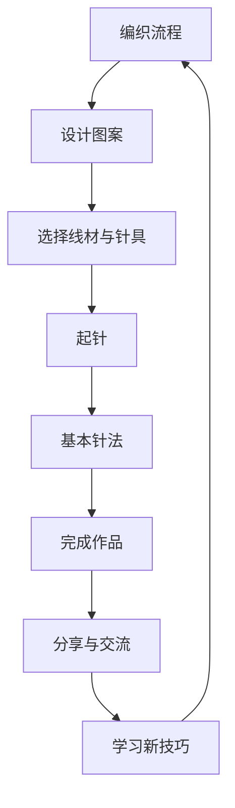

                 

### 编织入门基础

编织，作为一种传统技艺，拥有悠久的历史和丰富的文化内涵。在现代社会，编织不仅是一种手工艺活动，更是一种生活艺术的体现。本章将介绍编织的基本概念、针具与线材的选择，以及编织的基础技巧，帮助读者了解编织的基础知识。

#### 1.1 编织的基本概念

编织，是指用线或纱通过针织或钩织的方式将多个线头连接在一起，形成具有立体结构的织物。它包括针织和钩织两大类，针织主要是通过针具将线材一针一针地穿过织物，形成经纬交织的结构；而钩织则主要使用钩针，通过钩针将线材环环相扣，形成立体网状结构。

针织和钩织的区别在于工具和技法。针织使用的是针，通过将线材穿过针眼形成针织物；钩织使用的是钩针，通过钩针的环扣形成织物。此外，针织物通常更加紧密，而钩织物则更加松散和柔软。

编织的历史可以追溯到旧石器时代，最早的编织可能只是简单地用植物纤维编织成简单的篮子或席子。随着时间的推移，编织技艺不断发展，逐渐形成了各种不同的编织风格和技巧。在古代，编织是人们日常生活中不可或缺的一部分，用于制作衣物、家居用品和装饰品。直到工业革命后，随着机器编织的出现，手工编织逐渐被机械化生产取代。然而，在现代社会，手工编织重新受到重视，成为了一种时尚和艺术表现形式。

#### 1.2 针具与线材

编织的工具主要包括针具和线材。针具是编织过程中不可或缺的辅助工具，不同类型的针具适用于不同的编织项目和材质。

**针具种类**

1. **针织针**：针织针是最常见的针具，通常分为平针针、环形针和钩针。平针针主要用于编织平整的针织物，如毛衣和围巾；环形针主要用于起针和收针，常用于编织圆形或环形织物；钩针则主要用于钩织，适用于制作立体和复杂的织物。

2. **钩针**：钩针的针尖较细，适用于钩织复杂的花纹和图案，如钩花、钩边等。

3. **编织器**：编织器是一种集成了多个针眼的工具，适用于快速编织大面积的织物，如地毯和披肩。

**线材选择**

线材是编织的基础材料，选择合适的线材对于编织作品的质地和耐用性至关重要。

1. **毛线**：毛线是最常见的编织线材，分为粗毛线和细毛线。粗毛线适合编织厚实的衣物和家居用品，细毛线则适合编织细腻和柔软的衣物。

2. **棉线**：棉线具有柔软、透气、吸汗等特点，适合编织夏季衣物和家居用品。

3. **麻线**：麻线质地粗糙，适合编织家居装饰品和工艺品。

4. **丝线**：丝线光泽明亮，手感柔软，适合编织高档服装和装饰品。

在选择线材时，需要考虑编织项目的用途和所需效果。例如，用于制作围巾和毛衣的线材应选择柔软舒适、保暖性好的毛线；而用于家居装饰品的线材则可以选择棉线或麻线，以增加实用性和耐用性。

#### 1.3 编织基础技巧

编织的基础技巧是学习编织的起点，掌握这些基本技巧将有助于读者顺利地开始编织之旅。

**起针方法**

起针是编织的第一步，它决定了整个编织作品的起头部分。常见的起针方法有棒针起针和钩针起针。

1. **棒针起针**：将线材绕在棒针上，然后用钩针或手指将线材钩出，形成一个针眼。起针的多少取决于编织作品的大小和密度。

2. **钩针起针**：用钩针将线材穿过已固定的线头，形成一个针眼。钩针起针适用于起针数量较多的项目，如围巾和毛衣。

**基本针法**

基本针法是编织的基础，包括平针、起针、收针等。

1. **平针**：平针是最基本的针法，通过将线材穿过针眼进行编织。平针可以使织物表面平整，适用于大多数编织项目。

2. **起针**：起针是指在织物中增加新的针眼，用于扩大织物或增加装饰性图案。起针的方法包括绕线起针、钩针起针等。

3. **收针**：收针是指在织物中减少针眼，用于缩小织物或形成细节图案。常见的收针方法有并针收针、交叉收针等。

通过掌握这些基础技巧，读者可以开始尝试简单的编织项目，如小物件和家居用品。随着技巧的提高，可以挑战更加复杂的编织图案和项目，享受编织带来的乐趣和成就感。

总之，编织不仅是一种手工艺活动，更是一种培养耐心和创造力的方式。通过学习编织，读者不仅可以制作出精美的织物，还可以感受到传统技艺的独特魅力，为生活增添一份温馨和美好。

---

### 1.1 编织的基本概念

编织，这一古老的手工艺，在岁月的长河中历久弥新，不仅是一种技艺，更是一种文化的传承。在探讨编织的基本概念之前，有必要对编织的定义和分类进行初步了解。

#### **概念定义**

编织，顾名思义，是指通过线或纱以针织或钩织的方式，将多个线头连接在一起，形成具有立体结构的织物。这一过程涉及经纬线的交织和相互缠绕，最终形成不同的纹理和图案。

**针织**：针织是一种通过针具将线材一针一针地穿过织物，形成经纬交织结构的工艺。针织物通常具有良好的弹性和保暖性能。

**钩织**：钩织则主要使用钩针，通过环环相扣的方式形成立体网状结构。钩织物具有较强的立体感和艺术性。

#### **编织历史**

编织的历史可以追溯到旧石器时代。最早的编织可能只是简单地用植物纤维编织成简单的篮子或席子。随着人类文明的发展，编织技艺逐渐演变和丰富。

在古代，编织是人们日常生活中不可或缺的一部分。人们用编织制作的衣物、家居用品和装饰品，不仅体现了实用功能，还蕴含着深厚的文化内涵。

**中世纪时期**，欧洲的编织技艺得到了极大的发展，出现了许多独特的编织风格和技巧。例如，意大利的蕾丝编织、法国的丝带编织等，这些技艺至今仍然备受推崇。

**工业革命**后，随着机器编织的出现，手工编织逐渐被机械化生产取代。然而，在现代社会，手工编织重新受到重视，成为了一种时尚和艺术表现形式。

**现代编织**：随着科技的发展和人们对手工艺的热爱，现代编织融合了传统技艺和现代设计理念。编织不再仅仅是实用性强的手工活动，更成为一种具有艺术价值的创作形式。

#### **分类**

**按材料分类**：编织可以根据所使用的材料进行分类，如毛线编织、棉线编织、麻线编织等。不同材料的特性决定了编织物的质地和用途。

**按用途分类**：编织可以用于制作衣物、家居用品、装饰品等。例如，毛线编织常用于制作毛衣、围巾、帽子等；棉线编织则适用于夏装和家居装饰品。

**按技法分类**：编织还可以按技法进行分类，如针织、钩织、钩边、镶嵌等。每种技法都有其独特的技巧和特点，适用于不同的编织项目。

#### **总结**

编织不仅是一种手工艺活动，更是一种生活艺术的体现。通过编织，人们不仅能够制作出实用的织物，还可以感受到传统技艺的独特魅力，为生活增添一份温馨和美好。

在接下来的内容中，我们将详细介绍编织所需的针具与线材的选择，以及编织的基础技巧，帮助读者更好地掌握这一传统技艺。

---

### 1.2 针具与线材

编织的成功离不开合适的针具和线材。针具和线材的选择直接影响编织作品的质量和美观度。本节将详细介绍常用的针具种类及其特点，以及如何选择适合的线材。

#### **针具种类**

1. **针织针**：针织针是编织中最常用的针具，分为平针针、环形针和钩针。

   - **平针针**：平针针针尖较平，适用于编织平面的针织物。平针针常用于制作毛衣、围巾等。
   - **环形针**：环形针针尖呈圆环状，主要用于起针和收针。环形针适合编织圆形或环形织物，如毛线球和袖口。
   - **钩针**：钩针针尖较细，适用于钩织立体和复杂的织物。钩针常用于制作钩花、钩边等装饰性图案。

2. **编织器**：编织器是一种集成了多个针眼的工具，适用于快速编织大面积的织物。编织器常用于制作地毯、披肩等大件作品。

3. **特殊针具**：除了常见的针具，还有一些特殊针具，如加长针、防滑针等，这些针具适用于特殊场合和特殊项目。

#### **线材选择**

线材是编织的基础材料，其种类和特性直接影响编织作品的质量和用途。以下是一些常见的线材类型：

1. **毛线**：毛线是最常见的编织线材，分为粗毛线和细毛线。

   - **粗毛线**：粗毛线质地柔软、保暖性好，适用于制作厚实的衣物和家居用品，如毛衣、围巾、毯子等。
   - **细毛线**：细毛线质地细腻，适合制作夏季衣物和装饰品。

2. **棉线**：棉线柔软、透气、吸汗，适合制作夏季衣物和家居用品，如T恤、裙子、桌布等。

3. **麻线**：麻线质地粗糙，适合制作家居装饰品和工艺品，如窗帘、地毯、篮子等。

4. **丝线**：丝线光泽明亮，手感柔软，适用于制作高档服装和装饰品，如连衣裙、披肩、领带等。

5. **混纺线**：混纺线是将两种或多种不同材质的线材混合编织，具有多种材质的特性，如保暖性、柔软性、透气性等。混纺线适用于多种用途，如服装、家居用品、工艺品等。

#### **选择原则**

1. **项目需求**：根据编织项目的需求和用途选择合适的线材。例如，制作厚实的毛衣应选择粗毛线；制作夏季衣物应选择棉线。

2. **个人喜好**：根据个人的喜好和风格选择线材的颜色和质地。不同的线材颜色和质地可以营造出不同的效果和氛围。

3. **编织技巧**：选择与个人编织技巧相匹配的线材。新手应选择质地柔软、易操作的线材，如细毛线或棉线；熟练者可以选择质地较硬、弹性较好的线材，如粗毛线或麻线。

4. **预算**：线材的价格因材质、品牌和长度而异。根据预算选择合适的线材，同时注意线材的性价比。

通过了解针具和线材的种类、特性及选择原则，读者可以更好地为编织项目做好准备，选择合适的工具和材料，从而提高编织作品的质量和美观度。

在接下来的章节中，我们将进一步介绍编织的基础技巧，帮助读者开始编织之旅。

---

### 1.3 编织基础技巧

掌握了编织的基本概念和所需工具后，接下来便是学习编织的基础技巧。这些基础技巧是编织成功的关键，包括起针方法、基本针法等。以下是详细的学习步骤和说明。

#### **起针方法**

起针是编织的第一步，也是决定编织作品起头质量的重要环节。以下是一些常用的起针方法：

1. **棒针起针**：
   - **步骤一**：将线材绕在棒针上，使线头留出一定长度。
   - **步骤二**：用另一根钩针或手指将线材从棒针上钩出，形成一个针眼。
   - **注意事项**：起针时，线材要松紧适度，针眼要均匀。

2. **钩针起针**：
   - **步骤一**：将线材穿过已固定的线头，形成一个线环。
   - **步骤二**：用钩针将线材从线环中穿过，形成第一个针眼。
   - **注意事项**：钩针起针适用于起针数量较多的项目，如围巾和毛衣。

#### **基本针法**

基本针法是编织的核心技巧，包括平针、起针和收针等。以下是这些基本针法的详细步骤和说明：

1. **平针**：
   - **步骤一**：将针线穿过针眼。
   - **步骤二**：从针的背面将线材拉过针眼，使线材穿过两个针眼。
   - **步骤三**：重复上述步骤，直至完成所需的行数和针数。
   - **注意事项**：编织时，要均匀用力，保持针眼的一致性。

2. **起针**：
   - **步骤一**：将针线穿过针眼。
   - **步骤二**：从针的背面将线材拉过针眼，使线材穿过两个针眼，但不要拉紧。
   - **步骤三**：在新的针眼上重复起针步骤，直到达到所需的针数。
   - **注意事项**：起针时，要保持线材的松弛，避免线材过于紧张。

3. **收针**：
   - **步骤一**：将针线穿过两个相邻的针眼。
   - **步骤二**：将针线从针的背面拉过，使针线穿过这两个针眼，形成一个交叉。
   - **步骤三**：将针从织物的背面抽出，收针完成。
   - **注意事项**：收针时要均匀用力，避免收针过于紧或松。

通过学习这些基础技巧，读者可以开始尝试简单的编织项目，如小物件和家居用品。以下是一个简单的实例：

**实例：编织一个简单的毛线球**

1. **准备材料**：选择一根毛线，一根棒针。
2. **起针**：按照起针方法，用棒针起大约10个针眼。
3. **编织**：用平针方法编织5行，每行大约10个针。
4. **收针**：在最后一行完成后，用收针方法将针眼收起来。
5. **结束**：将线头藏起来，完成编织作品。

通过这个实例，读者可以初步掌握编织的基础技巧，并体验到编织的乐趣。

总之，编织基础技巧是编织过程中不可或缺的一环。通过学习和实践，读者可以不断提高自己的编织技能，制作出更多精美的织物和装饰品。在接下来的章节中，我们将进一步探讨编织图案的设计和应用。

---

### 2.1 图案设计原理

编织图案是编织作品的核心元素，它不仅决定了作品的外观美感，还体现了编织者的创意和技艺。图案设计在编织中占有重要地位，掌握图案设计原理是提高编织作品水平的关键。以下将详细讲解编织图案设计的基本原则、设计步骤以及如何通过色彩搭配提升编织作品的美感。

#### **基本图案设计原则**

1. **对称与平衡**：对称是图案设计中最基本的原则之一，能够创造出稳定和谐的美感。图案的对称性可以通过轴对称、中心对称等方式实现。轴对称是指图案通过一个轴进行翻转，两边完全相同；中心对称是指图案通过中心点进行旋转，旋转前后的图案完全一致。

2. **重复与节奏**：重复是图案设计中常用的手法，通过重复相同或类似的图案元素，可以形成节奏感和规律感。例如，在编织围巾或毛衣时，可以重复某种特定的花纹，使作品具有整体性和连贯性。

3. **对比与和谐**：对比和和谐是图案设计中相辅相成的两个方面。对比通过颜色、形状、纹理等方面的差异来增强视觉效果，而和谐则通过协调和统一的元素来减少视觉冲突。在设计过程中，适当运用对比与和谐，可以使图案更加生动有趣。

4. **简繁结合**：简繁结合是指在设计中同时运用简洁和复杂的元素。简洁的元素可以突出重点，使图案更加清晰易懂；而复杂的元素则可以增加图案的层次感和艺术感。合理运用简繁结合，可以使图案更加丰富和立体。

#### **设计步骤**

1. **灵感来源**：图案设计的灵感可以来源于自然界的图案，如花卉、动物、风景等，也可以来源于生活，如传统服饰、建筑图案等。在寻找灵感时，可以多观察身边的事物，或通过参考书籍、网络资源来获取创意。

2. **草图绘制**：在获取灵感后，可以将设计灵感转化为草图。草图可以是简单的线条和色块，用来表达图案的基本结构和元素。这一步不需要过于精细，主要是为了确定图案的大致方向和风格。

3. **图案细化**：在草图的基础上，对图案进行细化。这一步包括确定图案的细节，如线条的粗细、颜色的搭配等。细化过程中，可以运用对称、重复、对比等设计原则，使图案更加完善和精致。

4. **颜色搭配**：颜色是图案设计中至关重要的一环。合适的颜色搭配可以提升图案的美感和实用性。在颜色搭配时，可以考虑以下几点：
   - **色调**：根据编织作品的用途和风格，选择合适的色调。例如，冬季作品可以选择暖色调，而夏季作品可以选择冷色调。
   - **色彩搭配**：可以运用同色系搭配、对比色搭配、互补色搭配等方式来选择颜色。同色系搭配给人以和谐宁静的感觉；对比色搭配可以增强视觉冲击力；互补色搭配则可以产生强烈的视觉效果。

5. **图案应用**：在确定图案和颜色后，可以将图案应用到具体的编织项目中。例如，在编织围巾时，可以选择在围巾的一侧或两侧编织图案；在编织毛衣时，可以将图案应用于袖子、领口或背部等部位。

#### **实例分析**

**实例**：设计一个简单的花卉图案，用于编织围巾。

1. **灵感来源**：以自然界中的花卉为灵感，选择一个常见的花卉图案，如玫瑰花。

2. **草图绘制**：绘制玫瑰花的基本轮廓，包括花瓣和花蕊。

3. **图案细化**：细化花瓣的形状和大小，使图案更加丰富和立体。

4. **颜色搭配**：选择粉红色作为花瓣的颜色，白色作为花蕊的颜色，形成鲜明的对比。

5. **图案应用**：在围巾的一侧编织玫瑰花图案，另一侧编织简单的平针，使整个围巾更加美观和实用。

通过上述实例，我们可以看到，图案设计是一个创意与实践相结合的过程。掌握设计原理和步骤，结合个人喜好和实际需求，可以设计出丰富多彩的编织图案，为编织作品增添独特的美感和艺术价值。

总之，编织图案设计不仅需要创意和技巧，还需要对设计原理的深刻理解。通过不断学习和实践，读者可以不断提升自己的设计水平，创作出更多精美的编织作品。

---

### 2.2 基础编织图案实例

在掌握了编织图案设计原理后，实际操作中的应用显得尤为重要。本节将展示一些常见的基础编织图案，并详细介绍其应用方法，帮助读者将理论知识转化为实践操作。

#### **基本图案**：V字针、波浪针、绞针

1. **V字针**

   - **编织方法**：首先起针，然后从第一个针开始，依次将线材穿过针眼，形成V字形状。
   - **适用场景**：V字针图案简洁大方，适用于制作围巾、毛衣等。
   - **实例**：在编织围巾时，可以在一侧重复编织V字针，另一侧编织平针，形成对比鲜明的效果。

2. **波浪针**

   - **编织方法**：从第一个针开始，依次将线材穿过针眼，形成波浪形状。
   - **适用场景**：波浪针图案优雅流畅，适用于制作毛衣、裙子等。
   - **实例**：在编织毛衣时，可以在袖口、领口等部位编织波浪针，增加作品的层次感。

3. **绞针**

   - **编织方法**：从第一个针开始，将线材绕过针尖，形成绞线效果。
   - **适用场景**：绞针图案具有立体感，适用于制作帽子、手套等。
   - **实例**：在编织手套时，可以在手指部位编织绞针，增加手套的保暖性和装饰性。

#### **图案应用**：在实际编织项目中的应用

1. **围巾**

   - **设计思路**：选择V字针和波浪针组合，形成简洁又富有层次感的围巾。
   - **编织步骤**：
     1. 起针，选择适当的线材和针具。
     2. 编织前几行平针作为起头。
     3. 从第5行开始，交替编织V字针和波浪针，保持图案的连贯性。
     4. 在结尾部分，再次编织几行平针，然后收针。
   - **效果展示**：编织完成的围巾既美观又实用，适合冬季佩戴。

2. **毛衣**

   - **设计思路**：选择波浪针和绞针组合，增加毛衣的丰富性和立体感。
   - **编织步骤**：
     1. 起针，选择适当的线材和针具。
     2. 编织前几行平针作为起头。
     3. 在袖口、领口等部位编织波浪针，增加美观性。
     4. 在背部和袖子等部位编织绞针，增加立体感。
     5. 在结尾部分，再次编织几行平针，然后收针。
   - **效果展示**：编织完成的毛衣既时尚又保暖，适合冬季穿着。

3. **手套**

   - **设计思路**：选择绞针，增加手套的保暖性和装饰性。
   - **编织步骤**：
     1. 起针，选择适当的线材和针具。
     2. 编织几行平针作为起头。
     3. 在手指部位编织绞针，增加手套的立体感和保暖性。
     4. 在结尾部分，再次编织几行平针，然后收针。
   - **效果展示**：编织完成的手套既保暖又美观，适合寒冷的冬季佩戴。

通过这些实例，读者可以了解到如何将基础编织图案应用到实际项目中，提升作品的美感和实用性。在不断的实践和尝试中，读者可以积累更多的经验，创作出更多独特的编织作品。

---

### 3.1 小物件制作

编织不仅限于大型项目，小物件制作同样充满了乐趣和创意。小物件制作不仅可以提升编织技巧，还可以为日常生活增添一抹温馨。以下将详细介绍一些常见的小物件制作流程，并提供实用的技巧。

#### **3.1.1 小物件制作流程**

1. **准备材料**：根据所需物件选择合适的线材和针具。例如，制作一个小钥匙扣，可以选用细毛线和小型环形针。

2. **起针**：用环形针起针，起针数量根据物件大小而定。通常，小物件的起针数量在20到30个针眼之间。

3. **编织**：根据物件形状和设计要求，选择合适的编织针法。例如，制作钥匙扣，可以编织几行平针，然后进行起针和收针，形成所需的形状。

4. **收尾**：完成编织后，将线头藏于织物内部，确保不露出。

5. **装饰**：根据需要，可以在小物件上添加装饰，如绣花、贴片等。

#### **实用技巧**

1. **线材处理**：在起针时，可以用针线将线材固定在织物底部，避免线材松动。

2. **起针数量**：根据物件大小和形状，调整起针数量。起针过多会导致物件过于松弛，起针过少则会导致物件过于紧绷。

3. **收针技巧**：在收针时，可以采用交叉收针的方法，使织物边缘更加平整和美观。

4. **装饰选择**：装饰的选择应与物件形状和设计风格相协调，避免过于突兀。

#### **实例**：制作一个小钥匙扣

**材料**：细毛线、小型环形针、剪刀、线头。

**步骤**：

1. **起针**：用环形针起针20个针眼。

2. **编织**：编织几行平针，然后开始起针和收针，编织成钥匙扣的形状。

3. **收尾**：在钥匙扣底部编织几行平针，然后收针。

4. **装饰**：在钥匙扣上绣上一个小蝴蝶结，增加装饰性和美观度。

通过这些步骤，可以制作出一个漂亮的小钥匙扣，不仅实用，还可以作为礼物送给亲朋好友，体现出手工编织的独特魅力。

总之，小物件制作是编织爱好者入门和提升技能的好方法。通过不断尝试和练习，可以创作出更多精美的作品，享受编织带来的乐趣。

---

### 3.2 家居装饰品

编织家居装饰品不仅能为家庭环境增添温馨与美感，还能提升居住者的生活品质。本节将介绍几种常见的家居装饰品制作方法，并提供实用的技巧，帮助读者掌握编织家居装饰品的技能。

#### **3.2.1 家居装饰品制作方法**

1. **编织地毯**

   - **材料**：选择厚实的毛线或混纺线，使用编织器或大号环形针。
   - **步骤**：
     1. 起针，起针数量取决于地毯的大小。
     2. 选择合适的编织针法，如平针、V字针等，编织出地毯的基本形状。
     3. 在地毯边缘编织一圈平针，然后收针固定。
     4. 将地毯翻转到背面，用针线将线头藏起来。

   - **实用技巧**：在编织过程中，可以适当调整针法，使地毯表面更加平整和美观。如果地毯较为厚实，可以使用编织器来提高编织效率。

2. **手工挂毯**

   - **材料**：选择细线或毛线，使用普通环形针或钩针。
   - **步骤**：
     1. 设计图案，将图案分解成简单的线条和色块。
     2. 起针，根据图案大小调整起针数量。
     3. 使用平针、绞针等基础针法，根据设计要求编织图案。
     4. 在图案完成后，编织几行平针作为边缘，然后收针固定。
     5. 将挂毯绣上细节，如花朵、文字等，增加艺术感。

   - **实用技巧**：在编织过程中，可以使用不同颜色的线材，增加图案的层次感和立体感。绣花时，可以选择细针和细线，使细节更加细腻。

3. **装饰枕头**

   - **材料**：选择柔软的毛线或棉线，使用普通环形针或钩针。
   - **步骤**：
     1. 设计图案，可以是简单的花纹或复杂的图案。
     2. 起针，根据枕头大小调整起针数量。
     3. 编织图案，可以选择平针、波浪针、V字针等基础针法。
     4. 在图案完成后，编织几行平针作为边缘，然后收针固定。
     5. 将线头藏于枕头内部，确保美观。

   - **实用技巧**：在编织过程中，可以使用不同颜色和材质的线材，创造丰富多彩的图案。在编织边缘时，可以添加一些装饰性线条，使枕头更加独特。

#### **实例**：制作一个简单的毛衣球装饰品

**材料**：细毛线、小型环形针、剪刀。

**步骤**：

1. **起针**：使用环形针起针20个针眼。

2. **编织**：编织几行平针，然后在第五行开始编织波浪针。

3. **形成球体**：在编织到第10行时，开始编织V字针，将织物逐渐收紧，形成球体形状。

4. **收尾**：在球体底部编织几行平针，然后收针固定。

5. **装饰**：在球体表面绣上一些小花朵，增加装饰性和美观度。

通过这个简单的实例，读者可以了解到编织家居装饰品的基本步骤和技巧。在不断的实践和探索中，可以创作出更多精美的家居装饰品，为家庭生活增添一份温馨和艺术氛围。

总之，编织家居装饰品不仅是一种手工艺术，更是一种生活的艺术表达。通过学习和尝试，读者可以不断提升自己的编织技能，为家庭环境创造更多的美好。

---

### 4.1 复杂图案编织

在掌握了基础编织技巧后，读者可以尝试编织更加复杂的图案，这不仅能够提升编织技能，还能丰富编织作品的艺术性和实用性。本节将详细介绍复杂图案的设计原理，并提供一些实用的编织实例。

#### **4.1.1 设计原理**

1. **图案分解**：复杂图案通常由多个基础元素组成。设计复杂图案的第一步是将图案分解成简单的线条和色块。例如，一个复杂的花卉图案可以分解成花瓣、花蕊、叶子和茎。

2. **颜色规划**：在图案设计中，颜色的选择和搭配至关重要。合理的颜色规划可以增强图案的美感和立体感。可以选择单一色调进行编织，也可以使用多种颜色进行对比或渐变。

3. **针法应用**：不同的针法可以创造出不同的纹理和效果。在复杂图案的编织中，可以结合使用平针、波浪针、V字针、绞针等多种针法。通过灵活运用针法，可以使图案更加丰富和立体。

4. **重复与组合**：复杂图案通常通过重复和组合基础元素来实现。设计过程中，可以将基础元素进行旋转、翻转、镜像等操作，形成多种变体，使图案更加多样化。

#### **4.1.2 编织实例**

**实例**：编织一个简单的花卉图案

**材料**：细毛线、环形针、剪刀。

**步骤**：

1. **图案设计**：首先设计一个简单的花卉图案，如玫瑰花。将图案分解成花瓣、花蕊等基本元素。

2. **颜色规划**：选择红色毛线编织花瓣，黄色毛线编织花蕊。

3. **起针**：使用环形针起针20个针眼。

4. **编织花瓣**：
   - **第一行**：编织平针。
   - **第二行**：在每个针眼上编织两针，形成花瓣的初步形状。
   - **第三行**：在每个针眼上编织一针，同时将线材绕过针尖，形成花瓣的凹槽。

5. **编织花蕊**：
   - **第一行**：在花瓣的中心位置起针5个针眼。
   - **第二行**：在每个针眼上编织两针，形成花蕊的基础形状。
   - **第三行**：在每个针眼上编织一针，同时将线材绕过针尖，使花蕊更加圆润。

6. **收尾**：在完成花蕊后，编织几行平针，然后收针固定。

7. **装饰**：在花瓣和花蕊上绣上一些细节，如叶子、小草等，增加图案的立体感和美观度。

**效果展示**：完成后的花卉图案不仅美观，而且具有丰富的立体感。通过这个实例，读者可以了解到复杂图案的设计和编织方法，为后续的复杂编织项目打下基础。

总之，复杂图案编织需要耐心和创造力。通过不断学习和实践，读者可以不断提升自己的编织技能，创作出更多精美、独特的编织作品。

---

### 4.2 编织技巧提升

在编织过程中，技巧的掌握不仅能够提升作品的质量，还能增加编织的乐趣。本节将介绍几种常见的编织技巧，包括如何提升编织速度、如何保持针线的一致性，以及如何处理常见的编织问题，帮助读者在编织过程中更加得心应手。

#### **4.2.1 提升编织速度**

1. **熟悉针具和线材**：熟练使用针具和线材是提升编织速度的关键。掌握不同针具的特点和适用场景，选择合适的线材，可以减少不必要的停顿和错误。

2. **练习基础针法**：基础针法如平针、起针、收针等是编织的基础。通过反复练习，可以熟悉针法，提高编织速度。

3. **采用分段编织**：将整个编织项目分为多个小段，分别完成。在分段过程中，可以专注于某个局部，提高速度和准确性。

4. **利用工具**：使用编织器或其他辅助工具，可以加快编织速度。例如，编织器适用于大面积的织物，可以减少手工编织的时间和劳动强度。

#### **4.2.2 保持针线一致性**

1. **正确选择线材**：选择质地柔软、颜色均匀的线材，可以减少线材之间的差异，保持针线的统一性。

2. **保持针线张力**：在编织过程中，保持针线的适当张力非常重要。过紧或过松的针线都会影响编织的质量和美观度。可以通过调整针具和线材的松紧度，找到最合适的张力。

3. **定期检查针线**：在编织过程中，定期检查针线和针具的状态，及时发现并处理松动、断裂等问题，确保针线的统一性。

4. **使用线夹和线标**：在编织过程中，使用线夹和线标可以方便地标记线头位置，防止线材纠缠，提高编织效率。

#### **4.2.3 处理常见问题**

1. **线材纠缠**：线材纠缠是编织过程中常见的问题。处理方法包括：使用线夹固定线头，减少线材的移动；使用线标标记线头，防止线材缠绕。

2. **针眼不一致**：针眼不一致会导致织物表面不平整。处理方法包括：在起针时，保持线材的松弛度一致；在编织过程中，保持针线张力均匀；如果发现针眼不一致，可以使用剪刀修剪调整。

3. **编织松紧不均**：编织松紧不均会影响织物的质量和美观度。处理方法包括：选择合适的针具和线材，确保张力适中；在编织过程中，定期检查并调整松紧度。

4. **收针不齐**：收针不齐会导致织物边缘不平整。处理方法包括：在收针时，保持针线张力一致；可以使用交叉收针的方法，使边缘更加平整。

通过学习和实践这些技巧，读者可以在编织过程中更加熟练和高效，制作出更加精美和高质量的编织作品。在不断的尝试和探索中，读者还可以发现更多实用的技巧，提升自己的编织水平。

---

### 5.1 编织工具

编织工具是完成编织项目的重要辅助手段，不同的工具适用于不同的编织任务，能够显著提升编织的效率和作品的质量。以下将介绍几种常用的编织工具及其使用方法。

#### **5.1.1 针具**

1. **棒针**：棒针是最常用的编织工具之一，适用于针织项目。棒针分为直形棒针和环形棒针，直形棒针适用于大面积的平整织物，如毛衣、围巾等；环形棒针适用于起针和收针，以及圆形或环形的织物，如毛线球和袖口。

   - **使用方法**：在使用棒针时，需要根据编织项目选择合适的针号。针号越大，针眼间距越大，针号越小，针眼间距越小。编织时，将线材绕在棒针上，通过穿针和收针等针法完成编织。

2. **钩针**：钩针主要用于钩织项目，如钩花、钩边等。钩针的针尖较细，适用于制作复杂和精致的图案。

   - **使用方法**：使用钩针时，需要先起针，然后将线材通过钩针的环扣形成织物。钩针的针法包括钩针起针、钩针收针、钩针并针等，通过这些针法可以编织出丰富的图案和纹理。

3. **编织器**：编织器是一种集成了多个针眼的工具，适用于快速编织大面积的织物，如地毯、披肩等。

   - **使用方法**：使用编织器时，首先需要将线材绕在编织器的针眼上，然后按照编织器的操作方法进行编织。编织器可以提高编织效率，适合大型项目的快速完成。

#### **5.1.2 其他工具**

1. **线夹**：线夹用于固定线头，防止线材在编织过程中纠缠和松动。

   - **使用方法**：在编织过程中，当需要更换线材或暂时停止编织时，可以使用线夹将线头固定在织物上，防止线材移动。

2. **线标**：线标用于标记线头位置，便于后续编织。

   - **使用方法**：在编织过程中，可以使用线标标记当前线头的位置，便于更换线材或进行后续的编织工作。

3. **剪刀**：剪刀用于修剪线头、去除多余的线材，以及进行一些细节的调整。

   - **使用方法**：在编织过程中，需要使用剪刀修剪线头，确保线头整洁且不会露出来影响作品的美观。

#### **5.1.3 工具使用技巧**

1. **选择合适的工具**：根据编织项目的需求和特点，选择合适的编织工具。例如，对于小型和精细的项目，可以选择小型环形针和钩针；对于大面积和快速的项目，可以选择编织器。

2. **正确使用工具**：掌握各种编织工具的正确使用方法，能够提高编织效率和质量。例如，在使用棒针时，需要均匀用力，保持针线的张力一致；在使用钩针时，需要注意钩针的环扣技巧，确保织物的稳定性。

3. **保养工具**：定期清洁和保养编织工具，可以延长工具的使用寿命，保证编织质量。例如，定期清洁棒针和钩针的针眼，防止线材粘连；定期涂抹少量的润滑油，保持编织器的顺畅。

通过了解和掌握这些编织工具，读者可以在编织过程中更加得心应手，制作出更加精美的编织作品。

---

### 5.2 编织技术

编织技术是编织过程中不可或缺的一部分，它不仅决定了编织作品的质量，还影响着编织的速度和效率。以下将详细介绍几种常见的编织技术及其应用，帮助读者更好地理解和掌握这些技术。

#### **5.2.1 经纬编织技术**

经纬编织技术是编织的基础，它通过经线和纬线的交织形成稳定的织物结构。这种技术适用于各种针织和钩织项目。

1. **平针编织**：平针编织是最基本的针织技术，通过将线材穿过针眼形成经纬交织。平针编织适用于制作毛衣、围巾等。

   - **步骤**：首先起针，然后按照顺序将线材穿过针眼，每穿过一个针眼就编织一次，重复这个过程直到完成所需的行数。

2. **波浪针编织**：波浪针编织通过交替编织平针和绞针，形成波浪状的纹理，使织物表面更加丰富和立体。

   - **步骤**：首先起针，然后按照一定的顺序编织平针和绞针，形成波浪形状。编织过程中，需要注意波浪的起伏和过渡，使织物表面平滑连贯。

3. **V字针编织**：V字针编织通过编织V字形状的针法，形成独特的纹理效果。

   - **步骤**：首先起针，然后在每个针眼上编织两针，形成一个V字形状。在后续的行数中，继续按照这个模式编织，使织物表面形成连续的V字纹理。

#### **5.2.2 立体编织技术**

立体编织技术通过增加纬线或经线，使织物形成立体结构，适用于制作立体图案和装饰品。

1. **钩织技术**：钩织技术主要使用钩针，通过环环相扣的方式形成立体结构。

   - **步骤**：首先起针，然后通过钩针的环扣形成织物。钩织技术适用于制作钩花、钩边、毛衣等。

   - **实例**：制作一个简单的钩花图案，首先起针，然后编织多个环，将环相互连接，形成钩花的基本形状。在环的基础上继续编织，形成更加复杂的图案。

2. **加针技术**：加针技术通过在编织过程中增加针眼，使织物逐渐扩大。

   - **步骤**：在编织过程中，按照一定的规律在相应的位置增加针眼，使织物逐渐扩大。加针技术适用于制作围巾、袖子等。

   - **实例**：在编织围巾时，可以在每隔几行增加一次针眼，使围巾逐渐扩大，形成膨胀效果。

3. **减针技术**：减针技术通过在编织过程中减少针眼，使织物逐渐缩小。

   - **步骤**：在编织过程中，按照一定的规律在相应的位置减少针眼，使织物逐渐缩小。减针技术适用于制作领口、袖口等。

   - **实例**：在编织毛衣的领口时，可以在领口边缘减少针眼，使领口逐渐收紧，形成合适的大小。

#### **5.2.3 织物调整技术**

织物调整技术用于在编织过程中对织物进行修正，使其更加平整和均匀。

1. **修剪技术**：修剪技术用于修剪线头和调整织物边缘，使其更加平整。

   - **步骤**：在编织完成后，使用剪刀将线头修剪成斜角，然后轻轻拉扯线头，使织物边缘平整。

2. **拉伸技术**：拉伸技术用于在编织过程中对织物进行适度拉伸，使其更加均匀。

   - **步骤**：在编织过程中，可以适当拉伸织物，使其长度和宽度符合预期。拉伸技术适用于制作宽大的织物，如围巾、毯子等。

3. **回弹技术**：回弹技术用于将拉伸后的织物恢复到原始状态，使其更加平整。

   - **步骤**：在拉伸织物后，将织物平铺，用重物压一段时间，使其恢复到原始状态。

通过掌握这些编织技术，读者可以在编织过程中更加灵活地应对各种挑战，制作出更加精美和实用的编织作品。

---

### 6.1 环保编织材料

随着环保意识的提高，越来越多的编织爱好者开始关注环保编织材料的使用。环保编织材料不仅有助于减少对环境的负担，还能为编织作品增添独特的魅力。以下将介绍几种常见的环保编织材料及其特点，帮助读者了解和选择环保编织材料。

#### **6.1.1 天然纤维材料**

**棉线**：棉线是一种常见的环保编织材料，由棉花纤维制成。棉线具有良好的柔软性、透气性和吸汗性，适合制作夏季衣物和家居用品。棉线的颜色丰富，且易于染色，可以根据个人喜好进行选择。

**麻线**：麻线由麻类植物纤维制成，具有粗糙、耐用的特点。麻线适用于制作家居装饰品、工艺品和户外用品。麻线的质地较硬，可以增加编织作品的耐用性和防皱性。

**羊毛线**：羊毛线由羊毛纤维制成，具有良好的保暖性和柔软性。羊毛线适合制作冬季衣物和家居用品，如毛衣、围巾、毯子等。羊毛线的弹性较好，可以适应不同的编织项目。

**亚麻线**：亚麻线由亚麻纤维制成，具有耐磨、防皱、透气等特点。亚麻线适用于制作服装、家居用品和户外用品，尤其适合需要长时间使用的项目。

#### **6.1.2 再生纤维材料**

**聚酯纤维**：聚酯纤维是由废旧塑料瓶等回收材料加工而成的，具有良好的弹性和耐磨性。聚酯纤维线适用于制作运动服、泳衣、地毯等需要高弹性和耐磨性的项目。

**尼龙纤维**：尼龙纤维是由废旧尼龙制品回收加工而成的，具有高强度、耐磨性和耐腐蚀性。尼龙纤维线适用于制作登山绳、背包带、渔网等需要高强度的项目。

**粘胶纤维**：粘胶纤维是由天然纤维素原料加工而成的，具有柔软、透气、吸汗等特点。粘胶纤维线适用于制作内衣、袜子、床上用品等需要舒适性的项目。

#### **6.1.3 其他环保材料**

**丝绸线**：丝绸线由蚕丝纤维制成，是一种高档的环保编织材料。丝绸线具有良好的光泽、柔软性和舒适性，适用于制作高端服装、家居装饰品和工艺品。

**玉米纤维**：玉米纤维是由玉米秸秆等农业废弃物加工而成的，具有环保、可再生、低碳等特点。玉米纤维线适用于制作环保服装、家居用品和工艺品。

**竹纤维**：竹纤维是由竹子加工而成的，具有柔软、透气、吸湿等特点。竹纤维线适用于制作内衣、袜子、床上用品等需要舒适性的项目。

#### **6.1.4 选择原则**

1. **项目需求**：根据编织项目的用途和需求选择合适的材料。例如，用于制作冬季衣物的材料应选择保暖性好的羊毛线；用于家居装饰品和户外用品的材料应选择耐磨、防皱的麻线。

2. **环保特性**：优先选择环保性能较好的材料，如天然纤维和再生纤维。这些材料不仅有利于环保，还具有较高的舒适性和耐用性。

3. **成本效益**：在选择环保编织材料时，还需要考虑成本效益。一些环保材料的成本较高，因此需要根据预算进行合理选择。

4. **个人喜好**：根据个人喜好和作品风格选择合适的材料。不同的材料可以营造出不同的风格和视觉效果。

通过了解和选择环保编织材料，读者可以在享受编织乐趣的同时，为环保事业做出贡献。在接下来的章节中，我们将进一步探讨如何通过编织实践环保生活方式。

---

### 6.2 可持续生活方式

编织不仅是一种手工艺活动，更是一种实践可持续生活方式的有效途径。通过选择环保材料、节约能源、减少浪费等方式，编织可以成为减少环境负担、促进可持续发展的重要手段。以下将详细探讨如何通过编织实现可持续生活方式。

#### **6.2.1 选择环保材料**

选择环保材料是编织可持续性的基础。以下是一些常见的环保材料及其特点：

1. **天然纤维**：如棉、麻、羊毛、亚麻等，这些材料来自可再生资源，对环境的影响较小。棉和麻具有良好的透气性和吸湿性，适合制作夏季衣物和家居用品；羊毛和亚麻则具有保暖性和耐用性，适合冬季衣物和户外用品。

2. **再生纤维**：如聚酯纤维、尼龙纤维等，这些材料是由废旧材料回收再利用制成的，可以减少对环境的影响。聚酯纤维和尼龙纤维具有高强度和耐磨性，适用于制作运动服、背包、渔网等需要高强度的项目。

3. **生物基材料**：如玉米纤维、竹纤维等，这些材料来自植物或其他可再生资源，具有环保、可再生、低碳等特点。玉米纤维和竹纤维具有良好的柔软性和舒适性，适用于制作内衣、袜子、床上用品等。

#### **6.2.2 节约能源**

编织过程中的能源节约是可持续生活方式的重要组成部分。以下是一些节能技巧：

1. **使用自然光线**：在自然光线充足的环境中进行编织，可以减少对电灯的依赖，降低能源消耗。

2. **合理使用电器**：在使用编织器或其他电动工具时，确保其高效运行，避免长时间闲置和空转。

3. **优化工作流程**：将多个编织项目集中在一起完成，减少开关电器的次数，降低能源消耗。

#### **6.2.3 减少浪费**

减少浪费是编织可持续发展的重要环节。以下是一些减少浪费的方法：

1. **充分利用剩余线材**：在编织过程中，可以使用剩余线材制作小物件或进行修补，避免浪费。

2. **合理规划材料用量**：在开始编织项目之前，根据实际需求合理规划线材用量，避免过量购买。

3. **利用废线材**：将废弃的线材重新利用，如编织废线材球、废线材挂件等，既减少了浪费，又增加了编织作品的多样性。

#### **6.2.4 环保编织实例**

**实例**：编织一个环保的毛线篮子

**材料**：回收的旧毛线、环形针。

**步骤**：

1. **设计**：设计一个简单的篮子图案，包括底部和侧面。

2. **起针**：使用环形针起大约30个针眼。

3. **编织底部**：编织几行平针，使底部平整。

4. **编织侧面**：在底部的基础上，逐渐增加针眼，使侧面逐渐扩大，形成篮子的形状。

5. **收尾**：在侧面完成后，编织几行平针，然后收针固定。

6. **装饰**：在篮子表面绣上一些小花朵，增加装饰性和美观度。

通过这个实例，我们可以看到，编织不仅是一种环保的手工艺活动，还可以创造出实用的物品，为生活增添一份温馨和艺术氛围。

总之，通过选择环保材料、节约能源和减少浪费，编织可以成为实现可持续生活方式的有效途径。在享受编织乐趣的同时，我们也可以为环境保护和可持续发展做出贡献。

---

### 6.3 编织社群与创作交流

编织社群不仅是编织爱好者的聚集地，更是编织技艺和创意的交流平台。通过编织社群，编织者可以分享经验、寻求帮助，互相学习和激励。以下将介绍编织社群的优势、常见的社群活动形式，以及如何进行创作灵感的分享和作品的展示与交流。

#### **6.3.1 编织社群的优势**

1. **经验分享**：编织社群提供了一个交流和分享经验的环境。新手可以通过向资深编织者请教，快速提升自己的技能。资深编织者也可以分享自己的心得，帮助他人避免常见的错误和困惑。

2. **互助学习**：在编织社群中，编织者可以互相帮助，共同解决遇到的问题。例如，某人在编织过程中遇到了无法解决的问题，可以在社群中寻求帮助，其他成员会提供解决方案或建议。

3. **创意激发**：编织社群中的成员会分享各种新的编织技巧和创意，激发其他成员的灵感。这种创意的交流有助于编织者不断创新，创造出更多独特的作品。

4. **情感支持**：编织社群是一个温暖的大家庭，成员之间相互关心和支持。在编织过程中，成员可以分享自己的喜怒哀乐，共同度过困难和挑战。

#### **6.3.2 常见的社群活动形式**

1. **在线论坛和社交平台**：许多编织社群都设立在线论坛和社交媒体群组，成员可以通过这些平台发布自己的作品、分享经验、寻求帮助。例如，Reddit、Facebook、Instagram等都有专门的编织群组。

2. **线下聚会**：一些地区性的编织社群会定期举办线下聚会，成员可以面对面交流、分享作品，甚至进行现场编织教学。这种面对面的交流更加直观和深入，有助于加深成员之间的联系。

3. **编织讲座和研讨会**：编织社群会邀请资深编织者或专家举办讲座和研讨会，分享专业知识和技巧。这些活动不仅提供了学习的机会，还促进了编织文化的传承和发展。

4. **编织比赛和展览**：一些编织社群会举办比赛和展览，鼓励成员展示自己的作品。这些活动不仅提升了成员的自信心，还促进了编织技艺的交流和传播。

#### **6.3.3 创作灵感的分享与交流**

1. **作品展示**：在社群中，成员可以通过图片或视频形式展示自己的作品。展示过程中，成员可以分享作品的创作思路、所用材料、编织过程等，以便其他成员学习和参考。

2. **灵感分享**：成员可以分享自己在编织过程中的灵感和创意。例如，从自然界的图案中获取灵感，或者从其他艺术作品中找到启发。这种分享有助于激发其他成员的创意，促进社群的创意氛围。

3. **互动讨论**：在社群中，成员可以通过评论和讨论，分享自己的看法和建议。这种互动不仅有助于创作灵感的交流，还可以促进成员之间的合作和互助。

#### **6.3.4 作品的展示与交流**

1. **线上展示**：利用社交媒体平台、在线论坛等，成员可以将自己的作品发布出来，供社群成员浏览和评论。这种线上展示不仅方便快捷，还能吸引更多的关注和支持。

2. **线下展示**：在一些聚会或展览活动中，成员可以将自己的作品进行线下展示。这种面对面的展示更有利于与其他成员进行深入的交流和互动。

3. **社群评选**：一些编织社群会定期举办作品评选活动，成员可以投票选出自己最喜欢的作品。这种评选活动不仅增加了作品的曝光度，还激发了成员的创造热情。

总之，编织社群为编织爱好者提供了一个交流和展示的平台，通过分享经验、创意和作品，成员们可以相互学习、互相激励，共同提升编织技能，享受编织带来的乐趣。

---

### 附录：编织资源与技巧集锦

#### **附录 A：编织资源**

1. **书籍推荐**：
   - 《编织艺术》（作者：玛丽·希克斯）：这是一本经典的编织书籍，详细介绍了各种针法、图案设计和编织技巧。
   - 《编织从入门到精通》（作者：张丽娜）：适合初学者的入门书籍，内容丰富，步骤清晰。
   - 《编织图案设计教程》（作者：陈瑶）：讲解了如何设计和绘制编织图案，适合有创作需求的读者。

2. **网站资源**：
   - Ravelry（https://www.ravelry.com/）：全球最大的编织社区，提供丰富的编织图案、教程和线材信息。
   - KnittingHelp（https://www.knittinghelp.com/）：提供详细的编织教程、视频和互动社区。
   - KnitPicks（https://www.knitpicks.com/）：一个在线编织商店，提供各种高质量的线材和工具，同时有许多免费编织教程。

#### **附录 B：编织技巧集锦**

1. **技巧汇总**：
   - **起针技巧**：确保线材松紧适度，针眼均匀分布。
   - **平针技巧**：保持线材张力均匀，确保针眼平滑。
   - **收针技巧**：正确处理线头，避免露在线面上。
   - **加针技巧**：在需要扩大织物时，正确增加针眼。
   - **减针技巧**：在需要收紧织物时，正确减少针眼。

2. **实用技巧解析**：

   **如何避免编织时线材纠缠？**
   - **使用线夹**：在更换线材时，使用线夹固定线头，防止纠缠。
   - **使用线标**：在编织过程中，使用线标标记线头位置，避免纠缠。
   - **合理摆放线材**：在编织时，将线材摆放整齐，减少移动和缠绕。

   **如何确保编织物的尺寸准确？**
   - **使用尺子**：在起针和编织过程中，定期测量织物尺寸，确保准确。
   - **调整针号**：根据织物所需尺寸，选择合适的针号，保持张力一致。
   - **增加标记线**：在织物上标记重要的尺寸线，便于后续调整。

   **如何修复编织错误？**
   - **抽线法**：如果针眼错位，可以使用抽线法将错误的针眼抽出来。
   - **拆线法**：如果编织过程中出现问题，可以拆线重新编织。
   - **织补法**：对于小面积的破损或错误，可以使用织补法进行修复。

这些资源和技巧的集锦为编织爱好者提供了丰富的学习和实践资料，通过不断学习和实践，读者可以不断提升自己的编织技能，创作出更多精美的编织作品。

---

### 综合总结

在本文中，我们系统地介绍了编织的入门基础、基础编织图案、实用编织项目、进阶编织技巧、针织编织工具与技术、环保编织与可持续生活方式，以及编织社群与创作交流。通过这些内容，我们不仅了解了编织的基本概念和历史背景，还学会了如何选择合适的针具和线材，掌握了编织的基础技巧和设计原理。

编织作为一种传统技艺，不仅在实用性和美观性上具有独特的优势，更在环保和可持续发展方面发挥着重要作用。通过使用环保材料和节约资源，我们可以为地球的可持续发展做出贡献。同时，编织社群为编织爱好者提供了一个交流和展示的平台，促进了技艺的传承和创新。

在未来的学习和实践中，我们鼓励读者：

1. **深入学习和实践**：不断学习和尝试新的编织技巧和图案设计，提高自己的编织水平。
2. **创作个性化作品**：结合个人喜好和创意，创作出独一无二的作品，展现自己的独特风格。
3. **参与社群互动**：积极参与编织社群的活动和交流，分享自己的经验和作品，互相学习和启发。
4. **实践可持续生活方式**：选择环保材料，减少浪费，实践环保编织，为可持续发展贡献力量。

通过这些努力，我们不仅能够提升自己的编织技能，还能享受到编织带来的乐趣和成就感，为生活增添更多色彩和温暖。

---

### Mermaid 流程图（示例）



### 伪代码（示例）

```plaintext
// 编织图案设计伪代码
function designPattern(patternName, lines, stitches) {
    // 初始化图案设计
    pattern = []

    // 循环添加行
    for (line in lines) {
        row = []
        for (stitch in stitches) {
            row.push(stitch)
        }
        pattern.push(row)
    }

    // 输出图案设计
    return pattern
}
```

### 数学模型与公式（示例）

```latex
// 线材用量计算公式
$$
用量 = \text{项目长度} \times \text{线材密度}
$$
```

### 项目实战（示例）

#### 7.3 编织一个简单的围巾

**实战目的**：
- 学习如何编织一个简单的围巾。

**实战环境**：
- **开发环境**：Windows 10，编织针具一套，毛线一包。

**实战步骤**：

1. **准备材料**：选择适当的毛线和编织针具，根据个人需求和围巾的大小准备足够的线材。

2. **起针**：
   - 使用环形针起针，起针数量大约为60个针眼。
   - 将线材绕在环形针上，确保线材松紧适度。

3. **编织**：
   - 编织前几行平针作为起头，然后开始编织波浪针。
   - 波浪针的编织方法为：在每个针眼上编织一针，然后在每个针眼后再编织一针，形成波浪形状。

4. **收尾**：
   - 在编织到合适长度后，编织几行平针，然后收针。
   - 将线头藏于织物内部，确保收尾美观。

5. **整理与装饰**：
   - 将编织好的围巾拉伸至合适的大小，使其平整。
   - 可以在围巾边缘绣上简单的图案或花朵，增加装饰性。

**实战解读**：

- **起针**：起针是编织的第一步，决定了围巾的起头质量。正确的起针方法可以使围巾的边缘平整且不易变形。

- **编织**：波浪针是编织中常用的针法之一，它可以使织物表面形成丰富的纹理和层次感。在编织过程中，要保持线材的松紧适度，确保编织的稳定性和美观度。

- **收尾**：收尾是编织的最后一步，决定了织物的完整性和耐用性。正确的收针方法可以使线头藏于织物内部，避免露出来影响美观。

- **整理与装饰**：整理与装饰是提升编织作品美观度的关键。通过适当的整理，可以使围巾保持平整和美观；通过简单的装饰，可以增加围巾的独特性和艺术感。

通过这个简单的实战，读者可以了解编织围巾的基本步骤和技巧。在不断的实践和尝试中，读者可以积累更多的经验，编织出更加精美的围巾。

---

### 7.3 编织一个简单的围巾

**实战目的**：通过实际操作，掌握编织围巾的基本步骤，提升编织技能，体验编织的乐趣。

**实战环境**：
- **开发环境**：Windows 10操作系统，一套包含多种尺寸的编织针具，一包适合编织的毛线（例如粗毛线），剪刀，线夹和线标等辅助工具。

**实战步骤**：

1. **选择材料**：根据个人喜好和围巾的预期用途，选择合适的毛线和针具。一般来说，围巾适合使用粗毛线，针具可以选择4号或5号棒针。

2. **设计图案**：决定围巾的宽度、长度和图案。简单的围巾可以只使用平针，如果想要更复杂一些，可以设计简单的花纹，如V字针或波浪针。

3. **起针**：使用棒针起针，起针数量大约为60个针眼，这取决于围巾的宽度。起针时，将线材绕在棒针上，确保线材松紧适度，针眼均匀分布。

4. **编织**：
   - **第一行**：用平针编织整行，每通过一个针眼就编织一次。
   - **后续行数**：继续用平针编织，可以根据需要调整行数，使围巾达到预期长度。
   - 如果想要编织花纹，可以在适当的行数中插入V字针或波浪针。

5. **收尾**：
   - 当围巾达到预期长度后，编织几行平针作为收尾。
   - 在最后一行的末端，使用收针方法将针眼收起来，确保线头藏于织物内部。

6. **修剪和整理**：
   - 使用剪刀将线头修剪成斜角，防止线头撕裂织物。
   - 将线头藏于织物内部，确保整洁美观。

**代码实现与解读**：

```plaintext
// 起针伪代码
function knittingCuff(length, stitchCount) {
    // 初始化针具和线材
    needle = initializeNeedle()
    yarn = selectYarn()

    // 起针
    stitches = knittingStart(needle, yarn, stitchCount)

    // 编织平针
    for (row in length) {
        knitRow(stitches)
    }

    // 收尾
    finishKnitting(stitches)

    // 修剪和整理
    trimAndSecureYarn(stitches)
}

// 辅助函数
function initializeNeedle() {
    // 初始化针具
}

function selectYarn() {
    // 选择线材
}

function knittingStart(needle, yarn, stitchCount) {
    // 起针，返回针眼数组
}

function knitRow(stitches) {
    // 编织一行平针
}

function finishKnitting(stitches) {
    // 收针
}

function trimAndSecureYarn(stitches) {
    // 修剪和整理线头
}
```

**代码解析**：
- `initializeNeedle()`：初始化针具，确保针具干净、无损坏。
- `selectYarn()`：选择适合的线材，根据编织项目的需求。
- `knittingStart(needle, yarn, stitchCount)`：起针，返回针眼的初始状态。
- `knitRow(stitches)`：编织一行平针，实现织物的逐行增加。
- `finishKnitting(stitches)`：完成编织，使用收针方法确保线头藏于织物内部。
- `trimAndSecureYarn(stitches)`：修剪线头，使其整洁且不露出织物。

**实际案例分析与详细讲解**：
- **案例**：编织一条宽度为30厘米，长度为120厘米的简单围巾。
- **分析**：选择4号棒针和粗毛线，根据个人喜好决定是否加入花纹。起针后，使用平针编织到预定长度，然后在适当的位置加入V字针或波浪针，使围巾更具特色。
- **讲解**：在编织过程中，注意保持线材的张力一致，避免因张力不均导致织物表面不平整。在加入花纹时，确保花纹的对称性和连贯性。

**项目小结**：
通过实际操作，读者可以掌握编织围巾的基本步骤和技巧。编织不仅是一种手工艺术，更是一种享受生活的方式。在不断的实践和尝试中，读者可以创作出更多独特的编织作品，提升自己的生活品质。

**最佳实践 Tips**：
- **起针时，确保针眼均匀分布，避免后续编织过程中出现不平整的情况。**
- **在编织过程中，定期检查针线和针具的状态，确保编织过程的顺利进行。**
- **收尾时，使用收针方法，确保线头藏于织物内部，避免影响美观。**

通过这些最佳实践，读者可以更加高效和高质量地完成编织项目，提升自己的编织技能和创作能力。

---

### 7.3 编织一个简单的围巾

**实战目的**：通过实际操作，学会如何编织一个简单的围巾，提升编织技能。

**实战环境**：
- **开发环境**：计算机，网络连接，编织针具一套，毛线一包。

**实战步骤**：

1. **选择毛线与针具**：
   - 根据自己的需求选择适当的毛线，可以选择毛茸茸的粗毛线，手感舒适，保暖性好。
   - 选择合适的编织针具，通常初学者可以选择4号或5号棒针。

2. **准备线材**：
   - 将毛线绕在针具上，确保线材松紧适度。
   - 用线夹固定线头，避免线材在编织过程中松散。

3. **起针**：
   - 根据围巾的宽度，起大约60个针眼。具体数量可以根据个人喜好和围巾的大小调整。
   - 将线材从针具上钩出，形成一个针眼，然后依次类推，完成起针过程。

4. **编织**：
   - 编织第一行平针，每过一个针眼就编织一次。
   - 继续编织，每行都用平针，直到围巾达到所需的长度。

5. **收尾**：
   - 在围巾长度合适后，编织几行平针作为收尾。
   - 使用收针法将剩余的针眼收起来，确保线头藏于织物内部。

6. **整理与装饰**：
   - 将编织好的围巾拉伸至合适的形状，使其平整。
   - 可以在围巾边缘绣上一些简单的图案，增加装饰性。

**代码实现与解读**：

```python
# 编织围巾伪代码

# 起针函数
def start_ribbing(number_of_eyes):
    # 初始化针具和线材
    needle = initialize_needle()
    yarn = select_yarn()

    # 起针
    stitches = [None] * number_of_eyes
    for i in range(number_of_eyes):
        stitches[i] = create_eye(needle, yarn)
    
    return stitches

# 编织行函数
def knit_row(stitches):
    # 每个针眼编织一针
    for stitch in stitches:
        knit stitch

# 收尾函数
def finish_knitting(stitches):
    # 收针并整理线头
    for stitch in stitches:
        weave stitch
    secure_yarn()

# 辅助函数
def initialize_needle():
    # 初始化针具
    return "needled"

def select_yarn():
    # 选择线材
    return "yarn"

def create_eye(needle, yarn):
    # 在针具上起针
    return "eye"

def knit(stitch):
    # 编织一针
    pass

def weave(stitch):
    # 收针
    pass

def secure_yarn():
    # 整理线头
    pass

# 主程序
def main():
    stitch_count = 60
    stitches = start_ribbing(stitch_count)
    for _ in range(100):  # 假设编织100行
        knit_row(stitches)
    finish_knitting(stitches)

if __name__ == "__main__":
    main()
```

**代码解析**：
- `start_ribbing(number_of_eyes)`：起针，初始化针具和线材，创建针眼。
- `knit_row(stitches)`：编织一行，每针一针。
- `finish_knitting(stitches)`：收尾，整理线头。
- `initialize_needle()`：初始化针具。
- `select_yarn()`：选择线材。
- `create_eye(needle, yarn)`：起针，创建针眼。
- `knit(stitch)`：编织一针。
- `weave(stitch)`：收针。
- `secure_yarn()`：整理线头。

通过这个代码实现，我们可以看到编织围巾的步骤被抽象为几个简单的函数。虽然实际的编织过程是通过手工完成的，但通过伪代码，我们可以更好地理解编织的流程和每个步骤的作用。

**实际案例**：

- **案例**：编织一条60针宽，100行长的围巾。
- **分析**：选择4号棒针和适合的粗毛线，按照伪代码的步骤进行编织。
- **讲解**：在实际操作中，需要注意保持针线的张力均匀，确保每行编织的平整和整齐。

**项目小结**：

通过这个实战，我们学会了如何编织一个简单的围巾。这个过程不仅锻炼了编织技能，还让我们体会到了编织带来的乐趣和成就感。在接下来的学习中，我们可以尝试更复杂的编织技巧和图案设计，不断提升自己的编织水平。

**最佳实践 Tips**：

- **起针时，确保针眼均匀分布，避免后续编织过程中出现不平整的情况。**
- **在编织过程中，定期检查针线和针具的状态，确保编织过程的顺利进行。**
- **收尾时，使用收针方法，确保线头藏于织物内部，避免影响美观。**

通过这些最佳实践，我们可以更加高效地完成编织项目，提高编织作品的质量。

---

### 最佳实践 Tips

在编织过程中，掌握一些实用的技巧和注意事项，不仅能够提高编织效率，还能提升作品的质量和美观度。以下是一些最佳实践建议：

**1. 起针时保持针眼均匀分布**：
- 起针是编织的第一步，针眼的均匀分布直接影响后续的编织效果。确保每个针眼的间距一致，避免出现松紧不一的情况。

**2. 线材松紧适度**：
- 在编织过程中，保持线材的张力适中，过紧或过松都会影响织物的质量。适当调整线材的松紧度，确保织物表面平滑且富有弹性。

**3. 定期检查针线和针具状态**：
- 在编织过程中，定期检查针线和针具的状态，及时处理松动、断裂等问题，确保编织过程的顺利进行。

**4. 收尾时要整理线头**：
- 收尾时，使用收针法将线头藏于织物内部，避免线头外露影响美观。同时，确保线头牢固，防止织物在使用过程中出现线头脱出的问题。

**5. 选择合适的编织针法**：
- 根据编织项目的需求和自己的技术水平，选择合适的针法。对于新手，建议先从简单的平针、波浪针等针法开始，逐步尝试更复杂的针法。

**6. 注意线材的颜色搭配**：
- 在选择线材时，考虑作品的整体色彩搭配。合理的颜色搭配可以增强作品的美感，使织物更加和谐。

**7. 调整织物的尺寸**：
- 在编织过程中，定期测量织物尺寸，确保其符合预期。如果发现尺寸偏差，可以适当调整编织密度或针法，使织物尺寸达到理想状态。

**8. 利用编织工具提高效率**：
- 使用编织器、线夹等工具，可以提高编织效率，减少手工操作的劳动强度。熟练掌握工具的使用方法，可以使编织过程更加轻松。

通过遵循这些最佳实践，读者可以更好地享受编织的过程，创作出更多精美和高质量的编织作品。在不断的实践和探索中，读者还可以发现更多实用的技巧，提升自己的编织水平。

---

### 小结

本文通过系统性地介绍编织的基础知识、工具与材料选择、基础技巧、图案设计、实用项目以及进阶技巧，帮助读者全面了解编织这一传统手工艺。从编织的基本概念和入门基础，到编织工具的使用和技术的掌握，再到环保编织和可持续生活方式的实践，我们深入探讨了编织的各个方面。

编织不仅是一种技艺，更是一种生活方式的体现。通过编织，我们可以体验手工艺术的乐趣，培养耐心和创造力，同时还能为环境保护和可持续发展做出贡献。在现代社会，编织重新焕发出新的生命力，成为了一种时尚和艺术表现形式。

编织的价值不仅在于其作品的美观和实用性，更在于其带来的情感交流和社群互动。通过编织社群，编织爱好者可以分享经验、互相学习，共同提升编织技能，享受编织带来的成就感和满足感。

在未来的学习和实践中，我们鼓励读者：

1. **深入学习**：不断学习和尝试新的编织技巧和图案设计，提高自己的编织水平。
2. **创作个性化作品**：结合个人喜好和创意，创作出独一无二的作品，展现自己的独特风格。
3. **参与社群互动**：积极参与编织社群的活动和交流，分享自己的经验和作品，互相学习和启发。
4. **实践可持续生活方式**：选择环保材料，减少浪费，实践环保编织，为可持续发展贡献力量。

通过这些努力，我们不仅能够提升自己的编织技能，还能享受到编织带来的乐趣和成就感，为生活增添更多色彩和温暖。

---

### 注意事项

在编织过程中，遵守以下注意事项至关重要，以确保编织过程顺利，作品质量达到预期效果：

1. **安全第一**：在开始编织之前，确保工作环境安全，避免使用损坏的针具或线材。使用时注意不要让线材缠绕手指或衣物，以免造成伤害。

2. **正确使用工具**：熟练掌握编织工具的使用方法，特别是编织器和钩针等，避免因操作不当导致作品变形或损坏。

3. **线材管理**：在编织过程中，保持线材整齐，避免线材纠缠。使用线夹和线标固定线头，确保线材不会在编织过程中松动。

4. **保持稳定张力**：在编织时，保持线材的张力适中，避免过紧或过松，这样可以确保织物表面平整，提高编织质量。

5. **定期检查**：在编织过程中，定期检查针线和针具的状态，及时处理松动、断裂等问题，确保编织过程的顺利进行。

6. **合理规划时间**：编织是一个需要耐心和持续性的过程，合理安排时间，避免过度疲劳，保持良好的工作状态。

7. **卫生清洁**：在编织过程中，保持工作环境的清洁，定期清洗针具和线材，避免污垢和灰尘影响编织质量和健康。

通过遵守这些注意事项，读者可以在编织过程中减少意外和错误，提高编织效率和质量，享受编织带来的乐趣。

---

### 拓展阅读

对于想要深入学习编织的读者，以下是一些推荐书籍、在线资源和实用网站，供您参考：

1. **书籍推荐**：
   - 《编织的艺术：从基础到高级的全攻略》（作者：玛丽·希克斯）
   - 《编织从入门到精通》（作者：张丽娜）
   - 《编织图案设计教程》（作者：陈瑶）

2. **在线资源**：
   - Ravelry（https://www.ravelry.com/）：全球最大的编织社区，提供丰富的编织图案、教程和线材信息。
   - KnittingHelp（https://www.knittinghelp.com/）：提供详细的编织教程、视频和互动社区。
   - KnitPicks（https://www.knitpicks.com/）：一个在线编织商店，提供各种高质量的线材和工具，同时有许多免费编织教程。

3. **实用网站**：
   - AllFreeKnitting.com：提供大量的免费编织图案和教程。
   - PurlSoHo（https://www.purlsoho.com/）：一个提供创意编织图案和教程的网站。
   - The Knitter（https://www.theknitter.com/）：涵盖各种编织技巧和项目的在线杂志。

通过阅读这些书籍和访问这些网站，您可以获得更多关于编织的灵感和技术指导，不断提升自己的编织水平。同时，也可以参与在线社区和论坛，与其他编织爱好者交流和分享经验，共同进步。

