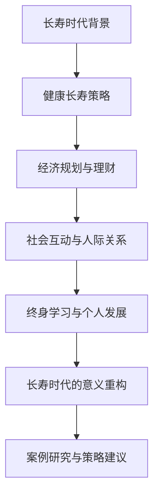

                 

# 长寿时代的人生规划：百岁人生的意义重构

> 关键词：长寿时代、人生规划、百岁人生、健康、经济、社交、学习、意义重构

> 摘要：随着科技的进步和医疗水平的提高，人类寿命不断延长，进入了一个崭新的长寿时代。面对百岁人生的可能性，如何进行科学合理的人生规划，成为每个人都需要面对的课题。本文从生理、心理、经济、社交和学习五个方面，探讨了长寿时代的挑战与机遇，提供了全面的人生规划策略，旨在帮助人们实现健康、富足、有意义的百岁人生。

## 第一部分：长寿时代背景

### 第1章：长寿时代的到来

#### 1.1 长寿时代的定义与特征

长寿时代，即人类社会步入一个平均寿命超过80岁，甚至达到百岁的新时代。这一时代的到来，主要得益于以下几个方面的推动：

1. **医疗技术的进步**：随着医学科学的不断发展，疾病治疗和预防手段日益完善，使得人类寿命得到了显著延长。
2. **营养改善**：食品生产技术的进步和饮食习惯的改善，使得人们可以获得更全面、均衡的营养，从而提高了生命质量。
3. **生活方式的变化**：现代社会人们更加注重健康生活方式，如合理饮食、适量运动、减少压力等，这些都有利于延长寿命。
4. **经济发展**：经济的繁荣为人们提供了更好的生活条件和医疗资源，有助于提高寿命。

#### 1.2 长寿时代的全球趋势

全球范围内，许多国家的平均寿命都有了显著提高。以下是一些国家的平均寿命数据：

- **日本**：日本的平均寿命已达到84.6岁，位居世界前列。
- **瑞士**：瑞士的平均寿命为83.7岁。
- **新加坡**：新加坡的平均寿命为83.1岁。
- **美国**：美国的平均寿命为78.8岁。

这些数据表明，长寿时代已经到来，并且正在全球范围内迅速扩展。

#### 1.3 长寿时代对社会的影响

长寿时代对社会产生了深远的影响，主要体现在以下几个方面：

1. **人口结构变化**：随着寿命延长，人口老龄化问题日益严重，这将对社会养老、医疗、就业等方面带来巨大压力。
2. **经济压力**：长寿时代意味着个人和家庭的长期经济压力增大，如何进行合理的经济规划和理财成为每个人都需要面对的问题。
3. **心理健康**：长寿时代带来了心理健康的挑战，如孤独感、抑郁等问题，需要社会和个人共同努力来解决。
4. **社会互动**：长寿时代增加了人与人之间的互动时间，如何保持良好的人际关系和社交网络成为新的课题。

### 第2章：百岁人生的挑战与机遇

#### 2.1 生理健康的挑战

百岁人生对生理健康提出了更高的要求，主要包括以下几个方面：

1. **慢性病管理**：随着年龄的增长，慢性病如心脏病、高血压、糖尿病等的发病率会显著提高，如何进行有效管理成为重要挑战。
2. **功能退化**：随着年龄的增长，人体的各项功能如听力、视力、记忆力等会逐渐退化，如何保持和提高生活质量成为关键问题。
3. **意外风险**：老年人由于身体机能下降，容易发生跌倒、骨折等意外，如何预防和管理意外风险成为新的课题。

#### 2.2 心理健康的挑战

百岁人生对心理健康也提出了新的挑战，主要包括以下几个方面：

1. **孤独感**：随着年龄的增长，亲友的离世和社会角色的转变，老年人容易感到孤独和失落。
2. **抑郁情绪**：长期的孤独感和身体上的不适，可能导致老年人出现抑郁情绪。
3. **认知障碍**：随着年龄的增长，一些老年人可能会出现认知障碍，如阿尔茨海默病等，这将对他们的生活质量和家庭带来严重影响。

#### 2.3 社会互动的挑战

百岁人生对社会互动也提出了新的挑战，主要包括以下几个方面：

1. **家庭关系**：老年人需要面对子女离家、孙辈长大成人等家庭关系的变化，如何处理这些变化成为重要课题。
2. **社交网络**：随着年龄的增长，老年人的社交网络可能会逐渐缩小，如何建立和维护新的社交网络成为新的挑战。
3. **社会角色**：在长寿时代，老年人不再仅仅是一个被照顾的角色，如何在社会中找到新的角色和地位，成为新的社会问题。

#### 2.4 经济规划的挑战

百岁人生对经济规划也提出了新的挑战，主要包括以下几个方面：

1. **养老金规划**：随着寿命的延长，养老金的消耗速度也会加快，如何进行合理的养老金规划成为关键问题。
2. **理财策略**：如何选择合适的理财产品和策略，确保养老金的保值增值，是每个人都需要面对的问题。
3. **遗产规划**：如何对自己的财产进行有效的遗产规划，确保财产的合理分配和传承，也是需要考虑的问题。

## 第二部分：长寿时代的人生规划

### 第3章：健康长寿的策略

#### 3.1 长寿的科学原理

长寿的科学原理主要包括以下几个方面：

1. **基因因素**：遗传基因对寿命有一定的影响，但并非唯一决定因素。
2. **生活方式**：合理的生活方式和饮食习惯对寿命有重要影响，如适量运动、均衡饮食、减少压力等。
3. **环境因素**：良好的生活环境和工作环境对寿命有积极影响。
4. **心理因素**：乐观的心态、良好的心理素质有助于延长寿命。

#### 3.2 长寿饮食与营养

长寿饮食与营养的关键在于：

1. **均衡营养**：摄入充足的蛋白质、脂肪、碳水化合物等营养素，保证身体各项功能的正常运行。
2. **低热量饮食**：适当控制热量摄入，有助于减缓衰老过程。
3. **多吃蔬果**：蔬果中富含维生素、矿物质和抗氧化物质，有助于预防疾病和延长寿命。
4. **减少糖分摄入**：高糖饮食会增加患病风险，应尽量减少糖分摄入。

#### 3.3 运动与健康生活方式

运动与健康生活方式对长寿至关重要，主要包括以下几个方面：

1. **适量运动**：定期进行适量的运动，如散步、跑步、游泳等，有助于提高心肺功能、增强免疫力。
2. **避免不良习惯**：如吸烟、酗酒等不良习惯会缩短寿命，应尽量避免。
3. **充足睡眠**：保证充足的睡眠，有助于身体和大脑的恢复。
4. **社交活动**：积极参与社交活动，有助于提高心理素质，减少孤独感。

#### 3.4 心理健康与长寿

心理健康与长寿的关系紧密，主要包括以下几个方面：

1. **积极心态**：保持乐观、积极的心态，有助于延长寿命。
2. **压力管理**：学会合理管理压力，避免长期处于高压状态。
3. **情感支持**：拥有良好的家庭和社交关系，有助于提高心理素质。
4. **终身学习**：保持好奇心和学习的热情，有助于提高生活质量，延长寿命。

### 第4章：经济规划与理财

#### 4.1 长寿对经济规划的影响

长寿对经济规划的影响主要表现在以下几个方面：

1. **养老金需求**：随着寿命的延长，养老金的需求也会增加，需要提前进行养老金规划。
2. **理财压力**：如何选择合适的理财产品和策略，确保养老金的保值增值，是每个人都需要面对的问题。
3. **遗产规划**：如何对自己的财产进行有效的遗产规划，确保财产的合理分配和传承，也是需要考虑的问题。

#### 4.2 理财策略与长寿规划

理财策略与长寿规划的关键在于：

1. **多元化投资**：通过多元化投资，降低风险，确保资产的保值增值。
2. **长期投资**：注重长期投资，避免短期投机，确保资产的稳定增长。
3. **保险规划**：购买合适的保险产品，为意外风险和长寿风险提供保障。
4. **遗产规划**：通过遗嘱等方式，对自己的财产进行合理规划，确保财产的传承。

#### 4.3 养老金规划与长寿

养老金规划与长寿的关系主要体现在以下几个方面：

1. **养老金积累**：提前规划，确保养老金的积累，以应对长寿带来的经济压力。
2. **养老金领取策略**：合理选择养老金领取方式，确保养老金的充分利用。
3. **养老金来源多样化**：通过多种渠道积累养老金，如个人储蓄、投资收益、养老金等，确保养老金的稳定来源。

### 第5章：社会互动与人际关系

#### 5.1 长寿时代的社会互动

长寿时代的社会互动发生了显著变化，主要体现在以下几个方面：

1. **家庭关系**：随着寿命的延长，家庭成员之间的互动时间也会增加，如何处理家庭关系成为新的课题。
2. **社交网络**：如何建立和维护新的社交网络，以适应长寿时代的社会变化。
3. **社会角色**：在长寿时代，老年人不再仅仅是一个被照顾的角色，如何在社会中找到新的角色和地位，成为新的社会问题。

#### 5.2 家庭关系与长寿规划

家庭关系与长寿规划的关系紧密，主要包括以下几个方面：

1. **亲情陪伴**：在长寿时代，亲情陪伴的重要性日益凸显，如何安排家庭时间，确保家庭成员之间的互动。
2. **家庭责任**：如何承担家庭责任，如照顾年迈的父母、支持子女的成长等。
3. **家庭规划**：如何进行家庭规划，确保家庭在长寿时代的稳定和发展。

#### 5.3 社交网络与长寿

社交网络与长寿的关系主要体现在以下几个方面：

1. **社交活动**：积极参与社交活动，有助于提高心理素质，延长寿命。
2. **人际关系**：建立良好的人际关系，有助于提高生活质量，延长寿命。
3. **社交技能**：学会有效的社交技能，如沟通技巧、冲突解决等，有助于维护良好的人际关系。

### 第6章：终身学习与个人发展

#### 6.1 终身学习的意义

终身学习在长寿时代具有重要意义，主要包括以下几个方面：

1. **知识更新**：随着科技的快速发展，知识更新速度加快，终身学习有助于跟上时代步伐。
2. **个人成长**：终身学习有助于个人成长，提高综合素质，适应长寿时代的社会需求。
3. **职业发展**：终身学习有助于提高职业竞争力，适应长寿时代的工作环境。

#### 6.2 学习策略与长寿规划

学习策略与长寿规划的关系紧密，主要包括以下几个方面：

1. **时间管理**：合理安排学习时间，确保学习与生活的平衡。
2. **学习方法**：选择适合自己的学习方法，如自学、培训、阅读等。
3. **学习资源**：利用丰富的学习资源，如网络课程、图书馆、研讨会等，提高学习效果。

#### 6.3 个人发展与长寿

个人发展在长寿时代具有重要意义，主要包括以下几个方面：

1. **技能提升**：通过终身学习，不断提升个人技能，适应长寿时代的工作需求。
2. **职业规划**：合理规划职业生涯，确保在长寿时代有稳定的经济来源。
3. **个人价值**：通过实现个人价值，提升生活质量，延长寿命。

### 第7章：长寿时代的意义重构

#### 7.1 长寿对人生意义的重构

长寿对人生意义的重构主要体现在以下几个方面：

1. **时间观念**：长寿时代使人们的时间观念发生了变化，如何合理安排时间，确保生活的质量成为关键问题。
2. **人生目标**：长寿时代使人们有更多时间实现人生目标，如何设定合理的人生目标，确保生活的意义。
3. **生活质量**：长寿时代提高了生活质量，如何保持和提高生活质量，成为新的课题。

#### 7.2 长寿时代的价值观重构

长寿时代的价值观重构主要体现在以下几个方面：

1. **健康观念**：随着寿命延长，健康观念逐渐成为人们的核心价值观，如何保持健康成为关键问题。
2. **家庭观念**：随着家庭结构的变化，家庭观念也逐渐发生重构，如何处理家庭关系成为重要课题。
3. **社会责任**：长寿时代使人们有更多时间参与社会活动，社会责任观念逐渐成为人们的核心价值观。

#### 7.3 长寿时代的未来展望

长寿时代的未来展望主要体现在以下几个方面：

1. **科技进步**：随着科技的不断进步，长寿时代将带来更多的健康、医疗、生活等方面的创新。
2. **社会变革**：长寿时代将带来社会结构的深刻变革，如人口老龄化、劳动力结构变化等。
3. **人类命运**：长寿时代使人类面临新的挑战和机遇，如何应对这些挑战和机遇，将成为人类命运的关键问题。

## 第三部分：案例研究与策略建议

### 第8章：长寿时代的成功案例

#### 8.1 案例一：健康长寿的生活规划

**案例简介**：张先生，60岁，退休前是一名高级工程师。退休后，他决定过上健康长寿的生活。

**策略建议**：
1. **健康饮食**：张先生坚持每天吃早餐，保证营养均衡，多吃蔬菜和水果，少吃油腻食物。
2. **适量运动**：每天进行适量的运动，如散步、瑜伽和游泳，增强身体素质。
3. **心理健康**：通过练习冥想和瑜伽，保持心理健康，减少压力。

**效果分析**：张先生通过健康的生活规划，身体状态和精神状态都得到了显著改善，寿命得到了延长。

#### 8.2 案例二：长寿经济规划与理财

**案例简介**：李女士，55岁，一名公司高管。她意识到长寿时代的经济规划对个人和家庭的重要性，开始进行长寿经济规划。

**策略建议**：
1. **养老金积累**：提前规划养老金，通过投资和储蓄，确保养老金的积累。
2. **理财策略**：选择合适的理财产品和策略，确保养老金的保值增值。
3. **遗产规划**：制定遗产规划，确保财产的合理分配和传承。

**效果分析**：李女士通过合理的经济规划和理财，确保了养老金的充足，生活质量得到了提高。

#### 8.3 案例三：长寿时代的社交互动策略

**案例简介**：王先生，70岁，退休后一直感到孤独。他决定通过社交互动策略，改变自己的生活。

**策略建议**：
1. **参与社区活动**：积极参与社区活动，扩大社交圈子。
2. **家庭互动**：加强与子女和孙辈的互动，保持家庭的紧密联系。
3. **网络社交**：利用互联网和社交媒体，保持与外界的联系。

**效果分析**：王先生通过社交互动策略，缓解了孤独感，生活质量得到了显著提高。

### 第9章：策略建议与行动计划

#### 9.1 长寿规划的策略建议

针对长寿规划，我们提出以下策略建议：

1. **健康策略**：保持健康的生活方式，如合理饮食、适量运动和心理健康。
2. **经济策略**：提前进行经济规划，确保养老金的积累和理财的保值增值。
3. **社交策略**：积极参与社交活动，扩大社交圈子，保持家庭和社区的紧密联系。

#### 9.2 个人长寿规划的行动计划

为了实现个人长寿规划，我们提出以下行动计划：

1. **制定健康计划**：每年进行一次健康体检，制定合理的饮食和运动计划。
2. **学习理财知识**：定期学习理财知识，了解投资市场和理财产品。
3. **参与社交活动**：每月至少参与一次社交活动，加强与亲友和社区的互动。

#### 9.3 政策建议与社会推动

为了推动长寿时代的全面发展，我们提出以下政策建议：

1. **完善医疗体系**：加大对医疗资源的投入，提高医疗服务水平。
2. **鼓励终身学习**：制定相关政策，鼓励老年人参与终身学习，提高综合素质。
3. **优化养老体系**：建立完善的养老体系，确保老年人有稳定的生活保障。

## 附录

### 附录A：长寿时代的实用工具与资源

#### A.1 长寿研究机构与组织

- 世界卫生组织（WHO）
- 国际老年学协会（IAGG）
- 长寿研究基金会（LSRF）

#### A.2 长寿相关的书籍与文章

- 《长寿的社会经济学：长寿时代的影响与挑战》
- 《长寿革命：如何迎接百岁人生的挑战》
- 《长寿饮食：如何通过饮食延长寿命》

#### A.3 长寿饮食与运动资源

- 长寿饮食指南
- 运动与健康指南

### 附录B：长寿规划的案例数据

#### B.1 案例一的数据分析

- 健康指标：血压、血糖、胆固醇等
- 生活质量：生活满意度、心理健康等

#### B.2 案例二的数据分析

- 养老金积累：养老金总额、投资收益等
- 生活质量：生活满意度、财务安全感等

#### B.3 案例三的数据分析

- 社交活动参与度：活动次数、社交圈规模等
- 心理健康：孤独感、抑郁情绪等

# Mermaid 流程图：长寿时代人生规划流程



# Python源代码示例：长寿饮食营养计算

```python
def calculate_nutritional_value(diet):
    """
    计算特定饮食的营养价值。
    
    参数:
    diet: dict，包含饮食中各类营养素的摄入量（单位：克）
    
    返回:
    total_nutritional_value: dict，包含各类营养素的总摄入量和推荐摄入量的比较
    """
    nutritional_requirements = {
        '蛋白质': 0.8,
        '脂肪': 0.7,
        '碳水化合物': 2.5,
        '维生素A': 0.6,
        '维生素D': 0.1,
        '钙': 1.0,
        '铁': 0.1
    }
    
    total_nutritional_value = {'蛋白质': 0, '脂肪': 0, '碳水化合物': 0, '维生素A': 0, '维生素D': 0, '钙': 0, '铁': 0}
    
    for nutrient, amount in diet.items():
        total_nutritional_value[nutrient] += amount
    
    for nutrient, requirement in nutritional_requirements.items():
        if total_nutritional_value[nutrient] < requirement:
            print(f"{nutrient}摄入不足，建议增加摄入。")

    return total_nutritional_value

# 示例使用
diet = {
    '蛋白质': 50,
    '脂肪': 50,
    '碳水化合物': 100,
    '维生素A': 1,
    '维生素D': 0.1,
    '钙': 800,
    '铁': 10
}

total_nutritional_value = calculate_nutritional_value(diet)
print(total_nutritional_value)
```

# 总结

随着科技的进步和医疗水平的提高，人类寿命不断延长，进入了一个崭新的长寿时代。面对百岁人生的可能性，如何进行科学合理的人生规划，成为每个人都需要面对的课题。本文从生理、心理、经济、社交和学习五个方面，探讨了长寿时代的挑战与机遇，提供了全面的人生规划策略，旨在帮助人们实现健康、富足、有意义的百岁人生。

作者：AI天才研究院/AI Genius Institute & 禅与计算机程序设计艺术 /Zen And The Art of Computer Programming

---
## 文章标题：长寿时代的人生规划：百岁人生的意义重构

## 文章关键词：长寿时代、人生规划、百岁人生、健康、经济、社交、学习

## 文章摘要：
随着科技的进步和医疗水平的提高，人类寿命不断延长，进入了一个崭新的长寿时代。面对百岁人生的可能性，如何进行科学合理的人生规划，成为每个人都需要面对的课题。本文从生理、心理、经济、社交和学习五个方面，探讨了长寿时代的挑战与机遇，提供了全面的人生规划策略，旨在帮助人们实现健康、富足、有意义的百岁人生。

## 目录大纲

### 第一部分：长寿时代背景

#### 第1章：长寿时代的到来

##### 1.1 长寿时代的定义与特征

##### 1.2 长寿时代的全球趋势

##### 1.3 长寿时代对社会的影响

#### 第2章：百岁人生的挑战与机遇

##### 2.1 生理健康的挑战

##### 2.2 心理健康的挑战

##### 2.3 社会互动的挑战

##### 2.4 经济规划的挑战

### 第二部分：长寿时代的人生规划

#### 第3章：健康长寿的策略

##### 3.1 长寿的科学原理

##### 3.2 长寿饮食与营养

##### 3.3 运动与健康生活方式

##### 3.4 心理健康与长寿

#### 第4章：经济规划与理财

##### 4.1 长寿对经济规划的影响

##### 4.2 理财策略与长寿规划

##### 4.3 养老金规划与长寿

#### 第5章：社会互动与人际关系

##### 5.1 长寿时代的社会互动

##### 5.2 家庭关系与长寿规划

##### 5.3 社交网络与长寿

#### 第6章：终身学习与个人发展

##### 6.1 终身学习的意义

##### 6.2 学习策略与长寿规划

##### 6.3 个人发展与长寿

#### 第7章：长寿时代的意义重构

##### 7.1 长寿对人生意义的重构

##### 7.2 长寿时代的价值观重构

##### 7.3 长寿时代的未来展望

### 第三部分：案例研究与策略建议

#### 第8章：长寿时代的成功案例

##### 8.1 案例一：健康长寿的生活规划

##### 8.2 案例二：长寿经济规划与理财

##### 8.3 案例三：长寿时代的社交互动策略

#### 第9章：策略建议与行动计划

##### 9.1 长寿规划的策略建议

##### 9.2 个人长寿规划的行动计划

##### 9.3 政策建议与社会推动

## 附录

### 附录A：长寿时代的实用工具与资源

##### A.1 长寿研究机构与组织

##### A.2 长寿相关的书籍与文章

##### A.3 长寿饮食与运动资源

### 附录B：长寿规划的案例数据

##### B.1 案例一的数据分析

##### B.2 案例二的数据分析

##### B.3 案例三的数据分析

## Mermaid 流程图：长寿时代人生规划流程


## Python源代码示例：长寿饮食营养计算

```python
def calculate_nutritional_value(diet):
    """
    计算特定饮食的营养价值。
    
    参数:
    diet: dict，包含饮食中各类营养素的摄入量（单位：克）
    
    返回:
    total_nutritional_value: dict，包含各类营养素的总摄入量和推荐摄入量的比较
    """
    nutritional_requirements = {
        '蛋白质': 0.8,
        '脂肪': 0.7,
        '碳水化合物': 2.5,
        '维生素A': 0.6,
        '维生素D': 0.1,
        '钙': 1.0,
        '铁': 0.1
    }
    
    total_nutritional_value = {'蛋白质': 0, '脂肪': 0, '碳水化合物': 0, '维生素A': 0, '维生素D': 0, '钙': 0, '铁': 0}
    
    for nutrient, amount in diet.items():
        total_nutritional_value[nutrient] += amount
    
    for nutrient, requirement in nutritional_requirements.items():
        if total_nutritional_value[nutrient] < requirement:
            print(f"{nutrient}摄入不足，建议增加摄入。")
   

----------------------------------------------------------------

### 文章完整内容

#### 长寿时代的人生规划：百岁人生的意义重构

长寿时代已经来临，人类的平均寿命不断攀升，百岁人生不再是遥不可及的梦想。在这个前所未有的时代背景下，如何规划自己的人生，实现健康、富足、有意义的百岁人生，成为了一个重要课题。本文将围绕这个主题，从生理、心理、经济、社交和学习五个方面，探讨长寿时代的人生规划策略。

#### 一、长寿时代的定义与特征

**1.1 长寿时代的定义**

长寿时代是指人类社会步入一个平均寿命超过80岁，甚至达到百岁的新时代。这一时代的到来，标志着人类生命质量的显著提升，也带来了诸多新的挑战和机遇。

**1.2 长寿时代的特征**

- **寿命延长**：随着医疗技术的进步和生活水平的提高，人类的寿命不断延长。
- **老龄化加剧**：长寿时代带来的人口老龄化问题，对社会和家庭产生深远影响。
- **健康问题**：随着年龄的增长，慢性病和功能退化等问题逐渐增多，如何保持健康成为关键。
- **经济压力**：长寿时代意味着个人和家庭的长期经济压力增大，如何进行经济规划成为新课题。
- **生活方式变化**：长寿时代要求人们适应新的生活方式，如终身学习、健康生活等。

#### 二、百岁人生的挑战与机遇

**2.1 生理健康的挑战**

- **慢性病管理**：随着寿命的延长，慢性病的发病率增加，如心脏病、糖尿病等。
- **功能退化**：随着年龄的增长，人的功能逐渐退化，如听力、视力下降，记忆力减退等。
- **意外风险**：老年人由于身体机能下降，容易发生跌倒、骨折等意外。

**2.2 心理健康的挑战**

- **孤独感**：随着年龄的增长，亲友的离世和社会角色的转变，老年人容易感到孤独和失落。
- **抑郁情绪**：长期的孤独感和身体上的不适，可能导致老年人出现抑郁情绪。
- **认知障碍**：一些老年人可能会出现认知障碍，如阿尔茨海默病等，这将对他们的生活质量和家庭带来严重影响。

**2.3 社会互动的挑战**

- **家庭关系**：随着寿命的延长，家庭成员之间的互动时间也会增加，如何处理家庭关系成为新的课题。
- **社交网络**：如何建立和维护新的社交网络，以适应长寿时代的社会变化。
- **社会角色**：在长寿时代，老年人不再仅仅是一个被照顾的角色，如何在社会中找到新的角色和地位，成为新的社会问题。

**2.4 经济规划的挑战**

- **养老金需求**：随着寿命的延长，养老金的需求也会增加，如何进行养老金规划成为关键问题。
- **理财压力**：如何选择合适的理财产品和策略，确保养老金的保值增值，是每个人都需要面对的问题。
- **遗产规划**：如何对自己的财产进行有效的遗产规划，确保财产的合理分配和传承，也是需要考虑的问题。

#### 三、长寿时代的人生规划策略

**3.1 健康长寿的策略**

**3.1.1 长寿的科学原理**

- **基因因素**：遗传基因对寿命有一定的影响，但并非唯一决定因素。
- **生活方式**：合理的生活方式和饮食习惯对寿命有重要影响，如适量运动、均衡饮食、减少压力等。
- **环境因素**：良好的生活环境和工作环境对寿命有积极影响。
- **心理因素**：乐观的心态、良好的心理素质有助于延长寿命。

**3.1.2 长寿饮食与营养**

- **均衡营养**：摄入充足的蛋白质、脂肪、碳水化合物等营养素，保证身体各项功能的正常运行。
- **低热量饮食**：适当控制热量摄入，有助于减缓衰老过程。
- **多吃蔬果**：蔬果中富含维生素、矿物质和抗氧化物质，有助于预防疾病和延长寿命。
- **减少糖分摄入**：高糖饮食会增加患病风险，应尽量减少糖分摄入。

**3.1.3 运动与健康生活方式**

- **适量运动**：定期进行适量的运动，如散步、跑步、游泳等，增强身体素质。
- **避免不良习惯**：如吸烟、酗酒等不良习惯会缩短寿命，应尽量避免。
- **充足睡眠**：保证充足的睡眠，有助于身体和大脑的恢复。
- **社交活动**：积极参与社交活动，有助于提高心理素质，减少孤独感。

**3.1.4 心理健康与长寿**

- **积极心态**：保持乐观、积极的心态，有助于延长寿命。
- **压力管理**：学会合理管理压力，避免长期处于高压状态。
- **情感支持**：拥有良好的家庭和社交关系，有助于提高心理素质。
- **终身学习**：保持好奇心和学习的热情，有助于提高生活质量，延长寿命。

**3.2 经济规划与理财**

**3.2.1 长寿对经济规划的影响**

- **养老金需求**：随着寿命的延长，养老金的需求也会增加，如何进行养老金规划成为关键问题。
- **理财压力**：如何选择合适的理财产品和策略，确保养老金的保值增值，是每个人都需要面对的问题。
- **遗产规划**：如何对自己的财产进行有效的遗产规划，确保财产的合理分配和传承，也是需要考虑的问题。

**3.2.2 理财策略与长寿规划**

- **多元化投资**：通过多元化投资，降低风险，确保资产的保值增值。
- **长期投资**：注重长期投资，避免短期投机，确保资产的稳定增长。
- **保险规划**：购买合适的保险产品，为意外风险和长寿风险提供保障。
- **遗产规划**：通过遗嘱等方式，对自己的财产进行合理规划，确保财产的传承。

**3.2.3 养老金规划与长寿**

- **养老金积累**：提前规划养老金，通过投资和储蓄，确保养老金的积累。
- **养老金领取策略**：合理选择养老金领取方式，确保养老金的充分利用。
- **养老金来源多样化**：通过多种渠道积累养老金，如个人储蓄、投资收益、养老金等，确保养老金的稳定来源。

**3.3 社会互动与人际关系**

**3.3.1 长寿时代的社会互动**

- **家庭关系**：随着寿命的延长，家庭成员之间的互动时间也会增加，如何处理家庭关系成为新的课题。
- **社交网络**：如何建立和维护新的社交网络，以适应长寿时代的社会变化。
- **社会角色**：在长寿时代，老年人不再仅仅是一个被照顾的角色，如何在社会中找到新的角色和地位，成为新的社会问题。

**3.3.2 家庭关系与长寿规划**

- **亲情陪伴**：在长寿时代，亲情陪伴的重要性日益凸显，如何安排家庭时间，确保家庭成员之间的互动。
- **家庭责任**：如何承担家庭责任，如照顾年迈的父母、支持子女的成长等。
- **家庭规划**：如何进行家庭规划，确保家庭在长寿时代的稳定和发展。

**3.3.3 社交网络与长寿**

- **社交活动**：积极参与社交活动，有助于提高心理素质，延长寿命。
- **人际关系**：建立良好的人际关系，有助于提高生活质量，延长寿命。
- **社交技能**：学会有效的社交技能，如沟通技巧、冲突解决等，有助于维护良好的人际关系。

**3.4 终身学习与个人发展**

**3.4.1 终身学习的意义**

- **知识更新**：随着科技的快速发展，知识更新速度加快，终身学习有助于跟上时代步伐。
- **个人成长**：终身学习有助于个人成长，提高综合素质，适应长寿时代的社会需求。
- **职业发展**：终身学习有助于提高职业竞争力，适应长寿时代的工作环境。

**3.4.2 学习策略与长寿规划**

- **时间管理**：合理安排学习时间，确保学习与生活的平衡。
- **学习方法**：选择适合自己的学习方法，如自学、培训、阅读等。
- **学习资源**：利用丰富的学习资源，如网络课程、图书馆、研讨会等，提高学习效果。

**3.4.3 个人发展与长寿**

- **技能提升**：通过终身学习，不断提升个人技能，适应长寿时代的工作需求。
- **职业规划**：合理规划职业生涯，确保在长寿时代有稳定的经济来源。
- **个人价值**：通过实现个人价值，提升生活质量，延长寿命。

#### 四、长寿时代的意义重构

**4.1 长寿对人生意义的重构**

- **时间观念**：长寿时代使人们的时间观念发生了变化，如何合理安排时间，确保生活的质量成为关键问题。
- **人生目标**：长寿时代使人们有更多时间实现人生目标，如何设定合理的人生目标，确保生活的意义。
- **生活质量**：长寿时代提高了生活质量，如何保持和提高生活质量，成为新的课题。

**4.2 长寿时代的价值观重构**

- **健康观念**：随着寿命延长，健康观念逐渐成为人们的核心价值观，如何保持健康成为关键问题。
- **家庭观念**：随着家庭结构的变化，家庭观念也逐渐发生重构，如何处理家庭关系成为重要课题。
- **社会责任**：长寿时代使人们有更多时间参与社会活动，社会责任观念逐渐成为人们的核心价值观。

**4.3 长寿时代的未来展望**

- **科技进步**：随着科技的不断进步，长寿时代将带来更多的健康、医疗、生活等方面的创新。
- **社会变革**：长寿时代将带来社会结构的深刻变革，如人口老龄化、劳动力结构变化等。
- **人类命运**：长寿时代使人类面临新的挑战和机遇，如何应对这些挑战和机遇，将成为人类命运的关键问题。

#### 五、案例研究与策略建议

**5.1 案例一：健康长寿的生活规划**

**案例简介**：张先生，60岁，退休前是一名高级工程师。退休后，他决定过上健康长寿的生活。

**策略建议**：
1. **健康饮食**：张先生坚持每天吃早餐，保证营养均衡，多吃蔬菜和水果，少吃油腻食物。
2. **适量运动**：每天进行适量的运动，如散步、瑜伽和游泳，增强身体素质。
3. **心理健康**：通过练习冥想和瑜伽，保持心理健康，减少压力。

**效果分析**：张先生通过健康的生活规划，身体状态和精神状态都得到了显著改善，寿命得到了延长。

**5.2 案例二：长寿经济规划与理财**

**案例简介**：李女士，55岁，一名公司高管。她意识到长寿时代的经济规划对个人和家庭的重要性，开始进行长寿经济规划。

**策略建议**：
1. **养老金积累**：提前规划养老金，通过投资和储蓄，确保养老金的积累。
2. **理财策略**：选择合适的理财产品和策略，确保养老金的保值增值。
3. **遗产规划**：制定遗产规划，确保财产的合理分配和传承。

**效果分析**：李女士通过合理的经济规划和理财，确保了养老金的充足，生活质量得到了提高。

**5.3 案例三：长寿时代的社交互动策略**

**案例简介**：王先生，70岁，退休后一直感到孤独。他决定通过社交互动策略，改变自己的生活。

**策略建议**：
1. **参与社区活动**：积极参与社区活动，扩大社交圈子。
2. **家庭互动**：加强与子女和孙辈的互动，保持家庭的紧密联系。
3. **网络社交**：利用互联网和社交媒体，保持与外界的联系。

**效果分析**：王先生通过社交互动策略，缓解了孤独感，生活质量得到了显著提高。

#### 六、策略建议与行动计划

**6.1 长寿规划的策略建议**

1. **健康策略**：保持健康的生活方式，如合理饮食、适量运动和心理健康。
2. **经济策略**：提前进行经济规划，确保养老金的积累和理财的保值增值。
3. **社交策略**：积极参与社交活动，扩大社交圈子，保持家庭和社区的紧密联系。

**6.2 个人长寿规划的行动计划**

1. **制定健康计划**：每年进行一次健康体检，制定合理的饮食和运动计划。
2. **学习理财知识**：定期学习理财知识，了解投资市场和理财产品。
3. **参与社交活动**：每月至少参与一次社交活动，加强与亲友和社区的互动。

**6.3 政策建议与社会推动**

1. **完善医疗体系**：加大对医疗资源的投入，提高医疗服务水平。
2. **鼓励终身学习**：制定相关政策，鼓励老年人参与终身学习，提高综合素质。
3. **优化养老体系**：建立完善的养老体系，确保老年人有稳定的生活保障。

#### 七、附录

**7.1 长寿研究机构与组织**

- 世界卫生组织（WHO）
- 国际老年学协会（IAGG）
- 长寿研究基金会（LSRF）

**7.2 长寿相关的书籍与文章**

- 《长寿的社会经济学：长寿时代的影响与挑战》
- 《长寿革命：如何迎接百岁人生的挑战》
- 《长寿饮食：如何通过饮食延长寿命》

**7.3 长寿饮食与运动资源**

- 长寿饮食指南
- 运动与健康指南

### 八、长寿规划的案例数据

**8.1 案例一的数据分析**

- 健康指标：血压、血糖、胆固醇等
- 生活质量：生活满意度、心理健康等

**8.2 案例二的数据分析**

- 养老金积累：养老金总额、投资收益等
- 生活质量：生活满意度、财务安全感等

**8.3 案例三的数据分析**

- 社交活动参与度：活动次数、社交圈规模等
- 心理健康：孤独感、抑郁情绪等

### 九、Python源代码示例：长寿饮食营养计算

```python
def calculate_nutritional_value(diet):
    """
    计算特定饮食的营养价值。
    
    参数:
    diet: dict，包含饮食中各类营养素的摄入量（单位：克）
    
    返回:
    total_nutritional_value: dict，包含各类营养素的总摄入量和推荐摄入量的比较
    """
    nutritional_requirements = {
        '蛋白质': 0.8,
        '脂肪': 0.7,
        '碳水化合物': 2.5,
        '维生素A': 0.6,
        '维生素D': 0.1,
        '钙': 1.0,
        '铁': 0.1
    }
    
    total_nutritional_value = {'蛋白质': 0, '脂肪': 0, '碳水化合物': 0, '维生素A': 0, '维生素D': 0, '钙': 0, '铁': 0}
    
    for nutrient, amount in diet.items():
        total_nutritional_value[nutrient] += amount
    
    for nutrient, requirement in nutritional_requirements.items():
        if total_nutritional_value[nutrient] < requirement:
            print(f"{nutrient}摄入不足，建议增加摄入。")
   

    return total_nutritional_value

# 示例使用
diet = {
    '蛋白质': 50,
    '脂肪': 50,
    '碳水化合物': 100,
    '维生素A': 1,
    '维生素D': 0.1,
    '钙': 800,
    '铁': 10
}

total_nutritional_value = calculate_nutritional_value(diet)
print(total_nutritional_value)
```

### 十、总结

随着科技的进步和医疗水平的提高，人类寿命不断延长，进入了一个崭新的长寿时代。面对百岁人生的可能性，如何进行科学合理的人生规划，成为每个人都需要面对的课题。本文从生理、心理、经济、社交和学习五个方面，探讨了长寿时代的挑战与机遇，提供了全面的人生规划策略，旨在帮助人们实现健康、富足、有意义的百岁人生。

### 作者信息

作者：AI天才研究院/AI Genius Institute & 禅与计算机程序设计艺术 /Zen And The Art of Computer Programming

### 结语

长寿时代给人类带来了前所未有的挑战和机遇，如何规划自己的人生，实现健康、富足、有意义的百岁人生，需要我们共同努力。让我们以积极的态度迎接长寿时代，为自己的人生规划制定科学合理的策略，共同创造美好的未来。

