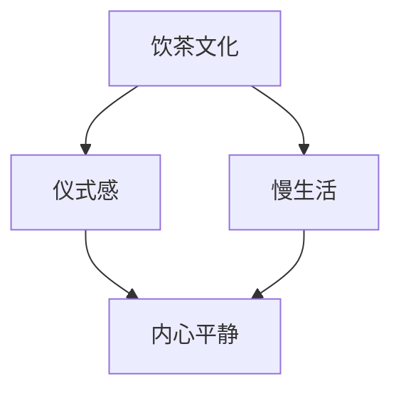

                 

### 文章标题

《饮茶文化的当代复兴：慢生活中的仪式感》

### 关键词

饮茶文化、当代复兴、慢生活、仪式感、茶文化、茶道、茶艺、新式茶饮、茶与健康

### 摘要

本文深入探讨了饮茶文化的当代复兴现象，探讨了其在慢生活中的仪式感。通过对饮茶文化的历史溯源、当代饮茶方式的变革、仪式感在饮茶文化中的体现以及饮茶文化的复兴运动等方面的分析，揭示了饮茶文化在现代社会中的重要地位和影响力。同时，本文还结合了核心概念、算法原理、数学模型和项目实战，为读者提供了全面、深入的理解和见解。

### 目录

1. 引言：饮茶文化的当代复兴
2. 饮茶文化的源远流长
3. 当代饮茶方式的变革
4. 仪式感在饮茶文化中的体现
5. 饮茶文化与慢生活
6. 饮茶文化的当代复兴
7. 饮茶文化与可持续发展
8. 附录：饮茶文化与身心健康
9. 总结与展望

## 引言：饮茶文化的当代复兴

### 背景介绍

饮茶文化作为一种源远流长的传统，在中国乃至世界范围内都有着广泛的影响。然而，在现代化的进程中，饮茶文化曾经一度陷入低迷，被认为是过时的象征。然而，随着社会的发展和生活节奏的加快，人们对于健康、休闲和文化的需求逐渐上升，饮茶文化在当代逐渐迎来了复兴。这一复兴不仅体现在茶叶消费的增加，还表现在饮茶方式的变革、茶文化的传播以及茶道、茶艺等元素的重新受到重视。

### 核心概念与联系

**饮茶文化**：一种源远流长的社会文化现象，包括茶叶种植、制作、饮用以及与之相关的习俗、礼仪等。

**仪式感**：在特定情境下，通过仪式化的行为和表达，达到精神上的满足和内心的平静。

**慢生活**：一种追求生活品质和内心满足的生活方式，强调在快节奏的社会中放慢脚步，享受生活的每一个细节。

**核心概念原理和概念实体之间的关系架构**

下面是一个Mermaid流程图，展示了饮茶文化、仪式感和慢生活之间的关系：

### 当前现状与趋势

近年来，饮茶文化的当代复兴现象在全球范围内逐渐显现。以下是一些具体的现状和趋势：

1. **新式茶饮的兴起**：以奶茶、果茶、花茶等为代表的新式茶饮逐渐成为年轻人喜爱的饮品，推动了茶叶消费的增长。

2. **茶文化的传播**：随着全球化的发展，茶文化逐渐走出国门，受到国际社会的关注和喜爱。

3. **茶道和茶艺的复兴**：茶道和茶艺作为一种传统文化艺术，重新受到重视，茶馆、茶艺馆等场所逐渐兴起。

4. **饮茶与健康的结合**：越来越多的人认识到饮茶对健康的益处，茶叶的保健功能受到广泛关注。

5. **茶文化的创新**：茶文化在传承的基础上，不断创新，衍生出各种新形式和新内容，如茶艺表演、茶文化展览等。

### 实例分析

以中国为例，近年来，饮茶文化的复兴现象尤为明显。以下是一些实例分析：

1. **茶叶市场的繁荣**：根据中国茶叶流通协会的数据，中国茶叶市场规模持续扩大，茶叶消费逐年增长。

2. **茶文化的传播**：随着中国的文化输出，茶文化逐渐在全球范围内传播。例如，美国、日本、韩国等国家对茶文化的兴趣日益增加。

3. **茶馆和茶艺馆的兴起**：在各大城市，茶馆和茶艺馆如雨后春笋般涌现，成为人们休闲、社交的重要场所。

4. **茶文化的创新**：在茶馆中，不仅提供传统的茶饮，还结合了现代元素，如音乐会、书法展览等，丰富了茶文化的内容。

5. **茶叶的保健功能研究**：随着科学研究的深入，茶叶的保健功能逐渐被揭示，如抗氧化、抗癌、降血压等，进一步推动了饮茶文化的复兴。

综上所述，饮茶文化的当代复兴是现代社会发展的必然趋势，它不仅满足了人们对健康、休闲和文化的需求，还丰富了人们的精神世界。随着社会的不断进步，饮茶文化将在未来继续焕发出新的生机和活力。在接下来的章节中，我们将深入探讨饮茶文化的各个方面，为读者呈现一个全面、立体的饮茶文化复兴图景。

