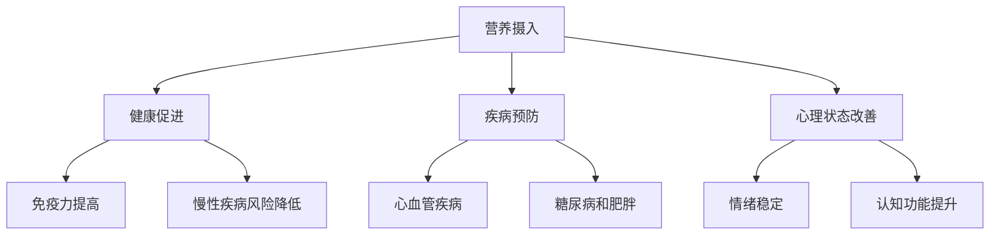

                 

### 饮食文化与生活意义：从米其林到素食主义

#### 关键词
- 饮食文化
- 米其林餐厅
- 素食主义
- 健康饮食
- 文化传承
- 环境保护

#### 摘要
本文旨在探讨饮食文化与生活的深刻联系，从米其林星级餐厅的极致美食到素食主义的健康与伦理观念，深入分析饮食文化在不同层面上的影响。通过历史演变、社会功能、健康关系、文化价值以及未来趋势等多个角度，本文揭示了饮食文化在塑造人类生活方式中的关键作用。

### 引言

饮食，作为人类生活的基本需求，远不止于满足口腹之欲。饮食文化，这个看似平凡而又复杂的领域，实际上蕴含着丰富的历史、社会、文化和生态意义。从古至今，不同的饮食文化不仅反映了各个地区和民族的生活习俗，还体现了他们对健康、道德和环境的独特理解。

本文将围绕“饮食文化与生活意义”这一核心主题，进行深入的探讨和分析。文章的结构分为三个主要部分：

**第一部分：饮食文化概述**  
这部分将介绍饮食文化的基本概念、国际美食文化赏析以及饮食文化的可持续发展。通过这些内容，读者可以初步了解饮食文化的多样性和复杂性。

**第二部分：饮食与生活方式**  
这部分将重点探讨饮食习惯与健康、素食主义与饮食观念以及饮食与生活方式的转变。这部分内容将帮助读者理解饮食对个人健康和生活方式的影响。

**第三部分：饮食文化的价值与传承**  
这部分将分析饮食文化的文化价值、传承与创新，并探讨饮食文化在现代社会中的重要性。这部分内容将揭示饮食文化如何影响并塑造我们的生活方式。

接下来，我们将逐一深入探讨这些部分，以期在读者心中构建一幅关于饮食文化的全面而立体的画面。

### 第一部分：饮食文化概述

饮食文化是人类社会的重要组成部分，它不仅反映了我们的生活方式，还反映了我们的历史、文化和价值观。饮食文化的基本概念包括饮食的定义、饮食的分类、饮食的历史演变等。理解这些基本概念，有助于我们更好地认识饮食文化的重要性和复杂性。

#### 1.1 饮食文化的定义与分类

饮食文化，指的是一个社会或民族在饮食方面的传统、习俗、价值观和行为模式。它不仅仅包括食物的种类和制作方式，还包括饮食的社会功能、饮食礼仪、饮食文化和饮食习惯。饮食文化的定义可以从多个角度来理解：

- **社会学角度**：饮食文化是社会结构和文化体系的一部分，它反映了社会的经济基础、社会结构和文化传统。饮食方式、饮食习惯和饮食礼仪都受到社会制度和文化的深刻影响。

- **人类学角度**：饮食文化是不同民族或社会群体在饮食方面的独特传统和习俗，它体现了这些群体的历史、文化和价值观。饮食不仅仅是生理需求，更是一种文化表达和社会互动的方式。

- **文化学角度**：饮食文化是一个文化系统的重要组成部分，它包含了食物的生产、分配、消费和文化传承。饮食文化不仅是一种生活方式，更是一种文化现象，它反映了人类社会的发展历程和文化多样性。

在饮食文化的分类上，可以根据不同的标准进行划分。以下是一些常见的分类方式：

- **地理分类**：根据地理位置和气候条件，可以将饮食文化分为亚洲、欧洲、非洲、美洲和澳洲等不同地区。每个地区的饮食文化都有其独特的特点和历史背景。

- **民族分类**：根据民族或种族特征，可以将饮食文化分为汉族、藏族、维吾尔族、韩国、日本、意大利、法国等不同民族。每个民族的饮食文化都蕴含着丰富的历史和文化传统。

- **文化类型分类**：根据饮食文化的基本特征，可以将饮食文化分为传统饮食文化、现代饮食文化、健康饮食文化、快餐文化等。这些文化类型反映了不同时期和不同社会背景下的饮食需求和文化变迁。

#### 1.2 饮食文化与社会生活的联系

饮食文化在社会生活中扮演着多种重要角色，它不仅与我们的日常生活密切相关，还与社会交往、教育和健康等方面有着紧密的联系。

- **饮食文化在社交活动中的作用**：饮食是社交活动的重要组成部分，无论是在家庭聚会、婚礼庆典，还是商务宴请、节日庆典，饮食都起到了连接人与人之间的纽带作用。饮食文化不仅仅是一种生活方式，更是一种社交方式。通过饮食，人们可以增进友谊、加强合作，甚至解决冲突。

- **饮食文化在教育传承中的角色**：饮食文化是文化传承的重要载体，通过家庭、学校和社区等教育渠道，饮食文化得以代代相传。饮食文化教育不仅包括烹饪技能的传授，还包括饮食习惯的培养、饮食礼仪的学习以及对饮食文化的理解和欣赏。这种教育传承有助于培养人们的民族认同感和文化自豪感。

- **饮食文化在健康观念的影响**：饮食文化不仅影响人们的饮食习惯，还影响人们的健康观念和生活方式。不同的饮食文化背景下，人们对健康和营养的认识和追求有所不同。例如，一些地区的饮食文化注重天然食材和均衡营养，而另一些地区的饮食文化则可能倾向于高热量、高脂肪和高盐的食品。这些饮食习惯对人们的健康状况有着直接的影响。

#### 1.3 饮食文化的历史演变

饮食文化是一个不断演变和发展的过程，它受到历史、经济、社会和科技等多方面因素的影响。以下是一些重要的历史演变：

- **古代饮食文化**：在古代，人们的饮食主要是以天然食材为主，如谷物、蔬菜、水果和肉类。随着农业和畜牧业的兴起，人们开始逐渐发展出丰富的饮食文化。例如，中国的古代饮食文化强调饮食的调和与平衡，形成了独特的“五味”理论和饮食礼仪。

- **中世纪饮食文化**：在中世纪，饮食文化逐渐向贵族化和礼仪化发展。宫廷宴席和宗教仪式成为了饮食文化的重要组成部分。这一时期的饮食文化也反映了社会的等级制度和宗教信仰。

- **现代饮食文化**：在现代社会，饮食文化呈现出多样化和国际化的趋势。随着全球化的推进，不同地区和民族的饮食文化相互交流和融合，形成了独特的现代饮食文化。例如，米其林星级餐厅的兴起反映了现代人对美食和餐饮体验的高要求。

- **未来饮食文化**：随着科技的发展和人们对健康、环保的关注，未来的饮食文化可能会更加注重健康、环保和可持续发展。例如，素食主义和有机饮食的兴起就是未来饮食文化的一个趋势。

#### 核心概念与联系

为了更好地理解饮食文化的概念和其之间的联系，我们可以通过一个Mermaid流程图来展示这些核心概念和它们之间的关系。

通过这个流程图，我们可以清晰地看到饮食文化在社会学、人类学和文化学等多个领域的定义及其核心概念和关系。

#### 总结

饮食文化是一个复杂而丰富的领域，它不仅涵盖了食物的种类和制作方式，还包括了饮食的社会功能、文化传统和健康观念。通过深入探讨饮食文化的定义、分类和历史演变，我们可以更好地理解饮食文化在人类生活中的重要性和影响力。接下来，我们将进一步探讨国际美食文化和饮食文化的可持续发展，以期全面揭示饮食文化的多样性和价值。

### 第二部分：国际美食文化赏析

国际美食文化是饮食文化的重要组成部分，它展示了不同国家和民族在饮食方面的独特传统和创意。在这部分内容中，我们将重点介绍欧洲和亚洲的美食文化，包括法国、意大利、中国和日本等国家的饮食特色，以及英式下午茶文化。

#### 2.1 欧洲美食文化

欧洲的美食文化以其多样性、丰富性和独特性而闻名于世。以下是几个具有代表性的欧洲美食文化：

- **法国美食文化**  
法国被誉为“世界美食之都”，其美食文化具有极高的艺术价值。法国的米其林星级餐厅是全球美食爱好者的向往之地。米其林指南自1900年首次发布以来，已成为评价餐厅质量的重要标准。米其林星级餐厅的评选过程非常严格，包括对餐厅的烹饪技艺、食材质量、服务水平和整体体验的综合评估。法国的美食不仅仅是一种味道的享受，更是一种文化和艺术的体现。

- **意大利美食文化**  
意大利是另一个拥有丰富美食文化的国家，其美食以其简单、新鲜和地道的特色而著称。意大利的比萨、意大利面、披萨和提拉米苏等美食已经成为了全球知名的美食代表。意大利的美食文化强调食材的原味和自然的味道，这种烹饪理念深深影响了世界各地的美食爱好者。

- **英国美食文化**  
英式下午茶是英国文化的重要组成部分，它不仅是一种饮食习惯，更是一种社交和休闲方式。下午茶通常在下午三点到五点之间进行，通常包括茶、糕点和三明治。英式下午茶注重仪式感和优雅氛围，无论是贵族还是平民，都会享受这种悠闲的时光。英式下午茶已经成为英国文化的一个标志性特征，吸引着无数游客前来体验。

#### 2.2 亚洲美食文化

亚洲的美食文化同样丰富多彩，每个国家都有其独特的饮食特色和传统。以下是几个具有代表性的亚洲美食文化：

- **中国美食文化**  
中国有着悠久的历史和丰富的饮食文化，被誉为“烹饪王国”。中国的八大菜系（川菜、粤菜、鲁菜、湘菜、苏菜、浙菜、闽菜、徽菜）各具特色，展示了不同地区和民族的风味。中国的餐饮文化注重色、香、味、形、器的和谐统一，强调食材的新鲜和烹饪技巧的精湛。中国的美食不仅仅是一种味道的享受，更是一种文化和艺术的体验。

- **日本美食文化**  
日本美食以其精致、优雅和自然特色而闻名于世。寿司、拉面、天妇罗和温泉料理等是日本美食的代表。日本的饮食文化注重食材的原味和营养价值，强调“和食”的理念，即和谐、自然、健康的饮食方式。日本的料理艺术不仅仅是烹饪技术，更是一种生活哲学和文化表达。

- **印度美食文化**  
印度是一个多元文化的国家，其美食文化同样丰富多彩。印度咖喱、印度烤饼、香料炖菜等是印度美食的代表。印度的饮食文化受到宗教、气候和地理环境的影响，注重香料的使用和多样化的口味。印度的餐饮文化强调食物的营养价值和健康，同时具有浓厚的文化色彩和地域特色。

#### 2.3 英式下午茶文化

英式下午茶是英国文化中不可或缺的一部分，它不仅是一种饮食习惯，更是一种社交和休闲方式。下午茶通常在下午三点到五点之间进行，茶点包括茶、糕点和三明治等。英式下午茶注重仪式感和优雅氛围，无论是贵族还是平民，都会享受这种悠闲的时光。英式下午茶已经成为英国文化的一个标志性特征，吸引着无数游客前来体验。

- **茶的选择**  
英式下午茶通常使用红茶，如伯爵茶、金巴尔红茶和英式早餐茶等。这些茶叶具有浓郁的口感和香气，非常适合搭配糕点和三明治。

- **糕点的种类**  
英式下午茶的糕点种类丰富，包括松饼、蛋糕、饼干和马卡龙等。这些糕点通常都是手工制作，具有独特的风味和口感。

- **三明治的选择**  
英式下午茶的三明治种类多样，包括鸡肉、火腿、蘑菇和黄瓜等。这些三明治通常都是用薄片面包制作，口感酥脆，非常适合搭配茶水。

#### 总结

国际美食文化展示了不同国家和民族在饮食方面的独特传统和创意。从法国的米其林星级餐厅到日本的寿司，从中国的八大菜系到英国的下午茶，每个国家的美食文化都有其独特的魅力和价值。通过了解和欣赏这些国际美食文化，我们可以更好地理解不同文化的多样性和交流的重要性。接下来，我们将进一步探讨饮食文化与环境保护的关系，以期揭示饮食文化的可持续性。

### 第三部分：饮食文化的可持续发展

饮食文化的可持续发展是一个重要的议题，它不仅关系到环境保护，还涉及到社会经济和人类健康等多个方面。在这一部分内容中，我们将深入探讨饮食文化与环境保护之间的关系，以及如何实现饮食文化的可持续发展。

#### 3.1 饮食文化与环境保护

饮食文化对环境的影响是多方面的，包括食物生产、资源消耗和废弃物处理等。以下是一些主要的影响：

- **食物生产**：食物生产是饮食文化的基础，但它也带来了许多环境问题。例如，大规模的农业耕作和养殖活动会导致土地退化、水资源污染和生物多样性丧失。农业活动还会释放大量的温室气体，加剧气候变化。

- **资源消耗**：饮食文化的多样性也带来了资源消耗的问题。例如，肉类和乳制品的生产需要大量的土地和水资源，而植物性食物则更加资源高效。因此，饮食习惯的调整可以显著减少资源消耗，实现可持续发展。

- **废弃物处理**：饮食活动会产生大量的废弃物，包括食物残渣、塑料包装和烹饪油等。这些废弃物的处理不当会导致环境污染，对生态系统造成破坏。

为了实现饮食文化的可持续发展，我们需要从多个方面进行努力：

- **减少食物浪费**：食物浪费是饮食文化中的一个重要问题。通过提高食品的利用率和减少食品的浪费，我们可以减少资源消耗和环境污染。例如，推广食品回收和再利用、提高食品储存技术等。

- **推广可持续食材**：选择可持续生产的食材，如有机食品、本地食材和季节性食材，可以减少对环境的负面影响。此外，推广植物性饮食，减少肉类和乳制品的消费，也是实现可持续发展的重要途径。

- **改善农业生产方式**：通过采用生态农业和有机农业等可持续农业方式，减少化学农药和化肥的使用，可以保护土壤和水资源，减少温室气体排放。

#### 3.2 气候变化对饮食文化的影响

气候变化对饮食文化的影响是深远和复杂的。以下是一些主要的影响：

- **农作物产量变化**：气候变化会导致农作物产量变化，某些作物可能减产或无法种植，而其他作物则可能增加产量。这种变化将影响饮食结构和饮食习惯。

- **水资源短缺**：气候变化可能导致水资源短缺，影响灌溉农业和渔业。这将对饮食文化产生重大影响，特别是在依赖农业和渔业的国家和地区。

- **极端天气事件**：气候变化可能增加极端天气事件的发生频率和强度，如干旱、洪水和热浪等。这些极端天气事件将对农业生产和饮食安全造成严重影响。

为了应对气候变化对饮食文化的影响，我们需要采取以下措施：

- **加强农业适应性**：通过育种和种植技术改进，提高农作物的适应性，减少气候变化对农业生产的影响。

- **推广节水技术**：通过采用节水灌溉技术和改进水资源管理，减少水资源的消耗和浪费。

- **提高饮食多样性**：通过推广多样化的饮食方式，减少对单一食物的依赖，增强饮食文化的适应性和韧性。

#### 3.3 可持续发展的饮食实践

为了实现饮食文化的可持续发展，我们需要采取一系列实际可行的措施。以下是一些具体的饮食实践：

- **均衡饮食**：均衡饮食是实现健康和可持续发展的重要基础。通过合理搭配食物，确保摄入充足的营养素，可以减少对健康的不利影响。

- **减少肉类消费**：减少肉类消费，特别是红肉和加工肉的摄入，可以显著减少温室气体排放和环境污染。植物性饮食是实现这一目标的有效途径。

- **本地采购**：选择本地生产的食材，减少长途运输过程中的能源消耗和碳排放。此外，本地采购还可以支持本地农业和农民，促进经济可持续发展。

- **有机饮食**：选择有机食品，减少化学农药和化肥的使用，保护环境和人体健康。有机饮食不仅对环境友好，也对人体健康有益。

- **饮食教育**：通过饮食教育，提高公众对饮食文化、健康和环境保护的认识，鼓励人们采取可持续的饮食习惯。

#### 总结

饮食文化的可持续发展是一个重要的议题，它关系到环境保护、社会健康和经济发展的多个方面。通过减少食物浪费、推广可持续食材、改善农业生产方式以及应对气候变化的影响，我们可以实现饮食文化的可持续发展。这不仅可以改善我们的生活质量，还可以保护我们的地球和生态系统。在接下来的部分，我们将探讨饮食与生活方式之间的关系，深入分析饮食习惯对个人健康和生活方式的影响。

### 第四部分：饮食与生活方式

饮食与生活方式之间的关系密不可分。一个健康的饮食习惯不仅能改善个人的身体健康，还能提升生活质量。在这一部分中，我们将深入探讨饮食习惯与健康之间的关系，以及如何通过健康饮食实践来改善生活方式。

#### 4.1 饮食与健康的关系

饮食对健康的影响是多方面的，包括营养摄入、疾病预防和心理状态等方面。以下是一些主要的影响：

- **营养摄入**：均衡的饮食是保证身体健康的基础。合理的饮食结构可以提供人体所需的多种营养素，包括蛋白质、碳水化合物、脂肪、维生素和矿物质。通过摄入充足的营养，我们可以保持身体健康，提高免疫力，预防慢性疾病。

- **疾病预防**：不良的饮食习惯是许多慢性疾病的重要诱因，如心血管疾病、糖尿病和肥胖等。通过改变饮食习惯，减少高脂、高糖和高盐食品的摄入，我们可以显著降低患这些疾病的风险。此外，一些特定的饮食模式，如地中海饮食和植物性饮食，已被证明对预防慢性疾病有显著效果。

- **心理状态**：饮食与心理健康之间也存在着密切的联系。例如，缺乏某些营养素，如维生素B和Omega-3脂肪酸，可能会导致情绪不稳定和认知功能下降。此外，饮食中的糖分和咖啡因摄入过多也可能会导致焦虑和失眠。通过选择健康的饮食，我们可以改善心理健康，提高生活质量。

#### 4.2 健康饮食的实践

要实现健康的饮食习惯，我们需要采取一系列实际可行的措施。以下是一些健康饮食的实践：

- **均衡饮食**：均衡饮食是健康饮食的基础。它要求我们在饮食中合理搭配各种食物，确保摄入充足的营养素。一般来说，一个健康的饮食结构应包括以下几类食物：

  - **谷物类**：如全麦面包、米饭和燕麦等，提供碳水化合物和膳食纤维。
  - **蔬菜和水果**：如绿叶蔬菜、胡萝卜、苹果和香蕉等，提供维生素、矿物质和抗氧化物质。
  - **蛋白质来源**：如鸡肉、鱼类、豆类和坚果等，提供必需的氨基酸。
  - **低脂乳制品**：如牛奶、酸奶和奶酪等，提供钙和蛋白质。
  - **健康脂肪**：如橄榄油、亚麻籽和鳄梨等，提供不饱和脂肪酸。

- **控制热量摄入**：保持适宜的热量摄入是控制体重和预防肥胖的关键。每个人的热量需求因年龄、性别、体重和活动水平而异。通过合理控制饮食中的热量摄入，我们可以维持健康的体重，降低患慢性疾病的风险。

- **减少高脂、高糖和高盐食品摄入**：高脂、高糖和高盐食品是许多慢性疾病的主要诱因。通过减少这些食品的摄入，我们可以改善健康状况，降低患病风险。例如，减少油炸食品、糖果和加工食品的摄入，增加新鲜水果、蔬菜和全谷类食品的摄入。

- **增加植物性食品摄入**：植物性食品富含纤维、维生素、矿物质和抗氧化物质，对健康有许多益处。通过增加植物性食品的摄入，如蔬菜、水果、豆类和坚果，我们可以改善饮食习惯，降低患慢性疾病的风险。

- **保持饮食多样化**：多样化的饮食可以提供更广泛的营养素，有助于保持身体健康。通过选择不同类型的食物，我们可以确保摄入各种必需的营养素，减少营养缺乏的风险。

#### 4.3 健康饮食的实践方法

为了实现健康的饮食习惯，我们可以采取以下具体方法：

- **制定饮食计划**：制定一个详细的饮食计划，包括每天的食物种类和摄入量，可以帮助我们更好地控制饮食。饮食计划应考虑到个人的营养需求和饮食习惯，确保均衡摄入各种营养素。

- **合理安排餐食**：合理安排三餐的时间和质量，避免过度饥饿或暴饮暴食。一般来说，早餐应丰富多样，午餐适中，晚餐清淡。

- **避免饮食单一**：避免长期单一饮食，尽量选择多样化的食物，以确保摄入充足的营养素。例如，每天选择不同颜色的蔬菜和水果，以获得更多的营养。

- **控制食品加工**：减少加工食品的摄入，选择新鲜、天然的食物。加工食品通常含有较多的添加剂和防腐剂，对健康不利。

- **适量运动**：结合适量的运动，可以帮助我们更好地消化食物，提高新陈代谢，促进健康。

#### 4.4 饮食习惯的调整

要实现健康的饮食习惯，我们需要逐步调整现有的饮食习惯。以下是一些调整习惯的方法：

- **逐步减少高脂、高糖和高盐食品的摄入**：可以通过逐渐减少这些食品的摄入量，逐步适应健康的饮食习惯。例如，减少糖果和甜饮料的摄入，选择低脂乳制品。

- **增加蔬菜和水果的摄入**：在每天的餐食中增加蔬菜和水果的摄入，可以通过增加餐盘的占比来实现。例如，将一半的餐盘用于蔬菜和水果。

- **合理搭配蛋白质来源**：通过合理搭配不同的蛋白质来源，如豆类、鱼类和坚果，可以确保摄入充足的蛋白质，同时减少对动物性食品的依赖。

- **培养健康的饮食习惯**：通过培养良好的饮食习惯，如细嚼慢咽、不边吃边做其他事情等，可以提高饮食质量，减少食物浪费。

#### 4.5 饮食与健康的关系Mermaid流程图

为了更好地理解饮食与健康之间的关系，我们可以通过一个Mermaid流程图来展示这些关系。

通过这个流程图，我们可以清晰地看到饮食与健康之间的多重关系和相互影响。

#### 总结

饮食与生活方式之间的关系密切，一个健康的饮食习惯不仅能改善个人的身体健康，还能提升生活质量。通过均衡饮食、控制热量摄入、减少高脂、高糖和高盐食品的摄入以及增加植物性食品的摄入，我们可以实现健康的饮食习惯，促进健康和幸福。在接下来的部分，我们将探讨素食主义与饮食观念，了解素食主义的发展及其对饮食选择的影响。

### 第五部分：素食主义与饮食观念

素食主义作为一种饮食观念，在全球范围内日益受到关注。素食主义不仅涉及到饮食习惯的改变，还涉及到道德伦理、健康和环境等多方面的考量。在这一部分中，我们将深入探讨素食主义的定义与发展，以及素食饮食实践中的挑战与应对。

#### 5.1 素食主义的定义与发展

素食主义是指完全或大部分时间不食用动物性食品的饮食方式。素食主义可以分为以下几种类型：

- **全素食主义**（Vegetarianism）：完全不吃任何动物性食品，包括肉类、鱼类、禽类、蛋类和乳制品。
- **纯素食主义**（Veganism）：除了不食用动物性食品外，还避免使用所有动物产品，包括蜂蜜、羊毛、丝绸等。
- **鱼素食主义**（Pescetarianism）：只食用植物性食品和鱼类，但不食用其他肉类。
- **部分素食主义**（Flexitarianism）：大部分时间食用植物性食品，但也会偶尔食用肉类。

素食主义的发展可以追溯到古代文明，如印度的佛教和印度的素食传统。在现代社会，素食主义的发展受到多种因素的影响：

- **健康因素**：越来越多的研究表明，素食饮食有助于预防慢性疾病，如心血管疾病、糖尿病和肥胖。这些健康效益吸引了越来越多的人选择素食。
- **道德因素**：动物权利和动物福利意识的提高，使得越来越多的人开始关注动物福利和动物权利，从而选择素食。
- **环境因素**：素食饮食被认为是一种环保选择，因为畜牧业对环境的影响巨大，包括温室气体排放、土地退化和水污染等。

#### 5.2 素食主义的健康效益

素食主义在健康方面具有许多潜在的好处，以下是几个主要方面：

- **心血管健康**：研究表明，素食饮食可以降低血压、胆固醇和体重，从而减少患心血管疾病的风险。
- **糖尿病风险**：素食饮食有助于控制血糖水平，降低患2型糖尿病的风险。
- **肥胖预防**：素食饮食通常富含纤维和低脂，有助于控制体重和预防肥胖。
- **免疫系统增强**：素食饮食中的抗氧化物质和维生素有助于增强免疫系统，提高抗病能力。
- **心理健康**：一些研究指出，素食饮食可能有助于改善心理健康，减少焦虑和抑郁。

然而，素食主义也可能带来一些健康风险，如营养不均衡和微量元素缺乏。为了确保健康，素食者需要特别注意以下几点：

- **营养均衡**：素食者需要确保摄入充足的蛋白质、铁、锌、维生素D和B12等营养素。
- **多样化饮食**：选择多样化的素食食品，以确保摄入各种必需营养素。
- **补充剂**：在必要时，可以考虑使用营养补充剂，如维生素和矿物质补充剂。

#### 5.3 素食主义的道德伦理

素食主义的道德伦理因素是其发展的重要驱动力。以下是几个主要方面：

- **动物权利**：许多素食主义者认为，动物也有权利享有自由和尊严，不应该被用于食用或其他目的。
- **减少暴力**：素食饮食被视为一种减少暴力行为的途径，因为它减少了动物牺牲的数量。
- **道德选择**：素食主义者认为，选择素食是一种道德选择，体现了对生命的尊重和对他人的关怀。

#### 5.4 素食主义在现代社会的影响

素食主义在现代社会中产生了深远的影响，以下是几个主要方面：

- **食品市场**：随着素食主义的兴起，越来越多的食品制造商推出了素食替代品，如素肉、素奶和素冰淇淋等。这些产品满足了素食者的需求，也为食品市场带来了新的机遇。
- **餐饮行业**：越来越多的餐馆推出了素食菜单，以吸引素食者。素食餐厅和素食外卖服务也在全球范围内迅速增长。
- **社会观念**：素食主义不仅是一种饮食选择，还成为一种社会观念和生活方式。越来越多的人开始关注饮食伦理和环境问题，推动了社会的可持续发展。

#### 5.5 素食饮食实践中的挑战与应对

尽管素食主义有诸多好处，但在实践中仍然面临一些挑战：

- **社会压力**：在许多文化中，肉类被视为重要的饮食组成部分，素食者可能会面临社会压力和误解。
- **营养不均衡**：如果素食饮食不均衡，可能会导致营养素摄入不足。
- **社交障碍**：在社交活动中，素食者可能难以找到适合的食品选择。

为了应对这些挑战，以下是一些建议：

- **教育和社会宣传**：通过教育和宣传，提高公众对素食主义的了解和接受度。
- **营养咨询**：寻求专业营养师的建议，确保素食饮食的营养均衡。
- **社交支持**：加入素食社区，寻找志同道合的朋友，共同分享素食经验。

#### 总结

素食主义作为一种饮食观念，在全球范围内日益受到关注。它不仅提供了健康、道德和环境的多种好处，也带来了社会观念和生活方式的转变。通过了解素食主义的定义、发展和挑战，我们可以更好地理解和接纳这种饮食选择。在接下来的部分，我们将探讨饮食与生活方式的转变，分析城市化、工作压力和互联网等因素对饮食文化的影响。

### 第六部分：饮食与生活方式的转变

随着社会的快速发展和变化，饮食与生活方式也在不断演变。城市化、工作压力和互联网等因素对饮食文化产生了深远的影响，使得饮食文化面临着前所未有的挑战和机遇。在这一部分中，我们将深入探讨这些因素对饮食与生活方式的转变。

#### 6.1 社会变迁对饮食习惯的影响

- **城市化**：城市化是现代社会发展的一个重要趋势，它不仅改变了人们的生活环境，也影响了他们的饮食习惯。城市化带来了生活方式的改变，如工作压力增大、生活节奏加快，使得人们更倾向于选择方便快捷的食品，如快餐和加工食品。此外，城市化也促进了饮食文化的多元化，因为不同文化在城市化过程中相互融合，形成了独特的都市饮食文化。

- **工作压力**：现代社会的快节奏生活和工作压力使许多人难以有时间烹饪和享受健康的饮食。因此，快餐和外卖成为了许多人的日常饮食选择。这种饮食习惯不仅对健康不利，还可能导致营养不均衡和体重增加。为了应对工作压力，一些企业开始提供健康餐服务和营养咨询，帮助员工改善饮食习惯。

- **人口老龄化**：随着人口老龄化，饮食习惯也发生了变化。老年人更倾向于选择低脂、低盐、富含纤维的饮食，以适应其健康状况。此外，老年人对食物的口感和消化问题也更加关注，因此食品制造商和餐饮行业需要提供更多适合老年人需求的食品选择。

#### 6.2 饮食方式的转变

- **快餐文化**：快餐文化在全球范围内迅速蔓延，成为了现代饮食文化的一部分。快餐的便捷性和高效率使其成为许多人的首选，但快餐通常含有高热量、高脂肪和高盐，对健康不利。为了改善快餐的营养质量，一些快餐品牌开始推出健康菜单，添加更多蔬菜和全谷物，减少油炸食品的使用。

- **外卖服务**：随着互联网技术的发展，外卖服务变得越来越方便和普及。人们可以通过手机应用轻松订购各种食品，无论是家常菜、快餐还是素食。外卖服务的兴起不仅改变了人们的饮食习惯，也推动了餐饮行业的变革。外卖平台为餐厅提供了新的销售渠道，也为消费者提供了更多的选择。

- **健康饮食**：随着人们对健康意识的提高，健康饮食成为了饮食文化的一个重要趋势。越来越多的人开始关注饮食的均衡性和营养价值，选择更多的植物性食品和有机食品。健康饮食不仅有助于预防慢性疾病，还能提高生活质量和幸福感。

#### 6.3 互联网对饮食文化的影响

互联网的普及对饮食文化产生了巨大的影响，主要体现在以下几个方面：

- **信息传播**：互联网使得饮食信息传播更加迅速和广泛。人们可以通过各种社交媒体平台、博客和视频分享自己的饮食经验和食谱，互相学习和交流。这种信息传播方式促进了饮食文化的创新和发展。

- **电子商务**：互联网为食品和饮料电子商务提供了新的平台。消费者可以在线购买各种食品和饮料，享受更加便捷的购物体验。此外，电子商务平台也为食品制造商提供了新的销售渠道，推动了食品行业的数字化转型。

- **在线教育**：互联网上的各种教育资源使得饮食教育变得更加普及和便捷。人们可以通过在线课程、博客和视频教程学习烹饪技巧、营养知识和健康饮食方法。在线教育不仅有助于提高公众的饮食素养，还能推动饮食文化的传播和交流。

#### 6.4 健康生活方式与饮食习惯

健康生活方式与饮食习惯之间密切相关。一个健康的生活方式包括适当的饮食、规律的锻炼和良好的睡眠习惯。以下是一些健康生活方式与饮食习惯的关联：

- **适当的饮食**：合理的饮食习惯有助于维持健康体重、预防慢性疾病和提高生活质量。通过选择新鲜、天然的食物，减少加工食品和垃圾食品的摄入，我们可以实现健康饮食。

- **规律的锻炼**：适当的体育锻炼有助于提高新陈代谢、增强身体素质和改善心理健康。结合健康饮食，锻炼可以增强饮食效果，促进身体健康。

- **良好的睡眠习惯**：良好的睡眠习惯有助于维持健康的身体和大脑功能。充足的睡眠可以提高免疫力、促进伤口愈合和改善心理健康。睡眠与饮食习惯也有一定的关系，例如，晚餐过晚或过于丰盛可能会影响睡眠质量。

#### 6.5 饮食文化的未来趋势

随着社会的发展和技术进步，饮食文化也在不断演变。以下是一些可能的未来趋势：

- **个性化饮食**：随着基因编辑和营养科技的进步，未来可能会出现更加个性化的饮食方案。通过基因检测和营养分析，个人可以获得更加适合其健康状况和营养需求的饮食建议。

- **可持续饮食**：随着环境问题的日益严重，可持续饮食将成为饮食文化的一个重要趋势。人们将更加注重食品的来源和生产方式，选择环保、健康的食品，减少对环境的影响。

- **科技与饮食的结合**：未来，科技与饮食的结合将会更加紧密。例如，智能烹饪设备和虚拟现实餐厅等创新产品可能会改变人们的饮食体验，提高饮食的便利性和乐趣。

#### 总结

饮食与生活方式的转变是一个复杂而多元的过程，受到城市化、工作压力、互联网等多种因素的影响。这些变化不仅改变了人们的饮食习惯，也推动了饮食文化的创新和发展。通过了解这些变化，我们可以更好地适应并引导饮食文化的发展，实现健康、可持续的生活方式。在接下来的部分，我们将探讨饮食文化的价值与传承，分析饮食文化的文化价值和其在现代社会的角色。

### 第七部分：饮食文化的价值与传承

饮食文化是一个民族和国家文化的重要组成部分，它蕴含着丰富的历史、传统和价值观。饮食文化的价值不仅体现在其对个人健康和社会功能的影响上，更在于其作为一种文化符号在传承和创新中的重要性。在这一部分中，我们将深入探讨饮食文化的文化价值、传承与创新，并探讨饮食文化在现代社会中的角色。

#### 7.1 饮食文化的文化价值

饮食文化的文化价值主要体现在以下几个方面：

- **历史传承**：饮食文化是一个民族或地区历史发展的重要见证。通过饮食，我们可以了解一个民族的历史、风俗和传统。例如，中国的饮食文化有着悠久的历史，从古代的“五味”理论到现代的八大菜系，都反映了中国的文化传承和演变。

- **社会功能**：饮食文化在社会生活中具有多种功能，如社交、教育、宗教和娱乐等。饮食活动不仅是一种生活需求，更是一种社会交流和互动的方式。例如，婚礼、宴会和节日庆典等都是饮食文化的重要表现形式。

- **文化认同**：饮食文化是一个民族或地区的文化标识，它反映了人们的价值观和身份认同。通过饮食，人们可以感受到归属感和自豪感。例如，法国的美食文化不仅是法国的文化符号，也是法国国民自豪感的来源。

- **艺术价值**：饮食文化具有独特的艺术价值。烹饪技艺、餐具设计、餐饮环境等都体现了饮食文化的审美和艺术追求。例如，日本的料理艺术不仅是一种烹饪技艺，更是一种文化艺术的表达。

#### 7.2 饮食文化的传承与创新

饮食文化的传承与创新是饮食文化发展的重要课题。以下是一些关于传承与创新的探讨：

- **传统保护**：传统饮食文化的保护是文化传承的重要任务。通过记录、保存和传播传统食谱、烹饪技艺和饮食习俗，我们可以保护和传承宝贵的饮食文化遗产。例如，中国的一些地方政府通过设立非物质文化遗产名录，来保护和传承传统饮食文化。

- **文化融合**：饮食文化的创新往往来自于不同文化的融合和交流。通过吸收和融合其他文化的饮食元素，我们可以创造出新的饮食文化。例如，国际美食文化的兴起就是不同文化相互融合的产物。

- **科技应用**：科技的进步为饮食文化的创新提供了新的可能性。例如，智能烹饪设备和虚拟现实餐厅等创新产品，不仅改变了人们的饮食体验，也为饮食文化的传承和创新提供了新的平台。

- **教育推广**：饮食文化的传承与创新还需要通过教育来推广和普及。通过饮食文化教育，我们可以提高公众对饮食文化的认识和欣赏，培养新一代的饮食文化传承者和创新者。

#### 7.3 饮食文化在现代社会中的角色

在现代社会中，饮食文化扮演着多种重要角色：

- **文化符号**：饮食文化是一个民族或地区的文化符号，它体现了人们的文化认同和价值观。例如，法国的美食文化不仅是法国的文化象征，也是法国软实力的重要组成部分。

- **社会凝聚力**：饮食文化在社会凝聚力中发挥着重要作用。通过共同分享食物，人们可以增进友谊、加强合作，甚至解决社会矛盾。例如，许多国家的公共食堂和社区餐厅都是为了促进社会凝聚力和社区互动而设立的。

- **经济发展**：饮食文化也是经济发展的重要动力。旅游业和餐饮业是许多国家和地区的重要经济支柱，而饮食文化的独特性和吸引力是吸引游客和促进消费的重要因素。

- **健康促进**：饮食文化在健康促进中也发挥着重要作用。通过推广健康饮食和营养知识，我们可以提高公众的健康素养，预防慢性疾病，促进社会健康发展。

#### 总结

饮食文化是一个民族和国家文化的重要组成部分，它蕴含着丰富的历史、传统和价值观。在现代社会中，饮食文化不仅是一种生活方式，更是一种文化符号和社会功能。通过传承与创新，饮食文化在现代社会中继续发挥着重要作用，影响着人们的生活方式和价值观念。在接下来的部分，我们将探讨饮食文化的未来发展，分析其在未来社会中的可能趋势和挑战。

### 第八部分：饮食文化的未来发展

随着全球化和科技的快速发展，饮食文化也在不断演变，未来饮食文化将面临诸多趋势和挑战。在这一部分中，我们将探讨饮食文化的未来发展方向，包括现代技术与饮食文化的融合、创新饮食理念的实践以及饮食文化的未来展望。

#### 8.1 现代技术与饮食文化的融合

现代技术的进步正在深刻改变着饮食文化，以下是几个关键方面：

- **智能烹饪**：智能烹饪设备如智能烤箱、智能炒锅和智能食物处理器等，使得烹饪变得更加简便和高效。这些设备可以根据食谱自动调整烹饪时间和温度，帮助用户轻松制作出美味的菜肴。

- **虚拟现实餐厅**：虚拟现实（VR）技术的应用使得人们可以在虚拟环境中体验各种不同的饮食文化。通过VR眼镜和耳机，用户可以“走进”全球各地的虚拟餐厅，感受不同的美食和文化氛围。

- **在线烹饪教育**：互联网平台提供了丰富的在线烹饪教育资源，用户可以通过视频课程、互动课程和食谱库学习各种烹饪技巧和饮食文化。这种在线教育方式不仅方便了学习者，也促进了饮食文化的传播和交流。

- **食品科技**：食品科技的创新为饮食文化带来了新的可能性。例如，细胞农业和植物肉技术的发展，使得人们可以通过培育细胞和植物来生产肉类替代品，这不仅符合环保和健康的理念，也为饮食文化的多样化提供了新的路径。

#### 8.2 创新饮食理念的实践

随着健康、环保和可持续发展的理念逐渐深入人心，创新饮食理念在实践中得到了广泛应用：

- **素食主义和植物性饮食**：越来越多的研究表明，素食主义和植物性饮食对健康和环境都有诸多益处。因此，全球范围内的素食餐厅和植物性食品市场正在迅速增长。创新植物性食品如植物肉、植物奶和素食替代品等，不仅满足了素食者的需求，也吸引了更多关注健康和环保的消费者。

- **有机饮食**：有机饮食注重食品的天然和健康，避免使用化学农药和化肥。随着消费者对食品安全的重视，有机食品的市场需求不断增长。有机饮食不仅是一种健康的生活方式，也是一种对环境和可持续发展的承诺。

- **零食物浪费**：食物浪费是一个全球性的问题，许多国家和地区都在积极探索减少食物浪费的方法。零食物浪费的理念通过回收、再利用和创新的食品加工技术，将剩余食品转化为可食用的产品，减少了食品浪费，同时也提高了食品的利用率。

- **个性化饮食**：随着基因检测和营养科技的进步，个性化饮食逐渐成为可能。通过基因检测和营养分析，人们可以了解自己的营养需求和健康风险，从而制定出更加个性化的饮食计划，提高生活质量。

#### 8.3 饮食文化的未来展望

面对未来的发展，饮食文化将面临诸多趋势和挑战：

- **全球化的影响**：全球化将继续促进不同饮食文化的交流和融合。未来的饮食文化将更加多元化，各种国际美食将在全球范围内流行，同时也将带来文化冲突和传统饮食文化的保护问题。

- **环境问题的挑战**：环境问题如气候变化、资源短缺和生物多样性丧失等，将对饮食文化产生深远影响。未来，饮食文化将更加注重环保和可持续发展，推动绿色饮食和生态农业的发展。

- **科技的推动**：科技的进步将为饮食文化带来更多创新和变革。例如，人工智能、大数据和物联网等技术的应用，将使饮食文化的传播、管理和创新更加高效和智能。

- **健康意识的提升**：随着人们对健康的关注不断增加，健康饮食将成为未来饮食文化的重要趋势。未来的饮食文化将更加注重营养均衡、健康和预防疾病。

#### 总结

饮食文化的未来发展充满机遇和挑战。现代技术的融合、创新饮食理念的实践以及全球化、环境问题和健康意识等因素，都将对饮食文化产生深远影响。在未来的发展中，饮食文化需要不断创新和适应，以应对不断变化的社会环境和需求。通过保持传统和创新的平衡，饮食文化将在未来的社会中继续发挥重要作用，为人类的生活带来更多的美好和幸福。

### 总结

通过本文的探讨，我们可以清晰地看到饮食文化在人类生活中的重要性和多样性。从米其林星级餐厅的极致美食到素食主义的健康与伦理观念，从历史演变到现代社会中的变迁，饮食文化不仅反映了不同地区和民族的生活方式，还体现了我们对健康、道德和环境的独特理解。

饮食文化不仅仅是一种生活习惯，更是一种文化表达和社会互动的方式。它不仅影响了个人的健康和生活方式，还对社会功能、文化传承和经济发展产生了深远的影响。在未来的发展中，饮食文化将继续演变和创新，以适应不断变化的社会环境和需求。

在此，我们呼吁更多的人关注饮食文化，理解其背后的深层意义。通过尊重和保护各种饮食文化，我们可以促进文化多样性和社会和谐，共同创造一个更加美好和可持续的未来。让我们一起行动起来，推动饮食文化的传承与创新，为人类的健康和幸福做出贡献。

### 作者信息

作者：AI天才研究院/AI Genius Institute & 禅与计算机程序设计艺术 /Zen And The Art of Computer Programming

AI天才研究院致力于推动人工智能技术的创新与应用，为全球提供领先的人工智能解决方案。研究院的专家团队在计算机编程、软件架构、机器学习和人工智能领域具有丰富的经验和深厚的学术造诣。而《禅与计算机程序设计艺术》则是一本广受赞誉的技术畅销书，通过对禅宗哲学的深刻解读，为程序员提供了关于高效编程的洞见和灵感。通过这些著作和研究成果，我们期望为人类社会的发展贡献力量，推动科技进步与人文精神的融合。

