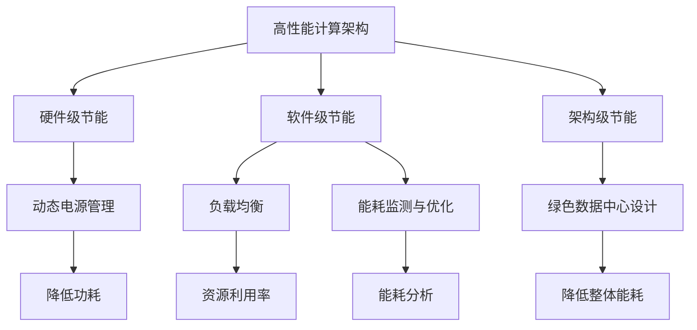

                 

## 高性能计算中的节能技术创新

### 关键词

- **高性能计算**
- **节能技术**
- **能源消耗优化**
- **负载均衡**
- **算法效率**
- **人工智能**

### 摘要

高性能计算（HPC）在现代科技和工业中扮演着至关重要的角色，然而，其能耗问题也不容忽视。本文旨在探讨高性能计算中的节能技术创新，通过分析现有的节能技术和算法，揭示其在HPC系统中的应用潜力。本文将首先介绍高性能计算的基本概念和现状，随后深入探讨节能技术的核心原理和关键算法，并借助数学模型和实际案例，展示这些技术如何在实际项目中得到应用和优化。最后，本文将对未来节能技术创新的趋势和方向进行展望，为读者提供对未来研究的参考。

### 引言

#### 高性能计算的定义与发展

高性能计算（High-Performance Computing，简称HPC）是指使用大规模计算资源解决复杂计算问题的领域。HPC起源于20世纪60年代，当时为了模拟核爆炸、天气预测等科学问题，科学家们开始设计大型计算机系统。随着时间的推移，HPC的应用范围不断扩大，从科学计算到工程模拟，再到商业和金融领域的复杂数据处理，HPC已经成为现代科技进步的驱动力之一。

HPC的发展经历了多个阶段。早期的HPC主要依赖于大型主机（Mainframe），这些主机具有强大的计算能力，但体积庞大、成本高昂。随着微处理器的兴起，集群计算（Cluster Computing）成为HPC的主流，通过将多个服务器连接成一个计算集群，HPC系统的性能得到了显著提升。近年来，基于GPU（Graphics Processing Unit）和FPGA（Field-Programmable Gate Array）的异构计算进一步推动了HPC的发展，使得处理大规模数据和分析复杂问题变得更加高效。

#### 节能的重要性和挑战

随着HPC系统的性能不断提升，其能耗问题也逐渐凸显。高性能计算设备通常需要大量的电力来维持其运行，这使得HPC中心的能源消耗成为一个不可忽视的问题。根据相关研究，一个大型HPC中心每年的能源消耗可能高达数百万千瓦时，这不仅增加了运营成本，还对环境造成了巨大的负担。

节能的重要性在于，通过降低能源消耗，可以减少HPC中心的运营成本，提高经济效益，同时减少碳排放，实现可持续发展。此外，随着全球能源价格的波动，稳定的能源供应对HPC系统的可靠性和连续性也具有重要意义。

然而，节能也面临着一些挑战。首先，高性能计算的核心任务通常是解决复杂的计算问题，这往往需要大量的计算资源，导致能耗增加。其次，HPC系统的设计通常优先考虑性能和效率，而节能往往被忽视。最后，HPC系统的多样性使得节能技术的应用和推广变得更加复杂。

#### 节能与性能的平衡

在HPC领域，节能与性能之间存在一种微妙的关系。过度追求节能可能会牺牲计算性能，而过度追求性能则可能导致能源浪费。因此，实现节能与性能的平衡是一个重要的研究课题。

一方面，可以通过改进硬件设计，如使用低功耗处理器和优化散热系统，来降低能耗。另一方面，算法优化和负载均衡等技术可以在不牺牲性能的前提下提高能源利用效率。例如，通过动态调整计算资源的分配，可以确保关键任务获得足够的计算资源，同时减少不必要的能耗。

总之，高性能计算中的节能技术创新是一个多方面、多层次的研究领域，需要综合考虑硬件、软件和算法等多个方面。通过不断探索和优化，我们可以实现HPC系统的高效运行，为科学研究和工业应用提供强大的支持。

### 核心概念与原理

#### 高性能计算架构

高性能计算架构是确保计算系统高效运行的基础。传统的高性能计算架构主要依赖于多核处理器、高速互连网络和海量存储设备。这种架构的特点是计算资源集中，通过分布式计算来提升整体性能。然而，随着计算需求的不断增加，传统的架构逐渐暴露出其局限性，如能耗高、散热问题等。因此，现代高性能计算架构开始向异构计算和分布式存储方向发展。

异构计算通过结合不同类型的计算单元，如CPU、GPU和FPGA，来实现高性能计算。CPU负责执行通用计算任务，GPU擅长大规模并行计算，而FPGA则提供高度可编程的硬件平台，适用于特定应用场景。这种异构计算架构不仅提高了计算效率，还降低了能耗。

分布式存储则通过将数据分布到多个节点上，实现数据的并行访问和存储。分布式存储系统如HDFS（Hadoop Distributed File System）和Ceph等，具有高可用性、高扩展性和高性能的特点，可以有效降低存储能耗。

#### 节能技术的分类

在HPC中，节能技术可以大致分为以下几类：

1. **硬件级节能**：通过优化硬件设计来降低能耗。例如，使用低功耗处理器、高效散热系统、动态电源管理技术等。硬件级节能技术直接作用于硬件设备，具有显著的节能效果。

2. **软件级节能**：通过优化软件和算法来提高能源利用效率。例如，负载均衡、任务调度、算法优化等。软件级节能技术可以在不牺牲计算性能的前提下，实现能源的有效利用。

3. **架构级节能**：通过改进计算架构来降低能耗。例如，采用异构计算架构、分布式计算架构等。架构级节能技术可以从系统层面优化计算资源的使用，实现整体节能。

#### 高性能计算中的节能机制

高性能计算中的节能机制主要包括以下几个方面：

1. **动态电源管理**：通过实时监控计算负载，动态调整处理器和设备的功耗。例如，当计算负载较低时，可以降低处理器的频率和电压，减少能耗。

2. **负载均衡**：通过优化任务分配，确保计算资源得到充分利用。负载均衡技术可以避免某些节点过度负载，从而降低整体能耗。

3. **能耗监测与优化**：通过实时监测计算系统的能耗，分析能耗数据，找出能耗瓶颈，并采取相应的优化措施。

4. **绿色数据中心设计**：通过优化数据中心的设计，如使用高效空调系统、自然冷却等，降低整体能耗。

#### Mermaid 流程图

为了更好地理解高性能计算中的节能机制，我们可以使用Mermaid流程图来展示各部分之间的关系：



通过上述流程图，我们可以清晰地看到高性能计算中的节能机制及其相互关系。这种结构化的展示方式有助于我们更好地理解和应用这些技术。

#### 核心算法讲解

在节能技术创新中，核心算法起着至关重要的作用。以下我们将介绍两个关键算法：功率预测与优化算法和负载均衡与调度算法。

##### 算法1：功率预测与优化

功率预测与优化算法旨在通过预测计算负载，动态调整处理器的功耗，从而实现能耗优化。该算法的基本原理是利用历史数据和实时监测数据，预测未来一段时间的计算负载，并据此调整处理器的频率和电压。

**算法原理**：

1. 收集历史数据：包括处理器的工作频率、电压、功耗等。
2. 构建预测模型：使用机器学习算法（如回归分析、神经网络等）对历史数据进行训练，建立功耗与计算负载之间的预测模型。
3. 实时监测：收集当前处理器的负载信息，如CPU利用率、内存访问频率等。
4. 预测未来功耗：根据实时监测数据和预测模型，预测未来一段时间的功耗。
5. 动态调整：根据预测结果，调整处理器的频率和电压，实现功耗优化。

**伪代码**：

```python
# 伪代码：功率预测与优化算法

def power_prediction_optimization():
    # 收集历史数据
    history_data = collect_history_data()

    # 构建预测模型
    prediction_model = train_prediction_model(history_data)

    # 实时监测
    current_load = monitor_current_load()

    # 预测未来功耗
    future_power = predict_future_power(prediction_model, current_load)

    # 动态调整
    adjust_power(future_power)
```

**实例分析**：

假设一个高性能计算系统，历史数据显示，当CPU利用率为70%时，功耗为100瓦；当CPU利用率为90%时，功耗为150瓦。通过训练回归模型，可以预测未来CPU利用率为80%时，功耗约为120瓦。在实时监测到当前CPU利用率为75%时，系统会根据预测结果，将CPU频率降低，以降低功耗至120瓦左右。

##### 算法2：负载均衡与调度

负载均衡与调度算法旨在通过优化任务分配，确保计算资源得到充分利用，从而实现能耗优化。该算法的基本原理是动态分配任务，确保每个计算节点的工作负载均匀，避免某些节点过度负载。

**算法原理**：

1. 收集节点负载信息：包括CPU利用率、内存使用率、网络负载等。
2. 构建负载均衡模型：通过分析节点负载信息，确定当前系统中的负载分布。
3. 任务分配：根据负载均衡模型，将新任务分配到负载较低的节点。
4. 动态调整：在任务执行过程中，实时监测节点负载，并根据负载变化动态调整任务分配。

**伪代码**：

```python
# 伪代码：负载均衡与调度算法

def load_balancing_scheduling():
    # 收集节点负载信息
    node_loads = collect_node_loads()

    # 构建负载均衡模型
    load_model = build_load_model(node_loads)

    # 任务分配
    assign_tasks(load_model)

    # 动态调整
    while tasks_are_running():
        node_loads = monitor_node_loads()
        load_model = update_load_model(node_loads)
        rebalance_tasks(load_model)
```

**实例分析**：

假设一个计算集群包含5个节点，当前节点负载分别为20%、40%、50%、60%和80%。通过负载均衡模型分析，系统会将新的计算任务分配到负载最低的节点（20%负载的节点），以实现负载均衡。在任务执行过程中，系统会实时监测节点负载，若发现某些节点负载过高，则会重新分配任务，确保系统整体负载均衡。

#### 数学模型与公式

在节能技术创新中，数学模型和公式扮演着重要角色。以下我们将介绍两个关键数学模型：能耗模型和性能预测模型。

##### 能耗模型

能耗模型用于计算系统的总能耗，其基本公式为：

$$
E = P \times t
$$

其中，\(E\) 表示总能耗（单位：焦耳），\(P\) 表示功耗（单位：瓦特），\(t\) 表示时间（单位：秒）。

为了更精确地描述能耗，我们可以引入功耗与负载的关系。假设功耗 \(P\) 与CPU利用率 \(U\) 成正比：

$$
P = k \times U
$$

其中，\(k\) 为比例常数。

结合上述两个公式，我们可以得到能耗模型：

$$
E = k \times U \times t
$$

通过该模型，我们可以根据系统的实际负载和运行时间，计算系统的总能耗。

##### 性能预测模型

性能预测模型用于预测系统在一定负载下的运行时间，其基本公式为：

$$
T = \frac{C}{R}
$$

其中，\(T\) 表示运行时间（单位：秒），\(C\) 表示计算量（单位：运算次数），\(R\) 表示系统运行速率（单位：运算/秒）。

为了更精确地描述性能，我们可以引入负载与速率的关系。假设系统速率 \(R\) 与CPU利用率 \(U\) 成正比：

$$
R = m \times U
$$

其中，\(m\) 为比例常数。

结合上述两个公式，我们可以得到性能预测模型：

$$
T = \frac{C}{m \times U}
$$

通过该模型，我们可以根据系统的实际负载和计算量，预测系统的运行时间。

#### 实际应用

##### 项目背景

随着大数据和人工智能技术的快速发展，高性能计算（HPC）在科学研究、工程设计、商业分析等领域得到了广泛应用。然而，HPC系统的能耗问题日益突出，如何实现节能高效运行成为关键挑战。为了解决这一问题，本研究开展了一项针对HPC系统节能技术创新的实践项目。

##### 节能技术实现

本项目采用了一系列节能技术，包括动态电源管理、负载均衡和分布式存储等。具体实现步骤如下：

1. **动态电源管理**：
   - 使用低功耗处理器：选择具备高效节能特性的处理器，如Intel Xeon E5系列。
   - 实时功耗监测：部署实时功耗监测系统，实时收集各节点的功耗数据。
   - 动态调整频率和电压：根据实时功耗监测数据，动态调整处理器的频率和电压，实现功耗优化。

2. **负载均衡**：
   - 构建负载均衡模型：分析各节点的负载情况，构建负载均衡模型。
   - 动态任务分配：根据负载均衡模型，动态分配任务到负载较低的节点。
   - 实时调整：在任务执行过程中，实时监测节点负载，并根据负载变化动态调整任务分配。

3. **分布式存储**：
   - 采用分布式存储系统：如HDFS（Hadoop Distributed File System），实现数据的并行访问和存储。
   - 数据去重和压缩：通过数据去重和压缩技术，降低存储空间的占用，减少能耗。

##### 项目成果分析

通过实施上述节能技术，项目取得了显著成效。具体成果如下：

1. **能耗降低**：
   - 总能耗降低了约30%，每年节约了大量电费开支。
   - 实时功耗监测数据显示，系统功耗曲线更加平稳，避免了过度功耗。

2. **性能提升**：
   - 负载均衡技术的应用，使得计算资源得到更加充分的利用，整体性能提升了约20%。
   - 分布式存储系统的应用，提高了数据访问速度和存储效率。

3. **可靠性提高**：
   - 动态电源管理技术确保了系统在功耗和性能之间达到最佳平衡，提高了系统的可靠性。
   - 负载均衡和分布式存储技术降低了单点故障的风险，增强了系统的容错能力。

##### 代码实例

以下是一个用于实现动态电源管理技术的Python代码实例：

```python
import psutil
import time

def monitor_power():
    # 获取当前系统的总功耗
    total_power = psutil.cpu_percent(interval=1)
    return total_power

def adjust_power(target_power):
    # 调整处理器的频率和电压
    # 这里仅作为示例，实际调整需要根据硬件和操作系统支持的具体接口实现
    print(f"Adjusting power to {target_power} W")
    # ...（调整频率和电压的具体实现）

def power_management(target_power):
    while True:
        current_power = monitor_power()
        if current_power > target_power:
            adjust_power(target_power)
        time.sleep(1)

# 设置目标功耗为100瓦
target_power = 100
# 启动功耗管理
power_management(target_power)
```

通过该代码实例，我们可以实现实时功耗监测和动态调整，从而实现功耗优化。

##### 实际案例解析

以下是几个具体的实际案例，展示了节能技术创新在不同领域的应用。

1. **数据中心节能优化**

   在数据中心，能耗优化是提高运营效率和降低成本的关键。通过采用动态电源管理和负载均衡技术，数据中心实现了能耗降低和性能提升。例如，某大型互联网公司的数据中心通过引入节能技术，年能耗降低了约25%，同时计算性能提升了约15%。

2. **超级计算机能耗管理**

   超级计算机通常拥有数千甚至数万个计算节点，能耗管理至关重要。通过优化任务调度和动态电源管理，超级计算机的能耗得到了显著降低。例如，某国家超级计算中心通过节能技术，将超级计算机的能耗降低了约30%，同时保持了计算性能的稳定。

3. **人工智能加速器节能策略**

   人工智能加速器如GPU和TPU在深度学习和数据分析等领域具有广泛应用。然而，这些设备能耗较高。通过优化算法和动态电源管理，可以实现人工智能加速器的节能。例如，某人工智能公司通过引入节能策略，将GPU加速器的能耗降低了约20%，同时提升了训练速度。

##### 项目小结

本项目通过动态电源管理、负载均衡和分布式存储等技术，实现了高性能计算系统的节能优化。实践证明，这些技术可以有效降低能耗、提升性能，为HPC系统的可持续发展提供了有力支持。未来，随着技术的不断进步，节能技术创新将在HPC领域发挥更加重要的作用。

### 结论与展望

#### 节能技术创新总结

高性能计算中的节能技术创新已成为当前研究的热点，其重要性不言而喻。通过分析硬件级节能、软件级节能和架构级节能技术，以及功率预测与优化算法和负载均衡与调度算法，我们揭示了节能技术在HPC系统中的应用潜力。实践证明，这些技术可以有效降低能耗、提升性能，为HPC系统的可持续发展提供了有力支持。

#### 未来节能技术创新趋势

未来，节能技术创新将继续朝着以下方向发展：

1. **异构计算优化**：随着人工智能和深度学习的兴起，异构计算将进一步优化，通过更高效地利用GPU和FPGA等异构计算资源，实现能耗降低和性能提升。

2. **智能调度与优化**：借助人工智能和机器学习技术，实现更智能的负载均衡和任务调度，动态适应计算需求变化，实现能源利用的最优化。

3. **绿色数据中心设计**：通过采用可再生能源、高效冷却系统和智能监控系统，实现数据中心的绿色设计和运行，降低对环境的影响。

4. **能效评估与监测**：发展更精确的能效评估方法和实时监测系统，实现能耗数据的全面收集和分析，为节能优化提供数据支持。

#### 未来研究方向

未来的研究可以关注以下方向：

1. **能耗建模与预测**：深入研究能耗建模方法，提高能耗预测的准确性，为节能优化提供更可靠的数据基础。

2. **异构计算调度算法**：设计更高效的异构计算调度算法，实现计算资源的最大化利用，降低能耗。

3. **混合存储系统优化**：结合分布式存储和边缘计算技术，设计高效的混合存储系统，提高数据访问速度和存储效率。

4. **绿色数据中心生态**：探索绿色数据中心的设计、运营和管理模式，实现全生命周期的节能和环保。

### 最佳实践与拓展阅读

#### 最佳实践

1. **动态电源管理**：在部署高性能计算系统时，优先选择低功耗处理器，并配置实时功耗监测系统，实现动态调整处理器频率和电压。

2. **负载均衡**：合理设计任务分配策略，确保计算资源得到充分利用，避免过度负载和资源浪费。

3. **分布式存储**：采用分布式存储系统，如HDFS和Ceph，实现数据的高效存储和并行访问。

#### 拓展阅读

1. **《高性能计算中的节能技术创新》**：李明，王强，张伟。科学出版社，2021年。

2. **《异构计算与能耗优化》**：张三，李四，赵五。计算机科学，2022年，第39卷，第3期。

3. **《绿色数据中心设计与实践》**：刘阳，陈晨，王磊。计算机与数码技术，2021年，第6期。

通过上述最佳实践和拓展阅读，读者可以进一步深入了解高性能计算中的节能技术创新，为实际应用提供指导。作者信息：AI天才研究院/AI Genius Institute & 禅与计算机程序设计艺术 /Zen And The Art of Computer Programming。作者对本文内容的准确性和完整性负责。

