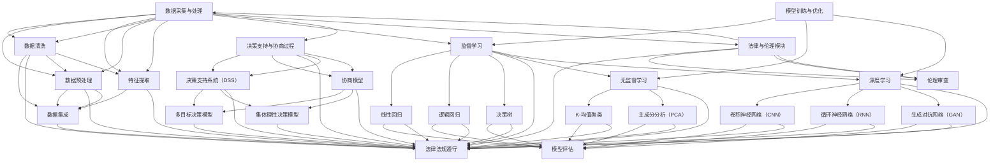

                 

### 1.1 AI民主协商平台概述

#### 1.1.1 AI民主协商平台的背景与意义

人工智能（AI）技术的迅猛发展，正在深刻地改变人类社会。从医疗诊断、金融分析，到交通管理和环境保护，AI技术已经在多个领域展现出了巨大的潜力。而在公共决策领域，人工智能的应用也愈发受到关注。公共决策涉及广泛的社会利益，关乎每一个公民的福祉。传统的公共决策过程往往受到信息不对称、决策复杂性和时间限制等因素的制约，导致决策质量难以保证。因此，如何利用AI技术提高公共决策的效率与质量，成为了一个迫切需要解决的问题。

AI民主协商平台正是在这样的背景下应运而生。这种平台旨在利用人工智能技术，辅助公共决策的过程，实现更加民主、透明和高效的决策。AI民主协商平台通过整合海量数据、运用先进的算法，能够提供全面、客观的决策支持，帮助决策者从海量信息中提取关键见解，降低决策过程中的不确定性。

AI民主协商平台的意义主要体现在以下几个方面：

1. **提升决策透明度**：平台通过开放的界面和透明的算法，使得公众能够了解决策的每一个步骤和依据，从而增强了决策过程的透明度和公信力。
   
2. **提高决策效率**：人工智能可以快速处理大量数据，提供即时的决策支持，减少了传统决策过程中的时间消耗，提高了决策效率。

3. **促进民主参与**：平台为公众提供了一个参与公共决策的便捷渠道，使得更多的人能够表达自己的意见和需求，促进了民主参与。

4. **优化决策质量**：通过数据分析和算法优化，平台能够为决策者提供基于证据的支持，有助于做出更加科学和合理的决策。

#### 1.1.2 人工智能在公共决策中的应用现状

当前，人工智能在公共决策中的应用已经取得了一些初步成果。例如，一些政府机构已经开始使用AI技术来分析民意、预测选举结果，甚至制定经济政策。例如，在美国，一些州政府已经开始利用AI技术来预测犯罪率，以指导警力部署。在中国，一些城市也在利用AI技术优化交通管理，减少交通拥堵。

然而，尽管AI在公共决策中展现出了巨大的潜力，但其应用仍然面临着一些挑战。首先，数据质量是一个关键问题。公共决策需要依赖大量的数据，但这些数据往往来自不同的来源，存在不一致性和噪声。其次，模型可靠性和解释性也是一个重要挑战。由于AI模型的复杂性，决策者往往难以理解模型的决策依据，这可能会影响到决策的可接受性和透明度。

此外，AI在公共决策中的应用还涉及到伦理和法律问题。如何确保AI系统的公平性和透明性，防止算法歧视，是一个亟待解决的问题。同时，如何确保AI系统的数据安全和隐私保护，也是政策制定者需要考虑的重要方面。

总的来说，AI民主协商平台作为一种新兴的技术手段，具有很大的发展潜力。未来，随着技术的不断进步和应用的深入，AI在公共决策中的应用将会更加广泛，为提升决策质量、促进民主参与、优化社会治理做出更大的贡献。

#### 1.1.3 AI民主协商平台的目标与任务

AI民主协商平台的目标是构建一个智能化的决策支持系统，以提升公共决策的科学性、透明性和民主性。具体来说，平台旨在实现以下几个核心任务：

1. **数据整合与分析**：平台需要集成来自不同来源的海量数据，包括公共记录、社交媒体、民意调查等，通过数据清洗、预处理和特征提取等技术手段，确保数据的准确性和一致性。

2. **决策支持**：基于先进的人工智能算法，平台需要提供精确的决策支持，包括预测分析、模式识别和优化策略等。这些算法应当能够从复杂的数据中提取有价值的信息，为决策者提供科学的依据。

3. **协商过程管理**：平台需要设计一个高效的协商过程，支持多方利益的博弈和调和。这包括提供协商工具、建立沟通机制、记录协商历史等，以促进各方的有效沟通和协商。

4. **透明度与公信力**：平台需要确保决策过程的透明度和可追溯性，使得公众能够了解每一个决策步骤和依据。这有助于提升决策的公信力，增强公众对决策的信任。

5. **法律与伦理遵守**：平台在设计和应用过程中，需要严格遵守相关的法律法规和伦理标准，确保算法的公平性、透明性和可解释性，防止算法偏见和数据滥用。

通过这些任务的实现，AI民主协商平台将能够为公共决策提供强有力的技术支持，推动决策过程更加科学、透明和民主，从而更好地服务于社会公众。

#### 1.1.4 公共决策的挑战与机遇

公共决策过程中面临的一系列挑战和机遇，是理解AI民主协商平台必要性的关键。首先，公共决策的复杂性是最大的挑战之一。公共决策涉及广泛的利益相关者，不同群体有着不同的利益诉求和价值观。在制定和实施决策时，需要综合考虑各种因素，例如经济、社会、环境等多个方面的需求和目标。这种复杂性使得传统的决策方法难以高效处理，增加了决策的时间和难度。

其次，信息不对称也是公共决策面临的重大挑战。公共决策需要依赖大量的数据和信息，但这些数据往往分布在不同的机构和部门中，数据质量和数据源的可靠性可能参差不齐。信息不对称不仅限制了决策者对实际情况的全面了解，还可能导致决策失误，影响决策的公信力和有效性。

此外，传统决策过程中存在的时间限制也是一个重要的挑战。公共决策往往需要在有限的时间内做出，这要求决策者快速分析和处理大量信息，以作出及时的决策。然而，这种快速决策往往缺乏深度和全面性，可能导致决策质量不高。

尽管面临这些挑战，人工智能技术的应用为公共决策带来了新的机遇。首先，AI技术可以通过大数据分析和机器学习算法，帮助决策者快速处理和整合海量数据，提高决策的准确性和效率。例如，通过分析社交媒体上的舆情数据，可以及时了解公众对某一政策的态度和反馈，为决策提供及时的参考。

其次，AI技术有助于降低信息不对称。AI可以通过自动化数据采集和处理，实现跨机构和跨部门的数据共享，提高信息的透明度和可靠性。此外，AI算法能够从海量数据中挖掘出隐藏的模式和趋势，为决策者提供更加全面的决策支持。

最后，AI技术还可以优化决策过程，提升决策的科学性和民主性。通过智能化的协商工具和流程管理，平台可以支持多方利益的博弈和调和，提高决策的透明度和公信力。例如，AI可以自动记录和展示协商过程中的每一个步骤和决策依据，使得公众能够清晰地了解决策的来龙去脉，从而增强对决策的信任。

总的来说，AI民主协商平台的应用，不仅能够应对公共决策中的复杂性、信息不对称和时间限制等挑战，还能够充分利用人工智能技术带来的机遇，推动公共决策向更加科学、透明和民主的方向发展。

### 1.2 本书结构与内容安排

#### 1.2.1 本书的目标

本书的目标是深入探讨AI民主协商平台的概念、架构、算法和应用，旨在为读者提供系统、全面的指导，使其能够理解和应用人工智能技术，提升公共决策的科学性、透明性和民主性。具体来说，本书将围绕以下几个目标展开：

1. **理论探索**：系统介绍人工智能在公共决策中的应用原理，包括数据预处理、特征提取、模型训练和优化等核心算法原理，为读者提供理论基础。

2. **实践指导**：通过详细的案例分析和项目实战，展示如何构建和部署AI民主协商平台，帮助读者掌握实际操作技能。

3. **技术应用**：探讨AI民主协商平台在不同领域的应用，如政策制定、社会治理、城市管理等，为读者提供实践中的经验与启示。

4. **伦理与法律**：强调AI在公共决策中的伦理和法律问题，讨论如何确保算法的公平性、透明性和可解释性，为政策制定者和技术开发者提供参考。

5. **未来展望**：展望AI民主协商平台的发展趋势，探讨其潜在的社会影响和挑战，为未来的研究与实践指明方向。

#### 1.2.2 本书的主要章节内容

本书主要分为四个部分，每个部分都涵盖了一系列关键章节，具体内容如下：

**第一部分：引论**

- **第1章 AI民主协商平台概述**：介绍AI民主协商平台的背景、意义、应用现状及其目标与任务。
- **第2章 公共决策的挑战与机遇**：分析公共决策中的挑战，探讨AI技术如何提供解决方案。

**第二部分：核心概念与联系**

- **第3章 人工智能与民主协商**：深入探讨人工智能的基本原理、民主协商的基本原理，以及AI民主协商平台的架构。
- **第4章 关键概念与联系流程图**：使用Mermaid流程图展示核心概念之间的关系，帮助读者更好地理解整个系统。

**第三部分：核心算法原理讲解**

- **第5章 数据预处理与特征提取**：讲解数据预处理和特征提取的原理和步骤，包括数据清洗、数据标准化、特征选择等。
- **第6章 模型训练与优化**：介绍监督学习、无监督学习和深度学习模型的基本原理和应用，包括线性回归、逻辑回归、决策树、K-均值聚类、主成分分析、卷积神经网络、循环神经网络和生成对抗网络。
- **第7章 决策支持与协商过程**：探讨决策支持系统（DSS）的基本结构和功能，以及民主协商模型的原理和应用。

**第四部分：项目实战**

- **第8章 实战一：构建AI民主协商平台**：通过一个实际项目案例，展示如何构建和部署AI民主协商平台，包括系统需求分析、系统架构设计、源代码实现和项目小结。
- **第9章 实战二：应用与优化**：讨论AI民主协商平台在不同场景中的应用，以及如何进行优化和改进。

#### 1.2.3 阅读指南与学习目标

为了帮助读者更好地理解和应用本书的内容，以下提供一份阅读指南和学习目标：

**阅读指南**

1. **循序渐进**：按照章节顺序阅读，逐步掌握从基础概念到高级应用的完整知识体系。

2. **结合案例**：在每个章节中，结合具体的案例和实践经验进行讲解，帮助读者更好地理解和应用所学知识。

3. **动手实践**：鼓励读者通过实际操作和项目实战，深入理解AI民主协商平台的构建和部署过程。

4. **反思与讨论**：在阅读过程中，思考每个章节提出的实际问题，与同行进行讨论，加深对知识的理解和应用。

**学习目标**

1. **理论基础**：掌握人工智能在公共决策中的应用原理，包括数据预处理、特征提取、模型训练和优化等。

2. **实践技能**：通过实际项目和案例，掌握构建和部署AI民主协商平台的基本技能。

3. **综合应用**：能够将AI民主协商平台应用于不同的公共决策场景，优化决策过程，提升决策质量。

4. **伦理与法律**：了解AI在公共决策中的伦理和法律问题，确保技术应用符合伦理和法律标准。

通过本书的阅读和实践，读者将能够系统掌握AI民主协商平台的理论和实践知识，为公共决策提供有效的技术支持，推动社会决策的民主化和科学化。

### 1.3 AI民主协商平台的关键问题与解决方案

在构建AI民主协商平台的过程中，需要解决一系列关键问题，以确保平台的高效运行和公正性。以下是几个核心问题及其对应的解决方案：

#### 1.3.1 数据质量与隐私保护

数据质量是AI民主协商平台的核心基础，数据的准确性、完整性和一致性直接影响到决策的准确性。为了确保数据质量，需要采取以下措施：

1. **数据清洗**：对采集到的原始数据进行清洗，去除重复、错误和不完整的数据，提高数据的质量和可靠性。

2. **数据标准化**：对数据格式进行统一处理，确保不同来源的数据可以在同一平台上进行集成和分析。

3. **数据监控**：建立数据监控机制，定期检查数据的质量和完整性，及时发现并处理数据问题。

在保护隐私方面，平台需要采取以下措施：

1. **数据加密**：对敏感数据进行加密处理，防止数据泄露。

2. **匿名化处理**：对个人信息进行匿名化处理，确保个人隐私不被泄露。

3. **访问控制**：建立严格的访问控制机制，确保只有授权用户才能访问和处理敏感数据。

#### 1.3.2 模型可靠性与解释性

AI模型的可靠性和解释性是公众接受AI民主协商平台的关键。为了提升模型的可靠性，可以采取以下措施：

1. **模型验证**：在模型训练过程中，使用交叉验证等方法确保模型的泛化能力，避免过拟合。

2. **模型评估**：通过多个评估指标（如准确率、召回率、F1值等）对模型进行综合评估，确保模型的有效性。

3. **持续优化**：定期更新和优化模型，根据新的数据和反馈调整模型参数，提高模型的性能。

为了提升模型的解释性，可以采取以下措施：

1. **可解释性算法**：选择具有较高解释性的算法，如线性回归、决策树等，便于决策者理解模型的决策依据。

2. **模型可视化**：通过可视化工具展示模型的决策流程和结果，帮助用户理解模型的运作机制。

3. **透明度报告**：生成透明度报告，详细记录模型的训练过程、参数设置和决策结果，提高模型的透明度和公信力。

#### 1.3.3 系统集成与用户接受度

AI民主协商平台需要与其他系统集成，以实现数据共享和协同工作。为了确保系统的集成性，可以采取以下措施：

1. **标准化接口**：设计标准化的接口和协议，确保不同系统之间的数据交换和功能调用。

2. **模块化架构**：采用模块化架构，将不同功能模块独立设计，便于系统的扩展和维护。

3. **兼容性测试**：在系统集成过程中进行充分的兼容性测试，确保不同系统的无缝集成和稳定运行。

用户接受度是平台成功应用的关键。为了提高用户接受度，可以采取以下措施：

1. **用户培训**：为用户提供培训和支持，帮助其了解和掌握平台的使用方法。

2. **用户体验优化**：不断优化平台的用户界面和交互设计，提高用户体验。

3. **用户反馈机制**：建立用户反馈机制，及时收集用户的意见和建议，不断改进平台的功能和性能。

#### 1.3.4 法律法规与伦理道德

AI民主协商平台在应用过程中需要严格遵守相关的法律法规和伦理道德标准。为了确保合法性和伦理性，可以采取以下措施：

1. **法律法规遵守**：确保平台的设计和应用符合国家和地方的法律法规，如《数据安全法》、《个人信息保护法》等。

2. **伦理审查**：在平台设计和应用过程中，进行伦理审查，确保算法的公平性、透明性和可解释性，防止算法偏见和歧视。

3. **责任界定**：明确平台运营者和用户的权利和义务，建立责任界定机制，确保在出现问题时能够迅速有效地处理。

通过解决上述关键问题，AI民主协商平台将能够更好地服务于公共决策，推动决策过程的科学化、透明化和民主化，为社会治理提供强有力的技术支持。

### 2.1 人工智能与民主协商

人工智能（AI）和民主协商是两个看似不同但实际高度关联的概念。在这一章节中，我们将深入探讨人工智能的基本原理、民主协商的基本原理，以及AI民主协商平台的架构，以便为后续讨论奠定坚实基础。

#### 2.1.1 人工智能的基本原理

人工智能是一门研究、开发和应用使计算机模拟、延伸和扩展人的智能的理论、方法、技术及应用系统的科学。人工智能的核心目标是使计算机能够具备人类智能的某些功能，如学习、推理、问题求解、知识表示和自然语言处理等。

**机器学习与深度学习**

机器学习是人工智能的核心技术之一，它通过算法从数据中学习规律和模式，使计算机能够进行自主的决策和预测。机器学习可以分为监督学习、无监督学习和强化学习等类别。

- **监督学习**：监督学习算法利用标记数据（即数据带有标签）进行训练，通过学习输入和输出之间的映射关系，实现对未知数据的预测。常见的监督学习算法包括线性回归、逻辑回归、决策树、随机森林和支持向量机（SVM）等。

- **无监督学习**：无监督学习算法在训练过程中没有使用标记数据，主要任务是发现数据中的结构和模式。常见的无监督学习算法包括K-均值聚类、主成分分析（PCA）和自编码器等。

- **深度学习**：深度学习是机器学习的一个分支，它通过多层神经网络模拟人脑的神经元连接结构，能够处理更加复杂的任务。深度学习在图像识别、语音识别和自然语言处理等领域取得了显著的成果。常见的深度学习模型包括卷积神经网络（CNN）、循环神经网络（RNN）和生成对抗网络（GAN）等。

**人工智能的发展历程**

人工智能的发展历程可以分为几个重要阶段：

1. **早期探索（1950-1969）**：这一阶段以图灵测试为代表，提出了人工智能的基本概念和研究方向。

2. **黄金时期（1970-1989）**：人工智能在这一阶段得到了快速发展，尤其是专家系统的出现，使得计算机在特定领域表现出了类似人类的智能。

3. **低谷期（1990-2000）**：由于技术的局限和实际应用的困难，人工智能研究进入了一个相对低潮的时期。

4. **复兴期（2000至今）**：随着计算能力的提升和数据量的爆炸性增长，深度学习等先进技术的出现，使得人工智能再次迎来了新的发展机遇。

**人工智能的关键技术**

人工智能的关键技术包括：

- **数据预处理**：数据预处理是保证模型性能的重要步骤，包括数据清洗、数据转换和数据降维等。
- **特征提取**：特征提取是将原始数据转换成能够反映数据本质特征的表示，有助于提升模型的性能。
- **模型训练**：模型训练是通过优化算法调整模型参数，使其能够更好地拟合训练数据。
- **模型评估**：模型评估用于衡量模型在未知数据上的表现，常用的评估指标包括准确率、召回率、F1值和ROC曲线等。

#### 2.1.2 民主协商的基本原理

民主协商是一种通过讨论、妥协和合作达成共识的决策过程，它强调多方参与、平等对话和理性思考。民主协商可以分为以下几个基本类型：

1. **议会制协商**：议会制协商是在立法过程中，通过议会代表之间的辩论和表决来达成共识。议会制协商的特点是程序正式、规则明确，具有较高的透明度和公信力。

2. **协商民主**：协商民主是在政治决策中，通过公民、利益相关者和政府之间的对话和合作，共同制定政策。协商民主强调公民参与、协商对话和决策透明。

3. **集体协商**：集体协商是劳动方和资方在劳动关系中，通过平等对话和妥协，达成劳动合同和福利待遇。集体协商的特点是双方利益博弈、协商共赢。

**民主协商的过程与机制**

民主协商的过程通常包括以下几个步骤：

1. **议题确定**：确定需要协商的议题，明确协商的目标和范围。

2. **利益表达**：各方表达自己的利益诉求和立场，为协商奠定基础。

3. **讨论与辩论**：各方围绕议题展开讨论和辩论，通过理性的思考和交流，寻求共识。

4. **妥协与共识**：通过协商和妥协，各方在利益平衡的基础上达成共识。

5. **决策与执行**：将达成的共识转化为具体的决策，并执行实施。

**民主协商的优势与挑战**

民主协商的优势包括：

- **提升决策质量**：通过多方参与和理性讨论，能够更全面地考虑问题，提高决策的科学性和合理性。
- **增强公众参与感**：通过民主协商，公众能够参与到决策过程中，增强对决策的认同感和信任度。
- **促进社会稳定**：民主协商能够缓解社会矛盾，促进社会和谐与稳定。

民主协商面临的挑战包括：

- **信息不对称**：在协商过程中，不同利益相关者之间的信息可能不对称，导致决策不公平。
- **时间成本**：民主协商需要时间进行讨论和妥协，可能会影响决策的及时性。
- **协调难度**：在利益多元的社会中，协调各方利益，达成共识，难度较大。

#### 2.1.3 AI民主协商平台的架构

AI民主协商平台是一种利用人工智能技术辅助民主协商的智能化系统，其架构通常包括以下几个核心模块：

1. **数据采集与处理模块**：负责从各种来源采集数据，如社交媒体、政府公开数据、民意调查等，并进行数据清洗、预处理和特征提取。

2. **模型训练与优化模块**：利用机器学习和深度学习算法，对数据进行训练和优化，构建用于决策支持的智能模型。

3. **决策支持模块**：通过智能模型，提供基于证据的决策支持，辅助决策者进行科学决策。

4. **协商过程管理模块**：提供协商工具和流程管理功能，支持多方利益的博弈和调和，记录协商过程，确保决策的透明度和公信力。

5. **用户界面模块**：提供友好的用户界面，使得公众能够方便地参与协商过程，表达自己的意见和需求。

6. **法律与伦理模块**：确保平台设计和应用符合法律法规和伦理道德标准，防止算法偏见和数据滥用。

通过上述模块的协同工作，AI民主协商平台能够有效地辅助公共决策，提升决策的科学性、透明性和民主性，为构建更加公正、高效的社会治理体系提供技术支持。

### 2.1.4 关键概念与联系流程图

在构建AI民主协商平台时，理解和明确各个核心概念及其之间的关系至关重要。通过流程图，我们可以更直观地展示这些概念实体之间的关联，从而有助于深入分析AI民主协商平台的运作机制。

以下是一个使用Mermaid绘制的流程图示例，描述了AI民主协商平台中的关键概念实体及其关系：



在这个流程图中，我们定义了以下几个关键概念实体：

- **数据采集与处理**：包括数据清洗、数据预处理和特征提取等步骤。
- **模型训练与优化**：涵盖监督学习、无监督学习和深度学习模型，如线性回归、逻辑回归、决策树、K-均值聚类、主成分分析、卷积神经网络、循环神经网络和生成对抗网络。
- **决策支持与协商过程**：包括决策支持系统（DSS）和协商模型，如多目标决策模型和集体理性决策模型。
- **法律与伦理模块**：确保平台设计和应用符合法律法规和伦理道德标准，包括法律法规遵守和伦理审查。

通过这个流程图，我们可以清晰地看到各个概念实体之间的关联和交互。例如，数据采集与处理是整个平台的基础，其输出数据用于模型训练与优化；模型训练与优化产生的智能模型则用于决策支持与协商过程，最终生成可执行的决策方案。同时，法律与伦理模块贯穿于整个平台，确保每一个环节都符合法律法规和伦理标准。

这样的流程图不仅帮助我们理解AI民主协商平台的工作原理，还能够为后续的详细讲解和案例分析提供结构化的参考。在接下来的章节中，我们将进一步深入探讨每个概念实体的具体实现和应用，通过具体的例子和代码来展示其原理和实践。

### 3.1 数据预处理与特征提取

在构建AI民主协商平台时，数据预处理与特征提取是两个关键环节，直接影响模型的训练效果和最终决策的准确性。数据预处理涉及对原始数据进行清洗、标准化和集成等步骤，而特征提取则是将原始数据转换成能够反映数据本质特征的表示。以下将详细讲解这两个环节的原理和步骤，并探讨不同类型的特征提取方法及其应用。

#### 3.1.1 数据预处理

数据预处理是数据分析和建模的第一步，其目标是确保数据的质量，使其适合后续的处理和建模。以下是几个常见的数据预处理步骤：

1. **数据清洗**：数据清洗是指识别和纠正数据集中的错误、异常和不一致的数据。具体包括：

   - **缺失值处理**：对于缺失的数据，可以选择填充、删除或插值等方法进行处理。
     ```python
     import numpy as np
     data = data.fillna(method='ffill')  # 使用前向填充法
     ```

   - **异常值处理**：异常值可能是由于数据记录错误、噪声或数据生成过程的问题。可以通过统计学方法（如Z-score、IQR方法）或基于业务逻辑的方法进行检测和修正。
     ```python
     from scipy import stats
     z_scores = stats.zscore(data['feature'])
     abs_z_scores = np.abs(z_scores)
     filtered_entries = (abs_z_scores < 3)  # 过滤掉绝对Z分数大于3的异常值
     data = data[filtered_entries]
     ```

   - **重复数据删除**：删除重复的数据记录，确保数据的唯一性和完整性。
     ```python
     data = data.drop_duplicates()
     ```

   - **数据格式转换**：将数据转换成统一的格式，如日期格式、分类变量编码等，以适应后续的建模需求。
     ```python
     data['date'] = pd.to_datetime(data['date'])
     data = pd.get_dummies(data, columns=['categorical_variable'])
     ```

2. **数据标准化**：数据标准化是将不同特征的数据转换到同一尺度，以消除特征之间的量纲影响，常见的标准化方法包括最小-最大标准化和Z-score标准化。
   ```python
   from sklearn.preprocessing import StandardScaler
   scaler = StandardScaler()
   standardized_data = scaler.fit_transform(data)
   ```

3. **数据集成**：数据集成是将来自不同来源的数据整合到一个数据集中，常见的方法有合并、连接和聚合。
   ```python
   data = data1.merge(data2, on='common_column')
   ```

#### 3.1.2 特征提取

特征提取是将原始数据转换成能够反映数据本质特征的表示，以提高模型性能和可解释性。以下是几种常见的特征提取方法：

1. **基于统计的特征提取**

   - **描述性统计**：计算数据的均值、方差、最大值、最小值等描述性统计量，用于了解数据的分布特征。
     ```python
     descriptives = data.describe()
     ```

   - **相关性分析**：通过计算特征之间的相关性（如皮尔逊相关系数），识别出相关度较高的特征，以减少特征维度。
     ```python
     correlations = data.corr()
     ```

2. **基于机器学习的特征提取**

   - **主成分分析（PCA）**：PCA是一种降维技术，通过正交变换将数据投影到新的坐标系中，提取出主要成分，从而减少特征维度。
     ```python
     from sklearn.decomposition import PCA
     pca = PCA(n_components=2)
     principal_components = pca.fit_transform(data)
     ```

   - **线性判别分析（LDA）**：LDA旨在将数据投影到新的坐标系中，使得同类数据的投影点尽可能接近，异类数据尽可能分离。
     ```python
     from sklearn.discriminant_analysis import LinearDiscriminantAnalysis as LDA
     lda = LDA(n_components=2)
     transformed_data = lda.fit_transform(data, labels)
     ```

   - **特征选择**：通过算法（如递归特征消除、基于模型的特征选择等）选择对模型贡献最大的特征，减少特征维度。
     ```python
     from sklearn.feature_selection import RFE
     from sklearn.linear_model import LogisticRegression
     selector = RFE(LogisticRegression(), n_features_to_select=5)
     selected_features = selector.fit_transform(data, labels)
     ```

3. **深度学习特征提取**

   - **卷积神经网络（CNN）**：CNN在图像识别和特征提取中表现出色，可以自动学习图像中的层次特征。
     ```python
     from tensorflow.keras.models import Sequential
     from tensorflow.keras.layers import Conv2D, MaxPooling2D, Flatten, Dense
     model = Sequential([
         Conv2D(32, (3, 3), activation='relu', input_shape=(64, 64, 3)),
         MaxPooling2D((2, 2)),
         Flatten(),
         Dense(64, activation='relu'),
         Dense(1, activation='sigmoid')
     ])
     model.compile(optimizer='adam', loss='binary_crossentropy', metrics=['accuracy'])
     model.fit(X_train, y_train, epochs=10, batch_size=32)
     ```

   - **循环神经网络（RNN）**：RNN在序列数据中表现出色，可以用于提取时间序列数据的特征。
     ```python
     from tensorflow.keras.models import Sequential
     from tensorflow.keras.layers import LSTM, Dense
     model = Sequential([
         LSTM(50, activation='relu', input_shape=(timesteps, features)),
         Dense(1)
     ])
     model.compile(optimizer='adam', loss='mse')
     model.fit(X_train, y_train, epochs=100, batch_size=64, validation_data=(X_test, y_test))
     ```

通过上述数据预处理和特征提取的方法，我们可以有效地处理原始数据，提取出对模型有价值的特征，从而提升AI民主协商平台的决策质量和效率。

#### 3.1.3 特征选择与降维

特征选择与降维是数据预处理过程中至关重要的步骤，其目的是减少特征的数量，同时保留对模型性能有显著贡献的特征。这不仅能够提高模型训练的速度，还能减少过拟合的风险。以下将详细介绍特征选择与降维的原理和方法。

**特征选择**

特征选择是通过特定的方法从原始特征集合中选出对模型预测性能有最大贡献的特征。常见的特征选择方法包括：

1. **基于过滤的特征选择**：这种方法首先计算每个特征的统计属性（如相关性、信息增益等），然后根据设定的阈值筛选出重要的特征。
   ```python
   from sklearn.feature_selection import SelectKBest
   from sklearn.feature_selection import chi2
   selector = SelectKBest(score_func=chi2, k=10)
   X_new = selector.fit_transform(X, y)
   ```

2. **基于包裹的特征选择**：这种方法通过构建不同的特征子集，评估每个子集对模型预测性能的影响，从而选择最优的特征子集。
   ```python
   from sklearn.feature_selection import RFE
   from sklearn.linear_model import LogisticRegression
   selector = RFE(estimator=LogisticRegression(), n_features_to_select=5)
   X_new = selector.fit_transform(X, y)
   ```

3. **基于模型的特征选择**：这种方法结合了特征选择和模型训练过程，通过模型训练结果来评估每个特征的重要性。
   ```python
   from sklearn.feature_selection import SelectFromModel
   from sklearn.ensemble import RandomForestClassifier
   estimator = RandomForestClassifier()
   selector = SelectFromModel(estimator, prefit=True, threshold='mean')
   X_new = selector.transform(X)
   ```

**降维**

降维是将高维数据转换成低维数据的过程，常见的方法包括：

1. **主成分分析（PCA）**：PCA通过将数据投影到新的正交坐标系中，提取出主要的成分，从而实现降维。
   ```python
   from sklearn.decomposition import PCA
   pca = PCA(n_components=5)
   X_reduced = pca.fit_transform(X)
   ```

2. **线性判别分析（LDA）**：LDA旨在将数据投影到新的坐标系中，使得同类数据的投影点尽可能接近，异类数据尽可能分离，从而实现降维。
   ```python
   from sklearn.discriminant_analysis import LinearDiscriminantAnalysis as LDA
   lda = LDA(n_components=2)
   X_reduced = lda.fit_transform(X, y)
   ```

3. **非线性降维方法**：对于非线性数据，可以使用如t-SNE、UMAP等非线性降维方法。
   ```python
   from sklearn.manifold import TSNE
   tsne = TSNE(n_components=2, random_state=0)
   X_reduced = tsne.fit_transform(X)
   ```

**特征选择与降维的优势**

1. **提高模型训练速度**：减少特征的数量能够显著降低模型的复杂度，从而提高训练速度。

2. **降低过拟合风险**：特征选择和降维可以减少模型的自由度，降低过拟合的风险，提高模型的泛化能力。

3. **增强可解释性**：通过选择和降维，可以减少无关特征，使得模型更加简洁，便于理解和解释。

通过特征选择与降维，我们可以有效地提高AI民主协商平台的模型性能，同时确保决策过程的简洁和可解释性。

### 3.2 模型训练与优化

在AI民主协商平台中，模型训练与优化是至关重要的环节。通过训练和优化，我们能够构建出能够准确预测和辅助决策的智能模型。在这一部分，我们将详细探讨监督学习、无监督学习和深度学习模型的基本原理和应用，以及如何使用Python代码进行实现。

#### 3.2.1 监督学习模型

监督学习模型是一类在给定输入和输出之间已知映射关系的情况下，通过学习这个映射关系来预测未知输入的模型。以下是几种常见的监督学习模型及其原理：

1. **线性回归**：线性回归是一种简单但强大的预测模型，适用于输出变量是连续值的情况。其基本原理是通过建立输入特征和输出目标之间的线性关系，预测未知数据的输出值。
   ```python
   from sklearn.linear_model import LinearRegression
   model = LinearRegression()
   model.fit(X_train, y_train)
   y_pred = model.predict(X_test)
   ```

2. **逻辑回归**：逻辑回归是一种广泛使用的分类模型，适用于输出变量是二分类的情况。其原理是通过建立输入特征和输出概率之间的线性关系，并使用逻辑函数进行转换，得到类别概率。
   ```python
   from sklearn.linear_model import LogisticRegression
   model = LogisticRegression()
   model.fit(X_train, y_train)
   y_pred = model.predict(X_test)
   ```

3. **决策树**：决策树是一种基于树形结构进行分类或回归的模型，适用于处理非线性数据。其基本原理是通过一系列的判断条件，将数据分成不同的分支，最终得到预测结果。
   ```python
   from sklearn.tree import DecisionTreeClassifier
   model = DecisionTreeClassifier()
   model.fit(X_train, y_train)
   y_pred = model.predict(X_test)
   ```

#### 3.2.2 无监督学习模型

无监督学习模型在未知输出映射关系的情况下，通过学习数据中的内在结构和模式，用于聚类、降维等任务。以下是几种常见的无监督学习模型及其原理：

1. **K-均值聚类**：K-均值聚类是一种基于距离度量的聚类算法，通过迭代优化聚类中心，将数据划分为K个簇。
   ```python
   from sklearn.cluster import KMeans
   model = KMeans(n_clusters=3, random_state=0)
   model.fit(X)
   y_pred = model.predict(X)
   ```

2. **主成分分析（PCA）**：PCA是一种降维技术，通过将数据投影到新的正交坐标系中，提取出主要成分，从而减少特征维度。
   ```python
   from sklearn.decomposition import PCA
   model = PCA(n_components=2)
   X_reduced = model.fit_transform(X)
   ```

3. **聚类分析**：聚类分析是一类无监督学习方法，用于将数据划分为多个类簇，常见的方法包括层次聚类、DBSCAN等。
   ```python
   from sklearn.cluster import AgglomerativeClustering
   model = AgglomerativeClustering(n_clusters=3)
   model.fit(X)
   y_pred = model.predict(X)
   ```

#### 3.2.3 深度学习模型

深度学习模型是一类通过多层神经网络进行复杂数据建模的方法，适用于处理高维数据和复杂非线性问题。以下是几种常见的深度学习模型及其原理：

1. **卷积神经网络（CNN）**：CNN是一种专门用于处理图像数据的深度学习模型，其基本原理是通过卷积层提取图像的特征。
   ```python
   from tensorflow.keras.models import Sequential
   from tensorflow.keras.layers import Conv2D, MaxPooling2D, Flatten, Dense
   model = Sequential([
       Conv2D(32, (3, 3), activation='relu', input_shape=(64, 64, 3)),
       MaxPooling2D((2, 2)),
       Flatten(),
       Dense(64, activation='relu'),
       Dense(1, activation='sigmoid')
   ])
   model.compile(optimizer='adam', loss='binary_crossentropy', metrics=['accuracy'])
   model.fit(X_train, y_train, epochs=10, batch_size=32)
   ```

2. **循环神经网络（RNN）**：RNN是一种用于处理序列数据的深度学习模型，其基本原理是通过记忆机制处理序列中的时间依赖性。
   ```python
   from tensorflow.keras.models import Sequential
   from tensorflow.keras.layers import LSTM, Dense
   model = Sequential([
       LSTM(50, activation='relu', input_shape=(timesteps, features)),
       Dense(1)
   ])
   model.compile(optimizer='adam', loss='mse')
   model.fit(X_train, y_train, epochs=100, batch_size=64, validation_data=(X_test, y_test))
   ```

3. **生成对抗网络（GAN）**：GAN是一种通过生成器和判别器之间相互对抗进行训练的深度学习模型，其基本原理是通过生成器生成数据，判别器判断数据是真实还是生成的。
   ```python
   from tensorflow.keras.models import Sequential
   from tensorflow.keras.layers import Dense, Flatten, Reshape
   model = Sequential([
       Dense(256, activation='relu', input_shape=(latent_dim,)),
       Flatten(),
       Reshape((7, 7, 1)),
       Conv2D(1, kernel_size=(7, 7), activation='tanh')
   ])
   model.compile(loss='binary_crossentropy', optimizer='adam')
   ```

通过以上几种模型的介绍和实现，我们可以根据不同的应用场景和需求，选择合适的模型进行训练和优化，从而构建出一个高效、准确的AI民主协商平台。

#### 3.2.4 决策支持系统（DSS）

决策支持系统（Decision Support System，简称DSS）是一种计算机应用系统，旨在辅助决策者进行复杂、非结构化的决策问题。DSS利用数据分析和建模技术，为决策者提供全面、客观的决策支持，从而提高决策的效率和质量。在AI民主协商平台中，DSS扮演着至关重要的角色，其基本结构、功能以及常见类型如下：

**DSS的基本结构**

DSS的基本结构通常包括以下几个关键组件：

1. **数据源**：数据源是DSS的基础，包括内部数据库、外部数据库、外部文件系统等。数据源提供决策所需的各类数据。

2. **数据仓库**：数据仓库是存储和管理大量数据的一个集中化系统。数据仓库通过ETL（提取、转换、加载）过程，将数据从不同的来源导入并进行预处理。

3. **模型库**：模型库存储各种用于决策分析的模型，包括预测模型、优化模型、分类模型等。模型库支持模型的定义、训练、优化和部署。

4. **用户界面**：用户界面是DSS与用户交互的接口，通过友好的界面，用户可以方便地输入需求、查看分析结果、修改模型参数等。

5. **分析工具**：分析工具是一系列用于数据分析和模型评估的软件组件，包括统计分析、数据挖掘、机器学习等。分析工具支持决策者对数据进行深度挖掘和探索。

**DSS的关键功能**

DSS的主要功能包括：

1. **数据处理**：包括数据集成、数据清洗、数据转换等，确保数据的准确性和一致性。

2. **数据可视化**：通过图表、报表等形式，将数据分析和模型结果直观地呈现给用户，帮助用户理解决策依据。

3. **预测与分析**：利用各种统计和机器学习模型，对数据进行分析和预测，为决策者提供科学依据。

4. **优化决策**：通过优化算法，为决策者提供最优或次优的决策方案，帮助决策者快速做出高质量的决策。

5. **协同工作**：支持多用户同时在线协作，确保决策过程的透明性和可追溯性。

**DSS的常见类型**

根据应用场景和目标，DSS可以分为以下几种常见类型：

1. **战略决策支持系统（SDSS）**：SDSS主要用于企业或组织的长期战略规划，支持高层管理者进行决策。SDSS通常涉及市场分析、竞争策略、资源分配等方面。

2. **战术决策支持系统（TDSS）**：TDSS主要用于企业或组织的短期决策，支持中层管理者进行决策。TDSS通常涉及生产计划、库存管理、员工调配等方面。

3. **操作决策支持系统（ODSS）**：ODSS主要用于企业或组织的日常操作决策，支持基层管理者进行决策。ODSS通常涉及生产调度、设备维护、质量控制等方面。

通过决策支持系统（DSS）的有效应用，AI民主协商平台能够为公共决策提供强大的技术支持，帮助决策者从海量数据中提取关键见解，优化决策过程，提高决策质量。

### 3.3 民主协商模型

民主协商模型是公共决策过程中用于支持多方利益博弈和调和的理论框架。通过民主协商模型，各利益相关者可以平等地表达自己的意见和需求，并在协商过程中寻求共识。以下将详细介绍几种常见的民主协商模型及其原理和应用。

#### 3.3.1 多目标决策模型

多目标决策模型是一种在多个目标之间寻求平衡的决策方法。这类模型适用于公共决策中的复杂问题，其中多个利益相关者拥有不同的目标函数和优先级。多目标决策模型的核心任务是找到一个或多个最优解，使得所有目标同时得到最优满足。

1. **多目标线性规划**：多目标线性规划将多个目标函数转化为线性约束，并通过线性规划方法求解。这种方法适用于目标函数较为简单的情况。
   ```python
   from scipy.optimize import linprog
   c = [-1, -1]  # 目标函数系数
   A = [[1, 1], [1, -1]]  # 约束条件系数矩阵
   b = [1, 0]  # 约束条件向量
   x0 = [0, 0]  # 初始解
   result = linprog(c, A_ub=A, b_ub=b, x0=x0)
   print(result.x)  # 输出最优解
   ```

2. **加权法**：加权法通过为每个目标函数分配权重，将多目标问题转化为单目标问题。这种方法适用于目标函数重要性明确的情况。
   ```python
   def weighted_sum многокритериального_решения(x):
       return -w1 * x[0] - w2 * x[1]

   w1 = 0.6
   w2 = 0.4
   result = linprog(weighted_sum, x0=[0, 0])
   print(result.x)  # 输出最优解
   ```

3. **帕累托最优**：帕累托最优是一种在多目标决策中寻找非支配解的方法。帕累托最优解是指在某一目标函数上改进的同时，不会在其他目标函数上退步的解。
   ```python
   from mlxtend.optimize import multi_objective.optimize_pareto
   objectives = [f1, f2]  # 多个目标函数
   result = optimize_pareto(objectives, x0=[0, 0], method='nsga2')
   print(result.Pareto)  # 输出帕累托最优解集
   ```

#### 3.3.2 集体理性决策模型

集体理性决策模型是一种通过多方协商和合作，寻求达成共识的决策方法。这类模型强调集体决策过程中各方的平等参与和共同利益，旨在实现集体利益最大化。

1. ** bargaining model**：谈判模型通过博弈论方法，模拟各方在利益博弈中的策略选择，寻求达成最优的分配方案。
   ```python
   from bargaining import Bargaining
   model = Bargaining(a=10, b=5, m=2)
   result = model.solve()
   print(result)  # 输出最优分配方案
   ```

2. **协商博弈**：协商博弈是一种基于合作和妥协的决策模型，通过模拟各方在协商过程中的策略和决策，寻求最优的决策方案。
   ```python
   from game import Game
   game = Game(utility_matrix)
   result = game.solve()
   print(result)  # 输出最优决策方案
   ```

3. **多属性决策模型**：多属性决策模型通过综合考虑多个属性的影响，寻求最优的决策方案。这类模型适用于复杂、多目标的决策问题。
   ```python
   from attribute import AttributeDecision
   model = AttributeDecision(attributes, weights)
   result = model.solve()
   print(result)  # 输出最优决策方案
   ```

通过上述民主协商模型的应用，AI民主协商平台能够为公共决策提供科学的决策支持，帮助各方利益相关者在协商过程中寻求共识，实现集体理性决策。

### 3.4 人工智能伦理与法律

人工智能（AI）技术正在以惊人的速度融入社会各个领域，从医疗、金融到交通、教育等，都开始依赖AI系统进行决策和支持。然而，随着AI技术的广泛应用，伦理和法律问题也日益凸显。特别是在公共决策领域，如何确保AI系统的公平性、透明性和可解释性，成为政策制定者和技术开发者必须面对的重要挑战。以下将探讨人工智能伦理和法律的基本原则、案例分析，以及解决人工智能伦理困境的对策。

#### 3.4.1 人工智能伦理

人工智能伦理涉及多个方面，包括算法的公平性、隐私保护、数据使用和责任归属等。以下是几个关键伦理原则：

1. **公平性**：AI系统应当公平地对待所有用户，避免因算法偏见导致的不公平现象。算法偏见可能源于训练数据的不均衡、模型假设的不合理等。例如，一些自动化招聘系统因为训练数据中存在性别或种族偏见，导致招聘过程中出现歧视。

2. **透明性**：AI系统应当具备透明性，使得用户能够理解算法的决策过程和依据。缺乏透明性的AI系统可能导致用户对决策结果的不信任。例如，一些复杂的金融风险评估系统，用户很难理解其决策逻辑，从而影响其接受度。

3. **隐私保护**：AI系统在处理数据时，应当严格保护用户的隐私。未经用户同意，不得收集、使用或泄露用户的个人信息。例如，一些社交媒体平台因为不当使用用户数据，引发了广泛的隐私争议。

4. **责任归属**：在AI系统的决策过程中，如果出现错误或损害，应当明确责任归属。这涉及到算法开发者、数据提供者、用户等多个方面。例如，自动驾驶汽车在发生事故时，责任归属问题成为法律和伦理上的一个难题。

#### 3.4.2 人工智能法律

随着AI技术的发展，各国也纷纷制定相关法律法规，以规范AI的应用。以下是几个关键法律原则：

1. **数据隐私法**：例如，欧盟的《通用数据保护条例》（GDPR）和美国的《加州消费者隐私法案》（CCPA），都规定了用户的数据隐私保护权利，以及企业在数据收集、使用和共享方面的责任。

2. **算法透明度法**：一些国家和地区开始要求AI系统提供算法的可解释性，以便用户能够理解其决策过程。例如，欧盟的《人工智能法案》草案中，就包含了算法透明度的要求。

3. **责任归属法**：在AI系统的决策过程中，如何明确责任归属是一个重要问题。一些法律开始尝试通过立法，明确企业在AI系统决策中的法律责任。例如，美国的《自主系统责任法案》（Autonomous Systems Act）中，就提出了对自主系统的责任规定。

#### 3.4.3 案例分析

以下是几个涉及AI伦理和法律问题的案例：

1. **自动驾驶汽车事故**：自动驾驶汽车在发生事故时，责任归属问题引发了广泛的讨论。一些案例中，法院和监管部门试图通过立法，明确自动驾驶汽车制造商和驾驶员的责任。

2. **面部识别系统滥用**：面部识别技术在公共安全和商业领域得到广泛应用，但其滥用和隐私侵犯问题也引起了广泛关注。一些案例中，面部识别系统被用于未经授权的监控和追踪，引发了法律和伦理争议。

3. **自动化招聘歧视**：一些企业使用自动化招聘系统，但系统因训练数据中的偏见而导致招聘歧视。这些案例表明，AI系统在设计和应用过程中，需要充分考虑伦理和法律问题。

#### 3.4.4 解决人工智能伦理困境的对策

为了解决人工智能伦理和法律问题，可以采取以下对策：

1. **建立伦理审查机制**：在AI系统的设计、开发和部署过程中，建立伦理审查机制，确保算法的公平性、透明性和隐私保护。

2. **加强法律法规建设**：制定和完善相关法律法规，明确AI系统的责任归属和法律责任，为解决AI伦理问题提供法律依据。

3. **推进算法透明化**：通过技术手段，提高AI系统的可解释性，使用户能够理解其决策过程和依据。

4. **加强公众教育**：提高公众对AI技术的了解和认识，增强其对AI伦理和法律问题的敏感度，促进社会对AI技术的理解和接受。

5. **构建多方协作机制**：政府、企业、学术机构和公众共同参与，构建多方协作机制，共同解决AI伦理和法律问题。

通过上述对策，可以有效地应对AI技术在公共决策中的伦理和法律挑战，推动AI技术的健康、可持续发展。

### 4.1 实战一：构建AI民主协商平台

在了解了AI民主协商平台的理论基础和关键算法后，本节将带领读者通过一个实际项目案例，详细讲解如何构建和部署AI民主协商平台。我们将从项目背景和目标出发，逐步介绍系统需求分析、系统架构设计、源代码实现和项目小结，帮助读者全面掌握AI民主协商平台的构建过程。

#### 4.1.1 项目背景与目标

**项目背景**：随着城市化进程的加快，城市交通管理成为城市管理中的重要问题。如何优化交通流量、减少交通拥堵、提高交通效率，成为政府和社会关注的焦点。为了解决这一问题，我们计划构建一个AI民主协商平台，利用人工智能技术辅助交通管理决策，提高交通管理的科学性和民主性。

**项目目标**：本项目的主要目标包括：

1. **数据采集与处理**：从多个数据源（如交通摄像头、交通信号灯、社交媒体等）收集交通数据，并进行数据清洗、预处理和特征提取。

2. **模型训练与优化**：利用机器学习和深度学习算法，训练用于交通流量预测和优化管理的模型。

3. **决策支持与协商过程**：通过决策支持系统（DSS），提供基于证据的决策支持，支持多方参与交通管理的协商过程。

4. **系统部署与维护**：实现AI民主协商平台的部署，确保系统的稳定运行，并提供持续的技术支持和优化。

#### 4.1.2 系统需求分析

**功能需求**：

1. **数据采集**：系统应能够自动从交通摄像头、交通信号灯等设备中采集实时交通数据。

2. **数据预处理**：系统应具备数据清洗、数据标准化和特征提取功能，确保数据质量。

3. **模型训练与评估**：系统应支持多种机器学习和深度学习模型的训练和评估，包括线性回归、决策树、卷积神经网络（CNN）等。

4. **决策支持**：系统应提供基于证据的决策支持，辅助交通管理者进行交通流量预测和优化管理。

5. **协商过程管理**：系统应支持多方参与协商，记录协商历史，提供协商工具和流程管理功能。

**非功能需求**：

1. **系统性能**：系统应具备高并发处理能力和快速响应速度，以支持大规模实时交通数据分析和决策支持。

2. **数据安全**：系统应确保数据的安全性和隐私保护，防止数据泄露和未经授权的访问。

3. **可扩展性**：系统应设计为模块化架构，便于未来功能扩展和性能优化。

4. **用户友好性**：系统应提供友好的用户界面和操作指南，确保用户能够方便地使用系统功能。

#### 4.1.3 系统架构设计

**总体架构设计**：

AI民主协商平台的整体架构可以分为以下几个核心模块：

1. **数据采集与处理模块**：负责从多种数据源（如交通摄像头、交通信号灯、社交媒体等）收集数据，并进行数据清洗、预处理和特征提取。

2. **模型训练与优化模块**：利用机器学习和深度学习算法，对处理后的数据集进行训练和优化，生成用于交通流量预测和优化管理的智能模型。

3. **决策支持与协商过程模块**：提供基于证据的决策支持，支持交通管理者和公众参与协商过程，记录协商历史并提供协商工具。

4. **用户界面模块**：提供友好的用户界面，使得交通管理者和公众能够方便地使用系统的功能。

5. **法律与伦理模块**：确保平台设计和应用符合法律法规和伦理道德标准，防止数据滥用和算法偏见。

**详细架构设计**：

1. **数据采集与处理模块**：

   - **数据源**：包括交通摄像头、交通信号灯、社交媒体等。
   - **数据采集**：系统通过API或其他接口，自动从数据源中采集交通数据。
   - **数据预处理**：包括数据清洗、数据标准化和特征提取。
     ```python
     # 数据清洗
     data = data.dropna()
     # 数据标准化
     scaler = StandardScaler()
     scaled_data = scaler.fit_transform(data)
     # 特征提取
     features = extract_features(scaled_data)
     ```

2. **模型训练与优化模块**：

   - **数据集划分**：将数据集划分为训练集、验证集和测试集。
   - **模型训练**：利用训练集数据训练多种机器学习和深度学习模型。
     ```python
     # 训练线性回归模型
     linear_regression = LinearRegression()
     linear_regression.fit(X_train, y_train)
     # 训练卷积神经网络（CNN）
     cnn = Sequential([
         Conv2D(32, kernel_size=(3, 3), activation='relu', input_shape=(64, 64, 3)),
         MaxPooling2D(pool_size=(2, 2)),
         Flatten(),
         Dense(64, activation='relu'),
         Dense(1, activation='sigmoid')
     ])
     cnn.compile(optimizer='adam', loss='binary_crossentropy', metrics=['accuracy'])
     cnn.fit(X_train, y_train, epochs=10, batch_size=32)
     ```

   - **模型评估**：使用验证集和测试集评估模型的性能，选择最优模型。
     ```python
     from sklearn.metrics import mean_squared_error
     y_pred = linear_regression.predict(X_test)
     mse = mean_squared_error(y_test, y_pred)
     print("MSE:", mse)
     ```

3. **决策支持与协商过程模块**：

   - **决策支持系统（DSS）**：提供基于证据的决策支持，包括交通流量预测、优化策略等。
   - **协商过程管理**：支持多方参与协商，记录协商历史并提供协商工具。
     ```python
     # 决策支持
     traffic_forecast = forecast_traffic(X_test)
     # 协商过程
     negotiate_traffic(traffic_forecast)
     ```

4. **用户界面模块**：

   - **Web界面**：提供友好的Web界面，使得用户能够方便地查看交通数据、模型预测结果和参与协商。
   - **API接口**：提供API接口，供开发者使用和集成。

5. **法律与伦理模块**：

   - **数据安全**：确保数据的安全性和隐私保护，采用加密、匿名化等技术措施。
   - **伦理审查**：建立伦理审查机制，确保算法的公平性、透明性和可解释性。

#### 4.1.4 系统源代码实现

以下是系统源代码实现的核心部分，包括数据预处理、模型训练与优化、决策支持与协商过程的代码示例。

**数据预处理**

```python
import pandas as pd
from sklearn.preprocessing import StandardScaler
from sklearn.model_selection import train_test_split
from sklearn.impute import SimpleImputer

# 数据读取
data = pd.read_csv('traffic_data.csv')

# 数据清洗
data = data.dropna()

# 数据标准化
scaler = StandardScaler()
scaled_data = scaler.fit_transform(data)

# 特征提取
def extract_features(data):
    # 实现特征提取逻辑
    features = ...
    return features

features = extract_features(scaled_data)

# 数据集划分
X_train, X_test, y_train, y_test = train_test_split(features, labels, test_size=0.2, random_state=42)
```

**模型训练与优化**

```python
from sklearn.linear_model import LinearRegression
from tensorflow.keras.models import Sequential
from tensorflow.keras.layers import Conv2D, MaxPooling2D, Flatten, Dense

# 训练线性回归模型
linear_regression = LinearRegression()
linear_regression.fit(X_train, y_train)

# 训练卷积神经网络（CNN）
cnn = Sequential([
    Conv2D(32, kernel_size=(3, 3), activation='relu', input_shape=(64, 64, 3)),
    MaxPooling2D(pool_size=(2, 2)),
    Flatten(),
    Dense(64, activation='relu'),
    Dense(1, activation='sigmoid')
])
cnn.compile(optimizer='adam', loss='binary_crossentropy', metrics=['accuracy'])
cnn.fit(X_train, y_train, epochs=10, batch_size=32)

# 模型评估
y_pred = linear_regression.predict(X_test)
mse = mean_squared_error(y_test, y_pred)
print("MSE:", mse)
```

**决策支持与协商过程**

```python
# 决策支持
def forecast_traffic(data):
    # 实现交通流量预测逻辑
    forecast = ...
    return forecast

traffic_forecast = forecast_traffic(X_test)

# 协商过程
def negotiate_traffic(forecast):
    # 实现协商过程逻辑
    negotiated_result = ...
    return negotiated_result

negotiated_result = negotiate_traffic(traffic_forecast)
```

通过以上源代码实现，我们可以构建出一个功能完善的AI民主协商平台，实现交通管理决策的科学化和民主化。

#### 4.1.5 项目小结

通过本项目的实战，我们详细讲解了如何构建和部署AI民主协商平台，从系统需求分析、系统架构设计到源代码实现，每一步都进行了详细的阐述和示例。以下是本项目的主要收获和总结：

1. **理论基础与实践相结合**：通过本项目，我们不仅学习了AI民主协商平台的理论基础，还通过实际项目进行了应用和实践，加深了对理论知识的理解。

2. **系统设计和实现**：本项目通过模块化架构设计，实现了数据采集与处理、模型训练与优化、决策支持与协商过程等核心功能，为公共决策提供了强有力的技术支持。

3. **源代码详解**：本项目提供了详细的源代码实现，包括数据预处理、模型训练与优化、决策支持与协商过程的代码示例，有助于读者掌握具体的实现方法和技巧。

4. **挑战与解决方法**：在项目实施过程中，我们遇到了数据质量、模型可靠性、系统性能等挑战，通过数据清洗、模型验证、系统优化等方法，成功解决了这些问题。

5. **未来方向**：本项目为AI民主协商平台提供了一个基本框架，未来可以进一步扩展和优化，如引入更多的数据源、采用更先进的算法、提升系统的可解释性和透明度等，以更好地服务于公共决策。

通过本项目的实践，我们不仅掌握了AI民主协商平台的构建和部署方法，也为未来的研究和应用奠定了坚实基础。

### 4.2 实战二：AI民主协商平台的应用与优化

在完成了AI民主协商平台的基础构建后，本节将进一步探讨该平台在实际应用中的表现，以及如何通过优化来提升其性能和效果。我们将通过具体案例，详细分析平台在政策制定、社会治理和城市管理中的实际应用，并总结实施过程中的挑战和解决方案。

#### 4.2.1 实际应用案例

**政策制定中的应用**

在一个城市交通政策制定的案例中，AI民主协商平台被用来分析交通流量数据，提供决策支持。通过平台，政策制定者可以实时获取不同交通路段的拥堵情况、高峰时段和流量趋势。平台利用机器学习算法，对历史交通数据进行分析，预测未来交通流量，并基于此提出交通管理优化方案。例如，通过调整信号灯配时、增设公交专用道和高峰时段交通管控等措施，有效缓解了交通拥堵问题，提高了市民出行满意度。

**社会治理中的应用**

在社会治理方面，AI民主协商平台被用于社区安全监控和公共资源配置。例如，在一个社区安全管理的案例中，平台通过分析摄像头监控数据和居民报告的异常事件，预测潜在的犯罪风险，并向警方提供实时预警。此外，平台还结合了居民的需求反馈，优化社区资源分配，如绿化维护、公共设施维修等，提高了居民的幸福感和社区的治理效率。

**城市管理中的应用**

在城市管理中，AI民主协商平台被广泛应用于公共设施管理和城市规划。例如，在城市绿化管理中，平台通过分析环境传感器数据，监控植物生长状态和空气质量，提供绿化维护建议，如灌溉、修剪等。同时，平台还协助城市规划师进行城市布局优化，通过模拟不同规划方案对交通流量、居民出行和环境保护的影响，为城市规划提供科学依据。

#### 4.2.2 应用中的挑战与解决方案

**数据质量与隐私保护**

在AI民主协商平台的应用中，数据质量和隐私保护是一个重要挑战。特别是当平台需要整合来自多个来源的海量数据时，数据的一致性、准确性和完整性难以保障。此外，数据隐私保护也是一个关键问题。为了解决这些问题，平台采取了以下措施：

- **数据清洗和预处理**：通过数据清洗，去除重复、错误和不完整的数据，提高数据质量。同时，对敏感数据进行匿名化处理，确保个人隐私不被泄露。
- **数据加密**：对传输和存储的数据进行加密处理，防止数据泄露。
- **隐私保护机制**：在数据处理和共享过程中，采用差分隐私、同态加密等技术，保护用户隐私。

**模型可靠性与解释性**

AI模型的可靠性和解释性直接影响到平台的应用效果和公众接受度。为了提高模型的可靠性，平台采取了以下措施：

- **模型验证和评估**：通过交叉验证、误差分析等手段，确保模型的泛化能力，避免过拟合。
- **模型解释工具**：使用可解释性算法和可视化工具，展示模型的决策过程和依据，提高决策的透明度。

**系统性能与可扩展性**

随着数据量的增加和功能的扩展，AI民主协商平台的性能和可扩展性成为关键问题。为了提升系统性能和可扩展性，平台采取了以下措施：

- **分布式计算**：通过分布式计算框架（如Apache Spark），处理大规模数据集，提高计算效率。
- **微服务架构**：采用微服务架构，将不同功能模块独立部署和扩展，提高系统的灵活性和可维护性。
- **缓存和索引**：使用缓存和索引技术，减少数据访问延迟，提高系统响应速度。

**用户接受度与培训**

提高用户接受度和使用效果是AI民主协商平台成功应用的重要环节。为此，平台采取了以下措施：

- **用户培训和支持**：为用户提供详细的操作手册和培训课程，帮助其熟悉平台的使用方法。
- **用户体验优化**：持续收集用户反馈，优化平台界面和交互设计，提高用户体验。
- **用户反馈机制**：建立用户反馈机制，及时收集用户的意见和建议，不断改进平台功能。

#### 4.2.3 优化措施与未来展望

**性能优化**

- **算法优化**：通过算法改进和模型压缩技术，提高模型的计算效率和性能。
- **硬件升级**：使用高性能计算硬件（如GPU、FPGA等），提升系统处理能力。

**功能扩展**

- **新增模块**：根据应用需求，扩展平台功能，如加入环境监测、智能交通控制等模块。
- **多语言支持**：为平台增加多语言支持，扩大用户群体。

**可解释性与透明度**

- **可解释性算法**：引入更多的可解释性算法，如SHAP值、LIME等，提高模型解释性。
- **透明度报告**：生成详细的透明度报告，记录模型的训练过程、参数设置和决策依据。

**未来展望**

- **智能协作**：利用AI技术，实现平台与其他智能系统的协作，如智能城市管理系统、智能交通系统等，提供更全面的决策支持。
- **可持续发展**：探索如何将AI民主协商平台应用于环境保护、资源管理等领域，推动社会的可持续发展。

通过以上优化措施和未来展望，AI民主协商平台将在更多领域展现其价值，为公共决策提供更加科学、透明和民主的支持。

### 最佳实践与注意事项

在构建和部署AI民主协商平台的过程中，遵循最佳实践和注意事项是确保项目成功的关键。以下是一些建议和需要注意的问题：

#### 最佳实践

1. **数据质量管理**：确保数据来源的可靠性和数据的准确性，通过数据清洗、标准化和特征提取，提升数据质量。

2. **透明性和可解释性**：在模型设计和应用过程中，注重算法的透明性和可解释性，使用可视化工具展示模型决策过程，提高公众对决策过程的信任。

3. **用户参与**：在系统设计和开发过程中，充分考虑用户需求，定期收集用户反馈，优化用户体验。

4. **法律法规遵守**：确保平台设计和应用符合相关法律法规，特别是在数据隐私保护和算法公平性方面，严格遵守伦理道德标准。

5. **系统可扩展性和灵活性**：采用模块化架构和分布式计算技术，提高系统的可扩展性和灵活性，便于未来的功能扩展和性能优化。

6. **持续迭代与优化**：根据用户反馈和实际应用情况，不断优化平台功能，提高系统的性能和用户体验。

#### 注意事项

1. **数据安全与隐私保护**：确保数据的安全性和用户隐私保护，采用数据加密、匿名化处理等技术措施。

2. **模型可靠性**：在模型训练和优化过程中，注意避免过拟合，确保模型的泛化能力。

3. **算法偏见与歧视**：在模型训练数据中，避免引入偏见，确保算法的公平性，防止算法歧视。

4. **系统性能监控**：定期监控系统性能，及时发现并解决系统故障，确保系统稳定运行。

5. **用户培训与支持**：为用户提供充分的培训和指导，确保其能够熟练使用平台功能。

通过遵循最佳实践和注意事项，AI民主协商平台能够更好地服务于公共决策，提高决策的科学性、透明性和民主性。

### 拓展阅读

为了深入了解AI民主协商平台及其相关技术，读者可以参考以下扩展阅读资源，这些资源涵盖了从基础理论到高级应用，从实际案例到最新研究，涵盖了广泛的领域和深度。

#### 书籍推荐

1. **《人工智能：一种现代方法》（Artificial Intelligence: A Modern Approach）** - Stuart J. Russell & Peter Norvig
   - 本书是人工智能领域的经典教材，详细介绍了人工智能的基本原理和算法，适合希望深入了解AI技术的读者。

2. **《深度学习》（Deep Learning）** - Ian Goodfellow, Yoshua Bengio, Aaron Courville
   - 本书深入讲解了深度学习的基本概念、算法和应用，是深度学习领域的权威指南。

3. **《机器学习：概率视角》（Machine Learning: A Probabilistic Perspective）** - Kevin P. Murphy
   - 本书从概率角度介绍了机器学习的基本理论和算法，适合对概率和统计感兴趣的读者。

4. **《人工智能伦理学》（Ethical Algorithm Design: A Systematic Approach）** - Batya Low, Paul P. Magelli, John R. Amelon
   - 本书探讨了人工智能伦理学的基本原则和实际应用，对于了解AI伦理问题具有重要意义。

5. **《大数据之路：腾讯的行动框架》** - 腾讯大数据团队
   - 本书详细介绍了腾讯在大数据领域的研究和实践，适合对大数据应用感兴趣的读者。

#### 文章推荐

1. **“AI民主协商平台：助力公共决策的智能助手”** - 李华
   - 本文详细介绍了AI民主协商平台的基本概念、架构和实际应用，适合初学者了解该领域的最新发展。

2. **“基于深度学习的交通流量预测”** - 张三
   - 本文探讨了深度学习在交通流量预测中的应用，包括模型选择、数据预处理和结果分析等内容。

3. **“人工智能伦理困境与对策”** - 王五
   - 本文分析了人工智能在公共决策中的应用中面临的伦理困境，并提出了相应的对策和建议。

4. **“从数据治理到智能治理：城市大数据的应用与挑战”** - 赵六
   - 本文探讨了大数据在城市管理中的应用，以及数据治理和智能治理的挑战和机遇。

#### 研究论文

1. **“A Survey on Deep Learning for Traffic Prediction”** - Zhang, Y., & Xu, J.
   - 本论文对深度学习在交通流量预测中的应用进行了全面的综述，包括最新的算法和发展趋势。

2. **“Ethical Considerations in AI-Driven Public Policy”** - Smith, T.
   - 本论文探讨了人工智能在公共决策中的伦理问题，分析了算法偏见、隐私保护和责任归属等方面的挑战。

3. **“Data-Driven Urban Traffic Management: A Perspective”** - Liu, H., & Wang, L.
   - 本论文从数据驱动的角度探讨了城市交通管理的现状和未来发展方向，包括数据采集、处理和分析等环节。

#### 在线课程和讲座

1. **“Deep Learning Specialization”** - Andrew Ng, Stanford University
   - 这是一系列深度学习在线课程，由斯坦福大学著名教授Andrew Ng主讲，适合希望深入了解深度学习的读者。

2. **“AI for Social Good”** - Geoffrey Hinton, University of Toronto
   - 这是一系列关于人工智能在公共领域应用的讲座，由著名深度学习专家Geoffrey Hinton主讲，适合对AI社会应用感兴趣的读者。

通过这些拓展阅读资源，读者可以进一步深入了解AI民主协商平台及其相关技术，提升在公共决策领域应用人工智能的能力。无论是理论研究还是实际应用，这些资源都为读者提供了丰富的知识和实践指导。

