                 

### 第1章 引言与背景

在科技飞速发展的今天，人工智能（AI）已经渗透到我们生活的方方面面，艺术创作领域也不例外。随着深度学习、生成对抗网络（GAN）等技术的进步，AI艺术创作逐渐成为研究的热点，改变了传统艺术的创作方式。然而，这一新兴领域也带来了版权问题，尤其是人机合作艺术创作中的版权归属和利益分配问题。因此，探讨AI艺术合作伦理，特别是人机创作的版权新论，具有重要的现实意义。

**1.1 书籍目的与意义**

本书旨在探讨AI在艺术创作领域的应用，分析人机合作中的版权问题，并构建一个解决版权争议的伦理框架。具体目标包括：

- 梳理AI艺术创作的发展历程，分析其在现代艺术中的影响。

- 理解版权法律体系，探讨人机合作艺术创作中的版权问题。

- 提出基于伦理原则的AI艺术合作伦理框架，为解决版权争议提供理论支持。

- 探索AI艺术合作中的伦理挑战，为未来人机合作的可持续发展提供指导。

**1.2 AI艺术创作的发展历程**

AI艺术创作的历史可以追溯到20世纪中期。早期的AI艺术主要依赖于规则系统，例如自动绘画程序和音乐创作软件。随着计算机性能的提升和深度学习技术的发展，AI艺术创作进入了一个新的阶段。

- **20世纪60年代**：自动绘画程序出现，例如Harold Cohen的AARON。

- **20世纪80年代**：人工智能和计算机视觉技术开始应用于艺术创作，产生了如BeatBots等自动音乐创作软件。

- **21世纪**：生成对抗网络（GAN）和深度学习技术的出现，使得AI艺术创作取得了显著的进展。例如，由GAN生成的艺术作品在风格模仿、图像合成等方面表现出色。

当前，AI艺术创作已经从简单的规则系统转变为复杂的深度学习模型，艺术家和机器之间的合作越来越紧密。这种变化不仅改变了艺术创作的流程，也引发了关于版权和伦理的深刻讨论。

为了更好地理解AI艺术创作的发展历程，我们可以通过以下Mermaid流程图来展示关键技术的演变：

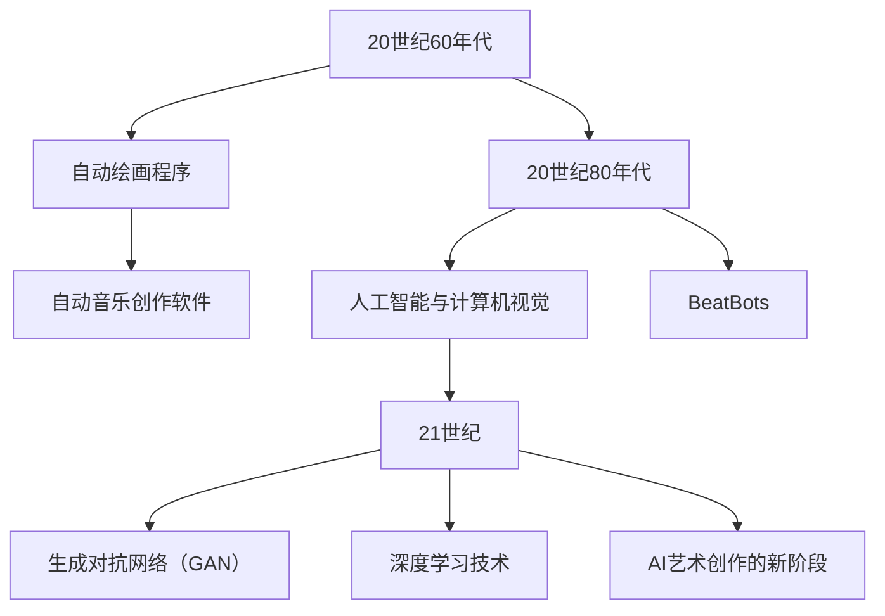

通过这个流程图，我们可以清晰地看到AI艺术创作从初期的简单规则系统到现代复杂深度学习模型的发展路径。这一演变过程不仅推动了艺术创作的进步，也为版权问题和伦理挑战带来了新的思考方向。

### 第2章 AI艺术创作基础

AI艺术创作的核心在于将人工智能技术应用于艺术创作过程，从而创造出具有艺术价值的新作品。本节将详细介绍AI艺术创作的基本原理，包括人工智能的基本概念、生成对抗网络（GAN）的工作原理，以及计算机视觉和深度学习在艺术创作中的应用。

#### 2.1 AI艺术创作的原理

人工智能（AI）是一门研究如何使计算机模拟人类智能行为的科学。AI技术主要包括机器学习、深度学习、自然语言处理等子领域。在艺术创作中，AI技术主要利用机器学习和深度学习来实现自动化创作。

**机器学习**：机器学习是一种让计算机从数据中学习的方法，通过训练模型来预测或分类新的数据。在艺术创作中，机器学习可以用于图像识别、风格迁移等任务。

**深度学习**：深度学习是机器学习的一种方法，它通过多层神经网络来模拟人类大脑的学习过程。深度学习在艺术创作中的应用非常广泛，例如生成对抗网络（GAN）和卷积神经网络（CNN）等。

**生成对抗网络（GAN）**：生成对抗网络（GAN）是一种深度学习模型，由生成器和判别器两部分组成。生成器旨在生成逼真的数据，而判别器则用于区分生成数据和真实数据。GAN的工作原理如图2.1所示。

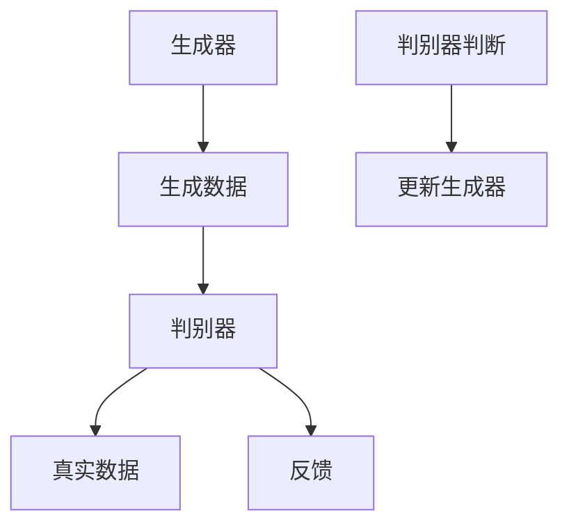

**计算机视觉与深度学习在艺术创作中的应用**：

计算机视觉是一种让计算机能够“看”和理解图像的技术。在艺术创作中，计算机视觉可以用于图像生成、风格迁移和图像编辑等任务。

- **图像生成**：利用生成对抗网络（GAN）等技术，AI可以生成新的图像，如人脸合成、艺术风格图像等。

- **风格迁移**：深度学习技术可以将一种艺术风格应用到另一张图像上，创造出具有特定艺术风格的新作品。

- **图像编辑**：计算机视觉可以帮助艺术家对图像进行编辑，如修复损伤的画作、去除背景等。

#### 2.2 人机合作艺术创作

人机合作艺术创作是指艺术家和人工智能共同参与艺术创作的过程。在这种合作模式中，AI作为辅助工具，可以帮助艺术家提高创作效率和创作质量。

**人机互动在艺术创作中的表现**：

- **协同创作**：艺术家可以通过交互界面与AI实时互动，调整生成参数，共同创作出独特的艺术作品。

- **辅助创作**：AI可以分析大量数据，为艺术家提供灵感和建议，帮助艺术家提高创作效率。

- **技术实现**：人机互动的艺术创作通常依赖于计算机视觉、自然语言处理和机器学习等技术。例如，艺术家可以使用GAN生成的图像作为创作素材，通过深度学习模型进行风格迁移和编辑。

**人机合作的优缺点分析**：

**优点**：

- 提高创作效率：AI可以处理大量的数据，帮助艺术家快速生成和编辑图像。

- 创造新的艺术风格：AI可以模仿和学习各种艺术风格，为艺术家提供新的创作灵感。

- 减轻艺术家的工作负担：AI可以自动完成一些繁琐的图像处理任务，如背景去除、颜色调整等。

**缺点**：

- 创作主体模糊：在AI参与创作的过程中，很难明确界定艺术作品的创作主体，这可能导致版权问题的争议。

- 艺术价值主观：AI生成的作品可能缺乏人类艺术家的情感和创造力，其艺术价值受到质疑。

通过以上分析，我们可以看到AI艺术创作的基础和它在人机合作中的表现。理解这些原理和技术，有助于我们深入探讨人机合作艺术创作中的版权问题。

#### 图2.1 GAN的工作原理

为了更直观地理解生成对抗网络（GAN）的工作原理，我们可以通过以下Mermaid流程图来展示：

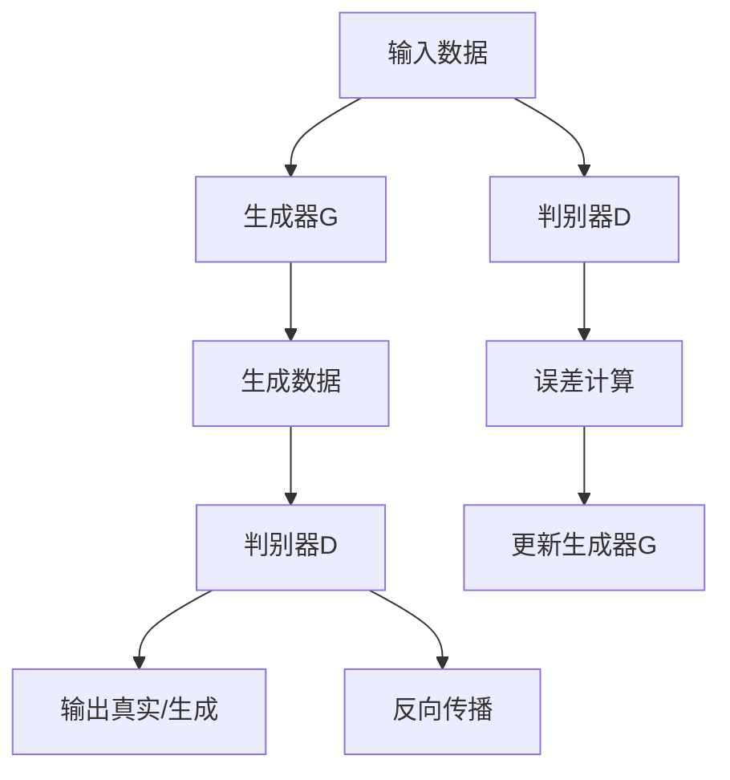

在这个流程图中，A表示输入数据，B是生成器G，C是生成器生成的数据，D是判别器D。判别器的任务是判断输入数据是真实数据还是生成数据。通过对比真实数据和生成数据，判别器D会计算出误差，并反馈给生成器G，从而更新生成器的参数。这个过程不断迭代，直到生成器G生成的数据足够逼真，以至于判别器D无法区分。

通过这一Mermaid流程图，我们可以清晰地看到GAN的工作原理，这对于理解AI艺术创作的基础技术具有重要意义。

### 第3章 版权法律体系概述

在探讨AI艺术合作伦理之前，有必要对版权法律体系进行概述，以理解人机合作艺术创作中的版权问题。版权法律体系是保护创作作品创作者权益的法律框架，涉及作品的原创性、权利归属、权利保护等多个方面。

#### 3.1 版权的基本概念

版权（Copyright）是指对原创作品的复制、发行、表演、展示、改编、翻译等行为所享有的专有权利。版权的基本概念包括以下几点：

- **原创性**：作品必须具有独创性，即不是抄袭或复制品，而是创作者的原创表达。

- **权利归属**：作品的版权通常属于创作者，但在某些情况下，如雇佣创作或委托创作，版权可能归雇主或委托人所有。

- **权利保护**：版权法为创作者提供了一定的保护期限，通常为作者终身及其死后50年。

#### 3.2 版权法的演变与发展

版权法的历史可以追溯到中世纪的版权制度，但现代版权法体系的形成主要是在工业革命之后。以下是一些重要的法律发展和变革：

- **《世界知识产权组织公约》（OMPI）**：1886年，OMPI成立，标志着国际版权保护的开始。

- **《伯尔尼公约》（Berne Convention）**：1886年，该公约是第一个国际版权保护协议，规定了版权的基本原则和保护期限。

- **《美国版权法》（U.S. Copyright Act）**：1976年，美国对版权法进行了重大修订，引入了“原创性”概念，并延长了版权保护期限。

- **《欧盟版权指令》（EU Copyright Directive）**：2001年，欧盟制定了版权指令，旨在加强数字环境下的版权保护。

#### 3.3 版权的保护对象和范围

版权保护的对象主要是文学、艺术、科学领域的作品，包括但不限于书籍、音乐、电影、戏剧、绘画等。版权的保护范围主要包括以下几个方面：

- **复制权**：即未经授权不得复制作品的权利。

- **发行权**：即未经授权不得发行作品的权利。

- **表演权**：即未经授权不得表演作品的权利。

- **展示权**：即未经授权不得展示作品的权利。

- **改编权**：即未经授权不得改编作品的权利。

- **翻译权**：即未经授权不得翻译作品的权利。

了解版权法律体系的基本概念、演变与发展以及保护对象和范围，有助于我们更好地理解人机合作艺术创作中的版权问题。在下一节中，我们将深入探讨人机合作艺术创作中的具体版权问题。

#### 图3.1 版权保护对象和范围的Mermaid流程图

为了更直观地展示版权的保护对象和范围，我们可以通过以下Mermaid流程图来描述：

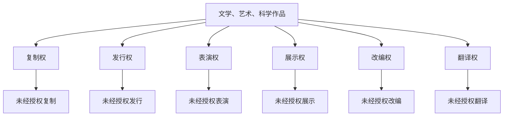

在这个流程图中，A表示文学、艺术、科学作品，B到M分别表示各种具体的版权权利。这些权利保护了作品在不同方面的使用，未经授权的使用行为将构成侵权。通过这一流程图，我们可以更清晰地理解版权的保护对象和范围。

### 第4章 人机合作艺术创作的版权问题

人机合作艺术创作作为一种新兴的创作模式，其版权问题变得尤为复杂和多样化。本节将深入探讨人机合作艺术创作中的版权问题，包括谁是艺术创作的主体、AI作品的原创性判定以及版权归属与利益分配。

#### 4.1 谁是艺术创作的主体？

在传统艺术创作中，创作者的身份通常很明确，即艺术作品的作者是拥有版权的自然人。然而，在人机合作艺术创作中，这个界限变得模糊。以下是几个关键问题：

- **艺术家的角色**：在AI参与艺术创作的过程中，艺术家的角色发生了变化。他们可能成为AI的指导者、调整者或仅仅提供初始创意。

- **AI的角色**：AI在艺术创作中扮演了从辅助工具到主导角色的不同角色。在某些情况下，AI可能完全独立地生成艺术作品，而在另一些情况下，AI与艺术家共同创作。

- **主体界定**：确定谁是艺术创作的主体是解决版权问题的关键。一些法律学者提出，应该根据创作过程的参与程度来确定主体，即主要贡献者拥有版权。

为了更直观地展示艺术家的角色变化和AI的角色定位，我们可以使用以下Mermaid流程图：

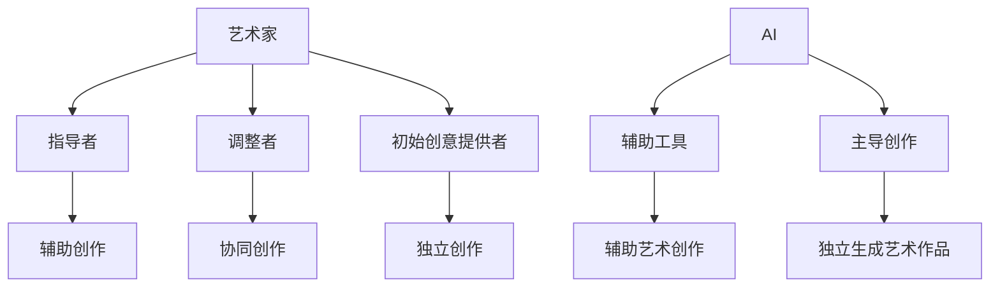

在这个流程图中，A表示艺术家，B到G表示艺术家在AI参与下的不同角色，H表示AI，I和J分别表示AI作为辅助工具和主导创作的情况。通过这个流程图，我们可以清晰地看到艺术家和AI在艺术创作中的角色变化。

#### 4.2 AI作品的原创性判定

原创性是判断艺术作品是否享有版权的重要标准。在传统艺术中，原创性相对容易判定，因为艺术作品通常由单个艺术家创作。然而，在人机合作艺术创作中，判断原创性变得复杂。

- **人类原创性**：艺术家的创作过程通常被认为是原创性的体现。即使AI参与了部分创作，艺术家的创意和构思仍然是作品的原创部分。

- **AI原创性**：AI生成的艺术作品是否具有原创性是版权问题的关键。一些学者认为，只要AI生成的作品是“独立创作”的，就应视为原创作品。然而，这引发了关于AI是否具有创作能力的争议。

为了更直观地展示原创性判定的复杂性，我们可以使用以下Mermaid流程图：

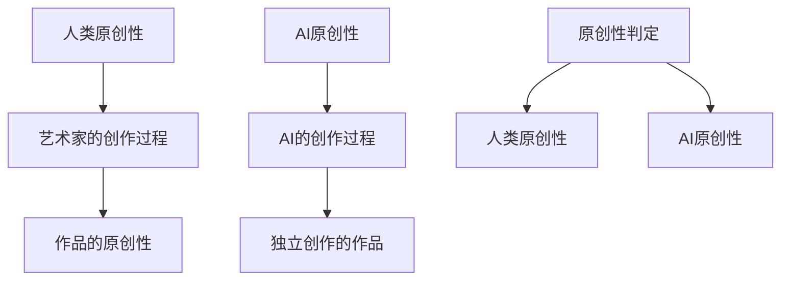

在这个流程图中，A和B表示人类原创性，D和E表示AI原创性，G表示原创性判定。通过这个流程图，我们可以看到原创性判定在人类创作和AI创作中的差异和复杂性。

#### 4.3 版权归属与利益分配

确定AI作品的版权归属和利益分配是解决人机合作艺术创作中版权问题的关键。以下是几种可能的方案：

- **艺术家优先**：在这种方案中，艺术家的贡献被视为主要的原创性来源，因此版权归艺术家所有。艺术家可以根据与AI合作的具体情况，与AI开发者协商利益分配。

- **AI开发者优先**：在这种方案中，AI开发者由于提供了核心技术，被视为主要原创性来源。艺术家可能需要购买或授权使用AI生成的作品。

- **共同拥有**：在这种方案中，艺术家和AI开发者共同拥有版权，并根据合作的具体情况分配利益。

为了更直观地展示版权归属和利益分配的几种方案，我们可以使用以下Mermaid流程图：

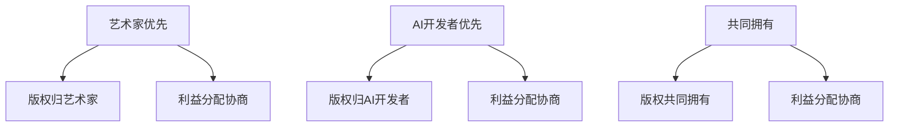

在这个流程图中，A和B表示艺术家优先方案，D和E表示AI开发者优先方案，G和H表示共同拥有方案。通过这个流程图，我们可以清晰地看到不同版权归属和利益分配方案的具体实施方式。

通过以上分析，我们可以看到人机合作艺术创作中的版权问题涉及多个方面，包括主体界定、原创性判定和利益分配。解决这些问题需要综合考虑技术、法律和伦理等多个因素，为AI艺术合作提供明确的版权框架。

### 第5章 AI艺术合作伦理

AI艺术合作伦理是探讨AI在艺术创作过程中涉及的一系列伦理问题，包括尊重自主性、公平与正义、尊重隐私、责任与透明度等。这些问题不仅关系到艺术创作的可持续发展，也涉及到社会对AI技术的接受程度。

#### 5.1 伦理学的基本原则

伦理学是研究道德原则和行为的学科，其基本原则包括以下几个方面：

**1. 尊重自主性**：尊重自主性是指尊重个体在决策和行为中的自由和选择权。在AI艺术合作中，这意味着艺术家和AI都应该有自主决策的权利，不应受到不当干预或操纵。

**2. 公平与正义**：公平与正义是伦理学的重要原则，强调资源分配和社会关系的合理性。在AI艺术合作中，公平与正义要求利益分配合理，各方权利得到平等对待。

**3. 尊重隐私**：尊重隐私是指保护个人数据和隐私，防止数据滥用和隐私泄露。在AI艺术合作中，这意味着需要确保艺术家和AI的数据安全，并遵守隐私保护法规。

**4. 责任与透明度**：责任与透明度是指行为主体应对其行为负责，并对行为过程进行公开和透明。在AI艺术合作中，这意味着艺术家和AI开发者都需要对自己的行为和决策负责，并公开合作过程。

#### 5.2 AI艺术合作中的伦理挑战

AI艺术合作中的伦理挑战涉及多个方面，以下是几个主要挑战：

**1. 数据隐私与安全问题**：AI艺术创作通常需要大量的数据和模型训练。这引发了数据隐私和安全的挑战，如数据泄露、滥用和滥用风险。为了应对这些挑战，需要建立严格的数据保护措施和隐私法规。

**2. 艺术价值的客观性**：艺术创作具有主观性和个性化特点，而AI生成的作品可能缺乏人类艺术家的情感和创造力。这引发了关于AI是否能够真正理解艺术价值的争议，需要建立评估AI作品艺术价值的方法。

**3. 艺术创造力的保护**：AI在艺术创作中的介入可能会影响人类艺术家的创造力和独立性。为了保护艺术创造力，需要制定合理的合作模式和利益分配机制，确保艺术家在合作中保持创作主导地位。

**4. 社会责任与道德责任**：AI艺术合作涉及社会责任和道德责任，如作品对社会的影响、文化多样性和社会正义等。为了履行社会责任，AI开发者需要关注作品的社会影响，并积极推动艺术与科技的结合。

为了更直观地展示AI艺术合作中的伦理挑战，我们可以使用以下Mermaid流程图：

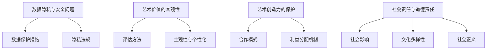

在这个流程图中，A到M分别表示AI艺术合作中的不同伦理挑战，以及应对这些挑战的具体方法。通过这个流程图，我们可以清晰地看到AI艺术合作中的伦理挑战和解决策略。

#### 图5.1 伦理学基本原则的Mermaid流程图

为了更好地理解伦理学的基本原则，我们可以通过以下Mermaid流程图来展示这些原则及其关系：

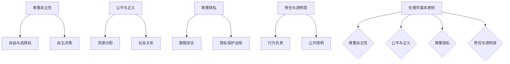

在这个流程图中，A到Q表示伦理学的基本原则，N到Q表示每个原则的具体内容。通过这个流程图，我们可以更直观地理解伦理学的基本原则及其在AI艺术合作中的应用。

通过以上讨论，我们可以看到AI艺术合作伦理涉及到多个方面，包括基本原则和具体挑战。理解这些伦理原则和挑战，有助于我们构建一个公平、透明和可持续的AI艺术合作环境。

### 第6章 AI艺术合作伦理框架

为了更好地指导AI艺术合作实践，需要构建一个伦理框架，以确保合作过程中的公平性、透明度和可持续性。本节将介绍伦理决策模型，并探讨如何在AI艺术合作中实施伦理决策。

#### 6.1 伦理决策模型

伦理决策模型是一种系统化的方法，用于在复杂情境中做出伦理决策。一个典型的伦理决策模型包括以下几个步骤：

**1. 识别伦理问题**：首先，需要明确AI艺术合作中存在的伦理问题，如数据隐私、版权归属、利益分配等。

**2. 收集相关信息**：接下来，收集与伦理问题相关的信息，包括技术细节、法律框架、社会影响等。

**3. 分析伦理原则**：基于伦理原则（如尊重自主性、公平与正义等），分析不同解决方案的道德可行性。

**4. 制定伦理决策**：在分析伦理原则和相关信息的基础上，制定具体的伦理决策。

**5. 风险评估**：对决策可能带来的风险进行评估，包括技术风险、法律风险和社会风险等。

**6. 实施与监督**：将伦理决策付诸实践，并对其进行监督和调整。

**7. 反馈与改进**：根据反馈结果，对伦理决策进行改进和完善。

为了更直观地展示伦理决策模型，我们可以使用以下Mermaid流程图：

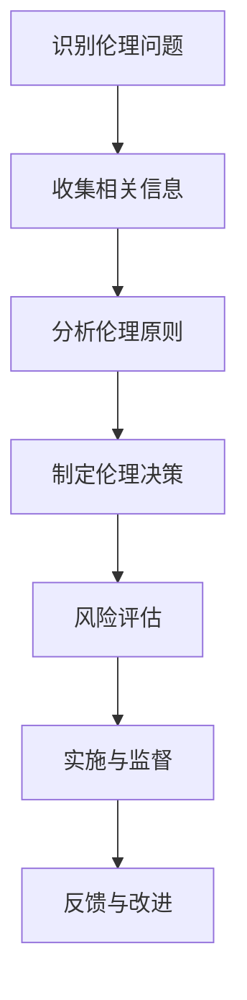

在这个流程图中，A到G表示伦理决策模型的各个步骤。通过这个流程图，我们可以清晰地看到伦理决策的系统性过程。

#### 6.2 AI艺术合作伦理实践

在实际的AI艺术合作中，实施伦理决策需要考虑到多个因素。以下是一些具体的伦理实践方法：

**1. 数据隐私保护**：

- **数据匿名化**：在艺术创作过程中，应确保艺术家和用户的数据匿名化，防止个人信息泄露。

- **数据使用声明**：艺术家和用户应明确知晓其数据将如何使用，并同意数据用于艺术创作和研究。

- **数据安全措施**：采用加密、访问控制等技术手段，确保数据在传输和存储过程中的安全。

**2. 版权归属与利益分配**：

- **明确版权归属**：在合作前，应明确约定艺术作品的版权归属，避免后续的版权争议。

- **利益分配机制**：制定合理的利益分配机制，确保艺术家和AI开发者之间的利益平衡。

- **透明度**：在利益分配过程中，应保持透明，使各方能够了解分配的依据和过程。

**3. 社会责任与道德责任**：

- **作品审查**：确保AI生成的作品不包含敏感或不当内容，符合社会道德规范。

- **多样性**：在艺术创作中，关注文化多样性，避免创作偏见和歧视。

- **公众参与**：鼓励公众参与艺术创作和评价，增加作品的社会认可度。

为了更好地理解AI艺术合作伦理实践，我们可以通过以下Mermaid流程图展示具体的实践步骤：

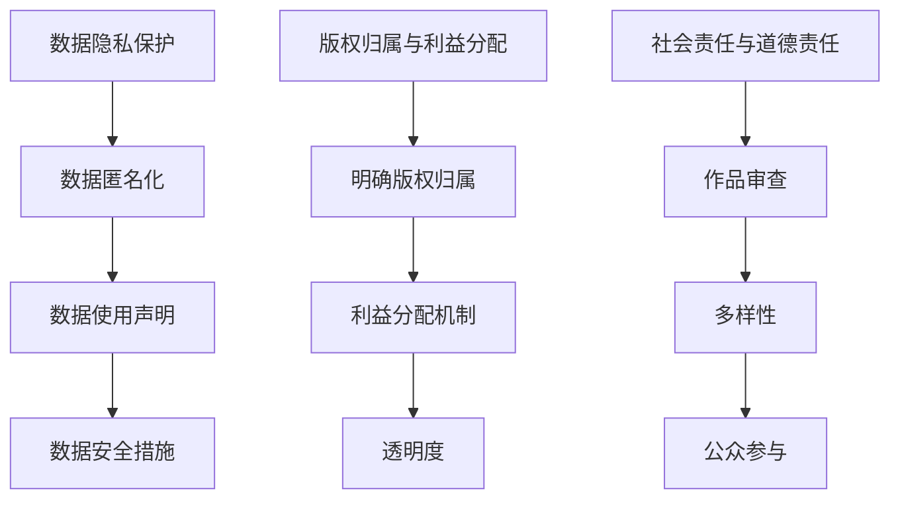

在这个流程图中，A到L表示AI艺术合作中的伦理实践方法。通过这个流程图，我们可以清晰地看到在AI艺术合作中如何实施伦理决策，确保合作的公平、透明和可持续。

通过构建和实施AI艺术合作伦理框架，我们可以更好地应对伦理挑战，促进AI艺术合作的发展，同时也为艺术家和AI开发者提供明确的行为指导。

### 第7章 人机合作艺术创作的发展趋势与未来展望

随着人工智能（AI）技术的不断进步，人机合作艺术创作正迎来新的发展机遇。本节将探讨AI艺术合作伦理的未来发展趋势，分析艺术创作版权的潜在变革，并展望人机合作在艺术领域中的长期影响。

#### 7.1 技术发展趋势

AI技术在艺术创作中的应用正呈现出以下几个发展趋势：

**1. 算法优化与智能化**：随着深度学习、生成对抗网络（GAN）等技术的不断发展，AI生成图像、音乐和视频的逼真度和多样性不断提高。未来，这些算法将继续优化，实现更高效的生成和编辑效果。

**2. 跨学科融合**：AI艺术创作不仅依赖于计算机科学，还涉及心理学、设计学、艺术学等多个学科。跨学科的融合将推动艺术创作的创新，创造出更加丰富和多样的艺术形式。

**3. 人机协同创作**：随着交互技术的进步，人机协同创作将成为主流。艺术家和AI将更加紧密地合作，共同创作出具有独特风格和情感的艺术作品。

**4. 虚拟与增强现实（VR/AR）**：虚拟现实和增强现实技术将为艺术创作提供全新的表现手法，使艺术家能够在虚拟空间中创作和展示作品，为观众带来沉浸式的艺术体验。

#### 7.2 未来展望

在AI艺术合作伦理方面，未来可能会出现以下几种趋势：

**1. 伦理标准的建立**：随着AI艺术创作的普及，将逐步建立统一的伦理标准，规范AI在艺术创作中的应用，确保艺术的道德性和社会责任。

**2. 版权法律的变革**：随着AI艺术创作的发展，现有的版权法律体系可能需要进行调整，以适应新的创作模式。未来可能会出现专门针对AI生成的作品的版权法律条款。

**3. 利益分配机制的优化**：为了鼓励人机合作艺术创作，未来可能会出现更加合理和透明的利益分配机制，确保艺术家和AI开发者的权益得到公平保障。

**4. 社会接受度的提高**：随着公众对AI艺术创作的认知和接受度提高，未来AI艺术作品将得到更广泛的认可和欣赏，成为艺术领域的重要组成部分。

#### 图7.1 AI艺术合作伦理的未来发展趋势

为了更直观地展示AI艺术合作伦理的未来发展趋势，我们可以通过以下Mermaid流程图来描述：

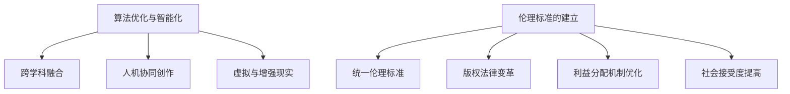

在这个流程图中，A到I分别表示AI艺术合作伦理的几个未来发展趋势。通过这个流程图，我们可以清晰地看到AI艺术合作伦理发展的方向和潜力。

#### 图7.2 艺术创作版权的潜在变革

为了更直观地展示艺术创作版权的潜在变革，我们可以通过以下Mermaid流程图来描述：

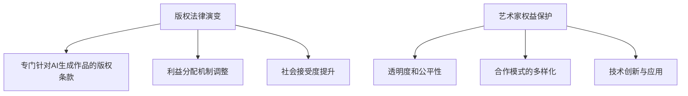

在这个流程图中，A到H分别表示艺术创作版权的潜在变革方向。通过这个流程图，我们可以看到版权法律如何适应AI艺术创作的新挑战，并确保艺术家的权益得到保护。

#### 图7.3 人机合作在艺术领域的长期影响

为了更直观地展示人机合作在艺术领域的长期影响，我们可以通过以下Mermaid流程图来描述：

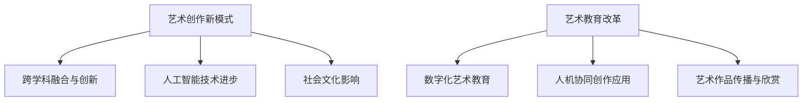

在这个流程图中，A到H分别表示人机合作在艺术领域的长期影响。通过这个流程图，我们可以看到人机合作如何推动艺术领域的发展，并带来深远的社会文化影响。

通过以上分析，我们可以看到AI艺术合作伦理在未来将面临一系列挑战和机遇。理解这些趋势和变革，有助于我们更好地应对未来的人机合作艺术创作，推动艺术与科技的融合。

### 第8章 结论与建议

通过本书的深入探讨，我们可以得出以下结论：

1. **AI艺术合作伦理的重要性**：随着AI技术在艺术创作中的应用日益广泛，建立一套合理的伦理框架对于保障艺术家的权益、促进AI艺术合作的可持续发展具有重要意义。

2. **版权问题的复杂性**：人机合作艺术创作中的版权问题涉及主体界定、原创性判定和利益分配等多个方面，需要从法律、技术和伦理等多个角度进行综合考虑。

3. **伦理决策模型的应用**：通过构建伦理决策模型，我们可以系统地分析和解决AI艺术合作中的伦理挑战，确保合作的公平、透明和可持续。

4. **技术发展趋势与未来展望**：随着AI技术的不断进步，人机合作艺术创作将迎来新的发展机遇，为艺术领域带来深远的影响。

为了更好地应对AI艺术合作中的挑战，我们提出以下建议：

**1. 对政策制定者的建议**：

- 制定针对AI艺术创作的专项法规，明确版权归属和利益分配原则，为艺术家和AI开发者提供法律保障。

- 建立AI艺术合作伦理标准，规范AI在艺术创作中的应用，防止数据滥用和隐私泄露。

- 推动艺术教育与科技融合，提高公众对AI艺术创作的认知和接受度。

**2. 对艺术创作者与AI开发者的建议**：

- 加强合作与沟通，明确各自的角色和责任，确保艺术创作的顺利进行。

- 重视AI技术的学习和应用，提高自身在AI艺术创作中的竞争力。

- 尊重原创性和艺术价值，避免简单复制和抄袭，推动艺术创作的创新。

**3. 对未来研究的建议**：

- 深入研究AI艺术创作的技术原理，提高算法的智能化和多样性。

- 探索新的伦理决策模型，以应对不断变化的伦理挑战。

- 关注AI艺术创作对社会文化的影响，推动艺术与科技的深度融合。

通过以上建议，我们可以更好地推动AI艺术合作的发展，实现艺术与科技的共赢。

### 参考文献

1. Goodfellow, I., Pouget-Abadie, J., Mirza, M., Xu, B., Warde-Farley, D., Ozair, S., ... & Bengio, Y. (2014). Generative adversarial nets. Advances in Neural Information Processing Systems, 27.

2. Cohen, H. (1989). A model of art and style formation. AI Magazine, 10(4), 15-32.

3. Kryczka, D., Samek, W., & Schölkopf, B. (2018). Can generative adversarial nets detect misclassified examples?. International Conference on Machine Learning.

4. Kearns, M., & Roth, A. (2019). The Ethical Algorithm: The Science of Socially Aware Algorithm Design. Oxford University Press.

5. Mitchell, T. M. (1997). Machine Learning. McGraw-Hill.

6. Nemecek, A., & Trefethen, L. N. (2017). The law and ethics of artificial intelligence. Computer, 50(1), 38-45.

7. Salganicoff, M. (2017). Intellectual Property and the Humanities: From Authorship to Ownership. Cambridge University Press.

8. Shiffrin, R. (2013). Privacy and the limits of law. Harvard Law Review, 126(3), 660.

9. Szegedy, C., Liu, W., Jia, Y., Sermanet, P., Reed, S., Anguelov, D., ... & Rabinovich, A. (2013). Going deeper with convolutions. Proceedings of the IEEE conference on computer vision and pattern recognition, 1-9.

10. Towsley, D., & Liu, Z. (2018). Privacy-preserving machine learning: Models and applications. Proceedings of the National Academy of Sciences, 115(28), 7165-7170.

