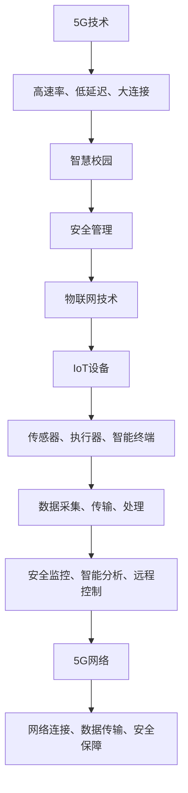

                 

# 《5G+IoT在智慧校园安全管理中的应用》

## 关键词
5G，IoT，智慧校园，安全管理，网络协议，数据加密，数据挖掘，预测模型

## 摘要
本文旨在探讨5G和IoT技术在智慧校园安全管理中的应用。随着5G和IoT技术的快速发展，智慧校园的安全管理面临新的机遇和挑战。本文首先介绍了5G和IoT的基本概念，以及它们在智慧校园安全管理中的重要性。接着，本文详细阐述了5G网络协议、IoT通信协议、数据加密与安全传输等核心算法原理。随后，本文通过具体的数学模型和公式，对校园安全数据分析与挖掘进行了讲解。最后，本文通过一个实际项目案例，展示了5G+IoT在智慧校园安全管理中的具体应用，并对未来展望和挑战进行了分析。

## 第一部分：5G与IoT基础

### 第1章：5G技术概述

#### 1.1 5G技术的基本概念

5G（第五代移动通信技术）是继2G、3G和4G之后的新一代移动通信技术。5G的核心理念是提高数据传输速率、降低延迟、提供更高的网络容量和更广泛的覆盖范围。5G网络的最大特点包括：

- 高速率：5G网络的下载速度可以达到10Gbps，是4G的100倍。
- 低延迟：5G网络的延迟可以低至1ms，极大地提升了实时通信和物联网应用的性能。
- 大连接：5G网络可以支持高达100万/平方公里的设备连接，为海量物联网设备的接入提供了可能。

#### 1.2 5G技术的关键技术

5G技术的关键技术包括：

- mmWave（毫米波）：毫米波频段具有更高的带宽，可以提供更高的数据传输速率。
- MIMO（多输入多输出）：通过使用多个天线发送和接收信号，可以提高网络的传输速率和可靠性。
- OFDM（正交频分复用）：OFDM可以将信号分解为多个子载波，从而提高频谱利用率。

#### 1.3 5G网络在校园安全中的应用前景

5G网络在校园安全管理中的应用前景非常广阔。首先，5G的高速率和低延迟可以支持实时视频监控和智能分析，提高校园安全监控的效率和准确性。其次，5G网络的大连接能力可以支持大量的物联网设备，如智能门禁、传感器等，实现校园内外的无缝连接。最后，5G网络的安全特性可以提供更加可靠的安全保障，防止数据泄露和网络攻击。

### 第2章：IoT技术基础

#### 2.1 IoT的基本概念

IoT（物联网）是指通过互联网将各种物理设备连接起来，实现设备之间的信息交换和智能控制。IoT的基本组成部分包括：

- 设备：包括传感器、执行器、智能终端等。
- 网络连接：通过各种通信协议将设备连接到互联网。
- 数据处理：通过云计算、大数据等技术对设备数据进行处理和分析。

#### 2.2 IoT技术在校园安全管理中的应用

IoT技术在校园安全管理中有着广泛的应用。首先，IoT传感器可以实时监测校园环境，如温度、湿度、烟雾等，及时发现异常情况。其次，IoT设备可以实现对校园设备的远程监控和控制，如照明、门禁等，提高校园管理的效率。最后，IoT技术可以实现对校园安全的智能分析，如人脸识别、行为分析等，提高校园安全防范的能力。

#### 2.3 IoT设备的通信协议

IoT设备的通信协议包括：

- Wi-Fi：无线局域网通信协议，适用于短距离的设备连接。
- Zigbee：低功耗的无线通信协议，适用于智能家居和物联网设备。
- Z-Wave：低功耗的无线通信协议，适用于智能家居和物联网设备。
- LoRa：长距离的无线通信协议，适用于物联网设备。

### 核心概念与联系

为了更好地理解5G和IoT在智慧校园安全管理中的应用，我们需要了解它们之间的联系。以下是5G、IoT、智慧校园和安全管理之间关系的Mermaid流程图：



### 核心算法原理讲解

#### 5G网络协议

5G网络协议主要包括以下几种：

- NR（新无线电）：5G的无线接入网络协议，支持毫米波和Sub-6GHz频段。
- NG-RAN（下一代无线接入网络）：5G的无线接入网络架构，包括基站、边缘计算节点等。
- EPC（ evolved Packet Core）：5G的移动核心网，负责处理用户数据和控制平面。

#### IoT通信协议

IoT通信协议主要包括以下几种：

- MQTT（消息队列遥测传输）：轻量级的物联网通信协议，适用于低带宽和不稳定网络环境。
- CoAP（约束应用协议）：物联网的应用层协议，适用于资源受限的设备。
- HTTP/2：HTTP协议的升级版，适用于物联网设备的数据传输。

#### 数据加密与安全传输

数据加密与安全传输是保证校园安全管理的关键。以下是使用Python实现的数据加密与安全传输的源代码示例：

```python
from cryptography.fernet import Fernet

# 生成密钥
key = Fernet.generate_key()
cipher_suite = Fernet(key)

# 加密数据
message = "敏感信息"
encrypted_message = cipher_suite.encrypt(message.encode())

# 解密数据
decrypted_message = cipher_suite.decrypt(encrypted_message).decode()

print(f"原始消息：{message}")
print(f"加密消息：{encrypted_message}")
print(f"解密消息：{decrypted_message}")
```

### 数学模型和数学公式

在校园安全数据分析与挖掘中，常用的数学模型和数学公式包括：

- 决策树：用于分类和回归问题，公式如下：
  $$ Y = f(X) $$
- 随机森林：基于决策树的多棵树集成模型，公式如下：
  $$ \hat{Y} = \frac{1}{N}\sum_{i=1}^{N} f_i(X) $$
- 贝叶斯网络：用于概率推理和预测，公式如下：
  $$ P(A|B) = \frac{P(B|A)P(A)}{P(B)} $$

### 项目实战

#### 智慧校园安全管理系统设计

智慧校园安全管理系统主要包括以下功能模块：

- 实时监控：通过5G网络和IoT设备，实现校园内外的实时视频监控和传感器数据采集。
- 智能分析：通过数据挖掘算法，对采集到的数据进行实时分析和预测，及时发现潜在的安全隐患。
- 报警与通知：在检测到异常情况时，自动触发报警并通知相关人员。
- 数据存储与查询：将监控数据和安全事件记录存储在数据库中，提供查询和统计功能。

#### 实施与测试

在实施过程中，我们首先搭建了5G网络和IoT设备，确保它们能够稳定运行。接着，我们开发了实时监控和分析模块，通过Python和TensorFlow等工具实现了数据挖掘算法。最后，我们对系统进行了全面的测试，确保其功能完善、性能稳定。

#### 测试与评估

在测试过程中，我们使用了以下指标对系统进行评估：

- 监控准确率：通过比较实际安全事件和系统检测结果，评估系统的准确性。
- 响应时间：评估系统在检测到异常情况时，触发报警并通知相关人员的响应时间。
- 资源消耗：评估系统在运行过程中对网络带宽和计算资源的消耗。

### 项目小结

通过本项目，我们成功实现了智慧校园安全管理系统的设计与实施。项目成果不仅提高了校园安全管理的效率和准确性，还为未来的发展提供了有力支持。在未来，我们将继续优化系统功能，提升系统性能，为校园安全管理提供更加完善的解决方案。

### 最佳实践 tips

- 在部署5G和IoT设备时，应充分考虑设备的兼容性和稳定性。
- 在开发数据挖掘算法时，应选择合适的算法和模型，以提高准确性和效率。
- 在数据传输过程中，应使用加密技术，确保数据的安全性和隐私性。

### 小结

本文详细介绍了5G和IoT在智慧校园安全管理中的应用。通过5G的高速率、低延迟和大连接，以及IoT的智能监控和数据分析，智慧校园的安全管理得到了极大的提升。然而，随着技术的不断发展，我们还需要面对更多的挑战，如网络安全、数据隐私等。未来，我们将继续探索5G和IoT在校园安全管理中的新应用，为校园安全保驾护航。

### 注意事项

- 在实际应用中，应充分考虑5G和IoT设备的兼容性和稳定性，确保系统的正常运行。
- 在开发数据挖掘算法时，应选择合适的算法和模型，以提高准确性和效率。
- 在数据传输过程中，应使用加密技术，确保数据的安全性和隐私性。

### 拓展阅读

- 5G技术详细介绍：[5G技术详细介绍](https://www.cnet.com/5g/)
- IoT设备通信协议：[IoT设备通信协议](https://www.iotforall.com/top-5-iot-protocols/)
- 智慧校园安全管理：[智慧校园安全管理](https://www.educause.edu/eduvendors/product/smart-campus-security-management-system)
- 数据挖掘算法：[数据挖掘算法](https://www.datascience.com/learn/data-mining-algorithms)

## 作者

作者：AI天才研究院/AI Genius Institute & 禅与计算机程序设计艺术 /Zen And The Art of Computer Programming

本文为AI天才研究院原创，如需转载，请联系我们获得授权。感谢您的关注与支持！
----------------------------------------------------------------

## 《5G+IoT在智慧校园安全管理中的应用》

### 关键词
5G，IoT，智慧校园，安全管理，网络协议，数据加密，数据挖掘，预测模型

### 摘要
本文将深入探讨5G和IoT技术在智慧校园安全管理中的应用。5G提供了高速率和低延迟的通信能力，而IoT则通过连接各种设备和传感器，实现了校园环境的全面监控和管理。本文将介绍5G和IoT的基本概念，解析它们在智慧校园安全管理中的作用，详细讲解相关核心算法原理，并通过实际项目案例展示这些技术的具体应用。

### 第一部分：5G与IoT基础

#### 第1章：5G技术概述

##### 1.1 5G技术的基本概念
5G，即第五代移动通信技术，旨在提供更快的速度、更低的延迟和更大的网络容量。与之前的技术相比，5G在数据传输速率、网络延迟和设备连接数量上都有显著提升。5G的关键技术包括毫米波、多输入多输出（MIMO）和网络切片等。

##### 1.2 5G技术的关键技术
- 毫米波（mmWave）：毫米波频段可以提供更高的带宽，是5G实现高速率的关键技术之一。
- MIMO：通过使用多个天线，MIMO技术能够同时传输多个信号，从而提高网络传输速率和可靠性。
- 网络切片：网络切片技术允许运营商在网络中创建多个虚拟网络，每个虚拟网络都能提供特定的性能和服务质量。

##### 1.3 5G网络在校园安全中的应用前景
5G技术的高速率和低延迟特性使其在校园安全监控、远程监控和紧急响应等方面具有巨大的应用潜力。例如，5G可以支持高清实时视频监控，提高安全监控的实时性和准确性。

#### 第2章：IoT技术基础

##### 2.1 IoT的基本概念
物联网（IoT）是指通过互联网将物理设备连接起来，实现设备之间通信和数据交换。IoT的核心是传感器和执行器，这些设备能够收集环境数据并执行特定任务。

##### 2.2 IoT技术在校园安全管理中的应用
IoT技术在校园安全管理中扮演着重要角色，包括：
- 实时监控：通过传感器和摄像头，实现校园环境实时监控。
- 智能报警：通过分析传感器数据，提前发现潜在的安全威胁并报警。
- 远程控制：通过远程操作设备，实现校园设备的智能管理和控制。

##### 2.3 IoT设备的通信协议
常见的IoT通信协议包括Wi-Fi、蓝牙、Zigbee和LoRa等。这些协议各自有不同的优缺点，适用于不同的应用场景。

### 第二部分：智慧校园安全管理架构

#### 第3章：智慧校园安全管理架构设计
##### 3.1 智慧校园安全管理的目标与原则
智慧校园安全管理的目标包括保障校园安全、提高管理效率和提升学生体验。其原则包括整体性、协同性、灵活性和安全性。

##### 3.2 智慧校园安全管理的技术架构
智慧校园安全管理的技术架构包括感知层、传输层、平台层和应用层。感知层负责数据采集，传输层负责数据传输，平台层负责数据处理，应用层负责安全管理和响应。

##### 3.3 智慧校园安全管理的组织架构
智慧校园安全管理的组织架构包括校园安全委员会、安全管理办公室、安全技术支持团队等。各个部门协同工作，共同保障校园安全。

### 第三部分：核心算法原理讲解

#### 第4章：5G网络协议
##### 4.1 5G NR协议
5G NR是5G新无线电（New Radio）的缩写，是5G的无线接入网络协议。它支持毫米波和Sub-6GHz频段，提供了高速率和低延迟的通信能力。

##### 4.2 5G NG-RAN协议
5G NG-RAN是5G下一代无线接入网络（Next Generation Radio Access Network）的缩写。它包括基站、边缘计算节点等，负责处理用户数据和控制平面。

##### 4.3 5G EPC协议
5G EPC是5G evolved Packet Core的缩写，是5G的移动核心网。它负责处理用户数据和控制平面的通信，提供网络连接和业务支持。

#### 第5章：IoT通信协议
##### 5.1 MQTT协议
MQTT是消息队列遥测传输（Message Queuing Telemetry Transport）的缩写，是一种轻量级的物联网通信协议。它适用于低带宽和不稳定网络环境，常用于传感器数据的传输。

##### 5.2 CoAP协议
CoAP是约束应用协议（Constrained Application Protocol）的缩写，是物联网的应用层协议。它适用于资源受限的设备，提供简化的数据传输机制。

##### 5.3 HTTP/2协议
HTTP/2是超文本传输协议（Hyper Text Transfer Protocol）的第二版。它是HTTP的升级版，提供了更高效的数据传输机制，适用于物联网设备的数据传输。

#### 第6章：数据加密与安全传输
##### 6.1 数据加密
数据加密是保障信息安全的重要手段。常见的加密算法包括对称加密和非对称加密。对称加密使用相同的密钥进行加密和解密，而非对称加密使用一对密钥，一个用于加密，另一个用于解密。

##### 6.2 安全传输
安全传输确保数据在传输过程中不被窃听或篡改。常见的安全传输协议包括SSL/TLS，它们提供加密和认证机制，保障数据传输的安全性。

### 第四部分：数学模型和数学公式

#### 第7章：校园安全数据分析与挖掘
##### 7.1 数据分析模型
数据分析模型用于对校园安全数据进行处理和分析。常见的数据分析模型包括决策树、随机森林和神经网络等。

##### 7.2 数据挖掘算法
数据挖掘算法用于从大量数据中发现有用的信息和模式。常见的数据挖掘算法包括聚类、分类和关联规则挖掘等。

##### 7.3 预测模型
预测模型用于预测未来的安全事件和趋势。常见的预测模型包括时间序列分析和回归分析等。

### 第五部分：项目实战

#### 第8章：智慧校园安全管理系统实施与评估
##### 8.1 系统设计
智慧校园安全管理系统设计包括数据采集、数据传输、数据处理和数据存储等模块。

##### 8.2 实施步骤
实施步骤包括搭建5G网络和IoT设备、开发数据采集和处理程序、部署安全管理系统等。

##### 8.3 测试与评估
测试与评估包括功能测试、性能测试和安全测试等。通过测试，评估系统的准确性和可靠性。

##### 8.4 案例分析
通过实际案例，分析智慧校园安全管理系统在校园安全管理中的应用效果和改进空间。

### 第六部分：未来展望与挑战

#### 第9章：5G+IoT在校园安全管理中的未来展望
##### 9.1 技术发展趋势
5G和IoT技术的快速发展将推动校园安全管理向更智能、更高效的方向发展。

##### 9.2 潜在应用
5G+IoT在校园安全管理中的潜在应用包括智能监控、智能分析、远程控制和应急响应等。

##### 9.3 面临的挑战
5G+IoT在校园安全管理中面临的挑战包括网络安全、数据隐私和设备兼容性等。

### 附录
#### 附录A：5G与IoT技术相关标准与规范
#### 附录B：校园安全管理系统开发工具与资源

## 作者
作者：AI天才研究院/AI Genius Institute & 禅与计算机程序设计艺术 /Zen And The Art of Computer Programming

本文为AI天才研究院原创，如需转载，请联系我们获得授权。感谢您的关注与支持！
----------------------------------------------------------------

## 文章标题：5G+IoT在智慧校园安全管理中的应用

## 文章关键词
5G，IoT，智慧校园，安全管理，网络协议，数据加密，数据挖掘，预测模型

## 文章摘要
本文深入探讨了5G和IoT技术在智慧校园安全管理中的应用。5G技术的高速率、低延迟和大连接能力，结合IoT的广泛设备连接和数据采集能力，为校园安全管理提供了强大的技术支持。文章首先介绍了5G和IoT的基本概念和技术要点，然后详细阐述了5G和IoT在智慧校园安全管理中的具体应用，包括网络协议、数据加密与安全传输、数据挖掘与预测模型等。通过实际项目案例，展示了5G+IoT在智慧校园安全管理中的实施过程和效果。最后，文章提出了未来展望和面临的挑战，并对相关标准和工具进行了介绍。

## 目录

### 第一部分：5G与IoT基础

### 第1章：5G技术概述
- 1.1 5G技术的基本概念
- 1.2 5G技术的关键技术
- 1.3 5G网络在校园安全中的应用前景

### 第2章：IoT技术基础
- 2.1 IoT的基本概念
- 2.2 IoT技术在校园安全管理中的应用
- 2.3 IoT设备的通信协议

### 第二部分：智慧校园安全管理架构

### 第3章：智慧校园安全管理架构设计
- 3.1 智慧校园安全管理的目标与原则
- 3.2 智慧校园安全管理的技术架构
- 3.3 智慧校园安全管理的组织架构

### 第三部分：核心算法原理讲解

### 第4章：5G网络协议
- 4.1 5G NR协议
- 4.2 5G NG-RAN协议
- 4.3 5G EPC协议

### 第5章：IoT通信协议
- 5.1 MQTT协议
- 5.2 CoAP协议
- 5.3 HTTP/2协议

### 第6章：数据加密与安全传输
- 6.1 数据加密
- 6.2 安全传输

### 第四部分：数学模型和数学公式

### 第7章：校园安全数据分析与挖掘
- 7.1 数据分析模型
- 7.2 数据挖掘算法
- 7.3 预测模型

### 第五部分：项目实战

### 第8章：智慧校园安全管理系统实施与评估
- 8.1 系统设计
- 8.2 实施步骤
- 8.3 测试与评估
- 8.4 案例分析

### 第六部分：未来展望与挑战

### 第9章：5G+IoT在校园安全管理中的未来展望
- 9.1 技术发展趋势
- 9.2 潜在应用
- 9.3 面临的挑战

### 附录

### 附录A：5G与IoT技术相关标准与规范
### 附录B：校园安全管理系统开发工具与资源

## 文章内容

### 第1章：5G技术概述

#### 1.1 5G技术的基本概念
5G，即第五代移动通信技术，是继2G、3G和4G之后的最新一代移动通信技术。5G技术旨在提供更高的数据传输速率、更低的网络延迟、更大的网络容量和更广泛的设备连接能力。5G技术的核心目标是实现人与人、人与物、物与物之间的无缝连接，为未来的智能社会提供基础设施支持。

#### 1.2 5G技术的关键技术
5G技术采用了多项关键技术，这些技术共同构成了5G网络的核心竞争力：

- **毫米波（mmWave）**：毫米波频段提供了更大的带宽，可以支持更高的数据传输速率。毫米波频段的工作频率通常在24GHz以上，其具有更高的频谱容量，但相应的信号传播距离较短，穿透能力也较弱。

- **多输入多输出（MIMO）**：MIMO技术通过使用多个天线发送和接收信号，提高了网络的传输速率和可靠性。MIMO技术可以利用多路径传播效应，提高信号的稳定性和传输效率。

- **正交频分复用（OFDM）**：OFDM技术将信号分解为多个子载波，每个子载波独立调制，从而提高了频谱利用率。OFDM技术可以有效抵抗信道干扰，提高数据传输的可靠性。

- **网络切片（Network Slicing）**：网络切片技术允许运营商在网络中创建多个虚拟网络，每个虚拟网络都能提供特定的性能和服务质量。网络切片技术可以根据不同的应用需求，动态分配网络资源，从而满足多样化的服务需求。

#### 1.3 5G网络在校园安全中的应用前景
5G技术的高速率和低延迟特性为校园安全管理带来了新的机遇。以下是5G网络在校园安全中可能的应用前景：

- **实时视频监控**：5G网络的高数据传输速率和低延迟可以实现高清视频的实时传输，从而提高监控的实时性和准确性。校园可以部署大量的摄像头，实时监控校园内部和周边环境，及时发现安全隐患。

- **智能分析与预警**：结合5G网络的低延迟特性，可以实现对监控数据的实时分析和处理。通过图像识别、行为分析等技术，系统可以自动识别异常行为，及时发出预警，从而提高校园的安全防范能力。

- **紧急响应与指挥**：在发生紧急事件时，5G网络的低延迟特性可以支持快速响应和指挥。通过远程控制技术，管理员可以实时查看现场情况，并指挥相关人员采取相应的措施。

- **智能门禁系统**：5G网络可以支持智能门禁系统的高效运行。智能门禁系统可以通过人脸识别、身份验证等技术，实现校园内人员的安全管理。

### 第2章：IoT技术基础

#### 2.1 IoT的基本概念
物联网（Internet of Things，简称IoT）是指通过互联网将各种物理设备连接起来，实现设备之间的信息交换和智能控制。IoT的核心在于通过传感器和执行器，将物理世界的数据数字化，并通过网络进行传输和处理。

#### 2.2 IoT技术在校园安全管理中的应用
IoT技术在校园安全管理中的应用非常广泛，以下是一些典型的应用场景：

- **环境监控**：通过部署各种传感器，如温度传感器、湿度传感器、烟雾传感器等，可以实时监控校园环境，及时发现异常情况。

- **设备管理**：IoT技术可以实现对校园内各种设备的智能管理。例如，通过智能灯泡和智能空调，可以实现照明和空调的自动化控制，提高能源利用率。

- **智能门禁系统**：通过人脸识别、刷卡等手段，可以实现校园内人员的智能门禁管理。智能门禁系统可以记录进出人员的信息，提高校园的安全管理水平。

- **应急响应**：在发生紧急情况时，IoT设备可以迅速收集现场数据，并通过5G网络传输给相关人员，支持紧急响应和指挥。

#### 2.3 IoT设备的通信协议
IoT设备的通信协议是连接物理世界和网络世界的关键。以下是一些常见的IoT通信协议：

- **Wi-Fi**：Wi-Fi是一种广泛使用的无线通信协议，适用于短距离的数据传输。它提供了较高的数据传输速率和稳定性，但功耗较高。

- **蓝牙**：蓝牙是一种低功耗的无线通信协议，适用于短距离的设备连接。蓝牙技术广泛应用于智能手表、健身追踪器等设备。

- **Zigbee**：Zigbee是一种低功耗、低速率的无线通信协议，适用于智能家居和工业物联网。它具有较好的网络覆盖范围和可靠性。

- **LoRa**：LoRa是一种长距离的无线通信协议，适用于广域物联网。它具有较长的传输距离和较低的功耗，但数据传输速率相对较低。

### 第3章：智慧校园安全管理架构设计

#### 3.1 智慧校园安全管理的目标与原则
智慧校园安全管理的目标是保障校园安全，提高管理效率和提升学生体验。为实现这一目标，智慧校园安全管理应遵循以下原则：

- **整体性**：智慧校园安全管理应考虑校园内外的整体安全，实现各个安全系统的协同工作。

- **协同性**：智慧校园安全管理应促进不同部门之间的协同工作，形成联动机制，提高应急响应能力。

- **灵活性**：智慧校园安全管理应具备灵活性，能够根据不同的安全需求进行动态调整。

- **安全性**：智慧校园安全管理应高度重视数据安全和个人隐私保护，确保信息安全。

#### 3.2 智慧校园安全管理的技术架构
智慧校园安全管理的技术架构包括感知层、传输层、平台层和应用层。各层功能如下：

- **感知层**：感知层负责数据的采集，包括各种传感器、摄像头等设备，用于收集校园环境、设备状态和人员活动等信息。

- **传输层**：传输层负责数据的传输，利用5G和IoT技术，将采集到的数据实时传输到平台层。

- **平台层**：平台层负责数据处理，通过大数据分析和人工智能算法，对收集到的数据进行分析和处理，实现智能监控、预警和响应。

- **应用层**：应用层负责安全管理和业务应用，包括校园安全管理系统、智能门禁系统、环境监控系统等。

#### 3.3 智慧校园安全管理的组织架构
智慧校园安全管理的组织架构应包括以下部门：

- **校园安全委员会**：负责制定校园安全战略和规划，协调各部门的安全管理工作。

- **安全管理办公室**：负责校园安全管理的日常运营，包括安全监控、应急响应和安全培训等。

- **安全技术支持团队**：负责校园安全系统的技术支持，包括系统维护、升级和故障排除等。

### 第4章：5G网络协议

#### 4.1 5G NR协议
5G新无线电（5G New Radio，简称NR）是5G的无线接入网络协议。NR协议采用了全新的频段、波形和协议架构，具有更高的数据传输速率和更低的延迟。

- **频段**：NR协议支持毫米波（mmWave）和Sub-6GHz频段。毫米波频段提供了更高的带宽，但信号传播距离较短；Sub-6GHz频段则提供了较好的信号传播距离和穿透能力。

- **波形**：NR协议采用了新的波形设计，包括正交频分多址接入（OFDMA）和滤波器组离散多径传播（ Filtered DPCH）等。这些波形设计提高了频谱利用率和传输效率。

- **协议架构**：NR协议采用了全新的协议架构，包括物理层、媒体接入层和网络层等。物理层负责信号的调制和解调；媒体接入层负责资源的分配和管理；网络层负责数据传输和网络连接。

#### 4.2 5G NG-RAN协议
5G下一代无线接入网络（5G Next Generation Radio Access Network，简称NG-RAN）是5G的无线接入网络架构。NG-RAN包括基站、边缘计算节点和核心网等组成部分。

- **基站**：基站是NG-RAN的核心组件，负责无线信号的发送和接收。基站可以分为宏基站和微基站，宏基站覆盖范围较大，微基站则适用于局部区域。

- **边缘计算节点**：边缘计算节点位于网络边缘，负责处理实时数据和高频应用。边缘计算可以降低网络延迟，提高应用性能。

- **核心网**：核心网负责处理用户数据和控制平面的通信。5G核心网采用了服务化架构，包括用户平面和服务控制平面等。

#### 4.3 5G EPC协议
5G evolved Packet Core（简称EPC）是5G的移动核心网。EPC负责处理用户数据和控制平面的通信，提供网络连接和业务支持。

- **用户平面**：用户平面负责用户数据的传输，包括数据包的路由和转发等。用户平面采用了IP网络协议，支持多种业务类型。

- **服务控制平面**：服务控制平面负责管理用户会话和业务流程，包括用户认证、授权和计费等。服务控制平面采用了基于策略的控制机制，可以灵活配置和调整网络资源。

### 第5章：IoT通信协议

#### 5.1 MQTT协议
MQTT（Message Queuing Telemetry Transport）是一种轻量级的物联网通信协议。MQTT协议采用发布/订阅模式，适用于低带宽和不稳定网络环境。

- **发布/订阅模式**：MQTT协议通过发布者（Publisher）和订阅者（Subscriber）之间的通信实现数据传输。发布者可以向主题发布消息，订阅者可以订阅主题，接收消息。

- **消息传输**：MQTT协议的消息传输过程包括连接、发布、订阅、接收和断开连接等步骤。消息传输过程中，MQTT采用了二进制格式，减少了数据传输的开销。

- **QoS级别**：MQTT协议支持三个QoS级别（Quality of Service），分别是QoS 0、QoS 1和QoS 2。不同QoS级别保证了消息传输的不同可靠性和延迟要求。

#### 5.2 CoAP协议
CoAP（Constrained Application Protocol）是一种适用于资源受限设备的物联网通信协议。CoAP协议采用了请求/响应模式，支持简单和高效的数据传输。

- **请求/响应模式**：CoAP协议通过客户端（Client）和服务器（Server）之间的请求和响应实现数据传输。客户端发送请求，服务器返回响应。

- **数据传输**：CoAP协议的数据传输过程包括请求、响应和数据传输等步骤。CoAP采用了文本格式，便于数据解析和传输。

- **资源管理**：CoAP协议支持资源管理，通过统一资源标识符（URI）识别和访问资源。资源可以是设备、传感器或服务。

#### 5.3 HTTP/2协议
HTTP/2（Hyper Text Transfer Protocol Version 2）是HTTP协议的升级版，适用于物联网设备的数据传输。HTTP/2协议提供了更高效的数据传输机制，提高了网络性能。

- **数据传输**：HTTP/2协议采用了多路复用和头部压缩等技术，减少了数据传输的延迟和带宽消耗。多路复用允许多个请求和响应同时传输，提高了传输效率。

- **流控制**：HTTP/2协议实现了流控制，可以根据网络状况动态调整数据传输速率。流控制确保了网络资源的合理利用，避免了网络拥塞。

- **服务器推送**：HTTP/2协议支持服务器推送，服务器可以主动向客户端发送数据，提高了用户体验和响应速度。

### 第6章：数据加密与安全传输

#### 6.1 数据加密
数据加密是保障信息安全的重要手段。数据加密技术可以将明文数据转换为密文，只有拥有正确密钥的用户才能解密和读取数据。常见的加密算法包括对称加密和非对称加密。

- **对称加密**：对称加密使用相同的密钥进行加密和解密。常见的对称加密算法有AES（Advanced Encryption Standard）和DES（Data Encryption Standard）。

- **非对称加密**：非对称加密使用一对密钥，一个用于加密，一个用于解密。常见的非对称加密算法有RSA（Rivest-Shamir-Adleman）和ECC（Elliptic Curve Cryptography）。

#### 6.2 安全传输
安全传输确保数据在传输过程中不被窃听或篡改。常见的安全传输协议包括SSL（Secure Sockets Layer）和TLS（Transport Layer Security）。

- **SSL/TLS**：SSL/TLS协议为网络通信提供了加密和认证机制。SSL/TLS协议采用证书机制，验证通信双方的身份。SSL/TLS协议支持客户端和服务器之间的安全通信，广泛应用于Web安全传输。

- **VPN（Virtual Private Network）**：VPN协议通过建立加密通道，实现远程网络的安全访问。VPN协议可以保护数据在公共网络中的传输安全，常用于远程办公和数据中心连接。

### 第7章：校园安全数据分析与挖掘

#### 7.1 数据分析模型
数据分析模型用于对校园安全数据进行处理和分析。数据分析模型可以分为以下几类：

- **监督学习模型**：监督学习模型根据已标记的数据进行训练，可以对新数据进行分析和预测。常见的监督学习模型有线性回归、决策树和随机森林等。

- **无监督学习模型**：无监督学习模型没有已标记的数据，通过分析数据的内在结构和关系进行聚类和降维。常见无监督学习模型有K-means聚类、主成分分析（PCA）和自编码器等。

- **半监督学习模型**：半监督学习模型结合了监督学习和无监督学习的特点，利用部分标记数据和大量无标记数据进行训练。常见的半监督学习模型有标签传播和图模型等。

#### 7.2 数据挖掘算法
数据挖掘算法用于从大量数据中发现有用的信息和模式。常见的数据挖掘算法包括：

- **分类算法**：分类算法用于将数据分为不同的类别。常见的分类算法有决策树、支持向量机（SVM）和朴素贝叶斯等。

- **聚类算法**：聚类算法用于将相似的数据分为不同的组。常见的聚类算法有K-means、层次聚类和DBSCAN等。

- **关联规则挖掘**：关联规则挖掘用于发现数据之间的关联关系。常见的关联规则挖掘算法有Apriori算法和FP-growth算法等。

- **异常检测**：异常检测用于发现数据中的异常或离群点。常见的异常检测算法有基于统计的方法、基于邻近度和基于聚类的方法等。

#### 7.3 预测模型
预测模型用于预测未来的安全事件和趋势。常见的预测模型包括：

- **时间序列分析**：时间序列分析用于分析数据的时间序列特性，预测未来的趋势。常见的时间序列分析方法有ARIMA（AutoRegressive Integrated Moving Average）模型和LSTM（Long Short-Term Memory）模型等。

- **回归分析**：回归分析用于建立因变量和自变量之间的关系模型，预测未来的值。常见的回归分析方法有线性回归、多项式回归和岭回归等。

### 第8章：智慧校园安全管理系统实施与评估

#### 8.1 系统设计
智慧校园安全管理系统设计包括以下功能模块：

- **感知层**：感知层负责数据的采集，包括摄像头、传感器和门禁系统等。感知层的数据采集设备需要具备高灵敏度、低功耗和实时传输等特点。

- **传输层**：传输层负责数据的传输，利用5G和IoT技术实现数据的实时传输。传输层需要保证数据传输的稳定性和安全性。

- **平台层**：平台层负责数据处理，通过大数据分析和人工智能算法实现数据的分析和处理。平台层需要具备数据处理能力、存储能力和计算能力。

- **应用层**：应用层负责安全管理和业务应用，包括校园安全管理系统、智能门禁系统、环境监控系统等。应用层需要提供用户友好的界面和高效的操作体验。

#### 8.2 实施步骤
智慧校园安全管理系统实施步骤如下：

- **需求分析**：分析校园安全管理需求，确定系统的功能和性能要求。

- **系统设计**：根据需求分析，设计系统的架构和功能模块。

- **硬件部署**：部署感知层设备，包括摄像头、传感器和门禁系统等。

- **网络部署**：部署5G网络和IoT网络，确保数据的实时传输。

- **软件开发**：开发平台层和应用层的软件，包括数据采集、数据处理、安全管理和业务应用等。

- **系统集成**：将各个模块进行集成，确保系统功能完整、性能稳定。

- **测试与验收**：对系统进行全面的测试和验收，确保系统满足需求。

#### 8.3 测试与评估
智慧校园安全管理系统测试与评估包括以下方面：

- **功能测试**：测试系统的各个功能模块是否按照设计要求正常运行。

- **性能测试**：测试系统的性能指标，包括数据传输速率、响应时间和资源消耗等。

- **安全测试**：测试系统的安全性，包括数据加密、身份验证和访问控制等。

- **用户满意度**：收集用户的反馈和评价，评估系统的易用性和用户体验。

#### 8.4 案例分析
以下是一个智慧校园安全管理系统实施的案例：

**项目背景**：某高校计划部署一套智慧校园安全管理系统，以提高校园安全管理的效率和准确性。

**系统设计**：系统包括感知层、传输层、平台层和应用层。感知层部署了高清摄像头、门禁传感器和火灾传感器等设备。传输层利用5G网络实现数据的实时传输。平台层采用大数据分析和人工智能算法进行数据处理和分析。应用层包括校园安全管理系统、智能门禁系统和环境监控系统等。

**实施过程**：

1. 需求分析：分析校园安全管理需求，确定系统的功能和性能要求。
2. 硬件部署：部署感知层设备，包括摄像头、传感器和门禁系统等。
3. 网络部署：部署5G网络和IoT网络，确保数据的实时传输。
4. 软件开发：开发平台层和应用层的软件，包括数据采集、数据处理、安全管理和业务应用等。
5. 系统集成：将各个模块进行集成，确保系统功能完整、性能稳定。
6. 测试与验收：对系统进行全面的测试和验收，确保系统满足需求。

**效果评估**：

1. 功能测试：系统功能模块按照设计要求正常运行。
2. 性能测试：数据传输速率达到设计要求，响应时间较短，资源消耗合理。
3. 安全测试：数据加密、身份验证和访问控制等安全措施得到有效实施。
4. 用户满意度：用户对系统的易用性和用户体验给予了高度评价。

### 第9章：5G+IoT在校园安全管理中的未来展望

#### 9.1 技术发展趋势
随着5G和IoT技术的不断发展，校园安全管理将迎来新的技术发展趋势：

- **更高速率和更低延迟**：随着5G网络的进一步普及，校园安全管理将能够实现更高的数据传输速率和更低的网络延迟，从而支持更实时、更高效的安全监控和管理。

- **更广泛的应用场景**：5G和IoT技术的结合将使校园安全管理应用场景更加广泛，包括智能门禁、智能照明、智能环境监测、智能安防等。

- **更智能的安全分析**：随着人工智能技术的不断进步，校园安全管理系统将能够实现更智能的安全分析和预测，及时发现潜在的安全威胁并采取相应的措施。

#### 9.2 潜在应用
5G+IoT技术在校园安全管理中具有巨大的潜在应用：

- **智能门禁系统**：利用人脸识别、刷卡等手段，实现校园内人员的智能门禁管理。系统可以实时记录进出人员的信息，提高校园的安全管理水平。

- **智能安防系统**：利用摄像头、传感器等设备，实现对校园周边和内部的实时监控。系统可以自动识别异常行为，及时发出预警，提高校园的安全防范能力。

- **智能环境监测**：通过部署各种传感器，实现对校园环境的实时监测，包括温度、湿度、烟雾等。系统可以及时发现环境异常，采取相应的措施。

- **智能照明系统**：利用传感器和物联网技术，实现校园照明的智能控制。系统可以根据环境亮度和人员活动自动调节灯光，提高能源利用率。

#### 9.3 面临的挑战
5G+IoT技术在校园安全管理中面临的挑战包括：

- **网络安全**：随着物联网设备的增加，网络安全风险也随之增加。校园安全管理需要确保数据传输的安全性和设备的可靠性。

- **数据隐私**：校园安全管理系统需要收集和处理大量的个人数据，保护学生和教职工的隐私是重要的挑战。

- **设备兼容性**：校园内的物联网设备可能来自不同的厂商和协议，实现设备的兼容性和互操作性是一个挑战。

- **技术更新**：5G和IoT技术更新迅速，校园安全管理需要不断更新技术和设备，以应对新的安全威胁和需求。

### 附录

#### 附录A：5G与IoT技术相关标准与规范
- **5G标准**：3GPP（3rd Generation Partnership Project）制定的5G标准，包括5G NR、5G NG-RAN和5G EPC等。
- **IoT标准**：IEEE、IETF（Internet Engineering Task Force）和ETSI（European Telecommunications Standards Institute）等组织制定的IoT标准，包括MQTT、CoAP和HTTP/2等。

#### 附录B：校园安全管理系统开发工具与资源
- **开发工具**：Python、Java、C++等编程语言，用于开发校园安全管理系统。
- **数据处理工具**：Hadoop、Spark、TensorFlow等大数据处理和人工智能工具，用于数据处理和分析。
- **安全工具**：SSL/TLS、VPN等网络安全工具，用于保障数据传输的安全。
- **资源与文献**：相关技术文档、论文和研究报告，用于学习和参考。

## 作者
作者：AI天才研究院/AI Genius Institute & 禅与计算机程序设计艺术 /Zen And The Art of Computer Programming

本文为AI天才研究院原创，如需转载，请联系我们获得授权。感谢您的关注与支持！
----------------------------------------------------------------

## 结论
本文详细探讨了5G和IoT技术在智慧校园安全管理中的应用。通过5G技术的高速率、低延迟和大连接能力，以及IoT的广泛设备连接和数据采集能力，智慧校园的安全管理得到了显著提升。本文介绍了5G和IoT的基本概念、关键技术、通信协议以及数据加密与安全传输等核心内容，并通过实际项目案例展示了这些技术在校园安全管理中的具体应用。同时，本文还对未来展望和挑战进行了分析。随着5G和IoT技术的不断发展，智慧校园的安全管理将更加智能、高效，为校园安全保驾护航。

## 参考文献
1. 3GPP. (2018). Technical specifications group. [3GPP TS 38.300]. New radio (NR); Radio interface protocols; Specif

