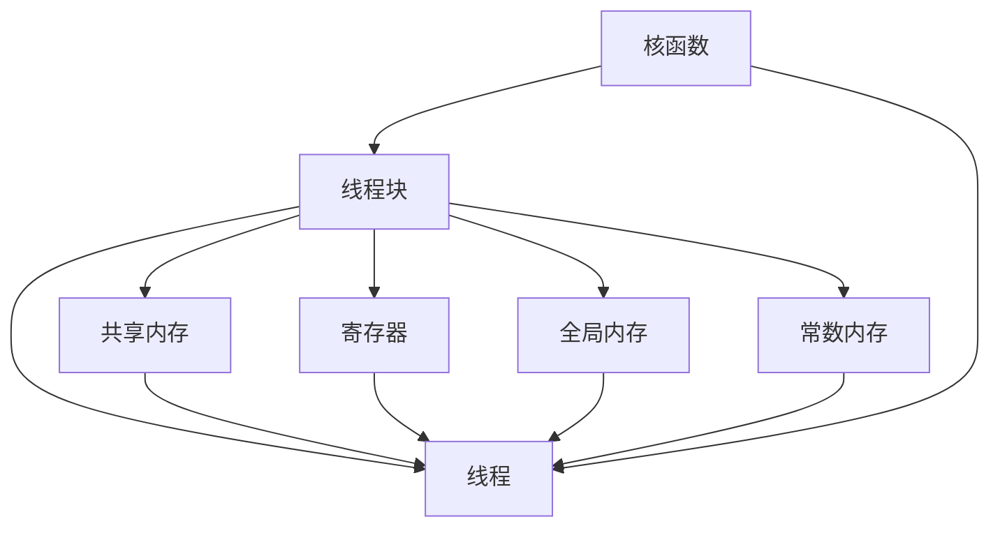

                 

### 引言

随着深度学习在各个领域（如图像识别、自然语言处理、自动驾驶等）的广泛应用，GPU（Graphics Processing Unit）推理计算的重要性日益凸显。GPU以其强大的并行计算能力，在处理大规模数据集和复杂计算任务方面展现了显著的优势。然而，GPU进行推理计算并非一帆风顺，其中面临着诸多挑战和瓶颈。

本文旨在深入探讨GPU在进行推理计算时面临的主要挑战，通过系统的分析和详尽的讲解，帮助读者理解这些问题的根源以及解决方法。首先，我们将从背景介绍出发，阐述GPU在推理计算中的重要作用和地位。接下来，我们将从GPU的基本原理入手，详细讲解GPU的结构、编程模型和并行计算原理，为后续的深入分析奠定基础。

在接下来的章节中，我们将逐步探讨GPU编程中的核心概念，包括CUDA编程模型、GPU内存管理和并行算法优化，并通过具体代码示例和算法原理讲解，使读者能够更好地理解GPU编程的精髓。随后，我们将重点关注GPU推理计算的具体流程和优化策略，结合实际案例进行分析。

文章还将深入讨论GPU推理计算性能评估的方法和瓶颈分析，提出相应的性能提升策略。最后，我们将总结GPU推理计算的主要挑战，并展望未来的发展方向和应用领域。

通过本文的阅读，读者将能够全面了解GPU进行推理计算所面临的挑战，掌握解决这些问题的方法和策略，为在深度学习领域中的实际应用提供有力的技术支持。

### GPU基础

要深入理解GPU进行推理计算所面临的挑战，首先需要了解GPU的基本原理和架构。GPU（Graphics Processing Unit）是一种专门为处理图形渲染任务而设计的处理器，但它强大的并行计算能力使其在深度学习和其他计算密集型任务中也能大放异彩。

#### GPU概述

GPU的结构和组成

GPU通常由多个处理单元（称为流处理器）组成，这些流处理器能够并行处理大量的数据。与CPU（Central Processing Unit）相比，GPU具有更高的并行度，这使得它在处理大规模并行任务时效率更高。典型的GPU结构包括以下几个关键组成部分：

1. **流处理器（Streaming Multiprocessors）**：每个流处理器包含多个执行单元，能够同时执行多个线程。
2. **内存管理单元（Memory Controllers）**：GPU具有多个级别的内存，包括显存、共享内存和寄存器，用于存储和访问数据。
3. **光栅化单元（Rasterizers）**：负责将三维图形转换为二维图像。
4. **渲染输出单元（Render Output Units）**：用于将渲染结果输出到显示器或存储器。

GPU与CPU的差异

CPU和GPU在设计目标、架构和性能方面存在显著差异。CPU是通用处理器，旨在执行各种类型的计算任务，具有较高的指令集复杂度和单线程性能。而GPU则专注于并行计算，具有高度可扩展的并行度和较低的每线程性能。以下是GPU与CPU的一些主要差异：

1. **并行度**：GPU拥有数百甚至数千个并行处理单元，而CPU通常只有几十个。
2. **指令集**：GPU通常支持简化的指令集，以加速并行计算，而CPU则支持更复杂的指令集。
3. **内存访问模式**：GPU内存访问高度并行化，但可能不如CPU的内存访问灵活。
4. **功耗**：GPU通常具有更高的功耗，但其在处理并行任务时效率更高。

#### GPU编程基础

CUDA编程模型

CUDA（Compute Unified Device Architecture）是NVIDIA推出的一种并行编程模型，用于在GPU上执行计算任务。CUDA通过引入线程网格（grid）和线程块（block）的概念，允许程序员将任务划分为多个可并行执行的部分。CUDA编程模型主要包括以下几个核心概念：

1. **线程网格（Grid）**：由多个线程块组成，每个线程块可以独立执行任务。
2. **线程块（Block）**：由多个线程组成，线程块内的线程可以共享内存（共享内存）和同步。
3. **线程（Thread）**：执行计算任务的基本单位，每个线程可以独立访问内存。

GPU内存管理

GPU内存管理是CUDA编程中的一个关键方面。GPU内存分为以下几个级别：

1. **寄存器（Registers）**：位于每个流处理器的内部，用于临时存储数据，具有最快的访问速度。
2. **共享内存（Shared Memory）**：线程块内的线程可以共享的数据存储区域，具有中等访问速度。
3. **全局内存（Global Memory）**：用于存储全局变量的数据存储区域，具有较慢的访问速度。
4. **常数内存（Constant Memory）**：类似于全局内存，但具有更快速的访问速度。

GPU内存管理的关键在于优化数据访问模式，以减少内存瓶颈和提升性能。常用的内存优化技术包括：

1. **内存对齐（Memory Alignment）**：确保数据在内存中的存储位置对齐，以减少内存访问开销。
2. **内存复制（Memory Copy）**：优化内存复制的策略，如使用异步内存复制操作。

#### GPU并行计算原理

数据并行与任务并行

GPU的并行计算能力主要体现在数据并行和任务并行两个方面：

1. **数据并行**：将数据分成多个部分，每个部分由不同的线程块独立处理。这种并行方式适用于处理大规模数据集，例如矩阵乘法、图像处理等。
2. **任务并行**：将任务划分为多个小任务，每个小任务由不同的线程块独立执行。这种并行方式适用于处理多个独立的任务，例如并行搜索、并行排序等。

GPU指令流与内存访问模式

GPU在执行计算任务时，会生成指令流，指令流通过流处理器进行执行。GPU的指令流和内存访问模式具有以下特点：

1. **指令流**：GPU可以同时执行多个指令，这称为指令级并行（Instruction-Level Parallelism）。通过优化指令流，可以提高GPU的利用率和计算性能。
2. **内存访问模式**：GPU内存访问模式高度并行化，但需要考虑数据局部性和内存访问模式，以减少内存访问冲突和提升性能。

#### 小结

通过对GPU基础的了解，我们可以看到GPU在结构设计、编程模型和并行计算原理方面具有独特的优势。这些优势使得GPU成为深度学习和其他计算密集型任务的重要计算平台。然而，GPU在进行推理计算时也面临着诸多挑战，包括内存带宽限制、热管理和功耗问题等。在后续章节中，我们将深入探讨这些挑战，并提出相应的解决策略。

### 第1章: GPU编程

在理解了GPU的基础知识后，我们将进一步探讨GPU编程的核心概念，包括CUDA编程模型、GPU内存管理和并行算法优化。这些概念是进行高效GPU编程的基础，对于解决GPU推理计算中的挑战至关重要。

#### CUDA核心概念

CUDA（Compute Unified Device Architecture）是NVIDIA推出的并行编程模型，用于在GPU上执行计算任务。CUDA通过引入线程网格、线程块和线程的概念，使程序员能够充分利用GPU的并行计算能力。

**核函数和线程块**

1. **核函数（Kernel）**：CUDA中的核心执行单元，由程序员编写。核函数可以在GPU上的多个线程块中并行执行。
2. **线程块（Block）**：由多个线程组成，线程块内的线程可以共享内存和同步。每个线程块有自己的局部内存和共享内存。
3. **线程（Thread）**：执行计算任务的基本单元。每个线程在一个特定的线程块中执行，并可以通过索引访问数据和内存。

**共享内存与寄存器**

1. **共享内存（Shared Memory）**：线程块内的线程可以共享的数据存储区域。共享内存速度比全局内存快，但大小有限。
2. **寄存器（Registers）**：位于每个流处理器的内部，用于临时存储数据。寄存器访问速度非常快，但大小有限。

**内存优化**

GPU内存管理是CUDA编程中的一个关键方面。GPU内存分为多个级别，包括寄存器、共享内存、全局内存和常数内存。内存优化是提升GPU性能的重要手段，以下是一些常用的内存优化技术：

1. **内存对齐**：确保数据在内存中的存储位置对齐，以减少内存访问开销。例如，可以使用`alignas`关键字来指定数据对齐。
2. **内存复制**：优化内存复制的策略，如使用异步内存复制操作。异步复制允许在GPU执行其他计算任务的同时进行内存复制，从而提高效率。

**核心概念联系图**

为了更好地理解CUDA核心概念之间的关系，我们可以使用Mermaid流程图来展示：



#### GPU内存优化

**全局内存访问模式**

全局内存是GPU内存中最重要的部分，但也是访问速度最慢的部分。为了优化全局内存访问，可以采用以下策略：

1. **内存对齐**：确保数据在全局内存中的存储位置对齐，以减少内存访问开销。
2. **内存访问模式优化**：使用统一的内存访问模式，减少内存访问冲突。例如，使用`cudaMemPrefetchAsync`函数将数据预加载到共享内存或寄存器中。

**高效的内存复制技术**

内存复制是GPU编程中的一个常见操作，优化内存复制可以提高整体性能。以下是一些高效的内存复制技术：

1. **异步复制**：使用异步内存复制操作，允许在GPU执行其他计算任务的同时进行内存复制。异步复制可以使用`cudaMemcpyAsync`函数实现。
2. **内存对齐**：确保数据在内存中的存储位置对齐，以减少内存访问开销。使用`cudaMemAdvise`函数可以为内存访问提供优化的建议。

**并行算法优化**

**求解线性方程组**

线性方程组的求解是许多科学计算中的基础任务。在GPU上求解线性方程组，可以通过以下方法进行优化：

1. **并行化计算**：将方程组的系数矩阵和变量向量划分为多个部分，每个线程块独立求解一部分方程。
2. **内存访问优化**：优化内存访问模式，减少内存访问冲突。例如，可以使用循环展开技术来减少循环层次结构。

**前缀和算法**

前缀和算法是一种常见的数据处理算法，用于计算一组数的累加和。在GPU上优化前缀和算法，可以采用以下方法：

1. **并行化计算**：使用多个线程块并行计算前缀和，每个线程块计算部分结果。
2. **内存访问优化**：优化内存访问模式，减少内存访问冲突。例如，可以使用内存屏障（memory barrier）来同步线程块的内存访问。

#### GPU编程工具

**CUDA工具链**

CUDA工具链是一套用于开发CUDA应用程序的工具，包括编译器（nvcc）、调试器（cuda-gdb）和性能分析工具（nvprof、nsight）。CUDA工具链可以帮助开发者编写、调试和优化CUDA程序。

**GPU调试与性能分析工具**

1. **nvprof**：一种用于性能分析的工具，可以监控GPU的运行时间和资源使用情况。
2. **nsight**：一种综合性能分析工具，包括内存分析、线程分析等，可以帮助开发者优化GPU程序。

#### 小结

通过本章的讲解，我们对GPU编程的核心概念有了更深入的了解。CUDA编程模型、GPU内存管理和并行算法优化是GPU编程的关键要素，掌握这些概念和技巧对于进行高效GPU编程至关重要。在后续章节中，我们将进一步探讨GPU推理计算的具体流程和优化策略，帮助读者更好地应对GPU推理计算中的挑战。

### 第3章: GPU推理计算

GPU推理计算在深度学习领域扮演着至关重要的角色。与训练计算相比，推理计算侧重于对已知数据集进行快速计算，以获取预测结果。本节将详细介绍GPU推理计算的基本概念、流程和优化策略，并结合实际案例进行分析。

#### 推理计算概述

**推理计算与训练计算的区别**

推理计算（Inference）和训练计算（Training）是深度学习中的两个核心过程。训练计算是指通过大量数据训练模型，使其能够学习到数据中的特征和规律。而推理计算则是在训练好的模型基础上，对新的数据集进行计算，以获取预测结果。

**推理计算在深度学习中的应用**

推理计算在深度学习中的应用非常广泛，包括：

1. **图像识别**：使用训练好的卷积神经网络（CNN）对图像进行分类和检测。
2. **自然语言处理**：使用训练好的语言模型进行文本分类、机器翻译和问答系统。
3. **语音识别**：使用训练好的语音模型对语音信号进行识别和转录。

**推理计算的重要性**

推理计算的重要性在于其能够实现对实时数据的快速处理，为各类应用场景提供即时的预测结果。随着深度学习技术的不断发展，推理计算的性能和效率成为衡量模型优劣的重要指标。

#### GPU推理计算流程

**张量计算**

在深度学习中，大部分计算都是基于张量（Tensor）的。张量计算是GPU推理计算的核心部分。GPU通过其强大的并行计算能力，可以高效地执行张量计算任务。以下是一个简单的张量计算流程：

1. **数据加载**：将输入数据从内存加载到GPU显存中。
2. **前向传播**：使用训练好的模型对输入数据进行前向传播计算，得到中间结果和最终预测结果。
3. **后向传播**（可选）：在某些情况下，可能需要对模型进行微调，此时需要进行后向传播计算。

**网络推理加速技术**

为了提升GPU推理计算的性能，可以采用以下技术：

1. **模型压缩**：通过模型压缩技术（如剪枝、量化等），减少模型的参数数量，从而降低计算量和内存占用。
2. **量化计算**：使用低精度浮点数（如8位整数）进行计算，以减少内存带宽需求和提高计算速度。
3. **并行计算**：利用GPU的多核并行计算能力，对网络中的不同层进行并行计算，减少计算时间。

**存储优化**

存储优化是提升GPU推理计算性能的重要手段。以下是一些常用的存储优化技术：

1. **内存对齐**：确保数据在内存中的存储位置对齐，以减少内存访问开销。
2. **异步数据传输**：使用异步数据传输技术，在GPU执行计算任务的同时，进行数据加载和传输，以充分利用GPU的计算能力。
3. **缓存利用**：优化GPU缓存的使用，减少内存访问次数，提高数据访问速度。

#### GPU推理优化

**存储优化**

存储优化是提升GPU推理计算性能的关键环节。以下是一些存储优化策略：

1. **显存带宽优化**：通过优化数据访问模式和减少内存带宽需求，提高GPU的存储访问效率。
2. **缓存优化**：合理利用GPU缓存，减少内存访问次数，提高数据访问速度。
3. **内存池化**：通过内存池化技术，减少内存分配和释放的开销，提高内存利用率。

**指令优化**

指令优化是提升GPU计算性能的重要手段。以下是一些指令优化策略：

1. **指令并行化**：通过优化指令流，使GPU能够同时执行多个指令，提高指令级并行度。
2. **减少指令依赖**：通过优化算法和数据结构，减少指令间的依赖关系，提高指令执行效率。
3. **循环展开**：通过循环展开技术，减少循环层次结构，提高循环执行的效率。

**GPU推理案例分析**

**图像识别**

图像识别是深度学习中的一个重要应用领域。以下是一个简单的图像识别流程：

1. **数据预处理**：将图像数据转换为适合输入模型的形式，如归一化、缩放等。
2. **模型加载**：将训练好的模型从硬盘加载到GPU显存中。
3. **前向传播**：使用模型对预处理后的图像数据进行前向传播计算，得到预测结果。
4. **结果输出**：将预测结果输出到显示器或存储器中。

**自然语言处理**

自然语言处理是深度学习中的另一个重要领域。以下是一个简单的自然语言处理流程：

1. **数据预处理**：将文本数据转换为适合输入模型的形式，如分词、词向量化等。
2. **模型加载**：将训练好的模型从硬盘加载到GPU显存中。
3. **前向传播**：使用模型对预处理后的文本数据进行前向传播计算，得到文本表示。
4. **预测输出**：根据文本表示，使用模型进行预测，如文本分类、机器翻译等。

#### 小结

通过对GPU推理计算的详细介绍，我们可以看到，GPU推理计算在深度学习领域具有广泛的应用前景。掌握GPU推理计算的基本概念、流程和优化策略，对于提升深度学习模型的性能和效率具有重要意义。在后续章节中，我们将进一步探讨GPU推理计算的性能评估方法和挑战，帮助读者更好地应对实际应用中的问题。

### GPU推理计算的性能评估

性能评估是优化GPU推理计算的重要环节。通过准确评估GPU推理计算的性能，我们可以识别瓶颈，提出有效的优化策略。以下将介绍性能评估的方法、瓶颈分析以及性能提升策略。

#### 性能评估方法

**基准测试**

基准测试是性能评估的基础，通过执行一系列标准化的测试任务，可以衡量GPU推理计算的性能。以下是一些常用的基准测试方法：

1. **单核性能测试**：测量单个GPU核心的吞吐量，以评估单线程的性能。
2. **多核性能测试**：测量多个GPU核心并行工作的吞吐量，以评估多线程的性能。
3. **场景测试**：模拟实际应用场景，如图像识别、自然语言处理等，评估GPU在不同任务下的性能。

**灵活性评估**

灵活性评估是评估GPU推理计算适应不同任务和需求的能力。以下是一些衡量灵活性的指标：

1. **可扩展性**：评估GPU推理计算在处理不同规模数据集时的性能变化。
2. **兼容性**：评估GPU推理计算对不同深度学习框架和模型的支持能力。
3. **动态调整**：评估GPU推理计算在资源分配、负载均衡等方面的灵活性。

#### 性能瓶颈分析

**内存瓶颈**

内存瓶颈是GPU推理计算中最常见的性能瓶颈之一。以下是一些常见的内存瓶颈及其优化策略：

1. **显存带宽限制**：显存带宽决定了GPU读取和写入数据的能力。当显存带宽不足以支持大量数据传输时，会出现内存瓶颈。优化策略包括减少数据传输量、提高数据传输效率等。
2. **内存访问冲突**：当多个线程同时访问相同内存位置时，可能导致内存访问冲突，降低性能。优化策略包括使用内存对齐、调整内存访问模式等。

**指令级瓶颈**

指令级瓶颈是指GPU在执行指令时遇到的瓶颈。以下是一些常见的指令级瓶颈及其优化策略：

1. **指令级并行度不足**：当GPU的指令级并行度不足时，会导致大量线程等待指令，降低性能。优化策略包括优化算法和数据结构、减少指令依赖等。
2. **指令调度延迟**：GPU在调度指令时可能遇到延迟，导致指令执行效率降低。优化策略包括减少指令调度延迟、优化指令流等。

#### 性能提升策略

**多GPU并行计算**

多GPU并行计算是通过使用多个GPU核心并行工作，提高GPU推理计算的性能。以下是一些多GPU并行计算的方法：

1. **数据并行**：将数据集划分为多个部分，每个GPU处理一部分数据，从而实现并行计算。
2. **任务并行**：将计算任务划分为多个子任务，每个GPU处理不同的子任务，从而实现并行计算。
3. **负载均衡**：通过负载均衡算法，合理分配任务到不同的GPU核心，以充分利用GPU资源。

**网络结构优化**

网络结构优化是通过调整深度学习网络的结构，提高GPU推理计算的性能。以下是一些网络结构优化的方法：

1. **模型压缩**：通过剪枝、量化等模型压缩技术，减少模型的参数数量，从而降低计算量和内存占用。
2. **并行前向传播**：通过并行前向传播算法，将网络中的不同层并行计算，从而减少计算时间。
3. **优化网络结构**：通过设计更高效的深度学习网络结构，如瓶颈网络（Bottleneck Network）、密集连接网络（DenseNet）等，提高GPU推理计算的性能。

#### 小结

通过对GPU推理计算性能评估的方法和瓶颈分析，我们可以更好地理解GPU推理计算中的性能瓶颈，并提出相应的优化策略。多GPU并行计算和网络结构优化是提升GPU推理计算性能的重要手段。在实际应用中，通过结合这些策略，可以有效提高GPU推理计算的效率和性能，为深度学习应用提供更强的计算支持。

### 第5章: GPU推理计算的主要挑战

在深入分析了GPU推理计算的流程和性能优化策略后，我们接下来将探讨GPU推理计算面临的主要挑战。这些挑战不仅影响了GPU推理计算的性能，还直接关系到实际应用中的可行性和效率。以下是GPU推理计算中的主要挑战及其解决方案。

#### 数据传输挑战

**显存带宽限制**

显存带宽是GPU进行数据传输的一个重要限制因素。显存带宽决定了数据从主机内存传输到GPU显存的速度，以及从GPU显存传输回主机内存的速度。当数据集较大或计算任务复杂时，显存带宽可能会成为瓶颈。

**解决方案**：

1. **数据压缩**：在数据传输前进行压缩，以减少数据量，提高传输效率。
2. **异步传输**：使用异步数据传输技术，将数据传输与GPU计算任务分离，以充分利用GPU计算时间。
3. **内存池化**：通过内存池化技术，减少内存分配和释放的开销，提高内存利用率。

#### 热管理和功耗问题

GPU在推理计算过程中会产生大量的热量，如果热管理不当，会导致GPU性能下降，甚至损坏。此外，GPU的功耗也是实际应用中的一个重要问题。

**GPU热管理策略**

1. **散热系统**：使用高效的散热系统，如水冷系统、风扇散热等，以降低GPU的温度。
2. **温度监控**：实时监控GPU的温度，并在温度过高时采取相应的冷却措施。
3. **功耗优化**：通过优化算法和数据结构，减少GPU的计算量，从而降低功耗。

**功耗优化方法**

1. **低功耗模式**：在GPU空闲或负载较低时，切换到低功耗模式，以减少能耗。
2. **动态电压调节**：根据GPU的负载情况，动态调整GPU的工作电压，以减少不必要的功耗。
3. **任务调度**：合理分配任务，避免GPU长时间在高负载状态下工作，从而降低功耗。

#### 异构计算优化

在深度学习和其他计算密集型任务中，通常需要结合CPU和GPU的异构计算能力。然而，CPU与GPU之间的协同优化是一个复杂的挑战。

**CPU与GPU的协同计算**

1. **任务分配**：合理分配任务到CPU和GPU，以充分发挥两者的计算能力。
2. **数据传输优化**：优化CPU与GPU之间的数据传输，减少数据传输的开销。
3. **资源共享**：利用GPU的内存和计算资源，减少CPU和GPU之间的数据交换。

**软硬件协同优化**

1. **编译优化**：使用编译器优化技术，如循环展开、指令调度等，提高GPU程序的性能。
2. **硬件加速**：利用GPU的硬件特性，如共享内存、显存带宽等，优化数据访问和计算。
3. **工具链优化**：优化GPU编程工具链，如CUDA工具链、GPU调试工具等，以提高开发效率和程序性能。

#### 小结

GPU推理计算在深度学习和计算密集型任务中具有重要意义，但也面临着数据传输、热管理和功耗等主要挑战。通过合理的数据传输策略、有效的热管理和功耗优化方法，以及CPU与GPU的协同优化，我们可以有效地克服这些挑战，提高GPU推理计算的性能和效率。在实际应用中，结合这些解决方案，可以更好地发挥GPU的并行计算能力，为各类复杂计算任务提供强有力的支持。

### 未来展望

随着深度学习和人工智能技术的快速发展，GPU推理计算正面临着前所未有的机遇和挑战。未来，GPU推理计算将继续在技术创新和应用拓展方面展现出强大的潜力。

#### GPU推理计算的发展趋势

**新架构GPU**

未来的GPU将朝着更高效、更强大的方向发展。新架构GPU将具备更高的并行度、更快的显存带宽和更优的功耗性能。例如，NVIDIA的安培（Ampere）架构和AMD的CDNA架构，都将在未来几年内推动GPU推理计算的性能提升。

**异构计算的发展**

异构计算是将不同类型的计算资源（如CPU、GPU、FPGA等）结合起来，以实现更高效、更灵活的计算。未来，异构计算将进一步发展，通过合理地分配任务和优化资源利用，实现计算任务的协同优化。

#### GPU推理计算的新应用领域

**边缘计算**

随着物联网（IoT）和5G技术的普及，边缘计算正成为热点。GPU推理计算在边缘计算中具有广泛的应用前景，如智能摄像头、智能机器人、自动驾驶等，通过本地处理和实时推理，提供更高效、更可靠的解决方案。

**自动驾驶**

自动驾驶是GPU推理计算的重要应用领域之一。自动驾驶系统需要对大量传感器数据进行实时处理和推理，以做出快速、准确的决策。GPU强大的并行计算能力，使其成为自动驾驶系统中不可或缺的一部分。

**医疗影像处理**

医疗影像处理是另一个GPU推理计算的重要应用领域。通过深度学习算法，GPU可以快速处理大量医疗影像数据，如图像分割、病变检测等，为医生提供更加精准的诊断和治疗方案。

#### 小结

未来，GPU推理计算将在技术创新和应用拓展方面继续发挥重要作用。新架构GPU和异构计算的发展，将为GPU推理计算带来更高的性能和更广泛的应用前景。同时，边缘计算、自动驾驶和医疗影像处理等新应用领域的兴起，将进一步推动GPU推理计算的应用深度和广度。通过不断创新和优化，GPU推理计算将为人工智能和深度学习领域带来更多可能性。

### 总结与展望

通过对GPU进行推理计算所面临的主要挑战的深入探讨，我们可以清晰地看到，这一技术领域充满了机遇与挑战。GPU强大的并行计算能力，使其在深度学习和其他计算密集型任务中占据重要地位。然而，数据传输挑战、热管理和功耗问题、以及异构计算优化等方面的挑战，也制约了其性能和效率。

首先，数据传输挑战主要源于显存带宽的限制。为了解决这一问题，可以采用数据压缩、异步传输和内存池化等技术，以提高数据传输效率和减少内存访问冲突。

其次，热管理和功耗问题是GPU推理计算中的另一大瓶颈。通过使用高效的散热系统、温度监控和低功耗模式，可以有效降低GPU的温度和功耗。同时，动态电压调节和任务调度等策略，也可以帮助优化功耗，提高GPU的运行效率。

最后，异构计算优化是提升GPU推理计算性能的关键。通过合理分配任务、优化数据传输和资源共享，可以实现CPU与GPU的协同计算，进一步提高计算效率和性能。

展望未来，GPU推理计算将迎来新的发展机遇。随着新架构GPU和异构计算技术的不断发展，GPU推理计算的性能和效率将得到显著提升。此外，边缘计算、自动驾驶和医疗影像处理等新应用领域的兴起，也将为GPU推理计算带来更广阔的应用前景。

为了进一步推动GPU推理计算的发展，我们建议在以下几个方面进行深入研究：

1. **新型GPU架构的研究**：探索更高效、更强大的GPU架构，以提升GPU的并行计算能力和能效比。
2. **异构计算优化技术**：研究更为高效、灵活的异构计算优化策略，实现计算资源的最佳利用。
3. **边缘计算与GPU推理的结合**：结合边缘计算的特点，探索GPU推理在物联网、智能机器人等领域的应用。
4. **GPU推理计算的标准和工具链**：开发统一的GPU推理计算标准和工具链，提高开发效率和程序性能。

通过不断的研究和创新，我们有望克服GPU推理计算中的主要挑战，推动这一领域的发展，为人工智能和深度学习带来更多的可能性。

### 附录

#### GPU编程示例代码

以下是一个简单的GPU编程示例，展示了如何使用CUDA进行矩阵加法计算：

```python
import pycuda.autoinit
import pycuda.driver as cuda
import numpy as np

# 设备选择
device = pycuda.autoinit.device

# 定义内核
def matrix_add_kernel<<<grid, block>>>(A, B, C):
    # 获取线程索引
    tx = cuda.thread.get_thread_id().x
    ty = cuda.thread.get_thread_id().y
    
    # 计算内存地址
    index = ty * block[0] + tx
    
    # 加法操作
    C[index] = A[index] + B[index]

# 准备数据
N = 1024
A = np.random.rand(N, N).astype(np.float32)
B = np.random.rand(N, N).astype(np.float32)
C = np.empty_like(A)

# 数据复制到GPU内存
A_gpu = cuda.to_device(A)
B_gpu = cuda.to_device(B)
C_gpu = cuda.to_device(C)

# 启动内核
grid = (int(np.ceil(N / block[0])), int(np.ceil(N / block[1])))
matrix_add_kernel<<<grid, block>>>(A_gpu, B_gpu, C_gpu)

# 从GPU内存复制结果回CPU
C = C_gpu.get()

print(C)
```

#### GPU推理计算性能评估工具

以下是一些常用的GPU推理计算性能评估工具：

1. **nvprof**：NVIDIA提供的性能分析工具，用于监控GPU的运行时间和资源使用情况。
2. **nsight**：NVIDIA提供的综合性能分析工具，包括内存分析、线程分析等。
3. **gprof**：Linux下的性能分析工具，可以分析程序在不同处理器核心上的性能。

#### 参考文献

1. **NVIDIA CUDA C Programming Guide**：详细介绍了CUDA编程模型和API，是学习CUDA编程的必备指南。
2. **Kirk, David. *The GPU Atlas: Understanding GPU Architecture*.*. Addison-Wesley, 2016.*：一本关于GPU架构和性能优化的经典书籍。
3. **Shyyan, Amir. *CUDA by Example: An Introduction to General-Purpose Computing on GPUs*.*. Addison-Wesley, 2011.*：一本适合初学者的CUDA编程入门书籍。
4. **Bottou, Léon. *Programming for Machine Learning: A Practical Introduction to Machine Learning Applications Using Python*.* Springer, 2019.*：本书介绍了如何在机器学习中使用GPU进行高效计算。

