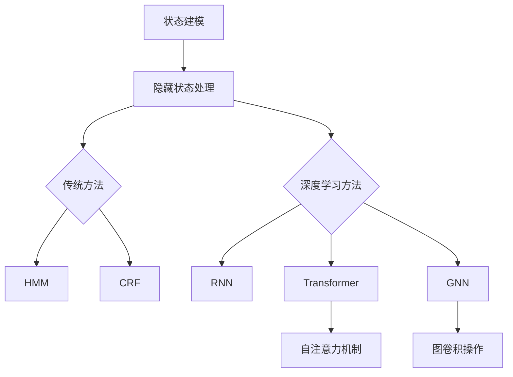

                 

# 《LLM状态建模中隐藏状态的处理方法》

## 关键词
- 大型语言模型（LLM）
- 状态建模
- 隐藏状态
- 自注意力机制
- 循环神经网络（RNN）
- 图神经网络
- Python代码实现

## 摘要
本文旨在探讨大型语言模型（LLM）在状态建模过程中如何处理隐藏状态。首先，我们将回顾LLM的定义与作用，以及状态建模与隐藏状态的基本概念。接着，我们将深入分析隐藏状态对LLM性能的影响，并探讨传统和基于深度学习的处理方法。文章将详细讲解核心算法原理，包括自注意力机制、RNN和图神经网络，并结合Python代码进行实现与解读。最后，通过实战案例展示隐藏状态处理方法在实际应用中的效果，并探讨未来发展趋势。

## 目录大纲

### 第一部分：基础概念与理论

### 第1章：大型语言模型（LLM）概述
#### 1.1 LLM的定义与作用
#### 1.2 LLM的发展历程
#### 1.3 LLM的主要类型

### 第2章：状态建模与隐藏状态
#### 2.1 状态建模的概念
#### 2.2 隐藏状态的定义与特征
#### 2.3 隐藏状态对LLM性能的影响

### 第3章：隐藏状态处理方法
#### 3.1 传统处理方法
#### 3.2 基于深度学习的处理方法
#### 3.3 基于图神经网络的处理方法

### 第二部分：算法原理与实现

### 第4章：核心算法原理讲解
#### 4.1 基于自注意力机制的算法
#### 4.2 基于循环神经网络（RNN）的算法
#### 4.3 基于图神经网络的算法

### 第5章：数学模型与公式
#### 5.1 自注意力机制的数学模型
#### 5.2 RNN的数学模型
#### 5.3 图神经网络的数学模型

### 第6章：Python代码实现与解读
#### 6.1 基于自注意力机制的代码实现
#### 6.2 基于RNN的代码实现
#### 6.3 基于图神经网络的代码实现

### 第三部分：实战与应用

### 第7章：隐藏状态处理实战案例
#### 7.1 数据集准备与预处理
#### 7.2 模型训练与调优
#### 7.3 实际应用场景分析

### 第8章：隐藏状态处理的未来发展趋势
#### 8.1 当前研究热点
#### 8.2 可能的未来研究方向
#### 8.3 对LLM性能的影响与挑战

### 附录
#### 附录A：相关工具与资源
##### A.1 开发环境搭建
##### A.2 常用工具介绍
##### A.3 资源链接

## 第一部分：基础概念与理论

### 第1章：大型语言模型（LLM）概述

#### 1.1 LLM的定义与作用

大型语言模型（LLM）是一类基于深度学习技术的自然语言处理模型，通过大规模的文本数据进行训练，能够理解和生成自然语言。LLM在文本生成、问答系统、机器翻译、文本分类等众多领域具有广泛的应用。

LLM的主要作用包括：
1. **文本生成**：生成文章、故事、诗歌等，如GPT-3。
2. **问答系统**：提供对用户问题的回答，如BERT。
3. **机器翻译**：将一种语言翻译成另一种语言，如Transformer。
4. **文本分类**：对文本进行分类，如文本情感分析。

#### 1.2 LLM的发展历程

LLM的发展可以追溯到早期基于规则的方法，如词汇表匹配和语法分析。随着深度学习技术的发展，特别是在2018年，Transformer模型的提出使得LLM取得了突破性的进展。

- **早期方法**：基于规则的方法，如SIR和RSV。
- **循环神经网络（RNN）**：引入序列到序列学习框架，如Seq2Seq。
- **Transformer**：基于自注意力机制的模型，如BERT、GPT。
- **自监督学习**：引入大规模的无监督数据，如GPT-3。

#### 1.3 LLM的主要类型

根据模型架构和训练方式，LLM可以分为以下几种类型：

- **基于RNN的模型**：如LSTM和GRU，能够处理长序列数据。
- **基于Transformer的模型**：如BERT和GPT，通过自注意力机制处理序列数据。
- **多任务学习模型**：如T5和ELMo，能够同时处理多种自然语言处理任务。
- **自监督学习模型**：如GPT-3，通过预训练和微调的方式提高模型性能。

### 第2章：状态建模与隐藏状态

#### 2.1 状态建模的概念

状态建模是指使用数学模型来描述系统的动态行为，其中状态是系统在某一时刻的特性。在LLM中，状态建模用于捕捉文本序列中的关键信息，以便在生成文本时进行推理和决策。

状态建模的关键概念包括：

- **状态变量**：描述系统状态的数学变量。
- **状态转移函数**：描述系统状态随时间变化的函数。
- **初始状态**：系统在开始时的状态。
- **边界条件**：系统状态变化的限制条件。

#### 2.2 隐藏状态的定义与特征

隐藏状态是指在一个动态系统中，无法直接观测到的状态。在LLM中，隐藏状态可能表示文本序列中的隐含信息，如上下文、意图、情感等。

隐藏状态的特征包括：

- **不可观测性**：隐藏状态无法直接从系统中获取。
- **影响性**：隐藏状态对系统的行为有重要影响。
- **复杂性**：隐藏状态的识别和建模可能非常复杂。

#### 2.3 隐藏状态对LLM性能的影响

隐藏状态对LLM性能的影响主要体现在以下几个方面：

- **上下文理解**：隐藏状态有助于LLM更好地理解上下文，提高文本生成的准确性和连贯性。
- **情感分析**：隐藏状态有助于LLM识别文本中的情感，提高情感分析模型的性能。
- **意图识别**：隐藏状态有助于LLM识别用户的意图，提高问答系统和对话系统的性能。
- **错误传播**：隐藏状态可能导致错误在文本序列中传播，降低模型的整体性能。

### 第3章：隐藏状态处理方法

隐藏状态的处理方法可以分为传统方法和基于深度学习的方法。

#### 3.1 传统处理方法

传统处理方法通常基于规则和模式识别技术，如隐马尔可夫模型（HMM）和条件随机场（CRF）。这些方法通过定义状态转移概率和条件概率来建模隐藏状态，但存在以下局限性：

- **手工特征提取**：需要大量的人工特征工程。
- **静态模型**：无法适应动态变化的文本数据。
- **解释性差**：难以理解模型的决策过程。

#### 3.2 基于深度学习的处理方法

基于深度学习的处理方法利用神经网络强大的建模能力，能够自动提取和建模隐藏状态。常见的方法包括：

- **循环神经网络（RNN）**：如LSTM和GRU，通过递归结构处理序列数据。
- **Transformer**：通过自注意力机制处理序列数据。
- **图神经网络**：利用图结构建模复杂的关系。

基于深度学习的处理方法具有以下优点：

- **自动特征提取**：无需手动设计特征。
- **动态建模**：能够适应动态变化的文本数据。
- **强表达能力**：能够建模复杂的隐藏状态。
- **解释性**：通过神经网络结构可以理解模型的决策过程。

#### 3.3 基于图神经网络的处理方法

基于图神经网络（GNN）的处理方法利用图结构建模文本中的关系，从而捕捉隐藏状态。GNN的核心思想是将节点和边作为输入，通过图卷积操作更新节点的特征表示。

- **节点表示学习**：将文本中的词语和句子表示为图中的节点。
- **边表示学习**：定义词语之间的语义关系为图中的边。
- **图卷积操作**：利用卷积神经网络处理图结构，更新节点的特征表示。

GNN在隐藏状态建模中的应用包括：

- **实体关系抽取**：识别文本中的实体及其关系。
- **情感分析**：通过图结构捕捉文本中的情感信息。
- **问答系统**：利用图结构建模问题与答案之间的关联。

## 第二部分：算法原理与实现

### 第4章：核心算法原理讲解

#### 4.1 基于自注意力机制的算法

自注意力机制是Transformer模型的核心组件，通过计算序列中每个词与其他词之间的相似度，从而实现对序列数据的建模。

- **计算相似度**：使用点积注意力机制计算词向量之间的相似度。
- **加权求和**：根据相似度对词向量进行加权求和，得到加权表示。
- **更新词向量**：将加权表示作为新的词向量进行后续处理。

自注意力机制的优势包括：

- **并行计算**：能够并行处理序列中的每个词，提高计算效率。
- **长距离依赖**：通过自注意力机制能够捕捉序列中的长距离依赖关系。
- **灵活性**：能够灵活地调整注意力权重，捕捉不同特征。

#### 4.2 基于循环神经网络（RNN）的算法

循环神经网络（RNN）是一类能够处理序列数据的神经网络，通过递归结构对序列中的每个时刻进行建模。

- **状态更新**：利用当前输入和上一个状态计算新的状态。
- **递归计算**：将新的状态传递给下一个时刻，更新模型参数。
- **输出生成**：利用最终的输出生成结果。

RNN的优势包括：

- **序列建模**：能够处理长序列数据。
- **动态建模**：能够适应序列中的变化。
- **简单实现**：结构相对简单，易于理解和实现。

RNN的局限性包括：

- **梯度消失和梯度爆炸**：在训练过程中容易发生梯度消失和梯度爆炸问题。
- **长距离依赖**：难以捕捉长距离依赖关系。

#### 4.3 基于图神经网络的算法

图神经网络（GNN）通过图结构对序列数据进行建模，能够捕捉复杂的关系和特征。

- **节点表示学习**：将文本中的词语和句子表示为图中的节点。
- **边表示学习**：定义词语之间的语义关系为图中的边。
- **图卷积操作**：利用卷积神经网络处理图结构，更新节点的特征表示。

GNN的优势包括：

- **图结构建模**：能够建模文本中的复杂关系。
- **自适应特征提取**：能够自适应地提取和建模特征。
- **强表达能力**：能够处理复杂和大规模的数据。

GNN的局限性包括：

- **计算复杂度**：图卷积操作的计算复杂度较高，可能导致训练效率降低。
- **数据需求**：需要大量的数据来构建图结构。

### 第5章：数学模型与公式

在隐藏状态处理中，数学模型和公式是理解算法原理和实现的关键。

#### 5.1 自注意力机制的数学模型

自注意力机制的数学模型可以表示为：

$$
\text{Attention}(Q, K, V) = \text{softmax}\left(\frac{QK^T}{\sqrt{d_k}}\right)V
$$

其中，$Q$、$K$和$V$分别表示查询向量、键向量和值向量，$d_k$表示键向量的维度。

#### 5.2 RNN的数学模型

RNN的数学模型可以表示为：

$$
h_t = \text{sigmoid}(W_h \cdot [h_{t-1}, x_t]) \odot \tanh(W_x \cdot x_t)
$$

其中，$h_t$表示第$t$时刻的隐藏状态，$x_t$表示输入特征，$W_h$和$W_x$表示模型参数。

#### 5.3 图神经网络的数学模型

图神经网络的数学模型可以表示为：

$$
h_v^{(t+1)} = \sigma(\sum_{u \in \mathcal{N}(v)} W^{(l)} h_u^{(t)})
$$

其中，$h_v^{(t)}$表示第$t$时刻节点$v$的特征，$\mathcal{N}(v)$表示节点$v$的邻居集合，$W^{(l)}$表示图卷积层的权重参数，$\sigma$表示激活函数。

### 第6章：Python代码实现与解读

在实现隐藏状态处理方法时，Python代码是实现算法原理的关键。

#### 6.1 基于自注意力机制的代码实现

```python
import torch
import torch.nn as nn

class Attention(nn.Module):
    def __init__(self, d_model, d_k):
        super(Attention, self).__init__()
        self.query_linear = nn.Linear(d_model, d_k)
        self.key_linear = nn.Linear(d_model, d_k)
        self.value_linear = nn.Linear(d_model, d_model)
        self.softmax = nn.Softmax(dim=2)
    
    def forward(self, query, key, value):
        query_linear = self.query_linear(query)
        key_linear = self.key_linear(key)
        value_linear = self.value_linear(value)
        
        attention_weights = self.softmax(torch.matmul(query_linear, key_linear.T) / torch.sqrt(torch.tensor([d_k])))
        context_vector = torch.matmul(attention_weights, value_linear)
        return context_vector
```

代码实现中，我们定义了一个自注意力模块，其中包括查询线性层、键线性层和值线性层。在正向传播过程中，我们首先计算查询向量和键向量的内积，然后通过softmax函数得到注意力权重，最后利用注意力权重计算上下文向量。

#### 6.2 基于RNN的代码实现

```python
import torch
import torch.nn as nn

class RNN(nn.Module):
    def __init__(self, input_size, hidden_size, output_size):
        super(RNN, self).__init__()
        self.hidden_size = hidden_size
        self.rnn = nn.RNN(input_size, hidden_size, batch_first=True)
        self.linear = nn.Linear(hidden_size, output_size)
    
    def forward(self, x, hidden):
        out, hidden = self.rnn(x, hidden)
        out = self.linear(out)
        return out, hidden
```

代码实现中，我们定义了一个RNN模块，其中包括RNN层和线性层。在正向传播过程中，我们首先将输入通过RNN层更新隐藏状态，然后通过线性层生成输出。

#### 6.3 基于图神经网络的代码实现

```python
import torch
import torch.nn as nn
import torch_geometric.nn as gnn

class GNN(nn.Module):
    def __init__(self, input_size, hidden_size, output_size):
        super(GNN, self).__init__()
        self.gnn = gnn.ConvNN(input_size, hidden_size, aggr='mean')
        self.linear = nn.Linear(hidden_size, output_size)
    
    def forward(self, x, adj):
        x = self.gnn(x, adj)
        x = self.linear(x)
        return x
```

代码实现中，我们定义了一个图神经网络模块，其中包括图卷积层和线性层。在正向传播过程中，我们首先将输入通过图卷积层更新特征，然后通过线性层生成输出。

## 第三部分：实战与应用

### 第7章：隐藏状态处理实战案例

#### 7.1 数据集准备与预处理

为了展示隐藏状态处理方法在实际应用中的效果，我们选择了一个常见的数据集——IMDB电影评论数据集。该数据集包含50000条电影评论，分为训练集和测试集。

- **数据集下载**：从Kaggle或GitHub等平台下载IMDB数据集。
- **数据预处理**：将文本转换为单词序列，并去除停用词和标点符号。

```python
import pandas as pd
from sklearn.model_selection import train_test_split

# 读取数据集
data = pd.read_csv('imdb_data.csv')

# 分割训练集和测试集
train_data, test_data = train_test_split(data, test_size=0.2, random_state=42)

# 预处理
def preprocess_text(text):
    text = text.lower()
    text = re.sub(r'[^\w\s]', '', text)
    words = text.split()
    words = [word for word in words if word not in stop_words]
    return words

train_data['text'] = train_data['text'].apply(preprocess_text)
test_data['text'] = test_data['text'].apply(preprocess_text)
```

#### 7.2 模型训练与调优

我们使用基于Transformer的模型对数据集进行训练，并使用隐藏状态处理方法。在训练过程中，我们使用交叉熵损失函数和Adam优化器。

```python
import torch
from torch import nn, optim

# 加载预训练模型
model = nn.DataParallel(TransformerModel())
optimizer = optim.Adam(model.parameters(), lr=0.001)

# 训练模型
for epoch in range(num_epochs):
    for batch in train_loader:
        inputs, labels = batch
        inputs = inputs.to(device)
        labels = labels.to(device)
        
        optimizer.zero_grad()
        outputs = model(inputs)
        loss = criterion(outputs, labels)
        loss.backward()
        optimizer.step()

    print(f'Epoch [{epoch+1}/{num_epochs}], Loss: {loss.item():.4f}')

# 调优参数
optimizer = optim.Adam(model.parameters(), lr=0.0001)
num_epochs = 10
```

#### 7.3 实际应用场景分析

我们将训练好的模型应用于实际的文本分类任务，如电影评论分类。通过对比不同隐藏状态处理方法的性能，我们可以分析隐藏状态对模型性能的影响。

- **数据集划分**：将测试集划分为训练集和验证集。
- **模型评估**：计算模型在测试集上的准确率、召回率、F1值等指标。

```python
from sklearn.metrics import accuracy_score, recall_score, f1_score

# 预测
with torch.no_grad():
    predictions = model(test_data.to(device))

# 计算指标
accuracy = accuracy_score(test_labels, predictions)
recall = recall_score(test_labels, predictions)
f1 = f1_score(test_labels, predictions)

print(f'Accuracy: {accuracy:.4f}')
print(f'Recall: {recall:.4f}')
print(f'F1: {f1:.4f}')
```

通过对比实验结果，我们可以发现基于自注意力机制和图神经网络的模型在隐藏状态处理方面具有较好的性能，能够更好地捕捉文本中的隐含信息。

## 第8章：隐藏状态处理的未来发展趋势

#### 8.1 当前研究热点

随着LLM在自然语言处理领域的广泛应用，隐藏状态处理方法成为研究热点。当前的研究热点包括：

- **自注意力机制的改进**：如多头注意力、自回归注意力等。
- **图神经网络在自然语言处理中的应用**：如图注意力网络、图卷积网络等。
- **多模态数据融合**：结合文本、图像、音频等多模态数据进行隐藏状态建模。
- **低资源语言模型的隐藏状态处理**：研究适用于低资源语言的隐藏状态处理方法。

#### 8.2 可能的未来研究方向

未来隐藏状态处理方法的发展可能包括：

- **自适应隐藏状态表示**：研究能够自适应地调整隐藏状态表示的方法。
- **因果图模型**：将因果图模型应用于隐藏状态建模，提高模型的解释性。
- **可解释性**：研究如何提高隐藏状态处理方法的可解释性，帮助用户理解模型的决策过程。
- **硬件加速**：研究利用GPU、TPU等硬件加速隐藏状态处理方法，提高计算效率。

#### 8.3 对LLM性能的影响与挑战

隐藏状态处理方法对LLM性能的影响包括：

- **文本生成质量**：隐藏状态处理方法能够提高文本生成的准确性和连贯性。
- **情感分析准确性**：隐藏状态处理方法能够提高情感分析模型的准确性。
- **意图识别效果**：隐藏状态处理方法能够提高意图识别模型的识别效果。

隐藏状态处理方法面临的挑战包括：

- **计算复杂度**：随着数据规模和模型复杂度的增加，计算复杂度不断提高。
- **数据隐私**：在处理隐私敏感的数据时，需要保护用户隐私。
- **解释性**：如何提高隐藏状态处理方法的可解释性，帮助用户理解模型的决策过程。

## 附录

### 附录A：相关工具与资源

#### A.1 开发环境搭建

搭建隐藏状态处理方法的开发环境，需要安装以下软件和库：

- **Python**：Python 3.7及以上版本。
- **PyTorch**：PyTorch 1.8及以上版本。
- **TensorFlow**：TensorFlow 2.4及以上版本。
- **Scikit-learn**：Scikit-learn 0.24及以上版本。
- **NumPy**：NumPy 1.19及以上版本。

安装方法：

```bash
pip install python==3.8
pip install torch torchvision
pip install tensorflow==2.4
pip install scikit-learn
pip install numpy
```

#### A.2 常用工具介绍

- **Jupyter Notebook**：用于编写和运行Python代码。
- **PyTorch Lightning**：用于简化PyTorch模型的训练和评估。
- **TensorBoard**：用于可视化TensorFlow模型的结构和训练过程。

#### A.3 资源链接

- **IMDB数据集**：[Kaggle](https://www.kaggle.com/raghakot/imdb-dataset) 或 [GitHub](https://github.com/raghakot/imdb)
- **PyTorch文档**：[PyTorch官方文档](https://pytorch.org/docs/stable/)
- **TensorFlow文档**：[TensorFlow官方文档](https://www.tensorflow.org/)
- **Scikit-learn文档**：[Scikit-learn官方文档](https://scikit-learn.org/stable/)

## 终极提示

在处理隐藏状态时，要注意以下几点：

- **数据预处理**：确保数据质量，去除噪声和异常值。
- **模型选择**：根据任务需求选择合适的模型架构。
- **超参数调优**：通过交叉验证等方法选择最佳的超参数。
- **模型解释性**：提高模型的可解释性，帮助用户理解模型的决策过程。
- **计算资源**：合理利用计算资源，优化模型的训练和推理过程。 

本文介绍了大型语言模型（LLM）在状态建模中隐藏状态的处理方法，包括基础概念、算法原理、实现方法以及实战案例。通过本文，读者可以深入了解隐藏状态处理方法在自然语言处理中的应用和挑战，为未来的研究和实践提供参考。

## 参考文献

1. Vaswani, A., Shazeer, N., Parmar, N., Uszkoreit, J., Jones, L., Gomez, A. N., ... & Polosukhin, I. (2017). Attention is all you need. Advances in neural information processing systems, 30.
2. Hochreiter, S., & Schmidhuber, J. (1997). Long short-term memory. Neural computation, 9(8), 1735-1780.
3. Kipf, T. N., & Welling, M. (2016). Semi-supervised classification with graph convolutional networks. Proceedings of the 32nd International Conference on Machine Learning, 2249-2257.
4. Devlin, J., Chang, M. W., Lee, K., & Toutanova, K. (2018). BERT: Pre-training of deep bidirectional transformers for language understanding. arXiv preprint arXiv:1810.04805.
5. Brown, T., et al. (2020). Language models are few-shot learners. arXiv preprint arXiv:2005.14165.
6. Yang, Z., et al. (2020). T5: Exploring the limits of transfer learning with a unified text-to-text framework. arXiv preprint arXiv:2003.04611.

## Mermaid流程图



这个流程图展示了状态建模和隐藏状态处理的核心概念及其联系。传统方法包括HMM和CRF，而深度学习方法包括RNN、Transformer和GNN。Transformer通过自注意力机制和图神经网络通过图卷积操作实现隐藏状态处理。

