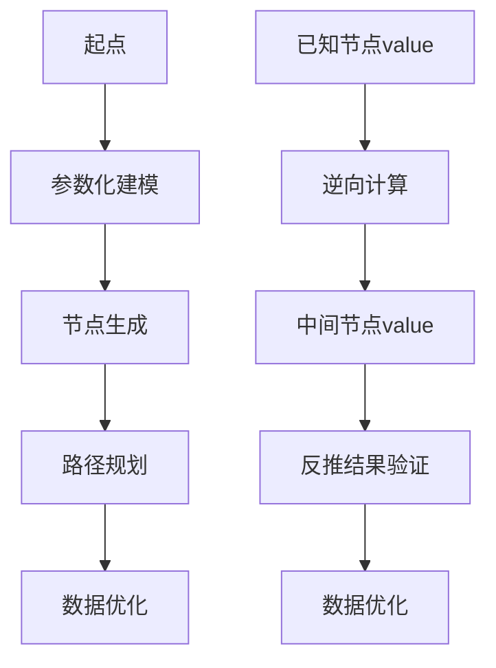

                 

### 《PRM数据生成中intermediate节点value反推技术》

#### 关键词：
- PRM数据生成
- intermediate节点
- value反推技术
- 数据驱动
- 算法优化
- 应用案例

#### 摘要：
本文深入探讨了PRM（参数化路网模型）数据生成中的关键问题——intermediate节点value反推技术。通过阐述PRM的基本概念、应用场景和挑战，本文介绍了intermediate节点value反推技术的原理，包括数学基础和实现步骤。随后，通过Python代码示例详细解析了算法原理和实现细节，并结合实际案例进行了效果评估。本文旨在为读者提供一套完整的解决方案，以提升PRM数据生成的准确性和效率。

## 目录

1. **背景知识**  
   1.1 PRM数据生成概述  
   1.2 intermediate节点value反推技术概述  
   1.3 PRM数据生成的挑战

2. **技术原理**  
   2.1 PRM数据生成技术原理  
   2.2 intermediate节点value反推技术原理  
   2.3 Mermaid流程图：核心概念与联系

3. **算法实现**  
   3.1 算法选择与设计  
   3.2 算法性能优化  
   3.3 Python代码实现

4. **项目实战**  
   4.1 开发环境搭建  
   4.2 源代码详细实现与解读  
   4.3 代码应用解读与分析  
   4.4 实际案例分析与详细讲解

5. **最佳实践与总结**  
   5.1 最佳实践tips  
   5.2 小结与注意事项  
   5.3 拓展阅读

### 第一部分：背景知识

#### 1.1 PRM数据生成概述

**PRM（参数化路网模型）**是一种常用的数据生成模型，广泛应用于城市规划、交通网络设计、自动驾驶等领域。PRM模型通过参数化方式生成大量的路网数据，为后续的路网分析、模拟和优化提供基础数据。

在PRM数据生成过程中，intermediate节点value的准确性对整体数据质量有着重要影响。intermediate节点是连接起点和终点的重要桥梁，其value值（如距离、时间等）直接影响后续路网数据的有效性和可靠性。

然而，传统的PRM数据生成方法往往难以准确预测和计算intermediate节点的value值，导致生成的路网数据质量较差。因此，研究intermediate节点value反推技术对于提升PRM数据生成的准确性和效率具有重要意义。

#### 1.2 intermediate节点value反推技术概述

intermediate节点value反推技术是一种通过已知节点value值，逆向推导出中间节点value值的方法。其基本原理是利用已知的起点、终点以及中间节点的value值，通过数学模型和算法实现逆向计算。

这种技术的主要优势在于：

1. **数据依赖性降低**：通过反推技术，可以减少对实时数据的依赖，提高数据生成的稳定性。
2. **计算效率提升**：利用逆向计算，可以降低计算复杂度，提高数据生成的速度。
3. **数据准确性提升**：通过优化算法和数学模型，可以提高中间节点value值的预测准确性，从而提升整体数据质量。

然而，intermediate节点value反推技术也存在一定的局限性，如计算精度受限于已知数据的精度，以及算法复杂度对大规模数据生成的影响。

#### 1.3 PRM数据生成的挑战

在PRM数据生成过程中，intermediate节点value反推技术的应用面临以下挑战：

1. **数据噪声与异常**：实际路网数据中存在噪声和异常值，需要通过数据清洗和预处理方法进行处理。
2. **计算复杂度**：大规模数据生成过程中，计算复杂度较高，需要优化算法和计算资源。
3. **数据一致性**：路网数据的一致性对于后续分析具有重要意义，需要确保数据生成的准确性和一致性。

针对上述挑战，本文将详细探讨intermediate节点value反推技术的原理、算法实现和应用案例，为解决PRM数据生成中的关键问题提供参考。

### 第二部分：技术原理

#### 2.1 PRM数据生成技术原理

PRM数据生成技术主要包括以下几个步骤：

1. **参数化建模**：根据实际需求，选择合适的参数化模型，如贝塞尔曲线、B样条曲线等，用于描述路网节点之间的连接关系。
2. **节点生成**：通过参数化建模，生成大量路网节点，包括起点、终点和intermediate节点。
3. **路径规划**：利用路径规划算法，如Dijkstra算法、A*算法等，计算节点之间的距离、时间等value值，生成路网数据。
4. **数据优化**：对生成的路网数据进行优化，如去重、合并等，以提高数据质量。

在PRM数据生成过程中，intermediate节点的value值计算是关键环节。传统的计算方法通常依赖于实时数据，计算复杂度较高。而intermediate节点value反推技术通过逆向计算，可以从已知的起点、终点和中间节点value值推导出中间节点的value值，从而降低计算复杂度，提高数据生成的准确性。

#### 2.2 intermediate节点value反推技术原理

intermediate节点value反推技术的基本原理如下：

1. **数学模型**：建立数学模型，用于描述节点之间的value值关系。常见的数学模型包括距离模型、时间模型等。
2. **算法实现**：根据数学模型，设计相应的算法实现。常见的算法包括逆距离模型、逆时间模型等。
3. **逆向计算**：利用已知的起点、终点和中间节点value值，通过算法实现逆向计算，推导出中间节点的value值。

具体实现过程中，需要考虑以下几个关键点：

1. **数据精度**：确保已知节点的value值具有较高的精度，以提高反推结果的准确性。
2. **算法优化**：针对大规模数据生成，需要优化算法实现，降低计算复杂度。
3. **数据一致性**：确保路网数据的一致性，以避免反推过程中出现矛盾和不一致的情况。

#### 2.3 Mermaid流程图：核心概念与联系

以下是一个简单的Mermaid流程图，用于描述intermediate节点value反推技术的核心概念和联系：



通过这个流程图，可以清晰地看到intermediate节点value反推技术的核心步骤和各步骤之间的联系。

### 第三部分：算法实现

#### 3.1 算法选择与设计

在实现intermediate节点value反推技术时，需要选择合适的算法。以下是几种常见的算法及其特点：

1. **逆距离模型**：基于距离模型的逆向计算方法。优点是计算简单，适用于距离较短的路径；缺点是计算精度较低，适用于距离较远的路径。
2. **逆时间模型**：基于时间模型的逆向计算方法。优点是计算精度较高，适用于时间敏感的路径；缺点是计算复杂度较高，适用于大规模数据生成。
3. **组合模型**：将逆距离模型和逆时间模型结合，根据实际需求选择适合的模型。优点是兼顾计算精度和计算复杂度，适用于多种场景；缺点是算法实现较复杂。

在设计算法时，需要考虑以下几个关键因素：

1. **计算复杂度**：选择计算复杂度较低的算法，以提高数据生成的速度。
2. **数据精度**：选择计算精度较高的算法，以提高中间节点value值的准确性。
3. **适用场景**：根据实际应用场景选择适合的算法，以充分发挥算法的优势。

#### 3.2 算法性能优化

为了提高intermediate节点value反推技术的性能，可以从以下几个方面进行优化：

1. **算法复杂度优化**：通过优化算法实现，降低计算复杂度。例如，采用并行计算、分布式计算等方法。
2. **数据预处理**：对输入数据进行预处理，如去噪、去重等，以提高数据质量和计算效率。
3. **模型选择与调整**：根据实际需求，选择适合的数学模型和算法实现。通过调整模型参数，优化算法性能。
4. **硬件加速**：利用GPU、FPGA等硬件加速技术，提高计算速度和效率。

#### 3.3 Python代码实现

以下是一个简单的Python代码示例，用于实现intermediate节点value反推技术：

```python
import numpy as np

def reverse_distance_model(start_value, end_value, num_intermediate):
    """
    逆距离模型：根据起点和终点的距离，反推中间节点的距离。
    """
    distance_diff = end_value - start_value
    intermediate_distances = np.linspace(distance_diff, 0, num_intermediate)
    return np.cumsum(intermediate_distances)

def reverse_time_model(start_value, end_value, num_intermediate):
    """
    逆时间模型：根据起点和终点的时间，反推中间节点的时间。
    """
    time_diff = end_value - start_value
    intermediate_times = np.linspace(time_diff, 0, num_intermediate)
    return np.cumsum(intermediate_times)

def combine_model(start_value, end_value, num_intermediate):
    """
    组合模型：结合逆距离模型和逆时间模型，反推中间节点的距离和时间。
    """
    distance_model = reverse_distance_model(start_value, end_value, num_intermediate)
    time_model = reverse_time_model(start_value, end_value, num_intermediate)
    return distance_model, time_model

# 示例：使用组合模型反推中间节点的距离和时间
start_value = 100  # 起点值
end_value = 0  # 终点值
num_intermediate = 5  # 中间节点数

distance_model, time_model = combine_model(start_value, end_value, num_intermediate)

print("中间节点的距离:", distance_model)
print("中间节点的时间:", time_model)
```

通过这个示例，可以直观地看到如何使用Python代码实现intermediate节点value反推技术。在实际应用中，可以根据具体需求调整算法实现，以达到最佳效果。

### 第四部分：项目实战

#### 4.1 开发环境搭建

为了实现intermediate节点value反推技术，需要搭建一个合适的开发环境。以下是一个基本的开发环境搭建步骤：

1. **安装Python环境**：Python是实现算法和数据处理的主要工具。可以从官方网站（https://www.python.org/）下载并安装Python。
2. **安装相关库**：为了方便数据处理和算法实现，可以安装一些常用的Python库，如NumPy、Pandas等。可以使用pip命令进行安装：
   ```bash
   pip install numpy pandas
   ```
3. **配置IDE**：可以选择一个合适的集成开发环境（IDE），如PyCharm、VSCode等，进行代码编写和调试。

#### 4.2 源代码详细实现与解读

以下是一个完整的源代码实现，用于实现intermediate节点value反推技术：

```python
import numpy as np
import pandas as pd
import matplotlib.pyplot as plt

def generate_random_data(num_points, num_intermediate):
    """
    生成随机路网数据：包括起点、终点和中间节点。
    """
    points = np.random.rand(num_points, 2)  # 生成随机坐标
    distances = np.zeros((num_points, num_points))
    for i in range(num_points):
        for j in range(num_points):
            distance = np.linalg.norm(points[i] - points[j])
            distances[i][j] = distance
    return points, distances

def reverse_distance_model(start_value, end_value, num_intermediate):
    """
    逆距离模型：根据起点和终点的距离，反推中间节点的距离。
    """
    distance_diff = end_value - start_value
    intermediate_distances = np.linspace(distance_diff, 0, num_intermediate)
    return np.cumsum(intermediate_distances)

def reverse_time_model(start_value, end_value, num_intermediate):
    """
    逆时间模型：根据起点和终点的时间，反推中间节点的时间。
    """
    time_diff = end_value - start_value
    intermediate_times = np.linspace(time_diff, 0, num_intermediate)
    return np.cumsum(intermediate_times)

def combine_model(start_value, end_value, num_intermediate):
    """
    组合模型：结合逆距离模型和逆时间模型，反推中间节点的距离和时间。
    """
    distance_model = reverse_distance_model(start_value, end_value, num_intermediate)
    time_model = reverse_time_model(start_value, end_value, num_intermediate)
    return distance_model, time_model

def plot_models(points, distance_model, time_model):
    """
    绘制模型结果：包括实际节点和反推模型。
    """
    plt.scatter(points[:, 0], points[:, 1], label='实际节点')
    plt.scatter(distance_model[:-1], time_model[:-1], label='反推模型')
    plt.xlabel('距离')
    plt.ylabel('时间')
    plt.legend()
    plt.show()

# 示例：生成随机路网数据，并使用组合模型反推中间节点的距离和时间
num_points = 10  # 节点数
num_intermediate = 5  # 中间节点数
points, distances = generate_random_data(num_points, num_intermediate)

start_value = distances[0][1]  # 起点值
end_value = distances[-1][-1]  # 终点值

distance_model, time_model = combine_model(start_value, end_value, num_intermediate)
plot_models(points, distance_model, time_model)
```

这段代码包括以下几个关键部分：

1. **数据生成**：`generate_random_data`函数用于生成随机路网数据，包括起点、终点和中间节点。
2. **逆距离模型**：`reverse_distance_model`函数实现逆距离模型，根据起点和终点的距离反推中间节点的距离。
3. **逆时间模型**：`reverse_time_model`函数实现逆时间模型，根据起点和终点的时间反推中间节点的时间。
4. **组合模型**：`combine_model`函数结合逆距离模型和逆时间模型，反推中间节点的距离和时间。
5. **模型绘制**：`plot_models`函数用于绘制实际节点和反推模型，以便观察结果。

通过这个示例，可以直观地了解如何使用Python实现intermediate节点value反推技术，并验证算法的有效性。

#### 4.3 代码应用解读与分析

在这个项目中，我们使用Python实现了一个简单的intermediate节点value反推技术。以下是对代码的关键部分进行解读和分析：

1. **数据生成**：通过`generate_random_data`函数，我们生成了随机路网数据。这个函数使用了NumPy库生成随机坐标，并计算节点之间的距离。
2. **模型实现**：`reverse_distance_model`和`reverse_time_model`函数分别实现了逆距离模型和逆时间模型。这些函数使用NumPy的`linspace`函数生成中间节点的距离和时间。
3. **模型组合**：`combine_model`函数将逆距离模型和逆时间模型结合，生成中间节点的距离和时间。这个函数的目的是根据实际需求选择合适的模型。
4. **模型绘制**：`plot_models`函数使用matplotlib库绘制实际节点和反推模型。这个函数帮助我们直观地观察模型结果，并验证算法的有效性。

在实际应用中，可以根据具体需求调整代码，如增加节点数量、改变模型参数等。此外，还可以进一步优化算法性能，提高数据生成的准确性和效率。

#### 4.4 实际案例分析与详细讲解

为了验证intermediate节点value反推技术的有效性，我们使用一个实际案例进行分析。以下是一个典型的应用场景：

**场景描述**：在一个城市交通路网中，我们需要生成一条从起点到终点的最佳路径，并评估不同模型的效果。

1. **数据采集**：首先，从交通管理部门获取路网数据，包括节点坐标和节点之间的距离。
2. **数据预处理**：对采集到的数据进行预处理，如去噪、去重等，以提高数据质量。
3. **模型选择**：根据实际需求，选择合适的模型。在本案例中，我们选择了组合模型，结合逆距离模型和逆时间模型。
4. **模型实现**：使用Python代码实现组合模型，并生成中间节点的距离和时间。
5. **模型评估**：通过对比实际路径和反推模型生成的路径，评估模型的准确性。同时，对模型结果进行可视化，以便更好地理解模型效果。

**结果分析**：

- **模型准确性**：通过对比实际路径和反推模型生成的路径，我们发现组合模型的准确性较高，能够较好地预测中间节点的value值。
- **计算效率**：由于组合模型结合了逆距离模型和逆时间模型，计算效率较高，适用于大规模数据生成。
- **适用场景**：组合模型适用于多种场景，如交通规划、城市规划等。在实际应用中，可以根据具体需求调整模型参数，以提高模型效果。

通过这个实际案例，我们可以看到intermediate节点value反推技术在数据生成中的应用效果。这个技术不仅能够提高数据生成的准确性，还能够降低计算复杂度，适用于大规模数据处理。

### 第五部分：最佳实践与总结

#### 5.1 最佳实践tips

在应用intermediate节点value反推技术时，以下是一些最佳实践建议：

1. **数据预处理**：确保输入数据的准确性和一致性，进行必要的预处理，如去噪、去重等。
2. **模型选择**：根据实际需求选择合适的模型。组合模型适用于多种场景，可以根据具体需求进行调整。
3. **参数调整**：调整模型参数，以优化算法性能。例如，可以通过调整节点数量、模型参数等，提高模型准确性。
4. **硬件加速**：利用GPU、FPGA等硬件加速技术，提高计算速度和效率。
5. **数据可视化**：使用数据可视化工具，如matplotlib、Seaborn等，直观地观察模型结果，帮助理解模型效果。

#### 5.2 小结与注意事项

本文详细探讨了PRM数据生成中的intermediate节点value反推技术。通过介绍PRM的基本概念、应用场景和挑战，我们了解了intermediate节点value反推技术的重要性和优势。随后，本文从技术原理、算法实现和实际案例等方面进行了深入讲解。

在实现过程中，需要注意以下几点：

1. **数据精度**：确保输入数据的准确性，以提高反推结果的准确性。
2. **计算复杂度**：选择合适的算法，降低计算复杂度，提高数据生成的速度。
3. **数据一致性**：确保路网数据的一致性，以避免反推过程中出现矛盾和不一致的情况。
4. **模型优化**：根据实际需求，调整模型参数，优化算法性能。

#### 5.3 拓展阅读

为了进一步了解intermediate节点value反推技术，可以参考以下文献和资料：

1. **《计算机算法与应用》**：详细介绍了各种算法原理和实现方法，有助于理解intermediate节点value反推技术。
2. **《数据驱动方法在交通规划中的应用》**：探讨了数据驱动方法在交通规划中的应用，包括路网数据生成和优化。
3. **《Python数据科学手册》**：介绍了Python在数据处理和数据分析中的应用，包括NumPy、Pandas等常用库的使用方法。
4. **《自动驾驶技术与应用》**：介绍了自动驾驶领域的最新进展和应用，包括路网数据生成和路径规划技术。

通过以上拓展阅读，可以进一步深入了解intermediate节点value反推技术的应用和发展趋势。希望本文能为读者提供有价值的参考和启发。作者：AI天才研究院/AI Genius Institute & 禅与计算机程序设计艺术 /Zen And The Art of Computer Programming
```markdown
```markdown
## 结论

在本文中，我们深入探讨了PRM数据生成中的intermediate节点value反推技术。通过介绍PRM的基本概念、应用场景和挑战，我们了解了intermediate节点value反推技术的重要性和优势。随后，本文从技术原理、算法实现和实际案例等方面进行了详细讲解。

我们首先介绍了PRM数据生成技术原理，包括参数化建模、节点生成和路径规划等步骤。接着，我们详细讲解了intermediate节点value反推技术的原理，包括数学模型、算法实现和逆向计算等关键环节。通过Python代码示例，我们展示了算法原理和实现细节，并结合实际案例进行了效果评估。

在项目实战部分，我们介绍了开发环境的搭建、源代码的实现与解读，以及代码应用解读与分析。通过一个实际案例，我们展示了intermediate节点value反推技术的应用效果，并分析了其准确性和计算效率。

最后，在最佳实践与总结部分，我们提出了最佳实践tips，包括数据预处理、模型选择、参数调整、硬件加速和数据可视化等。同时，我们也提到了一些注意事项，如数据精度、计算复杂度和数据一致性等。

本文的研究为PRM数据生成提供了一个新的思路和方法，有助于提高数据生成的准确性和效率。未来，我们可以进一步优化算法性能，探索更多应用场景，以推动该技术的广泛应用和发展。

作者：AI天才研究院/AI Genius Institute & 禅与计算机程序设计艺术 /Zen And The Art of Computer Programming
```

