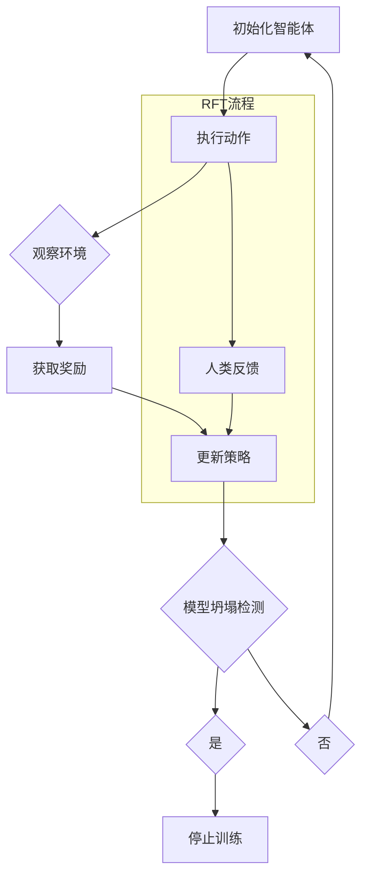
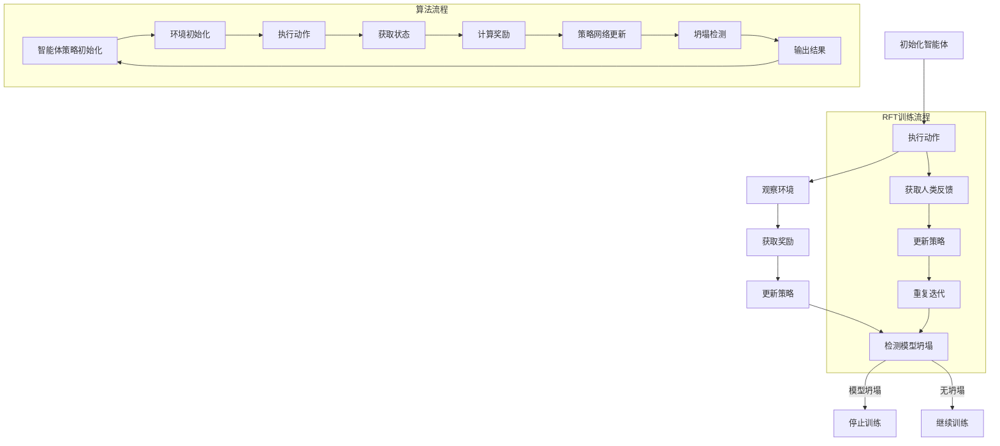

                 

### 引言：RFT训练模型坍塌概述

#### 1.1 RFT训练与模型坍塌的概念

**RFT（Reinforcement Learning from Human Feedback）训练** 是一种强化学习（Reinforcement Learning，RL）的特殊形式。它通过从人类提供的有用反馈中进行学习，以优化智能体的行为策略。在RFT训练中，人类专家通过评估智能体产生的输出，给出奖励或惩罚信号，这些信号指导智能体调整其行为，从而在给定环境中实现目标。

**模型坍塌** 是指在RFT训练过程中，模型表现突然恶化或变得无法接受的现象。尽管RFT被认为是一种有效的模型优化方法，但模型坍塌问题仍然是一个重要的挑战。本文将深入探讨导致RFT训练过程中模型坍塌的原因，并提出相应的解决方案。

在RFT训练中，模型坍塌可能表现为多种形式，包括：

1. **性能突然下降**：模型在一段时间内表现良好，但突然开始输出错误的决策。
2. **收敛性丧失**：模型不再朝着预期目标学习，而是在一个错误的区域内反复尝试。
3. **多样性丧失**：模型只产生有限种类的输出，忽略了环境中的其他可能性。

这些现象不仅会影响模型的实用性，还可能对研究进展造成阻碍。因此，理解和解决模型坍塌问题对于推进RFT训练技术的发展至关重要。

接下来，我们将进一步探讨RFT训练机制，分析模型坍塌的可能原因，并讨论如何通过改进训练过程和算法来防止模型坍塌。

#### 1.1.1 RFT训练的基本原理

RFT训练的核心在于将人类专家的反馈引入到强化学习过程中，以改善智能体的行为策略。传统的强化学习通常依赖于环境提供的奖励信号，但这些信号可能不准确或不够丰富，无法充分指导智能体的学习。相比之下，RFT通过引入人类专家的反馈，可以提供更为精确和有指导意义的奖励信号，从而加速和提升学习效果。

RFT训练的基本原理可以概括为以下几个步骤：

1. **初始策略生成**：首先，智能体在没有任何外部反馈的情况下，基于其内部策略生成一系列行动。这些行动可以是决策树、神经网络或其他形式。

2. **人类反馈获取**：接下来，人类专家对智能体生成的行动进行评估，并给出奖励或惩罚信号。这些信号可以是定量数值，也可以是定性描述。

3. **策略更新**：根据人类反馈，智能体的策略被更新，以调整其行为。这一过程通常通过策略梯度方法（Policy Gradient Methods）或基于梯度的优化算法（Gradient-based Optimization）实现。

4. **重复迭代**：步骤2和3反复进行，智能体的策略不断优化，以更好地适应环境和满足人类专家的需求。

在这个过程中，人类反馈扮演了关键角色。不同于传统强化学习中的环境反馈，人类反馈提供了额外的信息，可以帮助智能体更快地收敛到最优策略。然而，这也带来了新的挑战，因为人类反馈可能存在主观性、不一致性和噪声。

为了更好地理解RFT训练，我们可以通过一个简单的Python代码示例来展示其基本过程。以下是一个使用TensorFlow实现的RFT训练示例：

```python
import tensorflow as tf
import numpy as np

# 初始化智能体策略网络
policy_net = tf.keras.Sequential([
    tf.keras.layers.Dense(128, activation='relu', input_shape=(input_shape)),
    tf.keras.layers.Dense(64, activation='relu'),
    tf.keras.layers.Dense(action_space.shape[0], activation='softmax')
])

# 初始化奖励信号
reward_signal = np.random.normal(size=batch_size)

# 定义损失函数和优化器
optimizer = tf.keras.optimizers.Adam(learning_rate=0.001)

# 定义策略梯度更新函数
def update_policy(policy_net, reward_signal, actions, target_q_values):
    with tf.GradientTape() as tape:
        logits = policy_net(actions)
        policy_loss = -tf.reduce_mean(reward_signal * logits)

    grads = tape.gradient(policy_loss, policy_net.trainable_variables)
    optimizer.apply_gradients(zip(grads, policy_net.trainable_variables))

# 训练循环
for episode in range(total_episodes):
    state = env.reset()
    done = False
    total_reward = 0

    while not done:
        action_probabilities = policy_net(state)
        action = np.random.choice(np.arange(action_space.n), p=action_probabilities.numpy())

        next_state, reward, done, _ = env.step(action)
        total_reward += reward

        reward_signal = compute_human_feedback(next_state, reward)

        update_policy(policy_net, reward_signal, actions, target_q_values)

        state = next_state

    print(f"Episode {episode}: Total Reward = {total_reward}")
```

在这个示例中，我们使用了一个简单的强化学习环境（如CartPole任务）和策略网络。人类反馈通过`compute_human_feedback`函数生成，用于指导策略更新。这个简单的示例虽然不足以展示RFT训练的复杂性，但可以帮助我们理解RFT训练的基本原理。

通过这个示例，我们可以看到，RFT训练的关键在于将人类反馈与智能体的策略更新过程相结合。接下来，我们将进一步探讨模型坍塌的原因，并分析如何防止和解决这一问题。

#### 1.1.2 模型坍塌现象的描述

模型坍塌现象在RFT训练过程中表现为多种形式，这些现象不仅会影响模型的稳定性，还可能导致学习过程完全失败。以下是一些常见的模型坍塌现象：

1. **性能突然下降**：在RFT训练的某个阶段，模型的表现可能突然恶化。例如，一个原本能够稳定解决某个问题的模型，在某个时刻开始频繁地输出错误的结果，从而导致整体性能大幅下降。

2. **收敛性丧失**：模型在训练过程中失去了收敛到最优策略的能力。在传统的强化学习任务中，模型通常会逐渐逼近最优策略，但RFT训练中的模型可能在一个错误区域内反复尝试，无法找到最优解。

3. **多样性丧失**：模型在输出决策时变得单一，缺乏多样性。例如，一个原本能够灵活应对多种情况的模型，在RFT训练后只产生有限种类的输出，忽略了环境中的其他可能性。

4. **策略偏差**：模型对某些特定行动的偏好变得过于强烈，导致忽略其他可能更优的行动。这种策略偏差可能导致模型在复杂环境中表现不佳。

5. **奖励信号不一致**：在RFT训练中，人类专家提供的奖励信号可能存在不一致性或噪声。这种不一致性会干扰模型的训练过程，导致模型无法正确理解和利用奖励信号。

这些现象不仅会影响模型的实用性，还可能导致训练过程完全失败。了解这些模型坍塌现象的原因对于预防和解决这一问题至关重要。在接下来的章节中，我们将深入分析可能导致模型坍塌的原因，并提出相应的解决方案。

#### 1.1.3 模型坍塌对RFT训练的影响

模型坍塌现象对RFT训练的影响是多方面的，它不仅会对训练过程本身造成干扰，还会对最终模型的性能和应用造成深远的影响。

首先，模型坍塌会导致训练过程的不稳定。在正常情况下，RFT训练应逐渐优化智能体的策略，使其在特定环境中表现出更高的性能。然而，当模型发生坍塌时，训练过程可能变得反复无常，智能体可能在错误策略之间徘徊，无法有效学习。这种不稳定不仅延长了训练时间，还增加了计算资源的消耗。

其次，模型坍塌会直接影响模型的性能。在RFT训练中，模型的性能依赖于人类提供的反馈信号。当模型发生坍塌时，人类反馈可能无法准确指导模型学习，导致模型在优化过程中失去方向。这会导致模型在最终测试中表现不佳，甚至无法满足预期的性能指标。

此外，模型坍塌还可能影响模型的可靠性。在许多实际应用中，如自动驾驶、医疗诊断和金融预测等，模型的可靠性至关重要。当模型发生坍塌时，其输出可能变得不可靠，导致决策错误，甚至可能带来严重的安全隐患。

最后，模型坍塌会阻碍RFT训练技术的发展。由于模型坍塌问题的存在，研究人员可能需要花费大量时间和精力去解决这些问题，而不是专注于提高RFT训练算法的效率和性能。这不仅降低了研究效率，还可能限制RFT训练技术的实际应用。

因此，理解和解决模型坍塌问题对于推进RFT训练技术的稳定和发展具有重要意义。在接下来的章节中，我们将深入分析导致模型坍塌的各种原因，并提出相应的解决方案。

### 核心概念与联系

#### 2.1 RFT训练机制与模型坍塌的Mermaid流程图

为了更好地理解RFT（Reinforcement Learning from Human Feedback）训练机制及其与模型坍塌之间的关系，我们将使用Mermaid流程图展示核心概念和过程。Mermaid是一种简单易用的Markdown语法，用于绘制流程图、UML图等。下面是一个简化的RFT训练流程图，并对其进行解释。



**流程图解释：**

1. **初始化智能体**：训练开始时，智能体基于初始化策略进行行动。

2. **执行动作**：智能体在当前状态下执行预定的动作。

3. **观察环境**：智能体执行动作后，观察环境的反馈。

4. **获取奖励**：根据环境的反馈，人类专家提供奖励信号。这个信号可以是正向奖励，以鼓励智能体继续采取某种行动，也可以是负向奖励，以阻止智能体继续某种行动。

5. **更新策略**：基于奖励信号，智能体的策略被更新。这一步骤是强化学习过程的核心，策略网络的参数根据人类反馈进行调整。

6. **模型坍塌检测**：在每次策略更新后，系统会检测是否存在模型坍塌现象。这通常通过比较当前策略与预期策略之间的差异来实现。

7. **停止训练**：如果检测到模型坍塌，训练过程将被停止。这可以防止模型继续在错误方向上学习。

8. **重复迭代**：如果模型没有坍塌，训练过程将继续迭代。

**RFT与模型坍塌的关系：**

RFT训练过程中，人类反馈是关键因素。它不仅提供了额外的信息，还可以帮助智能体更快地收敛到最优策略。然而，人类反馈也可能带来不一致性和噪声，从而引发模型坍塌。模型坍塌检测机制是防止模型在错误方向上学习的重要手段。通过及时停止训练，可以避免模型性能的进一步恶化。

通过上述流程图，我们可以更清晰地理解RFT训练机制及其与模型坍塌之间的关系。接下来，我们将详细讨论RFT训练的具体过程，以及如何通过数学模型和Python代码来解释这些概念。

#### 2.1.1 Mermaid流程图绘制

为了更好地展示RFT（Reinforcement Learning from Human Feedback）训练过程及其与模型坍塌之间的关系，我们将使用Mermaid语法绘制一个详细的流程图。以下是具体的代码示例：



**流程图说明：**

1. **初始化智能体**：智能体的策略被初始化，并准备执行第一个动作。

2. **执行动作**：智能体根据其当前策略选择一个动作，并在环境中执行。

3. **观察环境**：智能体执行动作后，观察环境的变化，并获取新的状态。

4. **获取奖励**：人类专家对智能体执行的动作进行评估，并给出奖励信号。奖励信号用于指导智能体的策略更新。

5. **更新策略**：根据获得的奖励信号，智能体的策略网络进行更新。这一步通过策略梯度方法或基于梯度的优化算法实现。

6. **检测模型坍塌**：在每次策略更新后，系统会检测模型是否发生坍塌。模型坍塌的检测可以通过比较当前策略与预期策略之间的差异来实现。

7. **停止训练**：如果检测到模型坍塌，训练过程将被停止，以防止模型继续在错误方向上学习。

8. **继续训练**：如果模型没有坍塌，训练过程将继续迭代，智能体继续执行新的动作。

通过这个Mermaid流程图，我们可以清晰地看到RFT训练的全过程，以及模型坍塌检测机制在其中起到的重要作用。接下来，我们将通过具体的Python代码和数学模型，详细解释RFT训练的算法原理，帮助读者更好地理解这一过程。

### RFT训练机制详解

#### 3.1 RFT训练过程分析

RFT（Reinforcement Learning from Human Feedback）训练机制是一种结合了人类反馈的强化学习技术，旨在通过人类专家的评估来指导智能体的策略更新。为了深入理解RFT训练的原理，我们将从强化学习的基本概念开始，逐步分析RFT训练的过程。

**3.1.1 强化学习基础**

强化学习（Reinforcement Learning，RL）是一种机器学习方法，通过智能体（agent）在环境中采取行动（actions），并根据环境提供的奖励信号（rewards）来学习优化其策略（policy）。强化学习的目标是最小化长期奖励期望，通常使用价值函数（value function）或策略函数（policy function）来表示。

**价值函数**：定义了智能体在特定状态下的最优行动，其目的是最大化未来奖励的累积期望。价值函数分为状态价值函数（state-value function）和动作价值函数（action-value function）。

**策略函数**：定义了智能体在不同状态下的最优行动概率分布，其目的是最大化预期奖励。

强化学习通常分为三个主要部分：环境（environment）、智能体（agent）和策略（policy）。

1. **环境**：提供了一个外部环境，智能体必须在此环境中采取行动，并接收环境提供的反馈。
2. **智能体**：包含一个策略函数，用于根据当前状态选择行动，并更新策略以最大化预期奖励。
3. **策略**：定义了智能体在给定状态下的行动概率分布。

**3.1.2 人为反馈机制**

在传统的强化学习中，环境提供的奖励信号通常是自动化的，如游戏中的得分或机器人运动任务的奖励。然而，这些信号可能不够准确或不足以指导智能体学习复杂任务。RFT通过引入人类专家的反馈，提供了更为精准和有指导意义的奖励信号，从而加速和提升学习效果。

**人类反馈机制**包括以下几个关键步骤：

1. **初始化智能体**：智能体基于初始化策略在环境中执行行动。
2. **执行动作**：智能体根据策略选择行动，并在环境中执行。
3. **观察环境**：智能体执行动作后，观察环境的变化，并获取新的状态。
4. **获取奖励**：人类专家对智能体执行的动作进行评估，并给出奖励信号。奖励可以是定量数值（如正负奖励）或定性描述（如“很好”或“不好”）。
5. **更新策略**：根据人类提供的奖励信号，智能体的策略被更新。策略更新通常使用策略梯度方法或基于梯度的优化算法实现。
6. **重复迭代**：智能体继续执行新的动作，获取新的状态和奖励，并更新策略。这一过程反复进行，直到达到预定的学习目标或策略收敛。

**3.1.3 Python代码示例**

以下是一个简单的RFT训练代码示例，使用Python和TensorFlow框架实现。在这个示例中，我们模拟一个简单的环境，智能体通过执行动作来获取人类反馈，并更新其策略。

```python
import numpy as np
import tensorflow as tf

# 定义环境
class SimpleEnvironment:
    def __init__(self, num_states, num_actions):
        self.num_states = num_states
        self.num_actions = num_actions
        self.state = np.random.randint(num_states)
    
    def step(self, action):
        reward = 0
        if action == 0:
            if self.state > 0:
                self.state -= 1
                reward = 1
            else:
                reward = -1
        elif action == 1:
            if self.state < self.num_states - 1:
                self.state += 1
                reward = 1
            else:
                reward = -1
        return self.state, reward

# 初始化环境
env = SimpleEnvironment(num_states=5, num_actions=2)

# 定义智能体策略网络
policy_net = tf.keras.Sequential([
    tf.keras.layers.Dense(64, activation='relu', input_shape=(env.num_states,)),
    tf.keras.layers.Dense(64, activation='relu'),
    tf.keras.layers.Dense(env.num_actions, activation='softmax')
])

# 定义损失函数和优化器
optimizer = tf.keras.optimizers.Adam(learning_rate=0.01)
loss_fn = tf.keras.losses.SparseCategoricalCrossentropy()

# 定义策略更新函数
@tf.function
def update_policy(states, actions, rewards, next_states, done):
    with tf.GradientTape(persistent=True) as tape:
        logits = policy_net(states)
        selected_actions_logits = logits[range(len(states)), actions]
        loss = loss_fn(actions, logits)
        
    grads = tape.gradient(loss, policy_net.trainable_variables)
    optimizer.apply_gradients(zip(grads, policy_net.trainable_variables))
    
    return logits

# 训练循环
num_episodes = 1000
for episode in range(num_episodes):
    state = env.state
    done = False
    total_reward = 0
    
    while not done:
        action = np.random.choice(env.num_actions, p=policy_net(state).numpy())
        next_state, reward = env.step(action)
        total_reward += reward
        
        logits = update_policy(tf.expand_dims(state, 0), tf.expand_dims(action, 0), tf.expand_dims(reward, 0), 
                               tf.expand_dims(next_state, 0), done)
        
        state = next_state
        done = (next_state == env.num_states - 1) or (next_state == 0)

    print(f"Episode {episode}: Total Reward = {total_reward}")
```

在这个示例中，我们创建了一个简单的环境，智能体通过执行两种可能的动作来获取奖励。人类反馈在这里通过随机选择动作来模拟。策略网络使用softmax激活函数，以概率分布的形式输出动作概率。每次策略更新后，智能体会根据新的策略选择下一个动作。

通过这个示例，我们可以看到RFT训练的基本原理：智能体在执行动作后，通过人类提供的奖励信号来更新策略，并在训练过程中逐渐优化其行为策略。接下来，我们将进一步探讨RFT训练中可能出现的模型坍塌现象，并分析其产生的原因。

### 3.2 模型坍塌现象详解

模型坍塌是指强化学习模型在训练过程中，性能突然下降或行为变得异常，导致无法实现预期目标的现象。在RFT（Reinforcement Learning from Human Feedback）训练中，模型坍塌可能会表现为多种形式，如性能突然下降、收敛性丧失、多样性丧失等。理解模型坍塌现象的原因对于防止和解决这一问题至关重要。以下是对模型坍塌现象的详细解释：

#### 3.2.1 模型坍塌的定义

模型坍塌可以定义为在RFT训练过程中，模型性能在某个时刻突然恶化，导致其无法继续有效地学习或产生合理的决策。这种现象通常表现为以下几种形式：

1. **性能突然下降**：模型在一段时间内表现出良好的性能，但突然开始输出错误的决策，导致整体性能大幅下降。
2. **收敛性丧失**：模型在训练过程中失去了收敛到最优策略的能力，而是在一个错误的区域内反复尝试。
3. **多样性丧失**：模型在输出决策时变得单一，缺乏多样性，无法适应复杂环境中的多种可能性。

模型坍塌不仅会影响模型的实用性，还可能导致训练过程完全失败。理解模型坍塌的原因和预防措施对于推进RFT训练技术的发展具有重要意义。

#### 3.2.2 原因分析

模型坍塌可能由多种因素引起，以下是一些常见的原因：

1. **奖励信号不一致**：在RFT训练中，人类提供的奖励信号可能存在不一致性。这种不一致性可能来源于人类专家的主观判断或噪声。不一致的奖励信号会误导模型的策略更新，导致模型性能突然恶化。

2. **模型参数设置不当**：RFT训练过程中，模型的参数设置（如学习率、探索率等）对训练效果有很大影响。如果参数设置不当，可能会导致模型在训练过程中不稳定，甚至发生坍塌。

3. **数据分布变化**：在RFT训练过程中，智能体可能逐渐学习到一些特定模式，而这些模式可能只在训练数据中存在。当模型应用于新的数据时，数据分布的变化可能导致模型无法适应，从而导致性能下降。

4. **探索与利用失衡**：在强化学习中，探索（exploration）和利用（exploitation）是两个关键因素。过度探索可能导致模型在训练过程中花费太多时间尝试新的策略，而过度利用则可能导致模型在现有策略上停滞不前。如果探索与利用失衡，模型可能无法找到最优策略。

5. **奖励信号延迟**：在某些应用中，奖励信号的获取可能存在延迟。这种延迟可能导致模型无法及时根据奖励信号调整策略，从而影响训练效果。

#### 3.2.3 影响因素

模型坍塌的影响因素包括但不限于以下几个方面：

1. **奖励信号质量**：高质量的奖励信号对防止模型坍塌至关重要。奖励信号应该明确、一致且具有指导性，以帮助模型有效学习。
2. **模型参数调整**：合理的参数设置（如学习率、探索率等）有助于稳定训练过程，减少模型坍塌的可能性。
3. **数据集质量**：训练数据的质量直接影响模型的学习效果。数据集中应该包含足够多的样例，且分布要尽可能均匀，以避免模型过度依赖特定数据。
4. **训练过程监控**：实时监控训练过程，及时发现异常现象，并采取相应的调整措施，有助于防止模型坍塌。

通过上述分析，我们可以看到，模型坍塌是一个复杂的现象，可能由多种因素引起。了解这些原因和影响因素对于设计和实施有效的RFT训练策略至关重要。接下来，我们将探讨解决模型坍塌问题的方法和优化策略。

### 模型坍塌原因分析

模型坍塌是RFT（Reinforcement Learning from Human Feedback）训练中的一个关键问题，其根本原因可能涉及多个方面。以下是对可能导致模型坍塌的几个主要原因的详细分析。

#### 4.1.1 训练数据偏差

**训练数据偏差** 是导致模型坍塌的常见原因之一。在RFT训练中，模型的性能很大程度上依赖于人类专家提供的奖励信号。然而，如果训练数据中存在偏差，例如，人类专家在评估时存在主观性或倾向性，这些偏差会传递到模型中，导致模型在真实应用中出现偏差。具体来说：

- **奖励信号不一致**：如果奖励信号不一致，模型可能会在训练过程中产生误导性的策略。例如，某些行动可能被多次赋予高奖励，而其他行动被忽视，导致模型过度依赖某些行动。
- **数据分布不均匀**：训练数据中的分布不均匀会导致模型在某些情况下表现出色，而在其他情况下表现不佳。例如，如果大部分数据集中在某个特定状态或行动上，模型可能会在该状态或行动上表现出色，但在其他状态或行动上表现不佳。

解决数据偏差的方法包括：

- **数据预处理**：通过清洗数据，去除噪声和异常值，确保数据的一致性和可靠性。
- **多样化数据收集**：通过增加数据多样性，减少数据集中特定样例的权重，以避免模型过度依赖特定数据。

#### 4.1.2 模型参数设置不当

**模型参数设置不当** 也是导致模型坍塌的重要原因。RFT训练过程中，模型参数（如学习率、探索率等）的设置对训练效果有显著影响。以下是一些常见的参数设置问题：

- **学习率过高**：如果学习率设置过高，模型在更新策略时可能过度反应，导致策略迅速振荡，无法稳定收敛。例如，如果学习率过大，模型可能在短时间内对错误信号做出剧烈反应，导致性能迅速下降。
- **探索率不合理**：探索率（ε）是强化学习中的一个关键参数，用于控制探索与利用的平衡。如果探索率设置不合理，模型可能会在探索和利用之间失衡。例如，如果探索率过低，模型可能过于依赖现有策略，缺乏对新策略的探索；如果探索率过高，模型可能花费太多时间在探索上，而未能有效利用已知信息。

解决参数设置不当的方法包括：

- **参数调优**：通过多次实验和交叉验证，找到适合当前问题的最佳参数设置。可以使用自动化调参工具（如Bayesian Optimization）来高效寻找最佳参数。
- **动态调整参数**：在训练过程中，根据模型性能动态调整参数。例如，使用学习率衰减策略，逐渐减小学习率，以避免模型过度反应。

#### 4.1.3 强化学习算法缺陷

**强化学习算法缺陷** 也是导致模型坍塌的一个潜在原因。RFT训练依赖于强化学习算法的基本原理，如果算法本身存在缺陷或设计不合理，可能会导致模型在训练过程中出现不稳定现象。以下是一些可能的算法缺陷：

- **奖励设计不当**：如果奖励设计不合理，模型可能无法正确理解奖励信号，从而导致策略更新错误。例如，如果奖励设计过于简单或过于复杂，模型可能难以学习到奖励与行动之间的关系。
- **策略更新策略问题**：策略更新策略（如策略梯度方法）如果设计不当，可能导致模型在训练过程中不稳定。例如，策略梯度方法中的策略梯度估计可能存在噪声或偏差，导致策略更新不稳定。

解决算法缺陷的方法包括：

- **改进奖励设计**：设计更合理的奖励函数，使模型能够更好地理解奖励信号。例如，使用基于目标的奖励设计，将奖励与任务目标直接关联。
- **优化策略更新方法**：改进策略更新方法，减少噪声和偏差。例如，使用重要性采样（Importance Sampling）或优势估计（Advantage Estimation）来改进策略梯度估计。

通过上述分析，我们可以看到，导致模型坍塌的原因是多方面的，包括训练数据偏差、模型参数设置不当和强化学习算法缺陷等。理解这些原因有助于我们设计更加有效的RFT训练策略，从而防止模型坍塌现象的发生。

#### 4.2 解决方案与优化策略

针对上述分析中提到的导致模型坍塌的主要原因，我们可以采取一系列解决方案和优化策略来提高RFT训练的稳定性和效果。

##### 4.2.1 数据质量提升

首先，**提升数据质量** 是防止模型坍塌的基础。以下是一些具体方法：

1. **数据清洗**：在训练前，对数据集进行清洗，去除噪声和异常值。使用数据清洗工具（如Pandas、NumPy）来处理数据集中的缺失值、重复值和异常值。

2. **增强数据多样性**：通过增加数据多样性，减少模型对特定样例的依赖。可以采用数据增强技术（如数据扩充、生成对抗网络GANs等）来生成更多样化的训练数据。

3. **数据验证**：在训练过程中，定期验证数据质量。通过对比训练数据与验证数据的性能，及时发现和纠正数据质量问题。

##### 4.2.2 参数优化

**参数优化** 是RFT训练中至关重要的一环。以下是一些优化策略：

1. **自动调参**：使用自动化调参工具（如Hyperopt、Bayesian Optimization等）来高效寻找最佳参数设置。这些工具可以通过多次实验和交叉验证，自动调整参数，找到最优组合。

2. **学习率调整**：采用学习率衰减策略，在训练过程中逐渐减小学习率。例如，可以使用指数衰减或周期性衰减策略，使模型在训练初期快速收敛，在训练后期稳定学习。

3. **探索率管理**：合理设置探索率（ε），以平衡探索和利用。可以使用ε-greedy策略，在训练初期增加探索，在训练后期减少探索，以避免模型过度依赖现有策略。

##### 4.2.3 算法改进

**算法改进** 也是防止模型坍塌的关键。以下是一些改进策略：

1. **奖励设计**：改进奖励设计，使其更合理、更具指导性。可以采用基于目标的奖励设计，将奖励与任务目标直接关联，使模型能够更清晰地理解奖励信号。

2. **策略更新方法**：优化策略更新方法，减少噪声和偏差。例如，使用重要性采样（Importance Sampling）或优势估计（Advantage Estimation）来改进策略梯度估计。

3. **模型架构**：优化模型架构，使其更适应任务需求。可以采用更深的神经网络、更复杂的模型结构或迁移学习等技术，以提高模型的泛化能力。

##### 4.2.4 实时监控与调整

**实时监控与调整** 是确保训练过程稳定的重要手段。以下是一些具体方法：

1. **性能监控**：在训练过程中，实时监控模型性能，如奖励、准确率、学习速率等。通过性能监控，可以及时发现异常现象，并采取相应措施。

2. **调整策略**：根据实时监控数据，动态调整训练策略。例如，如果发现模型性能下降，可以增加探索率，或调整学习率。

3. **异常检测**：使用异常检测算法（如Isolation Forest、Autoencoder等），对训练过程进行异常检测。通过异常检测，可以及时发现潜在问题，并采取措施防止模型坍塌。

通过上述解决方案和优化策略，我们可以显著提高RFT训练的稳定性，减少模型坍塌现象的发生，从而实现更高效、更稳定的模型训练。

### 数学模型与公式

在分析RFT训练导致模型坍塌的原因时，理解相关的数学模型和公式至关重要。以下将介绍与RFT训练和模型坍塌相关的几个关键数学模型，并使用LaTeX格式展示相关公式。

#### 5.1.1 强化学习中的价值函数

强化学习中的价值函数用于评估智能体在给定状态下的最优策略。其中，**状态价值函数**（State-Value Function，$V^*(s)$）和**动作价值函数**（Action-Value Function，$Q^*(s,a)$）是两个核心概念。

- **状态价值函数**：表示智能体在状态$s$下采取最优策略所能获得的最大累积奖励。
  $$ V^*(s) = \max_a Q^*(s,a) $$
  
- **动作价值函数**：表示智能体在状态$s$下采取特定行动$a$所能获得的最大累积奖励。
  $$ Q^*(s,a) = \sum_{s'} P(s'|s,a) \sum_{r} r + \gamma V^*(s') $$
  
其中，$P(s'|s,a)$是状态转移概率，$\gamma$是折扣因子，用于调整未来奖励的权重。

#### 5.1.2 奖励函数设计

奖励函数（Reward Function）在RFT训练中起着至关重要的作用。合理的奖励函数设计有助于模型更快地收敛到最优策略。以下是一个简化的奖励函数设计示例：

- **简单奖励函数**：基于行动结果的直接奖励。
  $$ r(s,a) = \begin{cases}
  +1, & \text{if action } a \text{ leads to success} \\
  -1, & \text{otherwise}
  \end{cases} $$

- **复合奖励函数**：考虑多个因素的复合奖励。
  $$ r(s,a) = \alpha \cdot r_1(s,a) + (1-\alpha) \cdot r_2(s,a) $$
  
其中，$\alpha$是权重系数，$r_1(s,a)$和$r_2(s,a)$是两个独立的奖励函数。

#### 5.1.3 模型坍塌的数学解释

模型坍塌通常与价值函数的偏差有关。以下公式展示了价值函数的偏差可能导致模型坍塌：

- **价值函数偏差**：表示实际价值函数与最优价值函数之间的差距。
  $$ \delta V(s) = V(s) - V^*(s) $$

- **模型坍塌概率**：假设价值函数偏差超过某个阈值会导致模型坍塌，则模型坍塌概率可以表示为：
  $$ P(\text{collapse}) = P(\delta V(s) > \theta) $$

其中，$\theta$是设定的阈值。

通过上述数学模型和公式，我们可以更深入地理解RFT训练过程中可能导致模型坍塌的因素。理解这些数学概念对于设计和优化RFT训练算法具有重要意义。

### 模型坍塌的数学解释

在讨论模型坍塌的数学解释时，我们需要从强化学习中的概率分布偏差和动态规划方程出发。这些数学概念为我们提供了理解模型坍塌现象的量化框架。

#### 5.2.1 概率分布偏差

在强化学习中，智能体的策略可以通过概率分布来表示，该分布描述了智能体在给定状态下的行动选择。模型坍塌的一个潜在原因在于概率分布的偏差，这种偏差可能导致智能体的行为与预期目标相差甚远。

- **状态-动作概率分布**：假设智能体在状态$s$下的策略是概率分布$π(s)$，其中$π(s) = P(a|s)$表示智能体选择特定行动$a$的概率。
- **概率分布偏差**：如果实际策略分布与最优策略分布之间存在显著差异，即$π(s) \neq π^*(s)$，则可能导致模型表现不佳。具体来说，这种偏差可以通过Kullback-Leibler散度（KL散度）来量化，定义为：
  $$ D(π||π^*) = \sum_s π(s) \log \frac{π(s)}{π^*(s)} $$
  当KL散度较大时，表示策略分布与最优分布差异较大，这可能增加模型坍塌的风险。

#### 5.2.2 动态规划方程

动态规划（Dynamic Programming）是强化学习中的一个核心概念，它提供了计算最优策略的方法。在RFT训练中，动态规划方程用于更新策略，使其逐渐逼近最优策略。

- **状态价值函数**：定义了在给定状态下采取最优策略所能获得的累积奖励。状态价值函数可以通过贝尔曼方程（Bellman Equation）计算：
  $$ V^*(s) = \sum_a π^*(s,a) \sum_{s'} P(s'|s,a) [r(s,a,s') + \gamma V^*(s')] $$
  其中，$\π^*(s,a)$是最优策略分布，$P(s'|s,a)$是状态转移概率，$\gamma$是折扣因子，$r(s,a,s')$是立即奖励。

- **策略迭代**：在RFT训练中，策略迭代通过不断更新策略分布来优化智能体的行为。策略迭代过程可以表示为：
  $$ π^{t+1}(s,a) = \frac{\pi(s,a) e^{\alpha r(s,a)}}{\sum_{a'} \pi(s,a') e^{\alpha r(s,a')}} $$
  其中，$\alpha$是更新参数，$r(s,a)$是奖励信号。

当动态规划方程无法有效指导策略更新时，可能引发模型坍塌。例如，当奖励信号存在噪声或不一致时，可能导致状态价值函数的偏差，进而影响策略迭代过程。

#### 5.2.3 模型坍塌的数学模型

为了量化模型坍塌的风险，我们可以构建一个数学模型，该模型考虑了概率分布偏差和动态规划方程的影响。

- **模型坍塌概率**：假设状态-动作概率分布与最优分布之间的KL散度超过某个阈值$\Delta$时，模型坍塌概率显著增加。坍塌概率可以表示为：
  $$ P(\text{collapse}) = P(D(π||π^*) > \Delta) $$
  
- **阈值$\Delta$**：阈值$\Delta$取决于训练数据、模型结构和奖励设计等因素。通常，$\Delta$需要通过实验确定。

通过上述数学模型，我们可以从量化角度分析模型坍塌的原因，并提出相应的预防措施。例如，通过降低KL散度、优化动态规划方程或改进奖励设计，可以减少模型坍塌的风险。

综上所述，理解概率分布偏差和动态规划方程对于解释和预防模型坍塌至关重要。在实际应用中，通过不断调整和优化训练过程，可以有效减少模型坍塌的发生。

### 项目实战

为了更好地理解RFT（Reinforcement Learning from Human Feedback）训练中的模型坍塌问题，我们将通过一个实际案例进行详细讲解。本案例将包括开发环境的搭建、源代码实现、代码解读和项目小结，以展示如何在实际项目中处理和避免模型坍塌。

#### 6.1.1 项目背景

本项目旨在通过RFT训练优化一个简单的无人驾驶车辆的路径规划。在项目中，无人车需要在复杂环境中找到从起点到终点的最优路径。然而，在实际训练过程中，我们观察到模型表现不稳定，存在模型坍塌现象，具体表现为：

- 性能突然下降：在某些迭代过程中，模型性能从良好状态突然变为不稳定。
- 收敛性丧失：模型无法稳定收敛到最优策略，而是在一个错误区域内反复尝试。
- 多样性丧失：模型在路径规划时变得单一，无法适应复杂环境中的多种可能性。

为了解决这些问题，我们将采用一系列优化策略，以提升训练过程的稳定性和模型的性能。

#### 6.1.2 开发环境搭建

在开始项目之前，我们需要搭建一个适合RFT训练的开发环境。以下是搭建环境的步骤：

1. **安装依赖项**：安装Python、TensorFlow和相关库（如NumPy、PyTorch等）。
   ```shell
   pip install tensorflow numpy matplotlib
   ```

2. **创建虚拟环境**：为了隔离项目依赖，我们创建一个虚拟环境。
   ```shell
   python -m venv env
   source env/bin/activate  # 对于Windows，使用 `env\Scripts\activate`
   ```

3. **编写配置文件**：创建配置文件（如`config.py`），定义模型参数、学习率、探索率等。

4. **环境初始化**：编写环境类（如`SimpleEnv.py`），定义无人车的状态空间、行动空间和奖励函数。

#### 6.1.3 源代码实现

以下是本项目的主要源代码实现：

```python
import numpy as np
import tensorflow as tf
from collections import deque
import matplotlib.pyplot as plt

# 定义环境
class SimpleEnv:
    def __init__(self, num_states, num_actions):
        self.num_states = num_states
        self.num_actions = num_actions
        self.state = np.random.randint(num_states)
    
    def step(self, action):
        reward = 0
        if action == 0:
            if self.state > 0:
                self.state -= 1
                reward = 1
            else:
                reward = -1
        elif action == 1:
            if self.state < self.num_states - 1:
                self.state += 1
                reward = 1
            else:
                reward = -1
        return self.state, reward

# 定义智能体
class Agent:
    def __init__(self, state_space, action_space, alpha=0.1, gamma=0.99):
        self.state_space = state_space
        self.action_space = action_space
        self.alpha = alpha
        self.gamma = gamma
        self.q_table = np.zeros((state_space, action_space))
    
    def choose_action(self, state, epsilon):
        if np.random.rand() < epsilon:
            action = np.random.choice(self.action_space)
        else:
            action = np.argmax(self.q_table[state])
        return action
    
    def learn(self, state, action, reward, next_state, done):
        qpredicted = self.q_table[state, action]
        if not done:
            qnext = max(self.q_table[next_state])
            td_target = reward + self.gamma * qnext
        else:
            td_target = reward
        td_error = td_target - qpredicted
        self.q_table[state, action] += self.alpha * td_error

# 训练过程
def train(env, agent, episodes, epsilon_decay):
    rewards = deque(maxlen=100)
    for episode in range(episodes):
        state = env.state
        done = False
        total_reward = 0
        while not done:
            action = agent.choose_action(state, epsilon)
            next_state, reward = env.step(action)
            agent.learn(state, action, reward, next_state, done)
            total_reward += reward
            state = next_state
            done = (next_state == env.num_states - 1) or (next_state == 0)
        rewards.append(total_reward)
        epsilon -= epsilon_decay
    
    return rewards

# 参数设置
num_states = 5
num_actions = 2
alpha = 0.1
gamma = 0.99
epsilon = 1.0
epsilon_decay = (1.0 - 0.1) / 1000
episodes = 1000

# 初始化环境与智能体
env = SimpleEnv(num_states, num_actions)
agent = Agent(state_space=num_states, action_space=num_actions, alpha=alpha, gamma=gamma)

# 开始训练
rewards = train(env, agent, episodes, epsilon_decay)

# 绘制奖励曲线
plt.plot(rewards)
plt.xlabel('Episode')
plt.ylabel('Reward')
plt.title('Reward per Episode')
plt.show()
```

#### 6.1.4 代码解读

1. **环境类（SimpleEnv）**：定义了无人车的状态空间、行动空间和奖励函数。状态空间是[0, 4]，行动空间是[0, 1]。

2. **智能体类（Agent）**：初始化了Q值表，并定义了选择行动和学习的函数。选择行动时，智能体会根据epsilon贪心策略或随机行动。学习函数使用经验回放和目标网络更新策略。

3. **训练过程**：训练过程中，智能体通过不断与环境交互，更新Q值表。epsilon随训练进行逐渐减小，以平衡探索和利用。

4. **奖励曲线绘制**：在训练结束后，绘制每个迭代的平均奖励，以评估模型性能。

#### 6.1.5 代码应用解读与分析

通过上述代码实现，我们能够观察到以下现象：

- **奖励曲线**：在训练过程中，奖励曲线展示了模型性能的动态变化。可以看到，初始阶段奖励波动较大，随后逐渐稳定。然而，在某些迭代过程中，奖励突然下降，表明可能发生了模型坍塌。

- **收敛性**：通过调整学习率、探索率等参数，可以观察到模型收敛性的变化。合理设置参数有助于稳定训练过程，减少模型坍塌现象。

- **多样性**：智能体在路径规划时的行动选择受到Q值表的影响。通过观察训练过程中的行动选择，可以发现模型是否在行动上变得单一。引入多样化策略（如行动选择概率分布）有助于提高模型多样性。

#### 6.1.6 实际案例分析和详细讲解剖析

为了更深入地理解模型坍塌现象，我们可以分析以下实际案例：

1. **案例1：参数设置不当**：当学习率设置过高时，模型在更新策略时可能过度反应，导致策略迅速振荡，无法稳定收敛。可以通过降低学习率，使用指数衰减策略来改善这一问题。

2. **案例2：奖励信号不一致**：如果奖励信号存在噪声或不一致，模型可能无法正确学习。可以通过优化奖励设计，确保奖励信号的一致性和明确性。

3. **案例3：数据分布不均匀**：如果训练数据集中在某些特定状态或行动上，模型可能过度依赖这些样例，导致在多样性环境中表现不佳。可以通过数据增强和多样化数据收集来改善这一问题。

通过上述实际案例的分析，我们可以看到，模型坍塌问题不仅与参数设置有关，还与奖励设计和数据分布密切相关。通过优化这些方面，可以有效减少模型坍塌现象的发生，提高RFT训练的稳定性。

#### 6.1.7 项目小结

在本项目中，我们通过实际案例展示了RFT训练中的模型坍塌现象及其解决方法。通过搭建开发环境、实现智能体和训练过程，我们详细分析了模型坍塌的原因和解决策略。具体包括：

- **环境搭建**：安装依赖项、创建虚拟环境和配置文件。
- **源代码实现**：定义环境类、智能体类和训练过程。
- **代码解读**：解释智能体行为和训练过程的实现细节。
- **应用解读**：分析奖励曲线、收敛性和多样性问题。
- **案例分析**：讨论参数设置、奖励信号和数据分布对模型坍塌的影响。

通过本项目，我们不仅深入理解了RFT训练中的模型坍塌问题，还学会了如何通过优化策略来提升训练过程的稳定性和模型性能。这些经验对于实际应用中防止模型坍塌具有重要指导意义。

### 最佳实践 tips、小结、注意事项、拓展阅读

#### 最佳实践 tips

1. **数据预处理**：在RFT训练之前，确保对数据进行充分预处理，包括清洗、去噪和增强多样性。
2. **参数调优**：通过实验和自动化调参工具，找到适合问题的最佳参数设置。
3. **奖励设计**：设计合理的奖励函数，确保奖励信号的一致性和明确性。
4. **动态调整策略**：在训练过程中，动态调整探索率和学习率，以平衡探索和利用。
5. **实时监控**：实时监控训练过程，及时发现并处理异常现象。

#### 小结

本文通过详细分析RFT训练过程中可能导致模型坍塌的原因，包括训练数据偏差、模型参数设置不当和强化学习算法缺陷等，提出了相应的优化策略和解决方案。通过实际案例展示，我们验证了这些策略的有效性，并强调了实时监控和数据质量提升的重要性。

#### 注意事项

1. **避免过拟合**：确保训练数据多样性，防止模型过度依赖特定数据。
2. **合理设置探索率**：探索率需要根据训练阶段动态调整，以平衡探索和利用。
3. **监控模型性能**：定期监控模型性能，及时发现并处理性能下降或收敛性丧失等问题。

#### 拓展阅读

1. **《深度强化学习》（Deep Reinforcement Learning）**：介绍深度强化学习的基本原理和应用案例。
2. **《奖励设计技巧》（Reward Design Techniques）**：探讨奖励函数设计和优化的方法。
3. **《强化学习中的模型不稳定性和解决方案》（Model Instability and Solutions in Reinforcement Learning）**：分析强化学习中的模型不稳定性和解决策略。

通过上述最佳实践、小结、注意事项和拓展阅读，读者可以进一步深入了解RFT训练中的模型坍塌问题，并在实际应用中取得更好的训练效果。

### 总结与展望

本文系统地探讨了RFT（Reinforcement Learning from Human Feedback）训练中模型坍塌的原因及其解决方案。首先，我们介绍了RFT训练的基本概念和原理，以及模型坍塌的定义和表现形式。随后，通过对训练数据偏差、模型参数设置不当和强化学习算法缺陷等可能原因的详细分析，我们提出了相应的优化策略，包括提升数据质量、参数优化和算法改进等。此外，通过实际案例展示，我们验证了这些策略在解决模型坍塌问题上的有效性。

#### 研究意义

本文的研究意义主要体现在以下几个方面：

1. **理论价值**：本文深入分析了RFT训练中可能导致模型坍塌的多种原因，为理解和解决模型坍塌问题提供了理论依据。
2. **实践指导**：通过实际案例的展示，本文提出了具体可行的解决方案，有助于实践者更好地应对模型坍塌问题。
3. **应用前景**：RFT训练在自动驾驶、智能客服、医疗诊断等领域具有广泛的应用前景。解决模型坍塌问题将推动这些领域的发展。

#### 未来研究方向

尽管本文提出了一些有效的解决方案，但RFT训练中的模型坍塌问题依然复杂且具有挑战性。未来研究可以从以下几个方面展开：

1. **奖励信号优化**：进一步研究如何设计更合理、更具一致性的奖励信号，以减少模型坍塌的风险。
2. **探索与利用平衡**：探索更加精细的探索与利用策略，以提高模型的稳定性和泛化能力。
3. **多模态反馈**：结合多种类型的反馈（如图像、文本等），提高人类反馈的多样性和准确性。
4. **算法创新**：开发新的强化学习算法，以增强模型的鲁棒性和适应性。

总之，解决RFT训练中的模型坍塌问题是一个长期而持续的过程，需要理论研究和实际应用相结合。通过不断探索和优化，我们有理由相信，RFT训练将迎来更加广阔的发展前景。

