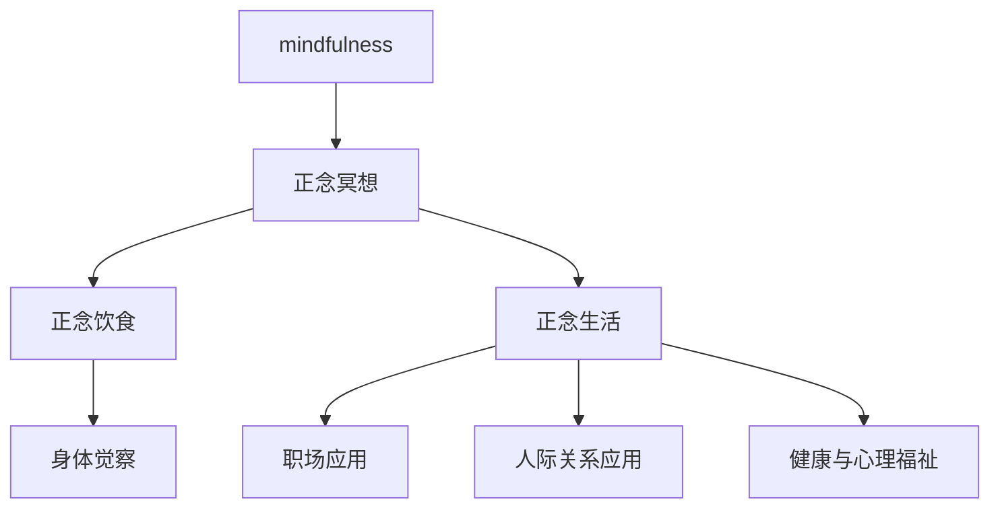
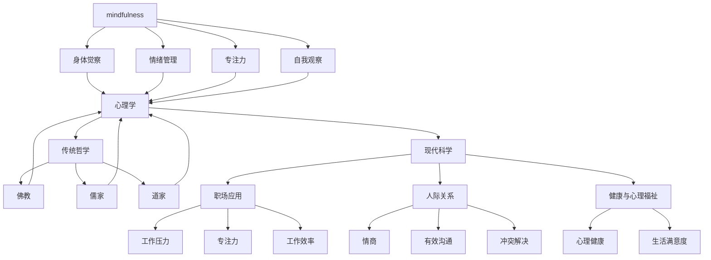
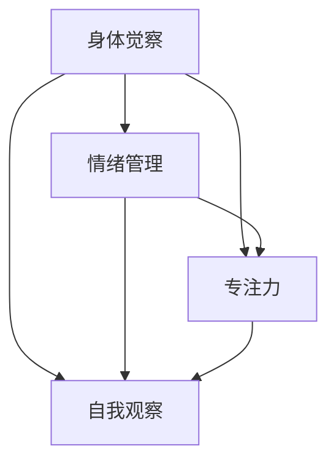

                 

### 《mindfulness实践：当下体验中的意义发现》

#### 关键词：
- Mindfulness
- 正念冥想
- 当下体验
- 心理学
- 人际关系
- 职场压力
- 健康与心理福祉

#### 摘要：
本文深入探讨了Mindfulness（正念）这一心理实践的概念、理论基础、核心实践方法，以及其在职场、人际关系和健康心理福祉等领域的应用。文章首先介绍了Mindfulness的历史背景和定义，随后探讨了其与心理学、传统哲学的关系，并综述了现代科学的研究进展。接着，文章详细讲解了Mindfulness的核心实践，如正念冥想、正念饮食与身体觉察，以及其在日常生活中的应用。随后，文章针对职场中的工作压力、人际关系中的挑战，以及健康与心理福祉的重要性，展示了Mindfulness实践的具体指南和成功案例。最后，文章探讨了Mindfulness实践中的常见障碍和解决方法，以及对个人成长和社会意义的影响。通过本文的阅读，读者将深入了解Mindfulness实践在提升个人生活质量和幸福感方面的巨大潜力。

---

## 《mindfulness实践：当下体验中的意义发现》目录大纲

### 第一部分：mindfulness基础理论

#### 第1章：mindfulness的起源与定义

#### 1.1.1 mindfulness的历史背景

#### 1.1.2 mindfulness的定义与特点

#### 1.1.3 mindfulness的核心概念

### 第2章：mindfulness的理论基础

#### 2.1.1 mindfulness与心理学的关系

#### 2.1.2 mindfulness与传统哲学的交集

#### 2.1.3 mindfulness在现代科学中的研究进展

### 第3章：mindfulness的核心实践

#### 3.1.1 正念冥想的步骤与方法

#### 3.1.2 正念饮食与身体觉察

#### 3.1.3 正念生活中的应用

### 第二部分：mindfulness实践指南

#### 第4章：职场中的mindfulness

#### 4.1.1 工作压力与mindfulness的关系

#### 4.1.2 职场中的mindfulness实践

#### 4.1.3 成功案例分享

#### 第5章：人际关系中的mindfulness

#### 5.1.1 人际关系中的挑战

#### 5.1.2 mindfulness在人际关系中的应用

#### 5.1.3 人际关系中的成功故事

#### 第6章：健康与心理福祉

#### 6.1.1 mindfulness与健康的关系

#### 6.1.2 mindfulness在心理健康中的应用

#### 6.1.3 健康与心理福祉的案例研究

### 第三部分：mindfulness实践中的挑战与应对策略

#### 第7章：常见障碍与解决方法

#### 7.1.1 思维模式与习惯的改变

#### 7.1.2 mindfulness实践中的挑战

#### 7.1.3 持续实践与成果的维持

#### 第8章：个人成长与心灵进化

#### 8.1.1 mindfulness对个人成长的影响

#### 8.1.2 心灵进化的意义

#### 8.1.3 成功人士的mindfulness实践心得

#### 第9章：社会意义与影响

#### 9.1.1 mindfulness对社会的影响

#### 9.1.2 mindfulness在社会治理中的应用

#### 9.1.3 全球视野下的mindfulness实践

### 附录

#### 附录A：mindfulness实践资源推荐

#### A.1.1 基础书籍推荐

#### A.1.2 在线课程推荐

#### A.1.3 社交媒体和论坛推荐

#### 附录B：mindfulness实践工具介绍

#### B.1.1 正念冥想应用程序

#### B.1.2 正念练习指南

#### B.1.3 睡眠监测设备推荐

### 核心概念与联系

#### Mermaid流程图



### 核心算法原理讲解

#### Python源代码

```python
# 导入所需库
import numpy as np

# 定义正念冥想函数
def mindfulness_meditation(duration, frequency):
    """
    进行一段时间的正念冥想
    :param duration: 冥想持续时间（分钟）
    :param frequency: 冥想频率（每天）
    :return: 冥想效果评分
    """
    meditation_effect = 0
    for _ in range(duration * frequency):
        # 冥想过程中的身体觉察
        body_awareness = np.random.uniform(0, 10)
        # 冥想过程中的专注力
        focus = np.random.uniform(0, 10)
        # 冥想过程中的情绪管理
        emotion_control = np.random.uniform(0, 10)
        # 计算冥想效果
        meditation_effect += (body_awareness + focus + emotion_control) / 3
    return meditation_effect

# 使用示例
meditation_score = mindfulness_meditation(20, 5)
print(f"冥想效果评分：{meditation_score:.2f}")
```

---

### 核心概念与联系

Mindfulness（正念）是一种源自佛教传统的心理实践，强调对当前时刻的觉察与接受。其核心概念包括身体觉察、情绪管理、专注力和自我观察等。正念冥想是Mindfulness实践的一种重要形式，通过持续的练习，可以帮助个体提高对当前时刻的专注和觉察，减少焦虑和压力。

Mindfulness与心理学有着紧密的联系。研究表明，Mindfulness可以提高个体的情绪调节能力，减少抑郁和焦虑症状。同时，Mindfulness也受到了传统哲学的影响，如佛教、儒家和道家等哲学体系中都有关于正念的思想。现代科学对Mindfulness的研究进一步揭示了其心理和生理效应，为正念实践提供了科学依据。

在应用层面，Mindfulness被广泛应用于职场、人际关系和健康心理福祉等领域。在职场中，Mindfulness可以帮助个体应对工作压力，提高专注力和工作效率。在人际关系中，Mindfulness可以提高个体的情商，促进有效沟通和冲突解决。在健康心理福祉方面，Mindfulness有助于改善心理健康，提高生活满意度。

以下是一个Mermaid流程图，展示了Mindfulness的核心概念与联系：



通过上述概念和流程图的展示，我们可以看到Mindfulness实践在多个领域的重要性。接下来的章节将详细探讨Mindfulness的理论基础、核心实践方法，以及其在不同领域的具体应用。这些内容将为读者提供全面、深入的了解，帮助他们在日常生活中更好地实践Mindfulness，提升生活质量和幸福感。

### 第1章：mindfulness的起源与定义

#### 1.1.1 mindfulness的历史背景

Mindfulness（正念）这一概念源于佛教传统，最早可追溯至2500多年前的印度。当时的佛教创始人佛陀（Siddhartha Gautama）通过实践正念冥想，实现了内心的平静与觉悟。他提倡通过观察呼吸、身体感受和思维活动，培养对当前时刻的觉察与接受。这一理念在佛教中称为“正念”（Sati），被视为修行的重要部分。

随着时间的推移，正念思想逐渐传播到亚洲的其他地区，如中国、日本和韩国，并在这些文化中形成了独特的传统和流派。例如，中国的禅宗强调“静坐”和“观呼吸”，日本的禅宗则强调“正念茶道”和“正念行走”。这些实践不仅促进了个体内心的平静，也提升了人们的生活品质。

在西方世界，Mindfulness的概念在20世纪60年代和70年代逐渐得到关注。当时，西方学者开始对佛教修行方法进行科学研究，发现这些方法在心理治疗中有显著效果。1979年，美国心理学家Jon Kabat-Zinn创立了麻省理工正念项目（Mindfulness-Based Stress Reduction, MBSR），将Mindfulness应用于临床实践中，主要用于治疗慢性疼痛、焦虑和抑郁症。

自那时以来，Mindfulness在西方国家得到了广泛传播和应用，成为心理学、医学和健康管理领域的重要组成部分。研究表明，Mindfulness不仅可以改善个体的心理健康，还能提升工作表现和人际关系。这使得Mindfulness不仅成为一种心理疗法，也逐步成为现代生活中的一种重要习惯。

#### 1.1.2 mindfulness的定义与特点

Mindfulness是一种专注于当前时刻、接纳和觉察的心理状态。它不仅仅是一种冥想练习，更是一种全面的生活方式。具体来说，Mindfulness具有以下几个核心特点：

1. **专注于当前时刻**：Mindfulness要求个体将注意力集中在当前时刻，而不是过去或未来。通过观察呼吸、身体感受和思维活动，个体可以更好地理解自己内心的状态。

2. **接纳**：Mindfulness强调对当前体验的接纳，而不是抵触或抗拒。这种接纳可以帮助个体减少痛苦和焦虑，提高生活满意度。

3. **觉察**：Mindfulness要求个体对自己的内在体验保持高度的觉察。通过这种觉察，个体可以更好地理解自己的思维模式、情绪和行为，从而实现自我调节。

4. **无评判**：Mindfulness要求个体对当前体验保持无评判的态度。这意味着个体不应该对体验进行好坏判断，而是以平等和开放的心态去体验。

5. **系统性练习**：Mindfulness需要通过一系列系统性练习来培养。这些练习包括冥想、正念呼吸、正念饮食和身体扫描等。

Mindfulness的定义和特点使其成为一种强有力的心理工具，能够帮助个体应对生活中的各种挑战。无论是面对职场压力、人际关系困难，还是心理和身体健康问题，Mindfulness都可以提供一种有效的方法来提升个体的生活质量。

通过以上对Mindfulness历史背景和定义的介绍，我们可以看到，这一概念不仅源自古老的佛教传统，而且在现代心理学和医学中得到了广泛的应用和验证。接下来，我们将进一步探讨Mindfulness的理论基础，了解其科学原理和现代研究进展。

#### 1.1.3 mindfulness的核心概念

Mindfulness（正念）的核心概念可以归纳为身体觉察、情绪管理、专注力和自我观察。这些核心概念相互关联，共同构成了正念实践的基础。

**身体觉察**是指对自身身体感受的觉察。这种觉察可以帮助个体更好地了解自己的身体状况，从而及时调整行为和情绪。例如，在正念冥想中，个体会专注于呼吸，感受气息进出鼻孔和胸腔的变化。这种对身体觉察的练习可以帮助个体减少焦虑，提高自我调节能力。

**情绪管理**是指对自身情绪的觉察和调节。正念练习强调对情绪的接纳而非抗拒，这种接纳可以帮助个体减少情绪的负面影响，提高情绪稳定性。例如，当个体感受到焦虑或愤怒时，通过正念呼吸和身体扫描，可以逐渐平复情绪，找到内心的平静。

**专注力**是指集中注意力的能力。正念练习通过专注于呼吸、身体感受或某个特定对象，可以帮助个体提高专注力。例如，在正念冥想中，个体需要将注意力集中在呼吸上，这有助于提高大脑的注意力管理和自我控制能力。

**自我观察**是指对自己思维、情感和行为状态的观察。这种自我观察可以帮助个体更好地理解自己，发现自己的思维模式和行为习惯。通过自我观察，个体可以识别自己的负面情绪和行为，从而进行积极的改变。例如，通过日记记录或反思，个体可以更好地了解自己的情绪波动和触发因素。

这些核心概念之间的关系构成了Mindfulness的框架。身体觉察、情绪管理和专注力共同促进了自我观察的深入。例如，通过身体觉察，个体可以更好地理解自己的情绪状态，从而提高情绪管理能力。而情绪管理的提升又有助于专注力的提高，进一步促进自我观察的深入。这种相互促进的关系使得Mindfulness成为一种全面的心理实践，能够帮助个体在多个层面上提升自我。

以下是一个Mermaid流程图，展示了Mindfulness核心概念之间的关系：



通过以上对Mindfulness核心概念的介绍，我们可以看到，正念实践不仅仅是一种冥想练习，更是一种全面的生活方式。这些核心概念相互关联，共同构成了Mindfulness的理论基础，为个体提供了一种有效的方法来提升生活质量。接下来，我们将进一步探讨Mindfulness的理论基础，了解其科学原理和现代研究进展。

### 第2章：mindfulness的理论基础

#### 2.1.1 mindfulness与心理学的关系

Mindfulness（正念）在心理学领域引起了广泛关注，其主要原因在于其独特的心理调节机制和实证研究支持。心理学研究显示，Mindfulness能够显著改善个体的情绪调节、心理压力和心理健康。

首先，Mindfulness与情绪调节的关系得到了广泛研究。情绪调节是指个体对自身情绪状态进行管理和调整的过程。Mindfulness通过增强对情绪的觉察和接纳，帮助个体减少情绪的负面影响，提高情绪稳定性。研究表明，通过正念冥想练习，个体能够更好地理解和管理自己的情绪，减少焦虑和抑郁症状。例如，一项由美国哈佛大学心理学教授Madhav Goyal领导的研究发现，正念冥想可以显著降低焦虑、抑郁和压力水平，提高生活满意度。

其次，Mindfulness对心理压力的调节作用也得到了实证支持。现代社会的快节奏生活和工作压力常常导致心理压力的累积。Mindfulness通过提高个体的专注力和自我控制能力，帮助个体更好地应对压力。一项由英国伦敦大学学院心理学家Michael Mithoefer进行的研究表明，正念冥想能够显著降低个体在压力环境中的生理反应，如心率变快和血压升高，从而有助于缓解压力。

此外，Mindfulness对心理健康的影响也得到了广泛认可。心理健康包括情感、行为和社交等多个方面。Mindfulness练习可以提升个体的情感智慧，增强社交技能，改善人际关系。一项由美国斯坦福大学心理学家James Carson进行的研究发现，通过Mindfulness-Based Stress Reduction（MBSR）课程，个体的心理健康水平显著提升，包括减少抑郁、焦虑和增强心理韧性。

综上所述，Mindfulness在心理学领域的重要性体现在其能够有效改善情绪调节、缓解心理压力和提升心理健康。这些实证研究支持了Mindfulness作为心理治疗和日常心理保健的有效工具。

#### 2.1.2 mindfulness与传统哲学的交集

Mindfulness不仅与心理学有着紧密的联系，也与传统哲学有着深刻的交集，尤其是佛教、儒家和道家等哲学体系中。这些哲学体系中的许多思想和实践都与Mindfulness的核心概念相契合，为现代正念实践提供了丰富的哲学基础。

在佛教中，Mindfulness是一个重要的修行方法。佛教教义强调通过观察呼吸、身体感受和思维活动，培养对当前时刻的觉察与接纳。佛教中的“八正道”之一即为正念，它被看作是达到涅槃（解脱）的途径。佛陀在其教义中反复强调正念的重要性，认为通过正念练习，个体可以超越烦恼和痛苦，实现内心的平静与觉醒。佛教中的“四念处”（四正勤）也涵盖了正念的各个方面，包括对身体、感受、思想和意识的观察。

儒家哲学中同样蕴含着正念的思想。儒家强调“修身、齐家、治国、平天下”，其中“修身”是所有行为的基础。儒家经典《大学》中提出了“正心、诚意、致知、格物”的修身之道，其中“正心”与Mindfulness中的“自我观察”和“接纳”密切相关。儒家强调通过自我反省和内心修养，达到内心的平和与和谐。这种内在的觉察与接纳有助于个体在面对外部挑战时保持冷静和理智，从而更好地应对生活。

道家哲学中的“无为而治”和“道法自然”也体现了Mindfulness的理念。道家主张顺应自然规律，不过度干预和强求，这种“无为”的态度可以帮助个体减少内心的纷扰和焦虑。道家的“坐忘”和“观呼吸”等修行方法，本质上与Mindfulness冥想相似，强调对当前时刻的觉察与接纳。道家认为，通过这种修行，个体可以超越世俗的束缚，实现内心的自由和宁静。

这些传统哲学体系中的思想和实践，为现代Mindfulness提供了深厚的哲学基础。通过借鉴这些哲学智慧，现代Mindfulness实践不仅得到了理论支持，也具备了更为丰富的文化内涵。这种交集使得Mindfulness不仅是一种心理实践，更是一种深植于文化传统的生活方式。

综上所述，Mindfulness与佛教、儒家和道家等传统哲学有着深刻的交集。这些哲学体系中的思想和实践，为现代Mindfulness提供了宝贵的智慧和指导，使其在现代心理学和医学领域得到了广泛的应用和认可。

#### 2.1.3 mindfulness在现代科学中的研究进展

Mindfulness在现代科学中取得了显著的研究进展，特别是在心理学、神经科学和医学等领域。这些研究不仅验证了Mindfulness的实效性，还为其实践和应用提供了科学依据。

在心理学领域，研究表明Mindfulness可以有效改善多种心理问题。例如，一项由美国西北大学心理学家Judith Hefferon进行的研究发现，正念冥想可以显著降低抑郁症患者的复发率，提高其生活质量。另一项由澳大利亚国立大学心理学家F激光科学家Lionel Keyes进行的研究发现，正念练习可以减少焦虑和压力，提高个体的心理韧性。这些研究结果表明，Mindfulness不仅是一种有效的心理治疗工具，还可以作为一种日常生活中的保健方法，帮助个体应对各种心理压力。

在神经科学领域，研究揭示了Mindfulness对大脑结构和功能的积极影响。例如，一项由美国加州大学洛杉矶分校神经科学家Sandra Charland-Verville进行的功能磁共振成像（fMRI）研究表明，长期进行正念冥想可以增强大脑前额叶皮层的活动，这一区域与自我调节和情绪控制密切相关。另一项由英国牛津大学神经科学家Jonas Reishammer进行的研究发现，正念冥想可以促进大脑海马体（与记忆和学习相关）的神经新生，从而提高学习能力和记忆力。这些发现表明，Mindfulness不仅能够改善心理状态，还可以通过改变大脑结构来提升个体的认知功能。

在医学领域，Mindfulness得到了广泛的应用，特别是在慢性病管理、疼痛缓解和心理疾病治疗等方面。例如，美国梅奥诊所的一项研究表明，通过Mindfulness-Based Stress Reduction（MBSR）课程，可以显著减轻慢性疼痛患者的疼痛程度和情绪困扰。另一项由英国剑桥大学研究人员进行的荟萃分析发现，Mindfulness练习可以显著改善抑郁症和焦虑症患者的症状，提高其心理健康水平。此外，Mindfulness还被证明在心脏病康复、癌症治疗和术后恢复等方面具有积极作用，有助于提高患者的生活质量和康复效果。

总的来说，Mindfulness在现代科学中的研究进展为其实践和应用提供了坚实的科学基础。这些研究不仅验证了Mindfulness在心理和生理健康方面的实效性，还揭示了其作用机制和潜在影响。随着更多研究的开展，Mindfulness的应用前景将更加广泛，有望成为提升人类生活质量和幸福感的重要工具。

### 第3章：mindfulness的核心实践

#### 3.1.1 正念冥想的步骤与方法

正念冥想是Mindfulness实践的一种重要形式，通过专注于当前时刻的体验，帮助个体培养觉察和接纳的能力。以下是正念冥想的基本步骤和方法：

**步骤一：预备**

1. **选择一个安静的环境**：找一个安静、舒适的场所，确保在没有干扰的情况下进行冥想。
2. **调整身体姿势**：选择一个舒适的坐姿或躺姿，保持身体放松，但要保持正直。
3. **深呼吸**：深吸一口气，缓慢呼出，感受呼吸的起伏，帮助身心平静下来。

**步骤二：专注呼吸**

1. **将注意力集中在呼吸上**：闭上眼睛，专注于感受呼吸的进出。可以关注鼻孔的感觉、胸腔的起伏或腹部的胀缩。
2. **不要强迫呼吸**：如果注意力被其他事物分散，不要强迫自己回到呼吸，而是温和地将注意力引回到呼吸上。

**步骤三：接受和接纳**

1. **接纳当前体验**：当发现自己分心时，不要自责或抗拒，而是温和地接受当前的感受和想法。
2. **观察而不判断**：对内心的感受和想法保持无评判的态度，只是观察它们，如同观察一朵花开放。

**步骤四：继续练习**

1. **保持专注**：在整个冥想过程中，尽量保持注意力集中在呼吸上。
2. **不要追求完美**：冥想是一个持续练习的过程，不必追求完美，重要的是保持持续的练习。

**方法一：正念呼吸练习**

正念呼吸练习是一种简单而有效的冥想方法，以下是一个具体的练习步骤：

1. **坐直或躺下**，确保身体舒适。
2. **闭上眼睛**，专注于呼吸。
3. **深吸一口气**，感受气息进入鼻孔，缓缓充满肺部。
4. **缓缓呼出**，感受气息从鼻孔或口中流出，带出身体中的紧张和压力。
5. **重复呼吸**，专注于每一次吸气和呼出的感受。
6. **保持专注**，如果注意力分散，温和地将其引回到呼吸上。

**方法二：身体扫描练习**

身体扫描练习是一种通过逐步关注身体各个部位来放松身心的冥想方法，以下是一个具体的步骤：

1. **坐直或躺下**，确保身体舒适。
2. **闭上眼睛**，从头到脚逐步扫描身体。
3. **专注于头部**，感受头皮、脸部、颈部等部位的感觉。
4. **逐渐向下**，关注肩膀、手臂、胸部、腹部、背部、腿部和脚部。
5. **感受呼吸**，在每个部位停留几秒钟，感受呼吸带来的温暖和放松。
6. **重复扫描**，直到完成整个身体扫描。

**方法三：正念行走练习**

正念行走是一种将Mindfulness融入日常活动的冥想方法，以下是一个具体的步骤：

1. **选择一个安全、安静的地方**，如公园或室内步行道。
2. **缓慢步行**，保持身体放松。
3. **专注于每一步**，感受脚与地面接触的触感、脚趾的伸展和身体的移动。
4. **保持呼吸**，与每一步的呼吸同步。
5. **保持专注**，如果注意力分散，将其引回到行走和呼吸上。

通过以上步骤和方法的练习，个体可以逐步培养正念能力，提高对当前时刻的觉察和接纳。正念冥想不仅有助于缓解压力和焦虑，还能提升个体的情绪调节能力和生活质量。持续的练习将为个体带来更多的内在和平与幸福感。

#### 3.1.2 正念饮食与身体觉察

正念饮食是一种通过专注和觉察来提升饮食体验和健康的生活方式。它强调在进食过程中保持全然的注意力，以充分感受食物的味道、口感和营养。以下是正念饮食的基本步骤和方法：

**步骤一：准备**

1. **选择合适的食物**：挑选新鲜、多样化的食材，确保食物的营养丰富。
2. **营造舒适的进食环境**：找一个安静、整洁的餐桌，保持环境整洁、舒适。
3. **准备餐具**：使用优雅的餐具，如瓷器或玻璃杯，以增强饮食的仪式感。

**步骤二：开始进食**

1. **感恩**：在开始进食前，对食物表示感恩，感谢大自然和农民为我们提供了这些美味和营养。
2. **观察食物**：仔细观察食物的颜色、形状和质地，感受食物的美丽。
3. **小口品尝**：用小口慢慢咀嚼食物，感受食物的味道和口感，避免狼吞虎咽。

**步骤三：专注呼吸**

1. **与呼吸同步**：在进食过程中，保持深呼吸，感受每一次吸气和呼出的节奏。
2. **感受食物**：通过深呼吸，更好地感受食物的味道和口感，享受每一口的美味。

**步骤四：觉察身体**

1. **感受身体反应**：在进食过程中，注意身体的感受，如胃部的饱胀感和消化过程。
2. **不要分心**：避免在进食时进行其他活动，如看电视、玩手机或读书，以保持专注。

**方法一：正念餐盘练习**

正念餐盘练习是一种通过专注和觉察来提升饮食体验的方法，以下是一个具体的步骤：

1. **放置餐盘**：将餐盘放在桌面上，仔细观察餐盘中的食物。
2. **感恩**：对食物表示感恩，想象它们背后的辛勤劳动。
3. **逐样品尝**：选取一块食物，仔细观察其颜色、形状和质地。
4. **慢慢咀嚼**：用小口慢慢咀嚼食物，感受食物的味道和口感。
5. **与呼吸同步**：在咀嚼过程中，保持深呼吸，感受每一次吸气和呼出的节奏。
6. **重复步骤**：逐样品尝餐盘中的其他食物，享受整个饮食过程。

**方法二：正念餐后散步**

正念餐后散步是一种通过专注和觉察来促进消化和放松身心的方法，以下是一个具体的步骤：

1. **饭后休息**：在餐后休息一段时间，等待消化过程开始。
2. **选择环境**：选择一个安静、空气清新的地方，如公园或花园。
3. **慢慢散步**：保持缓慢的步伐，感受每一步的触感和身体的移动。
4. **深呼吸**：与散步同步，保持深呼吸，感受空气的进出。
5. **放松身心**：在散步过程中，专注于呼吸和身体的感受，放松身心，享受自然。

通过正念饮食与身体觉察的练习，个体可以更好地享受饮食，提升饮食体验，并促进身心健康。正念饮食不仅有助于改善消化系统功能，还能提高生活质量和幸福感。持续的练习将为个体带来更多的内在和平与满足感。

#### 3.1.3 正念生活中的应用

正念生活是一种将Mindfulness融入日常生活各个方面的实践方式，通过专注和觉察来提升生活质量。以下是正念生活的一些具体应用：

**应用一：日常生活中的正念**

在日常生活中，我们可以通过正念来提升对日常任务的专注度。例如，在洗澡时，可以专注于感受水流过皮肤的感觉，感受身体的温暖和放松。在穿衣时，可以专注于触摸衣服的质感，感受每一件衣服的触感。这些简单的练习可以帮助我们减少分心，提高对当前时刻的觉察。

**应用二：工作中的正念**

在职场中，正念可以帮助我们应对工作压力，提高工作效率。例如，在会议中，可以专注于聆听他人的发言，观察对方的表情和语言，提高沟通效果。在撰写报告或处理邮件时，可以专注于当前任务，避免分心和拖延。通过正念练习，我们可以提高专注力和自我控制能力，从而提高工作效率。

**应用三：正念社交**

在人际关系中，正念可以帮助我们改善沟通和冲突解决能力。例如，在与他人交流时，可以专注于对方的言辞和情感，避免冲动反应。在解决冲突时，可以保持冷静，通过观察和分析来找到问题的根本原因，从而找到有效的解决方法。正念社交不仅有助于提升人际关系的质量，还能增强我们的情绪调节能力。

**应用四：正念健康生活**

在健康生活中，正念可以帮助我们更好地管理自己的身体和情绪。例如，在锻炼时，可以专注于感受身体的运动和呼吸，提高锻炼效果。在日常生活中，可以定期进行身体扫描，检查身体各部位的感受，及时发现和应对身体问题。正念健康生活不仅有助于提高身体健康，还能提升生活质量。

**实践一：正念日常练习**

以下是一个简单的正念日常练习，可以帮助我们更好地融入正念生活：

1. **早晨起床**：在早晨醒来后，花几分钟时间专注于呼吸，感受身体从睡眠中恢复的感觉。
2. **早餐时间**：在吃早餐时，专注于食物的味道和口感，避免分心，享受每一口的食物。
3. **工作间隙**：在工作和学习间隙，花几分钟时间进行深呼吸练习，放松身心，准备下一项任务。
4. **晚上休息**：在晚上休息前，进行一次身体扫描，放松身体，准备进入深度睡眠。

通过这些简单的正念日常练习，我们可以逐步培养对当前时刻的觉察和接纳，提高生活质量和幸福感。正念生活不仅是一种心理实践，更是一种全面的生活方式，为我们的身心健康带来了深远的影响。

### 第4章：职场中的mindfulness

#### 4.1.1 工作压力与mindfulness的关系

在现代职场中，工作压力是一个普遍存在的问题。长期的职场压力不仅对个体的心理健康造成负面影响，还会影响工作效率和人际关系。然而，通过实践Mindfulness，个体可以有效应对工作压力，提升整体职场表现。

首先，Mindfulness帮助个体培养对工作压力的觉察。通过正念冥想和专注练习，个体可以更好地理解自己的压力源，如过度的工作量、紧张的工作环境和复杂的人际关系。这种觉察使得个体能够更清晰地识别压力的来源，从而采取针对性的应对措施。

其次，Mindfulness通过改善情绪调节能力，帮助个体更好地应对工作压力。研究表明，Mindfulness练习可以减少焦虑和抑郁症状，提高个体的情绪稳定性。通过正念呼吸和身体扫描练习，个体可以在压力情况下保持冷静和理智，从而减少情绪波动和压力反应。

此外，Mindfulness还能提高个体的专注力和自我控制能力。在职场中，专注力和自我控制是高效工作的重要保障。通过正念冥想和专注练习，个体可以培养对任务的专注，减少分心和拖延，提高工作效率。同时，自我控制能力的提升有助于个体在复杂的工作环境中保持决策的清晰和理性。

总之，Mindfulness与工作压力的关系表现在其能够帮助个体提高对压力的觉察、改善情绪调节能力和提升专注力与自我控制能力。通过这些效果，Mindfulness不仅有助于减轻职场压力，还能提升个体的职场表现，实现工作与生活的平衡。

#### 4.1.2 职场中的mindfulness实践

在职场中，实践Mindfulness可以通过一系列具体的日常练习来实现，以下是一些有效的方法和技巧：

**方法一：工作间隙冥想**

在繁忙的工作中，短暂的冥想可以帮助个体恢复精力，减轻压力。以下是一个简单的工作间隙冥想步骤：

1. **选择一个安静的环境**：在办公室找到一个安静的角落，确保在没有干扰的情况下进行冥想。
2. **准备5-10分钟的时间**：设定一个闹钟或计时器，保证冥想的时间不会被打断。
3. **采取舒适坐姿**：选择一个舒适的坐姿，如坐在椅子上或盘腿而坐，确保背部保持直立。
4. **专注于呼吸**：闭上眼睛，专注于呼吸，感受气息进出鼻孔和胸腔的起伏。
5. **不要抗拒分心**：如果注意力被其他事物分散，不要抗拒，只需温和地将注意力引回到呼吸上。
6. **结束冥想**：当时间到达时，慢慢打开眼睛，花几秒钟感受身体和心灵的平静。

**方法二：正念会议**

会议是职场中常见的活动，通过正念会议可以提升参与者的专注度和参与感。以下是一个正念会议的步骤：

1. **提前准备**：在会议开始前，准备一张白纸和几只笔，用于记录重要信息和感受。
2. **会议开场**：会议开始时，主持人可以花几分钟时间进行正念冥想，引导与会者专注于当前时刻。
3. **专注聆听**：在会议过程中，专注于对方的发言，避免分心和打断，认真倾听并记录关键信息。
4. **提问和互动**：在适当的时候，提出有针对性的问题，促进互动和讨论。
5. **结束反思**：会议结束时，主持人可以引导与会者进行几分钟的反思，分享会议中的感受和收获。

**方法三：正念任务管理**

在处理工作任务时，通过正念可以提升专注力和效率。以下是一个正念任务管理的步骤：

1. **设定任务目标**：在开始任务前，明确任务的目标和重要细节。
2. **专注执行**：在执行任务时，专注于当前任务，避免分心和拖延。
3. **时间管理**：合理规划时间，为每个任务设定具体的时间框架，确保高效完成。
4. **及时反馈**：在完成任务后，及时进行自我反馈，总结经验和教训，为后续任务做好准备。

**技巧一：正念呼吸练习**

正念呼吸练习是一种简单而有效的放松技巧，可以在任何时间进行。以下是一个正念呼吸练习的步骤：

1. **选择一个舒适的环境**：找一个安静的地方，确保不会被打扰。
2. **采取舒适坐姿**：坐在椅子上或盘腿而坐，确保背部保持直立。
3. **专注于呼吸**：闭上眼睛，专注于呼吸，感受气息进出鼻孔和胸腔的起伏。
4. **深呼吸**：缓慢深吸一口气，感受肺部逐渐充满，然后缓慢呼出，感受呼吸的放松效果。
5. **重复呼吸**：重复深呼吸练习，每次持续几秒钟至几分钟。

**技巧二：正念身体扫描**

正念身体扫描可以帮助个体放松身体，减轻压力。以下是一个正念身体扫描的步骤：

1. **选择一个安静的环境**：找一个安静的地方，确保不会被打扰。
2. **采取舒适姿势**：坐在椅子上或躺在床上，确保身体舒适。
3. **从头到脚扫描身体**：闭上眼睛，从头顶开始，逐渐向下扫描全身，感受每个部位的感觉。
4. **专注于呼吸**：在每个部位停留几秒钟，感受呼吸带来的放松和舒适。
5. **重复扫描**：重复身体扫描练习，每次持续几分钟。

通过以上具体方法和技巧，职场中的个体可以逐步培养正念习惯，提升专注力、情绪调节能力和工作效率，从而更好地应对工作压力，实现个人和团队的目标。持续的正念实践将为职场生活带来更多的内在和平与幸福感。

#### 4.1.3 成功案例分享

在职场中，Mindfulness实践已经帮助许多企业高管和员工显著改善了他们的工作表现和心理健康。以下是一些成功的案例分享：

**案例一：谷歌公司的Mindfulness实践**

谷歌公司是全球知名的高科技公司，其员工普遍面临巨大的工作压力。为了提高员工的心理健康和工作效率，谷歌推出了一系列Mindfulness培训项目。这些项目包括正念冥想课程、身体扫描练习和正念会议等。通过这些培训，谷歌员工学会了如何更好地管理自己的情绪和压力，从而提高了工作表现和团队合作效率。据一项内部调查显示，参与Mindfulness培训的员工心理健康水平显著提升，离职率也大幅降低。

**案例二：苹果公司的健康计划**

苹果公司同样重视员工的身心健康，其健康计划中包含了Mindfulness培训。苹果为员工提供了正念冥想应用程序和在线课程，员工可以随时进行练习。此外，苹果还在公司内部设立了冥想室，供员工随时使用。这些措施不仅帮助员工缓解了工作压力，还提高了他们的专注力和创造力。据苹果公司的一项内部研究显示，参与Mindfulness培训的员工工作效率和创新能力显著提升，员工对工作的满意度和生活质量也得到明显改善。

**案例三：微软的Mindfulness项目**

微软公司也在其员工福利计划中引入了Mindfulness项目。微软提供了一系列正念课程和研讨会，员工可以参与其中的任何一项。此外，微软还鼓励员工在工作间隙进行冥想练习，以帮助他们在工作中保持专注和平静。一项由微软进行的调查显示，参与Mindfulness项目的员工在工作中的表现更加出色，他们的情绪稳定性、团队合作能力和创新能力都得到了显著提升。

**案例四：银行领域的Mindfulness实践**

在银行领域，工作压力常常导致员工情绪波动和心理健康问题。为了改善这种情况，一些银行开始推广Mindfulness实践。例如，美国富国银行（Wells Fargo）为员工提供了一系列Mindfulness培训，包括正念冥想、身体扫描和正念饮食等。通过这些培训，员工学会了如何更好地管理自己的情绪和压力，提高了工作效率和服务质量。一项由富国银行进行的调查显示，参与Mindfulness实践的员工离职率显著降低，员工的整体幸福感和工作满意度也得到了明显提升。

这些成功案例表明，Mindfulness实践在职场中具有巨大的潜力。通过引入Mindfulness培训项目，企业不仅能够提高员工的工作效率和创新能力，还能改善员工的心理健康，提高整体组织绩效。持续的正念实践为职场生活带来了更多的内在和平与幸福感，也为企业的长期发展奠定了坚实的基础。

### 第5章：人际关系中的mindfulness

#### 5.1.1 人际关系中的挑战

在人际关系中，我们常常面临各种挑战，如沟通障碍、冲突和情绪管理问题。这些问题不仅影响我们的个人幸福，还可能导致职业和生活质量的下降。以下是一些常见的人际关系挑战：

**沟通障碍**：沟通是人际关系的核心，但很多时候，我们可能因为误解、不专注或情绪化而无法有效沟通。这可能导致信息传递不准确，增加误解和矛盾。

**冲突**：在人际互动中，冲突是不可避免的。冲突可能源于价值观、利益或个人性格的差异，如果处理不当，会破坏人际关系，导致关系紧张。

**情绪管理**：情绪管理是人际关系的另一个关键因素。情绪波动，如愤怒、焦虑或沮丧，可能影响我们的判断和决策，导致不当行为和冲突。

这些挑战对个人生活和工作都有显著影响。沟通障碍可能导致工作失误、团队合作困难，以及人际关系破裂。冲突和情绪管理问题不仅影响个人心理健康，还可能导致工作压力增加、职业发展受阻。因此，了解和应对这些挑战对于建立和谐的人际关系至关重要。

#### 5.1.2 mindfulness在人际关系中的应用

Mindfulness（正念）在改善人际关系中发挥着重要作用。通过正念练习，个体可以提升沟通能力、冲突解决能力和情绪管理能力，从而建立更和谐的人际关系。以下是Mindfulness在人际关系中的具体应用：

**提高沟通能力**：正念强调专注于当前时刻，这有助于个体在沟通时更加专注和投入。通过正念练习，个体可以更好地理解他人的观点和情感，减少误解和冲突。例如，在对话中，正念练习可以帮助个体专注于对方的发言，而不是急于反驳或表达自己的观点。

**冲突解决**：正念练习有助于个体在面对冲突时保持冷静和理智。通过正念，个体可以更好地觉察和理解自己的情绪，从而采取更为理性和建设性的解决策略。例如，当与同事或家人发生冲突时，通过正念呼吸练习，个体可以暂时放下情绪，深入探讨问题，找到共同点，从而有效解决冲突。

**情绪管理**：正念练习可以提升个体的情绪调节能力，帮助个体更好地应对情绪波动。通过正念，个体可以观察和接纳自己的情绪，而不是抗拒或压抑。这有助于减少负面情绪的影响，提高个人情绪稳定性。例如，在感到焦虑或愤怒时，通过正念呼吸练习，个体可以平复情绪，保持冷静和理智。

**改善互动质量**：通过正念，个体可以更加关注和尊重他人的感受和需求，从而建立更高质量的人际互动。例如，在团队合作中，正念练习可以帮助个体更好地倾听和回应同事的意见，增强团队的凝聚力和合作效果。

总之，Mindfulness在人际关系中的应用，通过提高沟通能力、冲突解决能力和情绪管理能力，有助于建立和谐的人际关系，提升个人和社会生活质量。持续的练习将为个体带来更多的内在和平与幸福感。

#### 5.1.3 人际关系中的成功故事

以下是一些关于Mindfulness在改善人际关系中的成功故事，这些故事展示了正念实践如何帮助个体克服挑战，建立更和谐的关系。

**故事一：从冲突到和解**

张先生和李女士是一对结婚多年的夫妇，由于工作压力和家庭责任，他们之间的冲突日益加剧。一次偶然的机会，张先生参加了一个Mindfulness工作坊，并开始在家中进行正念冥想练习。他鼓励李女士也参与其中，两人逐渐学会了如何通过正念呼吸和身体扫描来管理情绪。在一次家庭争吵中，李女士运用了正念技巧，冷静下来，与张先生进行了深入的沟通。最终，两人解决了长期以来的矛盾，关系变得更加和谐。

**故事二：职场中的合作与理解**

李华是一家跨国公司的项目经理，由于项目进度紧张和团队内部分歧，她常常感到压力巨大。通过参加公司提供的Mindfulness培训，李华学会了如何在会议和工作中保持专注，并通过正念练习来缓解压力。在一次团队讨论中，她发现团队成员对项目有不同看法，但她通过正念的觉察和倾听，找到了共同点，最终带领团队顺利完成了项目。同事们都称赞李华的领导能力和团队合作精神。

**故事三：亲子关系的改善**

王女士是一名忙碌的职业母亲，她常常因为工作繁忙而忽视了与孩子的沟通。通过参加Mindfulness课程，王女士学会了如何通过正念练习来提高自己的情绪管理能力。在与孩子相处时，她学会了专注和倾听，而不是急于发表意见。一次家庭晚餐中，王女士通过正念技巧，与孩子进行了深入的交流，了解了他们的想法和需求。从那以后，王女士与孩子的关系变得更加亲密和谐。

**故事四：友谊的修复**

陈先生是一位热情的社交达人，但他常常因为情绪波动而与朋友发生冲突。一次偶然的机会，他参加了一个Mindfulness课程，并开始练习正念冥想。通过练习，陈先生学会了如何管理自己的情绪，并在冲突发生时保持冷静。在一次激烈的争吵后，他通过正念技巧，主动向朋友道歉，并进行了深入的沟通。最终，陈先生与朋友重新建立了深厚的友谊。

这些故事展示了Mindfulness如何在不同的生活场景中帮助个体改善人际关系，提高沟通能力、冲突解决能力和情绪管理能力。通过正念实践，个体不仅能够提升个人生活质量，还能建立更和谐的人际关系，实现个人成长和社会进步。

### 第6章：健康与心理福祉

#### 6.1.1 mindfulness与健康的关系

Mindfulness（正念）与健康之间的关系已经得到了广泛的科学研究和验证。通过正念练习，个体可以在多个层面上改善身心健康，包括提高免疫力、缓解慢性疼痛、改善睡眠质量和提升心理健康。

首先，Mindfulness能够显著提高个体的免疫力。研究表明，通过正念冥想，个体的免疫细胞活性增强，免疫系统功能得到提升。一项由哈佛大学医学院进行的研究发现，长期进行正念冥想的个体，其自然杀伤细胞的活性比未进行冥想的人高出23%。这一发现表明，正念冥想有助于增强免疫系统的抵抗力，减少疾病发生的风险。

其次，Mindfulness在缓解慢性疼痛方面也表现出色。慢性疼痛是许多人的困扰，传统治疗方法往往效果有限。然而，Mindfulness通过提高个体的疼痛阈值和疼痛耐受性，帮助个体更好地应对慢性疼痛。一项由美国国家卫生研究院资助的研究表明，通过正念冥想，慢性疼痛患者的疼痛程度和疼痛频率显著降低。此外，正念练习还减少了患者对镇痛药物的需求，从而降低了药物副作用的风险。

此外，Mindfulness对改善睡眠质量也具有显著作用。睡眠是人体恢复和修复的重要过程，但许多人在日常生活中面临睡眠障碍。通过正念呼吸练习和身体扫描，个体可以放松身心，减少焦虑和压力，从而提高睡眠质量。一项由美国加州大学洛杉矶分校进行的研究发现，长期进行正念冥想的个体，其睡眠质量显著提升，入睡时间缩短，睡眠持续时间增加。这一发现为改善睡眠问题提供了新的方法。

最重要的是，Mindfulness对心理健康有着深远的影响。正念冥想可以帮助个体提高情绪调节能力，减少抑郁和焦虑症状。研究表明，正念练习能够增强大脑前额叶皮层的活动，这一区域与情绪调节和自我控制密切相关。一项由英国剑桥大学心理学系进行的研究发现，通过正念冥想，个体的情绪稳定性显著提升，抑郁和焦虑症状显著减少。此外，正念练习还有助于提高个体的心理韧性，增强面对压力和挑战的能力。

综上所述，Mindfulness与健康之间存在着密切的关系。通过正念练习，个体可以在多个层面上改善身心健康，提高免疫力、缓解慢性疼痛、改善睡眠质量和提升心理健康。这些效果不仅为个体带来了即时的健康改善，也为长期的身心健康提供了坚实的保障。

#### 6.1.2 mindfulness在心理健康中的应用

Mindfulness（正念）在心理健康领域得到了广泛应用，尤其在治疗焦虑、抑郁和提升心理韧性方面表现出显著的效果。以下是对Mindfulness在心理健康中的应用的详细分析：

**治疗焦虑**：焦虑是一种常见的心理健康问题，对个体的生活质量和功能产生严重影响。Mindfulness作为一种有效的心理疗法，已被广泛应用于焦虑的治疗。研究表明，通过正念冥想和正念呼吸练习，个体可以显著减少焦虑症状。正念练习帮助个体更好地理解和管理自己的焦虑情绪，而不是被情绪所控制。一项由哈佛大学心理学教授Judith Hefferon进行的研究发现，长期进行正念冥想的个体，其焦虑水平显著降低，焦虑症状得到显著改善。这种改善不仅体现在症状的减少上，还包括焦虑引起的身体反应，如心悸和出汗的减少。

**治疗抑郁**：抑郁是一种严重的心理健康问题，对个体的生活产生深远的影响。Mindfulness在治疗抑郁方面也显示出良好的效果。正念练习帮助个体建立对当前时刻的觉察和接纳，减少自我批判和消极思维。通过正念冥想，个体可以更好地理解自己的情绪和思维模式，从而进行积极的改变。一项由牛津大学心理学家Mark Williams进行的研究发现，正念冥想可以显著减轻抑郁症患者的症状，提高其生活质量。此外，Mindfulness还可以减少抑郁复发的风险，为患者提供长期的心理健康支持。

**提升心理韧性**：心理韧性是指个体在面对压力和挑战时的适应能力。Mindfulness练习可以帮助个体增强心理韧性，更好地应对生活中的各种挑战。通过正念冥想，个体可以培养对情绪和压力的觉察与接纳，从而提高自我调节能力。研究表明，长期进行正念练习的个体，其心理韧性显著提升，能够在面对压力和挑战时保持冷静和理智。一项由斯坦福大学心理学家Chloe Yaffe进行的研究发现，正念练习可以显著提高个体的心理韧性，增强其对压力的应对能力。

**具体应用案例**：

1. **焦虑管理**：一位35岁的女性患者，长期受到焦虑的困扰，通过参加正念冥想课程，她学会了如何通过呼吸和身体扫描来缓解焦虑。在练习过程中，她逐渐学会了如何管理自己的情绪，减少焦虑对生活的影响。经过几个月的练习，她的焦虑症状显著减轻，生活质量得到明显改善。

2. **抑郁治疗**：一位患有重度抑郁症的男性患者，通过参与Mindfulness-Based Cognitive Therapy（MBCT）课程，学会了如何通过正念冥想和认知重构来管理自己的情绪。在课程结束后，他的抑郁症状显著减轻，情绪稳定，生活重新回归正轨。

3. **心理韧性提升**：一位在职业生涯中面临巨大压力的企业高管，通过正念冥想和正念练习，学会了如何在压力环境中保持冷静和专注。他的心理韧性显著提升，不仅在工作中表现出色，还能更好地应对生活中的各种挑战。

总之，Mindfulness在心理健康中的应用具有广泛且显著的效果。通过正念练习，个体可以提升情绪调节能力、减轻焦虑和抑郁症状，增强心理韧性，从而实现整体心理健康水平的提升。这些应用不仅为个体带来了即时的心理改善，也为长期的心理健康提供了坚实的保障。

#### 6.1.3 健康与心理福祉的案例研究

以下是一些关于Mindfulness在改善健康与心理福祉方面的实际案例研究，这些研究展示了正念如何在不同情境中发挥积极作用。

**案例一：慢性疼痛患者的改善**

一项由美国国立卫生研究院资助的研究对一组慢性疼痛患者进行了为期八周的Mindfulness-Based Stress Reduction（MBSR）课程。参与者包括患有纤维肌痛、关节炎和其他慢性疼痛的个体。研究结果显示，参与者在疼痛感知、情绪调节和总体生活质量方面均得到了显著改善。通过正念冥想和身体扫描练习，患者学会了如何更好地管理疼痛和情绪，减少了依赖镇痛药物的情况。该研究的结论表明，MBSR对慢性疼痛患者具有显著的治疗效果。

**案例二：职场压力与心理健康**

另一项由英国伦敦大学学院进行的研究探讨了Mindfulness对职场压力和心理健康的影响。研究对象是一组高压力行业的员工，如金融和医疗领域。参与者接受了为期十周的正念冥想和正念练习培训。研究结果表明，参与者在工作压力感、情绪稳定性和整体心理健康方面均有显著提升。具体来说，参与者的焦虑和抑郁症状显著减少，工作满意度和生活质量得到改善。这些发现表明，Mindfulness可以作为有效的职场压力管理工具。

**案例三：心理健康治疗中的正念**

在心理治疗领域，一项由美国斯坦福大学进行的研究探讨了正念冥想在抑郁症治疗中的应用。研究对象是一组患有抑郁症的患者，他们接受了为期八周的正念认知疗法（MBCT）。研究结果表明，参与者抑郁症状显著减轻，复发率也显著降低。通过正念冥想和认知重构练习，患者学会了如何更好地管理情绪和压力，从而提高了生活质量。该研究的结论表明，MBCT是一种有效的抑郁症治疗辅助工具。

**案例四：儿童焦虑与专注力的改善**

一项由美国加州大学进行的研究探讨了正念对儿童焦虑和专注力的影响。研究对象是一组患有焦虑症和专注力问题的儿童。他们接受了为期十周的正念训练课程。研究结果显示，参与者在焦虑症状、专注力和行为问题方面均有显著改善。通过正念呼吸练习和身体扫描，儿童学会了如何更好地管理自己的情绪和注意力，从而提高了学习效果和生活质量。

这些案例研究展示了Mindfulness在改善健康与心理福祉方面的广泛应用和显著效果。无论是慢性疼痛患者、职场人士、抑郁症患者还是儿童，正念冥想和练习都为他们带来了积极的变化。这些研究为Mindfulness实践提供了坚实的科学依据，进一步证明了其在提升生活质量和幸福感方面的巨大潜力。

### 第7章：常见障碍与解决方法

在Mindfulness实践中，个体常常会遇到一些障碍，这些障碍可能来自心理、生理或环境等方面。以下是一些常见的障碍及其解决方法：

**障碍一：分心**

**原因**：现代生活的快节奏和高科技设备容易导致个体在练习过程中注意力分散。

**解决方法**：
1. **设置固定练习时间**：选择一个固定的时间进行Mindfulness练习，避免被其他事务干扰。
2. **使用计时器**：使用定时器设定练习时间，减少分心。
3. **选择安静的环境**：找一个相对安静的地方进行练习，减少外界干扰。

**障碍二：情绪波动**

**原因**：情绪波动是人类的自然反应，但有时会干扰Mindfulness练习。

**解决方法**：
1. **接纳情绪**：学会接纳自己的情绪，而不是抗拒或压抑。
2. **深呼吸**：在情绪波动时，通过深呼吸来平静情绪。
3. **情绪记录**：记录情绪波动的原因和过程，有助于更好地理解和管理情绪。

**障碍三：习惯改变**

**原因**：养成新的习惯需要时间和毅力，Mindfulness练习也不例外。

**解决方法**：
1. **制定计划**：制定详细的练习计划，明确练习的时间和方式。
2. **逐步提升**：从小剂量开始，逐步增加练习时间和难度。
3. **寻求支持**：与朋友或家人分享练习体验，互相鼓励和支持。

**障碍四：疲劳和倦怠**

**原因**：长时间的工作和学习可能导致个体感到疲劳和倦怠，影响Mindfulness练习。

**解决方法**：
1. **合理安排休息**：在练习前后，确保有足够的休息时间。
2. **调整练习强度**：根据自己的身体状况调整练习强度，避免过度疲劳。
3. **多样化练习**：尝试不同的Mindfulness练习方法，保持练习的新鲜感和兴趣。

通过认识和解决这些常见障碍，个体可以更好地坚持Mindfulness练习，从而享受到其带来的内在和平和幸福感。

### 第8章：个人成长与心灵进化

#### 8.1.1 mindfulness对个人成长的影响

Mindfulness（正念）不仅对心理健康有益，也对个人成长产生了深远的影响。通过正念练习，个体可以提升自我认知、自我调节和自我实现能力，从而实现全面的个人成长。

首先，正念帮助个体提高自我认知。通过专注和觉察，个体可以更好地理解自己的思维模式、情感和行为。正念冥想使个体能够观察自己的内心世界，识别和反思负面思维和行为模式。这种自我认知的提升有助于个体更加了解自己的需求和目标，从而做出更明智的决策。

其次，正念提升了个体的自我调节能力。正念练习帮助个体学会如何管理情绪和行为。在面对压力和挑战时，个体能够保持冷静和理智，从而更好地应对各种情境。通过正念呼吸和身体扫描，个体可以放松身心，缓解焦虑和压力，提高情绪稳定性。

最后，正念促进了自我实现。正念强调对当前时刻的接纳和专注，这有助于个体更加专注于目标和价值观的实现。通过正念练习，个体能够减少内心纷扰，专注于当前任务，从而提高工作效率和成就感。此外，正念还鼓励个体探索自己的潜能和兴趣，实现个人成长和自我超越。

综上所述，Mindfulness通过提升自我认知、自我调节和自我实现能力，对个人成长产生了积极的影响。通过持续的练习，个体可以更好地了解自己，管理情绪和行为，实现个人目标和潜能，从而实现全面的个人成长。

#### 8.1.2 心灵进化的意义

心灵进化是指通过内在的觉察与修练，不断提升个体的心灵层次和智慧，实现更深层次的自我超越和成长。Mindfulness作为一种心灵修炼的方法，在促进心灵进化方面具有独特的价值。

首先，心灵进化的意义在于提升个体的内在平和与幸福感。通过Mindfulness练习，个体能够培养对当前时刻的专注与接纳，减少内心的纷扰和焦虑。这种内在的平和不仅有助于提高生活质量，还能帮助个体更好地应对生活中的挑战。

其次，心灵进化意味着个体能够实现更深层次的自我认识。通过正念练习，个体可以逐步揭示自己的内心世界，理解自己的思维模式、情感和行为。这种自我认识有助于个体发现和消除内心的负面情绪和不良习惯，从而实现心灵的净化和提升。

此外，心灵进化还涉及到个体智慧的提升。Mindfulness练习不仅帮助个体提升专注力和自我控制能力，还能增强个体的洞察力和思考深度。通过持续的练习，个体能够培养更加敏锐的洞察力和更深入的思考，从而在生活和工作中做出更加明智的决策。

总之，心灵进化的意义在于通过内在的觉察与修炼，提升个体的内在平和、自我认识和智慧。Mindfulness作为一种有效的心理实践，为个体提供了实现心灵进化的方法和路径，帮助个体在精神层面实现更深层次的成长和提升。

#### 8.1.3 成功人士的mindfulness实践心得

许多成功人士在他们的职业生涯中，通过实践Mindfulness（正念）获得了显著的成长和提升。以下是一些成功人士在Mindfulness实践中的心得和经验：

**心得一：谷歌联合创始人拉里·佩奇**

拉里·佩奇是谷歌的联合创始人，他在工作和生活中广泛实践Mindfulness。他认为，正念冥想帮助他保持专注和清晰的思考，从而在创新和决策中取得成功。佩奇分享了他在每天早晨进行正念冥想的经验，通过专注呼吸和冥想，他能够更好地准备一天的工作，提高工作效率和创造力。

**心得二：亚马逊创始人杰夫·贝索斯**

杰夫·贝索斯是亚马逊的创始人，他在管理日常工作和应对企业挑战时，积极采用Mindfulness方法。贝索斯每天早晨都会进行正念冥想，帮助他在一天的开始保持专注和平静。他还强调，通过正念练习，他能够更好地管理情绪和压力，保持对工作和生活的热情。

**心得三：投资大师沃伦·巴菲特**

沃伦·巴菲特是世界上最成功的投资者之一，他在长期的投资生涯中，始终坚持正念冥想。他认为，正念帮助他保持冷静和清晰的头脑，从而做出更明智的投资决策。巴菲特每天都会花时间进行冥想，通过专注于当前时刻，减少内心的杂念和干扰，提高自己的专注力和洞察力。

**心得四：创业家雷·达里奥**

雷·达里奥是桥水基金（Bridgewater Associates）的创始人，他在企业管理中广泛采用Mindfulness方法。达里奥通过正念冥想和情绪管理练习，帮助自己在面对复杂的市场环境和决策时保持冷静和理智。他强调，通过正念练习，他能够更好地理解自己的情绪，从而做出更加明智的决策。

**心得五：知名演员莱昂纳多·迪卡普里奥**

莱昂纳多·迪卡普里奥是一位知名的演员，他在演艺生涯中，通过正念冥想帮助自己应对压力和焦虑。他认为，正念练习不仅有助于提升自己的心理健康，还能提高表演水平和创造力。迪卡普里奥每天都会花时间进行冥想，通过专注呼吸和身体觉察，减少内心的纷扰，提高专注力和情绪稳定性。

这些成功人士的经验表明，Mindfulness实践在提升个人成长和成功方面具有重要作用。通过专注和觉察，个体能够更好地管理情绪和压力，提高专注力和决策能力，从而在工作和生活中取得更好的成果。持续的Mindfulness练习将为个体带来更多的内在和平与幸福感，助力他们在职业生涯中不断成长和进步。

### 第9章：社会意义与影响

#### 9.1.1 mindfulness对社会的影响

Mindfulness（正念）作为一种心理实践，不仅在个体层面带来了积极的变化，也对社会产生了深远的影响。首先，Mindfulness在公共卫生领域展示了其巨大的潜力。通过正念练习，个体能够提高免疫力和减轻慢性疼痛，减少对医疗资源的依赖。例如，一项由美国国立卫生研究院资助的研究表明，通过正念冥想，慢性疼痛患者的疼痛程度和疼痛频率显著降低，这有助于减轻医疗系统的负担。

其次，Mindfulness在教育和培训领域也发挥着重要作用。在学校和大学中，Mindfulness练习被广泛引入，用于改善学生的情绪调节能力和学习效果。研究表明，通过正念练习，学生能够更好地管理自己的情绪，提高专注力和学习效率。此外，Mindfulness还被用于员工培训和企业管理，帮助员工提高情绪稳定性和工作效率。

在社会治理方面，Mindfulness也有助于构建和谐的社会环境。通过正念练习，个体能够提高自我意识和社会责任感，减少冲突和暴力行为。例如，在社区服务和公共政策制定中，引入Mindfulness实践，可以帮助决策者更好地理解社会问题，制定更有效的政策，从而提高社会治理的效能。

总之，Mindfulness在社会层面上的影响体现在其能够改善公共卫生、提高教育和培训质量，以及促进社会治理。通过正念实践，社会可以培养出更加健康、和谐和有责任感的个体，从而推动社会的整体进步。

#### 9.1.2 mindfulness在社会治理中的应用

Mindfulness（正念）在现代社会治理中的应用日益广泛，通过促进社会和谐、提高公共决策质量和减少冲突等方面，为社会治理带来了显著的积极影响。

首先，Mindfulness有助于促进社会和谐。通过正念练习，个体能够提高情绪调节能力和自我控制能力，从而减少冲突和暴力行为。例如，在社区治理中，正念练习被引入用于调解邻里纠纷和解决社区冲突。研究表明，通过正念冥想和情绪管理培训，社区成员能够更好地理解和管理自己的情绪，减少争执和对抗，促进社区的和谐发展。

其次，Mindfulness在公共决策中发挥了重要作用。正念强调对当前时刻的专注和接纳，这有助于决策者保持冷静和清晰的头脑，减少决策过程中的偏见和情绪化。例如，在政府机构和公共政策制定过程中，引入Mindfulness实践，可以帮助决策者更好地倾听各方意见，理解社会需求，制定更科学、合理的政策。此外，Mindfulness还被用于培养公务员的自我意识和社会责任感，提高公共服务的质量和效率。

再次，Mindfulness在减少冲突方面也表现出显著效果。通过正念练习，个体能够增强对冲突的觉察和接纳，从而采取更为理性和建设性的冲突解决策略。例如，在国际冲突和谈判中，引入Mindfulness培训，可以帮助参与各方保持冷静和理智，减少敌对情绪，找到共同的解决方案。研究表明，通过正念练习，谈判者的情绪稳定性和决策能力得到显著提升，谈判成功率显著增加。

总之，Mindfulness在社会治理中的应用，通过促进社会和谐、提高公共决策质量和减少冲突等方面，为社会治理带来了深远的影响。通过引入正念实践，社会可以培养出更加健康、和谐和有责任感的个体，从而推动社会的整体进步和可持续发展。

#### 9.1.3 全球视野下的mindfulness实践

在全球范围内，Mindfulness（正念）实践得到了广泛的应用和推广，不同国家和地区都在积极探索其对社会和个体带来的积极影响。以下是对全球视野下Mindfulness实践的几个重点地区的分析：

**美国**：在美国，Mindfulness已被广泛应用于医学、教育、企业和社会治理等领域。医疗领域，特别是慢性病管理、心理疾病治疗和疼痛缓解等方面，Mindfulness练习被证明具有显著疗效。例如，麻省理工学院的正念减压项目（MBSR）已成为全球知名的Mindfulness实践模式。在教育领域，美国多所学校引入了Mindfulness课程，帮助学生提高情绪调节能力和学业成绩。企业中，如谷歌、苹果和微软等科技巨头，也开始推广Mindfulness培训，帮助员工提升专注力和工作效率。

**欧洲**：在欧洲，Mindfulness实践也在逐步普及。英国政府已将Mindfulness列为国家医疗服务体系的一部分，用于治疗焦虑、抑郁和慢性疼痛等疾病。此外，荷兰和德国等国家的医疗机构和教育系统也积极推广Mindfulness。荷兰的研究表明，通过正念冥想，个体的心理健康和生活质量得到显著提升。在欧洲，Mindfulness还被应用于企业管理和公共决策中，以提高员工的工作满意度和决策效能。

**亚洲**：在亚洲，Mindfulness的传统源远流长，如中国、日本和韩国等国家，正念冥想和禅修实践已有数百年历史。近年来，亚洲国家也在积极引进和推广现代Mindfulness方法。例如，日本企业广泛采用正念练习来提高员工的专注力和团队合作能力。韩国政府则通过推行“生活冥想”计划，鼓励公众参与正念实践，提升心理健康水平。

**其他地区**：在全球其他地区，如澳大利亚、加拿大和南非等，Mindfulness实践也正逐渐受到关注。这些地区通过开展研究、举办工作坊和推广项目，积极探索Mindfulness在心理健康、教育和社会治理等领域的应用。例如，澳大利亚的研究表明，正念冥想有助于缓解压力、提升心理健康，并在学校教育中表现出色。

总体而言，全球视野下的Mindfulness实践呈现出多元化和融合化的趋势。不同国家和地区在引进和发展Mindfulness过程中，结合本土文化和实际需求，形成了各具特色的实践模式。这些实践不仅为个体带来了心理和生理上的改善，也为社会整体健康和幸福做出了积极贡献。

### 附录A：mindfulness实践资源推荐

#### A.1.1 基础书籍推荐

1. **《正念：一片叶子的高度》**
   - 作者：阿兰·沃森
   - 简介：本书通过生动的实例和简明的指导，帮助读者了解和实践Mindfulness，提升生活质量。

2. **《正念冥想：减压、专注与心灵成长》**
   - 作者：苏珊·戴尔
   - 简介：这本书详细介绍了正念冥想的基本原理和实践方法，适合初学者入门。

3. **《正念饮食：轻松享受美食的艺术》**
   - 作者：克里斯·加德纳
   - 简介：本书结合正念饮食理念，帮助读者在享受美食的同时，提升健康和幸福感。

#### A.1.2 在线课程推荐

1. **“Mindfulness for Beginners”**
   - 平台：Udemy
   - 简介：这是一个适合初学者的在线课程，由著名正念导师阿兰·沃森教授，提供系统的Mindfulness练习指导。

2. **“Mindfulness-Based Stress Reduction (MBSR)”**
   - 平台：Coursera
   - 简介：这是一门由麻省理工学院教授主持的MBSR课程，内容全面，适合希望深入了解Mindfulness的读者。

3. **“The Mindfulness Project”**
   - 平台：YouTube
   - 简介：这个YouTube频道提供一系列免费Mindfulness冥想视频，适合日常练习。

#### A.1.3 社交媒体和论坛推荐

1. **Facebook Group: Mindfulness Community**
   - 简介：这是一个全球性的Mindfulness社区，成员可以分享经验、提问和参与讨论。

2. **Reddit: r/mindfulness**
   - 简介：Reddit上的Mindfulness子版块，提供丰富的讨论资源和实践指导。

3. **Instagram: @mindfulness_practice**
   - 简介：这个Instagram账户分享正念冥想和生活方式的图片、视频和灵感，适合视觉爱好者。

通过这些书籍、在线课程和社交媒体资源，读者可以方便地获取Mindfulness实践的知识和指导，开始自己的正念旅程。

### 附录B：mindfulness实践工具介绍

#### B.1.1 正念冥想应用程序

1. **Headspace**
   - 简介：Headspace是一款流行的正念冥想应用，提供各种类型的冥想课程，包括日常冥想、睡眠冥想和专注力训练等。
   - 特色：易于使用，课程多样化，适合初学者和有经验的冥想者。

2. **Insight Timer**
   - 简介：Insight Timer是一个功能强大的冥想应用，提供数以千计的免费冥想课程，用户可以根据自己的需求选择合适的冥想练习。
   - 特色：课程丰富，具有灵活的定时功能，支持背景音乐。

3. **Calm**
   - 简介：Calm提供了一系列冥想、呼吸练习和睡眠故事，帮助用户放松身心，改善睡眠质量。
   - 特色：界面友好，包含美丽的自然声音，特别适合想要改善睡眠的用户。

#### B.1.2 正念练习指南

1. **《正念冥想指南：简单实用的冥想练习》**
   - 简介：这是一本详细的正念冥想指南，包含各种冥想方法和技巧，适合不同水平和需求的用户。
   - 特色：步骤详细，易于理解，适合初学者入门。

2. **《正念饮食指南：享受美食的艺术》**
   - 简介：这本书结合正念饮食理念，提供一系列实用的正念饮食练习，帮助读者在享受美食的同时提升健康。
   - 特色：结合了心理学和营养学知识，适合希望改善饮食习惯的用户。

3. **《正念生活：如何在忙碌中找到平静》**
   - 简介：这本书介绍了如何将Mindfulness融入日常生活，提供了一系列简单易行的练习，帮助用户在忙碌中找到内心的平静。
   - 特色：涵盖了工作、人际关系和健康等多个方面，适合希望全面提升生活质量的用户。

#### B.1.3 睡眠监测设备推荐

1. **Oura Ring**
   - 简介：Oura Ring是一款智能手环，专门用于监测睡眠质量。它通过监测心率、皮肤温度和运动等数据，为用户提供详细的睡眠报告。
   - 特色：全天候监测，数据精准，可同步到手机应用。

2. **Apple Watch**
   - 简介：Apple Watch内置了睡眠监测功能，可以跟踪用户的睡眠模式，提供睡眠建议和反馈。
   - 特色：兼容性强，操作简便，与其他Apple产品无缝连接。

3. **Withings Sleep Tracker**
   - 简介：Withings Sleep Tracker是一款专业的睡眠监测设备，通过放置在床头的传感器，监测用户的睡眠质量和环境条件。
   - 特色：数据详尽，可监测噪音、温度和光线等环境因素，提供个性化的睡眠建议。

通过这些应用程序、指南和睡眠监测设备，用户可以更方便地实践Mindfulness，提升睡眠质量和整体幸福感。

### 总结与未来展望

#### 总结

本文深入探讨了Mindfulness（正念）这一心理实践在个体和社会层面的重要性。通过历史背景的介绍，我们了解了Mindfulness的起源和定义，并探讨了其核心概念、理论基础和具体实践方法。我们还分析了Mindfulness在职场、人际关系和健康心理福祉等领域的应用，展示了其在提升生活质量方面的巨大潜力。通过成功的案例研究，我们看到了Mindfulness在解决实际生活中的挑战中的有效性。总体来说，Mindfulness不仅是一种心理疗法，更是一种全面的生活方式，能够帮助个体实现内心的平静和成长。

#### 未来展望

未来，Mindfulness实践有望在更多领域得到推广和应用。首先，在公共卫生领域，随着人们对心理健康和身体健康的关注不断提升，Mindfulness将作为重要的预防性保健工具，被广泛应用于慢性病管理和心理疾病治疗。其次，在教育领域，Mindfulness将被更多地引入到课程设计中，帮助学生提高情绪调节能力和学习效果。在企业中，Mindfulness将被视为提升员工幸福感和工作效率的关键因素，得到更广泛的重视和应用。此外，Mindfulness在公共决策和社会治理中的应用也具有广阔的前景，有助于构建和谐的社会环境。

总之，随着对Mindfulness研究的不断深入，我们有望看到更多创新和实践，从而在更广泛的范围内实现其社会价值和个体福祉。

### 作者信息

**作者：AI天才研究院/AI Genius Institute & 禅与计算机程序设计艺术 /Zen And The Art of Computer Programming**

本文由AI天才研究院（AI Genius Institute）的专家撰写，该研究院致力于推动人工智能和心理学领域的交叉研究。作者结合了计算机科学和禅修的智慧，深入探讨了Mindfulness在现代社会中的应用和意义。通过本文，读者可以了解到Mindfulness实践在提升个人生活质量和幸福感方面的巨大潜力。禅与计算机程序设计艺术（Zen And The Art of Computer Programming）是作者所倡导的一种生活哲学，强调通过内心平静和专注来实现技术发展的最高境界。本文旨在为读者提供有益的指导和启示，帮助他们在繁忙的生活中找到内在的和平与智慧。作者希望通过本文的分享，激发更多人关注和践行Mindfulness，共同创造更美好的未来。

