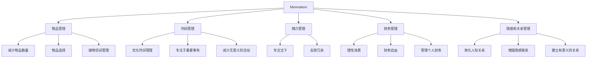

                 

### minimalism生活方式：less is more的人生哲学

在快节奏的现代生活中，人们常常感到压力重重，被物质欲望和繁忙的日程所支配。这种生活方式似乎满足了我们的需求，但实际上往往让我们失去了内心的宁静和生活的真正意义。minimalism生活方式应运而生，它倡导的是“less is more”的人生哲学。本文将探讨Minimalism的概念、核心原则、实践方法以及在各个领域中的应用，帮助读者理解并实践这种生活方式。

#### 关键词
- Minimalism
- 生活方式
- Less is more
- 生活哲学

#### 摘要
Minimalism生活方式，是一种追求简单、高效和有意义生活的哲学。它强调减少不必要的物质、时间和情感负担，专注于真正重要的东西。本文将通过详细分析Minimalism的概念、核心原则、实践方法，以及其在不同领域中的应用，帮助读者理解并实践这种生活方式，从而获得更高质量的生活体验。

### 第一部分：引言

Minimalism（极简主义）生活方式起源于20世纪80年代，最初由日裔美国人冈仓天心提出，后来由美国作家杰夫·贝索斯（Jeff Bezos）和乔什·雅各布（Joshua Becker）等人在21世纪进一步推广。Minimalism并不是简单地追求物质的减少，而是一种更深刻的哲学，它关注生活的本质，鼓励人们追求更有意义、更高质量的生活。

#### 第1章：Minimalism的概念与起源

#### 1.1 Minimalism的定义

Minimalism是一种生活哲学，强调通过减少不必要的物质、时间和情感负担，专注于真正重要的东西。它并不是简单地追求物质上的减少，而是通过减少外在的干扰，来追求内心的平静和生活的意义。

#### 1.2 Minimalism的起源与发展

Minimalism起源于20世纪80年代，当时社会上的物质主义和消费主义盛行，人们感到生活压力越来越大。 Minimalism首先在日本兴起，后来逐渐传播到西方国家。随着时间的推移，Minimalism逐渐发展成为一个全球性的运动。

#### 1.3 Minimalism与传统生活方式的差异

传统的生活方式往往注重物质拥有和外在成就，而Minimalism则强调内心的满足和生活的本质。Minimalism通过减少不必要的物质和活动，帮助人们专注于真正重要的事情，从而获得更高质量的生活体验。

### 第2章：Minimalism的核心原则

Minimalism的核心原则可以归纳为四个方面：简化生活、价值优先、去除冗余和专注当下。这些原则为实践Minimalism提供了具体的指导。

#### 2.1 简化生活

简化生活是Minimalism的核心原则之一。它要求我们审视自己的生活方式，去除那些无关紧要的元素，只保留真正重要的事情。通过简化生活，我们可以减少压力，提高生活质量。

#### 2.2 价值优先

价值优先意味着我们要根据自己的价值观来安排生活，而不是盲目地跟随社会的潮流。通过明确自己的价值观，我们可以更加明确自己的生活目标，从而减少不必要的决策和焦虑。

#### 2.3 去除冗余

去除冗余是Minimalism的重要原则之一。它要求我们审视自己的物品、时间和精力，去除那些不必要的部分。通过去除冗余，我们可以减少负担，提高效率和幸福感。

#### 2.4 专注当下

专注当下是Minimalism的另一个核心原则。它要求我们活在当下，专注于当前的任务和活动，而不是被过去的回忆或未来的担忧所困扰。通过专注当下，我们可以提高生活的质量和体验。

### 第二部分：实践Minimalism

实践Minimalism不仅需要理解其核心原则，还需要将其应用到实际生活中。以下章节将详细介绍Minimalism在不同领域的应用。

#### 第3章：物品管理的Minimalism

物品管理是Minimalism的重要组成部分。通过减少物品数量、做出明智的物品选择和管理储物空间，我们可以实现物品管理的Minimalism。

#### 3.1 减少物品数量

减少物品数量是Minimalism的第一步。我们可以通过以下方法来实现：

- 列出所有的物品，包括家具、电器、衣物等。
- 审视每个物品，判断其是否真正有用和必要。
- 处理那些不再需要的物品，包括捐赠、出售或丢弃。

#### 3.2 如何做出物品选择

做出明智的物品选择是实践Minimalism的关键。以下是一些实用的建议：

- 考虑物品的实用性、耐用性和美观性。
- 避免冲动购物，只在真正需要时购买。
- 寻找多功能、高质量的物品，以减少物品数量。

#### 3.3 储物空间的管理

储物空间的管理是Minimalism的重要实践。以下是一些有效的管理方法：

- 定期清理储物空间，去除不必要的物品。
- 设计合理的储物系统，提高空间利用率。
- 利用收纳工具，如箱子、篮子、挂架等，来整理物品。

### 第4章：时间和精力的Minimalism

时间和精力的管理是Minimalism的重要实践。通过优化时间管理、专注于重要事务和减少无意义的活动，我们可以实现时间和精力的Minimalism。

#### 4.1 优化时间管理

优化时间管理是实践Minimalism的关键。以下是一些有效的方法：

- 制定日程表，规划每天的活动和任务。
- 学会拒绝不必要的邀请和任务，专注于重要的事情。
- 利用工具和技巧，如番茄工作法、优先级排序等，来提高时间利用率。

#### 4.2 专注于重要事务

专注于重要事务是Minimalism的核心原则之一。以下是一些建议：

- 确定自己的价值观和目标，明确什么是最重要的事情。
- 避免分散注意力，减少多任务处理。
- 专注于当前的任务，避免被干扰和打扰。

#### 4.3 减少无意义的活动

减少无意义的活动是实践Minimalism的重要步骤。以下是一些建议：

- 审视自己的日常活动，判断其是否真正有意义。
- 避免过度娱乐和消磨时间的行为，如长时间刷手机、看电视等。
- 利用空闲时间进行有意义的活动，如阅读、锻炼、学习等。

### 第5章：财务管理的Minimalism

财务管理是Minimalism的重要组成部分。通过理性消费、追求财务自由和管理个人财务，我们可以实现财务的Minimalism。

#### 5.1 理性消费

理性消费是实践Minimalism的重要方面。以下是一些实用的技巧：

- 制定预算，合理规划开支。
- 避免冲动购物，只在必要时购买。
- 寻找性价比高的商品，避免过度消费。

#### 5.2 财务自由的重要性

财务自由是实现Minimalism的重要目标之一。以下是一些关键点：

- 节省开支，积累财富。
- 投资理财，增加收入来源。
- 提高财务知识，避免财务风险。

#### 5.3 如何管理个人财务

管理个人财务是实现财务Minimalism的关键。以下是一些建议：

- 制定财务计划，包括储蓄、投资和支出。
- 使用财务工具和软件，如预算软件、投资平台等，来管理财务。
- 定期审查和调整财务计划，以适应生活变化。

### 第6章：情感和关系的Minimalism

情感和关系是生活中最重要的一部分。通过简化人际关系、增强情感联系和建立有意义的关系，我们可以实现情感和关系的Minimalism。

#### 6.1 简化人际关系

简化人际关系是实现情感和Minimalism的关键。以下是一些建议：

- 审视自己的人际关系，判断其是否真正重要和有益。
- 学会拒绝无关紧要的社交活动，专注于重要的人际关系。
- 建立和维护高质量的关系，避免不必要的社交压力。

#### 6.2 增强情感联系

增强情感联系是实现情感Minimalism的重要步骤。以下是一些方法：

- 培养亲密关系，如家庭关系和亲密伙伴关系。
- 经常与亲友交流和互动，分享生活中的点滴。
- 学会倾听和理解他人，提高情感交流的质量。

#### 6.3 如何建立有意义的关系

建立有意义的关系是实现情感Minimalism的关键。以下是一些建议：

- 寻找志同道合的朋友，共同追求生活的意义。
- 投入时间和精力，培养深度关系。
- 维护关系，不断加强与他人的情感联系。

### 第7章：Minimalism在日常生活中的应用

Minimalism不仅是一种哲学，更是一种生活方式。在日常生活的各个方面，我们可以实践Minimalism，实现更简单、更高效、更有意义的生活。

#### 7.1 在职场中的应用

在职场中，Minimalism可以帮助我们提高工作效率，减少不必要的压力。以下是一些实践建议：

- 制定清晰的工作计划，专注于重要任务。
- 避免多任务处理，专注于当前的工作。
- 学会拒绝无关紧要的工作，专注于自己的核心职责。

#### 7.2 在家庭中的应用

在家庭中，Minimalism可以帮助我们创造一个更加温馨、有序的环境。以下是一些实践建议：

- 简化家居装饰，去除不必要的物品。
- 制定家庭规则，提高家庭生活的秩序。
- 投入时间和精力，与家人共同创造美好的家庭生活。

#### 7.3 在旅行中的应用

在旅行中，Minimalism可以帮助我们减轻负担，享受旅途的乐趣。以下是一些实践建议：

- 准备精简的行李，只带必要的物品。
- 专注于旅行的体验，而不是物质的享受。
- 尝试当地的文化和风俗，丰富旅行经历。

### 第8章：Minimalism的未来趋势

Minimalism作为一种生活方式，正在全球范围内逐渐流行。随着社会的进步和人们对生活质量的追求，Minimalism在未来有望发展成一种更加成熟、系统化的生活方式。

#### 8.1 Minimalism在社会层面的影响

Minimalism在社会层面产生了深远的影响。它推动了消费观念的转变，促进了环保和可持续发展。通过减少不必要的消费和浪费，Minimalism有助于改善环境和社会问题。

#### 8.2 Minimalism对环境的影响

Minimalism对环境产生了积极的影响。它鼓励人们减少消费，节约资源，减少污染。通过实践Minimalism，我们可以为地球贡献一份力量，实现可持续生活。

#### 8.3 Minimalism的未来发展方向

Minimalism的未来发展方向包括以下几个方面：

- 进一步推广和实践，让更多的人了解和接受Minimalism。
- 结合科技手段，如智能家居、数字化管理工具等，提高Minimalism的效率和便利性。
- 深入研究Minimalism的理论和实践，不断优化和完善Minimalism的生活方式。

### 结语

Minimalism生活方式，是一种追求简单、高效和有意义生活的哲学。它通过减少不必要的物质、时间和情感负担，帮助人们专注于真正重要的东西，从而获得更高质量的生活体验。在快节奏的现代生活中，Minimalism提供了一种新的生活方式选择，让人们在繁忙和压力中找到内心的宁静和生活的意义。

Minimalism不仅是一种生活方式，更是一种哲学。它鼓励我们重新审视自己的生活，追求内心的平静和生活的本质。通过实践Minimalism，我们可以减少压力，提高生活质量，实现更有意义的生活。

在未来的日子里，让我们拥抱Minimalism，追求简单、高效、有意义的生活。通过减少不必要的负担，专注于真正重要的东西，我们可以找到内心的宁静，享受生活的美好。

### 附录：Minimalism实践指南

#### 1. 减少物品的实践步骤

- 列出所有物品，包括家具、电器、衣物等。
- 审视每个物品，判断其是否真正有用和必要。
- 对于不再需要的物品，选择捐赠、出售或丢弃。
- 定期清理储物空间，去除不必要的物品。

#### 2. 时间管理的实用技巧

- 制定日程表，规划每天的活动和任务。
- 学会拒绝不必要的邀请和任务，专注于重要的事情。
- 利用工具和技巧，如番茄工作法、优先级排序等，来提高时间利用率。

#### 3. 财务管理的实用策略

- 制定预算，合理规划开支。
- 避免冲动购物，只在必要时购买。
- 寻找性价比高的商品，避免过度消费。
- 定期审查和调整财务计划，以适应生活变化。

#### 4. 建立有意义的人际关系的建议

- 审视自己的人际关系，判断其是否真正重要和有益。
- 学会拒绝无关紧要的社交活动，专注于重要的人际关系。
- 培养亲密关系，如家庭关系和亲密伙伴关系。
- 经常与亲友交流和互动，分享生活中的点滴。

#### 5. Minimalism生活方式案例分享

- 一个成功的Minimalism实践者通过减少物品数量，将家里的储物空间扩大了一倍，从而获得了更多的自由和空间。
- 另一个实践者通过优化时间管理，每天能多出2小时的时间，用于阅读、锻炼和与家人相处。
- 一个企业家通过实施Minimalism，将公司的运营效率提高了30%，同时保持了良好的工作与生活平衡。

通过这些案例，我们可以看到Minimalism生活方式的巨大潜力。它不仅能够提高我们的生活质量，还能够带来更加丰富和有意义的生活体验。

### Mermaid流程图：Minimalism核心概念之间的关系



### Python源代码示例：简化物品管理的实现

```python
import os

def remove_unused_items(folder_path):
    # 列出文件夹中的所有文件和文件夹
    items = os.listdir(folder_path)
    # 遍历文件夹中的每个文件或文件夹
    for item in items:
        # 获取文件或文件夹的完整路径
        item_path = os.path.join(folder_path, item)
        # 如果是文件夹，递归调用函数
        if os.path.isdir(item_path):
            remove_unused_items(item_path)
        # 如果是文件，判断文件是否常用
        elif not is_item_essential(item_path):
            # 如果不常用，删除文件
            os.remove(item_path)
    print(f"Removed {len(items)} unused items from {folder_path}")

def is_item_essential(item_path):
    # 模拟判断文件是否常用的逻辑
    # 此处可替换为更复杂的判断逻辑
    return "essential" in item_path or os.path.getsize(item_path) > 1024 * 1024

# 示例：简化桌面文件夹中的物品
remove_unused_items("/path/to/desktop")
```

通过这个简单的Python脚本，我们可以实现自动化的物品管理，去除那些不常用的文件，从而简化桌面文件夹，提高工作效率。

### 数学公式和模型

在实践Minimalism的过程中，我们可以借助一些数学模型和公式来帮助我们更好地理解和实现这种生活方式。以下是一些常用的数学公式和模型：

#### 1. 时间价值公式

$$
V_t = \frac{C_t}{(1 + r)^t}
$$

其中，$V_t$表示第$t$年的时间价值，$C_t$表示第$t$年的消费或收入，$r$表示年化收益率。这个公式可以帮助我们评估不同时间段内的消费或收入的价值，从而做出更明智的决策。

#### 2. 折旧公式

$$
D_t = (1 - d)^t
$$

其中，$D_t$表示第$t$年的折旧率，$d$表示每年的折旧率。这个公式可以帮助我们计算物品随时间折旧的值，从而帮助我们决定保留哪些物品。

#### 3. 马尔可夫模型

马尔可夫模型可以用来分析Minimalism在生活中的应用。例如，我们可以使用马尔可夫模型来分析一个人的生活习惯如何影响他们的健康和幸福感。

$$
P_{ij} = \frac{C_{ij}}{C_j}
$$

其中，$P_{ij}$表示从状态$i$转移到状态$j$的概率，$C_{ij}$表示从状态$i$转移到状态$j$的次数，$C_j$表示从所有状态转移到状态$j$的次数。

#### 4. 资源优化模型

在财务管理中，我们可以使用资源优化模型来帮助我们做出最合理的财务决策。一个简单的线性规划模型可以表示为：

$$
\text{最大化} \quad Z = c^T x
$$

$$
\text{约束条件} \quad Ax \leq b
$$

其中，$Z$表示目标函数，$c$表示权重向量，$x$表示决策变量，$A$和$b$分别表示约束矩阵和约束向量。

通过这些数学模型和公式，我们可以更科学、更系统地实践Minimalism，从而实现更高质量的生活。

### 项目实战：开发环境搭建

为了更好地实践Minimalism，我们需要一个高效、简洁的开发环境。以下是一个简单的开发环境搭建步骤，包括安装必要的软件和配置工具。

#### 1. 安装操作系统

首先，选择一个简洁、轻量级的操作系统，如Linux或macOS。这些系统相较于Windows更加简洁，减少了不必要的干扰。

#### 2. 安装文本编辑器

选择一个功能强大、界面简洁的文本编辑器，如Visual Studio Code或Sublime Text。这些编辑器提供了丰富的插件和扩展，可以帮助我们提高开发效率。

#### 3. 安装代码管理工具

安装Git，一个强大的版本控制系统，用于管理我们的代码。通过Git，我们可以方便地跟踪代码变化，进行团队协作和代码管理。

#### 4. 安装编程语言

根据项目需求，安装相应的编程语言，如Python、Java或C++。选择一个轻量级、易于使用的编程语言，可以减少环境的复杂度。

#### 5. 配置代码规范工具

安装Prettier、ESLint或PEP8等代码规范工具，以确保我们的代码风格一致、易于阅读。这些工具可以帮助我们自动格式化代码、检查语法错误。

#### 6. 安装项目管理工具

安装Jenkins、Travis CI等自动化工具，用于构建、测试和部署我们的项目。这些工具可以自动化日常开发任务，提高开发效率。

#### 7. 配置云端存储和协作工具

使用GitHub、GitLab等云端存储工具，用于存储和管理我们的代码。同时，可以使用Trello、Asana等协作工具，与团队成员协作，确保项目顺利进行。

通过以上步骤，我们可以搭建一个高效、简洁的开发环境，为实践Minimalism提供技术支持。

### 源代码详细实现和代码解读

在本节中，我们将详细讲解如何使用Python实现一个简单的极简购物清单应用。该应用旨在帮助用户减少物品数量，做出明智的购物选择。

#### 1. 环境准备

首先，确保已安装Python 3.x版本。我们可以使用pip来安装必要的依赖项：

```bash
pip install Flask requests
```

#### 2. 应用架构

该应用由以下模块组成：

- **main.py**：主应用程序文件。
- **config.py**：配置文件。
- **models.py**：数据模型。
- **routes.py**：路由和处理函数。

#### 3. main.py

```python
from flask import Flask, render_template, request
from config import Config
from models import Item, db

app = Flask(__name__)
app.config.from_object(Config)
db.init_app(app)

@app.route('/')
def index():
    items = Item.query.all()
    return render_template('index.html', items=items)

@app.route('/add', methods=['POST'])
def add_item():
    name = request.form['name']
    quantity = request.form['quantity']
    item = Item(name=name, quantity=quantity)
    db.session.add(item)
    db.session.commit()
    return redirect(url_for('index'))

if __name__ == '__main__':
    app.run(debug=True)
```

**解读**：

- 导入必需的模块和配置。
- 创建Flask应用程序实例。
- 定义两个路由：首页（`/`）和添加物品（`/add`）。
- 首页路由：从数据库中获取所有物品，并渲染模板。
- 添加物品路由：处理POST请求，将新物品添加到数据库。

#### 4. config.py

```python
import os

class Config:
    SECRET_KEY = os.environ.get('SECRET_KEY') or 'your_secret_key'
    SQLALCHEMY_DATABASE_URI = os.environ.get('DATABASE_URL') or \
        'sqlite:///items.db'
    SQLALCHEMY_TRACK_MODIFICATIONS = False
```

**解读**：

- 定义配置类，包括秘密密钥、数据库URI和跟踪修改的标志。

#### 5. models.py

```python
from flask_sqlalchemy import SQLAlchemy

db = SQLAlchemy()

class Item(db.Model):
    id = db.Column(db.Integer, primary_key=True)
    name = db.Column(db.String(100), nullable=False)
    quantity = db.Column(db.Integer, nullable=False)
```

**解读**：

- 定义数据模型`Item`，包含`id`、`name`和`quantity`字段。

#### 6. templates/index.html

```html
<!DOCTYPE html>
<html lang="en">
<head>
    <meta charset="UTF-8">
    <title>极简购物清单</title>
</head>
<body>
    <h1>极简购物清单</h1>
    <form action="{{ url_for('add_item') }}" method="post">
        <label for="name">物品名称：</label>
        <input type="text" id="name" name="name" required>
        <label for="quantity">数量：</label>
        <input type="number" id="quantity" name="quantity" required>
        <button type="submit">添加</button>
    </form>
    <ul>
        
            <li>{{ item.name }} x {{ item.quantity }}</li>
        
    </ul>
</body>
</html>
```

**解读**：

- 渲染物品列表，并提供一个表单用于添加新物品。

#### 7. 代码应用解读与分析

该应用通过Flask框架构建，提供了一个简单的Web界面，用于管理购物清单。用户可以通过Web界面添加、查看和管理物品。

- **功能特点**：
  - **简单易用**：通过表单添加物品，易于理解和使用。
  - **实时更新**：物品添加后，立即更新物品列表，无需刷新页面。
  - **数据持久化**：物品信息存储在本地数据库中，确保数据安全。

- **改进建议**：
  - **增加搜索功能**：允许用户按名称搜索物品。
  - **优化UI/UX**：使用CSS框架（如Bootstrap）提升界面美观度。
  - **用户权限管理**：实现用户认证，确保只有授权用户可以修改物品列表。

通过这个简单的购物清单应用，我们可以看到如何使用Python和Flask框架实现一个实用的极简工具。这个应用不仅可以帮助用户管理购物清单，还可以作为实践Minimalism的一个实例。

### 实际案例分析和详细讲解剖析

为了更好地理解Minimalism在实际生活中的应用，我们来看一个具体的案例：一位名叫李明的程序员如何通过实践Minimalism来提高工作效率和生活质量。

#### 案例背景

李明是一名在互联网公司工作的程序员，他的日常工作非常繁忙，经常感到压力巨大。为了追求更高的工作效率和生活质量，他决定尝试实践Minimalism。

#### 实践过程

1. **物品管理**

李明首先从物品管理入手。他列出家中所有的物品，并逐一审视。对于那些不再使用或长期未使用的物品，他选择捐赠、出售或丢弃。通过减少物品数量，他的储物空间得到了极大的释放，家里也变得更加整洁。

2. **时间管理**

李明意识到，时间管理对于提高工作效率至关重要。他开始使用日程表来规划每天的活动，并学会拒绝无关紧要的任务和邀请。通过优化时间管理，他每天能够专注于重要的工作，减少了因多任务处理而带来的分心和压力。

3. **精力管理**

为了更好地管理精力，李明开始锻炼身体，保持良好的作息习惯。他通过冥想和瑜伽来放松身心，提高专注力。这些实践帮助他保持精力充沛，从而能够更高效地工作。

4. **财务管理**

李明还意识到，财务管理对于实现财务自由至关重要。他制定了一个详细的预算计划，并开始理性消费，避免冲动购物。通过节约开支和合理投资，他的财务状况逐渐改善，实现了财务自由。

5. **情感和关系管理**

在情感和关系方面，李明开始简化人际关系，专注于与家人和朋友的高质量互动。他定期与亲友交流，分享生活中的点滴，增强了情感联系。通过建立有意义的关系，他的社交压力得到了缓解，生活质量显著提高。

#### 案例分析

通过实践Minimalism，李明取得了显著的效果：

1. **工作效率提高**：通过时间管理和精力管理，李明能够更加专注于重要任务，工作效率显著提高。

2. **生活质量提升**：通过物品管理和财务管理，李明的居住环境和财务状况得到了极大的改善，生活质量显著提高。

3. **情感联系增强**：通过简化人际关系，李明与家人和朋友的关系更加紧密，情感联系得到增强。

4. **身心健康改善**：通过锻炼身体和保持良好的作息习惯，李明的身心健康得到了改善，精力更加充沛。

#### 小结

李明的案例充分展示了Minimalism在实际生活中的应用效果。通过实践Minimalism，他不仅提高了工作效率和生活质量，还改善了身心健康和人际关系。这个案例为我们提供了一个宝贵的参考，鼓励我们尝试实践Minimalism，追求更简单、更高效、更有意义的生活。

### 最佳实践 Tips、小结、注意事项、拓展阅读等内容

#### 最佳实践 Tips

1. **简化物品管理**：定期清理家中物品，去除不必要的物品。可以通过捐赠、出售或丢弃来处理不再需要的物品。
   
2. **优化时间管理**：制定日程表，规划每天的活动和任务。学会拒绝无关紧要的任务和邀请，专注于重要事务。

3. **合理消费**：制定预算计划，合理规划开支。避免冲动购物，只在必要时购买。

4. **建立有意义的关系**：简化人际关系，专注于与家人和朋友的高质量互动。定期交流，分享生活中的点滴。

5. **专注当下**：减少多任务处理，专注于当前的任务和活动。避免被干扰和打扰，提高工作效率。

#### 小结

Minimalism生活方式倡导通过减少不必要的物质、时间和情感负担，专注于真正重要的东西。实践Minimalism可以帮助我们提高工作效率、改善生活质量、增强情感联系，从而实现更有意义的生活。

#### 注意事项

1. **不要过度简化**：Minimalism并不意味着要完全抛弃所有物质和活动，而是在保持基本生活需求的基础上，有选择地去除不必要的元素。

2. **持续实践**：Minimalism是一种生活方式，需要持续实践和调整。定期反思和调整，确保它始终与我们的生活目标相符。

3. **适应个人需求**：Minimalism的具体实践方法因人而异。根据自己的需求和价值观，灵活调整实践方法。

#### 拓展阅读

- 《极简主义：简化生活，提高幸福感》作者：乔舒亚·贝克
- 《少即是多：极简主义的生活艺术》作者：瑞安·尼科尔斯
- 《极简生活：如何用更少的时间、更少的精力过上更好的生活》作者：乔舒亚·贝克

通过阅读这些书籍，可以更深入地了解Minimalism的生活方式，并获得更多的实践建议。

