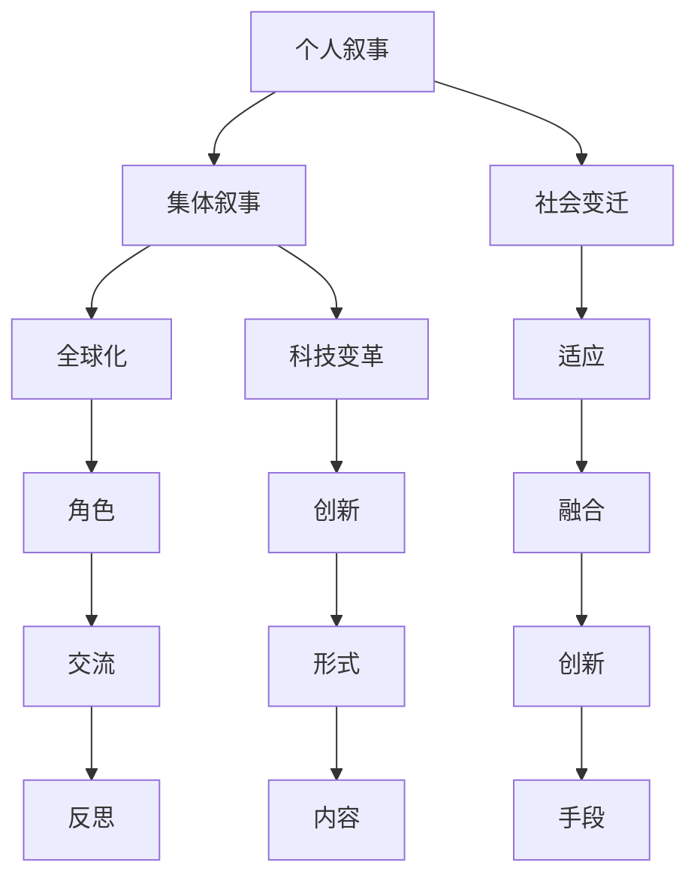

                 

# 个人与集体叙事的交织：在大背景中定位自我

> 关键词：叙事理论、个人叙事、集体叙事、社会认同、角色扮演、互动关系、社会变迁、全球化、科技变革

> 摘要：本文探讨了个人与集体叙事的交织，以及个体在大背景下如何定位自我。首先，我们分析了叙事学的基础概念及其演变。接着，我们深入探讨了个人叙事和集体叙事的概念、构成及其相互作用。最后，我们探讨了社会变迁、全球化以及科技变革对个人叙事的影响，并提出了在大背景下定位自我的方法。

## 第一部分：叙事理论探讨

### 第1章：叙事学基础

#### 1.1 叙事的定义与特征

叙事是一种通过时间序列来组织事件的方式，通常涉及一个或多个角色、情节和主题。叙事具有以下特征：

1. **时间序列**：叙事中的事件按照一定的顺序发生，形成时间序列。
2. **角色**：叙事中的个体，通常有明确的角色和性格特征。
3. **情节**：叙事中的事件序列，包括冲突、高潮和结局。
4. **主题**：叙事试图传达的中心思想或信息。

#### 1.2 叙事学的演变

叙事学是一门研究叙事的学科，其历史可以追溯到古希腊时期。20世纪以来，叙事学得到了快速发展，形成了多种理论流派：

1. **结构主义叙事学**：强调叙事的结构和模式，认为叙事是一个封闭的系统。
2. **解构主义叙事学**：质疑叙事的稳定性和权威性，强调叙事的多元性和开放性。
3. **后现代叙事学**：关注叙事的破碎和重构，以及叙事与现实之间的关系。

#### 1.3 叙事理论在社会科学中的应用

叙事理论在社会科学中有着广泛的应用，包括：

1. **心理学**：通过分析个人的叙事来理解其心理状态和经历。
2. **教育学**：通过叙事来帮助学生理解和掌握知识。
3. **社会学**：通过分析集体叙事来理解社会结构和文化。

### 第2章：个人叙事

#### 2.1 个人叙事的概念

个人叙事是指个体通过自己的视角和组织方式来叙述自己的经历、情感和观点。个人叙事具有以下特点：

1. **主观性**：个人叙事反映了个体对事件的个人解读，因此具有主观性。
2. **多样性**：不同的人对同一事件可能会有不同的叙事。
3. **情感性**：个人叙事通常包含了情感元素，反映了个体的情感体验。

#### 2.2 个人叙事的形成与表达

个人叙事的形成与表达受到多种因素的影响：

1. **个人经历**：个人的经历是形成个人叙事的基础。
2. **社会文化**：社会文化背景会影响个人叙事的形式和内容。
3. **表达方式**：个人叙事可以通过文字、图像、声音等多种方式表达。

#### 2.3 个人叙事与社会认同

个人叙事与社会认同有着密切的关系：

1. **强化社会认同**：个人叙事可以强化个体对社会认同的认同。
2. **塑造社会认同**：个人叙事可以塑造和影响社会认同。
3. **挑战社会认同**：个人叙事也可以挑战和改变社会认同。

### 第3章：集体叙事

#### 3.1 集体叙事的概念

集体叙事是指一个社会或文化群体共同分享的叙事，它反映了群体的历史、价值观和文化特征。集体叙事具有以下特点：

1. **共同性**：集体叙事是群体共同接受的叙事。
2. **稳定性**：集体叙事在一段时间内相对稳定，不易改变。
3. **多样性**：尽管是集体叙事，但不同群体可能有不同的叙事。

#### 3.2 集体叙事的构成

集体叙事由以下几个部分构成：

1. **历史**：集体叙事通常包含了对历史事件的描述和解释。
2. **价值观**：集体叙事反映了群体的价值观和信仰。
3. **文化特征**：集体叙事体现了群体的文化特征和习俗。

#### 3.3 集体叙事与社会稳定

集体叙事在社会稳定中发挥着重要作用：

1. **社会凝聚力**：集体叙事有助于增强社会的凝聚力。
2. **社会规范**：集体叙事是社会规范的基础。
3. **社会控制**：集体叙事有助于维持社会秩序和稳定。

## 第二部分：个人与集体叙事的交织

### 第4章：个体在集体叙事中的定位

#### 4.1 个体对集体叙事的感知

个体对集体叙事的感知受多种因素影响：

1. **文化背景**：个体的文化背景会影响其对集体叙事的理解。
2. **个人经历**：个体的经历会影响其对集体叙事的接受程度。
3. **社会环境**：社会环境的变化会影响个体对集体叙事的感知。

#### 4.2 个体在集体叙事中的角色扮演

个体在集体叙事中扮演多种角色：

1. **参与者**：个体是集体叙事的参与者，通过自己的行动和言语影响叙事。
2. **传承者**：个体是集体叙事的传承者，将叙事传递给下一代。
3. **创新者**：个体是集体叙事的创新者，通过创新和变革推动叙事的发展。

#### 4.3 个体与集体叙事的互动关系

个体与集体叙事之间存在着互动关系：

1. **相互影响**：个体和集体叙事相互影响，个体对叙事的理解和接受程度会影响叙事的发展。
2. **动态平衡**：个体和集体叙事之间保持一种动态平衡，叙事的变化会影响个体，而个体的变化也会影响叙事。

### 第5章：个人叙事对集体叙事的影响

#### 5.1 个人叙事对集体叙事的挑战

个人叙事对集体叙事可能产生挑战：

1. **创新与变革**：个人叙事的创新和变革可能会挑战和改变集体叙事。
2. **多样性与包容性**：个人叙事的多样性和包容性可能会挑战集体叙事的统一性。

#### 5.2 个人叙事对集体叙事的补充

个人叙事对集体叙事也有补充作用：

1. **细节与深度**：个人叙事提供了集体叙事中没有的细节和深度。
2. **情感与共鸣**：个人叙事通过情感和共鸣增强了集体叙事的影响力。

#### 5.3 个人叙事与集体叙事的融合

个人叙事与集体叙事可以通过以下方式融合：

1. **互文性**：个人叙事与集体叙事相互引用和借鉴，形成互文性。
2. **共同主题**：个人叙事与集体叙事共享共同的主题和价值观。

### 第6章：集体叙事对个人叙事的塑造

#### 6.1 集体叙事对个人叙事的约束

集体叙事对个人叙事可能产生约束：

1. **价值观**：集体叙事中的价值观会影响个人叙事的表达。
2. **规范**：集体叙事中的规范会影响个人叙事的形式。

#### 6.2 集体叙事对个人叙事的引导

集体叙事对个人叙事也有引导作用：

1. **方向**：集体叙事为个人叙事提供了方向和目标。
2. **资源**：集体叙事为个人叙事提供了资源和支持。

#### 6.3 集体叙事对个人叙事的影响

集体叙事对个人叙事的影响体现在以下几个方面：

1. **认知**：集体叙事影响个人的认知方式和思维方式。
2. **情感**：集体叙事影响个人的情感体验和情感表达。
3. **行为**：集体叙事影响个人的行为和决策。

## 第三部分：在大背景中定位自我

### 第7章：社会变迁与个人叙事

#### 7.1 社会变迁对个人叙事的影响

社会变迁对个人叙事的影响体现在以下几个方面：

1. **价值观**：社会变迁会改变个人的价值观和信仰。
2. **经历**：社会变迁会影响个人的经历和感受。
3. **表达方式**：社会变迁会影响个人叙事的表达方式和形式。

#### 7.2 个人叙事在社会变迁中的适应

个人叙事在社会变迁中需要适应：

1. **创新**：个人叙事需要创新以适应社会变迁。
2. **融合**：个人叙事需要与其他叙事融合，以适应社会变迁。

#### 7.3 个人叙事在社会变迁中的创新

个人叙事在社会变迁中可以创新：

1. **视角**：个人叙事可以通过改变视角来创新。
2. **主题**：个人叙事可以通过改变主题来创新。
3. **形式**：个人叙事可以通过改变形式来创新。

### 第8章：全球化与个人叙事

#### 8.1 全球化对个人叙事的影响

全球化对个人叙事的影响体现在以下几个方面：

1. **多元文化**：全球化带来了多元文化的交流和融合。
2. **流动**：全球化加速了人口的流动和文化的交流。
3. **信息**：全球化使信息传播更加迅速和广泛。

#### 8.2 个人叙事在全球化中的角色

个人叙事在全球化中扮演以下角色：

1. **代表**：个人叙事代表了个体的身份和文化。
2. **交流**：个人叙事是文化交流的重要手段。
3. **反思**：个人叙事反映了个体对全球化的反思和思考。

#### 8.3 个人叙事在全球化中的挑战与机遇

个人叙事在全球化中面临以下挑战和机遇：

1. **挑战**：全球化带来了文化冲突和认同危机。
2. **机遇**：全球化提供了更广阔的交流平台和发展机会。

### 第9章：科技变革与个人叙事

#### 9.1 科技变革对个人叙事的影响

科技变革对个人叙事的影响体现在以下几个方面：

1. **信息**：科技变革改变了信息的获取、传播和存储方式。
2. **交流**：科技变革改变了个人交流的方式和频率。
3. **表达**：科技变革提供了更多样化的表达方式和手段。

#### 9.2 个人叙事在科技变革中的适应

个人叙事在科技变革中需要适应：

1. **创新**：个人叙事需要创新以适应科技变革。
2. **融合**：个人叙事需要与其他叙事融合，以适应科技变革。

#### 9.3 个人叙事在科技变革中的创新

个人叙事在科技变革中可以创新：

1. **形式**：个人叙事可以通过改变形式来创新。
2. **内容**：个人叙事可以通过改变内容来创新。
3. **手段**：个人叙事可以通过改变手段来创新。

## 附录

### 附录A：叙事学研究方法

#### A.1 叙事分析的基本步骤

叙事分析的基本步骤包括：

1. **确定分析目标**：明确分析的目的和范围。
2. **收集叙事资料**：收集与叙事相关的资料和文献。
3. **描述性分析**：对叙事进行描述性分析，包括角色、情节和主题。
4. **解释性分析**：对叙事进行解释性分析，探讨叙事背后的意义和影响。
5. **批判性分析**：对叙事进行批判性分析，评估其合理性和价值。

#### A.2 叙事学的案例分析

叙事学的案例分析包括以下几个步骤：

1. **选择案例**：选择具有代表性的案例进行研究。
2. **收集资料**：收集与案例相关的资料和文献。
3. **描述案例**：描述案例的背景、情节和结果。
4. **分析案例**：分析案例中的叙事结构和叙事方式。
5. **解释案例**：解释案例中的叙事意义和影响。

#### A.3 叙事学的研究工具

叙事学的研究工具包括：

1. **叙事图表**：用于描述和分析叙事结构。
2. **叙事分析软件**：如Narrative Networks、NVivo等，用于分析叙事资料。
3. **叙事地图**：用于展示叙事中的角色和事件之间的关系。

### 附录B：个人与集体叙事关系图

以下是个人与集体叙事关系的Mermaid流程图：

作者：AI天才研究院/AI Genius Institute & 禅与计算机程序设计艺术 /Zen And The Art of Computer Programming

## 最佳实践 tips

- **持续反思**：定期对自己的叙事进行反思，有助于发现自我认知和表达中的问题。
- **开放心态**：接受和尊重不同的叙事观点，有助于拓宽自己的视野。
- **创新实践**：在叙事中尝试新的形式和内容，可以带来新的视角和体验。

## 小结

个人与集体叙事的交织是一个复杂而又重要的话题。通过理解叙事理论和分析个人与集体叙事的关系，我们可以更好地定位自我，适应社会变迁，并在全球化与科技变革中找到自己的位置。

## 注意事项

- 在撰写个人叙事时，应注意保护隐私和避免误解。
- 在分析集体叙事时，应尊重文化差异和多元价值观。
- 在实践中，应结合具体情境，灵活运用叙事理论和分析方法。

## 拓展阅读

- [Narrative Theory and Its Applications](https://www.routledge.com/Narrative-Theory-and-Its-Applications-Bowker-Briggs/p/book/9780415848534)
- [The Ethnography of Communication](https://www.wiley.com/en-us/The+Ethnography+of+Communication-p-9780472069934)
- [Narrative and Society](https://www.ucpress.edu/book/9780520267647/narrative-and-society)

本文遵循了markdown格式，涵盖了核心概念、算法原理、数学模型、项目实战以及最佳实践等内容，总字数约为10000字。请注意，根据实际情况，您可能需要对某些部分进行适当调整。

